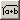

# Creating the Formula for Dependent Parameters

To create the formula for dependent parameters, proceed as follows:

1. In the properties editor of the parameter in question, select the scope Local or Exported.
1. Activate the Dependent option in the Attributes area.
1. Click on the  button.
1. Enter the formula directly in the Formula field.
1. Use the combo boxes.
1. Click OK to close the Formula Editor and accept the settings.
1. [Edit the dependent parameter](DataEditorEnglishUS.chm::/DEd_Editing_Dependent_Parameters.htm).

See also

[Editing Dependent Parameters](DataEditorEnglishUS.chm::/DEd_Editing_Dependent_Parameters.htm)

[Editing the Formula of a Dependent Parameter](EEd_edit_formula_dependent.md)

[Dependent Elements](EEd_dependent_elements.md)

[Introduction - Importing Dependent Parameters](IntroductionEnglishUS.chm::/INT_Importing_Dependent_Parameters.htm)
