# Merged CHM Content

## Overview

_Source: `markdown/EE_Overview.md`_

# Experimentation - Overview

ASCET supports a highly modular approach to software development. The individual components of a project can be developed independently of each other, and combined after they have been tested thoroughly. ASCET provides the experimentation environment for testing components and projects.

Projects can be tested in offline and online experiment. If the project is connected to any external hardware, that connection can only be tested in an online experiment.

Online experiments are only possible when ASCET-RP is installed. Therefore, online experimentation is described in detail in the ASCET-RP User’s guide.

With the experimentation environment it is possible to stimulate (in an offline experiment) the processes and methods, as well as the elements of a component or project. The data values of the elements can be measured in various visualizations, written to a file, and calibrated interactively. The main elements of the experiment window are shown in the following illustration (showing an offline experiment):

The elements of the component are listed in the Outline tab to the left of the component display. The component display shows the block diagram, if the component was specified as a block diagram. For components specified in C code or ESDL, the code is shown. For projects, the project editor tabs are shown.

In addition to the elements, the Outline tab lists all diagrams of the current component. The Measurement Window combo box is underneath the button bar. It lists all measurement windows available. To the left of the Measurement Window combo box is the Calibration Window combo box, which lists all available calibration windows. The title bar shows the name of the current component or project and the current target.

See also

[Opening and Setting up the Experimentation Environment](markdown/opening_settingup_experi_environ.md)

[The Event Generator](markdown/event_generator.md)

[The Data Generator](markdown/data_generator.md)

[The Measurement System](markdown/measurement_system.md)

[The Calibration System](markdown/calibration_system.md)

[Running Offline Experiments](markdown/EE_running_offline_experiments.md)

[Loading and Saving Environments](markdown/loading_saving_experi.md)

[The Data Logger](markdown/data_logger.md)

[Block Diagram Navigation](markdown/EE_block_diagram_navigation.md)

[Data Manipulation](markdown/EE_data_manipulation.md)

[The Calibration System](markdown/calibration_system.md)

[Description of Measurement Windows Menu Options](markdown/EE_measurement_window_menu_option.md)

---

## Opening and Setting up the Experimentation Environment

_Source: `markdown/opening_settingup_experi_environ.md`_

# Opening and Setting up the Experimentation Environment

You can start the experimentation environment for a component or project either from within the respective component editor or the project editor.

Setting up an offline experiment consists of four steps:

1. Starting the experimentation environment from the Component Manager or the respective component editor. The experimentation environment works the same for all types of component.
1. Setting up the event generator. The event generator determines which methods or processes are triggered in which mode. When a project is experimented with offline, the tasks are stimulated, rather than the methods or processes.
1. Setting up the data generator. Here some elements of the component are stimulated with a configurable flow of data.
1. Setting up the measurement and calibration windows. The values of all elements can be displayed in a variety of forms, e.g. numerically or in an oscilloscope.

See also

[Opening the Experimentation Environment for an Offline Experiment](markdown/open_experi_environ_offline.md)

[Defining Global Elements in the Default Project](markdown/define_global_elements_default.md)

---

## The Event Generator

_Source: `markdown/event_generator.md`_

# The Event Generator

In an online experiment the various tasks and processes of a project are scheduled by the real-time operating system. During offline experiments the scheduling is simulated by the event generator. The event generator determines which methods or processes of the component under experimentation are activated in which order and in which mode. An event has to be defined for each method or process that is to be activated.

Methods or processes for which no event has been enabled are not activated and therefore will have no influence on the experiment.

Methods with composite arguments, i.e. array, matrix or component arguments, do not appear in the event generator. No event can be created for them.

In addition to the events for the methods and processes, a generateData event is always created by default. This event triggers the generation of data that have been defined in the data generator. If your experiment does not require any data to be generated, you can leave this event disabled, otherwise it must always be enabled.

See also

[Setting up the Event Generator](markdown/EE_setup_eventGenerator.md)

[Setting up an Event](markdown/setup_event.md)

[Setting up an Event Directly](markdown/setup_event_directly.md)

---

## The Data Generator

_Source: `markdown/data_generator.md`_

# The Data Generator

In an offline experiment, the data generator provides the stimuli for the elements of the component being experimented with. Usually the elements that are stimulated are the interface elements of the component, but any element can be stimulated with the data generator. The data generator provides a number of different stimulus modes, such as sine waves, pulses, etc.

In offline experiments, you often stimulate variables and parameters that use actual model values when the experiment runs in online mode. You may need to adjust your experiment settings accordingly.

See also

[Setting up the Data Generator](markdown/setup_data_generator.md)

[Setting up a Channel in the Data Generator](markdown/setup_channel_data_generator.md)

[Setting up a Stimulation Mode](markdown/setup_stimulation_mode.md)

[Deleting Data Generator Channels](markdown/delete_channels.md)

[Defining a Signal](markdown/EE_define_signal.md)

[Defining Data Generator Channels as Signal Channels](markdown/define_data_generator_channels.md)

[Removing a Signal](markdown/remove_signal.md)

[Assigning Channels with Identical Names](markdown/assign_channels_identical_names.md)

[Interpolating the Signal](markdown/interpolate_signal.md)

[Selecting Signal Repetition](markdown/select_signal_repitition.md)

[Setting up the Automatic Stop](markdown/setup_automatic_stop.md)

---

## The Measurement System

_Source: `markdown/measurement_system.md`_

# The Measurement System

The measurement system offers a variety of ways of displaying the values of elements:

- [Oscilloscope](markdown/oscilloscope.md)
- [Numerical Display](markdown/numerical_display.md)
- [Horizontal and Vertical Bar Display](markdown/horizontal_vertical_bar_display.md)
- [Bit Display](markdown/bit_display.md)
- [Recorder](markdown/recorder.md)

The measurement windows can display measurements of the values for any element during an experiment in ASCET. All measurement windows are opened by assigning elements to them from the experimentation environment; see [Assigning an Element to a New Measurement Window](markdown/assign_element_measurement.md). A measurement channel is created for each measured element, and it is also possible to create several measurement channels for one element, if it is displayed in two different measurement windows. It is also possible to display measurement data without saving it, to display it and simultaneously start and stop recording or to record data without previously displaying it.

Each measurement window has to be set up with the values it is to show. The displays offer a variety of customizing options which can be adjusted during setup of the experiment, but also while it is running. If a calculation with real values results in a non-regular value of Inf or NaN (e.g. division by a very small number, dividing 0 by 0, etc.), that non-regular value is displayed in the numerical or bar display and (for block diagrams) in element monitors. In addition, an error message is displayed in the ASCET monitor window.

Offline experimentation is not real-time, whereas online experimentation always is.

See also

[Assigning an Element to a New Measurement Window](markdown/assign_element_measurement.md)

[Assigning an Element to an Existing Measurement Window](markdown/assign_element_existing_measu.md)

[Monitor](markdown/EE_monitor.md)

[Working with Measurement Windows](markdown/working_measur_win.md)

[Closing all Measurement Windows](markdown/close_all_measure_window.md)

[Oscilloscope](markdown/oscilloscope.md)

[Numerical Display](markdown/numerical_display.md)

[Horizontal and Vertical Bar Display](markdown/horizontal_vertical_bar_display.md)

[Bit Display](markdown/bit_display.md)

[Recorder](markdown/recorder.md)

---

## Working with Measurement Windows

_Source: `markdown/working_measur_win.md`_

# Working with Measurement Windows

Every measurement window can display the data from several measurement channels, and it is possible to copy and move measurement channels between windows. If a channel is moved, it is deleted from one window and added to another. If a channel is copied, a new measurement channel for the same element is created in a new window.

See also

[Copying Channels between Measurement Windows](markdown/copy_channels_measur_win.md)

[Moving Channels between Measurement Windows](markdown/move_channels_measur_win.md)

[Deleting Channels from Measurement Windows](markdown/delete_channes_measur_win.md)

[Exchanging Attributes between Measurement Windows](markdown/exchange_attributes_measur_win.md)

[Changing the Display of a Measurement Window](markdown/change_display_measur_win.md)

[Changing a Measurement Window Title](markdown/change_measur_win_title.md)

[Displaying Information about Variables](markdown/EE_display_informatiion_variables.md)

---

## Oscilloscope

_Source: `markdown/oscilloscope.md`_

# Oscilloscope

The oscilloscope is not available for back-animation experiments.

The oscilloscope provides a set of highly flexible display options, which are similar to those of a real oscilloscope. It is often a good idea to open several oscilloscope windows at the same time, as too many channels can clutter up the display.

When you use the oscilloscope, you usually start by setting up the display options, i.e. define the way the various values are shown in the window. During the experiment you can perform various operations on the data displayed, e.g. store it, analyze it, define triggers etc.

The Signals pane shows the curves for the numerical values being measured. Underneath is the Bit Channels display area which shows the logical values being measured. To the right of the Signals pane is the Measure Channels field, where the names of the channels are displayed, together with various user-definable pieces of information about them. The following illustration shows the oscilloscope in the offline experiment environment.

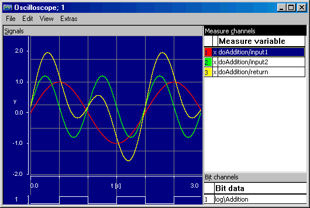

See also

[Setting Up and Using the Oscilloscope](markdown/EE_SetupUse_oscilloscope.md)

---

## Numerical Display

_Source: `markdown/numerical_display.md`_

# Numerical Display

The numerical display shows the values of the measurement channels it is launched for, in either decimal, binary or hexadecimal representation.

See also

[Setting up a Numerical Display](markdown/setup_numerical_display.md)

[Changing the Display Options for a Numerical Display](markdown/change_display_ooptions_numerical.md)

---

## Horizontal and Vertical Bar Display

_Source: `markdown/horizontal_vertical_bar_display.md`_

# Horizontal and Vertical Bar Display

The bar display represents measured data as colored bars. You can define the upper and lower limits of the display as you wish. If the measured value falls below the lower limit specified, the display remains blank. The measured value is also displayed numerically in the middle below the bar. The vertical bar display can only be selected in the offline experimentation environment.

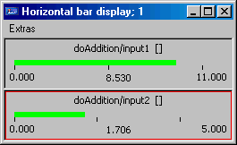 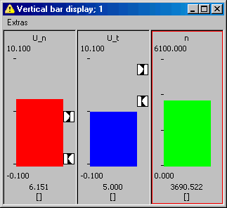

See also

[Setting up the Bar Display](markdown/setup_bar_display.md)

---

## Bit Display

_Source: `markdown/bit_display.md`_

# Bit Display

The bit display represents measured values as a bit array. It is especially useful for representing binary channels as well as for a quick reading of dual digits when measurement is paused.

The bit display can show values of up to 4 bytes. When you try to display a larger value, the following error message occurs:

The variable <variable name> cannot be displayed in the bit display, because it can only hold variables with a size of 4 bytes maximum.

The bit display cannot be set up. Its width is determined from the largest value assigned to the bit display.

You can [copy](markdown/copy_channels_measur_win.md), [move](markdown/move_channels_measur_win.md) and [delete](markdown/delete_channes_measur_win.md) channels, [exchange attributes](markdown/exchange_attributes_measur_win.md) with other measurement windows, [change the window title](markdown/change_measur_win_title.md) and [display channel information](markdown/EE_display_informatiion_variables.md).

See also

[Copying Channels between Measurement Windows](markdown/copy_channels_measur_win.md)

[Moving Channels between Measurement Windows](markdown/move_channels_measur_win.md)

[Deleting Channels from Measurement Windows](markdown/delete_channes_measur_win.md)

[Exchanging Attributes between Measurement Windows](markdown/exchange_attributes_measur_win.md)

[Changing a Measurement Window Title](markdown/change_measur_win_title.md)

[Displaying Information about Variables](markdown/EE_display_informatiion_variables.md)

---

## Recorder

_Source: `markdown/recorder.md`_

# Recorder

The recorder is not available for back-animation experiments.

The recorder works in a similar fashion to the oscilloscope. The major difference is that the display area is not updated between passes. In an oscilloscope window, the content of the display area is deleted every time the output curves reach the right-hand side of the window.

This is not the case in a recorder window, the output curves remain on the display until they are overwritten explicitly. A cursor in the form of a white vertical line indicates up to which point the curves have been overwritten. The curves to the right of the line are those from the previous pass.

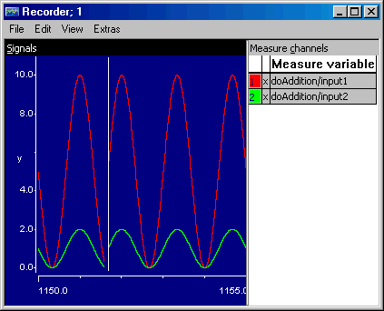

The only other difference between the recorder and the oscilloscope is that you cannot display a grid in the display area of a recorder window, because that grid would have to move with the cursor. The display options, measurement data analysis and trigger feature work in the same way as in the oscilloscope. However, only those parts of the curves belonging to the current pass are available for analysis. The parts to the right of the white line cannot be analyzed.

See also

[Oscilloscope](markdown/oscilloscope.md)

[Setting Up and Using the Oscilloscope](markdown/EE_SetupUse_oscilloscope.md)

---

## Monitor

_Source: `markdown/EE_monitor.md`_

shows the component used in the experiment

# Monitor

Monitors are a simple way of viewing numerical and logical values inside a block diagram. They can be particularly useful for keeping track of the way different values influence each other in complicated diagrams with many elements.

A monitor displays the current value of an element above the selected occurrence in the [experiment view](javascript:kadovTextPopup(this))<!-- kadovTextPopupInit('a1'); //-->.

You can monitor individual elements, or you can monitor all elements in the current experiment, or you can activate the automatic monitoring mode.

##### Automatic Monitoring Mode

When the automatic monitor mode is activated ([Activating Automatic Monitoring Mode](markdown/EE_Activate_AutomaticMonitorMode.md)), monitors are assigned to all elements currently visible in the experiment view. When you navigate in the graphical model (e.g., if you enter a graphical hierarchy or open an included component), new monitors are assigned when new elements become visible.

While the automatic monitoring mode is activated, you cannot assign monitors manually. The respective options are disabled.

Existing manual assignments of monitors ([Monitoring Elements Manually](markdown/monitor-element.md)) are not deleted; they remain part of the environment, and they are saved when you [save the environment](markdown/save_environment.md). When you deactivate automatic monitor mode, the manually assigned monitors are restored.

See also

[Monitoring Individual Elements](markdown/monitor-element.md)

[Activating Automatic Monitoring Mode](markdown/EE_Activate_AutomaticMonitorMode.md)

---

## The Calibration System

_Source: `markdown/calibration_system.md`_

# The Calibration System

The calibration system is the same for online and offline experiments. The Calibration Window combo box lists all currently open calibration windows and offers the option of opening a new one. It is possible to have several elements in the same window, but only if they are of the same type, i.e. several tables can be in a table editor, several scalar elements can be in a numerical editor, etc. Assigning elements to calibration windows works like assigning elements to measurement windows.

You can use the calibration system to modify the values of the basic elements of the components you are experimenting with. You can alter the values when you set up the experiment, or while it is executing. However, modified values take priority over default settings in the calibration system.

If you assign a value to an element with the calibration system, this value remains until it is edited again, changed by a calculation within the component or overwritten by a value from the data generator. The data editors are the same as the ones used to specify components.

When specifying a component, you can assign an initial value to each element in your specification. All of these values—except constants—can be changed at a later stage. You can specify different data sets, i.e. sets of initialization values between which you can toggle, or you can change individual values during experimentation. [Editing Data](DataEditorEnglishUS.chm::/DEd_Overview.htm) describes the different editors for the various kinds of elements.

Usually a data editor is first called from within the component development environment, e.g. the block diagram editor, to assign a default value to an element. Then the editor can be opened again from within the experimentation environment, to calibrate the value of the element in the course of an experiment. Data editors can also be used to define data sets for components or projects. Data editors always work the same, regardless of which part of ASCET they were opened from.

How to open data editors from within the offline experimentation environment is described in [Calibrating an Element](markdown/calibrating_element.md).

See also

[Data Editors for Calibration Variables](markdown/data_editors_calibration_variables.md)

[Working with Calibration Windows](markdown/working_calibration_window.md)

[Calibrating an Element](markdown/calibrating_element.md)

[Editing Data - Overview](DataEditorEnglishUS.chm::/DEd_Overview.htm)

---

## Data Editors for Calibration Variables

_Source: `markdown/data_editors_calibration_variables.md`_

# Data Editors for Calibration Variables

Calibration is carried out directly in the display. This applies to all editors. In the numerical editors and table editors, calibration is carried out by changing the numeric values. Characteristic lines and maps can also be changed graphically by intuitively moving the break points.

When you have carried out a calibration, a red arrow is displayed next to the calibrated value. This indicates that the value of the corresponding calibration variable has been increased or decreased. This applies to all modified values, regardless of which editor you use.

You can

[Edit one Numeric Value](markdown/EE_edit_numerical_value.md)

[Edit Several Numerical Values](markdown/EE_edit_several_numerical_value.md)

[Edit a Logical Value](markdown/EE_edit_logical_value.md)

[Edit an Enumeration](markdown/EE_edit_enumeration.md)

[Set up a Numerical Editor](markdown/setup_numerical_editor.md)

[Exchange Numerical Data with Other Applications](markdown/exchange_data_applications.md)

---

## Table Editor

_Source: `markdown/EE_table_editor.md`_

# Table Editor

Arrays, matrices, characteristic lines/maps and distributions can be edited in the same editor, named table editor or multi editor.

You can edit several items of identical or different type at the same time in a single table editor window while experimenting with a component. In this case the tables currently open are shown in the v: combo box, and you can switch between them by selecting them from there.

The table editor functionality depends on the nature of the currently selected item.

For arrays, matrices and distributions, you can only edit the values and adjust the size.

For characteristic lines and maps, the table editor offers additional commands for editing the sample points on the x axis and the y axis (Axis menu in the table editor) and for selecting the interpolation routine.

When you edit sample point values, the value you entered is checked for the required monotony. When the monotony is not kept, an error message opens:

The monotony has been violated. Advice: Try it again!

The sample point values of characteristic lines or maps can be edited in the x and y (y only for maps) table cells using the table editor. You cannot modify several sample points simultaneously, however. The corresponding commands are not available for arrays and matrices, even if these are displayed in the same editor window as characteristic lines/maps.

You can

[Edit a Single Output Value](markdown/EE_edit_single_output_value.md)

[Edit Several Output Values](markdown/EE_edit_several_output_values.md)

[Edit a Single Sample Point](markdown/EE_edit_exisiting_sample_points.md)

[Edit All Sample Points Simultaneously](markdown/EE_edit_all_sample_points.md)

[Set up the Table Editor](markdown/setup_table_editor.md)

[Use the Sample Point Display](markdown/use_sample_points_display.md)

[Change the Display of the Table Editor](markdown/change_the_display.md)

[Exchange Data with Other Applications](markdown/exchange_data_applications.md)

See also

[Table Editor (Editor for Combined Types)](markdown/ee_editor_combinedtypes.md)

[1-D Graphical Editor](markdown/EE_1d_graphical_editor.md)

[2-D Graphical Editor](markdown/EE_2d_graphical_editor.md)

[3-D Graphical Editor](markdown/EE_3d_graphical_editor.md)

---

## 1-D Graphical Editor

_Source: `markdown/EE_1d_graphical_editor.md`_

# 1-D Graphical Editor

Characteristic lines and maps can also be graphically displayed and edited. This section explains how to view and edit a 1-D table graphically.

Not all the graphical editor commands are dealt with here. The commands that are not explained here are identical to those in the 1-D table editor. The graphical editor is only available in the experimentation environment.

See also

[Launching the 1-D Graphical Editor](markdown/launch_1d_graphical_editor.md)

[Editing a Table in the 1-D Graphical Editor](markdown/EE_edit_table_1d_g_e.md)

[Adding or Removing Sample Points](markdown/add_remove_sample_points.md)

[Changing the Graphical Table Editor Display](markdown/change_graphical_table_display.md)

[Setting up the 1-D Graphical Editor](markdown/setup_1d_g_e.md)

---

## 2-D Graphical Editor

_Source: `markdown/EE_2d_graphical_editor.md`_

# 2-D Graphical Editor

With the 2-D graphical editor it is possible to edit 2-D tables graphically. This editor is similar to the 1-D graphical editor; it presents the 2-D table as a collection of 1-D tables that can be edited individually.

See also

[Starting the 2-D Graphical Editor](markdown/start_2d_g_e.md)

[Editing a Table in the 2-D Graphical Editor](markdown/EE_edit_table_2d_g_e.md)

[Toggling the Perspective of the 2-D Editor](markdown/toggle_perspective_2d_editor.md)

[Setting up the 2-D Graphical Editor](markdown/change_2d_editor_display.md)

---

## 3-D Graphical Editor

_Source: `markdown/EE_3d_graphical_editor.md`_

# 3-D Graphical Editor

The 3-D table graphical editor shows a 2-D table as a three-dimensional graph. It is possible to rotate the graph in all directions and to measure and edit the values contained in the graph. The 3-D graphical editor is only available in the experimentation environment.

See also

[Starting the 3-D Graphical Editor](markdown/start_3d_grraphical_editor.md)

[Highlighting the Net Points in the 3-D Editor](markdown/highlight_netpoints_3d_editor.md)

[Rotating the Coordination System](markdown/rotate_coordination_system.md)

---

## Running Offline Experiments

_Source: `markdown/EE_running_offline_experiments.md`_

# Running Offline Experiments

After you have set up the experiment, you can start it. During offline experiments you can change the display options on all the measurement windows, you can open and close measurement windows, you can change the settings in the data and event generators, and you can change data values with the calibration system.

See also

[Starting the Offline Experiment](markdown/start-offline_experiment.md)

[Stopping the Offline Experiment](markdown/stop-offline_experiment.md)

[Stepping through an Experiment](markdown/step_experiment.md)

[Switching to Timed Step Mode](markdown/switch_timed_stepmode.md)

[Setting up a Breakpoint Condition](markdown/setup_breakpoint_condi.md)

[Viewing the Implementation](markdown/view_implementation.md)

[Viewing Debug Information](markdown/view_debug_info.md)

[Monitoring Events with the Event Tracer](markdown/monitor_events_events_tracer.md)

---

## Loading and Saving Environments

_Source: `markdown/loading_saving_experi.md`_

# Loading and Saving Environments

Experiments for complex models may consist of numerous measurement windows and measurement channels. It is therefore useful to be able to save the experimentation environment, so that the settings can be re-used between experimentation sessions. In ASCET you can save several such environments for every component.

When you save an environment, all settings in the data and event generators and the data logger are stored. Furthermore all open calibration editors and measurement windows are saved with their settings intact. Later you can load the environment, and the experimentation environment is restored. There is always a default experiment, which is loaded, if no other environments have been defined.

See also

[Saving an Environment](markdown/save_environment.md)

[Saving an Environment under a Different Name](markdown/save_environment_different_name.md)

[Loading an Environment](markdown/load_environment.md)

[Switching Environments](markdown/switch_environment.md)

[Exporting Environments](markdown/export_environment.md)

---

## The Data Logger

_Source: `markdown/data_logger.md`_

# The Data Logger

With the data logger you can log the values of variables within a component or project during offline, or a project during online experimentation. The values are written to a file and can later be analyzed with a measurement data analysis application (e.g., the MDA). There are three logging modes:

- Log All Value Changes

Logging all value changes requires a change in the code generation settings (see [Preparing to Log All Value Changes](markdown/prepare_transient_sample.md)). Code is then generated so that every time the value of a logged variable is changed, that change is automatically recorded. That way all changes in a variable can be logged.

If desired, you can reduce this mode to logging only the last change in a time stamp for each logged variable (see [Selecting the Logging Mode](markdown/logging_mode.md)).

Because the code is changed, logging all value changes influences the runtime behavior of the model. The amount of data generated by the data logger increases, because a time stamp has to be generated for each logged variable.

- Periodic Sampling

Periodic sampling does not require any code modifications and therefore only minimally influences the runtime behavior of the model. Here, logging is triggered by a particular task, i.e. every time a selected task is triggered, the current value of all logged variables is recorded. This does not influence the runtime behavior of the selected task, as logging is performed only after the task is finished. If the value of a logged variable changes several times between subsequent logging operations, only the last change is recorded. No time stamp needs to be generated, because logging happens at pre-defined, fixed intervals.

Logged data is stored on a ring buffer in the target and written to the PC-host after the recording is stopped, where it is written to another ring buffer. A ring buffer always stores a pre-defined number of values and, once that number is exceeded, overwrites the previously stored values on a first-in-first-out basis. Therefore, data can be logged only for a limited time. To avoid this problem, you can activate Continuous Polling. With that, data is transferred to the PC-host at regular intervals during the logging operation. However, the communication with the host may affect the target processor, and gain and loss have to be weighed for each application.

- Periodic to File

If a longer registering time is desired, the target, as a rule, cannot provide sufficient RAM for the recording. In that case, you can use the Periodic to File mode. Here, too, logging is triggered by a particular task, but, different from Periodic Sampling, the data is transferred to the PC-host at regular intervals during the logging operation. Thus, data can be registered

For each of the three logging modes, data is written from the PC-host to a file once the logging operation is stopped (see [Stopping Data Logging](markdown/stop_data_logging.md)).

There are three limiting factors on the number of variables that can be logged and the rate at which data can be recorded:

1. A portion of the target RAM is allocated to storing the logged data. The more RAM the target has, the more values can be logged.
1. The data transfer between host and target influences the data logging. If, for instance, the target has little RAM, but the data can be transferred to the host very quickly, more values can be recorded.
1. The logged values are stored on the host RAM (physical plus virtual), the more free RAM the PC has, the more data can be held.

Before you can log data in Log all value changes mode, you have to modify the code generation settings.

The Log all value changes mode can only be activated from within a project.

See also

[Preparing to Log All Value Changes](markdown/prepare_transient_sample.md)

[Opening the Data Logger](markdown/open_data_logger.md)

[Setting up the Channels to be Logged](markdown/setup_channels_logged.md)

[Adjusting the Logging Options](markdown/adjust_logging_options.md)

[Selecting the Logging Mode](markdown/logging_mode.md)

[Logging Data](markdown/log_data.md)

[Defining a Trigger Condition](markdown/define_trigger_condition.md)

[Stopping Data Logging](markdown/stop_data_logging.md)

---

## Block Diagram Navigation

_Source: `markdown/EE_block_diagram_navigation.md`_

# Block Diagram Navigation

If a component or project includes other components, it is possible to view these components, without leaving the experimentation environment.

See also

[Navigating Down between Block Diagrams](markdown/navigate_down_blockdiagram.md)

[Navigating Up between Block Diagrams](markdown/navigate_up_blockdiagram.md)

[Switching between the Diagrams of a Component](markdown/switch_between_diagrams_compo.md)

---

## Data Manipulation

_Source: `markdown/EE_data_manipulation.md`_

# Data Manipulation

During an experiment, the values of the elements are usually changed, e.g. to find the right parameter setting for a particular function. Once the right values have been found, they can be saved in the current data set of the component. For details see [Data Sets](DataEditorEnglishUS.chm::/DEd_data_sets.htm).

See also

[Reading or Writing Data from the Current Data Set](markdown/read_write_current_dataset.md)

[Setting up Data Exchange Options](markdown/EE_setup_dataExchange_Options.md)

[Writing Data to External Files](markdown/write_data_external_files.md)

[Reading Data from External Files](markdown/EE_readData_externalFiles.md)

[Data Sets](DataEditorEnglishUS.chm::/DEd_data_sets.htm)

---

## Dependent Parameters in the Experiment

_Source: `markdown/EE_DepParam_in_Experiment.md`_

# Dependent Parameters in the Experiment

The initialization value of a dependent parameter is calculated during code generation. During an experiment, a dependent parameter is updated according to the following scheme when the non-dependent parameters it depends on (the "master" parameters) change their values:

- the value of a "master parameter" is changed in a [calibration editor](markdown/calibrating_element.md)

All dependent parameters that depend on the "master parameter" are re-calculated immediately. If a dependent parameter is shown in a measurement or calibration window, the value is updated.

Dependent parameters that do not depend on the changed "master" parameter are not re-calculated.

- the value of a "master" parameter is [read from a file](markdown/EE_readData_externalFiles.md)

All dependent parameters that depend on the "master parameter" are re-calculated immediately. If a dependent parameter is shown in a measurement or calibration window, the value is updated.

Dependent parameters that do not depend on the changed "master" parameter are not re-calculated.

- parameters are [reinitialized](markdown/read_write_current_dataset.md)

The values calculated during code generation are reassigned to those dependent parameters whose values have been re-calculated at least once during the experiment.

Dependent parameters whose values were not re-calculated are not reinitialized.

- See also
- [Introduction - Dependent Parameters](IntroductionEnglishUS.chm::/INT_dependent_parameters.htm)

[Calibrating an Element](markdown/calibrating_element.md)

[Reading or Writing Data from the Current Data Set](markdown/read_write_current_dataset.md)

[Reading Data from External Files](markdown/EE_readData_externalFiles.md)

---

## Opening the Experimentation Environment for an Offline Experiment

_Source: `markdown/open_experi_environ_offline.md`_

# Opening the Experimentation Environment for an Offline Experiment

To open the experimentation environment for an offline experiment, proceed as follows:

1. Open the appropriate component or project.
1. If you want to experiment offline with a project, select the target PC in the project properties.
1. Perform one of the following actions.
1. If you are working with a database larger than 3 GB, [another step is inserted](javascript:BSSCPopup('codegen_dbtoolarge.htm');)<!-- kadovFilePopupInit('a1'); //-->.

The default experimentation environment opens for the component or project. If more than one environment has been stored, you can choose which one to open. For details see [Loading and Saving Environments](markdown/loading_saving_experi.md).

See also

[Loading and Saving Environments](markdown/loading_saving_experi.md)

/* Heikki Komulainen, Comet Computer GmbH 2004 */ cc_plus_pic = '&nbsp;'; cc_minus_pic = '&nbsp;'; cc_stat_pic = '&nbsp;'; gpstyle = ''; var iframes_created = 0; if (document.body && document.body.insertAdjacentHTML && document.getElementsByTagName && document.getElementById) { collect_popups(); set_poplinks_pictures(); if (iframes_created) { document.write(gpstyle); document.write('
<nobr><a id="einauslink" style="position:absolute;top:expression(document.body.scrollTop + this.offsetHeight - this.offsetHeight);left:expression(document.body.offsetWidth - (this.offsetWidth + 28));background:#ffffe0;padding:5px" href="javascript:show_all_poptext()">Show all hidden text</a></nobr>
'); } } function collect_popups() { bsscpopups = new Array(); for (x = 0; x < document.links.length; x++) { if (document.links[x].href.indexOf("BSSCPopup")>-1) { seekmatch = /BSSCPopup.'[^'](markdown/+)'/; poplink = seekmatch.exec(document.links[x].href); poplink = "" + poplink; poplink = poplink.substring(poplink.indexOf("'")+1, poplink.lastIndexOf("'")); ifid = "CCGENIFRAMEID" + x; new_iframe = '<iframe id="' + ifid + '"src="' + poplink + '" onload="get_text(\'' + ifid + '\')" width="0" height="0" frameborder=0></iframe>'; document.links[x].parentNode.insertAdjacentHTML("afterEnd", new_iframe); gpid = "CCID_" + ifid; document.links[x].href = "javascript:expand_poptext('" + gpid + "')"; cc_plus = '' + cc_plus_pic + ''; document.links[x].insertAdjacentHTML("afterBegin", cc_plus); iframes_created = 1; } } }// end function function get_text(ifr_id) { frpars = document.frames[ifr_id].document.getElementsByTagName("body"); popbody = frpars[0].innerHTML; gpid = "CCID_" + ifr_id; if (!document.getElementById(gpid)) { //avoiding doubles document.getElementById(ifr_id).insertAdjacentHTML("afterEnd", '
'+popbody+'
'); } }//end function function expand_poptext(x_frame_id) { if (!document.getElementById(x_frame_id)) return; if (document.getElementById(x_frame_id).className == "CCGENPOPTEXTH") { document.getElementById(x_frame_id).className = "CCGENPOPTEXTV"; document.getElementById(x_frame_id).style.visibility = "visible"; if (document.getElementById("CCPMB_" + x_frame_id )) { document.getElementById("CCPMB_" + x_frame_id ).innerHTML = cc_minus_pic; } } else { document.getElementById(x_frame_id).className = "CCGENPOPTEXTH"; document.getElementById(x_frame_id).style.visibility = "hidden"; if (document.getElementById("CCPMB_" + x_frame_id )) { document.getElementById("CCPMB_" + x_frame_id ).innerHTML = cc_plus_pic; } } }// end function function show_all_poptext() { var pulldowntxt = document.getElementsByTagName("div"); for (b = 0; b < pulldowntxt.length; b++) { if (pulldowntxt[b].className == "droptext") { pulldowntxt[b].style.display=""; } } var gptxt = document.getElementsByTagName("div"); for (z = 0; z < gptxt.length; z++) { if (gptxt[z].className == "CCGENPOPTEXTH") { gptxt[z].className = "CCGENPOPTEXTV"; gptxt[z].style.visibility = "visible"; if (document.getElementById("CCPMB_" + gptxt[z].id )) { document.getElementById("CCPMB_" + gptxt[z].id ).innerHTML = cc_minus_pic; } } } var dxpoplinks = document.getElementsByTagName("a"); if (dxpoplinks) { for (pxl = 0; pxl < dxpoplinks.length; pxl++) { if (dxpoplinks[pxl].href.indexOf("kadovTextPopup")>-1) { if (document.getElementById("CCPMB_" + dxpoplinks[pxl].id)) { document.getElementById("CCPMB_" + dxpoplinks[pxl].id).innerHTML = cc_stat_pic; dxpoplinks[pxl].symbol = "minus"; } } } } document.getElementById('einauslink').innerText = 'Hide all hideable text'; document.getElementById('einauslink').href = "javascript:self.location.reload()"; self.focus(); }// end function function eat_click() { return false; }// end function function set_poplinks_pictures() { var dpoplinks = document.getElementsByTagName("a"); if (dpoplinks) { for (pl = 0; pl < dpoplinks.length; pl++) { if (dpoplinks[pl].href.indexOf("kadovTextPopup")>-1) { cc_plus = '' + cc_stat_pic + ''; //dpoplinks[pl].onmouseup = plusminuspoplink; dpoplinks[pl].insertAdjacentHTML("afterBegin", cc_plus); dpoplinks[pl].symbol = "plus"; } } } }// end function function plusminuspoplink() { if (document.getElementById("CCPMB_" + this.id)) { if (this.symbol == "plus") { document.getElementById("CCPMB_" + this.id).innerHTML = cc_minus_pic; this.symbol = "minus"; } else { document.getElementById("CCPMB_" + this.id).innerHTML = cc_plus_pic; this.symbol = "plus"; } } return true; }

---

## Defining Global Elements in the Default Project

_Source: `markdown/define_global_elements_default.md`_

# Defining Global Elements in the Default Project

When experimenting with components, the global elements (see [Defining Global Communication](ProjectEditorEnglishUS.chm::/definingglobalcommin.htm)) are under some circumstances not updated properly in the default project. The following error message (MLm10) is displayed in the ASCET monitor window:

Error: need export for import element <name> with type <type>

- To correct this error, proceed as described in [Defining Global Elements in the Default Project](BlockDiagramEditorEnglishUS.chm::/BDE_Globalelements.htm).

You can now restart the experiment.

See also

[Defining Global Elements in the Default Project](BlockDiagramEditorEnglishUS.chm::/BDE_Globalelements.htm)

[Defining Global Communication](ProjectEditorEnglishUS.chm::/definingglobalcommin.htm)

---

## Setting up the Event Generator

_Source: `markdown/EE_setup_eventGenerator.md`_

# Setting up the Event Generator

To set up the event generator, proceed as follows:

1. Do one of the following:
1. Select an event.
1. Do one of the following:
1. Repeat these steps for each event you want to enable.
1. In the Channels menu, select Enable again to disable an event.

Methods or processes for which no event has been enabled are not activated and therefore will have no influence on the experiment.

See also

[Setting up an Event](markdown/setup_event.md)

---

## Setting up an Event

_Source: `markdown/setup_event.md`_

# Setting up an Event

To set up an event, proceed as follows:

Once you have created an event, it is assigned default values for all the event options. It may not always be necessary to edit these options.

1. Open the event generator.
1. In the Events list, select the event you want to set up.
1. In the Channels menu, select Edit.
1. Adjust the event options.
1. Click OK.
1. Repeat for each event you want to set up.

See also

[Setting up the Event Generator](markdown/EE_setup_eventGenerator.md)

[Event for Dialog Window](markdown/event_options.md)

[Setting up a Segment Event](markdown/setup_segment_event.md)

[Setting up an Asynchronous Event](markdown/setup_asynchronous_event.md)

[Setting up a Dependent Event](markdown/setup_dependent_event.md)

---

## Setting up an Event Directly

_Source: `markdown/setup_event_directly.md`_

# Setting up an Event Directly

To set up an event directly, proceed as follows:

1. In the Outline tab of the experiment window, select the process or method for which you want to generate an event.
1. Do one of the following:

- Right-click on the process or method and select Stimulate from the context menu
- In the Extras menu, select Stimulate.

The event is enabled and the [Event for](markdown/event_options.md) window is opened for the event. Using this command is equivalent to first enabling the event in the Event Generator window and then editing it.

See also

[Setting up the Event Generator](markdown/EE_setup_eventGenerator.md)

[Event for Dialog Window](markdown/event_options.md)

[Setting up a Segment Event](markdown/setup_segment_event.md)

[Setting up an Asynchronous Event](markdown/setup_asynchronous_event.md)

[Setting up a Dependent Event](markdown/setup_dependent_event.md)

---

## Setting up a Segment Event

_Source: `markdown/setup_segment_event.md`_

# Setting up a Segment Event

To set up a segment event, proceed as follows:

1. Open the Event dialog window for the event (see [Setting up an Event](markdown/setup_event.md)).
1. Select segment from the Mode combo box.

A window opens that lists all variables of your component.

1. Select the variable that is to serve as the segment variable and click OK.

The segment variable should represent the rotational speed in revolutions per minute.

1. Adjust the crankshaft angle in the call every °CS field of the Event window.
1. Click OK.

The segment event is now triggered at the beginning of every segment interval tseg (in degrees), which is calculated according to the following formula:

<table cellspacing="0" style="x-cell-content-align: top;
				left: 0px;
				top: 264px;
				width: 214px;
				float: alignleft;
				border-spacing: 0px;
				border-spacing: 0px;" width="214" x-use-null-cells="">
<col style="width: 47.924%;"/>
<col style="width: 52.076%;"/>
<tr class="hcp1" valign="top">
<td colspan="1" rowspan="2" style="width: 47.924%;
			padding-right: 10px;
			padding-left: 10px;
			x-cell-content-align: center;" valign="middle" width="47.924%">

tSeg [s]=
</td>
<td style="width: 52.076%;
			padding-right: 10px;
			padding-left: 10px;
			border-top-style: none;
			border-right-style: none;
			border-bottom-color: #000000;
			border-bottom-width: 1px;
			border-bottom-style: Solid;" width="52.076%">

CS 
 [deg]
</td></tr>
<tr class="hcp1" valign="top">
<td style="width: 52.076%;
			padding-right: 10px;
			padding-left: 10px;
			border-right-style: none;
			border-bottom-style: none;" width="52.076%">

n[1/min] p6
</td></tr>
</table>

n is the rotational speed in revolutions per minute, and CS is the crankshaft angle that specifies the revolution.

See also

[Setting up an Event](markdown/setup_event.md)

---

## Setting up an Asynchronous Event

_Source: `markdown/setup_asynchronous_event.md`_

# Setting up an Asynchronous Event

To set up an asynchronous event, proceed as follows:

1. Open the Event dialog window for the event.
1. Select signalled from the Mode combo box.

If no signal has been selected in the data generator (see [The Data Generator](markdown/data_generator.md)), the following error message is displayed:

DataGenerator has not valid signal assigned!

Advice: Please assign a signal at DataGenerator to switch an event to mode SIGNALLED.

1. To remove the error, proceed as follows:

1. Confirm the error message with OK.
1. In the Physical Experiment window, click on the  button to open the data generator.
1. Define a signal as described in [Defining a Signal](markdown/EE_define_signal.md).
1. Repeat the first two steps of the instruction.
1. Choose the desired time raster, if the signal contains multiple rasters.

1. Click OK to accept the settings.

See also

[The Data Generator](markdown/data_generator.md)

[Setting up an Event](markdown/setup_event.md)

[Defining a Signal](markdown/EE_define_signal.md)

---

## Setting up a Dependent Event

_Source: `markdown/setup_dependent_event.md`_

# Setting up a Dependent Event

A dependent event is activated whenever the event it depends on is activated. This does not affect the other settings of the event. It is still activated normally in addition to being activated as a dependent event, but the activation is synchronized with the event it depends on.

To set up a dependent event, proceed as follows:

1. Select an event in the event generator window.
1. In the Channels menu, select Dependent Event.

The Define Dependent Event window opens.

1. Select the event the first event is to depend on.
1. Click OK.

---

## Setting up the Data Generator

_Source: `markdown/setup_data_generator.md`_

# Setting up the Data Generator

To set up the data generator, proceed as follows:

1. Do one of the following:
1. In the Channels menu, select Create to open the Create Data Generator Channel window.
1. Deactivate the Parameters only option to view all basic elements for the component.
1. Select the element or elements for which you want to create a data generator channel.
1. Click OK.
1. Repeat for the other elements for which you want to create data channels.

See also

1. [Setting up a Channel in the Data Generator](markdown/setup_channel_data_generator.md)
1. [Setting up a Stimulation Mode](markdown/setup_stimulation_mode.md)

---

## Setting up a Channel in the Data Generator

_Source: `markdown/setup_channel_data_generator.md`_

# Setting up a Channel in the Data Generator

To set up a channel in the data generator, proceed as follows:

1. Select a channel in the Data Generator window.
1. Do one of the following.
1. Alternatively, select an element from the Outline tab in the experimentation environment.
1. Do one of the following:
1. Select a mode for the channel.
1. [Set up the channel](markdown/setup_stimulation_mode.md).

See also

[Setting up a Stimulation Mode](markdown/setup_stimulation_mode.md)

[Setting up the Data Generator](markdown/setup_data_generator.md)

[Stimulus Dialog Window](markdown/EE_StimulusDialogWindow.md)

---

## Setting up a Stimulation Mode

_Source: `markdown/setup_stimulation_mode.md`_

# Setting up a Stimulation Mode

To set up a stimulation mode, proceed as follows:

1. Open the Stimulus dialog window.
1. Perform the necessary steps for each channel in the data generator.

1. [Constant Mode](markdown/constant_mode.md)
1. [Cyclic Modes (sinus, ramp, pulse and step) and Random Generator (random, equal distribution)](markdown/cyclic_mode.md)
1. [Table Mode](markdown/table_mode.md)
1. [Signal Mode](markdown/matrix_mode.md)
1. [Gaussian Mode](markdown/gaussian_mode.md)

You can modify the settings for a signal channel while your experiment is running. To test different settings, simply press Apply to change the signal without closing the dialog.

---

## Setting up a Constant Stimulation Mode

_Source: `markdown/constant_mode.md`_

# Setting up a Constant Stimulation Mode

To set up a constant stimulation mode, proceed as follows:

1. Open the Stimulus dialog for a data generator channel (see [Setting up a Channel in the Data Generator](markdown/setup_channel_data_generator.md)).
1. In the Mode combo box, select constant.
1. In the Value field, insert the value of the constant.
1. Click OK to assign the value and close the window.
1. Click Apply to assign the value without closing the window.
1. Click Cancel to discard the setting and close the window.

See also

[Setting up a Channel in the Data Generator](markdown/setup_channel_data_generator.md)

[Stimulus Dialog Window](markdown/EE_StimulusDialogWindow.md)

---

## Setting up a Cyclic or Random Stimulation Mode

_Source: `markdown/cyclic_mode.md`_

# Setting up a Cyclic or Random Stimulation Mode

To set up a cyclic modes (sine, ramp, pulse and step) and random generator (random, equal distribution) stimulation mode, proceed as follows:

1. Open the Stimulus dialog window for a data generator channel ([Setting up a Channel in the Data Generator](markdown/setup_channel_data_generator.md)).
1. In the Mode combo box, select a cyclic or random mode (i.e. sine, ramp, pulse, step or random).
1. In the Frequency field, set the frequency in Hz (i.e. 1/s, not rad/s) for the cyclic mode.
1. In the Phase field, set the phase for the cyclic mode.
1. Set the offset of the y-axis (Offset).
1. Adjust the amplitude.
1. Click OK or Apply.

See also

[Example: Sinus Stimulation Mode](markdown/EE_Example_SinusStimulationMode.md)

[Setting up a Channel in the Data Generator](markdown/setup_channel_data_generator.md)

[Stimulus Dialog Window](markdown/EE_StimulusDialogWindow.md)

---

## Example: Sinus Stimulation Mode

_Source: `markdown/EE_Example_SinusStimulationMode.md`_

# Example: Sinus Stimulation Mode

A continuous variable, sine_1, is stimulated with a sine curve. The sine curve uses the following settings:

| Column 1 | Column 2 |
| --- | --- |
| frequency | 1 Hz = 1 s -1 |
| phase | 0 s |
| offset | 0 |
| amplitude | 1 |

The red curve in the figure shows sine_1.

The grey curve in the figure shows the variable sine_2, for comparison. sine_2 uses the same phase, offset, and amplitude as sine_1, and a frequency of 1 rad/s (which corresponds to 1/2p Hz).

---

## Setting up a Table Stimulation Mode

_Source: `markdown/table_mode.md`_

# Setting up a Table Stimulation Mode

The table mode uses a table as stimulus.

1. Open the Stimulus dialog for a data generator channel (see [Setting up a Channel in the Data Generator](markdown/setup_channel_data_generator.md)).
1. In the Mode combo box, select table.
1. Click on the Edit Table button to edit the table used as stimulus.
1. In the table editor, do one of the following:
1. In the Time Scale field, enter a factor for the time scale.
1. Click OK to accept the settings.

The table is processed only once. If you want to use it a second time to stimulate a channel, you have to restart the experiment.

See also

[Setting up a Channel in the Data Generator](markdown/setup_channel_data_generator.md)

[The Table Editor (Editor for Combined Types)](DataEditorEnglishUS.chm::/DEd_editor_combined_types.htm)

[Working with Calibration Windows](markdown/working_calibration_window.md)

[Stimulus Dialog Window](markdown/EE_StimulusDialogWindow.md)

---

## Setting up a Signal Stimulation Mode

_Source: `markdown/matrix_mode.md`_

# Setting up a Signal Stimulation Mode

1. It is possible to use the data of actual measurements as a stimulus in the data generator. That way, components can be tested with real-world data even during offline experimentation. Such data is stored in signal items in the database or workspace and can be read in from a variety of formats. Importing signals is described in [Signals and Icons - Overview](SignalsandIconsEnglishUS.chm::/SI_Overview.htm). Individual channels from a signal can be assigned as channels in the data generator.
1. The setup of the signal mode is described in the following two sections:

- [Defining a Signal](markdown/EE_define_signal.md).
- [Defining Data Generator Channels as Signal Channels](markdown/define_data_generator_channels.md).

---

## Setting up a Gaussian Stimulation Mode

_Source: `markdown/gaussian_mode.md`_

# Setting up a Gaussian Stimulation Mode

This mode is only available for numerical variables. It stimulates the variable using a random number generator with Gaussian distribution.

1. Open the Stimulus dialog for a data generator channel (see [Setting up a Channel in the Data Generator](markdown/setup_channel_data_generator.md)).
1. In the Mode combo box, select gaussian.
1. In the Mean field, enter the mean value of the Gaussian distribution.
1. In the Variance field, enter the variance of the Gaussian distribution.
1. Click OK or Apply.

See also

[Setting up a Channel in the Data Generator](markdown/setup_channel_data_generator.md)

[Stimulus Dialog Window](markdown/EE_StimulusDialogWindow.md)

---

## Deleting Data Generator Channels

_Source: `markdown/delete_channels.md`_

# Deleting Data Generator Channels

To delete channels, proceed as follows:

1. In the Channels menu, select Delete to delete the selected channel from the data generator.
1. In the Channels menu, select Delete All to delete all channels from the data generator.

---

## Defining a Signal

_Source: `markdown/EE_define_signal.md`_

# Defining a Signal

You can only define a signal when the experiment is stopped. Proceed as follows:

1. In the data generator, open the Signal menu and select Define Signal.

The Select a Signal Item window opens.

1. Select a signal from the 1 Database or the 1 Workspace pane.
1. Click OK.
1. [Define one or more data generator channels as signal channels](markdown/define_data_generator_channels.md).

Once you have defined a signal, new menu items appear in the Signals menu in the data generator. However, these are only available when the experiment is stopped.

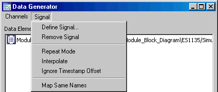

If the signal you selected uses an MDF format higher than V2.0 (see also [Signals and Icons - Importing Measurement Data to a Signal](SignalsandIconsEnglishUS.chm::/SI_import_measurement_data.htm)), a warning message will open when you start the experiment.

See also

[Defining Data Generator Channels as Signal Channels](markdown/define_data_generator_channels.md)

[Assigning Channels with Identical Names](markdown/assign_channels_identical_names.md)

[Interpolating the Signal](markdown/interpolate_signal.md)

[Selecting Signal Repetition](markdown/select_signal_repitition.md)

[Setting the Time Behavior](markdown/EE_SettingTimeBehavior.md)

[Removing a Signal](markdown/remove_signal.md)

[Starting the Offline Experiment](markdown/start-offline_experiment.md)

[Signals and Icons - Importing Measurement Data to a Signal](SignalsandIconsEnglishUS.chm::/SI_import_measurement_data.htm)

---

## Defining Data Generator Channels as Signal Channels

_Source: `markdown/define_data_generator_channels.md`_

# Defining Data Generator Channels as Signal Channels

To define data generator channels as signal channels, proceed as follows:

1. In the data generator window, select a channel.
1. In the Channels menu, select Edit
1. Double-click on the channel.
1. In the Stimulus dialog window, Mode combo box, select signal.
1. Select the signal channel you want to assign to the data generator channel.
1. Click OK.

See also

[Defining a Signal](markdown/EE_define_signal.md)

[Stimulus Dialog Window](markdown/EE_StimulusDialogWindow.md)

---

## Removing a Signal

_Source: `markdown/remove_signal.md`_

# Removing a Signal

To remove a signal, proceed as follows:

- In the data generator, open the Signal menu and select Remove Signal.

The defined signal is removed. A channel stimulated with the signal keeps the signal mode, but the entry in the Stimulus combo box is reset.

---

## Assigning Channels with Identical Names

_Source: `markdown/assign_channels_identical_names.md`_

# Assigning Channels with Identical Names

When the signal channels and the data generator channels are named equally, you do not have to select each channel separately in the Stimulus combo box (see [Defining Data Generator Channels as Signal Channels](markdown/define_data_generator_channels.md)). You can assign channels with identical names automatically.

To assign channels with identical names, proceed as follows:

1. In the Stimulus dialog window, select the signal mode for each desired channel.
1. In the data generator, open the Signal menu and select Map same names.

Signal channels are assigned to data generator channels with identical names.

See also

[Defining a Signal](markdown/EE_define_signal.md)

[Defining Data Generator Channels as Signal Channels](markdown/define_data_generator_channels.md)

---

## Interpolating the Signal

_Source: `markdown/interpolate_signal.md`_

# Interpolating the Signal

Each time data is generated in the experiment (see [Setting up the Event Generator](markdown/EE_setup_eventGenerator.md)), the signal is evaluated. If the actual time stamp falls between two signal points, the lower signal value is assigned to the channel by default. As an alternative, you can select linear interpolation.

To interpolate the signal, proceed as follows:

1. In the data generator, open the Signal menu and select Interpolate.
1. Start the experiment.

The assigned value is linearly interpolated from the signal points enclosing the actual time stamp.

See also

[Setting up an Event](markdown/setup_event.md)

[Setting up the Event Generator](markdown/EE_setup_eventGenerator.md)

---

## Selecting Signal Repetition

_Source: `markdown/select_signal_repitition.md`_

# Selecting Signal Repetition

If nothing else is specified, the experiment continues after the end of the signal is reached. The stimulated channel retains the last signal value. You can select a repeat mode for the signal or an automatic stop of the experiment.

The automatic stop overrules the repeat mode. When both are selected, the experiment stops at the end of the signal.

To select signal repetition, proceed as follows:

1. In the data generator, open the Signal menu and select Repeat Mode.
1. Restart the experiment.

When the end of the signal is reached, stimulation begins a new.

See also

[Setting up the Automatic Stop](markdown/setup_automatic_stop.md)

---

## Setting up the Automatic Stop

_Source: `markdown/setup_automatic_stop.md`_

# Setting up the Automatic Stop

If nothing else is specified, the experiment continues after the end of the signal is reached. The stimulated channel retains the last signal value. You can select a repeat mode for the signal or an automatic stop of the experiment.

The automatic stop overrules the repeat mode. When both are selected, the experiment stops at the end of the signal.

To set up the automatic stop, proceed as follows:

This command is available only when at least one data generator channel is stimulated with a signal.

1. In the Physical Experiment window, open the Experiment menu and select Automatic Stop (for Signals).

The menu function is marked. When you start the experiment now, it will automatically stop when the end of the signal is reached.

1. In the Experiment menu, select Automatic Stop (for Signals) once more to deactivate the automatic stop.

The setting of Automatic Stop (for Signals) in the Experiment menu is kept when the experiment is ended, and the experiment environment is closed. The next time you experiment with this component, the old setting is assumed.

See also

[Selecting Signal Repetition](markdown/select_signal_repitition.md)

---

## Setting the Signal Time Behavior

_Source: `markdown/EE_SettingTimeBehavior.md`_

t = 13s, signal repetition is activated.

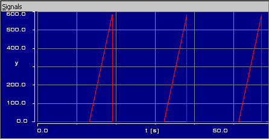

t = 13s, signal repetition is activated, Ignore Timestamp Offset is set.

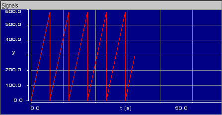

# Setting the Signal Time Behavior

If nothing else is specified, the experiment takes into account time offsets in the signal. If the signal starts at t=x seconds, the stimulation starts x seconds after the experiment start. If signal repetition is selected, the next stimulation starts x seconds after the end of the previous stimulation.

[Example 1](javascript:kadovTextPopup(this))<!-- kadovTextPopupInit('a1'); //-->

You can switch off this behavior and ignore time offsets in the stimulating signal. Proceed as follows:

1. In the data generator, open the Signal menu and select Ignore Timestamp Offset.
1. Restart the experiment.
1. Select Ignore Timestamp Offset again to return to the default behavior.

See also

[Selecting Signal Repetition](markdown/select_signal_repitition.md)

/* Heikki Komulainen, Comet Computer GmbH 2004 */ cc_plus_pic = '&nbsp;'; cc_minus_pic = '&nbsp;'; cc_stat_pic = '&nbsp;'; gpstyle = ''; var iframes_created = 0; if (document.body && document.body.insertAdjacentHTML && document.getElementsByTagName && document.getElementById) { collect_popups(); set_poplinks_pictures(); if (iframes_created) { document.write(gpstyle); document.write('
<nobr><a id="einauslink" style="position:absolute;top:expression(document.body.scrollTop + this.offsetHeight - this.offsetHeight);left:expression(document.body.offsetWidth - (this.offsetWidth + 28));background:white;padding:5px" href="javascript:show_all_poptext()">Alle texte einblenden</a></nobr>
'); } } function collect_popups() { bsscpopups = new Array(); for (x = 0; x < document.links.length; x++) { if (document.links[x].href.indexOf("BSSCPopup")>-1) { seekmatch = /BSSCPopup.'[^'](markdown/+)'/; poplink = seekmatch.exec(document.links[x].href); poplink = "" + poplink; poplink = poplink.substring(poplink.indexOf("'")+1, poplink.lastIndexOf("'")); ifid = "CCGENIFRAMEID" + x; new_iframe = '<iframe id="' + ifid + '"src="' + poplink + '" onload="get_text(\'' + ifid + '\')" width="0" height="0" frameborder=0></iframe>'; document.links[x].parentNode.insertAdjacentHTML("afterEnd", new_iframe); gpid = "CCID_" + ifid; document.links[x].href = "javascript:expand_poptext('" + gpid + "')"; cc_plus = '' + cc_plus_pic + ''; document.links[x].insertAdjacentHTML("afterBegin", cc_plus); iframes_created = 1; } } }// end function function get_text(ifr_id) { frpars = document.frames[ifr_id].document.getElementsByTagName("body"); popbody = frpars[0].innerHTML; gpid = "CCID_" + ifr_id; if (!document.getElementById(gpid)) { //avoiding doubles document.getElementById(ifr_id).insertAdjacentHTML("afterEnd", '
'+popbody+'
'); } }//end function function expand_poptext(x_frame_id) { if (!document.getElementById(x_frame_id)) return; if (document.getElementById(x_frame_id).className == "CCGENPOPTEXTH") { document.getElementById(x_frame_id).className = "CCGENPOPTEXTV"; document.getElementById(x_frame_id).style.visibility = "visible"; if (document.getElementById("CCPMB_" + x_frame_id )) { document.getElementById("CCPMB_" + x_frame_id ).innerHTML = cc_minus_pic; } } else { document.getElementById(x_frame_id).className = "CCGENPOPTEXTH"; document.getElementById(x_frame_id).style.visibility = "hidden"; if (document.getElementById("CCPMB_" + x_frame_id )) { document.getElementById("CCPMB_" + x_frame_id ).innerHTML = cc_plus_pic; } } }// end function function show_all_poptext() { var pulldowntxt = document.getElementsByTagName("div"); for (b = 0; b < pulldowntxt.length; b++) { if (pulldowntxt[b].className == "droptext") { pulldowntxt[b].style.display=""; } } var gptxt = document.getElementsByTagName("div"); for (z = 0; z < gptxt.length; z++) { if (gptxt[z].className == "CCGENPOPTEXTH") { gptxt[z].className = "CCGENPOPTEXTV"; gptxt[z].style.visibility = "visible"; if (document.getElementById("CCPMB_" + gptxt[z].id )) { document.getElementById("CCPMB_" + gptxt[z].id ).innerHTML = cc_minus_pic; } } } var dxpoplinks = document.getElementsByTagName("a"); if (dxpoplinks) { for (pxl = 0; pxl < dxpoplinks.length; pxl++) { if (dxpoplinks[pxl].href.indexOf("kadovTextPopup")>-1) { if (document.getElementById("CCPMB_" + dxpoplinks[pxl].id)) { document.getElementById("CCPMB_" + dxpoplinks[pxl].id).innerHTML = cc_stat_pic; dxpoplinks[pxl].symbol = "minus"; } } } } document.getElementById('einauslink').innerText = 'Alle texte ausblenden'; document.getElementById('einauslink').href = "javascript:self.location.reload()"; self.focus(); }// end function function eat_click() { return false; }// end function function set_poplinks_pictures() { var dpoplinks = document.getElementsByTagName("a"); if (dpoplinks) { for (pl = 0; pl < dpoplinks.length; pl++) { if (dpoplinks[pl].href.indexOf("kadovTextPopup")>-1) { cc_plus = '' + cc_stat_pic + ''; //dpoplinks[pl].onmouseup = plusminuspoplink; dpoplinks[pl].insertAdjacentHTML("afterBegin", cc_plus); dpoplinks[pl].symbol = "plus"; } } } }// end function function plusminuspoplink() { if (document.getElementById("CCPMB_" + this.id)) { if (this.symbol == "plus") { document.getElementById("CCPMB_" + this.id).innerHTML = cc_minus_pic; this.symbol = "minus"; } else { document.getElementById("CCPMB_" + this.id).innerHTML = cc_plus_pic; this.symbol = "plus"; } } return true; }

---

## Assigning an Element to a New Measurement Window

_Source: `markdown/assign_element_measurement.md`_

# Assigning an Element to a New Measurement Window

To assign a scalar or logical element to a new measurement window, proceed as follows:

1. From the Measurement Window combo box, select the type of measurement window you want to use.
1. In the Outline tab, select the element that you want to assign to a measurement window.
1. Do one of the following:

- In the Extras menu or in the element's context menu, select Measure.
- Drag the element from the Outline tab to the Measurement Window combo box.
- Drag an occurrence of the element from the block diagram display to the Measurement Window combo box.

A new measurement window is opened and the selected element is added to the measurement window. You can select more than one element by clicking on them while holding down the Ctrl key, in that case all selected elements are assigned to the window.

The Measurement Window combo box also shows the titles of all measurement windows that are already open. The entries for open windows are displayed without brackets, e.g. Oscilloscope; 1. If you have changed the title of a measurement window, that title is listed in the combo box.

See also

[Assigning an Element to an Existing Measurement Window](markdown/assign_element_existing_measu.md)

[Assigning an Array or Matrix to a Measurement Window](markdown/EE_AssignArrayMatrix_MeasurementWindow.md)

---

## Assigning an Element to an Existing Measurement Window

_Source: `markdown/assign_element_existing_measu.md`_

# Assigning an Element to an Existing Measurement Window

To assign a scalar or logical element to an existing measurement window, proceed as follows:

1. From the Measurement Window combo box, select the existing measurement window you want to use.
1. In the Outline tab, select the element that you want to assign to a measurement window.
1. Do one of the following:
1. As an alternative, drag the element directly to the desired measurement window.

The selected elements are added to the measurement window.

See also

[Assigning an Element to a New Measurement Window](markdown/assign_element_measurement.md)

[Assigning an Array or Matrix to a Measurement Window](markdown/EE_AssignArrayMatrix_MeasurementWindow.md)

---

## Assigning an Array or Matrix to a Measurement Window

_Source: `markdown/EE_AssignArrayMatrix_MeasurementWindow.md`_

The highlighted entries in the Edit indexed data elements window ...

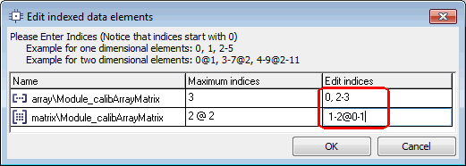

... assign the x0, x2, and x3 elements of array and the x1y0, x1y1, x2y0, and x2y1 elements of matrix to a measurement window.

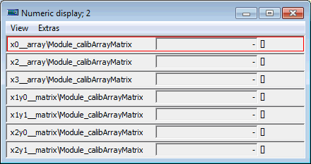

# Assigning an Array or Matrix to a Measurement Window

Arrays and matrices specified as [explicit references](IntroductionEnglishUS.chm::/INT_ExplicitReferences.htm) cannot be measured.

Assigning an array or matrix to a measurement window works largely as described in the links given below, with an additional step.

1. From the Measurement Window combo box, select a measurement window.
1. In the Outline tab, select the array or matrix that you want to assign to a measurement window.
1. Do one of the following:
1. In the Edit indexed data elements dialog window, use the third column to specify the array/matrix elements you want to measure.
1. Click OK to close the window and accept the selection.

The selected array/matrix elements are added to the measurement window.

See also

[Assigning an Element to a New Measurement Window](markdown/assign_element_measurement.md)

[Assigning an Element to an Existing Measurement Window](markdown/assign_element_existing_measu.md)

/* Heikki Komulainen, Comet Computer GmbH 2004 */ cc_plus_pic = '&nbsp;'; cc_minus_pic = '&nbsp;'; cc_stat_pic = '&nbsp;'; gpstyle = ''; var iframes_created = 0; if (document.body && document.body.insertAdjacentHTML && document.getElementsByTagName && document.getElementById) { collect_popups(); set_poplinks_pictures(); if (iframes_created) { document.write(gpstyle); document.write('
<nobr><a id="einauslink" style="position:absolute;top:expression(document.body.scrollTop + this.offsetHeight - this.offsetHeight);left:expression(document.body.offsetWidth - (this.offsetWidth + 28));background:white;padding:5px" href="javascript:show_all_poptext()">Show all hidden text</a></nobr>
'); } } function collect_popups() { bsscpopups = new Array(); for (x = 0; x < document.links.length; x++) { if (document.links[x].href.indexOf("BSSCPopup")>-1) { seekmatch = /BSSCPopup.'[^'](markdown/+)'/; poplink = seekmatch.exec(document.links[x].href); poplink = "" + poplink; poplink = poplink.substring(poplink.indexOf("'")+1, poplink.lastIndexOf("'")); ifid = "CCGENIFRAMEID" + x; new_iframe = '<iframe id="' + ifid + '"src="' + poplink + '" onload="get_text(\'' + ifid + '\')" width="0" height="0" frameborder=0></iframe>'; document.links[x].parentNode.insertAdjacentHTML("afterEnd", new_iframe); gpid = "CCID_" + ifid; document.links[x].href = "javascript:expand_poptext('" + gpid + "')"; cc_plus = '' + cc_plus_pic + ''; document.links[x].insertAdjacentHTML("afterBegin", cc_plus); iframes_created = 1; } } }// end function function get_text(ifr_id) { frpars = document.frames[ifr_id].document.getElementsByTagName("body"); popbody = frpars[0].innerHTML; gpid = "CCID_" + ifr_id; if (!document.getElementById(gpid)) { //avoiding doubles document.getElementById(ifr_id).insertAdjacentHTML("afterEnd", '
'+popbody+'
'); } }//end function function expand_poptext(x_frame_id) { if (!document.getElementById(x_frame_id)) return; if (document.getElementById(x_frame_id).className == "CCGENPOPTEXTH") { document.getElementById(x_frame_id).className = "CCGENPOPTEXTV"; document.getElementById(x_frame_id).style.visibility = "visible"; if (document.getElementById("CCPMB_" + x_frame_id )) { document.getElementById("CCPMB_" + x_frame_id ).innerHTML = cc_minus_pic; } } else { document.getElementById(x_frame_id).className = "CCGENPOPTEXTH"; document.getElementById(x_frame_id).style.visibility = "hidden"; if (document.getElementById("CCPMB_" + x_frame_id )) { document.getElementById("CCPMB_" + x_frame_id ).innerHTML = cc_plus_pic; } } }// end function function show_all_poptext() { var pulldowntxt = document.getElementsByTagName("div"); for (b = 0; b < pulldowntxt.length; b++) { if (pulldowntxt[b].className == "droptext") { pulldowntxt[b].style.display=""; } } var gptxt = document.getElementsByTagName("div"); for (z = 0; z < gptxt.length; z++) { if (gptxt[z].className == "CCGENPOPTEXTH") { gptxt[z].className = "CCGENPOPTEXTV"; gptxt[z].style.visibility = "visible"; if (document.getElementById("CCPMB_" + gptxt[z].id )) { document.getElementById("CCPMB_" + gptxt[z].id ).innerHTML = cc_minus_pic; } } } var dxpoplinks = document.getElementsByTagName("a"); if (dxpoplinks) { for (pxl = 0; pxl < dxpoplinks.length; pxl++) { if (dxpoplinks[pxl].href.indexOf("kadovTextPopup")>-1) { if (document.getElementById("CCPMB_" + dxpoplinks[pxl].id)) { document.getElementById("CCPMB_" + dxpoplinks[pxl].id).innerHTML = cc_stat_pic; dxpoplinks[pxl].symbol = "minus"; } } } } document.getElementById('einauslink').innerText = 'Hide all hideable text'; document.getElementById('einauslink').href = "javascript:self.location.reload()"; self.focus(); }// end function function eat_click() { return false; }// end function function set_poplinks_pictures() { var dpoplinks = document.getElementsByTagName("a"); if (dpoplinks) { for (pl = 0; pl < dpoplinks.length; pl++) { if (dpoplinks[pl].href.indexOf("kadovTextPopup")>-1) { cc_plus = '' + cc_stat_pic + ''; //dpoplinks[pl].onmouseup = plusminuspoplink; dpoplinks[pl].insertAdjacentHTML("afterBegin", cc_plus); dpoplinks[pl].symbol = "plus"; } } } }// end function function plusminuspoplink() { if (document.getElementById("CCPMB_" + this.id)) { if (this.symbol == "plus") { document.getElementById("CCPMB_" + this.id).innerHTML = cc_minus_pic; this.symbol = "minus"; } else { document.getElementById("CCPMB_" + this.id).innerHTML = cc_plus_pic; this.symbol = "plus"; } } return true; }

---

## Monitoring Elements Manually

_Source: `markdown/monitor-element.md`_

shows the component used in the experiment

# Monitoring Elements Manually

Element monitors are only available for block diagram elements.

To monitor block diagram elements manually, proceed as follows:

1. To monitor an individual element, do the following:
1. To monitor all elements, do the following:

1. In the View menu, select Monitor All to assign monitors to all elements.
1. In the View menu, select Delete Monitors to delete all the monitors in the diagram.

When you [save the environment](markdown/save_environment.md) of this experiment, manually assigned monitors are saved, too.

See also

[Experiment Options](ComponentManagerEnglishUS.chm::/CM_Experiment_Options.htm)

[Saving an Environment](markdown/save_environment.md)

[Activating Automatic Monitoring Mode](markdown/EE_Activate_AutomaticMonitorMode.md)

[Monitor](markdown/EE_monitor.md)

---

## Activating Automatic Monitoring Mode

_Source: `markdown/EE_Activate_AutomaticMonitorMode.md`_

shows the component used in the experiment

# Activating Automatic Monitoring Mode

Element monitors are only available for block diagram elements.

To activate automatic monitoring of all elements visible in the [experiment view](javascript:kadovTextPopup(this))<!-- kadovTextPopupInit('a1'); //-->, proceed as follows:

1. Open the View menu and select Automatic Monitor Mode.
1. Open the View menu and select Automatic Monitor Mode a second time to deactivate automatic monitoring.

All monitors are removed. The menu options Monitor All and Delete Monitors in the View menu are enabled. The Automatic Monitor Mode option in the [Experiment](ComponentManagerEnglishUS.chm::/CM_Experiment_Options.htm) node of the ASCET options window is deactivated. Manually assigned monitors in the environment are restored.

See also

[Saving an Environment](markdown/save_environment.md)

[Experiment Options](ComponentManagerEnglishUS.chm::/CM_Experiment_Options.htm)

[Monitoring Elements Manually](markdown/monitor-element.md)

[Monitor](markdown/EE_monitor.md)

---

## Closing all Measurement Windows

_Source: `markdown/close_all_measure_window.md`_

# Closing all Measurement Windows

To close all measurement windows, proceed as follows:

- In the Window menu, select Close Measure Windows to close all currently open measurement windows.

---

## Shifting Channels in a Measurement Window

_Source: `markdown/EE_ShiftChannels_in_MeasurementWindow.md`_

# Shifting Channels in a Measurement Window

To move channels in a measurement window (except oscilloscope and recorder), proceed as follows:

1. Select the channel you want to move.
1. In the Extras menu, point to Move and select Up to move the selected channel up in the measurement window.
1. In the Extras menu, point to Move and select Down to move the selected channel down in the measurement window.

In the vertical bar display, you can shift the channels to the Left or Right.

This command is only available if there is more than one channel in the window.

---

## Copying Channels between Measurement Windows

_Source: `markdown/copy_channels_measur_win.md`_

# Copying Channels between Measurement Windows

To copy channels between measurement windows, proceed as follows:

1. Select the channel or channels you want to copy by clicking on the relevant pane of the measurement window.
1. In the Extras menu, select Copy variable to window.

The Copy variable dialog box opens. It contains a list of the available measurement windows.

1. Select the window you want to copy the variable to.
1. Click OK.

If you select a new window, it is opened with the copied channels. Otherwise, the channels are copied to the existing window.

---

## Moving Channels between Measurement Windows

_Source: `markdown/move_channels_measur_win.md`_

# Moving Channels between Measurement Windows

To move channels between measurement windows, proceed as follows:

1. Select the channel or channels you want to move.
1. In the Extras menu, select Move variable to window.

The Move variable window opens. It contains a list of the available measurement windows.

1. Select the window you want to copy the variable to.
1. Click OK.

The selected channels are moved into the selected window (either new or existing) and deleted from the old one. If the old window becomes empty, it is closed.

---

## Deleting Channels from Measurement Windows

_Source: `markdown/delete_channes_measur_win.md`_

# Deleting Channels from Measurement Windows

To delete channels from a measurement window, proceed as follows.

1. Select the channel or channels you want to move.
1. In the Extras menu, select Remove variable

or

1. Press Del (oscilloscope/recorder only).

The selected channels are removed from the window. If the old window becomes empty, it is closed.

---

## Exchanging Attributes between Measurement Windows

_Source: `markdown/exchange_attributes_measur_win.md`_

# Exchanging Attributes between Measurement Windows

Attributes from one measurement window can be copied to another one, to facilitate setting up complex experiments. Only the settings applicable to a particular measurement window are copied, and you can choose which ones to copy. To exchange attributes between measurement windows, proceed as follows:

1. In the measurement window from which you want to copy the settings, open the Extras menu, point to Attributes and select Copy.
1. In the measurement window to which you want to copy the settings, open the Extras menu, point to Attributes and select Paste.
1. In the Value column, click on the value of an attribute.
1. From the combo box, select an appropriate value.
1. Click OK.

The selected attributes are copied to the new measurement window.

---

## Changing the Display of a Measurement Window

_Source: `markdown/change_display_measur_win.md`_

# Changing the Display of a Measurement Window

The menu functions described below are used to change the measurement windows display.

1. Not all commands are available in each measurement window.
1. In a measurement window, select one or more channels whose display you want to change.
1. In the Extras menu, select Physical representation if you want to view the physical values.
1. In the Extras menu, select Hexadec. representation if you want a hexadecimal representation of the measurement values.
1. In the Extras menu, select Message when out of bounds to display a message window each time a measured value falls outside the monitoring limits set up for the channel.

This command is not available in the oscilloscope or recorder.

---

## Changing a Measurement Window Title

_Source: `markdown/change_measur_win_title.md`_

# Changing a Measurement Window Title

To change the title of a measurement window, proceed as follows:

1. In the measurement window whose title you want to change, open the Extras menu and select Change Title.
1. Enter the new title in the input window.
1. Click OK.

The new title appears in the header of the measurement window.

---

## Displaying Information about Variables

_Source: `markdown/EE_display_informatiion_variables.md`_

# Displaying Information about Variables

To display information about one or more variables, proceed as follows:

1. In a calibration or measurement window, select one or more variables.
1. Open the Extras menu and select About Variable.

or

1. Open the context menu and select About Variable.

or

1. Press Ctrl + i.

An Information window displaying information about the respective variable opens for each selected variable.

1. Click OK to close the Information window.

---

## Setting up a Numerical Display

_Source: `markdown/setup_numerical_display.md`_

# Setting up a Numerical Display

To set up a numerical display, proceed as follows:

1. Select the numerical display you want to set up by clicking on it.

You can select more than one representation within the same window by clicking on the selection and holding down the Ctrl key.

1. In the Extras menu, select Setup.

The Display setup box opens.

1. In the Value Decimals field, enter the number of decimal places with which the measured value is displayed.
1. The fields under Monitoring bounds allow you to define one or two monitoring limits.

1. Click OK to close the setup window.

When a value falls below or exceeds the monitoring limits, a warning sign appears in the title bar and to the left of the display.

If Message when out of bounds is activated (see [Changing the Display of a Measurement Window](markdown/change_display_measur_win.md)), a message window opens that closes automatically once the measurement value falls again between the limits.

See also

[Changing the Display of a Measurement Window](markdown/change_display_measur_win.md)

---

## Changing the Display Options for a Numerical Display

_Source: `markdown/change_display_ooptions_numerical.md`_

# Changing the Display Options for a Numerical Display

To change the display options for a numerical display, proceed as follows:

1. In the Extras menu, select Format representation to view the measurement values as described in [Changing the Display of a Measurement Window](markdown/change_display_measur_win.md).
1. In the Extras menu, point to Move and select Up or Down to move the measurement channel selected in the numerical display window up or down.

This command is only available if there is more than one channel in the window.

1. In the offline experimentation environment, in the View menu, select Larger font to view the measurement in a larger font size.

See also

[Changing the Display of a Measurement Window](markdown/change_display_measur_win.md)

---

## Setting Up and Using the Oscilloscope

_Source: `markdown/EE_SetupUse_oscilloscope.md`_

# Setting Up and Using the Oscilloscope

- [Setting up the Oscilloscope Window](markdown/setup_oscilloscope_window.md)

##### Measurement channels

These actions affect only the selected measurement channels. You can select one channel, all channels or any combination of channels.

- [Setting up Measurement Channels](markdown/setup_measur_channels.md)
- [Scaling Measurement Channels](markdown/scale_measur_channels.md)
- [Showing/Hiding Measurement Channels](markdown/show_hide_measur_channels.md)
- [Showing/Hiding Lists](markdown/show_hide_lists.md)
- [Setting up the Acquisition Mode Lists](markdown/setup_acquisition_lists.md)
- [Displaying the Setup](markdown/display_setup.md)

##### Analysis mode

- [Starting the Analysis Mode](markdown/start_analysis_mode.md)
- [Setting up the Analysis Mode Lists](markdown/setup_analysis_lists.md)
- [Analyzing Measurement Data](markdown/analyze_measur_data.md)
- [Setting up Analysis](markdown/setup_analysis.md)

##### Trigger

- [Defining Simple Trigger Events](markdown/define_simple_trigger_events.md)
- [Defining a Multipart Trigger](markdown/define_multipart_trigger.md)
- [Setting Pre-/Post-Trigger Time](markdown/set_pre_post_trigger_time.md)
- [Activating/Deactivating a Trigger](markdown/activate_deactivate_trigger.md)
- [Actuating the Trigger Manually](markdown/actuate_trigger_manually.md)
- Oscilloscope settings
- [Copying the Oscilloscope Window](markdown/copy_oscilloscope_win.md)
- [Printing the Oscilloscope Output](markdown/print_oscilloscope_output.md)
- [Saving the Oscilloscope Data in a File](markdown/save_oscilloscope_data_file.md)

---

## Setting up the Oscilloscope Window

_Source: `markdown/setup_oscilloscope_window.md`_

# Setting up the Oscilloscope Window

The Display Setup window contains some options that do not affect individual channels, but are applied to the entire oscilloscope window.

To set up the oscilloscope window, proceed as follows:

1. Open the Display Setup window.
1. Adjust the value in the Time Axis box.

The value you enter here determines the time slot that is displayed by the oscilloscope, e.g. if you set the value to 1, the oscilloscope will show the output of one second, if you set it to 0.5 of half a second etc. The default value is 1 second.

Keep in mind that, during offline experiments, these values do not correspond to the real time the calculations take.

1. From the Background Color field, select a background color.
1. Activate or deactivate the Grid option to display the axis grid in the display area or hide it.
1. Click OK.

The settings become active. When you changed the time slot, the curves already displayed in the display area are deleted.

---

## Setting up Measurement Channels

_Source: `markdown/setup_measur_channels.md`_

# Setting up Measurement Channels

To set up measurement channels of the oscilloscope, proceed as follows:

1. In the Measure Channels pane, select one or more channels you want to set up.
1. Do one of the following:
1. In the from and to fields, adjust the lower and upper limits.
1. In the Line Color field, select a color for the channel.
1. From the Display type combo box, select the line style.
1. Click OK to accept the settings.

---

## Scaling Measurement Channels

_Source: `markdown/scale_measur_channels.md`_

# Scaling Measurement Channels

The following options are used to scale the channels, the measurement can be running or paused. Automatic scaling uses the current window content to compute the adjustment. You can select one channel, all channels or any combination of channels.

To scale measurement channels, proceed as follows:

1. In the Edit menu, select Autoscale.
1. In the Edit menu, select Autoscale all channels to perform auto-scaling on all the channels simultaneously.
1. In the Edit menu, select Autodistribution to distribute the selected channels to separate display areas.
1. Do one of the following to undo the last scaling operation:
1. In the Edit menu, select Undo last scaling
1. Press Ctrl + Shift + u to undo the last scaling operation.

When Autoscale all channels was used without selecting all channels, the scaling of the unselected channels is not undone with this command.

---

## Showing/Hiding Measurement Channels

_Source: `markdown/show_hide_measur_channels.md`_

# Showing/Hiding Measurement Channels

You can hide one or more channels without deleting them from the oscilloscope (or recorder). Proceed as follows:

1. Select one or more channels.
1. In the View menu, select Show selected channel
1. Press the x key.
1. Repeat the action to display the channels.

---

## Showing/Hiding Lists

_Source: `markdown/show_hide_lists.md`_

# Showing/Hiding Lists

To show or hide the Measure channels and Bit channels lists, proceed as follows:

1. In the View menu, select Show measure channel lists

or

1. Press the L key.

The Measure channels and Bit channels lists are hidden.

1. Repeat the step to display the lists again.

The lists cannot be hidden or shown individually.

---

## Setting up the Acquisition Mode Lists

_Source: `markdown/setup_acquisition_lists.md`_

# Setting up the Acquisition Mode Lists

To set up the Measure channels and Bit channels lists in the acquisition mode, proceed as follows:

1. In the View menu, select Min/Max.
1. The Min..Max column is added to the Measure channels and Bit channels lists. It contains the minimum and maximum values for each channel.
1. In the View menu, select Rate.

The Rate column is added to the Measure channels and Bit channels lists. It contains the sample rate used for each channel.

---

## Displaying the Setup

_Source: `markdown/display_setup.md`_

# Displaying the Setup

To display the current setup for a channel, proceed as follows:

1. Select a channel.
1. In the View menu, select Show Setup.

The current settings for the axes at the bottom of the oscilloscope window.

When you select another channel while the display is switched on, the settings of the new channel are shown.

1. Repeat the command to switch off the display.

---

## Starting the Analysis Mode

_Source: `markdown/start_analysis_mode.md`_

# Starting the Analysis Mode

By default the oscilloscope is in acquisition mode, i.e. it displays the data generated by the experiment. There is also an analysis mode, to analyze your data further. Analysis mode is only available when the experiment is stopped or paused.

To start the analysis mode, proceed as follows:

- In the Edit menu, select Analyse measure data

or

- Press Ctrl + v.

Two vertical lines appear in the display area. The originally left line is number 1, the other is number 2. These lines are the measurement cursors, which define two points at which data is measured. The active measurement cursor is yellow, the other one is gray.

At the bottom of the oscilloscope window, the time values, i.e. the position of both cursors on the x axis, as well as their difference, are shown.

See also

[Setting up the Analysis Mode Lists](markdown/setup_analysis_lists.md)

[Setting up Analysis](markdown/setup_analysis.md)

[Analyzing Measurement Data](markdown/analyze_measur_data.md)

---

## Setting up the Analysis Mode Lists

_Source: `markdown/setup_analysis_lists.md`_

# Setting up the Analysis Mode Lists

To set up the Measure channels and Bit channels lists in the analysis mode, proceed as follows:

1. In the View menu, select Value at active cursor.
1. In the View menu, select Difference between cursors.
1. Resize the window or the display area so that all the information is visible.
1. If necessary, drag the vertical separation lines to adjust the column width so that you can read all the information.

See also

[Starting the Analysis Mode](markdown/start_analysis_mode.md)

[Setting up Analysis](markdown/setup_analysis.md)

[Analyzing Measurement Data](markdown/analyze_measur_data.md)

---

## Setting up Analysis

_Source: `markdown/setup_analysis.md`_

# Setting up Analysis

To set up analysis, proceed as follows:

1. In the Edit menu, select Analysis setup.
1. In the measure cursor jump mode field, select the jump mode that is appropriate for you.
1. In the time steps box below Jump distance of jumps by multiple time steps, enter a multiplier for the value in the s box.
1. In the Time box below Number of Decimals, enter the number of decimals for the time values.
1. In the Values box, enter the number of decimals for the measurement values.
1. Click OK.

The new settings are accepted. They will become active only when you move a measurement cursor.

If a trigger condition is active, the oscilloscope will not display any data until the trigger condition is met. Once the condition has been met, the oscilloscope will display the values as normal. Triggering only relates to the display of values in the oscilloscope, it does not influence the calculations in the experiment in any way.

You can only define a trigger if the experiment is stopped or paused.

See also

[Starting the Analysis Mode](markdown/start_analysis_mode.md)

[Setting up the Analysis Mode Lists](markdown/setup_analysis_lists.md)

[Analyzing Measurement Data](markdown/analyze_measur_data.md)

---

## Analyzing Measurement Data

_Source: `markdown/analyze_measur_data.md`_

# Analyzing Measurement Data

To analyze the data measured in the oscilloscope, proceed as follows:

1. [Start the analysis mode](markdown/start_analysis_mode.md).
1. Set up [analysis](markdown/setup_analysis.md) and [analysis mode lists](markdown/setup_analysis_lists.md).
1. Select the measurement cursor you want to move.
1. Do one of the following:
1. If necessary, resize the oscilloscope window.
1. If necessary, drag the vertical separation lines to adjust the column width so that you can read all the information.

There are various options that affect the way measurements can be analyzed. These options are available only when the oscilloscope is in analysis mode.

See also

[Starting the Analysis Mode](markdown/start_analysis_mode.md)

[Setting up the Analysis Mode Lists](markdown/setup_analysis_lists.md)

[Setting up Analysis](markdown/setup_analysis.md)

---

## Defining Simple Trigger Events

_Source: `markdown/define_simple_trigger_events.md`_

# Defining Simple Trigger Events

To define a simple trigger, proceed as follows:

1. In the Edit menu, select Define trigger.
1. Select a trigger mode by clicking the Analogue channels or the Bit channel option.
1. In the Channel combo box, select a channel.
1. In the Compar. operator combo box, select a comparison operator.
1. Do one of the following:
1. Click on Accept.
1. As an alternative to the preceding three steps, you can enter the condition directly in the text field.
1. Click OK to close the window.

The trigger condition is now defined. It is automatically, and will be used when you start the experiment.

See also

[Defining a Multipart Trigger](markdown/define_multipart_trigger.md)

[Setting Pre-/Post-Trigger Time](markdown/set_pre_post_trigger_time.md)

[Activating/Deactivating a Trigger](markdown/activate_deactivate_trigger.md)

[Actuating the Trigger Manually](markdown/actuate_trigger_manually.md)

---

## Defining a Multipart Trigger

_Source: `markdown/define_multipart_trigger.md`_

# Defining a Multipart Trigger

The condition can have several parts which are combined by a logical and or a logical or. To define a multipart trigger, proceed as follows:

1. Open the Define display trigger condition window.
1. Select a trigger mode by clicking the Analogue channels or the Bit channel option.

Trigger conditions can only be defined for either analog or bit channels.

1. Define the first part of the trigger condition.

The procedure is the same as for simple triggers (see [Defining Simple Trigger Events](markdown/define_simple_trigger_events.md)).

1. In the Combination combo box, select & (and) or | (or) as operation.
1. Define the second part of the trigger condition.

Repeat the necessary steps if you want to add more parts.

1. Click on OK.

The trigger condition is now defined. It is automatically, and will be used when you start the experiment.

Since the oscilloscope buffers the values even if the trigger condition is not yet fulfilled, values can be displayed afterwards for a definable time (pre-trigger time) before the trigger event happens. The post-trigger time determines the length of time for which the values are shown after the trigger event has happened. The pre- and post-trigger time is collected along the extent of the time axis on the oscilloscope window. If, for instance, the time axis extent of the oscilloscope window is set to 2 seconds, and the ratio between pre-trigger and post-trigger time is 0.4/0.6, the pre-trigger time is 0.8 seconds, and the post-trigger time is 1.2 seconds.

See also

[Defining Simple Trigger Events](markdown/define_simple_trigger_events.md)

[Setting Pre-/Post-Trigger Time](markdown/set_pre_post_trigger_time.md)

[Activating/Deactivating a Trigger](markdown/activate_deactivate_trigger.md)

[Actuating the Trigger Manually](markdown/actuate_trigger_manually.md)

---

## Setting Pre-/Post-Trigger Time

_Source: `markdown/set_pre_post_trigger_time.md`_

# Setting Pre-/Post-Trigger Time

Pre- and post-trigger time can only be set in acquisition mode, with the experiment paused or stopped. To set the times, proceed as follows:

1. Open the Define display trigger condition window.
1. Define a trigger condition.
1. Adjust the ratio between pre- and post-trigger time by moving the Ratio between pre- and post-trigger time slider

or

1. In the Pretrigger [s] field below the slider, enter the pre-trigger time in seconds.

The pre-trigger time cannot be longer than the length of the time axis in the oscilloscope window. The post-trigger time is calculated automatically. It is the difference between the length of the time axis and the pre-trigger time

1. Activate the Enable after post-trigger again option if triggering is to restart after the post-trigger time has expired.
1. Click OK.

The settings are accepted.

See also

[Defining Simple Trigger Events](markdown/define_simple_trigger_events.md)

[Defining a Multipart Trigger](markdown/define_multipart_trigger.md)

[Activating/Deactivating a Trigger](markdown/activate_deactivate_trigger.md)

[Actuating the Trigger Manually](markdown/actuate_trigger_manually.md)

---

## Activating/Deactivating a Trigger

_Source: `markdown/activate_deactivate_trigger.md`_

# Activating/Deactivating a Trigger

Once you have defined a trigger condition, it is activated automatically. It will be used as soon as the experiment is started the next time. You can also activate, deactivate and actuate the trigger manually.

You can activate or deactivate a trigger only in acquisition mode, when the experiment is stopped. To activate a trigger, proceed as follows:

1. In the oscilloscope window, select the Edit menu.

The trigger is activated wen the Activate trigger menu option is checked. It will be used when you start the measurement.

1. Select the Activate trigger menu option to deactivate the active trigger condition.
1. In the Edit menu, select Activate trigger again to re-activate the trigger.

See also

1. [Defining Simple Trigger Events](markdown/define_simple_trigger_events.md)
1. [Defining a Multipart Trigger](markdown/define_multipart_trigger.md)
1. [Setting Pre-/Post-Trigger Time](markdown/set_pre_post_trigger_time.md)
1. [Actuating the Trigger Manually](markdown/actuate_trigger_manually.md)

---

## Actuating the Trigger Manually

_Source: `markdown/actuate_trigger_manually.md`_

# Actuating the Trigger Manually

Manual actuation of a trigger is only possible in acquisition mode while the measurement is running. To activate a trigger manually, proceed as follows:

- In the Edit menu, select Trigger manually.

This has the same effect as if the trigger condition was met.

See also

[Defining Simple Trigger Events](markdown/define_simple_trigger_events.md)

[Defining a Multipart Trigger](markdown/define_multipart_trigger.md)

[Setting Pre-/Post-Trigger Time](markdown/set_pre_post_trigger_time.md)

[Activating/Deactivating a Trigger](markdown/activate_deactivate_trigger.md)

---

## Changing the Color Settings for the Oscilloscope

_Source: `markdown/change_color_settings_oscilloscope.md`_

# Changing the Color Settings for the Oscilloscope

To change the color settings for the oscilloscope, proceed as follows:

1. In the Extras menu, point to Colors and select Black & white to select a monochrome display.
1. In the Extras menu, point to Colors and select Default colors to restore the default colors.
1. In the Extras menu, point to Colors and select Invert colors to invert the current color settings.

---

## Displaying Keyboard Commands

_Source: `markdown/display_keyboard_commands.md`_

# Displaying Keyboard Commands

To display the keyboard commands, proceed as follows:

1. In the View menu, select Show key help.

The keyboard commands are shown at the bottom of the oscilloscope window.

Only those keyboard shortcuts that are relevant in a particular context are displayed, e.g. the shortcuts for analysis mode are not displayed in acquisition mode.

1. Repeat the command to switch off the display.

---

## Copying the Oscilloscope Window

_Source: `markdown/copy_oscilloscope_win.md`_

# Copying the Oscilloscope Window

You can copy the oscilloscope window to the clipboard and paste it into other applications. It is also possible to print out the oscilloscope window.

To copy the oscilloscope window, proceed as follows:

1. Stop the experiment.
1. Highlight the oscilloscope window you want to copy to the clipboard.
1. In the File menu, select Copy to Clipboard.

This copies the oscilloscope window to the clipboard.

---

## Printing the Oscilloscope Output

_Source: `markdown/print_oscilloscope_output.md`_

# Printing the Oscilloscope Output

To print the display area Signals in the old experiment environment, proceed as follows:

1. Stop the experiment.
1. In the File menu, select Print.

The Header information window opens.

1. Enter the necessary information about author, department, project, and vehicle in the respective fields.
1. In the Comment field, enter additional comments.
1. Click OK.

Your settings are accepted, and the Printer Selection window opens.

1. Select a printer and click OK.

The Signals pane is printed on the printer you selected.

The Measure channels and Bit channels lists are not printed.

You can store the measurement data in the file system in either MDF V2.00 or FAMOS format. The file format is standardized and can be read by other ETAS products.

Due to the multitasking behavior of Windows, the data set saved in the file may not always be complete during an offline experiment. Use the data logging feature (see [The Data Logger](markdown/data_logger.md))in an online experiment for complete accuracy.

See also

[The Data Logger](markdown/data_logger.md)

---

## Saving the Oscilloscope Data in a File

_Source: `markdown/save_oscilloscope_data_file.md`_

# Saving the Oscilloscope Data in a File

To save the oscilloscope data in a file, proceed as follows:

1. Stop the experiment.
1. Select one or more channels you want to save.
1. In the File menu, point to Save Selected Channels and select <format>.

| Column 1 | Column 2 |
| --- | --- |
| MDF | Saves the oscilloscope data in MDF V2.00 format. |
| FAMOS | Saves the oscilloscope data in FAMOS format. |

Or

1. In the File menu, point to Save All Channels and select format to save the contents of all channels in the oscilloscope.

The Store measure data window opens.

1. Select a path and file name for the output file.
1. Click Open.

The data of the curves in the current oscilloscope window are stored in the selected format and file.

---

## Setting up the Bar Display

_Source: `markdown/setup_bar_display.md`_

# Setting up the Bar Display

To set up the bar display, please proceed as follows:

1. Select the bar display you want to set up.
1. You can also select several bar displays simultaneously by clicking on them while holding down the Ctrl key.
1. In the Extras menu, select Setup.

The Display Setup window is displayed.

1. In the Value Decimals field, select the number of decimals for displaying the numeric value.
1. In the Min and Max fields, set the display range.
1. In the Lower and Upper fields, define one or two monitoring limits.

1. Click OK to accept the settings.

In the bar display, the monitoring limits are marked. If the measured value falls below the lower limit, the bar color changes to blue. If the measured value exceeds the upper limit, the bar color changes to red. If the measured values stay within the two limits, the bar color is green.

---

## Calibrating an Element

_Source: `markdown/calibrating_element.md`_

# Calibrating an Element

Arrays, matrices and characteristic lines/maps specified as [explicit references](IntroductionEnglishUS.chm::/INT_ExplicitReferences.htm) cannot be calibrated.

To calibrate an element, proceed as follows:

1. In the Outline tab of the experimentation environment, select the element you want to calibrate.
1. In the Extras menu, select Calibrate.
1. Drag the element from the Outline tab or the drawing area and drop it into the Calibration Window combo box.
1. In the Window menu, select Update Calibration Windows to update the calibration windows content.
1. In the Window menu, select Close Calibration Windows to close all calibration windows.

---

## Working with Calibration Windows

_Source: `markdown/working_calibration_window.md`_

# Working with Calibration Windows

Every calibration window can display different variables. It is possible to move the variables between windows. When moving variables, each variable is deleted from one window and added to another. Each variable can only appear in one editor.

See also

[Moving Variables between Calibration Windows](markdown/moving_variables_calibration_win.md)

[Removing Variables from a Calibration Window](markdown/remove_variables_calibration_win.md)

[Changing the Title of a Calibration Window](markdown/change_title_calibration_win.md)

[Displaying Information about Variables](markdown/EE_display_informatiion_variables.md)

[Setting up a Numerical Editor](markdown/setup_numerical_editor.md)

[Logical Editor](markdown/EE_logical_editor.md)

[Enumeration Editor](markdown/EE_enumeration_editor.md)

[Table Editor](markdown/EE_table_editor.md)

[1-D Graphical Editor](markdown/EE_1d_graphical_editor.md)

[2-D Graphical Editor](markdown/EE_2d_graphical_editor.md)

[3-D Graphical Editor](markdown/EE_3d_graphical_editor.md)

---

## Moving Variables between Calibration Windows

_Source: `markdown/moving_variables_calibration_win.md`_

# Moving Variables between Calibration Windows

To move variables between calibration windows, proceed as follows:

1. Select one or more variables you want to move in a calibration window.
1. In the Extras menu, select Move Variable Into Window.

The Move variable window opens. It contains a list of all calibration windows corresponding to the data type.

1. Select the window to which you want to move the marked variables.
1. Click OK.

The marked variables are moved to the selected window (new or existing) and removed from the original window. If the old window is empty after this action, it is closed.

---

## Removing Variables from a Calibration Window

_Source: `markdown/remove_variables_calibration_win.md`_

# Removing Variables from a Calibration Window

To remove variables from a calibration window, proceed as follows:

1. Select one or more variables you want to remove by clicking on the relevant field.
1. In the Extras menu, select Remove Variable.

The marked variables are removed from the window. If the window is empty after this action, it is closed.

---

## Changing the Title of a Calibration Window

_Source: `markdown/change_title_calibration_win.md`_

# Changing the Title of a Calibration Window

To change the title of a calibration window, proceed as follows:

1. In the calibration window whose title you want to change, open the Extras menu and select Change Title.
1. Enter the new title in the input window.
1. Click OK.

The new title appears in the header of the calibration window.

---

## Displaying Information about Variables

_Source: `markdown/EE_display_informatiion_variables.md`_

# Displaying Information about Variables

To display information about one or more variables, proceed as follows:

1. In a calibration or measurement window, select one or more variables.
1. Open the Extras menu and select About Variable.

or

1. Open the context menu and select About Variable.

or

1. Press Ctrl + i.

An Information window displaying information about the respective variable opens for each selected variable.

1. Click OK to close the Information window.

---

## Setting up a Numerical Editor

_Source: `markdown/setup_numerical_editor.md`_

# Setting up a Numerical Editor

To set up a numerical editor, proceed as follows:

1. In the Extras menu, select Physical Representation

or

1. Press Ctrl + p to view the values as physical quantities.
1. In the Extras menu, select Hexadec. Representation

or

1. Press Ctrl + h to view the values in hexadecimal format.
1. In the Extras menu, select Binary Representation

or

1. Press Ctrl + r to view the values in binary format.
1. In the Extras menu, select Decimal Representation

or

1. Press Ctrl + z to view the values in whole numbers.
1. In the Extras menu, select Display Setup

or

1. Press Ctrl + s

The Display setup window appears.

1. Adjust the number of decimal places.

This determines the number of decimal places with which the value is displayed.

1. Adjust the value in the INC/DEC Step field.

This value determines the step size for incrementation or decrementation.

1. Click OK.

See also

[Editing a Numeric Value](markdown/EE_edit_numerical_value.md)

[Editing Several Numerical Values](markdown/EE_edit_several_numerical_value.md)

Exchanging Data with Other Applications

---

## Editing a Numeric Value

_Source: `markdown/EE_edit_numerical_value.md`_

# Editing a Numeric Value

To edit a numeric value, proceed as follows:

1. Click inside the numerical field of the calibration window.
1. Edit the value and press Enter to confirm your changes.

Alternatively, you can adjust the value with the arrow keys displayed on the right of the value. This increments or decrements the value by the step size specified on setup. The new value is displayed immediately.

1. In the Edit menu, select Undo Last Change

or

1. Press Ctrl + u to revert to the value before the last change.
1. In the Edit menu, select Redo Last Change

or

1. Press Ctrl + d to reverse the undo operation.

The last 10 changes of each variable are stored.

---

## Editing Several Numerical Values

_Source: `markdown/EE_edit_several_numerical_value.md`_

# Editing Several Numerical Values

When several variables are contained in the same numerical editor window, you can change them together.

1. Select one or more variables you want to change.
1. In the Edit menu, select Increment

or

1. Press Ctrl + m to increment all the highlighted values by the step size specified on setup.
1. In the Edit menu, select Decrement

or

1. Press Ctrl + n to decrement all the highlighted values by the step size specified on setup.
1. In the Edit menu, select Add Offset to add a number to all the highlighted values.

You are first prompted for an offset value, then that value is added to the value in the display.

1. In the Edit menu, select Multiply By Factor to multiply all the highlighted values with a factor.

You are first prompted for a factor, then the multiplication is performed with that factor.

1. In the Edit menu, select Fill With Values to overwrite all the highlighted values.

You are first prompted for a constant, which then replaces the value.

When you selected more than one value, you cannot undo the changes collectively.

---

## Exchanging Numerical Data with Other Applications

_Source: `markdown/exchange_data_applications.md`_

# Exchanging Numerical Data with Other Applications

It is possible to exchange data with other applications via the Windows clipboard. These may be other calibration windows, but also other programs, like spreadsheets or databases.

To exchange data with other applications, proceed as follows:

1. Highlight the values you want to copy to the clipboard.
1. Do one of the following:
1. To paste the data to another variable in a numerical editor, highlight that variable.
1. To paste the data to a cell of a table, highlight the cell to which you want to paste it.
1. Do one of the following:
1. You can also paste the data into any other application.

---

## Editing Logical Value

_Source: `markdown/EE_edit_logical_value.md`_

# Editing a Logical Value

To edit a logical value, proceed as follows:

1. In the logical editor, activate the option to set the value to True.
1. Deactivate the option to set the value to false.

---

## Editing an Enumeration

_Source: `markdown/EE_edit_enumeration.md`_

# Editing an Enumeration

To edit an enumeration, proceed as follows:

The combo box of the enumeration editor contains all available enumerators.

- Select an enumerator from the combo box.

---

## Setting up the Table Editor

_Source: `markdown/setup_table_editor.md`_

# Setting up the Table Editor

To set up the table editor, proceed as follows:

1. In the Extras menu, select Display Setup

or

1. Press Ctrl + s.

The Display Setup window appears.

1. Adjust the number of decimal places used to display numbers in the table editor.
1. Adjust the increment and decrement step size.
1. Adjust the column width of the table editor.
1. Click OK to close the Display Setup window.

See also

[Using the Sample Point Display](markdown/use_sample_points_display.md)

[Changing the Display of the Table Editor](markdown/change_the_display.md)

---

## Editing a Single Output Value

_Source: `markdown/EE_edit_single_output_value.md`_

# Editing a Single Output Value

To edit a single output value, proceed as follows:

1. Click on the value you want to edit.

The value is highlighted for in-place editing.

1. Enter the new value in the table cell.
1. Press Enter.

The changed value is accepted and marked with an arrow: 

1. In the Edit menu, select Undo Last Change to undo the last change.
1. In the Edit menu, select Redo Last Change to reverse the undo operation.
1. In the View menu, select Reset Change Marks to hide the arrows.

---

## Editing Several Output Values

_Source: `markdown/EE_edit_several_output_values.md`_

# Editing Several Output Values

To edit several output values, proceed as follows:

1. Highlight the values you want to edit by moving the cursor over the value.
1. In the Edit menu, select Select All Values to highlight all the output values on the z axis.
1. In the Edit menu, select Increment
1. Press Ctrl + m to increment all the values highlighted.
1. In the Edit menu, select Decrement
1. Press Ctrl + n to decrement all the values highlighted.
1. In the Edit menu, select Add Offset to add a number to all the values highlighted.
1. In the Edit menu, select Multiply By Factor to multiply all the values highlighted with a factor.
1. In the Edit menu, select Fill With Values to overwrite all the values highlighted.

When you choose this command, you are first prompted for a constant which then replaces all the output values highlighted.

---

## Editing a Single Sample Point

_Source: `markdown/EE_edit_exisiting_sample_points.md`_

To edit a single sample point, proceed as follows:

1. Do one of the following:

- Click on the x axis sample point you want to change.
- Highlight a value next to the sample point you want to edit, open the Axis menu and select Edit X Axis Point.

The Edit X Axis point window opens.

1. Enter the new value.
1. Click OK.
1. Do one of the following to increment the value of the axis point selected:

- In the Axis menu, select Increment X Axis Point.
- Press Ctrl + k.

1. Do one of the following to decrement the value of the axis point selected:

- In the Axis menu, select Decrement X Axis Point.
- Press Ctrl + j to decrement the value of the axis point selected.

You cannot edit sample points of group characteristic lines/maps. However, you can use the Axis menu to edit the assigned distribution.

1. (item)

# Editing a Single Sample Point

Sample points of arrays, matrices, fixed or group characteristic lines and maps, or distributions, cannot be edited. For arrays, matrices, and fixed characteristic lines/maps, the Axis menu is deactivated.

##### [Normal Characteristic Lines/Maps](javascript:kadovTextPopup(this))<!-- kadovTextPopupInit('a2'); //-->

##### [Group Characteristic Lines/Maps](javascript:kadovTextPopup(this))<!-- kadovTextPopupInit('a1'); //-->

##### Both

1. In the View menu, select Reset Change Marks to hide the arrows.
1. In the Edit menu, select Undo Last Change to reverse your most recent action.
1. In the Edit menu, select Redo Last Change to cancel the undo operation.

The procedure for editing the sample points on the y axis (maps only) is identical. Just use the corresponding commands for the y axis.

See also

[Editing All Sample Points Simultaneously](markdown/EE_edit_all_sample_points.md)

[Inserting and Deleting Sample Points](markdown/insert_new_sample_points.md)

[Editing a Single Output Value](markdown/EE_edit_single_output_value.md)

[Editing Several Output Values](markdown/EE_edit_several_output_values.md)

/* Heikki Komulainen, Comet Computer GmbH 2004 */ cc_plus_pic = '&nbsp;'; cc_minus_pic = '&nbsp;'; cc_stat_pic = '&nbsp;'; gpstyle = ''; var iframes_created = 0; if (document.body && document.body.insertAdjacentHTML && document.getElementsByTagName && document.getElementById) { collect_popups(); set_poplinks_pictures(); if (iframes_created) { document.write(gpstyle); document.write('
<nobr><a id="einauslink" style="position:absolute;top:expression(document.body.scrollTop + this.offsetHeight - this.offsetHeight);left:expression(document.body.offsetWidth - (this.offsetWidth + 28));background:white;padding:5px" href="javascript:show_all_poptext()">Alle texte einblenden</a></nobr>
'); } } function collect_popups() { bsscpopups = new Array(); for (x = 0; x < document.links.length; x++) { if (document.links[x].href.indexOf("BSSCPopup")>-1) { seekmatch = /BSSCPopup.'[^'](markdown/+)'/; poplink = seekmatch.exec(document.links[x].href); poplink = "" + poplink; poplink = poplink.substring(poplink.indexOf("'")+1, poplink.lastIndexOf("'")); ifid = "CCGENIFRAMEID" + x; new_iframe = '<iframe id="' + ifid + '"src="' + poplink + '" onload="get_text(\'' + ifid + '\')" width="0" height="0" frameborder=0></iframe>'; document.links[x].parentNode.insertAdjacentHTML("afterEnd", new_iframe); gpid = "CCID_" + ifid; document.links[x].href = "javascript:expand_poptext('" + gpid + "')"; cc_plus = '' + cc_plus_pic + ''; document.links[x].insertAdjacentHTML("afterBegin", cc_plus); iframes_created = 1; } } }// end function function get_text(ifr_id) { frpars = document.frames[ifr_id].document.getElementsByTagName("body"); popbody = frpars[0].innerHTML; gpid = "CCID_" + ifr_id; if (!document.getElementById(gpid)) { //avoiding doubles document.getElementById(ifr_id).insertAdjacentHTML("afterEnd", '
'+popbody+'
'); } }//end function function expand_poptext(x_frame_id) { if (!document.getElementById(x_frame_id)) return; if (document.getElementById(x_frame_id).className == "CCGENPOPTEXTH") { document.getElementById(x_frame_id).className = "CCGENPOPTEXTV"; document.getElementById(x_frame_id).style.visibility = "visible"; if (document.getElementById("CCPMB_" + x_frame_id )) { document.getElementById("CCPMB_" + x_frame_id ).innerHTML = cc_minus_pic; } } else { document.getElementById(x_frame_id).className = "CCGENPOPTEXTH"; document.getElementById(x_frame_id).style.visibility = "hidden"; if (document.getElementById("CCPMB_" + x_frame_id )) { document.getElementById("CCPMB_" + x_frame_id ).innerHTML = cc_plus_pic; } } }// end function function show_all_poptext() { var pulldowntxt = document.getElementsByTagName("div"); for (b = 0; b < pulldowntxt.length; b++) { if (pulldowntxt[b].className == "droptext") { pulldowntxt[b].style.display=""; } } var gptxt = document.getElementsByTagName("div"); for (z = 0; z < gptxt.length; z++) { if (gptxt[z].className == "CCGENPOPTEXTH") { gptxt[z].className = "CCGENPOPTEXTV"; gptxt[z].style.visibility = "visible"; if (document.getElementById("CCPMB_" + gptxt[z].id )) { document.getElementById("CCPMB_" + gptxt[z].id ).innerHTML = cc_minus_pic; } } } var dxpoplinks = document.getElementsByTagName("a"); if (dxpoplinks) { for (pxl = 0; pxl < dxpoplinks.length; pxl++) { if (dxpoplinks[pxl].href.indexOf("kadovTextPopup")>-1) { if (document.getElementById("CCPMB_" + dxpoplinks[pxl].id)) { document.getElementById("CCPMB_" + dxpoplinks[pxl].id).innerHTML = cc_stat_pic; dxpoplinks[pxl].symbol = "minus"; } } } } document.getElementById('einauslink').innerText = 'Alle texte ausblenden'; document.getElementById('einauslink').href = "javascript:self.location.reload()"; self.focus(); }// end function function eat_click() { return false; }// end function function set_poplinks_pictures() { var dpoplinks = document.getElementsByTagName("a"); if (dpoplinks) { for (pl = 0; pl < dpoplinks.length; pl++) { if (dpoplinks[pl].href.indexOf("kadovTextPopup")>-1) { cc_plus = '' + cc_stat_pic + ''; //dpoplinks[pl].onmouseup = plusminuspoplink; dpoplinks[pl].insertAdjacentHTML("afterBegin", cc_plus); dpoplinks[pl].symbol = "plus"; } } } }// end function function plusminuspoplink() { if (document.getElementById("CCPMB_" + this.id)) { if (this.symbol == "plus") { document.getElementById("CCPMB_" + this.id).innerHTML = cc_minus_pic; this.symbol = "minus"; } else { document.getElementById("CCPMB_" + this.id).innerHTML = cc_plus_pic; this.symbol = "plus"; } } return true; }

---

## Editing All Sample Points Simultaneously

_Source: `markdown/EE_edit_all_sample_points.md`_

# Editing All Sample Points Simultaneously

Sample points or axis points of arrays, matrices, fixed or group characteristic lines and maps, or distributions, cannot be edited. For arrays, matrices, and fixed characteristic lines/maps, the Axis menu is deactivated.

##### Normal Characteristic Lines/Maps

To edit all sample points simultaneously, proceed as follows:

1. In the Axis menu, select X Supporting Points Setup.

The X Supporting Points Setup dialog window opens.

For characteristic maps, the menu option Y Supporting Points Setup is available to edit the y axis.

1. Enter an offset and a distance into the relevant fields.
1. Click OK to confirm your changes.

The x axis points of the entire table are set up as specified. The first point gets the value specified as the offset, all other values are incremented by what is specified as the distance.

##### Distributions

The values of a distribution are used as sample points of group tables. To edit all distribution values (and thus the sample points of the associated group tables) simultaneously, proceed as follows:

1. In the Axis menu, select Edit Distribution Points.

The Distributions Setup dialog window opens.

1. Enter an offset and a distance into the relevant fields.
1. Click OK to confirm your changes.

The values of the distribution are set up as specified. The first value gets the specified offset, all other values are incremented by the specified distance.

See also

[Editing a Single Sample Point](markdown/EE_edit_exisiting_sample_points.md)

[Inserting and Deleting Sample Points](markdown/insert_new_sample_points.md)

---

## Inserting and Deleting Sample Points

_Source: `markdown/insert_new_sample_points.md`_

# Inserting and Deleting Sample Points

To insert or delete sample points, proceed as follows:

1. In the Axis menu, select Add X Axis Point to insert a new sample point.

If the table has already reached its maximum size, you cannot add any more sample points.

A prompt box appears.

1. Enter the x value for the sample point.

The new sample point will be inserted in the correct position within the table. It assumes the value of the sample point to its left.

1. Click OK.
1. In the Axis menu, select Remove X Axis Point to remove the selected axis point.

For characteristic maps, the menu options Add X Axis Point and Remove X Axis Point are available to edit the y axis.

See also

[Editing a Single Sample Point](markdown/EE_edit_exisiting_sample_points.md)

[Editing All Sample Points Simultaneously](markdown/EE_edit_all_sample_points.md)

---

## Setting Table Size and Interpolation Routine

_Source: `markdown/EE_SetTableSizeInterpolationRoutine.md`_

# Setting Table Size and Interpolation Routine

To adjust the table size or select an interpolation routine, proceed as follows:

1. In the x-Size and y-Size field of the table editor, adjust the table size.
1. In the Interpol. combo box, select an interpolation routine.

By default, Linear or Rounded are available. If you have added your own interpolation routines (see [User-Defined Interpolation Routines](IntroductionEnglishUS.chm::/INT_UserDefinedInterpolationRoutines.htm)), these are available as well.

You can switch between different "normal" interpolation routines, or between different "double-precision" interpolation routines, or from a "double-precision" to a "normal" interpolation routine. You cannot, however, switch from a "normal" interpolation to a "double-precision" interpolation routine; an error is issued if you try.

See also

[User-Defined Interpolation Routines](IntroductionEnglishUS.chm::/INT_UserDefinedInterpolationRoutines.htm)

[High-Resolution Interpolation Routines](IntroductionEnglishUS.chm::/INT_HighRes_InterpolationRoutines.htm)

---

## Using the Sample Point Display

_Source: `markdown/use_sample_points_display.md`_

# Using the Sample Point Display

You can display the sample point during a measurement.

1. In the View menu, select Show Process Point to activate the sample point display.

The sample points enclosing the current value will be highlighted (red border in the table editor, red line in the 1-D and 2-D graphical editors) during the next measurement.

1. In the View menu, select Set Editor on Process Point

or

1. Press Ctrl + Shift + w to edit the sample point next to the current value.

---

## Changing the Display of the Table Editor

_Source: `markdown/change_the_display.md`_

# Changing the Display of the Table Editor

To change the display of the table editor, proceed as follows:

1. In the View menu, select Show Key Help to view the keyboard shortcuts for the 1-D table editor at the bottom of the window.
1. In the Extras menu, select Optimize Size to adjust the window size automatically when toggling between tables.

This command is activated by default.

---

## Starting the 1-D Graphical Editor

_Source: `markdown/launch_1d_graphical_editor.md`_

# Starting the 1-D Graphical Editor

To start the 1-D graphical editor, proceed as follows:

1. In the offline experimentation environment, right-click on the table you want to edit, and select Calibrate from the context menu.

A prompter is displayed with a list of all the editors available for the table selected.

1. Select the Graphical Curve Editor entry.
1. Click OK to open the editor.

The graphical editor shows the x axis points as small squares connected by a red line.

See also

[Editing a Table in the 1-D Graphical Editor](markdown/EE_edit_table_1d_g_e.md)

[Adding or Removing Sample Points](markdown/add_remove_sample_points.md)

[Using the Sample Point Display](markdown/use_sample_points_display.md)

[Changing the Graphical Table Editor Display](markdown/change_graphical_table_display.md)

[Setting up the 1-D Graphical Editor](markdown/setup_1d_g_e.md)

---

## Editing a Table in the 1-D Graphical Editor

_Source: `markdown/EE_edit_table_1d_g_e.md`_

# Editing a Table in the 1-D Graphical Editor

To edit a table in the 1-D graphical editor, proceed as follows:

##### Values

1. Click on the rectangle representing the value you want to edit.
1. Drag the rectangle up or down to change the value.
1. In the Edit menu, select Block Selection to adjust more than one sample point.
1. In the Edit menu, select Block Selection again to adjust one sample point only.

Adjusting multiple values only works for values, i.e. along the z axis.

##### Sample Points

1. To change the value of the x axis sample point, move the vertical line cursor for the selected sample point.
1. In the Edit menu, select Decrement X Axis Point to decrement the selected x axis point
1. In the Edit menu, select Increment X Axis Point to increment the selected x axis point.

##### Others

1. In the x-Size field, adjust the table size.
1. In the Interpol. combo box, select an interpolation routine.

By default, Linear or Rounded are available. If you have added your own interpolation routines (see [User-Defined Interpolation Routines](IntroductionEnglishUS.chm::/INT_UserDefinedInterpolationRoutines.htm)), these are available as well.

You can switch between different "normal" interpolation routines, or between different "double-precision" interpolation routines, or from a "double-precision" to a "normal" interpolation routine. You cannot, however, switch from a "normal" interpolation to a "double-precision" interpolation routine; an error is issued if you try.

See also

[Adding or Removing Sample Points](markdown/add_remove_sample_points.md)

[Changing the Graphical Table Editor Display](markdown/change_graphical_table_display.md)

[Setting up the 1-D Graphical Editor](markdown/setup_1d_g_e.md)

[User-Defined Interpolation Routines](IntroductionEnglishUS.chm::/INT_UserDefinedInterpolationRoutines.htm)

[High-Resolution Interpolation Routines](IntroductionEnglishUS.chm::/INT_HighRes_InterpolationRoutines.htm)

---

## Adding or Removing Sample Points

_Source: `markdown/add_remove_sample_points.md`_

# Adding or Removing Sample Points

To add or remove sample points, proceed as follows:

1. In the Edit menu, select Remove X Axis Point to remove the axis point selected.
1. In the Edit menu, select Add X Axis Point to insert a new x axis point.

If the table has already reached its maximum size, you cannot add any more sample points.

A prompt box appears.

1. Enter the x value for the sample point.
1. Click OK.

The new sample point will be inserted in the correct position within the graphic. It assumes the value of the sample point to its left.

---

## Using the Sample Point Display

_Source: `markdown/use_sample_points_display.md`_

# Using the Sample Point Display

You can display the sample point during a measurement.

1. In the View menu, select Show Process Point to activate the sample point display.

The sample points enclosing the current value will be highlighted (red border in the table editor, red line in the 1-D and 2-D graphical editors) during the next measurement.

1. In the View menu, select Set Editor on Process Point

or

1. Press Ctrl + Shift + w to edit the sample point next to the current value.

---

## Changing the Graphical Table Editor Display

_Source: `markdown/change_graphical_table_display.md`_

# Changing the Graphical Table Editor Display

To change the graphical table editor display, proceed as follows:

1. In the Extras menu, point to Colors and select Black & white to switch to monochrome display on the editor.
1. In the Extras menu, point to Colors and select Default colors to switch back to the default colors.
1. In the Extras menu, point to Colors and select Invert colors to invert the current colors.

The colors used for the coordinate system and the labeling cannot be changed. The representation is usually in black, or if you select Black & White or Invert colors, in white.

---

## Setting up the 1-D Graphical Editor

_Source: `markdown/setup_1d_g_e.md`_

# Setting up the 1-D Graphical Editor

To set up the 1-D graphical editor, proceed as follows:

1. In the Extras menu, select Display Setup to open the Display setup window.
1. In the Value axis and X-axis fields, adjust the upper and lower limits of the values and the x axis.
1. In the Line color field, select a color for the characteristic line.
1. In the Background color field, select a background color.
1. In the INC/DEC Step field, adjust the increment and decrement step size.
1. Activate the Grid option if you want to display a grid.
1. Click OK to confirm your changes.

---

## Starting the 2-D Graphical Editor

_Source: `markdown/start_2d_g_e.md`_

# Starting the 2-D Graphical Editor

To start the 2-D graphical editor, proceed as follows:

1. In the offline experimentation environment, right-click on the table you want to edit and select Calibrate from the context menu.
1. Select the Graphical 2D Map Editor entry from the list.
1. Click OK to open the editor.

See also

[Editing a Table in the 2-D Graphical Editor](markdown/EE_edit_table_2d_g_e.md)

[Toggling the Perspective of the 2-D Editor](markdown/toggle_perspective_2d_editor.md)

[Using the[Sample Point Display](markdown/change_2d_editor_display.md)](use_sample_points_display.md)

[Setting up the 2-D Graphical Editor](markdown/change_2d_editor_display.md)

---

## Editing a Table in the 2-D Graphical Editor

_Source: `markdown/EE_edit_table_2d_g_e.md`_

# Editing a Table in the 2-D Graphical Editor

To edit a table in the 2-D graphical editor, proceed as follows:

##### Preparations

1. Select the line you want to edit by clicking on it.
1. Switch to the previous or next line by pressing Cursor up or Cursor down or click to select another line.

##### Values

1. Click on the rectangle representing the value you want to edit.
1. Drag the rectangle up or down to change the value.
1. In the Edit menu, select Block Selection to adjust more than one sample point.
1. In the Edit menu, select Block Selection again to adjust one sample point only.

Adjusting multiple values only works for values, i.e. along the z axis.

##### Sample Points

According to the selected perspective ([Toggling the Perspective of the 2-D Editor](markdown/toggle_perspective_2d_editor.md)), the following commands affect either the x or y axis.

1. To change the value of an axis sample point, move the vertical line cursor for the selected sample point.
1. In the Edit menu, select Decrement Value to decrement the selected axis point
1. In the Edit menu, select Increment Value to increment the selected axis point.

##### Others

1. In the x-Size and y-Size field, adjust the table size.
1. In the Interpol. combo box, select an interpolation routine.

By default, Linear or Rounded are available. If you have added your own interpolation routines (see [User-Defined Interpolation Routines](IntroductionEnglishUS.chm::/INT_UserDefinedInterpolationRoutines.htm)), these are available as well.

You can switch between different "normal" interpolation routines, or between different "double-precision" interpolation routines, or from a "double-precision" to a "normal" interpolation routine. You cannot, however, switch from a "normal" interpolation to a "double-precision" interpolation routine; an error is issued if you try.

See also

[Editing a Table in the 1-D Graphical Editor](markdown/EE_edit_table_1d_g_e.md)

[Toggling the Perspective of the 2-D Editor](markdown/toggle_perspective_2d_editor.md)

[Setting up the 2-D Graphical Editor](markdown/change_2d_editor_display.md)

[User-Defined Interpolation Routines](IntroductionEnglishUS.chm::/INT_UserDefinedInterpolationRoutines.htm)

[High-Resolution Interpolation Routines](IntroductionEnglishUS.chm::/INT_HighRes_InterpolationRoutines.htm)

---

## Toggling the Perspective of the 2-D Editor

_Source: `markdown/toggle_perspective_2d_editor.md`_

# Toggling the Perspective of the 2-D Editor

To toggle the perspective of the 2-D editor, proceed as follows:

1. In the View menu, select yz-Viewpoint to swap the axes and the view the table from a different perspective.

1. In the View menu, select xz-Viewpoint to revert to the default perspective.

---

## Using the Sample Point Display

_Source: `markdown/use_sample_points_display.md`_

# Using the Sample Point Display

You can display the sample point during a measurement.

1. In the View menu, select Show Process Point to activate the sample point display.

The sample points enclosing the current value will be highlighted (red border in the table editor, red line in the 1-D and 2-D graphical editors) during the next measurement.

1. In the View menu, select Set Editor on Process Point

or

1. Press Ctrl + Shift + w to edit the sample point next to the current value.

---

## Setting up the 2-D Graphical Editor

_Source: `markdown/change_2d_editor_display.md`_

# Setting up the 2-D Graphical Editor

To set up the 1-D graphical editor, proceed as follows:

1. In the Extras menu, select Display Setup to open the Display setup dialog window.
1. Adjust the ranges of the value axis and the x axis in the respective boxes.
1. Check the line visibility option you want.

If you enter 1, only the line currently selected is shown. However, you can still switch between lines with Cursor up and Cursor down.

1. Activate the Grid option, if you want to display the grid.
1. Adjust the increment and decrement step size.
1. Click OK to confirm your changes.

---

## Starting the 3-D Graphical Editor

_Source: `markdown/start_3d_grraphical_editor.md`_

# Starting the 3-D Graphical Editor

To start the 3-D graphical editor, proceed as follows:

1. In the offline experimentation environment, right-click on the table you want to edit and select Calibrate from the context menu.

A prompter is displayed with a list of editors available for the table selected.

1. Select the Graphical 3D Map Editor entry from the list.
1. Click OK to open the editor.

The graphical 3-D editor opens. The numerical table view is invisible while the graphical view is active.

The input area is displayed below the graphical representation. If the Select Access Point option is enabled, the values of the net point currently highlighted are displayed and can be calibrated by entering different values.

See also

[Highlighting the Net Points in the 3-D Editor](markdown/highlight_netpoints_3d_editor.md)

[Rotating the Coordination System](markdown/rotate_coordination_system.md)

---

## Highlighting the Net Points in the 3-D Editor

_Source: `markdown/highlight_netpoints_3d_editor.md`_

# Highlighting the Net Points in the 3-D Editor

To highlight the net points in the 3-D Editor, proceed as follows:

1. Select the Select Access Point option located above the list

or

1. Press the s key.

A cross consisting of four arrows is displayed to the right of the list.

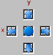

Also, one net point is already highlighted: The point closest to the origin of the 3D coordinate system is highlighted by means of white connecting lines to its neighboring points.

1. Click on the direction arrows to move the highlight up and down or to the left and right

or

1. Use the f hi¦ cursor keys.

The x axis and y axis sample points, together with the corresponding output value, are shown in the Value column of the table. The table also shows the ranges of all three axes.

1. Highlight the net point you want to edit.
1. Enter the new values for X, Y and Z in the value column.

For group and fixed characteristic maps, only the z axis values can be changed.

1. Click on the square in the center of the arrows

or

1. Press the 0 (zero) key to reset the highlight to its original state.

---

## Rotating the Coordination System

_Source: `markdown/rotate_coordination_system.md`_

# Rotating the Coordination System

To highlight points in an awkward position, you may have to rotate the coordinate system.

To rotate the coordination system, proceed as follows:

1. Select the Rotate option located above the list
1. Press the R key.
1. Click on one of the arrows in the rotation control at the bottom right of the 3-D graphical editor window.
1. Click the 0 button to revert to the original viewing angle.
1. Click and hold down an arrow button to rotate the graph more quickly.

The coordinate system is reduced to allow for faster rotation.

---

## Running an Offline Experiment

_Source: `markdown/EE_RunOfflineExperiment.md`_

# Running an Offline Experiment

Running an offline experiment contains the following steps:

- [Starting the Offline Experiment](markdown/start-offline_experiment.md)
- [Stopping the Offline Experiment](markdown/stop-offline_experiment.md)
- [Stepping through an Experiment](markdown/step_experiment.md)
- [Switching to Timed Step Mode](markdown/switch_timed_stepmode.md)
- [Setting up a Breakpoint Condition](markdown/setup_breakpoint_condi.md)
- [Viewing the Implementation](markdown/view_implementation.md)
- [Viewing Debug Information](markdown/view_debug_info.md)
- [Monitoring Events with the Event Tracer](markdown/monitor_events_events_tracer.md)
- [Configuring the Integration Method](SpecifyingCTBlocksEnglishUS.chm::/CTB_Configuring_the_Solver.htm)
- [Leaving the Experiment Environment](markdown/EE_Leaving_the_Experiment_Environment.md)

---

## Starting the Offline Experiment

_Source: `markdown/start-offline_experiment.md`_

A warning message opens.

You are running a simulation using MDF data with version [Version String]. ASCET supports MDF V2.0 only. Not all signal attributes/features might be supported.

- In the message window, do the following.

1. If you want to apply your answer to all such cases, activate Don't show this hint again.
1. Confirm the message with OK.

# Starting the Offline Experiment

To start the offline experiment, proceed as follows:

1. [Open the experimentation environment](markdown/open_experi_environ_offline.md) for the component or project you want to experiment with.
1. Adjust the measurement rate in the Measure Display Rate field.
1. Do one of the following:
1. Make any necessary adjustments in the data generator, event generator, measurement system or calibration system.

See also

[Opening the Experimentation Environment for an Offline Experiment](markdown/open_experi_environ_offline.md)

[Experiment Options](ComponentManagerEnglishUS.chm::/CM_Experiment_Options.htm)

[Defining a Signal](markdown/EE_define_signal.md)

[Signals and Icons - Importing Measurement Data to a Signal](SignalsandIconsEnglishUS.chm::/SI_import_measurement_data.htm)

/* Heikki Komulainen, Comet Computer GmbH 2004 */ cc_plus_pic = '&nbsp;'; cc_minus_pic = '&nbsp;'; cc_stat_pic = '&nbsp;'; gpstyle = ''; var iframes_created = 0; if (document.body && document.body.insertAdjacentHTML && document.getElementsByTagName && document.getElementById) { collect_popups(); set_poplinks_pictures(); if (iframes_created) { document.write(gpstyle); document.write('
<nobr><a id="einauslink" style="position:absolute;top:expression(document.body.scrollTop + this.offsetHeight - this.offsetHeight);left:expression(document.body.offsetWidth - (this.offsetWidth + 28));background:white;padding:5px" href="javascript:show_all_poptext()">Show all hidden text</a></nobr>
'); } } function collect_popups() { bsscpopups = new Array(); for (x = 0; x < document.links.length; x++) { if (document.links[x].href.indexOf("BSSCPopup")>-1) { seekmatch = /BSSCPopup.'[^'](markdown/+)'/; poplink = seekmatch.exec(document.links[x].href); poplink = "" + poplink; poplink = poplink.substring(poplink.indexOf("'")+1, poplink.lastIndexOf("'")); ifid = "CCGENIFRAMEID" + x; new_iframe = '<iframe id="' + ifid + '"src="' + poplink + '" onload="get_text(\'' + ifid + '\')" width="0" height="0" frameborder=0></iframe>'; document.links[x].parentNode.insertAdjacentHTML("afterEnd", new_iframe); gpid = "CCID_" + ifid; document.links[x].href = "javascript:expand_poptext('" + gpid + "')"; cc_plus = '' + cc_plus_pic + ''; document.links[x].insertAdjacentHTML("afterBegin", cc_plus); iframes_created = 1; } } }// end function function get_text(ifr_id) { frpars = document.frames[ifr_id].document.getElementsByTagName("body"); popbody = frpars[0].innerHTML; gpid = "CCID_" + ifr_id; if (!document.getElementById(gpid)) { //avoiding doubles document.getElementById(ifr_id).insertAdjacentHTML("afterEnd", '
'+popbody+'
'); } }//end function function expand_poptext(x_frame_id) { if (!document.getElementById(x_frame_id)) return; if (document.getElementById(x_frame_id).className == "CCGENPOPTEXTH") { document.getElementById(x_frame_id).className = "CCGENPOPTEXTV"; document.getElementById(x_frame_id).style.visibility = "visible"; if (document.getElementById("CCPMB_" + x_frame_id )) { document.getElementById("CCPMB_" + x_frame_id ).innerHTML = cc_minus_pic; } } else { document.getElementById(x_frame_id).className = "CCGENPOPTEXTH"; document.getElementById(x_frame_id).style.visibility = "hidden"; if (document.getElementById("CCPMB_" + x_frame_id )) { document.getElementById("CCPMB_" + x_frame_id ).innerHTML = cc_plus_pic; } } }// end function function show_all_poptext() { var pulldowntxt = document.getElementsByTagName("div"); for (b = 0; b < pulldowntxt.length; b++) { if (pulldowntxt[b].className == "droptext") { pulldowntxt[b].style.display=""; } } var gptxt = document.getElementsByTagName("div"); for (z = 0; z < gptxt.length; z++) { if (gptxt[z].className == "CCGENPOPTEXTH") { gptxt[z].className = "CCGENPOPTEXTV"; gptxt[z].style.visibility = "visible"; if (document.getElementById("CCPMB_" + gptxt[z].id )) { document.getElementById("CCPMB_" + gptxt[z].id ).innerHTML = cc_minus_pic; } } } var dxpoplinks = document.getElementsByTagName("a"); if (dxpoplinks) { for (pxl = 0; pxl < dxpoplinks.length; pxl++) { if (dxpoplinks[pxl].href.indexOf("kadovTextPopup")>-1) { if (document.getElementById("CCPMB_" + dxpoplinks[pxl].id)) { document.getElementById("CCPMB_" + dxpoplinks[pxl].id).innerHTML = cc_stat_pic; dxpoplinks[pxl].symbol = "minus"; } } } } document.getElementById('einauslink').innerText = 'Hide all hideable text'; document.getElementById('einauslink').href = "javascript:self.location.reload()"; self.focus(); }// end function function eat_click() { return false; }// end function function set_poplinks_pictures() { var dpoplinks = document.getElementsByTagName("a"); if (dpoplinks) { for (pl = 0; pl < dpoplinks.length; pl++) { if (dpoplinks[pl].href.indexOf("kadovTextPopup")>-1) { cc_plus = '' + cc_stat_pic + ''; //dpoplinks[pl].onmouseup = plusminuspoplink; dpoplinks[pl].insertAdjacentHTML("afterBegin", cc_plus); dpoplinks[pl].symbol = "plus"; } } } }// end function function plusminuspoplink() { if (document.getElementById("CCPMB_" + this.id)) { if (this.symbol == "plus") { document.getElementById("CCPMB_" + this.id).innerHTML = cc_minus_pic; this.symbol = "minus"; } else { document.getElementById("CCPMB_" + this.id).innerHTML = cc_plus_pic; this.symbol = "plus"; } } return true; }

---

## Stopping the Offline Experiment

_Source: `markdown/stop-offline_experiment.md`_

# Stopping the Offline Experiment

To stop the offline experiment, proceed as follows:

1. In the Experiment menu, select Stop Experiment.

or

1. Click the  Stop Offline Experiment button.

The experiment stops, but all settings remain active. The measurement data remains in the oscilloscope window and you can now analyze the data (see [Analyzing Measurement Data](markdown/analyze_measur_data.md)). Once you start the experiment again, the time axis is reset to 0. Parameters and variables are initialized, if required (see [Experiment Options](ComponentManagerEnglishUS.chm::/CM_Experiment_Options.htm)).

See also

[Analyzing Measurement Data](markdown/analyze_measur_data.md)

[Experiment Options](ComponentManagerEnglishUS.chm::/CM_Experiment_Options.htm)

---

## Leaving the Experiment Environment

_Source: `markdown/EE_Leaving_the_Experiment_Environment.md`_

# Leaving the Experiment Environment

To leave the offline experiment, proceed as follows:

1. Do one of the following to quit the experimentation environment and get back to the relevant editor for the component you have been simulating:
1. Activate the option Remember my Decision if you want to give the same answer to all questions of this type.
1. Click Yes to confirm the saving.
1. Click No to reject the saving.
1. Click Cancel to abort closing the experiment environment.

See also

[Confirmation Dialog Options](ComponentManagerEnglishUS.chm::/CM_Options_for_Confirmation_Dialogs.htm)

---

## Stepping through an Experiment

_Source: `markdown/step_experiment.md`_

# Stepping Through an Experiment

It is also possible to perform the experiment in single steps. At every step one event is activated in order of their priority.

1. Do one of the following:
1. If desired, adjust the number of steps to be performed in the 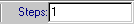 box before you step through the experiment.
1. Do one of the following to perform the experiment in single-step mode:

In the current version of ASCET, you can choose between three different types of step mode. An experiment either runs a number of steps, a number of seconds or until it reaches a breakpoint condition.

See also

[Switching to Timed Step Mode](markdown/switch_timed_stepmode.md)

[Setting up a Breakpoint Condition](markdown/setup_breakpoint_condi.md)

---

## Switching to Timed Step Mode

_Source: `markdown/switch_timed_stepmode.md`_

# Switching to Timed Step Mode

To switch to timed step mode, proceed as follows:

- In the experimentation environment, open the Tools menu, point to Event Generator, then point to Step Mode and select Timed [s] to activate the timed step mode.

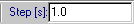

The experimentation environment displays a text field for entering the number of seconds the experiment is to run. You can specify the number of seconds and then step through the experiment as described above.

The third possibility to step through an experiment using a breakpoint condition lets you specify a condition for an element in your component (e.g. number of revolutions is greater than 5,000). The experiment runs until the condition evaluates to true.

---

## Setting up a Breakpoint Condition

_Source: `markdown/setup_breakpoint_condi.md`_

# Setting up a Breakpoint Condition

To set up a breakpoint condition, proceed as follows:

1. In the experimentation environment, open the Tools menu, point to Event Generator, then point to Step Mode and select Break At Condition to enable the breakpoint step mode.

The Edit Break Condition window is displayed. In this window, you specify the condition up to which the experiment is to run.

This editor can be opened later with the Tools menu, pointing to Event Generator and selecting Edit Break Condition command.

1. Click the Assign button to choose the name of the element you want to use in the condition.

A selection prompter dialog box displays a list of elements.

1. Select the desired element and click OK to use the element name.
1. Edit the remainder of the condition by selecting an operator from the list and enter the corresponding value.
1. Click OK to confirm.

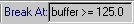

The experimentation environment displays a text field with the breakpoint condition. You can step through the experiment as described above.

See also

[Stepping through an Experiment](markdown/step_experiment.md)

[Switching to Timed Step Mode](markdown/switch_timed_stepmode.md)

---

## Viewing the Implementation

_Source: `markdown/view_implementation.md`_

# Viewing the Implementation

You can view the implementation of the component you are experimenting with at any time during experimentation. You can also view the implementation of each element included in the component. It is of no importance whether the experiment is running or stopped.

To view the implementation, proceed as follows:

1. In the Outline tab, select the element or component whose implementation you want to view.
1. In the Edit menu, point to Implementation and select Show.

This command is not available when you selected two or more elements.

The implementation editor for the selected object opens. Its usage is described in [Editing Implementations](ImplementationEditorEnglishUS.chm::/IEd_Overview.htm). Please note that the OK button is deactivated so that you cannot make any changes.

See also

[Editing Implementations - Overview](ImplementationEditorEnglishUS.chm::/IEd_Overview.htm)

---

## Viewing Debug Information

_Source: `markdown/view_debug_info.md`_

# Viewing Debug Information

Components that are specified in C code provide additional facilities to display either debug information or error messages during experimentation. You can embed debug or error messages in your C code. Debug information is displayed in the target debug viewer that can be opened during experimentation. Error messages are printed to the ASCET monitor window.

When editing C code, use the functions asdWriteUserDebug() and asdWriteUserError() to specify the information to be displayed. Both functions take an argument string which contains the message to be displayed. A typical statement could look like this:

asdWriteUserError(Overflow: \n Upper Limit exceeded.)

The string argument follows standard ANSI C rules, the example is printed in two lines. To view debug information, proceed as follows:

- In the Tools menu, select Target Debugger to open the C-Target Debug-Window.

See also

[Automatic Display](markdown/view_automatic_display.md)

[Manual Display](markdown/view_manual_display.md)

[Clearing the Debug Text](markdown/view_clear_text_window.md)

[Saving the Debug Text](markdown/view_save_text_window.md)

---

## Automatic Display

_Source: `markdown/view_automatic_display.md`_

# Automatic Display

To view automatic debug display information, proceed as follows:

- In the C-Target Debug-Window window, activate the on option

or

- Open the File menu and select Continuous Update.

Debugger information is displayed as soon as it is generated, and updated continuously.

---

## Manual Display

_Source: `markdown/view_manual_display.md`_

# Manual Display

To view debug display information manually, proceed as follows:

1. To disable continuous update, do one of the following:
1. To request new debug information, do one of the following:

- Click the Update button.
- In the File menu, select Update Text.

---

## Clearing the Debug Text

_Source: `markdown/view_clear_text_window.md`_

# Clearing the Debug Text

To clear the debug text, proceed as follows:

- Click the Clear Text button

or

- In the File menu, select Clear Text to clear the debug window.

---

## Saving the Debug Text

_Source: `markdown/view_save_text_window.md`_

# Saving the Debug Text

To save the text in the debug window, proceed as follows:

1. In the File menu, select Save as.

The file selection dialog opens.

1. Enter a path and file name.
1. Click Save.

The content of the debugger window is written to a text file with the specified name and path.

---

## Monitoring Events with the Event Tracer

_Source: `markdown/monitor_events_events_tracer.md`_

# Monitoring Events with the Event Tracer

You can monitor which events are being triggered in which order with the event tracer. The event tracer shows the time in seconds for every point of time at which any events are triggered. For each point the events are listed in the order in which they have been triggered.

To monitor events with the event tracer, proceed as follows:

1. Set up the experimentation environment for the component you want to experiment with.
1. Click on the  button
1. In the Tools menu, select Event Tracer to open the Event Tracer window.
1. In the Event Tracer window, click the  button to start the event tracer.
1. In the experimentation environment, start the experiment.
1. To stop tracing events, click the  button.
1. Click the 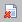 button to clear the Event Tracer window.

---

## Running a Back-Animation Experiment

_Source: `markdown/EE_Run_BackAnimationExperiment.md`_

# Running a Back-Animation Experiment

Running a back-animation experiment contains the following steps:

- [Starting Back-Animation](INTECRIOConnectivityRPEnglishUS.chm::/IIO_StartBackAnimation.htm)
- [Opening the Back-Animation Experiment Environment](INTECRIOConnectivityRPEnglishUS.chm::/IIO_Open_BackAnimation_EE.htm)
- Assigning elements to [new](markdown/assign_element_measurement.md) or [existing](markdown/assign_element_existing_measu.md) measure windows
- Setting up [numerical](markdown/setup_numerical_display.md) and [bar](markdown/setup_bar_display.md) displays
- [Assigning elements to calibration windows](markdown/calibrating_element.md)
- [Starting and Stopping a Back-Animation Measurement](markdown/EE_StartStop_BackAnimationExperiment.md)
- [Monitoring Elements](markdown/monitor-element.md)
- [Viewing the Implementation](markdown/view_implementation.md)
- [Viewing Debug Information](markdown/view_debug_info.md)
- Using [Data Logging](markdown/EE_DataLogging.md)
- Changing [Display Options](markdown/EE_DisplayOptions.md)
- [Leaving the Experiment Environment](markdown/EE_Leaving_the_Experiment_Environment.md)

---

## Starting and Stopping a Back-Animation Measurement

_Source: `markdown/EE_StartStop_BackAnimationExperiment.md`_

# Starting and Stopping a Back-Animation Measurement

To start a back-animation measurement, proceed as follows:

1. In the back-animation experiment window, do one of the following to start the measurement:
1. In the back-animation experiment window, do one of the following to stop the measurement:

See also

[Starting Back-Animation](INTECRIOConnectivityRPEnglishUS.chm::/IIO_StartBackAnimation.htm)

[Opening the Back-Animation Experiment Environment](INTECRIOConnectivityRPEnglishUS.chm::/IIO_Open_BackAnimation_EE.htm)

---

## Loading an Environment upon Experiment Start

_Source: `markdown/load_environment.md`_

# Loading an Environment upon Experiment Start

To load an environment, proceed as follows:

1. Open the experimentation environment.

If there is only the default environment, it is loaded automatically on opening the experimentation environment. If you have saved more than one environment for the component, the Environment Browser window opens with a list of all available environments.

1. Select the environment you want to load.
1. Click Load.

The experimentation environment opens with the selected environment.

See also

[Switching Environments during Experiments](markdown/switch_environment.md)

---

## Switching Environments during Experiments

_Source: `markdown/switch_environment.md`_

# Switching Environments during Experiments

It is possible to load environments, while the experimentation environment is already open. In that case, the currently open measurement and calibration windows remain open, but all other settings from the loaded environment become active, and all windows defined there are opened.

To switch environments, proceed as follows:

1. In the experimentation environment, click on the 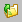 button
1. In the File menu, select Load Environment.
1. Choose one of the following steps:
1. Select the environment you want to open.
1. Click Load.
1. Choose one of the following steps:

1. Click Yes to continue and close all existing windows.
1. Click No to continue without closing all existing windows.

The selected environment opens.

---

## Saving an Environment

_Source: `markdown/save_environment.md`_

# Saving an Environment

To save an environment, proceed as follows:

1. Open the experimentation environment and make all necessary adjustments.
1. Click on the  button

or

1. In the File menu, select Save Environment to save the current environment.

See also

[Saving an Environment under a Different Name](markdown/save_environment_different_name.md)

[Saving an Environment for Another Component](markdown/EE_SaveEnvironment_for_Component.md)

[Exporting Environments](markdown/export_environment.md)

---

## Saving an Environment under a Different Name

_Source: `markdown/save_environment_different_name.md`_

# Saving an Environment under a Different Name

To save an environment under a different name, proceed as follows:

1. Click on the  button

or

1. In the File menu, select Save Environment As.

The Save Environment As window opens.

1. Enter a name for the experiment.
1. Enter a comment describing the experiment in the Comment pane.
1. Click OK.

The experiment is stored under the name you entered.

See also

[Saving an En[vironment](markdown/EE_SaveEnvironment_for_Component.md)](save_environment.md)

[Saving an Environment for Another Component](markdown/EE_SaveEnvironment_for_Component.md)

[Exporting Environments](markdown/export_environment.md)

---

## Saving an Environment for Another Component

_Source: `markdown/EE_SaveEnvironment_for_Component.md`_

# Saving an Environment for Another Component

You can save the current environment for another component. However, this is reasonable only if both components have a similar structure (same labels, same methods/processes). In this case, ASCET maps the stored measurement and calibration windows by hierarchical label.

Proceed as follows.

1. In the File menu, select Save Environment for Component.
1. Select the component for which you want to save the environment.
1. Click OK.
1. Enter a name and a comment for the environment and click OK.

The experiment is stored under the name you entered. You can select it the next time you open the component.

Measurement and calibration windows or channels with elements that do not exist in the new component are deleted. In most cases you will only restore event generator settings, and, if present in both components, data generator settings and measurement/calibration windows for global elements.

See also

1. [Exporting Environments](markdown/export_environment.md)
1. [Saving an Environment](markdown/save_environment.md)
1. [Saving an Environment under a Different Name](markdown/save_environment_different_name.md)
1. (item)

---

## Exporting Environments

_Source: `markdown/export_environment.md`_

# Exporting Environments

To export environments, proceed as follows:

1. In the File menu, select Export Experiment.

The Export File window opens.

1. Enter a path and filename for the export file.

Only the [binary export format](ComponentManagerEnglishUS.chm::/CM_Binary_Export.htm) (*.exp) is available.

1. Click on Save.

The currently selected environment is exported. Use the [import mechanism](ComponentManagerEnglishUS.chm::/ImportFolders.htm) of the Component Manager to import environments. The same rules apply to importing environments as to importing other data.

See also

[Saving an Environment](markdown/save_environment.md)

[Saving an Environment for a Component](markdown/EE_SaveEnvironment_for_Component.md)

[Binary Export](ComponentManagerEnglishUS.chm::/CM_Binary_Export.htm)

[Importing Folders and Database Items](ComponentManagerEnglishUS.chm::/ImportFolders.htm)

---

## Data Logging

_Source: `markdown/EE_DataLogging.md`_

# Data Logging

Data Logging contains the following steps:

- [Preparing to Log All Value Changes](markdown/prepare_transient_sample.md)
- [Opening the Data Logger](markdown/open_data_logger.md)
- [Setting up the Channels to be Logged](markdown/setup_channels_logged.md)
- [Using Label Lists](markdown/EE_Using_Label_Lists.md)
- [Adjusting the Logging Options](markdown/adjust_logging_options.md)
- [Logging Data](markdown/log_data.md)
- [Defining a Trigger Condition](markdown/define_trigger_condition.md)
- [Stopping Data Logging](markdown/stop_data_logging.md)
- [Changing the Log File](markdown/change_log_file.md)
- [Converting MDF Data to FAMOS Format](markdown/convert_mdf_famos.md)

---

## Preparing to Log All Value Changes

_Source: `markdown/prepare_transient_sample.md`_

# Preparing to Log All Value Changes

Data logging in Log all value changes mode requires a special setting in the project properties. If you want to log data in Periodic Sampling or Periodic to File mode, you do not have to modify the code generation settings.

To prepare for logging all value changes, proceed as follows:

1. Open the project you want to experiment with.
1. In the project editor, click on the 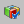 Project Properties button.

The Project Properties dialog window opens in the Build node.

1. Open the Experiment Code node.
1. Activate the Enable logging of all data changes option to switch on data logging.
1. Click OK.
1. Generate the code for the project and open the desired experimentation environment.

It is possible to generate code with or without logging of all value changes enabled. When you generate code with logging of all data changes enabled, the code will run more slowly, regardless of whether you are logging data or not.

See also

[The Data Logger](markdown/data_logger.md)

---

## Opening the Data Logger

_Source: `markdown/open_data_logger.md`_

# Opening the Data Logger

To open the data logger, proceed as follows:

1. Open the experimentation environment for the component or project.
1. Do one of the following:

- Click on the  Open Data Logger button.
- In the Tools menu, select Data Logger.

The Data Logger window opens.

See also

[Setting up the Channels to be Logged](markdown/setup_channels_logged.md)

[Using Label Lists](markdown/EE_Using_Label_Lists.md)

[Adjusting the Logging Options](markdown/adjust_logging_options.md)

[Logging Data](markdown/log_data.md)

---

## Setting up the Channels to be Logged

_Source: `markdown/setup_channels_logged.md`_

# Setting up the Channels to be Logged

To set up the channels to be logged, proceed as follows:

1. In the experiment environment, select the desired elements from the Outline tab.
1. In the Extras menu or in the elements' context menu, select Log to activate logging for the selected elements.
1. Alternatively, you can drag elements directly into the data logger.
1. In the Extras menu, select Log All to activate logging for all elements.
1. Activate the option Remember my Decision if you want to give the same answer to all questions of this type.
1. Click Yes to confirm the action.
1. Click No to abort the action.

The number of logged elements is limited by several factors, see [The Data Logger](markdown/data_logger.md).

See also

[Using Label Lists](markdown/EE_Using_Label_Lists.md)

[Adjusting the Logging Options](markdown/adjust_logging_options.md)

[The Data Logger](markdown/data_logger.md)

[Confirmation Dialog Options](ComponentManagerEnglishUS.chm::/CM_Options_for_Confirmation_Dialogs.htm)

---

## Using Label Lists

_Source: `markdown/EE_Using_Label_Lists.md`_

# Using Label Lists

If you close the data logger, the setup of registered elements gets lost. To ease setup for the next experiment, you can create a label list (*.lab format) for the elements currently in the data logger. This list can also be used for exchange with INCA, e.g. to make sure that the same elements are used in both tools.

1. [Open the data logger](markdown/open_data_logger.md).
1. [Set up the channels](markdown/setup_channels_logged.md) you want to log.
1. From the File menu, select Save to save a list of the elements.

If you save a list for the first time, you are asked for path and name of the file.

1. From the File menu, select Save As to save a list of the elements under an arbitrary name.
1. From the File menu, select Open to open an element list in the data logger.

If the list contains elements not present in the current experiment, those elements are ignored.

1. From the File menu, select Import to import a list in the *.csv (comma-separated values) or *.cfg (Select X) format.

You can use these formats to create and manage label lists outside of ASCET.

See also

[Opening the Data Logger](markdown/open_data_logger.md)

[Setting up the Channels to be Logged](markdown/setup_channels_logged.md)

---

## Adjusting the Logging Options

_Source: `markdown/adjust_logging_options.md`_

# Adjusting the Logging Options

To adjust the logging options, proceed as follows.

1. In the data logger, open the Options menu and select Logging Options.
1. In the message window, do the following:
1. [Select the logging mode](markdown/logging_mode.md).
1. [Set up data transfer to the host](markdown/data_transfer_host.md).
1. [Set up the target buffer](markdown/target_register_buffer.md).
1. [Select an output format](markdown/output_format.md).

The settings in the Logging Options window determine the number of channels that can be logged simultaneously. The number is shown at the bottom of the dialog window and updated every time you change any settings. The current limiting factor is also shown here. If you enter a setting that exceeds any limits set by other settings or the available resources, an error message is shown, and the setting is not changed.

See also

[Logging Options Window](markdown/EE_Logging_Options_Window.md)

[Logging Data](markdown/log_data.md)

[Defining a Trigger Condition](markdown/define_trigger_condition.md)

[Stopping Data Logging](markdown/stop_data_logging.md)

[Changing the Log File](markdown/change_log_file.md)

[Converting MDF Data to FAMOS Format](markdown/convert_mdf_famos.md)

[Component Manager - Confirmation Dialogs Node](ComponentManagerEnglishUS.chm::/CM_Options_for_Confirmation_Dialogs.htm)

---

## Selecting the Logging Mode

_Source: `markdown/logging_mode.md`_

# Selecting the Logging Mode

1. [Open](markdown/adjust_logging_options.md) the Logging Options window.
1. Click either the Log all value changes, the Periodic Sampling, or the Periodic to File radio button.
1. Activate the Log only last value change per time stamp to reduce the Log all value changes mode to logging only the last change of each logged variable per time stamp.
1. Select a task from the Log At combo box.
1. In the Host Logging Buffer field, adjust the channel length for the host logging buffer.
1. [Set up data transfer to the host](markdown/data_transfer_host.md).

See also

[Preparing to Log All Value Changes](markdown/prepare_transient_sample.md)

[Setting Up Data Transfer to the Host](markdown/data_transfer_host.md)

[Setting Up the Target Buffer](markdown/target_register_buffer.md)

[Selecting an Output Format](markdown/output_format.md)

[Logging Options Window](markdown/EE_Logging_Options_Window.md)

---

## Setting up Data Transfer to the Host

_Source: `markdown/data_transfer_host.md`_

# Setting up Data Transfer to the Host

1. [Open](markdown/adjust_logging_options.md) the Logging Options window.
1. Activate or deactivate the Continuous Polling option.
1. In the Cycle Time field, adjust the cycle time for continuous polling.
1. In the Data Rate field, enter a data rate.
1. [Set up the target buffer.](markdown/target_register_buffer.md)

See also

[Selecting the Logging Mode](markdown/logging_mode.md)

[Setting Up the Target Buffer](markdown/target_register_buffer.md)

[Selecting an Output Format](markdown/output_format.md)

[Logging Options Window](markdown/EE_Logging_Options_Window.md)

---

## Setting up the Target Buffer

_Source: `markdown/target_register_buffer.md`_

# Setting up the Target Buffer

1. [Open](markdown/adjust_logging_options.md) the Logging Options window.
1. In the Target Logging Buffer and Total Buffer fields, adjust the target logging buffer settings.
1. [Select the output format.](markdown/output_format.md)

See also

[Selecting the Logging Mode](markdown/logging_mode.md)

[Setting Up Data Transfer to the Host](markdown/data_transfer_host.md)

[Selecting an Output Format](markdown/output_format.md)

[Logging Options Window](markdown/EE_Logging_Options_Window.md)

---

## Selecting an Output Format

_Source: `markdown/output_format.md`_

# Selecting an Output Format

1. [Open](markdown/adjust_logging_options.md) the Logging Options window.
1. Select a storage format for the log file by clicking either the FAMOS or MDF options.
1. Click OK.

See also

[Selecting the Logging Mode](markdown/logging_mode.md)

[Setting Up Data Transfer to the Host](markdown/data_transfer_host.md)

[Setting Up the Target Buffer](markdown/target_register_buffer.md)

[Logging Options Window](markdown/EE_Logging_Options_Window.md)

---

## Logging Data

_Source: `markdown/log_data.md`_

# Logging Data

To log data, proceed as follows:

1. Start the experiment.
1. [Open the data logger](markdown/open_data_logger.md) and [set up channels](markdown/setup_channels_logged.md).
1. In the data logger, do one of the following:

- Click on the  Enable Logging button.
- In the Control menu, select Enable Logging.

The logging of the selected elements is started.

When you select this command before starting the experiment in the experiment environment, logging is initiated. Data will be logged only after the experiment is started.

See also

[Opening the Data Logger](markdown/open_data_logger.md)

[Setting up the Channels to be Logged](markdown/setup_channels_logged.md)

---

## Defining a Trigger Condition

_Source: `markdown/define_trigger_condition.md`_

# Defining a Trigger Condition

With the  button or Enable Logging in the Control menu, data logging starts immediately when the experiment is running. The Trigger Condition option offers the possibility to define a condition for the start of data logging. To do so, proceed as follows:

1. In the data logger, activate the Trigger Condition option.

The trigger condition can only be set when logging has stopped. Settings during logging are ignored.

1. From the left combo box, select one of the logged variables (e.g. air_nominal in the example).
1. From the combo box in the middle, select a comparison operator.

You can choose >= (greater or equal) or <= (smaller or equal).

1. In the right field, enter a threshold value (e.g. 380).

When you start the data logging now, the data logger postpones the actual logging until the condition is fulfilled. The data logger headline shows the status.

Once the condition is fulfilled, data logging starts, which is again shown in the headline. Data logging continues until it is switched off, even if the condition is no longer fulfilled.

---

## Stopping Data Logging

_Source: `markdown/stop_data_logging.md`_

# Stopping Data Logging

To stop data logging, proceed as follows:

1. Do one of the following:
1. Fill in the information fields as needed.
1. Do one of the following:

- Click the Save button to save the file.
- Click Discard to discard the data.

The data is stored in a log file at the end of each logging operation. This file is named datalog<n>.dat by default, <n> being an integer number which is incremented each time data is saved, provided Auto Increment DataLogger File Name is activated in the ASCET options, [Datalogger node](ComponentManagerEnglishUS.chm::/CM_Datalogger_Node.htm). If the option is deactivated, the log file is overwritten at the next logging.

By default, the log file is placed in the data directory of your ASCET installation, e.g., ETASData\Ascet<x.y> (<x.y> being the ASCET version number).

See also

[Changing the Log File](markdown/change_log_file.md)

[Datalogger Options](ComponentManagerEnglishUS.chm::/CM_Datalogger_Node.htm)

---

## Changing the Log File

_Source: `markdown/change_log_file.md`_

# Changing the Log File

You can change the default name and path of the log file.

To change the log file, proceed as follows:

1. [Stop data logging.](markdown/stop_data_logging.md)
1. Do one of the following:
1. Set the new path and filename.
1. Click OK to adjust the log file.

The filename at the bottom of the data logger window changes and the data is now written to the new file.

When you save more than one file, an integer number is added to the name you selected. This number is incremented each time data is saved.

See also

[Stopping Data Logging](markdown/stop_data_logging.md)

---

## Converting MDF Data to FAMOS Format

_Source: `markdown/convert_mdf_famos.md`_

# Converting MDF Data to FAMOS Format

To convert MDF V2.00 data to FAMOS format, proceed as follows:

1. In the data logger, open the Extras menu and select Convert MDF to FAMOS.
1. Select the MDF file you want to convert.
1. Select a path and filename for the FAMOS file.

The MDF input file is read, converted to FAMOS, and written to the selected output file.

---

## Data Manipulation

_Source: `markdown/EE_DataManipulation.md`_

# Data Manipulation

Data Manipulation contains the following steps:

- [Reading or Writing Data from the Current Data Set](markdown/read_write_current_dataset.md)
- [Setting up Data Exchange Options](markdown/EE_setup_dataExchange_Options.md)
- [Reading Data from External Files](markdown/EE_readData_externalFiles.md)
- [Writing Data to External Files](markdown/write_data_external_files.md)

---

## Reading or Writing Data from the Current Data Set

_Source: `markdown/read_write_current_dataset.md`_

# Reading or Writing Data from the Current Data Set

To read or write data from the current data set, proceed as follows:

1. In the Outline tab, select the element whose value you want to write.
1. In the Edit menu, point to Data, then point to Write Back and select Selected Elements or Calibrated Elements.
1. Deselect the variables you do not want to write back and click OK.
1. In the Extras menu, point to Reinitialize and select Variables or Parameters or Both to read the data from the current data set.

All variables and/or parameters are assigned the values from the current data set, the values in the experiment are overwritten. This command is not available while the experiment is running.

You can also write the parameter values to external files, or read them from external files.

When you are experimenting with the ES1135 simulation controller, you can also file out the data of non-volatile variables to an external file.

See also

[Writing Data to External Files](markdown/write_data_external_files.md)

[Reading Data from External Files](markdown/EE_readData_externalFiles.md)

---

## Setting up Data Exchange Options

_Source: `markdown/EE_setup_dataExchange_Options.md`_

# Setting up Data Exchange Options

To set up options for the exchange of measured data, proceed as follows:

1. In the Component Manager, open the ASCET options window.
1. In the Data Exchange node, adjust the options.
1. Close the ASCET options window with OK.

See also

[Data Exchange Options](ComponentManagerEnglishUS.chm::/CM_Data_Exchange_node.htm)

---

## Reading Data from External Files

_Source: `markdown/EE_readData_externalFiles.md`_

# Reading Data from External Files

To read data from external files, proceed as follows:

1. In the Edit menu, point to Data and select Load.
1. Set the required options:
1. Click on OK.

The values of the selected parameters are read from the specified file. If required, the read log file is displayed.

See also

[Writing Data to External Files](markdown/write_data_external_files.md)

[Load/Save DCM File Windows](markdown/ee_load_dcm_file_window.md)

[Component Manager - Data Exchange Options](ComponentManagerEnglishUS.chm::/CM_Data_Exchange_node.htm)

---

## Writing Data to External Files

_Source: `markdown/write_data_external_files.md`_

# Writing Data to External Files

To write data to external files, proceed as follows:

1. In the Outline tab, select the parameters whose values you want to write to a file.
1. In the Edit menu, point to Data and select Save.
1. Set the required options:
1. Click on OK.

The values of the selected parameters are written to the specified file. If required, the write log file is displayed.

See also

[Data Exchange Options](ComponentManagerEnglishUS.chm::/CM_Data_Exchange_node.htm)

[Load/Save DCM File Windows](markdown/ee_load_dcm_file_window.md)

---

## Display Options

_Source: `markdown/EE_DisplayOptions.md`_

# Display Options

You can change the way projects or components are displayed in the experiment window in several ways:

- [Filtering the Tree Pane](markdown/ee_filter_treePane.md)
- [Changing the Experiment Window Look](markdown/EE_ChangeExperimentWindowLook.md)
- [Changing the Block Diagram Display](markdown/change_blockdia_display.md)
- [Switching between the Diagrams of a Component](markdown/switch_between_diagrams_compo.md)
- [Navigating Down](markdown/navigate_down_blockdiagram.md) to child components, graphical hierarchies or statement blocks
- [Navigating Up](markdown/navigate_up_blockdiagram.md) to the parent component, graphical hierarchy or statement block

---

## Filtering the Tree Pane

_Source: `markdown/ee_filter_treePane.md`_

# Filtering the Tree Pane

The Outline and Navigation tabs can be filtered. To do so, proceed as follows.

##### Outline tab

1. Click on the  button to switch to the default hierarchical view.

This is the only way to display diagrams, methods and processes.

1. Click on the  button display the elements of the component in a flat structure.
1. Click on the  button to display only exported elements.
1. Click on the  button to display only parameters.

##### Navigation tab

1. In the tab you want to filter, click on the  button.

The ASCET Options window opens in the Navigation Tree node.

1. In the Navigation Tree node, activate the options of the items you want to display in the tab.
1. Click OK to close the ASCET Options window.

Only items with activated options are shown in the tab. The button is marked with a green symbol to indicate an active filter: 

The filter settings made here affect all component editors.

---

## Changing the Experiment Window Look

_Source: `markdown/EE_ChangeExperimentWindowLook.md`_

# Changing the Experiment Window Look

To change the look of the experiment window, proceed as follows.

1. Click the 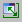 Expand/Collapse Window button to hide the component display of the experiment window.
1. Click on the 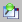 Always on top button, and the Physical Experiment window will always remain in the foreground.
1. Click the  Expand/Collapse Window button again to make the component visible again.

---

## Changing the Block Diagram Display

_Source: `markdown/change_blockdia_display.md`_

# Changing the Block Diagram Display

To change the block diagram display, proceed as follows:

1. In the View menu, select Show Sequence Calls to have the sequence calls of the current block diagram displayed.
1. By default the sequence calls are not shown.
1. In the View menu, select Hide Sequence Calls to hide the sequence calls.
1. In the Window menu, select Redraw to redraw the block diagram.

---

## Switching between the Diagrams of a Component

_Source: `markdown/switch_between_diagrams_compo.md`_

# Switching between the Diagrams of a Component

To switch between the diagrams of a component, proceed as follows:

1. In the Outline tab of the experimentation environment, select the diagram you want to switch to.
1. Do one of the following:

- Open the Windows menu and select Load Diagram.
- Right-click the diagram and select Load Diagram from the context menu.
- Double-click the diagram.

The selected diagram is displayed.

See also

[Navigating Down](markdown/navigate_down_blockdiagram.md)

[Navigating Up](markdown/navigate_up_blockdiagram.md)

---

## Navigating Down

_Source: `markdown/navigate_down_blockdiagram.md`_

shows the component used in the experiment

# Navigating Down

To navigate down to a child component, graphical hierarchy or statement block, proceed as follows:

1. In the Outline tab, select the referenced component whose block diagram you want to view.
1. Do one of the following:
1. In the [experiment view](javascript:kadovTextPopup(this))<!-- kadovTextPopupInit('a1'); //-->, double-click on the occurrence of an included component, hierarchy or statement block.

The content of the selected item is shown in the experimentation environment.

See also

[Navigating Up](markdown/navigate_up_blockdiagram.md)

[Switching between the Diagrams of a Component](markdown/switch_between_diagrams_compo.md)

---

## Navigating Up

_Source: `markdown/navigate_up_blockdiagram.md`_

shows the component used in the experiment

# Navigating Up

To navigate up to the parent component, graphical hierarchy or statement block, proceed as follows:

1. Do one of the following:
1. Double-click on an empty place in the display.

Upward and downward navigation by double-click in the [experiment view](javascript:kadovTextPopup(this))<!-- kadovTextPopupInit('a1'); //--> works only in block diagrams and state machines.

The parent component, graphical hierarchy or statement block is displayed.

See also

[Navigating Down](markdown/navigate_down_blockdiagram.md)

[Switching between the Diagrams of a Component](markdown/switch_between_diagrams_compo.md)

---

## Reference to User Interface

_Source: `markdown/EE_Reference_UserInterface.md`_

# Reference to User Interface

The experiment window is available in the following editions:

- [offline experiment window](markdown/EE_Description_WindowElements.md)
- online experiment window

The online experiment window is only available for ASCET-RP. See the ASCET-RP user's guide for further information.

- [back-animation experiment window](markdown/EE_BackAnimationExperimentWindow.md)

All editions use the same measurement and calibration windows:

- [Measurement Windows](markdown/EE_MeasurementWindowsGUI.md)
- [Calibration Windows](markdown/EE_CalibrationWindows_UI.md)

---

## Offline Experiment Window

_Source: `markdown/EE_Description_WindowElements.md`_

# Offline Experiment Window

The offline experiment window contains the following window elements:

- [Menu bar](markdown/EE_menu_bar.md)
- [Toolbar](markdown/EE_button_bar_offline_experiment.md)
- [Tree pane](markdown/EE_ComponentPane.md)

This pane lists all elements of the component.

- Outline tab
- Navigation tab

- Experiment view

This view shows the component used in the experiment. It corresponds to the editor of the component displayed in the experiment: if you are displaying a project, the experiment view shows the tabs of the project editor, if you are displaying a block diagram, ESDL, or C code component, the experiment view shows the component.

You can

[Run an Offline Experiment](markdown/EE_RunOfflineExperiment.md)

---

## Menu Bar (Offline Experiment)

_Source: `markdown/EE_menu_bar.md`_

# Menu Bar (Offline Experiment)

This menu bar contains the following menus:

- [File](markdown/EE_file_menu.md)
- [Edit](markdown/EE_EditMenu_Experiment.md)
- [View](markdown/EE_view_menu.md)
- [Experiment](markdown/EE_experiment_menu.md) (Offline Experiment)
- [Extras](markdown/EE_ExtrasMenu_Experiment.md)
- [Tools](markdown/EE_ToolsMenu_Experiment.md) (Offline Experiment)
- [Window](markdown/EE_WindowMenu_Experiment.md)
- [Help](markdown/EE_HelpMenu_Experiment.md)

---

## File Menu (Experiment)

_Source: `markdown/EE_file_menu.md`_

# File Menu (Experiment)

This menu contains the following options:

Load Environment

Loads an environment (configuration) for the current experiment.

Save Environment (Ctrl + s)

Saves the current experiment configuration.

Save Environment As

Saves the current experiment configuration with a different name.

Save Environment for Component

Copies the current experiment configuration to a selected component.

Export Environment

Exports the experiment configurations of the current component.

Close

Leaves the Offline experimentation environment.

---

## Edit Menu (Experiment)

_Source: `markdown/EE_EditMenu_Experiment.md`_

# Edit Menu (Experiment)

This menu contains the following options:

Open Component

Displays the selected included component in the experiment view.

Open Parent Component

Displays the parent component of a selected included component in the experiment view.

Implementation

| Column 1 | Column 2 |
| --- | --- |
| Show (Ctrl + Shift + i) | Shows the implementation of the selected element (read only). |

Data

| Column 1 | Column 2 |
| --- | --- |
| Load | Loads data from a file. The options for this procedure are set in a special window. |
| Save | Writes the data of selected parameters or variables to a file. The options for this procedure are set in a special window. |
| Write Back | Writes the values of elements to the current data set of the component: Selected Elements elements selected in the Outline tab Calibrated Elements elements calibrated during the experiment |
| Selected Elements | elements selected in the Outline tab |
| Calibrated Elements | elements calibrated during the experiment |

---

## View Menu (Experiment)

_Source: `markdown/EE_view_menu.md`_

# View Menu (Experiment)

This menu contains the following options:

##### Show Seqence Calls (Ctrl + n)

Shows the sequence calls of the displayed block diagram.

##### Hide Sequence Calls (Ctrl + Shift + n)

Hides the sequence calls of the displayed block diagram.

##### Monitor All (Ctrl + o)

Assigns monitors to all elements.

##### Delete Monitors (Ctrl + Shift + o)

Deletes all monitors in the diagram.

##### Automatic Monitor Mode

If activated, monitors are assigned to all elements in the currently loaded part (e.g., diagram, hierarchy level, ...) of the block diagram. See also [Activating Automatic Monitoring Mode](markdown/EE_Activate_AutomaticMonitorMode.md).

---

## Experiment Menu (Offline Experiment)

_Source: `markdown/EE_experiment_menu.md`_

# Experiment Menu (Offline Experiment)

These menu options are only available in offline experiments.

This menu contains the following options:

Automatic Stop (for Signals)

Stops the experiment automatically when the end of the stimulating signal is reached [(Setting up the Automatic Stop)](markdown/setup_automatic_stop.md).

Stop Experiment (F6)

Stops the experiment.

Start Experiment (F7)

Starts the experiment.

Pause Experiment (F8)

The experiment is paused.

Step Experiment (Shift + F7)

The experiment is performed in step mode.

See also

[Setting up the Automatic Stop](markdown/setup_automatic_stop.md)

---

## Extras Menu (Experiment)

_Source: `markdown/EE_ExtrasMenu_Experiment.md`_

# Extras Menu (Experiment)

This menu contains the following options:

Calibrate (Ctrl + Shift + c)

Opens a calibration window for the selected elements.

Stimulate (Ctrl + Shift + s)

This menu option is only available in offline experiments.

Opens the Stimulus dialog for the selected element.

Measure (Ctrl + Shift + m)

Opens a measurement window for the selected elements.

Log (Ctrl + Shift + l)

Adds selected elements to the Data Logger.

Log All

Adds all elements to the Data Logger.

Reinitialize

This menu option is only available in offline experiments.

Reads the values of certain elements from the current data set of the component:

| Column 1 | Column 2 |
| --- | --- |
| Variables | of variables. |
| Parameters | of parameters. |
| Both | of variables and parameters. |

---

## Tools Menu (Offline Experiment)

_Source: `markdown/EE_ToolsMenu_Experiment.md`_

# Tools Menu (Offline Experiment)

This menu contains the following options:

##### Event Generator

| Column 1 | Column 2 |
| --- | --- |
| Open | Opens the event generator . |
| Step Mode | Manages the step mode. Steps Selects single step mode (default). Timed [s] Selects timed step mode. Break At Condition Selects breakpoint step mode. Edit Break Condition Opens the breakpoint condition editor. |
| Steps | Selects single step mode (default). |
| Timed [s] | Selects timed step mode. |
| Break At Condition | Selects breakpoint step mode. |
| Edit Break Condition | Opens the breakpoint condition editor. |

##### Event Tracer

Opens the Event Tracer window for data tracing.

##### Data Generator

Opens the [data generator](markdown/data_generator.md).

##### Data Logger

Opens the [data logger](markdown/data_logger.md).

##### Target Debugger

Opens the debug window for C code components.

##### Options

Opens the Options dialog window, reduced to the [Experiment](ComponentManagerEnglishUS.chm::/CM_Experiment_Options.htm) node (without subnodes).

---

## Window Menu (Experiment)

_Source: `markdown/EE_WindowMenu_Experiment.md`_

# Window Menu (Experiment)

This menu contains the following options:

Load Diagram

Displays the diagram selected in the Outline tab.

Redraw (F5)

Redraws the block diagram.

Update Calibration Windows

Updates the contents of the calibration windows.

Close Calibration Windows

Closes all open calibration windows.

Close Measure Windows

Closes all open measurement windows.

---

## Help Menu (Experiment)

_Source: `markdown/EE_HelpMenu_Experiment.md`_

# Help Menu (Experiment)

This menu contains the following options:

Contents (F1)

Shows the help contents.

Index

Shows the help index.

---

## Toolbar - Offline Experiment

_Source: `markdown/EE_button_bar_offline_experiment.md`_

# Toolbar - Offline Experiment

This toolbar contains the following buttons:

| Column 1 | Column 2 |
| --- | --- |
| ... | Exit to Component (closes the experiment and opens the component editor; the appearance of the button depends on the component used in the experiment) |
|  | Load Environment (loads an experiment environment, i.e. predefined measure and calibration windows with assigned variables) |
|  | Save Environment |
|  | Save Environment As |
|  | Stop Offline Experiment |
|  | Start Offline Experiment |
|  | Pause Offline Experiment (pauses the experiment, continue with buttons or ) |
|  | Step Offline Experiment |
|  | Input field for step size |
|  | Open CT Solver This button is only available when you are experimenting with a CT block or a hybrid project. |
|  | Open Event Generator This button is not available when you are experimenting with a CT block or a hybrid project. |
|  | Open Event Tracer (opens the Event Tracer window for data tracing) |
|  | Open Data Generator |
|  | Open Data Logger |
|  | Expands / Collapse Window (shows/hides the component display). |
|  | Always on top (keeps the Physical Experiment window always in the foreground of the monitor) |
|  | Navigate down to selected component of element tree. |
|  | Navigate up to parent component. |
|  | Select Zoom Factor combo box |
|  | Calibration Window combo box |
|  | Measurement Window combo box |
|  | Measure Display Rate field ( <n> calculation steps are performed before the measure data display is updated) |

---

## Tree Pane (Experiment)

_Source: `markdown/EE_ComponentPane.md`_

# Tree Pane (Experiment)

The Tree pane contains the following tabs and filter functions:

##### Outline

This tab shows all elements, processes and methods of the component self:<component name>.

The experiment runs in the context of a project where all globals are resolved and exported elements are used in place of imported elements. Therefore, the icons of imported elements are replaced by the icons of exported elements.

You can select the elements to view using filters and search:

| Column 1 | Column 2 |
| --- | --- |
|  | Show Elements Hierarchical |
|  | Show Elements Flat |
|  | Show Exported Elements |
|  | Show Parameter Elements |
|  | Runs a search in the Outline tab for the specified text. |

##### Navigation

In this tab all Graphic Blocks of the component are listed in tree view.

This tab is only useful when you are experimenting with a block diagram.

| Column 1 | Column 2 |
| --- | --- |
|  | Opens the Options dialog window, reduced to the settings of the Filter. |
|  | Runs a search in the Navigation tab for the specified text. |

See also

[Filtering the Tree Pane](markdown/ee_filter_treePane.md)

---

## Back-Animation Experiment Window

_Source: `markdown/EE_BackAnimationExperimentWindow.md`_

# Back-Animation Experiment Window

The back-animation experiment window contains the following window elements:

- [Menu bar](markdown/EE_MenuBar_BackAnimationExperiment.md)
- [Toolbar](markdown/EE_Toolbar_BackAnimation.md)
- [Tree pane](markdown/EE_ComponentPane.md)

This pane lists all elements of the component.

- Outline tab
- Navigation tab

- Experiment view

This view shows the component used in the experiment. It corresponds to the editor of the component displayed in the experiment: if you are displaying a project, the experiment view shows only the Graphics tab of the project editor, if you are displaying a block diagram, ESDL, or C code component, the experiment view shows the component.

You can

[Run a Back-Animation Experiment](markdown/EE_Run_BackAnimationExperiment.md)

---

## Toolbar - Back-Animation Experiment

_Source: `markdown/EE_Toolbar_BackAnimation.md`_

# Toolbar - Back-Animation Experiment

This toolbar contains the following buttons:

| Column 1 | Column 2 |
| --- | --- |
| ... | Exit to Component (closes the experiment and opens the component editor; the appearance of the button depends on the component used in the experiment) |
|  | Load Environment (loads an experiment environment, i.e. predefined measure and calibration windows with assigned variables) |
|  | Save Environment |
|  | Save Environment As |
|  | Stop Measurement |
|  | Start Measurement |
|  | Expand / Collapse Window (shows/hides the component display) |
|  | Always on top (keeps the Experiment window always in the foreground of the monitor) |
|  | Navigate down to selected component of element tree. |
|  | Navigate up to parent component. |
|  | Calibration Window combo box |
|  | Measurement Window combo box |

---

## Menu Bar (Back-Animation Experiment)

_Source: `markdown/EE_MenuBar_BackAnimationExperiment.md`_

# Menu Bar (Back-Animation Experiment)

This menu bar contains the following menus:

- [File](markdown/EE_file_menu.md)
- [Edit](markdown/EE_EditMenu_Experiment.md)
- [View](markdown/EE_view_menu.md)
- [Experiment](markdown/EE_ExperimentMenu_BackAnimation.md) (Back-Animation Experiment)
- [Extras](markdown/EE_ExtrasMenu_Experiment.md)
- [Tools](markdown/EE_ToolsMenu_BackAnimation.md) (Back-Animation Experiment)
- [Window](markdown/EE_WindowMenu_Experiment.md)
- [Help](markdown/EE_HelpMenu_Experiment.md)

---

## File Menu (Experiment)

_Source: `markdown/EE_file_menu.md`_

# File Menu (Experiment)

This menu contains the following options:

Load Environment

Loads an environment (configuration) for the current experiment.

Save Environment (Ctrl + s)

Saves the current experiment configuration.

Save Environment As

Saves the current experiment configuration with a different name.

Save Environment for Component

Copies the current experiment configuration to a selected component.

Export Environment

Exports the experiment configurations of the current component.

Close

Leaves the Offline experimentation environment.

---

## Edit Menu (Experiment)

_Source: `markdown/EE_EditMenu_Experiment.md`_

# Edit Menu (Experiment)

This menu contains the following options:

Open Component

Displays the selected included component in the experiment view.

Open Parent Component

Displays the parent component of a selected included component in the experiment view.

Implementation

| Column 1 | Column 2 |
| --- | --- |
| Show (Ctrl + Shift + i) | Shows the implementation of the selected element (read only). |

Data

| Column 1 | Column 2 |
| --- | --- |
| Load | Loads data from a file. The options for this procedure are set in a special window. |
| Save | Writes the data of selected parameters or variables to a file. The options for this procedure are set in a special window. |
| Write Back | Writes the values of elements to the current data set of the component: Selected Elements elements selected in the Outline tab Calibrated Elements elements calibrated during the experiment |
| Selected Elements | elements selected in the Outline tab |
| Calibrated Elements | elements calibrated during the experiment |

---

## View Menu (Experiment)

_Source: `markdown/EE_view_menu.md`_

# View Menu (Experiment)

This menu contains the following options:

##### Show Seqence Calls (Ctrl + n)

Shows the sequence calls of the displayed block diagram.

##### Hide Sequence Calls (Ctrl + Shift + n)

Hides the sequence calls of the displayed block diagram.

##### Monitor All (Ctrl + o)

Assigns monitors to all elements.

##### Delete Monitors (Ctrl + Shift + o)

Deletes all monitors in the diagram.

##### Automatic Monitor Mode

If activated, monitors are assigned to all elements in the currently loaded part (e.g., diagram, hierarchy level, ...) of the block diagram. See also [Activating Automatic Monitoring Mode](markdown/EE_Activate_AutomaticMonitorMode.md).

---

## Experiment Menu (Back-Animation Experiment)

_Source: `markdown/EE_ExperimentMenu_BackAnimation.md`_

# Experiment Menu (Back-Animation Experiment)

These menu options are only available in back-animation experiments.

This menu contains the following options:

Stop Measurement (F8)

Stops the measurement.

Start Measurement (F9)

Starts the measurement.

Monitor All

Assigns monitors to all elements.

Delete Monitors

Deletes all monitors in the diagram.

---

## Extras Menu (Experiment)

_Source: `markdown/EE_ExtrasMenu_Experiment.md`_

# Extras Menu (Experiment)

This menu contains the following options:

Calibrate (Ctrl + Shift + c)

Opens a calibration window for the selected elements.

Stimulate (Ctrl + Shift + s)

This menu option is only available in offline experiments.

Opens the Stimulus dialog for the selected element.

Measure (Ctrl + Shift + m)

Opens a measurement window for the selected elements.

Log (Ctrl + Shift + l)

Adds selected elements to the Data Logger.

Log All

Adds all elements to the Data Logger.

Reinitialize

This menu option is only available in offline experiments.

Reads the values of certain elements from the current data set of the component:

| Column 1 | Column 2 |
| --- | --- |
| Variables | of variables. |
| Parameters | of parameters. |
| Both | of variables and parameters. |

---

## Tools Menu (Back-Animation Experiment)

_Source: `markdown/EE_ToolsMenu_BackAnimation.md`_

# Tools Menu (Back-Animation Experiment)

This menu contains the following options:

Data Logger

Opens the data logger.

Target Debugger

Opens the debug window for C code components.

NVRAM Cockpit

Only available when the target ES1135, ES910, or RTPRO-PC is selected.

Opens the NVRAM cockpit.

---

## Window Menu (Experiment)

_Source: `markdown/EE_WindowMenu_Experiment.md`_

# Window Menu (Experiment)

This menu contains the following options:

Load Diagram

Displays the diagram selected in the Outline tab.

Redraw (F5)

Redraws the block diagram.

Update Calibration Windows

Updates the contents of the calibration windows.

Close Calibration Windows

Closes all open calibration windows.

Close Measure Windows

Closes all open measurement windows.

---

## Help Menu (Experiment)

_Source: `markdown/EE_HelpMenu_Experiment.md`_

# Help Menu (Experiment)

This menu contains the following options:

Contents (F1)

Shows the help contents.

Index

Shows the help index.

---

## Tree Pane (Experiment)

_Source: `markdown/EE_ComponentPane.md`_

# Tree Pane (Experiment)

The Tree pane contains the following tabs and filter functions:

##### Outline

This tab shows all elements, processes and methods of the component self:<component name>.

The experiment runs in the context of a project where all globals are resolved and exported elements are used in place of imported elements. Therefore, the icons of imported elements are replaced by the icons of exported elements.

You can select the elements to view using filters and search:

| Column 1 | Column 2 |
| --- | --- |
|  | Show Elements Hierarchical |
|  | Show Elements Flat |
|  | Show Exported Elements |
|  | Show Parameter Elements |
|  | Runs a search in the Outline tab for the specified text. |

##### Navigation

In this tab all Graphic Blocks of the component are listed in tree view.

This tab is only useful when you are experimenting with a block diagram.

| Column 1 | Column 2 |
| --- | --- |
|  | Opens the Options dialog window, reduced to the settings of the Filter. |
|  | Runs a search in the Navigation tab for the specified text. |

See also

[Filtering the Tree Pane](markdown/ee_filter_treePane.md)

---

## Measurement Windows

_Source: `markdown/EE_MeasurementWindowsGUI.md`_

The oscilloscope window contains the following elements:

- [File Menu](markdown/EE_file_measur_win.md)
- [Edit Menu](markdown/EE_edit_measur_win.md)
- [View Menu](markdown/EE_view_measur_win.md)
- [Extras Menu](markdown/EE_extras_measur_win.md)
- Signals pane

Shows the curves for the numerical values being measured.

- Measure channels field

Shows the names of the selected scalar channels, together with various user-definable pieces of information about them.

- Bit channels field

Shows the names of the selected logical channels, together with various user-definable pieces of information about them.

The numeric display window contains the following elements.

- [View Menu](markdown/EE_view_measur_win.md)
- [Extras Menu](markdown/EE_extras_measur_win.md)
- <variable> field (one for each displayed variable)

The bar display windows contain the following elements.

- [Extras Menu](markdown/EE_extras_measur_win.md)
- <variable> bar (one for each displayed element)

The bit display windows contain the following elements.

- [Extras Menu](markdown/EE_extras_measur_win.md)
- <variable> field (one for each displayed element)

The recorder window contains the following elements:

- [File Menu](markdown/EE_file_measur_win.md)
- [Edit Menu](markdown/EE_edit_measur_win.md)
- [View Menu](markdown/EE_view_measur_win.md)
- [Extras Menu](markdown/EE_extras_measur_win.md)
- Signals pane

Shows the curves for the numerical values being measured.

- Measure channels field

Shows the names of the selected scalar channels, together with various user-definable pieces of information about them.

- Bit channels field

Shows the names of the selected logical channels, together with various user-definable pieces of information about them.

# Measurement Windows

In the experimentation environments, you have the choice of a number of measurement windows. The following measurement windows can be selected, sorted into experimentation environments.

- [Oscilloscope](javascript:kadovTextPopup(this))<!-- kadovTextPopupInit('a1'); //-->
- [Numerical Display](javascript:kadovTextPopup(this))<!-- kadovTextPopupInit('a2'); //-->
- [Horizontal and Vertical Bar Display](javascript:kadovTextPopup(this))<!-- kadovTextPopupInit('a3'); //-->
- [Bit Display](javascript:kadovTextPopup(this))<!-- kadovTextPopupInit('a4'); //-->
- [Recorder](javascript:kadovTextPopup(this))<!-- kadovTextPopupInit('a5'); //-->

Oscilloscope and recorder are not available for back-animation experiments.

/* Heikki Komulainen, Comet Computer GmbH 2004 */ cc_plus_pic = '&nbsp;'; cc_minus_pic = '&nbsp;'; cc_stat_pic = '&nbsp;'; gpstyle = ''; var iframes_created = 0; if (document.body && document.body.insertAdjacentHTML && document.getElementsByTagName && document.getElementById) { collect_popups(); set_poplinks_pictures(); if (iframes_created) { document.write(gpstyle); document.write('
<nobr><a id="einauslink" style="position:absolute;top:expression(document.body.scrollTop + this.offsetHeight - this.offsetHeight);left:expression(document.body.offsetWidth - (this.offsetWidth + 28));background:white;padding:5px" href="javascript:show_all_poptext()">Show all hidden text</a></nobr>
'); } } function collect_popups() { bsscpopups = new Array(); for (x = 0; x < document.links.length; x++) { if (document.links[x].href.indexOf("BSSCPopup")>-1) { seekmatch = /BSSCPopup.'[^'](markdown/+)'/; poplink = seekmatch.exec(document.links[x].href); poplink = "" + poplink; poplink = poplink.substring(poplink.indexOf("'")+1, poplink.lastIndexOf("'")); ifid = "CCGENIFRAMEID" + x; new_iframe = '<iframe id="' + ifid + '"src="' + poplink + '" onload="get_text(\'' + ifid + '\')" width="0" height="0" frameborder=0></iframe>'; document.links[x].parentNode.insertAdjacentHTML("afterEnd", new_iframe); gpid = "CCID_" + ifid; document.links[x].href = "javascript:expand_poptext('" + gpid + "')"; cc_plus = '' + cc_plus_pic + ''; document.links[x].insertAdjacentHTML("afterBegin", cc_plus); iframes_created = 1; } } }// end function function get_text(ifr_id) { frpars = document.frames[ifr_id].document.getElementsByTagName("body"); popbody = frpars[0].innerHTML; gpid = "CCID_" + ifr_id; if (!document.getElementById(gpid)) { //avoiding doubles document.getElementById(ifr_id).insertAdjacentHTML("afterEnd", '
'+popbody+'
'); } }//end function function expand_poptext(x_frame_id) { if (!document.getElementById(x_frame_id)) return; if (document.getElementById(x_frame_id).className == "CCGENPOPTEXTH") { document.getElementById(x_frame_id).className = "CCGENPOPTEXTV"; document.getElementById(x_frame_id).style.visibility = "visible"; if (document.getElementById("CCPMB_" + x_frame_id )) { document.getElementById("CCPMB_" + x_frame_id ).innerHTML = cc_minus_pic; } } else { document.getElementById(x_frame_id).className = "CCGENPOPTEXTH"; document.getElementById(x_frame_id).style.visibility = "hidden"; if (document.getElementById("CCPMB_" + x_frame_id )) { document.getElementById("CCPMB_" + x_frame_id ).innerHTML = cc_plus_pic; } } }// end function function show_all_poptext() { var pulldowntxt = document.getElementsByTagName("div"); for (b = 0; b < pulldowntxt.length; b++) { if (pulldowntxt[b].className == "droptext") { pulldowntxt[b].style.display=""; } } var gptxt = document.getElementsByTagName("div"); for (z = 0; z < gptxt.length; z++) { if (gptxt[z].className == "CCGENPOPTEXTH") { gptxt[z].className = "CCGENPOPTEXTV"; gptxt[z].style.visibility = "visible"; if (document.getElementById("CCPMB_" + gptxt[z].id )) { document.getElementById("CCPMB_" + gptxt[z].id ).innerHTML = cc_minus_pic; } } } var dxpoplinks = document.getElementsByTagName("a"); if (dxpoplinks) { for (pxl = 0; pxl < dxpoplinks.length; pxl++) { if (dxpoplinks[pxl].href.indexOf("kadovTextPopup")>-1) { if (document.getElementById("CCPMB_" + dxpoplinks[pxl].id)) { document.getElementById("CCPMB_" + dxpoplinks[pxl].id).innerHTML = cc_stat_pic; dxpoplinks[pxl].symbol = "minus"; } } } } document.getElementById('einauslink').innerText = 'Hide all hideable text'; document.getElementById('einauslink').href = "javascript:self.location.reload()"; self.focus(); }// end function function eat_click() { return false; }// end function function set_poplinks_pictures() { var dpoplinks = document.getElementsByTagName("a"); if (dpoplinks) { for (pl = 0; pl < dpoplinks.length; pl++) { if (dpoplinks[pl].href.indexOf("kadovTextPopup")>-1) { cc_plus = '' + cc_stat_pic + ''; //dpoplinks[pl].onmouseup = plusminuspoplink; dpoplinks[pl].insertAdjacentHTML("afterBegin", cc_plus); dpoplinks[pl].symbol = "plus"; } } } }// end function function plusminuspoplink() { if (document.getElementById("CCPMB_" + this.id)) { if (this.symbol == "plus") { document.getElementById("CCPMB_" + this.id).innerHTML = cc_minus_pic; this.symbol = "minus"; } else { document.getElementById("CCPMB_" + this.id).innerHTML = cc_plus_pic; this.symbol = "plus"; } } return true; }

---

## Menus

_Source: `markdown/EE_measurement_window_menu_option.md`_

# Measurement Windows Menus

The entries presented change depending on the window selected and on the experimentation environment.

Not all menus or menu options are available for all measurement windows.

- [File Menu](markdown/EE_file_measur_win.md)
- [Edit Menu](markdown/EE_edit_measur_win.md)
- [View Menu](markdown/EE_view_measur_win.md)
- [Extras Menu](markdown/EE_extras_measur_win.md)

---

## File Menu

_Source: `markdown/EE_file_measur_win.md`_

# File Menu (Measurement Windows)

This menu contains the following options:

Print

Opens a dialog box for printing the oscilloscope or recorder window contents.

Copy To Clipboard

Copies the oscilloscope or recorder window contents to the clipboard (screenshot) from which they can be pasted into any application.

Save Selected Channels

Saves the measurement channel selected.

| Column 1 | Column 2 |
| --- | --- |
| MDF | Saves the measurement channel in MDF V2.00 format. |
| FAMOS | Saves the measurement channel in FAMOS format. |

Save All Channels

Saves all measurement channels.

| Column 1 | Column 2 |
| --- | --- |
| MDF | Saves all measurement channels in MDF V2.00 format. |
| FAMOS | Saves all measurement channels in FAMOS format. |

---

## Edit Menu

_Source: `markdown/EE_edit_measur_win.md`_

# Edit Menu (Measurement Windows)

This menu contains the following options:

Define trigger

Allows a trigger condition to be defined (only affects the display).

Activate trigger

Activates or deactivates the trigger.

Trigger manually

Sets off the trigger signal manually.

Autoscale (Ctrl + a)

Adjusts the y axis scaling to a highlighted measuring channel.

Autoscale all channels

Adjusts the y axis scaling to all measuring channels.

Undo last scaling (Ctrl + u)

Undoes the last scaling command.

Autodistribution

Distributes the channels highlighted to separate display areas.

Analyze measure data (Ctrl + v)

Switches to analysis mode.

Analysis setup

Defines preferences for analysis mode (active only in analysis mode).

---

## View Menu

_Source: `markdown/EE_view_measur_win.md`_

# View Menu (Measurement Windows)

This menu contains a selection of the following options:

Show selected channel (Ctrl + x)

Shows/hides the measuring channel(s) highlighted.

Grid (Ctrl + g)

Allows you to define a background grid. The available options are none, dynamic or fixed grid.

Show measure channel lists (Ctrl + l)

Shows/hides the list containing the measuring channels.

Min/Max

Shows/hides the Min./Max. display in the measuring channel list.

Rate

Shows/hides the sample rate in the measuring channel list.

Value at active cursor

Toggles on/off the display of the measuring channel values at the active cursor position in the measuring channel list (only in analysis mode).

Differences between cursors

Toggles on/off the display of the difference between the two cursor positions for the measurement variables in the measuring channel list (only in analysis mode).

Show key help

Show/hides the most important keyboard commands in the footer.

Show Setup

Shows/hides setting options in the footer.

Larger font

Switches the display to a large font size.

---

## Extras Menu

_Source: `markdown/EE_extras_measur_win.md`_

# Extras Menu (Measurement Windows)

This menu contains the following options:

Change title

Changes the name of the measurement window highlighted.

Message when out of bounds

Informs the user when a measurement value is above or below the measurement limit defined.

Setup (Ctrl + s)

Opens the setup window.

Colors

Changes the color setting for the entire measurement window.

| Column 1 | Column 2 |
| --- | --- |
| Black & white | Switches to monochrome display. |
| Default colors | Switches back to the default colors. |
| Invert colors | Inverts the current colors. |

Physical representation (Ctrl + p)

Represents the measurement variable(s) currently highlighted as a physical value.

Hexadec. representation (Ctrl + h)

Represents the measurement variable(s) currently highlighted in hexadecimal format.

Decimal representation (Ctrl + z)

Represents the measurement variable(s) highlighted in decimal format.

Binary representation (Ctrl + r)

Represents the measurement variables(s) in binary format.

Copy variable to window

Copies the measurement variable highlighted to another measurement window.

Move variable to window

Moves the measurement variable highlighted to another measurement window.

Remove variable

Removes the measurement variable highlighted from the measure window.

Change measure rate

Changes the sample rate (depends on the hardware configuration).

About Variable (Ctrl + i)

Displays a window containing information on the measurement variable highlighted.

Attributes

| Column 1 | Column 2 |
| --- | --- |
| Copy (Ctrl + c) | Copies the representation options for the measurement variable highlighted. |
| Paste (Ctrl + w) | Assigns a representation option to the measurement variable highlighted. (Only possible if Copy performed previously.) |

Move (only available with several measurement variables contained in one window)

| Column 1 | Column 2 |
| --- | --- |
| Up | Moves the measurement variable highlighted up one position. |
| Down | Moves the measurement variable highlighted down one position. |
| Left | Moves the measurement variable highlighted one position to the left (in the vertical bar display). |
| Right | Moves the measurement variable highlighted one position to the right (in the vertical bar display). |

---

## Calibration Windows

_Source: `markdown/EE_CalibrationWindows_UI.md`_

# Calibration Windows

The following calibration windows are available:

- [Numeric Editor](markdown/EE_numeric_editor.md)
- [Logical Editor](markdown/EE_logical_editor.md)
- [Enumeration Editor](markdown/EE_enumeration_editor.md)
- [Table Editor (Editor for Combined Types)](markdown/ee_editor_combinedtypes.md)
- [Graphical Editors](markdown/EE_GraphicalEditors.md)

---

## Menus

_Source: `markdown/EE_calibration_menu_options.md`_

# Calibration Windows Menus

Not all menu functions are available in each editor.

The calibration windows contain a selection of the following menus:

- [Edit Menu](markdown/EE_edit_menu.md)
- [Axis Menu](markdown/EE_axis_menu.md)
- [Extras Menu](markdown/EE_extras_menu.md)
- [View Menu](markdown/EE_calibration_view_menu.md)

---

## Edit Menu

_Source: `markdown/EE_edit_menu.md`_

# Edit Menu (Calibration Windows)

The Edit menu is not available in the 3D graphical editor.

This menu contains a selection of the following options:

Undo Last Change

Undoes the last change.

Redo Last Changed

Restores the last change.

Copy (Ctrl + c)

Copies a calibration variable into the clipboard.

Paste (Ctrl + v)

Pastes a calibration variable from the clipboard into the window.

Copy Entire Data Into Clipboard

The calibration variable (curve or map) active in the table editor is copied into the clipboard and can be inserted into other applications (e.g. Excel) from there and then processed further.

Select All Values (Ctrl + a)

Selects all values.

Block Selection

Allows you to select several values on a curve.

Decrement or Decrement Value (Ctrl + n)

Decrease by the preset value.

Increment or Increment Value (Ctrl + m)

Increase by the preset value.

Add Offset

Adds one or several values.

Multiply By Factor

Multiplies by one or several values.

Fill With Values

Replaces one or several values by another value.

Decrement X Axis Point

Shifts x axis point to the left.

Decrement Arg

Shifts axis point in 2D graphical editor to the left.

Increment X Axis Point

Shifts x axis point to the right.

Increment Arg

Shifts axis point in 2D graphical editor to the left.

Add X Axis Point

Adds x axis point.

Remove X Axis Point

Removes the x axis point.

File In Data

Reads the data for an array or a table from a file

File Out Data

Writes the data from an array or a table to a file.

See also

[Axis Menu](markdown/EE_axis_menu.md)

[Extras Menu](markdown/EE_extras_menu.md)

[View Menu](markdown/EE_calibration_view_menu.md)

---

## Axis Menu

_Source: `markdown/EE_axis_menu.md`_

# Axis Menu (Calibration Windows)

The Axis menu is only available when characteristic lines/maps or distributions are edited in the table editor.

The menu contains the following options:

X Supporting Points Setup

Assigns values with a constant distance to the x supporting points.

Decrement X Axis Point (Ctrl + j)

Decreases x axis point.

Increment X Axis Point (Ctrl + k)

Increases the x axis point.

Edit X Axis Point (Ctrl + x)

Assigns a specific value to the x axis point.

Add X Axis Point

Adds x axis point.

Remove X Axis Point

Removes the x axis point.

Y Supporting Points Setup

Assigns values with a constant distance to the y supporting points.

Decrement Y Axis Point (Ctrl + r)

Decreases y axis point.

Increment Y Axis Point (Ctrl + t)

Increases the y axis point.

Edit Y Axis Point (Ctrl + y)

Assigns a specific value to the y axis point.

Add Y Axis Point

Adds y axis point.

Remove Y Axis Point

Removes the y axis point.

For a distribution, the menu contains the following options:

Edit Distribution Points

Opens the setup window for the values of a distribution.

See also

[Edit Menu](markdown/EE_edit_menu.md)

[Extras Menu](markdown/EE_extras_menu.md)

[View Menu](markdown/EE_calibration_view_menu.md)

---

## View Menu

_Source: `markdown/EE_calibration_view_menu.md`_

# View Menu (Calibration Windows)

This menu contains the following options:

Not all options are available in each calibration window.

Larger font

Displays the calibrated value in a larger font size. If the command is reselected, the value returns to the original size.

Display unit

Shows/hides the size unit.

Reset Change Marks

Resets change marks.

Show Process Point

Marks working point.

Set Editor on Process Point (Ctrl + w)

Scrolls to working point.

Grid (Ctrl + g)

Shows/hides display grid.

xz-Viewpoint (Ctrl + x)

xz representation.

yz-Viewpoint (Ctrl + y)

yz representation.

Show Key Help

Shows the most important keyboard commands in the bottom line of the window.

---

## Extras Menu

_Source: `markdown/EE_extras_menu.md`_

# Extras Menu (Calibration Windows)

This menu contains the following options:

Not all options are available in each calibration window.

Change Title

Changes the name of the measurement window highlighted.

Optimize Size

Optimizes the size of the dialog window.

Display Setup (Ctrl + s)

Displays the setup window (the Setup dialog box depends on the editor type selected).

Colors

Changes the color settings for the 1D graphical editor:

| Column 1 | Column 2 |
| --- | --- |
| Black & white | Monochrome display. |
| Default colors | Default colors. |
| Invert colors | Inverts the current colors. |

Physical Representation (Ctrl + p)

Represents the calibration variable(s) currently highlighted as a physical value.

Hexadec. representation (Ctrl + h)

Represents the calibration variable(s) currently highlighted in hexadecimal format.

Decimal Representation (Ctrl + z)

Represents the calibration variable(s) currently highlighted in decimal format.

Binary Representation (Ctrl + r)

Represents the calibration variable(s) currently highlighted in binary format.

Move Variable Into Window

Moves the calibration variable highlighted to another data editor Each variable can only be in one data editor at a time.

Remove Variable

Removes the calibration variable highlighted from the data editor.

About Variable (Ctrl + i)

Displays a window containing information on the calibration variable highlighted.

Move (only when a window contains several calibration variables)

| Column 1 | Column 2 |
| --- | --- |
| Up | Moves the calibration variable highlighted up one position. |
| Down | Moves the calibration variable highlighted down one position. |

See also

[Edit Menu](markdown/EE_edit_menu.md)

[Axis Menu](markdown/EE_axis_menu.md)

[View Menu](markdown/EE_view_menu.md)

---

## Numeric Editor

_Source: `markdown/EE_numeric_editor.md`_

# Numeric Editor

This window contains the following components.

- [Edit](markdown/EE_edit_menu.md) Menu
- [View](markdown/EE_calibration_view_menu.md) Menu
- [Extras](markdown/EE_extras_menu.md) Menu
- <variable> field (one for each edited variable)

This field is used to enter the value either directly or via the arrow buttons.

See also

[Editing a Numerical Value](markdown/EE_edit_numerical_value.md)

---

## Logical Editor

_Source: `markdown/EE_logical_editor.md`_

# Logical Editor

This window contains the following components.

- [Edit](markdown/EE_edit_menu.md) Menu
- [View](markdown/EE_calibration_view_menu.md) Menu
- [Extras](markdown/EE_extras_menu.md) Menu
- <variable> option (one for each edited variable)

This option is used to set the value.

See also

[Editing Logical Value](markdown/EE_edit_logical_value.md)

---

## Enumeration Editor

_Source: `markdown/EE_enumeration_editor.md`_

# Enumeration Editor

This window contains the following components.

- [Edit](markdown/EE_edit_menu.md) Menu
- [View](markdown/EE_calibration_view_menu.md) Menu
- [Extras](markdown/EE_extras_menu.md) Menu
- <variable> combo box (one for each edited variable)

This combo box is used to select one of the available enumerators.

See also

[Editing an Enumeration](markdown/EE_edit_enumeration.md)

---

## Table Editor (Editor for Combined Types)

_Source: `markdown/ee_editor_combinedtypes.md`_

# Table Editor (Editor for Combined Types)

The Table Editor is a single editor that can be used for the various combined types, i.e. for arrays, matrices, characteristic lines/maps and distributions. It contains the following elements:

- [Edit](markdown/EE_edit_menu.md) menu
- [Axis](markdown/EE_axis_menu.md) menu
- [View](markdown/EE_calibration_view_menu.md) menu
- [Extras](markdown/EE_extras_menu.md) menu
- v combo box containing the name(s) and types of the edited table(s)
- the table field

The content of this field depends on the kind of table you edit.

| Column 1 | Column 2 |
| --- | --- |
| array | The first row in the table contains the index values. These values are fixed; they always start at 0 and are always incremented by one. The second row contains the array values. |
| matrix | The first row in the table contains the x index values. The first column in the table contains the y index points. These values are fixed; they always start at 0 and are always incremented by one. The remaining cells contain the matrix values. |
| characteristic line | The first row in the table contains the x-axis sample points. The values can be edited. The second row contains the values. |
| characteristic map | The first line in the table contains the x-axis sample points. The first row in the table contains the y-axis sample points. The values can be edited. The remaining cells contain the values. |
| distribution | The first row in the table contains index values. These values are fixed. The row line contains the values, i.e. the sample points of the group characteristic table that uses the distribution. |

- x-Max Size field

Determines the maximal size of the x-axis.

- X-Size field

Determines the actual size of the x-axis.

- y-Max Size and Y-Size fields

Only available for a matrix or characteristic map.

Determine maximal and actual size of the y-axis.

- Interpol. combo box

Only available for a characteristic line or map.

Contains all available interpolation routines. By default, Linear and Rounded are available, more appear when you added your own interpolation routines (see [User-Defined Interpolation Routines](IntroductionEnglishUS.chm::/INT_UserDefinedInterpolationRoutines.htm)).

You can switch between different "normal" interpolation routines, or between different "double-precision" interpolation routines, or from a "double-precision" to a "normal" interpolation routine. You cannot, however, switch from a "normal" interpolation to a "double-precision" interpolation routine; an error is issued if you try.

- Extrapol. combo box

Only available for a characteristic line or map.

Contains all available extrapolation routines.

See also

[User-Defined Interpolation Routines](IntroductionEnglishUS.chm::/INT_UserDefinedInterpolationRoutines.htm)

[High-Resolution Interpolation Routines](IntroductionEnglishUS.chm::/INT_HighRes_InterpolationRoutines.htm)

---

## Graphical Editors

_Source: `markdown/EE_GraphicalEditors.md`_

# Graphical Editors

The 1-D and 2-D graphical editors can be used to calibrate characteristic lines and maps. They contain the following elements:

- [Edit](markdown/EE_edit_menu.md) menu
- [View](markdown/EE_calibration_view_menu.md) menu
- [Extras](markdown/EE_extras_menu.md) menu
- v combo box containing the name(s) of the edited table(s)
- the graphical display

The content of this field depends on the kind of table you edit.

| Column 1 | Column 2 |
| --- | --- |
| characteristic line | The X axis represents the sample points, the Z axis represents the values. The values are represented by squares (connected with lines) that can be moved up and down to edit the value and - for a normal characteristic line - left and right to edit the sample point. |
| characteristic map | A 2-D table is shown as a collection of 1-D tables that can be edited individually. The horizontal axis represents either the X or the Y sample points, the vertical Z axis represents the values. The values are represented by squares (connected with lines) that can be moved up and down to edit the value and - for a normal characteristic map - left and right to edit the sample point. |

- x-Max Size and X-Size fields

Determine (normal characteristic line/map) or show (fixed characteristic line/map) maximal and actual size of the x-axis.

- y-Max Size and Y-Size fields

Only available for a matrix or characteristic map.

Determine (normal characteristic line/map) or show (fixed characteristic line/map) maximal and actual size of the y-axis.

- Interpol. combo box

Only available for a characteristic line or map.

Contains all available interpolation routines. By default, Linear and Rounded are available, more appear when you added your own interpolation routines (see [User-Defined Interpolation Routines](IntroductionEnglishUS.chm::/INT_UserDefinedInterpolationRoutines.htm)).

You can switch between different "normal" interpolation routines, or between different "double-precision" interpolation routines, or from a "double-precision" to a "normal" interpolation routine. You cannot, however, switch from a "normal" interpolation to a "double-precision" interpolation routine; an error is issued if you try.

- Extrapol. combo box

Only available for a characteristic line or map.

Contains all available extrapolation routines.

You can

[Edit a Table in the 1-D Graphical Editor](markdown/EE_edit_table_1d_g_e.md)

[Edit a Table in the 2-D Graphical Editor](markdown/EE_edit_table_2d_g_e.md)

[Toggle the Perspective of the 2-D Editor](markdown/toggle_perspective_2d_editor.md)

See also

[User-Defined Interpolation Routines](IntroductionEnglishUS.chm::/INT_UserDefinedInterpolationRoutines.htm)

[High-Resolution Interpolation Routines](IntroductionEnglishUS.chm::/INT_HighRes_InterpolationRoutines.htm)

---

## Data Logger Window

_Source: `markdown/EE_Description_WindowElements_DataLogger.md`_

# Description of Window Elements (Data Logger)

This window contains the following elements:

- [File menu](markdown/EE_FileMenu_DataLoggerWindow_Experiment.md)
- [Control menu](markdown/EE_ControlMenu_DataLoggerWindow_Experiment.md)
- [Options menu](markdown/EE_OptionsMenu_DataLoggerWindow_Experiment.md)
- [Extras menu](markdown/EE_ExtrasMenu_DataLoggerWindow_Experiment.md)

- [Toolbar](markdown/EE_ButtonBar_DataLogger.md)
- Logged Data field

Lists the logged elements.

- Option Trigger Condition

Activates/deactivates using a trigger condition (see [Defining a Trigger Condition](markdown/define_trigger_condition.md)).

- Trigger definition

Two combo boxes and an input field to define the trigger condition (see [Defining a Trigger Condition](markdown/define_trigger_condition.md)).

- Status bar

Status information for the data logger.

See also

[Converting MDF Data to FAMOS Format](markdown/convert_mdf_famos.md)

[Defining a Trigger Condition](markdown/define_trigger_condition.md)

---

## File Menu (Data Logger)

_Source: `markdown/EE_FileMenu_DataLoggerWindow_Experiment.md`_

# File Menu (Data Logger)

This menu contains the following options:

Open (Ctrl + o)

Opens a list (in the *.lab INCA format) with logged elements, (see [Adjusting the Logging Options](markdown/adjust_logging_options.md)).

Save (Ctrl + s)

Saves the list (in the INCA format *.lab) of elements currently logged in the data logger.

Save As

Saves the list (in the INCA format *.lab) of currently logged elements under an arbitrary name.

Import

Imports a list (in *.lab or *.csv or Select X – *.cfg – format) of logged elements.

Exit

Closes the data logger.

See also

[Adjusting the Logging Options](markdown/adjust_logging_options.md)

---

## Control Menu (Data Logger)

_Source: `markdown/EE_ControlMenu_DataLoggerWindow_Experiment.md`_

# Control Menu (Data Logger)

This menu contains the following options:

Enable Logging

Starts logging.

Disable Logging

Stops logging.

---

## Options Menu (Data Logger)

_Source: `markdown/EE_OptionsMenu_DataLoggerWindow_Experiment.md`_

# Options Menu (Data Logger)

This menu contains the following options:

Logging Options

Opens the Logging Options window, (see [Adjusting the Logging Options](markdown/adjust_logging_options.md)).

Change Filename

Changes the default name for the log file.

See also

[Adjusting the Logging Options](markdown/adjust_logging_options.md)

---

## Extras Menu (Data Logger)

_Source: `markdown/EE_ExtrasMenu_DataLoggerWindow_Experiment.md`_

# Extras Menu (Data Logger)

This menu contains the following options:

Convert MDF to FAMOS

Converts MDF data to FAMOS data.

See also

[Converting MDF Data to FAMOS Format](markdown/convert_mdf_famos.md)

---

## Toolbar (Data Logger)

_Source: `markdown/EE_ButtonBar_DataLogger.md`_

# Toolbar (Data Logger)

The Data Logger contains the following buttons:

| Column 1 | Column 2 |
| --- | --- |
|  | Stops logging. |
|  | Starts logging. |
|  | Changes the default name for the log file. |
|  | Shows/hides the data logger parts below menu bar and toolbar. |

---

## Logging Options Window

_Source: `markdown/EE_Logging_Options_Window.md`_

# Logging Options Window

This window is opened from the data logger window, via the Options menu, Logging Options menu option.

The Logging Options window contains the following elements.

##### Logging Mode field

- Log all value changes option

If activated, all changes of each logged variable are logged. See also [The Data Logger - Log All Value Changes](markdown/data_logger.md#AllValues).

- Log only last value change per time stamp option

Only available when Log all value changes is selected.

If activated, this option ensures that only the last change in a time stamp is logged for each logged variable.

- Periodic Sampling option

If activated, logging is triggered by a particular task. See [The Data Logger - Periodic Sampling](markdown/data_logger.md#PeriodicSampling).

- Periodic to File option

If activated, logging is triggered by a particular task, and the data is transferred to the PC host at regular intervals. See [The Data Logger - Periodic to File](markdown/data_logger.md#PeriodicToFile).

- Log at combo box

Not available when Log all value changes is selected.

Used to select the task that triggers Periodic * data logging.

Online experiment: all tasks defined in the project Offline experiment: a single entry that cannot be changed

##### Data Transport to Host field

- Continuous Polling option

If activated, the logging values that are stored on the target ring buffer are written to the host-PC at regular intervals.

- Cycle Time field

Only available when Continuous Polling is selected.

Defines the period for continuous polling.

- Data Rate field

The data rate setting determines how many values per polling interval are read for each logged variable.

##### Storage Format field

- MDF and FAMOS options

These options are used to select a storage format for the log file.

- Host Logging Buffer field

Not available when Periodic to File is selected.

Used to adjust the size in samples for the host logging buffer.

Target Logging Buffer field

Used to adjust the size in samples for the target logging buffer.

Total Buffer field

Used to adjust the total memory in kB for the target logging buffer.

information area

Lists the maximum number of logging channels and the limiting factor.

 OK

Closes the window and accepts the settings.

 Cancel

Closes the window without accepting the settings.

You can

[Select the Logging Mode](markdown/logging_mode.md)

[Set Up Data Transfer to the Host](markdown/data_transfer_host.md)

[Set Up the Target Buffer](markdown/target_register_buffer.md)

[Select an Output Format](markdown/output_format.md)

See also

[The Data Logger](markdown/data_logger.md)

---

## Display Setup Window

_Source: `markdown/EE_DisplaySetup_Window.md`_

# Display Setup Window

This window is used to set up oscilloscope, recorder, and 1-D graphical editor. It contains the following elements:

- Value axis field

Sets the minimum (from field) and maximum (to field) of the display for the selected channel or line.

- Display type combo box

Only for oscilloscope and recorder.

Sets line style for oscilloscope and recorder. Available selections are steps (a step is drawn between each two measurement values) and line (measurement values are connected by straight lines).

- Line color selection field

Selects the line color for the selected channel or line. The current color is shown in the box below the selection field.

- Time Axis field

Only for oscilloscope and recorder.

Sets the extent of the time axis. This setting applies to all channels.

- X-axis field

Only for 1-D graphical editor.

Sets the minimum (from field) and maximum (to field) of the X axis.

- Grid option

Only for oscilloscope and 1-D graphical editor.

Activates/deactivates the grid.

- INC / DEC Step field

Only for 1-D graphical editor.

Sets the step size for automatic incrementation/decrementation.

- Background color selection field

Selects the background color for the display. The current color is shown in the box below the selection field.

 OK

Closes the window and accepts the settings.

 Cancel

Closes the window without accepting the settings.

You can

[Set up the Oscilloscope Window](markdown/setup_oscilloscope_window.md)

[Set up the 1-D Graphical Editor](markdown/setup_1d_g_e.md)

---

## Display Setup Window (2D Graphical Editor)

_Source: `markdown/EE_DisplaySetupWindow_2DGraph.md`_

# Display Setup Window

This window is used to set up the 2D graphical editor. It contains the following elements:

- Value axis field

Sets the minimum (from field) and maximum (to field) of the display for the selected channel or line.

- X-axis field

Sets the extent of the X axis. This setting applies to all lines.

- Visible Lines field

Sets the number of lines displayed in the editor. Available options: 1, 3, all

- Grid option

Activates/deactivates the grid.

- INC / DEC Step field

Only for 1D table editor.

Sets the step size for automatic incrementation/decrementation.

- Grid option

Activates/deactivates the grid.

 OK

Closes the window and accepts the settings.

 Cancel

Closes the window without accepting the settings.

See also

[2-D Graphical Editor](markdown/EE_2d_graphical_editor.md)

---

## Event for Dialog Window

_Source: `markdown/event_options.md`_

# Event for Dialog Window

The Event for dialog window contains the following components.

- Mode combo box

Every event has a mode. There are four modes:

| Column 1 | Column 2 |
| --- | --- |
| segment | A segment event is used in automotive application where the triggering of the event depends on the rotational speed of the engine, see Setting up a Segment Event for details. |
| timeSynchron | A time synchronous event, triggered once at the beginning of every interval. The length of an interval is determined by the value set in the dT [s] field. |
| singleShot | A single event is triggered only once, when the simulation is started. This is useful e.g. for initialization methods. You can re-trigger the singleShot event, by choosing Reactivate Event from the Channels in the Event Generator window. |
| signalled | An asynchronous event, stimulated with the data of a real measurement. Thus, real-world data can be used as trigger even during offline experimentation (see Setting up an Asynchronous Event ). |

- Prio field

Used to enter the event priority. The priority of an event determines the order in which events are calculated. Often several events are assigned to the same time frame, e.g. 10 milliseconds. In that case the event with the highest priority (i.e. the highest number) is triggered first, the other ones are triggered in turn.

- dT [s] field

The dT value of an event determines the interval in which it is triggered. If the dT value is 0.01 seconds, the event is triggered every 10 milliseconds. The smallest possible dT value is one microsecond (10-6 seconds).

 OK

Closes the window and accepts the settings.

 Cancel

Closes the window without accepting the settings.

See also

[Setting up a Segment Event](markdown/setup_segment_event.md)

[Setting up an Asynchronous Event](markdown/setup_asynchronous_event.md)

[Setting up a Dependent Event](markdown/setup_dependent_event.md)

---

## Environment Browser Window

_Source: `markdown/ee_environment_browser_window.md`_

# Environment Browser Window

This window contains the following elements.

- Environments field

Lists all experiment environment defined for this component or project. The date of last change is given, too.

- Comment field

Lists comments for the selected experiment environment.

 Load

Closes the window and loads the selected experiment environment.

 Cancel

Closes the window without loading an experiment environment.

 Help

Opens this help topic.

---

## Load/Save DCM File Windows

_Source: `markdown/ee_load_dcm_file_window.md`_

# Load/Save DCM File Windows

This window is opened from the experiment window, via the Edit menu, Data submenu, Load or Save menu option.

The Load DCM File and Save DCM File windows contain the following elements.

- Filename field with  Browse

Used to enter or select name and path of the data file.

- Elements to load or save field

The All and Selected only options are used to determine whether the data of all elements or only of selected elements are saved.

- Element types to load or save field

The Non Volatile Variables and Parameters options are used to determine the element type(s) whose data are loaded or saved.

- Show Log File after load or save option

If activated, the log file is displayed in a text editor.

 More Options

Opens the ASCET options window in the Data Exchange node.

 OK

Closes the window and loads or saves the selected data file.

 Cancel

Closes the window without loading or saving the selected data file.

See also

[Writing Data to External Files](markdown/write_data_external_files.md)

[Reading Data from External Files](markdown/EE_readData_externalFiles.md)

---

## Save Experimental Environment As Window

_Source: `markdown/ee_save_experimental_environment_as_window.md`_

# Save Experimental Environment As Window

This window contains the following elements.

- Name pane

The input field (top) is used to enter a new name for the experiment environment. The list field (bottom) lists existing experiment environments. Select one to overwrite it.

- Comment field

This field is used to enter an comment to the experiment environment.

 OK

Closes the window and saves the experiment environment under the given name.

 Cancel

Closes the window without saving the experiment environment.

---

## Stimulus Dialog Window

_Source: `markdown/EE_StimulusDialogWindow.md`_

- Value field

Used to enter the constant value.

- Frequency field

Not available for step.

Used to enter the frequency in Hz (i.e. 1/s, not rad/s) of the stimulation signal.

- Phase field

Used to set the phase, i.e. the offset from the time axis, in seconds.

- Offset field

Used to enter the offset for the y-axis.

- Amplitude field

Used to enter the amplitude.

- Time Scale field

Used to enter a factor for the time scale provided in the table's x-axis.

-  Edit Table

Opens the table editor. The x-axis contains the time in seconds, the y-axis contains the values.

- Signal combo box

Lists all channels contained in the signal defined in the data generator (see also [Defining a Signal](markdown/EE_define_signal.md)).

- Offset field

Used to enter the offset for the y-axis.

- Amplitude field

Used to enter the amplitude.

- Mean field

Used to enter the mean value (or expected value) of the Gaussian distribution.

- Variance field

Used to enter the variance of the Gaussian distriburion.

# Stimulus Dialog Window

This window is opened from the experiment window, via the Tools menu, Stimulate menu option.

The Stimulus dialog window contains the following elements.

- Mode combo box

Used to select the stimulation mode. Available modes are:

<table style="x-cell-content-align: Top;
				margin-top: 3px;
				border-left-style: Outset;
				border-top-style: Outset;
				border-right-style: Outset;
				border-bottom-style: Outset;
				border-left-width: 1px;
				border-right-width: 1px;
				border-top-width: 1px;
				border-bottom-width: 1px;
				margin-left: 0.886cm;" x-use-null-cells="">
<col/>
<col/>
<tr class="hcp2" valign="top">
<td class="hcp3">

constant
</td>
<td class="hcp3">

 
</td></tr>
<tr class="hcp2" valign="top">
<td class="hcp3">

sine
</td>
<td class="hcp3" colspan="1" rowspan="4">

cyclic modes
</td></tr>
<tr class="hcp2" valign="top">
<td class="hcp3">

ramp
</td>
</tr>
<tr class="hcp2" valign="top">
<td class="hcp3">

pulse
</td>
</tr>
<tr class="hcp2" valign="top">
<td class="hcp3">

step
</td>
</tr>
<tr class="hcp2" valign="top">
<td class="hcp3">

table
</td>
<td class="hcp3">

 
</td></tr>
<tr class="hcp2" valign="top">
<td class="hcp3">

signal
</td>
<td class="hcp3">

 
</td></tr>
<tr class="hcp2" valign="top">
<td class="hcp3" colspan="1" rowspan="1">

random
</td>
<td class="hcp3" colspan="1" rowspan="1">

 
</td></tr>
<tr class="hcp2" valign="top">
<td class="hcp3" colspan="1" rowspan="1">

gaussian
</td>
<td class="hcp3" colspan="1" rowspan="1">

 
</td></tr>
</table>

Depending on the selected mode, the following fields are available.

[constant](javascript:kadovTextPopup(this))<!-- kadovTextPopupInit('a1'); //-->

[cyclic modes](javascript:kadovTextPopup(this))<!-- kadovTextPopupInit('a2'); //-->

[table](javascript:kadovTextPopup(this))<!-- kadovTextPopupInit('a3'); //-->

[signal](javascript:kadovTextPopup(this))<!-- kadovTextPopupInit('a4'); //-->

[random](javascript:kadovTextPopup(this))<!-- kadovTextPopupInit('a5'); //-->

[gaussian](javascript:kadovTextPopup(this))<!-- kadovTextPopupInit('a6'); //-->

 OK

Applies the stimulation mode to the selected variable and closes the Stimulus dialog window.

 Apply

Applies the stimulation mode to the selected variable without closing the Stimulus dialog window.

 Cancel

Closes the Stimulus dialog window and discards the settings.

You can

[Set up a Constant Stimulation Mode](markdown/constant_mode.md)

[Set up a Cyclic or Random Stimulation Mode](markdown/cyclic_mode.md)

[Set up a Table Stimulation Mode](markdown/table_mode.md)

[Set up a Signal Stimulation Mode](markdown/matrix_mode.md)

[Set up a Gaussian Stimulation Mode](markdown/gaussian_mode.md)

/* Heikki Komulainen, Comet Computer GmbH 2004 */ cc_plus_pic = '&nbsp;'; cc_minus_pic = '&nbsp;'; cc_stat_pic = '&nbsp;'; gpstyle = ''; var iframes_created = 0; if (document.body && document.body.insertAdjacentHTML && document.getElementsByTagName && document.getElementById) { collect_popups(); set_poplinks_pictures(); if (iframes_created) { document.write(gpstyle); document.write('
<nobr><a id="einauslink" style="position:absolute;top:expression(document.body.scrollTop + this.offsetHeight - this.offsetHeight);left:expression(document.body.offsetWidth - (this.offsetWidth + 28));background:white;padding:5px" href="javascript:show_all_poptext()">Show all hidden text</a></nobr>
'); } } function collect_popups() { bsscpopups = new Array(); for (x = 0; x < document.links.length; x++) { if (document.links[x].href.indexOf("BSSCPopup")>-1) { seekmatch = /BSSCPopup.'[^'](markdown/+)'/; poplink = seekmatch.exec(document.links[x].href); poplink = "" + poplink; poplink = poplink.substring(poplink.indexOf("'")+1, poplink.lastIndexOf("'")); ifid = "CCGENIFRAMEID" + x; new_iframe = '<iframe id="' + ifid + '"src="' + poplink + '" onload="get_text(\'' + ifid + '\')" width="0" height="0" frameborder=0></iframe>'; document.links[x].parentNode.insertAdjacentHTML("afterEnd", new_iframe); gpid = "CCID_" + ifid; document.links[x].href = "javascript:expand_poptext('" + gpid + "')"; cc_plus = '' + cc_plus_pic + ''; document.links[x].insertAdjacentHTML("afterBegin", cc_plus); iframes_created = 1; } } }// end function function get_text(ifr_id) { frpars = document.frames[ifr_id].document.getElementsByTagName("body"); popbody = frpars[0].innerHTML; gpid = "CCID_" + ifr_id; if (!document.getElementById(gpid)) { //avoiding doubles document.getElementById(ifr_id).insertAdjacentHTML("afterEnd", '
'+popbody+'
'); } }//end function function expand_poptext(x_frame_id) { if (!document.getElementById(x_frame_id)) return; if (document.getElementById(x_frame_id).className == "CCGENPOPTEXTH") { document.getElementById(x_frame_id).className = "CCGENPOPTEXTV"; document.getElementById(x_frame_id).style.visibility = "visible"; if (document.getElementById("CCPMB_" + x_frame_id )) { document.getElementById("CCPMB_" + x_frame_id ).innerHTML = cc_minus_pic; } } else { document.getElementById(x_frame_id).className = "CCGENPOPTEXTH"; document.getElementById(x_frame_id).style.visibility = "hidden"; if (document.getElementById("CCPMB_" + x_frame_id )) { document.getElementById("CCPMB_" + x_frame_id ).innerHTML = cc_plus_pic; } } }// end function function show_all_poptext() { var pulldowntxt = document.getElementsByTagName("div"); for (b = 0; b < pulldowntxt.length; b++) { if (pulldowntxt[b].className == "droptext") { pulldowntxt[b].style.display=""; } } var gptxt = document.getElementsByTagName("div"); for (z = 0; z < gptxt.length; z++) { if (gptxt[z].className == "CCGENPOPTEXTH") { gptxt[z].className = "CCGENPOPTEXTV"; gptxt[z].style.visibility = "visible"; if (document.getElementById("CCPMB_" + gptxt[z].id )) { document.getElementById("CCPMB_" + gptxt[z].id ).innerHTML = cc_minus_pic; } } } var dxpoplinks = document.getElementsByTagName("a"); if (dxpoplinks) { for (pxl = 0; pxl < dxpoplinks.length; pxl++) { if (dxpoplinks[pxl].href.indexOf("kadovTextPopup")>-1) { if (document.getElementById("CCPMB_" + dxpoplinks[pxl].id)) { document.getElementById("CCPMB_" + dxpoplinks[pxl].id).innerHTML = cc_stat_pic; dxpoplinks[pxl].symbol = "minus"; } } } } document.getElementById('einauslink').innerText = 'Hide all hideable text'; document.getElementById('einauslink').href = "javascript:self.location.reload()"; self.focus(); }// end function function eat_click() { return false; }// end function function set_poplinks_pictures() { var dpoplinks = document.getElementsByTagName("a"); if (dpoplinks) { for (pl = 0; pl < dpoplinks.length; pl++) { if (dpoplinks[pl].href.indexOf("kadovTextPopup")>-1) { cc_plus = '' + cc_stat_pic + ''; //dpoplinks[pl].onmouseup = plusminuspoplink; dpoplinks[pl].insertAdjacentHTML("afterBegin", cc_plus); dpoplinks[pl].symbol = "plus"; } } } }// end function function plusminuspoplink() { if (document.getElementById("CCPMB_" + this.id)) { if (this.symbol == "plus") { document.getElementById("CCPMB_" + this.id).innerHTML = cc_minus_pic; this.symbol = "minus"; } else { document.getElementById("CCPMB_" + this.id).innerHTML = cc_plus_pic; this.symbol = "plus"; } } return true; }

---

