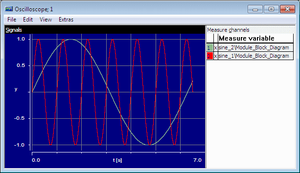

# Example: Sinus Stimulation Mode

A continuous variable, sine_1, is stimulated with a sine curve. The sine curve uses the following settings:

| Column 1 | Column 2 |
| --- | --- |
| frequency | 1 Hz = 1 s -1 |
| phase | 0 s |
| offset | 0 |
| amplitude | 1 |

The red curve in the figure shows sine_1.

The grey curve in the figure shows the variable sine_2, for comparison. sine_2 uses the same phase, offset, and amplitude as sine_1, and a frequency of 1 rad/s (which corresponds to 1/2p Hz).
