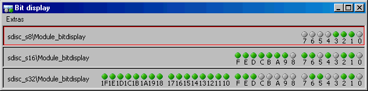

# Bit Display

The bit display represents measured values as a bit array. It is especially useful for representing binary channels as well as for a quick reading of dual digits when measurement is paused.

The bit display can show values of up to 4 bytes. When you try to display a larger value, the following error message occurs:

The variable <variable name> cannot be displayed in the bit display, because it can only hold variables with a size of 4 bytes maximum.

The bit display cannot be set up. Its width is determined from the largest value assigned to the bit display.

You can [copy](copy_channels_measur_win.md), [move](move_channels_measur_win.md) and [delete](delete_channes_measur_win.md) channels, [exchange attributes](exchange_attributes_measur_win.md) with other measurement windows, [change the window title](change_measur_win_title.md) and [display channel information](EE_display_informatiion_variables.md).

See also

[Copying Channels between Measurement Windows](copy_channels_measur_win.md)

[Moving Channels between Measurement Windows](move_channels_measur_win.md)

[Deleting Channels from Measurement Windows](delete_channes_measur_win.md)

[Exchanging Attributes between Measurement Windows](exchange_attributes_measur_win.md)

[Changing a Measurement Window Title](change_measur_win_title.md)

[Displaying Information about Variables](EE_display_informatiion_variables.md)
