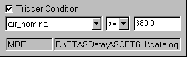
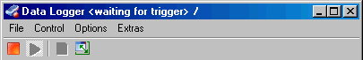
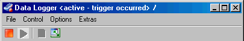

# Defining a Trigger Condition

With the  button or Enable Logging in the Control menu, data logging starts immediately when the experiment is running. The Trigger Condition option offers the possibility to define a condition for the start of data logging. To do so, proceed as follows:

1. In the data logger, activate the Trigger Condition option.

The trigger condition can only be set when logging has stopped. Settings during logging are ignored.

1. From the left combo box, select one of the logged variables (e.g. air_nominal in the example).
1. From the combo box in the middle, select a comparison operator.

You can choose >= (greater or equal) or <= (smaller or equal).

1. In the right field, enter a threshold value (e.g. 380).

When you start the data logging now, the data logger postpones the actual logging until the condition is fulfilled. The data logger headline shows the status.

Once the condition is fulfilled, data logging starts, which is again shown in the headline. Data logging continues until it is switched off, even if the condition is no longer fulfilled.

