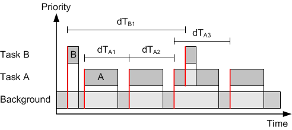
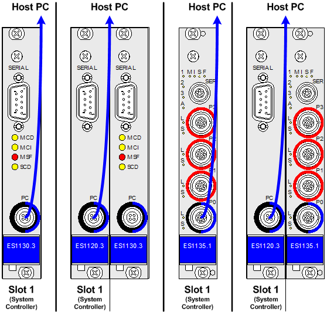
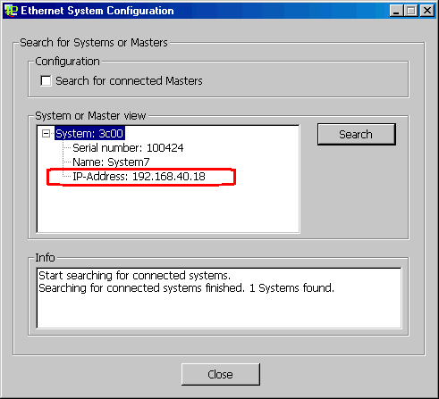
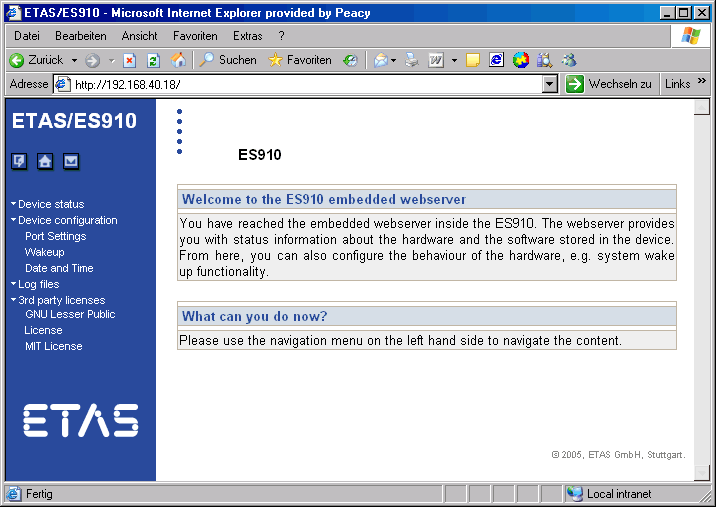
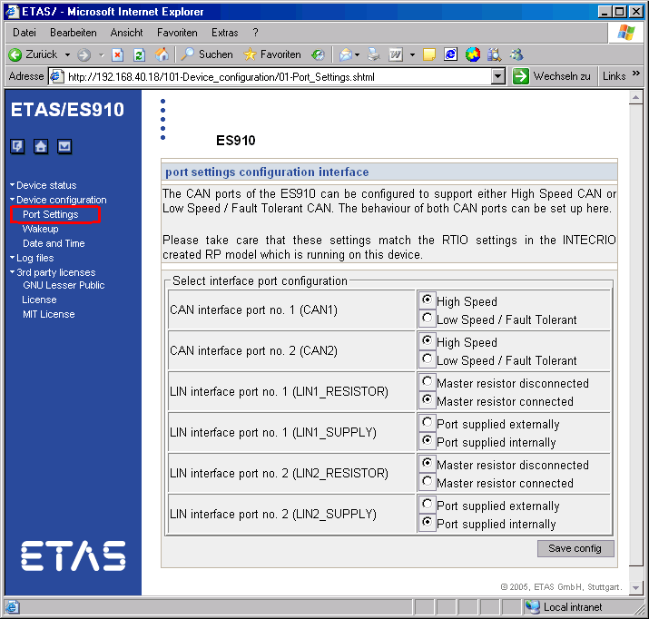
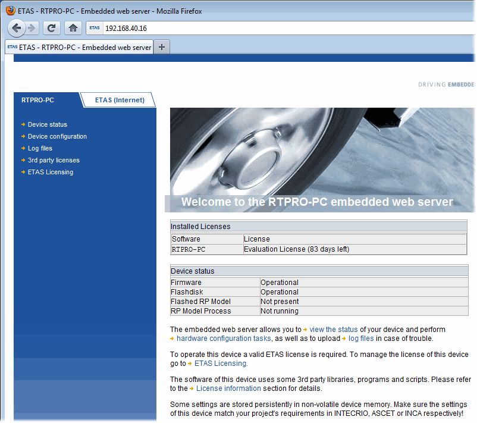
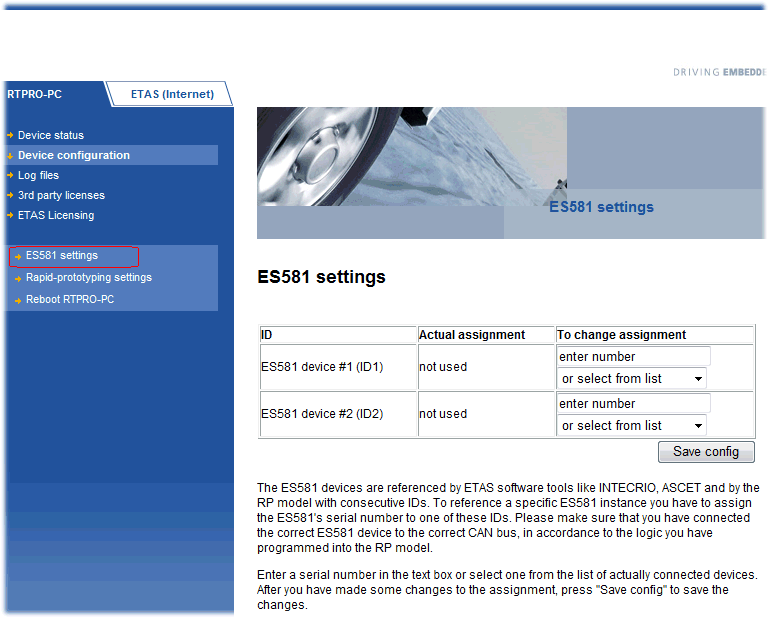
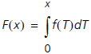
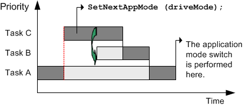

# Merged CHM Content

## INTECRIO Connectivity - Overview

_Source: `markdown/IIO_INTECRIOConnectivityOverview.md`_

# INTECRIO Connectivity - Overview

Since V6.3, ASCET contains everything required for a successful linking of ASCET models in INTECRIO for integration and rapid prototyping:

- Selection of a rapid prototyping target (i.e. Prototyping, ES1130, ES1135, ES910 and RTPRO-PC) in the ASCET project editor.
- Provision of a special code generation for INTECRIO in which all required files (C code, ASAM-MCD-2MC file, SCOOP-IX description file) are created.

For that purpose, GNU and QCC compilers are provided.

- If the ASCET code generation for INTECRIO is used, automatic import of the project in INTECRIO.
- Adjusting the handling of non-resolved global variables and messages to the needs of INTECRIO.
- Providing options for the migration of existing projects.
- Providing the option of performing the integration in an INTECRIO system directly from ASCET.
- Providing the option for back animation of an ASCET model during the experiment.

Back animation means that the model variables can be measured and calibrated directly from within the ASCET model.

After the ASCET installation, a sample database INTECRIO_Tutorial is located in the [main ASCET database directory](ComponentManagerEnglishUS.chm::/CM_PathsNode.htm). It is also available as Tutorial INTECRIO.* (* = .exp or *.axl) file in the export directory of your ASCET installation.

ASCET V6.4 supports INTECRIO V4.0 or higher.

See also

[Safety Information](IntroductionEnglishUS.chm::/int_safetyinformation.htm)

[Experimental Target Configuration](markdown/IIO_ExperimentalTargetConfiguration.md)

[Hints on Using INTECRIO Connectivity / ASCET-RP](markdown/IIO_Hints_INTECRIOconnectivity_ASCETRP.md)

[Hardware Systems](markdown/IIO_Hardware_Systems.md)

[INTECRIO Experiment](markdown/IIO_INTECRIOExperiment.md)

[ASCET-RP - Overview](markdown/INT_ASCETRPoverview.md)

---

## ASCET-RP - Overview

_Source: `markdown/INT_ASCETRPoverview.md`_

# ASCET-RP - Overview

The functionality of the INTECRIO Connectivity overlaps with ASCET-RP, the rapid prototyping tool of the ASCET product family.

This part of the ASCET online help therefore complements the ASCET-RP user's guide.

See also

[Safety Information](IntroductionEnglishUS.chm::/int_safetyinformation.htm)

[Experimental Target Configuration](markdown/IIO_ExperimentalTargetConfiguration.md)

[Hints on Using INTECRIO Connectivity / ASCET-RP](markdown/IIO_Hints_INTECRIOconnectivity_ASCETRP.md)

[Hardware Systems](markdown/IIO_Hardware_Systems.md)

[INTECRIO Experiment](markdown/IIO_INTECRIOExperiment.md)

[Appendix: Compiler Switches and API Functions](markdown/IIO_App_CompilerSwitches_APIfunctions.md)

---

## NVRAM Safety Information

_Source: `markdown/IIO_NVRAMSafetyInformation.md`_

# NVRAM Safety Information

The following experimental targets offer NVRAM possibilities:

- ES1135
- ES910
- RTPRO-PC

| Column 1 |
| --- |
| WARNING |
| Wrongly initialized NVRAM variables can lead to unpredictable behavior of a vehicle or a test bench. This behavior can cause harm or property damage. Projects that use the NVRAM possibilities of the experimental targets expect a user-defined initialization that checks whether all NV variables are valid for the current project, both individually and in combination with other NV variables. If this is not the case, all NV variables have to be initialized with their (reasonable) default values. Due to the NVRAM saving concept, this is absolutely necessary when projects are used in environments where any harm to people and equipment can happen when unsuitable initialization values are used (e.g. in-vehicle-use or at test benches). |

See also

[Non-Volatile RAM](markdown/IIO_NonvolatileRAM.md)

---

## Experimental Target Configuration

_Source: `markdown/IIO_ExperimentalTargetConfiguration.md`_

generic term for target 1130 or ES1135

# Experimental Target Configuration

The INTECRIO connectivity offers code generation for the Prototyping, [ES113x](javascript:kadovTextPopup(this))<!-- kadovTextPopupInit('a1'); //-->, ES910 and RTPRO-PC targets, including SCOOP-IX and ASAM-2MC files, transfer to ASCET and back-animation of the ASCET model (after INTECRIO download).

The INTECRIO connectivity contains the tools required for producing the files required for the integration of the project with INTECRIO. The target itself can be selected in the build options of the project. That way the targets are fully integrated into ASCET.

The configuration of the compiler and the linker, as well as the description of the interface to the actual target hardware is not done in ASCET directly, but either with the help of the ETAS Network Manager or with the help of *.ini files.

See also

[Structure of the Target Directories](markdown/IIO_Structure_TargetDirectories.md)

[Hardware Connection with the ETAS Network Manager](markdown/IIO_Hardware_Connection_with_the_ETAS_Network_Manager.md)

[Hardware Configuration Without ETAS Network Manager (ES1000 Only)](markdown/IIO_HWconfig_Without_ETASNWM_ES1000.md)

---

## Structure of the Target Directories

_Source: `markdown/IIO_Structure_TargetDirectories.md`_

# Structure of the Target Directories

Target-specific information for the rapid prototyping targets are stored in subdirectories of the [target root path](ComponentManagerEnglishUS.chm::/CM_PathsNode_Build.htm). The following table shows the subdirectories:

<table style="x-cell-content-align: Top;
				border-left-style: Outset;
				border-top-style: Outset;
				border-right-style: Outset;
				border-bottom-style: Outset;
				border-left-width: 1px;
				border-right-width: 1px;
				border-top-width: 1px;
				border-bottom-width: 1px;
				margin-top: 6px;" x-use-null-cells="">
<col/>
<col/>
<col/>
<tr class="hcp1" valign="top">
<td class="hcp2">

ASCET subdirectory
</td>
<td class="hcp2">

E-Target
</td>
<td class="hcp2">

Simulation Node
</td></tr>
<tr class="hcp1" valign="top">
<td class="hcp2">

..\Target\ES1130
</td>
<td class="hcp2">

ES1000.2 / ES1000.3
</td>
<td class="hcp2">

ES1130
</td></tr>
<tr class="hcp1" valign="top">
<td class="hcp2">

..\Target\ES1135
</td>
<td class="hcp2">

ES1000.2 / ES1000.3
</td>
<td class="hcp2">

ES1135
</td></tr>
<tr class="hcp1" valign="top">
<td class="hcp2" colspan="1" rowspan="1">

..\Target\ES113x
</td>
<td class="hcp2" colspan="2" rowspan="1">

(contains files used by both ES1000 simulation nodes, 
 e.g. compiler-specific make files)
</td>
</tr>
<tr class="hcp1" valign="top">
<td class="hcp2" colspan="1" rowspan="1">

.\Target\ES910
</td>
<td class="hcp2" colspan="1" rowspan="1">

ES910.2 / ES910.3
</td>
<td class="hcp2" colspan="1" rowspan="1">

ES910
</td></tr>
<tr class="hcp1" valign="top">
<td class="hcp2" colspan="1" rowspan="1">

..\Target\QNx86
</td>
<td class="hcp2" colspan="1" rowspan="1">

RTPRO-PC
</td>
<td class="hcp2" colspan="1" rowspan="1">

RTPRO-PC
</td></tr>
<tr class="hcp1" valign="top">
<td class="hcp2">

..\Target\Prototyping
</td>
<td class="hcp2" colspan="2" rowspan="1">

(determined in INTECRIO)
</td>
</tr>
</table>

All makefiles and build scripts support paths with blanks.

- If a path containing blanks is to be used in a makefile, ASCET converts it to short Windows format (for example, c:\Documents and Settings would be converted to c:\DOCUME~1).
- If a path containing blanks is to be used in a batch file, ASCET generates it encapsulated in ", or converts it to short Windows format.

It is not necessary to change the target root path in the ASCET options window to correspond to the target.

---

## Hardware Connection with the ETAS Network Manager

_Source: `markdown/IIO_Hardware_Connection_with_the_ETAS_Network_Manager.md`_

# Hardware Connection with the ETAS Network Manager

The ETAS Network Manager offers several advantages for the hardware connection.

- You can use a single network adapter for the ETAS hardware and your company network.
- You can assign individual network addresses.
- The Experimental Target Hardware Selection window is available.

Working with the ETAS Network Manager is described in the network manager's online help. Here, you find information regarding hardware connection using the ETAS Network Manager.

See also

[Activating ETAS Network Manager Usage](markdown/IIO_ActivateETAS_NWM_Usage.md)

[Opening the Hardware Selection Window Manually](markdown/IIO_Open_HWselectionWindow_Manually.md)

---

## Hardware Configuration Without ETAS Network Manager (ES1000 Only)

_Source: `markdown/IIO_HWconfig_Without_ETASNWM_ES1000.md`_

# Hardware Configuration Without ETAS Network Manager (ES1000 Only)

For special ES1000 use cases, you have the possibility to work without the ETAS Network Manager, in accordance with previous versions. The ethernet interface is set up for ASCET in the target.ini file of the target you are using. This file is located in the ..\target\ES1130 or ..\target\ES1135 directory.

Depending on your selection, a particular IP address variable from the respective target.ini file is used for the ASCET experiment environment.

- If the ASCET host PC is connected to the control unit (ES1120) of the ES1000.x, the following variable is used:
- ES1130

IndirectIpAddress=192.168.40.10

;Default IP-Address for ES1120.x

- ES1135

IndirectIpAddress=192.168.40.10

;Default IP-Address for ES1120.x

- If the ASCET host PC is connected to the computer node (ES1130) of the ES1000.x, the following variable is used:

- ES1130

DirectIpAddress=192.168.40.11

;Default IP-Address for ES1130.x

- ES1135

DirectIpAddress=192.168.40.15

;Default IP-Address for ES1135.1

See also

[Determining the ES1000 Connection](markdown/IIO_DetermineES1000Connection.md)

---

## Hints on Using INTECRIO Connectivity / ASCET-RP

_Source: `markdown/IIO_Hints_INTECRIOconnectivity_ASCETRP.md`_

# Hints on Using INTECRIO Connectivity / ASCET-RP

- [Preprocessing Very Old Databases](markdown/IIO_PreprocessVeryOldDataBases.md)
- [Converting Projects for ES1000.1 to a Supported Target](markdown/IIO_Convert_ES1000.1Project_to_SupportedTarget.md)
- [Using dT](markdown/Using_dT.md)

---

## Preprocessing Very Old Databases

_Source: `markdown/IIO_PreprocessVeryOldDataBases.md`_

# Preprocessing Very Old Databases

ASCET databases which were created with ASCET versions prior to V4.x must be converted to ASCET V4.x before they can be opened and converted with ASCET V6.3. See also [Converting a Database from ASCET-SD prior to V4.0](ComponentManagerEnglishUS.chm::/Convertdatabase.htm)

---

## Converting Projects for ES1000.1 to a Supported Target

_Source: `markdown/IIO_Convert_ES1000.1Project_to_SupportedTarget.md`_

# Converting Projects for ES1000.1 to a Supported Target

ASCET projects which were created for the ES1000.1 target have to be converted to a supported target, i.e. ES1000.2, ES1000.3, ES900, RTPRO-PC, or Prototyping.

Proceed as follows to convert an ASCET project for ES1000.1 to a supported target:

1. Load the ASCET project.
1. Click OK to confirm the message.
1. Click the  Project Properties button.
1. In the Project Properties window, Build node, select the target Prototyping or ES1130 or ES1135 or ES910 or RTPRO-PC.
1. Click OK to close the Project Properties window.
1. Copy the operating system settings to the selected target, as described in [Copying Operating System Settings](ProjectEditorEnglishUS.chm::/copyos.htm).
1. Copy the C code to the selected target, as described in [Copying C Code for Single Classes or Modules](CCodeEditorEnglishUS.chm::/copy_ccode_single.htm).

See also

[Copying Operating System Settings](ProjectEditorEnglishUS.chm::/copyos.htm)

[Copying C Code for Single Classes or Modules](CCodeEditorEnglishUS.chm::/copy_ccode_single.htm)

---

## Using dT

_Source: `markdown/Using_dT.md`_

# Using dT

The ERCOSEK operating system is implemented for the ES113x target. An RTA-OSEK operating system is implemented for the ES910 and RTPRO-PC targets. Both operating systems enable access to the time dT which has elapsed between the last and second last call of the running task. dT always refers to the task in which the variable is used.

dT is a global uint32 variable. It is declared in one of the ERCOSEK or RTA-OSEK header files and contains the value for the current task in units of system ticks.

dT can be accessed from ASCET using the  dT button in the editors. This enables you to create an element (real64) which contains the time in units of seconds. If users do not generate this element in the C code editor, but still accesses dT, no error message appears because dT is declared in the ERCOSEK/RTA-OSEK files. But as dT in ERCOSEK/RTA-OSEK and dT in ASCET have different units (system ticks or seconds respectively), the calculations are incorrect. Users should therefore ensure that they generate the corresponding element with the dT button.

In the generated code for experimental targets, access to the global element dT is indirect: A C code macro is generated to access dT. The name of the macro is created as follows:

_<PROJECTNAME>_<IMPLEMENTATION>_dTAccess

A default definition of the macro is generated by ASCET which can be replaced by a user-defined definition.

---

## Hardware Systems

_Source: `markdown/IIO_Hardware_Systems.md`_

# Hardware Systems

Transferring an ASCET project to INTECRIO requires an ETAS experimental system, i.e. one of the following targets must be selected in the project properties:

- [ES1000.2](markdown/IIO_ES1000.xExperimentalSystem.md)
- [ES1000.3](markdown/IIO_ES1000.xExperimentalSystem.md)
- [ES900 system](markdown/IIO_ES900ExperimentalSystem.md) (with ES910.2 or ES910.3)
- [RTPRO-PC](markdown/IIO_RTPROPC_ExperimentalSystem.md)
- Prototyping

When the Prototyping target is selected, the hardware is determined in INTECRIO.

---

## ES1000.x Experimental System

_Source: `markdown/IIO_ES1000.xExperimentalSystem.md`_

# ES1000.x Experimental System

All ES1000 system controller boards currently available are supported. The figure below shows the standard configurations; special configurations are of course possible.

## Control Unit ES1120 and Simulation Computer ES1130/ES1135

If the ES1000.x is used for application and rapid prototyping simultaneously, the host PC is connected to the control unit ES1120 via ethernet cable. The functions developed with ASCET are loaded via the control unit ES1120 onto the ES1130 or ES1135, and then executed. Data can be measured and calibrated with ASCET while the experiment runs.

## TCP/IP Protocol Options

To avoid conflicts with a second network card that might be used for the LAN, the following TCP/IP settings should be selected.

| Column 1 | Column 2 |
| --- | --- |
| option | setting |
| DHCP service | disabled |
| IP address | 192.168.40.240 |
| subnet mask | 255.255.255.0 |
| DNS service | use local settings of your internal network |
| WINS service | disabled |
| IP Forwarding option | deactivated |

---

## Special Features of the ES1135

_Source: `markdown/IIO_SpecialFeatures_ES1135.md`_

# Special Features of the ES1135

The ES1135 is a further development of the ES1130, and offers the user several new functions. These functions are described in the following sections:

- [Watchdog](markdown/IIO_ES1135_Watchdog.md)
- [LEDs](markdown/IIO_ES1135LEDs.md)
- [Cache-Locking](markdown/IIO_ES1135CacheLocking.md)

---

## ES1135: Watchdog

_Source: `markdown/IIO_ES1135_Watchdog.md`_

# ES1135: Watchdog

To integrate a safety concept for the rapid prototyping system, the ES1135 offers a hardware watchdog function. The watchdog is an independent control unit that monitors the main ES1135 processor. For that purpose, a predefined data sequence is written periodically to a memory cell (watchdog service register). After a maximum time (watchdog period) without successful write access (watchdog service) to the watchdog service register, an exception handling (event) is triggered in the processor.

The ES1135 HW watchdog can be operated in two modes:

1. Safety-oriented mode (safety mode)
1. Flexible mode with more functions (Reduced Safety Mode Enhanced Function, RSEF Mode)

In the RSEF mode, the following watchdog settings can be re-configured at runtime:

- Event configuration

Defines the exception handling in case of watchdog expiration. The watchdog can also be disabled via event configuration.

- Watchdog period

Defines the time until the watchdog expires if no new watchdog service occurs.

- Switching modes

The safety mode is switched on with an arbitrary watchdog period and vent configuration. After that, this mode cannot be reconfigured or left. Therefore, the watchdog service should be set up in advance in a way that no undesired watchdog event occurs.

After the supply voltage is switched on, the watchdog is set to RSEF mode and switched off.

##### Watchdog Service

The Watchdog must be serviced before it expires. Otherwise, the selected watchdog event occurs. It is the task of the model designer to put the call of the service function at a place, where a malfunction of the model can be detected.

The Simulation Controller firmware provides an automatic watchdog servicing mechanism, which services the watchdog every 30 ms if interrupts are not disabled by the model. Thus, assumed that operating system is running correctly, the watchdog will be serviced regularly (if feature is enabled). This will be sufficient in many use cases.

##### Interrupt Control

For debug and supervision purposes in particular, it is possible to configure the watchdog to trigger a simulation processor interrupt on watchdog timer expiration.

The interrupt may either be polled or routed to the internal interrupt controller. A watchdog interrupt is latched and needs explicit acknowledging. Functions for fast disabling and enabling of the interrupt source are available. These functions only have effects on the interrupt propagation.

The watchdog interrupt is mapped to a HW Task inside ASCET. The watchdog handler is running below the ERCOSEK level but above other HW interrupts (e.g. from VME Bus), thus the watchdog interrupt is handled even if another HW interrupt is currently handled. Interrupt acknowledgement is done inside the ES1135 firmware, it should therefore not be done inside the handler task. The available set of ERCOSEK calls in the handler task is not restricted.

When a watchdog interrupt occurs, the watchdog is automatically restored from the overrun situation after 250 ms, restarting a new cycle with the previously selected period. This restoration time may be shortened, by performing a normal watchdog service with wdService().

A detailed description of the watchdog API is given in [API Functions - Watchdog](markdown/IIO_APIfunctionsWatchdog.md).

---

## ES1135: LEDs

_Source: `markdown/IIO_ES1135LEDs.md`_

# ES1135: LEDs

The LEDs on the ES1135 front panel are divided into system LEDs (M, I, S, F, A, L, S) and freely programmable LEDs (1, 2, 3).

The system LEDs are described in the hardware manual.

The programmable LEDs can be accessed via the program interface; see [API Functions - ES1135 LEDs](markdown/IIO_APIfunctionsES1135LEDs.md).

---

## ES1135: Cache Locking

_Source: `markdown/IIO_ES1135CacheLocking.md`_

# ES1135: Cache Locking

Depending on whether the respective functions are placed in the main memory or the cache of the ES1135, noticeable runtime differences can occur for short-period tasks. For highly time-critical applications, these differences can be intolerable.

As a remedy, ASCET provides the possibility to mark highly time-critical parts of the model and thus make sure that they are always available in the cache. This procedure is called cache locking. The second-level cache, or L2 cache, which is divided into four separate units (fourfold associative cache, 4-ways), is used for that purpose.

You can mark individual variables or parameters, as well as entire methods or processes (see [Cache Locking for Elements and Methods/Processes](markdown/IIO_CacheLocking_ElementMethodProcess.md)). Components can be marked, too; this mark is adopted by the elements of the component, if applicable (see [Cache Locking for a Component](markdown/IIO_CacheLocking_Component.md)). The mark is part of a particular implementation. In another implementation, the same object can have a different mark.

The following restrictions exist for cache locking:

- Up to 3 units of the L2 cache can be reserved for cache locking (cf. [Cache Locking for an Entire Project](markdown/IIO_CacheLocking_EntireProject.md)). At least one unit remains free for the unmarked parts of the model.

The associativity of the cache can make it impossible to keep all marked model parts permanently in the cache, even though cache space is available. This problem occurs rarely for code, but frequently for variables and parameters. It is thus recommended to mark code for cache locking.

- A cache unit cannot be further divided. If the model parts marked for cache locking occupy 2.5 units, the free half unit cannot be used otherwise.
- If parts of the cache are reserved for cache locking, less cache is available for the unmarked model parts. Runtime losses can occur.

Three settings are available for cache locking:

| Column 1 | Column 2 |
| --- | --- |
| Automatic | Variables, parameters, methods and processes adopt the setting of the parent component. This is the default setting. For components, Automatic is the same as Off . |
| On or Cache | Cache locking is switched on. |
| Off or Global | Cache locking is switched off. |

See also

[Cache Locking for Elements and Methods/Processes](markdown/IIO_CacheLocking_ElementMethodProcess.md)

[Cache Locking for a Component](markdown/IIO_CacheLocking_Component.md)

[Cache Locking for Complex Elements](markdown/IIO_CacheLocking_ComplexElement.md)

[Cache Locking in the OS Editor](markdown/IIO_CacheLocking_OSeditor.md)

[Cache Locking for an Entire Project](markdown/IIO_CacheLocking_EntireProject.md)

---

## ES900 Experimental System

_Source: `markdown/IIO_ES900ExperimentalSystem.md`_

# ES900 Experimental System

ES910.2 and ES910.3 devices are supported.

In order to use the ES910, you must adjust the port settings of ES910 via its graphic user interface. A web browser application is used for that purpose; the ES910 must be connected to the PC. See also [Configuring the ES910](markdown/IIO_ConfigureES910.md).

---

## RTPRO-PC Experimental System

_Source: `markdown/IIO_RTPROPC_ExperimentalSystem.md`_

# RTPRO-PC Experimental System

RTPRO-PC allows the real-time execution of prototyping models on an off-the shelf notebook. After installation of RTPRO-PC, the system can still be used as a standard Windows®-only computer, but it has got a second boot option to work as a combined Windows / prototyping (= real-time) computer.

On the Windows node of the combined mode, standard Windows applications can be used with slightly less performance than in Windows-only mode.

The real-time node is supported as standard ETAS experimental target with the following features:

- The RTPRO-PC target is configured and built in ASCET-MD V6.3 or higher, ASCET-RP V6.1.3 and higher or INTECRIO V4.1 and higher.
- Experiments can be performed using the ASCET experiment environment, the INTECRIO experiment environment, or INCA with INCA-EIP V7.0.1 and higher.
- An internal switch on the real-time node allows ECU access via RTPRO-PC from INCA.
- Up to four CAN interfaces (via two ES581.3) can be added. Each CAN interface supports either XCP on CAN or CAN I/O.
- One Ethernet controller is supported. This can be used for XCP bypass on UDP and XETK. The ethernet controller supports up to four XCP on UDP interfaces.

The two nodes communicate via a virtual network.

To use the RTPRO-PC experimental system with ASCET, you need a notebook with ASCET and RRTPRO-PC installations. RTPRO-PC is a separate product available at ETAS; please contact your local sales representative.

RTPRO-PC is available for the following notebooks:

- HP EliteBook 8540w with Intel® Core™ i7-7xx or -8xx processor and Mobile Intel® QM57 Express chipset
- HP EliteBook 8560w with Intel® Core™ i7-7xx, -8xx, -27xx, or -28xx processor and Mobile Intel® QM67 Express chipset
- HP EliteBook 8570w with Intel® Core™ i7-* or i5-* (3rd generation) quadcore processor (Intel® Hyper-Threading must be supported) and Mobile Intel® QM77 Express chipset
- Lenovo Thinkpad T530 (with Intel® Core™ i7-* or i5-* (3rd generation) dual-core processor (Intel® Hyper-Threading must be supported) and Mobile Intel QM77 Express chipset

In addition, you need an USB stick to serve as persistent memory and to store the license file and the NVRAM of the experimental system.

See also

[RTPRO-PC: Startup](markdown/IIO_RTPROPC_Startup.md)

[Configuring RTPRO-PC and ES581](markdown/IIO_ConfigureRTPROPC_ES581.md)

---

## RTPRO-PC: Startup

_Source: `markdown/IIO_RTPROPC_Startup.md`_

# RTPRO-PC: Startup

The Realtime Prototyping for PC platform is started with the POWER ON switch of your notebook. After that, BIOS takes control and starts the GRUB bootloader.

The bootloader offers the following boot configurations:

- Windows
- ETAS RTPRO-PC and Windows
- ETAS RTPRO-PC (standalone hypervisor mode)

You must select ETAS RTPRO-PC and Windows or ETAS RTPRO-PC to use RTPRO-PC.

For more details, see the RTPRO-PC user’s guide.

See also

[RTPRO-PC Experimental System](markdown/IIO_RTPROPC_ExperimentalSystem.md)

[Configuring RTPRO-PC](markdown/IIO_ConfigureRTPROPC_ES581.md)

---

## Non-Volatile RAM

_Source: `markdown/IIO_NonvolatileRAM.md`_

# Non-Volatile RAM

A non-volatile (NV) variable is a variable which can be used like any other ASCET variable. Particularly, it can be written and read by the model, calibrated via a calibration window and measured/logged with the data acquisition. The special feature of an NV variable is that, in case of a simulation interruption, the current value of the NV variable is available when the simulation with the same model is restarted. This is especially useful for adaptive characteristics, commonly used inside the ECU code for self-learning algorithms, and storage of diagnostic results.

The optional attribute non-volatile (NV) is supported for all primitive data types of ASCET (scalars, arrays, matrices, characteristic lines/maps). Only ASCET variables can be configured for NVRAM; C code variables are not supported.

An NV variable can be created inside a class or module editor. This is done by activating the Non-volatile option in the properties editor of a variable.

| Column 1 |
| --- |
| WARNING |
| Wrongly initialized NVRAM variables can lead to unpredictable behavior of a vehicle or a test bench. This behavior can cause harm or property damage. Projects that use the NVRAM possibilities of the experimental targets expect a user-defined initialization that checks whether all NV variables are valid for the current project, both individually and in combination with other NV variables. If this is not the case, all NV variables have to be initialized with their (reasonable) default values. Due to the NVRAM saving concept, this is absolutely necessary when projects are used in environments where any harm to people and equipment can happen when unsuitable initialization values are used (e.g. in-vehicle-use or at test benches). |

See also

[NVRAM: Hardware Support](markdown/IIO_NVRAM_HardwareSupport.md)

[NV Variable Initialization and Update](markdown/IIO_NVVariable_InitializationUpdate.md)

[NVRAM: Data Consistency](markdown/IIO_NVRAM_DataConsistency.md)

[NVRAM Cockpit](markdown/IIO_NVRAMcockpit.md)

[NVRAM: Tips](markdown/IIO_NVRAMtips.md)

---

## NVRAM: Hardware Support

_Source: `markdown/IIO_NVRAM_HardwareSupport.md`_

- Changing the instance name of any NV element on the project, module, class, or sub-class level.
- Changing the implementation of any NV element on the project, module, class, or sub-class level, namely:

- Code generation option Physical Experiment – switching the implementation data type between cont and sint/uint
- Code generation option Implementation Experiment – changes of the implementation interval

- Changing the formula parameters of any NV element.

The NV identifier does not change if the name or the comment of a formula is changed.

- For an NV enumeration:

- Changing the sequence of the enumerators
- Changing the names (values) of the enumerators
- Removing/adding enumerators
- Selecting a different enumeration, even if it contains the same enumerators

- Changing the maximal size of multidimensional NV elements (array, matrix, characteristic line/map).
- Changing the settings for the implementation limitation in the implementation experiment (code generation option Implementation Experiment).
- Deleting/adding NV elements on the project, module, class, or sub-class level.
- Deleting/adding states in a state machine.

- Renaming the project.
- Renaming the modules or classes within the project.
- Renaming the instances of any normal (volatile) element on the project, module, class, or sub-class level.
- Changing the formula name or comment of any NV element.

When the formula parameters are changed, the NV identifier changes, too.

- Renaming an enumeration.
- Changing the data of NV elements and normal elements.
- Changing the actual size of multidimensional elements (array, matrix, characteristic line/map).
- Changing the memory area of NV elements and normal elements.

# NVRAM: Hardware Support

Non-volatile RAM (NVRAM) is available in the address space of the ES1135 main processor (IBM750GX), on the ES910 and on RTPRO-PC. In this memory range, data can be stored which are to be available after a power failure or longer than one power-on cycle.

Due to performance reasons (accesses to the NVRAM are significantly slower than accesses to the normal, volatile RAM and, in addition, cannot be cached), NV variables are not directly allocated to the NVRAM. Instead, they are allocated like normal, volatile variables to normal RAM, and periodically saved to the NVRAM (auto-update mode). The period is by default set to 10 seconds; it can be configured with the API method

uint32 nvramSetUpdateInterval(uint32 interval_sec)

(see also [API Functions - NVRAM](markdown/IIO_APIfunctionsNVRAM.md)) in the range from 1 second to 30 seconds. Saving to the NVRAM is done within the idle task, it does not affect the real-time behavior of the model.

For reasons of [data consistency](markdown/IIO_NVRAM_DataConsistency.md), the NVRAM is organized as alternation buffer which halves the available capacity. Furthermore, there is some overhead involved which reduces the NVRAM capacity available to the ASCET model to a little less than half of the available capacity. The following table lists the available NVRAM capacities for the respective targets.

| Column 1 | Column 2 | Column 3 | Column 4 |
| --- | --- | --- | --- |
| available NVRAM | ES1135 | ES910 | RTPRO-PC |
| on target | 64 kByte | 32 kByte | depends on USB stick used as persistent memory |
| in ASCET | < 32 kByte | < 16 kByte | < half the available capacity |

The ES1135 or ES910 or RTPRO-PC firmware ensures that the capacity limit is respected. If the cumulative size of NV variables exceeds the NVRAM capacity, an "NVRAM overflow" error message appears in the ASCET monitor window at the start of the experiment. In this case, the NVRAM is not used, i.e. no values are written to it. In order to be able to use the NVRAM, the user needs to reduce number and/or size of NV variables in the model.

##### NV identifier

The NVRAM data contain neither address information nor the names of the variables. Therefore, they correspond to the model only if the structure of the NV variables in the model did not change after the last update. To check this, a special NV identifier is created during code generation.

This NV identifier changes upon the [following actions](javascript:kadovTextPopup(this))<!-- kadovTextPopupInit('a1'); //-->.

1. The NV identifier does not change upon the [following actions](javascript:kadovTextPopup(this))<!-- kadovTextPopupInit('a2'); //-->.

See also

[NVRAM Safety Information](markdown/IIO_NVRAMSafetyInformation.md)

[API Functions - NVRAM](markdown/IIO_APIfunctionsNVRAM.md)

[NV Variable Initialization and Update](markdown/IIO_NVVariable_InitializationUpdate.md)

[NVRAM: Data Consistency](markdown/IIO_NVRAM_DataConsistency.md)

[NVRAM Cockpit](markdown/IIO_NVRAMcockpit.md)

[NVRAM: Tips](markdown/IIO_NVRAMtips.md)

/* Heikki Komulainen, Comet Computer GmbH 2004 */ cc_plus_pic = '&nbsp;'; cc_minus_pic = '&nbsp;'; cc_stat_pic = '&nbsp;'; gpstyle = ''; var iframes_created = 0; if (document.body && document.body.insertAdjacentHTML && document.getElementsByTagName && document.getElementById) { collect_popups(); set_poplinks_pictures(); if (iframes_created) { document.write(gpstyle); document.write('
<nobr><a id="einauslink" style="position:absolute;top:expression(document.body.scrollTop + this.offsetHeight - this.offsetHeight);left:expression(document.body.offsetWidth - (this.offsetWidth + 28));background:white;padding:5px" href="javascript:show_all_poptext()">Show all hidden text</a></nobr>
'); } } function collect_popups() { bsscpopups = new Array(); for (x = 0; x < document.links.length; x++) { if (document.links[x].href.indexOf("BSSCPopup")>-1) { seekmatch = /BSSCPopup.'[^'](markdown/+)'/; poplink = seekmatch.exec(document.links[x].href); poplink = "" + poplink; poplink = poplink.substring(poplink.indexOf("'")+1, poplink.lastIndexOf("'")); ifid = "CCGENIFRAMEID" + x; new_iframe = '<iframe id="' + ifid + '"src="' + poplink + '" onload="get_text(\'' + ifid + '\')" width="0" height="0" frameborder=0></iframe>'; document.links[x].parentNode.insertAdjacentHTML("afterEnd", new_iframe); gpid = "CCID_" + ifid; document.links[x].href = "javascript:expand_poptext('" + gpid + "')"; cc_plus = '' + cc_plus_pic + ''; document.links[x].insertAdjacentHTML("afterBegin", cc_plus); iframes_created = 1; } } }// end function function get_text(ifr_id) { frpars = document.frames[ifr_id].document.getElementsByTagName("body"); popbody = frpars[0].innerHTML; gpid = "CCID_" + ifr_id; if (!document.getElementById(gpid)) { //avoiding doubles document.getElementById(ifr_id).insertAdjacentHTML("afterEnd", '
'+popbody+'
'); } }//end function function expand_poptext(x_frame_id) { if (!document.getElementById(x_frame_id)) return; if (document.getElementById(x_frame_id).className == "CCGENPOPTEXTH") { document.getElementById(x_frame_id).className = "CCGENPOPTEXTV"; document.getElementById(x_frame_id).style.visibility = "visible"; if (document.getElementById("CCPMB_" + x_frame_id )) { document.getElementById("CCPMB_" + x_frame_id ).innerHTML = cc_minus_pic; } } else { document.getElementById(x_frame_id).className = "CCGENPOPTEXTH"; document.getElementById(x_frame_id).style.visibility = "hidden"; if (document.getElementById("CCPMB_" + x_frame_id )) { document.getElementById("CCPMB_" + x_frame_id ).innerHTML = cc_plus_pic; } } }// end function function show_all_poptext() { var pulldowntxt = document.getElementsByTagName("div"); for (b = 0; b < pulldowntxt.length; b++) { if (pulldowntxt[b].className == "droptext") { pulldowntxt[b].style.display=""; } } var gptxt = document.getElementsByTagName("div"); for (z = 0; z < gptxt.length; z++) { if (gptxt[z].className == "CCGENPOPTEXTH") { gptxt[z].className = "CCGENPOPTEXTV"; gptxt[z].style.visibility = "visible"; if (document.getElementById("CCPMB_" + gptxt[z].id )) { document.getElementById("CCPMB_" + gptxt[z].id ).innerHTML = cc_minus_pic; } } } var dxpoplinks = document.getElementsByTagName("a"); if (dxpoplinks) { for (pxl = 0; pxl < dxpoplinks.length; pxl++) { if (dxpoplinks[pxl].href.indexOf("kadovTextPopup")>-1) { if (document.getElementById("CCPMB_" + dxpoplinks[pxl].id)) { document.getElementById("CCPMB_" + dxpoplinks[pxl].id).innerHTML = cc_stat_pic; dxpoplinks[pxl].symbol = "minus"; } } } } document.getElementById('einauslink').innerText = 'Hide all hideable text'; document.getElementById('einauslink').href = "javascript:self.location.reload()"; self.focus(); }// end function function eat_click() { return false; }// end function function set_poplinks_pictures() { var dpoplinks = document.getElementsByTagName("a"); if (dpoplinks) { for (pl = 0; pl < dpoplinks.length; pl++) { if (dpoplinks[pl].href.indexOf("kadovTextPopup")>-1) { cc_plus = '' + cc_stat_pic + ''; //dpoplinks[pl].onmouseup = plusminuspoplink; dpoplinks[pl].insertAdjacentHTML("afterBegin", cc_plus); dpoplinks[pl].symbol = "plus"; } } } }// end function function plusminuspoplink() { if (document.getElementById("CCPMB_" + this.id)) { if (this.symbol == "plus") { document.getElementById("CCPMB_" + this.id).innerHTML = cc_minus_pic; this.symbol = "minus"; } else { document.getElementById("CCPMB_" + this.id).innerHTML = cc_plus_pic; this.symbol = "plus"; } } return true; }

---

## NV Variable Initialization and Update

_Source: `markdown/IIO_NVVariable_InitializationUpdate.md`_

# NV Variable Initialization and Update

##### Starting the simulation:

After the model code was downloaded to the target, NV variables are initialized with their default values if no matching data are available in the NVRAM. No matching data means that the NV memory is empty, inconsistent (verified via a checksum) or the NV data does not match with the downloaded model (verification via [NV identifier](markdown/IIO_NVRAM_HardwareSupport.md#NVidentifier)).

In case matching data is available in the NV memory, the variables are initialized accordingly before the experiment can be started (Start OS).

##### Stopping the simulation:

When the simulation is stopped (Stop OS), the most recently saved values of the NV variables are persistently stored inside the NVRAM. Even if the target is powered off or if the code is downloaded again, the simulation can proceed with the most recently saved values of the NV variables.

As mentioned before, the NV variables are periodically saved to the NVRAM in auto-update mode. To make sure that the current values - not the values from the last cyclic update - are available in the NVRAM, the API function

void nvramUpdateMemoryExit(void)

should be called at the end of the Exit task (task with application mode inactive).

If there are no NV variables inside the current model, the NVRAM content remains unchanged.

##### Model with NV variables inside the FLASH memory:

A simulation model with NV variables inside the FLASH memory of the simulation controller is booted when power on occurs. The potential matching NV data is used for initializing the NV variables before starting the simulation.

##### Display whether model is running on default NV variable values:

Whether the model is running on default NV variable values (as specified in the ASCET data editor), or whether the variables are initialized out of the NVRAM, can be determined in two ways. In the experiment environment, an info message is written in the Target Debugger window. From within the model, the API function

uint8 nvramCheckForInitializedVars(void)

provides the same information.

##### Clearing the NVRAM content:

To prevent the initialization of a model with the NV content (if the program identifier is matching), it is possible to clear the NV memory content. This enforces the initialization of the NV variables with their default values. This feature is currently not supported by the GUI. However, the API function

uint32 nvramClear(void)

allows to reset the NVRAM from within the model (see [nvramClear](markdown/IIO_nvramClear.md)).

See also

[NVRAM Safety Information](markdown/IIO_NVRAMSafetyInformation.md)

[NVRAM: Hardware Support](markdown/IIO_NVRAM_HardwareSupport.md)

[Non-Volatile RAM](markdown/IIO_NonvolatileRAM.md)

[API Functions - NVRAM](markdown/IIO_APIfunctionsNVRAM.md)

---

## NVRAM: Data Consistency

_Source: `markdown/IIO_NVRAM_DataConsistency.md`_

# NVRAM: Data Consistency

When the simulation is interrupted by power off or a system crash, the NVRAM contains values of the NV variables. The relevance of these values depends on the time of the last automatically or manually (from within the model) triggered saving.

To guarantee the consistency of the NVRAM content in case of an unexpected termination of the simulation, different strategies can be used as introduced below.

The consistency level can be set with the following API function:

uint32 nvramSetConsistencyLevel(T_consistencyLevel level)

##### No consistency:

The NVRAM update is done without respect to consistency within NV variables and between individual NV variables.

##### Low level consistency (single variables):

Low-level consistency means that the data consistency within NV variables (scalars, arrays and matrices, but not characteristic lines/maps) is guaranteed.

It must be noted here that the update of characteristic lines/maps cannot be done atomically (in the sense of low-level consistency)

##### High level consistency (among variables, after task completion):

High-level consistency means that all NV variables are updated in the idle task, without interruption by the model.

The update for a set of NV variables should be atomic. A self-learning algorithm, for example, works on several variables, and it must be guaranteed that data for different variables in the NVRAM come from the same calculation cycle.

##### Model-controlled consistency (among variables and over multiple tasks cycles):

The high-level consistency mechanism guarantees consistency only if manipulations of NV variables are done within one task cycle. There may be cases where this manipulation lasts several task cycles (e.g. the update of an adaptive characteristic, done in several tasks). The ES1135 / ES910 / RTPRO-PC firmware cannot be aware of this, and therefore the model must control the NVRAM update.

For this purpose, the automatic update can be disabled by the following function:

uint32 nvramDisableAutoUpdate(void)

The manual update of the complete set of NV variables can be started with this command:

uint32 nvramManualUpdateBackground(void)

Even the manual update it is not allowed to block the whole system, and thus change the real-time behavior, until the update is finished. Therefore, the function for manual update returns immediately and the update is done in the background.

The model can poll the status of the manual update with the following function:

uint8 nvramCheckRunningUpdate(void)

The function returns true if the update is running. The user, or the model, is responsible that the NV variables are not modified during the update.

The manual update mode can be disabled with

uint32 nvramEnableAutoUpdate(void)

A selective update of NV variables is not supported.

If there are no NV variables inside the current model, the NVRAM content remains unchanged.

##### Defective NVRAM content:

In case of defective NVRAM content, e.g. if the checksum test failed, the user is warned. This is done textually in the experiment environment (or the ASCET monitor window).

See also

[NVRAM Safety Information](markdown/IIO_NVRAMSafetyInformation.md)

[Non-Volatile RAM](markdown/IIO_NonvolatileRAM.md)

[API Functions - NVRAM](markdown/IIO_APIfunctionsNVRAM.md)

---

## NVRAM Cockpit

_Source: `markdown/IIO_NVRAMcockpit.md`_

# NVRAM Cockpit

The NVRAM API (see [API Functions - NVRAM](markdown/IIO_APIfunctionsNVRAM.md)) offers several functionalities to control the NVRAM update. During experiment, these functionalities are available in a special window, the NVRAM cockpit. Changes applied via the API functions are transferred to the NVRAM cockpit, too.

You can

[Work with the NVRAM Cockpit](markdown/IIO_Working_with_NVRAMCockpit.md)

See also

[NVRAM Safety Information](markdown/IIO_NVRAMSafetyInformation.md)

[NVRAM Cockpit Window](markdown/IIO_NVRAMcockpitWindow.md)

[Non-Volatile RAM](markdown/IIO_NonvolatileRAM.md)

[API Functions - NVRAM](markdown/IIO_APIfunctionsNVRAM.md)

---

## NVRAM: Tips

_Source: `markdown/IIO_NVRAMtips.md`_

# NVRAM: Tips

The following tips are useful for working with NVRAM.

##### State variable as non-volatile:

The enhanced NVRAM support includes the possibility to assign the non-volatile attribute to the sm state variable of a state machine. To do so, right-click on the sm variable in the Outline tab of the state machine editor to open the context menu, then open the Settings submenu and select Non-Volatile.

##### Actual size of multi-dimensional elements:

The actual size ("current size" attribute) of multi-dimensional elements (array, matrix, characteristic line/map) is saved in the NVRAM.

Changes of the actual size in the model (offline) become valid in the downloaded program only after the NVRAM content is deleted (e.g. via the NVRAM cockpit, or if the NVRAM content is inconsistent with the program.

##### Flash project with NVRAM:

Bear in mind that the program in the Flash memory is launched each time the ES1000 or ES900 or RTPRO-PC is started. If this project uses NV variables, it uses the NVRAM. A subsequent download of any other program containing NV variables leads to an (unexpected) reset of the NVRAM content.

See also

[NVRAM Safety Information](markdown/IIO_NVRAMSafetyInformation.md)

[Non-Volatile RAM](markdown/IIO_NonvolatileRAM.md)

[API Functions - NVRAM](markdown/IIO_APIfunctionsNVRAM.md)

---

## INTECRIO Experiment

_Source: `markdown/IIO_INTECRIOExperiment.md`_

# INTECRIO Experiment

If you have installed both ASCET and INTECRIO, you can experiment with your Rapid-Prototyping project in INTECRIO. The project editor offers a function for this purpose which allows convenient transfer of the experiment.

Experiments that use an ES1000 target contain one memory page, experiments that use an ES910 or RTPRO-PC target contain two memory pages. To make use of both memory pages, you have to use INCA/INCA-EIP as experiment environment; the ASCET or INTECRIO experiment environment does not support multiple memory pages. See the INCA and INCA-EIP documentation for details on using memory pages.

This online help contains general instructions for experimenting with INTECRIO. A specific sample task can be found in the ASCET Getting Started manual, chapter "Tutorial".

See also

[Project Preparation](markdown/IIO_ProjectPreparation.md)

[Project Transfer to INTECRIO](markdown/IIO_ProjectPreparation.md)

[Back-Animation](markdown/IIO_BackAnimation.md)

[ASCET and SCOOP-IX](markdown/IIO_ASCET_SCOOPIX.md)

[Experimenting with INTECRIO](markdown/IIO_Experimenting_with_INTECRIO.md)

---

## Project Preparation

_Source: `markdown/IIO_ProjectPreparation.md`_

# Project Preparation

First of all you create the ASCET project as usual. You have all possibilities available to you which are possible in ASCET. But note the following points:

- By default, messages that are only read in ASCET (i.e. receive messages without relevant send messages) are the signal sinks in INTECRIO. Messages that are only written to (i.e. send messages without the relevant receive message) are the signal sources in INTECRIO. Messages that are both read and written in ASCET are excluded from integration.

If required, you can make the latter appear as signal sources in INTECRIO, see [Project Transfer to INTECRIO - Messages](markdown/IIO_ProjectTransfer_to_INTECRIO.md#messages).

- When your project contains unresolved messages (imported messages without corresponding export), the code generation for INTECRIO displays an error message.

You can either resolve the messages automatically or cancel the code generation and manually resolve the messages.

- It is possible to use global variables and parameters, but this is explicitly not recommended.
- Enumerations and formulas in your project must have different names. If the project contains an enumeration and a formula with identical names, the code generation for INTECRIO displays an error message.
- You have to select the target Prototyping, ES1130, ES1135, ES910 or RTPRO-PC in the build options of the project. INTECRIO is preselected in the Experiment Target combo box with any of these targets. INTECRIO code generated with this target can be used with each experimental target supported by INTECRIO.

The target Prototyping is strongly recommended for transfer to INTECRIO.

- After selecting the Prototyping target, the following setup options are deactivated in the OS editor:
- Preemp. Levels and Coop. Levels fields (all tasks)
- Enable Monitoring option, pre-/post hooks combo box (all tasks)
- ISR Source and Min. Period fields (interrupt tasks)
- Max. Number of Activations field (alarm/software tasks)
- Autostart option (alarm/software tasks)

In some cases, the number of preemptive levels is set to 0. In that case, you can use the Copy From Target function in the Operating System menu to copy the operating system settings (e.g., from an ES113x) to the Prototyping target. The deactivated settings are copied and the Preemp. Levels field is made available. You can now enter a suitable value, i.e. a number ≥ 8.

- See [ASCET and SCOOP-IX](markdown/IIO_ASCET_SCOOPIX.md) for information on how some ASCET settings appear in the SCOOP-IX file generated for use with INTECRIO.

Once you have completely specified the project, you invoke the transfer of the project to INTECRIO as the first step in code generation.

See also

[Project Transfer to INTECRIO](markdown/IIO_ProjectTransfer_to_INTECRIO.md)

[Preparing the Project](markdown/IIO_PrepareProject.md)

[ASCET and SCOOP-IX](markdown/IIO_ASCET_SCOOPIX.md)

---

## Project Transfer to INTECRIO

_Source: `markdown/IIO_ProjectTransfer_to_INTECRIO.md`_

# Project Transfer to INTECRIO

The second step the project transfer to INTECRIO. This is done in the [INTECRIO Project Transfer window](markdown/IIO_INTECRIO_ProjectTransferWindow.md).

You have four choices:

1. If you only want to generate the code required for INTECRIO, the Paths field in the INTECRIO Project Transfer window is the only one that must contain a value. The Workspace and System fields must be empty.

This might be the case when the generated code is intended for transfer.

Mere code generation for INTECRIO is possible even if no INTECRIO version is installed on your computer.

See [Generated Files for Project Transfer](markdown/IIO_GeneratedFiles_ProjectTransfer.md) for a description of the generated files that are significant for working with INTECRIO.

1. If you want to generate code and import it into INTECRIO, you must also select the INTECRIO version and the INTECRIO workspace. The Systems field remains empty.

ASCET does not check whether an existing workspace was created with the selected INTECRIO version. If you select another INTECRIO version than the one used to create the workspace, the transfer can fail.

By default, the version of INTECRIO last installed is selected in the Version combo box. If only one INTECRIO version is installed, this is selected automatically; the field is disabled.

If the workspace does not exist, it is created automatically.

1. If you want to generate code, import it and integrate it into INTECRIO (i.e. add it to an INTECRIO system project), enter the INTECRIO system project you want to work with in the Systems field.

In this case, both workspace and system project already have to exist.

1. If you want to generate code, import and integrate it into INTECRIO and start the Build process in INTECRIO, complete all fields and activate Trigger INTECRIO Build.

To ensure the Build process can run, and generates a usable prototype, a hardware system and the operating system configuration have to be completely specified in INTECRIO.

Once transfer has been completed, you can experiment with the project in INTECRIO. Depending on what specifications you have made for the transfer, you have to carry out different steps.

##### Messages

If you want messages that are read and written in the ASCET model to appear as signal sources/sinks, deactivate the Ignore internally connected messages option. This option works with all of the four choices. The table below summarizes the message-to-interface-conversion for the activated and deactivated option. In the left (ASCET) half of the table, S indicates messages sent by the respective component, R indicates messages received by the respective component.

<table style="x-cell-content-align: Top;
				border-left-style: Outset;
				border-top-style: Outset;
				border-right-style: Outset;
				border-bottom-style: Outset;
				border-left-width: 1px;
				border-right-width: 1px;
				border-top-width: 1px;
				border-bottom-width: 1px;
				margin-top: 6px;" x-use-null-cells="">
<col/>
<col/>
<col/>
<col/>
<col/>
<tr class="hcp2" valign="top">
<td class="hcp3" colspan="3" rowspan="1">

Message Access in
</td>
<td class="hcp3" colspan="2" rowspan="1">

INTECRIO Interface
</td>
</tr>
<tr class="hcp2" valign="top">
<td class="hcp3">

project
</td>
<td class="hcp3">

module A
</td>
<td class="hcp3">

module B
</td>
<td class="hcp3">

option activated
</td>
<td class="hcp3">

option deactivated
</td></tr>
<tr class="hcp2" valign="top">
<td class="hcp3">

S/R
</td>
<td class="hcp3">

 
</td>
<td class="hcp3">

 
</td>
<td class="hcp3">

---
</td>
<td class="hcp3">

---
</td></tr>
<tr class="hcp2" valign="top">
<td class="hcp3">

S/R
</td>
<td class="hcp3">

S
</td>
<td class="hcp3">

 
</td>
<td class="hcp3">

signal source
</td>
<td class="hcp3">

signal source
</td></tr>
<tr class="hcp2" valign="top">
<td class="hcp3">

S/R
</td>
<td class="hcp3">

R
</td>
<td class="hcp3">

 
</td>
<td class="hcp3">

signal sink
</td>
<td class="hcp3">

signal sink
</td></tr>
<tr class="hcp2" valign="top">
<td class="hcp3">

S/R
</td>
<td class="hcp3">

S/R
</td>
<td class="hcp3">

 
</td>
<td class="hcp3">

signal source
</td>
<td class="hcp3">

signal source
</td></tr>
<tr class="hcp2" valign="top">
<td class="hcp3">

 
</td>
<td class="hcp3">

S
</td>
<td class="hcp3">

 
</td>
<td class="hcp3">

signal source
</td>
<td class="hcp3">

signal source
</td></tr>
<tr class="hcp2" valign="top">
<td class="hcp3">

 
</td>
<td class="hcp3">

S
</td>
<td class="hcp3">

S
</td>
<td class="hcp3">

signal source
</td>
<td class="hcp3">

signal source
</td></tr>
<tr class="hcp2" valign="top">
<td class="hcp3">

 
</td>
<td class="hcp3">

S
</td>
<td class="hcp3">

R
</td>
<td class="hcp3">

---
</td>
<td class="hcp3">

signal source
</td></tr>
<tr class="hcp2" valign="top">
<td class="hcp3">

 
</td>
<td class="hcp3">

S
</td>
<td class="hcp3">

S/R
</td>
<td class="hcp3">

---
</td>
<td class="hcp3">

signal source
</td></tr>
<tr class="hcp2" valign="top">
<td class="hcp3">

 
</td>
<td class="hcp3">

R
</td>
<td class="hcp3">

 
</td>
<td class="hcp3">

signal sink
</td>
<td class="hcp3">

signal sink
</td></tr>
<tr class="hcp2" valign="top">
<td class="hcp3">

 
</td>
<td class="hcp3">

R
</td>
<td class="hcp3">

R
</td>
<td class="hcp3">

signal sink
</td>
<td class="hcp3">

signal sink
</td></tr>
<tr class="hcp2" valign="top">
<td class="hcp3">

 
</td>
<td class="hcp3">

R
</td>
<td class="hcp3">

S/R
</td>
<td class="hcp3">

---
</td>
<td class="hcp3">

signal source
</td></tr>
</table>

See also

[Starting the Transfer](markdown/IIO_StartTransfer.md)

[INTECRIO Project Transfer Window](markdown/IIO_INTECRIO_ProjectTransferWindow.md)

[Generated Files for Project Transfer](markdown/IIO_GeneratedFiles_ProjectTransfer.md)

---

## Generated Files for Project Transfer

_Source: `markdown/IIO_GeneratedFiles_ProjectTransfer.md`_

# Generated Files for Project Transfer

The following generated files are significant for working with INTECRIO. Further files are created during code generation; however, these further files are irrelevant for working with INTECRIO.

- <project name>.six

This file contains the description of the project interfaces in the XML-based language, SCOOP-IX.

The interfaces of a possible HWC module are not included in the SCOOP-IX file because hardware configuration is done in INTECRIO.

A SCOOP-IX interface description basically consists of the following information:

- Name, type and size of C variables
- Name, return value and signature of C functions
- File origin of the C elements

For more details, refer to [ASCET and SCOOP-IX](markdown/IIO_ASCET_SCOOPIX.md) and to the "SCOOP and SCOOP-IX" section of the INTECRIO User’s Guide.

If you configured the operating system in the OS editor, the SCOOP-IX file (except version V1.0) also contains some OS information but none from the deactivated options (see [Project Preparation](markdown/IIO_ProjectPreparation.md#OS_deactivated)). However, this information is currently not used by INTECRIO.

The *.six file can be validated against the schema of the respective SCOOP-IX version with a validating XML parser, e.g. XML SPY 2007 SP1. The SCOOP-IX schema files are stored in the Formats\SCOOP-IX\<x>.<y>\Schemas subdirectories of your ASCET installation, <x>.<y> being the SCOOP-IX version number.

- <project name>.a2l

The ASAM-MCD-2MC file generated for working with INTECRIO.

A possible HWC module is not included in this file, either.

- <project name>.oil

This file contains the description of the operating system which can be used in INTECRIO.

Here, too, the HWC module is ignored because hardware configuration and OS configuration are done in INTECRIO.

This file is never imported automatically into INTECRIO. You either have to configure the operating system in INTECRIO manually or import the *.oil file manually. The format of this *.oil file does not correspond to the OSEK standard; it is an XML-based description of the operating system configuration.

- *.c and *.h

The C code and header files for the project and its different components. Exactly which *.c and *.h files are used by INTECRIO is contained in the following block of the *.six file:

<fileContainer complete="false">

<pathBase path="{{codeDir}}" />

<!-- model specific C files -->

... *.c- and *.h files ...

</fileContainer>

See also

[ASCET and SCOOP-IX](markdown/IIO_ASCET_SCOOPIX.md)

[Project Preparation](markdown/IIO_ProjectPreparation.md)

---

## Back-Animation

_Source: `markdown/IIO_BackAnimation.md`_

# Back-Animation

In addition to the INTECRIO experiment environment, the back-animation of INTECRIO in ASCET provides you with a special experiment environment in which you can calibrate values in the standard manner.

The measurement system of this experiment environment works in the standard way, but is reduced in function in comparison to offline and online experiments in ASCET: oscilloscope, recorder and data logger are not available. These need synchronous measuring which is not given for Back-Animation when experimenting with INTECRIO. Instead, use the relevant instruments of INTECRIO.

See also

[Back-Animation Experiment Window](ExperimentationEnglishUS.chm::/EE_BackAnimationExperimentWindow.htm)

[Back-Animation Experiment](markdown/IIO_BackAnimationExperiment.md)

---

## ASCET and SCOOP-IX

_Source: `markdown/IIO_ASCET_SCOOPIX.md`_

# ASCET and SCOOP-IX

SCOOP-IX is short for SCOOP Interface Exchange Language. This language is based on XML and, therefore, well suited for use in INTECRIO, ASCET or similar tools.

Exactly one SCOOP-IX file is generated for one ASCET project, regardless of the number of modules and classes in the project.

This topic shows some correspondences between ASCET settings and the resulting SCOOP-IX code. More details on SCOOP-IX are given in the INTECRIO user’s guide.

##### General Information

The following information is part of the SCOOP-IX file:

- The ASCET component in which the equivalent of the respective interface element is embedded
- The type of component (class, module or project; <pathNode> block with kind="asd:module" option, see [here](markdown/IIO_SCOOPIX_Example.md#pathNode_mod))
- The type of equivalent of the interface element (element, message, resource, method, process, task; <pathNode> block with kind="asd:element" option, see [here](markdown/IIO_SCOOPIX_Example.md#pathNode_el))

##### Implementation Information

The settings for Implementation Interval Adaptation are written to the <saturation> block in the SCOOP-IX file, see [here](markdown/IIO_SCOOPIX_Example.md#saturation)).

The <saturation> block contains the options value, resolution and assignment. Depending on the settings in the ASCET implementation editor, the options are set as follows.

- value is set to true (false) if Limit to maximum bit length is activated (deactivated).
- resolution is set to automatic, keep, or reduce, depending on the selection in the combo box next to Limit to maximum bit length.
- assignment is set to true (false) if Limit Assignments is activated (deactivated).

Beginning with ASCET V6.4, the Zero not included option is no longer available. The value option of the <zeroExcluded> block, which previously stored the setting of Zero not included, still exists in SCOOP-IX; it is always set to value="false" (see [here](markdown/IIO_SCOOPIX_Example.md#zeroExcluded)).

##### Element Properties

Information on measurement or calibration is given in the <usage> block in SCOOP-IX, see [here](markdown/IIO_SCOOPIX_Example.md#usage_m) (measurement) or [here](markdown/IIO_SCOOPIX_Example.md#usage_c) (calibration).

- For parameters, the <usage> block contains the calibration option. Its value is set to true (false) if the Calibration option in the Properties editor is activated (deactivated).
- For variables and messages, the <usage> block contains the measurement option. Its value is set to true.
- For constants and system constants, the <usage> block contains the measurement option. Its value is set to false.

The scope of an element is set in the Scope area of the Properties editor. The selected scope is written to the visibility option of the <modelKind> block in SCOOP-IX.

- Exported scope → visibility="public" (see [here](markdown/IIO_SCOOPIX_Example.md#modelKind_pu))
- Local scope → visibility="private" (see [here](markdown/IIO_SCOOPIX_Example.md#modelKind_pr))

Elements with scope Imported do not appear in the SCOOP-IX file.

See also

[SCOOP-IX Example](markdown/IIO_SCOOPIX_Example.md)

---

## SCOOP-IX Example

_Source: `markdown/IIO_SCOOPIX_Example.md`_

# SCOOP-IX Example

An extract of a simple SCOOP-IX file created with ASCET can be found below. The example is used exclusively to show usage of the SCOOP-IX format and possible file contents, it does not claim to be meaningful or correct.

...

<module

xmlns="http://www.etas.com/scoop-ix/1.2"

xmlns:ix="http://www.etas.com/scoop-ix/1.2"

xmlns:asd="http://www.etas.com/scoop-ix/1.2/modelDomain/ascet"

xmlns:xsi="http://www.w3.org/2001/XMLSchema-instance"

xsi:schemaLocation="http://www.etas.de/scoop-ix/1.2 c:\ETAS\ASCET6.4\Formats\SCOOP-IX\1.2\Schemas\scoop-ix-domain-asd.xsd"

xmlns:html="http://www.w3.org/1999/xhtml" >

...

<interface>

<modelLinkBase href="asd://{{modelDir}}?INTECRIO-ASC/ASDSimpleModel/" > </modelLinkBase>

<pathBase path="{{codeDir}}" ></pathBase>

<headerFile name="asdsimplemodel.h" ></headerFile>

<headerFile name="conf.h" ></headerFile>

<headerFile name="globalh.h" ></headerFile>

<headerFile name="modulem.h" ></headerFile>

<usage layoutFamily="asd:standardLayout" ></usage>

&baseTypes-asd;

<definitions>

<conversion name="ident">

<rationalFunction>

<numerator bx="1" ></numerator>

<denominator f="1" ></denominator>

</rationalFunction>

</conversion>

</definitions>

<dataElement interfaceKind="export">

<dataCInterface identifier="MODULE_IMPL_ClassObj.Out1->val">

<type><typeRef name="real64" ></typeRef></type>

<fileOrigin name="MODULEM.c" ></fileOrigin>

<initValue value="0.0" ></initValue>

</dataCInterface>

<modelOrigin identifier="ASDSimpleModel.Module.Out1">

<name>Out1</name>

<modelLink href="Module.Out1" ></modelLink>

<modelLocation>

<pathNode name="Module" kind="asd:module">

<pathParameter name="asd:implementation" value="Impl" ></pathParameter>

<pathParameter name="asd:dataSet" value="Data" ></pathParameter>

</pathNode>

<pathNode name="Out1" kind="asd:element" > </pathNode>

</modelLocation>

<modelKind kind="message" visibility="public">

<flowDirection in="false" out="true" > </flowDirection>

</modelKind>

<modelType type="continuous" >

<valueRange min="-1.e+37" max="1.e+37" ></valueRange>

</modelType>

<annotation>

<ix:documentation xmlns="http://www.w3.org/1999/xhtml" lang="en-US">

This is output message <i>Out1</i> of continuous type.

</ix:documentation>

</annotation>

</modelOrigin>

<implementation>

<conversionRef name="ident" ></conversionRef>

<valueRange min="-2147483648" max="2147483647" ></valueRange>

<saturation value="true" resolution="reduce" assignment="true" ></saturation>

<zeroExcluded value="false" ></zeroExcluded>

</implementation>

<usage measurement="true" virtual="false" variant="false" >

<address kind="pseudo" >

<BLOB kind="KP_BLOB" device="E_TARGET" > <![CDATA[2 1001 1 1001 1]]></BLOB>

</address>

</usage>

</dataElement>

<dataElement interfaceKind="export">

<dataCInterface identifier="ASDSIMPLEMODEL_IMPL_ClassObj.Module->myPar->val">

<type><typeRef name="real64" ></typeRef></type>

<fileOrigin name="MODULEM.c" > </fileOrigin>

<initValue value="3.2" />

</dataCInterface>

<modelOrigin identifier="ASDSimpleModel.Module.myPar">

<name>myPar</name>

<modelLink href="ASDSimpleModel.Module.myPar" > </modelLink>

<modelLocation>

<pathNode name="Module" kind="asd:module">

<pathParameter name="asd:implementation" value="Impl" > </pathParameter>

<pathParameter name="asd:dataSet" value="Data" > </pathParameter>

</pathNode>

<pathNode name="myPar" kind="asd:element" ></pathNode>

</modelLocation>

<modelKind kind="parameter" visibility="private" ></modelKind>

<modelType type="continuous" >

<valueRange min="-1.e+37" max="1.e+37" ></valueRange>

</modelType>

</modelOrigin>

<implementation>

<conversionRef name="ident" ></conversionRef>

<valueRange min="-1.e+037" max="1.e+037" > </valueRange>

<zeroExcluded value="false" ></zeroExcluded>

</implementation>

<usage calibration="true" virtual="false" variant="false" >

<address kind="pseudo" >

<BLOB kind="KP_BLOB" device="E_TARGET" ><![CDATA[2 1001 1 1000 1]]></BLOB>

</address>

</usage>

</dataElement>

<functionElement interfaceKind="export">

<functionCInterface identifier="MODULE_IMPL_compute">

<signature>

<return>

<type><void /></type>

</return>

<void />

</signature>

<fileOrigin name="MODULEM.c" ></fileOrigin>

</functionCInterface>

<modelOrigin identifier="Module.compute">

<name>compute</name>

<modelLink href="Module.compute" />

<modelLocation>

<pathNode name="Module" kind="asd:module">

<pathParameter name="asd:implementation" value="Impl" ></pathParameter>

<pathParameter name="asd:dataSet" value="Data" ></pathParameter>

</pathNode>

<pathNode name="compute" kind="asd:process" > </pathNode>

</modelLocation>

<modelKind kind="process" visibility="public" > </modelKind>

<runTimeInfo>

<FPUUsage value="true" ></FPUUsage>

<TerminateTaskUsage value="false" > </TerminateTaskUsage>

<messageAccess>

<message identifier="MODULE_IMPL_ClassObj.Out1->val" send="true" ></message>

</messageAccess>

<resourceAccess ></resourceAccess>

<constraint>

<period value="0.01" ></period>

<execution trigger="timer" priority="0" > </execution>

<scheduling mode="preemptive" > <scheduling>

</constraint>

</runTimeInfo>

</modelOrigin>

</functionElement>

</interface>

</module>

---

## Activating ETAS Network Manager Usage

_Source: `markdown/IIO_ActivateETAS_NWM_Usage.md`_

# Activating ETAS Network Manager Usage

To activate ETAS Network Manager Usage, proceed as follows.

1. In the component manager or in the project editor, open the Tools menu and select Options.
1. Open the Hardware\Hardware Connection node.
1. Activate the Use ETAS Network Manager (enables ’Select Hardware’) option.
1. Activate the Skip HW selection if * options to skip the hardware selection window under the respective conditions.
1. Activate the Check HW Connection Before Build option if the hardware search is to be performed before the build process.
1. Click OK to accept your settings.

See also

[Hardware Connection with the ETAS Network Manager](markdown/IIO_Hardware_Connection_with_the_ETAS_Network_Manager.md)

[Hardware Options](ComponentManagerEnglishUS.chm::/CM_Hardware_Options.htm)

---

## Opening the Hardware Selection Window Manually

_Source: `markdown/IIO_Open_HWselectionWindow_Manually.md`_

# Opening the Hardware Selection Window Manually

When ETAS Network Manager usage is activated, you can open the Experimental Target Hardware Selection window from the project editor at any time.

- In the project editor, do one of the following:
- Open the Tools menu and select Select Hardware.
- Click on the  Select Hardware button.

The hardware selection window opens.

See also

[Activating ETAS Network Manager Usage](markdown/IIO_ActivateETAS_NWM_Usage.md)

---

## Determining the ES1000 Connection

_Source: `markdown/IIO_DetermineES1000Connection.md`_

# Determining the ES1000 Connection

1. In the component manager or in the project editor, open the Tools menu and select Options.
1. Open the Hardware\Hardware Connection node.
1. Deactivate the Use ETAS Network Manager (enables ’Select Hardware’) option.
1. In the HW Connection combo box, select the appropriate entry for your ES1000.
1. Activate the Try alternative HW connection option when a connection to both the device selected in the HW Connection combo box and the other device is to be searched.
1. Activate the Check HW Connection Before Build option if the hardware search is to be performed before and after the build process.
1. Click OK to accept your settings.

See also

[Hardware Configuration Without ETAS Network Manager (ES1000 Only)](markdown/IIO_HWconfig_Without_ETASNWM_ES1000.md)

[Hardware Options](ComponentManagerEnglishUS.chm::/CM_Hardware_Options.htm)

---

## Configuring the ES910

_Source: `markdown/IIO_ConfigureES910.md`_

# Configuring the ES910

Master resistor and power supply settings of the ES910 must be adjusted. Proceed as follows:

1. In the Windows system tray, right-click the [IP-Manager icon](javascript:kadovTextPopup(this))<!-- kadovTextPopupInit('a1'); //--> and select Ethernet System Configuration from the context menu.
1. Enter this IP address in your web browser to open the [ES910 user interface](javascript:kadovTextPopup(this))<!-- kadovTextPopupInit('a3'); //-->.
1. On the start page of the ES910 user interface, follow the link Port Settings below the "Device configuration" caption.
1. On the [Port Settings page](javascript:kadovTextPopup(this))<!-- kadovTextPopupInit('a4'); //-->, configure the ports according to your needs.
1. Save the configuration.

See also

[ES900 Experimental System](markdown/IIO_ES900ExperimentalSystem.md)

/* Heikki Komulainen, Comet Computer GmbH 2004 */ cc_plus_pic = '&nbsp;'; cc_minus_pic = '&nbsp;'; cc_stat_pic = '&nbsp;'; gpstyle = ''; var iframes_created = 0; if (document.body && document.body.insertAdjacentHTML && document.getElementsByTagName && document.getElementById) { collect_popups(); set_poplinks_pictures(); if (iframes_created) { document.write(gpstyle); document.write('
<nobr><a id="einauslink" style="position:absolute;top:expression(document.body.scrollTop + this.offsetHeight - this.offsetHeight);left:expression(document.body.offsetWidth - (this.offsetWidth + 28));background:white;padding:5px" href="javascript:show_all_poptext()">Show all hidden text</a></nobr>
'); } } function collect_popups() { bsscpopups = new Array(); for (x = 0; x < document.links.length; x++) { if (document.links[x].href.indexOf("BSSCPopup")>-1) { seekmatch = /BSSCPopup.'[^'](markdown/+)'/; poplink = seekmatch.exec(document.links[x].href); poplink = "" + poplink; poplink = poplink.substring(poplink.indexOf("'")+1, poplink.lastIndexOf("'")); ifid = "CCGENIFRAMEID" + x; new_iframe = '<iframe id="' + ifid + '"src="' + poplink + '" onload="get_text(\'' + ifid + '\')" width="0" height="0" frameborder=0></iframe>'; document.links[x].parentNode.insertAdjacentHTML("afterEnd", new_iframe); gpid = "CCID_" + ifid; document.links[x].href = "javascript:expand_poptext('" + gpid + "')"; cc_plus = '' + cc_plus_pic + ''; document.links[x].insertAdjacentHTML("afterBegin", cc_plus); iframes_created = 1; } } }// end function function get_text(ifr_id) { frpars = document.frames[ifr_id].document.getElementsByTagName("body"); popbody = frpars[0].innerHTML; gpid = "CCID_" + ifr_id; if (!document.getElementById(gpid)) { //avoiding doubles document.getElementById(ifr_id).insertAdjacentHTML("afterEnd", '
'+popbody+'
'); } }//end function function expand_poptext(x_frame_id) { if (!document.getElementById(x_frame_id)) return; if (document.getElementById(x_frame_id).className == "CCGENPOPTEXTH") { document.getElementById(x_frame_id).className = "CCGENPOPTEXTV"; document.getElementById(x_frame_id).style.visibility = "visible"; if (document.getElementById("CCPMB_" + x_frame_id )) { document.getElementById("CCPMB_" + x_frame_id ).innerHTML = cc_minus_pic; } } else { document.getElementById(x_frame_id).className = "CCGENPOPTEXTH"; document.getElementById(x_frame_id).style.visibility = "hidden"; if (document.getElementById("CCPMB_" + x_frame_id )) { document.getElementById("CCPMB_" + x_frame_id ).innerHTML = cc_plus_pic; } } }// end function function show_all_poptext() { var pulldowntxt = document.getElementsByTagName("div"); for (b = 0; b < pulldowntxt.length; b++) { if (pulldowntxt[b].className == "droptext") { pulldowntxt[b].style.display=""; } } var gptxt = document.getElementsByTagName("div"); for (z = 0; z < gptxt.length; z++) { if (gptxt[z].className == "CCGENPOPTEXTH") { gptxt[z].className = "CCGENPOPTEXTV"; gptxt[z].style.visibility = "visible"; if (document.getElementById("CCPMB_" + gptxt[z].id )) { document.getElementById("CCPMB_" + gptxt[z].id ).innerHTML = cc_minus_pic; } } } var dxpoplinks = document.getElementsByTagName("a"); if (dxpoplinks) { for (pxl = 0; pxl < dxpoplinks.length; pxl++) { if (dxpoplinks[pxl].href.indexOf("kadovTextPopup")>-1) { if (document.getElementById("CCPMB_" + dxpoplinks[pxl].id)) { document.getElementById("CCPMB_" + dxpoplinks[pxl].id).innerHTML = cc_stat_pic; dxpoplinks[pxl].symbol = "minus"; } } } } document.getElementById('einauslink').innerText = 'Hide all hideable text'; document.getElementById('einauslink').href = "javascript:self.location.reload()"; self.focus(); }// end function function eat_click() { return false; }// end function function set_poplinks_pictures() { var dpoplinks = document.getElementsByTagName("a"); if (dpoplinks) { for (pl = 0; pl < dpoplinks.length; pl++) { if (dpoplinks[pl].href.indexOf("kadovTextPopup")>-1) { cc_plus = '' + cc_stat_pic + ''; //dpoplinks[pl].onmouseup = plusminuspoplink; dpoplinks[pl].insertAdjacentHTML("afterBegin", cc_plus); dpoplinks[pl].symbol = "plus"; } } } }// end function function plusminuspoplink() { if (document.getElementById("CCPMB_" + this.id)) { if (this.symbol == "plus") { document.getElementById("CCPMB_" + this.id).innerHTML = cc_minus_pic; this.symbol = "minus"; } else { document.getElementById("CCPMB_" + this.id).innerHTML = cc_plus_pic; this.symbol = "plus"; } } return true; }

---

## Configuring RTPRO-PC and ES581

_Source: `markdown/IIO_ConfigureRTPROPC_ES581.md`_

1. In the Windows Start menu, open the ETAS program folder, then open the RTPRO-PC subfolder and select RTPRO-PC Control Panel.
1. In the RTPRO-PC control panel, click on Open Web Interface.

1. In the context menu of the RTPRO-PC system tray icon, select Open Web Interface.

1. Open a web browser and enter the IP address of RTPRO-PC in the address bar.
1. Press <Return>.

1. Start HSP.
1. In HSP, click Hardware Search.
1. In the Hardware list, right-click RTPRO-PC and select System configuration from the context menu.

# Configuring RTPRO-PC and ES581

In order to use RTPRO-PC and ES581 (CAN), you must adjust the ES581 device settings of RTPRO-PC. A web interface is used for that purpose. Proceed as follows:

1. Open the RTPRO-PC web interface via one of the following ways.
1. On the start page of the RTPRO-PC web interface, follow the ES581 Device Settings link.
1. Open the combo box of each ES581 device and select a serial number.
1. Click Save config. to store your settings.

See also

[RTPRO-PC Experimental System](markdown/IIO_RTPROPC_ExperimentalSystem.md)

/* Heikki Komulainen, Comet Computer GmbH 2004 */ cc_plus_pic = '&nbsp;'; cc_minus_pic = '&nbsp;'; cc_stat_pic = '&nbsp;'; gpstyle = ''; var iframes_created = 0; if (document.body && document.body.insertAdjacentHTML && document.getElementsByTagName && document.getElementById) { collect_popups(); set_poplinks_pictures(); if (iframes_created) { document.write(gpstyle); document.write('
<nobr><a id="einauslink" style="position:absolute;top:expression(document.body.scrollTop + this.offsetHeight - this.offsetHeight);left:expression(document.body.offsetWidth - (this.offsetWidth + 28));background:white;padding:5px" href="javascript:show_all_poptext()">Show all hidden text</a></nobr>
'); } } function collect_popups() { bsscpopups = new Array(); for (x = 0; x < document.links.length; x++) { if (document.links[x].href.indexOf("BSSCPopup")>-1) { seekmatch = /BSSCPopup.'[^'](markdown/+)'/; poplink = seekmatch.exec(document.links[x].href); poplink = "" + poplink; poplink = poplink.substring(poplink.indexOf("'")+1, poplink.lastIndexOf("'")); ifid = "CCGENIFRAMEID" + x; new_iframe = '<iframe id="' + ifid + '"src="' + poplink + '" onload="get_text(\'' + ifid + '\')" width="0" height="0" frameborder=0></iframe>'; document.links[x].parentNode.insertAdjacentHTML("afterEnd", new_iframe); gpid = "CCID_" + ifid; document.links[x].href = "javascript:expand_poptext('" + gpid + "')"; cc_plus = '' + cc_plus_pic + ''; document.links[x].insertAdjacentHTML("afterBegin", cc_plus); iframes_created = 1; } } }// end function function get_text(ifr_id) { frpars = document.frames[ifr_id].document.getElementsByTagName("body"); popbody = frpars[0].innerHTML; gpid = "CCID_" + ifr_id; if (!document.getElementById(gpid)) { //avoiding doubles document.getElementById(ifr_id).insertAdjacentHTML("afterEnd", '
'+popbody+'
'); } }//end function function expand_poptext(x_frame_id) { if (!document.getElementById(x_frame_id)) return; if (document.getElementById(x_frame_id).className == "CCGENPOPTEXTH") { document.getElementById(x_frame_id).className = "CCGENPOPTEXTV"; document.getElementById(x_frame_id).style.visibility = "visible"; if (document.getElementById("CCPMB_" + x_frame_id )) { document.getElementById("CCPMB_" + x_frame_id ).innerHTML = cc_minus_pic; } } else { document.getElementById(x_frame_id).className = "CCGENPOPTEXTH"; document.getElementById(x_frame_id).style.visibility = "hidden"; if (document.getElementById("CCPMB_" + x_frame_id )) { document.getElementById("CCPMB_" + x_frame_id ).innerHTML = cc_plus_pic; } } }// end function function show_all_poptext() { var pulldowntxt = document.getElementsByTagName("div"); for (b = 0; b < pulldowntxt.length; b++) { if (pulldowntxt[b].className == "droptext") { pulldowntxt[b].style.display=""; } } var gptxt = document.getElementsByTagName("div"); for (z = 0; z < gptxt.length; z++) { if (gptxt[z].className == "CCGENPOPTEXTH") { gptxt[z].className = "CCGENPOPTEXTV"; gptxt[z].style.visibility = "visible"; if (document.getElementById("CCPMB_" + gptxt[z].id )) { document.getElementById("CCPMB_" + gptxt[z].id ).innerHTML = cc_minus_pic; } } } var dxpoplinks = document.getElementsByTagName("a"); if (dxpoplinks) { for (pxl = 0; pxl < dxpoplinks.length; pxl++) { if (dxpoplinks[pxl].href.indexOf("kadovTextPopup")>-1) { if (document.getElementById("CCPMB_" + dxpoplinks[pxl].id)) { document.getElementById("CCPMB_" + dxpoplinks[pxl].id).innerHTML = cc_stat_pic; dxpoplinks[pxl].symbol = "minus"; } } } } document.getElementById('einauslink').innerText = 'Hide all hideable text'; document.getElementById('einauslink').href = "javascript:self.location.reload()"; self.focus(); }// end function function eat_click() { return false; }// end function function set_poplinks_pictures() { var dpoplinks = document.getElementsByTagName("a"); if (dpoplinks) { for (pl = 0; pl < dpoplinks.length; pl++) { if (dpoplinks[pl].href.indexOf("kadovTextPopup")>-1) { cc_plus = '' + cc_stat_pic + ''; //dpoplinks[pl].onmouseup = plusminuspoplink; dpoplinks[pl].insertAdjacentHTML("afterBegin", cc_plus); dpoplinks[pl].symbol = "plus"; } } } }// end function function plusminuspoplink() { if (document.getElementById("CCPMB_" + this.id)) { if (this.symbol == "plus") { document.getElementById("CCPMB_" + this.id).innerHTML = cc_minus_pic; this.symbol = "minus"; } else { document.getElementById("CCPMB_" + this.id).innerHTML = cc_plus_pic; this.symbol = "plus"; } } return true; }

---

## ES1135: Setting Up Cache Locking

_Source: `markdown/IIO_ES1135_SetUp_CacheLocking.md`_

# ES1135: Setting Up Cache Locking

Setting up cache locking can be done in several ways:

- [Cache Locking for an Entire Project](markdown/IIO_CacheLocking_EntireProject.md)
- [Cache Locking for Elements and Methods/Processes](markdown/IIO_CacheLocking_ElementMethodProcess.md)
- [Cache Locking for a Component](markdown/IIO_CacheLocking_Component.md)
- [Cache Locking for Complex Elements](markdown/IIO_CacheLocking_ComplexElement.md)
- [Cache Locking in the OS Editor](markdown/IIO_CacheLocking_OSeditor.md)

---

## Cache Locking for an Entire Project

_Source: `markdown/IIO_CacheLocking_EntireProject.md`_

# Cache Locking for an Entire Project

In the project properties window, Experiment Code node, you can switch on/off cache locking for the entire project.

If cache locking is switched off for the project, cache locking settings for elements, methods/processes and components in the project have no effect.

1. In the project editor, click on the  Project Properties button to open the project properties window.
1. In the Experiment Code node of the project properties window, do the following:
1. Click OK to close the window and accept your settings.

The setting is adopted by all elements, methods and processes anywhere in the project with the Automatic setting.

See also

[Project Properties - Experiment Code Node](ProjectEditorEnglishUS.chm::/Exp_Code_Options_Window.htm)

[Cache Locking for Elements and Methods/Processes](markdown/IIO_CacheLocking_ElementMethodProcess.md)

[Cache Locking for a Component](markdown/IIO_CacheLocking_Component.md)

[Cache Locking for Complex Elements](markdown/IIO_CacheLocking_ComplexElement.md)

[Cache Locking in the OS Editor](markdown/IIO_CacheLocking_OSeditor.md)

[ES1135: Cache Locking](markdown/IIO_ES1135CacheLocking.md)

---

## Cache Locking for Elements and Methods/Processes

_Source: `markdown/IIO_CacheLocking_ElementMethodProcess.md`_

# Cache Locking for Elements and Methods/Processes

To set up cache locking for variables, parameters, methods and processes, proceed as follows.

1. Open the implementation editor for the element.
1. In the Memory Segment combo box, select the desired setting.

| Column 1 | Column 2 |
| --- | --- |
| Automatic | Variables, parameters, methods and processes adopt the setting of the parent component. This is the default setting. |
| Cache | Cache locking is switched on. |
| Global | Cache locking is switched off. |

Settings for individual elements, methods and processes overwrite the settings for components.

For characteristic lines/maps, the setting in one tab (Value, X Distribution, Y Distribution) is adopted for the other tabs, too.

See also

[Cache Locking for a Component](markdown/IIO_CacheLocking_Component.md)

[Cache Locking for Complex Elements](markdown/IIO_CacheLocking_ComplexElement.md)

[ES1135: Cache Locking](markdown/IIO_ES1135CacheLocking.md)

---

## Cache Locking for a Component

_Source: `markdown/IIO_CacheLocking_Component.md`_

# Cache Locking for a Component

To set up cache locking for a component, proceed as follows.

1. Open the implementation editor for the component.
1. Open the Settings tab.
1. In the Memory Segment combo box, select the desired setting.

| Column 1 | Column 2 |
| --- | --- |
| Automatic | The component inherits the setting of its parent component. This is the default setting. |
| Cache | Cache locking is switched on. |
| Global | Cache locking is switched off. |

The selected setting is adopted by the component's elements, methods and processes with the Automatic setting.

The setting is not recursive, i.e. it does not apply to the component's complex elements (= included components).

See also

[Cache Locking for Elements and Methods/Processes](markdown/IIO_CacheLocking_ElementMethodProcess.md)

[Cache Locking for Complex Elements](markdown/IIO_CacheLocking_ComplexElement.md)

[ES1135: Cache Locking](markdown/IIO_ES1135CacheLocking.md)

---

## Cache Locking for Complex Elements

_Source: `markdown/IIO_CacheLocking_ComplexElement.md`_

# Cache Locking for Complex Elements

This procedure is recursive, i.e. it affects complex elements (= included components) in the complex element.

To set up cache locking for an included component, proceed as follows.

1. In the Outline tab of a project or component editor, select a complex element.
1. Do one of the following:
1. Select the components to which you want to assign <setting>.
1. Click OK.

The setting is assigned to the selected components. In the components, it is adopted by all elements, methods and processes with the Automatic setting.

See also

[Cache Locking for Elements and Methods/Processes](markdown/IIO_CacheLocking_ElementMethodProcess.md)

[Cache Locking for a Component](markdown/IIO_CacheLocking_Component.md)

[ES1135: Cache Locking](markdown/IIO_ES1135CacheLocking.md)

---

## Cache Locking in the OS Editor

_Source: `markdown/IIO_CacheLocking_OSeditor.md`_

# Cache Locking in the OS Editor

In the [OS editor](ProjectEditorEnglishUS.chm::/PE_OS_Tab.htm), you can select a task and set cache locking for the modules whose processes are included in the task.

You cannot, in this way, set cache locking for individual processes. If the processes of a module are assigned to different tasks, you can still make only one setting for all of them in the OS editor. Setting cache locking for individual processes is explained in [Cache Locking for Elements and Methods/Processes](markdown/IIO_CacheLocking_ElementMethodProcess.md).

1. Open the OS editor.
1. In the Tasks pane, select a task.
1. Do one of the following:
1. Select the components to which you want to assign <setting>.
1. Click OK.
1. Open the Task menu and select Cache Locking Report.

An XML file is generated that lists name, model and database path, cache locking setting, and selected implementation for the parent components of all processes assigned to the selected task, and of that components' included components.

See also

[Project Editor - OS Tab](ProjectEditorEnglishUS.chm::/PE_OS_Tab.htm)

[Cache Locking for Elements and Methods/Processes](markdown/IIO_CacheLocking_ElementMethodProcess.md)

[ES1135: Cache Locking](markdown/IIO_ES1135CacheLocking.md)

---

## Working with the NVRAM Cockpit

_Source: `markdown/IIO_Working_with_NVRAMCockpit.md`_

# Working with the NVRAM Cockpit

To work with the NVRAM cockpit, proceed as follows.

1. In the experiment window, open the Tools menu and select NVRAM Cockpit.
1. Use the control elements according to your needs:
1. Close the NVRAM cockpit with the Close button.

See also

[NVRAM Safety Information](markdown/IIO_NVRAMSafetyInformation.md)

[NVRAM Cockpit Window](markdown/IIO_NVRAMcockpitWindow.md)

[NVRAM Cockpit](markdown/IIO_NVRAMcockpit.md)

---

## Experimenting with INTECRIO

_Source: `markdown/IIO_Experimenting_with_INTECRIO.md`_

# Experimenting with INTECRIO

Experimenting with INTECRIO requires the following steps:

1. [Preparing the Project](markdown/IIO_PrepareProject.md)
1. [Transferring the Project to INTECRIO](markdown/IIO_Transfer_Project_to_INTECRIO.md)
1. [Starting the INTECRIO Experiment](markdown/IIO_Start_INTECRIOexperiment.md)
1. [Back-Animation Experiment](markdown/IIO_BackAnimationExperiment.md)

---

## Preparing the Project

_Source: `markdown/IIO_PrepareProject.md`_

Prototyping or ES1130 or ES1135 or ES910 or RTPRO-PC

# Preparing the Project

To prepare an ASCET project for transfer to INTECRIO, proceed as follows.

1. Open the project you want to transfer to INTECRIO.
1. Click the  Project Properties button.
1. Select a [suitable target](javascript:kadovTextPopup(this))<!-- kadovTextPopupInit('a1'); //--> and an appropriate compiler.
1. In the Experiment Code node, activate the Use OID for Generation of Component Names option.
1. Click OK to close the Project Properties window.

See also

[Project Properties - Build Node](ProjectEditorEnglishUS.chm::/Build_Options.htm)

[Project Properties - Experiment Code Node](ProjectEditorEnglishUS.chm::/Exp_Code_Options_Window.htm)

---

## Transferring the Project to INTECRIO

_Source: `markdown/IIO_Transfer_Project_to_INTECRIO.md`_

# Transferring the Project to INTECRIO

Transferring an ASCET project to INTECRIO requires the following steps:

1. [Starting the Transfer](markdown/IIO_StartTransfer.md)
1. [Setting the Path for the Generated Files](markdown/IIO_SetPath_for_GeneratedFiles.md)
1. [Selecting the INTECRIO Version](markdown/IIO_Select_INTECRIO_Version.md)
1. [Selecting the INTECRIO Workspace](markdown/IIO_Select_INTECRIO_Workspace.md)
1. [Selecting the INTECRIO System Project](markdown/IIO_Select_INTECRIO_SystemProject.md)
1. [Triggering the INTECRIO Build](markdown/IIO_Trigger_INTECRIO_Build.md)
1. [Performing the Transfer](markdown/IIO_Perform_Transfer.md)

---

## Starting the Transfer

_Source: `markdown/IIO_StartTransfer.md`_

# Starting the Transfer

To start the project transfer to INTECRIO, proceed as follows.

1. Make sure that INTECRIO is selected in the Select Experiment Target combo box.
1. Do one of the following:
1. [Set the path for the generated files.](markdown/IIO_SetPath_for_GeneratedFiles.md)

See also

[Setting the Path for the Generated Files](markdown/IIO_SetPath_for_GeneratedFiles.md)

[Component Manager Build Options](ComponentManagerEnglishUS.chm::/cm_build_options.htm)

---

## Setting the Path for the Generated Files

_Source: `markdown/IIO_SetPath_for_GeneratedFiles.md`_

# Setting the Path for the Generated Files

1. In the INTECRIO Project Transfer window , click the Browse button next to the Path field.
1. In that window, select a volume in the Volume combo box.
1. Do one of the following:
1. Click OK.
1. If required, [select the INTECRIO version.](markdown/IIO_Select_INTECRIO_Version.md)

See also

[Selecting the INTECRIO Version](markdown/IIO_Select_INTECRIO_Version.md)

---

## Selecting the INTECRIO Version

_Source: `markdown/IIO_Select_INTECRIO_Version.md`_

# Selecting the INTECRIO Version

If only one INTECRIO version is installed on your computer, that version is selected automatically, and the manual selection is disabled.

1. In the INTECRIO Project Transfer window, open the Version combo box.
1. Select an INTECRIO version.
1. If desired, [select an INTECRIO workspace](markdown/IIO_Select_INTECRIO_Workspace.md).

See also

[Selecting the INTECRIO Workspace](markdown/IIO_Select_INTECRIO_Workspace.md)

---

## Selecting the INTECRIO Workspace

_Source: `markdown/IIO_Select_INTECRIO_Workspace.md`_

# Selecting the INTECRIO Workspace

1. In the Workspace field of the INTECRIO Project Transfer window, enter name and path of the INTECRIO workspace you want to use.
1. Do the following:
1. If desired, [select an INTECRIO system project](markdown/IIO_Select_INTECRIO_SystemProject.md).

See also

[Selecting the INTECRIO System Project](markdown/IIO_Select_INTECRIO_SystemProject.md)

---

## Selecting the INTECRIO System Project

_Source: `markdown/IIO_Select_INTECRIO_SystemProject.md`_

# Selecting the INTECRIO System Project

A workspace has to be selected and INTECRIO has to be running for the successful integration of the ASCET project into an INTECRIO system project.

1. In the Systems field of the INTECRIO Project Transfer window, enter the name of the INTECRIO system project you want to use.
1. Do the following:
1. If desired, [trigger the INTECRIO build process](markdown/IIO_Trigger_INTECRIO_Build.md).

See also

[Selecting the INTECRIO System Project](markdown/IIO_Select_INTECRIO_SystemProject.md)

---

## Triggering the INTECRIO Build

_Source: `markdown/IIO_Trigger_INTECRIO_Build.md`_

# Triggering the INTECRIO Build

If the INTECRIO system contains only one ASCET project, and if a hardware system and the OS configuration have been created in INTECRIO, the INTECRIO build process can be automatically started with the transfer.

1. In the INTECRIO Project Transfer window, activate the Trigger INTECRIO Build option.
1. [Perform the transfer](markdown/IIO_Perform_Transfer.md).

---

## Performing the Transfer

_Source: `markdown/IIO_Perform_Transfer.md`_

If your project contains unresolved messages, the following message opens.

There are imported elements without a matching export. Do you want to resolve global elements automatically? Select <OK> to resolve globals automatically or <Cancel> to go back and resolve them manually.

- Click OK to automatically resolve the messages.

If the automatic procedure works, the transfer to INTECRIO continues.

If you click Cancel to abort the code generation and resolve the messages manually, you have to start the transfer anew.

When INTECRIO is running, and another workspace is open, at the start of the transfer, the following message opens.

Active workspace in INTECRIO is different from the one you have selected. Close active workspace and start transfer anyway?

1. Click OK to close the open workspace and continue.
1. (item)

If the selected workspace requires a higher INTECRIO version than the one selected in Version, the following message opens:

INTECRIO workspace file <path>\<filename>.iow does not fit for the selected INTECRIO version.

1. Click OK to confirm the message and return to the INTECRIO Project Transfer window.
1. Select another workspace and/or another INTECRIO version and re.-start the transfer.
1. (item)

If the folder selected for the generated files is not empty, the following message opens:

The folder "<folder path and name>" already exists! If you continue, existing files may be overwritten. Do you want to proceed anyway?

1. Click OK to continue.
1. (item)

# Performing the Transfer

1. Once you have made all required settings in the INTECRIO Project Transfer window, click OK.
1. If necessary, [attend to Problem A: unresolved messages](javascript:kadovTextPopup(this))<!-- kadovTextPopupInit('a1'); //-->.
1. If necessary, [attend to Problem B: another INTECRIO workspace is open](javascript:kadovTextPopup(this))<!-- kadovTextPopupInit('a2'); //-->.
1. If necessary, [attend to Problem C: workspace requires higher INTECRIO version than selected](javascript:kadovTextPopup(this))<!-- kadovTextPopupInit('a3'); //-->.
1. If necessary, [attend to Problem D: path for generated files is not empty](javascript:kadovTextPopup(this))<!-- kadovTextPopupInit('a4'); //-->.

During the transfer, all files necessary for working with INTECRIO are generated and stored in the specified directory.

If you have made the relevant entries, INTECRIO is started, the project is imported into INTECRIO and integrated into the system project, and the INTECRIO build process is started.

See also

[Setting the Path for the Generated Files](markdown/IIO_SetPath_for_GeneratedFiles.md)

/* Heikki Komulainen, Comet Computer GmbH 2004 */ cc_plus_pic = '&nbsp;'; cc_minus_pic = '&nbsp;'; cc_stat_pic = '&nbsp;'; gpstyle = ''; var iframes_created = 0; if (document.body && document.body.insertAdjacentHTML && document.getElementsByTagName && document.getElementById) { collect_popups(); set_poplinks_pictures(); if (iframes_created) { document.write(gpstyle); document.write('
<nobr><a id="einauslink" style="position:absolute;top:expression(document.body.scrollTop + this.offsetHeight - this.offsetHeight);left:expression(document.body.offsetWidth - (this.offsetWidth + 28));background:white;padding:5px" href="javascript:show_all_poptext()">Show all hidden text</a></nobr>
'); } } function collect_popups() { bsscpopups = new Array(); for (x = 0; x < document.links.length; x++) { if (document.links[x].href.indexOf("BSSCPopup")>-1) { seekmatch = /BSSCPopup.'[^'](markdown/+)'/; poplink = seekmatch.exec(document.links[x].href); poplink = "" + poplink; poplink = poplink.substring(poplink.indexOf("'")+1, poplink.lastIndexOf("'")); ifid = "CCGENIFRAMEID" + x; new_iframe = '<iframe id="' + ifid + '"src="' + poplink + '" onload="get_text(\'' + ifid + '\')" width="0" height="0" frameborder=0></iframe>'; document.links[x].parentNode.insertAdjacentHTML("afterEnd", new_iframe); gpid = "CCID_" + ifid; document.links[x].href = "javascript:expand_poptext('" + gpid + "')"; cc_plus = '' + cc_plus_pic + ''; document.links[x].insertAdjacentHTML("afterBegin", cc_plus); iframes_created = 1; } } }// end function function get_text(ifr_id) { frpars = document.frames[ifr_id].document.getElementsByTagName("body"); popbody = frpars[0].innerHTML; gpid = "CCID_" + ifr_id; if (!document.getElementById(gpid)) { //avoiding doubles document.getElementById(ifr_id).insertAdjacentHTML("afterEnd", '
'+popbody+'
'); } }//end function function expand_poptext(x_frame_id) { if (!document.getElementById(x_frame_id)) return; if (document.getElementById(x_frame_id).className == "CCGENPOPTEXTH") { document.getElementById(x_frame_id).className = "CCGENPOPTEXTV"; document.getElementById(x_frame_id).style.visibility = "visible"; if (document.getElementById("CCPMB_" + x_frame_id )) { document.getElementById("CCPMB_" + x_frame_id ).innerHTML = cc_minus_pic; } } else { document.getElementById(x_frame_id).className = "CCGENPOPTEXTH"; document.getElementById(x_frame_id).style.visibility = "hidden"; if (document.getElementById("CCPMB_" + x_frame_id )) { document.getElementById("CCPMB_" + x_frame_id ).innerHTML = cc_plus_pic; } } }// end function function show_all_poptext() { var pulldowntxt = document.getElementsByTagName("div"); for (b = 0; b < pulldowntxt.length; b++) { if (pulldowntxt[b].className == "droptext") { pulldowntxt[b].style.display=""; } } var gptxt = document.getElementsByTagName("div"); for (z = 0; z < gptxt.length; z++) { if (gptxt[z].className == "CCGENPOPTEXTH") { gptxt[z].className = "CCGENPOPTEXTV"; gptxt[z].style.visibility = "visible"; if (document.getElementById("CCPMB_" + gptxt[z].id )) { document.getElementById("CCPMB_" + gptxt[z].id ).innerHTML = cc_minus_pic; } } } var dxpoplinks = document.getElementsByTagName("a"); if (dxpoplinks) { for (pxl = 0; pxl < dxpoplinks.length; pxl++) { if (dxpoplinks[pxl].href.indexOf("kadovTextPopup")>-1) { if (document.getElementById("CCPMB_" + dxpoplinks[pxl].id)) { document.getElementById("CCPMB_" + dxpoplinks[pxl].id).innerHTML = cc_stat_pic; dxpoplinks[pxl].symbol = "minus"; } } } } document.getElementById('einauslink').innerText = 'Hide all hideable text'; document.getElementById('einauslink').href = "javascript:self.location.reload()"; self.focus(); }// end function function eat_click() { return false; }// end function function set_poplinks_pictures() { var dpoplinks = document.getElementsByTagName("a"); if (dpoplinks) { for (pl = 0; pl < dpoplinks.length; pl++) { if (dpoplinks[pl].href.indexOf("kadovTextPopup")>-1) { cc_plus = '' + cc_stat_pic + ''; //dpoplinks[pl].onmouseup = plusminuspoplink; dpoplinks[pl].insertAdjacentHTML("afterBegin", cc_plus); dpoplinks[pl].symbol = "plus"; } } } }// end function function plusminuspoplink() { if (document.getElementById("CCPMB_" + this.id)) { if (this.symbol == "plus") { document.getElementById("CCPMB_" + this.id).innerHTML = cc_minus_pic; this.symbol = "minus"; } else { document.getElementById("CCPMB_" + this.id).innerHTML = cc_plus_pic; this.symbol = "plus"; } } return true; }

---

## Starting the INTECRIO Experiment

_Source: `markdown/IIO_Start_INTECRIOexperiment.md`_

# Starting the INTECRIO Experiment

The INTECRIO documentation describes how to execute the individual steps.

1. Import the code manually into INTECRIO.
1. Add the model into the INTECRIO system project.
1. Complete the system project.
1. Configure the operating system either manually or by importing the *.oil file.
1. Generate the executable.
1. Start the experiment.

Working with the INTECRIO experiment environment is described in the online help of the experiment environment.

See also

[Back-Animation Experiment](markdown/IIO_BackAnimationExperiment.md)

[INTECRIO Experiment](markdown/IIO_INTECRIOExperiment.md)

---

## Back-Animation Experiment

_Source: `markdown/IIO_BackAnimationExperiment.md`_

# Back-Animation Experiment

A back-animation experiment requires the following steps:

1. [Starting the INTECRIO Experiment](markdown/IIO_Start_INTECRIOexperiment.md)
1. [Starting Back-Animation](markdown/IIO_StartBackAnimation.md)
1. [Selecting Hardware (with ETAS Network Manager)](markdown/IIO_SelectHardware_w_ETASnwm.md)
1. [What to Do in Case of an Error](markdown/IIO_WhatToDoInCaseOfError.md)
1. [Opening the Back-Animation Experiment Environment](markdown/IIO_Open_BackAnimation_EE.md)
1. [Running a Back-Animation Experiment](ExperimentationEnglishUS.chm::/EE_Run_BackAnimationExperiment.htm)

---

## Starting Back-Animation

_Source: `markdown/IIO_StartBackAnimation.md`_

# Starting Back-Animation

To start back-animation, proceed as follows.

1. Start the INTECRIO experiment with your project.
1. In the ASCET project editor, make sure that INTECRIO is selected in the Experiment Target combo box.
1. Do one of the following:
1. If you are using the ETAS Network Manager, [select the hardware.](markdown/IIO_SelectHardware_w_ETASnwm.md)
1. If you are not using the ETAS Network Manager, do the following:

1. If no matching hardware is found, continue as described in [What to Do in Case of an Error](markdown/IIO_WhatToDoInCaseOfError.md).
1. [Open the experiment environment](markdown/IIO_Open_BackAnimation_EE.md).

See also

[Selecting Hardware (with ETAS Network Manager)](markdown/IIO_SelectHardware_w_ETASnwm.md)

[What to Do in Case of an Error](markdown/IIO_WhatToDoInCaseOfError.md)

[Opening the Back-Animation Experiment Environment](markdown/IIO_Open_BackAnimation_EE.md)

---

## Selecting Hardware (with ETAS Network Manager)

_Source: `markdown/IIO_SelectHardware_w_ETASnwm.md`_

# Selecting Hardware (with ETAS Network Manager)

This instruction is only relevant if you are working with ETAS Network manager.

If you activated the Use ETAS Network Manager (enables ’Select Hardware’) option in the [hardware options](ComponentManagerEnglishUS.chm::/CM_Hardware_Options.htm), the [hardware selection window](markdown/IIO_ExperimentalTarget_HWselection.md) opens under certain conditions. Proceed as follows.

1. In the Select Simulation Board field, select the hardware used by the INTECRIO experiment.
1. If required, perform other settings.
1. Close the window with OK.
1. If no agreement is found, continue as described in [What to Do in Case of an Error](markdown/IIO_WhatToDoInCaseOfError.md).
1. [Open the experiment environment](markdown/IIO_Open_BackAnimation_EE.md).

See also

[Experimental Target Hardware Selection Window](markdown/IIO_ExperimentalTarget_HWselection.md)

[Hardware Options](ComponentManagerEnglishUS.chm::/CM_Hardware_Options.htm)

[What to Do in Case of an Error](markdown/IIO_WhatToDoInCaseOfError.md)

[Opening the Back-Animation Experiment Environment](markdown/IIO_Open_BackAnimation_EE.md)

---

## What to Do in Case of an Error

_Source: `markdown/IIO_WhatToDoInCaseOfError.md`_

# What to Do in Case of an Error

If no agreement is found between selected and available hardware, an error message opens:

Target connection check failed. No hardware selected for target <target>. Check target connection again before starting the build process?

- Do one of the following:

See also

[Starting Back-Animation](markdown/IIO_StartBackAnimation.md)

[Selecting Hardware (with ETAS Network Manager)](markdown/IIO_SelectHardware_w_ETASnwm.md)

[Opening the Back-Animation Experiment Environment](markdown/IIO_Open_BackAnimation_EE.md)

---

## Opening the Back-Animation Experiment Environment

_Source: `markdown/IIO_Open_BackAnimation_EE.md`_

# Opening the Back-Animation Experiment Environment

##### Only the default experiment environment is available

The back-animation experiment window opens immediately after starting the back-animation if you are working without ETAS Network Manager, or after successful hardware selection if you are working with the ETAS Network Manager.

1. [Run the back-animation experiment](ExperimentationEnglishUS.chm::/EE_Run_BackAnimationExperiment.htm).

##### Several environments are available

The Environment Browser window opens after starting the back-animation if you are working without ETAS Network Manager, or after successful hardware selection if you are working with the ETAS Network Manager.

1. Proceed as described in [Loading an Environment upon Experiment Start](ExperimentationEnglishUS.chm::/load_environment.htm).
1. [Run the back-animation experiment](ExperimentationEnglishUS.chm::/EE_Run_BackAnimationExperiment.htm).

See also

[Back-Animation Experiment Window](ExperimentationEnglishUS.chm::/EE_BackAnimationExperimentWindow.htm)

[Running a Back-Animation Experiment](ExperimentationEnglishUS.chm::/EE_Run_BackAnimationExperiment.htm)

[Loading an Environment upon Experiment Start](ExperimentationEnglishUS.chm::/load_environment.htm)

[Starting Back-Animation](markdown/IIO_StartBackAnimation.md)

[Selecting Hardware (with ETAS Network Manager)](markdown/IIO_SelectHardware_w_ETASnwm.md)

---

## Reference to User Interface

_Source: `markdown/IIO_ReferenceUserInterface.md`_

# Reference to User Interface

- [Experimental Target Hardware Selection Window](markdown/IIO_ExperimentalTarget_HWselection.md)
- [Hardware Options](ComponentManagerEnglishUS.chm::/CM_Hardware_Options.htm)
- [INTECRIO Project Transfer Window](markdown/IIO_INTECRIO_ProjectTransferWindow.md)
- [Item Selection Window](markdown/IIO_ItemSelectionWindow.md)
- [NVRAM Cockpit Window](markdown/IIO_NVRAMcockpitWindow.md)

---

## Experimental Target Hardware Selection Window

_Source: `markdown/IIO_ExperimentalTarget_HWselection.md`_

generic term for target 1130 or ES1135

# Experimental Target Hardware Selection Window

The Experimental Target Hardware Selection window contains the following elements:

Select Simulation Board field

This field displays, below the main entry HWC (symbol ), all simulation controllers ([ES113x](javascript:kadovTextPopup(this))<!-- kadovTextPopupInit('HotSpot11476'); //-->, ES910 or RTPRO-PC – symbol ) connected with the PC.

The simulation controller label contains, in addition to the controller name, further information; see page 15. Available ES1000 boards (symbol ) are displayed below the simulation controller; the ES910 and RTPRO-PC interfaces are not visible in this window. See [Examples: Targets in the Hardware Selection Window](markdown/IIO_Examples_Targets_in_HWselectionWindow.md) for details on the simulation controller labels.

For the experiment, select the simulation controller you have entered in the code generation options of your project.

Skip HW Selection if Exactly one Matching Target Instance Found and Skip HW Selection if Last Used Target Instance Found

These options offer the same functionality as the identical options in the [Hardware Connection](ComponentManagerEnglishUS.chm::/CM_Hardware_Options.htm) node of the ASCET options window.

The settings performed here are transferred to the Hardware Connection node and vice versa.

 Set Alias Name

You can use this button to assign an arbitrary name to the ES113x or ES1120 or ES910 or RTPRO-PC.

 Refresh

This button updates the Select simulation board of type <type> field.

Hardware newly connected or switched on is displayed afterwards, hardware that was removed or switched off, disappears from the display.

 OK and Cancel

Click OK to accept the selection, or Cancel to close the hardware selection window without accepting the selection.

See also

[Examples: Targets in the Hardware Selection Window](markdown/IIO_Examples_Targets_in_HWselectionWindow.md)

[Hardware Options](ComponentManagerEnglishUS.chm::/CM_Hardware_Options.htm)

---

## Examples: Targets in the Hardware Selection Window

_Source: `markdown/IIO_Examples_Targets_in_HWselectionWindow.md`_

- ES113x is the simulation controller label.
- Name:<alias> is the optional name you can assign to the simulation controller.

If you do not specify a name, this part is absent.

- SN:<serial number> is the serial number of the ES113x.
- IP:<IP address> is the IP address of the ES113x.
- <direct> indicates that the ES113x is connected directly to the PC.
- ES1120 present indicates that the ES1000 contains an unconnected ES1120.

If the ES1000 contains no ES1120, this part is absent.

- <SW> is the software you used to load a program to the ES1000 (e.g., ASCET or INTECRIO).

- <syslib version> is the version of the hardware system library in use.
- <boot mode> indicates whether the project was started from the Flash memory when the ES1000 was switched on (ROM), or whether a download followed power-on (RAM).
- ProgID=<ID> is the identifier <ID> assigned to the project by the software <SW>.

- ES113x is the simulation controller label.
- <indirect via ES1120 ...> indicates that the ES113x is connected indirectly to the PC.
- Name:<alias> is the optional name you can assign to the simulation controller.

If you do not specify a name, this part is absent.

- SN:<serial number> is the serial number of the ES113x.
- IP:<IP address> is the IP address of the ES113x.

- <SW> is the software you used to load a program to the ES1000 (e.g., ASCET or INTECRIO).

- <syslib version> is the version of the hardware system library in use.
- <boot mode> indicates whether the project was started from the Flash memory when the ES1000 was switched on (ROM), or whether a download followed power-on (RAM).
- ProgID=<ID> is the identifier <ID> assigned to the project by the software <SW>.

- ES910 is the simulation controller label.
- Name:<alias> is the optional name you can assign to the simulation controller.

If you do not specify a name, this part is absent.

- SN:<serial number> is the serial number of the ES910.
- IP:<IP address> is the IP address of the ES910.
- <SW> is the software you used to load a program to the ES1000 (e.g., ASCET or INTECRIO).

- <syslib version> is the version of the hardware system library in use.
- <boot mode> indicates whether the project was started from the Flash memory when the ES910 was switched on (ROM), or whether a download followed power-on (RAM).
- ProgID=<ID> is the identifier <ID> assigned to the project by the software <SW>.

- RTPRO-PC is the simulation controller label.
- Name:<alias> is the optional name you can assign to RTPRO-PC.

If you do not specify a name, this part is absent.

- SN:<serial number> is the serial number of RTPRO-PC.
- IP:<IP address> is the IP address of RTPRO-PC.
- <direct> indicates that RTPRO-PC is connected directly to the PC.
- <SW> is the software you used to load a program to the RTPRO-PC (e.g., ASCET or INTECRIO).

- <syslib version> is the version of the hardware system library in use.
- <boot mode> indicates whether the project was started from the Flash memory when the RTPRO-PC was switched on (ROM), or whether a download followed power-on (RAM).
- ProgID=<ID> is the identifier <ID> assigned to the project by the software <SW>.

# Examples: Targets in the Hardware Selection Window

If an ES1000 simulation controller is directly connected to the PC, its entry in the Select Simulation Board field looks as follows:

ES113x - Name:<alias> - SN:<serial number> - IP:<IP address> - <direct> - ES1120 present [<SW>, <syslib version>, <boot mode>, ProgID=<ID>]

The various parts of the entry are [explained here](javascript:kadovTextPopup(this))<!-- kadovTextPopupInit('a1'); //-->.

If an ES1000 simulation controller is indirectly connected to the PC, i.e. via ES1120, its entry in the Select Simulation Board field looks as follows:

ES113x - <indirect via ES1120 - Name:<alias> - SN:<serial number> - IP:<IP address>> [<SW>, <syslib version>, <boot mode>, ProgID=<ID>]

The various parts of the entry are [explained here](javascript:kadovTextPopup(this))<!-- kadovTextPopupInit('a2'); //-->.

If an ES900 simulation controller is connected to the PC, its entry in the Select Simulation Board field looks as follows:

ES910 - Name:<alias> - SN:<serial number> - IP:<IP address> [<SW>, <syslib version>, <boot mode>, ProgID=<ID>]

The various parts of the entry are [explained here](javascript:kadovTextPopup(this))<!-- kadovTextPopupInit('a3'); //-->.

If RTPRO-PC is used as simulation controller, its entry in the Select Simulation Board field looks as follows:

RTPRO-PC - Name:<alias> - SN:<serial number> - IP:<IP address> - <direct> - [<SW>, <syslib version>, <boot mode>, ProgID=<ID>]

The various parts of the entry are [explained here](javascript:kadovTextPopup(this))<!-- kadovTextPopupInit('a4'); //-->.

/* Heikki Komulainen, Comet Computer GmbH 2004 */ cc_plus_pic = '&nbsp;'; cc_minus_pic = '&nbsp;'; cc_stat_pic = '&nbsp;'; gpstyle = ''; var iframes_created = 0; if (document.body && document.body.insertAdjacentHTML && document.getElementsByTagName && document.getElementById) { collect_popups(); set_poplinks_pictures(); if (iframes_created) { document.write(gpstyle); document.write('
<nobr><a id="einauslink" style="position:absolute;top:expression(document.body.scrollTop + this.offsetHeight - this.offsetHeight);left:expression(document.body.offsetWidth - (this.offsetWidth + 28));background:white;padding:5px" href="javascript:show_all_poptext()">Show all hidden text</a></nobr>
'); } } function collect_popups() { bsscpopups = new Array(); for (x = 0; x < document.links.length; x++) { if (document.links[x].href.indexOf("BSSCPopup")>-1) { seekmatch = /BSSCPopup.'[^'](markdown/+)'/; poplink = seekmatch.exec(document.links[x].href); poplink = "" + poplink; poplink = poplink.substring(poplink.indexOf("'")+1, poplink.lastIndexOf("'")); ifid = "CCGENIFRAMEID" + x; new_iframe = '<iframe id="' + ifid + '"src="' + poplink + '" onload="get_text(\'' + ifid + '\')" width="0" height="0" frameborder=0></iframe>'; document.links[x].parentNode.insertAdjacentHTML("afterEnd", new_iframe); gpid = "CCID_" + ifid; document.links[x].href = "javascript:expand_poptext('" + gpid + "')"; cc_plus = '' + cc_plus_pic + ''; document.links[x].insertAdjacentHTML("afterBegin", cc_plus); iframes_created = 1; } } }// end function function get_text(ifr_id) { frpars = document.frames[ifr_id].document.getElementsByTagName("body"); popbody = frpars[0].innerHTML; gpid = "CCID_" + ifr_id; if (!document.getElementById(gpid)) { //avoiding doubles document.getElementById(ifr_id).insertAdjacentHTML("afterEnd", '
'+popbody+'
'); } }//end function function expand_poptext(x_frame_id) { if (!document.getElementById(x_frame_id)) return; if (document.getElementById(x_frame_id).className == "CCGENPOPTEXTH") { document.getElementById(x_frame_id).className = "CCGENPOPTEXTV"; document.getElementById(x_frame_id).style.visibility = "visible"; if (document.getElementById("CCPMB_" + x_frame_id )) { document.getElementById("CCPMB_" + x_frame_id ).innerHTML = cc_minus_pic; } } else { document.getElementById(x_frame_id).className = "CCGENPOPTEXTH"; document.getElementById(x_frame_id).style.visibility = "hidden"; if (document.getElementById("CCPMB_" + x_frame_id )) { document.getElementById("CCPMB_" + x_frame_id ).innerHTML = cc_plus_pic; } } }// end function function show_all_poptext() { var pulldowntxt = document.getElementsByTagName("div"); for (b = 0; b < pulldowntxt.length; b++) { if (pulldowntxt[b].className == "droptext") { pulldowntxt[b].style.display=""; } } var gptxt = document.getElementsByTagName("div"); for (z = 0; z < gptxt.length; z++) { if (gptxt[z].className == "CCGENPOPTEXTH") { gptxt[z].className = "CCGENPOPTEXTV"; gptxt[z].style.visibility = "visible"; if (document.getElementById("CCPMB_" + gptxt[z].id )) { document.getElementById("CCPMB_" + gptxt[z].id ).innerHTML = cc_minus_pic; } } } var dxpoplinks = document.getElementsByTagName("a"); if (dxpoplinks) { for (pxl = 0; pxl < dxpoplinks.length; pxl++) { if (dxpoplinks[pxl].href.indexOf("kadovTextPopup")>-1) { if (document.getElementById("CCPMB_" + dxpoplinks[pxl].id)) { document.getElementById("CCPMB_" + dxpoplinks[pxl].id).innerHTML = cc_stat_pic; dxpoplinks[pxl].symbol = "minus"; } } } } document.getElementById('einauslink').innerText = 'Hide all hideable text'; document.getElementById('einauslink').href = "javascript:self.location.reload()"; self.focus(); }// end function function eat_click() { return false; }// end function function set_poplinks_pictures() { var dpoplinks = document.getElementsByTagName("a"); if (dpoplinks) { for (pl = 0; pl < dpoplinks.length; pl++) { if (dpoplinks[pl].href.indexOf("kadovTextPopup")>-1) { cc_plus = '' + cc_stat_pic + ''; //dpoplinks[pl].onmouseup = plusminuspoplink; dpoplinks[pl].insertAdjacentHTML("afterBegin", cc_plus); dpoplinks[pl].symbol = "plus"; } } } }// end function function plusminuspoplink() { if (document.getElementById("CCPMB_" + this.id)) { if (this.symbol == "plus") { document.getElementById("CCPMB_" + this.id).innerHTML = cc_minus_pic; this.symbol = "minus"; } else { document.getElementById("CCPMB_" + this.id).innerHTML = cc_plus_pic; this.symbol = "plus"; } } return true; }

---

## INTECRIO Project Transfer Window

_Source: `markdown/IIO_INTECRIO_ProjectTransferWindow.md`_

# INTECRIO Project Transfer Window

This window contains the following elements:

Path input field

Here, you can enter or select (via the Browse button) the path for the generated files.

See [Setting the Path for the Generated Files](markdown/IIO_SetPath_for_GeneratedFiles.md) for more details.

Version combo box

The combo box lists all INTECRIO versions installed on your computer.

See also [Selecting the INTECRIO Version](markdown/IIO_Select_INTECRIO_Version.md).

Workspace input field

Here, you can enter or select (via the Browse button) path and name of the INTECRIO workspace you want to use.

See [Selecting the INTECRIO Workspace](markdown/IIO_Select_INTECRIO_Workspace.md) for more details.

System input field

Here, you can enter or select (via the Browse button) the name of the INTECRIO system project you want to use.

See [Selecting the INTECRIO System Project](markdown/IIO_Select_INTECRIO_SystemProject.md) for more details.

Trigger INTECRIO Build option

If activated, the INTECRIO build process is started automatically with the transfer.

See [Triggering the INTECRIO Build](markdown/IIO_Trigger_INTECRIO_Build.md) for more details.

Ignore internally connected Messages option

If activated, messages that are sent and received in the ASCET project

See [Project Transfer to INTECRIO - Messages](markdown/IIO_ProjectTransfer_to_INTECRIO.md#messages) for more details.

 OK and Cancel

Click OK to start transfer, or Cancel to abort transfer.

See also

[Starting the Transfer](markdown/IIO_StartTransfer.md)

[Performing the Transfer](markdown/IIO_Perform_Transfer.md)

[Transferring the Project to INTECRIO](markdown/IIO_Transfer_Project_to_INTECRIO.md)

---

## Item Selection Window

_Source: `markdown/IIO_ItemSelectionWindow.md`_

# Item Selection Window

An item selection window is used in several places, for the selection of various items. Possible names are:

1. INTECRIO systems
1. Add Item
1. Message selection
1. Task selection

Windows 2 - 4 are used in ASCET-RP only; see the ASCET-RP User's Guide for details. This user's guide is available as a PDF file, ASCET-RP V6.3 Manual.pdf, in the ASCET manuals folder. You can open this folder via the Windows start menu, Programs - ETAS - ASCET V6.3 - Online manuals.

The item selection window contains the following elements:

- selection list

This list shows all items that can currently be selected. In addition, an entry <none>, <clear tasks>, <clear message> or <new message> may be present.

system projects in the currently open INTECRIO workspace, as well as the entry <none>. You can select one entry.

-  OK and Cancel

Click OK to accept your selection, or Cancel to abort the selection.

See also

[Selecting the INTECRIO System Project](markdown/IIO_Select_INTECRIO_SystemProject.md)

---

## NVRAM Cockpit Window

_Source: `markdown/IIO_NVRAMcockpitWindow.md`_

# NVRAM Cockpit Window

The NVRAM cockpit contains [control elements](#Control) and [displays](#Displays).

##### Control elements:

- Update Interval [sec] slider

Use this slider to adjust the interval (in seconds) for the automatic update of the NVRAM content. You can set up to 30 seconds; an interval of 10 seconds is predefined.

The slider is activated only when automatic update is switched on.

-  Auto Update

This button switches the automatic update on and off. Automatic update is switched on if the button appears impressed, and switched off if the button appears upraised.

The automatic NVRAM content update works only while the experiment is running. Once you have stopped the experiment with Stop OS in the Experiment menu or with the Stop OS button, the NVRAM content can no longer be updated automatically.

- Consistency Level combo box

Use this combo box to select the consistency level of the update; see also [NVRAM: Data Consistency](markdown/IIO_NVRAM_DataConsistency.md).

-  Clear NVRAM

Use this button to delete the NVRAM content.

If you click Clear NVRAM while the automatic update is running, the NVRAM content is deleted, but it will be written again after the next update interval at the latest.

-  Update Now

Use this button to start the NVRAM content update manually.

This button is only available when automatic update is switched off.

The manual NVRAM content update works even if you stopped the experiment with Stop OS in the Experiment menu or with the Stop OS button.

##### Displays:

- Time since last Update [sec]

This bar display shows the time elapsed since the last update. The entire bar corresponds to 30 seconds; if this time is exceeded because automatic update is switched off, only the number is increased.

The counting of seconds continues even if the experiment is stopped, because time continues. Only a manual update after stopping the experiment resets the counter, which starts anew.

The bar is green as long as the time since the last update is less than 30 s, and red if this time is exceeded. Exception: The experiment was stopped (Stop ERCOS) prior to the overflow; in that case, the bar turns yellow upon overflow.

- Non Volatile Variables initialized from NVRAM

This display appears light-green () if the NV variables are initialized with the NVRAM content, and dark-green () if the NV variables are initialized with their default values.

- NVRAM Update running

This display appears light-green () if an NVRAM content update is currently running.

See also

[NVRAM Safety Information](markdown/IIO_NVRAMSafetyInformation.md)

[Working with the NVRAM Cockpit](markdown/IIO_Working_with_NVRAMCockpit.md)

---

## Appendix: Compiler Switches and API Functions

_Source: `markdown/IIO_App_CompilerSwitches_APIfunctions.md`_

# Appendix: Compiler Switches and API Functions

This annex contains remarks to target-specific external C code ([Compiler Switches for External C Code](markdown/IIO_CompilerSwitches_ExternalCcode.md)), as well as the API functions ASCET provides for the ES113x experimental target. These functions define the interfaces between ASCET and the following applications:

- [ERCOSEK](markdown/IIO_APIfunctionsERCOSEK.md)
- [NVRAM](markdown/IIO_APIfunctionsNVRAM.md)
- [Watchdog](markdown/IIO_APIfunctionsWatchdog.md)
- [ES1135 LEDs](markdown/IIO_APIfunctionsES1135LEDs.md)
- [Miscellaneous](markdown/IIO_APIfunctionsMiscellaneous.md)

All API functions are described according to the same [Description Structure for API Functions](markdown/IIO_DescriptionStructure_APIfunctions.md).

---

## Description Structure for API Functions

_Source: `markdown/IIO_DescriptionStructure_APIfunctions.md`_

# Description Structure for API Functions

The description structure of each service routine is as follows:

<table style="x-cell-content-align: Top;
				margin-top: 3px;
				border-left-style: Outset;
				border-top-style: Outset;
				border-right-style: Outset;
				border-bottom-style: Outset;
				border-left-width: 1px;
				border-right-width: 1px;
				border-top-width: 1px;
				border-bottom-width: 1px;" x-use-null-cells="">
<col style="width: 100px;"/>
<col/>
<tr class="hcp1" valign="top">
<td class="hcp2" colspan="2" rowspan="1">

_exampleRoutine
</td>
</tr>
<tr class="hcp1" valign="top">
<td class="hcp2" style="width:100px;" width="100px">

Function
</td>
<td class="hcp2">

A short description of the service’s functionality.
</td></tr>
<tr class="hcp1" valign="top">
<td class="hcp2" style="width:100px;" width="100px">

Syntax
</td>
<td class="hcp2">

The syntax is specified here in the form of a C function 
 prototype.
</td></tr>
<tr class="hcp1" valign="top">
<td class="hcp2" style="width:100px;" width="100px">

Description
</td>
<td class="hcp2">

This section contains a detailed description of the 
 service routine, a description of the parameters as well as further details 
 and notes that the user should be aware of or take into consideration 
 when using the service routine.
</td></tr>
<tr class="hcp1" valign="top">
<td class="hcp2" style="width:100px;" width="100px">

Return code

(if applicable)
</td>
<td class="hcp2">

Type and value range of the return code (if available) 
 and its significance are specified here.
</td></tr>
<tr class="hcp1" valign="top">
<td class="hcp2" style="width:100px;" width="100px">

Example
</td>
<td class="hcp2">

The example demonstrates a typical usage of the described 
 function.
</td></tr>
<tr class="hcp1" valign="top">
<td class="hcp2" style="width:100px;" width="100px">

See also
</td>
<td class="hcp2">

List of related functions.
</td></tr>
<tr class="hcp1" valign="top">
<td class="hcp2" style="width:100px;" width="100px">

Hint 

(if applicable)
</td>
<td class="hcp2">

Some of the function descriptions include a hint 
 providing additional useful information.
</td></tr>
</table>

---

## Compiler Switches for External C Code

_Source: `markdown/IIO_CompilerSwitches_ExternalCcode.md`_

# Compiler Switches for External C Code

It is sometimes necessary to bracket parts of external C code in target-specific compiler switches. For that purpose, ASCET provides the following switches:

- ES910
- ES1130
- ES1135
- ES113x (for ES1130 and ES1135)

If the Prototyping target is selected, the (test) compilation is performed with the ES1135 switch.

The syntax is as follows:

#ifdef ES1135

...

/* ES1135-specific code */

...

#endif

---

## API Functions - ERCOSEK

_Source: `markdown/IIO_APIfunctionsERCOSEK.md`_

Application Programming Interface

The concept of application modes allows the efficient management of different processing states in the application software. An application mode is defined by a set of tasks which are active in this mode and one or more optional timetables. Application modes for an engine control unit can be, for example: normal operation (control of the technical process), auto-diagnostics, flash EPROM programming. Only one application mode can be active at a time.

An application mode consists of two phases: the first phase is the initialization phase. This is where the initialization routines of the application are processed. Interrupts are disabled. After initialization, the interrupts are enabled and the execution phase begins. Here the activated tasks of the application are processed according to their priorities (scheduled).

There are two types of tasks in ERCOSEK: firstly software tasks (SW tasks) which are activated by ActivateTask(); the processing is coordinated by the ERCOSEK scheduler, and secondly hardware tasks (HW tasks) which are activated by an interrupt. In this case scheduling is carried out by the interrupt control logic of the processor, i.e. by the hardware.

A discrete system time is the time base of ERCOSEK. For those targets which do not offer a hardware-based system time, the system time is set to 0 with the start of the operating system. The system time, which is normally counted with a width of two machine words, is used as the reference time for alarm services and the ERCOSEK timetable. The time until an overflow of the system time occurs depends on CPU and the frequency of the hardware timer used. The system time is not interrupted or reset by an application mode change.

The system time is counted in ticks of the underlying timer register. The macro SYSTEM_TICK_DURATION returns the duration of such a tick in nanoseconds.

ERCOSEK provides a routine to save and restore context relevant data in the frame of an interrupt service routine. Furthermore, the certain valid interrupt descriptor can be accessed by an ERCOSEK API-function.

ERCOSEK provides a service routine for querying the time elapsed between the last start of the currently running task and the start of the currently running task (see figure below). The time returned always concerns the task from which the service was called.

The dT returned by GetDeltaT() is very useful for mathematical calculations, e.g., an integration:

# API Functions - ERCOSEK

Several [API](javascript:kadovTextPopup(this))<!-- kadovTextPopupInit('a1'); //--> functions define the interface between the application and ERCOSEK.

##### [Application Modes](javascript:kadovTextPopup(this))<!-- kadovTextPopupInit('a2'); //-->

- [DeclareAppMode](markdown/IIO_DeclareAppMode.md)
- [SetNextAppMode](markdown/IIO_SetNextAppMode.md)

##### [Tasks](javascript:kadovTextPopup(this))<!-- kadovTextPopupInit('a3'); //-->

- [DeclareTask](markdown/IIO_DeclareTask.md)
- [ActivateTask](markdown/IIO_ActivateTask.md)

##### [System Time](javascript:kadovTextPopup(this))<!-- kadovTextPopupInit('a4'); //-->

- [GetSystemTime](markdown/IIO_GetSystemTime.md)
- [GetSystemTimeLow](markdown/IIO_GetSystemTimeLow.md)
- [GetSystemTimeHigh](markdown/IIO_GetSystemTimeHigh.md)

##### [Interrupt Handling](javascript:kadovTextPopup(this))<!-- kadovTextPopupInit('a5'); //-->

- [EnableAllInterrupts](markdown/IIO_EnableAllInterrupts.md)
- [DisableAllInterrupts](markdown/IIO_DisableAllInterrupts.md)

##### [dT Query](javascript:kadovTextPopup(this))<!-- kadovTextPopupInit('a6'); //-->

- [GetDeltaT](markdown/IIO_GetDeltaT.md)

/* Heikki Komulainen, Comet Computer GmbH 2004 */ cc_plus_pic = '&nbsp;'; cc_minus_pic = '&nbsp;'; cc_stat_pic = '&nbsp;'; gpstyle = ''; var iframes_created = 0; if (document.body && document.body.insertAdjacentHTML && document.getElementsByTagName && document.getElementById) { collect_popups(); set_poplinks_pictures(); if (iframes_created) { document.write(gpstyle); document.write('
<nobr><a id="einauslink" style="position:absolute;top:expression(document.body.scrollTop + this.offsetHeight - this.offsetHeight);left:expression(document.body.offsetWidth - (this.offsetWidth + 28));background:white;padding:5px" href="javascript:show_all_poptext()">Show all hidden text</a></nobr>
'); } } function collect_popups() { bsscpopups = new Array(); for (x = 0; x < document.links.length; x++) { if (document.links[x].href.indexOf("BSSCPopup")>-1) { seekmatch = /BSSCPopup.'[^'](markdown/+)'/; poplink = seekmatch.exec(document.links[x].href); poplink = "" + poplink; poplink = poplink.substring(poplink.indexOf("'")+1, poplink.lastIndexOf("'")); ifid = "CCGENIFRAMEID" + x; new_iframe = '<iframe id="' + ifid + '"src="' + poplink + '" onload="get_text(\'' + ifid + '\')" width="0" height="0" frameborder=0></iframe>'; document.links[x].parentNode.insertAdjacentHTML("afterEnd", new_iframe); gpid = "CCID_" + ifid; document.links[x].href = "javascript:expand_poptext('" + gpid + "')"; cc_plus = '' + cc_plus_pic + ''; document.links[x].insertAdjacentHTML("afterBegin", cc_plus); iframes_created = 1; } } }// end function function get_text(ifr_id) { frpars = document.frames[ifr_id].document.getElementsByTagName("body"); popbody = frpars[0].innerHTML; gpid = "CCID_" + ifr_id; if (!document.getElementById(gpid)) { //avoiding doubles document.getElementById(ifr_id).insertAdjacentHTML("afterEnd", '
'+popbody+'
'); } }//end function function expand_poptext(x_frame_id) { if (!document.getElementById(x_frame_id)) return; if (document.getElementById(x_frame_id).className == "CCGENPOPTEXTH") { document.getElementById(x_frame_id).className = "CCGENPOPTEXTV"; document.getElementById(x_frame_id).style.visibility = "visible"; if (document.getElementById("CCPMB_" + x_frame_id )) { document.getElementById("CCPMB_" + x_frame_id ).innerHTML = cc_minus_pic; } } else { document.getElementById(x_frame_id).className = "CCGENPOPTEXTH"; document.getElementById(x_frame_id).style.visibility = "hidden"; if (document.getElementById("CCPMB_" + x_frame_id )) { document.getElementById("CCPMB_" + x_frame_id ).innerHTML = cc_plus_pic; } } }// end function function show_all_poptext() { var pulldowntxt = document.getElementsByTagName("div"); for (b = 0; b < pulldowntxt.length; b++) { if (pulldowntxt[b].className == "droptext") { pulldowntxt[b].style.display=""; } } var gptxt = document.getElementsByTagName("div"); for (z = 0; z < gptxt.length; z++) { if (gptxt[z].className == "CCGENPOPTEXTH") { gptxt[z].className = "CCGENPOPTEXTV"; gptxt[z].style.visibility = "visible"; if (document.getElementById("CCPMB_" + gptxt[z].id )) { document.getElementById("CCPMB_" + gptxt[z].id ).innerHTML = cc_minus_pic; } } } var dxpoplinks = document.getElementsByTagName("a"); if (dxpoplinks) { for (pxl = 0; pxl < dxpoplinks.length; pxl++) { if (dxpoplinks[pxl].href.indexOf("kadovTextPopup")>-1) { if (document.getElementById("CCPMB_" + dxpoplinks[pxl].id)) { document.getElementById("CCPMB_" + dxpoplinks[pxl].id).innerHTML = cc_stat_pic; dxpoplinks[pxl].symbol = "minus"; } } } } document.getElementById('einauslink').innerText = 'Hide all hideable text'; document.getElementById('einauslink').href = "javascript:self.location.reload()"; self.focus(); }// end function function eat_click() { return false; }// end function function set_poplinks_pictures() { var dpoplinks = document.getElementsByTagName("a"); if (dpoplinks) { for (pl = 0; pl < dpoplinks.length; pl++) { if (dpoplinks[pl].href.indexOf("kadovTextPopup")>-1) { cc_plus = '' + cc_stat_pic + ''; //dpoplinks[pl].onmouseup = plusminuspoplink; dpoplinks[pl].insertAdjacentHTML("afterBegin", cc_plus); dpoplinks[pl].symbol = "plus"; } } } }// end function function plusminuspoplink() { if (document.getElementById("CCPMB_" + this.id)) { if (this.symbol == "plus") { document.getElementById("CCPMB_" + this.id).innerHTML = cc_minus_pic; this.symbol = "minus"; } else { document.getElementById("CCPMB_" + this.id).innerHTML = cc_plus_pic; this.symbol = "plus"; } } return true; }

---

## DeclareAppMode

_Source: `markdown/IIO_DeclareAppMode.md`_

# DeclareAppMode

<table style="x-cell-content-align: Top;
				margin-top: 3px;
				border-left-style: Outset;
				border-top-style: Outset;
				border-right-style: Outset;
				border-bottom-style: Outset;
				border-left-width: 1px;
				border-right-width: 1px;
				border-top-width: 1px;
				border-bottom-width: 1px;" x-use-null-cells="">
<col style="width: 100px;"/>
<col/>
<tr class="hcp1" valign="top">
<td class="hcp2" colspan="2" rowspan="1">

DeclareAppMode
</td>
</tr>
<tr class="hcp1" valign="top">
<td class="hcp2" style="width:100px;" width="100px">

Function
</td>
<td class="hcp2">

Serves as an external declaration of an application 
 mode.
</td></tr>
<tr class="hcp1" valign="top">
<td class="hcp2" style="width:100px;" width="100px">

Syntax
</td>
<td class="hcp2">

#define DeclareAppMode(AppID)

extern AppModeType AppID
</td></tr>
<tr class="hcp1" valign="top">
<td class="hcp2" style="width:100px;" width="100px">

Description
</td>
<td class="hcp2">

If an application mode switch is performed within 
 a module, but the application mode descriptor is defined in another module, 
 the usage of the application mode descriptor must be disclosed by DeclareAppMode().

The function and use of this service are similar 
 to that of the external declaration of variables.
</td></tr>
<tr class="hcp1" valign="top">
<td class="hcp2" style="width:100px;" width="100px">

Example
</td>
<td class="hcp2">

extern uint excCtr;

extern uint randx;

DeclareAppMode(idleMode);
</td></tr>
<tr class="hcp1" valign="top">
<td class="hcp2" style="width:100px;" width="100px">

See also
</td>
<td class="hcp2">

<a href="markdown/IIO_DeclareTask.md">DeclareTask</a>
</td></tr>
</table>

---

## SetNextAppMode

_Source: `markdown/IIO_SetNextAppMode.md`_

# SetNextAppMode

<table style="x-cell-content-align: Top;
				margin-top: 3px;
				border-left-style: Outset;
				border-top-style: Outset;
				border-right-style: Outset;
				border-bottom-style: Outset;
				border-left-width: 1px;
				border-right-width: 1px;
				border-top-width: 1px;
				border-bottom-width: 1px;" x-use-null-cells="">
<col style="width: 100px;"/>
<col/>
<col/>
<tr class="hcp1" valign="top">
<td class="hcp2" colspan="3" rowspan="1">

SetNextAppMode
</td>
</tr>
<tr class="hcp1" valign="top">
<td class="hcp2" style="width:100px;" width="100px">

Function
</td>
<td class="hcp2" colspan="2" rowspan="1">

Switches to the specified application mode after processing all active 
 tasks.
</td>
</tr>
<tr class="hcp1" valign="top">
<td class="hcp2" style="width:100px;" width="100px">

Syntax
</td>
<td class="hcp2" colspan="2" rowspan="1">

StatusType SetNextAppMode(AppModeType appMode)
</td>
</tr>
<tr class="hcp1" valign="top">
<td class="hcp2" style="width:100px;" width="100px">

Description
</td>
<td class="hcp2" colspan="2" rowspan="1">

SetNextAppMode() 
 requests a change to the application mode referenced by pointer appMode. The operating system executes the change 
 as soon as no further task is running, i.e. when the operating system 
 is in the idle state. However, subsequent task activations via ChainTask() 
 or RestartTask() (not supported for Rapid 
 Prototyping use case) will be ignored.

In case hardware tasks are initialized during startup 
 (initialization phase), they will be reinitialized for the next application 
 mode.
</td>
</tr>
<tr class="hcp1" valign="top">
<td class="hcp2" style="width:100px;" width="100px">

Return code
</td>
<td class="hcp2" colspan="1" rowspan="1">

E_OK
</td>
<td class="hcp2">

Request successfully processed.
</td></tr>
<tr class="hcp1" valign="top">
<td class="hcp2" style="width:100px;" width="100px">

Example
</td>
<td class="hcp2" colspan="2" rowspan="1">

SetNextAppMode(driveMode);

</td>
</tr>
<tr class="hcp1" valign="top">
<td class="hcp2" style="width:100px;" width="100px">

See also
</td>
<td class="hcp2" colspan="2" rowspan="1">

---
</td>
</tr>
</table>

---

## DeclareTask

_Source: `markdown/IIO_DeclareTask.md`_

# DeclareTask

<table style="x-cell-content-align: Top;
				margin-top: 3px;
				border-left-style: Outset;
				border-top-style: Outset;
				border-right-style: Outset;
				border-bottom-style: Outset;
				border-left-width: 1px;
				border-right-width: 1px;
				border-top-width: 1px;
				border-bottom-width: 1px;" x-use-null-cells="">
<col style="width: 100px;"/>
<col/>
<tr class="hcp1" valign="top">
<td class="hcp2" colspan="2" rowspan="1">

DeclareTask
</td>
</tr>
<tr class="hcp1" valign="top">
<td class="hcp2" style="width:100px;" width="100px">

Function
</td>
<td class="hcp2" colspan="1" rowspan="1">

Serves as an external declaration of a task.
</td></tr>
<tr class="hcp1" valign="top">
<td class="hcp2" style="width:100px;" width="100px">

Syntax
</td>
<td class="hcp2" colspan="1" rowspan="1">

#define DeclareTask(TaskID)

extern TaskType TaskID
</td></tr>
<tr class="hcp1" valign="top">
<td class="hcp2" style="width:100px;" width="100px">

Description
</td>
<td class="hcp2" colspan="1" rowspan="1">

If a task is used by a module, but is defined in 
 another module, its usage must be disclosed by DeclareTask().

The function and use of this service are similar 
 to that of the external declaration of variables.
</td></tr>
<tr class="hcp1" valign="top">
<td class="hcp2" style="width:100px;" width="100px">

Example
</td>
<td class="hcp2" colspan="1" rowspan="1">

extern uint excCtr;

extern uint randx;

DeclareTask(synchroSeq);
</td></tr>
<tr class="hcp1" valign="top">
<td class="hcp2" style="width:100px;" width="100px">

See also
</td>
<td class="hcp2" colspan="1" rowspan="1">

<a href="markdown/IIO_DeclareAppMode.md">DeclareAppMode</a>
</td></tr>
</table>

---

## ActivateTask

_Source: `markdown/IIO_ActivateTask.md`_

# ActivateTask

<table style="x-cell-content-align: Top;
				margin-top: 3px;
				border-left-style: Outset;
				border-top-style: Outset;
				border-right-style: Outset;
				border-bottom-style: Outset;
				border-left-width: 1px;
				border-right-width: 1px;
				border-top-width: 1px;
				border-bottom-width: 1px;" x-use-null-cells="">
<col style="width: 100px;"/>
<col/>
<col/>
<tr class="hcp1" valign="top">
<td class="hcp2" colspan="3" rowspan="1">

ActivateTask
</td>
</tr>
<tr class="hcp1" valign="top">
<td class="hcp2" style="width:100px;" width="100px">

Function
</td>
<td class="hcp2" colspan="2" rowspan="1">

Activates a SW task.
</td>
</tr>
<tr class="hcp1" valign="top">
<td class="hcp2" style="width:100px;" width="100px">

Syntax
</td>
<td class="hcp2" colspan="2" rowspan="1">

StatusType ActivateTask(TaskType task)
</td>
</tr>
<tr class="hcp1" valign="top">
<td class="hcp2" style="width:100px;" width="100px">

Description
</td>
<td class="hcp2" colspan="2" rowspan="1">

ActivateTask() 
 requires the operating system to process the SW task specified by task. If this task activation is successful, 
 the processing of the task is planned according to its priority by the 
 ERCOSEK scheduler.

If several activations of a task are allowed (according 
 to the BCC2 definition) and the current number of activations of a task 
 is &gt; 1, this task is temporarily stored in the FIFO buffer.

If ActivateTask() 
 cannot be executed successfully, the system switches to the user-specific 
 error function.
</td>
</tr>
<tr class="hcp1" valign="top">
<td class="hcp2" colspan="1" rowspan="2" style="width:100px;" width="100px">

Return code
</td>
<td class="hcp2">

E_OK
</td>
<td class="hcp2">

Activation successful.
</td></tr>
<tr class="hcp1" valign="top">
<td class="hcp2">

E_OS_LIMIT
</td>
<td class="hcp2">

No activation, as maximum number of task activations 
 for the task specified has already been reached or because the maximum 
 number of tasks in the task FIFO buffer at the specified priority level 
 has already been reached.
</td></tr>
<tr class="hcp1" valign="top">
<td class="hcp2" style="width:100px;" width="100px">

Example
</td>
<td class="hcp2" colspan="2" rowspan="1">

ActivateTask(synchroSeq);
</td>
</tr>
<tr class="hcp1" valign="top">
<td class="hcp2" style="width:100px;" width="100px">

See also
</td>
<td class="hcp2" colspan="2" rowspan="1">

---
</td>
</tr>
</table>

---

## GetSystemTime

_Source: `markdown/IIO_GetSystemTime.md`_

# GetSystemTime

<table style="x-cell-content-align: Top;
				margin-top: 3px;
				border-left-style: Outset;
				border-top-style: Outset;
				border-right-style: Outset;
				border-bottom-style: Outset;
				border-left-width: 1px;
				border-right-width: 1px;
				border-top-width: 1px;
				border-bottom-width: 1px;" x-use-null-cells="">
<col style="width: 100px;"/>
<col/>
<tr class="hcp1" valign="top">
<td class="hcp2" colspan="2" rowspan="1">

GetSystemTime
</td>
</tr>
<tr class="hcp1" valign="top">
<td class="hcp2" style="width:100px;" width="100px">

Function
</td>
<td class="hcp2" colspan="1" rowspan="1">

Gets the current system time.
</td></tr>
<tr class="hcp1" valign="top">
<td class="hcp2" style="width:100px;" width="100px">

Syntax
</td>
<td class="hcp2" colspan="1" rowspan="1">

TimeType GetSystemTime(void)
</td></tr>
<tr class="hcp1" valign="top">
<td class="hcp2" style="width:100px;" width="100px">

Description
</td>
<td class="hcp2" colspan="1" rowspan="1">

GetSystemTime() 
 returns the system time in ticks. The width is system dependent (32 bit 
 on 16-bit wide and 64 bit on 32-bit wide systems).
</td></tr>
<tr class="hcp1" valign="top">
<td class="hcp2" style="width:100px;" width="100px">

Return code
</td>
<td class="hcp2" colspan="1" rowspan="1">

Current system time.
</td></tr>
<tr class="hcp1" valign="top">
<td class="hcp2" style="width:100px;" width="100px">

Example
</td>
<td class="hcp2" colspan="1" rowspan="1">

TimeType now;

now = GetSystemTime();
</td></tr>
<tr class="hcp1" valign="top">
<td class="hcp2" style="width:100px;" width="100px">

See also
</td>
<td class="hcp2" colspan="1" rowspan="1">

<a href="markdown/IIO_GetSystemTimeLow.md">GetSystemTimeLow</a>, 
 <a href="markdown/IIO_GetSystemTimeHigh.md">GetSystemTimeHigh</a>
</td></tr>
</table>

---

## GetSystemTimeLow

_Source: `markdown/IIO_GetSystemTimeLow.md`_

# GetSystemTimeLow

<table style="x-cell-content-align: Top;
				margin-top: 3px;
				border-left-style: Outset;
				border-top-style: Outset;
				border-right-style: Outset;
				border-bottom-style: Outset;
				border-left-width: 1px;
				border-right-width: 1px;
				border-top-width: 1px;
				border-bottom-width: 1px;" x-use-null-cells="">
<col style="width: 100px;"/>
<col/>
<tr class="hcp1" valign="top">
<td class="hcp2" colspan="2" rowspan="1">

GetSystemTimeLow
</td>
</tr>
<tr class="hcp1" valign="top">
<td class="hcp2" style="width:100px;" width="100px">

Function
</td>
<td class="hcp2" colspan="1" rowspan="1">

Gets the low-order part of the current system time.
</td></tr>
<tr class="hcp1" valign="top">
<td class="hcp2" style="width:100px;" width="100px">

Syntax
</td>
<td class="hcp2" colspan="1" rowspan="1">

TickType GetSystemTimeLow(void)
</td></tr>
<tr class="hcp1" valign="top">
<td class="hcp2" style="width:100px;" width="100px">

Description
</td>
<td class="hcp2" colspan="1" rowspan="1">

GetSystemTimeLow() 
 returns the low-order part of the current system time in ticks. These 
 are the lower 16 bit for an ERCOSEK implementation with a 32 bit wide 
 system time; for an implementation with a 64 bit wide system time, the 
 lower 32 bit.
</td></tr>
<tr class="hcp1" valign="top">
<td class="hcp2" style="width:100px;" width="100px">

Return code
</td>
<td class="hcp2" colspan="1" rowspan="1">

Low-order part of the current system time.
</td></tr>
<tr class="hcp1" valign="top">
<td class="hcp2" style="width:100px;" width="100px">

Example
</td>
<td class="hcp2" colspan="1" rowspan="1">

TickType lowPartOfNow;

lowPartOfNow = GetSystemTimeLow();
</td></tr>
<tr class="hcp1" valign="top">
<td class="hcp2" style="width:100px;" width="100px">

See also
</td>
<td class="hcp2" colspan="1" rowspan="1">

<a href="markdown/IIO_GetSystemTime.md">GetSystemTime</a>, 
 <a href="markdown/IIO_GetSystemTimeHigh.md">GetSystemTimeHigh</a>
</td></tr>
</table>

---

## GetSystemTimeHigh

_Source: `markdown/IIO_GetSystemTimeHigh.md`_

# GetSystemTimeHigh

<table style="x-cell-content-align: Top;
				margin-top: 3px;
				border-left-style: Outset;
				border-top-style: Outset;
				border-right-style: Outset;
				border-bottom-style: Outset;
				border-left-width: 1px;
				border-right-width: 1px;
				border-top-width: 1px;
				border-bottom-width: 1px;" x-use-null-cells="">
<col style="width: 100px;"/>
<col/>
<tr class="hcp1" valign="top">
<td class="hcp2" colspan="2" rowspan="1">

GetSystemTimeHigh
</td>
</tr>
<tr class="hcp1" valign="top">
<td class="hcp2" style="width:100px;" width="100px">

Function
</td>
<td class="hcp2" colspan="1" rowspan="1">

Gets the high-order part of the current system time.
</td></tr>
<tr class="hcp1" valign="top">
<td class="hcp2" style="width:100px;" width="100px">

Syntax
</td>
<td class="hcp2" colspan="1" rowspan="1">

TickType GetSystemTimeHigh(void)
</td></tr>
<tr class="hcp1" valign="top">
<td class="hcp2" style="width:100px;" width="100px">

Description
</td>
<td class="hcp2" colspan="1" rowspan="1">

GetSystemTimeHigh() 
 returns the high-order part of the current system time in ticks. These 
 are the upper 16 bit for an ERCOSEK implementation on a 32-bit wide system 
 time; for an implementation on a 64-bit wide system time, the upper 32 
 bit.
</td></tr>
<tr class="hcp1" valign="top">
<td class="hcp2" style="width:100px;" width="100px">

Return code
</td>
<td class="hcp2" colspan="1" rowspan="1">

High-order part of the current system time.
</td></tr>
<tr class="hcp1" valign="top">
<td class="hcp2" style="width:100px;" width="100px">

Example
</td>
<td class="hcp2" colspan="1" rowspan="1">

TickType highPartOfNow;

highPartOfNow = GetSystemTimeHigh();
</td></tr>
<tr class="hcp1" valign="top">
<td class="hcp2" style="width:100px;" width="100px">

See also
</td>
<td class="hcp2" colspan="1" rowspan="1">

<a href="markdown/IIO_GetSystemTime.md">GetSystemTime</a>, 
 <a href="markdown/IIO_GetSystemTimeLow.md">GetSystemTimeLow</a>
</td></tr>
</table>

---

## EnableAllInterrupts

_Source: `markdown/IIO_EnableAllInterrupts.md`_

# EnableAllInterrupts

<table style="x-cell-content-align: Top;
				margin-top: 3px;
				border-left-style: Outset;
				border-top-style: Outset;
				border-right-style: Outset;
				border-bottom-style: Outset;
				border-left-width: 1px;
				border-right-width: 1px;
				border-top-width: 1px;
				border-bottom-width: 1px;" x-use-null-cells="">
<col style="width: 100px;"/>
<col/>
<tr class="hcp1" valign="top">
<td class="hcp2" colspan="2" rowspan="1">

EnableAllInterrupts
</td>
</tr>
<tr class="hcp1" valign="top">
<td class="hcp2" style="width:100px;" width="100px">

Function
</td>
<td class="hcp2" colspan="1" rowspan="1">

Enables all interrupts globally.
</td></tr>
<tr class="hcp1" valign="top">
<td class="hcp2" style="width:100px;" width="100px">

Syntax
</td>
<td class="hcp2" colspan="1" rowspan="1">

void EnableAllInterrupts(void)
</td></tr>
<tr class="hcp1" valign="top">
<td class="hcp2" style="width:100px;" width="100px">

Description
</td>
<td class="hcp2" colspan="1" rowspan="1">

EnableAllInterrupts() 
 enables the interrupts for the controller-core globally without manipulating 
 interrupt masks.

If multiple calls of DisableAllInterrupts() 
 preceded the interrupts are only enabled if the corresponding number of 
 EnableAllInterrupts() calls have 
 been reached. Hence, a safe realization of nested interrupt disabling 
 is supported.
</td></tr>
<tr class="hcp1" valign="top">
<td class="hcp2" style="width:100px;" width="100px">

Return code
</td>
<td class="hcp2" colspan="1" rowspan="1">

none
</td></tr>
<tr class="hcp1" valign="top">
<td class="hcp2" style="width:100px;" width="100px">

See also
</td>
<td class="hcp2" colspan="1" rowspan="1">

<a href="markdown/IIO_DisableAllInterrupts.md">DisableAllInterrupts</a>
</td></tr>
</table>

---

## DisableAllInterrupts

_Source: `markdown/IIO_DisableAllInterrupts.md`_

# DisableAllInterrupts

<table style="x-cell-content-align: Top;
				margin-top: 3px;
				border-left-style: Outset;
				border-top-style: Outset;
				border-right-style: Outset;
				border-bottom-style: Outset;
				border-left-width: 1px;
				border-right-width: 1px;
				border-top-width: 1px;
				border-bottom-width: 1px;" x-use-null-cells="">
<col style="width: 100px;"/>
<col/>
<tr class="hcp1" valign="top">
<td class="hcp2" colspan="2" rowspan="1">

DisableAllInterrupts
</td>
</tr>
<tr class="hcp1" valign="top">
<td class="hcp2" style="width:100px;" width="100px">

Function
</td>
<td class="hcp2" colspan="1" rowspan="1">

Disables all interrupts globally.
</td></tr>
<tr class="hcp1" valign="top">
<td class="hcp2" style="width:100px;" width="100px">

Syntax
</td>
<td class="hcp2" colspan="1" rowspan="1">

void DisableAllInterrupts(void)
</td></tr>
<tr class="hcp1" valign="top">
<td class="hcp2" style="width:100px;" width="100px">

Description
</td>
<td class="hcp2" colspan="1" rowspan="1">

DisableAllInterrupts() 
 disables all interrupts globally and stores the state of nested calls.
</td></tr>
<tr class="hcp1" valign="top">
<td class="hcp2" style="width:100px;" width="100px">

Return code
</td>
<td class="hcp2" colspan="1" rowspan="1">

none
</td></tr>
<tr class="hcp1" valign="top">
<td class="hcp2" style="width:100px;" width="100px">

See also
</td>
<td class="hcp2" colspan="1" rowspan="1">

<a href="markdown/IIO_EnableAllInterrupts.md">EnableAllInterrupts</a>
</td></tr>
</table>

---

## GetDeltaT

_Source: `markdown/IIO_GetDeltaT.md`_

# GetDeltaT

<table style="x-cell-content-align: Top;
				margin-top: 3px;
				border-left-style: Outset;
				border-top-style: Outset;
				border-right-style: Outset;
				border-bottom-style: Outset;
				border-left-width: 1px;
				border-right-width: 1px;
				border-top-width: 1px;
				border-bottom-width: 1px;" x-use-null-cells="">
<col style="width: 100px;"/>
<col/>
<tr class="hcp1" valign="top">
<td class="hcp2" colspan="2" rowspan="1">

GetDeltaT
</td>
</tr>
<tr class="hcp1" valign="top">
<td class="hcp2" style="width:100px;" width="100px">

Function
</td>
<td class="hcp2" colspan="1" rowspan="1">

Returns the value of dT.
</td></tr>
<tr class="hcp1" valign="top">
<td class="hcp2" style="width:100px;" width="100px">

Syntax
</td>
<td class="hcp2" colspan="1" rowspan="1">

TickType GetDeltaT(void)
</td></tr>
<tr class="hcp1" valign="top">
<td class="hcp2" style="width:100px;" width="100px">

Description
</td>
<td class="hcp2" colspan="1" rowspan="1">

GetDeltaT() 
 returns the time expired between two subsequent task executions.

If this time exceeds half the width of the hardware timer, 
 the return value can not be relied on.

This function is only supported in ERCOSEK debug 
 mode. See chapter "Debug information within the task monitor" 
 in the ERCOSEK manual for detailed information about debugging an application 
 based on ERCOSEK.
</td></tr>
<tr class="hcp1" valign="top">
<td class="hcp2" style="width:100px;" width="100px">

Return code
</td>
<td class="hcp2" colspan="1" rowspan="1">

Value of dT in ticks.
</td></tr>
<tr class="hcp1" valign="top">
<td class="hcp2" style="width:100px;" width="100px">

Example
</td>
<td class="hcp2" colspan="1" rowspan="1">

TickType deltaT;

deltaT = GetDeltaT();
</td></tr>
<tr class="hcp1" valign="top">
<td class="hcp2" style="width:100px;" width="100px">

See also
</td>
<td class="hcp2" colspan="1" rowspan="1">

---
</td></tr>
</table>

---

## API Functions - NVRAM

_Source: `markdown/IIO_APIfunctionsNVRAM.md`_

# API Functions - NVRAM

The default behavior of the NVRAM manager (see [Non-Volatile RAM](markdown/IIO_NonvolatileRAM.md)) can be altered from within an ASCET model (C code component) via the following interfaces:

- [nvramInitModelVars](markdown/IIO_nvramInitModelVars.md)
- [nvramSetUpdateInterval](markdown/IIO_nvramSetUpdateInterval.md)
- [nvramGetUpdateInterval](markdown/IIO_nvramGetUpdateInterval.md)
- [nvramSetConsistencyLevel](markdown/IIO_nvramSetConsistencyLevel.md)
- [nvramGetConsistencyLevel](markdown/IIO_nvramGetConsistencyLevel.md)
- [nvramEnableAutoUpdate](markdown/IIO_nvramEnableAutoUpdate.md)
- [nvramDisableAutoUpdate](markdown/IIO_nvramDisableAutoUpdate.md)
- [nvramCheckForAutoUpdate](markdown/IIO_nvramCheckForAutoUpdate.md)
- [nvramManualUpdateExit](markdown/IIO_nvramManualUpdateExit.md)
- [nvramManualUpdateBackground](markdown/IIO_nvramManualUpdateBackground.md)
- [nvramManualUpdateBlocked](markdown/IIO_nvramManualUpdateBlocked.md)
- [nvramCheckRunningUpdate](markdown/IIO_nvramCheckRunningUpdate.md)
- [nvramCheckForInitializedVars](markdown/IIO_nvramCheckForInitializedVars.md)
- [nvramGetUpdateAgeMs](markdown/IIO_nvramGetUpdateAgeMs.md)
- [nvramClear](markdown/IIO_nvramClear.md)

---

## nvramInitModelVars

_Source: `markdown/IIO_nvramInitModelVars.md`_

# nvramInitModelVars

<table style="x-cell-content-align: Top;
				margin-top: 3px;
				border-left-style: Outset;
				border-top-style: Outset;
				border-right-style: Outset;
				border-bottom-style: Outset;
				border-left-width: 1px;
				border-right-width: 1px;
				border-top-width: 1px;
				border-bottom-width: 1px;" x-use-null-cells="">
<col style="width: 100px;"/>
<col/>
<col/>
<tr class="hcp1" valign="top">
<td class="hcp2" colspan="3" rowspan="1">

nvramInitModelVars
</td>
</tr>
<tr class="hcp1" valign="top">
<td class="hcp2" style="width:100px;" width="100px">

Function
</td>
<td class="hcp2" colspan="2" rowspan="1">

Initializes the NV variables.
</td>
</tr>
<tr class="hcp1" valign="top">
<td class="hcp2" style="width:100px;" width="100px">

Syntax
</td>
<td class="hcp2" colspan="2" rowspan="1">

uint32 nvramInitModelVars(void)
</td>
</tr>
<tr class="hcp1" valign="top">
<td class="hcp2" style="width:100px;" width="100px">

Description
</td>
<td class="hcp2" colspan="2" rowspan="1">

This function initializes the NV variables with the 
 content of the NVRAM if this content is valid and matching. The initialization 
 may be triggered only once (via C code, L1 or automatic flag) and only 
 before any update of the NVRAM occurred.
</td>
</tr>
<tr class="hcp1" valign="top">
<td class="hcp2" colspan="1" rowspan="5" style="width:100px;" width="100px">

Return code
</td>
<td class="hcp2" colspan="1" rowspan="1">

EC_NVRAM_SUCCESS
</td>
<td class="hcp2">

Success
</td></tr>
<tr class="hcp1" valign="top">
<td class="hcp2" colspan="1" rowspan="1">

EC_NVRAM_NO_NV_VARIABLES
</td>
<td class="hcp2" colspan="1" rowspan="1">

No NV variables inside the model
</td></tr>
<tr class="hcp1" valign="top">
<td class="hcp2" colspan="1" rowspan="1">

EC_NVRAM_INADMISSIBLE_USE
</td>
<td class="hcp2" colspan="1" rowspan="1">

Function has already been called
</td></tr>
<tr class="hcp1" valign="top">
<td class="hcp2" colspan="1" rowspan="1">

EC_NVRAM_INTERNAL_ERROR
</td>
<td class="hcp2" colspan="1" rowspan="1">

An internal error occurred
</td></tr>
<tr class="hcp1" valign="top">
<td class="hcp2" colspan="1" rowspan="1">

EC_NVRAM_NO_MATCH
</td>
<td class="hcp2" colspan="1" rowspan="1">

The NVRAM content does not match the current model
</td></tr>
<tr class="hcp1" valign="top">
<td class="hcp2" style="width:100px;" width="100px">

Example
</td>
<td class="hcp2" colspan="2" rowspan="1">

---
</td>
</tr>
<tr class="hcp1" valign="top">
<td class="hcp2" style="width:100px;" width="100px">

See also
</td>
<td class="hcp2" colspan="2" rowspan="1">

<a href="markdown/IIO_nvramCheckForInitializedVars.md">nvramCheckForInitializedVars</a>
</td>
</tr>
</table>

---

## nvramSetUpdateInterval

_Source: `markdown/IIO_nvramSetUpdateInterval.md`_

# nvramSetUpdateInterval

<table style="x-cell-content-align: Top;
				margin-top: 3px;
				border-left-style: Outset;
				border-top-style: Outset;
				border-right-style: Outset;
				border-bottom-style: Outset;
				border-left-width: 1px;
				border-right-width: 1px;
				border-top-width: 1px;
				border-bottom-width: 1px;" x-use-null-cells="">
<col style="width: 100px;"/>
<col/>
<col/>
<tr class="hcp1" valign="top">
<td class="hcp2" colspan="3" rowspan="1">

nvramSetUpdateInterval
</td>
</tr>
<tr class="hcp1" valign="top">
<td class="hcp2" style="width:100px;" width="100px">

Function
</td>
<td class="hcp2" colspan="2" rowspan="1">

Sets the automatic NVRAM update interval.
</td>
</tr>
<tr class="hcp1" valign="top">
<td class="hcp2" style="width:100px;" width="100px">

Syntax
</td>
<td class="hcp2" colspan="2" rowspan="1">

uint32 nvramSetUpdateInterval(uint32 interval_sec)
</td>
</tr>
<tr class="hcp1" valign="top">
<td class="hcp2" style="width:100px;" width="100px">

Description
</td>
<td class="hcp2" colspan="2" rowspan="1">

Sets the automatic NVRAM update interval. This is 
 the desired time between two updates. If system load is high, the actual 
 time interval might be larger (depends significantly from the requested 
 consistency level). If the actual update interval exceeds the requested 
 interval for 10 times, a warning is issued inside the experiment environment.
</td>
</tr>
<tr class="hcp1" valign="top">
<td class="hcp2" colspan="1" rowspan="2" style="width:100px;" width="100px">

Return code
</td>
<td class="hcp2" colspan="1" rowspan="1">

EC_NVRAM_SUCCESS
</td>
<td class="hcp2">

Success
</td></tr>
<tr class="hcp1" valign="top">
<td class="hcp2" colspan="1" rowspan="1">

EC_NVRAM_INVALID_ARG
</td>
<td class="hcp2" colspan="1" rowspan="1">

Interval_sec &gt; 
 30
</td></tr>
<tr class="hcp1" valign="top">
<td class="hcp2" colspan="1" rowspan="1" style="width:100px;" width="100px">

Parameter
</td>
<td class="hcp2" colspan="1" rowspan="1">

interval_sec
</td>
<td class="hcp2" colspan="1" rowspan="1">

Update interval in seconds. Must be a value between 
 0 and 30 (0: no periodical update).
</td></tr>
<tr class="hcp1" valign="top">
<td class="hcp2" style="width:100px;" width="100px">

Example
</td>
<td class="hcp2" colspan="2" rowspan="1">

---
</td>
</tr>
<tr class="hcp1" valign="top">
<td class="hcp2" style="width:100px;" width="100px">

See also
</td>
<td class="hcp2" colspan="2" rowspan="1">

<a href="markdown/IIO_nvramGetUpdateInterval.md">nvramGetUpdateInterval</a>
</td>
</tr>
</table>

---

## nvramGetUpdateInterval

_Source: `markdown/IIO_nvramGetUpdateInterval.md`_

# nvramGetUpdateInterval

<table style="x-cell-content-align: Top;
				margin-top: 3px;
				border-left-style: Outset;
				border-top-style: Outset;
				border-right-style: Outset;
				border-bottom-style: Outset;
				border-left-width: 1px;
				border-right-width: 1px;
				border-top-width: 1px;
				border-bottom-width: 1px;" x-use-null-cells="">
<col style="width: 100px;"/>
<col/>
<col/>
<tr class="hcp1" valign="top">
<td class="hcp2" colspan="3" rowspan="1">

nvramGetUpdateInterval
</td>
</tr>
<tr class="hcp1" valign="top">
<td class="hcp2" style="width:100px;" width="100px">

Function
</td>
<td class="hcp2" colspan="2" rowspan="1">

Gets the automatic NVRAM update interval.
</td>
</tr>
<tr class="hcp1" valign="top">
<td class="hcp2" style="width:100px;" width="100px">

Syntax
</td>
<td class="hcp2" colspan="2" rowspan="1">

uint32 nvramGetUpdateInterval(void)
</td>
</tr>
<tr class="hcp1" valign="top">
<td class="hcp2" style="width:100px;" width="100px">

Description
</td>
<td class="hcp2" colspan="2" rowspan="1">

Gets the automatic NVRAM update interval. This is 
 the desired time between two updates. If system load is high, the actual 
 time interval might be larger (depends significantly from the requested 
 consistency level). If the actual update interval exceeds the requested 
 interval for 10 times, a warning is issued inside the experiment environment.
</td>
</tr>
<tr class="hcp1" valign="top">
<td class="hcp2" style="width:100px;" width="100px">

Return code
</td>
<td class="hcp2" colspan="1" rowspan="1">

interval_sec
</td>
<td class="hcp2">

Update interval in seconds.
</td></tr>
<tr class="hcp1" valign="top">
<td class="hcp2" style="width:100px;" width="100px">

Example
</td>
<td class="hcp2" colspan="2" rowspan="1">

---
</td>
</tr>
<tr class="hcp1" valign="top">
<td class="hcp2" style="width:100px;" width="100px">

See also
</td>
<td class="hcp2" colspan="2" rowspan="1">

<a href="markdown/IIO_nvramSetUpdateInterval.md">nvramSetUpdateInterval</a>
</td>
</tr>
</table>

---

## nvramSetConsistencyLevel

_Source: `markdown/IIO_nvramSetConsistencyLevel.md`_

# nvramSetConsistencyLevel

<table style="x-cell-content-align: Top;
				margin-top: 3px;
				border-left-style: Outset;
				border-top-style: Outset;
				border-right-style: Outset;
				border-bottom-style: Outset;
				border-left-width: 1px;
				border-right-width: 1px;
				border-top-width: 1px;
				border-bottom-width: 1px;" x-use-null-cells="">
<col style="width: 100px;"/>
<col/>
<col/>
<tr class="hcp1" valign="top">
<td class="hcp2" colspan="3" rowspan="1">

nvramSetConsistencyLevel
</td>
</tr>
<tr class="hcp1" valign="top">
<td class="hcp2" style="width:100px;" width="100px">

Function
</td>
<td class="hcp2" colspan="2" rowspan="1">

Sets the level of NV variable data consistency.
</td>
</tr>
<tr class="hcp1" valign="top">
<td class="hcp2" style="width:100px;" width="100px">

Syntax
</td>
<td class="hcp2" colspan="2" rowspan="1">

uint32 nvramSetConsistencyLevel(T_consistencyLevel level)
</td>
</tr>
<tr class="hcp1" valign="top">
<td class="hcp2" style="width:100px;" width="100px">

Description
</td>
<td class="hcp2" colspan="2" rowspan="1">

Sets the level of NV variable data consistency.

No consistency: NVRAM update 
 is done without respect to consistency inside NV variables and between 
 individual NV variables.

Low level consistency: 
 data consistency within NV variables (scalars, vectors and matrices but 
 not characteristics) is guaranteed.

High level consistency: 
 all NV variables are updated without interruption by the model, out of 
 the idle task.
</td>
</tr>
<tr class="hcp1" valign="top">
<td class="hcp2" style="width:100px;" width="100px">

Return code
</td>
<td class="hcp2" colspan="1" rowspan="1">

EC_NVRAM_SUCCESS
</td>
<td class="hcp2">

Success
</td></tr>
<tr class="hcp1" valign="top">
<td class="hcp2" colspan="1" rowspan="1" style="width:100px;" width="100px">

 
</td>
<td class="hcp2" colspan="1" rowspan="1">

EC_NVRAM_INVALID_ARG
</td>
<td class="hcp2" colspan="1" rowspan="1">

Invalid level argument
</td></tr>
<tr class="hcp1" valign="top">
<td class="hcp2" colspan="1" rowspan="1" style="width:100px;" width="100px">

Parameter
</td>
<td class="hcp2" colspan="1" rowspan="1">

level
</td>
<td class="hcp2" colspan="1" rowspan="1">

NVRAM_NO_CONSISTENCY

NVRAM_LOW_CONSISTENCY

NVRAM_HIGH_CONSISTENCY
</td></tr>
<tr class="hcp1" valign="top">
<td class="hcp2" style="width:100px;" width="100px">

Example
</td>
<td class="hcp2" colspan="2" rowspan="1">

---
</td>
</tr>
<tr class="hcp1" valign="top">
<td class="hcp2" style="width:100px;" width="100px">

See also
</td>
<td class="hcp2" colspan="2" rowspan="1">

<a href="markdown/IIO_nvramGetConsistencyLevel.md">nvramGetConsistencyLevel</a>
</td>
</tr>
</table>

---

## nvramGetConsistencyLevel

_Source: `markdown/IIO_nvramGetConsistencyLevel.md`_

# nvramGetConsistencyLevel

<table style="x-cell-content-align: Top;
				margin-top: 3px;
				border-left-style: Outset;
				border-top-style: Outset;
				border-right-style: Outset;
				border-bottom-style: Outset;
				border-left-width: 1px;
				border-right-width: 1px;
				border-top-width: 1px;
				border-bottom-width: 1px;" x-use-null-cells="">
<col style="width: 100px;"/>
<col/>
<col/>
<tr class="hcp1" valign="top">
<td class="hcp2" colspan="3" rowspan="1">

nvramGetConsistencyLevel
</td>
</tr>
<tr class="hcp1" valign="top">
<td class="hcp2" style="width:100px;" width="100px">

Function
</td>
<td class="hcp2" colspan="2" rowspan="1">

Gets the level of NV variable data consistency.
</td>
</tr>
<tr class="hcp1" valign="top">
<td class="hcp2" style="width:100px;" width="100px">

Syntax
</td>
<td class="hcp2" colspan="2" rowspan="1">

T_consistencyLevel nvramGetConsistencyLevel(void)
</td>
</tr>
<tr class="hcp1" valign="top">
<td class="hcp2" style="width:100px;" width="100px">

Description
</td>
<td class="hcp2" colspan="2" rowspan="1">

Gets the level of NV variable data consistency.

No consistency: NVRAM update 
 is done without respect to consistency inside NV variables and between 
 individual NV variables.

Low level consistency: 
 data consistency within NV variables (scalars, vectors and matrices but 
 not characteristics) is guaranteed.

High level consistency: 
 all NV variables are updated without interruption by the model, out of 
 the idle task.
</td>
</tr>
<tr class="hcp1" valign="top">
<td class="hcp2" style="width:100px;" width="100px">

Return code
</td>
<td class="hcp2" colspan="1" rowspan="1">

NVRAM_NO_CONSISTENCY
</td>
<td class="hcp2">

No consistency
</td></tr>
<tr class="hcp1" valign="top">
<td class="hcp2" colspan="1" rowspan="1" style="width:100px;" width="100px">

 
</td>
<td class="hcp2" colspan="1" rowspan="1">

NVRAM_LOW_CONSISTENCY
</td>
<td class="hcp2" colspan="1" rowspan="1">

Low level consistency
</td></tr>
<tr class="hcp1" valign="top">
<td class="hcp2" colspan="1" rowspan="1" style="width:100px;" width="100px">

 
</td>
<td class="hcp2" colspan="1" rowspan="1">

NVRAM_HIGH_CONSISTENCY
</td>
<td class="hcp2" colspan="1" rowspan="1">

High level consistency
</td></tr>
<tr class="hcp1" valign="top">
<td class="hcp2" style="width:100px;" width="100px">

Example
</td>
<td class="hcp2" colspan="2" rowspan="1">

---
</td>
</tr>
<tr class="hcp1" valign="top">
<td class="hcp2" style="width:100px;" width="100px">

See also
</td>
<td class="hcp2" colspan="2" rowspan="1">

<a href="markdown/IIO_nvramSetConsistencyLevel.md">nvramSetConsistencyLevel</a>
</td>
</tr>
</table>

---

## nvramEnableAutoUpdate

_Source: `markdown/IIO_nvramEnableAutoUpdate.md`_

# nvramEnableAutoUpdate

<table style="x-cell-content-align: Top;
				margin-top: 3px;
				border-left-style: Outset;
				border-top-style: Outset;
				border-right-style: Outset;
				border-bottom-style: Outset;
				border-left-width: 1px;
				border-right-width: 1px;
				border-top-width: 1px;
				border-bottom-width: 1px;" x-use-null-cells="">
<col style="width: 100px;"/>
<col/>
<col/>
<tr class="hcp1" valign="top">
<td class="hcp2" colspan="3" rowspan="1">

nvramEnableAutoUpdate
</td>
</tr>
<tr class="hcp1" valign="top">
<td class="hcp2" style="width:100px;" width="100px">

Function
</td>
<td class="hcp2" colspan="2" rowspan="1">

Enables automatic update of the NVRAM content.
</td>
</tr>
<tr class="hcp1" valign="top">
<td class="hcp2" style="width:100px;" width="100px">

Syntax
</td>
<td class="hcp2" colspan="2" rowspan="1">

uint32 nvramEnableAutoUpdate(void)
</td>
</tr>
<tr class="hcp1" valign="top">
<td class="hcp2" style="width:100px;" width="100px">

Description
</td>
<td class="hcp2" colspan="2" rowspan="1">

Enables automatic update of the NVRAM content. This 
 comprises periodical update as well as updates initiated by the Exit task.
</td>
</tr>
<tr class="hcp1" valign="top">
<td class="hcp2" style="width:100px;" width="100px">

Return code
</td>
<td class="hcp2" colspan="1" rowspan="1">

EC_NVRAM_SUCCESS
</td>
<td class="hcp2">

Success
</td></tr>
<tr class="hcp1" valign="top">
<td class="hcp2" style="width:100px;" width="100px">

Example
</td>
<td class="hcp2" colspan="2" rowspan="1">

---
</td>
</tr>
<tr class="hcp1" valign="top">
<td class="hcp2" style="width:100px;" width="100px">

See also
</td>
<td class="hcp2" colspan="2" rowspan="1">

<a href="markdown/IIO_nvramDisableAutoUpdate.md">nvramDisableAutoUpdate</a>, 
 <a href="markdown/IIO_nvramCheckForAutoUpdate.md">nvramCheckForAutoUpdate</a>
</td>
</tr>
</table>

---

## nvramDisableAutoUpdate

_Source: `markdown/IIO_nvramDisableAutoUpdate.md`_

# nvramDisableAutoUpdate

<table style="x-cell-content-align: Top;
				margin-top: 3px;
				border-left-style: Outset;
				border-top-style: Outset;
				border-right-style: Outset;
				border-bottom-style: Outset;
				border-left-width: 1px;
				border-right-width: 1px;
				border-top-width: 1px;
				border-bottom-width: 1px;" x-use-null-cells="">
<col style="width: 100px;"/>
<col/>
<col/>
<tr class="hcp1" valign="top">
<td class="hcp2" colspan="3" rowspan="1">

nvramDisableAutoUpdate
</td>
</tr>
<tr class="hcp1" valign="top">
<td class="hcp2" style="width:100px;" width="100px">

Function
</td>
<td class="hcp2" colspan="2" rowspan="1">

Disables automatic update of the NVRAM content.
</td>
</tr>
<tr class="hcp1" valign="top">
<td class="hcp2" style="width:100px;" width="100px">

Syntax
</td>
<td class="hcp2" colspan="2" rowspan="1">

uint32 nvramDisableAutoUpdate(void)
</td>
</tr>
<tr class="hcp1" valign="top">
<td class="hcp2" style="width:100px;" width="100px">

Description
</td>
<td class="hcp2" colspan="2" rowspan="1">

Disables automatic update of the NVRAM content. This 
 comprises periodical update as well as updates initiated by the Exit task.
</td>
</tr>
<tr class="hcp1" valign="top">
<td class="hcp2" style="width:100px;" width="100px">

Return code
</td>
<td class="hcp2" colspan="1" rowspan="1">

EC_NVRAM_SUCCESS
</td>
<td class="hcp2">

Success
</td></tr>
<tr class="hcp1" valign="top">
<td class="hcp2" style="width:100px;" width="100px">

Example
</td>
<td class="hcp2" colspan="2" rowspan="1">

---
</td>
</tr>
<tr class="hcp1" valign="top">
<td class="hcp2" style="width:100px;" width="100px">

See also
</td>
<td class="hcp2" colspan="2" rowspan="1">

<a href="markdown/IIO_nvramEnableAutoUpdate.md">nvramEnableAutoUpdate</a>, 
 <a href="markdown/IIO_nvramCheckForAutoUpdate.md">nvramCheckForAutoUpdate</a>
</td>
</tr>
</table>

---

## nvramCheckForAutoUpdate

_Source: `markdown/IIO_nvramCheckForAutoUpdate.md`_

# nvramCheckForAutoUpdate

<table style="x-cell-content-align: Top;
				margin-top: 3px;
				border-left-style: Outset;
				border-top-style: Outset;
				border-right-style: Outset;
				border-bottom-style: Outset;
				border-left-width: 1px;
				border-right-width: 1px;
				border-top-width: 1px;
				border-bottom-width: 1px;" x-use-null-cells="">
<col style="width: 100px;"/>
<col/>
<col/>
<tr class="hcp1" valign="top">
<td class="hcp2" colspan="3" rowspan="1">

nvramCheckForAutoUpdate
</td>
</tr>
<tr class="hcp1" valign="top">
<td class="hcp2" style="width:100px;" width="100px">

Function
</td>
<td class="hcp2" colspan="2" rowspan="1">

This function checks if auto update mode is enabled.
</td>
</tr>
<tr class="hcp1" valign="top">
<td class="hcp2" style="width:100px;" width="100px">

Syntax
</td>
<td class="hcp2" colspan="2" rowspan="1">

uint8 nvramCheckForAutoUpdate(void)
</td>
</tr>
<tr class="hcp1" valign="top">
<td class="hcp2" colspan="1" rowspan="2" style="width:100px;" width="100px">

Return value
</td>
<td class="hcp2" colspan="1" rowspan="1">

true
</td>
<td class="hcp2">

Auto update mode is enabled.
</td></tr>
<tr class="hcp1" valign="top">
<td class="hcp2" colspan="1" rowspan="1">

false
</td>
<td class="hcp2" colspan="1" rowspan="1">

Auto update mode is disabled.
</td></tr>
<tr class="hcp1" valign="top">
<td class="hcp2" style="width:100px;" width="100px">

Example
</td>
<td class="hcp2" colspan="2" rowspan="1">

---
</td>
</tr>
<tr class="hcp1" valign="top">
<td class="hcp2" style="width:100px;" width="100px">

See also
</td>
<td class="hcp2" colspan="2" rowspan="1">

<a href="markdown/IIO_nvramEnableAutoUpdate.md">nvramEnableAutoUpdate</a>, 
 <a href="markdown/IIO_nvramDisableAutoUpdate.md">nvramDisableAutoUpdate</a>
</td>
</tr>
</table>

---

## nvramManualUpdateExit

_Source: `markdown/IIO_nvramManualUpdateExit.md`_

# nvramManualUpdateExit

<table style="x-cell-content-align: Top;
				margin-top: 3px;
				border-left-style: Outset;
				border-top-style: Outset;
				border-right-style: Outset;
				border-bottom-style: Outset;
				border-left-width: 1px;
				border-right-width: 1px;
				border-top-width: 1px;
				border-bottom-width: 1px;" x-use-null-cells="">
<col style="width: 100px;"/>
<col style="width: 0px;"/>
<tr class="hcp1" valign="top">
<td class="hcp2" colspan="2" rowspan="1" width="100">

nvramManualUpdateExit
</td>
</tr>
<tr class="hcp1" valign="top">
<td class="hcp2" style="width:100px;" width="100px">

Function
</td>
<td class="hcp2" colspan="1" rowspan="1" width="0">

Ensures a final update of the NVRAM content.
</td></tr>
<tr class="hcp1" valign="top">
<td class="hcp2" style="width:100px;" width="100px">

Syntax
</td>
<td class="hcp2" colspan="1" rowspan="1" width="0">

void nvramManualUpdateExit (void)
</td></tr>
<tr class="hcp1" valign="top">
<td class="hcp2" style="width:100px;" width="100px">

Description
</td>
<td class="hcp2" colspan="1" rowspan="1" width="0">

This function should be placed inside the Exit task 
 after the last user process, to ensure a final update of the NVRAM content 
 when the user application mode is left (Stop ERCOS Button). Error messages 
 are posted inside the experiment environment if an error occurs.
</td></tr>
<tr class="hcp1" valign="top">
<td class="hcp2" style="width:100px;" width="100px">

Example
</td>
<td class="hcp2" colspan="1" rowspan="1" width="0">

---
</td></tr>
<tr class="hcp1" valign="top">
<td class="hcp2" style="width:100px;" width="100px">

See also
</td>
<td class="hcp2" colspan="1" rowspan="1" width="0">

<a href="markdown/IIO_nvramManualUpdateBackground.md">nvramManualUpdateBackground</a>, 
 <a href="markdown/IIO_nvramManualUpdateBlocked.md">nvramManualUpdateBlocked</a>
</td></tr>
</table>

---

## nvramManualUpdateBackground

_Source: `markdown/IIO_nvramManualUpdateBackground.md`_

# nvramManualUpdateBackground

<table style="x-cell-content-align: Top;
				margin-top: 3px;
				border-left-style: Outset;
				border-top-style: Outset;
				border-right-style: Outset;
				border-bottom-style: Outset;
				border-left-width: 1px;
				border-right-width: 1px;
				border-top-width: 1px;
				border-bottom-width: 1px;" x-use-null-cells="">
<col style="width: 100px;"/>
<col/>
<col/>
<tr class="hcp1" valign="top">
<td class="hcp2" colspan="3" rowspan="1">

nvramManualUpdateBackground
</td>
</tr>
<tr class="hcp1" valign="top">
<td class="hcp2" style="width:100px;" width="100px">

Function
</td>
<td class="hcp2" colspan="2" rowspan="1">

Starts a manual update of the NVRAM content.
</td>
</tr>
<tr class="hcp1" valign="top">
<td class="hcp2" style="width:100px;" width="100px">

Syntax
</td>
<td class="hcp2" colspan="2" rowspan="1">

uint32 nvramManualUpdateBackground(void)
</td>
</tr>
<tr class="hcp1" valign="top">
<td class="hcp2" style="width:100px;" width="100px">

Description
</td>
<td class="hcp2" colspan="2" rowspan="1">

This function starts a manual update of the NVRAM 
 content. Manual update has precedence over the automatic periodical update. 
 Thus, a potentially running periodical update is aborted. But if cyclic 
 update is on the way (the Idle task is interrupted by a preemptive task 
 with the call of this function), start of manual update is impossible 
 This function returns immediately, because the update is running in the 
 background (Idle task). The completion of this process can be tested via 
 the function nvramCheckRunningUpdate().

It is not recommended to use this function when automatic 
 update is enabled.
</td>
</tr>
<tr class="hcp1" valign="top">
<td class="hcp2" colspan="1" rowspan="5" style="width:100px;" width="100px">

Return code
</td>
<td class="hcp2" colspan="1" rowspan="1">

EC_NVRAM_SUCCESS
</td>
<td class="hcp2">

Success
</td></tr>
<tr class="hcp1" valign="top">
<td class="hcp2" colspan="1" rowspan="1">

EC_NVRAM_NO_NV_VARIABLES
</td>
<td class="hcp2" colspan="1" rowspan="1">

No NV variables inside the model
</td></tr>
<tr class="hcp1" valign="top">
<td class="hcp2" colspan="1" rowspan="1">

EC_NVRAM_FATAL_ERROR
</td>
<td class="hcp2" colspan="1" rowspan="1">

Fatal error occurred before
</td></tr>
<tr class="hcp1" valign="top">
<td class="hcp2" colspan="1" rowspan="1">

EC_NVRAM_OVERFLOW
</td>
<td class="hcp2" colspan="1" rowspan="1">

Overflow of NVRAM. Reduce Number / Size of NV variables.
</td></tr>
<tr class="hcp1" valign="top">
<td class="hcp2" colspan="1" rowspan="1">

EC_NVRAM_UPDATE_RUNNING
</td>
<td class="hcp2" colspan="1" rowspan="1">

Other update process (manual or cyclic) is currently 
 running. Start of manual update failed.
</td></tr>
<tr class="hcp1" valign="top">
<td class="hcp2" style="width:100px;" width="100px">

Example
</td>
<td class="hcp2" colspan="2" rowspan="1">

---
</td>
</tr>
<tr class="hcp1" valign="top">
<td class="hcp2" style="width:100px;" width="100px">

See also
</td>
<td class="hcp2" colspan="2" rowspan="1">

<a href="markdown/IIO_nvramManualUpdateBlocked.md">nvramManualUpdateBlocked</a>, 
 <a href="markdown/IIO_nvramManualUpdateExit.md">nvramManualUpdateExit</a>
</td>
</tr>
</table>

---

## nvramManualUpdateBlocked

_Source: `markdown/IIO_nvramManualUpdateBlocked.md`_

# nvramManualUpdateBlocked

<table style="x-cell-content-align: Top;
				margin-top: 3px;
				border-left-style: Outset;
				border-top-style: Outset;
				border-right-style: Outset;
				border-bottom-style: Outset;
				border-left-width: 1px;
				border-right-width: 1px;
				border-top-width: 1px;
				border-bottom-width: 1px;" x-use-null-cells="">
<col style="width: 100px;"/>
<col/>
<col/>
<tr class="hcp1" valign="top">
<td class="hcp2" colspan="3" rowspan="1">

nvramManualUpdateBlocked
</td>
</tr>
<tr class="hcp1" valign="top">
<td class="hcp2" style="width:100px;" width="100px">

Function
</td>
<td class="hcp2" colspan="2" rowspan="1">

Starts a manual update of the NVRAM content (blocking 
 on the current priority).
</td>
</tr>
<tr class="hcp1" valign="top">
<td class="hcp2" style="width:100px;" width="100px">

Syntax
</td>
<td class="hcp2" colspan="2" rowspan="1">

uint32 nvramManualUpdateBlocked(uint32 timeoutUs)
</td>
</tr>
<tr class="hcp1" valign="top">
<td class="hcp2" style="width:100px;" width="100px">

Description
</td>
<td class="hcp2" colspan="2" rowspan="1">

This function starts a manual update of the NVRAM 
 content. Manual update has precedence over the automatic periodical update. 
 Thus, a potentially running periodical update is aborted. But if cyclic 
 update is on the way (the Idle task is interrupted by a preemptive task 
 with the call of this function), start of manual update is impossible 
 This function blocks on the current priority until all NV variable contents 
 have been written to the local buffer or until a time-out occurred. After 
 the function has returned, the update process (writing from local buffer 
 into the NVRAM) is continued in the Idle task (even if a time-out occurred). 
 The completion of the update process can be tested via the function nvramCheckRunningUpdate().

Because interrupts are not suspended during this 
 process, a preemptive task with higher priority might interrupt the update 
 process. This could lead to data inconsistencies if this task modifies 
 any NV variable contents.

It is not recommended to use this function when automatic 
 update is enabled.
</td>
</tr>
<tr class="hcp1" valign="top">
<td class="hcp2" colspan="1" rowspan="5" style="width:100px;" width="100px">

Return code
</td>
<td class="hcp2" colspan="1" rowspan="1">

EC_NVRAM_SUCCESS
</td>
<td class="hcp2">

Success
</td></tr>
<tr class="hcp1" valign="top">
<td class="hcp2" colspan="1" rowspan="1">

EC_NVRAM_NO_NV_VARIABLES
</td>
<td class="hcp2" colspan="1" rowspan="1">

No NV variables inside the model
</td></tr>
<tr class="hcp1" valign="top">
<td class="hcp2" colspan="1" rowspan="1">

EC_NVRAM_FATAL_ERROR
</td>
<td class="hcp2" colspan="1" rowspan="1">

Fatal error occurred before
</td></tr>
<tr class="hcp1" valign="top">
<td class="hcp2" colspan="1" rowspan="1">

EC_NVRAM_OVERFLOW
</td>
<td class="hcp2" colspan="1" rowspan="1">

Overflow of NVRAM. Reduce Number / Size of NV variables.
</td></tr>
<tr class="hcp1" valign="top">
<td class="hcp2" colspan="1" rowspan="1">

EC_NVRAM_UPDATE_RUNNING
</td>
<td class="hcp2" colspan="1" rowspan="1">

Other Update process (manual or cyclic) is currently 
 running. Start of manual update failed.
</td></tr>
<tr class="hcp1" valign="top">
<td class="hcp2" colspan="1" rowspan="1" style="width:100px;" width="100px">

Parameter
</td>
<td class="hcp2" colspan="1" rowspan="1">

timeoutUs
</td>
<td class="hcp2" colspan="1" rowspan="1">

Time-out period in ms
</td></tr>
<tr class="hcp1" valign="top">
<td class="hcp2" style="width:100px;" width="100px">

Example
</td>
<td class="hcp2" colspan="2" rowspan="1">

---
</td>
</tr>
<tr class="hcp1" valign="top">
<td class="hcp2" style="width:100px;" width="100px">

See also
</td>
<td class="hcp2" colspan="2" rowspan="1">

<a href="markdown/IIO_nvramManualUpdateExit.md">nvramManualUpdateExit</a>, 
 <a href="markdown/IIO_nvramManualUpdateBackground.md">nvramManualUpdateBackground</a>, 
 <a href="markdown/IIO_nvramCheckRunningUpdate.md">nvramCheckRunningUpdate</a>
</td>
</tr>
</table>

---

## nvramCheckRunningUpdate

_Source: `markdown/IIO_nvramCheckRunningUpdate.md`_

# nvramCheckRunningUpdate

<table style="x-cell-content-align: Top;
				margin-top: 3px;
				border-left-style: Outset;
				border-top-style: Outset;
				border-right-style: Outset;
				border-bottom-style: Outset;
				border-left-width: 1px;
				border-right-width: 1px;
				border-top-width: 1px;
				border-bottom-width: 1px;" x-use-null-cells="">
<col style="width: 100px;"/>
<col/>
<col/>
<tr class="hcp1" valign="top">
<td class="hcp2" colspan="3" rowspan="1">

nvramCheckRunningUpdate
</td>
</tr>
<tr class="hcp1" valign="top">
<td class="hcp2" style="width:100px;" width="100px">

Function
</td>
<td class="hcp2" colspan="2" rowspan="1">

Checks if an manual NVRAM update started.
</td>
</tr>
<tr class="hcp1" valign="top">
<td class="hcp2" style="width:100px;" width="100px">

Syntax
</td>
<td class="hcp2" colspan="2" rowspan="1">

uint8 nvramCheckRunningUpdate(void)
</td>
</tr>
<tr class="hcp1" valign="top">
<td class="hcp2" style="width:100px;" width="100px">

Description
</td>
<td class="hcp2" colspan="2" rowspan="1">

This function checks if an manual NVRAM update started 
 by nvramStartManualUpdateBackground or 
 nvramStartManualUpdateBlocked is still 
 running in the background.
</td>
</tr>
<tr class="hcp1" valign="top">
<td class="hcp2" colspan="1" rowspan="2" style="width:100px;" width="100px">

Return code
</td>
<td class="hcp2" colspan="1" rowspan="1">

false
</td>
<td class="hcp2">

Update is finished or has not been started successfully.
</td></tr>
<tr class="hcp1" valign="top">
<td class="hcp2" colspan="1" rowspan="1">

true
</td>
<td class="hcp2" colspan="1" rowspan="1">

Update is still running.
</td></tr>
<tr class="hcp1" valign="top">
<td class="hcp2" style="width:100px;" width="100px">

Example
</td>
<td class="hcp2" colspan="2" rowspan="1">

---
</td>
</tr>
<tr class="hcp1" valign="top">
<td class="hcp2" style="width:100px;" width="100px">

See also
</td>
<td class="hcp2" colspan="2" rowspan="1">

<a href="markdown/IIO_nvramManualUpdateBackground.md">nvramManualUpdateBackground</a>, 
 <a href="markdown/IIO_nvramManualUpdateBlocked.md">nvramManualUpdateBlocked</a>
</td>
</tr>
</table>

---

## nvramCheckForInitializedVars

_Source: `markdown/IIO_nvramCheckForInitializedVars.md`_

# nvramCheckForInitializedVars

<table style="x-cell-content-align: Top;
				margin-top: 3px;
				border-left-style: Outset;
				border-top-style: Outset;
				border-right-style: Outset;
				border-bottom-style: Outset;
				border-left-width: 1px;
				border-right-width: 1px;
				border-top-width: 1px;
				border-bottom-width: 1px;" x-use-null-cells="">
<col style="width: 100px;"/>
<col/>
<col/>
<tr class="hcp1" valign="top">
<td class="hcp2" colspan="3" rowspan="1">

nvramCheckForInitializedVars
</td>
</tr>
<tr class="hcp1" valign="top">
<td class="hcp2" style="width:100px;" width="100px">

Function
</td>
<td class="hcp2" colspan="2" rowspan="1">

Checks if the NV variables have been initialized.
</td>
</tr>
<tr class="hcp1" valign="top">
<td class="hcp2" style="width:100px;" width="100px">

Syntax
</td>
<td class="hcp2" colspan="2" rowspan="1">

uint8 nvramCheckForInitializedVars(void)
</td>
</tr>
<tr class="hcp1" valign="top">
<td class="hcp2" style="width:100px;" width="100px">

Description
</td>
<td class="hcp2" colspan="2" rowspan="1">

This function checks if the NV variables inside the 
 model have been initialized with the NVRAM content. This might be triggered 
 by automatic update via the experiment environment or initialization via 
 C code API.
</td>
</tr>
<tr class="hcp1" valign="top">
<td class="hcp2" colspan="1" rowspan="2" style="width:100px;" width="100px">

Return code
</td>
<td class="hcp2" colspan="1" rowspan="1">

true
</td>
<td class="hcp2">

NV variables have been initialized with the NVRAM 
 content.
</td></tr>
<tr class="hcp1" valign="top">
<td class="hcp2" colspan="1" rowspan="1">

false
</td>
<td class="hcp2" colspan="1" rowspan="1">

NV variables have not been initialized with the NVRAM 
 content but with their default values.
</td></tr>
<tr class="hcp1" valign="top">
<td class="hcp2" style="width:100px;" width="100px">

Example
</td>
<td class="hcp2" colspan="2" rowspan="1">

---
</td>
</tr>
<tr class="hcp1" valign="top">
<td class="hcp2" style="width:100px;" width="100px">

See also
</td>
<td class="hcp2" colspan="2" rowspan="1">

<a href="markdown/IIO_nvramInitModelVars.md">nvramInitModelVars</a>
</td>
</tr>
</table>

---

## nvramGetUpdateAgeMs

_Source: `markdown/IIO_nvramGetUpdateAgeMs.md`_

# nvramGetUpdateAgeMs

<table style="x-cell-content-align: Top;
				margin-top: 3px;
				border-left-style: Outset;
				border-top-style: Outset;
				border-right-style: Outset;
				border-bottom-style: Outset;
				border-left-width: 1px;
				border-right-width: 1px;
				border-top-width: 1px;
				border-bottom-width: 1px;" x-use-null-cells="">
<col style="width: 100px;"/>
<col/>
<col/>
<tr class="hcp1" valign="top">
<td class="hcp2" colspan="3" rowspan="1">

nvramGetUpdateAgeMs
</td>
</tr>
<tr class="hcp1" valign="top">
<td class="hcp2" style="width:100px;" width="100px">

Function
</td>
<td class="hcp2" colspan="2" rowspan="1">

Returns the elapsed time since the last finish of 
 an update.
</td>
</tr>
<tr class="hcp1" valign="top">
<td class="hcp2" style="width:100px;" width="100px">

Syntax
</td>
<td class="hcp2" colspan="2" rowspan="1">

uint32 nvramGetUpdateAgeMs(void)
</td>
</tr>
<tr class="hcp1" valign="top">
<td class="hcp2" style="width:100px;" width="100px">

Description
</td>
<td class="hcp2" colspan="2" rowspan="1">

This function returns the elapsed time since the 
 last finish of an update (manual or automatic update).
</td>
</tr>
<tr class="hcp1" valign="top">
<td class="hcp2" style="width:100px;" width="100px">

Return value
</td>
<td class="hcp2" colspan="1" rowspan="1">

updateAge
</td>
<td class="hcp2">

Time in milliseconds
</td></tr>
<tr class="hcp1" valign="top">
<td class="hcp2" style="width:100px;" width="100px">

Example
</td>
<td class="hcp2" colspan="2" rowspan="1">

---
</td>
</tr>
<tr class="hcp1" valign="top">
<td class="hcp2" style="width:100px;" width="100px">

See also
</td>
<td class="hcp2" colspan="2" rowspan="1">

---
</td>
</tr>
</table>

---

## nvramClear

_Source: `markdown/IIO_nvramClear.md`_

# nvramClear

<table style="x-cell-content-align: Top;
				margin-top: 3px;
				border-left-style: Outset;
				border-top-style: Outset;
				border-right-style: Outset;
				border-bottom-style: Outset;
				border-left-width: 1px;
				border-right-width: 1px;
				border-top-width: 1px;
				border-bottom-width: 1px;" x-use-null-cells="">
<col style="width: 100px;"/>
<col/>
<col/>
<tr class="hcp1" valign="top">
<td class="hcp2" colspan="3" rowspan="1">

nvramClear
</td>
</tr>
<tr class="hcp1" valign="top">
<td class="hcp2" style="width:100px;" width="100px">

Function
</td>
<td class="hcp2" colspan="2" rowspan="1">

Erases the NVRAM contents.
</td>
</tr>
<tr class="hcp1" valign="top">
<td class="hcp2" style="width:100px;" width="100px">

Syntax
</td>
<td class="hcp2" colspan="2" rowspan="1">

uint32 nvramClear(void)
</td>
</tr>
<tr class="hcp1" valign="top">
<td class="hcp2" style="width:100px;" width="100px">

Description
</td>
<td class="hcp2" colspan="2" rowspan="1">

This function erases the NVRAM contents. The memory 
 is initialized with zeros.
</td>
</tr>
<tr class="hcp1" valign="top">
<td class="hcp2" style="width:100px;" width="100px">

Return code
</td>
<td class="hcp2" colspan="1" rowspan="1">

EC_NVRAM_SUCCESS
</td>
<td class="hcp2">

Success
</td></tr>
<tr class="hcp1" valign="top">
<td class="hcp2" style="width:100px;" width="100px">

Example
</td>
<td class="hcp2" colspan="2" rowspan="1">

---
</td>
</tr>
<tr class="hcp1" valign="top">
<td class="hcp2" style="width:100px;" width="100px">

See also
</td>
<td class="hcp2" colspan="2" rowspan="1">

---
</td>
</tr>
</table>

---

## API Functions - Watchdog

_Source: `markdown/IIO_APIfunctionsWatchdog.md`_

# API Functions - Watchdog

The ES1135 Simulation Controller has a hardware watchdog. The watchdog functionality is summarized in [ES1135: Watchdog](markdown/IIO_ES1135_Watchdog.md). The following interfaces are provided by the firmware:

##### Watchdog Configuration

- [wdSetSafetyMode](markdown/IIO_wdSetSafetyMode.md)
- [wdSetReducedSafetyMode](markdown/IIO_wdSetReducedSafetyMode.md)
- [wdSetPeriod](markdown/IIO_wdSetPeriod.md)
- [wdSetEvent](markdown/IIO_wdSetEvent.md)

##### Watchdog Service

- [wdService](markdown/IIO_wdService.md)
- [wdEnableAutoService](markdown/IIO_wdEnableAutoService.md)
- [wdDisableAutoService](markdown/IIO_wdDisableAutoService.md)

##### Interrupt Control

- [wdIntEnable](markdown/IIO_wdIntEnable.md)
- [wdIntDisable](markdown/IIO_wdIntDisable.md)
- [wdIntPend](markdown/IIO_wdIntPend.md)
- [wdIntAck](markdown/IIO_wdIntAck.md)

##### Watchdog Status

- [wdCheckReducedSafetyMode](markdown/IIO_wdCheckReducedSafetyMode.md)
- [wdCheckActive](markdown/IIO_wdCheckActive.md)

---

## wdSetSafetyMode

_Source: `markdown/IIO_wdSetSafetyMode.md`_

# wdSetSafetyMode

<table style="x-cell-content-align: Top;
				margin-top: 3px;
				border-left-style: Outset;
				border-top-style: Outset;
				border-right-style: Outset;
				border-bottom-style: Outset;
				border-left-width: 1px;
				border-right-width: 1px;
				border-top-width: 1px;
				border-bottom-width: 1px;" x-use-null-cells="">
<col style="width: 100px;"/>
<col/>
<col/>
<tr class="hcp1" valign="top">
<td class="hcp2" colspan="3" rowspan="1">

wdSetSafetyMode
</td>
</tr>
<tr class="hcp1" valign="top">
<td class="hcp2" style="width:100px;" width="100px">

Function
</td>
<td class="hcp2" colspan="2" rowspan="1">

Sets the Safety Mode.
</td>
</tr>
<tr class="hcp1" valign="top">
<td class="hcp2" style="width:100px;" width="100px">

Syntax
</td>
<td class="hcp2" colspan="2" rowspan="1">

uint32 wdSetSafetyMode (uint32 event, uint32 period)
</td>
</tr>
<tr class="hcp1" valign="top">
<td class="hcp2" style="width:100px;" width="100px">

Description
</td>
<td class="hcp2" colspan="2" rowspan="1">

This function switches from the pre-operational mode 
 or the RSEF mode to the safety critical mode. This cannot be undone afterwards 
 except by switching power off.

The parameter event 
 selects the action which is to be done when the watchdog expires.

WD_EVENT_DISABLE 
 disables the watchdog.

WD_EVENT_PPC750_RESET 
 resets the IBM 750GX simulation processor.

WD_EVENT_PPC750_INT 
 triggers an interrupt to the simulation processor.

The parameter period 
 (time period after that the watchdog expires) can be configured in the 
 range from 0.25 ms up to 4096 ms.
</td>
</tr>
<tr class="hcp1" valign="top">
<td class="hcp2" colspan="1" rowspan="3" style="width:100px;" width="100px">

Return value
</td>
<td class="hcp2" colspan="1" rowspan="1">

EC_CFW_SUCCESS
</td>
<td class="hcp2" colspan="1" rowspan="1">

Success
</td></tr>
<tr class="hcp1" valign="top">
<td class="hcp2" colspan="1" rowspan="1">

EC_CFW_WD_SAFETY_MODE
</td>
<td class="hcp2" colspan="1" rowspan="1">

Watchdog is already in safety mode
</td></tr>
<tr class="hcp1" valign="top">
<td class="hcp2" colspan="1" rowspan="1">

EC_CFW_INVALID_ARG
</td>
<td class="hcp2" colspan="1" rowspan="1">

Invalid event or period value
</td></tr>
<tr class="hcp1" valign="top">
<td class="hcp2" colspan="1" rowspan="2" style="width:100px;" width="100px">

Parameter
</td>
<td class="hcp2" colspan="1" rowspan="1">

event
</td>
<td class="hcp2" colspan="1" rowspan="1">

WD_EVENT_DISABLE

WD_EVENT_PPC750_RESET

WD_EVENT_PPC750_INT
</td></tr>
<tr class="hcp1" valign="top">
<td class="hcp2" colspan="1" rowspan="1">

period
</td>
<td class="hcp2">

WD_PERIOD_4096MS

WD_PERIOD_1024MS

WD_PERIOD_256MS

WD_PERIOD_64MS

WD_PERIOD_16MS

WD_PERIOD_4MS

WD_PERIOD_1MS

WD_PERIOD_0_25MS
</td></tr>
<tr class="hcp1" valign="top">
<td class="hcp2" style="width:100px;" width="100px">

Example
</td>
<td class="hcp2" colspan="2" rowspan="1">

uint32 period;

uint32 event;

uint32 retVal;

event = WD_EVENT_DISABLE;

period = WD_PERIOD_4096MS;

retVal = wdSetSafetyMode(event, period);
</td>
</tr>
<tr class="hcp1" valign="top">
<td class="hcp2" style="width:100px;" width="100px">

See also
</td>
<td class="hcp2" colspan="2" rowspan="1">

<a href="markdown/IIO_wdSetPeriod.md">wdSetPeriod</a>, <a href="markdown/IIO_wdSetEvent.md">wdSetEvent</a>
</td>
</tr>
</table>

---

## wdSetReducedSafetyMode

_Source: `markdown/IIO_wdSetReducedSafetyMode.md`_

# wdSetReducedSafetyMode

<table style="x-cell-content-align: Top;
				margin-top: 3px;
				border-left-style: Outset;
				border-top-style: Outset;
				border-right-style: Outset;
				border-bottom-style: Outset;
				border-left-width: 1px;
				border-right-width: 1px;
				border-top-width: 1px;
				border-bottom-width: 1px;" x-use-null-cells="">
<col style="width: 100px;"/>
<col/>
<col/>
<tr class="hcp1" valign="top">
<td class="hcp2" colspan="3" rowspan="1">

wdSetReducedSafetyMode
</td>
</tr>
<tr class="hcp1" valign="top">
<td class="hcp2" style="width:100px;" width="100px">

Function
</td>
<td class="hcp2" colspan="2" rowspan="1">

Sets the Reduced Safety Enhanced Function Mode.
</td>
</tr>
<tr class="hcp1" valign="top">
<td class="hcp2" style="width:100px;" width="100px">

Syntax
</td>
<td class="hcp2" colspan="2" rowspan="1">

uint32 wdSetReducedSafetyMode(void)
</td>
</tr>
<tr class="hcp1" valign="top">
<td class="hcp2" style="width:100px;" width="100px">

Description
</td>
<td class="hcp2" colspan="2" rowspan="1">

This function switches from the pre-operational mode 
 to the reduced safety enhanced function mode (RSEF).

This function is already called inside the boot loader. Thus, 
 this API function has no impact for use of the INTECRIO connectivity, 
 because the model starts with the watchdog in RSEF mode. 
The loader disables also the watchdog events. Afterwards, watchdog period 
 and event can be modified via wdSetPeriod and wdSetEvent.
</td>
</tr>
<tr class="hcp1" valign="top">
<td class="hcp2" colspan="1" rowspan="3" style="width:100px;" width="100px">

Return value
</td>
<td class="hcp2" colspan="1" rowspan="1">

EC_CFW_SUCCESS
</td>
<td class="hcp2" colspan="1" rowspan="1">

Success
</td></tr>
<tr class="hcp1" valign="top">
<td class="hcp2" colspan="1" rowspan="1">

EC_CFW_WD_SAFETY_MODE
</td>
<td class="hcp2" colspan="1" rowspan="1">

Watchdog is in safety mode. This cannot be undone.
</td></tr>
<tr class="hcp1" valign="top">
<td class="hcp2" colspan="1" rowspan="1">

EC_CFW_WD_RSEF_MODE
</td>
<td class="hcp2">

Watchdog is already in RSEF mode.
</td></tr>
<tr class="hcp1" valign="top">
<td class="hcp2" style="width:100px;" width="100px">

Example
</td>
<td class="hcp2" colspan="2" rowspan="1">

---
</td>
</tr>
<tr class="hcp1" valign="top">
<td class="hcp2" style="width:100px;" width="100px">

See also
</td>
<td class="hcp2" colspan="2" rowspan="1">

<a href="markdown/IIO_wdSetPeriod.md">wdSetPeriod</a>, <a href="markdown/IIO_wdSetEvent.md">wdSetEvent</a>
</td>
</tr>
</table>

---

## wdSetPeriod

_Source: `markdown/IIO_wdSetPeriod.md`_

# wdSetPeriod

<table style="x-cell-content-align: Top;
				margin-top: 3px;
				border-left-style: Outset;
				border-top-style: Outset;
				border-right-style: Outset;
				border-bottom-style: Outset;
				border-left-width: 1px;
				border-right-width: 1px;
				border-top-width: 1px;
				border-bottom-width: 1px;" x-use-null-cells="">
<col style="width: 100px;"/>
<col/>
<col/>
<tr class="hcp1" valign="top">
<td class="hcp2" colspan="3" rowspan="1">

wdSetPeriod
</td>
</tr>
<tr class="hcp1" valign="top">
<td class="hcp2" style="width:100px;" width="100px">

Function
</td>
<td class="hcp2" colspan="2" rowspan="1">

Sets the Watchdog Period.
</td>
</tr>
<tr class="hcp1" valign="top">
<td class="hcp2" style="width:100px;" width="100px">

Syntax
</td>
<td class="hcp2" colspan="2" rowspan="1">

uint32 wdSetPeriod(uint32 period)
</td>
</tr>
<tr class="hcp1" valign="top">
<td class="hcp2" style="width:100px;" width="100px">

Description
</td>
<td class="hcp2" colspan="2" rowspan="1">

This function switches the watchdog period (time 
 period after that the watchdog expires) which can be configured in the 
 range from 0.25 ms up to 4096 ms.
</td>
</tr>
<tr class="hcp1" valign="top">
<td class="hcp2" colspan="1" rowspan="4" style="width:100px;" width="100px">

Return value
</td>
<td class="hcp2" colspan="1" rowspan="1">

EC_CFW_SUCCESS
</td>
<td class="hcp2" colspan="1" rowspan="1">

Success
</td></tr>
<tr class="hcp1" valign="top">
<td class="hcp2" colspan="1" rowspan="1">

EC_CFW_WD_SAFETY_MODE
</td>
<td class="hcp2" colspan="1" rowspan="1">

Watchdog is in safety mode. No period modification 
 possible.
</td></tr>
<tr class="hcp1" valign="top">
<td class="hcp2" colspan="1" rowspan="1">

EC_CFW_INVALID_ARG
</td>
<td class="hcp2" colspan="1" rowspan="1">

Invalid period value
</td></tr>
<tr class="hcp1" valign="top">
<td class="hcp2" colspan="1" rowspan="1">

EC_CFW_WD_PRE_OP_MODE
</td>
<td class="hcp2" colspan="1" rowspan="1">

Watchdog is in pre-operational mode. Switch first 
 to RSEF mode.
</td></tr>
<tr class="hcp1" valign="top">
<td class="hcp2" colspan="1" rowspan="1" style="width:100px;" width="100px">

Parameter
</td>
<td class="hcp2" colspan="1" rowspan="1">

period
</td>
<td class="hcp2" colspan="1" rowspan="1">

WD_PERIOD_4096MS

WD_PERIOD_1024MS

WD_PERIOD_256MS

WD_PERIOD_64MS

WD_PERIOD_16MS

WD_PERIOD_4MS

WD_PERIOD_1MS

WD_PERIOD_0_25MS
</td></tr>
<tr class="hcp1" valign="top">
<td class="hcp2" style="width:100px;" width="100px">

Example
</td>
<td class="hcp2" colspan="2" rowspan="1">

uint32 period;

uint32 retVal;

period = WD_PERIOD_4096MS;

retVal = wdSetPeriod(period);
</td>
</tr>
<tr class="hcp1" valign="top">
<td class="hcp2" style="width:100px;" width="100px">

See also
</td>
<td class="hcp2" colspan="2" rowspan="1">

<a href="markdown/IIO_wdSetSafetyMode.md">wdSetSafetyMode</a>, 
 <a href="markdown/IIO_wdSetEvent.md">wdSetEvent</a>
</td>
</tr>
</table>

---

## wdSetEvent

_Source: `markdown/IIO_wdSetEvent.md`_

# wdSetEvent

<table style="x-cell-content-align: Top;
				margin-top: 3px;
				border-left-style: Outset;
				border-top-style: Outset;
				border-right-style: Outset;
				border-bottom-style: Outset;
				border-left-width: 1px;
				border-right-width: 1px;
				border-top-width: 1px;
				border-bottom-width: 1px;" x-use-null-cells="">
<col style="width: 100px;"/>
<col/>
<col/>
<tr class="hcp1" valign="top">
<td class="hcp2" colspan="3" rowspan="1">

wdSetEvent
</td>
</tr>
<tr class="hcp1" valign="top">
<td class="hcp2" style="width:100px;" width="100px">

Function
</td>
<td class="hcp2" colspan="2" rowspan="1">

Sets the event to be handled, if the watchdog expires.
</td>
</tr>
<tr class="hcp1" valign="top">
<td class="hcp2" style="width:100px;" width="100px">

Syntax
</td>
<td class="hcp2" colspan="2" rowspan="1">

int32 wdSetEvent(uint32 event)
</td>
</tr>
<tr class="hcp1" valign="top">
<td class="hcp2" style="width:100px;" width="100px">

Description
</td>
<td class="hcp2" colspan="2" rowspan="1">

The function selects the action which should be done 
 when the watchdog expires.

WD_EVENT_DISABLE 
 disables the watchdog.

WD_EVENT_PPC750_RESET 
 resets the IBM 750GX simulation processor.

WD_EVENT_PPC750_INT 
 triggers an interrupt to the simulation processor. 
</td>
</tr>
<tr class="hcp1" valign="top">
<td class="hcp2" colspan="1" rowspan="1" style="width:100px;" width="100px">

Return value
</td>
<td class="hcp2" colspan="1" rowspan="1">

EC_CFW_SUCCESS
</td>
<td class="hcp2" colspan="1" rowspan="1">

Success
</td></tr>
<tr class="hcp1" valign="top">
<td class="hcp2" colspan="1" rowspan="1" style="width:100px;" width="100px">

 
</td>
<td class="hcp2" colspan="1" rowspan="1">

EC_CFW_WD_SAFETY_MODE
</td>
<td class="hcp2" colspan="1" rowspan="1">

Watchdog is in safety mode. No event modification 
 possible.
</td></tr>
<tr class="hcp1" valign="top">
<td class="hcp2" colspan="1" rowspan="1" style="width:100px;" width="100px">

 
</td>
<td class="hcp2" colspan="1" rowspan="1">

EC_CFW_INVALID_ARG
</td>
<td class="hcp2" colspan="1" rowspan="1">

Invalid event value
</td></tr>
<tr class="hcp1" valign="top">
<td class="hcp2" colspan="1" rowspan="1" style="width:100px;" width="100px">

 
</td>
<td class="hcp2" colspan="1" rowspan="1">

EC_CFW_WD_PRE_OP_MODE
</td>
<td class="hcp2" colspan="1" rowspan="1">

Watchdog is in pre-operational mode. Switch first 
 to RSEF mode.
</td></tr>
<tr class="hcp1" valign="top">
<td class="hcp2" style="width:100px;" width="100px">

Parameter
</td>
<td class="hcp2" colspan="1" rowspan="1">

event
</td>
<td class="hcp2">

WD_EVENT_DISABLE

WD_EVENT_PPC750_RESET

WD_EVENT_PPC750_INT
</td></tr>
<tr class="hcp1" valign="top">
<td class="hcp2" style="width:100px;" width="100px">

Example
</td>
<td class="hcp2" colspan="2" rowspan="1">

uint32 event;

uint32 retVal;

event = WD_EVENT_DISABLE;

retVal = wdSetEvent(event);
</td>
</tr>
<tr class="hcp1" valign="top">
<td class="hcp2" style="width:100px;" width="100px">

See also
</td>
<td class="hcp2" colspan="2" rowspan="1">

<a href="markdown/IIO_wdSetSafetyMode.md">wdSetSafetyMode</a>, 
 <a href="markdown/IIO_wdSetPeriod.md">wdSetPeriod</a>
</td>
</tr>
</table>

---

## wdService

_Source: `markdown/IIO_wdService.md`_

# wdService

<table style="x-cell-content-align: Top;
				margin-top: 3px;
				border-left-style: Outset;
				border-top-style: Outset;
				border-right-style: Outset;
				border-bottom-style: Outset;
				border-left-width: 1px;
				border-right-width: 1px;
				border-top-width: 1px;
				border-bottom-width: 1px;" x-use-null-cells="">
<col style="width: 100px;"/>
<col style="width: 8px;"/>
<tr class="hcp1" valign="top">
<td class="hcp2" colspan="2" rowspan="1" width="108">

wdService
</td>
</tr>
<tr class="hcp1" valign="top">
<td class="hcp2" style="width:100px;" width="100px">

Function
</td>
<td class="hcp2" colspan="1" rowspan="1" width="8">

Services the Watchdog.
</td></tr>
<tr class="hcp1" valign="top">
<td class="hcp2" style="width:100px;" width="100px">

Syntax
</td>
<td class="hcp2" colspan="1" rowspan="1" width="8">

Void wdSetEvent(void)
</td></tr>
<tr class="hcp1" valign="top">
<td class="hcp2" style="width:100px;" width="100px">

Description
</td>
<td class="hcp2" colspan="1" rowspan="1" width="8">

This function services the watchdog. That means, 
 it initializes the watchdog timer to the value set by wdSetPeriod().
</td></tr>
<tr class="hcp1" valign="top">
<td class="hcp2" style="width:100px;" width="100px">

Example
</td>
<td class="hcp2" colspan="1" rowspan="1" width="8">

wdService();
</td></tr>
<tr class="hcp1" valign="top">
<td class="hcp2" style="width:100px;" width="100px">

See also
</td>
<td class="hcp2" colspan="1" rowspan="1" width="8">

<a href="markdown/IIO_wdEnableAutoService.md">wdEnableAutoService</a>, 
 <a href="markdown/IIO_wdDisableAutoService.md">wdDisableAutoService</a>
</td></tr>
</table>

---

## wdEnableAutoService

_Source: `markdown/IIO_wdEnableAutoService.md`_

# wdEnableAutoService

<table style="x-cell-content-align: Top;
				margin-top: 3px;
				border-left-style: Outset;
				border-top-style: Outset;
				border-right-style: Outset;
				border-bottom-style: Outset;
				border-left-width: 1px;
				border-right-width: 1px;
				border-top-width: 1px;
				border-bottom-width: 1px;" x-use-null-cells="">
<col style="width: 100px;"/>
<col style="width: 8px;"/>
<tr class="hcp1" valign="top">
<td class="hcp2" colspan="2" rowspan="1" width="108">

wdEnableAutoService
</td>
</tr>
<tr class="hcp1" valign="top">
<td class="hcp2" style="width:100px;" width="100px">

Function
</td>
<td class="hcp2" colspan="1" rowspan="1" width="8">

Enables automatic servicing.
</td></tr>
<tr class="hcp1" valign="top">
<td class="hcp2" style="width:100px;" width="100px">

Syntax
</td>
<td class="hcp2" colspan="1" rowspan="1" width="8">

void wdEnableAutoService (void)
</td></tr>
<tr class="hcp1" valign="top">
<td class="hcp2" style="width:100px;" width="100px">

Description
</td>
<td class="hcp2" colspan="1" rowspan="1" width="8">

This function enables the watchdog automatic servicing 
 feature. It services the watchdog in 30 ms intervals, if interrupts are 
 enabled. Additional servicing may be done by RTIO device drivers. The 
 servicing is enabled by default.
</td></tr>
<tr class="hcp1" valign="top">
<td class="hcp2" style="width:100px;" width="100px">

Example
</td>
<td class="hcp2" colspan="1" rowspan="1" width="8">

wdEnableAutoService();
</td></tr>
<tr class="hcp1" valign="top">
<td class="hcp2" style="width:100px;" width="100px">

See also
</td>
<td class="hcp2" colspan="1" rowspan="1" width="8">

<a href="markdown/IIO_wdService.md">wdService</a>, <a href="markdown/IIO_wdDisableAutoService.md">wdDisableAutoService</a>
</td></tr>
</table>

---

## wdDisableAutoService

_Source: `markdown/IIO_wdDisableAutoService.md`_

# wdDisableAutoService

<table style="x-cell-content-align: Top;
				margin-top: 3px;
				border-left-style: Outset;
				border-top-style: Outset;
				border-right-style: Outset;
				border-bottom-style: Outset;
				border-left-width: 1px;
				border-right-width: 1px;
				border-top-width: 1px;
				border-bottom-width: 1px;" x-use-null-cells="">
<col style="width: 100px;"/>
<col style="width: 8px;"/>
<tr class="hcp1" valign="top">
<td class="hcp2" colspan="2" rowspan="1" width="108">

wdDisableAutoService
</td>
</tr>
<tr class="hcp1" valign="top">
<td class="hcp2" style="width:100px;" width="100px">

Function
</td>
<td class="hcp2" colspan="1" rowspan="1" width="8">

Disables automatic servicing.
</td></tr>
<tr class="hcp1" valign="top">
<td class="hcp2" style="width:100px;" width="100px">

Syntax
</td>
<td class="hcp2" colspan="1" rowspan="1" width="8">

void wdDisableAutoService(void)
</td></tr>
<tr class="hcp1" valign="top">
<td class="hcp2" style="width:100px;" width="100px">

Description
</td>
<td class="hcp2" colspan="1" rowspan="1" width="8">

This function disables the watchdog automatic servicing 
 feature.

It is up to the model to service the watchdog accordingly. 
 Please keep in mind, that disabling automatic servicing disables also 
 RTIO internal servicing calls. Because RTIO driver calls (especially driver 
 Init and Exit) potentially block for longer times, automatic servicing 
 should be enabled inside the Init and Exit task.
</td></tr>
<tr class="hcp1" valign="top">
<td class="hcp2" style="width:100px;" width="100px">

Example
</td>
<td class="hcp2" colspan="1" rowspan="1" width="8">

wdDisableAutoService();
</td></tr>
<tr class="hcp1" valign="top">
<td class="hcp2" style="width:100px;" width="100px">

See also
</td>
<td class="hcp2" colspan="1" rowspan="1" width="8">

<a href="markdown/IIO_wdService.md">wdService</a>, <a href="markdown/IIO_wdEnableAutoService.md">wdEnableAutoService</a>
</td></tr>
</table>

---

## wdIntEnable

_Source: `markdown/IIO_wdIntEnable.md`_

# wdIntEnable

<table style="x-cell-content-align: Top;
				margin-top: 3px;
				border-left-style: Outset;
				border-top-style: Outset;
				border-right-style: Outset;
				border-bottom-style: Outset;
				border-left-width: 1px;
				border-right-width: 1px;
				border-top-width: 1px;
				border-bottom-width: 1px;" x-use-null-cells="">
<col style="width: 100px;"/>
<col style="width: 8px;"/>
<tr class="hcp1" valign="top">
<td class="hcp2" colspan="2" rowspan="1" width="108">

wdIntEnable
</td>
</tr>
<tr class="hcp1" valign="top">
<td class="hcp2" style="width:100px;" width="100px">

Function
</td>
<td class="hcp2" colspan="1" rowspan="1" width="8">

Enables Watchdog interrupt handling.
</td></tr>
<tr class="hcp1" valign="top">
<td class="hcp2" style="width:100px;" width="100px">

Syntax
</td>
<td class="hcp2" colspan="1" rowspan="1" width="8">

void wdIntEnable(void)
</td></tr>
<tr class="hcp1" valign="top">
<td class="hcp2" style="width:100px;" width="100px">

Description
</td>
<td class="hcp2" colspan="1" rowspan="1" width="8">

This function enables the watchdog interrupt handling. 
 Use wdSetEvent() in advance to map the 
 watchdog event accordingly. The wdIntEnable() 
 call has only influence on the interrupt propagation. wdIntPend() 
 can be used even if the watchdog interrupt is disabled.
</td></tr>
<tr class="hcp1" valign="top">
<td class="hcp2" style="width:100px;" width="100px">

Example
</td>
<td class="hcp2" colspan="1" rowspan="1" width="8">

wdIntEnable();
</td></tr>
<tr class="hcp1" valign="top">
<td class="hcp2" style="width:100px;" width="100px">

See also
</td>
<td class="hcp2" colspan="1" rowspan="1" width="8">

<a href="markdown/IIO_wdSetEvent.md">wdSetEvent</a>, <a href="markdown/IIO_wdIntPend.md">wdIntPend</a>, 
 <a href="markdown/IIO_wdIntDisable.md">wdIntDisable</a>, <a href="markdown/IIO_wdIntAck.md">wdIntAck</a>
</td></tr>
</table>

---

## wdIntDisable

_Source: `markdown/IIO_wdIntDisable.md`_

# wdIntDisable

<table style="x-cell-content-align: Top;
				margin-top: 3px;
				border-left-style: Outset;
				border-top-style: Outset;
				border-right-style: Outset;
				border-bottom-style: Outset;
				border-left-width: 1px;
				border-right-width: 1px;
				border-top-width: 1px;
				border-bottom-width: 1px;" x-use-null-cells="">
<col style="width: 100px;"/>
<col style="width: 8px;"/>
<tr class="hcp1" valign="top">
<td class="hcp2" colspan="2" rowspan="1" width="108">

wdIntDisable
</td>
</tr>
<tr class="hcp1" valign="top">
<td class="hcp2" style="width:100px;" width="100px">

Function
</td>
<td class="hcp2" colspan="1" rowspan="1" width="8">

Disables Watchdog interrupt handling.
</td></tr>
<tr class="hcp1" valign="top">
<td class="hcp2" style="width:100px;" width="100px">

Syntax
</td>
<td class="hcp2" colspan="1" rowspan="1" width="8">

void wdIntDisable(void)
</td></tr>
<tr class="hcp1" valign="top">
<td class="hcp2" style="width:100px;" width="100px">

Example
</td>
<td class="hcp2" colspan="1" rowspan="1" width="8">

wdIntDisable();
</td></tr>
<tr class="hcp1" valign="top">
<td class="hcp2" style="width:100px;" width="100px">

See also
</td>
<td class="hcp2" colspan="1" rowspan="1" width="8">

<a href="markdown/IIO_wdIntEnable.md">wdIntEnable</a>
</td></tr>
</table>

---

## wdIntPend

_Source: `markdown/IIO_wdIntPend.md`_

# wdIntPend

<table style="x-cell-content-align: Top;
				margin-top: 3px;
				border-left-style: Outset;
				border-top-style: Outset;
				border-right-style: Outset;
				border-bottom-style: Outset;
				border-left-width: 1px;
				border-right-width: 1px;
				border-top-width: 1px;
				border-bottom-width: 1px;" x-use-null-cells="">
<col style="width: 100px;"/>
<col/>
<col/>
<tr class="hcp1" valign="top">
<td class="hcp2" colspan="3" rowspan="1">

wdIntPend
</td>
</tr>
<tr class="hcp1" valign="top">
<td class="hcp2" style="width:100px;" width="100px">

Function
</td>
<td class="hcp2" colspan="2" rowspan="1">

Checks if interrupt is pending.
</td>
</tr>
<tr class="hcp1" valign="top">
<td class="hcp2" style="width:100px;" width="100px">

Syntax
</td>
<td class="hcp2" colspan="2" rowspan="1">

uint8 wdIntPend(void)
</td>
</tr>
<tr class="hcp1" valign="top">
<td class="hcp2" style="width:100px;" width="100px">

Description
</td>
<td class="hcp2" colspan="2" rowspan="1">

This function checks, if a watchdog interrupt is 
 pending. Use wdSetEvent() in advance to 
 map the watchdog event accordingly.
</td>
</tr>
<tr class="hcp1" valign="top">
<td class="hcp2" colspan="1" rowspan="2" style="width:100px;" width="100px">

Return value
</td>
<td class="hcp2" colspan="1" rowspan="1">

false
</td>
<td class="hcp2" colspan="1" rowspan="1">

No watchdog interrupt is pending.
</td></tr>
<tr class="hcp1" valign="top">
<td class="hcp2" colspan="1" rowspan="1">

true
</td>
<td class="hcp2">

Watchdog interrupt is pending.
</td></tr>
<tr class="hcp1" valign="top">
<td class="hcp2" style="width:100px;" width="100px">

Example
</td>
<td class="hcp2" colspan="2" rowspan="1">

if(wdIntPend() == true)

{

intPollCount++;

/* Reset Interrupt */

wdIntAck();

}
</td>
</tr>
<tr class="hcp1" valign="top">
<td class="hcp2" style="width:100px;" width="100px">

See also
</td>
<td class="hcp2" colspan="2" rowspan="1">

<a href="markdown/IIO_wdSetEvent.md">wdSetEvent</a>, <a href="markdown/IIO_wdIntDisable.md">wdIntDisable</a>, 
 <a href="markdown/IIO_wdIntAck.md">wdIntAck</a>
</td>
</tr>
</table>

---

## wdIntAck

_Source: `markdown/IIO_wdIntAck.md`_

# wdIntAck

<table style="x-cell-content-align: Top;
				margin-top: 3px;
				border-left-style: Outset;
				border-top-style: Outset;
				border-right-style: Outset;
				border-bottom-style: Outset;
				border-left-width: 1px;
				border-right-width: 1px;
				border-top-width: 1px;
				border-bottom-width: 1px;" x-use-null-cells="">
<col style="width: 100px;"/>
<col/>
<tr class="hcp1" valign="top">
<td class="hcp2" colspan="2" rowspan="1">

wdIntAck
</td>
</tr>
<tr class="hcp1" valign="top">
<td class="hcp2" style="width:100px;" width="100px">

Function
</td>
<td class="hcp2" colspan="1" rowspan="1">

Acknowledges Watchdog interrupt.
</td></tr>
<tr class="hcp1" valign="top">
<td class="hcp2" style="width:100px;" width="100px">

Syntax
</td>
<td class="hcp2" colspan="1" rowspan="1">

void wdIntAck(void)
</td></tr>
<tr class="hcp1" valign="top">
<td class="hcp2" style="width:100px;" width="100px">

Description
</td>
<td class="hcp2" colspan="1" rowspan="1">

This function acknowledges a Watchdog interrupt. 
 The Watchdog counter (automatic restart after triggering an event) is 
 not influenced by this call. If the Watchdog counter should be initialized, 
 use wdService() before.
</td></tr>
<tr class="hcp1" valign="top">
<td class="hcp2" style="width:100px;" width="100px">

Example
</td>
<td class="hcp2" colspan="1" rowspan="1">

if(wdIntPend() == true)

{

intPollCount++;

/* Reset Interrupt */

wdIntAck();

}
</td></tr>
<tr class="hcp1" valign="top">
<td class="hcp2" style="width:100px;" width="100px">

See also
</td>
<td class="hcp2" colspan="1" rowspan="1">

<a href="markdown/IIO_wdSetEvent.md">wdSetEvent</a>, <a href="markdown/IIO_wdIntDisable.md">wdIntDisable</a>, 
 <a href="markdown/IIO_wdIntPend.md">wdIntPend</a>
</td></tr>
</table>

---

## wdCheckReducedSafetyMode

_Source: `markdown/IIO_wdCheckReducedSafetyMode.md`_

# wdCheckReducedSafetyMode

<table style="x-cell-content-align: Top;
				margin-top: 3px;
				border-left-style: Outset;
				border-top-style: Outset;
				border-right-style: Outset;
				border-bottom-style: Outset;
				border-left-width: 1px;
				border-right-width: 1px;
				border-top-width: 1px;
				border-bottom-width: 1px;" x-use-null-cells="">
<col style="width: 100px;"/>
<col/>
<col/>
<tr class="hcp1" valign="top">
<td class="hcp2" colspan="3" rowspan="1">

wdCheckReducedSafetyMode
</td>
</tr>
<tr class="hcp1" valign="top">
<td class="hcp2" style="width:100px;" width="100px">

Function
</td>
<td class="hcp2" colspan="2" rowspan="1">

Checks if Watchdog is in RSEF mode.
</td>
</tr>
<tr class="hcp1" valign="top">
<td class="hcp2" style="width:100px;" width="100px">

Syntax
</td>
<td class="hcp2" colspan="2" rowspan="1">

uint8 wdCheckReducedSafetyMode(void)
</td>
</tr>
<tr class="hcp1" valign="top">
<td class="hcp2" style="width:100px;" width="100px">

Description
</td>
<td class="hcp2" colspan="2" rowspan="1">

This function checks, if the watchdog is running 
 in reduced-safety-enhanced-function (RSEF) mode. If so, the watchdog settings 
 can be modified at runtime.
</td>
</tr>
<tr class="hcp1" valign="top">
<td class="hcp2" colspan="1" rowspan="2" style="width:100px;" width="100px">

Return value
</td>
<td class="hcp2" colspan="1" rowspan="1">

false
</td>
<td class="hcp2" colspan="1" rowspan="1">

Watchdog is running in safety mode
</td></tr>
<tr class="hcp1" valign="top">
<td class="hcp2" colspan="1" rowspan="1">

true
</td>
<td class="hcp2">

Watchdog is running in RSEF mode
</td></tr>
<tr class="hcp1" valign="top">
<td class="hcp2" style="width:100px;" width="100px">

Example
</td>
<td class="hcp2" colspan="2" rowspan="1">

asdWriteUserDebug("Active = %u ReducedSafety = %u \n", 
 wdCheckActive(), wdCheckReducedSafetyMode());
</td>
</tr>
<tr class="hcp1" valign="top">
<td class="hcp2" style="width:100px;" width="100px">

See also
</td>
<td class="hcp2" colspan="2" rowspan="1">

<a href="markdown/IIO_wdSetSafetyMode.md">wdSetSafetyMode</a>, 
 <a href="markdown/IIO_wdCheckActive.md">wdCheckActive</a>

<a href="markdown/IIO_asdWriteUserDebug.md">asdWriteUserDebug</a>
</td>
</tr>
</table>

---

## wdCheckActive

_Source: `markdown/IIO_wdCheckActive.md`_

# wdCheckActive

<table style="x-cell-content-align: Top;
				margin-top: 3px;
				border-left-style: Outset;
				border-top-style: Outset;
				border-right-style: Outset;
				border-bottom-style: Outset;
				border-left-width: 1px;
				border-right-width: 1px;
				border-top-width: 1px;
				border-bottom-width: 1px;" x-use-null-cells="">
<col style="width: 100px;"/>
<col/>
<col/>
<tr class="hcp1" valign="top">
<td class="hcp2" colspan="3" rowspan="1">

wdCheckActive
</td>
</tr>
<tr class="hcp1" valign="top">
<td class="hcp2" style="width:100px;" width="100px">

Function
</td>
<td class="hcp2" colspan="2" rowspan="1">

Checks if Watchdog is active.
</td>
</tr>
<tr class="hcp1" valign="top">
<td class="hcp2" style="width:100px;" width="100px">

Syntax
</td>
<td class="hcp2" colspan="2" rowspan="1">

uint8 wdCheckActive(void)
</td>
</tr>
<tr class="hcp1" valign="top">
<td class="hcp2" style="width:100px;" width="100px">

Description
</td>
<td class="hcp2" colspan="2" rowspan="1">

This function checks if the watchdog is currently 
 active. This depends on the event setting and if a debugger is connected 
 to the ES1135 board.
</td>
</tr>
<tr class="hcp1" valign="top">
<td class="hcp2" colspan="1" rowspan="2" style="width:100px;" width="100px">

Return value
</td>
<td class="hcp2" colspan="1" rowspan="1">

false
</td>
<td class="hcp2" colspan="1" rowspan="1">

Watchdog is currently disabled.
</td></tr>
<tr class="hcp1" valign="top">
<td class="hcp2" colspan="1" rowspan="1">

true
</td>
<td class="hcp2">

Watchdog is currently enabled.
</td></tr>
<tr class="hcp1" valign="top">
<td class="hcp2" style="width:100px;" width="100px">

Example
</td>
<td class="hcp2" colspan="2" rowspan="1">

asdWriteUserDebug("Active = %u ReducedSafety = %u \n", 
 wdCheckActive(), wdCheckReducedSafetyMode());
</td>
</tr>
<tr class="hcp1" valign="top">
<td class="hcp2" style="width:100px;" width="100px">

See also
</td>
<td class="hcp2" colspan="2" rowspan="1">

<a href="markdown/IIO_wdSetSafetyMode.md">wdSetSafetyMode</a>, 
 <a href="markdown/IIO_wdSetEvent.md">wdSetEvent</a>, <a href="markdown/IIO_wdCheckReducedSafetyMode.md">wdCheckReducedSafetyMode</a>

<a href="markdown/IIO_asdWriteUserDebug.md">asdWriteUserDebug</a>
</td>
</tr>
<tr class="hcp1" valign="top">
<td class="hcp2" style="width:100px;" width="100px">

Hint 
</td>
<td class="hcp2" colspan="2" rowspan="1">

Some of the function descriptions include a hint 
 providing additional useful information.
</td>
</tr>
</table>

---

## API Functions - ES1135 LEDs

_Source: `markdown/IIO_APIfunctionsES1135LEDs.md`_

# API Functions - ES1135 LEDs

The ES1135 Simulation Controller has three configurable LEDs. They are briefly described in [ES1135: LEDs](markdown/IIO_ES1135LEDs.md). The following interfaces to the LEDs are provided:

- [userLed<n>On](markdown/IIO_userLed_n_On.md)
- [userLed<n>Off](markdown/IIO_userLed_n_Off.md)
- [userLed<n>Toggle](markdown/IIO_userLed_n_Toggle.md)

---

## userLed<n>On

_Source: `markdown/IIO_userLed_n_On.md`_

<n> = 1, 2, or 3

# userLed<n>On

<table style="x-cell-content-align: Top;
				margin-top: 3px;
				border-left-style: Outset;
				border-top-style: Outset;
				border-right-style: Outset;
				border-bottom-style: Outset;
				border-left-width: 1px;
				border-right-width: 1px;
				border-top-width: 1px;
				border-bottom-width: 1px;" x-use-null-cells="">
<col style="width: 100px;"/>
<col/>
<tr class="hcp1" valign="top">
<td class="hcp2" colspan="2" rowspan="1">

userLed[n]On
</td>
</tr>
<tr class="hcp1" valign="top">
<td class="hcp2" style="width:100px;" width="100px">

Function
</td>
<td class="hcp2" colspan="1" rowspan="1">

Switches LED <a class="expandspot" href="javascript:kadovTextPopup(this)" id="a1" x-popup-type="expanding" x-use-popup="#POPUP244758625">&lt;n&gt;</a> 
 on.
</td></tr>
<tr class="hcp1" valign="top">
<td class="hcp2" style="width:100px;" width="100px">

Syntax
</td>
<td class="hcp2" colspan="1" rowspan="1">

void userLed1On(void)

void userLed2On(void)

void userLed3On(void)
</td></tr>
<tr class="hcp1" valign="top">
<td class="hcp2" style="width:100px;" width="100px">

Description
</td>
<td class="hcp2" colspan="1" rowspan="1">

These functions switch the respective LEDs on.
</td></tr>
<tr class="hcp1" valign="top">
<td class="hcp2" style="width:100px;" width="100px">

See also
</td>
<td class="hcp2" colspan="1" rowspan="1">

<a href="markdown/IIO_userLed_n_Off.md">userLed&lt;n&gt;Off</a>, 
 <a href="markdown/IIO_userLed_n_Toggle.md">userLed&lt;n&gt;Toggle</a>
</td></tr>
</table>

---

## userLed<n>Off

_Source: `markdown/IIO_userLed_n_Off.md`_

<n> = 1, 2, or 3

# userLed<n>Off

<table style="x-cell-content-align: Top;
				margin-top: 3px;
				border-left-style: Outset;
				border-top-style: Outset;
				border-right-style: Outset;
				border-bottom-style: Outset;
				border-left-width: 1px;
				border-right-width: 1px;
				border-top-width: 1px;
				border-bottom-width: 1px;" x-use-null-cells="">
<col style="width: 100px;"/>
<col/>
<tr class="hcp1" valign="top">
<td class="hcp2" colspan="2" rowspan="1">

userLed&lt;n&gt;Off
</td>
</tr>
<tr class="hcp1" valign="top">
<td class="hcp2" style="width:100px;" width="100px">

Function
</td>
<td class="hcp2" colspan="1" rowspan="1">

Switches LED <a class="expandspot" href="javascript:kadovTextPopup(this)" id="a1" x-popup-type="expanding" x-use-popup="#POPUP244773592">&lt;n&gt;</a> 
 off.
</td></tr>
<tr class="hcp1" valign="top">
<td class="hcp2" style="width:100px;" width="100px">

Syntax
</td>
<td class="hcp2" colspan="1" rowspan="1">

void userLed1Off(void)

void userLed2Off(void)

void userLed3Off(void)
</td></tr>
<tr class="hcp1" valign="top">
<td class="hcp2" style="width:100px;" width="100px">

Description
</td>
<td class="hcp2" colspan="1" rowspan="1">

These functions switch off the respective LEDs.
</td></tr>
<tr class="hcp1" valign="top">
<td class="hcp2" style="width:100px;" width="100px">

See also
</td>
<td class="hcp2" colspan="1" rowspan="1">

<a href="markdown/IIO_userLed_n_On.md">userLed&lt;n&gt;On</a>, 
 <a href="markdown/IIO_userLed_n_Toggle.md">userLed&lt;n&gt;Toggle</a>
</td></tr>
</table>

---

## userLed<n>Toggle

_Source: `markdown/IIO_userLed_n_Toggle.md`_

<n> = 1, 2, or 3

# userLed<n>Toggle

<table style="x-cell-content-align: Top;
				margin-top: 3px;
				border-left-style: Outset;
				border-top-style: Outset;
				border-right-style: Outset;
				border-bottom-style: Outset;
				border-left-width: 1px;
				border-right-width: 1px;
				border-top-width: 1px;
				border-bottom-width: 1px;" x-use-null-cells="">
<col style="width: 100px;"/>
<col/>
<tr class="hcp1" valign="top">
<td class="hcp2" colspan="2" rowspan="1">

userLed&lt;n&gt;Toggle
</td>
</tr>
<tr class="hcp1" valign="top">
<td class="hcp2" style="width:100px;" width="100px">

Function
</td>
<td class="hcp2" colspan="1" rowspan="1">

Toggles LED <a class="expandspot" href="javascript:kadovTextPopup(this)" id="a1" x-popup-type="expanding" x-use-popup="#POPUP244755186">&lt;n&gt;</a>.
</td></tr>
<tr class="hcp1" valign="top">
<td class="hcp2" style="width:100px;" width="100px">

Syntax
</td>
<td class="hcp2" colspan="1" rowspan="1">

void userLed1Toggle(void)

void userLed2Toggle(void)

void userLed3Toggle(void)
</td></tr>
<tr class="hcp1" valign="top">
<td class="hcp2" style="width:100px;" width="100px">

Description
</td>
<td class="hcp2" colspan="1" rowspan="1">

These functions toggle the respective LEDs.
</td></tr>
<tr class="hcp1" valign="top">
<td class="hcp2" style="width:100px;" width="100px">

See also
</td>
<td class="hcp2" colspan="1" rowspan="1">

<a href="markdown/IIO_userLed_n_On.md">userLed&lt;n&gt;On</a>, 
 <a href="markdown/IIO_userLed_n_Off.md">userLed&lt;n&gt;Off</a>
</td></tr>
</table>

---

## API Functions - Miscellaneous

_Source: `markdown/IIO_APIfunctionsMiscellaneous.md`_

# API Functions - Miscellaneous

A few more API functions are available:

- [asdWriteUserError](markdown/IIO_asdWriteUserError.md)
- [asdWriteUserDebug](markdown/IIO_asdWriteUserDebug.md)

---

## asdWriteUserError

_Source: `markdown/IIO_asdWriteUserError.md`_

# asdWriteUserError

<table style="x-cell-content-align: Top;
				margin-top: 3px;
				border-left-style: Outset;
				border-top-style: Outset;
				border-right-style: Outset;
				border-bottom-style: Outset;
				border-left-width: 1px;
				border-right-width: 1px;
				border-top-width: 1px;
				border-bottom-width: 1px;" x-use-null-cells="">
<col style="width: 100px;"/>
<col/>
<tr class="hcp1" valign="top">
<td class="hcp2" colspan="2" rowspan="1">

asdWriteUserError
</td>
</tr>
<tr class="hcp1" valign="top">
<td class="hcp2" style="width:100px;" width="100px">

Function
</td>
<td class="hcp2" colspan="1" rowspan="1">

Writes comments to the ASCET monitor window.
</td></tr>
<tr class="hcp1" valign="top">
<td class="hcp2" style="width:100px;" width="100px">

Syntax
</td>
<td class="hcp2" colspan="1" rowspan="1">

Equivalent to the ANSI-C function printf.
</td></tr>
<tr class="hcp1" valign="top">
<td class="hcp2" style="width:100px;" width="100px">

Description
</td>
<td class="hcp2" colspan="1" rowspan="1">

This function displays user messages in the ASCET 
 monitor window.
</td></tr>
<tr class="hcp1" valign="top">
<td class="hcp2" style="width:100px;" width="100px">

Example
</td>
<td class="hcp2" colspan="1" rowspan="1">

uint8 number = 1;

asdWriteUserError("Example %u 
 \n", number);
</td></tr>
<tr class="hcp1" valign="top">
<td class="hcp2" style="width:100px;" width="100px">

See also
</td>
<td class="hcp2" colspan="1" rowspan="1">

<a href="markdown/IIO_asdWriteUserDebug.md">asdWriteUserDebug</a>
</td></tr>
</table>

---

## asdWriteUserDebug

_Source: `markdown/IIO_asdWriteUserDebug.md`_

# asdWriteUserDebug

<table style="x-cell-content-align: Top;
				margin-top: 3px;
				border-left-style: Outset;
				border-top-style: Outset;
				border-right-style: Outset;
				border-bottom-style: Outset;
				border-left-width: 1px;
				border-right-width: 1px;
				border-top-width: 1px;
				border-bottom-width: 1px;" x-use-null-cells="">
<col style="width: 100px;"/>
<col/>
<tr class="hcp1" valign="top">
<td class="hcp2" colspan="2" rowspan="1">

asdWriteUserDebug
</td>
</tr>
<tr class="hcp1" valign="top">
<td class="hcp2" style="width:100px;" width="100px">

Function
</td>
<td class="hcp2" colspan="1" rowspan="1">

Writes comment to the ASCET Target Debugger window.
</td></tr>
<tr class="hcp1" valign="top">
<td class="hcp2" style="width:100px;" width="100px">

Syntax
</td>
<td class="hcp2" colspan="1" rowspan="1">

Equivalent to the ANSI-C function printf.
</td></tr>
<tr class="hcp1" valign="top">
<td class="hcp2" style="width:100px;" width="100px">

Description
</td>
<td class="hcp2" colspan="1" rowspan="1">

This function displays user messages in the ASCET 
 Target debugger window.
</td></tr>
<tr class="hcp1" valign="top">
<td class="hcp2" style="width:100px;" width="100px">

Example
</td>
<td class="hcp2" colspan="1" rowspan="1">

uint8 number = 1;

asdWriteUserDebug("Example %u 
 \n", number);
</td></tr>
<tr class="hcp1" valign="top">
<td class="hcp2" style="width:100px;" width="100px">

See also
</td>
<td class="hcp2" colspan="1" rowspan="1">

<a href="markdown/IIO_asdWriteUserError.md">asdWriteUserError</a>
</td></tr>
</table>

---

