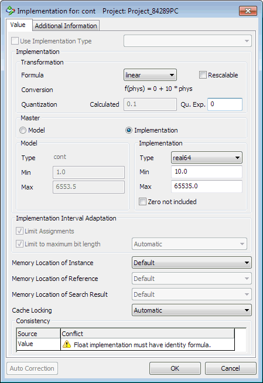
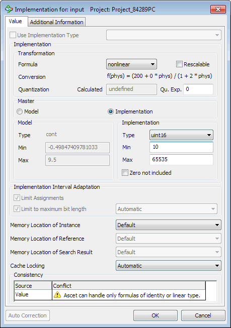

# Merged CHM Content

## Overview

_Source: `markdown/IEd_Overview.md`_

# Overview - Editing Implementations

Several implementation editors are available for components and projects, basic elements - i.e. variables, parameters, and system constants – and methods, processes, and runnable entities. Depending on the kind of the elements, fields are deactivated, or additional tabs appear, in the implementation editor for basic elements, however, the structure is always the same.

Implementations are independent from data sets. Nevertheless inconsistencies between both can arise. In the context of a project, the value of an element defined in its data set can exceed the value range defined in the implementation. It is the user’s responsibility to use consistent project settings.

At code generation time, the initialization values of basic elements must fit the value ranges defined by their implementations. Otherwise an error message is generated for parameters, a warning for variables.

For literals, the most suitable implementation is derived automatically by the code generation, so it does not have to be specified. Their implementation is derived from the first assignment made to them. The same is true for constants.

See also

[Editing Data - Overview](DataEditorEnglishUS.chm::/DEd_Overview.htm)

[Implementations of Components/Projects](markdown/IEd_impl_comp_proj_s.md)

[Implementation of Scalar, Non-logical Elements](markdown/impl_scalar_nonlogical.md)

[Implementations of Method- and Process-Local Variables](markdown/impl_method_process.md)

[Implementations for Temporary Variables](markdown/impl_temporary_variables.md)

[Implementations of Arrays, Matrices and Tables](markdown/IEd_impl_arrays_matrices_tables.md)

[Specifying an Implementation for a Logical Element](markdown/specify_impl-logicalelement.md)

[Specifying an Enumeration Implementation](markdown/specify_enum_impl.md)

[Method, Process and Runnable Implementations](markdown/method_process_impl.md)

[Implementations of Implementation Casts](markdown/impl_impl_casts.md)

[Operator Implementation](markdown/operator_impl.md)

---

## Implementations of Components/Projects

_Source: `markdown/IEd_impl_comp_proj_s.md`_

# Implementations of Components/Projects

You can open the implementation editor for components/projects

- From the Component Manager,
- From any specification editor

or — for included components—

- From the implementation editor of the containing component,

and edit the values for the current component or project.

The names for all implementations defined for this component or project are shown in the Implementation pane of the implementation editor for components/projects.

All components and local elements included in the project or component are displayed in the Locals tab. The Impl. Cast tab contains the implementation casts (see [Implementation Casts](IntroductionEnglishUS.chm::/INT_implementation_casts.htm)). The Globals tab lists global elements. With basic elements, the formula is specified after the element name and type. With complex elements the name of the referenced implementation is displayed.

See also

[Implementation Casts](IntroductionEnglishUS.chm::/INT_implementation_casts.htm)

[Editing the Implementation](ComponentManagerEnglishUS.chm::/EditImplementation.htm)

[Opening the Implementation Editor of a Edited Component/Project](markdown/IEd_open_impl.md)

[Selecting an Implementation](markdown/IEd_select_impl.md)

[Adjusting the Implementation Settings](markdown/adjust_impl.md)

---

## Implementation of Scalar, Non-logical Elements

_Source: `markdown/impl_scalar_nonlogical.md`_

# Implementation of Scalar, Non-Logical Elements

The implementation of non-logical elements describes the transformation from an infinite model domain (either continuous or discrete) to a finite implementation domain. Therefore the range for the values in the model has to have interval limits. Additionally, a linear formula describing the transformation from the physical to the implemented representation has to be defined.

For the model type continuous, which has an infinitely fine resolution, the formula determines the quantization in the implementation domain using special fixed-point arithmetic. The quantization is the reciprocal of the gradient of the linear formula since the implementation is assumed to be in integer arithmetic.

See also

[Opening the Implementation Editor for an Element (A)](markdown/IEd_open_impl_editor.md)

[Specifying Individual Implementations](markdown/specifying_individual_impl.md)

[Using Implementation Types](markdown/using_impl_types.md)

---

## Implementations of Implementation Casts

_Source: `markdown/impl_impl_casts.md`_

# Implementations of Implementation Casts

Implementation casts can be implemented the same way as scalar elements. The only new thing is the possibility not to implement them at all by selecting <No implementation> in the Implementation Type combo box. <No implementation> is the default selection for newly created implementation casts.

If <No implementation> is selected for an implementation cast, it is treated as nonexistent by each code generation.

See also

[Implementation Editor for Scalar Elements, Arrays and Matrices](markdown/IEd_Impl_Editor_for_Scalar_Nonlogical_Elements.md)

---

## Implementations of Arrays, Matrices and Characteristic Lines/Maps

_Source: `markdown/IEd_impl_arrays_matrices_tables.md`_

# Implementations of Arrays, Matrices and Characteristic Lines/Maps

Arrays and matrices have implementations which are defined like that of a scalar element. A characteristic line (1-D table) has two implementations, one for the X sample points and one for the output value. A characteristic map (2-D table) has three implementations, two for the X and Y sample points and one for the output value.

See also

[Implementation of Scalar, Array or Matrix Elements](markdown/IED_Implementation_NonLogicalElements.md)

[Implementing Characteristic Lines/Maps](markdown/define_impl_tables.md)

---

## Method/Process/Runnable Implementations

_Source: `markdown/method_process_impl.md`_

# Method, Process and Runnable Implementations

In ASCET, it is possible to have implementations not only for elements and components, but also for the methods, processes and runnables defined in modules, classes and software components. With that, you can improve the overall behavior of your system.

The implementation of methods, processes and runnables is edited from the specification editor. It cannot be edited from the project editor directly. Process/method/runnable implementations are available for block diagram and ESDL components, state machines, conditional tables and AUTOSAR software components.

The implementation of a process or method or runnable determines how the process/method/runnable is represented in the C code generated and where it is located during execution of the program.

See also

[Editing a Process/Method Implementation](markdown/IEd_edit_process_method.md)

[Editing a Runnable Implementation](AtomicSoftwareComponentEditorEnglishUS.chm::/ASCeditImplementationRunnable.htm)

---

## Implementations of Arguments and Return Values of Methods

_Source: `markdown/IEd_Impl_Argu_ReturnValues_of_Methods.md`_

# Implementations of Arguments and Return Values of Methods

The arguments and return value of a method are implemented exactly as other elements of the same type (see [Implementations of Components/Projects](markdown/IEd_impl_comp_proj_s.md), [Implementation of Scalar, Non-logical Elements](markdown/impl_scalar_nonlogical.md), [Implementations of Arrays, Matrices and Tables](markdown/IEd_impl_arrays_matrices_tables.md), [Specifying an Implementation for a Logical Element](markdown/specify_impl-logicalelement.md) and [Specifying an Enumeration Implementation](markdown/specify_enum_impl.md)).

For scalar and logical arguments and return values, and arguments and return values of type <enumeration>, the Memory location * combo boxes are deactivated. These elements are stored in the STACK memory class.

If references are used as arguments or return value, i.e. the type <array[*]>, <mat[*]> or <user defined> is selected, a memory class can be selected in the Memoy location of Instance combo box. This memory class does not apply to the reference in this case, it applies to the target of the reference.

See also

[Implementations of Components/Projects](markdown/IEd_impl_comp_proj_s.md)

[Implementation of Scalar, Non-logical Elements](markdown/impl_scalar_nonlogical.md)

[Implementations of Arrays, Matrices and Tables](markdown/IEd_impl_arrays_matrices_tables.md)

[Specifying an Implementation for a Logical Element](markdown/specify_impl-logicalelement.md)

[Specifying an Enumeration Implementation](markdown/specify_enum_impl.md)

---

## Implementations of Method-/Process-/Runnable-Local Variables

_Source: `markdown/impl_method_process.md`_

# Implementations of Method-/Process-/Runnable-Local Variables

Method-, process- and runnable-local variables can be implemented automatically or explicitly. With automatic implementation, the implementation is derived from the first variable assigned to the method-/process-local variable.

Default for scalar and enumeration local variables and references (i.e. arrays, matrices or records with activated Reference option, or classes) used as local variables is automatic implementation. Local variables of array, matrix or record type, marked as instances (see the Adding Local Variables * links below), cannot be implemented automatically.

If references are used as method-/process-/runnable-local variables, a memory class can be selected in the Memory Location of Instance combo box. This memory class does not apply to the reference in this case, it applies to the target of the reference.

See also

[Implementing a Method-/Process-/Runnable-Local Variable](markdown/impl_localvariables.md)

[Activating Automatic Implementation](markdown/activate_automatic_impl.md)

[Adding Local Variables to the Method or Process](BlockDiagramEditorEnglishUS.chm::/BDE_Localvariables.htm) (block diagram editor)

[Adding Local Variables to a Runnable or Method](AtomicSoftwareComponentEditorEnglishUS.chm::/ASCaddLocalvariables.htm) (SWC editor)

---

## Implementations for Temporary Variables

_Source: `markdown/impl_temporary_variables.md`_

# Implementations for Temporary Variables

Temporary variables in block diagrams are deprecated; they will be removed in a future ASCET version.

Temporary variables can be specified at the outputs of operators, composite and complex model elements in block diagrams if the Disable BDE Temp Variable Generation option in the [Optimization](ProjectEditorEnglishUS.chm::/CodeOptimization.htm) node of the parent project properties is deactivated. For these temporary variables, the code generator determines the implementation automatically. When a temporary variable is assigned an implemented quantity for the first time, the temporary variable obtains the corresponding conversion formula and value range. The implementation data type is chosen so that it is appropriate for the conversion formula and value range.

The insertion of a temporary variable in a mathematical expression does not affect the generation of mathematical operations for this expression. Temporary variables should not be used in different branches of the control flow (e.g. in the branches of an If statement). The result and the implementation (e.g. quantization) may be different for the separate branches. This could cause serious arithmetical errors in the generated code.

See also

[Temporary Variables](IntroductionEnglishUS.chm::/INT_temporary_variables.htm)

[Project Properties Window - Optimization Node](ProjectEditorEnglishUS.chm::/CodeOptimization.htm)

---

## Formulas

_Source: `markdown/IEd_Formulas.md`_

# Formulas

ASCET supports transformation formulas to define the implementation for fixed-point arithmetic. The identity formula is present in each project, other formulas have to be defined in the project editor of the associated project.

The following rules apply:

1. If the variable has the model data type cont and the implementation data type real32 or real64, only the identity formula should be selected because only this formula is supported by the code generation. If you select another formula, a warning message is displayed in the implementation editor:
1. If the variable has the model data type cont and an integer implementation data type, the identity or a linear formula should be selected because only these formulas can be handled by ASCET. If you select a non-linear formula, a warning message is displayed in the implementation editor:
1. If you edit an element with model data type [limitInt](IntroductionEnglishUS.chm::/INT_ScalarTypes_LimitedInteger.htm), [wrapInt](IntroductionEnglishUS.chm::/INT_ScalarTypes_WrapAroundInteger.htm), sdisc or udisc, and select another formula than the identity, an error message is displayed in the implementation editor:

Disc model type must have identity formula.

You must correct the formula (e.g., with the Auto Correction button in the implementation editor) or cancel the implementation.

Models from earlier ASCET versions can be used unchanged. During code generation, however, warnings are generated if they contain formulas for discrete elements.

If you make changes in a formula, or recursively replace a formula in a project implementation, you can have all your implementations updated automatically to match the new value ranges and data types. For information on replacing formulas and updating implementations see [Global Changes in Implementations](ProjectEditorEnglishUS.chm::/Globalchanges.htm).

See also

[Examples: Rules for Formulas](markdown/IEd_Examples_RulesFormulas.md)

[Selecting a Formula](markdown/IEd_select_formula.md)

[Introduction - Scalar Types: Limited Integer](IntroductionEnglishUS.chm::/INT_ScalarTypes_LimitedInteger.htm)

[Introduction - Scalar Types: Wrap-Around Integer](IntroductionEnglishUS.chm::/INT_ScalarTypes_WrapAroundInteger.htm)

[Project Editor - Adding a Formula](ProjectEditorEnglishUS.chm::/PE_add_formula.htm)

[Project Editor - Global Changes in Implementations](ProjectEditorEnglishUS.chm::/Globalchanges.htm)

[Introduction - Rescalable Implementations](IntroductionEnglishUS.chm::/INT_RescalableImplementations.htm)

---

## Examples: Rules for Formulas

_Source: `markdown/IEd_Examples_RulesFormulas.md`_

# Examples: Rules for Formulas

An ASCET model contains two parameters named cont and input. Both elements are of model data type cont.

##### Example for [Rule 1](markdown/IEd_Formulas.md#Rule1)

cont is implemented with the implementation type real64 and the formula linear (see [here](javascript:kadovTextPopup(this))<!-- kadovTextPopupInit('a3'); //-->).

The following warning is issued during code generation:

WARNING(WIa62): Element "cont" using float implementation must have identity formula --- formula "ident" is used instead of formula "linear"

The ASAM-MCD-2MC code generated for cont looks as follows:

/begin CHARACTERISTIC cont.Module_Block_Diagram

""

VALUE

0x0

STANDARD_VALUE_R64

0.0

ident

1.0

6553.5

...

/end CHARACTERISTIC

##### Example for [Rule 2](markdown/IEd_Formulas.md#Rule2)

input is implemented with the implementation type uint16 and the formula nonlinear (see [here](javascript:kadovTextPopup(this))<!-- kadovTextPopupInit('a4'); //-->).

The following warning is issued during code generation:

WARNING(WIa6): Non-linear formula <nonlinear> of <input> is treated as identity; code may be unexpected.

The ASAM-MCD-2MC code generated for input looks as follows:

/begin CHARACTERISTIC input.Module_Block_Diagram

""

VALUE

0x0

STANDARD_VALUE_U16

0.0

nonlinear

-0.4984740978103304

9.5

...

/end CHARACTERISTIC

/* Heikki Komulainen, Comet Computer GmbH 2004 */ cc_plus_pic = '&nbsp;'; cc_minus_pic = '&nbsp;'; cc_stat_pic = '&nbsp;'; gpstyle = ''; var iframes_created = 0; if (document.body && document.body.insertAdjacentHTML && document.getElementsByTagName && document.getElementById) { collect_popups(); set_poplinks_pictures(); if (iframes_created) { document.write(gpstyle); document.write('
<nobr><a id="einauslink" style="position:absolute;top:expression(document.body.scrollTop + this.offsetHeight - this.offsetHeight);left:expression(document.body.offsetWidth - (this.offsetWidth + 28));background:white;padding:5px" href="javascript:show_all_poptext()">Show all hidden text</a></nobr>
'); } } function collect_popups() { bsscpopups = new Array(); for (x = 0; x < document.links.length; x++) { if (document.links[x].href.indexOf("BSSCPopup")>-1) { seekmatch = /BSSCPopup.'[^'](markdown/+)'/; poplink = seekmatch.exec(document.links[x].href); poplink = "" + poplink; poplink = poplink.substring(poplink.indexOf("'")+1, poplink.lastIndexOf("'")); ifid = "CCGENIFRAMEID" + x; new_iframe = '<iframe id="' + ifid + '"src="' + poplink + '" onload="get_text(\'' + ifid + '\')" width="0" height="0" frameborder=0></iframe>'; document.links[x].parentNode.insertAdjacentHTML("afterEnd", new_iframe); gpid = "CCID_" + ifid; document.links[x].href = "javascript:expand_poptext('" + gpid + "')"; cc_plus = '' + cc_plus_pic + ''; document.links[x].insertAdjacentHTML("afterBegin", cc_plus); iframes_created = 1; } } }// end function function get_text(ifr_id) { frpars = document.frames[ifr_id].document.getElementsByTagName("body"); popbody = frpars[0].innerHTML; gpid = "CCID_" + ifr_id; if (!document.getElementById(gpid)) { //avoiding doubles document.getElementById(ifr_id).insertAdjacentHTML("afterEnd", '
'+popbody+'
'); } }//end function function expand_poptext(x_frame_id) { if (!document.getElementById(x_frame_id)) return; if (document.getElementById(x_frame_id).className == "CCGENPOPTEXTH") { document.getElementById(x_frame_id).className = "CCGENPOPTEXTV"; document.getElementById(x_frame_id).style.visibility = "visible"; if (document.getElementById("CCPMB_" + x_frame_id )) { document.getElementById("CCPMB_" + x_frame_id ).innerHTML = cc_minus_pic; } } else { document.getElementById(x_frame_id).className = "CCGENPOPTEXTH"; document.getElementById(x_frame_id).style.visibility = "hidden"; if (document.getElementById("CCPMB_" + x_frame_id )) { document.getElementById("CCPMB_" + x_frame_id ).innerHTML = cc_plus_pic; } } }// end function function show_all_poptext() { var pulldowntxt = document.getElementsByTagName("div"); for (b = 0; b < pulldowntxt.length; b++) { if (pulldowntxt[b].className == "droptext") { pulldowntxt[b].style.display=""; } } var gptxt = document.getElementsByTagName("div"); for (z = 0; z < gptxt.length; z++) { if (gptxt[z].className == "CCGENPOPTEXTH") { gptxt[z].className = "CCGENPOPTEXTV"; gptxt[z].style.visibility = "visible"; if (document.getElementById("CCPMB_" + gptxt[z].id )) { document.getElementById("CCPMB_" + gptxt[z].id ).innerHTML = cc_minus_pic; } } } var dxpoplinks = document.getElementsByTagName("a"); if (dxpoplinks) { for (pxl = 0; pxl < dxpoplinks.length; pxl++) { if (dxpoplinks[pxl].href.indexOf("kadovTextPopup")>-1) { if (document.getElementById("CCPMB_" + dxpoplinks[pxl].id)) { document.getElementById("CCPMB_" + dxpoplinks[pxl].id).innerHTML = cc_stat_pic; dxpoplinks[pxl].symbol = "minus"; } } } } document.getElementById('einauslink').innerText = 'Hide all hideable text'; document.getElementById('einauslink').href = "javascript:self.location.reload()"; self.focus(); }// end function function eat_click() { return false; }// end function function set_poplinks_pictures() { var dpoplinks = document.getElementsByTagName("a"); if (dpoplinks) { for (pl = 0; pl < dpoplinks.length; pl++) { if (dpoplinks[pl].href.indexOf("kadovTextPopup")>-1) { cc_plus = '' + cc_stat_pic + ''; //dpoplinks[pl].onmouseup = plusminuspoplink; dpoplinks[pl].insertAdjacentHTML("afterBegin", cc_plus); dpoplinks[pl].symbol = "plus"; } } } }// end function function plusminuspoplink() { if (document.getElementById("CCPMB_" + this.id)) { if (this.symbol == "plus") { document.getElementById("CCPMB_" + this.id).innerHTML = cc_minus_pic; this.symbol = "minus"; } else { document.getElementById("CCPMB_" + this.id).innerHTML = cc_plus_pic; this.symbol = "plus"; } } return true; }

---

## Master Page

_Source: `markdown/Master_Page.md`_

# Master Page

ASCET can either use the model or the implementation page of an implementation as the starting point for automatic updates. The starting point is set with the options in the Master field. You can set the default master page in the Implementation node of the ASCET options window.

If you select the model page as master, the implementation is determined automatically by default. To make the implementation data type user-definable, you can deactivate the Automatically select the Implementation Type option in the Implementation node of the ASCET options window.

See also

[Setting the Master Page of an Implementation](markdown/set_masterpg_impl.md)

[ASCET Options Window - Implementation Options](ComponentManagerEnglishUS.chm::/cm_implementation_node.htm)

---

## Consistency Checks

_Source: `markdown/IEd_Consistency_Checks.md`_

# Consistency Checks

The values inserted for the model or implementation are checked for consistency, together with the formula. The actions taken due to the results of the checks depend on the Automatically select the Implementation Type option (in the [Implementation](ComponentManagerEnglishUS.chm::/cm_implementation_node.htm) node of the ASCET options window).

- Automatically select the Implementation Type is activated
- Automatically select the Implementation Type is deactivated

## Automatically select the Implementation Type is Activated

1. If the model side is the master, the min. and max. values on the implementation side are adapted automatically using the formula.

If the input causes a larger interval in the Implementation column than the allowed range of the selected data type, the data type is adjusted automatically (exception: real* is selected as implementation data type). In doing so, the first data type suitable for the interval is selected.

Example: If the type uint8 has been entered in the Implementation column, and the interval [-100..255] results from the Model settings, the type int16 is chosen instead.

The sizes of the data types are assumed according to the following sequence:

int8 , uint8 , int16 , uint16 , int32, uint32

If even uint32 is too small, the following messages are issued in the Consistency field of the implementation editor (even though the element is of model type cont and the implementation data types real32 and real64 are available).

 Model value exceeds limits. No matching implementation data type available.

 [<min>,<max>] taken as physical interval due to quantization.

If you answer the error message with Auto Correction, a value is inserted on the master page. The value is chosen to ensure that the implementation side, after the automatic update, uses the maximum value for one of the 32 bit integer formats. If you click on Cancel, the dialog is closed and the original settings are restored.

If a smaller interval is selected on the Model side later, the implementation data type is scaled down again, if appropriate.

1. If the implementation side is the master, the values on the model side are adapted automatically using the formula.

When creating an element, it receives the default type set in the ASCET options (see [Default Implementation Types Options](componentmanagerenglishus.chm::/cm_defaultimplementationtypes.htm)) at first. If the user enters a bigger interval in the Implementation column than the data type allows, the data type is adjusted automatically. In this case, the smallest data type fitting the interval is selected. In contrast, however, no automatic adjustment is done if the user enters an interval, which would permit smaller data types.

Example: If for a cont element the type uint8 is selected in the Implementation column and

1. The user enters the interval [-100..255], the int16 type will be selected automatically instead.
1. The user enters the interval [0..100], the uint8 type will be kept.

For the sizes of the data types, again the following order is assumed:

int8 , uint8 , int16, uint16, int32, uint32

If even uint32 is too small, the maximum value for one of the 32 bit integer formats will be used automatically without generating an error or a warning.

1. If the new value conflicts with one of the other values, for instance if the new minimum value is greater than the maximum value, an error message will be shown, which you can acknowledge with Auto Correction or Cancel.
1. If the implementation is the master, and if you edit an element with model data type udisc and implementation data type int*, an error message is issued when you enter negative values for the implementation interval.
1. If the computed min and max values differ from the stored values, the system assumes the current formula as cause of the error. The following error message is shown:

 Values for min/max are not consistent with current formula.

This happens, e.g. when you edit a formula in the project, but do not update the implementations afterwards (see [Global Changes in Implementations](ProjectEditorEnglishUS.chm::/Globalchanges.htm)).

## Automatically select the Implementation Type is Activated

The same consistency checks are performed, but the implementation data type is not updated automatically.

See also

[ASCET Options Window - Implementation Options](ComponentManagerEnglishUS.chm::/CM_Implementation_Node.htm)

[ASCET Options Window - Default Implementation Types Options](componentmanagerenglishus.chm::/cm_defaultimplementationtypes.htm)

[Project Editor - Global Changes in Implementations](ProjectEditorEnglishUS.chm::/Globalchanges.htm)

---

## Limitations

_Source: `markdown/IEd_Limitations.md`_

# Limitations

A calculation might result in values outside the interval limits for a variable. The limiter takes into account the interval limits of a variable for all assignments to this variable, i.e. the code generator creates a limiting code. The limits obviate the need for manual limitation of individual variable values.

The default of this option named Limit Assignments, i.e. the setting that applies to newly created elements, can be set, separately for elements of the model data types cont, sdisc and udisc, in the Implementation node of the ASCET Options window. If the implementation data type real64 or real32 is selected for an element of model data type cont, the Limit Assignments option cannot be edited.

Instead of the Limit Assignments option, the implementation editor of ASCET versions older than V5.0 contained the Use Limiters field with the options Yes and No. If you are working with very old models, Limit Assignments is set according to the settings in that field.

When working with models from ASCET versions older than V5.0, Limit to maximum bit length is set according to the former Use Limiters field. Automatic is selected for all elements. The handling of operator implementations from previous ASCET versions is described in [Operator Implementation](markdown/operator_impl.md).

See also

[Setting the Limitation](markdown/set_limitation.md)

[Editing an Element Configuration](ElementEditorEnglishUS.chm::/EEd_edit_element_configuration.htm)

[ASCET Options Window - Implementation Options](ComponentManagerEnglishUS.chm::/cm_implementation_node.htm)

[Operator Implementation](markdown/operator_impl.md)

[Setting the Overflow Handling](markdown/set_overflow_handling.md)

---

## Protection Against Division by Zero

_Source: `markdown/Excluding_Zero.md`_

# Protection Against Division by Zero

The code generation assumes that the implementation interval can include zero. It is checked whether the denominator of a division contains zero. You can switch off the check in the Project Properties window, [Code Generation](ProjectEditorEnglishUS.chm::/PE_Code_Generation_Options.htm) node, Protected against Division by Zero option. In that case, the code generator takes the interval into account, e.g. a division by [0..100] is not protected.

If required, C code is generated that prevents a possible division by zero at runtime. The Result on Division by Zero option in the [Integer Arithmetic](ProjectEditorEnglishUS.chm::/fixedpoint.htm) node of the Project Properties window can be used to determine the behavior upon division by zero.

The option Zero not included (available in ASCET V5.0 - V6.3) is no longer available in ASCET V6.4. When working with older models that contain this flag, Zero not included is always treated as deactivated, i.e. code generation assumes that zero is included in the interval.

See also

[Integer Arithmetic Node](ProjectEditorEnglishUS.chm::/fixedpoint.htm)

[Code Generation Node](ProjectEditorEnglishUS.chm::/PE_Code_Generation_Options.htm)

---

## Using Implementation Types

_Source: `markdown/using_impl_types.md`_

# Using Implementation Types

Instead of the individual implementation, you can also assign a predefined implementation type. For details on how to create this, refer to [Implementation Types](ProjectEditorEnglishUS.chm::/PE_ImplementationTypes.htm).

The implementation types from the current project context are available to you. That is the default project (see [Default Project for a Component](ProjectEditorEnglishUS.chm::/PE_defaultproject.htm)), if you are editing the implementation from a component editor, or the project from which you are editing the implementation.

Implementation types are referenced by the implementations of basic elements. If it is intended to use a copy of an implementation type, e.g. for a subsequent modification, an implementation type can be first activated and then de-activated again. In this case, the settings of the implementation type are adopted by the implementation of the basic element.

For elements that use implementation types, the implementation information can only be resolved in the context of a project. The values shown in the in the [generated documentation](AutomaticDocumentationEnglishUS.chm::/AD_Overview.htm) and [Implementation](ComponentManagerEnglishUS.chm::/Implementation_View.htm) view of the Component Manager or a component editor are either default values or the values derived from the last project that used the elements in question.

See also

[Implementation Types](ProjectEditorEnglishUS.chm::/PE_ImplementationTypes.htm)

[Default Project for a Component](ProjectEditorEnglishUS.chm::/PE_defaultproject.htm)

[Assigning an Implementation Type](markdown/assign_impl_type.md)

[Implementation View](ComponentManagerEnglishUS.chm::/Implementation_View.htm)

[Automatic Documentation](AutomaticDocumentationEnglishUS.chm::/AD_Overview.htm)

---

## Operator Implementations

_Source: `markdown/operator_impl.md`_

# Operator Implementation

In old ASCET versions (i.e. V4.2 or older), operators in block diagrams could be implemented, too.

Since ASCET V5.0, the implementation options Limit to maximum bit length and Zero not included (available til ASCET V6.3) replace operator implementations. In addition, implementation casts can be used to insert requantizations in concatenated arithmetic operations without creating additional storage space requirements. Therefore, no new operator implementations can be created. Existing operator implementations in older projects can be viewed, replaced by implementation casts (see [Automatic Conversion of Operator Implementations](markdown/automatic_conversion_op_impl.md)) or removed, but not edited.

If an implementation is specified, the operator is marked in the graphic by a small line in the top left-hand corner ().

Use the procedure described in [Searching for Operator Implementations](markdown/search_op_impl.md) to easily detect operator implementations.

The [AMD export format](ComponentManagerEnglishUS.chm::/CM_AMD_Export.htm) does not include operator implementations. If you want to export a block diagram with operator implementations, or to convert your database into a workspace, you should replace the operator implementations with implementation casts prior to the export.

See also

[Automatic Conversion of Operator Implementations](markdown/automatic_conversion_op_impl.md)

[Searching for Operator Implementations](markdown/search_op_impl.md)

[Removing Operator Implementations](markdown/rename_individual_op_impl.md)

[Viewing an Operator Implementation](markdown/view_op_impl.md)

[Component Manager - AMD Export](ComponentManagerEnglishUS.chm::/CM_AMD_Export.htm)

[Component Manager - ASCET Workspace](ComponentManagerEnglishUS.chm::/CM_ASCETWorkspace.htm)

---

## Automatic Conversion of Operator Implementations

_Source: `markdown/automatic_conversion_op_impl.md`_

# Automatic Conversion of Operator Implementations

You can delete operator implementations in old models (see [Removing an Individual Operator Implementation](markdown/rename_individual_op_impl.md)) or replace them automatically with [implementation casts](IntroductionEnglishUS.chm::/INT_implementation_casts.htm). Automatic replacing applies to the entire database, not to individual components.

## Rules for Automatic Conversion

The following conditions have to be fulfilled for an operator implementation to be converted automatically.

1. The operator implementation must not contain any other quantization than Auto ([addition, subtraction](markdown/IEd_Implementation_for_AddSubWindow.md), [MIN, MAX and MUX](markdown/Ied_multiplexer_max_min.md)).
1. The operator ([+, -](markdown/IEd_Implementation_for_AddSubWindow.md), [*](markdown/IEd_multiplication.md), [/](markdown/IEd_division.md)) output must be connected to primitive elements.
1. If an implementation cast is connected to the operator ([+, -](markdown/IEd_Implementation_for_AddSubWindow.md), [*](markdown/IEd_multiplication.md), [/](markdown/IEd_division.md)) output, something other than No implementation has to be selected for this implementation cast in the combo box next to the Use Implementation Type option in the implementation editor.
1. The operator ([*](markdown/IEd_multiplication.md), [/](markdown/IEd_division.md)) implementation must not contain any special pre-shift.
1. If the operator is a [division](markdown/IEd_division.md) operator and the Allow zero in phys. interval option is activated in the operator implementation, the following rules also apply for the denominator input:

1. The denominator input must be connected to primitive elements.
1. If an implementation cast is connected to the denominator input, something other than No implementation has to be selected for this implementation cast in the combo box next to the Use Implementation Type option in the implementation editor.

If one of these conditions is not fulfilled in any implementation of the component, the relevant operator has to be converted manually.

See also

[Removing Operator Implementations](markdown/rename_individual_op_impl.md)

[Implementation Casts](IntroductionEnglishUS.chm::/INT_implementation_casts.htm)

[Replacing an Operator Implementation with an Implementation Cast](markdown/replace_op_impl.md)

[Implementation for: +/- Window](markdown/IEd_Implementation_for_AddSubWindow.md)

[Implementation for: * Window](markdown/IEd_multiplication.md)

[Implementation for: / Window](markdown/IEd_division.md)

[Implementation for: MUX/MAX/MIN Window](markdown/Ied_multiplexer_max_min.md)

[Implementations of Components/Projects](markdown/IEd_impl_comp_proj_s.md)

---

## Implementing Components

_Source: `markdown/IED_ImplementationComponents.md`_

# Implementing Components

Implementing components and projects contains the following steps.

- Opening the editor of an [edited component/project](markdown/IEd_open_impl.md) or an [included component](markdown/IEd_open_impleditor_includedcomponent.md) ([alternative way](markdown/open_incld_impl.md)).
- [Creating or Copying an Implementation](markdown/ied_create_copy_implementation.md)
- [Selecting an Implementation](markdown/IEd_select_impl.md)
- [Selecting a Default Implementation](markdown/IEd_Select_DefaultImplementation.md)
- [Adjusting the Implementation Settings](markdown/adjust_impl.md)
- [Deleting an Implementation](markdown/IEd_Deleting_Implementation.md)

---

## Opening the Implementation Editor of an Edited Component/Project

_Source: `markdown/IEd_open_impl.md`_

# Opening the Implementation Editor of an Edited Component/Project

To open the implementation editor of an edited component/project, proceed as follows:

1. Open the component or project in the respective specification editor.
1. In the Outline tab, select the self::<name> item.
1. Do one of the following:

- In the Edit menu of the specification editor, select Implementation.
- Right-click the entry and select Implementation from the context menu.
- Click on the  Edit Component Implementation button.
- Press Ctrl + Shift + i.

The implementation editor for the current project or component opens. The currently selected implementation is marked with the  symbol.

See also

[Selecting an Implementation](markdown/IEd_select_impl.md)

[Editing a Record Implementation](RecordsEnglishUS.chm::/RC_Edit_RecordImplementation.htm)

[Opening the Implementation Editor of an Included Component (A)](markdown/IEd_open_impleditor_includedcomponent.md)

[Opening the Implementation Editor of an Included Component (B)](markdown/open_incld_impl.md)

---

## Opening the Implementation Editor of an Included Component (A)

_Source: `markdown/IEd_open_impleditor_includedcomponent.md`_

# Opening the Implementation Editor of an Included Component (A)

To open the implementation editor of an included component from the specification editor of the parent component, proceed as follows:

1. In the Outline tab, select an included component.
1. Do one of the following:

- Open the Edit menu and select Implementation.
- Open the context menu and select Implementation.
- Press Ctrl + Shift + i.

Alternatively, you can use the Browser view of the specification editor:

1. Click on the Browse tab.
1. Go to the Implementation tab.
1. Select an included component.
1. Do one of the following:

- Press Return.
- Double-click on the selected element.

The implementation editor for the selected included component opens. The currently selected implementation is marked with the  symbol.

See also

[Editing the Implementation](ComponentManagerEnglishUS.chm::/EditImplementation.htm)

[Opening the Implementation Editor of an Included Component (B)](markdown/open_incld_impl.md)

[Opening the Implementation Editor of the Edited Component/Project](markdown/IEd_open_impl.md)

---

## Opening the Implementation Editor of an Included Component (B)

_Source: `markdown/open_incld_impl.md`_

# Opening the Implementation Editor of an Included Component (B)

To open the implementation editor of an included component from the implementation editor of the parent component, proceed as follows:

1. In the Local or Global tab of the implementation editor, select an included component.
1. Do one of the following.

- In the Edit menu, select Implementation.
- Double-click on the component.
- In the context menu, select Implementation.
- Press the Return key.

The implementation editor for the selected component opens. The currently selected implementation is marked with the  symbol.

See also

[Opening the Implementation Editor of an Included Component (A)](markdown/IEd_open_impleditor_includedcomponent.md)

[Opening the Implementation Editor of the Edited Component/Project](markdown/IEd_open_impl.md)

---

## Selecting an Implementation

_Source: `markdown/IEd_select_impl.md`_

# Selecting an Implementation

To select an implementation, proceed as follows:

1. Open the implementation editor for a component.
1. In the Implementation pane, select the implementation you want to edit.

The selection is valid until you select another implementation, or until you close the component editor.

All the operations available for data sets are also available for implementations and work as described in [Data Sets](DataEditorEnglishUS.chm::/DEd_data_sets.htm). You can specify implementations for local and global elements, as well as implementation casts, by selecting the corresponding tab of the implementation editor.

You can

[Create or copy an implementation](markdown/ied_create_copy_implementation.md)

[Select a default implementation](markdown/IEd_Select_DefaultImplementation.md)

[Adjust the implementation ettings](markdown/adjust_impl.md)

[Implement scalar, array or matrix elements](markdown/IED_Implementation_NonLogicalElements.md)

[Implement method-/process-/runnable-local variables](markdown/impl_localvariables.md)

[Implementi characteristic lines/maps](markdown/define_impl_tables.md)

Specify the implementation for a [logical](markdown/specify_impl-logicalelement.md) or [enumeration](markdown/specify_enum_impl.md) element

[Specify rescalable implementations](markdown/ied_specifyrescalableimplementations.md)

See also

[Data Sets](DataEditorEnglishUS.chm::/DEd_data_sets.htm)

[Opening the Implementation Editor of an Edited Component/Project](markdown/IEd_open_impl.md)

[Opening the Implementation Editor of an Included Component (A)](markdown/IEd_open_impleditor_includedcomponent.md)

[Opening the Implementation Editor of an Included Component (B)](markdown/open_incld_impl.md)

---

## Creating or Copying an Implementation

_Source: `markdown/ied_create_copy_implementation.md`_

# Creating or Copying an Implementation

To create/copy an implementation, proceed as follows:

1. [Open the implementation editor](markdown/IEd_open_impl.md) of a component or project.
1. To add a new implementation, do the following:
1. To copy an existing implementation, do the following:
1. To copy an existing implementation recursively, do the following:

This process only works for local variables.

1. In the Implementation pane, select the implementation you want to copy.
1. In the Implementation menu, point to Copy and select Recursive.
1. Enter a prefix for the names of the copied implementations and click OK.
1. Edit the name and press Return.

This process only works for local variables.

See also

[Opening the Implementation Editor of an Edited Component/Project](markdown/IEd_open_impl.md)

---

## Selecting a Default Implementation

_Source: `markdown/IEd_Select_DefaultImplementation.md`_

# Selecting a Default Implementation

To make an implementation the default, proceed as follows:

1. Open the implementation editor for components/projects.
1. Select the implementation you want to make the default.
1. In the Implementation menu, select Become Default.

The selected implementation becomes the default; it is marked with the word [DEFAULT]. Whenever the component or project is opened, this implementation will be active.

See also

[Opening the Implementation Editor of an Edited Component/Project](markdown/IEd_open_impl.md)

[Opening the Implementation Editor of an Included Component (A)](markdown/IEd_open_impleditor_includedcomponent.md)

[Opening the Implementation Editor of an Included Component (B)](markdown/open_incld_impl.md)

---

## Adjusting the Implementation Settings

_Source: `markdown/adjust_impl.md`_

# Adjusting the Implementation Settings

To adjust the implementation settings, proceed as follows:

The Settings tab has no meaning until you select the experiment Object Based Controller Implementation in the build options.

1. Select the Settings tab.

Only the Memory Location of Instance and Memory Segment combo boxes are available for all components (classes, modules, projects), the options are deactivated for modules and projects.

1. In the Memory Location of Instance combo box, select the memory area where the data structure for the component is to be stored.

The memory class for the code is defined in the implementation editor of the respective method or process (see [Editing a Process/Method Implementation](markdown/IEd_edit_process_method.md)).

1. When you are editing the implementation of a class, make sure that the Generate method body option is activated so that code is generated for the class.

The options Hierarchical code generation for State Machines, Outline automatically generated methods for State Machines and Auto-inline private methods (Smaller code-size) are available only for state machines. Their usage is described in [Activating/Deactivating Outlining of Actions/Conditions](StateMachineEditorEnglishUS.chm::/SM_activate_deactivate_outlining_of_actions_conditions_.htm) and [Activating/Deactivating Auto-Inlining](StateMachineEditorEnglishUS.chm::/SM_To_Activate_Deactivate_Auto-Inlining.htm).

Cache locking is described in the ASCET-RP user's guide, the other settings are described in [Settings Tab](markdown/IEd_Settings_Tab.md).

See also

[Activating/Deactivating Outlining of Actions/Conditions](StateMachineEditorEnglishUS.chm::/SM_activate_deactivate_outlining_of_actions_conditions_.htm)

[Activating/Deactivating Auto-Inlining](StateMachineEditorEnglishUS.chm::/SM_To_Activate_Deactivate_Auto-Inlining.htm)

[Editing a Process/Method Implementation](markdown/IEd_edit_process_method.md)

[Settings Tab](markdown/IEd_Settings_Tab.md)

---

## Deleting an Implementation

_Source: `markdown/IEd_Deleting_Implementation.md`_

# Deleting an Implementation

To delete a data set, proceed as follows:

1. In the implementation editor for components/projects, select the implementation you want to delete.
1. In the Implementation menu, select Delete.

The implementation is deleted. If other implementations have referenced that implementation, they now reference the implementation that becomes active after deletion.

See also

[Implementation Editor for Components/Projects](markdown/IEd_ImplementationEditor_for_ComponentsProjects.md)

---

## Implementing Records

_Source: `markdown/IEd_Implementing_Records.md`_

# Implementing Records

Implementing records and record elements contains the following steps.

- [Editing a Record Implementation](RecordsEnglishUS.chm::/RC_Edit_RecordImplementation.htm)
- [Implementing a Record Element](RecordsEnglishUS.chm::/RC_Implementing_RecordElement.htm)
- [Implementing a Record Instance](RecordsEnglishUS.chm::/RC_Implementing_RecordInstance.htm)

---

## Implementing Scalar, Array or Matrix Elements

_Source: `markdown/IED_Implementation_NonLogicalElements.md`_

# Implementing Scalar, Array or Matrix Elements

Implementing scalar, array or matrix elements, including implementation casts, arguments and return values, contains the following steps:

1. Open the implementation editor: [alternative A](markdown/IEd_open_impl_editor.md), [alternative B](markdown/IEd_open_impleditor_for_element.md), [alternative C](markdown/IEd_open_compo_project.md)
1. Do one of the following:

- [Specify an individual implementation](markdown/specifying_individual_impl.md).
- [Assign an implementation type](markdown/assign_impl_type.md).

These instructions do not apply to arrays and matrices specified as explicit references. For that case, see [Implementing References](markdown/IED_ImplementingReferences.md).

---

## Opening the Implementation Editor for an Element (A)

_Source: `markdown/IEd_open_impl_editor.md`_

# Opening the Implementation Editor for an Element (A)

To open the implementation editor for an element from the Component Manager, proceed as follows:

1. In the 1 Database or 1 Workspace list, select a component or project.
1. In the 3 Contents field, Implementation tab, select the basic element whose implementation you want to edit.
1. Do one of the following:

- Double-click on the element.
- Open the context menu and select Edit.
- Press the Return key.

See also

[Specifying Individual Implementations](markdown/specifying_individual_impl.md)

[Opening the Implementation Editor for an Element (B)](markdown/IEd_open_impleditor_for_element.md)

[Opening the Implementation Editor for an Element (C)](markdown/IEd_open_compo_project.md)

---

## Opening the Implementation Editor for an Element (B)

_Source: `markdown/IEd_open_impleditor_for_element.md`_

# Opening the Implementation Editor for an Element (B)

To open the Implementation editor from the Specification Editor, proceed as follows:

1. In the Outline tab, select the basic element whose implementation you want to edit.
1. Do one of the following:

- In the Edit menu, select Edit Implementation
- In the context menu, select Edit Implementation
- press Ctrl + Shift + i.

Alternatively, you can use the Browser view of the specification editor:

1. Click on the Browse tab.
1. Go to the Implementation tab.
1. Select the basic element whose implementation you want to edit.
1. Do one of the following:
1. Press Return.
1. Double-click on the selected element.

The implementation editor for the selected basic element opens.

See also

[Specifying Individual Implementations](markdown/specifying_individual_impl.md)

[Assigning an Implementation Type](markdown/assign_impl_type.md)

[Opening the Implementation Editor for an Element (A)](markdown/IEd_open_impl_editor.md)

[Opening the Implementation Editor for an Element (C)](markdown/IEd_open_compo_project.md)

---

## Opening the Implementation Editor for an Element (C)

_Source: `markdown/IEd_open_compo_project.md`_

# Opening the Implementation Editor for an Element (C)

To open the implementation editor of an element from the implementation editor of a component/project, proceed as follows:

1. In the Local or Global tab of the implementation editor, select the basic element whose implementation you want to edit.
1. Do one of the following:

- In the Element menu, select Edit.
- Double-click on the element.
- In the context menu of the element, select Edit.
- Press the Return key.

The implementation editor for the basic element opens. The model type is given by the element.

For newly created elements, the system does not assume the assignment of an implementation type defined in the project context, it assumes the assignment of a local implementation. Except for elements with enum model type, the implementation data type selected in the Default Implementation Types node of the ASCET options window is selected. For the value ranges, the maximum limits for the type are set.

See also

[Specifying Individual Implementations](markdown/specifying_individual_impl.md)

[Assigning an Implementation Type](markdown/assign_impl_type.md)

[Opening the Implementation Editor for an Element (A)](markdown/IEd_open_impl_editor.md)

[Opening the Implementation Editor for an Element (B)](markdown/IEd_open_impleditor_for_element.md)

[ASCET Options Window - Default Implementation Types Options](ComponentManagerEnglishUS.chm::/cm_implementation_node.htm)

---

## Specifying Individual Implementations

_Source: `markdown/specifying_individual_impl.md`_

# Specifying Individual Implementations

For scalar basic elements, arrays, and matrices, the Use Implementation Type option is deactivated by default. The adjacent combo box is grayed out. You do not have to change anything here to specify an individual implementation. To specify an individual implementation, perform the following steps:

1. [Select a formula](markdown/IEd_select_formula.md).
1. [Set the master page of the implementation](markdown/set_masterpg_impl.md).
1. Do one of the following:
1. [Set the limitation](markdown/set_limitation.md).
1. [Set the overflow handling](markdown/set_overflow_handling.md).
1. [Select a memory location](markdown/select_memory_location.md).

The following elements can be implemented this way: scalar elements including implementation casts, arguments and return values, arrays and matrices of type cont, limitInt, wrapInt, sdisc and udisc.

---

## Selecting a Formula

_Source: `markdown/IEd_select_formula.md`_

# Selecting a Formula

To select a formula, proceed as follows:

1. Select a transformation formula from the Formula combo box.
1. If you are preparing a quantized physical experiment, enter a quantization in the Qu. exp. field.

The value in the Qu. exp. field is used exclusively for the Quantized Physical Experiment.

If the variable has the model data type cont and the implementation data type real32 or real64, or if the variable has a model data type different from cont, only the identity formula should be selected because only this formula is supported by the code generation. If you select another formula, a warning or error is displayed in the Consistency field. For more details, see [Formulas](markdown/IEd_Formulas.md).

1. To switch to the identity formula, select ident from the Formula combo box.
1. Click OK to close the implementation editor.
1. Click OK without selecting the identity formula.
1. Click Cancel to close the dialog and restore the original settings.

See also

[Formulas](markdown/IEd_Formulas.md)

[Code Generation and Experimenting with Projects](ProjectEditorEnglishUS.chm::/experimentingprojects.htm)

---

## Setting the Master Page of an Implementation

_Source: `markdown/set_masterpg_impl.md`_

# Setting the Master Page of an Implementation

To set the master page of an implementation, proceed as follows:

- In the implementation editor, click on the Model option to specify that the settings on the Model side are used as the starting point for updating an implementation.

The Model option should be selected as master if physical model properties are the main reason for selecting the implementation.

The Min and Max fields in the Model pane are activated.

The model data type cannot be edited, it is determined by the element and merely displayed in the Type field.

If the [Automatically select the Implementation Type](ComponentManagerEnglishUS.chm::/CM_Implementation_Node.htm) option is activated, all fields in the Implementation pane are disabled. They are solely used as displays.

If the Automatically select the Implementation Type option is deactivated, the Type combo box in the Implementation pane remains editable.

Or

- In the implementation editor, click on the Implementation option to specify that the settings on the Implementation side are to be used as the starting point for updating an implementation.

The Implementation option should be selected as master if certain code properties (e.g. a required bit width) are the main reason for selecting the implementation.

The fields in the Implementation pane are activated.

The fields in the Model pane are disabled and serve as displays only.

See also

[Master Page](markdown/Master_Page.md)

[Specifying an Implementation (Master: Model)](markdown/specify_impl_mode.md)

[Specifying an Implementation (Master: Implementation)](markdown/specify_impl-master.md)

[ASCET Options Window - Implementation Options](ComponentManagerEnglishUS.chm::/CM_Implementation_Node.htm)

---

## Specifying an Implementation (Master: Model)

_Source: `markdown/specify_impl_mode.md`_

| Column 1 | Column 2 | Column 3 |
| --- | --- | --- |
| Type | Min. | Max. |
| cont | -∞ | +∞ |
| sdisc | -2147483648 | 2147483647 |
| udisc | 0 | 4294967295 |

# Specifying an Implementation (Master: Model)

To specify an implementation (master: model), proceed as follows:

1. In the Min and Max fields, enter the limits of the physical interval.
1. To enter the default limits for the model data type, right-click in one of the fields and select Default Value from the context menu.

The [maximal values](javascript:kadovTextPopup(this))<!-- kadovTextPopupInit('a1'); //--> for the respective model data type are inserted.

The implementation values are updated automatically, according to the formula and the values you entered.

The Min and Max values are used as limits in the ASAM-2MC file.

1. If Automatically select the Implementation Type is deactivated, select an implementation data type in the Type combo box of the Implementation pane.

See also

[Consistency Checks](markdown/IEd_Consistency_Checks.md)

[ASCET Options Window - Implementation Options](ComponentManagerEnglishUS.chm::/CM_Implementation_Node.htm)

/* Heikki Komulainen, Comet Computer GmbH 2004 */ cc_plus_pic = '&nbsp;'; cc_minus_pic = '&nbsp;'; cc_stat_pic = '&nbsp;'; gpstyle = ''; var iframes_created = 0; if (document.body && document.body.insertAdjacentHTML && document.getElementsByTagName && document.getElementById) { collect_popups(); set_poplinks_pictures(); if (iframes_created) { document.write(gpstyle); document.write('
<nobr><a id="einauslink" style="position:absolute;top:expression(document.body.scrollTop + this.offsetHeight - this.offsetHeight);left:expression(document.body.offsetWidth - (this.offsetWidth + 28));background:white;padding:5px" href="javascript:show_all_poptext()">Show all hidden text</a></nobr>
'); } } function collect_popups() { bsscpopups = new Array(); for (x = 0; x < document.links.length; x++) { if (document.links[x].href.indexOf("BSSCPopup")>-1) { seekmatch = /BSSCPopup.'[^'](markdown/+)'/; poplink = seekmatch.exec(document.links[x].href); poplink = "" + poplink; poplink = poplink.substring(poplink.indexOf("'")+1, poplink.lastIndexOf("'")); ifid = "CCGENIFRAMEID" + x; new_iframe = '<iframe id="' + ifid + '"src="' + poplink + '" onload="get_text(\'' + ifid + '\')" width="0" height="0" frameborder=0></iframe>'; document.links[x].parentNode.insertAdjacentHTML("afterEnd", new_iframe); gpid = "CCID_" + ifid; document.links[x].href = "javascript:expand_poptext('" + gpid + "')"; cc_plus = '' + cc_plus_pic + ''; document.links[x].insertAdjacentHTML("afterBegin", cc_plus); iframes_created = 1; } } }// end function function get_text(ifr_id) { frpars = document.frames[ifr_id].document.getElementsByTagName("body"); popbody = frpars[0].innerHTML; gpid = "CCID_" + ifr_id; if (!document.getElementById(gpid)) { //avoiding doubles document.getElementById(ifr_id).insertAdjacentHTML("afterEnd", '
'+popbody+'
'); } }//end function function expand_poptext(x_frame_id) { if (!document.getElementById(x_frame_id)) return; if (document.getElementById(x_frame_id).className == "CCGENPOPTEXTH") { document.getElementById(x_frame_id).className = "CCGENPOPTEXTV"; document.getElementById(x_frame_id).style.visibility = "visible"; if (document.getElementById("CCPMB_" + x_frame_id )) { document.getElementById("CCPMB_" + x_frame_id ).innerHTML = cc_minus_pic; } } else { document.getElementById(x_frame_id).className = "CCGENPOPTEXTH"; document.getElementById(x_frame_id).style.visibility = "hidden"; if (document.getElementById("CCPMB_" + x_frame_id )) { document.getElementById("CCPMB_" + x_frame_id ).innerHTML = cc_plus_pic; } } }// end function function show_all_poptext() { var pulldowntxt = document.getElementsByTagName("div"); for (b = 0; b < pulldowntxt.length; b++) { if (pulldowntxt[b].className == "droptext") { pulldowntxt[b].style.display=""; } } var gptxt = document.getElementsByTagName("div"); for (z = 0; z < gptxt.length; z++) { if (gptxt[z].className == "CCGENPOPTEXTH") { gptxt[z].className = "CCGENPOPTEXTV"; gptxt[z].style.visibility = "visible"; if (document.getElementById("CCPMB_" + gptxt[z].id )) { document.getElementById("CCPMB_" + gptxt[z].id ).innerHTML = cc_minus_pic; } } } var dxpoplinks = document.getElementsByTagName("a"); if (dxpoplinks) { for (pxl = 0; pxl < dxpoplinks.length; pxl++) { if (dxpoplinks[pxl].href.indexOf("kadovTextPopup")>-1) { if (document.getElementById("CCPMB_" + dxpoplinks[pxl].id)) { document.getElementById("CCPMB_" + dxpoplinks[pxl].id).innerHTML = cc_stat_pic; dxpoplinks[pxl].symbol = "minus"; } } } } document.getElementById('einauslink').innerText = 'Hide all hideable text'; document.getElementById('einauslink').href = "javascript:self.location.reload()"; self.focus(); }// end function function eat_click() { return false; }// end function function set_poplinks_pictures() { var dpoplinks = document.getElementsByTagName("a"); if (dpoplinks) { for (pl = 0; pl < dpoplinks.length; pl++) { if (dpoplinks[pl].href.indexOf("kadovTextPopup")>-1) { cc_plus = '' + cc_stat_pic + ''; //dpoplinks[pl].onmouseup = plusminuspoplink; dpoplinks[pl].insertAdjacentHTML("afterBegin", cc_plus); dpoplinks[pl].symbol = "plus"; } } } }// end function function plusminuspoplink() { if (document.getElementById("CCPMB_" + this.id)) { if (this.symbol == "plus") { document.getElementById("CCPMB_" + this.id).innerHTML = cc_minus_pic; this.symbol = "minus"; } else { document.getElementById("CCPMB_" + this.id).innerHTML = cc_plus_pic; this.symbol = "plus"; } } return true; }

---

## Specifying an Implementation (Master: Implementation)

_Source: `markdown/specify_impl-master.md`_

<table style="x-cell-content-align: Top;
				margin-top: 3px;
				border-left-style: Outset;
				border-top-style: Outset;
				border-right-style: Outset;
				border-bottom-style: Outset;
				border-left-width: 1px;
				border-right-width: 1px;
				border-top-width: 1px;
				border-bottom-width: 1px;
				margin-left: 0.886cm;" x-use-null-cells="">
<col/>
<col/>
<col/>
<tr class="hcp1" valign="top">
<td class="hcp2">

Type
</td>
<td class="hcp2">

Min.
</td>
<td class="hcp2">

Max.
</td></tr>
<tr class="hcp1" valign="top">
<td class="hcp2">

real64
</td>
<td class="hcp2">

-∞
</td>
<td class="hcp2">

+∞
</td></tr>
<tr class="hcp1" valign="top">
<td class="hcp2">

real32
</td>
<td class="hcp2">

-∞
</td>
<td class="hcp2">

+∞
</td></tr>
<tr class="hcp1" valign="top">
<td class="hcp2" colspan="3" rowspan="1">

real64 and real32 are only available for model data type 
 cont
</td>
</tr>
<tr class="hcp1" valign="top">
<td class="hcp2" colspan="1" rowspan="1">

sint32
</td>
<td class="hcp2" colspan="1" rowspan="1">

-2147483648
</td>
<td class="hcp2" colspan="1" rowspan="1">

2147483647
</td></tr>
<tr class="hcp1" valign="top">
<td class="hcp2" colspan="1" rowspan="1">

uint32
</td>
<td class="hcp2" colspan="1" rowspan="1">

0
</td>
<td class="hcp2" colspan="1" rowspan="1">

4294967295
</td></tr>
<tr class="hcp1" valign="top">
<td class="hcp2" colspan="1" rowspan="1">

sint16
</td>
<td class="hcp2" colspan="1" rowspan="1">

-32768
</td>
<td class="hcp2" colspan="1" rowspan="1">

32767
</td></tr>
<tr class="hcp1" valign="top">
<td class="hcp2" colspan="1" rowspan="1">

uint16
</td>
<td class="hcp2" colspan="1" rowspan="1">

0
</td>
<td class="hcp2" colspan="1" rowspan="1">

65535
</td></tr>
<tr class="hcp1" valign="top">
<td class="hcp2" colspan="1" rowspan="1">

sint8
</td>
<td class="hcp2" colspan="1" rowspan="1">

-128
</td>
<td class="hcp2" colspan="1" rowspan="1">

127
</td></tr>
<tr class="hcp1" valign="top">
<td class="hcp2" colspan="1" rowspan="1">

uint8
</td>
<td class="hcp2" colspan="1" rowspan="1">

0
</td>
<td class="hcp2" colspan="1" rowspan="1">

255
</td></tr>
</table>

# Specifying an Implementation (Master: Implementation)

To specify an implementation (master: implementation), proceed as follows:

1. In the Type combo box, select the implementation data type.

The combo box contains all available types for the element. If available, [customized data type names](ComponentManagerEnglishUS.chm::/CM_CustomizeDataTypeNames.htm) are displayed in the combo box.

1. In the Min and Max fields, enter the limits of the interval.

If you selected a real* implementation data type, the code generation ignores the limits you entered and uses ±oo for model and implementation.

1. To enter the default limits for the implementation data type, right-click in one of the fields and select Default Value from the context menu.

The [maximal values](javascript:kadovTextPopup(this))<!-- kadovTextPopupInit('a1'); //--> for the respective implementation data type are inserted.

The model values are updated automatically.

The model interval, i.e. Min and Max on the model field, are used as limits in the ASAM-2MC file.

The values inserted for the model or implementation are checked for consistency, together with the formula. See [Consistency Checks](markdown/IEd_Consistency_Checks.md) for details.

See also

[Consistency Checks](markdown/IEd_Consistency_Checks.md)

[Customizing Data Type Names](ComponentManagerEnglishUS.chm::/CM_CustomizeDataTypeNames.htm)

[Global Changes in Implementations](ProjectEditorEnglishUS.chm::/Globalchanges.htm)

[ASCET Options Window - Implementation Options](ComponentManagerEnglishUS.chm::/CM_Implementation_Node.htm)

/* Heikki Komulainen, Comet Computer GmbH 2004 */ cc_plus_pic = '&nbsp;'; cc_minus_pic = '&nbsp;'; cc_stat_pic = '&nbsp;'; gpstyle = ''; var iframes_created = 0; if (document.body && document.body.insertAdjacentHTML && document.getElementsByTagName && document.getElementById) { collect_popups(); set_poplinks_pictures(); if (iframes_created) { document.write(gpstyle); document.write('
<nobr><a id="einauslink" style="position:absolute;top:expression(document.body.scrollTop + this.offsetHeight - this.offsetHeight);left:expression(document.body.offsetWidth - (this.offsetWidth + 28));background:white;padding:5px" href="javascript:show_all_poptext()">Show all hidden text</a></nobr>
'); } } function collect_popups() { bsscpopups = new Array(); for (x = 0; x < document.links.length; x++) { if (document.links[x].href.indexOf("BSSCPopup")>-1) { seekmatch = /BSSCPopup.'[^'](markdown/+)'/; poplink = seekmatch.exec(document.links[x].href); poplink = "" + poplink; poplink = poplink.substring(poplink.indexOf("'")+1, poplink.lastIndexOf("'")); ifid = "CCGENIFRAMEID" + x; new_iframe = '<iframe id="' + ifid + '"src="' + poplink + '" onload="get_text(\'' + ifid + '\')" width="0" height="0" frameborder=0></iframe>'; document.links[x].parentNode.insertAdjacentHTML("afterEnd", new_iframe); gpid = "CCID_" + ifid; document.links[x].href = "javascript:expand_poptext('" + gpid + "')"; cc_plus = '' + cc_plus_pic + ''; document.links[x].insertAdjacentHTML("afterBegin", cc_plus); iframes_created = 1; } } }// end function function get_text(ifr_id) { frpars = document.frames[ifr_id].document.getElementsByTagName("body"); popbody = frpars[0].innerHTML; gpid = "CCID_" + ifr_id; if (!document.getElementById(gpid)) { //avoiding doubles document.getElementById(ifr_id).insertAdjacentHTML("afterEnd", '
'+popbody+'
'); } }//end function function expand_poptext(x_frame_id) { if (!document.getElementById(x_frame_id)) return; if (document.getElementById(x_frame_id).className == "CCGENPOPTEXTH") { document.getElementById(x_frame_id).className = "CCGENPOPTEXTV"; document.getElementById(x_frame_id).style.visibility = "visible"; if (document.getElementById("CCPMB_" + x_frame_id )) { document.getElementById("CCPMB_" + x_frame_id ).innerHTML = cc_minus_pic; } } else { document.getElementById(x_frame_id).className = "CCGENPOPTEXTH"; document.getElementById(x_frame_id).style.visibility = "hidden"; if (document.getElementById("CCPMB_" + x_frame_id )) { document.getElementById("CCPMB_" + x_frame_id ).innerHTML = cc_plus_pic; } } }// end function function show_all_poptext() { var pulldowntxt = document.getElementsByTagName("div"); for (b = 0; b < pulldowntxt.length; b++) { if (pulldowntxt[b].className == "droptext") { pulldowntxt[b].style.display=""; } } var gptxt = document.getElementsByTagName("div"); for (z = 0; z < gptxt.length; z++) { if (gptxt[z].className == "CCGENPOPTEXTH") { gptxt[z].className = "CCGENPOPTEXTV"; gptxt[z].style.visibility = "visible"; if (document.getElementById("CCPMB_" + gptxt[z].id )) { document.getElementById("CCPMB_" + gptxt[z].id ).innerHTML = cc_minus_pic; } } } var dxpoplinks = document.getElementsByTagName("a"); if (dxpoplinks) { for (pxl = 0; pxl < dxpoplinks.length; pxl++) { if (dxpoplinks[pxl].href.indexOf("kadovTextPopup")>-1) { if (document.getElementById("CCPMB_" + dxpoplinks[pxl].id)) { document.getElementById("CCPMB_" + dxpoplinks[pxl].id).innerHTML = cc_stat_pic; dxpoplinks[pxl].symbol = "minus"; } } } } document.getElementById('einauslink').innerText = 'Hide all hideable text'; document.getElementById('einauslink').href = "javascript:self.location.reload()"; self.focus(); }// end function function eat_click() { return false; }// end function function set_poplinks_pictures() { var dpoplinks = document.getElementsByTagName("a"); if (dpoplinks) { for (pl = 0; pl < dpoplinks.length; pl++) { if (dpoplinks[pl].href.indexOf("kadovTextPopup")>-1) { cc_plus = '' + cc_stat_pic + ''; //dpoplinks[pl].onmouseup = plusminuspoplink; dpoplinks[pl].insertAdjacentHTML("afterBegin", cc_plus); dpoplinks[pl].symbol = "plus"; } } } }// end function function plusminuspoplink() { if (document.getElementById("CCPMB_" + this.id)) { if (this.symbol == "plus") { document.getElementById("CCPMB_" + this.id).innerHTML = cc_minus_pic; this.symbol = "minus"; } else { document.getElementById("CCPMB_" + this.id).innerHTML = cc_plus_pic; this.symbol = "plus"; } } return true; }

---

## Setting the Limitation

_Source: `markdown/set_limitation.md`_

# Setting the Limitation

To set the limitation, proceed as follows:

- Activate the Limit Assignments option.

You have thus determined that the value range of a variable, defined by Min and Max, is considered when the code generator makes assignments.

Code generation with Physical Experiment ignores the option.

A variable value is limited by the value range. If the assigned value is out of range, the relevant Min or Max limit value is used

or

- Deactivate the Limit Assignments option.

You have thus determined that the defined value range of a variable is not considered when the code generator makes assignments.

In this case, the value of a variable is not limited by the value range, the maximum limit is determined by the implementation data type (int8, int16, etc.).

See also

[Project Editor - Build Node](ProjectEditorEnglishUS.chm::/Build_Options.htm)

[Limitations](markdown/IEd_Limitations.md)

---

## Setting the Overflow Handling

_Source: `markdown/set_overflow_handling.md`_

# Setting the Overflow Handling

You can define the overflow behavior. Most options are available in connection with arithmetic services.

1. Activate the Limit to maximum bit length option if the result of an operation shall be limited in case of overflow.

If the result value range exceeds the range specified in the [Integer Arithmetic node](ProjectEditorEnglishUS.chm::/fixedpoint.htm), code is generated that avoids the overflow.

The combo box next to the option is activated.

1. From the combo box, select Reduce Resolution if the resolution can be reduced upon limiting.

This option avoids an overflow by right-shifting the inputs, if necessary. The shift is determined automatically.

1. Select Keep Resolution if the resolution shall not be reduced upon limiting.

If arithmetic services are activated, this option avoids an overflow by using limiting services, if necessary.

If not, code generation is aborted with an error message.

1. Select Automatic to make overflow handling dependent on the use of arithmetic services.

If this is enabled, the Keep resolution method is used in case of overflow limiting. If not, the Reduce resolution method is used.

See also

[Arithmetic Services - Overview](ArithmeticServicesEnglishUS.chm::/AS_Overview.htm)

[Adjusting the Project Settings](ProjectEditorEnglishUS.chm::/adjustcode_gen.htm)

[Limitations](markdown/IEd_Limitations.md)

[Integer Arithmetic Node](ProjectEditorEnglishUS.chm::/fixedpoint.htm)

---

## Selecting a Memory Location

_Source: `markdown/select_memory_location.md`_

# Selecting a Memory Location

To select a memory location, proceed as follows:

- In the Memory Location of Instance combo box, select the memory area where the element or component instance is located.

This instruction does not apply to arrays and matrices specified as explicit references. For that case, see [Implementing References](markdown/IED_ImplementingReferences.md).

See also

[Implementing References](markdown/IED_ImplementingReferences.md)

[Explicit References](IntroductionEnglishUS.chm::/INT_ExplicitReferences.htm)

---

## Assigning an Implementation Type

_Source: `markdown/assign_impl_type.md`_

# Assigning an Implementation Type

To assign an implementation type, proceed as follows:

1. Open the implementation editor for a basic element.
1. Activate the Use Implementation Type option.
1. Select an implementation type.
1. Set the limitation as described in [Setting the Limitation](markdown/set_limitation.md).
1. Select the memory location for the element in the Memory Location of Instance combo box.

See also

[Implementation Types](ProjectEditorEnglishUS.chm::/PE_ImplementationTypes.htm)

[Setting the Limitation](markdown/set_limitation.md)

[Limitations](markdown/IEd_Limitations.md)

---

## Implementing Method-/Process-/Runnable-Local Variables

_Source: `markdown/impl_localvariables.md`_

i.e. arrays, matrices or records with activated Automatically select the Implementation Type option, or classes

# Implementing a Method-/Process-/Runnable-Local Variable

To implement a method-/process-/runnable-local variable, proceed as follows:

1. Open the implementation editor for the local variable:
1. Click OK to continue.
1. Do one of the following:

See also

[Activating Automatic Implementation](markdown/activate_automatic_impl.md)

[Specifying Individual Implementations](markdown/specifying_individual_impl.md)

[Assigning an Implementation Type](markdown/assign_impl_type.md)

[Specifying an Enumeration Implementation](markdown/specify_enum_impl.md)

[Implementing References](markdown/IED_ImplementingReferences.md)

[Opening the Implementation Editor for an Element (A)](markdown/IEd_open_impl_editor.md)

[Opening the Implementation Editor for an Element (B)](markdown/IEd_open_impleditor_for_element.md)

[Opening the Implementation Editor for an Element (C)](markdown/IEd_open_compo_project.md)

/* Heikki Komulainen, Comet Computer GmbH 2004 */ cc_plus_pic = '&nbsp;'; cc_minus_pic = '&nbsp;'; cc_stat_pic = '&nbsp;'; gpstyle = ''; var iframes_created = 0; if (document.body && document.body.insertAdjacentHTML && document.getElementsByTagName && document.getElementById) { collect_popups(); set_poplinks_pictures(); if (iframes_created) { document.write(gpstyle); document.write('
<nobr><a id="einauslink" style="position:absolute;top:expression(document.body.scrollTop + this.offsetHeight - this.offsetHeight);left:expression(document.body.offsetWidth - (this.offsetWidth + 28));background:white;padding:5px" href="javascript:show_all_poptext()">Alle texte einblenden</a></nobr>
'); } } function collect_popups() { bsscpopups = new Array(); for (x = 0; x < document.links.length; x++) { if (document.links[x].href.indexOf("BSSCPopup")>-1) { seekmatch = /BSSCPopup.'[^'](markdown/+)'/; poplink = seekmatch.exec(document.links[x].href); poplink = "" + poplink; poplink = poplink.substring(poplink.indexOf("'")+1, poplink.lastIndexOf("'")); ifid = "CCGENIFRAMEID" + x; new_iframe = '<iframe id="' + ifid + '"src="' + poplink + '" onload="get_text(\'' + ifid + '\')" width="0" height="0" frameborder=0></iframe>'; document.links[x].parentNode.insertAdjacentHTML("afterEnd", new_iframe); gpid = "CCID_" + ifid; document.links[x].href = "javascript:expand_poptext('" + gpid + "')"; cc_plus = '' + cc_plus_pic + ''; document.links[x].insertAdjacentHTML("afterBegin", cc_plus); iframes_created = 1; } } }// end function function get_text(ifr_id) { frpars = document.frames[ifr_id].document.getElementsByTagName("body"); popbody = frpars[0].innerHTML; gpid = "CCID_" + ifr_id; if (!document.getElementById(gpid)) { //avoiding doubles document.getElementById(ifr_id).insertAdjacentHTML("afterEnd", '
'+popbody+'
'); } }//end function function expand_poptext(x_frame_id) { if (!document.getElementById(x_frame_id)) return; if (document.getElementById(x_frame_id).className == "CCGENPOPTEXTH") { document.getElementById(x_frame_id).className = "CCGENPOPTEXTV"; document.getElementById(x_frame_id).style.visibility = "visible"; if (document.getElementById("CCPMB_" + x_frame_id )) { document.getElementById("CCPMB_" + x_frame_id ).innerHTML = cc_minus_pic; } } else { document.getElementById(x_frame_id).className = "CCGENPOPTEXTH"; document.getElementById(x_frame_id).style.visibility = "hidden"; if (document.getElementById("CCPMB_" + x_frame_id )) { document.getElementById("CCPMB_" + x_frame_id ).innerHTML = cc_plus_pic; } } }// end function function show_all_poptext() { var pulldowntxt = document.getElementsByTagName("div"); for (b = 0; b < pulldowntxt.length; b++) { if (pulldowntxt[b].className == "droptext") { pulldowntxt[b].style.display=""; } } var gptxt = document.getElementsByTagName("div"); for (z = 0; z < gptxt.length; z++) { if (gptxt[z].className == "CCGENPOPTEXTH") { gptxt[z].className = "CCGENPOPTEXTV"; gptxt[z].style.visibility = "visible"; if (document.getElementById("CCPMB_" + gptxt[z].id )) { document.getElementById("CCPMB_" + gptxt[z].id ).innerHTML = cc_minus_pic; } } } var dxpoplinks = document.getElementsByTagName("a"); if (dxpoplinks) { for (pxl = 0; pxl < dxpoplinks.length; pxl++) { if (dxpoplinks[pxl].href.indexOf("kadovTextPopup")>-1) { if (document.getElementById("CCPMB_" + dxpoplinks[pxl].id)) { document.getElementById("CCPMB_" + dxpoplinks[pxl].id).innerHTML = cc_stat_pic; dxpoplinks[pxl].symbol = "minus"; } } } } document.getElementById('einauslink').innerText = 'Alle texte ausblenden'; document.getElementById('einauslink').href = "javascript:self.location.reload()"; self.focus(); }// end function function eat_click() { return false; }// end function function set_poplinks_pictures() { var dpoplinks = document.getElementsByTagName("a"); if (dpoplinks) { for (pl = 0; pl < dpoplinks.length; pl++) { if (dpoplinks[pl].href.indexOf("kadovTextPopup")>-1) { cc_plus = '' + cc_stat_pic + ''; //dpoplinks[pl].onmouseup = plusminuspoplink; dpoplinks[pl].insertAdjacentHTML("afterBegin", cc_plus); dpoplinks[pl].symbol = "plus"; } } } }// end function function plusminuspoplink() { if (document.getElementById("CCPMB_" + this.id)) { if (this.symbol == "plus") { document.getElementById("CCPMB_" + this.id).innerHTML = cc_minus_pic; this.symbol = "minus"; } else { document.getElementById("CCPMB_" + this.id).innerHTML = cc_plus_pic; this.symbol = "plus"; } } return true; }

---

## Activating Automatic Implementation

_Source: `markdown/activate_automatic_impl.md`_

# Activating Automatic Implementation

To activate automatic implementation for a method-/process-/runnable-local variable, proceed as follows:

1. Open the implementation editor for the parent component of the local variable.
1. In the Local tab, select the local variable.
1. Do one of the following:

- In the Element menu, select Use automatic Implementation.
- Right-click onto the variable name and select Use automatic Implementation from the context menu.

With that, the automatic implementation of the method-/process-/runnable-local variable is activated. The Use automatic Implementation in the Element menu is marked and grayed out.

Automatic implementation is deactivated by explicitly implementing the variable.

See also

[Implementing a Method-/Process-/Runnable-Local Variable](markdown/impl_localvariables.md)

---

## Implementing Characteristic Lines/Maps

_Source: `markdown/define_impl_tables.md`_

# Implementing Characteristic Lines/Maps

This instructions do not apply to characteristic lines/maps specified as explicit references. For that case, see [Implementing References](markdown/IED_ImplementingReferences.md).

To implement a characteristic line or map, proceed as follows:

1. Open the implementation editor for a characteristic line or map: [alternative A](markdown/IEd_open_impl_editor.md), [alternative B](markdown/IEd_open_impleditor_for_element.md), [alternative C](markdown/IEd_open_compo_project.md)
1. Select the tab for the implementation you want to edit.
1. Do one of the following:
1. Select another tab to edit the next implementation.
1. Click on OK to close the implementation editor.

See also

[Implementations of Arrays, Matrices and Characteristic Lines/Maps](markdown/IEd_impl_arrays_matrices_tables.md)

[Implementation Editor for Characteristic Lines/Maps](markdown/ied_implementation_editor_non-scalar_elements.md)

[Opening the Implementation Editor for an Element (A)](markdown/IEd_open_impl_editor.md)

[Opening the Implementation Editor for an Element (B)](markdown/IEd_open_impleditor_for_element.md)

[Opening the Implementation Editor for an Element (C)](markdown/IEd_open_compo_project.md)

[Specifying Individual Implementations](markdown/specifying_individual_impl.md)

[Assigning an Implementation Type](markdown/assign_impl_type.md)

[Implementing References](markdown/IED_ImplementingReferences.md)

---

## Implementing References

_Source: `markdown/IED_ImplementingReferences.md`_

1. Open the implementation editor of the reference, e.g. as described in [Opening the Implementation Editor for an Element (B)](markdown/IEd_open_impleditor_for_element.md).
1. Characteristic lines/maps only: Select the tab for the implementation you want to edit.
1. Specify the implementation as described in [Specifying Individual Implementations](markdown/specifying_individual_impl.md).
1. In the Memory Location of Instance combo box, select a memory location for the instance (i.e. the referenced element).
1. In the Memory Location of Reference combo box, select a memory location for the reference.
1. Characteristic lines/maps only: Select another tab to edit the next implementation.
1. Click OK to close the implementation editor for the reference.

1. Open the implementation editor for the reference, e.g. as described in [Opening the Implementation Editor of an Included Component (A)](markdown/IEd_open_impleditor_includedcomponent.md).

The implementation editor for component references opens.

1. If necessary, click on the  button to open the implementation editor of the referenced component.
1. In the Memory Location of Instance combo box, select a memory location for the instance (i.e. the referenced component).
1. In the Memory Location of Reference combo box, select a memory location for the reference.
1. Click OK to close the implementation editor for the reference.

# Implementing References

References are implemented much like other elements. Proceed as follows:

##### [1. Array, matrix, characteristic line/map references](javascript:kadovTextPopup(this))<!-- kadovTextPopupInit('a1'); //-->

##### [2. Component references](javascript:kadovTextPopup(this))<!-- kadovTextPopupInit('a2'); //-->

See also

[Opening the Implementation Editor for an Element (B)](markdown/IEd_open_impleditor_for_element.md)

[Specifying Individual Implementations](markdown/specifying_individual_impl.md)

[Opening the Implementation Editor of an Included Component (A)](markdown/IEd_open_impleditor_includedcomponent.md)

[Implementation Editor for Component References](markdown/IEd_ImplRefEditor.md)

[Explicit References](IntroductionEnglishUS.chm::/INT_ExplicitReferences.htm)

/* Heikki Komulainen, Comet Computer GmbH 2004 */ cc_plus_pic = '&nbsp;'; cc_minus_pic = '&nbsp;'; cc_stat_pic = '&nbsp;'; gpstyle = ''; var iframes_created = 0; if (document.body && document.body.insertAdjacentHTML && document.getElementsByTagName && document.getElementById) { collect_popups(); set_poplinks_pictures(); if (iframes_created) { document.write(gpstyle); document.write('
<nobr><a id="einauslink" style="position:absolute;top:expression(document.body.scrollTop + this.offsetHeight - this.offsetHeight);left:expression(document.body.offsetWidth - (this.offsetWidth + 28));background:white;padding:5px" href="javascript:show_all_poptext()">Alle texte einblenden</a></nobr>
'); } } function collect_popups() { bsscpopups = new Array(); for (x = 0; x < document.links.length; x++) { if (document.links[x].href.indexOf("BSSCPopup")>-1) { seekmatch = /BSSCPopup.'[^'](markdown/+)'/; poplink = seekmatch.exec(document.links[x].href); poplink = "" + poplink; poplink = poplink.substring(poplink.indexOf("'")+1, poplink.lastIndexOf("'")); ifid = "CCGENIFRAMEID" + x; new_iframe = '<iframe id="' + ifid + '"src="' + poplink + '" onload="get_text(\'' + ifid + '\')" width="0" height="0" frameborder=0></iframe>'; document.links[x].parentNode.insertAdjacentHTML("afterEnd", new_iframe); gpid = "CCID_" + ifid; document.links[x].href = "javascript:expand_poptext('" + gpid + "')"; cc_plus = '' + cc_plus_pic + ''; document.links[x].insertAdjacentHTML("afterBegin", cc_plus); iframes_created = 1; } } }// end function function get_text(ifr_id) { frpars = document.frames[ifr_id].document.getElementsByTagName("body"); popbody = frpars[0].innerHTML; gpid = "CCID_" + ifr_id; if (!document.getElementById(gpid)) { //avoiding doubles document.getElementById(ifr_id).insertAdjacentHTML("afterEnd", '
'+popbody+'
'); } }//end function function expand_poptext(x_frame_id) { if (!document.getElementById(x_frame_id)) return; if (document.getElementById(x_frame_id).className == "CCGENPOPTEXTH") { document.getElementById(x_frame_id).className = "CCGENPOPTEXTV"; document.getElementById(x_frame_id).style.visibility = "visible"; if (document.getElementById("CCPMB_" + x_frame_id )) { document.getElementById("CCPMB_" + x_frame_id ).innerHTML = cc_minus_pic; } } else { document.getElementById(x_frame_id).className = "CCGENPOPTEXTH"; document.getElementById(x_frame_id).style.visibility = "hidden"; if (document.getElementById("CCPMB_" + x_frame_id )) { document.getElementById("CCPMB_" + x_frame_id ).innerHTML = cc_plus_pic; } } }// end function function show_all_poptext() { var pulldowntxt = document.getElementsByTagName("div"); for (b = 0; b < pulldowntxt.length; b++) { if (pulldowntxt[b].className == "droptext") { pulldowntxt[b].style.display=""; } } var gptxt = document.getElementsByTagName("div"); for (z = 0; z < gptxt.length; z++) { if (gptxt[z].className == "CCGENPOPTEXTH") { gptxt[z].className = "CCGENPOPTEXTV"; gptxt[z].style.visibility = "visible"; if (document.getElementById("CCPMB_" + gptxt[z].id )) { document.getElementById("CCPMB_" + gptxt[z].id ).innerHTML = cc_minus_pic; } } } var dxpoplinks = document.getElementsByTagName("a"); if (dxpoplinks) { for (pxl = 0; pxl < dxpoplinks.length; pxl++) { if (dxpoplinks[pxl].href.indexOf("kadovTextPopup")>-1) { if (document.getElementById("CCPMB_" + dxpoplinks[pxl].id)) { document.getElementById("CCPMB_" + dxpoplinks[pxl].id).innerHTML = cc_stat_pic; dxpoplinks[pxl].symbol = "minus"; } } } } document.getElementById('einauslink').innerText = 'Alle texte ausblenden'; document.getElementById('einauslink').href = "javascript:self.location.reload()"; self.focus(); }// end function function eat_click() { return false; }// end function function set_poplinks_pictures() { var dpoplinks = document.getElementsByTagName("a"); if (dpoplinks) { for (pl = 0; pl < dpoplinks.length; pl++) { if (dpoplinks[pl].href.indexOf("kadovTextPopup")>-1) { cc_plus = '' + cc_stat_pic + ''; //dpoplinks[pl].onmouseup = plusminuspoplink; dpoplinks[pl].insertAdjacentHTML("afterBegin", cc_plus); dpoplinks[pl].symbol = "plus"; } } } }// end function function plusminuspoplink() { if (document.getElementById("CCPMB_" + this.id)) { if (this.symbol == "plus") { document.getElementById("CCPMB_" + this.id).innerHTML = cc_minus_pic; this.symbol = "minus"; } else { document.getElementById("CCPMB_" + this.id).innerHTML = cc_plus_pic; this.symbol = "plus"; } } return true; }

---

## Specifying the Implementation for a Logical Element

_Source: `markdown/specify_impl-logicalelement.md`_

# Specifying the Implementation for a Logical Element

To specify an implementation for a logical element, proceed as follows:

1. Open the implementation editor, e.g. as described in [Opening the Implementation Editor for an Element (A)](markdown/IEd_open_impl_editor.md).

All fields in the Value tab, except Type, Memory Location of Instance, and Memory Segment, are disabled because they are irrelevant for the implementation of logical elements.

1. In the Type combo box, select the implementation data type.

The following types are available: bit, bool, sint8, sint16, sint32, uint8, uint16 and uint32. If available, [customized data type names](ComponentManagerEnglishUS.chm::/CM_CustomizeDataTypeNames.htm) are displayed in the combo box.

The logical element is represented by a variable of the selected data type.

1. In the Memory Location of Instance combo box, select the memory area where the element is located.

The available selection depends on the current target. This setting is only relevant for experiments on microcontroller targets and is ignored in all other cases.

1. In the Additional Info tab, enter information for your code generator.

This information is only evaluated where applicable. The exact nature of the information you can enter here depends on your target and code generator.

See also

[Opening the Implementation Editor for an Element (A)](markdown/IEd_open_impl_editor.md)

[Opening the Implementation Editor for an Element (B)](markdown/IEd_open_impleditor_for_element.md)

[Opening the Implementation Editor for an Element (C)](markdown/IEd_open_compo_project.md)

---

## Specifying the Memory Location for State Variables

_Source: `markdown/IEd_SpecifyMemLoc_StateVariables.md`_

# Specifying the Memory Location for State Variables

Code generation for a state machine may generate, depending on the option [Hierarchical Code Generation](ProjectEditorEnglishUS.chm::/PE_Statemachine_Options_Window.htm) and the use of hierarchy states with history flag, several [state variables](StateMachineEditorEnglishUS.chm::/SM_StateVariables.htm). Only one of them, the sm variable, is visible in the state machine editor; this variable is used to specify memory location and cache locking for all state variables. Proceed as follows:

1. Open the implementation editor for the sm variable (), e.g. as described in [Opening the Implementation Editor for an Element (B)](markdown/IEd_open_impleditor_for_element.md).
1. In the Memory Location of Instance combo box, select the memory area where the element is located.
1. In the Additional Info tab, enter information for your code generator.

This information is only for documentation purposes.

If you want to set up cache locking (only for ASCET-RP with ES1135), see [ES1135: Cache Locking](INTECRIOConnectivityRPEnglishUS.chm::/IIO_ES1135CacheLocking.htm) and references therein.

If you want to specify memory segments, see the ASCET-SE user's guide, chapter "Memory Segments", for details.

See also

[State Machine Editor - State Variables](StateMachineEditorEnglishUS.chm::/SM_StateVariables.htm)

[Project Editor - Statemachine Node](ProjectEditorEnglishUS.chm::/PE_Statemachine_Options_Window.htm)

[Opening the Implementation Editor for an Element (B)](markdown/IEd_open_impleditor_for_element.md)

[Opening the Implementation Editor for an Element (A)](markdown/IEd_open_impl_editor.md)

[Opening the Implementation Editor for an Element (C)](markdown/IEd_open_compo_project.md)

---

## Specifying an Enumeration Implementation

_Source: `markdown/specify_enum_impl.md`_

# Specifying an Enumeration Implementation

To specify an enumeration implementation, proceed as follows:

1. Open the implementation editor for the enumeration as described in [Opening the Implementation Editor for an Element (A)](markdown/IEd_open_impl_editor.md).
1. In the Memory Location of Instance combo box, select the memory area where the element is located.
1. In the Additional Info tab, enter information for your code generator.

This information is only evaluated where applicable. The exact nature of the information you can enter here depends on your target and code generator.

See also

[Opening the Implementation Editor for an Element (A)](markdown/IEd_open_impl_editor.md)

[Opening the Implementation Editor for an Element (B)](markdown/IEd_open_impleditor_for_element.md)

[Opening the Implementation Editor for an Element (C)](markdown/IEd_open_compo_project.md)

---

## Editing a Process/Method Implementation

_Source: `markdown/IEd_edit_process_method.md`_

# Editing a Process/Method Implementation

To edit a process/method implementation, proceed as follows:

1. Open the specification editor for the module or class you want to edit.
1. In the Outline tab, select the process or method you want to edit.
1. Do one of the following:
1. From the [Inline](markdown/ied_implementation_editor_methodsprocesses.md#Inline) combo box, select a value for inlining.
1. Activate the Use FPU option if you want to save the Floating Point Unit registers of your microcontroller target upon task switching.
1. From the Memory Location combo box, select the memory area where the code should run.
1. If you are working with ASCET-RP and ES1135, or with an ASCET-SE target, use the Memory Segment combo box for the respective settings.
1. In the Symbol field, enter the character string you want to use as C function name for the process or method in the currently selected implementation of the component.

Valid strings are any valid C identifier, any sequence of ASCET naming macros (see the list in [Implementation Editor for Methods/Processes/Runnables](markdown/ied_implementation_editor_methodsprocesses.md)), or any combination thereof.

An empty Symbol field means that the default naming convention (as specified in the codegen.ini file) is used.

See also

[Implementation Editor for Methods/Processes/Runnables](markdown/ied_implementation_editor_methodsprocesses.md)

[Software Component Editor - Editing the Implementation of a Runnable](AtomicSoftwareComponentEditorEnglishUS.chm::/ASCeditImplementationRunnable.htm)

---

## Specifying Rescalable Implementations

_Source: `markdown/ied_specifyrescalableimplementations.md`_

# Specifying Rescalable Implementations

To specify [rescalable implementations](IntroductionEnglishUS.chm::/INT_RescalableImplementations.htm), you have to

- [adjust the implementations of basic elements in a component](#AdjustingBasic)

and then

- [specify a rescaling formula for each component instance in your project.](#SpecifyingRescaling)

Proceed as follows.

##### Adjusting the implementations of basic elements

1. Open the component whose elements need a rescalable implementation.
1. For each element that needs a rescalable implementation, do the following.

1. [Open the implementation editor for the element](markdown/IEd_open_impleditor_for_element.md).
1. In the implementation editor, activate the Rescalable option.
1. [Select a linear formula](markdown/IEd_select_formula.md) with positive scale and zero offset.
1. [Set the master page](markdown/set_masterpg_impl.md) to Implementation.
1. Select an sint* or uint* implementation data type.
1. Close the implementation editor with OK.

##### Specifying a rescaling formula for a component instance

For each instance of the component in your project, do the following.

1. Open the parent component of the instance.
1. Make sure that the instance is of scope local.
1. [Open the implementation editor for the parent component.](markdown/IEd_open_impl.md)
1. In the implementation editor, [select an implementation](markdown/IEd_select_impl.md).
1. In the Local tab, in the row of the instance, click in the Rescaling Formula cell.
1. Select a linear formula with positive scale and zero offset.
1. Close the implementation editor with OK.

See also

[Rescalable Implementations](IntroductionEnglishUS.chm::/INT_RescalableImplementations.htm)

[Elements with Rescalable Implementations](IntroductionEnglishUS.chm::/INT_ElementsRescalableImpl.htm)

[Opening the Implementation Editor for an Element (B)](markdown/IEd_open_impleditor_for_element.md)

[Selecting a Formula](markdown/IEd_select_formula.md)

[Setting the Master Page of an Implementation](markdown/set_masterpg_impl.md)

[Specifying an Implementation (Master: Implementation)](markdown/specify_impl-master.md)

[Opening the Implementation Editor of an Edited Component/Project](markdown/IEd_open_impl.md)

[Selecting an Implementation](markdown/IEd_select_impl.md)

[Project Editor - Transformation Formulas](ProjectEditorEnglishUS.chm::/PE_TransformationFormulas.htm)

---

## Dealing With Operator Implementations

_Source: `markdown/IEd_DealingWithOperatorImpl.md`_

# Dealing With Operator Implementations

Dealing with operator implementations contains the following tasks:

- [Searching for Operator Implementations](markdown/search_op_impl.md)
- [Viewing an Operator Implementation](markdown/view_op_impl.md)
- [Removing Operator Implementations](markdown/rename_individual_op_impl.md)
- [Replacing Operator Implementations with Implementation Casts](markdown/replace_op_impl.md)
- [Automatic Conversion of Operator Implementation: Results](markdown/Ied_AutomaticConversion_OperatorImplementation_ResultsA.md)

---

## Searching for Operator Implementations

_Source: `markdown/search_op_impl.md`_

# Searching for Operator Implementations

To search for operator implementations, proceed as follows:

1. In the Component Manager, open the Tools menu, point to Database and select Show Operator Implementations.

The database is searched. Depending on its size, the search can take several seconds. The detected operator implementations are listed in the Operator Implementations window.

The Element column lists all components/projects containing operator implementations. The Implementation column lists the name of the respective implementation, and the Diagram column lists the diagram that contains the operator implementation.

1. In the Element column, double-click on a component.

The editor for the component opens. The affected operators are highlighted. You can view or delete the implementations.

---

## Removing Operator Implementations

_Source: `markdown/rename_individual_op_impl.md`_

# Removing Operator Implementations

You can remove individual operator implementations, or you can remove all operator implementations in the database.

1. To remove an individual operator implementation, proceed as follows:
1. To remove operator implementations in the entire database, proceed as follows:

1. Go to the Component Manager.
1. In the Tools menu, point to Database or Workspace, then point to Convert and select Reset Operator Implementations.

All operator implementations of the entire database are removed.

See also

[Replacing Operator Implementations with Implementation Casts](markdown/replace_op_impl.md)

---

## Viewing an Operator Implementation

_Source: `markdown/view_op_impl.md`_

# Viewing an Operator Implementation

To view an operator implementation, proceed as follows:

1. Open the respective block diagram.
1. Right-click on an operator with an implementation, open the Implementation context menu and select View.

A warning is displayed, indicating that operator implementations are no longer supported.

1. Click OK to open the Implementation for window.

The window serves as a display only, you cannot change any setting.

1. Click on OK.

The implementation for a mathematical operator determines the procedure if there is an overflow and/or the quantization (e.g. the accuracy) in the result. As with variables, this information can vary across different implementations for the relevant module. The information available for each operator is described below.

The integer code generator treats the basic operations completely differently. Additional information, therefore, also depends on the specific operation.

- [Addition and Subtraction](markdown/IEd_Implementation_for_AddSubWindow.md)
- [Multiplication](markdown/IEd_multiplication.md)
- [Division](markdown/IEd_division.md)
- [Multiplexor, Maximum, Minimum](markdown/Ied_multiplexer_max_min.md)

---

## Replacing Operator Implementations with Implementation Casts

_Source: `markdown/replace_op_impl.md`_

# Replacing Operator Implementations with Implementation Casts

To replace operator implementations with implementation casts, proceed as follows:

- In the Component Manager, open the Tools menu, point to Database, then point to Convert and select Operator Implementations to Impl. Casts.

The operator implementations of the entire database are converted into implementation casts in accordance with the [Rules for Automatic Conversion](markdown/automatic_conversion_op_impl.md#Rules).

The possible results are described in [Automatic Conversion of Operator Implementation: Results](markdown/Ied_AutomaticConversion_OperatorImplementation_ResultsA.md).

See also

[Automatic Conversion of Operator Implementation: Results](markdown/Ied_AutomaticConversion_OperatorImplementation_ResultsA.md)

[Automatic Conversion of Operator Implementations](markdown/automatic_conversion_op_impl.md)

[Removing Operator Implementations](markdown/rename_individual_op_impl.md)

---

## Automatic Conversion of Operator Implementation: Results

_Source: `markdown/Ied_AutomaticConversion_OperatorImplementation_ResultsA.md`_

1. An implementation cast is created on every connection of the operator output.
1. If the operator is a division operator and the Allow zero in phys. interval option is activated in the operator implementation, an implementation cast is created on the connection to the denominator input.
1. The implementation information of the following element is accepted for every implementation cast at the output of an implemented operator.

This is not the case for the model type, this is always cont for implementation casts.

1. The implementation information (apart from the model type) from the previous element is accepted for implementation casts which were added at the denominator input of a division operator.

For implementations of the component in which the operator has no implementation, No implementation is selected for newly created implementation casts.

1. The overflow handling is converted according to the following scheme:

<table style="border-left-style: Outset;
				border-top-style: Outset;
				border-right-style: Outset;
				border-bottom-style: Outset;
				border-left-width: 1px;
				border-right-width: 1px;
				border-top-width: 1px;
				border-bottom-width: 1px;
				margin-top: 3px;
				x-cell-content-align: Top;
				margin-left: 1.522cm;" x-use-null-cells="">
<col/>
<col/>
<col/>
<col/>
<tr class="hcp1" valign="middle">
<td class="hcp2" colspan="1" rowspan="1" valign="top">

 
</td>
<td class="hcp2" colspan="3" rowspan="1" valign="top">

Interval Adaptation settings for implementation cast
</td>
</tr>
<tr class="hcp1" valign="middle">
<td class="hcp2" colspan="1" rowspan="1" valign="top">

Operator Implementation
</td>
<td class="hcp2" colspan="1" rowspan="1" valign="top">

Limit to maximum bit length
</td>
<td class="hcp2" colspan="1" rowspan="1" valign="top">

Reduce Resolution
</td>
<td class="hcp2" colspan="1" rowspan="1" valign="top">

Keep Resolution
</td></tr>
<tr class="hcp1" valign="middle">
<td class="hcp2" colspan="1" rowspan="1" valign="top">

Reduce resolution
</td>
<td class="hcp2" colspan="1" rowspan="1" valign="top">

X
</td>
<td class="hcp2" colspan="1" rowspan="1" valign="top">

X
</td>
<td class="hcp2" colspan="1" rowspan="1" valign="top">

 
</td></tr>
<tr class="hcp1" valign="middle">
<td class="hcp2" colspan="1" rowspan="1" valign="top">

Keep resolution and limit
</td>
<td class="hcp2" colspan="1" rowspan="1" valign="top">

X
</td>
<td class="hcp2" colspan="1" rowspan="1" valign="top">

 
</td>
<td class="hcp2" colspan="1" rowspan="1" valign="top">

X
</td></tr>
<tr class="hcp1" valign="middle">
<td class="hcp2" valign="top">

Keep resolution and don't limit
</td>
<td class="hcp2" colspan="1" rowspan="1" valign="top">

 
</td>
<td class="hcp2" colspan="1" rowspan="1" valign="top">

n/a
</td>
<td class="hcp2" valign="top">

n/a
</td></tr>
</table>

Each row shows the settings set for the implementation cast to replace the corresponding setting of the operator implementation.

1. The operator implementation is removed.

Under certain conditions implementation casts would be created with the same implementation as the element connected to their output. In these cases, no implementation cast is inserted.

1. An implementation cast is created on every connection of the operator output—even with components, operators etc. <No implementation> is selected for these implementation casts in all implementations of the component.

This implementation cast is given the relevant implementation information during manual conversion of the operator implementation.

If this kind of implementation cast already exists on one of these connections, no other implementation cast is added to this connection.

1. If the Allow zero in phys. interval option is activated in the operator implementation of a division operator, an implementation cast with <No implementation> is created on the connection of the denominator input.

If this kind of implementation cast already exists, another one is not added.

1. The operator implementation remains unchanged.

# Automatic Conversion of Operator Implementation: Results

- If the implementation of an operator (except MIN, MAX, MUX) can be converted automatically, [the following](javascript:kadovTextPopup(this))<!-- kadovTextPopupInit('a1'); //--> happens.

1. If the implementation of an operator (except MIN, MAX, MUX) cannot be converted automatically, [the following](javascript:kadovTextPopup(this))<!-- kadovTextPopupInit('a2'); //--> happens.
1. If the implementation of a MIN, MAX or MUX operator can be converted automatically, only the operator implementation is removed. No implementation cast is added.

If it is not possible to convert all operator implementations automatically in the database, the following message is issued:

Not all operator implementations could be replaced automatically. Please do the conversion manually.

Confirm this message with OK. The Operator Implementations window (see [Searching for Operator Implementations](markdown/search_op_impl.md)) opens, it shows the components which contain the remaining operator implementations. You can now convert them manually, or remove them.

See also

[Replacing Operator Implementations with Implementation Casts](markdown/replace_op_impl.md)

[Searching for Operator Implementations](markdown/search_op_impl.md)

[Removing Operator Implementations](markdown/rename_individual_op_impl.md)

/* Heikki Komulainen, Comet Computer GmbH 2004 */ cc_plus_pic = '&nbsp;'; cc_minus_pic = '&nbsp;'; cc_stat_pic = '&nbsp;'; gpstyle = ''; var iframes_created = 0; if (document.body && document.body.insertAdjacentHTML && document.getElementsByTagName && document.getElementById) { collect_popups(); set_poplinks_pictures(); if (iframes_created) { document.write(gpstyle); document.write('
<nobr><a id="einauslink" style="position:absolute;top:expression(document.body.scrollTop + this.offsetHeight - this.offsetHeight);left:expression(document.body.offsetWidth - (this.offsetWidth + 28));background:white;padding:5px" href="javascript:show_all_poptext()">Show all hidden text</a></nobr>
'); } } function collect_popups() { bsscpopups = new Array(); for (x = 0; x < document.links.length; x++) { if (document.links[x].href.indexOf("BSSCPopup")>-1) { seekmatch = /BSSCPopup.'[^'](markdown/+)'/; poplink = seekmatch.exec(document.links[x].href); poplink = "" + poplink; poplink = poplink.substring(poplink.indexOf("'")+1, poplink.lastIndexOf("'")); ifid = "CCGENIFRAMEID" + x; new_iframe = '<iframe id="' + ifid + '"src="' + poplink + '" onload="get_text(\'' + ifid + '\')" width="0" height="0" frameborder=0></iframe>'; document.links[x].parentNode.insertAdjacentHTML("afterEnd", new_iframe); gpid = "CCID_" + ifid; document.links[x].href = "javascript:expand_poptext('" + gpid + "')"; cc_plus = '' + cc_plus_pic + ''; document.links[x].insertAdjacentHTML("afterBegin", cc_plus); iframes_created = 1; } } }// end function function get_text(ifr_id) { frpars = document.frames[ifr_id].document.getElementsByTagName("body"); popbody = frpars[0].innerHTML; gpid = "CCID_" + ifr_id; if (!document.getElementById(gpid)) { //avoiding doubles document.getElementById(ifr_id).insertAdjacentHTML("afterEnd", '
'+popbody+'
'); } }//end function function expand_poptext(x_frame_id) { if (!document.getElementById(x_frame_id)) return; if (document.getElementById(x_frame_id).className == "CCGENPOPTEXTH") { document.getElementById(x_frame_id).className = "CCGENPOPTEXTV"; document.getElementById(x_frame_id).style.visibility = "visible"; if (document.getElementById("CCPMB_" + x_frame_id )) { document.getElementById("CCPMB_" + x_frame_id ).innerHTML = cc_minus_pic; } } else { document.getElementById(x_frame_id).className = "CCGENPOPTEXTH"; document.getElementById(x_frame_id).style.visibility = "hidden"; if (document.getElementById("CCPMB_" + x_frame_id )) { document.getElementById("CCPMB_" + x_frame_id ).innerHTML = cc_plus_pic; } } }// end function function show_all_poptext() { var pulldowntxt = document.getElementsByTagName("div"); for (b = 0; b < pulldowntxt.length; b++) { if (pulldowntxt[b].className == "droptext") { pulldowntxt[b].style.display=""; } } var gptxt = document.getElementsByTagName("div"); for (z = 0; z < gptxt.length; z++) { if (gptxt[z].className == "CCGENPOPTEXTH") { gptxt[z].className = "CCGENPOPTEXTV"; gptxt[z].style.visibility = "visible"; if (document.getElementById("CCPMB_" + gptxt[z].id )) { document.getElementById("CCPMB_" + gptxt[z].id ).innerHTML = cc_minus_pic; } } } var dxpoplinks = document.getElementsByTagName("a"); if (dxpoplinks) { for (pxl = 0; pxl < dxpoplinks.length; pxl++) { if (dxpoplinks[pxl].href.indexOf("kadovTextPopup")>-1) { if (document.getElementById("CCPMB_" + dxpoplinks[pxl].id)) { document.getElementById("CCPMB_" + dxpoplinks[pxl].id).innerHTML = cc_stat_pic; dxpoplinks[pxl].symbol = "minus"; } } } } document.getElementById('einauslink').innerText = 'Hide all hideable text'; document.getElementById('einauslink').href = "javascript:self.location.reload()"; self.focus(); }// end function function eat_click() { return false; }// end function function set_poplinks_pictures() { var dpoplinks = document.getElementsByTagName("a"); if (dpoplinks) { for (pl = 0; pl < dpoplinks.length; pl++) { if (dpoplinks[pl].href.indexOf("kadovTextPopup")>-1) { cc_plus = '' + cc_stat_pic + ''; //dpoplinks[pl].onmouseup = plusminuspoplink; dpoplinks[pl].insertAdjacentHTML("afterBegin", cc_plus); dpoplinks[pl].symbol = "plus"; } } } }// end function function plusminuspoplink() { if (document.getElementById("CCPMB_" + this.id)) { if (this.symbol == "plus") { document.getElementById("CCPMB_" + this.id).innerHTML = cc_minus_pic; this.symbol = "minus"; } else { document.getElementById("CCPMB_" + this.id).innerHTML = cc_plus_pic; this.symbol = "plus"; } } return true; }

---

## Reference to User Interface

_Source: `markdown/IEd_Reference_to_UserInterface.md`_

# Reference to User Interface

The following windows are described:

- [Implementation Editor for Scalar Elements, Arrays, Matrices](markdown/IEd_Impl_Editor_for_Scalar_Nonlogical_Elements.md)
- [Implementation Editor for Characteristic Lines/Maps](markdown/ied_implementation_editor_non-scalar_elements.md)
- [Implementation Editor for Methods/Processes/Runnables](markdown/ied_implementation_editor_methodsprocesses.md)
- [Implementation Editor for Components/Projects](markdown/IEd_ImplementationEditor_for_ComponentsProjects.md)
- [Implementation Editor for Component References](markdown/IEd_ImplRefEditor.md)
- [Implementation for <operator> Window](markdown/IEd_ImplementationforOperatorWindow.md)

---

## Implementation Editor for Scalar Elements, Arrays, Matrices

_Source: `markdown/IEd_Impl_Editor_for_Scalar_Nonlogical_Elements.md`_

# Implementation Editor for Scalar Elements, Arrays and Matrices

The implementation editor for scalar elements, arrays and matrices contains the following elements:

- [Value](markdown/Value_Tab.md) Tab
- [AUTOSAR](markdown/ied_autosartab.md) tab

Only available for elements in AUTOSAR components.

- Additional Information tab

Here, you can enter information relevant to individual code generators, which is only evaluated where applicable. The exact nature of the information you can enter here depends on your target and code generator.

 Auto Correction

 OK

Closes the window and accepts the changes.

 Cancel

Closes the window without accepting the changes.

You can

[Specify individual implementations](markdown/specifying_individual_impl.md)

[Assign an implementation type](markdown/assign_impl_type.md)

[Specify the implementation for a logical element](markdown/specify_impl-logicalelement.md)

[Specify the memory location for state variables](markdown/IEd_SpecifyMemLoc_StateVariables.md)

[Specify an enumeration implementation](markdown/specify_enum_impl.md)

---

## Implementation Editor for Characteristic Lines/Maps

_Source: `markdown/ied_implementation_editor_non-scalar_elements.md`_

# Implementation Editor for Characteristic Lines and Maps

The implementation editor for characteristic lines/maps contains the following elements:

- [Value](markdown/Value_Tab.md) Tab

This tab applies to the values of a characteristic line/map.

- X Distribution Tab

This tab applies to the X distribution of a characteristic line or map. It contains the same elements as the Value tab.

- Y Distribution Tab

This tab is only available for characteristic maps.

This tab applies to the Y distribution of a characteristic table. It contains the same elements as the Value tab.

- [AUTOSAR](markdown/ied_autosartab.md) tab

Only available for elements in AUTOSAR components.

- Additional Information tab

Here, you can enter information relevant to individual code generators, which is only evaluated where applicable. The exact nature of the information you can enter here depends on your target and code generator.

 Auto Correction

 OK

Closes the window and accepts the changes.

 Cancel

Closes the window without accepting the changes.

---

## Value Tab

_Source: `markdown/Value_Tab.md`_

# Value Tab

The Value tab contains the following elements. Most of them are not available for logical values, enumerations, and automatically generated state variables.

##### Use Implementation Type option and combo box

The option decides whether an implementation type with predefined parameters is used. When the option is activated, the input fields/options in the Implementation field are disabled.

The combo box is used to select an available implementation type. Possible values are all implementation types defined in the associated project.

##### Implementation field

This field is used to specify an individual implementation. It contains the Transformation, Master, Model, and Implementation fields.

Transformation field

- Formula combo box

Used to select a quantization formula. Possible values are all formulas defined in the associated project.

- Rescalable option

This option determines if the implementation can be rescaled (activated) or not. See [Rescalable Implementations](IntroductionEnglishUS.chm::/INT_RescalableImplementations.htm) for details.

The Rescalable option can be used only for elements of type cont. The option must be deactivated for elements of other types (log, limitInt, wrapInt, sdisc, udisc, enum).

- Conversion field

Displays the selected formula.

- Quantization Calculated field

Displays the quantization calculated from the model and implementation data and the formula.

- Quantization Qu. Exp. field

Used to enter a quantization.

Master field

Here, you select whether the model or the implementation field of an implementation is used as the starting point for automatic updates.

- Model option

The Model field is used as starting point.

- Implementation option

The Implementation field is used as starting point.

Model field

- Type field

Displays the model data type of the element.

- Min. field

Lower limit of the physical interval.

- Max. field

Upper limit of the physical interval.

Implementation field

This field is also available for logical values.

- Type combo box

Used to select the implementation data type of the element. If available, [customized data type names](ComponentManagerEnglishUS.chm::/CM_CustomizeDataTypeNames.htm) are displayed in the combo box.

- Min. field

Lower limit of the interval.

- Max. field

Upper limit of the interval.

##### Implementation Interval Adaptation field

Used to set the limiting behavior.

- Limit Assignments option

If this option is activated, the limits defined in the Min. and Max. fields are considered when the code generator makes assignments to this variable. The option does not influence later assignments.

It is recommended that this option is activated by default. You should deactivate it only when you are sure that the limits are never exceeded.

- Limit to maximum bit length option and combo box

If activated, the result of an operation is limited in case of overflow. Possible values are:

| Column 1 | Column 2 |
| --- | --- |
| Automatic | Overflow handling depends on the use of arithmetic services. |
| Keep Resolution | Resolution shall not be reduced upon limiting. |
| Reduce Resolution | Resolution can be reduced upon limiting. |

The following window elements are also available for logical values and state variables.

##### Memory Location of Instance combo box

Used to select the memory area where the element, or the instance of an included component, is located. Possible values depend on the target selected in the associated project or default project.

##### Memory Location of Reference combo box

Only available for explicit references.

Used to select the memory area where the explicit reference is located. Possible values depend on the target selected in the associated project or default project and - in case of a referenced item - the internal access settings of the explicit reference.

##### Memory Location of Search Result combo box

Only available for distributions.

Used to select the memory area where the distribution search results (see also [Group Table and Distribution](IntroductionEnglishUS.chm::/INT_group_table_and_distribution.htm)) are located. Possible values depend on the target selected in the associated project or default project.

##### Memory Segment combo box

In a project context with an ASCET-SE target, this combo box is used to select a memory segment. See the ASCET-SE user's guide, chapter "Memory Segments", for more information.

In a project context with the ES1135 experimental target, this combo box is used to set up [cache locking](INTECRIOConnectivityRPEnglishUS.chm::/IIO_ES1135CacheLocking.htm).

##### Consistency field

Displays warnings and error messages.

See also

[Implementation Editor for Scalar Elements, Arrays and Matrices](markdown/IEd_Impl_Editor_for_Scalar_Nonlogical_Elements.md)

[Implementation Editor for Characteristic Lines and Maps](markdown/ied_implementation_editor_non-scalar_elements.md)

[Rescalable Implementations](IntroductionEnglishUS.chm::/INT_RescalableImplementations.htm)

[Customizing Data Type Names](ComponentManagerEnglishUS.chm::/CM_CustomizeDataTypeNames.htm)

[ES1135: Cache Locking](INTECRIOConnectivityRPEnglishUS.chm::/IIO_ES1135CacheLocking.htm)

---

## AUTOSAR Tab

_Source: `markdown/ied_autosartab.md`_

# AUTOSAR Tab

The AUTOSAR tab is only available for elements in AUTOSAR components. It contains the following elements.

Policy combo box

The combo box is used to set the AUTOSAR <SW-IMPL-POLICY> element of the <DATA-DEF-PROPS>.

The following settings are available:

| Column 1 | Column 2 |
| --- | --- |
| element kind | possible selections |
| variable | STANDARD |
|  | MEASUREMENT POINT |
|  | QUEUED |
| parameter | STANDARD |
|  | CONST |
|  | FIXED |

See the ASCET AUTOSAR user's guide or the publications on the [AUTOSAR web site](http://www.autosar.org/) for more information on <SW-IMPL-POLICY> and <DATA-DEF-PROPS>.

Several restrictions apply:

- MEASUREMENT POINT and QUEUED are only available for variables in AUTOSAR SenderReceiver interfaces.
- If MEASUREMENT POINT is selected, the following applies:
- The variable must not be read. If the variable is read, an error (MMdl285) is issued during code generation.
- In the [properties editor](ElementEditorEnglishUS.chm::/EED_Element_Editor_Basic_Elements.htm), the Write option in the Calibration Access area must be deactivated.

If it is activated, a warning (WMdl283) is issued and the option is deactivated.

- If QUEUED is selected, the following applies:

- The variable must be read explicitly. If it is read implicitly, an error (MMdl285) is issued.
- In the properties editor, both options in the Calibration Access area must be deactivated.

If at least one option is activated, a warning (WMdl283) is issued and the options are deactivated.

- CONST and FIXED are only available for elements in AUTOSAR Calibration interfaces.
- If CONST is selected, only the Read options in the Calibration Access area of the properties editor may be activated.

If Write is activated, an error (MMdl283) is issued.

- If FIXED is selected, both options in the Calibration Access area of the properties editor must be deactivated.

If at least one option is activated, a warning (WMdl283) is issued and the options are deactivated.

See also

[The Kind of Elements](IntroductionEnglishUS.chm::/INT_summaryke.htm)

[Properties Editor for Basic Elements](ElementEditorEnglishUS.chm::/EED_Element_Editor_Basic_Elements.htm)

---

## Implementation Editor for Methods/Processes/Runnables

_Source: `markdown/ied_implementation_editor_methodsprocesses.md`_

# Implementation Editor for Methods, Processes and Runnables

The implementation editor for methods, processes and runnables contains the following elements:

- Inline combo box

Only available for methods and processes.

The following selections are available:

| Column 1 | Column 2 |
| --- | --- |
| Automatic | The code generator decides if, and how, a method/process will be inlined. Automatic should not be selected for a process. |
| None | no inlining |
| Preprocessor Evaluation | Marks a method/process that can be evaluated by the preprocessor. . |
| Compiler | The method code is inserted directly into the model code at compile time. Compiler should not be selected for a process. |

- Use FPU option

Only relevant for micro-controller targets.

Activates/deactivates the usage of the Floating Point Unit registers of the target.

- Memory Location combo box

Only relevant for micro-controller targets.

Used to select the memory area in which the method/process is located. Possible values depend on the target selected in the associated project or default project.

- Memory Segment combo box

In a project context with an ASCET-SE target, this combo box is used to select a memory segment. See the ASCET-SE user's guide, chapter "Memory Segments", for more information.

In a project context with the ES1135 experimental target, this combo box is used to set up [cache locking](INTECRIOConnectivityRPEnglishUS.chm::/IIO_ES1135CacheLocking.htm).

- Symbol field

The text entered here is the C function name used for the process, method, or runnable entity in the currently selected implementation of the component.

Valid names are any valid C identifier, any sequence of ASCET naming macros (see table), or any combination thereof.

| Column 1 | Column 2 |
| --- | --- |
| naming macro | explanation |
| %COMPONENT.NAME% | model name of a component |
| %COMPONENT.IMPLEMENTATION% | model name of the selected implementation |
| %ELEMENT.NAME% | model name of an element |
| %class% | model name (in capital letters) of a component |
| %impl% | model name (in capital letters) of the selected implementation |
| %name% | model name (in capital letters) of an element |

 OK

Closes the window and accepts the changes.

 Cancel

Closes the window without accepting the changes.

See also

[Editing a Process/Method Implementation](markdown/IEd_edit_process_method.md)

[Software Component Editor - Editing the Implementation of a Runnable](AtomicSoftwareComponentEditorEnglishUS.chm::/ASCeditImplementationRunnable.htm)

---

## Implementation Editor for Components/Projects

_Source: `markdown/IEd_ImplementationEditor_for_ComponentsProjects.md`_

- The Elements table contains an additional first column.

| Column 1 | Column 2 |
| --- | --- |
| Ind | Position of elements in the record. |

- User defined order of elements

Activates/deactivates the possibility to adjust the order of elements in the record.

See also

[Editing a Record Implementation](RecordsEnglishUS.chm::/RC_Edit_RecordImplementation.htm)

# Implementation Editor for Components/Projects

The implementation editor for components and projects contains the following elements:

- [Implementation](markdown/IEd_Implementation_Menu.md) menu
- [Element](markdown/IEd_Element_Menu.md)menu

- Implementation field

Lists all available implementations. The implementation that was selected when the editor was opened is marked with a . The default implementation is marked with the word [DEFAULT].

- Local tab

This tab lists all local elements of the component or project in the Elements table.

| Column 1 | Column 2 |
| --- | --- |
| Element | element names |
| Type | element types (e.g., cont, enumeration, name of included component, etc.) |
| Implementation | implementation formula (basic elements) or referenced implementation (included components) |
| Rescaling Formula | Allows the selection of a rescaling formula for the implementation of complex elements. For scalar elements, enumerations and mode groups, the column is read-only and displays n/a . See Rescalable Implementations and Specifying Rescalable Implementations for details. |

For records, the Local tab contains [two additions](javascript:kadovTextPopup(this))<!-- kadovTextPopupInit('a1'); //-->.

- Impl. Cast tab

Not available for records and AUTOSAR interfaces.

This tab lists all implementation casts of the component or project in the Elements table.

| Column 1 | Column 2 |
| --- | --- |
| Element | element names |
| Type | element types (e.g., cont, enumeration, name of included component, etc.) |
| Implementation | implementation formula (basic elements) or referenced implementation (included components) |

- Global tab

Not available for records and AUTOSAR interfaces.

This tab lists all global elements of the component or project in the Elements table. The table is the same as in the Impl. Cast tab.

- [Settings](markdown/IEd_Settings_Tab.md) tab
- [External Struct](markdown/IEd_ExternalStruct_Tab.md) tab

Only available for records.

 OK

Closes the window and accepts the changes.

/* Heikki Komulainen, Comet Computer GmbH 2004 */ cc_plus_pic = '&nbsp;'; cc_minus_pic = '&nbsp;'; cc_stat_pic = '&nbsp;'; gpstyle = ''; var iframes_created = 0; if (document.body && document.body.insertAdjacentHTML && document.getElementsByTagName && document.getElementById) { collect_popups(); set_poplinks_pictures(); if (iframes_created) { document.write(gpstyle); document.write('
<nobr><a id="einauslink" style="position:absolute;top:expression(document.body.scrollTop + this.offsetHeight - this.offsetHeight);left:expression(document.body.offsetWidth - (this.offsetWidth + 28));background:white;padding:5px" href="javascript:show_all_poptext()">Alle texte einblenden</a></nobr>
'); } } function collect_popups() { bsscpopups = new Array(); for (x = 0; x < document.links.length; x++) { if (document.links[x].href.indexOf("BSSCPopup")>-1) { seekmatch = /BSSCPopup.'[^'](markdown/+)'/; poplink = seekmatch.exec(document.links[x].href); poplink = "" + poplink; poplink = poplink.substring(poplink.indexOf("'")+1, poplink.lastIndexOf("'")); ifid = "CCGENIFRAMEID" + x; new_iframe = '<iframe id="' + ifid + '"src="' + poplink + '" onload="get_text(\'' + ifid + '\')" width="0" height="0" frameborder=0></iframe>'; document.links[x].parentNode.insertAdjacentHTML("afterEnd", new_iframe); gpid = "CCID_" + ifid; document.links[x].href = "javascript:expand_poptext('" + gpid + "')"; cc_plus = '' + cc_plus_pic + ''; document.links[x].insertAdjacentHTML("afterBegin", cc_plus); iframes_created = 1; } } }// end function function get_text(ifr_id) { frpars = document.frames[ifr_id].document.getElementsByTagName("body"); popbody = frpars[0].innerHTML; gpid = "CCID_" + ifr_id; if (!document.getElementById(gpid)) { //avoiding doubles document.getElementById(ifr_id).insertAdjacentHTML("afterEnd", '
'+popbody+'
'); } }//end function function expand_poptext(x_frame_id) { if (!document.getElementById(x_frame_id)) return; if (document.getElementById(x_frame_id).className == "CCGENPOPTEXTH") { document.getElementById(x_frame_id).className = "CCGENPOPTEXTV"; document.getElementById(x_frame_id).style.visibility = "visible"; if (document.getElementById("CCPMB_" + x_frame_id )) { document.getElementById("CCPMB_" + x_frame_id ).innerHTML = cc_minus_pic; } } else { document.getElementById(x_frame_id).className = "CCGENPOPTEXTH"; document.getElementById(x_frame_id).style.visibility = "hidden"; if (document.getElementById("CCPMB_" + x_frame_id )) { document.getElementById("CCPMB_" + x_frame_id ).innerHTML = cc_plus_pic; } } }// end function function show_all_poptext() { var pulldowntxt = document.getElementsByTagName("div"); for (b = 0; b < pulldowntxt.length; b++) { if (pulldowntxt[b].className == "droptext") { pulldowntxt[b].style.display=""; } } var gptxt = document.getElementsByTagName("div"); for (z = 0; z < gptxt.length; z++) { if (gptxt[z].className == "CCGENPOPTEXTH") { gptxt[z].className = "CCGENPOPTEXTV"; gptxt[z].style.visibility = "visible"; if (document.getElementById("CCPMB_" + gptxt[z].id )) { document.getElementById("CCPMB_" + gptxt[z].id ).innerHTML = cc_minus_pic; } } } var dxpoplinks = document.getElementsByTagName("a"); if (dxpoplinks) { for (pxl = 0; pxl < dxpoplinks.length; pxl++) { if (dxpoplinks[pxl].href.indexOf("kadovTextPopup")>-1) { if (document.getElementById("CCPMB_" + dxpoplinks[pxl].id)) { document.getElementById("CCPMB_" + dxpoplinks[pxl].id).innerHTML = cc_stat_pic; dxpoplinks[pxl].symbol = "minus"; } } } } document.getElementById('einauslink').innerText = 'Alle texte ausblenden'; document.getElementById('einauslink').href = "javascript:self.location.reload()"; self.focus(); }// end function function eat_click() { return false; }// end function function set_poplinks_pictures() { var dpoplinks = document.getElementsByTagName("a"); if (dpoplinks) { for (pl = 0; pl < dpoplinks.length; pl++) { if (dpoplinks[pl].href.indexOf("kadovTextPopup")>-1) { cc_plus = '' + cc_stat_pic + ''; //dpoplinks[pl].onmouseup = plusminuspoplink; dpoplinks[pl].insertAdjacentHTML("afterBegin", cc_plus); dpoplinks[pl].symbol = "plus"; } } } }// end function function plusminuspoplink() { if (document.getElementById("CCPMB_" + this.id)) { if (this.symbol == "plus") { document.getElementById("CCPMB_" + this.id).innerHTML = cc_minus_pic; this.symbol = "minus"; } else { document.getElementById("CCPMB_" + this.id).innerHTML = cc_plus_pic; this.symbol = "plus"; } } return true; }

---

## Implementation Menu

_Source: `markdown/IEd_Implementation_Menu.md`_

# Implementation Menu

This menu is also available as context menu in the Implementation field. It contains the following options.

Add

Creates a new implementation.

Rename

Renames the selected implementation.

Delete

Deletes the selected implementation.

Copy

Copies the selected implementation to a new one.

| Column 1 | Column 2 |
| --- | --- |
| Flat | References to other implementations are copied to the new implementation. |
| Recursive | Copies are made of all referenced implementations, too. |

Show References

Shows references to the selected implementation.

Become Default

Makes the selected implementation the default implementation.

Export

Exports the data set to an ASCET export file (*.exp).

Notes

Opens the notes editor for the selected implementation. There, you can add comments to the implementation.

---

## Element Menu

_Source: `markdown/IEd_Element_Menu.md`_

# Element Menu

This menu is also available as context menu in the tabs. It contains the following options:

Edit

Opens the implementation editor for the selected element.

The following two menu options are only available for records.

Move up

Moves the selected record element one position up in the Elements list.

Move down

Moves the selected record element one position down in the Elements list.

Use automatic Implementation

Only available for method-, process- and runnable-local variables.

Activates/deactivates automatic implementation of a selected method-/process-/runnable-local variable.

Copy Implementation To Buffer

Copies the implementation of the selected element to the database clipboard.

Paste Implementation From Buffer

Copies an implementation from the database clipboard to the selected element.

---

## Settings Tab

_Source: `markdown/IEd_Settings_Tab.md`_

# Settings Tab

The Settings tab can appear in two variants:

- [for AUTOSAR interfaces](#forAUTOSARinterfaces)
- [for other components](#forOtherComponents)

## For AUTOSAR Interfaces

The Settings tab for AUTOSAR interfaces contains the following elements:

##### Interface represents an AUTOSAR service

If this option is activated, ASCET sets the IS-SERIVCE element to true in the generated ARXML code (i.e. <IS-SERVICE>true</IS-SERVICE>). This tells an AUTOSAR RTE generator that the interface is to be used for communication between an application software component and a service component (e.g. an AUTOSAR service, ECU abstraction or complex driver) located on the same ECU.

For communication between application software components, this option must be deactivated.

##### AUTOSAR package name

Allows to determine an AUTOSAR package name for the interface. The AUTOSAR package name must be of the following form:

/<package>/<subpackage>[/<interface>]

At least /<package>/<subpackage> must be given; if not, an error is issued during code generation.

The semantic of the give package name is as follows:

- If the name is empty, the general template for the associated interface kind, specified in the Target Settings window, will apply. See also [Configuring the AUTOSAR XML Output](AtomicSoftwareComponentEditorEnglishUS.chm::/ASCconfigureAUTOSARXMLOutput.htm).
- If the name is not empty, and of the proper form, it will be used as the package name (this includes the short-name) of the associated AUTOSAR interface.

The given name must not contain any template parameter (i.e. %...%), but is taken as is.

## For Other Components

The Settings tab for other components than AUTOSAR interfaces contains the following elements:

##### Memory Location of Instance

Used to select the memory area in which the component is located. Possible values depend on the target selected in the associated project or default project and - in case of a referenced component - the internal access settings of the explicit reference.

##### Memory Segment

In a project context with an ASCET-SE target, this combo box is used to select a memory segment. See the ASCET-SE user's guide, chapter "Memory Segments", for more information.

In a project context with the ES1135 experimental target, this combo box is used to set up [cache locking](INTECRIOConnectivityRPEnglishUS.chm::/IIO_ES1135CacheLocking.htm).

##### Hierarchical Code Generation for State Machines

Only available for state machines. See [Hierarchical Code Generation](StateMachineEditorEnglishUS.chm::/SM_Hierarchical_Code_Generation.htm) for details.

##### Outline Automatically Generated Methods for State Machines

Only available for state machines. See [Actions or Conditions](StateMachineEditorEnglishUS.chm::/SM_Actions_or_Conditions.htm) for details.

##### Auto-Inline Private Methods (Smaller Code Size)

Only available for state machines. See [Optimizing the State Machine](statemachineeditorenglishus.chm::/SM_Optimizing_the_State_Machine.htm) for details.

##### Generate Data Structures

Always activated for projects and modules.

If activated, the code generation generates definitions, declarations and initialization of a component implementation.

##### Generate Method Body

Only available for classes. If activated, code is generated for the class.

##### Service Routine

If activated, the class is generated as service routine, i.e., only the class interfaces are generated by ASCET, but no method body.

Used only with ASCET-SE; see the ASCET-SE user's guide for details.

##### Prototype Implementation

If activated, the class is generated as service routine, i.e., only the class interfaces are generated by ASCET, but no method body. However, ASCET still offers the possibility to specify method contents as they could be needed in simulation experiments executed in ASCET.

Used only with ASCET-SE; see the ASCET-SE user's guide for details.

Generate Method Body, Service Routine and Prototype Implementation are mutually exclusive.

##### Production code only

If activated, the production target code generation suppresses the generation of the definitions, declarations and initialization of a component implementation.

Activating (deactivating) Production code only deactivates (activates) Generate Data Structures. When Production code only is activated, the class can be exported as AMD/AXL file only in AML V6.4.0 format.

Code generation for experimental targets ignores this option.

##### Optimize Method Calls

Only available if Generate Method Body is activated.

If the option is activated, the following happens:

- If a class has a single instance in the project, the class instance data are placed in the C code file of the class.
- If a class has multiple instances in the project, the class instance data are placed in the source files of each instance's parent component.

If the option is deactivated, the following happens:

- If a class has a single instance in the project, the class instance data are placed in the C code file of the parent component.
- If a class has multiple instances in the project, the class instance data are placed in the source files of each instance's parent component.

---

## External Struct Tab

_Source: `markdown/IEd_ExternalStruct_Tab.md`_

# External Struct Tab

The External Struct tab is only available for records. It contains the following elements:

##### Generate struct

If activated (default), the code generation generates a struct declaration for the record.

##### Use external struct

If activated, an external struct declaration is used for the record.

##### Use external typedef

If activated, an external typedef declaration is used for the record.

##### Production code only

Only available if Use external * is activated.

If activated, the external struct or typedef declaration is used only for production code.

##### Struct name

The name of the external struct or typedef declaration. If no name is defined (default), the standard name template is used.

Records with activated Use external * option in AMD/AXL format can only be exported with AMD format V6.4.* or higher. AMD format version V6.3.0 or lower will produce an error.

See also

[Externally Declared Records](RecordsEnglishUS.chm::/RC_ExternallyDeclaredRecords.htm)

---

## References Window

_Source: `markdown/IEd_ReferencesWindow.md`_

# References Window

This dialog window displays the results of the Show References item in the Implementation menu. It contains the following window components.

Item

This field lists the selected implementation, together with the database/workspace paths of the component the implementation belongs to.

Referenced By

This field lists the search results, i.e. the components or projects that reference the selected implementation, together with the database/workspace paths of those components or projects.

information field

This text field contains a warning.

 Update

This button updates the Item and Referenced By fields.

 Ok

Closes the window.

---

## Implementation Editor for Component References

_Source: `markdown/IEd_ImplRefEditor.md`_

# Implementation Editor for Component References

The implementation editor for referenced components, i.e. the Impl Ref. Editor window, contains the following elements:

- Implementation of Instance combo box and  button

Lists all available implementations of the referenced component. The button opens the implementation editor of the referenced component.

- Memory Location of Instance combo box

Used to select the memory area in which the instance of the referenced component is located. Possible values depend on the target selected in the associated project or default project and - in case of a referenced item - the internal access settings of the explicit reference.

- Memory Location of Reference combo box

Used to select the memory area in which the explicit reference is located. Possible values depend on the target selected in the associated project or default project.

- Memory Segment combo box

In a project context with an ASCET-SE target, this combo box is used to select a memory segment. See the ASCET-SE user's guide, chapter "Memory Segments", for more information.

In a project context with the ES1135 experimental target, this combo box is used to set up [cache locking](INTECRIOConnectivityRPEnglishUS.chm::/IIO_ES1135CacheLocking.htm).

 OK

Closes the window and accepts the changes.

 Cancel

Closes the window without accepting the changes.

You can

[I](markdown/IED_ImplementingReferences.md)mplement References

See also

[ES1135: Cache Locking](INTECRIOConnectivityRPEnglishUS.chm::/IIO_ES1135CacheLocking.htm)

---

## Implementation for <operator> Window

_Source: `markdown/IEd_ImplementationforOperatorWindow.md`_

# Implementation for <operator> Window

Existing implementations for the following operators can be viewed:

- [Implementation for: +/- Window](markdown/IEd_Implementation_for_AddSubWindow.md)
- [Implementation for: * Window](markdown/IEd_multiplication.md)
- [Implementation for: / Window](markdown/IEd_division.md)
- [Implementation for: MUX/MAX/MIN Window](markdown/Ied_multiplexer_max_min.md)

---

## Implementation for: +/- Window

_Source: `markdown/IEd_Implementation_for_AddSubWindow.md`_

# Implementation for: +/- Window

The Implementation for: +/- window contains the following elements:

Overflow Handling field

Displays the way an overflow is handled.

- Reduce Resolution option

Avoids overflow by shifting both inputs to the right. The shift is determined automatically.

- Keep Resolution And Limit option

Does not perform a shift and uses mathematical service routines with clipping if available.

- Keep Resolution And Don't Limit option

Does not perform a shift and uses normal arithmetic, thus allowing overflow to occur. This variant is used for counters which should overflow cyclically, for example.

Select Quantization combo box

Shows the selected quantization. Possible values are:

| Column 1 | Column 2 |
| --- | --- |
| Auto | Selects a quantization using an optimization strategy. |
| 1 | Selects quantization and data type of the first input. |
| 2 | Selects quantization and data type of the second input. |

 Cancel

Closes the window.

All other elements are irrelevant for the implementation of an addition or subtraction.

---

## Implementation for: * Window

_Source: `markdown/IEd_multiplication.md`_

# Implementation for: * Window

This window contains the following functions:

Overflow Handling field

Displays the way an overflow is handled.

- Reduce Resolution option

Avoids overflow by shifting both inputs to the right. The shift is determined automatically.

- Keep Resolution And Limit option

Does not perform a shift and uses mathematical service routines with clipping if available.

- Keep Resolution And Don't Limit option

Does not perform a shift and uses normal arithmetic, thus allowing overflow to occur. This variant is used for counters which should overflow cyclically, for example.

##### Pre-shift:

Both operands can be shifted before the operation to avoid an overflow and to re-scale each operand in a numerically meaningful way. The pre-shift can also allow full use of the value range. Integer numbers between -31 and 31 are possible for either operand. A positive number indicates left shift, negative indicates right shift. Zero means no shift at all. The following settings can occur:

- The activated Auto option indicates no pre-shift.
- When Auto is deactivated, the pre-shift is performed according to the settings in the Pre Shift field.

Line 1 determines the shift for the first operand (-31 to 31).

Line 2 determines the shift for the second operand (-31 to 31).

---

## Implementation for: / Window

_Source: `markdown/IEd_division.md`_

# Implementation for: / Window

This window contains the following functions:

Overflow Handling field

Displays the way an overflow is handled.

- Reduce Resolution option

Avoids overflow by shifting both inputs to the right. The shift is determined automatically.

- Keep Resolution And Limit option

Does not perform a shift and uses mathematical service routines if available.

- Keep Resolution And Don't Limit option

Does not perform a shift and uses normal arithmetic, thus allowing overflow to occur.

The Allow zero in phys. interval option could be activated when the generated code should not test for division by zero, even though the denominator interval includes zero. Therefore, option is an assurance to the code generator that the user himself will take care that the denominator does not assume the value zero.

Wrong usage of this option can lead to severe exception errors in the control unit.

##### Pre-shift:

Indicates if the numerator should be maximized automatically by left shift to improve numerical accuracy. The following settings can occur:

- Auto left-shifts the numerator automatically.
- When Auto is deactivated, the pre-shift is performed according to the settings in the Pre Shift field.

Line 1 determines the shift for the first operand (-31 to 31).

Line 2 determines the shift for the second operand (-31 to 31).

---

## Implementation for: MUX/MAX/MIN Window

_Source: `markdown/Ied_multiplexer_max_min.md`_

# Implementation for: MUX/MAX/MIN Window

The Implementation for: mux/max/min window contains the following elements:

Select Quantization combo box

Shows the selected quantization. Possible values are:

| Column 1 | Column 2 |
| --- | --- |
| Auto | Selects a quantization using an optimization strategy. |
| 1 | Selects quantization and data type of the first input. |
| 2 | Selects quantization and data type of the second input. |

 Cancel

Closes the window.

All other elements are irrelevant for the implementation of the MUX, Max and Min operators.

---

