# Merged CHM Content

## Overview

_Source: `markdown/INT_Overview.md`_

# Overview

All program parts and windows, the menu structure and how to operate the program are described in detail in the ASCET online help.

It is recommended that new ASCET users work through the chapter Understanding ASCET and the Tutorial in the ASCET Getting Started manual.

See also

[Typical Workflow](markdown/INT_Typical_Workflow.md)

---

## Safety Information

_Source: `markdown/int_safetyinformation.md`_

# Safety Information

This section contains safety-related information.

- [General Safety Information](markdown/int_safetyadvicegeneral.md)
- [NVRAM Safety Information](INTECRIOConnectivityRPEnglishUS.chm::/IIO_NVRAMSafetyInformation.htm) (INTECRIO Connectivity / ASCET-RP)

In addition to the information given here, you can open the ASCET Safety Advice via the Product Disclaimer menu option in the Help menu of the component manager.

---

## General Safety Information

_Source: `markdown/int_safetyadvicegeneral.md`_

# General Safety Information

Please adhere to the Product Liability Disclaimer (ETAS Safety Advice) and to the safety information given in [Safety Information](markdown/int_safetyinformation.md) to avoid injury to yourself and others as well as damage to the device.

Take all information on environmental conditions into consideration before setup and operation (see the documentation of your computer, hardware, etc.).

Further safety advice is given in the ASCET safety manual (ASCET Safety Manual.pdf) available at ETAS upon request.

## Correct Use

ETAS GmbH cannot be made liable for damage which is caused by incorrect use and not adhering to the safety instructions.

## Labeling of Safety Instructions

The safety instructions contained in this manual are shown with the standard danger symbol:

The following safety instructions are used. They provide extremely important information. Read this information carefully.

| Column 1 |
| --- |
| WARNING |
| Indicates a possible medium-risk danger which could lead to serious or even fatal injuries if not avoided. |

| Column 1 |
| --- |
| CAUTION |
| Indicates a low-risk danger which could result in minor or less serious injury or damage if not avoided. |

| Column 1 |
| --- |
| NOTICE |
| Indicates behavior which could result in damage to property. |

---

## Typical Workflow

_Source: `markdown/INT_Typical_Workflow.md`_

# Typical Workflow

The program structure of ASCET makes it necessary for the user to adapt some parts of his/her workflow to correspond to a specific scheme. There are several dialog sequences which cannot be changed. This results in a typical and efficient workflow which was taken into consideration in the documentation and is used as the guide. The following list is a rough overview of the order of the individual working steps:

- Set up ASCET
- Create the database and database entries
- Add your own functions
- Specify and simulate components
- Specify and simulate projects
- Create and edit datasets
- Create and edit implementations
- Use of signals and icons
- Experimenting

- Documentation of the results

See also

[Launching ASCET](markdown/INT_Launching_ASCET.md)

---

## Components

_Source: `markdown/INT_Overview_Components.md`_

# Overview - Components

A project is at the top level of an embedded control system specification in ASCET. Here the framework of an application is defined and its execution are controlled. A project is the brain of an embedded control system.

Compared to this, components are the body. They are used to specify the actual control algorithms and other various computation tasks to be performed in the embedded control system.

Components have a clearly defined interface that describes how and when to perform the algorithms described in the components, and also how data exchange with other components is to be performed.

See also

[Kinds of Components](markdown/INT_Component_Types.md)

[Modules](markdown/int_modules.md)

[Classes](markdown/INT_Classes.md)

[Modules vs. Classes](markdown/INT_Modules_vs._Classes.md)

[Definition and Instantiation of Components](markdown/INT_Definition_and_Instantiation_of_Components.md)

[Overview - Component Interface](markdown/INT_Overview_ComponentInterface.md)

[Overview - Reusing Components](markdown/INT_Overview_ReusingComponents.md)

---

## Kinds of Components

_Source: `markdown/INT_Component_Types.md`_

# Kinds of Components

The following kinds of components exist: modules and classes. A central aspect in the design of these types is data encapsulation, where ASCET follows an object-oriented approach. A component contains a number of elements that can be used by all processes or methods defined in that module or class. The scope of these elements can be restricted to be local. Even for messages (available in modules only), the scope can be restricted to processes defined within that module only.

A component specification consists of:

- The content of the component, i.e. declarations of the variables, parameters etc. the component uses.
- The interface of the component in the form of processes or methods. This interface can be extended by allowing access to internal variables (of classes) and messages (used in modules) directly.

- The algorithms themselves, which specify the computations within a process or method.

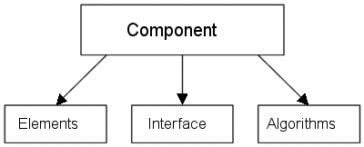

See also

[Modules](markdown/int_modules.md)

[Classes](markdown/INT_Classes.md)

[Modules vs. Classes](markdown/INT_Modules_vs._Classes.md)

---

## Modules

_Source: `markdown/int_modules.md`_

# Modules

When specifying an embedded control system, the real-time requirements of the system are crucial. In order to meet these requirements, special components with a real-time capable interface, modules, can be used in ASCET.

A module defines a number of processes; in addition, methods can be defined. A process contains a piece of code, that is executed sequentially. Processes are activated by the operating system, no parameters can be passed. Instead, modules use messages for data exchange, i.e. direct access to a global variable space, which results in a highly efficient communication mechanism.

Unlike processes, which are activated only by the operating system, methods are much more flexible. Each method can have an arbitrary (but fixed) number of arguments and a single return value.

The behavior of modules is unique within an embedded control system in the sense that they can be instantiated only once in the context of a project.

See also

[Classes](markdown/INT_Classes.md)

[Modules vs. Classes](markdown/INT_Modules_vs._Classes.md)

[Messages](markdown/INT_messages.md)

---

## Classes

_Source: `markdown/INT_Classes.md`_

# Classes

To avoid the limitation of modules, which can be instanciated only once in a project, classes can be used. Classes are object-oriented abstract data types that encapsulate data and make available a well defined interface. The interface is a collection of methods, which can be called from anywhere inside the program. Unlike processes, which can only be activated by the operating system, methods are much more flexible. Each method can have an arbitrary (but fixed) number of arguments and a single return value.

Classes can be instantiated more than once, e.g. more than one accumulator class can exist in a project. Each instance of a class has its own data space (its own parameters and variables), but all instances share the same specification. Global variables defined in classes are the same for all instances of a class (and, in an object-oriented view, can be considered to be class variables), but they can also be accessed by other components.

State machines are a special type of class available in ASCET. Their semantic behavior is the same as that of classes, but the notations are different. State machines, for example, have special methods for computing the conditions of a state transition.

See

[Modules](markdown/int_modules.md)

[Modules vs. Classes](markdown/INT_Modules_vs._Classes.md)

---

## Modules vs. Classes

_Source: `markdown/INT_Modules_vs._Classes.md`_

# Modules vs. Classes

Classes do not support real-time interprocess communication via messages. This has two reasons. Firstly, classes can have multiple instances and the data consistency scheme of ERCOSEK cannot manage multiple instantiations. Secondly, processes are assigned statically to one fixed task. Whenever a process runs, the operating system creates copies of all its messages. These copies are accessible only to that instance of the process that created them. Hence, if the same message is used by various processes, each process gets its own copy of the message. This strategy is used by the real-time operating system to ensure data consistency over multiple processes.

Methods, on the other hand, can be called arbitrarily from different points in the program, for instance from different processes in different tasks. The method does not "know" the calling task. Thus, it cannot be decided which message copy is relevant for which method call.

The properties of modules and classes are summarized in the following table.

| Column 1 | Column 2 | Column 3 |
| --- | --- | --- |
| Property | Module | Class |
| Processes | x |  |
| Methods | x | x |
| Argument passing |  | x |
| Messages | x |  |
| Multiple instances |  | x |
| Hierarchical design | x | x |

When specifying components, modules as well as classes, the structure is often hierarchical, since other previously defined classes or modules are to be reused.

See

[Modules](markdown/int_modules.md)

[Classes](markdown/INT_Classes.md)

[Messages](markdown/INT_messages.md)

---

## Definition and Instantiation of Components

_Source: `markdown/INT_Definition_and_Instantiation_of_Components.md`_

# Definition and Instantiation of Components

A component describes an abstract data type, it makes available an interface, through which it interacts with its environment. When using a component in a project, each element has to be created, i.e. for each element real memory cells have to be allocated. The process of creating an object is also called instantiation. Upon instantiation, the necessary data structure is built and initialized.

Each instance of a component has its own set of elements, but inherits the interface and the functional description from the component itself.

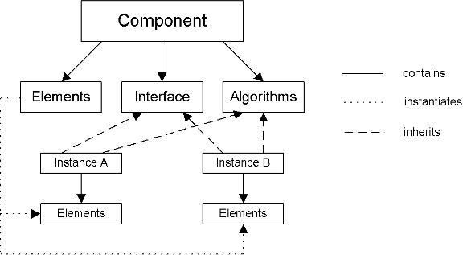

The definition of a component is therefore the definition of a template for the instantiated components. The difference between template and instance is not obvious for modules, since modules only have one occurrence in a project context, i.e. modules are only instantiated once. There is a one-to-one relation between the template and the instance for modules.

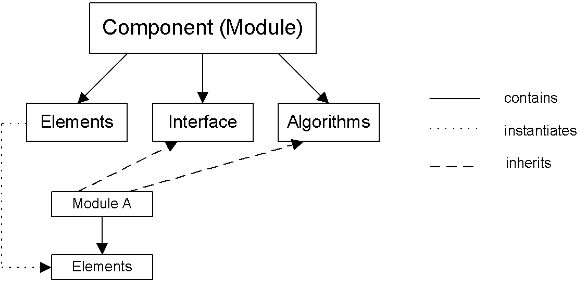

Classes, on the other hand, can have multiple instances. Here, the distinction between definition and instantiation becomes more obvious, since there is no simple one-to-one relation between template and instance. The relationship can be 1:n. The definition of a class is therefore the definition of a reusable, user-defined model type.

The instantiation of a component only works in the context of a project. Thus, when working with components only, a default project is automatically created to provide the context for instantiating the components.

When using a class in another component (See [Overview - Component Interface](markdown/INT_Overview_ComponentInterface.md)), the class is instantiated in the context of that component, when that component is instantiated. In contrast to this, modules are always instantiated in a project.

See

[Overview - Component Interface](markdown/INT_Overview_ComponentInterface.md)

---

## Compatibility of Component Instances

_Source: `markdown/int_compatibilitycomponentinstances.md`_

# Compatibility of Component Instances

A component instance is created for each component (module, class, AUTOSAR software component, record) that is used in a project. The component instance refers to the component and the [implementation](markdown/INT_Overview_Implementations.md). At code generation time, the compatibility of component instances is checked when a new value is assigned to a component reference, passed as an argument of component type, or returned from a method. If the check fails, an error is issued.

Two component instances that do not contain elements with [rescalable implementations](markdown/INT_RescalableImplementations.md) are compatible if the following conditions are fulfilled:

1. both instances refer to the same component
1. both instances refer to the same implementation

Two component instances that contain elements with rescalable implementations are compatible if the following conditions are fulfilled:

1. both instances refer to the same component
1. both instances refer to the same implementation
1. both instances use the same rescaling formula

See also

[Definition and Instantiation of Components](markdown/INT_Definition_and_Instantiation_of_Components.md)

[Modules](markdown/int_modules.md)

[Classes](markdown/INT_Classes.md)

[Overview - Software Component Editor](AtomicSoftwareComponentEditorEnglishUS.chm::/ASCeditorOverview.htm)

[Records - Overview](RecordsEnglishUS.chm::/RC_overview.htm)

[Implementations](markdown/INT_Overview_Implementations.md)

[Rescalable Implementations](markdown/INT_RescalableImplementations.md)

---

## The Interface of Components

_Source: `markdown/INT_Overview_ComponentInterface.md`_

# Overview - Component Interface

The interface of a component consists of methods, processes, and the access to global variables. Modules, for instance, have access to messages. Methods and processes are structured in the same way. Their structure is independent of the way the methods or processes are described.

Each method or process is assigned to a diagram, where each diagram can either be public or private. Methods assigned to private diagrams are only visible inside the component and do not belong to the public interface of the component, which is visible to other components. All methods assigned to one diagram are described in this diagram (in the case of block diagrams, there is a common block diagram for all these methods).

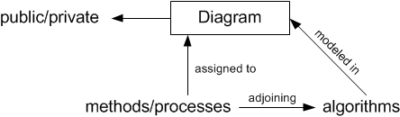

See

[The Interface of Classes](markdown/int_the_interface_of_classes.md)

[The Interface of Modules](markdown/INT_The_Interface_of_Modules.md)

---

## The Interface of Classes

_Source: `markdown/int_the_interface_of_classes.md`_

# The Interface of Classes

The interface of a class consists of a number of methods which are assigned to one of the diagrams of the class. The interface of each methods, consists of its arguments and a return value. Methods are similar to subroutines, that can be called from any point in the software. However, the data encapsulation of a class, i.e. the access to the same set of instance variables and parameters, makes the concept of methods and classes far more pervasive than that of subroutines. Methods have access to all the elements defined in their class.

The arguments and return value of a method can only be used in the body of the associated method. In addition, each method has a number of method-local variables. These variables are temporary and not static, and like arguments, they can only be used in the body of the associated method.

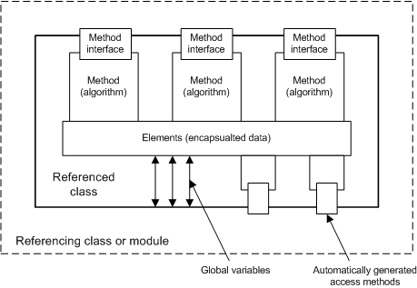

Additional methods can be made available for direct access to the instance variables of a class. This mechanism allows classes to be used as data containers (similar to records in C).

The interaction of a class with its environment consists of calling the methods of the class. When a method is called, the instructions in the method body are executed.

The methods of a class are categorized as either public or private by assigning them to a public or private diagram. Public methods can be called from any component, that uses that class. Private methods are hidden and can be called only by methods of the same class. They can used as internal subroutines.

See

[Overview - Component Interface](markdown/INT_Overview_ComponentInterface.md)

[The Interface of Modules](markdown/INT_The_Interface_of_Modules.md)

---

## The Interface of Modules

_Source: `markdown/INT_The_Interface_of_Modules.md`_

# The Interface of Modules

The interface of a module consists of a number of processes and—optional—methods, as well as the messages used in that module. Modules interact at two different levels, since the activation of processes and the communication via messages is separated. The activation of the process is under control of the operating system (that is part of the project).

The communication between processes via messages is asynchronous to the activation of the processes, i.e. the sending of a message and the receiving of it in a process do not happen at the same time. This concept is different from parameter passing between methods, which is synchronous to calling the method.

Like methods, processes can have temporary process-local variables. The figure below shows inter-process communication (grey parts are optional).

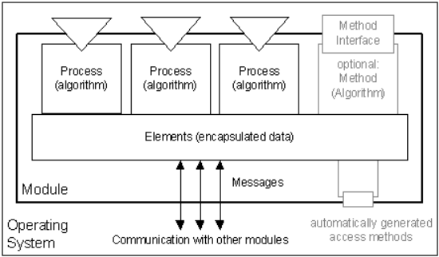

See

[The Interface of Classes](markdown/int_the_interface_of_classes.md)

[Overview - Component Interface](markdown/INT_Overview_ComponentInterface.md)

[Messages](markdown/INT_messages.md)

---

## Reusing Components

_Source: `markdown/INT_Overview_ReusingComponents.md`_

# Overview - Reusing Components

When specifying components, previously defined classes or modules contain functionality that can be reused. Reusing components leads to a hierarchical, tree-like structure of a component. The leaves of this structure are classes or modules that do not contain other classes or modules.

The structure of a component has to be tree-like, i.e. cyclic dependencies are not allowed. This is because the usage relation is also a containment relation, and a cyclic dependence would be unresolvable.

If a class is used in another component, the class will automatically be instantiated and initialized when the containing component is initialized.

There is, however, an exception. When using a class that is imported, i.e. the class is instantiated in some other context, for instance in the project directly, the usage relation is not a containment but a reference relation. Thus a cyclic dependency does not lead to an unresolvable containment relation in this case.

Modules are the top level component. Therefore, modules may not be contained in classes. Classes, however, may be contained in modules as well as in other classes. The following relation holds:

| Column 1 | Column 2 | Column 3 |
| --- | --- | --- |
| Containment relations | Class | Module |
| Class | x | - |
| Module | x | x |

Since the interfaces of modules and classes are different, the meaning of a hierarchical module structure and a hierarchical class structure is also different.

See

[Hierarchical Class Structure](markdown/INT_Hierarchical_Class_Structure.md)

[Hierarchical Module Structure](markdown/INT_Hierarchical_Module_Structure.md)

---

## Hierarchical Class Structure

_Source: `markdown/INT_Hierarchical_Class_Structure.md`_

# Hierarchical Class Structure

When using a class inside some other component, the methods of the class can be used as subroutines in the component. The figure below shows method invocation in a nested class.

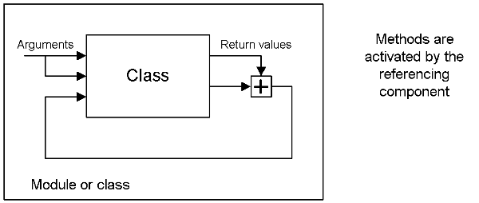

The methods are called as part of the execution of the component’s methods or process, this point in the software can be determined by the component itself. When calling a method, the component must supply the method with actual parameters for the arguments of the method.

See

[Overview - Reusing Components](markdown/INT_Overview_ReusingComponents.md)

[Hierarchical Module Structure](markdown/INT_Hierarchical_Module_Structure.md)

---

## Hierarchical Module Structure

_Source: `markdown/INT_Hierarchical_Module_Structure.md`_

# Hierarchical Module Structure

As mentioned before, modules are always instantiated in a project. That is, in a hierarchical module structure, a module used in another module is not instantiated within the containing module. As a consequence, all of the modules instantiated in a project are on the same level, independent of their position in the hierarchical structure.

The hierarchical structuring of modules serves mainly two purposes. A hierarchical structure reflects the nature of a control system. In an engine control, for instance, there may be separate modules for ignition, injection, and lambda control.

In addition, the communication structure in a hierarchical mode (see figure below) can be made much more transparent, since the dataflow is directly visible in block diagrams

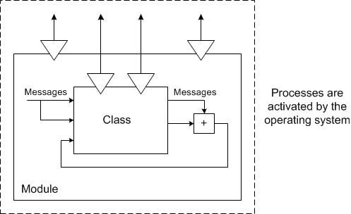

A further advantage of a hierarchical module structure becomes clear by this example: easier maintenance. If, for instance, the name of a message is changed, it must be changed in all modules that use that message. If a hierarchical module is used instead, the changes only affect one module, since the name-based binding is not explicitly used.

See also

[Overview - Reusing Components](markdown/INT_Overview_ReusingComponents.md)

[Hierarchical Class Structure](markdown/INT_Hierarchical_Class_Structure.md)

---

## Types and Elements

_Source: `markdown/int_types_and_elements.md`_

# Types and Elements

Every algorithm in a component works on elements. An element contains a piece of data, and makes available an interface for accessing its data or returning the value of a computation (e.g. interpolation of a characteristic line). Elements are strongly typed, i.e. each element is of a fixed type. Since there can be more than just a single element of a given type, an element is referred to as an instance of a given type.

ASCET has a number of basic types, that can be used directly, such as discrete or continuous variables, arrays, matrices or characteristic lines and fields. New, user-defined types can be added to the system in the form of classes. Classes are complex types, they have a complex structure, because they are usually build up from other types (basic as well as other complex ones). The types can be classified as in the following diagram:

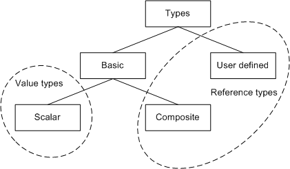

As the modelling in ASCET takes place on the physical level, the types are also ’physical’ types. Elements are committed to a specific data type (e.g. unsigned int8) only during the implementation phase, which is independent of the modelling phase.

The physical definition of an element must contain the following information:

- the name of the element
- the model type
- the element kind
- the scope of the element

The options that are available for each of the above categories are described in detail in the following sections.

When defining an element, additional information on the physical unit and a comment can be added to generate a meaningful documentation of the model. This information has no impact on the physical model.

See also

[Scalar Types - Summary](markdown/INT_scalar_summary.md)

[Composite Types - Summary](markdown/INT_composite_summaryct.md)

[Kind of Elements - Summary](markdown/INT_summaryke.md)

[The Scope of Elements](markdown/INT_the_scope_of_elements.md)

[User-Defined Model Types](markdown/INT_User-Defined_Model_Types.md)

---

## Scalar Types

_Source: `markdown/INT_scalar_summary.md`_

# Scalar Types - Summary

The basic scalar types [continuous](markdown/INT_scalar_types__continuous.md), [limited integer](markdown/INT_ScalarTypes_LimitedInteger.md), [wrap-around integer](markdown/INT_ScalarTypes_WrapAroundInteger.md), [signed discrete](markdown/INT_scalar_types__signed_discrete.md), [unsigned discrete](markdown/INT_scalar_types__unsigned_discrete.md) and [logical](markdown/INT_scalar_types__logical.md) are value types. Whenever an element of such a type is used, not the element itself as an object, but its value is used. Automatic typecasting between the arithmetic types cont, sdisc and udisc is performed if necessary.

Prior to ASCET V6.4, only signed discrete and unsigned discrete were available as integer types. However, these types have several disadvantages. <!-- kadovTextPopupInit('a1'); //-->

- signed discrete and unsigned discrete behave differently in different experiments.

- In physical experiments (see [Build Node (Project Properties)](ProjectEditorEnglishUS.chm::/Build_Options.htm)), signed discrete and unsigned discrete are always 32 bit; no overflow protection or limitation is applied.
- In implementation experiments, limitation is applied if the Limit Assignments option in the implementation editor is activated. Overflow protection is applied if specified (i.e. if Limit to maximum bit length is enabled or there is more than one operator (excluding Min, Max, Mux).

signed discrete and unsigned discrete behave the same way as continuous elements with identical implementation (excepting usage as array/matrix index, switch/case expression, modulo operands, etc.)

- During implementation code generation, an error (MIa5) is issued if signed discrete/unsigned discrete and continuous implemented as real* are mixed in an operation or assignment.
- If no limitation in case of overflow is specified (see [Setting the Overflow Handling](ImplementationEditorEnglishUS.chm::/set_overflow_handling.htm)), and several operators are used in one computation, the behavior of signed discrete and unsigned discrete can be unexpected; a warning (WIle365896) is issued.
- The behavior of signed discrete and unsigned discrete depends on the Maximum bit Length (int) option (see [Integer Arithmetic Node](ProjectEditorEnglishUS.chm::/fixedpoint.htm)).

To avoid these disadvantages, the limited integer and wrap-around integer types were introduced.

With the introduction of the limited integer and wrap-around integer types, the types signed discrete and unsigned discrete have become deprecated. To use them, you must activate the [editor option](ComponentManagerEnglishUS.chm::/cm_options_for_editors.htm) Use signed/unsigned discrete types. You can export components that use the limited integer and wrap-around integer types only in AMD format V6.4 and higher. An AMD format V6.3 or older will result in an export error.

Like complex types (classes), each basic type has an interface, i.e. methods to access it. For the basic model types these methods are fixed, the interface cannot be modified.

Scalar types have two simple access methods for the value stored in an element of the basic scalar type, i.e. for writing a new value to and reading the current value from the element:

- set (type a): This method takes one value, e.g. the value a, and overwrites the value of the element with that value. If the type of the value does not fit to the type of the element, a type conversion is performed automatically.
- get(): This method returns the current value of the element. The value returned is of the same type as the element itself.

Accessory methods in basic types are invoked automatically when an element name is used in an expression or when an assignment is performed. They do not have to be coded explicitly.

See also

[Scalar Types: Continuous](markdown/INT_scalar_types__continuous.md)

[Scalar Types: Limited Integer](markdown/INT_ScalarTypes_LimitedInteger.md)

[Scalar Types: Wrap-Around Integer](markdown/INT_ScalarTypes_WrapAroundInteger.md)

[Scalar Types: Logical](markdown/INT_scalar_types__logical.md)

[Scalar Types: Signed Discrete](markdown/INT_scalar_types__signed_discrete.md)

[Scalar Types: Unsigned Discrete](markdown/INT_scalar_types__unsigned_discrete.md)

[Converting sdisc/udisc to limitInt/wrapInt](markdown/INT_Convert_SdiscUdisc_to_limitInt_wrapInt.md)

[Setting the Overflow Handling](ImplementationEditorEnglishUS.chm::/set_overflow_handling.htm)

[Build Node (Project Properties)](ProjectEditorEnglishUS.chm::/Build_Options.htm)

[Integer Arithmetic Node](ProjectEditorEnglishUS.chm::/fixedpoint.htm)

[Editor Options](ComponentManagerEnglishUS.chm::/cm_options_for_editors.htm)

/* Heikki Komulainen, Comet Computer GmbH 2004 */ cc_plus_pic = '&nbsp;'; cc_minus_pic = '&nbsp;'; cc_stat_pic = '&nbsp;'; gpstyle = ''; var iframes_created = 0; if (document.body && document.body.insertAdjacentHTML && document.getElementsByTagName && document.getElementById) { collect_popups(); set_poplinks_pictures(); if (iframes_created) { document.write(gpstyle); document.write('
<nobr><a id="einauslink" style="position:absolute;top:expression(document.body.scrollTop + this.offsetHeight - this.offsetHeight);left:expression(document.body.offsetWidth - (this.offsetWidth + 28));background:white;padding:5px" href="javascript:show_all_poptext()">Show all hidden text</a></nobr>
'); } } function collect_popups() { bsscpopups = new Array(); for (x = 0; x < document.links.length; x++) { if (document.links[x].href.indexOf("BSSCPopup")>-1) { seekmatch = /BSSCPopup.'[^'](markdown/+)'/; poplink = seekmatch.exec(document.links[x].href); poplink = "" + poplink; poplink = poplink.substring(poplink.indexOf("'")+1, poplink.lastIndexOf("'")); ifid = "CCGENIFRAMEID" + x; new_iframe = '<iframe id="' + ifid + '"src="' + poplink + '" onload="get_text(\'' + ifid + '\')" width="0" height="0" frameborder=0></iframe>'; document.links[x].parentNode.insertAdjacentHTML("afterEnd", new_iframe); gpid = "CCID_" + ifid; document.links[x].href = "javascript:expand_poptext('" + gpid + "')"; cc_plus = '' + cc_plus_pic + ''; document.links[x].insertAdjacentHTML("afterBegin", cc_plus); iframes_created = 1; } } }// end function function get_text(ifr_id) { frpars = document.frames[ifr_id].document.getElementsByTagName("body"); popbody = frpars[0].innerHTML; gpid = "CCID_" + ifr_id; if (!document.getElementById(gpid)) { //avoiding doubles document.getElementById(ifr_id).insertAdjacentHTML("afterEnd", '
'+popbody+'
'); } }//end function function expand_poptext(x_frame_id) { if (!document.getElementById(x_frame_id)) return; if (document.getElementById(x_frame_id).className == "CCGENPOPTEXTH") { document.getElementById(x_frame_id).className = "CCGENPOPTEXTV"; document.getElementById(x_frame_id).style.visibility = "visible"; if (document.getElementById("CCPMB_" + x_frame_id )) { document.getElementById("CCPMB_" + x_frame_id ).innerHTML = cc_minus_pic; } } else { document.getElementById(x_frame_id).className = "CCGENPOPTEXTH"; document.getElementById(x_frame_id).style.visibility = "hidden"; if (document.getElementById("CCPMB_" + x_frame_id )) { document.getElementById("CCPMB_" + x_frame_id ).innerHTML = cc_plus_pic; } } }// end function function show_all_poptext() { var pulldowntxt = document.getElementsByTagName("div"); for (b = 0; b < pulldowntxt.length; b++) { if (pulldowntxt[b].className == "droptext") { pulldowntxt[b].style.display=""; } } var gptxt = document.getElementsByTagName("div"); for (z = 0; z < gptxt.length; z++) { if (gptxt[z].className == "CCGENPOPTEXTH") { gptxt[z].className = "CCGENPOPTEXTV"; gptxt[z].style.visibility = "visible"; if (document.getElementById("CCPMB_" + gptxt[z].id )) { document.getElementById("CCPMB_" + gptxt[z].id ).innerHTML = cc_minus_pic; } } } var dxpoplinks = document.getElementsByTagName("a"); if (dxpoplinks) { for (pxl = 0; pxl < dxpoplinks.length; pxl++) { if (dxpoplinks[pxl].href.indexOf("kadovTextPopup")>-1) { if (document.getElementById("CCPMB_" + dxpoplinks[pxl].id)) { document.getElementById("CCPMB_" + dxpoplinks[pxl].id).innerHTML = cc_stat_pic; dxpoplinks[pxl].symbol = "minus"; } } } } document.getElementById('einauslink').innerText = 'Hide all hideable text'; document.getElementById('einauslink').href = "javascript:self.location.reload()"; self.focus(); }// end function function eat_click() { return false; }// end function function set_poplinks_pictures() { var dpoplinks = document.getElementsByTagName("a"); if (dpoplinks) { for (pl = 0; pl < dpoplinks.length; pl++) { if (dpoplinks[pl].href.indexOf("kadovTextPopup")>-1) { cc_plus = '' + cc_stat_pic + ''; //dpoplinks[pl].onmouseup = plusminuspoplink; dpoplinks[pl].insertAdjacentHTML("afterBegin", cc_plus); dpoplinks[pl].symbol = "plus"; } } } }// end function function plusminuspoplink() { if (document.getElementById("CCPMB_" + this.id)) { if (this.symbol == "plus") { document.getElementById("CCPMB_" + this.id).innerHTML = cc_minus_pic; this.symbol = "minus"; } else { document.getElementById("CCPMB_" + this.id).innerHTML = cc_plus_pic; this.symbol = "plus"; } } return true; }

---

## Scalar Types: Continuous

_Source: `markdown/INT_scalar_types__continuous.md`_

# Scalar Types: Continuous

Continuous (type symbol ) is used for continuous physical values that can be infinitely large and have an arbitrarily fine resolution. This type is suitable for modelling variables like temperature, speed, etc., it is referred to as model type cont.

A model that calculates with values of continuous type is generated with optimizations for precision and efficiency. x / 2 * 2, for example, is optimized to x.

In implementation experiments, overflow protection and limitation is applied according to the settings in the implementation editor (see [Specifying Individual Implementations](ImplementationEditorEnglishUS.chm::/specifying_individual_impl.htm)).

---

## Scalar Types: Limited Integer

_Source: `markdown/INT_ScalarTypes_LimitedInteger.md`_

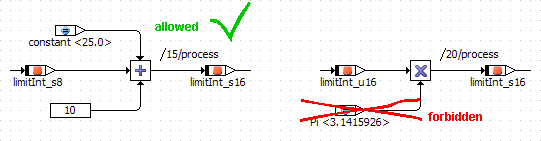

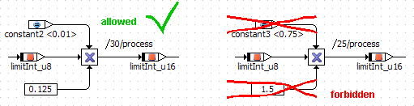

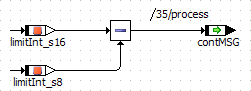

# Scalar Types: Limited Integer

Limited Integer (type symbol ) is a scalar type that is introduced with ASCET V6.4. This type can be used for scalar elements and as a base type for arrays and matrixes. Limited Integer is also referred to as model type limitInt.

A model that calculates with values of Limited Integer type is generated without optimizations that may affect the result. x / 2 * 2, for example, is not optimized to x.

The calculations with limited integer values are either exact, or are not generated at all. If, e.g., an underflow/overflow may occur in a calculation with Limited Integer values at runtime, the code generator issues an error of type MIle4.

The behavior of these calculations is identical for all targets, all compilers and for physical and implemented code generation (see [Build Node (Project Properties)](ProjectEditorEnglishUS.chm::/Build_Options.htm)).

##### Compatibility of limited integer types

- Operands of limited integer types are always compatible. However, an error is issued if the result cannot be represented in sint32 or uint32.
- Literal or constant operands are allowed if

- they have integer values

or

- if they are floating-point values with fractional parts of 0.

[examples](javascript:kadovTextPopup(this))<!-- kadovTextPopupInit('a1'); //-->

- Literal or constant operands with floating-point values that are reciprocals of integers are allowed for multiplications.

[example](javascript:kadovTextPopup(this))<!-- kadovTextPopupInit('a2'); //-->

- If an expression of limited integer type is assigned to an element of another type, the value of the expression is converted implicitly.

[example](javascript:kadovTextPopup(this))<!-- kadovTextPopupInit('a3'); //-->

- If an expression of another type is assigned to an element of limited integer type, the value of the expression is converted implicitly.

See also

[Build Node (Project Properties)](ProjectEditorEnglishUS.chm::/Build_Options.htm)

/* Heikki Komulainen, Comet Computer GmbH 2004 */ cc_plus_pic = '&nbsp;'; cc_minus_pic = '&nbsp;'; cc_stat_pic = '&nbsp;'; gpstyle = ''; var iframes_created = 0; if (document.body && document.body.insertAdjacentHTML && document.getElementsByTagName && document.getElementById) { collect_popups(); set_poplinks_pictures(); if (iframes_created) { document.write(gpstyle); document.write('
<nobr><a id="einauslink" style="position:absolute;top:expression(document.body.scrollTop + this.offsetHeight - this.offsetHeight);left:expression(document.body.offsetWidth - (this.offsetWidth + 28));background:white;padding:5px" href="javascript:show_all_poptext()">Show all hidden text</a></nobr>
'); } } function collect_popups() { bsscpopups = new Array(); for (x = 0; x < document.links.length; x++) { if (document.links[x].href.indexOf("BSSCPopup")>-1) { seekmatch = /BSSCPopup.'[^'](markdown/+)'/; poplink = seekmatch.exec(document.links[x].href); poplink = "" + poplink; poplink = poplink.substring(poplink.indexOf("'")+1, poplink.lastIndexOf("'")); ifid = "CCGENIFRAMEID" + x; new_iframe = '<iframe id="' + ifid + '"src="' + poplink + '" onload="get_text(\'' + ifid + '\')" width="0" height="0" frameborder=0></iframe>'; document.links[x].parentNode.insertAdjacentHTML("afterEnd", new_iframe); gpid = "CCID_" + ifid; document.links[x].href = "javascript:expand_poptext('" + gpid + "')"; cc_plus = '' + cc_plus_pic + ''; document.links[x].insertAdjacentHTML("afterBegin", cc_plus); iframes_created = 1; } } }// end function function get_text(ifr_id) { frpars = document.frames[ifr_id].document.getElementsByTagName("body"); popbody = frpars[0].innerHTML; gpid = "CCID_" + ifr_id; if (!document.getElementById(gpid)) { //avoiding doubles document.getElementById(ifr_id).insertAdjacentHTML("afterEnd", '
'+popbody+'
'); } }//end function function expand_poptext(x_frame_id) { if (!document.getElementById(x_frame_id)) return; if (document.getElementById(x_frame_id).className == "CCGENPOPTEXTH") { document.getElementById(x_frame_id).className = "CCGENPOPTEXTV"; document.getElementById(x_frame_id).style.visibility = "visible"; if (document.getElementById("CCPMB_" + x_frame_id )) { document.getElementById("CCPMB_" + x_frame_id ).innerHTML = cc_minus_pic; } } else { document.getElementById(x_frame_id).className = "CCGENPOPTEXTH"; document.getElementById(x_frame_id).style.visibility = "hidden"; if (document.getElementById("CCPMB_" + x_frame_id )) { document.getElementById("CCPMB_" + x_frame_id ).innerHTML = cc_plus_pic; } } }// end function function show_all_poptext() { var pulldowntxt = document.getElementsByTagName("div"); for (b = 0; b < pulldowntxt.length; b++) { if (pulldowntxt[b].className == "droptext") { pulldowntxt[b].style.display=""; } } var gptxt = document.getElementsByTagName("div"); for (z = 0; z < gptxt.length; z++) { if (gptxt[z].className == "CCGENPOPTEXTH") { gptxt[z].className = "CCGENPOPTEXTV"; gptxt[z].style.visibility = "visible"; if (document.getElementById("CCPMB_" + gptxt[z].id )) { document.getElementById("CCPMB_" + gptxt[z].id ).innerHTML = cc_minus_pic; } } } var dxpoplinks = document.getElementsByTagName("a"); if (dxpoplinks) { for (pxl = 0; pxl < dxpoplinks.length; pxl++) { if (dxpoplinks[pxl].href.indexOf("kadovTextPopup")>-1) { if (document.getElementById("CCPMB_" + dxpoplinks[pxl].id)) { document.getElementById("CCPMB_" + dxpoplinks[pxl].id).innerHTML = cc_stat_pic; dxpoplinks[pxl].symbol = "minus"; } } } } document.getElementById('einauslink').innerText = 'Hide all hideable text'; document.getElementById('einauslink').href = "javascript:self.location.reload()"; self.focus(); }// end function function eat_click() { return false; }// end function function set_poplinks_pictures() { var dpoplinks = document.getElementsByTagName("a"); if (dpoplinks) { for (pl = 0; pl < dpoplinks.length; pl++) { if (dpoplinks[pl].href.indexOf("kadovTextPopup")>-1) { cc_plus = '' + cc_stat_pic + ''; //dpoplinks[pl].onmouseup = plusminuspoplink; dpoplinks[pl].insertAdjacentHTML("afterBegin", cc_plus); dpoplinks[pl].symbol = "plus"; } } } }// end function function plusminuspoplink() { if (document.getElementById("CCPMB_" + this.id)) { if (this.symbol == "plus") { document.getElementById("CCPMB_" + this.id).innerHTML = cc_minus_pic; this.symbol = "minus"; } else { document.getElementById("CCPMB_" + this.id).innerHTML = cc_plus_pic; this.symbol = "plus"; } } return true; }

---

## Scalar Types: Wrap-Around Integer

_Source: `markdown/INT_ScalarTypes_WrapAroundInteger.md`_

# Scalar Types: Wrap-Around Integer

Wrap-Around Integer (type symbol ) is a scalar type that is introduced with ASCET V6.4. This type can be used for scalar elements and as a base type for arrays and matrixes. Wrap-Around Integer is also referred to as model type wrapInt.

A model that calculates with values of Wrap-Around Integer type is generated without optimizations that may affect the result. x / 2 * 2, for example, is not optimized to x.

If an overflow occurs, the value shall wrap around as specified by two´s complement arithmetic. The signedness for the overflow is determined from the operands, and a code generation error of type MMdl6 is reported if the operands have mixed signedness. The bit size of the overflow is determined from the maximum bit size of the operands.

The behavior of these calculations is identical for all targets, all compilers and for physical and implemented code generation (see [Build Node (Project Properties)](ProjectEditorEnglishUS.chm::/Build_Options.htm)).

See also

[Build Node (Project Properties)](ProjectEditorEnglishUS.chm::/Build_Options.htm)

---

## Scalar Types: Logical

_Source: `markdown/INT_scalar_types__logical.md`_

# Scalar Types: Logical

Logical (type symbol ) is used to model logical information, e.g. whether a particular system is active or not, it is referred to as model type log.

---

## Scalar Types: Signed Discrete

_Source: `markdown/INT_scalar_types__signed_discrete.md`_

# Scalar Types: Signed Discrete

Signed discrete (type symbol ) is used to model integer numbers of arbitrary size, it is referred to as model type sdisc.

The signed discrete type is deprecated. To use it, you must activate the [editor option](ComponentManagerEnglishUS.chm::/cm_options_for_editors.htm) Use signed/unsigned discrete types.

A model that calculates with values of signed discrete type is generated with optimizations for precision and efficiency. x / 2.0 * 2.0, for example, is optimized to x.

In implementation experiments, overflow protection and limitation is applied according to the settings in the implementation editor (see [Specifying Individual Implementations](ImplementationEditorEnglishUS.chm::/specifying_individual_impl.htm)).

See also

[Converting sdisc/udisc to limitInt/wrapInt](markdown/INT_Convert_SdiscUdisc_to_limitInt_wrapInt.md)

[Editor Options](ComponentManagerEnglishUS.chm::/cm_options_for_editors.htm)

[Specifying Individual Implementations](ImplementationEditorEnglishUS.chm::/specifying_individual_impl.htm)

---

## Scalar Types: Unsigned Discrete

_Source: `markdown/INT_scalar_types__unsigned_discrete.md`_

# Scalar Types: Unsigned Discrete

Unsigned discrete (type symbol ) is used to model non-negative integer numbers of any size. This type is suitable for modelling things like the number of cylinders of an engine, it is referred to as model type udisc.

The unsigned discrete type is deprecated. To use it, you must activate the [editor option](ComponentManagerEnglishUS.chm::/cm_options_for_editors.htm) Use signed/unsigned discrete types.

A model that calculates with values of signed discrete type is generated with optimizations for precision and efficiency. x / 2.0 * 2.0, for example, is optimized to x.

In implementation experiments, overflow protection and limitation is applied according to the settings in the implementation editor (see [Specifying Individual Implementations](ImplementationEditorEnglishUS.chm::/specifying_individual_impl.htm)).

See also

[Converting sdisc/udisc to limitInt/wrapInt](markdown/INT_Convert_SdiscUdisc_to_limitInt_wrapInt.md)

[Editor Options](ComponentManagerEnglishUS.chm::/cm_options_for_editors.htm)

[Specifying Individual Implementations](ImplementationEditorEnglishUS.chm::/specifying_individual_impl.htm)

---

## Converting sdisc/udisc to limitInt/wrapInt

_Source: `markdown/INT_Convert_SdiscUdisc_to_limitInt_wrapInt.md`_

# Converting sdisc/udisc to limitInt/wrapInt

Elements that use the deprecated sdisc/udisc types can be converted to limitInt/wrapInt types.

Several [conversion rules](#ConversionRules) apply to these conversions, context of a projectas well as several [restrictions](#Restrictions). For each element that cannot be converted, an information message is shown in the ASCET monitor window.

See [Converting Old Integer Types to New Integer Types](ComponentManagerEnglishUS.chm::/CM_Convert_OldIntTypes_NewIntTypes.htm) for a step-by-step instruction.

If desired, you can [testing the new behavior for integer types](markdown/INT_Test_NewBehavior_IntegerTypes.md) before you convert them permanently.

## Conversion Rules:

Unless otherwise noted, the rules listed here apply to database/workspace-wide conversion and component-wide conversion.

1. IF

all existing implementations of an exported or local sdisc/udisc element are identical

AND

the formula is the identity formula

AND

the Limit Assignments option is activated,

THEN

the element is converted to limitInt. The implementation interval is used as min/max for the new type.

1. IF

all existing implementations of an exported or local sdisc/udisc element are identical

AND

the formula is the identity formula

AND

the Limit Assignments option is deactivated,

THEN

the element is converted to wrapInt. The implementation data type is used as type for wrapInt, the implementation interval is used as min/max for the new type.

1. Imported elements have no implementation.
1. Elements in child components of a project are converted if rules 1 - 3 are fulfilled.
1. In all other cases, the element is not converted.

## Restrictions

The following restrictions apply to database/workspace-wide and component-wide conversions of sdisc/udisc to limitInt/wrapInt:

- Write-protected components are not changed.
- Elements with activated Rescalable option are not converted.
- Elements with a real* implementation data type are not converted.
- Constants are not converted.
- Method-/process-/runnable-local elements without implementation are not converted.
- Characteristic lines/maps and distributions are not converted.

The following restrictions apply only to database/workspace-wide conversions of sdisc/udisc to limitInt/wrapInt:

- Elements in components that do not belong to a project are not converted.

The following restrictions apply only to component-wide conversions of sdisc/udisc to limitInt/wrapInt:

- Elements in child components of a non-project component are not converted.

See also

[Converting Old Integer Types to New Integer Types](ComponentManagerEnglishUS.chm::/CM_Convert_OldIntTypes_NewIntTypes.htm)

[Scalar Types](markdown/INT_scalar_summary.md)

[Scalar Types: Limited Integer](markdown/INT_ScalarTypes_LimitedInteger.md)

[Scalar Types: Wrap-Around Integer](markdown/INT_ScalarTypes_WrapAroundInteger.md)

[Using the Conversion Operator](BlockDiagramEditorEnglishUS.chm::/BDE_UseConversionOperator.htm)

[Conversion Operations](ESDLEditorEnglishUS.chm::/ESDL_ConversionOperations.htm)

[Testing the New Behavior for Integer Types](markdown/INT_Test_NewBehavior_IntegerTypes.md)

---

## Composite Types

_Source: `markdown/INT_composite_summaryct.md`_

# Composite Types - Summary

Composite types are basic types that are built up from basic scalar types. The following composite types are available in ASCET:

- Array ()
- Matrix ()
- Characteristic line ()
- Characteristic map ()
- Distribution ()

Composite types consist of basic scalar types. Arrays and matrices can consist of all four scalar types, characteristic lines, maps, and distributions only of the three arithmetic types. Unlike basic scalar types, composite types are reference types. When assigning two variables of reference types to each other, not the values are assigned (and copied), but the references to the variable.

All reference types have access methods for their elements:

- set (reference type a): This is an assignment of the reference to reference type a. After such an assignment, both elements (the assigned as well as the assigning) are the identical element!
- get: This returns a reference to the element of composite type.

Argument passing in method calls works in the same manner as assignments. A reference is passed to the element. As a consequence, a change to the argument, for instance by assigning a value to it, is also reflected outside the method. This mechanism is equivalent to a "call by reference" in programming languages like C.

See also

[Array](markdown/INT_Array.md)

[Matrix](markdown/INT_matrix.md)

[Variant Size for Arrays and Matrices](markdown/INT_VariantSize_ArraysMatrices.md)

[V](markdown/INT_VariableSize_ArraysMatrices.md)ariable Size for Arrays and Matrices

[Characteristic Lines and Maps](markdown/INT_characteristic_lines_and_maps.md)

[Group Table and Distribution](markdown/INT_group_table_and_distribution.md)

[Fixed Table](markdown/INT_fixed_table.md)

---

## Array

_Source: `markdown/INT_Array.md`_

# Array

An array (type symbol ) is a one-dimensional, indexed set of elements which have the same scalar data type, e.g. continuous or logical. The position of a scalar value within an array is indicated by its associated index value, which must be a non-negative integer. The size of an array is limited to 2048. The array index takes values between 0 and size-1.

The interface of an array used as variable consists of the following methods:

- setAt(a, i): The assignment of the scalar value a to the position i in the array.

a can be any scalar type, i must be a non-negative integer.

- getAt(i): Returns the value at position i of the array.
- length(): Returns the current size of the array.

The interface of an array used as parameter consists of the methods getat(i) and length().

The interface of an array used as message depends on the message type.

| Column 1 | Column 2 | Column 3 | Column 4 |
| --- | --- | --- | --- |
|  | Send | Receive | Send & Receive |
| setAt( a, i) | + |  | + |
| getAt( i) |  | + | + |
| length() | + | + | + |

Arrays of non-scalar basic types or complex (user-defined) types are not available.

In the context of a project, you can use the [Protected Vector Indices](ProjectEditorEnglishUS.chm::/PE_Code_Generation_Options.htm) option to protect the array index against over- or underflow.

See also

[Variant Size for Arrays and Matrices](markdown/INT_VariantSize_ArraysMatrices.md)

[Variable Size for Arrays and Matrices](markdown/INT_VariableSize_ArraysMatrices.md)

[Messages](markdown/INT_messages.md)

[Arrays and Matrices (Block Diagram Editor)](BlockDiagramEditorEnglishUS.chm::/BDE_Arrays_and_Matrices.htm)

[Arrays - Description (ESDL Editor)](ESDLEditorEnglishUS.chm::/ESDL_Arrays_-_Description.htm)

[Project Editor - Code Generation Options](ProjectEditorEnglishUS.chm::/PE_Code_Generation_Options.htm)

---

## Matrix

_Source: `markdown/INT_matrix.md`_

# Matrix

A matrix (type symbol ) is a two-dimensional, indexed set of elements which have the same scalar data type. The type of index is the same as that of an array, i.e. a non-negative integer. The size for each dimension is limited to 63, i.e. the indices take values between 0 and 62.

The interface of an array used as variable consists of the following methods:

- setAt(a, i, j): The assignment of the scalar value a to the position (i,j) in the matrix.

a can be any scalar type, i and j must be non-negative integers.

- getAt(i, j): Returns the value at position (i,j) of the matrix.
- xLength(): Returns the current X size of the matrix.
- yLength(): Returns the current Y size of the matrix.

The interface of a matrix used as parameter consists of the methods getat(i, j), xLength() and yLength().

The interface of a matrix used as message depends on the message type.

<table style="x-cell-content-align: Top;
				margin-top: 3px;
				border-left-style: Outset;
				border-top-style: Outset;
				border-right-style: Outset;
				border-bottom-style: Outset;
				border-left-width: 1px;
				border-right-width: 1px;
				border-top-width: 1px;
				border-bottom-width: 1px;" x-use-null-cells="">
<col/>
<col/>
<col/>
<col/>
<tr class="hcp1" valign="top">
<td class="hcp2" colspan="1" rowspan="2">

 
</td>
<td class="hcp2" colspan="3" rowspan="1">

Message type
</td>
</tr>
<tr class="hcp1" valign="top">
<td class="hcp2">

Send
</td>
<td class="hcp2">

Receive
</td>
<td class="hcp2">

Send &amp; Receive
</td></tr>
<tr class="hcp1" valign="top">
<td class="hcp2">

setAt(a, i, j)
</td>
<td class="hcp2">

+
</td>
<td class="hcp2">

 
</td>
<td class="hcp2">

+
</td></tr>
<tr class="hcp1" valign="top">
<td class="hcp2">

getAt(i, j)
</td>
<td class="hcp2">

 
</td>
<td class="hcp2">

+
</td>
<td class="hcp2">

+
</td></tr>
<tr class="hcp1" valign="top">
<td class="hcp2" colspan="1" rowspan="1">

xLength()
</td>
<td class="hcp2" colspan="1" rowspan="1">

+
</td>
<td class="hcp2" colspan="1" rowspan="1">

+
</td>
<td class="hcp2" colspan="1" rowspan="1">

+
</td></tr>
<tr class="hcp1" valign="top">
<td class="hcp2">

yLength()
</td>
<td class="hcp2">

+
</td>
<td class="hcp2">

+
</td>
<td class="hcp2">

+
</td></tr>
</table>

Matrices of non-scalar basic types or user-defined types are not available.

In the context of a project, you can use the [Protected Vector Indices](ProjectEditorEnglishUS.chm::/PE_Code_Generation_Options.htm) option to protect the matrix indices against over- or underflow.

See also

[Variant Size for Arrays and Matrices](markdown/INT_VariantSize_ArraysMatrices.md)

[Variable Size for Arrays and Matrices](markdown/INT_VariableSize_ArraysMatrices.md)

[Messages](markdown/INT_messages.md)

[Arrays and Matrices (Block Diagram Editor)](BlockDiagramEditorEnglishUS.chm::/BDE_Arrays_and_Matrices.htm)

[Matrices - Description (ESDL Editor)](esdleditorenglishus.chm::/esdl_matrices_-_description.htm)

[Project Editor - Code Generation Options](ProjectEditorEnglishUS.chm::/PE_Code_Generation_Options.htm)

---

## Variant Size for Arrays and Matrices

_Source: `markdown/INT_VariantSize_ArraysMatrices.md`_

- At least one value of the system constant must be included in the interval [1..maxSize].
- If the array/matrix scope is exported or imported, the scope of the system constant must be exported or imported, too.
- If the value range of the system constant includes values < 1 or > maxSize, a check is generated that issues an error message if the system constant value is outside the interval [1..maxSize]:

#if (SC_name < 1 || SC_name > maxSize)

#error The system constant SC_name must be between 1 and maxSize, because it is used as an array/matrix size of matrix.

#endif

- In addition, a warning of type WMdl651 is issued during code generation:

Possible type mismatch in array max size: <name> and <[1,maxSize]> - will be checked at compile time

- The max. size and the current size of the array/matrix are set to the max. size defined in the model during the initialization.
- The access methods for array/matrix lengths will return the value of the system constant.
- The [compatibility check for arrays/matrices](markdown/ins_compatibilitycheck_arraysmatrices.md) changes: arrays/matrixes are only compatible if they use the same system constant.

This is because it is not possible to ensure that different system constants always have the same value if they can be changed at run time.

# Variant Size for Arrays and Matrices

The size of an array or matrix is determined when the element is created. In addition, ASCET allows the determination of variants in array/matrix sizes via system constants.

The following rules apply:

- Only system constants in the same component as the array/matrix can be used for variant size determination.
- The system constants used for variant size determination must be of type [limitInt](markdown/INT_ScalarTypes_LimitedInteger.md), [wrapInt](markdown/INT_ScalarTypes_WrapAroundInteger.md), [sdisc](markdown/INT_scalar_types__signed_discrete.md), [udisc](markdown/INT_scalar_types__unsigned_discrete.md) or [enumeration](markdown/INT_enumeration.md).
- For an array/matrix of scope exported, system constants of [scope](markdown/INT_the_scope_of_elements.md) exported or imported can be used for variant size determination.
- For an array/matrix of scope local, system constants of scope local or exported or imported can be used for variant size determination.

If you use an array or matrix that has at least one dimension with a system constant size, keep the following in mind:

- Index protection (see [Code Generation Options](ProjectEditorEnglishUS.chm::/PE_Code_Generation_Options.htm), Protected Vector Indices) uses the value of the system constant instead of the max. size.

- If the Resolve System Constants option in the ASCET options window, Targets\<target>\Build node of the selected target, is set to Generation Time, the initial value of the system constant is used to transform the variant-size array/matrix into a fixed-size array/matrix.
- If the Resolve System Constants option in the ASCET options window, Targets\<target>\Build node of the selected target, is set to Compile Time, the [following constraints](javascript:kadovTextPopup(this))<!-- kadovTextPopupInit('a1'); //--> are checked.

- If the Resolve System Constants option in the ASCET options window, Targets\<target>\Build node of the selected target, is set to Run Time, the [following](javascript:kadovTextPopup(this))<!-- kadovTextPopupInit('a2'); //--> happens.

- Models that use normal arrays/matrices with variant size can only be exported to ASCET V6.2.0 or newer.
- Models that use arrays/matrices with variant size as messages can only be exported to ASCET V6.4.0 or newer.

See also

[Array](markdown/INT_Array.md)

[Matrix](markdown/INT_matrix.md)

[Creating an Array or Matrix](BlockDiagramEditorEnglishUS.chm::/CreateArray.htm)

[Messages](markdown/INT_messages.md)

[Variable Size for Arrays and Matrices](markdown/INT_VariableSize_ArraysMatrices.md)

[Scalar Types](markdown/INT_scalar_summary.md)

[Enumeration](markdown/INT_enumeration.md)

[The Scope of Elements](markdown/INT_the_scope_of_elements.md)

[Project Editor - Code Generation Options](ProjectEditorEnglishUS.chm::/PE_Code_Generation_Options.htm)

[Properties Editor - Editing the Configuration of a Composite Element](ElementEditorEnglishUS.chm::/eed_editconfiguration_compositeelement.htm)

[ASCET Options - Targets Node](ComponentManagerEnglishUS.chm::/CM_TargetsNode.htm)

/* Heikki Komulainen, Comet Computer GmbH 2004 */ cc_plus_pic = '&nbsp;'; cc_minus_pic = '&nbsp;'; cc_stat_pic = '&nbsp;'; gpstyle = ''; var iframes_created = 0; if (document.body && document.body.insertAdjacentHTML && document.getElementsByTagName && document.getElementById) { collect_popups(); set_poplinks_pictures(); if (iframes_created) { document.write(gpstyle); document.write('
<nobr><a id="einauslink" style="position:absolute;top:expression(document.body.scrollTop + this.offsetHeight - this.offsetHeight);left:expression(document.body.offsetWidth - (this.offsetWidth + 28));background:white;padding:5px" href="javascript:show_all_poptext()">Show all texts</a></nobr>
'); } } function collect_popups() { bsscpopups = new Array(); for (x = 0; x < document.links.length; x++) { if (document.links[x].href.indexOf("BSSCPopup")>-1) { seekmatch = /BSSCPopup.'[^'](markdown/+)'/; poplink = seekmatch.exec(document.links[x].href); poplink = "" + poplink; poplink = poplink.substring(poplink.indexOf("'")+1, poplink.lastIndexOf("'")); ifid = "CCGENIFRAMEID" + x; new_iframe = '<iframe id="' + ifid + '"src="' + poplink + '" onload="get_text(\'' + ifid + '\')" width="0" height="0" frameborder=0></iframe>'; document.links[x].parentNode.insertAdjacentHTML("afterEnd", new_iframe); gpid = "CCID_" + ifid; document.links[x].href = "javascript:expand_poptext('" + gpid + "')"; cc_plus = '' + cc_plus_pic + ''; document.links[x].insertAdjacentHTML("afterBegin", cc_plus); iframes_created = 1; } } }// end function function get_text(ifr_id) { frpars = document.frames[ifr_id].document.getElementsByTagName("body"); popbody = frpars[0].innerHTML; gpid = "CCID_" + ifr_id; if (!document.getElementById(gpid)) { //avoiding doubles document.getElementById(ifr_id).insertAdjacentHTML("afterEnd", '
'+popbody+'
'); } }//end function function expand_poptext(x_frame_id) { if (!document.getElementById(x_frame_id)) return; if (document.getElementById(x_frame_id).className == "CCGENPOPTEXTH") { document.getElementById(x_frame_id).className = "CCGENPOPTEXTV"; document.getElementById(x_frame_id).style.visibility = "visible"; if (document.getElementById("CCPMB_" + x_frame_id )) { document.getElementById("CCPMB_" + x_frame_id ).innerHTML = cc_minus_pic; } } else { document.getElementById(x_frame_id).className = "CCGENPOPTEXTH"; document.getElementById(x_frame_id).style.visibility = "hidden"; if (document.getElementById("CCPMB_" + x_frame_id )) { document.getElementById("CCPMB_" + x_frame_id ).innerHTML = cc_plus_pic; } } }// end function function show_all_poptext() { var pulldowntxt = document.getElementsByTagName("div"); for (b = 0; b < pulldowntxt.length; b++) { if (pulldowntxt[b].className == "droptext") { pulldowntxt[b].style.display=""; } } var gptxt = document.getElementsByTagName("div"); for (z = 0; z < gptxt.length; z++) { if (gptxt[z].className == "CCGENPOPTEXTH") { gptxt[z].className = "CCGENPOPTEXTV"; gptxt[z].style.visibility = "visible"; if (document.getElementById("CCPMB_" + gptxt[z].id )) { document.getElementById("CCPMB_" + gptxt[z].id ).innerHTML = cc_minus_pic; } } } var dxpoplinks = document.getElementsByTagName("a"); if (dxpoplinks) { for (pxl = 0; pxl < dxpoplinks.length; pxl++) { if (dxpoplinks[pxl].href.indexOf("kadovTextPopup")>-1) { if (document.getElementById("CCPMB_" + dxpoplinks[pxl].id)) { document.getElementById("CCPMB_" + dxpoplinks[pxl].id).innerHTML = cc_stat_pic; dxpoplinks[pxl].symbol = "minus"; } } } } document.getElementById('einauslink').innerText = 'Hide all texts'; document.getElementById('einauslink').href = "javascript:self.location.reload()"; self.focus(); }// end function function eat_click() { return false; }// end function function set_poplinks_pictures() { var dpoplinks = document.getElementsByTagName("a"); if (dpoplinks) { for (pl = 0; pl < dpoplinks.length; pl++) { if (dpoplinks[pl].href.indexOf("kadovTextPopup")>-1) { cc_plus = '' + cc_stat_pic + ''; //dpoplinks[pl].onmouseup = plusminuspoplink; dpoplinks[pl].insertAdjacentHTML("afterBegin", cc_plus); dpoplinks[pl].symbol = "plus"; } } } }// end function function plusminuspoplink() { if (document.getElementById("CCPMB_" + this.id)) { if (this.symbol == "plus") { document.getElementById("CCPMB_" + this.id).innerHTML = cc_minus_pic; this.symbol = "minus"; } else { document.getElementById("CCPMB_" + this.id).innerHTML = cc_plus_pic; this.symbol = "plus"; } } return true; }

---

## Variable Size for Arrays and Matrices

_Source: `markdown/INT_VariableSize_ArraysMatrices.md`_

# Variable Size for Arrays and Matrices

The size of an array or matrix is determined when the element is created. In addition, ASCET allows the determination of normal arrays/matrices with variable sizes.

Arrays/matrices used as messages cannot have variable sizes.

A common use case for arrays/matrices with variable size is to have a method that accepts arrays/matrices of any size, and then compute the average, min, max, etc. inside the method.

The following rules apply:

- Only arrays and matrices that are references can be of variable size.

This means composite method arguments, return values, method-/process-/runnable-local variables and arrays/matrices with activated Reference option.

- Only arrays and matrices with kind Variable can be of variable size.
- For a matrix, either both dimensions or no dimension must be of variable size.

A mixed mode, i.e. one dimension with variable size, the other with fixed or variant size, is not possible. If you try to specify such a matrix, an error window opens, and you have to change the matrix specification.

If you use an array or matrix with variable size, keep the following in mind:

- Index protection (see [Code Generation Options](ProjectEditorEnglishUS.chm::/PE_Code_Generation_Options.htm), Protected Vector Indices) uses the actual size of the array or matrix.
- If an array/matrix instance (i.e. no reference) with variable size is detected during code generation, an error of type MMdl787 is issued:

Element <name> has variable array/matrix reference flag but is no reference.

- An array/matrix reference of fixed or variant size must not be assigned to an array/matrix reference of variable size. If such an assignment is detected during code generation, an error of type MMdl789 is issued:
- Models that use arrays/matrices with variable size can only be exported to ASCET V6.3.0 or newer.

See also

[Specifying an Array or Matrix with Variable Size](ElementEditorEnglishUS.chm::/Eed_SpecifyArrayMatrix_VariableSize.htm)

[Defining a Component Signature](BlockDiagramEditorEnglishUS.chm::/BDE_DefineComponentSignature.htm), steps 4, 5, 6

[Defining the SWC Signature](AtomicSoftwareComponentEditorEnglishUS.chm::/ASCdefineSWCsignature.htm), steps 6, 7, 8

[Array](markdown/INT_Array.md)

[Matrix](markdown/INT_matrix.md)

[Specifying a Reference](ElementEditorEnglishUS.chm::/EEd_Specifying_a_Reference.htm)

[Initialization of Explicit References](markdown/INT_InitExplicitReferences.md)

[The Kind of Elements - Summary](markdown/INT_summaryke.md)

[Variant Size for Arrays and Matrices](markdown/INT_VariantSize_ArraysMatrices.md)

[Code Generation Options](ProjectEditorEnglishUS.chm::/PE_Code_Generation_Options.htm)

[Editing the Configuration of a Composite Element](ElementEditorEnglishUS.chm::/eed_editconfiguration_compositeelement.htm)

[Converting Arrays/Matrices to Variable Size](ComponentManagerEnglishUS.chm::/CM_ConvertArraysMatrices_VariableSize.htm)

---

## Compatibility Check for Arrays and Matrices

_Source: `markdown/ins_compatibilitycheck_arraysmatrices.md`_

# Compatibility Check for Arrays and Matrices

This topic does not apply to arrays/matrices used as messages.

The compatibility of two arrays or matrices is checked on the following occasions:

- an array/matrix element is assigned to an array/matrix reference
- an array/matrix element is passed as method argument
- an array/matrix element is returned by a method
- an array/matrix element is used as initialization value for an array/matrix reference

An array/matrix element can be assigned to an array/matrix reference if the following criteria are met:

- both arrays/matrices have the same base type (cont, limitInt, wrapInt, sdisc, udisc, log)

AND

- both arrays/matrices have the same number of dimensions

AND

- the element implementation type is identical (value range, formula, limitation)

AND

- the respective dimensions are compatible in the following sense:
- an array/matrix with fixed max. size can be assigned to an array/matrix reference with identical fixed max. size
- an array/matrix with fixed max. size can be assigned to an array/matrix reference with variant max. size (the equality of the sizes is checked during code generation or compilation)

OR

- an array/matrix with variant max. size can be assigned to an array/matrix reference with fixed or variant max. size (the equality of the sizes is checked during code generation or compilation)

OR

- an array/matrix with fixed, variant or variable max. size can be assigned to an array/matrix reference with variable max. size

Different from ASCET V6.2, an array/matrix with fixed max. size cannot be assigned to an array/matrix reference with larger fixed max. size. Code generation for existing models that use such assignments will fail. It is recommended that you convert the array/matrix references in these models to arrays/matrices with variable size, either manually or for the entire database.

See also

[Array](markdown/INT_Array.md)

[Matrix](markdown/INT_matrix.md)

[Variant Size for Arrays and Matrices](markdown/INT_VariantSize_ArraysMatrices.md)

[Variable Size for Arrays and Matrices](markdown/INT_VariableSize_ArraysMatrices.md)

---

## Characteristic Lines and Maps

_Source: `markdown/INT_characteristic_lines_and_maps.md`_

# Characteristic Lines and Maps

To support nonlinear control engineering, characteristic lines and maps are available in ASCET. They are used to describe a value in dependence of one or two other values, where either the functional dependence is not known exactly or calculating the function would be computationally expensive.

For one table, the parameter and the output value must be of the same arithmetic type, e.g. there is no characteristic map where continuous and discrete types can be mixed.

A characteristic line is represented as a one-dimensional table of sample points, each of which is associated with a sample value. The sample points represent the x-axis of a function graph, the sample values represent the curve being described. The size of characteristic lines is limited to 2048 sample points.

Accordingly, a characteristic map is represented by a two-dimensional table of sample points for pairs of input values, where a sample value is associated with each pair of sample points. The size of characteristic maps is limited to 63 sample points on each axis.

Characteristic lines/maps are created as parameters. In block diagrams and C code components, they can only be read from within the model. In ESDL components, characteristic lines and maps are adaptive, i.e. additional methods are available that can be used to alter characteristic lines and maps.

If the monotony requirements set in the interpolation routine options or in the Table Editors node of the ASCET options window are not met when the table data are edited, a warning opens when the data editor for the table is closed.

Each characteristic line/map is associated an interpolation and extrapolation routine. These routines determine how the output value of a characteristic line/map is derived from the input value(s). With rounded interpolation, the value between two sample points is derived from the sample value at the lower (left) sample point. With linear interpolation, the value is derived from a straight line between the sample values. In addition to these interpolation routines provided by ASCET, [user-defined interpolation routines](markdown/INT_UserDefinedInterpolationRoutines.md) can be used.

The interface of a characteristic line/map depends on its dimension and whether it is a normal, [fixed](markdown/INT_fixed_table.md) or [group table](markdown/INT_group_table_and_distribution.md). There are basically three methods:

- void search (arithmetic type a): This method applies to normal characteristic lines/maps and to the distributions of group characteristic lines/maps. Here the correct supporting points are searched, and the interpolation factors are computed. For two-dimensional tables there are two parameters, i.e. void search (arithmetic type a, arithmetic type b).
- arithmetic type interpolate(): This method interpolates the value of the characteristic line or map from the interpolation factors and the value points at the associated supporting points.
- arithmetic type getAt (arithmetic type a) is the combination of the search and interpolate method. It is not available for group characteristic lines/maps. For two-dimensional tables, there are two parameters, i.e. void getAt (arithmetic type a, arithmetic type b).

The separation of the method getAt into the methods search and interpolate only makes sense for group tables/distributions. A distribution only has the method search. A group table only has the method interpolate. A regular or fixed characteristic table has all three methods.

See also

[High-Resolution Interpolation Routines](markdown/INT_HighRes_InterpolationRoutines.md)

[User-Defined Interpolation Routines](markdown/INT_UserDefinedInterpolationRoutines.md)

[Group Table and Distribution](markdown/INT_group_table_and_distribution.md)

[Fixed Table](markdown/INT_fixed_table.md)

[ESDL Editor - Public Interface of Characteristic Lines](esdleditorenglishus.chm::/ESDL_Public_Interface_of_One-Dimensional_Tables.htm)

[ESDL Editor - Public Interface of Characteristic Maps](esdleditorenglishus.chm::/ESDL_Public_Interface_of_Two-Dimensional_Tables.htm)

---

## Group Table and Distribution

_Source: `markdown/INT_group_table_and_distribution.md`_

# Group Table and Distribution

The computation of interpolation factors for characteristic lines/maps can be optimized using two special types of characteristic tables in ASCET: group tables and fixed tables.

A group table (middle and right icon) does not contain a sample point distribution, but references a distribution (left icon) of sample points. Distributions can be shared by many group tables. The computation of the interpolation factors is performed only once for the distribution, and only the computation of the output value is performed for each group table separately.

A distribution is an array of sample points. Two-dimensional group tables therefore reference two distributions. The sequence of sample points must be strictly increasing.

Distributions only have the following interface method:

- void search (arithmetic type a): This method applies to the distribution of a group characteristic line/map. Here the correct supporting points are searched, and the interpolation factors are computed. For two-dimensional tables there are two parameters, i.e. void search (arithmetic type a, arithmetic type b).
- Group tables only have the following interface method:
- arithmetic type interpolate(): This method applies to a group characteristic line/map. It interpolates the value of the characteristic line or map from the interpolation factors and the value points at the associated supporting points.

In ESDL components, group tables and distributions are adaptive, i.e. additional methods are available that can be used to alter group tables and distributions.

See also

[Characteristic Lines and Maps](markdown/INT_characteristic_lines_and_maps.md)

[Fixed Table](markdown/INT_fixed_table.md)

[ESDL Editor - Public Interface of Distributions and Group Tables](esdleditorenglishus.chm::/ESDL_Public_Interface_of_Distributions_and_Group_Tables.htm)

---

## Fixed Table

_Source: `markdown/INT_fixed_table.md`_

# Fixed Table

The computation of interpolation factors for characteristic lines/maps can be optimized using two special types of characteristic tables in ASCET: group tables and fixed tables.

A fixed table has an equidistant distribution, i.e. the sample points have a constant distance from each other. This makes the computation of interpolation factors much faster. The memory requirements are lower as well, since only an offset and a distance have to be stored.

The interface of a fixed characteristic line/map is the same as the interface of a normal characteristic line/map, see [Characteristic Lines and Maps](markdown/INT_characteristic_lines_and_maps.md#Interface_Char_LineMap).

In ESDL components, fixed characteristic lines/maps are adaptive, i.e. additional methods are available that can be used to alter fixed characteristic lines/maps.

See also

[Characteristic Lines and Maps](markdown/INT_characteristic_lines_and_maps.md)

[ESDL Editor - Public Interface of Characteristic Lines](esdleditorenglishus.chm::/ESDL_Public_Interface_of_One-Dimensional_Tables.htm)

[ESDL Editor - Public Interface of Characteristic Maps](esdleditorenglishus.chm::/ESDL_Public_Interface_of_Two-Dimensional_Tables.htm)

---

## Real-Time Language Constructs

_Source: `markdown/INT_summaryrt.md`_

# Real-Time Language Constructs - Summary

ASCET provides a number of language constructs for real-time applications in the description of components:

- [Messages](markdown/INT_messages.md)
- [Resources](markdown/INT_resources.md)
- [dT Variable](markdown/INT_dt_parameter.md)

---

## Messages

_Source: `markdown/INT_messages.md`_

# Messages

Messages form the input and output variables of processes and are used for inter-process communication. Unlike global variables, messages are protected variables in preemptive scheduling. If two concurrent processes both access the same message, data consistency is guaranteed, because each process works on its own copy. Messages are only available in modules. Depending on their usage, there are three different types of messages:

- Receive messages (message type symbol ) can only be read. Receive messages are used as inputs to a module.
- Send messages (message type symbol ) can only be written to. They are used for the results of the computations of a module.
- Send & Receive messages (message type symbol ) can be read from and written to.

The first figure shows scalar messages in the block diagram editor. The colored arrow symbols mark the directions of the messages. Scope and other properties, which are marked by certain symbols on variables and parameters, are not marked.

The second figure shows non-scalar messages in the block diagram editor. The colored symbols mark the directions of the messages. Scope and other properties are not marked.

For exported and local messages of scalar, array or matrix type, [calibration access](ElementEditorEnglishUS.chm::/EEd_CalibrationAccess.htm) is set to read-only in the screenshots, indicated by the black bar at the left end of the message icons. Changing the calibration access makes the display change as shown for variables in [Basic Scalar Elements](BlockDiagramEditorEnglishUS.chm::/BDE_Basic_Scalar_Elements.htm).

Imported messages of the said types will inherit their properties from their exported counterparts.

---

## Resources

_Source: `markdown/INT_resources.md`_

# Resources

A resource (type symbol ) represents a part of an application that can only be used exclusively, e.g. timers or special devices. In order to access a resource, there are two methods:

- void reserve(): the resource is reserved, that is the access to it is blocked.
- void release(): the resource is released, that is access to it is granted again.

By executing the reserve method, access to the resource is blocked and exclusive access is guaranteed in a preemptive environment, i.e. if the current process is de-scheduled and another process wants to use the resource, the access is denied.

When access to the resource is no longer required, the resource can be released by the release method. This makes the resource accessible to other components again. To avoid deadlocks or priority inversions, the reservation of a resource is linked to the priority ceiling of the corresponding process. Resources are always global elements.

In the block diagram editor or software component editor, resources are represented by a block with the two methods reserve and release at the top.

---

## dT Variable

_Source: `markdown/INT_dt_parameter.md`_

# dT Variable

In control engineering applications the result of the calculations within a component often depends on the value of the sampling rate. ASCET provides the system variable dT (type symbol) for uniformly describing the algorithms for all sampling rates. The value of this parameter is provided by the operating system and represents the time difference since the last activation of the currently active task.

The name dT is reserved for the system variable. You can create no other element with that name; since [reserved keywords](markdown/INT_Reserved_Keywords.md) do not distinguish between upper and lower case, DT, dt, and Dt are reserved, too.

See also

[Reserved Keywords](markdown/INT_Reserved_Keywords.md)

---

## Enumeration

_Source: `markdown/INT_enumeration.md`_

# Enumeration

Enumerations (type symbol ) are unique types with values taken from a group of known constants called enumerators.

---

## Literals

_Source: `markdown/INT_literals.md`_

# Literals

Literals are strings that represent a fixed value of a basic scalar type which can be used in any expression. The value of a literal is either a number (discrete or continuous), a character string, or one of the values true or false (logical). In the block diagram editor, the values string, true, false, 0.0, and 1.0 are predefined.

In the block diagram editor, literals are represented by small blocks, with the value of the literal inside the block:

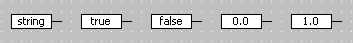

---

## Data Type Names

_Source: `markdown/INT_DataTypeNames.md`_

# Data Type Names

ASCET uses the following data types and data type names.

| Column 1 | Column 2 |
| --- | --- |
| data type | default data type name |
| Bit | bit |
| Bool | bool |
| Unsigned Integer 8 | uint8 |
| Signed Integer 8 | int8 |
| Unsigned Integer 16 | uint16 |
| Signed Integer 16 | int16 |
| Unsigned Integer 32 | uint32 |
| Signed Integer 32 | int32 |
| Real 32 | real32 |
| Real 64 | real64 |

ASCET allows the customization of data type names (see [Customizing Data Type Names](ComponentManagerEnglishUS.chm::/CM_CustomizeDataTypeNames.htm)); you can, e.g., use the name unsigned8 instead of uint8. The customized names are used in the ASCET user interface (implementation editor for scalar elements, Implementation tab, etc.) and in the code generated for ASCET-SE targets. Code generated for experimental targets (RP targets, PC target, Prototyping target) uses the default data type names.

The semantics of data types (dimension, etc.) is not changed, and new data types cannot be added, by customizing data type names.

In addition to the customization in ASCET, user-defined C type definitions must be made available to all source files generated for ASCET-SE targets. For this purpose, an empty header file named a_user_def.h is provided in the <install_dir>\target\trg_<targetname>\include directory of each ASCET-SE target. This header file must be adapted for the customized data type names; the data type names that differ from the default names must be defined. a_user_def.h is included in the generated files automatically.

The definition of the type must be sufficiently wide that it can hold all values of the ASCET data type. For example, an unsigned 16 bit integer must be mapped to a type name that is at least 16 bits wide.

IMPORTANT: ASCET does not check whether the customized data types defined in a_user_def.h are sufficiently wide. Your application may not function correctly if this property is not verified as part of the development process.

See also

[Example: a_user_def.h](markdown/INT_Example_a_user_def.h.md)

[Component Manager - Customizing Data Type Names](ComponentManagerEnglishUS.chm::/CM_CustomizeDataTypeNames.htm)

---

## Example: a_user_def.h

_Source: `markdown/INT_Example_a_user_def.h.md`_

# Example: a_user_def.h

#ifndef __A_USER_DEF_H

#define __A_USER_DEF_H

/******************************************************************************

** FILE: A_USER_DEF.H

**

** DESCRIPTION: This header file is intended for customization purpose.

** customer can insert here some definitions or includes to other

** header files. These definitions will be known to all generated

** source files of an ASCET project. For example, if "user defined

** data types" are used, the definition of such types should be

** performed here:

**

** typedef unsigned char myBool;

**

** Type myBool will be visible for all generated sources and

** can be used there to define boolean variables.

*******************************************************************************/

/******************************************************************************

** ADD YOUR DECLARATIONS OR DEFINITIONS HERE.

*******************************************************************************/

typedef signed char mySint8; /* -128 .. +127 */

typedef unsigned char myUint8; /* 0 .. 255 */

typedef signed short mySint16; /* -32768 .. +32767 */

typedef unsigned short myUint16; /* 0 .. 65535 */

typedef signed long mySint32; /* -2147483648 .. +2147483647 */

typedef unsigned long myUint32; /* 0 .. 4294967295 */

#endif /* __A_USER_DEF_H */

---

## The Kind of Elements

_Source: `markdown/INT_summaryke.md`_

# Kind of Elements - Summary

Each element has a kind. The kind of an element describes how the element is used, either as a variable, a parameter, a system constant or constant. Implementation-Casts are another kind.

| Column 1 | Column 2 | Column 3 | Column 4 |
| --- | --- | --- | --- |
|  | Model | Experiment / Calibration Tool | Implementation |
| variable | r-w | r-w | yes |
| parameter | r | r-w | yes |
| system constant | r | r | yes |
| constant | r | r | no |
| implementation cast | — | — | yes |

The kinds of elements, as well as the properties listed in the table below, are marked by certain symbols in various ASCET windows.

<table class="hcp1" x-use-null-cells="">
<col/>
<col/>
<col/>
<col/>
<col/>
<col/>
<col/>
<tr class="hcp2" valign="top">
<td class="hcp3" colspan="1" rowspan="1">

 
</td>
<th class="hcp4" colspan="3" rowspan="1">

Scope
</th>
<th class="hcp4" colspan="1" rowspan="2">

<a href="markdown/INT_dependent_parameters.md">dependent</a>

</th>
<th class="hcp4" colspan="1" rowspan="2">

<a href="markdown/INT_virtual_variables_parameters.md">virtual</a>

</th>
<th class="hcp4" colspan="1" rowspan="2">

non-volatile
</th></tr>
<tr class="hcp2" valign="top">
<td class="hcp3">

 
</td>
<td class="hcp3">

imported
</td>
<td class="hcp3">

exported
</td>
<td class="hcp3">

local
</td>
</tr>
<tr class="hcp2" valign="top">
<td class="hcp3">

<a href="markdown/INT_variables.md">variable</a>a
</td>
<td class="hcp3">

</td>
<td class="hcp3">

</td>
<td class="hcp3">

</td>
<td class="hcp3">

 
</td>
<td class="hcp3" colspan="1" rowspan="1">

//
</td>
<td class="hcp3">

//
</td></tr>
<tr class="hcp2" valign="top">
<td class="hcp3">

<a href="markdown/INT_parameters.md">parameter</a>b
</td>
<td class="hcp3">

</td>
<td class="hcp3">

</td>
<td class="hcp3">

</td>
<td class="hcp3">

</td>
<td class="hcp3" colspan="1" rowspan="1">

//
</td>
<td class="hcp3">

 
</td></tr>
<tr class="hcp2" valign="top">
<td class="hcp3">

<a href="markdown/INT_constants_and_system_constants.md">constant 
 / system constant</a>
</td>
<td class="hcp3">

/
</td>
<td class="hcp3">

/
</td>
<td class="hcp3">

/
</td>
<td class="hcp3">

 
</td>
<td class="hcp3" colspan="1" rowspan="1">

 
</td>
<td class="hcp3">

 
</td></tr>
<tr class="hcp2" valign="top">
<td class="hcp3" colspan="1" rowspan="1">

<a href="markdown/INT_implementation_casts.md">implementation 
 cast</a>
</td>
<td class="hcp3" colspan="1" rowspan="1">

 
</td>
<td class="hcp3" colspan="1" rowspan="1">

 
</td>
<td class="hcp3" colspan="1" rowspan="1">

</td>
<td class="hcp3" colspan="1" rowspan="1">

 
</td>
<td class="hcp3" colspan="1" rowspan="1">

 
</td>
<td class="hcp3" colspan="1" rowspan="1">

 
</td></tr>
<tr class="hcp2" valign="top">
<td class="hcp3" colspan="1" rowspan="1">

<a href="markdown/INT_dt_parameter.md">dT</a>
</td>
<td class="hcp3" colspan="1" rowspan="1">

</td>
<td class="hcp3" colspan="1" rowspan="1">

</td>
<td class="hcp3" colspan="1" rowspan="1">

 
</td>
<td class="hcp3" colspan="1" rowspan="1">

 
</td>
<td class="hcp3" colspan="1" rowspan="1">

 
</td>
<td class="hcp3" colspan="1" rowspan="1">

 
</td></tr>
<tr class="hcp2" valign="top">
<td class="hcp3" colspan="7" rowspan="1">

a: including arrays, matrices and enumerations

b: including characteristic line/map, distribution
</td>
</tr>
</table>

Beginning with ASCET V6.4, scope and the other properties are no longer displayed for messages. Instead, the message type (Send, Receive, Send & Receive) is marked by certain symbols in various ASCET windows.

| Column 1 | Column 2 | Column 3 | Column 4 |
| --- | --- | --- | --- |
|  | Send | Receive | Send & Receive |
| message |  |  |  |

-----

---

## Variables

_Source: `markdown/INT_variables.md`_

# Variables

Variables store values that can be read and written from inside the model, i.e. a read and a write operation can be performed on them.

In the ECU, they can be placed in the volatile or non-volatile memory. For newly created variables, volatile is pre-selected.

Variables can be real or virtual (see [Virtual Variables/Parameters](markdown/INT_virtual_variables_parameters.md)).

Beginning with ASCET V6.2, it is no longer possible to assign the attributes "virtual" and "non-volatile" to the same variable. A non-volatile variable is automatically set to "non-virtual". If you use an existing component that contains a variable with the "virtual" and "non-volatile" attributes, a warning is issued during code generation:

WMdl400 - Element "%1" has both attributes >non volatile< and >virtual< set. This is not allowed anymore, please change settings manually.

See also

[Virtual Variables/Parameters](markdown/INT_virtual_variables_parameters.md)

[Editing the Configuration of a Scalar Element](ElementEditorEnglishUS.chm::/EEd_edit_element_configuration.htm)

[Editing the Configuration of a Composite Element](ElementEditorEnglishUS.chm::/eed_editconfiguration_compositeelement.htm)

[Editing the Configuration of a Complex Element](elementeditorenglishus.chm::/eed_editconfiguration_complexelement.htm)

---

## Parameters

_Source: `markdown/INT_parameters.md`_

# Parameters

Parameters store values that can only be read from inside the model. Parameters can also be calibrated, i.e. written to from outside the model. In some cases, special prerequisites are required for that purpose, e.g., the connection to a calibration tool.

Parameters (including characteristic lines/maps) are automatically set to non-volatile; in the ECU, they are placed in the respective memory.

See also

[Virtual Variables/Parameters](markdown/INT_virtual_variables_parameters.md)

---

## Constants and System Constants

_Source: `markdown/INT_constants_and_system_constants.md`_

# Constants and System Constants

Constants store values that can only be read from inside the model. In contrast to parameters, constants cannot be changed from outside the model but are fixed at specification time. Constants cannot be implemented, either.

Constants are created as a define statement in the generated C code. However, they are not necessarily explicitly visible in the generated code. If, e.g., the constant is set against a requantization, the constant does not explicitly appear.

System constants are used like constants, and also created as define statements. Unlike constants, system constants can be implemented. They are always explicitly visible in the generated code. You can use the Resolve System Constants option in the ASCET options window, Targets\<target>\Build node, to determine when system constants are resolved. The following selections are available for each target:

| Column 1 | Column 2 |
| --- | --- |
| Generation Time | The system constant behaves like a literal, i.e. can be used by the code generation for optimization. |
| Compile Time | The system constants are generated as C code macros (via #define statements) and can be used by the compiler for optimizations. |
| Run Time | The system constants behaves like a parameter, i.e. there is a memory address where the value of the system constant can be read from during run time. In an experiment, you can calibrate the system constant. |

System constants can be converted into normal constants using Extras menu, select Convert System Constants to Constants in the Component Manager.

See also

[ASCET Options - Targets Node](ComponentManagerEnglishUS.chm::/CM_TargetsNode.htm)

---

## Implementation Casts

_Source: `markdown/INT_implementation_casts.md`_

# Implementation Casts

Implementation casts provide the user with the ability to specify the implementation in a targeted manner at any chosen position of a calculation or a data stream. Unlike variables and parameters, implementation casts do not allocate any memory, and thus have no storing effect in the model and cannot be calibrated.

Implementation casts do not have data; they are always of the cont model type, always have a scalar dimension and a local range of validity. Unlike other elements, the properties of implementation casts cannot be edited.

More details on implementation casts are given in [Implementation Casts](markdown/int_overview_implementation_casts.md) and the links given there.

See also

[Implementation Casts](markdown/int_overview_implementation_casts.md)

---

## Temporary Variables

_Source: `markdown/INT_temporary_variables.md`_

# Temporary Variables

Temporary variables in block diagrams are deprecated; they will be removed in a future ASCET version.

To avoid multiple execution within the same method or process, temporary variables can be specified for each operator or method call or hierarchy/statement block output in a block diagram. With that, the value of the expression is computed only once for each block it is used in, and stored to a temporary variable. When the expression is used again in that method, it is not re-evaluated but the temporary variable is reused.

A temporary variable does not have a start value; its value is determined only by the assignment of an expression. ASCET internally manages the temporary variables and provides a unique assignment (e.g. in the branches of an IF statement) so that no undefined values turn up when the temporary variable is used later. The value remains valid until a new assignment to the temporary variable occurs.

The example shows the temporary variable t which stores and reuses the value of the addition a + b:

t = a + b;

c = t;

d = t;

To use temporary variables in block diagrams, the Disable BDE Temp Variable Generation option in the [Optimization](ProjectEditorEnglishUS.chm::/CodeOptimization.htm) node of the parent project properties must be deactivated.

See also

[Using Temporary Variables](ElementEditorEnglishUS.chm::/EEd_use_temporary_variables.htm)

[Project Properties Window - Optimization Node](ProjectEditorEnglishUS.chm::/CodeOptimization.htm)

---

## Virtual Variables/Parameters

_Source: `markdown/INT_virtual_variables_parameters.md`_

# Virtual Variables/Parameters

Virtual variables/parameters are only available in the specification platform, they bear no relevance for code generation. They are included for a better understanding of the significance of model elements in the specification.

Virtual variables always depend on other virtual or non-virtual variables. Virtual variables are merely aliases to non-virtual variables. No mathematical dependencies such as formulas are allowed, thus the identity (var_virtual = var_real) is predefined for editing the data of virtual variables.

On the other hand, parameters declared as virtual are not necessarily dependent on other parameters.

Beginning with ASCET V6.2, it is no longer possible to assign the attributes "virtual" and "non-volatile" to the same variable. A virtual variable is automatically set to "volatile". If you use an existing component that contains a variable with the "virtual" and "non-volatile" attributes, a warning is issued during code generation:

WMdl400 - Element "%1" has both attributes >non volatile< and >virtual< set. This is not allowed anymore, please change settings manually.

See also

[Variables](markdown/INT_variables.md)

[Parameters](markdown/INT_parameters.md)

[Editing the Configuration of a Scalar Element](ElementEditorEnglishUS.chm::/EEd_edit_element_configuration.htm)

[Editing the Configuration of a Composite Element](ElementEditorEnglishUS.chm::/eed_editconfiguration_compositeelement.htm)

[Editing the Configuration of a Complex Element](elementeditorenglishus.chm::/eed_editconfiguration_complexelement.htm)

---

## Dependent Parameters

_Source: `markdown/INT_dependent_parameters.md`_

# Dependent Parameters

Model parameters can be connected to other system or model parameters via a mathematical dependency. Calibrating parameters can therefore lead to inconsistencies.

To avoid possible inconsistencies from parameter calibration, it is possible within ASCET to specify the dependency of a parameter in the specification editors. The dependency of a parameter is represented by a mathematical formula.

A dependent parameter can depend on a non-dependent, or "master" parameter either directly or indirectly:

- direct dependency

dependentParam1 = f(masterParam)

- indirect dependency

dependentParam1 = f1(dependentParam2) with dependentParam2 = f2(masterParam)

Only parameters of [scope](markdown/INT_the_scope_of_elements.md) local or exported can be specified as dependent parameters. Dependent parameters of scope imported are not allowed. Dependent variables do not exist.

While dependent parameters of scope imported are not allowed, you can import dependent parameters exported in another component of your model, see [Importing Dependent Parameters](markdown/INT_Importing_Dependent_Parameters.md).

See also

[The Scope of Elements](markdown/INT_the_scope_of_elements.md)

[Properties Editor - Creating the Formula for Dependent Parameters](ElementEditorEnglishUS.chm::/EEd_create_fromula_dependent.htm)

[Data Editor - Editing Dependent Parameters](DataEditorEnglishUS.chm::/DEd_Editing_Dependent_Parameters.htm)

[Importing Dependent Parameters](markdown/INT_Importing_Dependent_Parameters.md)

[Experimentation - Dependent Parameters in the Experiment](ExperimentationEnglishUS.chm::/EE_DepParam_in_Experiment.htm)

---

## The Scope of Elements

_Source: `markdown/INT_the_scope_of_elements.md`_

# The Scope of Elements

Some elements are used for exchanging data between different components. To establish this, elements can be exported from one component (or from the project) and can be imported in any other component. Here, the matching is done via names. The scope of each element can be defined as one of the following:

- Local elements can only be used within the component that defines them, i.e. in all methods or processes of that component.
- Imported elements are defined in some other component or project, but can be used in the component that imports them. The properties of an imported element can be changed only in the context of the component that defines and exports the element.
- Exported elements are defined in one component and can be accessed by all other components by importing that element.

The scopes Local, Imported and Exported are set in the [properties editor](ElementEditorEnglishUS.chm::/EEd_Overview.htm).

- Method/Process-local elements can only be used in the method/process that define them. Method/Process-local elements are not static and do not have a data set.

Method-/process-local elements are created in the signature editor of a method/process, see [Adding Local Variables to the Method or Process](BlockDiagramEditorEnglishUS.chm::/BDE_Localvariables.htm).

---

## User-Defined Model Types

_Source: `markdown/INT_User-Defined_Model_Types.md`_

# User-Defined Model Types

Elements can also be user-defined model types, i.e. modules or classes. User-defined model types are always reference types. The interface is defined by the interface of this component.

The scope of a user-defined type can be the same as that of the basic types, namely imported, exported, local and method-local. Like arguments, method/process-local elements of a reference type are not instantiated, but a reference to them is established. This means that, when using a method/process-local element of a reference type, an assignment to this element must precede any further use of that element.

The kind of an element is irrelevant for user-defined model types. User-defined model types are always treated as variables, i.e. there is no restriction of the interface from within the model.

See also

[The Scope of Elements](markdown/INT_the_scope_of_elements.md)

---

## Redundant Data Storage

_Source: `markdown/INT_RedundantDataStorage.md`_

# Redundant Data Storage

In the AUTOSAR world, multiple SWC from multiple sources are integrated into one ECU. Due to a missing memory protection (the ECU memory management cannot isolate these SWC from each other), there is a potential risk that one faulty SWC may corrupt the data of other SWC in memory.

ASCET offers a possibility for critical data to detect invalid data during program execution: Redundant data storage. Redundant data storage means that selected data can be stored in two different places in the memory (the original representation and its complement), and the two values can be compared at a later time. If the original value and its complement are not consistent, error actions can be taken.

The following conditions must be met for redundant data storage of an element:

- the element is of scalar, enumeration, array, or matrix type
- the element belongs to one of the following components:
- an SWC
- a class or module specified as block diagram or ESDL
- an ActionCondition diagram in a state machine

- the element is of the [kind](markdown/INT_summaryke.md) Variable or Message
- the element is of [scope](markdown/INT_the_scope_of_elements.md) Local or Exported
- the element is volatile

For all other elements (e.g., elements with bit implementation, parameters, complex elements, elements in records or AUTOSAR interfaces, etc.), redundant data storage must not be activated. If it is, an error message is issued during code generation:

MMdl37 - redundant data flag is set for <element>, but <reason for error>

In the context of a project, redundant data storage can be activated or deactivated via the [Use Redundant Data Storage](ProjectEditorEnglishUS.chm::/PE_Code_Generation_Options.htm) option.

For an individual element, redundant data storage is activated via the Redundant option in the Attribute area of the [properties editor](ElementEditorEnglishUS.chm::/EED_Element_Editor_Basic_Elements.htm). An element's Redundant option has no effect when redundant data storage is deactivated for the project.

When redundant data storage is activated, each write access to an element marked as redundant stores the value in both the original and the complement representation. The memory section of the complement representation is specified in the memorySections.xml file; see [Memory Classes for Redundant Data Storage](markdown/INT_MemoryClasses_RedundantDataStorage.md).

The Verify operator (block diagrams) or the verify() operation (ESDL) can be used to check consistency of an element's original value and its complement. You have to specify each check manually; see [Using the Verify Operator](BlockDiagramEditorEnglishUS.chm::/BDE_UseVerifyOperator.htm) and [Verify Operation](ESDLEditorEnglishUS.chm::/ESDL_VerifyOperator.htm) for details.

When you calibrate an element marked as redundant in an experiment, or stimulate the element during an offline simulation, only the original value is changed. The complement representation is not changed, and the result of a verify operation will be false.

See also

[Code Generation with Redundant Data Storage](markdown/INT_CodeGen_RedundantDataStorage.md)

[Complement Service for Redundant Data Storage](markdown/INT_ComplementService_RDS.md)

[Memory Classes for Redundant Data Storage](markdown/INT_MemoryClasses_RedundantDataStorage.md)

[Block Diagram Editor - Using the Verify Operator](BlockDiagramEditorEnglishUS.chm::/BDE_UseVerifyOperator.htm)

[ESDL Editor - Verify Operation](ESDLEditorEnglishUS.chm::/ESDL_VerifyOperator.htm)

[Implementations](markdown/INT_Overview_Implementations.md)

[The Kind of Elements](markdown/INT_summaryke.md)

[The Scope of Elements](markdown/INT_the_scope_of_elements.md)

[Project Editor - Code Generation Options](ProjectEditorEnglishUS.chm::/PE_Code_Generation_Options.htm)

[Properties Editor for Basic Elements](ElementEditorEnglishUS.chm::/EED_Element_Editor_Basic_Elements.htm)

---

## Code Generation with Redundant Data Storage

_Source: `markdown/INT_CodeGen_RedundantDataStorage.md`_

The exported send message msg and the local variable cont are marked as redundant.

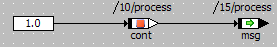

They are implemented as follows:

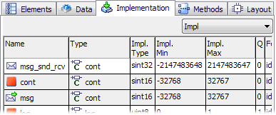

The complement service is defined as follows:

complement|s16|s16=complement_%t1%(%i1%)

In the generated *.h file, the elements are defined as follows (the complements are set in bold):

/*----Local variables object structure -----------------------------*/

struct MODULE_BLOCK_DIAGRAM_IMPL_Obj {

sint16_Obj *cont;

sint16_Obj *_ASCET_copy_cont;

};

/*----Imported/Exported variables object structure -----------------*/

typedef struct {

sint16_Obj *msg;

sint16_Obj *_ASCET_copy_msg;

} MODULE_BLOCK_DIAGRAM_IMPL_Class;

The local variable cont_local is marked as redundant and implemented as sint16. An assignment is specified:

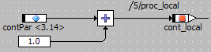

The following code is generated for the assignment. The assignment to the temporary variable is limited to the sint16 value range.

sint16 _t1sint16;

_t1sint16 = (MODULE_IMPLinstance->contPar->val <= 32766) ? (MODULE_IMPLinstance->contPar->val + 1) : 32767;

MODULE_IMPLinstance->cont_local->val = _t1sint16;

MODULE_IMPLinstance->_ASCET_copy_cont_local->val = complementService(_t1sint16);

The local variable cont_local is marked as redundant and implemented as sint16. A direct assignment is specified:

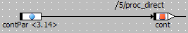

The following code is generated for the assignment:

MODULE_IMPLinstance->cont->val = MODULE_IMPLinstance->contPar->val;

MODULE_IMPLinstance->_ASCET_copy_cont->val = complementService(MODULE_IMPLinstance->contPar->val);

The local variable cont is marked as redundant and implemented as sint16. A simple verify operation is specified:

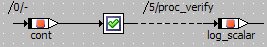 / log_scalar = cont.verify();

The following code is generated for the operation:

MODULE_IMPLinstance->log_scalar->val = (complementService(MODULE_IMPLinstance->cont->val) == MODULE_IMPLinstance->_ASCET_copy_cont->val);

The array variable array is marked as redundant and implemented as uint32. A simple verify operation is specified:

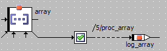 / log_array = array.verify();

The following code is generated for the operation:

uint8 _t1uint8;

uint8 _t2uint8;

_t1uint8 = true;

if (_t1uint8)

{

for(_t2uint8 = 0U;_t2uint8 < 4U;_t2uint8++)

{

{

_t1uint8 = _t1uint8 && (complementService(Vec_uint32_getAtProtected (MODULE_IMPLinstance->array, _t2uint8, "variable <MODULE_IMPLinstance->array> in component <Module::Impl>")) == Vec_uint32_getAtProtected (MODULE_IMPLinstance->_ASCET_copy_array, _t2uint8, "variable <MODULE_IMPLinstance->_ASCET_copy_array> in component <Module::Impl>"));

}

}

}

MODULE_IMPLinstance->log_array->val = _t1uint8;

The matrix variable matrix is marked as redundant and implemented as sint16. A simple verify operation is specified:

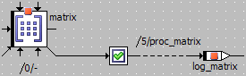 / log_matrix = matrix.verify();

The following code is generated for the operation:

uint8 _t1uint8;

uint8 _t2uint8;

uint8 _t3uint8;

_t1uint8 = true;

if (_t1uint8)

{

for(_t2uint8 = 0U;_t2uint8 < 3U;_t2uint8++)

{

{

for(_t3uint8 = 0U;_t3uint8 < 3U;_t3uint8++)

{

{

_t1uint8 = _t1uint8 && (complementService(Mat_sint16_getAtProtected (MODULE_IMPLinstance->matrix, _t2uint8, _t3uint8, "variable <MODULE_IMPLinstance->matrix> in component <Module::Impl>")) == Mat_uint16_getAtProtected (MODULE_IMPLinstance->_ASCET_copy_matrix, _t2uint8, _t3uint8, "variable <MODULE_IMPLinstance->_ASCET_copy_matrix> in component <Module::Impl>"));

}

}

}

}

}

MODULE_BLOCK_DIAGRAM_1_IMPLinstance->log_matrix->val = _t1uint8;

The local variable cont is marked as redundant and implemented as sint16. The array variable array is marked as redundant and implemented as uint32.

The following verify operations are specified:

Code is generated for the PC target and Physical experiment. The following code is generated for the verify operations:

MODULE_instance->out_log->val = true;

MODULE_instance->log_array->val = true;

# Code Generation with Redundant Data Storage

All C code examples have been generated for the PC target with Implementation Experiment code generator.

If the code generation option [Use Redundant Data Storage](ProjectEditorEnglishUS.chm::/PE_Code_Generation_Options.htm) is activated, and code is generated for the Implementation Experiment or for Object Based Controller Implementation, the following happens:

- Each element marked as redundant is stored in a second place, the complement representation.

The implementation data type of the complement is set via the <result type> in the complement service. If no <result type> is given, the implementation data type is an unsigned integer type of the same bit size as the original element, especially for originals with a signed implementation data type.

[Example](javascript:kadovTextPopup(this))<!-- kadovTextPopupInit('a1'); //-->

- Each assignment to an element marked as redundant is replaced by an assignment to a temporary variable, followed by an assignment to the original representation.

The complementary value (calculated via a [complement service](markdown/INT_ComplementService_RDS.md)) of the temporary variable is assigned to the element's complement representation.

[Example](javascript:kadovTextPopup(this))<!-- kadovTextPopupInit('a2'); //-->

The temporary variable is omitted for very simple assignments, e.g., the direct assignment of a parameter or a constant.

[Example](javascript:kadovTextPopup(this))<!-- kadovTextPopupInit('a6'); //-->

- Each verify operation for a scalar element x is replaced by (complement(x) == xcopy), where x is the original and xcopy the complement. The complement function is the complement service for the type of x.

[Example](javascript:kadovTextPopup(this))<!-- kadovTextPopupInit('a3'); //-->

- Each verify operation for an array or matrix marked as redundant is replaced by a for loop construction, which verifies all elements of the array/matrix in the same way as scalars.

If code is generated for an ASCET-SE target, the following happens in addition to the list above:

- All pointers that are dereferenced within the code generated for a verify operation have to be checked before dereferencing. The check is done by taking care that the pointer is one of the instances known to ASCET.

If the code generation option [Use Redundant Data Storage](ProjectEditorEnglishUS.chm::/PE_Code_Generation_Options.htm) is not activated, or if code is generated for the Physical or Quantized Physical experiment, the following happens:

- Elements marked as redundant are treaded as elements not marked as redundant.
- All verify operations are replaced by true.

[Example](javascript:kadovTextPopup(this))<!-- kadovTextPopupInit('a7'); //-->

See also

[Redundant Data Storage](markdown/INT_RedundantDataStorage.md)

[Memory Classes for Redundant Data Storage](markdown/INT_MemoryClasses_RedundantDataStorage.md)

[Complement Service for Redundant Data Storage](markdown/INT_ComplementService_RDS.md)

[Block Diagram Editor - Using the Verify Operator](BlockDiagramEditorEnglishUS.chm::/BDE_UseVerifyOperator.htm)

[ESDL Editor - Verify Operation](ESDLEditorEnglishUS.chm::/ESDL_VerifyOperator.htm)

[Project Editor - Code Generation Options](ProjectEditorEnglishUS.chm::/PE_Code_Generation_Options.htm)

[Temporary Variables](markdown/INT_temporary_variables.md)

/* Heikki Komulainen, Comet Computer GmbH 2004 */ cc_plus_pic = '&nbsp;'; cc_minus_pic = '&nbsp;'; cc_stat_pic = '&nbsp;'; gpstyle = ''; var iframes_created = 0; if (document.body && document.body.insertAdjacentHTML && document.getElementsByTagName && document.getElementById) { collect_popups(); set_poplinks_pictures(); if (iframes_created) { document.write(gpstyle); document.write('
<nobr><a id="einauslink" style="position:absolute;top:expression(document.body.scrollTop + this.offsetHeight - this.offsetHeight);left:expression(document.body.offsetWidth - (this.offsetWidth + 28));background:white;padding:5px" href="javascript:show_all_poptext()">Show all hidden text</a></nobr>
'); } } function collect_popups() { bsscpopups = new Array(); for (x = 0; x < document.links.length; x++) { if (document.links[x].href.indexOf("BSSCPopup")>-1) { seekmatch = /BSSCPopup.'[^'](markdown/+)'/; poplink = seekmatch.exec(document.links[x].href); poplink = "" + poplink; poplink = poplink.substring(poplink.indexOf("'")+1, poplink.lastIndexOf("'")); ifid = "CCGENIFRAMEID" + x; new_iframe = '<iframe id="' + ifid + '"src="' + poplink + '" onload="get_text(\'' + ifid + '\')" width="0" height="0" frameborder=0></iframe>'; document.links[x].parentNode.insertAdjacentHTML("afterEnd", new_iframe); gpid = "CCID_" + ifid; document.links[x].href = "javascript:expand_poptext('" + gpid + "')"; cc_plus = '' + cc_plus_pic + ''; document.links[x].insertAdjacentHTML("afterBegin", cc_plus); iframes_created = 1; } } }// end function function get_text(ifr_id) { frpars = document.frames[ifr_id].document.getElementsByTagName("body"); popbody = frpars[0].innerHTML; gpid = "CCID_" + ifr_id; if (!document.getElementById(gpid)) { //avoiding doubles document.getElementById(ifr_id).insertAdjacentHTML("afterEnd", '
'+popbody+'
'); } }//end function function expand_poptext(x_frame_id) { if (!document.getElementById(x_frame_id)) return; if (document.getElementById(x_frame_id).className == "CCGENPOPTEXTH") { document.getElementById(x_frame_id).className = "CCGENPOPTEXTV"; document.getElementById(x_frame_id).style.visibility = "visible"; if (document.getElementById("CCPMB_" + x_frame_id )) { document.getElementById("CCPMB_" + x_frame_id ).innerHTML = cc_minus_pic; } } else { document.getElementById(x_frame_id).className = "CCGENPOPTEXTH"; document.getElementById(x_frame_id).style.visibility = "hidden"; if (document.getElementById("CCPMB_" + x_frame_id )) { document.getElementById("CCPMB_" + x_frame_id ).innerHTML = cc_plus_pic; } } }// end function function show_all_poptext() { var pulldowntxt = document.getElementsByTagName("div"); for (b = 0; b < pulldowntxt.length; b++) { if (pulldowntxt[b].className == "droptext") { pulldowntxt[b].style.display=""; } } var gptxt = document.getElementsByTagName("div"); for (z = 0; z < gptxt.length; z++) { if (gptxt[z].className == "CCGENPOPTEXTH") { gptxt[z].className = "CCGENPOPTEXTV"; gptxt[z].style.visibility = "visible"; if (document.getElementById("CCPMB_" + gptxt[z].id )) { document.getElementById("CCPMB_" + gptxt[z].id ).innerHTML = cc_minus_pic; } } } var dxpoplinks = document.getElementsByTagName("a"); if (dxpoplinks) { for (pxl = 0; pxl < dxpoplinks.length; pxl++) { if (dxpoplinks[pxl].href.indexOf("kadovTextPopup")>-1) { if (document.getElementById("CCPMB_" + dxpoplinks[pxl].id)) { document.getElementById("CCPMB_" + dxpoplinks[pxl].id).innerHTML = cc_stat_pic; dxpoplinks[pxl].symbol = "minus"; } } } } document.getElementById('einauslink').innerText = 'Hide all hideable text'; document.getElementById('einauslink').href = "javascript:self.location.reload()"; self.focus(); }// end function function eat_click() { return false; }// end function function set_poplinks_pictures() { var dpoplinks = document.getElementsByTagName("a"); if (dpoplinks) { for (pl = 0; pl < dpoplinks.length; pl++) { if (dpoplinks[pl].href.indexOf("kadovTextPopup")>-1) { cc_plus = '' + cc_stat_pic + ''; //dpoplinks[pl].onmouseup = plusminuspoplink; dpoplinks[pl].insertAdjacentHTML("afterBegin", cc_plus); dpoplinks[pl].symbol = "plus"; } } } }// end function function plusminuspoplink() { if (document.getElementById("CCPMB_" + this.id)) { if (this.symbol == "plus") { document.getElementById("CCPMB_" + this.id).innerHTML = cc_minus_pic; this.symbol = "minus"; } else { document.getElementById("CCPMB_" + this.id).innerHTML = cc_plus_pic; this.symbol = "plus"; } } return true; }

---

## Complement Service for Redundant Data Storage

_Source: `markdown/INT_ComplementService_RDS.md`_

# Complement Services for Redundant Data Storage

Special arithmetic services, the complement service, are required to compute the complement representation of an element marked as redundant.

The complement services must be added manually to the respective services.ini file; the AS editor does not support complement services.

| Column 1 |
| --- |
| NOTICE |
| When you edit a services.ini file with complement service in the AS editor, and then save the changes, the complement service definition is converted to a comment. Projects that use the complement service will no longer compile. Do not edit a services.ini file with complement service in the AS editor. |

Complement services are defined in services.ini as other arithmetic services (see [Defining Arithmetic Services](ArithmeticServicesEnglishUS.chm::/AS_Def_Arith_Serv_.htm) and references therein):

complement|<operand type>[|<result type>]=function

<operand type> is the type of the original, <result type> is the type of the complement.

<result type> must be an integer type, i.e. u8, u16, u32, s8, s16, or s32. If you specify a float type or a wildcard, one of the following error messages is issued during code generation:

ERROR (MIle23) Float types can not be used as redundant data types, see "complement|<operand type>|r<*>" in file "<path>\services.ini"

ERROR (MIle24) Unknown type used as redundant data type, see "complement|<operand type>|<result type>" in file "<path>\services.ini"

If you omit <result type>, the type of the complement is determined automatically according to the following table:

| Column 1 | Column 2 |
| --- | --- |
| original type | complement type |
| s8, u8 | u8 |
| s16, u16 | u16 |
| s32, u32 | u32 |
| everything else | u32 |

In that case, a warning of type WIle201 is issued during code generation.

Example for a complement service entry in services.ini:

complement|s16|s16=complement_%t1%(%i1%)

If no suitable complement service is available, the following error message is issued during code generation with redundant data storage:

ERROR (MIle20): Arithmetic service <name> is required but not defined

If multiple redundant services are defined which differ only in <result type>, the following error is issued:

ERROR (MIle22): Multiple complement services for type "<operand type>" defined in file "<path>\services.ini"

See also

[Redundant Data Storage](markdown/INT_RedundantDataStorage.md)

[Defining Arithmetic Services](ArithmeticServicesEnglishUS.chm::/AS_Def_Arith_Serv_.htm)

---

## Memory Classes for Redundant Data Storage

_Source: `markdown/INT_MemoryClasses_RedundantDataStorage.md`_

# Memory Classes for Redundant Data Storage

By default, the complement representation is stored in the same memory class as the original. However, an associated memory class for redundant data storage can be specified for each memory class in the memory class declaration file, e.g. memorySections.xml file, via a <redundantMemClass> element:

<MemClass>

<name>A</name>

...

<redundantMemClass>B</redundantMemClass>

</MemClass>

If <redundantMemClass> is defined, complements are stored in memory class B if their originals are stored in memory class A.

[Example](markdown/INT_Example_MemClassRedundantDataStorage.md)

Only memory classes declared in memorySections.xml can be used as <redundantMemClass>. If an undeclared class name is used as <redundantMemClass>, an error is issued during code generation.

ECCg41 - Memory class <"undeclared class" used as "Default"> specified for element <complement name> is not declared in file "target path\memory class declaration file" - Please add declaration

See also

[Example: Memory Class for Redundant Data Storage](markdown/INT_Example_MemClassRedundantDataStorage.md)

[Redundant Data Storage](markdown/INT_RedundantDataStorage.md)

[Code Generation with Redundant Data Storage](markdown/INT_CodeGen_RedundantDataStorage.md)

---

## Example: Memory Class for Redundant Data Storage

_Source: `markdown/INT_Example_MemClassRedundantDataStorage.md`_

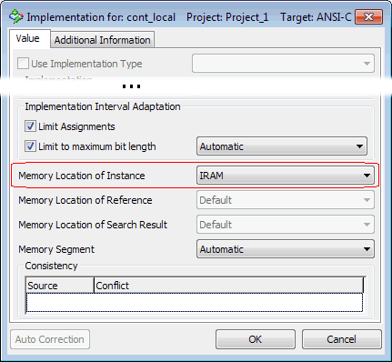

# Example: Memory Class for Redundant Data Storage

For the memory class IRAM, the associated memory section RED_MEM for redundant data storage is specified in memorySections.xml:

...

<MemClass>

<name>IRAM</name>

...

<redundantMemClass>RED_MEM</redundantMemClass>

</MemClass>

...

<MemClass>

<name>RED_MEM</name>

...

</MemClass>

...

The redundant variable cont_local is [assigned to the IRAM memory section](javascript:kadovTextPopup(this))<!-- kadovTextPopupInit('a1'); //-->.

The *.c and *.h files have been generated for the PC target with Implementation Experiment code generator.

In the generated header file, the assignment of cont_local and its complement _ASCET_copy_cont_local to memory classes can be seen in the following place:

/* begin region Type_Definitions */

...

* ----------------------------------------------------------------------------

* memory class:.................................'IRAM'

* ---------------------------------------------------------------------------*/

struct MODULE_IMPL_IRAM_SUBSTRUCT {

sint16 cont_local; /* min=-32768.0, max=32767.0, ident, limit=yes */

};

...

* ----------------------------------------------------------------------------

* memory class:.................................'RED_MEM'

* ---------------------------------------------------------------------------*/

struct MODULE_IMPL_RED_MEM_SUBSTRUCT {

uint16 _ASCET_copy_cont_local; /* min=0, max=65535, limit=yes */

};

/* end region Type_Definitions */

In the generated C file, the assignment of cont_local and its complement _ASCET_copy_cont_local to memory classes can be seen in the following place:

/* begin region Module_Data_Definitions */

...

/******************************************************************************

* BEGIN: DEFINITION OF SUBSTRUCT VARIABLE 'Module_IRAM'

...

* ---------------------------------------------------------------------------*/

struct MODULE_IMPL_IRAM_SUBSTRUCT Module_IRAM = {

/* struct element:'Module_IRAM.cont_local' (modeled as:'cont_local.Module') */

11

};

...

/******************************************************************************

* BEGIN: DEFINITION OF SUBSTRUCT VARIABLE 'Module_RED_MEM'

...

struct MODULE_IMPL_RED_MEM_SUBSTRUCT Module_RED_MEM = {

/* struct element:'Module_RED_MEM._ASCET_copy_cont_local' (modeled as:'_ASCET_copy_cont_local.Module') */

complementService(11)

};

...

/* end region Module_Data_Definitions */

/* Heikki Komulainen, Comet Computer GmbH 2004 */ cc_plus_pic = '&nbsp;'; cc_minus_pic = '&nbsp;'; cc_stat_pic = '&nbsp;'; gpstyle = ''; var iframes_created = 0; if (document.body && document.body.insertAdjacentHTML && document.getElementsByTagName && document.getElementById) { collect_popups(); set_poplinks_pictures(); if (iframes_created) { document.write(gpstyle); document.write('
<nobr><a id="einauslink" style="position:absolute;top:expression(document.body.scrollTop + this.offsetHeight - this.offsetHeight);left:expression(document.body.offsetWidth - (this.offsetWidth + 28));background:white;padding:5px" href="javascript:show_all_poptext()">Show all hidden text</a></nobr>
'); } } function collect_popups() { bsscpopups = new Array(); for (x = 0; x < document.links.length; x++) { if (document.links[x].href.indexOf("BSSCPopup")>-1) { seekmatch = /BSSCPopup.'[^'](markdown/+)'/; poplink = seekmatch.exec(document.links[x].href); poplink = "" + poplink; poplink = poplink.substring(poplink.indexOf("'")+1, poplink.lastIndexOf("'")); ifid = "CCGENIFRAMEID" + x; new_iframe = '<iframe id="' + ifid + '"src="' + poplink + '" onload="get_text(\'' + ifid + '\')" width="0" height="0" frameborder=0></iframe>'; document.links[x].parentNode.insertAdjacentHTML("afterEnd", new_iframe); gpid = "CCID_" + ifid; document.links[x].href = "javascript:expand_poptext('" + gpid + "')"; cc_plus = '' + cc_plus_pic + ''; document.links[x].insertAdjacentHTML("afterBegin", cc_plus); iframes_created = 1; } } }// end function function get_text(ifr_id) { frpars = document.frames[ifr_id].document.getElementsByTagName("body"); popbody = frpars[0].innerHTML; gpid = "CCID_" + ifr_id; if (!document.getElementById(gpid)) { //avoiding doubles document.getElementById(ifr_id).insertAdjacentHTML("afterEnd", '
'+popbody+'
'); } }//end function function expand_poptext(x_frame_id) { if (!document.getElementById(x_frame_id)) return; if (document.getElementById(x_frame_id).className == "CCGENPOPTEXTH") { document.getElementById(x_frame_id).className = "CCGENPOPTEXTV"; document.getElementById(x_frame_id).style.visibility = "visible"; if (document.getElementById("CCPMB_" + x_frame_id )) { document.getElementById("CCPMB_" + x_frame_id ).innerHTML = cc_minus_pic; } } else { document.getElementById(x_frame_id).className = "CCGENPOPTEXTH"; document.getElementById(x_frame_id).style.visibility = "hidden"; if (document.getElementById("CCPMB_" + x_frame_id )) { document.getElementById("CCPMB_" + x_frame_id ).innerHTML = cc_plus_pic; } } }// end function function show_all_poptext() { var pulldowntxt = document.getElementsByTagName("div"); for (b = 0; b < pulldowntxt.length; b++) { if (pulldowntxt[b].className == "droptext") { pulldowntxt[b].style.display=""; } } var gptxt = document.getElementsByTagName("div"); for (z = 0; z < gptxt.length; z++) { if (gptxt[z].className == "CCGENPOPTEXTH") { gptxt[z].className = "CCGENPOPTEXTV"; gptxt[z].style.visibility = "visible"; if (document.getElementById("CCPMB_" + gptxt[z].id )) { document.getElementById("CCPMB_" + gptxt[z].id ).innerHTML = cc_minus_pic; } } } var dxpoplinks = document.getElementsByTagName("a"); if (dxpoplinks) { for (pxl = 0; pxl < dxpoplinks.length; pxl++) { if (dxpoplinks[pxl].href.indexOf("kadovTextPopup")>-1) { if (document.getElementById("CCPMB_" + dxpoplinks[pxl].id)) { document.getElementById("CCPMB_" + dxpoplinks[pxl].id).innerHTML = cc_stat_pic; dxpoplinks[pxl].symbol = "minus"; } } } } document.getElementById('einauslink').innerText = 'Hide all hideable text'; document.getElementById('einauslink').href = "javascript:self.location.reload()"; self.focus(); }// end function function eat_click() { return false; }// end function function set_poplinks_pictures() { var dpoplinks = document.getElementsByTagName("a"); if (dpoplinks) { for (pl = 0; pl < dpoplinks.length; pl++) { if (dpoplinks[pl].href.indexOf("kadovTextPopup")>-1) { cc_plus = '' + cc_stat_pic + ''; //dpoplinks[pl].onmouseup = plusminuspoplink; dpoplinks[pl].insertAdjacentHTML("afterBegin", cc_plus); dpoplinks[pl].symbol = "plus"; } } } }// end function function plusminuspoplink() { if (document.getElementById("CCPMB_" + this.id)) { if (this.symbol == "plus") { document.getElementById("CCPMB_" + this.id).innerHTML = cc_minus_pic; this.symbol = "minus"; } else { document.getElementById("CCPMB_" + this.id).innerHTML = cc_plus_pic; this.symbol = "plus"; } } return true; }

---

## Value Types and Reference Types

_Source: `markdown/INT_ValueTypes_ReferenceTypes.md`_

# Value Types and Reference Types

ASCET knows two different kinds of types: value types (e.g., cont, sdisc, udisc, log, enum) and reference types (e.g., array, matrix, characteristic line/map, record, class). The difference is how these types are handled in assignments, method arguments and as method- or process-local variables:

- If a variable of value type is on the left-hand side of an assignment, its value is changed. If a variable of reference type is on the left-hand side of an assignment, it has to be a reference and the reference itself is changed, not the referenced value.
- Value types are passed by value, reference types are passed by reference.
- Method- or process-local elements of value types are instances of the type, while method- or process-local elements of reference types are references to an instance.

Values types are, e.g., cont, limitInt, wrapInt, sdisc, udisc, enum, log, [mode groups](SenderReceiverEditorEnglishUS.chm::/SREmodesModeGroups.htm). Reference types are, e.g., arrays, matrices, [records](RecordsEnglishUS.chm::/RC_overview.htm) and classes.

See also

[Explicit References](markdown/INT_ExplicitReferences.md)

[Modes and Mode Groups](SenderReceiverEditorEnglishUS.chm::/SREmodesModeGroups.htm)

[Records - Overview](RecordsEnglishUS.chm::/RC_overview.htm)

---

## Explicit References

_Source: `markdown/INT_ExplicitReferences.md`_

# Explicit References

In ASCET versions prior to V6.0, the fact whether a reference type element is a reference or not is, in most cases, implicitly derived from its usage in the model: If an element has a connected set port, it is assumed to be used as reference. This occasionally lead to unexpected and unpredictable behavior; to avoid this, explicit references were introduced.

Implicit reference are no longer created if something is assigned to a reference type elements. The following happens instead:

- An assignment to an array, matrix or record instance is allowed if the types are compatible. In such a case, the complete content of the array/matrix/record is copied, using the copy function specified in the [target settings](ComponentManagerEnglishUS.chm::/CM_TargetsNode.htm).
- An assignment to a complex element is forbidden; in such a case, an error (MMdl3) is issued.

The following non-scalar variables of a component (class, module, state machine, SWC) or project can be specified as explicit reference in the [properties editor](ElementEditorEnglishUS.chm::/EEd_Overview.htm).

- array
- matrix
- normal or fixed characteristic line/map
- normal class
- state machine
- Boolean table
- conditional table
- record

Arrays, matrices and records used as messages must not be specified as explicit references. If they are, an error (MMdl794) is issued during code generation: Element <name> is a message and a reference, but the combination is not allowed.

Non-scalar variables not listed here cannot be specified as explicit reference. Elements in Boolean tables, conditional tables, CT blocks, records and AUTOSAR interfaces cannot be specified as explicit reference, either.

The access possibilities for references can be specified in the properties editor, too. For explicit references in classes and modules, you can specify external and internal access; for explicit references in AUTOSAR software components and projects, you can specify only internal access. Available settings are:

<table class="hcp1" x-use-null-cells="">
<col/>
<col/>
<col/>
<tr class="hcp2" valign="top">
<td class="hcp3" colspan="1" rowspan="2">

external access
</td>
<td class="hcp3">

Set() Method
</td>
<td class="hcp3">

The explicit reference can be set to another data 
 structure by other components.
</td></tr>
<tr class="hcp2" valign="top">
<td class="hcp3">

Get() Method
</td>
<td class="hcp3">

The explicit reference can be used by other components.
</td></tr>
<tr class="hcp2" valign="top">
<td class="hcp3" colspan="1" rowspan="2">

internal access
</td>
<td class="hcp3">

Write for referenced element
</td>
<td class="hcp3">

The referenced element can be written from inside 
 the component.

If write access is enabled, the reference cannot be mapped 
 to a parameter because parameters cannot be written.
</td></tr>
<tr class="hcp2" valign="top">
<td class="hcp3">

Read for referenced element
</td>
<td class="hcp3">

The referenced element can be read from inside 
 the component.
</td></tr>
</table>

Explicit references are marked by an additional symbol, on top of the symbol denoting kind and scope.

| Column 1 | Column 2 |
| --- | --- |
| local reference |  |
| exported reference |  |
| imported reference |  |

Explicit references must be initialized, see [Initialization of Explicit References](markdown/INT_InitExplicitReferences.md).

In an experiment, explicit references cannot be measured or calibrated.

See also

[Initialization of Explicit References](markdown/INT_InitExplicitReferences.md)

[Value Types and Reference Types](markdown/INT_ValueTypes_ReferenceTypes.md)

[Migration and Conversion of References](markdown/INT_MigrationConversion_of_References.md)

[Specifying a Reference](ElementEditorEnglishUS.chm::/EEd_Specifying_a_Reference.htm)

[Mapping a Reference](DataEditorEnglishUS.chm::/DEd_MappingReference.htm)

[Implementing References](ImplementationEditorEnglishUS.chm::/IED_ImplementingReferences.htm)

[Component Manager - Promoting Information and Warnings](ComponentManagerEnglishUS.chm::/Promoting_Information_and_Warnings.htm)

[ASCET Options Window - Targets Node](ComponentManagerEnglishUS.chm::/CM_TargetsNode.htm)

[Overview - Properties Editor](ElementEditorEnglishUS.chm::/EEd_Overview.htm)

[Messages](markdown/INT_messages.md)

---

## Initialization of Explicit References

_Source: `markdown/INT_InitExplicitReferences.md`_

- A reference is defined in a multi-instance class, and it is initialized through a reference to that class.
- aRef and bRef are uninitialized references; aRef = bRef is set in processA, and bRef = aRef is set in processB
- aRef = (a > b) ? aRef : bRef; with a always larger than b due to intervals, so that this assignment effectively is aRef = aRef

# Initialization of Explicit References

Explicit references must be initialized before they are used.

| Column 1 | Column 2 |
| --- | --- |
| Reference Type | must be initialized with |
| array | array of identical or larger size (a warning is issued in the latter case) |
| matrix | matrix of identical x size and y size |
| normal or fixed characteristic line/map | normal or fixed characteristic line/map of kind "variable" and identical dimension (you cannot map a characteristic line to a map or vice versa) type (you cannot map, e.g., a normal characteristic line to a fixed characteristic line) x max size and - for maps - y max size implementation (for implementation experiments) interpolation routine (for ASCET-SE targets) |
| normal class (block diagram, ESDL, C code) | another instance of the same class using the same implementation |
| state machine | another instance of the same state machine using the same implementation |
| Boolean table | another instance of the same Boolean table using the same implementation |
| conditional table | another instance of the same conditional table using the same implementation |
| record | another instance of the same record using the same implementation |

To ensure reference initialization, ASCET requires, by default, that the element specified as Reference must be [mapped](DataEditorEnglishUS.chm::/DEd_MappingReference.htm) to an element that is not a reference itself. The mapped element must be an element in the same component, and its type must match the reference (see the table above). The [scope](markdown/INT_the_scope_of_elements.md) of the mapped element depends on the scope of the reference:

- Local references can be mapped to elements of any scope (local, imported, exported).
- Exported references can be mapped to imported or exported elements only.
- Imported references cannot be mapped; map the associated exported reference instead.

Explicit references must not be mapped to arrays, matrices or records used as messages. If they are, an error (MMdl3024) is issued during code generation: Cannot use the address of a message object <name>.

The mapping is stored with the currently active data set of the component.

In ASCET versions prior to V6.2, the [mapping](DataEditorEnglishUS.chm::/DEd_MappingReference.htm) was the only possibility to initialize explicit references. However, to allow customer tool chains to generate data structures and initial values, ASCET V6.2 or higher offers the possibility to generate code for unmapped explicit references. By default, this possibility is deactivated; it can be activated in the context of a project, via the Allow References without Init Value [code generation option](ProjectEditorEnglishUS.chm::/PE_Code_Generation_Options.htm).

If the Allow References without Init Value option is activated, the user is the sole responsible for initialization of references.

If code is generated while Allow References without Init Value is deactivated, an error is issued when an uninitialized reference is found:

GLm3 - Reference init value undefined or not available. Please specify an internal init value for <reference name>.

If code is generated while Allow References without Init Value is activated, a warning is issued if an uninitialized reference is found:

WMdl822 - read access to reference without init value "<reference name>" possibly prior to initialization of reference

By default, this warning is [promoted to an error](ComponentManagerEnglishUS.chm::/Promoting_Information_and_Warnings.htm).

In addition, the global analysis, i.e. the analysis of the entire project context, issues an error for an uninitialized reference that is read:

MMdl83 - read access to a definitely uninitialized reference "<reference name>"

The absence of the error does not prove that the reference is always initialized before use. The [following list](javascript:kadovTextPopup(this))<!-- kadovTextPopupInit('a1'); //--> contains three examples for uninitialized references that remain undiscovered.

See also [Using References Without Initialization](markdown/INT_UseReferencesWithoutInit.md).

See also

[Explicit References](markdown/INT_ExplicitReferences.md)

[Mapping a Reference](DataEditorEnglishUS.chm::/DEd_MappingReference.htm)

[Using References Without Initialization](markdown/INT_UseReferencesWithoutInit.md)

[The Scope of Elements](markdown/INT_the_scope_of_elements.md)

[Project Editor - Code Generation Options](ProjectEditorEnglishUS.chm::/PE_Code_Generation_Options.htm)

[Specifying a Reference](ElementEditorEnglishUS.chm::/EEd_Specifying_a_Reference.htm)

[Component Manager - Promoting Information and Warnings](ComponentManagerEnglishUS.chm::/Promoting_Information_and_Warnings.htm)

/* Heikki Komulainen, Comet Computer GmbH 2004 */ cc_plus_pic = '&nbsp;'; cc_minus_pic = '&nbsp;'; cc_stat_pic = '&nbsp;'; gpstyle = ''; var iframes_created = 0; if (document.body && document.body.insertAdjacentHTML && document.getElementsByTagName && document.getElementById) { collect_popups(); set_poplinks_pictures(); if (iframes_created) { document.write(gpstyle); document.write('
<nobr><a id="einauslink" style="position:absolute;top:expression(document.body.scrollTop + this.offsetHeight - this.offsetHeight);left:expression(document.body.offsetWidth - (this.offsetWidth + 28));background:white;padding:5px" href="javascript:show_all_poptext()">Show all hidden text</a></nobr>
'); } } function collect_popups() { bsscpopups = new Array(); for (x = 0; x < document.links.length; x++) { if (document.links[x].href.indexOf("BSSCPopup")>-1) { seekmatch = /BSSCPopup.'[^'](markdown/+)'/; poplink = seekmatch.exec(document.links[x].href); poplink = "" + poplink; poplink = poplink.substring(poplink.indexOf("'")+1, poplink.lastIndexOf("'")); ifid = "CCGENIFRAMEID" + x; new_iframe = '<iframe id="' + ifid + '"src="' + poplink + '" onload="get_text(\'' + ifid + '\')" width="0" height="0" frameborder=0></iframe>'; document.links[x].parentNode.insertAdjacentHTML("afterEnd", new_iframe); gpid = "CCID_" + ifid; document.links[x].href = "javascript:expand_poptext('" + gpid + "')"; cc_plus = '' + cc_plus_pic + ''; document.links[x].insertAdjacentHTML("afterBegin", cc_plus); iframes_created = 1; } } }// end function function get_text(ifr_id) { frpars = document.frames[ifr_id].document.getElementsByTagName("body"); popbody = frpars[0].innerHTML; gpid = "CCID_" + ifr_id; if (!document.getElementById(gpid)) { //avoiding doubles document.getElementById(ifr_id).insertAdjacentHTML("afterEnd", '
'+popbody+'
'); } }//end function function expand_poptext(x_frame_id) { if (!document.getElementById(x_frame_id)) return; if (document.getElementById(x_frame_id).className == "CCGENPOPTEXTH") { document.getElementById(x_frame_id).className = "CCGENPOPTEXTV"; document.getElementById(x_frame_id).style.visibility = "visible"; if (document.getElementById("CCPMB_" + x_frame_id )) { document.getElementById("CCPMB_" + x_frame_id ).innerHTML = cc_minus_pic; } } else { document.getElementById(x_frame_id).className = "CCGENPOPTEXTH"; document.getElementById(x_frame_id).style.visibility = "hidden"; if (document.getElementById("CCPMB_" + x_frame_id )) { document.getElementById("CCPMB_" + x_frame_id ).innerHTML = cc_plus_pic; } } }// end function function show_all_poptext() { var pulldowntxt = document.getElementsByTagName("div"); for (b = 0; b < pulldowntxt.length; b++) { if (pulldowntxt[b].className == "droptext") { pulldowntxt[b].style.display=""; } } var gptxt = document.getElementsByTagName("div"); for (z = 0; z < gptxt.length; z++) { if (gptxt[z].className == "CCGENPOPTEXTH") { gptxt[z].className = "CCGENPOPTEXTV"; gptxt[z].style.visibility = "visible"; if (document.getElementById("CCPMB_" + gptxt[z].id )) { document.getElementById("CCPMB_" + gptxt[z].id ).innerHTML = cc_minus_pic; } } } var dxpoplinks = document.getElementsByTagName("a"); if (dxpoplinks) { for (pxl = 0; pxl < dxpoplinks.length; pxl++) { if (dxpoplinks[pxl].href.indexOf("kadovTextPopup")>-1) { if (document.getElementById("CCPMB_" + dxpoplinks[pxl].id)) { document.getElementById("CCPMB_" + dxpoplinks[pxl].id).innerHTML = cc_stat_pic; dxpoplinks[pxl].symbol = "minus"; } } } } document.getElementById('einauslink').innerText = 'Hide all hideable text'; document.getElementById('einauslink').href = "javascript:self.location.reload()"; self.focus(); }// end function function eat_click() { return false; }// end function function set_poplinks_pictures() { var dpoplinks = document.getElementsByTagName("a"); if (dpoplinks) { for (pl = 0; pl < dpoplinks.length; pl++) { if (dpoplinks[pl].href.indexOf("kadovTextPopup")>-1) { cc_plus = '' + cc_stat_pic + ''; //dpoplinks[pl].onmouseup = plusminuspoplink; dpoplinks[pl].insertAdjacentHTML("afterBegin", cc_plus); dpoplinks[pl].symbol = "plus"; } } } }// end function function plusminuspoplink() { if (document.getElementById("CCPMB_" + this.id)) { if (this.symbol == "plus") { document.getElementById("CCPMB_" + this.id).innerHTML = cc_minus_pic; this.symbol = "minus"; } else { document.getElementById("CCPMB_" + this.id).innerHTML = cc_plus_pic; this.symbol = "plus"; } } return true; }

---

## Migration and Conversion of References

_Source: `markdown/INT_MigrationConversion_of_References.md`_

# Migration and Conversion of References

When existing databases are opened with the current ASCET version, or when existing export files (*.exp, *.amd, *.axl) are imported, the Reference option (see [Specifying a Reference](ElementEditorEnglishUS.chm::/EEd_Specifying_a_Reference.htm)) is deactivated for all elements.

A fully automated conversion from implicit to explicit references is not possible, due to the following reasons:

- In previous ASCET versions, the implementation editor of C code components allowed to set a reference flag for non-scalar elements. This old reference flag was bound to a particular implementation of the component, whereas the new explicit references are bound to the element instance. This difference cannot be solved automatically.
- Explicit references must be mapped to a non-reference element which ensures initialization of the reference. This mapping has to be done manually by the user (see [Mapping a Reference](DataEditorEnglishUS.chm::/DEd_MappingReference.htm)).

Code generation detects inconsistent settings of the reference flag. If elements not specified as explicit references are used as implicit references, a warning is reported in the ASCET monitor window. By double-clicking the warning, you are lead to the inconsistent elements; open the properties editor and set the reference flag (see [Specifying a Reference](ElementEditorEnglishUS.chm::/EEd_Specifying_a_Reference.htm)).

C Code components keep their current reference flag within the implementation configuration. This flag will be valid as long as the element is not specified as explicit reference. If the element is marked as explicit reference, the old implementation-related flags are overruled and the element is handled as a reference in all implementations.

See also

[Explicit References](markdown/INT_ExplicitReferences.md)

[Specifying a Reference](ElementEditorEnglishUS.chm::/EEd_Specifying_a_Reference.htm)

[Mapping a Reference](DataEditorEnglishUS.chm::/DEd_MappingReference.htm)

[Overview - Properties Editor](ElementEditorEnglishUS.chm::/EEd_Overview.htm)

---

## Interpolation Routines

_Source: `markdown/INT_InterpolationRoutines.md`_

# Interpolation Routines

ASCET provides the following interpolation routines for characteristic lines and maps:

- ASCET Linear (the value is derived from a straight line between the sample values)and ASCET Rounded (the value between two sample points is derived from the sample value at the lower (left) sample point)

These interpolation routines are the same as in previous ASCET versions.

- AUTOSAR 4.0 Interpolate and AUTOSAR 4.0 Look-Up

Interpolation routine declarations for AUTOSAR R4.0.* floating-point and fixed-point interpolation routines.

See the documentation on fixed-point and floating-point interpolation routines on the AUTOSAR web site ([http://www.autosar.org/](http://www.autosar.org/)) for more details.

- Linear and Rounded (alias interpolation routine declarations)

These interpolation routines are alias interpolation routines, i.e. they are mapped to other interpolation routines. Mapping is done in the Project Properties window, Build\OS Configuration node, Interpolation Alias Mapping field.

A default mapping is provided in the ASCET options window, External Tools\Operating System\<os name> node, Interpolation Alias Mapping Default field.

Besides the interpolation routines shipped with ASCET, ASCET supports the following kinds of interpolation routines:

- [User-Defined Interpolation Routines](markdown/INT_UserDefinedInterpolationRoutines.md)
- [High-Resolution Interpolation Routines](markdown/INT_HighRes_InterpolationRoutines.md)

See also

[Characteristic Lines and Maps](markdown/INT_characteristic_lines_and_maps.md)

[User-Defined Interpolation Routines](markdown/INT_UserDefinedInterpolationRoutines.md)

[High-Resolution Interpolation Routines](markdown/INT_HighRes_InterpolationRoutines.md)

---

## User-Defined Interpolation Routines

_Source: `markdown/INT_UserDefinedInterpolationRoutines.md`_

# User-Defined Interpolation Routines

In some cases more complex mathematical functions and hysteresis behavior have to be implemented for interpolation.

Therefore, ASCET provides the possibility to include user-defined interpolation routines. These interpolation routines can be used for all targets.

The interpolation routine can either be specified as C code class in ASCET or defined with header file and object library.

For each user-defined interpolation routine, the following information must be provided in the form of [an ASCET options set](markdown/INT_CreateOptionSet_UDIR.md):

- a unique identifier
- a unique label that is used throughout the ASCET user interface for the interpolation routine
- a flag that marks an interpolation routine as alias interpolation routine
- If the interpolation routine is defined with header file and object library:
- one or more [mapping files](markdown/INT_MappingFileUDIR.md) (*.ini) that map the ASCET interpolation routines search, interpol and getAt to function names in the generated code
- optional overlay icons (*.ico) for characteristic lines/maps (to indicate the selected interpolation routine in a block diagram)
- optional restrictions for the axes of characteristic lines/maps
- a flag to enable map optimization (the axes are swapped if the x axis type is smaller than the y axis type, i.e. it occurs earlier in the following list of types: s8, u8, s16, u16, s32, u32)
- a flag to allow single precision for storage and double precision for calculation of the interpolation
- input fields for the types that are used to store the results of a distribution search for integer and floating-point distributions.
- input fields for initial values to be used as integer and floating-point distribution search result.

The option sets for linear and rounded interpolation are provided by ASCET. If desired, you can adjust the settings to use your own code instead of the interpolation routines provided by ASCET.

See also

[Mapping File for User-Defined Interpolation Routine](markdown/INT_MappingFileUDIR.md)

[Including User-Defined Interpolation Routines](markdown/INT_IncludeUDIR.md)

[Creating an Option Set for an Interpolation Routine](markdown/INT_CreateOptionSet_UDIR.md)

[Creating the Mapping for User-Defined Interpolation Routines](markdown/INT_CreateMapping_UDIR.md)

[Interpolation Routines](markdown/INT_InterpolationRoutines.md)

[H](markdown/INT_HighRes_InterpolationRoutines.md)igh-Resolution Interpolation Routines

[Characteristic Lines and Maps](markdown/INT_characteristic_lines_and_maps.md)

---

## Mapping File for User-Defined Interpolation Routine

_Source: `markdown/INT_MappingFileUDIR.md`_

# Mapping File for User-Defined Interpolation Routine

The ASCET interpolation routines search, interpol and getAt must be mapped to function names in the generated code. For this purpose, a mapping file (*.ini) must be created.

The mapping file is similar to the services.ini file used for [arithmetic services](ArithmeticServicesEnglishUS.chm::/AS_Overview.htm). It has sections named like a target (e.g., [<target name>]), like a target group, i.e. [Experiment] for experimental targets (RP targets, PC target, Prototyping target) and [Production] for microcontroller targets, or [Interpolation].

To select an interpolation routine, a section named like the current target is searched first. If the interpolation routine cannot be found in such a section, the section [Experiment] or [Production] is searched, depending on whether you are using an experimental target or a microcontroller target. If the interpolation routine still cannot be found, it is searched in section [Interpolation]. With that, you can use one mapping file for all targets, and reuse identical definitions for multiple targets.

Routines for non-adaptive characteristic lines/maps are mapped [as follows](javascript:BSSCPopup('INT_MappingNormalTables.htm');)<!-- kadovFilePopupInit('a1'); //-->.

Routines for adaptive characteristic lines/maps are mapped [as follows](javascript:BSSCPopup('INT_MappingAdaptiveTables.htm');)<!-- kadovFilePopupInit('a2'); //-->.

The following abbreviations are used:

| Column 1 | Column 2 |
| --- | --- |
| ct | characteristic line/map |
| tv / tx / ty | short name of value / X axis / Y axis type (s8, u8, s16, u16, s32, u32, r32, r64) |
| ftv / ftx / fty | full name of value / X axis / Y axis type (sint8, uint8, sint16, uint16, sint32, uint32, real32, real64) |
| td / ftd | short/full name of the "double precision" type of a high-resolution interpolation routine |
| x | X axis point |
| y | Y axis point |
| v | value |
| d | distribution |
| t1 / ft1 | short / full name of axis type in distribution |
| i1 | axis point in distribution |

Examples for mapping files - IntpolLinear.ini and IntpolRounded.ini - can be found in the ..\target\common\interpolation directory.

See also

[Creating the Mapping for User-Defined Interpolation Routines](markdown/INT_CreateMapping_UDIR.md)

[Creating an Option Set for an Interpolation Routine](markdown/INT_CreateOptionSet_UDIR.md)

[High-Resolution Interpolation Routines](markdown/INT_HighRes_InterpolationRoutines.md)

[Arithmetic Services](ArithmeticServicesEnglishUS.chm::/AS_Overview.htm)

/* Heikki Komulainen, Comet Computer GmbH 2004 */ cc_plus_pic = '&nbsp;'; cc_minus_pic = '&nbsp;'; cc_stat_pic = '&nbsp;'; gpstyle = ''; var iframes_created = 0; if (document.body && document.body.insertAdjacentHTML && document.getElementsByTagName && document.getElementById) { collect_popups(); set_poplinks_pictures(); if (iframes_created) { document.write(gpstyle); document.write('
<nobr><a id="einauslink" style="position:absolute;top:expression(document.body.scrollTop + this.offsetHeight - this.offsetHeight);left:expression(document.body.offsetWidth - (this.offsetWidth + 28));background:white;padding:5px" href="javascript:show_all_poptext()">Show all texts</a></nobr>
'); } } function collect_popups() { bsscpopups = new Array(); for (x = 0; x < document.links.length; x++) { if (document.links[x].href.indexOf("BSSCPopup")>-1) { seekmatch = /BSSCPopup.'[^'](markdown/+)'/; poplink = seekmatch.exec(document.links[x].href); poplink = "" + poplink; poplink = poplink.substring(poplink.indexOf("'")+1, poplink.lastIndexOf("'")); ifid = "CCGENIFRAMEID" + x; new_iframe = '<iframe id="' + ifid + '"src="' + poplink + '" onload="get_text(\'' + ifid + '\')" width="0" height="0" frameborder=0></iframe>'; document.links[x].parentNode.insertAdjacentHTML("afterEnd", new_iframe); gpid = "CCID_" + ifid; document.links[x].href = "javascript:expand_poptext('" + gpid + "')"; cc_plus = '' + cc_plus_pic + ''; document.links[x].insertAdjacentHTML("afterBegin", cc_plus); iframes_created = 1; } } }// end function function get_text(ifr_id) { frpars = document.frames[ifr_id].document.getElementsByTagName("body"); popbody = frpars[0].innerHTML; gpid = "CCID_" + ifr_id; if (!document.getElementById(gpid)) { //avoiding doubles document.getElementById(ifr_id).insertAdjacentHTML("afterEnd", '
'+popbody+'
'); } }//end function function expand_poptext(x_frame_id) { if (!document.getElementById(x_frame_id)) return; if (document.getElementById(x_frame_id).className == "CCGENPOPTEXTH") { document.getElementById(x_frame_id).className = "CCGENPOPTEXTV"; document.getElementById(x_frame_id).style.visibility = "visible"; if (document.getElementById("CCPMB_" + x_frame_id )) { document.getElementById("CCPMB_" + x_frame_id ).innerHTML = cc_minus_pic; } } else { document.getElementById(x_frame_id).className = "CCGENPOPTEXTH"; document.getElementById(x_frame_id).style.visibility = "hidden"; if (document.getElementById("CCPMB_" + x_frame_id )) { document.getElementById("CCPMB_" + x_frame_id ).innerHTML = cc_plus_pic; } } }// end function function show_all_poptext() { var pulldowntxt = document.getElementsByTagName("div"); for (b = 0; b < pulldowntxt.length; b++) { if (pulldowntxt[b].className == "droptext") { pulldowntxt[b].style.display=""; } } var gptxt = document.getElementsByTagName("div"); for (z = 0; z < gptxt.length; z++) { if (gptxt[z].className == "CCGENPOPTEXTH") { gptxt[z].className = "CCGENPOPTEXTV"; gptxt[z].style.visibility = "visible"; if (document.getElementById("CCPMB_" + gptxt[z].id )) { document.getElementById("CCPMB_" + gptxt[z].id ).innerHTML = cc_minus_pic; } } } var dxpoplinks = document.getElementsByTagName("a"); if (dxpoplinks) { for (pxl = 0; pxl < dxpoplinks.length; pxl++) { if (dxpoplinks[pxl].href.indexOf("kadovTextPopup")>-1) { if (document.getElementById("CCPMB_" + dxpoplinks[pxl].id)) { document.getElementById("CCPMB_" + dxpoplinks[pxl].id).innerHTML = cc_stat_pic; dxpoplinks[pxl].symbol = "minus"; } } } } document.getElementById('einauslink').innerText = 'Hide all texts'; document.getElementById('einauslink').href = "javascript:self.location.reload()"; self.focus(); }// end function function eat_click() { return false; }// end function function set_poplinks_pictures() { var dpoplinks = document.getElementsByTagName("a"); if (dpoplinks) { for (pl = 0; pl < dpoplinks.length; pl++) { if (dpoplinks[pl].href.indexOf("kadovTextPopup")>-1) { cc_plus = '' + cc_stat_pic + ''; //dpoplinks[pl].onmouseup = plusminuspoplink; dpoplinks[pl].insertAdjacentHTML("afterBegin", cc_plus); dpoplinks[pl].symbol = "plus"; } } } }// end function function plusminuspoplink() { if (document.getElementById("CCPMB_" + this.id)) { if (this.symbol == "plus") { document.getElementById("CCPMB_" + this.id).innerHTML = cc_minus_pic; this.symbol = "minus"; } else { document.getElementById("CCPMB_" + this.id).innerHTML = cc_plus_pic; this.symbol = "plus"; } } return true; }

---

## High-Resolution Interpolation Routines

_Source: `markdown/INT_HighRes_InterpolationRoutines.md`_

# High-Resolution Interpolation Routines

In many cases, memory space can be saved by using a less accurate representation for the data values (below: "normal" type), but calculating the interpolation value with high accuracy (below: "double precision" type). This demand requires a change to the interpolation calculation.

For this purpose, ASCET offers high-resolution interpolation routines.

Any interpolation routine can be used as high-resolution routine by activating the Double Precision option in the ASCET options window, Build\Interpolation Routine\<routine name> node.

If Double Precision is activated for a given interpolation routine, the result types of the functions getAt*, getAtFixed*, interpol*, interpolGroup* (*=1 for characteristic lines, *=2 for characteristic maps) are changed; they use an implementation type of "double-precision" and a different formula.

<table style="x-cell-content-align: Top;
				margin-top: 3px;
				border-left-style: Outset;
				border-top-style: Outset;
				border-right-style: Outset;
				border-bottom-style: Outset;
				border-left-width: 1px;
				border-right-width: 1px;
				border-top-width: 1px;
				border-bottom-width: 1px;" x-use-null-cells="">
<col/>
<col/>
<col/>
<tr class="hcp1" valign="top">
<td class="hcp2">

"normal" type
</td>
<td class="hcp2">

"double precision" type
</td>
<td class="hcp2">

scaling factor
</td></tr>
<tr class="hcp1" valign="top">
<td class="hcp2">

sint8
</td>
<td class="hcp2">

sint16
</td>
<td class="hcp2">

256
</td></tr>
<tr class="hcp1" valign="top">
<td class="hcp2">

uint8
</td>
<td class="hcp2">

uint16
</td>
<td class="hcp2">

256
</td></tr>
<tr class="hcp1" valign="top">
<td class="hcp2">

sint16
</td>
<td class="hcp2">

sint32
</td>
<td class="hcp2">

65536
</td></tr>
<tr class="hcp1" valign="top">
<td class="hcp2">

uint16
</td>
<td class="hcp2">

uint32
</td>
<td class="hcp2">

65536
</td></tr>
<tr class="hcp1" valign="top">
<td class="hcp2" colspan="1" rowspan="1">

real32
</td>
<td class="hcp2" colspan="1" rowspan="1">

real64
</td>
<td class="hcp2" colspan="1" rowspan="1">

1
</td></tr>
<tr class="hcp1" valign="top">
<td class="hcp2" colspan="3" rowspan="1">

For sint32, uint32, 
 and real64, double precision is not possible; 
 an error of type MMdl609 is issued.
</td>
</tr>
</table>

If a value type has the implementation range [lower, upper] and the formula f(phys) = offset + scaling*phys, then the "double-precision" implementation range is calculated by [lower*scaling_factor, upper*scaling_factor], and the "double-precision" formula is given by f(phys) = offset*scaling_factor + scaling*phys*scaling_factor.

The interpolation calculation of a characteristic line changes from

y = (x-x0)*(y1-y0) / (x1-x0)

to

y = ((x-x0)*(y1-y0)*scaling_factor) / (x1-x0);

The calculation for a characteristic map changes accordingly.

See also

[Interpolation Routines](markdown/INT_InterpolationRoutines.md)

---

## Data and Implementations

_Source: `markdown/int_overview_DataImplementations.md`_

# Overview - Data and Implementations

In [Overview - Components](markdown/INT_Overview_Components.md) and [Types and Elements](markdown/int_types_and_elements.md) the parts of a component were identified as the set of elements, the interface of the component, and the functional description of the methods or processes in the form of algorithms.

In this chapter two additional parts of a component specification are introduced: data and implementation. Both data and implementation belong to the elements in a component, i.e. both describe properties of the elements.

The approach of separate descriptions for data and implementations is not usually found in standard programming languages, where the data assignments of variables is part of the functional specification, i.e. the program code.

The data of a component describes the physical values with which the elements of the components are initialized. Data contain physical information and are thus part of the physical specification of the component.

Also, standard programming languages do not usually separate between the implementation of a functional specification and the functional specification itself. The functional specification is usually identical to its implementation.

See also

[Data](markdown/INT_Data.md)

[Overview - Implementations](markdown/INT_Overview_Implementations.md)

[Overview - Implementation Casts](markdown/int_overview_implementation_casts.md)

[Overview - Code Generation with Implementations](markdown/INT_Overview_CodeGen_w_Implementations.md)

[The Implementation of Methods and Processes](markdown/INT_The_Implementation_of_Methods_and_Processes.md)

[Overview - Components](markdown/INT_Overview_Components.md)

[Types and Elements](markdown/int_types_and_elements.md)

---

## Data

_Source: `markdown/INT_Data.md`_

# Data

The data of a component describes how the elements of a component are to be initialized. Thus data refers to the elements of a component.

The data is held separately from the elements because a component can have multiple instances in a project, where the different instances access different data sets for their elements. (The data sets are, however, not parts of the respective instance.)

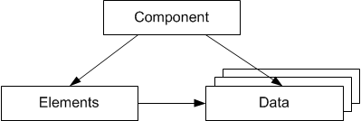

An example would be a p-control filter. Each instance of this p-control filter has its own value for the p-factor. This is achieved by assigning different data sets to the p-control.

The specification of data is part of the specification of the component itself, and not of the different instances. This may lead to a large number of different data sets for a component, but if each instance would hold its own data, this would result in the loss of a modular system design.

The organization of data for each element depends on whether it is a basic or complex element. Since basic elements are always used within complex objects, and are never considered separately from those, basic elements do not have explicit data sets. The data for the basic elements are therefore part of the data set of the complex element they are contained in.

Complex elements are the components specified by the user. Each complex element has its own data set. If a complex element is used in a component, the data set of the complex element is referenced by the component. Thus the data of a component has the same hierarchical structure as the component itself.

Data sets have an object ID, which is used to reference the data of a component. Just like references to user defined types, this reference is not name-based.

See also

[Example: Data](markdown/INT_Example__Data.md)

---

## Example: Data

_Source: `markdown/INT_Example__Data.md`_

# Example: Data

Consider the following example with the types A and C

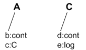

The type C has the following data sets:

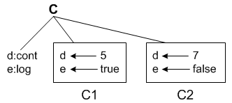

A data declaration for the type A using the data sets of C would have the following results:

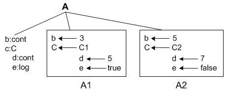

The data for the basic types can be specified directly. For the scalar types the data consists of one value. For composite types, like arrays or characteristic lines, the data consists of a table of values, or a table of sample points and sample values

---

## Implementations

_Source: `markdown/INT_Overview_Implementations.md`_

# Overview - Implementations

Implementations describe how the elements of a component are to be realized in code. Here the same scheme as for data is used:

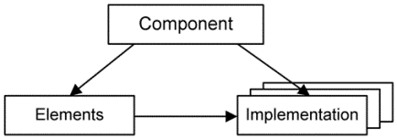

The same reference scheme applies to implementations as to basic and complex types. The effect of implementations is much broader than that of data sets. The implementation of an element, e.g. whether an element of type cont is represented as a data type float or signed int, has direct influence on the code that is generated from the functional description for a method or process.

See also

[Implementations for Scalar Types](markdown/INT_Implementations_for_Scalar_Types.md)

[Example - Implementations for Scalar Types](markdown/INT_Example_Implementations_ScalarTypes.md)

[The Implementation of Composite Types](markdown/int_the_implementation_of_composite_types.md)

[The Implementation of User-Defined Types](markdown/int_the_implementation_of_user-defined_types.md)

[The Implementation of Methods and Processes](markdown/INT_The_Implementation_of_Methods_and_Processes.md)

---

## Implementations for Scalar Types

_Source: `markdown/INT_Implementations_for_Scalar_Types.md`_

# Implementations for Scalar Types

The implementation describes how an element of a basic type is realized in the generated C code. The implementation specification for elements of type logical is very easy, since a logical element has only two values, either true or false.

The implementation specification consists only of the data type. For logical elements either byte, word, or long can be chosen.

The implementation specification for the arithmetic types is much more complex. It describes, among other things, the implementation type, which can be an integer type even for elements of type continuous. The implementation specification therefore contains a complex transformation from the physical domain to the implementation domain, which can be very different from each other.

The differences between the physical domain (e.g. model type continuous) and the implementation domain are the infinite range of the physical domain from -infinity to +infinity, and its arbitrarily fine resolution. In the implementation domain, on the other hand, the range is limited by the word length, and the resolution is not arbitrarily fine but fixed to 1.

In order to make a transformation between the physical domain and the implementation domain possible, the range of the physical domain has to be limited. Thus each element must be assigned an interval for the relevant physical values. The resolution must also be restricted. Therefore, each element has to be given a fixed resolution, the quantization.

See also

[Example - Implementations for Scalar Types](markdown/INT_Example_Implementations_ScalarTypes.md)

---

## Example: Implementations for Scalar Types

_Source: `markdown/INT_Example_Implementations_ScalarTypes.md`_

# Example: Implementations for Scalar Types

For example, let A be a range of values in the physical domain, A = [-1, 0.5], and assume a quantization of q = 0.2.

The result of the limitation of the range to an interval and of the quantization is a restriction of the values of an element to a finite set of equidistant values.

Aq = {-1, -0,8, -0.6, -0.4, -0.2, 0, 0.2, 0.4}

This finite set of values can now be mapped to an integer range:

Aint = {-5, -4, -3, -2, -1, 0, 1, 2}

This corresponds to a linear conversion formula between the physical domain to the implementation domain of the kind impl = 5 * phys. The data type for the integer variable is automatically determined from the integer range. In this example, the data type signed int8 would be chosen.

When the range of the physical element has an offset larger than zero, the associated integer interval may only contain a few values, but a large data type has to be used.

Consider for example the physical domain range A = [120, 130] and a quantization of q = 0.5. A linear conversion would result in an integer range Aint = {240, … , 260}.

The type for the integer variable is unsigned int16 in this case, although the number of values would also fit into a variable of type int8.

To implement this, a general linear conversion formula with an offset can be specified. In the above example, a conversion formula of the type

impl = 2 * phys - 240

would lead to an integer interval of {0,…,20} and a variable of data type unsigned int8 would be sufficient.

The conversion formulas are not specified in the context of a component, but in the context of a project. This makes it easy for several components to use the same conversion formulas. Furthermore, this complies with the ASAM-MCD-2MC standard.

---

## The Implementation of Composite Types

_Source: `markdown/int_the_implementation_of_composite_types.md`_

# The Implementation of Composite Types

For composite types like arrays, matrices or characteristic tables, the implementation is specified for the interface elements of the composite types, which themselves are of a scalar type.

For arrays, for instance, the implementation for the elements held in the array must be given. This implementation is valid for both, the input and the output of the array. The implementation for the index is fixed, since the index is a discrete model type.

For characteristic tables, the implementation of the x-points and y-points and the values of the table can be specified separately from each other.

---

## The Implementation of User-Defined Types

_Source: `markdown/int_the_implementation_of_user-defined_types.md`_

# The Implementation of User-Defined Types

The implementation of user-defined types consists of the implementations of all elements used in that component.

In the case of classes, the arguments and return values also need to have an implementation, since the value of an actual and formal argument have to be adjusted correctly to each other. This is automatically done for arguments of a scalar type.

This automatic adjustment does not work for arguments of composite or complex types. If such arguments are used, the implementation of the formal argument and the actual argument must coincide. Here, no automatic adjustment is possible, since these arguments are passed as references.

Temporary elements do not have an explicit implementation, but they are automatically assigned an implementation by the code generation algorithm. It is important that an assignment to this variable (e.g. an initialization) precedes any other use of it.

Method- and process-local elements can be implemented automatically, like temporary elements, but they can be explicitly implemented, too (see [Implementation of Method- and Process-Local Variables](ImplementationEditorEnglishUS.chm::/impl_method_process.htm)). The implementation is preserved within the method/process.

---

## The Implementation of Methods and Processes

_Source: `markdown/INT_The_Implementation_of_Methods_and_Processes.md`_

# The Implementation of Methods and Processes

The facilities for using implementations allow for method implementations to be specified. Method and process implementations are available in both ESDL and block diagrams.

The implementation of a method or process contains information the memory to be used for running a method or process and whether it should be fully expanded during code generation.

In general, algorithms that should have a short response time or are used more often, will be run in internal memory, whereas other algorithms that are not used very often, such as initialization algorithms, will run in external memory

In addition, method and process calls can either be represented as function calls or fully expanded in generated code (inlining).

---

## Rescalable Implementations

_Source: `markdown/INT_RescalableImplementations.md`_

# Rescalable Implementations

To ease specification of implementations that differ only in scale, ASCET offers rescalable implementations. For a rescalable implementation, you mark the implementation of elements in a component as rescalable (i.e. you create rescalable elements), and assign a rescaling factor to each instance of the component used a particular project.

Not all elements can be rescalable; see [Elements with Rescalable Implementation](markdown/INT_ElementsRescalableImpl.md) for details.

Several rules apply when you are using rescalable elements in a model; see [Operations with Rescalable Elements](markdown/INT_OperationsRescalableElements.md) for details.

For details on the rescaling factor (i.e. a linear formula with zero offset) for component instances, see [Components with Rescalable Elements](markdown/int_componentsrescalableelements.md).

A step-by-step instruction is given in [Specifying Rescalable Implementations](ImplementationEditorEnglishUS.chm::/Ied_SpecifyRescalableImplementations.htm).

See also

[Elements with Rescalable Implementation](markdown/INT_ElementsRescalableImpl.md)

[Operations with Rescalable Elements](markdown/INT_OperationsRescalableElements.md)

[Components with Rescalable Elements](markdown/int_componentsrescalableelements.md)

[Integer Arithmetic with Rescalable Elements](markdown/Int_IntegerArithmetic_RescalableElements.md)

[Specifying Rescalable Implementations](ImplementationEditorEnglishUS.chm::/Ied_SpecifyRescalableImplementations.htm)

[Project Editor - Transformation Formulas](ProjectEditorEnglishUS.chm::/PE_TransformationFormulas.htm)

[Project Editor - Formulas in the ASAM-MCD-2MC File](ProjectEditorEnglishUS.chm::/pe_formulas_asap2file.htm)

---

## Elements with Rescalable Implementation

_Source: `markdown/INT_ElementsRescalableImpl.md`_

# Elements with Rescalable Implementation

Only certain elements can have rescalable implementations; see the following list. Elements with rescalable implementation are called rescalable elements.

- scalar variables, parameters and system constants
- arrays and matrices
- arguments, local variables and return values of methods
- local variables of processes and runnable entities

The implementation editor of an element can be used to mark the element as rescalable. The following restrictions apply:

- Code generation accepts only elements of type cont with activated Rescalable option .

Elements of type sdisc or udisc with activated Rescalable option produce errors (code MIa50).

- The element scope must be local.

The element scope exported or imported causes an error (code MIa51).

- An element with activated Rescalable option must use a linear formula with an offset of 0.

A non-linear formula, or a linear formula with non-zero offset, causes an error (code MIa52).

- An element with activated Rescalable option must use an integer type as implementation data type.

If the implementation data type is real*, an error (code MIa53) is issued.

- The element implementation must use the implementation page as master (see [Setting the Master Page of an Implementation](ImplementationEditorEnglishUS.chm::/set_masterpg_impl.htm)).

If the master page is set to Model, an error (code MIa54) is issued.

- Characteristic lines and maps and distributions must not be marked as rescalable.

If the values, x- or y-distribution are marked as rescalable, an error (code MIa501) is issued.

- The initial value of a rescalable element must be 0.

A non-zero initial value produces an error (code MMdl46).

- Interrunnable variables and elements in AUTOSAR interfaces must not be marked as rescalable.

If such an element is marked as rescalable, an error (code MIa55) is issued.

See also

[Operations with Rescalable Elements](markdown/INT_OperationsRescalableElements.md)

[Components with Rescalable Elements](markdown/int_componentsrescalableelements.md)

[Specifying Rescalable Implementations](ImplementationEditorEnglishUS.chm::/Ied_SpecifyRescalableImplementations.htm)

[Implementation Editor for Scalar Elements, Arrays and Matrices](ImplementationEditorEnglishUS.chm::/IEd_Impl_Editor_for_Scalar_Nonlogical_Elements.htm)

[Project Editor - Transformation Formulas](ProjectEditorEnglishUS.chm::/PE_TransformationFormulas.htm)

---

## Operations with Rescalable Elements

_Source: `markdown/INT_OperationsRescalableElements.md`_

# Operations with Rescalable Elements

Several operations are possible with arithmetic elements. The following restrictions apply for operations with rescalable elements:

- +, -, min, max, mux, case (in block diagrams), between

The operands must either all be rescalable or all non-rescalable. Otherwise, an error (code MMdl6) is issued during code generation.

If the operands are rescalable, the result is rescalable, too. It must be assigned to a rescalable element.

- *

At most one operand can be rescalable. If two (or more) operands are rescalable, an error (code MMDL632) is issued.

If one operand is rescalable, the result is rescalable, too. It must be assigned to a rescalable element.

- /

When the denominator is not rescalable, the numerator can be rescalable or not rescalable. When the denominator is rescalable, the nominator must be rescalable, too; otherwise, an error (code MMDL633) is issued.

If only the numerator is rescalable, the result is rescalable, too. It must be assigned to a rescalable element.

If numerator and denominator are rescalable, the result is not rescalable.

- assignment, return, method argument, impl. cast

The left side and the right side must either both be rescalable or both non-rescalable. Otherwise, an error (code MMdl6) is issued.

- ==, !=, <, <=, >=, >

The operands must either both be rescalable or both non-rescalable. Otherwise, an error (code MMdl6) is issued.

The result is of type logic and thus non-rescalable.

- neg, abs

The operand and the result must either both be rescalable or both non-rescalable. Otherwise, an error (code MMdl6) is issued.

- mod, ++, --

The operand must not be rescalable. If the operand is rescalable, an error (code MMdl622) is issued.

The rescalability of primitive expressions is defined as follows:

- Constants and literals are not rescalable.
- Local identifiers are rescalable if the element implementation is rescalable.
- Array index accesses are rescalable if the array element implementation is rescalable.
- Record field accesses are not rescalable.
- Method returns are rescalable if the implementation of the return element is rescalable and the method is invoked on the self instance.

If a method is invoked on any other instance, the return is not rescalable.

See also

[Integer Arithmetic with Rescalable Elements](markdown/Int_IntegerArithmetic_RescalableElements.md)

[Elements with Rescalable Implementation](markdown/INT_ElementsRescalableImpl.md)

[Components with Rescalable Elements](markdown/int_componentsrescalableelements.md)

---

## Components with Rescalable Elements

_Source: `markdown/int_componentsrescalableelements.md`_

# Components with Rescalable Elements

For each instance of a component, a rescaling formula can be selected in the implementation editor of the parent component or project. A formula used as rescaling formula must be linear with zero offset and positive scale.

If the component contains basic elements (scalar elements, arrays, matrices) with a rescalable implementation, errors are issued in the following cases:

- No rescaling formula is selected (error code MMdl47).
- A rescaling formula is selected, but that formula is non-linear (error code MLm901) or linear with non-zero offset (error code MLm902) and/or negative scale (error code MLm903).

If the component does not contain basic elements with a rescalable implementation, and a rescaling formula is specified, a warning (code WMdl47) is generated that the rescaling formula is ignored.

The arithmetic operations for rescalable elements are restricted, see [Operations with Rescalable Elements](markdown/INT_OperationsRescalableElements.md).

The formula of a rescalable element that is accessible from outside the owning component (method argument or method return) is not rescalable for executable bodies outside the component. The formula has the scale of the element multiplied with the scale of the rescaling formula on the component instance implementation.

See also

[Elements with Rescalable Implementation](markdown/INT_ElementsRescalableImpl.md)

[Operations with Rescalable Elements](markdown/INT_OperationsRescalableElements.md)

[Integer Arithmetic with Rescalable Elements](markdown/Int_IntegerArithmetic_RescalableElements.md)

[Specifying Rescalable Implementations](ImplementationEditorEnglishUS.chm::/Ied_SpecifyRescalableImplementations.htm)

[Project Editor - Transformation Formulas](ProjectEditorEnglishUS.chm::/PE_TransformationFormulas.htm)

[Implementation Editor for Components/Projects](ImplementationEditorEnglishUS.chm::/IEd_ImplementationEditor_for_ComponentsProjects.htm)

---

## Integer Arithmetic with Rescalable Elements

_Source: `markdown/Int_IntegerArithmetic_RescalableElements.md`_

# Integer Arithmetic with Rescalable Elements

A rescalable element has a linear formula with positive scale and zero offset. However, the scale is multiplied with an (unknown) factor, which is supplied by the rescaling formula of the component (see [Components with Rescalable Elements](markdown/int_componentsrescalableelements.md)).

In this topic, scale and offset refer to the scale and offset of the element formula without considering the (unknown) factor.

Unless noted otherwise, the result of an operation with rescalable operands is also rescalable (see also [Operations with Rescalable Elements](markdown/INT_OperationsRescalableElements.md)).

The integer arithmetic for rescalable elements is defined as follows:

- +, -

The operands are converted to a common scale, then the operation is performed as for non-rescalable elements. The formula of the result has the common operand scale.

- min, max, mux, case (in block diagrams), between

The operands are converted to a common scale, then the operation is performed as for non-rescalable elements. The formula of the result has the common operand scale.

- *

The operands are converted to zero offset, then the operation is performed as for non-rescalable values. The formula of the result has the product of the operand scales and zero offset.

- /

The operands are converted to zero offset, then the operation is performed as for non-rescalable values.

If only the numerator is rescalable, the result is rescalable; its formula has a scale equal to the quotient of the operand scales and zero offset.

If both operands are rescalable, the result is not rescalable; its formula has a scale equal to the quotient of the operand scales and zero offset.

- assignment, return, method argument, impl. cast

The right-hand side is converted to the scale of the left-hand side. The result of the assignment and impl. cast has the formula of the left-hand side.

- ==, !=, <, <=, >=, >

The operands are converted to a common scale, then the comparison is performed as for non-rescalable values. The result is a Boolean value and thus never rescalable.

- neg, abs

The operation is performed as for non-rescalable values. The result has the same scale as the operand.

See also

[Operations with Rescalable Elements](markdown/INT_OperationsRescalableElements.md)

[Elements with Rescalable Implementation](markdown/INT_ElementsRescalableImpl.md)

[Components with Rescalable Elements](markdown/int_componentsrescalableelements.md)

[Project Editor - Transformation Formulas](ProjectEditorEnglishUS.chm::/PE_TransformationFormulas.htm)

---

## Implementation Casts

_Source: `markdown/int_overview_implementation_casts.md`_

# Overview - Implementation Casts

ASCET 5.0 introduced a new primitive element type – the implementation cast. Implementation casts provide the user with the ability to influence the implementation of intermediate results within arithmetic chains. This allow the user to display knowledge regarding particular physical correlations (for example, that a specific range of values is not exceeded at a defined point in the model) in the model, without requiring the allocation of physical memory.

Implementation casts cannot be used in conjunction with logical elements.

Here is a small example to illustrate this functionality: [Example: Implementation Casts](markdown/INT_Example__Implementation_Casts.md)

Another application for implementation casts is the targeted allocation of implementations to the inputs and outputs of operators. This function allows you to select target arithmetic services; see [Overview - Arithmetic Services](ArithmeticServicesEnglishUS.chm::/AS_Overview.htm) for specific operators. In this context, implementation casts replace the present operator implementations.

As the name implies, implementation casts only affect the implementation. More accurately, this means that implementation casts are taken into account for the code generation of experiments (see [Project Settings](ProjectEditorEnglishUS.chm::/projectsettings.htm)) of these types:

- implementation experiment and
- object based controller implementation

They are simply ignored for these types:

- physical experiment and
- quantized physical experiment

See also

[Example: Implementation Casts](markdown/INT_Example__Implementation_Casts.md)

[Properties of Implementation Casts](markdown/INT_Properties_of_Implementation_Casts.md)

[Overview - Arithmetic Services](ArithmeticServicesEnglishUS.chm::/AS_Overview.htm)

[Project Settings](ProjectEditorEnglishUS.chm::/projectsettings.htm)

---

## Example: Implementation Casts

_Source: `markdown/INT_Example__Implementation_Casts.md`_

# Example: Implementation Casts

In a simple arithmetic specification, two variables, a and b, are added, the result of the addition is multiplied by the literal 2, and the result of the multiplication is assigned to variable c (see figure)

During implementation, variables a, b and c have been assigned the int16 type; all three variables use the entire possible value range. Because of this, the code generator in the example above would create a 32-bit-wide temporary variable, and would requantize this before assigning it to c to a value range that is applicative for int16 by executing a right shift

Now, if the user knows that the sum of a and b can be no greater than a 16-bit-wide result and thus uses only half of the possible value range (for example, due to physical boundary conditions or because certain correlations in the model compel this to be the case), he or she can define this as such using an implementation cast (see figure below)

In implementing the implementation cast with the int16 type and value range [-16384..16383], while disabling both the Limit to maximum bit length and Limit Assignments options, the user guarantees specific properties of the intermediate result for the code generator. This prevents the requantization required in the example illustrated in the first figure.

---

## Properties of Implementation Casts

_Source: `markdown/INT_Properties_of_Implementation_Casts.md`_

# Properties of Implementation Casts

Depending on the code generation options (see [Project Settings](ProjectEditorEnglishUS.chm::/projectsettings.htm)) for the implementation experiments, implementation casts have the following properties:

- If the maximum bit size that is defined for the project is smaller than 32 bits, the code generation for implementation casts allows the use of a larger bit size. If, however a variable that exceeds the permitted bit size is necessary in the code, an error message is displayed.

With this functionality, implementation casts can be applied within arithmetic chains to specify intermediate results that are outside of the controller's original maximum bit size.

- If an implementation cast is present at the numerator input of a division operator, its implementation overwrites the Allow Double Bit Size for Division Numerators option.
- The output of an implementation cast is of cont model type with the implementation of the implementation cast.

This means that an implementation cast can be used to convert arithmetic types to cont type.

Another important property of the implementation cast is that it allocates for its implementation during code generation neither permanent nor temporary memory. This is because implementation casts are not created as global elements or as local function variables. For implementation casts that are applied in combination with a value limitation, however, a local, temporary function variable can be necessary to temporarily store the calculation result before area check is carried out.

The use of implementation cast is limited to the block diagram editor and the ESDL editor. Furthermore, these elements are only offered for modules and classes (excluding, however, CT blocks, Boolean tables and condition tables) and for specifying conditions and actions in state machines.

See also

[Overview - Implementation Casts](markdown/int_overview_implementation_casts.md)

[Example: Implementation Casts](markdown/INT_Example__Implementation_Casts.md)

[Project Settings - Integer Arithmetic Node](ProjectEditorEnglishUS.chm::/fixedpoint.htm)

---

## Code Generation with Implementations

_Source: `markdown/INT_Overview_CodeGen_w_Implementations.md`_

# Overview - Code Generation with Implementations

When choosing an implementation, the code is generated in fixed point arithmetic. This fixed-point arithmetic is based on integer arithmetics. The information of the implementation applies to elements of a component. This information together with the functional description, i.e. the information how the elements interact with each other, is the basis for integer code generation

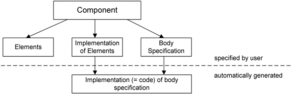

To make the principle of integer code generation more transparent a simple example is given here:

See also

[Example: Code Generation for an Addition](markdown/INT_Example__Code_Generation_for_an_Addition.md)

[Transformation of Data under Implementation](markdown/INT_Transformation_of_Data_under_Implementation.md)

[General Rules for the Implementation Transformation](markdown/INT_General_Rules_for_the_Implementation_Transformation.md)

---

## Example: Code Generation for an Addition

_Source: `markdown/INT_Example__Code_Generation_for_an_Addition.md`_

# Example: Code Generation for an Addition

Imagine the following simple example

c = a + b;

where a, b, and c are model variables of type continuous.

The implementation transformation is linear without an offset. The following quantizations are used: 0.01 for a, 0.04 for b and 0.05 for c. A, B, and C are the corresponding implementation variables for the elements in the generated C code.

When generating code for the above example, the quantizations must be taken into account. For the values a = 1, b = 0.6, and consequently c = 1.6, the result with the above quantizations would be A = 100, B = 15 and C =32. A direct transformation of the model to the implementation level would lead to a wrong result (A+B = 100 + 15 = 115 which is not equal to C = 32).

The reason is that the quantization is not taken into account. The above model equation must be transformed to the implementation transformation. Here the quantizations of A and B have to be adjusted before the addition takes place, and the result of this addition has to be adjusted to the quantization of C. This leads to the following piece of C code for the above model:

C = (A + 4 * B) / 5;

The multiplication of B by 4 corresponds to the adjustment of the quantization 0.04 to 0.01, and the division by 5 corresponds to the adjustment of the quantization of 0.01 to 0.05.

---

## Transformation of Data under Implementation

_Source: `markdown/INT_Transformation_of_Data_under_Implementation.md`_

# Transformation of Data under Implementation

The data stored with an element always contains the "model data", i.e. the physical values, but the implementation must also be reflected in the data. In the example, the physical (model) data for variable a was 1, the data for the implementation variable A however was 100.

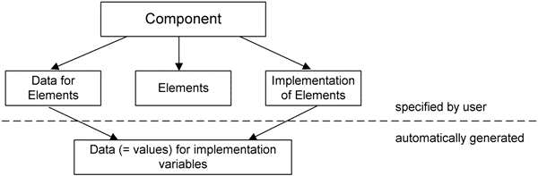

See also

[Overview - Code Generation with Implementations](markdown/INT_Overview_CodeGen_w_Implementations.md)

[Example: Code Generation for an Addition](markdown/INT_Example__Code_Generation_for_an_Addition.md)

[General Rules for the Implementation Transformation](markdown/INT_General_Rules_for_the_Implementation_Transformation.md)

---

## General Rules for the Implementation Transformation

_Source: `markdown/INT_General_Rules_for_the_Implementation_Transformation.md`_

# General Rules for the Implementation Transformation

The implementation transformation works on arithmetic values. The values are adjusted in all arithmetic expressions, so the corresponding arithmetic operations can be executed:

Addition and Subtraction

The arguments of these operations are adjusted to an quantization. This quantization is determined by the internal code generation algorithms and minimizes the number of re-quantizations. The constant offset is calculated for the result from the quantizations and the offset of the arguments.

Multiplication and Division

The arguments of these operations are first made offset free, before the multiplication or division can take place. The quantization must not be adapted, but is determined from the result of the multiplication or division. However, to avoid overflow or a loss in precision, the quantization of the arguments may be multiplied by a power of two (shift operations). This is also automatically determined by the internal code generation algorithm.

Comparison, Minimum and Maximum

Similarly to addition, the arguments are adjusted to each other (as well in quantization as in offset). The minimum and maximum operator work like the addition operator.

Assignment

The value that is assigned to a variable is re-quantized and the offset is corrected before assignment is performed. This also applies to argument passing.

See also

[Overview - Code Generation with Implementations](markdown/INT_Overview_CodeGen_w_Implementations.md)

[Example: Code Generation for an Addition](markdown/INT_Example__Code_Generation_for_an_Addition.md)

[Transformation of Data under Implementation](markdown/INT_Transformation_of_Data_under_Implementation.md)

---

## Licensing

_Source: `markdown/INT_Licensing.md`_

# Licensing

Products and Add-Ons of the ASCET Product family are subject to license management. In order to work with an ASCET product, after the installation, you need a license file for your computer. Without this file, ASCET products can be installed, but you cannot use them.

When you are using a server license, but need a local license (because, e.g. you want to use a notebook in a car), you can borrow the server license for a limited time. (You do not need to borrow the license as long as you are connected to the server.)

The license file can be obtained from ETAS.

The license is tied to user name and workstation. To obtain the information required for the creation of the license file, use the ETAS License Manager. In addition, the ETAS License Manager can be used to display the licensing status and to borrow a server license. For further information regarding license management, please utilize the License Manager online help.

See also

[Starting the ETAS License Manager](markdown/INT_Starting_the_ETAS_License_Manager.md)

---

## Reserved Keywords

_Source: `markdown/INT_Reserved_Keywords.md`_

# Reserved Keywords

Several keywords are reserved and cannot be used as element or component names. Other reserved keywords may cause problems when used as component names in a database.

Since upper and lower case are not distinguished, any spelling of the listed names is reserved.

| Column 1 | Column 2 | Column 3 | Column 4 | Column 5 | Column 6 | Column 7 | Column 8 | Column 9 | Column 10 | Column 11 | Column 12 | Column 13 | Column 14 | Column 15 | Column 16 | Column 17 | Column 18 | Column 19 | Column 20 | Column 21 | Column 22 | Column 23 | Column 24 | Column 25 |
| --- | --- | --- | --- | --- | --- | --- | --- | --- | --- | --- | --- | --- | --- | --- | --- | --- | --- | --- | --- | --- | --- | --- | --- | --- |
| A | B | C | D | E | F | G | H | I | J | K | L | M | N | O | P | Q | R | S | T | U | V | W | XYZ | special characters |

| Column 1 | Column 2 | Column 3 | Column 4 | Column 5 |
| --- | --- | --- | --- | --- |
| A | B | C | D | E |
| ACC_OP auto AUX | break | case char CLOCK$ COM1 COM2 COM3 COM4 COM5 COM6 COM7 COM8 COM9 CON Cond const continue | data default DF do double dT | else empty enum ES1130 ES1135 ES910 exit extern |
| F | G | H | I | J |
| false float for | get getAt goto | header | ident if implCast Inactive init int int16 interpolate |  |
| K | L | M | N | O |
|  | long LPT1 LPT2 LPT3 LPT4 LPT5 LPT6 LPT7 LPT8 LPT9 | main monitorProcess | Normal NUL NULL | output |
| P | Q | R | S | T |
| PPC PRN |  | real32 real64 receive Recycled register return RTPRO-PC | search self send set setAt short signed sint16 sint32 sint8 sint8s sizeof sm static struct switch | this true typedef |
| U | V | W | XYZ | special characters |
| uint16 uint32 uint8 undef undefined union unsigned | void volatile | while |  | # _ASCET_ _ETAS_ _* |

---

## ASCET Automation API

_Source: `markdown/INT_ASCETAutomationAPI.md`_

# ASCET Automation API

ASCET provides an automation API based on web services.

A MS Visual Studio 2008 solution containing some simple examples to get familiar with the automation API is provided on the ASCET installation disk in the ToolsAndUtilities\WebService\Studio 2008 Example folder.

For a detailed description, see the ASCET Automation API Web Service Reference. (The link opens the API description in a separate window.)

function parser(fn) { var X, Y, sl, a, ra, link; ra = /:/; a = location.href.search(ra); if (a == 2) X = 14; else X = 7; sl = "\\"; Y = location.href.lastIndexOf(sl) + 1; link = 'file:///' + location.href.substring(X, Y) + fn; location.href = link; }

---

## ASCET Links

_Source: `markdown/int_ascetlinks.md`_

link element &location=<location>, where

<location> = Browse or Outline or Navigation or Specification or Specific

context information can be one or more of the following:

- &implementation=<implementation name>
- &data=<data set name>
- &target=<target name>
- &generator=<code generator name>
- &project=<parent project DB/WS path and name>

If a [project](ProjectEditorEnglishUS.chm::/pe_project.htm) is specified that does not exist, the link shall execute with the default project. A warning is reported in the monitor window.

# ASCET Links

ASCET provides a possibility to open and select components or model elements via calls from external tools or scripts. Two examples for external tools are

- requirement management tools
- model documentation

You can address all ASCET components and many component parts, see [ASCET Links: Addressable Objects](markdown/INT_ASCETLinks_AddressableObjects.md) for an overview.

The calls use an URL-like syntax; they are referred to as ASCET links. ASCET links can be executed from inside ASCET (paste the link into the navigation bar) or from any external application that is able to invoke registered protocol handlers (e.g., Internet Explorer, Mozilla Firefox, and most E-mail clients).

If ASCET is not yet running when an ASCET link is executed, the most recently used ASCET version is started. Only one ASCET version should run when an ASCET link is executed.

Links that do not match the syntax described here produce an error message. This includes ASCET links generated with ASCET V6.2.*.

An ASCET link consists of up to three parts. It is built as follows:

ascet://[<destination>?]<component path>[/<target object>]

- <destination> is the database/workspace path of the component you want to address. It can be given in two ways:

- full path (e.g., D:\ETASData\ASCET6.4\Databases\MyDatabase; see also [example C](markdown/INT_ASCETLinks_Examples.md#AccessSpecificDB))
- path token

Either $DATABASE$ or $WORKSPACE$. Both tokens will be replaced by ASCET with the currently selected database or workspace root path (e.g., D:\ETASData\ASCET6.4\Database or D:\ETASData\ASCET6.4\Workspaces).

The actual resolved value depends on the settings in the [Paths](ComponentManagerEnglishUS.chm::/CM_PathsNode.htm) node of the ASCET options window.

The <destination> is optional. Without a destination, the database/workspace currently open in ASCET can be addressed (examples [E.2](markdown/INT_ASCETLinks_Examples.md#AccessMedthodArg) and [E.3](markdown/INT_ASCETLinks_Examples.md#AccessMethodReturn)).

- <component path> defines the component where all objects specified in <target options> will be found. <component path> is the component path in the database/workspace (e.g., ASCET_Tutorial_Solutions\Lesson5\SignalConv).

The <component path> path is mandatory.

- <target object> defines the model element or graphical object to be highlighted.

The <target object> is optional. Without a target object, only folders ([examples A](markdown/INT_ASCETLinks_Examples.md#AccessFolder)) and components ([example B](markdown/INT_ASCETLinks_Examples.md#AccessComponent)) can be addressed.

The target object may contain a [location](javascript:kadovTextPopup(this))<!-- kadovTextPopupInit('a1'); //--> (see, e.g., example [D.2](markdown/INT_ASCETLinks_Examples.md#AccessinBrowseView) or [H.4](markdown/INT_ASCETLinks_Examples.md#AccessinNavigation)) or [context information](javascript:kadovTextPopup(this))<!-- kadovTextPopupInit('a2'); //--> (see, e.g., examples [E](markdown/INT_ASCETLinks_Examples.md#AccessProjectContext) or [G.2](markdown/INT_ASCETLinks_Examples.md#AccessContext_t)).

ASCET links can be typed manually or created via the Create ASCET Links context menu option in the following places:

- 1 Database / 1 Workspace list and 3 Contents field in the component manager
- Outline tab in component and project editors
- Navigation tab in component and project editors (only for graphical hierarchies and statement blocks)
- Specification view and Browse view (except Layout tab) of component editors
- Graphics, Formulas and Impl. Types tabs in the project editor

When you open a component editor from the editor of a specific parent project, the project is included in the ASCET links created via the context menus.

The options in the [Integration](componentmanagerenglishus.chm::/cm_options_for_integration.htm) node of the ASCET options window determine the way ASCET links are created by the context menu:

- Include Data Storage determines whether the links are created with (activated) or without (deactivated) <destination>.
- Destination as token option in the [Integration](componentmanagerenglishus.chm::/cm_options_for_integration.htm) node of the ASCET options window determines whether a full path or a path token is generated for <destination>.

See also

[ASCET Links: Addressable Objects](markdown/INT_ASCETLinks_AddressableObjects.md)

[ASCET Links: Examples](markdown/INT_ASCETLinks_Examples.md)

[Component Manager - Path Options (Environment)](ComponentManagerEnglishUS.chm::/CM_PathsNode.htm)

[Component Manager - Integration Options](componentmanagerenglishus.chm::/cm_options_for_integration.htm)

/* Heikki Komulainen, Comet Computer GmbH 2004 */ cc_plus_pic = '&nbsp;'; cc_minus_pic = '&nbsp;'; cc_stat_pic = '&nbsp;'; gpstyle = ''; var iframes_created = 0; if (document.body && document.body.insertAdjacentHTML && document.getElementsByTagName && document.getElementById) { collect_popups(); set_poplinks_pictures(); if (iframes_created) { document.write(gpstyle); document.write('
<nobr><a id="einauslink" style="position:absolute;top:expression(document.body.scrollTop + this.offsetHeight - this.offsetHeight);left:expression(document.body.offsetWidth - (this.offsetWidth + 28));background:white;padding:5px" href="javascript:show_all_poptext()">Show all hidden text</a></nobr>
'); } } function collect_popups() { bsscpopups = new Array(); for (x = 0; x < document.links.length; x++) { if (document.links[x].href.indexOf("BSSCPopup")>-1) { seekmatch = /BSSCPopup.'[^'](markdown/+)'/; poplink = seekmatch.exec(document.links[x].href); poplink = "" + poplink; poplink = poplink.substring(poplink.indexOf("'")+1, poplink.lastIndexOf("'")); ifid = "CCGENIFRAMEID" + x; new_iframe = '<iframe id="' + ifid + '"src="' + poplink + '" onload="get_text(\'' + ifid + '\')" width="0" height="0" frameborder=0></iframe>'; document.links[x].parentNode.insertAdjacentHTML("afterEnd", new_iframe); gpid = "CCID_" + ifid; document.links[x].href = "javascript:expand_poptext('" + gpid + "')"; cc_plus = '' + cc_plus_pic + ''; document.links[x].insertAdjacentHTML("afterBegin", cc_plus); iframes_created = 1; } } }// end function function get_text(ifr_id) { frpars = document.frames[ifr_id].document.getElementsByTagName("body"); popbody = frpars[0].innerHTML; gpid = "CCID_" + ifr_id; if (!document.getElementById(gpid)) { //avoiding doubles document.getElementById(ifr_id).insertAdjacentHTML("afterEnd", '
'+popbody+'
'); } }//end function function expand_poptext(x_frame_id) { if (!document.getElementById(x_frame_id)) return; if (document.getElementById(x_frame_id).className == "CCGENPOPTEXTH") { document.getElementById(x_frame_id).className = "CCGENPOPTEXTV"; document.getElementById(x_frame_id).style.visibility = "visible"; if (document.getElementById("CCPMB_" + x_frame_id )) { document.getElementById("CCPMB_" + x_frame_id ).innerHTML = cc_minus_pic; } } else { document.getElementById(x_frame_id).className = "CCGENPOPTEXTH"; document.getElementById(x_frame_id).style.visibility = "hidden"; if (document.getElementById("CCPMB_" + x_frame_id )) { document.getElementById("CCPMB_" + x_frame_id ).innerHTML = cc_plus_pic; } } }// end function function show_all_poptext() { var pulldowntxt = document.getElementsByTagName("div"); for (b = 0; b < pulldowntxt.length; b++) { if (pulldowntxt[b].className == "droptext") { pulldowntxt[b].style.display=""; } } var gptxt = document.getElementsByTagName("div"); for (z = 0; z < gptxt.length; z++) { if (gptxt[z].className == "CCGENPOPTEXTH") { gptxt[z].className = "CCGENPOPTEXTV"; gptxt[z].style.visibility = "visible"; if (document.getElementById("CCPMB_" + gptxt[z].id )) { document.getElementById("CCPMB_" + gptxt[z].id ).innerHTML = cc_minus_pic; } } } var dxpoplinks = document.getElementsByTagName("a"); if (dxpoplinks) { for (pxl = 0; pxl < dxpoplinks.length; pxl++) { if (dxpoplinks[pxl].href.indexOf("kadovTextPopup")>-1) { if (document.getElementById("CCPMB_" + dxpoplinks[pxl].id)) { document.getElementById("CCPMB_" + dxpoplinks[pxl].id).innerHTML = cc_stat_pic; dxpoplinks[pxl].symbol = "minus"; } } } } document.getElementById('einauslink').innerText = 'Hide all hideable text'; document.getElementById('einauslink').href = "javascript:self.location.reload()"; self.focus(); }// end function function eat_click() { return false; }// end function function set_poplinks_pictures() { var dpoplinks = document.getElementsByTagName("a"); if (dpoplinks) { for (pl = 0; pl < dpoplinks.length; pl++) { if (dpoplinks[pl].href.indexOf("kadovTextPopup")>-1) { cc_plus = '' + cc_stat_pic + ''; //dpoplinks[pl].onmouseup = plusminuspoplink; dpoplinks[pl].insertAdjacentHTML("afterBegin", cc_plus); dpoplinks[pl].symbol = "plus"; } } } }// end function function plusminuspoplink() { if (document.getElementById("CCPMB_" + this.id)) { if (this.symbol == "plus") { document.getElementById("CCPMB_" + this.id).innerHTML = cc_minus_pic; this.symbol = "minus"; } else { document.getElementById("CCPMB_" + this.id).innerHTML = cc_plus_pic; this.symbol = "plus"; } } return true; }

---

## ASCET Links: Addressable Objects

_Source: `markdown/INT_ASCETLinks_AddressableObjects.md`_

- projects
- modules
- [AUTOSAR software components and interfaces](ComponentManagerEnglishUS.chm::/CM_AUTOSAR_Components.htm)
- classes (including state machines, Boolean tables, conditional tables)
- CT blocks
- records
- enumerations
- signals

- messages
- variables
- parameters
- constants and system constants
- arrays and matrices
- characteristic lines and maps
- resources
- complex elements (i.e. included components)
- AUTOSAR elements (inter-runnable variable, mode group, etc.)
- state machine elements (state, junction, transition, in-/output, condition, action)

- methods (including triggers, actions and conditions in state machines)
- method elements (argument, return value, method-local variable)
- processes
- process-local variables
- runnables and server runnables
- runnable-local variables, arguments of server runnables
- state machine triggers
- trigger inputs
- method signatures in ClientServer interfaces
- method signature elements (argument, return value)

- occurrences of model elements
- literals
- operators
- control-flow elements
- graphical hierarchies
- statement blocks
- sequence calls and connectors with sequence number > 0
- connection lines
- comments

The number of the graphical element is given in the status bar of the editor, provided Mouse Over Info is activated in the [Editors](ComponentManagerEnglishUS.chm::/cm_options_for_editors.htm) node of the ASCET options window.

# ASCET Links: Addressable Objects

The following objects can be addressed via ASCET links:

- folders
- [ASCET components](javascript:kadovTextPopup(this))<!-- kadovTextPopupInit('a1'); //-->
- [model elements](javascript:kadovTextPopup(this))<!-- kadovTextPopupInit('a2'); //-->
- [interface elements](javascript:kadovTextPopup(this))<!-- kadovTextPopupInit('a3'); //-->
- diagrams
- in block diagrams: [graphical objects](javascript:kadovTextPopup(this))<!-- kadovTextPopupInit('a4'); //-->

See also

[ASCET Links](markdown/int_ascetlinks.md)

/* Heikki Komulainen, Comet Computer GmbH 2004 */ cc_plus_pic = '&nbsp;'; cc_minus_pic = '&nbsp;'; cc_stat_pic = '&nbsp;'; gpstyle = ''; var iframes_created = 0; if (document.body && document.body.insertAdjacentHTML && document.getElementsByTagName && document.getElementById) { collect_popups(); set_poplinks_pictures(); if (iframes_created) { document.write(gpstyle); document.write('
<nobr><a id="einauslink" style="position:absolute;top:expression(document.body.scrollTop + this.offsetHeight - this.offsetHeight);left:expression(document.body.offsetWidth - (this.offsetWidth + 28));background:white;padding:5px" href="javascript:show_all_poptext()">Show all hidden text</a></nobr>
'); } } function collect_popups() { bsscpopups = new Array(); for (x = 0; x < document.links.length; x++) { if (document.links[x].href.indexOf("BSSCPopup")>-1) { seekmatch = /BSSCPopup.'[^'](markdown/+)'/; poplink = seekmatch.exec(document.links[x].href); poplink = "" + poplink; poplink = poplink.substring(poplink.indexOf("'")+1, poplink.lastIndexOf("'")); ifid = "CCGENIFRAMEID" + x; new_iframe = '<iframe id="' + ifid + '"src="' + poplink + '" onload="get_text(\'' + ifid + '\')" width="0" height="0" frameborder=0></iframe>'; document.links[x].parentNode.insertAdjacentHTML("afterEnd", new_iframe); gpid = "CCID_" + ifid; document.links[x].href = "javascript:expand_poptext('" + gpid + "')"; cc_plus = '' + cc_plus_pic + ''; document.links[x].insertAdjacentHTML("afterBegin", cc_plus); iframes_created = 1; } } }// end function function get_text(ifr_id) { frpars = document.frames[ifr_id].document.getElementsByTagName("body"); popbody = frpars[0].innerHTML; gpid = "CCID_" + ifr_id; if (!document.getElementById(gpid)) { //avoiding doubles document.getElementById(ifr_id).insertAdjacentHTML("afterEnd", '
'+popbody+'
'); } }//end function function expand_poptext(x_frame_id) { if (!document.getElementById(x_frame_id)) return; if (document.getElementById(x_frame_id).className == "CCGENPOPTEXTH") { document.getElementById(x_frame_id).className = "CCGENPOPTEXTV"; document.getElementById(x_frame_id).style.visibility = "visible"; if (document.getElementById("CCPMB_" + x_frame_id )) { document.getElementById("CCPMB_" + x_frame_id ).innerHTML = cc_minus_pic; } } else { document.getElementById(x_frame_id).className = "CCGENPOPTEXTH"; document.getElementById(x_frame_id).style.visibility = "hidden"; if (document.getElementById("CCPMB_" + x_frame_id )) { document.getElementById("CCPMB_" + x_frame_id ).innerHTML = cc_plus_pic; } } }// end function function show_all_poptext() { var pulldowntxt = document.getElementsByTagName("div"); for (b = 0; b < pulldowntxt.length; b++) { if (pulldowntxt[b].className == "droptext") { pulldowntxt[b].style.display=""; } } var gptxt = document.getElementsByTagName("div"); for (z = 0; z < gptxt.length; z++) { if (gptxt[z].className == "CCGENPOPTEXTH") { gptxt[z].className = "CCGENPOPTEXTV"; gptxt[z].style.visibility = "visible"; if (document.getElementById("CCPMB_" + gptxt[z].id )) { document.getElementById("CCPMB_" + gptxt[z].id ).innerHTML = cc_minus_pic; } } } var dxpoplinks = document.getElementsByTagName("a"); if (dxpoplinks) { for (pxl = 0; pxl < dxpoplinks.length; pxl++) { if (dxpoplinks[pxl].href.indexOf("kadovTextPopup")>-1) { if (document.getElementById("CCPMB_" + dxpoplinks[pxl].id)) { document.getElementById("CCPMB_" + dxpoplinks[pxl].id).innerHTML = cc_stat_pic; dxpoplinks[pxl].symbol = "minus"; } } } } document.getElementById('einauslink').innerText = 'Hide all hideable text'; document.getElementById('einauslink').href = "javascript:self.location.reload()"; self.focus(); }// end function function eat_click() { return false; }// end function function set_poplinks_pictures() { var dpoplinks = document.getElementsByTagName("a"); if (dpoplinks) { for (pl = 0; pl < dpoplinks.length; pl++) { if (dpoplinks[pl].href.indexOf("kadovTextPopup")>-1) { cc_plus = '' + cc_stat_pic + ''; //dpoplinks[pl].onmouseup = plusminuspoplink; dpoplinks[pl].insertAdjacentHTML("afterBegin", cc_plus); dpoplinks[pl].symbol = "plus"; } } } }// end function function plusminuspoplink() { if (document.getElementById("CCPMB_" + this.id)) { if (this.symbol == "plus") { document.getElementById("CCPMB_" + this.id).innerHTML = cc_minus_pic; this.symbol = "minus"; } else { document.getElementById("CCPMB_" + this.id).innerHTML = cc_plus_pic; this.symbol = "plus"; } } return true; }

---

## ASCET Links: Examples

_Source: `markdown/INT_ASCETLinks_Examples.md`_

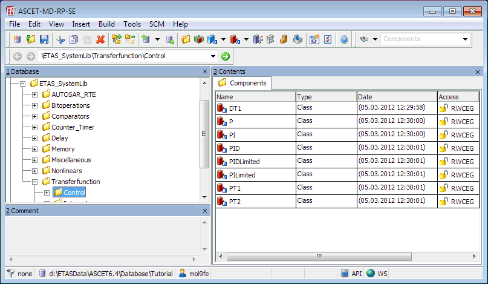

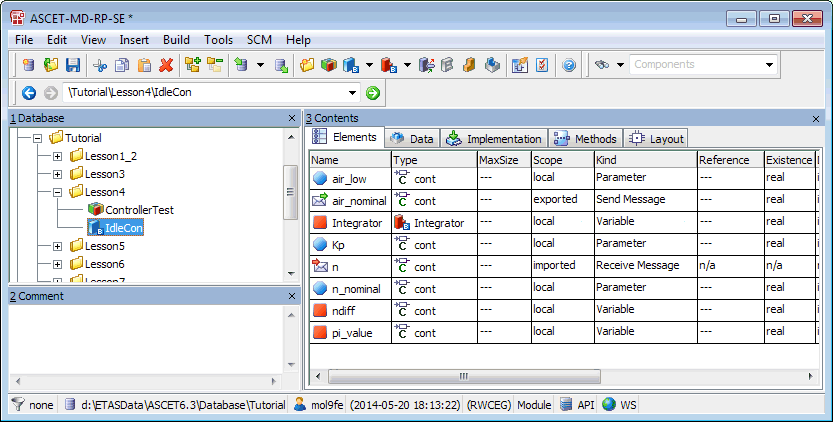

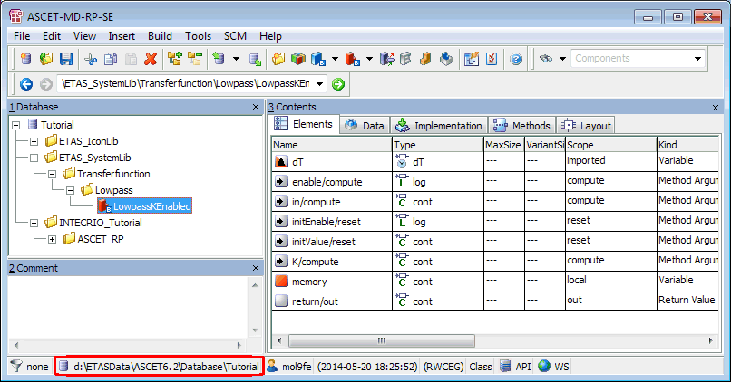

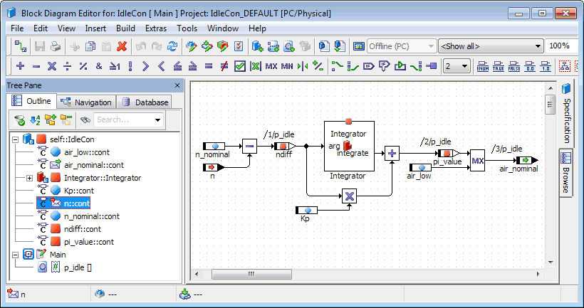

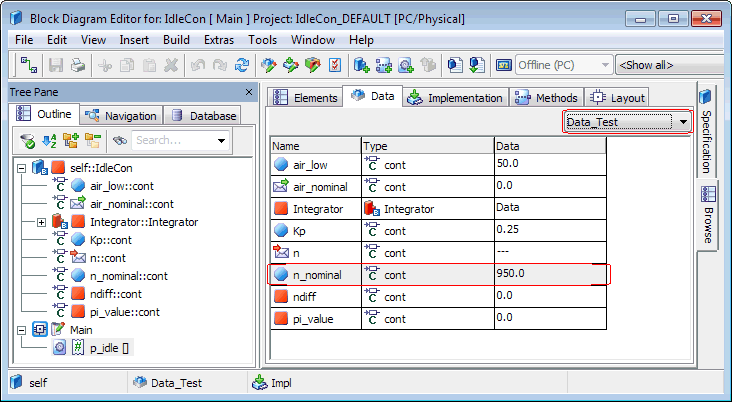

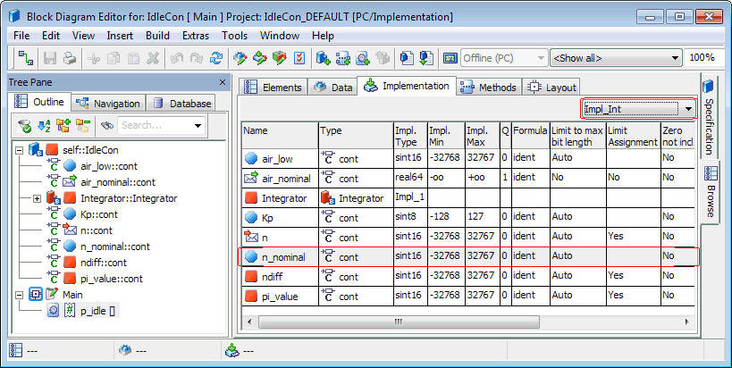

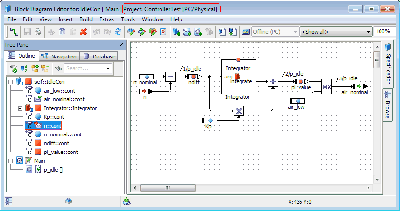

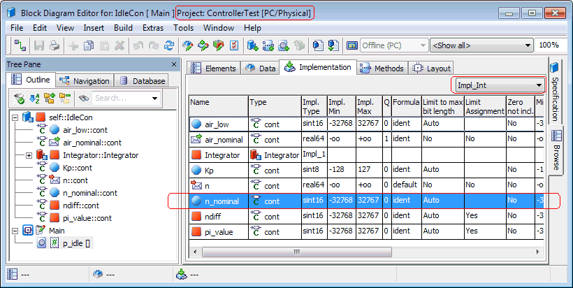

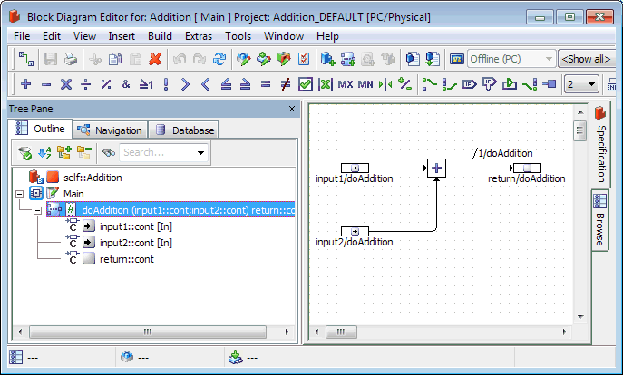

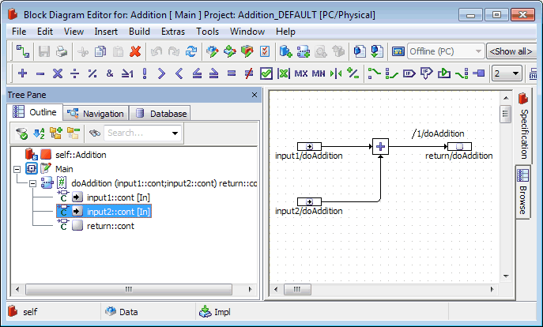

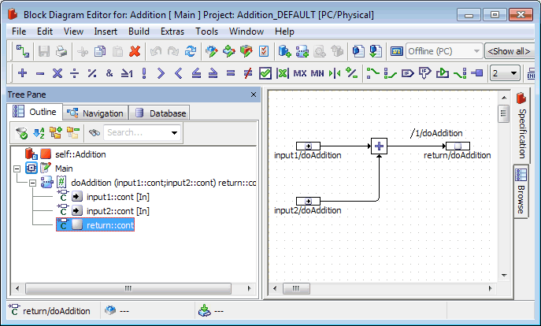

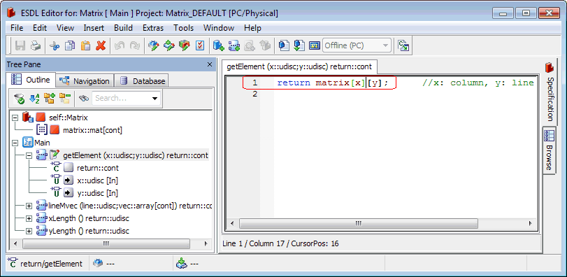

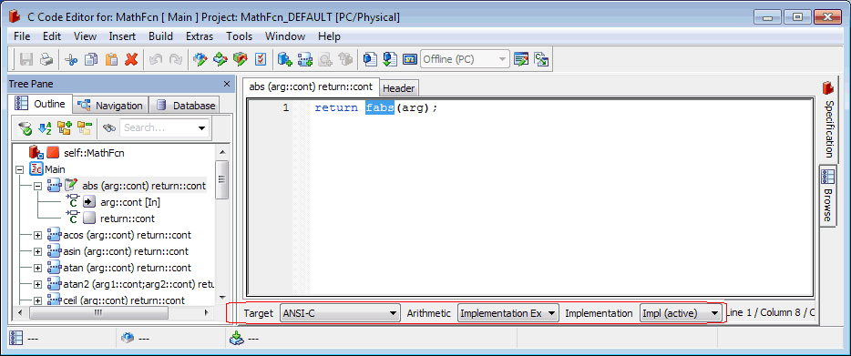

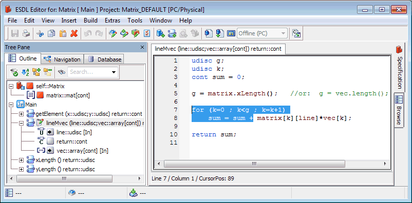

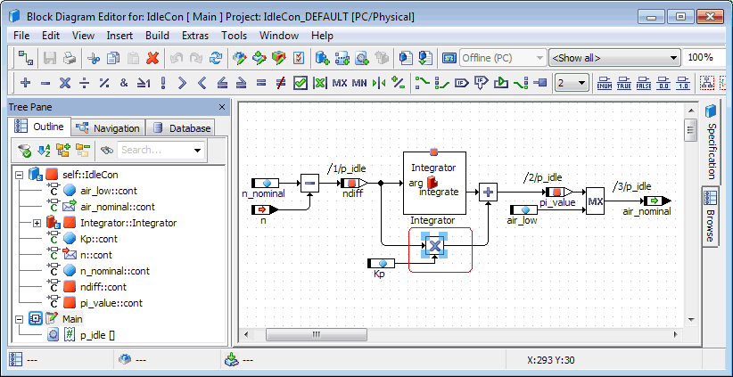

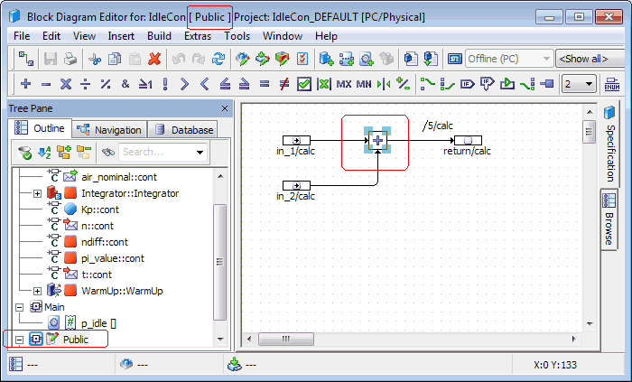

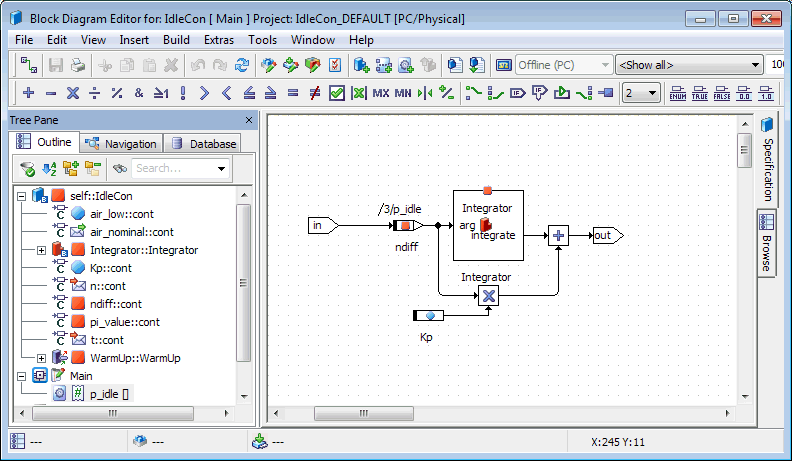

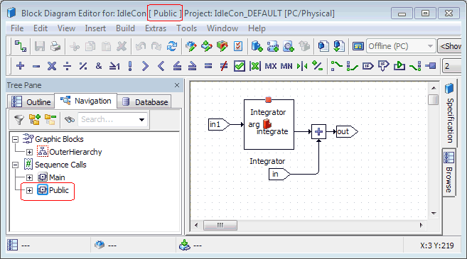

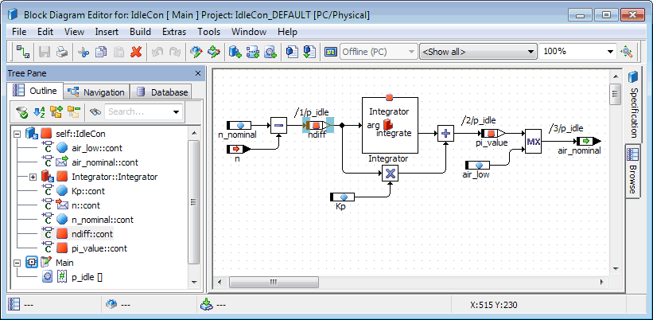

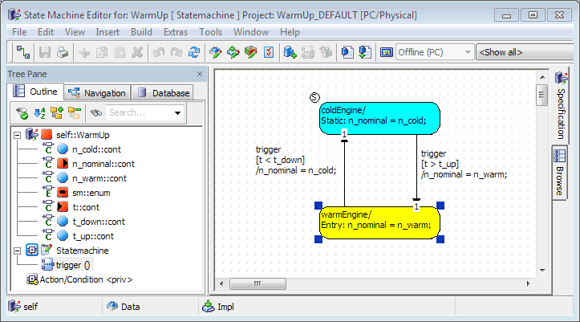

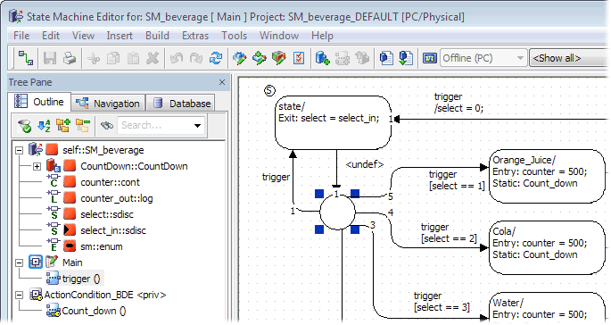

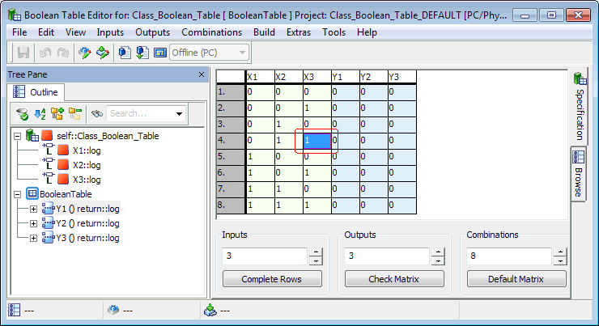

# ASCET Links: Examples

This topic contains examples for ASCET links used for the following tasks:

1. [Accessing a folder](#AccessFolder)
1. [Accessing a component](#AccessComponent)
1. [Accessing a component in a specific database/workspace](#AccessSpecificDB)
1. [Accessing an element (no particular project context)](#AccessElement)
1. [Accessing an element in the context of a particular project](#AccessProjectContext)
1. [Accessing a method and its local elements](#AccessMethod)
1. [Accessing code parts in an ESDL or C code component](#AccessCode)
1. [Accessing graphical objects in a block diagram](#AccessGraphicObjects)
1. [Accessing states and junctions in a state machine](#AccessSM)
1. [Accessing cells in Boolean and conditional tables](#AccessTabCells)

##### A. Accessing a folder

1. In the Tutorial database, select the folder Control in the folder ETAS_SystemLib/Transferfunction:

1. ascet://$DATABASE$/Tutorial?ETAS_SystemLib/Transferfunction/Control
1. ascet://d:/ETASData/ASCET6.4/Database/Tutorial?ETAS_SystemLib/Transferfunction/Control

[Result](javascript:kadovTextPopup(this))<!-- kadovTextPopupInit('a17'); //-->

##### B. Accessing a component

1. Select the module IdleCon in the folder Tutorial/Lesson4:

##### C. Accessing a component in a specific database/workspace

1. Select the class LowpassKEnabled in the folder ETAS_SystemLib/Transferfunction/Lowpass. Use the database stored in d:\ETASData\ASCET6.2\Database\Tutorial.

##### D. Accessing an element (no particular project context)

1. Select the message n in the Outline tab of the component editor for the module IdleCon:
1. Select the parameter n_nominal in the Browse view, Data tab, of the component editor for IdleCon. Use the data set Data_Test.
1. Select the parameter n_nominal in the Browse view, Implementation tab, of the component editor for IdleCon. Use the implementation set Impl_Int.

ascet://Tutorial/Lesson4/IdleCon/implementation=Impl_Int/element=n_nominal&location="Browse"

[Result](javascript:kadovTextPopup(this))<!-- kadovTextPopupInit('a32'); //-->

##### E. Accessing an element in the context of a particular project

1. Select the message n in the Outline tab of the component editor for the module IdleCon, in the context of the parent project ControllerTest:
1. Select the parameter n_nominal in the Browse view, Implementation tab, of the component editor for IdleCon. Use the implementation set Impl_Int and the context of the parent project ControllerTest:

ascet://Tutorial/Lesson4/IdleCon/implementation=Impl_Int/element=n_nominal&location="Browse"&project=Tutorial/Lesson4/ControllerTest

[Result](javascript:kadovTextPopup(this))<!-- kadovTextPopupInit('a6'); //-->

##### F. Accessing a method and its local elements

1. Select the method doAddition in the class Addition:
1. Select the argument input2 in the method doAddition. Use the database already open in ASCET.
1. Select the return value of the method doAddition. Use the database already open in ASCET.

##### G. Accessing code parts in an ESDL or C code component

1. Set the cursor to a specific position in the code of the getElement method in the class Matrix.
1. Select a piece of code from the abs method in the class MathFcn, for the ANSI-C target, Implementation Experiment arithmetic, and Impl implementation.
1. Select a piece of code from lines 7-8 of the lineMvec method in the class Matrix.

ascet://Classes/Matrix/diagram=Main/signature=lineMvec/start=7@1/end=8@16

[Result](javascript:kadovTextPopup(this))<!-- kadovTextPopupInit('a15'); //-->

##### H. Accessing graphical objects and sequence calls in a block diagram

1. Select an operator in the block diagram of IdleCon. Use the first diagram.
1. Select an operator in the diagram Public of IdleCon.
1. Open the graphical hierarchy in the first diagram of IdleCon.
1. Open the second-level hierarchy InnerHierarchy in the diagram Public of IdleCon. In addition, open the Navigation pane.
1. Select the first sequence call of the process p_idle in the first diagram of IdleCon.

ascet://Tutorial/Lesson4/IdleCon/diagram=Main/signature=p_idle/call=1

[Result](javascript:kadovTextPopup(this))<!-- kadovTextPopupInit('a30'); //-->

##### I. Accessing states and junctions in a state machine

1. Select the lower state in the state machine WarmUp.
1. Select a junction in the state machine SM_beverage.

##### J. Accessing cells in Boolean and conditional tables

1. Select the cell in the third column, fourth row, of the Boolean table Class_Boolean_Table.
1. Select the top-left cell in the conditional table Class_Conditional_Table.

The column with the row numbers is counted as x=1.

ascet://$DATABASE$/Tutorial?tables/Conditional/Class_Conditional_Table/x=2/y=1

[Result](javascript:kadovTextPopup(this))<!-- kadovTextPopupInit('a29'); //-->

/* Heikki Komulainen, Comet Computer GmbH 2004 */ cc_plus_pic = '&nbsp;'; cc_minus_pic = '&nbsp;'; cc_stat_pic = '&nbsp;'; gpstyle = ''; var iframes_created = 0; if (document.body && document.body.insertAdjacentHTML && document.getElementsByTagName && document.getElementById) { collect_popups(); set_poplinks_pictures(); if (iframes_created) { document.write(gpstyle); document.write('
<nobr><a id="einauslink" style="position:absolute;top:expression(document.body.scrollTop + this.offsetHeight - this.offsetHeight);left:expression(document.body.offsetWidth - (this.offsetWidth + 28));background:white;padding:5px" href="javascript:show_all_poptext()">Show all hidden text</a></nobr>
'); } } function collect_popups() { bsscpopups = new Array(); for (x = 0; x < document.links.length; x++) { if (document.links[x].href.indexOf("BSSCPopup")>-1) { seekmatch = /BSSCPopup.'[^'](markdown/+)'/; poplink = seekmatch.exec(document.links[x].href); poplink = "" + poplink; poplink = poplink.substring(poplink.indexOf("'")+1, poplink.lastIndexOf("'")); ifid = "CCGENIFRAMEID" + x; new_iframe = '<iframe id="' + ifid + '"src="' + poplink + '" onload="get_text(\'' + ifid + '\')" width="0" height="0" frameborder=0></iframe>'; document.links[x].parentNode.insertAdjacentHTML("afterEnd", new_iframe); gpid = "CCID_" + ifid; document.links[x].href = "javascript:expand_poptext('" + gpid + "')"; cc_plus = '' + cc_plus_pic + ''; document.links[x].insertAdjacentHTML("afterBegin", cc_plus); iframes_created = 1; } } }// end function function get_text(ifr_id) { frpars = document.frames[ifr_id].document.getElementsByTagName("body"); popbody = frpars[0].innerHTML; gpid = "CCID_" + ifr_id; if (!document.getElementById(gpid)) { //avoiding doubles document.getElementById(ifr_id).insertAdjacentHTML("afterEnd", '
'+popbody+'
'); } }//end function function expand_poptext(x_frame_id) { if (!document.getElementById(x_frame_id)) return; if (document.getElementById(x_frame_id).className == "CCGENPOPTEXTH") { document.getElementById(x_frame_id).className = "CCGENPOPTEXTV"; document.getElementById(x_frame_id).style.visibility = "visible"; if (document.getElementById("CCPMB_" + x_frame_id )) { document.getElementById("CCPMB_" + x_frame_id ).innerHTML = cc_minus_pic; } } else { document.getElementById(x_frame_id).className = "CCGENPOPTEXTH"; document.getElementById(x_frame_id).style.visibility = "hidden"; if (document.getElementById("CCPMB_" + x_frame_id )) { document.getElementById("CCPMB_" + x_frame_id ).innerHTML = cc_plus_pic; } } }// end function function show_all_poptext() { var pulldowntxt = document.getElementsByTagName("div"); for (b = 0; b < pulldowntxt.length; b++) { if (pulldowntxt[b].className == "droptext") { pulldowntxt[b].style.display=""; } } var gptxt = document.getElementsByTagName("div"); for (z = 0; z < gptxt.length; z++) { if (gptxt[z].className == "CCGENPOPTEXTH") { gptxt[z].className = "CCGENPOPTEXTV"; gptxt[z].style.visibility = "visible"; if (document.getElementById("CCPMB_" + gptxt[z].id )) { document.getElementById("CCPMB_" + gptxt[z].id ).innerHTML = cc_minus_pic; } } } var dxpoplinks = document.getElementsByTagName("a"); if (dxpoplinks) { for (pxl = 0; pxl < dxpoplinks.length; pxl++) { if (dxpoplinks[pxl].href.indexOf("kadovTextPopup")>-1) { if (document.getElementById("CCPMB_" + dxpoplinks[pxl].id)) { document.getElementById("CCPMB_" + dxpoplinks[pxl].id).innerHTML = cc_stat_pic; dxpoplinks[pxl].symbol = "minus"; } } } } document.getElementById('einauslink').innerText = 'Hide all hideable text'; document.getElementById('einauslink').href = "javascript:self.location.reload()"; self.focus(); }// end function function eat_click() { return false; }// end function function set_poplinks_pictures() { var dpoplinks = document.getElementsByTagName("a"); if (dpoplinks) { for (pl = 0; pl < dpoplinks.length; pl++) { if (dpoplinks[pl].href.indexOf("kadovTextPopup")>-1) { cc_plus = '' + cc_stat_pic + ''; //dpoplinks[pl].onmouseup = plusminuspoplink; dpoplinks[pl].insertAdjacentHTML("afterBegin", cc_plus); dpoplinks[pl].symbol = "plus"; } } } }// end function function plusminuspoplink() { if (document.getElementById("CCPMB_" + this.id)) { if (this.symbol == "plus") { document.getElementById("CCPMB_" + this.id).innerHTML = cc_minus_pic; this.symbol = "minus"; } else { document.getElementById("CCPMB_" + this.id).innerHTML = cc_plus_pic; this.symbol = "plus"; } } return true; }

---

## Launching ASCET

_Source: `markdown/INT_Launching_ASCET.md`_

# Launching ASCET

To launch ASCET, proceed as follows:

1. By default, the ASCET installation creates an icon on your desktop. Double-click this icon to launch the program.
1. Alternatively, you can launch ASCET via Programs in the Windows Start menu.

The Component Manager opens. The database/workspace that was last used is loaded, even if it was closed manually before ASCET was shut down.

[Component Manager - Description of the Window Elements](ComponentManagerEnglishUS.chm::/CM_DescriptionWindowElement.htm) contains a detailed description of the user interface of the Component Manager, which is the ASCET start window.

You can [determine software behavior](ComponentManagerEnglishUS.chm::/SettingASCET.htm) individually. You can specify default paths, set [different colors](ComponentManagerEnglishUS.chm::/cm_specify_colors.htm) and [fonts](ComponentManagerEnglishUS.chm::/SetFontOption.htm), make specifications for the [import](ComponentManagerEnglishUS.chm::/ImportOptions.htm) and [export](ComponentManagerEnglishUS.chm::/ExportOption.htm) of data and lots more in ASCET.

It is not allowed to change the graphic mode of the PC or notebook while ASCET is running.

---

## Starting the ETAS License Manager

_Source: `markdown/INT_Starting_the_ETAS_License_Manager.md`_

# Starting ETAS License Manager

To start the ETAS License Manager:

1. In the Help menu of the Component Manager, select License Info.

Or

1. In the Windows start menu, select Programs - ETAS - License Management - ETAS License Manager.

The ETAS License Manager opens. For further information regarding license management, please utilize the License Manager online help.

See also

[Licensing](markdown/INT_Licensing.md)

---

## Configuring a Toolbar

_Source: `markdown/INT_Configuring_Toolbar.md`_

<table style="x-cell-content-align: Top;
				margin-top: 3px;
				border-left-style: Outset;
				border-top-style: Outset;
				border-right-style: Outset;
				border-bottom-style: Outset;
				border-left-width: 1px;
				border-right-width: 1px;
				border-top-width: 1px;
				border-bottom-width: 1px;
				margin-left: 0.868cm;" x-use-null-cells="">
<col/>
<col/>
<col/>
<col/>
<tr class="hcp1" valign="top">
<td class="hcp2">

 
</td>
<td class="hcp2" colspan="3" rowspan="1">

Toolbar
</td>
</tr>
<tr class="hcp1" valign="top">
<td class="hcp2">

 
</td>
<td class="hcp2">

General
</td>
<td class="hcp2">

Elements
</td>
<td class="hcp2">

Basic Blocks
</td></tr>
<tr class="hcp1" valign="top">
<td class="hcp2" colspan="1" rowspan="1">

Component Manager

</td>
<td class="hcp2" colspan="1" rowspan="1">

x
</td>
<td class="hcp2" colspan="1" rowspan="1">

 
</td>
<td class="hcp2" colspan="1" rowspan="1">

 
</td></tr>
<tr class="hcp1" valign="top">
<td class="hcp2">

Block Diagram Editor
</td>
<td class="hcp2">

x
</td>
<td class="hcp2">

x
</td>
<td class="hcp2">

x
</td></tr>
<tr class="hcp1" valign="top">
<td class="hcp2" colspan="1" rowspan="1">

State Machine Editor
</td>
<td class="hcp2" colspan="1" rowspan="1">

x
</td>
<td class="hcp2" colspan="1" rowspan="1">

x
</td>
<td class="hcp2" colspan="1" rowspan="1">

x
</td></tr>
<tr class="hcp1" valign="top">
<td class="hcp2">

C Code Editor
</td>
<td class="hcp2">

x
</td>
<td class="hcp2">

x
</td>
<td class="hcp2">

 
</td></tr>
<tr class="hcp1" valign="top">
<td class="hcp2">

ESDL Editor
</td>
<td class="hcp2">

x
</td>
<td class="hcp2">

x
</td>
<td class="hcp2">

 
</td></tr>
<tr class="hcp1" valign="top">
<td class="hcp2" colspan="1" rowspan="1">

ESDL Editor (CT blocks)
</td>
<td class="hcp2" colspan="1" rowspan="1">

x
</td>
<td class="hcp2" colspan="1" rowspan="1">

x
</td>
<td class="hcp2" colspan="1" rowspan="1">

 
</td></tr>
<tr class="hcp1" valign="top">
<td class="hcp2" colspan="1" rowspan="1">

C Code Editor (CT blocks)
</td>
<td class="hcp2" colspan="1" rowspan="1">

x
</td>
<td class="hcp2" colspan="1" rowspan="1">

x
</td>
<td class="hcp2" colspan="1" rowspan="1">

 
</td></tr>
<tr class="hcp1" valign="top">
<td class="hcp2" colspan="1" rowspan="1">

Block Diagram Editor (CT blocks)
</td>
<td class="hcp2" colspan="1" rowspan="1">

x
</td>
<td class="hcp2" colspan="1" rowspan="1">

x
</td>
<td class="hcp2" colspan="1" rowspan="1">

x
</td></tr>
<tr class="hcp1" valign="top">
<td class="hcp2">

Conditional Table Editor
</td>
<td class="hcp2">

x
</td>
<td class="hcp2">

x
</td>
<td class="hcp2">

 
</td></tr>
<tr class="hcp1" valign="top">
<td class="hcp2">

Boolean Table Editor
</td>
<td class="hcp2">

x
</td>
<td class="hcp2">

 
</td>
<td class="hcp2">

 
</td></tr>
<tr class="hcp1" valign="top">
<td class="hcp2">

Project Editor
</td>
<td class="hcp2">

x
</td>
<td class="hcp2">

x
</td>
<td class="hcp2">

x
</td></tr>
<tr class="hcp1" valign="top">
<td class="hcp2">

Software Component Editor
</td>
<td class="hcp2">

x
</td>
<td class="hcp2">

x
</td>
<td class="hcp2">

x
</td></tr>
<tr class="hcp1" valign="top">
<td class="hcp2" colspan="1" rowspan="1">

Record Editor
</td>
<td class="hcp2" colspan="1" rowspan="1">

x
</td>
<td class="hcp2" colspan="1" rowspan="1">

x
</td>
<td class="hcp2" colspan="1" rowspan="1">

 
</td></tr>
<tr class="hcp1" valign="top">
<td class="hcp2">

AUTOSAR Interface Editors
</td>
<td class="hcp2">

x
</td>
<td class="hcp2">

(x)
</td>
<td class="hcp2">

 
</td></tr>
</table>

# Configuring a Toolbar

The toolbars of component editors and the component manager can be configured. To do so, proceed as follows.

1. In the component editor, open the View menu, point to Configure, and select Toolbar <name>.

Possible values for <name> are General, Elements, and Basic Blocks. The [actual selection](javascript:kadovTextPopup(this))<!-- kadovTextPopupInit('a1'); //--> depends on the window you are currently using.

The [Toolbar Configuration](markdown/INT_Toolbar_Configuration_Window.md) window opens. The Visible list shows the buttons currently in the toolbar, the Available list shows the buttons that can be added.

1. In the Available list of the Toolbar Configuration window, select the button(s) you want to add to the toolbar.
1. In the Visible list, select a button before which the new ones shall be inserted.

If you select no button, the new button(s) will be inserted at the end of the Visible list

1. Click on the  button to add the selected button(s) to the toolbar.

The buttons appear now in the Visible list.

1. Click on the  or  button to move selected button(s) up or down the Visible list.
1. In the Visible list of the Toolbar Configuration window, select the button(s) you want to remove from the toolbar.
1. Click on the  button to remove the selected button(s) from the toolbar.

The buttons appear now in the Available list.

1. Click OK to close the Toolbar Configuration window.

Your changes are visible in the toolbar.

To revoke your changes, open the View menu, point to Configure, and select Reset Toolbar Configuration.

Reset Toolbar Configuration revokes all configuration changes in every toolbar. To revoke changes in individual toolbars, use the Toolbar Configuration window.

See also

[Toolbar Configuration Window](markdown/INT_Toolbar_Configuration_Window.md)

/* Heikki Komulainen, Comet Computer GmbH 2004 */ cc_plus_pic = '&nbsp;'; cc_minus_pic = '&nbsp;'; cc_stat_pic = '&nbsp;'; gpstyle = ''; var iframes_created = 0; if (document.body && document.body.insertAdjacentHTML && document.getElementsByTagName && document.getElementById) { collect_popups(); set_poplinks_pictures(); if (iframes_created) { document.write(gpstyle); document.write('
<nobr><a id="einauslink" style="position:absolute;top:expression(document.body.scrollTop + this.offsetHeight - this.offsetHeight);left:expression(document.body.offsetWidth - (this.offsetWidth + 28));background:white;padding:5px" href="javascript:show_all_poptext()">Alle texte einblenden</a></nobr>
'); } } function collect_popups() { bsscpopups = new Array(); for (x = 0; x < document.links.length; x++) { if (document.links[x].href.indexOf("BSSCPopup")>-1) { seekmatch = /BSSCPopup.'[^'](markdown/+)'/; poplink = seekmatch.exec(document.links[x].href); poplink = "" + poplink; poplink = poplink.substring(poplink.indexOf("'")+1, poplink.lastIndexOf("'")); ifid = "CCGENIFRAMEID" + x; new_iframe = '<iframe id="' + ifid + '"src="' + poplink + '" onload="get_text(\'' + ifid + '\')" width="0" height="0" frameborder=0></iframe>'; document.links[x].parentNode.insertAdjacentHTML("afterEnd", new_iframe); gpid = "CCID_" + ifid; document.links[x].href = "javascript:expand_poptext('" + gpid + "')"; cc_plus = '' + cc_plus_pic + ''; document.links[x].insertAdjacentHTML("afterBegin", cc_plus); iframes_created = 1; } } }// end function function get_text(ifr_id) { frpars = document.frames[ifr_id].document.getElementsByTagName("body"); popbody = frpars[0].innerHTML; gpid = "CCID_" + ifr_id; if (!document.getElementById(gpid)) { //avoiding doubles document.getElementById(ifr_id).insertAdjacentHTML("afterEnd", '
'+popbody+'
'); } }//end function function expand_poptext(x_frame_id) { if (!document.getElementById(x_frame_id)) return; if (document.getElementById(x_frame_id).className == "CCGENPOPTEXTH") { document.getElementById(x_frame_id).className = "CCGENPOPTEXTV"; document.getElementById(x_frame_id).style.visibility = "visible"; if (document.getElementById("CCPMB_" + x_frame_id )) { document.getElementById("CCPMB_" + x_frame_id ).innerHTML = cc_minus_pic; } } else { document.getElementById(x_frame_id).className = "CCGENPOPTEXTH"; document.getElementById(x_frame_id).style.visibility = "hidden"; if (document.getElementById("CCPMB_" + x_frame_id )) { document.getElementById("CCPMB_" + x_frame_id ).innerHTML = cc_plus_pic; } } }// end function function show_all_poptext() { var pulldowntxt = document.getElementsByTagName("div"); for (b = 0; b < pulldowntxt.length; b++) { if (pulldowntxt[b].className == "droptext") { pulldowntxt[b].style.display=""; } } var gptxt = document.getElementsByTagName("div"); for (z = 0; z < gptxt.length; z++) { if (gptxt[z].className == "CCGENPOPTEXTH") { gptxt[z].className = "CCGENPOPTEXTV"; gptxt[z].style.visibility = "visible"; if (document.getElementById("CCPMB_" + gptxt[z].id )) { document.getElementById("CCPMB_" + gptxt[z].id ).innerHTML = cc_minus_pic; } } } var dxpoplinks = document.getElementsByTagName("a"); if (dxpoplinks) { for (pxl = 0; pxl < dxpoplinks.length; pxl++) { if (dxpoplinks[pxl].href.indexOf("kadovTextPopup")>-1) { if (document.getElementById("CCPMB_" + dxpoplinks[pxl].id)) { document.getElementById("CCPMB_" + dxpoplinks[pxl].id).innerHTML = cc_stat_pic; dxpoplinks[pxl].symbol = "minus"; } } } } document.getElementById('einauslink').innerText = 'Alle texte ausblenden'; document.getElementById('einauslink').href = "javascript:self.location.reload()"; self.focus(); }// end function function eat_click() { return false; }// end function function set_poplinks_pictures() { var dpoplinks = document.getElementsByTagName("a"); if (dpoplinks) { for (pl = 0; pl < dpoplinks.length; pl++) { if (dpoplinks[pl].href.indexOf("kadovTextPopup")>-1) { cc_plus = '' + cc_stat_pic + ''; //dpoplinks[pl].onmouseup = plusminuspoplink; dpoplinks[pl].insertAdjacentHTML("afterBegin", cc_plus); dpoplinks[pl].symbol = "plus"; } } } }// end function function plusminuspoplink() { if (document.getElementById("CCPMB_" + this.id)) { if (this.symbol == "plus") { document.getElementById("CCPMB_" + this.id).innerHTML = cc_minus_pic; this.symbol = "minus"; } else { document.getElementById("CCPMB_" + this.id).innerHTML = cc_plus_pic; this.symbol = "plus"; } } return true; }

---

## Copying Elements in the Outline Tab

_Source: `markdown/int_copyingelements_outlinetab.md`_

# Copying Elements in the Outline Tab

You can copy and paste elements in the Outline tab of a component editor. Proceed as follows.

1. In the Outline tab, select one or more elements.
1. Do one of the following to copy the element(s) to the clipboard.
1. Do one of the following to insert the element(s) from the clipboard into the component.

If an element with the same name already exists, a counter (_n) is added to the name of the pasted element.

Only the implementation/dataset attributes of the currently selected implementation/dataset are copied. The attributes of the other implementations/datasets are not copied. See also the [example](markdown/INT_Example_CopyElementsOutlineTab.md).

See also

[Block Diagram Editor - Basic Elements](BlockDiagramEditorEnglishUS.chm::/bde_overview_-_basic_elements.htm)

[Example: Copying Elements in the Outline Tab](markdown/INT_Example_CopyElementsOutlineTab.md)

---

## Example: Copying Elements in the Outline Tab

_Source: `markdown/INT_Example_CopyElementsOutlineTab.md`_

# Example: Copying Elements in the Outline Tab

Given: a component IdleCon with the two data sets shown below.

 

The default data set Data is selected. In the Outline tab of the component editor, the elements Integrator and n_nominal are selected and copied/pasted as described in [Copying Elements in the Outline Tab](markdown/int_copyingelements_outlinetab.md).

In the Data data set, the copied elements (*_1) have the same data as the originals elements.

In the Data_1 data set - which was not selected when the elements were copied -, the copied elements (*_1) and the original elements have different data.

---

## Searching the Tree Pane

_Source: `markdown/INT_SearchTreePane.md`_

1. Enter a new search string, or select a previous one, in the search input field of the Tree pane tab.
1. In Simple or Wildcard Mode, press Enter to search for the first matching element.

In Type-Ahead Mode, each keystroke in the search input field performs the search.

1. Press Enter to search for the next matching element.

1. Click on the // search button.
1. In the Search in Tree window, Search Mode area, select the mode you want to use.
1. If desired, activate Start Search from Root Node.
1. Enter a new search string, or select a previous one, in the input field.
1. Click on Search to find the next matching element.
1. When you have found the desired element, close the Search in Tree window.

1. Activate the option Remember my Decision if you want to give the same answer to all questions of this type.

In that case, the Expand Tree Pane for Search window no longer opens. You can revoke this setting in the ASCET options window, [Confirmation Dialogs](ComponentManagerEnglishUS.chm::/CM_Options_for_Confirmation_Dialogs.htm) node.

1. Press Yes to repeat the search in the fully expanded tree.

# Searching the Tree Pane

You can search the tabs in the Tree pane of a component editor. Proceed as follows.

1. Go to the tab you want to search.
1. To use the current search mode, [do the following](javascript:kadovTextPopup(this))<!-- kadovTextPopupInit('a1'); //-->.
1. To select and use another search mode, [do the following](javascript:kadovTextPopup(this))<!-- kadovTextPopupInit('a2'); //-->.
1. Proceed [as follows](javascript:kadovTextPopup(this))<!-- kadovTextPopupInit('a3'); //-->.

1. See also

[Search in Tree Window](markdown/INT_SearchTreeWindow.md)

[Example: Searching the Outline Tab in Type-Ahead Mode](markdown/INT_Example_SearchOutline_TypeAhead.md)

[Confirmation Dialog Options](ComponentManagerEnglishUS.chm::/CM_Options_for_Confirmation_Dialogs.htm)

/* Heikki Komulainen, Comet Computer GmbH 2004 */ cc_plus_pic = '&nbsp;'; cc_minus_pic = '&nbsp;'; cc_stat_pic = '&nbsp;'; gpstyle = ''; var iframes_created = 0; if (document.body && document.body.insertAdjacentHTML && document.getElementsByTagName && document.getElementById) { collect_popups(); set_poplinks_pictures(); if (iframes_created) { document.write(gpstyle); document.write('
<nobr><a id="einauslink" style="position:absolute;top:expression(document.body.scrollTop + this.offsetHeight - this.offsetHeight);left:expression(document.body.offsetWidth - (this.offsetWidth + 28));background:white;padding:5px" href="javascript:show_all_poptext()">Show all hidden text</a></nobr>
'); } } function collect_popups() { bsscpopups = new Array(); for (x = 0; x < document.links.length; x++) { if (document.links[x].href.indexOf("BSSCPopup")>-1) { seekmatch = /BSSCPopup.'[^'](markdown/+)'/; poplink = seekmatch.exec(document.links[x].href); poplink = "" + poplink; poplink = poplink.substring(poplink.indexOf("'")+1, poplink.lastIndexOf("'")); ifid = "CCGENIFRAMEID" + x; new_iframe = '<iframe id="' + ifid + '"src="' + poplink + '" onload="get_text(\'' + ifid + '\')" width="0" height="0" frameborder=0></iframe>'; document.links[x].parentNode.insertAdjacentHTML("afterEnd", new_iframe); gpid = "CCID_" + ifid; document.links[x].href = "javascript:expand_poptext('" + gpid + "')"; cc_plus = '' + cc_plus_pic + ''; document.links[x].insertAdjacentHTML("afterBegin", cc_plus); iframes_created = 1; } } }// end function function get_text(ifr_id) { frpars = document.frames[ifr_id].document.getElementsByTagName("body"); popbody = frpars[0].innerHTML; gpid = "CCID_" + ifr_id; if (!document.getElementById(gpid)) { //avoiding doubles document.getElementById(ifr_id).insertAdjacentHTML("afterEnd", '
'+popbody+'
'); } }//end function function expand_poptext(x_frame_id) { if (!document.getElementById(x_frame_id)) return; if (document.getElementById(x_frame_id).className == "CCGENPOPTEXTH") { document.getElementById(x_frame_id).className = "CCGENPOPTEXTV"; document.getElementById(x_frame_id).style.visibility = "visible"; if (document.getElementById("CCPMB_" + x_frame_id )) { document.getElementById("CCPMB_" + x_frame_id ).innerHTML = cc_minus_pic; } } else { document.getElementById(x_frame_id).className = "CCGENPOPTEXTH"; document.getElementById(x_frame_id).style.visibility = "hidden"; if (document.getElementById("CCPMB_" + x_frame_id )) { document.getElementById("CCPMB_" + x_frame_id ).innerHTML = cc_plus_pic; } } }// end function function show_all_poptext() { var pulldowntxt = document.getElementsByTagName("div"); for (b = 0; b < pulldowntxt.length; b++) { if (pulldowntxt[b].className == "droptext") { pulldowntxt[b].style.display=""; } } var gptxt = document.getElementsByTagName("div"); for (z = 0; z < gptxt.length; z++) { if (gptxt[z].className == "CCGENPOPTEXTH") { gptxt[z].className = "CCGENPOPTEXTV"; gptxt[z].style.visibility = "visible"; if (document.getElementById("CCPMB_" + gptxt[z].id )) { document.getElementById("CCPMB_" + gptxt[z].id ).innerHTML = cc_minus_pic; } } } var dxpoplinks = document.getElementsByTagName("a"); if (dxpoplinks) { for (pxl = 0; pxl < dxpoplinks.length; pxl++) { if (dxpoplinks[pxl].href.indexOf("kadovTextPopup")>-1) { if (document.getElementById("CCPMB_" + dxpoplinks[pxl].id)) { document.getElementById("CCPMB_" + dxpoplinks[pxl].id).innerHTML = cc_stat_pic; dxpoplinks[pxl].symbol = "minus"; } } } } document.getElementById('einauslink').innerText = 'Hide all hideable text'; document.getElementById('einauslink').href = "javascript:self.location.reload()"; self.focus(); }// end function function eat_click() { return false; }// end function function set_poplinks_pictures() { var dpoplinks = document.getElementsByTagName("a"); if (dpoplinks) { for (pl = 0; pl < dpoplinks.length; pl++) { if (dpoplinks[pl].href.indexOf("kadovTextPopup")>-1) { cc_plus = '' + cc_stat_pic + ''; //dpoplinks[pl].onmouseup = plusminuspoplink; dpoplinks[pl].insertAdjacentHTML("afterBegin", cc_plus); dpoplinks[pl].symbol = "plus"; } } } }// end function function plusminuspoplink() { if (document.getElementById("CCPMB_" + this.id)) { if (this.symbol == "plus") { document.getElementById("CCPMB_" + this.id).innerHTML = cc_minus_pic; this.symbol = "minus"; } else { document.getElementById("CCPMB_" + this.id).innerHTML = cc_plus_pic; this.symbol = "plus"; } } return true; }

---

## Example: Searching the Outline Tab in Type-Ahead Mode

_Source: `markdown/INT_Example_SearchOutline_TypeAhead.md`_

# Example: Searching the Outline Tab in Type-Ahead Mode

Assume a small class with the following elements in the tree:

- self::BDE_searchTree
- var_1::cont
- var_2::cont
- Main
- calc (arg_1::cont) return::cont
- arg_1::cont
- return::cont
- method (arg_2)
- arg_2::cont

The Type-Ahead Mode is selected, Start Search from Root Node is deactivated.

Typing v in the input field will [mark var_1::cont](javascript:kadovTextPopup(this))<!-- kadovTextPopupInit('a1'); //-->.

Adding a will [still mark var_1::cont](javascript:kadovTextPopup(this))<!-- kadovTextPopupInit('a2'); //-->.

Pressing Enter will [mark var_2::cont](javascript:kadovTextPopup(this))<!-- kadovTextPopupInit('a3'); //-->.

Adding x will [still mark var_2::cont](javascript:kadovTextPopup(this))<!-- kadovTextPopupInit('a4'); //-->.

Deleting everything from the input field will [mark the root of the tree](javascript:kadovTextPopup(this))<!-- kadovTextPopupInit('a5'); //-->.

Typing a in the input field will mark arg_1::cont (element of the method calc).

Adding rg_ will [still mark arg_1::cont](javascript:kadovTextPopup(this))<!-- kadovTextPopupInit('a6'); //-->.

Adding 2 will [mark arg_2::cont](javascript:kadovTextPopup(this))<!-- kadovTextPopupInit('a7'); //--> (element of the method method).

/* Heikki Komulainen, Comet Computer GmbH 2004 */ cc_plus_pic = '&nbsp;'; cc_minus_pic = '&nbsp;'; cc_stat_pic = '&nbsp;'; gpstyle = ''; var iframes_created = 0; if (document.body && document.body.insertAdjacentHTML && document.getElementsByTagName && document.getElementById) { collect_popups(); set_poplinks_pictures(); if (iframes_created) { document.write(gpstyle); document.write('
<nobr><a id="einauslink" style="position:absolute;top:expression(document.body.scrollTop + this.offsetHeight - this.offsetHeight);left:expression(document.body.offsetWidth - (this.offsetWidth + 28));background:white;padding:5px" href="javascript:show_all_poptext()">Show all hidden text</a></nobr>
'); } } function collect_popups() { bsscpopups = new Array(); for (x = 0; x < document.links.length; x++) { if (document.links[x].href.indexOf("BSSCPopup")>-1) { seekmatch = /BSSCPopup.'[^'](markdown/+)'/; poplink = seekmatch.exec(document.links[x].href); poplink = "" + poplink; poplink = poplink.substring(poplink.indexOf("'")+1, poplink.lastIndexOf("'")); ifid = "CCGENIFRAMEID" + x; new_iframe = '<iframe id="' + ifid + '"src="' + poplink + '" onload="get_text(\'' + ifid + '\')" width="0" height="0" frameborder=0></iframe>'; document.links[x].parentNode.insertAdjacentHTML("afterEnd", new_iframe); gpid = "CCID_" + ifid; document.links[x].href = "javascript:expand_poptext('" + gpid + "')"; cc_plus = '' + cc_plus_pic + ''; document.links[x].insertAdjacentHTML("afterBegin", cc_plus); iframes_created = 1; } } }// end function function get_text(ifr_id) { frpars = document.frames[ifr_id].document.getElementsByTagName("body"); popbody = frpars[0].innerHTML; gpid = "CCID_" + ifr_id; if (!document.getElementById(gpid)) { //avoiding doubles document.getElementById(ifr_id).insertAdjacentHTML("afterEnd", '
'+popbody+'
'); } }//end function function expand_poptext(x_frame_id) { if (!document.getElementById(x_frame_id)) return; if (document.getElementById(x_frame_id).className == "CCGENPOPTEXTH") { document.getElementById(x_frame_id).className = "CCGENPOPTEXTV"; document.getElementById(x_frame_id).style.visibility = "visible"; if (document.getElementById("CCPMB_" + x_frame_id )) { document.getElementById("CCPMB_" + x_frame_id ).innerHTML = cc_minus_pic; } } else { document.getElementById(x_frame_id).className = "CCGENPOPTEXTH"; document.getElementById(x_frame_id).style.visibility = "hidden"; if (document.getElementById("CCPMB_" + x_frame_id )) { document.getElementById("CCPMB_" + x_frame_id ).innerHTML = cc_plus_pic; } } }// end function function show_all_poptext() { var pulldowntxt = document.getElementsByTagName("div"); for (b = 0; b < pulldowntxt.length; b++) { if (pulldowntxt[b].className == "droptext") { pulldowntxt[b].style.display=""; } } var gptxt = document.getElementsByTagName("div"); for (z = 0; z < gptxt.length; z++) { if (gptxt[z].className == "CCGENPOPTEXTH") { gptxt[z].className = "CCGENPOPTEXTV"; gptxt[z].style.visibility = "visible"; if (document.getElementById("CCPMB_" + gptxt[z].id )) { document.getElementById("CCPMB_" + gptxt[z].id ).innerHTML = cc_minus_pic; } } } var dxpoplinks = document.getElementsByTagName("a"); if (dxpoplinks) { for (pxl = 0; pxl < dxpoplinks.length; pxl++) { if (dxpoplinks[pxl].href.indexOf("kadovTextPopup")>-1) { if (document.getElementById("CCPMB_" + dxpoplinks[pxl].id)) { document.getElementById("CCPMB_" + dxpoplinks[pxl].id).innerHTML = cc_stat_pic; dxpoplinks[pxl].symbol = "minus"; } } } } document.getElementById('einauslink').innerText = 'Hide all hideable text'; document.getElementById('einauslink').href = "javascript:self.location.reload()"; self.focus(); }// end function function eat_click() { return false; }// end function function set_poplinks_pictures() { var dpoplinks = document.getElementsByTagName("a"); if (dpoplinks) { for (pl = 0; pl < dpoplinks.length; pl++) { if (dpoplinks[pl].href.indexOf("kadovTextPopup")>-1) { cc_plus = '' + cc_stat_pic + ''; //dpoplinks[pl].onmouseup = plusminuspoplink; dpoplinks[pl].insertAdjacentHTML("afterBegin", cc_plus); dpoplinks[pl].symbol = "plus"; } } } }// end function function plusminuspoplink() { if (document.getElementById("CCPMB_" + this.id)) { if (this.symbol == "plus") { document.getElementById("CCPMB_" + this.id).innerHTML = cc_minus_pic; this.symbol = "minus"; } else { document.getElementById("CCPMB_" + this.id).innerHTML = cc_plus_pic; this.symbol = "plus"; } } return true; }

---

## Including User-Defined Interpolation Routines

_Source: `markdown/INT_IncludeUDIR.md`_

# Including User-Defined Interpolation Routines

Including [user-defined interpolation routines](markdown/INT_UserDefinedInterpolationRoutines.md) consists of the following steps.

1. Creating the interpolation routine, either as C code class in ASCET or as header file and object library
1. [Creating an option set for the interpolation routine](markdown/INT_CreateOptionSet_UDIR.md)
1. [Mapping the ASCET interpolation routines to function names in the interpolation routine](markdown/INT_CreateMapping_UDIR.md)

---

## Creating an Option Set for an Interpolation Routine

_Source: `markdown/INT_CreateOptionSet_UDIR.md`_

<!-- mandatory, fixed options -->

<OptionDeclaration optionCategory="FIXED" xmlCategory="" optionClass="EtasStringOption" attributeName="Identifier">

<Group/>

<Label>Identifier</Label>

<Description>Unique name for ASCET internal management of this interpolation routine.</Description>

<Tooltip>Identifier for the interpolation routine</Tooltip>

<DefaultValue>YourIdentifier</DefaultValue>

</OptionDeclaration>

<!-- required, variable options -->

<OptionDeclaration optionCategory="FILE" xmlCategory="" optionClass="EtasStringOption" attributeName="Label">

<Group/>

<Label>Label</Label>

<Description>Unique name to display the interpolation routine in ASCET.</Description>

<Tooltip>Name of the interpolation routine</Tooltip>

<DefaultValue>YourLabel</DefaultValue>

</OptionDeclaration>

# Creating an Option Set for an Interpolation Routine

A special option set must be defined in the Tools\Interpolation Routine subdirectory of your ASCET installation for each user-defined interpolation routine. Proceed as follows.

1. In the Tools\Interpolation Routine subdirectory, create a copy of the template file etas.aid.xml.template.
1. Give the copy a unique name and the extension aid.xml (e.g., MyInterpolation.aid.xml).
1. Edit the file and enter at least a unique identifier and a unique label for your interpolation routine.
1. If desired, enter values for the other options as well.

The next time you start ASCET, the option set can be accessed in the ASCET options window, node Build\Interpolation Routine\<label>.

All options except Identifier and Label can be changed in the ASCET options window. However, these changes are stored only locally. Default values entered in the option set can be transferred to another ASCET installation by copying the *.aid.xml file.

The files Rounded.aid.xml and Linear.aid.xml in the Tools\Interpolation Routine subdirectory contain the option sets for linear and rounded interpolation as provided by ASCET.

See also

[Creating the Mapping for User-Defined Interpolation Routines](markdown/INT_CreateMapping_UDIR.md)

[User-Defined Interpolation Routines](markdown/INT_UserDefinedInterpolationRoutines.md)

[Component Manager - Setting ASCET Options](ComponentManagerEnglishUS.chm::/SettingASCET.htm)

/* Heikki Komulainen, Comet Computer GmbH 2004 */ cc_plus_pic = '&nbsp;'; cc_minus_pic = '&nbsp;'; cc_stat_pic = '&nbsp;'; gpstyle = ''; var iframes_created = 0; if (document.body && document.body.insertAdjacentHTML && document.getElementsByTagName && document.getElementById) { collect_popups(); set_poplinks_pictures(); if (iframes_created) { document.write(gpstyle); document.write('
<nobr><a id="einauslink" style="position:absolute;top:expression(document.body.scrollTop + this.offsetHeight - this.offsetHeight);left:expression(document.body.offsetWidth - (this.offsetWidth + 28));background:white;padding:5px" href="javascript:show_all_poptext()">Alle texte einblenden</a></nobr>
'); } } function collect_popups() { bsscpopups = new Array(); for (x = 0; x < document.links.length; x++) { if (document.links[x].href.indexOf("BSSCPopup")>-1) { seekmatch = /BSSCPopup.'[^'](markdown/+)'/; poplink = seekmatch.exec(document.links[x].href); poplink = "" + poplink; poplink = poplink.substring(poplink.indexOf("'")+1, poplink.lastIndexOf("'")); ifid = "CCGENIFRAMEID" + x; new_iframe = '<iframe id="' + ifid + '"src="' + poplink + '" onload="get_text(\'' + ifid + '\')" width="0" height="0" frameborder=0></iframe>'; document.links[x].parentNode.insertAdjacentHTML("afterEnd", new_iframe); gpid = "CCID_" + ifid; document.links[x].href = "javascript:expand_poptext('" + gpid + "')"; cc_plus = '' + cc_plus_pic + ''; document.links[x].insertAdjacentHTML("afterBegin", cc_plus); iframes_created = 1; } } }// end function function get_text(ifr_id) { frpars = document.frames[ifr_id].document.getElementsByTagName("body"); popbody = frpars[0].innerHTML; gpid = "CCID_" + ifr_id; if (!document.getElementById(gpid)) { //avoiding doubles document.getElementById(ifr_id).insertAdjacentHTML("afterEnd", '
'+popbody+'
'); } }//end function function expand_poptext(x_frame_id) { if (!document.getElementById(x_frame_id)) return; if (document.getElementById(x_frame_id).className == "CCGENPOPTEXTH") { document.getElementById(x_frame_id).className = "CCGENPOPTEXTV"; document.getElementById(x_frame_id).style.visibility = "visible"; if (document.getElementById("CCPMB_" + x_frame_id )) { document.getElementById("CCPMB_" + x_frame_id ).innerHTML = cc_minus_pic; } } else { document.getElementById(x_frame_id).className = "CCGENPOPTEXTH"; document.getElementById(x_frame_id).style.visibility = "hidden"; if (document.getElementById("CCPMB_" + x_frame_id )) { document.getElementById("CCPMB_" + x_frame_id ).innerHTML = cc_plus_pic; } } }// end function function show_all_poptext() { var pulldowntxt = document.getElementsByTagName("div"); for (b = 0; b < pulldowntxt.length; b++) { if (pulldowntxt[b].className == "droptext") { pulldowntxt[b].style.display=""; } } var gptxt = document.getElementsByTagName("div"); for (z = 0; z < gptxt.length; z++) { if (gptxt[z].className == "CCGENPOPTEXTH") { gptxt[z].className = "CCGENPOPTEXTV"; gptxt[z].style.visibility = "visible"; if (document.getElementById("CCPMB_" + gptxt[z].id )) { document.getElementById("CCPMB_" + gptxt[z].id ).innerHTML = cc_minus_pic; } } } var dxpoplinks = document.getElementsByTagName("a"); if (dxpoplinks) { for (pxl = 0; pxl < dxpoplinks.length; pxl++) { if (dxpoplinks[pxl].href.indexOf("kadovTextPopup")>-1) { if (document.getElementById("CCPMB_" + dxpoplinks[pxl].id)) { document.getElementById("CCPMB_" + dxpoplinks[pxl].id).innerHTML = cc_stat_pic; dxpoplinks[pxl].symbol = "minus"; } } } } document.getElementById('einauslink').innerText = 'Alle texte ausblenden'; document.getElementById('einauslink').href = "javascript:self.location.reload()"; self.focus(); }// end function function eat_click() { return false; }// end function function set_poplinks_pictures() { var dpoplinks = document.getElementsByTagName("a"); if (dpoplinks) { for (pl = 0; pl < dpoplinks.length; pl++) { if (dpoplinks[pl].href.indexOf("kadovTextPopup")>-1) { cc_plus = '' + cc_stat_pic + ''; //dpoplinks[pl].onmouseup = plusminuspoplink; dpoplinks[pl].insertAdjacentHTML("afterBegin", cc_plus); dpoplinks[pl].symbol = "plus"; } } } }// end function function plusminuspoplink() { if (document.getElementById("CCPMB_" + this.id)) { if (this.symbol == "plus") { document.getElementById("CCPMB_" + this.id).innerHTML = cc_minus_pic; this.symbol = "minus"; } else { document.getElementById("CCPMB_" + this.id).innerHTML = cc_plus_pic; this.symbol = "plus"; } } return true; }

---

## Creating the Mapping for User-Defined Interpolation Routines

_Source: `markdown/INT_CreateMapping_UDIR.md`_

# Creating the Mapping for User-Defined Interpolation Routines

The ASCET interpolation routines must be mapped to the function names in your interpolation routine. For this purpose, you must create a mapping file; [Mapping File for User-Defined Interpolation Routine](markdown/INT_MappingFileUDIR.md) describes the file content in more detail. Proceed as follows.

1. Create a mapping file (<name>.ini) and open it in a text editor.
1. Enter at least one section name.
1. Enter one or more mappings according to either of the following schemes.
1. Enter the mapping file path and name either in the option set file or in the respective node in the ASCET options window.

Entering several mapping files, separated with semicolons, is allowed. The first existing mapping file is used.

Instead of explicit path names, you can use the ASCET path macros (e.g., %ASCET% for the ASCET installation directory).

See also

[Mapping File for User-Defined Interpolation Routine](markdown/INT_MappingFileUDIR.md)

[Creating an Option Set for an Interpolation Routine](markdown/INT_CreateOptionSet_UDIR.md)

[User-Defined Interpolation Routines](markdown/INT_UserDefinedInterpolationRoutines.md)

/* Heikki Komulainen, Comet Computer GmbH 2004 */ cc_plus_pic = '&nbsp;'; cc_minus_pic = '&nbsp;'; cc_stat_pic = '&nbsp;'; gpstyle = ''; var iframes_created = 0; if (document.body && document.body.insertAdjacentHTML && document.getElementsByTagName && document.getElementById) { collect_popups(); set_poplinks_pictures(); if (iframes_created) { document.write(gpstyle); document.write('
<nobr><a id="einauslink" style="position:absolute;top:expression(document.body.scrollTop + this.offsetHeight - this.offsetHeight);left:expression(document.body.offsetWidth - (this.offsetWidth + 28));background:#ffffe0;padding:5px" href="javascript:show_all_poptext()">Show all texts</a></nobr>
'); } } function collect_popups() { bsscpopups = new Array(); for (x = 0; x < document.links.length; x++) { if (document.links[x].href.indexOf("BSSCPopup")>-1) { seekmatch = /BSSCPopup.'[^'](markdown/+)'/; poplink = seekmatch.exec(document.links[x].href); poplink = "" + poplink; poplink = poplink.substring(poplink.indexOf("'")+1, poplink.lastIndexOf("'")); ifid = "CCGENIFRAMEID" + x; new_iframe = '<iframe id="' + ifid + '"src="' + poplink + '" onload="get_text(\'' + ifid + '\')" width="0" height="0" frameborder=0></iframe>'; document.links[x].parentNode.insertAdjacentHTML("afterEnd", new_iframe); gpid = "CCID_" + ifid; document.links[x].href = "javascript:expand_poptext('" + gpid + "')"; cc_plus = '' + cc_plus_pic + ''; document.links[x].insertAdjacentHTML("afterBegin", cc_plus); iframes_created = 1; } } }// end function function get_text(ifr_id) { frpars = document.frames[ifr_id].document.getElementsByTagName("body"); popbody = frpars[0].innerHTML; gpid = "CCID_" + ifr_id; if (!document.getElementById(gpid)) { //avoiding doubles document.getElementById(ifr_id).insertAdjacentHTML("afterEnd", '
'+popbody+'
'); } }//end function function expand_poptext(x_frame_id) { if (!document.getElementById(x_frame_id)) return; if (document.getElementById(x_frame_id).className == "CCGENPOPTEXTH") { document.getElementById(x_frame_id).className = "CCGENPOPTEXTV"; document.getElementById(x_frame_id).style.visibility = "visible"; if (document.getElementById("CCPMB_" + x_frame_id )) { document.getElementById("CCPMB_" + x_frame_id ).innerHTML = cc_minus_pic; } } else { document.getElementById(x_frame_id).className = "CCGENPOPTEXTH"; document.getElementById(x_frame_id).style.visibility = "hidden"; if (document.getElementById("CCPMB_" + x_frame_id )) { document.getElementById("CCPMB_" + x_frame_id ).innerHTML = cc_plus_pic; } } }// end function function show_all_poptext() { var pulldowntxt = document.getElementsByTagName("div"); for (b = 0; b < pulldowntxt.length; b++) { if (pulldowntxt[b].className == "droptext") { pulldowntxt[b].style.display=""; } } var gptxt = document.getElementsByTagName("div"); for (z = 0; z < gptxt.length; z++) { if (gptxt[z].className == "CCGENPOPTEXTH") { gptxt[z].className = "CCGENPOPTEXTV"; gptxt[z].style.visibility = "visible"; if (document.getElementById("CCPMB_" + gptxt[z].id )) { document.getElementById("CCPMB_" + gptxt[z].id ).innerHTML = cc_minus_pic; } } } var dxpoplinks = document.getElementsByTagName("a"); if (dxpoplinks) { for (pxl = 0; pxl < dxpoplinks.length; pxl++) { if (dxpoplinks[pxl].href.indexOf("kadovTextPopup")>-1) { if (document.getElementById("CCPMB_" + dxpoplinks[pxl].id)) { document.getElementById("CCPMB_" + dxpoplinks[pxl].id).innerHTML = cc_stat_pic; dxpoplinks[pxl].symbol = "minus"; } } } } document.getElementById('einauslink').innerText = 'Hide all texts'; document.getElementById('einauslink').href = "javascript:self.location.reload()"; self.focus(); }// end function function eat_click() { return false; }// end function function set_poplinks_pictures() { var dpoplinks = document.getElementsByTagName("a"); if (dpoplinks) { for (pl = 0; pl < dpoplinks.length; pl++) { if (dpoplinks[pl].href.indexOf("kadovTextPopup")>-1) { cc_plus = '' + cc_stat_pic + ''; //dpoplinks[pl].onmouseup = plusminuspoplink; dpoplinks[pl].insertAdjacentHTML("afterBegin", cc_plus); dpoplinks[pl].symbol = "plus"; } } } }// end function function plusminuspoplink() { if (document.getElementById("CCPMB_" + this.id)) { if (this.symbol == "plus") { document.getElementById("CCPMB_" + this.id).innerHTML = cc_minus_pic; this.symbol = "minus"; } else { document.getElementById("CCPMB_" + this.id).innerHTML = cc_plus_pic; this.symbol = "plus"; } } return true; }

---

## Importing Dependent Parameters

_Source: `markdown/INT_Importing_Dependent_Parameters.md`_

# Importing Dependent Parameters

To import a dependent parameter, proceed as follows.

1. [Create a dependent parameter](ElementEditorEnglishUS.chm::/EEd_create_fromula_dependent.htm) of scope exported.
1. [Edit the dependent parameter](DataEditorEnglishUS.chm::/DEd_Editing_Dependent_Parameters.htm).
1. Open the component that will import the dependent parameter.
1. In the component editor, use the appropriate * Parameter button () to create a parameter of scope imported.
1. Assign identical names to the exported dependent parameter and the imported parameter.

See also

[Properties Editor - Creating the Formula for Dependent Parameters](ElementEditorEnglishUS.chm::/EEd_create_fromula_dependent.htm)

[Data Editor - Editing Dependent Parameters](DataEditorEnglishUS.chm::/DEd_Editing_Dependent_Parameters.htm)

[Dependent Parameters](markdown/INT_dependent_parameters.md)

---

## Using References Without Initialization

_Source: `markdown/INT_UseReferencesWithoutInit.md`_

# Using References Without Initialization

The following steps are necessary to generate code for references without initialization. The sequence of the steps can be changed, except for the last one.

1. [Create the references](ElementEditorEnglishUS.chm::/EEd_Specifying_a_Reference.htm) you need.
1. Specify your model.
1. In the [project settings](ProjectEditorEnglishUS.chm::/adjustcode_gen.htm) of your project, activate the Allow References without Init Value [code generation option](ProjectEditorEnglishUS.chm::/PE_Code_Generation_Options.htm).
1. [Ignore](ComponentManagerEnglishUS.chm::/To_Revoke_a_Promotion.htm) or [revoke](ComponentManagerEnglishUS.chm::/Revoking_a_Promotion.htm) the global promotion of the following warning.
1. [Generate](ProjectEditorEnglishUS.chm::/PE_generatecode.htm) or [build](ProjectEditorEnglishUS.chm::/generateexecutable.htm) code for the project.

See also

[Specifying a Reference](ElementEditorEnglishUS.chm::/EEd_Specifying_a_Reference.htm)

[Adjusting the Project Settings](ProjectEditorEnglishUS.chm::/adjustcode_gen.htm)

[Component Manager - Revoking a Promotion (Monitor Window)](ComponentManagerEnglishUS.chm::/To_Revoke_a_Promotion.htm)

[Component Manager - Revoking a Promotion (Configuration Windows)](ComponentManagerEnglishUS.chm::/Revoking_a_Promotion.htm)

[Project Editor - Generating Code](ProjectEditorEnglishUS.chm::/PE_generatecode.htm)

[Project Editor - Building/Rebuilding Executable Code](ProjectEditorEnglishUS.chm::/generateexecutable.htm)

[Project Editor - Code Generation Options](ProjectEditorEnglishUS.chm::/PE_Code_Generation_Options.htm)

[Initialization of Explicit References](markdown/INT_InitExplicitReferences.md)

---

## Testing the New Behavior for Integer Types

_Source: `markdown/INT_Test_NewBehavior_IntegerTypes.md`_

- If the formula is the identity formula and the Limit Assignments option is activated, then

the sdisc/udisc element is replaced by a limitInt type with the implementation interval given in the original element's implementation.

- If the formula is an identity formula and the Limit Assignments option is deactivated, then

the sdisc/udisc element is replaced by a wrapInt type with the implementation interval and implementation data type given in the original element's implementation.

- In all other cases except those mentioned below, an error is issued.

- The following elements are not changed, and no error is issued:
- elements with activated Rescalable option
- elements with a real32 or real64 implementation data type
- method-/process-/runnable-local elements without implementation
- characteristic lines/maps and distributions

# Testing the New Behavior for Integer Types

You can assess the impact of converting sdisc/udisc elements to limitInt/wrapint without permanent change to the model. To do so, proceed as follows.

1. Open the parent project of the model you intend to convert.
1. In the project editor, click the  Project Properties button.
1. In the Code Generator combo box, select the Implementation Experiment or Object Based Controller Implementation entry.
1. Open the Integer Arithmetic node and activate New Behaviour for Discrete Types.
1. Close the Project Properties dialog window with OK.
1. Do one of the following:

- Generate code.
- Run an experiment.

During code generation, sdisc/udisc elements with their respective implementation are replaced [as follows](javascript:kadovTextPopup(this))<!-- kadovTextPopupInit('a1'); //-->.

Calculations with a potentially changed behavior are indicated by warnings of types WIle110, WIle111, WIle112, WIle113, WIle114, WIle115.

If an unhandled overflow occurs, an error of type MIle4 is issued.

Unlike [permanent conversion](markdown/INT_Convert_SdiscUdisc_to_limitInt_wrapInt.md), transient conversion affects sdisc/udisc elements with different implementations in different implementation sets.

See also

[Integer Arithmetic Node](ProjectEditorEnglishUS.chm::/fixedpoint.htm)

[Converting sdisc/udisc to limitInt/wrapInt](markdown/INT_Convert_SdiscUdisc_to_limitInt_wrapInt.md)

/* Heikki Komulainen, Comet Computer GmbH 2004 */ cc_plus_pic = '&nbsp;'; cc_minus_pic = '&nbsp;'; cc_stat_pic = '&nbsp;'; gpstyle = ''; var iframes_created = 0; if (document.body && document.body.insertAdjacentHTML && document.getElementsByTagName && document.getElementById) { collect_popups(); set_poplinks_pictures(); if (iframes_created) { document.write(gpstyle); document.write('
<nobr><a id="einauslink" style="position:absolute;top:expression(document.body.scrollTop + this.offsetHeight - this.offsetHeight);left:expression(document.body.offsetWidth - (this.offsetWidth + 28));background:white;padding:5px" href="javascript:show_all_poptext()">Show all hidden text</a></nobr>
'); } } function collect_popups() { bsscpopups = new Array(); for (x = 0; x < document.links.length; x++) { if (document.links[x].href.indexOf("BSSCPopup")>-1) { seekmatch = /BSSCPopup.'[^'](markdown/+)'/; poplink = seekmatch.exec(document.links[x].href); poplink = "" + poplink; poplink = poplink.substring(poplink.indexOf("'")+1, poplink.lastIndexOf("'")); ifid = "CCGENIFRAMEID" + x; new_iframe = '<iframe id="' + ifid + '"src="' + poplink + '" onload="get_text(\'' + ifid + '\')" width="0" height="0" frameborder=0></iframe>'; document.links[x].parentNode.insertAdjacentHTML("afterEnd", new_iframe); gpid = "CCID_" + ifid; document.links[x].href = "javascript:expand_poptext('" + gpid + "')"; cc_plus = '' + cc_plus_pic + ''; document.links[x].insertAdjacentHTML("afterBegin", cc_plus); iframes_created = 1; } } }// end function function get_text(ifr_id) { frpars = document.frames[ifr_id].document.getElementsByTagName("body"); popbody = frpars[0].innerHTML; gpid = "CCID_" + ifr_id; if (!document.getElementById(gpid)) { //avoiding doubles document.getElementById(ifr_id).insertAdjacentHTML("afterEnd", '
'+popbody+'
'); } }//end function function expand_poptext(x_frame_id) { if (!document.getElementById(x_frame_id)) return; if (document.getElementById(x_frame_id).className == "CCGENPOPTEXTH") { document.getElementById(x_frame_id).className = "CCGENPOPTEXTV"; document.getElementById(x_frame_id).style.visibility = "visible"; if (document.getElementById("CCPMB_" + x_frame_id )) { document.getElementById("CCPMB_" + x_frame_id ).innerHTML = cc_minus_pic; } } else { document.getElementById(x_frame_id).className = "CCGENPOPTEXTH"; document.getElementById(x_frame_id).style.visibility = "hidden"; if (document.getElementById("CCPMB_" + x_frame_id )) { document.getElementById("CCPMB_" + x_frame_id ).innerHTML = cc_plus_pic; } } }// end function function show_all_poptext() { var pulldowntxt = document.getElementsByTagName("div"); for (b = 0; b < pulldowntxt.length; b++) { if (pulldowntxt[b].className == "droptext") { pulldowntxt[b].style.display=""; } } var gptxt = document.getElementsByTagName("div"); for (z = 0; z < gptxt.length; z++) { if (gptxt[z].className == "CCGENPOPTEXTH") { gptxt[z].className = "CCGENPOPTEXTV"; gptxt[z].style.visibility = "visible"; if (document.getElementById("CCPMB_" + gptxt[z].id )) { document.getElementById("CCPMB_" + gptxt[z].id ).innerHTML = cc_minus_pic; } } } var dxpoplinks = document.getElementsByTagName("a"); if (dxpoplinks) { for (pxl = 0; pxl < dxpoplinks.length; pxl++) { if (dxpoplinks[pxl].href.indexOf("kadovTextPopup")>-1) { if (document.getElementById("CCPMB_" + dxpoplinks[pxl].id)) { document.getElementById("CCPMB_" + dxpoplinks[pxl].id).innerHTML = cc_stat_pic; dxpoplinks[pxl].symbol = "minus"; } } } } document.getElementById('einauslink').innerText = 'Hide all hideable text'; document.getElementById('einauslink').href = "javascript:self.location.reload()"; self.focus(); }// end function function eat_click() { return false; }// end function function set_poplinks_pictures() { var dpoplinks = document.getElementsByTagName("a"); if (dpoplinks) { for (pl = 0; pl < dpoplinks.length; pl++) { if (dpoplinks[pl].href.indexOf("kadovTextPopup")>-1) { cc_plus = '' + cc_stat_pic + ''; //dpoplinks[pl].onmouseup = plusminuspoplink; dpoplinks[pl].insertAdjacentHTML("afterBegin", cc_plus); dpoplinks[pl].symbol = "plus"; } } } }// end function function plusminuspoplink() { if (document.getElementById("CCPMB_" + this.id)) { if (this.symbol == "plus") { document.getElementById("CCPMB_" + this.id).innerHTML = cc_minus_pic; this.symbol = "minus"; } else { document.getElementById("CCPMB_" + this.id).innerHTML = cc_plus_pic; this.symbol = "plus"; } } return true; }

---

## Find/Replace Dialog Window

_Source: `markdown/INT_FindReplace_Window.md`_

- [C Code Editor](CCodeEditorEnglishUS.chm::/CC_Overview.htm)
- [ESDL Editor](ESDLEditorEnglishUS.chm::/ESDL_Overview.htm)
- [ESDL/C CT block editors](SpecifyingCTBlocksEnglishUS.chm::/CTB_Overview.htm)

# Find/Replace Dialog Window

This dialog window is opened with the Find/Replace option in the Edit menu or Ctrl + f in the [text editors](javascript:kadovTextPopup(this))<!-- kadovTextPopupInit('a1'); //-->.

The Find/Replace window contains the following elements:

- Find field

This field is used to enter a search string.

- Replace With field

This field is used to enter a replace string.

- Direction area

Use the Forward and Backward options to determine the search direction.

- Case Sensitive option

If activated, the search is case sensitive.

- Wrap Search option

If activated, the search continues at the beginning once it has reached the end in the search direction.

-  Find Next

Finds the next occurrence of the search string.

-  Replace/Find

Replaces the selected occurrence and searches for the next one.

-  Replace Selection

Replaces the selected text with the replace string.

-  Replace All

Replaces all occurrences of the search string.

The scope of Replace All is the method/process shown in the Specification view, even if Search in All Methods/Processes is activated.

- Search in All Methods/Processes option

If activated, all methods/processes of the component are searched.

If deactivated, only the method/process shown in the Specification view is searched.

- Occurrences field

Only visible when Search in All Methods/Processes is activated.

Lists all methods/processes that contain the search string. A double-click on an entry opens the method/process in the Specification view.

- Status field
-  Close

You can

[Find/replace C code](CCodeEditorEnglishUS.chm::/search_replace_ccode.htm)

[Find/replace ESDL code](ESDLEditorEnglishUS.chm::/ESDL_FindReplace_code.htm)

[Finding/Replacing C and ESDL Code in CT blocks](SpecifyingCTBlocksEnglishUS.chm::/CTB_findreplace.htm)

/* Heikki Komulainen, Comet Computer GmbH 2004 */ cc_plus_pic = '&nbsp;'; cc_minus_pic = '&nbsp;'; cc_stat_pic = '&nbsp;'; gpstyle = ''; var iframes_created = 0; if (document.body && document.body.insertAdjacentHTML && document.getElementsByTagName && document.getElementById) { collect_popups(); set_poplinks_pictures(); if (iframes_created) { document.write(gpstyle); document.write('
<nobr><a id="einauslink" style="position:absolute;top:expression(document.body.scrollTop + this.offsetHeight - this.offsetHeight);left:expression(document.body.offsetWidth - (this.offsetWidth + 28));background:white;padding:5px" href="javascript:show_all_poptext()">Alle texte einblenden</a></nobr>
'); } } function collect_popups() { bsscpopups = new Array(); for (x = 0; x < document.links.length; x++) { if (document.links[x].href.indexOf("BSSCPopup")>-1) { seekmatch = /BSSCPopup.'[^'](markdown/+)'/; poplink = seekmatch.exec(document.links[x].href); poplink = "" + poplink; poplink = poplink.substring(poplink.indexOf("'")+1, poplink.lastIndexOf("'")); ifid = "CCGENIFRAMEID" + x; new_iframe = '<iframe id="' + ifid + '"src="' + poplink + '" onload="get_text(\'' + ifid + '\')" width="0" height="0" frameborder=0></iframe>'; document.links[x].parentNode.insertAdjacentHTML("afterEnd", new_iframe); gpid = "CCID_" + ifid; document.links[x].href = "javascript:expand_poptext('" + gpid + "')"; cc_plus = '' + cc_plus_pic + ''; document.links[x].insertAdjacentHTML("afterBegin", cc_plus); iframes_created = 1; } } }// end function function get_text(ifr_id) { frpars = document.frames[ifr_id].document.getElementsByTagName("body"); popbody = frpars[0].innerHTML; gpid = "CCID_" + ifr_id; if (!document.getElementById(gpid)) { //avoiding doubles document.getElementById(ifr_id).insertAdjacentHTML("afterEnd", '
'+popbody+'
'); } }//end function function expand_poptext(x_frame_id) { if (!document.getElementById(x_frame_id)) return; if (document.getElementById(x_frame_id).className == "CCGENPOPTEXTH") { document.getElementById(x_frame_id).className = "CCGENPOPTEXTV"; document.getElementById(x_frame_id).style.visibility = "visible"; if (document.getElementById("CCPMB_" + x_frame_id )) { document.getElementById("CCPMB_" + x_frame_id ).innerHTML = cc_minus_pic; } } else { document.getElementById(x_frame_id).className = "CCGENPOPTEXTH"; document.getElementById(x_frame_id).style.visibility = "hidden"; if (document.getElementById("CCPMB_" + x_frame_id )) { document.getElementById("CCPMB_" + x_frame_id ).innerHTML = cc_plus_pic; } } }// end function function show_all_poptext() { var pulldowntxt = document.getElementsByTagName("div"); for (b = 0; b < pulldowntxt.length; b++) { if (pulldowntxt[b].className == "droptext") { pulldowntxt[b].style.display=""; } } var gptxt = document.getElementsByTagName("div"); for (z = 0; z < gptxt.length; z++) { if (gptxt[z].className == "CCGENPOPTEXTH") { gptxt[z].className = "CCGENPOPTEXTV"; gptxt[z].style.visibility = "visible"; if (document.getElementById("CCPMB_" + gptxt[z].id )) { document.getElementById("CCPMB_" + gptxt[z].id ).innerHTML = cc_minus_pic; } } } var dxpoplinks = document.getElementsByTagName("a"); if (dxpoplinks) { for (pxl = 0; pxl < dxpoplinks.length; pxl++) { if (dxpoplinks[pxl].href.indexOf("kadovTextPopup")>-1) { if (document.getElementById("CCPMB_" + dxpoplinks[pxl].id)) { document.getElementById("CCPMB_" + dxpoplinks[pxl].id).innerHTML = cc_stat_pic; dxpoplinks[pxl].symbol = "minus"; } } } } document.getElementById('einauslink').innerText = 'Alle texte ausblenden'; document.getElementById('einauslink').href = "javascript:self.location.reload()"; self.focus(); }// end function function eat_click() { return false; }// end function function set_poplinks_pictures() { var dpoplinks = document.getElementsByTagName("a"); if (dpoplinks) { for (pl = 0; pl < dpoplinks.length; pl++) { if (dpoplinks[pl].href.indexOf("kadovTextPopup")>-1) { cc_plus = '' + cc_stat_pic + ''; //dpoplinks[pl].onmouseup = plusminuspoplink; dpoplinks[pl].insertAdjacentHTML("afterBegin", cc_plus); dpoplinks[pl].symbol = "plus"; } } } }// end function function plusminuspoplink() { if (document.getElementById("CCPMB_" + this.id)) { if (this.symbol == "plus") { document.getElementById("CCPMB_" + this.id).innerHTML = cc_minus_pic; this.symbol = "minus"; } else { document.getElementById("CCPMB_" + this.id).innerHTML = cc_plus_pic; this.symbol = "plus"; } } return true; }

---

## Search in Tree Window

_Source: `markdown/INT_SearchTreeWindow.md`_

# Search in Tree Window

This dialog window is opened with the  button in the tabs of the component editors' Tree pane.

The Search in Tree window contains the following elements:

- input field

Here, you can enter the search string.

- Search Mode area

The selection in this field affects the Tree pane search in all component editors. It is replaced by the Default Search Mode when ASCET is closed.

Allows the selection of a search mode. Depending on the selected mode, the  button is assigned an overlay icon.

| Column 1 | Column 2 | Column 3 |
| --- | --- | --- |
| Simple Mode | This mode finds elements whose names contain the search string. |  |
| Wildcard Mode | This mode allows the use of wildcards. It can be used to find elements whose names begin or end with a particular string. ? is the wildcard for a single character * is the wildcard for an arbitrary number of characters |  |
| Type-Ahead Mode | As soon as you enter a search string in the input field, each character stroke will find the next element whose name starts with the current search string, starting at the top of the tree, mark a matching element as long as the search string matches the element name. When you press Enter , the next matching element is found. |  |

- Options area

The options in this field affect the Tree pane search in all component editors. They are kept when ASCET is closed.

- Start Search from Root Node option

If activated, the search starts in the top-level node of the current tab.

- Default Search Mode combo box

Allow the selection of a default search mode (Simple Mode, Wildcard Mode, Type-Ahead Mode, or Last used) for searching the Tree pane tabs. The default search mode is preselected when ASCET is started the next time.

Start Search from Root Node and Default Search Mode can also be set in the Tree Pane node of the ASCET options window. Settings in one of the windows are transferred to the other.

-  Search

Searches the next matching element in the current tab.

-  Close

Closes the window and accepts the settings in the Options area.

See also

[Searching the Tree Pane](markdown/INT_SearchTreePane.md)

[Example: Searching the Outline Tab in Type-Ahead Mode](markdown/INT_Example_SearchOutline_TypeAhead.md)

[Component Manager - Tree Pane Options](ComponentManagerEnglishUS.chm::/CM_TreePaneOptions.htm)

---

## Toolbar Configuration Window

_Source: `markdown/INT_Toolbar_Configuration_Window.md`_

- [Block Diagram Editor](BlockDiagramEditorEnglishUS.chm::/BDE_Overview.htm)
- [State Machine Editor](StateMachineEditorEnglishUS.chm::/SM_overview.htm)
- [C Code Editor](CCodeEditorEnglishUS.chm::/CC_Overview.htm)
- [ESDL Editor](ESDLEditorEnglishUS.chm::/ESDL_Overview.htm)
- [all CT block editors](SpecifyingCTBlocksEnglishUS.chm::/CTB_Overview.htm)
- [Boolean Table Editor](BooleanTableEditorEnglishUS.chm::/BT_Overview.htm)
- [Conditional Table Editor](ConditionalTableEditorEnglishUS.chm::/CTab_overview.htm)
- [Project Editor](ProjectEditorEnglishUS.chm::/PE_Overview.htm)
- [Software Component Editor](AtomicSoftwareComponentEditorEnglishUS.chm::/ASCeditorOverview.htm)
- [AUTOSAR Interface Editors](SenderReceiverEditorEnglishUS.chm::/SREOverviewAUTOSARInterfaces.htm)
- [Record Editor](RecordsEnglishUS.chm::/RC_overview.htm)

# Toolbar Configuration Window

This window can be opened from the [component manager](ComponentManagerEnglishUS.chm::/CM_ComponentOverview.htm) and [all component editors](javascript:kadovTextPopup(this))<!-- kadovTextPopupInit('a1'); //-->. It contains the following elements.

- Available list

A list of buttons that can be added to the toolbar. The actual content of the list depends on the component editor and the toolbar you are configuring.

- Visible list

A list of buttons currently visible in the toolbar. The actual content of the list depends on the window and the toolbar you are configuring.

-  button

Moves selected button(s) from the Available list to the Visible list.

-  button

Moves selected button(s) from the Visible list to the Available list.

-  and  buttons

Move selected button(s) up or down the Visible list.

 OK

Closes the window and accepts the settings.

 Cancel

Closes the window without accepting the settings.

See also

[Configuring a Toolbar](markdown/INT_Configuring_Toolbar.md)

/* Heikki Komulainen, Comet Computer GmbH 2004 */ cc_plus_pic = '&nbsp;'; cc_minus_pic = '&nbsp;'; cc_stat_pic = '&nbsp;'; gpstyle = ''; var iframes_created = 0; if (document.body && document.body.insertAdjacentHTML && document.getElementsByTagName && document.getElementById) { collect_popups(); set_poplinks_pictures(); if (iframes_created) { document.write(gpstyle); document.write('
<nobr><a id="einauslink" style="position:absolute;top:expression(document.body.scrollTop + this.offsetHeight - this.offsetHeight);left:expression(document.body.offsetWidth - (this.offsetWidth + 28));background:white;padding:5px" href="javascript:show_all_poptext()">Alle texte einblenden</a></nobr>
'); } } function collect_popups() { bsscpopups = new Array(); for (x = 0; x < document.links.length; x++) { if (document.links[x].href.indexOf("BSSCPopup")>-1) { seekmatch = /BSSCPopup.'[^'](markdown/+)'/; poplink = seekmatch.exec(document.links[x].href); poplink = "" + poplink; poplink = poplink.substring(poplink.indexOf("'")+1, poplink.lastIndexOf("'")); ifid = "CCGENIFRAMEID" + x; new_iframe = '<iframe id="' + ifid + '"src="' + poplink + '" onload="get_text(\'' + ifid + '\')" width="0" height="0" frameborder=0></iframe>'; document.links[x].parentNode.insertAdjacentHTML("afterEnd", new_iframe); gpid = "CCID_" + ifid; document.links[x].href = "javascript:expand_poptext('" + gpid + "')"; cc_plus = '' + cc_plus_pic + ''; document.links[x].insertAdjacentHTML("afterBegin", cc_plus); iframes_created = 1; } } }// end function function get_text(ifr_id) { frpars = document.frames[ifr_id].document.getElementsByTagName("body"); popbody = frpars[0].innerHTML; gpid = "CCID_" + ifr_id; if (!document.getElementById(gpid)) { //avoiding doubles document.getElementById(ifr_id).insertAdjacentHTML("afterEnd", '
'+popbody+'
'); } }//end function function expand_poptext(x_frame_id) { if (!document.getElementById(x_frame_id)) return; if (document.getElementById(x_frame_id).className == "CCGENPOPTEXTH") { document.getElementById(x_frame_id).className = "CCGENPOPTEXTV"; document.getElementById(x_frame_id).style.visibility = "visible"; if (document.getElementById("CCPMB_" + x_frame_id )) { document.getElementById("CCPMB_" + x_frame_id ).innerHTML = cc_minus_pic; } } else { document.getElementById(x_frame_id).className = "CCGENPOPTEXTH"; document.getElementById(x_frame_id).style.visibility = "hidden"; if (document.getElementById("CCPMB_" + x_frame_id )) { document.getElementById("CCPMB_" + x_frame_id ).innerHTML = cc_plus_pic; } } }// end function function show_all_poptext() { var pulldowntxt = document.getElementsByTagName("div"); for (b = 0; b < pulldowntxt.length; b++) { if (pulldowntxt[b].className == "droptext") { pulldowntxt[b].style.display=""; } } var gptxt = document.getElementsByTagName("div"); for (z = 0; z < gptxt.length; z++) { if (gptxt[z].className == "CCGENPOPTEXTH") { gptxt[z].className = "CCGENPOPTEXTV"; gptxt[z].style.visibility = "visible"; if (document.getElementById("CCPMB_" + gptxt[z].id )) { document.getElementById("CCPMB_" + gptxt[z].id ).innerHTML = cc_minus_pic; } } } var dxpoplinks = document.getElementsByTagName("a"); if (dxpoplinks) { for (pxl = 0; pxl < dxpoplinks.length; pxl++) { if (dxpoplinks[pxl].href.indexOf("kadovTextPopup")>-1) { if (document.getElementById("CCPMB_" + dxpoplinks[pxl].id)) { document.getElementById("CCPMB_" + dxpoplinks[pxl].id).innerHTML = cc_stat_pic; dxpoplinks[pxl].symbol = "minus"; } } } } document.getElementById('einauslink').innerText = 'Alle texte ausblenden'; document.getElementById('einauslink').href = "javascript:self.location.reload()"; self.focus(); }// end function function eat_click() { return false; }// end function function set_poplinks_pictures() { var dpoplinks = document.getElementsByTagName("a"); if (dpoplinks) { for (pl = 0; pl < dpoplinks.length; pl++) { if (dpoplinks[pl].href.indexOf("kadovTextPopup")>-1) { cc_plus = '' + cc_stat_pic + ''; //dpoplinks[pl].onmouseup = plusminuspoplink; dpoplinks[pl].insertAdjacentHTML("afterBegin", cc_plus); dpoplinks[pl].symbol = "plus"; } } } }// end function function plusminuspoplink() { if (document.getElementById("CCPMB_" + this.id)) { if (this.symbol == "plus") { document.getElementById("CCPMB_" + this.id).innerHTML = cc_minus_pic; this.symbol = "minus"; } else { document.getElementById("CCPMB_" + this.id).innerHTML = cc_plus_pic; this.symbol = "plus"; } } return true; }

---

