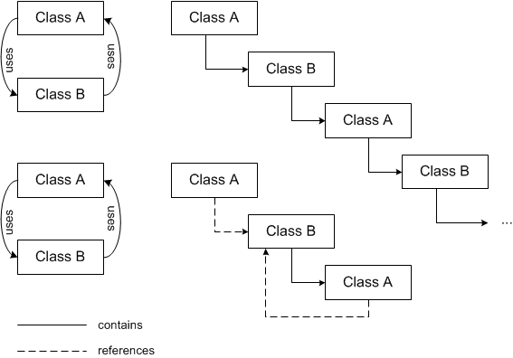

# Overview - Reusing Components

When specifying components, previously defined classes or modules contain functionality that can be reused. Reusing components leads to a hierarchical, tree-like structure of a component. The leaves of this structure are classes or modules that do not contain other classes or modules.

The structure of a component has to be tree-like, i.e. cyclic dependencies are not allowed. This is because the usage relation is also a containment relation, and a cyclic dependence would be unresolvable.

If a class is used in another component, the class will automatically be instantiated and initialized when the containing component is initialized.

There is, however, an exception. When using a class that is imported, i.e. the class is instantiated in some other context, for instance in the project directly, the usage relation is not a containment but a reference relation. Thus a cyclic dependency does not lead to an unresolvable containment relation in this case.

Modules are the top level component. Therefore, modules may not be contained in classes. Classes, however, may be contained in modules as well as in other classes. The following relation holds:

| Column 1 | Column 2 | Column 3 |
| --- | --- | --- |
| Containment relations | Class | Module |
| Class | x | - |
| Module | x | x |

Since the interfaces of modules and classes are different, the meaning of a hierarchical module structure and a hierarchical class structure is also different.

See

[Hierarchical Class Structure](INT_Hierarchical_Class_Structure.md)

[Hierarchical Module Structure](INT_Hierarchical_Module_Structure.md)
