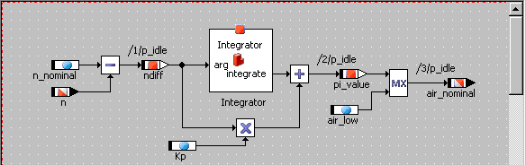

# Merged CHM Content

## Overview

_Source: `markdown/LEd_Overview.md`_

# Overview

When you include a component, it appears as a graphical block in the drawing area of the block diagram or project editor, with the interface elements of the component represented by the input and output pins of the block.

You can change the appearance of the graphical block with the layout editor. It is possible to add an icon, move the input and output pins around and to change the size and color of the block. Depending on the type of component, you can also enable or disable component methods or processes to determine its public interface.

The layout editor can be called from all component editors and the Component Manager.

See also

[Editing a Class Layout](markdown/editing_class_layout.md)

[Editing the Layout of Other Components](markdown/editing_layout_other_comp.md)

[Flexible Layout](markdown/led_flexiblelayout.md)

---

## Editing a Class Layout

_Source: `markdown/editing_class_layout.md`_

# Editing a Class Layout

In the layout editor, you can change the appearance of the block, as well as enable and disable individual methods. If a method is disabled in the layout editor, it cannot be used when the class is referenced by another component.

See also

[Modifying the Diagram Block](markdown/LEd_modify_diagram_block.md)

[Moving the Ports](markdown/move_ports.md)

[Modifying the Block Attributes](markdown/modify_block_attributes.md)

[Changing the Default Attributes for New Blocks](markdown/change_default_newblocks.md)

[Assigning an Icon to a Component](markdown/assign_icon_class.md)

[Modifying the Layout Editor Display](markdown/modify_layout_editor_display.md)

[Enabling and Disabling Methods](markdown/enable_disable_methods.md)

---

## Editing the Layout of Other Components

_Source: `markdown/editing_layout_other_comp.md`_

# Editing the Layout of Other Components

##### Modules:

Editing the layout of a module is the same as for classes, except that processes instead of methods and messages instead of elements can be enabled and disabled.

##### Continuous time blocks:

Methods and elements cannot be enabled or disabled in the layout editor. The appearance of the block is modified in the same way as that of a class.

##### State machines and conditional tables:

The same as for classes.

##### Boolean Tables:

Same as for classes, except that methods cannot be disabled.

##### Software Components:

Same as for classes, except that runnable entities instead of methods can be enabled and disabled.

##### AUTOSAR interfaces and records:

Same as for classes; direct access methods can be enabled and disabled.

See also

[Modifying the Diagram Block](markdown/LEd_modify_diagram_block.md)

[Moving the Ports](markdown/move_ports.md)

[Modifying the Block Attributes](markdown/modify_block_attributes.md)

[Changing the Default Attributes for New Blocks](markdown/change_default_newblocks.md)

[Assigning an Icon to a Component](markdown/assign_icon_class.md)

[Modifying the Layout Editor Display](markdown/modify_layout_editor_display.md)

[Enabling and Disabling Methods](markdown/enable_disable_methods.md)

---

## Flexible Layout

_Source: `markdown/led_flexiblelayout.md`_

# Flexible Layout

If you want to include a component in another component or project, you can determine whether the layout of the included component can be edited in a block diagram editor or project editor (flexible layout). You can enable or disable flexible layout for each class or module individually, either in the component manager (see [Activating/Deactivating Flexible Layout](ComponentManagerEnglishUS.chm::/Activating_Flexible_Layout.htm)) or in the layout editor. By default, flexible layout is deactivated for newly created components.

See also

[Activating/Deactivating Flexible Layout](ComponentManagerEnglishUS.chm::/Activating_Flexible_Layout.htm)

[Layout Menu](markdown/LEd_Layout_Menu.md)

[Block Diagram Editor - Layout of Included Components](BlockDiagramEditorEnglishUS.chm::/BDE_Layout.htm)

[Software Component Editor - Layout of Included Components](AtomicSoftwareComponentEditorEnglishUS.chm::/asclayoutincludedcomponents.htm)

---

## Opening the Layout Editor

_Source: `markdown/LEd_open_layout_editor.md`_

# Opening the Layout Editor

To open the layout editor, proceed as follows:

1. Open the specification editor for the component with the layout you want to change.
1. In the Edit menu, point to Component and select Edit Layout.

or

1. In the browser view, select the Layout tab.
1. Double-click the graphical block.

The layout editor opens for the component you selected.

You can

[Modify the diagram block](markdown/LEd_modify_diagram_block.md)

[Move the ports](markdown/move_ports.md)

[Modify the block attributes](markdown/modify_block_attributes.md)

[Change the default attributes for new blocks](markdown/change_default_newblocks.md)

[Assign an icon to a component](markdown/assign_icon_class.md)

[Enable and disable methods, processes, runnable entities](markdown/enable_disable_methods.md)

---

## Modifying the Diagram Block

_Source: `markdown/LEd_modify_diagram_block.md`_

# Modifying the Diagram Block

To modify the diagram block, proceed as follows:

1. In the layout editor, click on the block in the drawing area.
1. In such a case, click on the border of the block.
1. Drag the handles to resize the block.

See also

[Opening the Layout Editor](markdown/LEd_open_layout_editor.md)

[Moving the Ports](markdown/move_ports.md)

[Modifying the Block Attributes](markdown/modify_block_attributes.md)

[Changing the Default Attributes for New Blocks](markdown/change_default_newblocks.md)

[Assigning an Icon to a Component](markdown/assign_icon_class.md)

[Enabling and Disabling Methods](markdown/enable_disable_methods.md)

[Layout of Included Components](BlockDiagramEditorEnglishUS.chm::/BDE_Layout.htm)

[Using Changes as a New Default Layout](BlockDiagramEditorEnglishUS.chm::/BDE_Defaultlayout.htm)

---

## Moving the Ports

_Source: `markdown/move_ports.md`_

# Moving the Ports

The default location for inputs is on the left side of the block, the default location for the outputs is on the right side. The default location for methods, processes and runnable entities is on the top side. You can move all ports.

To move the ports, proceed as follows:

1. Drag the inputs and outputs along the sides of the block to the positions you want.
1. Drag the methods/processes/runnables along the sides of the block to the positions you want.

You cannot place one port at a position already occupied by another port.

See also

[Modifying the Diagram Block](markdown/LEd_modify_diagram_block.md)

[Modifying the Block Attributes](markdown/modify_block_attributes.md)

[Changing the Default Attributes for New Blocks](markdown/change_default_newblocks.md)

[Assigning an Icon to a Component](markdown/assign_icon_class.md)

[Enabling and Disabling Methods](markdown/enable_disable_methods.md)

---

## Modifying the Block Attributes

_Source: `markdown/modify_block_attributes.md`_

# Modifying the Block Attributes

To modify the block attributes, proceed as follows:

1. In the Layout editor, point to the Layout menu and select Attributes.
1. Select the fill color from the Fill color box.
1. Adjust the block size by selecting values from the Horizontal and Vertical boxes. This has the same effect as dragging the sizing handles.
1. Click on Set Minimal Size to reduce the block to the smallest possible size.
1. Adjust the visibility options by checking or unchecking the boxes: Name of Pins The input and output pins are labeled with the interface element names. Icon The icon referenced by the component is shown in the middle of the block. Name of Component The name assigned to the component in the Component Manager. Name of Element The instance name, i.e. the name assigned to an individual instance of a component when it is referenced by another one.
1. Click OK to modify the attributes for the current block.

See also

[Modifying the Diagram Block](markdown/LEd_modify_diagram_block.md)

[Moving the Ports](markdown/move_ports.md)

[Changing the Default Attributes for New Blocks](markdown/change_default_newblocks.md)

[Assigning an Icon to a Component](markdown/assign_icon_class.md)

[Enabling and Disabling Methods](markdown/enable_disable_methods.md)

---

## Changing the Default Attributes for New Blocks

_Source: `markdown/change_default_newblocks.md`_

# Changing the Default Attributes for New Blocks

It is possible to modify the default attributes that apply to all new blocks in a database or workspace.

To change the default attributes for new blocks, proceed as follows:

1. In the Layout menu, select Edit Default Attributes.
1. In the Default Block Layout node, set the options according to your needs.
1. Close the ASCET options window with OK.
1. In the Layout menu, select Set Attributes to Default to apply the default attributes to the current graphical block.

See also

[ASCET Options - Default Block Layout Options](ComponentManagerEnglishUS.chm::/CM_Default_Block_Layout_Node.htm)

[Modifying the Diagram Block](markdown/LEd_modify_diagram_block.md)

[Moving the Ports](markdown/move_ports.md)

[Modifying the Block Attributes](markdown/modify_block_attributes.md)

[Assigning an Icon to a Component](markdown/assign_icon_class.md)

[Enabling and Disabling Methods](markdown/enable_disable_methods.md)

---

## Assigning an Icon to a Component

_Source: `markdown/assign_icon_class.md`_

# Assigning an Icon to a Component

You can use an icon in a component which will then be shown in the graphical block of that component. ASCET icons are stored in the database or workspace and can be accessed via the Component Manager.

To assign an icon to a component, proceed as follows:

1. In the layout editor, point to the Layout menu and select Select Icon to open the Select Icon window.

1. From the Items list, select the icon you want to assign to the block.
1. Click OK to assign the icon.

The icon is assigned to the component in the layout editor.

Creating and editing symbols is described in [Icon Editor](SignalsandIconsEnglishUS.chm::/SI_icon_editor.htm).

See also

[Icon Editor](SignalsandIconsEnglishUS.chm::/SI_icon_editor.htm)

[Modifying the Diagram Block](markdown/LEd_modify_diagram_block.md)

[Moving the Ports](markdown/move_ports.md)

[Modifying the Block Attributes](markdown/modify_block_attributes.md)

[Changing the Default Attributes for New Blocks](markdown/change_default_newblocks.md)

[Enabling and Disabling Methods, Processes, Runnable Entities](markdown/enable_disable_methods.md)

---

## Enabling and Disabling Methods, Processes, Runnable Entities

_Source: `markdown/enable_disable_methods.md`_

# Enabling and Disabling Methods, Processes, Runnable Entities

You can modify the public interface by enabling or disabling public access to methods, processes, runnable entities and variables.

To enable and disable methods, proceed as follows:

1. In the Port Settings field of the layout editor, activate or deactivate the ports you want to enable or disable.
1. Click on Select all to activate all ports.
1. Click on Deselect All to deactivate all ports.
1. Click on Default to restore the default activation status.
1. Click on Revert to revert the current activation status.

See also

[Modifying the Diagram Block](markdown/LEd_modify_diagram_block.md)

[Moving the Ports](markdown/move_ports.md)

[Modifying the Block Attributes](markdown/modify_block_attributes.md)

[Changing the Default Attributes for New Blocks](markdown/change_default_newblocks.md)

[Assigning an Icon to a Component](markdown/assign_icon_class.md)

---

## Modifying the Layout Editor Display

_Source: `markdown/modify_layout_editor_display.md`_

# Modifying the Layout Editor Display

The layout editor offers several possibilities to set up the display.

To modify the layout editor display:

1. In the View menu, select Redraw to reload the display.
1. In the View menu, select Grid to open the Grid node of the ASCET options window.

See the descriptions in the ASCET options window for the meaning of the available options; see also [Changing the Grid in the Drawing Area](BlockDiagramEditorEnglishUS.chm::/Changing_Grid_Drawing_Area.htm).

1. In the View menu, select Print to print the layout; see also [Printing a Block Diagram](BlockDiagramEditorEnglishUS.chm::/Printblock.htm).
1. Click OK to exit the layout editor.

See also

[Changing the Grid in the Drawing Area](BlockDiagramEditorEnglishUS.chm::/Changing_Grid_Drawing_Area.htm)

[Printing a Block Diagram](BlockDiagramEditorEnglishUS.chm::/Printblock.htm)

---

## Layout Editor - Window Elements

_Source: `markdown/LEd_Description_of_Window_Elements.md`_

# Layout Editor - Window Elements

The Layout Editor window contains the following elements.

- [Layout](markdown/LEd_Layout_Menu.md) menu
- [View](markdown/LDe_View_Menu.md) menu
- Layout pane

Shows the current layout of the component.

- Port Settings pane

Lists the methods, processes or runnable entities of the component. Enabled methods/processes/runnable entities are marked by a filled check-box, disabled methods/processes/runnable entities are marked by an empty check-box.

-  Select All

Activates all ports.

-  Deselect All

Deactivates all ports.

-  Default

Restores the default activation status.

-  Revert

Reverts the current activation status.

 Hide Method List / Show Method list

Hides/Shows the Port Settings pane.

 OK

Closes the window and accepts the settings.

 Cancel

Closes the window without accepting the settings.

---

## Layout Menu

_Source: `markdown/LEd_Layout_Menu.md`_

# Layout Menu

This menu contains the following options. It is also available as context menu in the Layout pane.

Enable flexible layout

Shows if flexible layout has been activated in the component manager () or not. Can be used to determine whether the layout of this component can be altered when the component is included in a block diagram or project.

Attributes

Edits the layout settings.

Select icon

Adds an icon to the layout.

Remove icon

Removes an icon from the layout.

Show Sequence Calls and Hide Sequence Calls

Shows/hides sequence calls.

Set Sequence Calls to Default Position

Moves the sequence calls to their default positions.

Set Attributes To Default

Resets the layout settings to the default values.

Edit Default Attributes

Edits the default settings for the layout of new components.

See also

[Flexible Layout](markdown/led_flexiblelayout.md)

[Activating Flexible Layout](ComponentManagerEnglishUS.chm::/Activating_Flexible_Layout.htm)

---

## View Menu

_Source: `markdown/LDe_View_Menu.md`_

# View Menu

This menu contains the following options.

Redraw

Reloads the current layout.

Grid

Opens the ASCET options window in the Grid node.

Print

Prints the layout.

---

## Layout Settings for Window

_Source: `markdown/LEd_Layout_Settings_for_Window.md`_

# Layout Settings for Window

The Layout Settings for window contains the following elements.

##### Visibility area

- Name of Pins option

Shows/hides the pin names.

- Icon option

Shows/hides the icon.

- Name of Component option

Shows/hides the name of the component inside the layout.

- Name of Element option

Shows/hides the name of the component inside the layout.

##### Size area

- Horizontal field

Horizontal layout size (in grid units)

- Vertical field

Vertical layout size (in grid units)

-  Set Minimal Size

Sets the layout to the minimum possible size.

##### Fill color area

- combo box

A list of possible fill colors for the layout.

 OK

Closes the window and accepts the settings.

 Cancel

Closes the window without accepting the settings.

---

