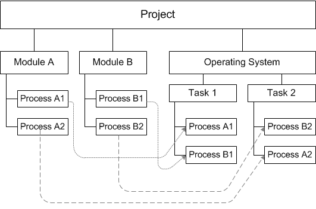
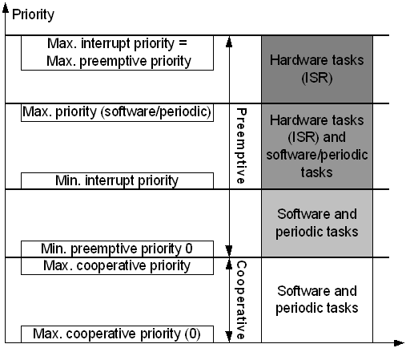
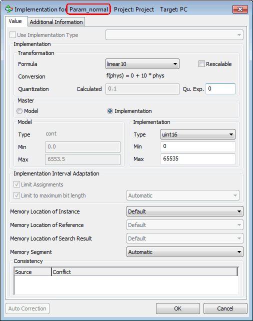
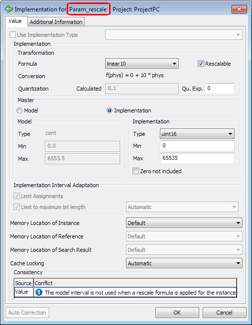
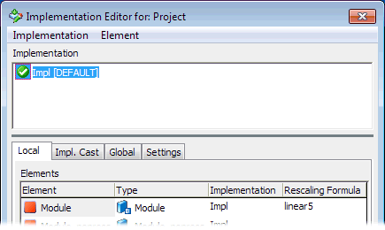
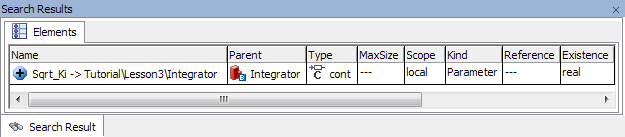
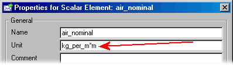
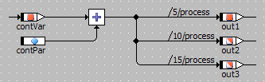

# Merged CHM Content

## Overview

_Source: `markdown/PE_Overview.md`_

# Overview

A project in ASCET defines the functionality of an embedded software system and is used as the basis for generating code for the embedded system. This kind of specification can be executed on various experimental targets and is capable of running in real-time. Fixed point code for microcontrollers can be generated once an implementation transformation for the embedded software system has been defined. This fixed point code can then be run on microcontroller targets in fullpass or bypass experiments.

Alternatively, a project can be used to model a control loop consisting of a combination of continuous time blocks and modules. In this case the continuous time blocks are used to describe the process model, and the modules are used to describe the controller. This model can then be experimented with on an experimental target.

See also

[Developing a Project](markdown/Developingproject.md)

[Default Project for a Component](markdown/PE_defaultproject.md)

[Defining Global Communication](markdown/definingglobalcommin.md)

[Scheduling in the OS Editor](markdown/schedulingos%20.md)

[Administration of External Project Files](markdown/administration_external.md)

[Hybrid Projects](markdown/PE_hybridprojects.md)

[Project Settings](markdown/projectsettings.md)

[Defining the Implementation for Fixed Point Arithmetic](markdown/definingimplementation.md)

[Experimenting with Projects](markdown/experimentingprojects.md)

[Generating Application Data](markdown/generating_applicationdata.md)

---

## Project

_Source: `markdown/pe_project.md`_

# Project

In ASCET, an embedded software system is defined in the context of a project. [Transformation formulas](markdown/PE_TransformationFormulas.md), [implementation types](markdown/PE_ImplementationTypes.md) and [imported elements](ElementEditorEnglishUS.chm::/EEd_ImportedElements.htm) are resolved only in the context of a project. A project contains at least the following:

- A collection of modules
- The task schedule for the real-time operating system
- The definition of the inter-process communication

The central part of a project is the definition of the operating system’s task schedule. Here, the dynamic behavior of the system is described. The figure illustrates the structure of a project.

See also

[Developing a Project](markdown/Developingproject.md)

[Default Project for a Component](markdown/PE_defaultproject.md)

[Defining Global Communication](markdown/definingglobalcommin.md)

[Scheduling in the OS Editor](markdown/schedulingos%20.md)

[Administration of External Project Files](markdown/administration_external.md)

[Hybrid Projects](markdown/PE_hybridprojects.md)

[Project Settings](markdown/projectsettings.md)

[Defining the Implementation for Fixed Point Arithmetic](markdown/definingimplementation.md)

[Experimenting with Projects](markdown/experimentingprojects.md)

[Generating Application Data](markdown/generating_applicationdata.md)

[Transformation Formulas](markdown/PE_TransformationFormulas.md)

[Implementation Types](markdown/PE_ImplementationTypes.md)

[Imported Elements](ElementEditorEnglishUS.chm::/EEd_ImportedElements.htm)

---

## Developing a Project

_Source: `markdown/Developingproject.md`_

# Developing a Project

A project is developed in a modular manner, by first developing and testing the individual components of the system, and then combining them into a project. Developing a project involves the following steps:

- Creating the empty project (see [Creating a New Project](markdown/PE_createproject.md)).
- Selecting the modules or AUTOSAR software components (SWC) that make up the system (see [Including a Component in a Project](markdown/specifyingproject.md)). The definitions of the components and SWC are referenced, i.e. if the definition of a component/SWC is changed, this change directly affects all the projects that use the component/SWC.
- Adjusting the project settings ([Adjusting the Project Settings](markdown/adjustcode_gen.md)), e.g. selecting a target and operating system, setting code generation options, etc., and resolving global variables (see [Defining Global Communication](markdown/definingglobalcommin.md)).
- Defining the overall control flow of the embedded software system by setting up the real-time operating system (see [Scheduling in the OS Editor](markdown/schedulingos%20.md)).

This step is obsolete for projects that contain AUTOSAR software components. The "OS" tab is present when you create the project, and add the SWC, but the tab content is ignored and the tab disappears when you close the project editor. Internal scheduling for Atomic software components is set up in the [Event Specification](AtomicSoftwareComponentEditorEnglishUS.chm::/ASCeventSpecificationView.htm) view of the software component editor, global scheduling is set up during runtime environment configuration.

- Specifying the implementation transformation for generating code with fixed point arithmetic (see [Defining the Implementation for Fixed Point Arithmetic](markdown/definingimplementation.md)). In order to define this implementation, the transformation formula must be included in the project (see [Adding Formulas](markdown/PE_add_formula.md)).

Like components, projects can have multiple data sets and implementations. Therefore, when executable code is generated from the formal definition the appropriate variant has to be chosen. The current variant of a project is defined by selection of the data set (this is also possible when experimenting with components only) and of the implementation transformation.

Defining an implementation is only necessary for generating code with fixed point arithmetic. When only floating point arithmetic is needed (e.g. in a bypass environment) the implementation transformation need not be defined.

The code generation can be adjusted for a specific project by selecting the code variant and the target platform for which code is to be generated. Code can be generated for three types of arithmetic: floating point arithmetic, fixed point arithmetic and quantized floating point arithmetic. The latter is a simulation of fixed point arithmetic based on floating point arithmetic, where the effects of quantization can be studied, and the quantization and the value bounds can be changed interactively while executing the code.

See also

[Creating a New Project](markdown/PE_createproject.md)

[Including a Component in a Project](markdown/specifyingproject.md)

[Adjusting the Project Settings](markdown/adjustcode_gen.md)

[Project Settings](markdown/projectsettings.md)

[Defining Global Communication](markdown/definingglobalcommin.md)

[Scheduling in the OS Editor](markdown/schedulingos%20.md)

[Defining the Implementation for Fixed Point Arithmetic](markdown/definingimplementation.md)

[Adding Formulas](markdown/PE_add_formula.md)

[Atomic Software Component Editor - Event Specification view](AtomicSoftwareComponentEditorEnglishUS.chm::/ASCeventSpecificationView.htm)

---

## Default Project for a Component

_Source: `markdown/PE_defaultproject.md`_

# Default Project for a Component

A test or default project is created for all components created with a specification editor, except AUTOSAR interfaces and records. However, the default project does not appear in the Component Manager, as it is created automatically together with its component. The default project is set up in the project editor and this also includes experimenting with the default project.

In a workspace, default projects are stored next to their component on the Windows file system, in the form of *.dp.amd files.

See also

[Editing a Default Project](markdown/PE_editdefaultproject.md)

[Adding Formulas](markdown/PE_add_formula.md)

[Adding Implementation Types](markdown/addimplementation.md)

[Adjusting the Project Settings](markdown/adjustcode_gen.md)

[Defining Global Elements in the Default Project](BlockDiagramEditorEnglishUS.chm::/BDE_Globalelements.htm)

[Defining the Scheduling in the OS Editor](markdown/PE_Define_Scheduling_in_OS_Editor.md)

[Adding an External Project File](markdown/addexternal.md)

---

## The Task Schedule for the Operating System

_Source: `markdown/pe_the_task_schedule_for_the_operating_system.md`_

# The Task Schedule for the Operating System

An essential part of an embedded control system is the underlying real-time operating system that controls the execution of the various algorithms and computations. In ASCET, the specification of the task schedule is supported by a special editor, where all relevant data for the operating system scheduling can be specified.

The specification of the task schedule is based on the automotive real-time operating system ERCOSEK. To serve the large number of parallel requests to the embedded control system, e.g. camshaft interrupts or sampling at a fixed rate, a priority-based cooperative and preemptive scheduling is the core of the operating system. This scheduling controls the execution of tasks in a multitasking environment. A task is defined as a list of processes to be executed in a given order. A process is any portion of a control algorithm which has to be executed at a given rate or as a reaction to an external interrupt.

Since a control system contains a number of algorithms, the number of processes can be very large. At the same time, many of these processes have a similar dynamic behavior. The collection of processes with the same dynamic behavior into tasks therefore reduces the administrative overhead of the operating system and structures the dynamic behavior of the application. Processes with the same dynamic behavior are therefore collected into one task.

The definition of a real-time task schedule consists of:

- Scheduling
- Tasks
- Processes
- Application modes

See also

[Scheduling](markdown/PE_Scheduling_.md)

[Tasks](markdown/PE_tasks.md)

[Processes](markdown/PE_processes.md)

[Application Modes](markdown/PE_applicationmodes.md)

---

## Scheduling

_Source: `markdown/PE_Scheduling_.md`_

# Scheduling

The operating system schedules the execution of processes defined in the modules. The definition of the schedule consists of grouping processes into sequences where each sequence defines a task in the operating system task schedule. The tasks are activated by the operating system in different modes, for instance periodically by timers, or by software or external events.

The figure above shows two tasks with processes assigned to them. Task1 is activated every 10ms, and has a higher priority than Task2, which is activated every 20ms. The running times of the processes are as follows: p1= 2ms, p2 = 1ms, p3= 2ms, p4 = 1ms, p5 = 1ms. The scheduling would then look like this:

The ERCOSEK operating system (used with the PC target and with the ES113x ASCET-RP targets) knows the following kinds of scheduling:

- cooperative scheduling
- preemptive scheduling

See also

[Cooperative Scheduling](markdown/cooperative_scheduling.md)

[Preemptive Scheduling](markdown/preemptive_scheduling.md)

---

## Cooperative Scheduling

_Source: `markdown/cooperative_scheduling.md`_

# Cooperative Scheduling

In cooperative scheduling, the current process is not interrupted if a task with a higher priority is activated. A new task starts after the current process is finished. If the current task (the one that gets interrupted) has more processes to execute, it pauses until the interrupting task is completed. After the interrupting task is completed, the interrupted task is continued. This type of scheduling is illustrated in the figure below, where the running times of processes are p1 = 2ms, p2 = 1ms, p3 = 5ms, p4 = 4ms, and p5 = 2ms.

See also

[Preemptive Scheduling](markdown/preemptive_scheduling.md)

[Tasks](markdown/PE_tasks.md)

[Processes](markdown/PE_processes.md)

---

## Preemptive Scheduling

_Source: `markdown/preemptive_scheduling.md`_

# Preemptive Scheduling

In preemptive scheduling, the current process is directly interrupted, whenever a task with a higher priority is activated. Since all cooperative tasks have lower priorities than preemptive or non-preemptable tasks, preemptive tasks cannot be interrupted by cooperative tasks. After the interrupting task is completed, the process is resumed. The figure below shows the same scenario as for cooperative tasks (i.e. the process running times p1 = 2ms, p2 = 1ms, p3 = 5ms, p4 = 4ms, and p5 = 2ms) with preemptive scheduling.

See also

[Cooperative Scheduling](markdown/cooperative_scheduling.md)

[Tasks](markdown/PE_tasks.md)

[Processes](markdown/PE_processes.md)

---

## Tasks

_Source: `markdown/PE_tasks.md`_

# Tasks

A task contains a list of processes that are executed on activation of that task. The execution order of the processes is fixed. The way a task is scheduled by the scheduler of the operating system is defined by the task settings. There are four different task modes:

- Alarm tasks () are activated periodically. The activation rate is specified in seconds.
- Interrupt tasks () are activated by an external event. For each processor, different types of events are available. The appropriate event can be chosen from a list of events.
- Software tasks () are activated by calling an operating system routine, i.e. they are activated directly through the software.
- Init tasks () are activated once before the start of the operation system. Init tasks contain code for the initialization of the system.

Tasks of type Init and application mode inactive are called exit tasks ().

In ASCET, each task is given a name and a unique task number. This number does not change when the task is shifted. If a task is deleted, its number is not reused for a new task. The only way to change task numbers is via the Renumber Tasks command. See also [Working on Tasks](markdown/PE_Working_on_Tasks.md).

See also

[Application Modes](markdown/PE_applicationmodes.md)

[Processes](markdown/PE_processes.md)

[Creating a Task](markdown/createtask.md)

[Working on Tasks](markdown/PE_Working_on_Tasks.md)

---

## Task Priorities

_Source: `markdown/pe_task_prioritiess.md`_

# Task Priorities

Each task is furthermore assigned to one of the following scheduling groups, preemptive or cooperative, and inside each group to one of the available priority levels. The number of priority levels for each scheduling group can be defined by the user, and determines the memory demand of the scheduler tables. It should be optimized for the final system.

Tasks at a higher priority than the running task can interrupt the running task. If the interrupting task belongs to the preemptive scheduling group, the running task is interrupted immediately, otherwise the interrupt happens at the end of the current process. Preemptive tasks always have a higher priority than cooperative tasks. The figure shows the priority scheme. The actually available tasks depend on the selected target.

Each time a task is activated, the time elapsed since the previous activation is stored in the global variable dT. This variable can be used in the definition of algorithms to describe the control algorithms independent of their sample rate.

The OS editor allows to edit the maximum number of task priorities of an OS configuration. The table below shows default and maximum values for cooperative and preemptive task priorities, as well as the maximum total number of task priorities.

<table style="x-cell-content-align: Top;
				margin-top: 3px;
				border-left-style: Outset;
				border-top-style: Outset;
				border-right-style: Outset;
				border-bottom-style: Outset;
				border-left-width: 1px;
				border-right-width: 1px;
				border-top-width: 1px;
				border-bottom-width: 1px;" x-use-null-cells="">
<col/>
<col/>
<col/>
<col/>
<col/>
<col/>
<tr class="hcp1" valign="top">
<td class="hcp2" colspan="1" rowspan="2">

Target + OS
</td>
<td class="hcp2" colspan="2" rowspan="1">

default no. of
</td>
<td class="hcp2" colspan="2" rowspan="1">

max. no. of 
</td>
<th colspan="1" rowspan="2" style="padding-top: 2px;
			padding-bottom: 2px;
			border-left-style: Inset;
			border-top-style: Inset;
			border-right-style: Inset;
			border-bottom-style: Inset;
			padding-left: 2px;
			padding-right: 2px;
			border-left-width: 1px;
			border-top-width: 1px;
			border-right-width: 1px;
			border-bottom-width: 1px;">

total max. no.

of levels
</th></tr>
<tr class="hcp1" valign="top">
<td class="hcp2" colspan="1" rowspan="1">

coop. levels
</td>
<td class="hcp2" colspan="1" rowspan="1">

preemp. levels
</td>
<td class="hcp2" colspan="1" rowspan="1">

coop. levels
</td>
<td class="hcp2" colspan="1" rowspan="1">

preemp. levels
</td>
</tr>
<tr class="hcp1" valign="top">
<td class="hcp2">

PC / generic
</td>
<td class="hcp2" colspan="1" rowspan="1">

0
</td>
<td class="hcp2">

20
</td>
<td class="hcp2" colspan="1" rowspan="1">

0
</td>
<td class="hcp2" colspan="1" rowspan="1">

20
</td>
<td class="hcp2">

20
</td></tr>
<tr class="hcp1" valign="top">
<td class="hcp2">

ES1130 / ERCOSEK 4.3
</td>
<td class="hcp2" colspan="1" rowspan="1">

20
</td>
<td class="hcp2">

20
</td>
<td class="hcp2" colspan="1" rowspan="1">

236
</td>
<td class="hcp2">

236
</td>
<td class="hcp2">

236
</td></tr>
<tr class="hcp1" valign="top">
<td class="hcp2">

ES1135 / ERCOSEK
</td>
<td class="hcp2" colspan="1" rowspan="1">

20
</td>
<td class="hcp2">

20
</td>
<td class="hcp2" colspan="1" rowspan="1">

20
</td>
<td class="hcp2" colspan="1" rowspan="1">

20
</td>
<td class="hcp2">

40
</td></tr>
<tr class="hcp1" valign="top">
<td class="hcp2">

ES1135 / ERCOSEK 4.3
</td>
<td class="hcp2" colspan="1" rowspan="1">

20
</td>
<td class="hcp2">

20
</td>
<td class="hcp2" colspan="1" rowspan="1">

236
</td>
<td class="hcp2">

236
</td>
<td class="hcp2">

236
</td></tr>
<tr class="hcp1" valign="top">
<td class="hcp2">

Prototyping
</td>
<td class="hcp2" colspan="1" rowspan="1">

100
</td>
<td class="hcp2">

100
</td>
<td class="hcp2" colspan="1" rowspan="1">

100
</td>
<td class="hcp2" colspan="1" rowspan="1">

100
</td>
<td class="hcp2">

200
</td></tr>
<tr class="hcp1" valign="top">
<td class="hcp2">

ES910 / RTA-OSEK V5.0
</td>
<td class="hcp2" colspan="1" rowspan="1">

32
</td>
<td class="hcp2">

32
</td>
<td class="hcp2" colspan="1" rowspan="1">

253
</td>
<td class="hcp2">

253
</td>
<td class="hcp2">

253
</td></tr>
<tr class="hcp1" valign="top">
<td class="hcp2">

RTPRO-PC
</td>
<td class="hcp2" colspan="1" rowspan="1">

32
</td>
<td class="hcp2">

32
</td>
<td class="hcp2" colspan="1" rowspan="1">

32
</td>
<td class="hcp2" colspan="1" rowspan="1">

32
</td>
<td class="hcp2">

64
</td></tr>
<tr class="hcp1" valign="top">
<td class="hcp2">

ASCET-SE targets / *
</td>
<td class="hcp2" colspan="2" rowspan="1">

as specified in target.ini
</td>
<td class="hcp2" colspan="3" rowspan="1">

as specified in target.ini
</td>
</tr>
</table>

The maximum total number of task priorities for ES113x/ERCOSEK 4.3 is currently 236, the maximum total number of task priorities for ES910 is currently 253. Setting the max. cooperative and preemptive priorities to values whose sum exceeds the maximum total number of task priorities will lead to an invalid OS configuration.

It is possible to increase the number of cooperative/preemptive levels up to the maximum cooperative/preemptive priority.

The semantic analysis of the OS configuration generates an error in the following cases:

- The sum of max. cooperative levels and max. preemptive levels is greater than the maximum priority for the target+OS combination, and a task actually has a priority that is too big.
- The maximum number of preemptive levels in the OS editor is greater than the maximum number of preemptive levels of the target+OS combination, and a preemptive task actually has a priority that is too big.
- The maximum number of cooperative levels in the OS editor is greater than the max. cooperative levels of the target+OS combination, and a cooperative task actually has a priority that is too big.
- The priority of a preemptive task is less than 0 or greater or equal than the maximum number of preemptive levels in the OS editor.
- The priority of a cooperative task is less than 0 or greater or equal than the maximum number of cooperative levels in the OS editor.

The semantic analysis of the OS configuration shall generate a warning in the following cases:

- The sum of max. number of cooperative levels and max. number of preemptive levels is greater than the maximum priority for the target+OS combination, and no task actually has a priority that is too big.
- The max. number of preemptive levels in the OS editor is greater than the max. number of preemptive levels of the target+OS combination, and no preemptive task actually has a priority that is too big.
- The max. number of cooperative levels in the OS editor is greater than the max. cooperative levels of the target+OS combination, and no cooperative task actually has a priority that is too big.

See also

[Cooperative Scheduling](markdown/cooperative_scheduling.md)

[Preemptive Scheduling](markdown/preemptive_scheduling.md)

[Basic Task Settings](markdown/basictasksetting.md)

---

## Processes

_Source: `markdown/PE_processes.md`_

# Processes

A task consists of a sequence of processes. Processes contain the execution code of the program. The body of a process is executed sequentially. Since tasks can be interrupted preemptively by tasks of a higher priority, processes can be interrupted in the middle of their execution. Therefore, processes must be designed so that they can be executed in parallel.

When working in a preemptive system, the main problem is data consistency. The operating system has to guarantee, that the result of the computation in a process depends on the value of the input variables alone, and not on the order of execution in the system.

To solve this problem, the ERCOSEK concept of messages is supported in processes. In the ERCOSEK operating system, messages are protected global variables. Protection is achieved by working on copies of the global variables. The system analyses whether a copy is required and establishes an optimum data consistency scheme without penalties for the run-time kernel.

See also

[Tasks](markdown/PE_tasks.md)

[Assigning a Process to a Task](markdown/assignprocess.md)

[Messages](IntroductionEnglishUS.chm::/INT_messages.htm)

---

## Application Modes

_Source: `markdown/PE_applicationmodes.md`_

# Application Modes

The operating system can have several application modes, each of which has its own set of tasks assigned to it. This means that different operating conditions on the controlled system can be modelled, e.g. an engine can have separate operating modes for the warm-up phase and for normal operation. These modes are mutually exclusive, i.e. only one mode is active at a given time. Therefore, in each mode, only the relevant tasks have to be executed.

One of the application modes must be selected as start mode. The start mode is the one that the system is in at start-up. Operating system commands are used to switch between application modes.

See also

[Creating an Application Mode](markdown/createapplication.md)

[Using Application Modes](markdown/PE_UseApplicationModes.md)

[Assigning Application Modes to a Task](markdown/assignapplication.md)

---

## Modules and Processes

_Source: `markdown/pe_modules_and_processes.md`_

# Modules and Processes

The processes assigned to tasks are defined in the context of modules. A module encapsulates a number of related processes, e.g. processes that belong to a lambda control function. The functionality described in a module can be split into several processes, since different parts of a control algorithm may be computed at different times. This greatly reduces the execution time for the control algorithms, since only the most sensitive parts of the algorithms need to be computed at the highest frequency. At the same time the descriptions of the algorithms are not distributed, which makes them easier to develop, maintain and understand.

The functionality of a complex control task can be distributed over several modules which can be modelled hierarchically. For further refinement classes and state machines can be used for sub-algorithms or service routines (e.g. accumulator, pi-control etc.)

Modules are exclusively used by projects and are the top level components within a project. Usually, modules are used to describe a unique part of a project, e.g. a lambda control. Therefore modules can have only one instance inside a project, in contrast to other components, which can have any number of instances (e.g. accumulators).

Like all other components, modules have an interface. The interface of a module consists of its processes and the messages which are used for data exchange.

See also

[Interprocess Communication](markdown/pe_interprocess_communication.md)

[M](markdown/PE_MessageCopySemanticsExperiment.md)essage Copy Semantics for Experiment Code

[Overview - Components](IntroductionEnglishUS.chm::/INT_Overview_Components.htm)

[Processes](markdown/PE_processes.md)

[Messages](IntroductionEnglishUS.chm::/INT_messages.htm)

---

## Interprocess Communication

_Source: `markdown/pe_interprocess_communication.md`_

# Interprocess Communication

The communication between processes is achieved via messages, which are protected global variables in ERCOSEK. Data consistency is achieved by working on copies of the actual variable whenever a copy is required.

The figure below shows how data inconsistency may occur in a preemptive system. To avoid this conflict, the interprocess communication is modelled with messages. At the beginning of a process, all input messages (those messages that are only read) are received by the process. Upon receiving a message, an automatic temporary copy of the message is produced, on which the process works. At the end of the process, all messages that are written to are copied back to the actual message. This mechanism guarantees that the values of the variables are left unchanged within a process, unless the process itself changes its value.

The use of protected global variables for interprocess communication, i.e. the use of state messages, is appropriate for embedded control systems. There is no dependence between the sender and the receiver of a message, so that no complicated and run time consuming synchronization scheme is required. Secondly, when using state messages there is no one-to-one relation between a sender and the receiver. Therefore a message can be received by more than one process.

The messages mechanism is based on the ERCOSEK message principle. The ERCOSEK development environment contains an offline system optimization feature,where message implementation can be optimized. Here copies are only introduced,if data consistency is endangered, and copies are only produced at the beginning and the end of a task.

The interprocess communication is resolved by the project. Messages with the same name are bound to each other and represent the same message. If, for example, two processes use the message velocity, they communicate by writing to and reading from this variable. The same name-based resolution mechanism is performed on other global objects as well, e.g. global variables or global parameters.

ASCET supports several message copy semantics for experiment code (see [Message Copy Semantics for Experiment Code](markdown/PE_MessageCopySemanticsExperiment.md)) and production code (see the ASCET-SE user's guide).

See also

[Messages](IntroductionEnglishUS.chm::/INT_messages.htm)

---

## Message Copy Semantics for Experiment Code

_Source: `markdown/PE_MessageCopySemanticsExperiment.md`_

# Message Copy Semantics for Experiment Code

ASCET supports several message copy semantics for experiment code, i.e. code generated for PC or ASCET-RP targets, and production code, i.e. code generated for ASCET-SE microcontroller targets (see the ASCET-SE user's guide for more information).

In the [Experiment Code](markdown/Exp_Code_Options_Window.md) node of the Project properties window, one of three message copy semantics can be selected.

- [NON_OPT_COPY_FUNCTION](#NON_OPT_COPY_FUNCTION)
- [NON_OPT_COPY_TASK](#NON_OPT_COPY_TASK)
- [NO_COPY](#NO_COPY)

##### Restrictions

- The OSEK_COM and OSEK_COM_STACK_BUFFER semantics available for ASCET-SE targets are not supported for experiment code.
- Code generated with the Transfer option of the Build menu must use the NON_OPT_COPY_FUNCTION semantics. If another semantics is selected, the NON_OPT_COPY_FUNCTION semantics is enforced and an information is issued.

IMake2 - %1 command requires message usage variant option to be set to %2 instead of %3 --- will be set for code generation

##### NON_OPT_COPY_FUNCTION

A copy is used for each message accessed within the process or method. The message values are read at the beginning of the process/method execution, and changed values are written back to the master message upon exit of the process/method.

This semantics is not safe with respect to a method being called from other methods/processes that access the same messages.

If this semantics is selected, warnings are issued in the following cases:

- a message is written in a process/method, and read in a called method

WMdl312 - read access to message "%1" in method "%2" might not return current value in context of %3 "%4" due to option "message usage variant" set to %5

- a message is written in a called method and read in the calling method/process

WMdl313 - write access to message "%1" in method "%2" might not affect current value in context of %3 "%4" due to option "message usage variant" set to %5

##### NON_OPT_COPY_TASK

This semantics most closely resembles the NON_OPT_COPY semantics of ASCET-SE targets.

During task execution, a task-specific struct that holds a copy of each message accessed within the task. The values are read from the master messages by a special process executed at the beginning of the task, and changed values are written back to the master messages by another special process executed as the last process in the task.

If a task accesses no messages, no struct is generated because ANSI-C does not allow empty structs.

Init tasks do not use message copies, they use the master messages.

If this semantics is selected, errors are issued in the following cases:

- a process is used in more than one task

MMdl352 - process %1 must not be assigned to multiple tasks with option message usage variant set to %2

- a method is called from processes assigned to more than one task

MMdl353 - method %1 must not be called from different tasks with option message usage variant set to %2

- the OS specification does not contain any tasks

MMdl351 - operating system specification must not be empty with option message usage variant set to %1

If this semantics is selected, warnings are issued in the following cases:

- a process/method uses a message, but is not called by any task

WMdl314 - %1 access to message "%2" in function "%3", but not called from any task with option "message usage variant" set to %4

##### NO_COPY

No message copies are used, i.e. each access manipulates the master message.

If used for offline simulation, this semantics is equivalent to the OPT_COPY semantics of ASCET-SE targets, with respect to data integrity. If used for online simulation, this semantics is unsafe.

A warning is issued if this semantics is used in combination with an ASCET-RP target.

WMdl320 - disabling message copy generation might be unsafe with respect to data integrity

---

## Project Settings

_Source: `markdown/projectsettings.md`_

# Project Settings

ASCET code generation is available for different target platforms, e.g. PC, experimental targets and microcontroller targets. For each project and target, a number of build, experiment code or production code options are available, as well as optimization options and ASAM-MCD-2MC generation options.

For an ASCET module, code can be generated and simulated without project context only with the Physical Experiment code generator (see [Build Node](markdown/Build_Options.md)). For the other code generators the module must be integrated into a project. A so-called default project can be defined for each class or module for that purpose. This is the only way to access the implementation information. Without project context, the conversion formulas as well as all implementations of imported entities are missing.

See also

[Adjusting the Project Settings](markdown/adjustcode_gen.md)

[Project Properties Window](markdown/PE_Settings_for_Window.md)

[Build Node](markdown/Build_Options.md)

[ASAM-2MC Node](markdown/ASAM-2MC_Tab.md)

---

## Global Communication

_Source: `markdown/definingglobalcommin.md`_

# Global Communication

In components, the flow of data is organized through the interface elements of the components, i.e. by defining inputs and arguments and reading outputs and return values. In a project, communication is defined via imported and exported elements, these function like global variables. These elements are mapped onto each other according to their names, which have to be identical for two elements to be mapped. Therefore, it is necessary to assign the names in the modules so that they will match in the project.

An element can be exported either by a module or by the project itself. Each exported element can be imported several times by other modules, but an element can only be exported once. If two modules within a project contain an exported element of the same name, an error message is displayed.

Elements can also be created in the project. They are then linked to elements with the same name in the modules. Binding is always automatic, i.e. the user can only influence the binding of imported and exported elements by assigning matching names to them.

See also

[Viewing the Binding of Variables in a Project](markdown/viewbinding.md)

[Opening a Component from the Binding Tab](markdown/opencomponent.md)

[Defining Global Elements in a Project](markdown/defineglobal.md)

[Searching/Deleting Unused Global Elements](markdown/deleteunused.md)

---

## Application Modes

_Source: `markdown/PE_applicationmodes.md`_

# Application Modes

The operating system can have several application modes, each of which has its own set of tasks assigned to it. This means that different operating conditions on the controlled system can be modelled, e.g. an engine can have separate operating modes for the warm-up phase and for normal operation. These modes are mutually exclusive, i.e. only one mode is active at a given time. Therefore, in each mode, only the relevant tasks have to be executed.

One of the application modes must be selected as start mode. The start mode is the one that the system is in at start-up. Operating system commands are used to switch between application modes.

See also

[Creating an Application Mode](markdown/createapplication.md)

[Using Application Modes](markdown/PE_UseApplicationModes.md)

[Assigning Application Modes to a Task](markdown/assignapplication.md)

---

## Basic Task Settings

_Source: `markdown/basictasksetting.md`_

# Basic Task Settings

The configuration of a task determines its priority among other tasks, its trigger mode and other details relating to task activation and execution. Some of the settings are OS-specific.

See also

[Setting up a Trigger Mode](markdown/triggermode.md)

[Setting Up Hook Routines](markdown/HookRoutine.md)

[Setting the Autostart Option](markdown/setautostart.md)

[Setting Deadline and Minimum Period Options](markdown/setdeadline.md)

---

## The Monitoring Option

_Source: `markdown/monitoringoption.md`_

# The Monitoring Option

The monitoring option provides three variables for every task to be used for monitoring and debugging purposes during experiments with projects, as well as one further variable for monitoring of all tasks. The variables are created automatically when the Enable Monitoring option is active, and when monitoring was selected from the pre/post hooks combo box for the task during task setup. This has to be done individually for each task for which monitoring variables are to be generated. The following three task-specific monitoring variables are generated:

cycleStartTime_<taskname>

Shows the point in time in seconds the task was last activated.

cycleTime_<taskname>

Shows the time in seconds required for executing the task.

dT_<taskname>

Shows the time difference between the previous and the current activation of the task in seconds.

In addition, the following variable is created once for all tasks:

runtime_violation

Shows the number of times the task has not met its schedule.

See also

[Setting Up Hook Routines](markdown/HookRoutine.md)

---

## Administration of External Project Files

_Source: `markdown/administration_external.md`_

# Administration of External Project Files

As a rule, there are more project files belonging to a project. These can be, for example, protocols, correspondence documents or C files. So that these external files can be assigned uniquely to the project, they are managed in the project editor via the Files tab.

The Files tab contains a table with name, size (in byte), and creation date of the files. The file paths are stored as absolute paths, relative paths are used only if a file is located in one of six preset directories. In that case, the Abstract column contains one of the following key words.

%ASCET%

ETAS\Ascet<x.y> (ASCET installation directory)

%DATA%

ETASData\Ascet<x.y>(product data directory)

See also

[Adding an External Project File](markdown/addexternal.md)

[Viewing a Project File](markdown/viewproject.md)

[Deleting a Project File in the Project Editor](markdown/deleteproject.md)

[Writing Project Files](markdown/writeproject.md)

[Updating the Project File](markdown/updateproject.md)

[Copying the Project File](markdown/copyproject.md)

---

## Hybrid Projects

_Source: `markdown/PE_hybridprojects.md`_

# Hybrid Projects

Hybrid projects are projects that contain both continuous time blocks (CT blocks) and modules. CT blocks implement process models, i.e. mathematical models of the processes that are controlled by embedded control systems.

See also

[Setting up a Hybrid Project](markdown/sethybrid.md)

[Defining the Scheduling of Continuous Time Blocks](markdown/continuoustimeblocks.md)

---

## Implementation for Fixed-Point Arithmetic

_Source: `markdown/definingimplementation.md`_

# Defining the Implementation for Fixed-Point Arithmetic

When generating production code for microcontrollers, the arithmetic of the physical ASCET specification often has to be mapped to fixed-point arithmetic, since many microcontrollers used in electronic control units do not support floating-point arithmetic. This mapping is described by the implementation transformation, or implementation for short.

Like data sets, each component or project may have any number of implementations. Like data sets, implementations can be viewed, edited, renamed, deleted, browsed, exported (flat, recursive as well as generic), added and copied.

As with data sets there are special editors for the basic elements which form the leaves of the hierarchical tree structure of a project or component. Implementation of the basic elements of types continuous or discrete requires specification of a range for the physical values and a transformation formula.

Many elements within a project usually have the same transformation formula, for instance all the velocities processed in the embedded software. It is possible to define formulas only once within a project, and then use them across all the elements in that project. Formulas can also be exchanged between projects with an import/export mechanism.

ASCET also supports the intermediate step of generating quantized floating-point code. With this type of code fixed-point arithmetic is emulated, but the links and the quantization of the fixed-point arithmetic can be changed interactively during execution of the code. This intermediate step allows development of the optimum implementation for the elements in a specific project.

You can

[Add formulas](markdown/PE_add_formula.md)

[Add missing formulas](markdown/Adding_Missing_Formulas.md)

[Edit a formula](markdown/PE_editformula.md)

[Import](markdown/importformula.md) and [export](markdown/fileoutformulas.md) formulas

[Replace a formula recursively](markdown/replaceformula.md)

See also

[Transformation Formulas](markdown/PE_TransformationFormulas.md)

[Formulas in the ASAM-MCD-2MC File](markdown/pe_formulas_asap2file.md)

[Global Changes in Implementations](markdown/Globalchanges.md)

[Implementation Types](markdown/PE_ImplementationTypes.md)

---

## Transformation Formulas

_Source: `markdown/PE_TransformationFormulas.md`_

# Transformation Formulas

The transformation formula for the implementation must be a linear formula. Four types of conversion formulas are supported for displaying this formula. The display of the formula editor adjusts to reflect the formula type you choose.

1. The Identity formula represents an identity mapping.
1. The Linear formula represents a linear mapping with the coefficients c0 (offset) and c1 (gradient).
1. The Moebius formula represents a rational mapping as the quotient of two linear mappings, with the coefficients c0 (numerator offset), c1 (numerator gradient), d0 (denominator offset), and d1 (denominator gradient). The Moebius formula is mainly used to avoid a conversion to the linear formula format when the specification of a linear formula is given in the Moebius formula format.
1. The Five Parameters formula also represents a rational mapping of the same kind in a different format with the coefficients p1, p2, p3, p4 and p56. This formula is also used to avoid a conversion to the linear formula format when the specification of a linear formula is given in the five parameters formula format.

See also

[Adding Formulas](markdown/PE_add_formula.md)

[Adding Missing Formulas](markdown/Adding_Missing_Formulas.md)

[Importing Formulas](markdown/importformula.md)

[Editing the Formula](markdown/PE_editformula.md)

[Replacing a Formula Recursively](markdown/replaceformula.md)

[Formulas in the ASAM-MCD-2MC File](markdown/pe_formulas_asap2file.md)

---

## Formulas in the ASAM-MCD-2MC File

_Source: `markdown/pe_formulas_asap2file.md`_

# Formulas in the ASAM-MCD-2MC File

When you generate an ASAM-MCD-2MC file for an ASCET project, information about the formulas used to transform implemented values into model values and vice versa is added to the ASAM-MCD-2MC file.

##### Normal elements

For an element with normal, i.e. non-rescalable, implementation, the formula written to the ASAM-MCD-2MC file is the formula selected in the implementation editor of the element. Any rescaling formula of the component that contains the normal element is ignored.

[Example for a normal element](markdown/pe_examples_formulas_asap2file.md#normal)

##### Rescalable elements

For an element with rescalable implementation, i.e. a rescalable element, the formula written to the ASAM-MCD-2MC file is created from the formula in the element's implementation editor and the rescaling formula of the component that contains the rescalable element. In addition, the minimum and maximum limits written to the ASAM-MCD-2MC file are re-calculated with the new formula.

The formula written to the ASAM-MCD-2MC file is calculated by multiplying the element formula with the rescaling formula. It is named according to the following scheme:

ASD_Rescaled_<rescaling formula>_<element formula>

[Example for a rescalable element](markdown/pe_examples_formulas_asap2file.md#rescalable)

See also

[Transformation Formulas](markdown/PE_TransformationFormulas.md)

[Examples: Formulas in the ASAM-MCD-2MC File](markdown/pe_examples_formulas_asap2file.md)

[Introduction - Rescalable Implementations](IntroductionEnglishUS.chm::/INT_RescalableImplementations.htm)

[Generating Application Files](markdown/generating_files.md)

---

## Examples: Formulas in the ASAM-MCD-2MC File

_Source: `markdown/pe_examples_formulas_asap2file.md`_

# Examples: Formulas in the ASAM-MCD-2MC File

AN ASCET project contains a module with the parameters Param_normal and Param_rescalable. Both elements are of model data type cont.

##### Example for the [normal element](markdown/pe_formulas_asap2file.md#Normal)

Param_normal is implemented with the implementation data type uint16, min..max = 0..65535, and the formula linear10 (see [here](javascript:kadovTextPopup(this))<!-- kadovTextPopupInit('a1'); //-->). The ASAM-MCD-2MC code generated for Param_normal looks as follows:

/begin CHARACTERISTIC Param_normal.Module

""

VALUE

0x0

STANDARD_VALUE_U16

0.0

linear10

0.0

6553.5

...

/end CHARACTERISTIC

##### Example for the [rescalable element](markdown/pe_formulas_asap2file.md#Rescalable)

Param_rescalable is implemented with the implementation data type uint16, min..max = 0..65535 and the formula linear10; it is marked as rescalable (see [here](javascript:kadovTextPopup(this))<!-- kadovTextPopupInit('a4'); //-->). The module is assigned the rescaling formula linear5 (see [here](javascript:kadovTextPopup(this))<!-- kadovTextPopupInit('a5'); //-->).

The ASAM-MCD-2MC code generated for Param_rescale looks as follows:

/begin CHARACTERISTIC Param_rescale.Module

""

VALUE

0x0

STANDARD_VALUE_U16

0.0

ASD_Rescaled_linear5_linear10

0.0

1310.7

...

/end CHARACTERISTIC

The ASAM-MCD-2MC code generated for the newly created formula ASD_Rescaled_linear5_linear10 looks as follows:

/begin COMPU_METHOD ASD_Rescaled_linear5_linear10

""

RAT_FUNC

"%12.4"

""

COEFFS 0 50 0 0 0 1

/end COMPU_METHOD

/* Heikki Komulainen, Comet Computer GmbH 2004 */ cc_plus_pic = '&nbsp;'; cc_minus_pic = '&nbsp;'; cc_stat_pic = '&nbsp;'; gpstyle = ''; var iframes_created = 0; if (document.body && document.body.insertAdjacentHTML && document.getElementsByTagName && document.getElementById) { collect_popups(); set_poplinks_pictures(); if (iframes_created) { document.write(gpstyle); document.write('
<nobr><a id="einauslink" style="position:absolute;top:expression(document.body.scrollTop + this.offsetHeight - this.offsetHeight);left:expression(document.body.offsetWidth - (this.offsetWidth + 28));background:white;padding:5px" href="javascript:show_all_poptext()">Alle texte einblenden</a></nobr>
'); } } function collect_popups() { bsscpopups = new Array(); for (x = 0; x < document.links.length; x++) { if (document.links[x].href.indexOf("BSSCPopup")>-1) { seekmatch = /BSSCPopup.'[^'](markdown/+)'/; poplink = seekmatch.exec(document.links[x].href); poplink = "" + poplink; poplink = poplink.substring(poplink.indexOf("'")+1, poplink.lastIndexOf("'")); ifid = "CCGENIFRAMEID" + x; new_iframe = '<iframe id="' + ifid + '"src="' + poplink + '" onload="get_text(\'' + ifid + '\')" width="0" height="0" frameborder=0></iframe>'; document.links[x].parentNode.insertAdjacentHTML("afterEnd", new_iframe); gpid = "CCID_" + ifid; document.links[x].href = "javascript:expand_poptext('" + gpid + "')"; cc_plus = '' + cc_plus_pic + ''; document.links[x].insertAdjacentHTML("afterBegin", cc_plus); iframes_created = 1; } } }// end function function get_text(ifr_id) { frpars = document.frames[ifr_id].document.getElementsByTagName("body"); popbody = frpars[0].innerHTML; gpid = "CCID_" + ifr_id; if (!document.getElementById(gpid)) { //avoiding doubles document.getElementById(ifr_id).insertAdjacentHTML("afterEnd", '
'+popbody+'
'); } }//end function function expand_poptext(x_frame_id) { if (!document.getElementById(x_frame_id)) return; if (document.getElementById(x_frame_id).className == "CCGENPOPTEXTH") { document.getElementById(x_frame_id).className = "CCGENPOPTEXTV"; document.getElementById(x_frame_id).style.visibility = "visible"; if (document.getElementById("CCPMB_" + x_frame_id )) { document.getElementById("CCPMB_" + x_frame_id ).innerHTML = cc_minus_pic; } } else { document.getElementById(x_frame_id).className = "CCGENPOPTEXTH"; document.getElementById(x_frame_id).style.visibility = "hidden"; if (document.getElementById("CCPMB_" + x_frame_id )) { document.getElementById("CCPMB_" + x_frame_id ).innerHTML = cc_plus_pic; } } }// end function function show_all_poptext() { var pulldowntxt = document.getElementsByTagName("div"); for (b = 0; b < pulldowntxt.length; b++) { if (pulldowntxt[b].className == "droptext") { pulldowntxt[b].style.display=""; } } var gptxt = document.getElementsByTagName("div"); for (z = 0; z < gptxt.length; z++) { if (gptxt[z].className == "CCGENPOPTEXTH") { gptxt[z].className = "CCGENPOPTEXTV"; gptxt[z].style.visibility = "visible"; if (document.getElementById("CCPMB_" + gptxt[z].id )) { document.getElementById("CCPMB_" + gptxt[z].id ).innerHTML = cc_minus_pic; } } } var dxpoplinks = document.getElementsByTagName("a"); if (dxpoplinks) { for (pxl = 0; pxl < dxpoplinks.length; pxl++) { if (dxpoplinks[pxl].href.indexOf("kadovTextPopup")>-1) { if (document.getElementById("CCPMB_" + dxpoplinks[pxl].id)) { document.getElementById("CCPMB_" + dxpoplinks[pxl].id).innerHTML = cc_stat_pic; dxpoplinks[pxl].symbol = "minus"; } } } } document.getElementById('einauslink').innerText = 'Alle texte ausblenden'; document.getElementById('einauslink').href = "javascript:self.location.reload()"; self.focus(); }// end function function eat_click() { return false; }// end function function set_poplinks_pictures() { var dpoplinks = document.getElementsByTagName("a"); if (dpoplinks) { for (pl = 0; pl < dpoplinks.length; pl++) { if (dpoplinks[pl].href.indexOf("kadovTextPopup")>-1) { cc_plus = '' + cc_stat_pic + ''; //dpoplinks[pl].onmouseup = plusminuspoplink; dpoplinks[pl].insertAdjacentHTML("afterBegin", cc_plus); dpoplinks[pl].symbol = "plus"; } } } }// end function function plusminuspoplink() { if (document.getElementById("CCPMB_" + this.id)) { if (this.symbol == "plus") { document.getElementById("CCPMB_" + this.id).innerHTML = cc_minus_pic; this.symbol = "minus"; } else { document.getElementById("CCPMB_" + this.id).innerHTML = cc_plus_pic; this.symbol = "plus"; } } return true; }

---

## Global Changes in Implementation

_Source: `markdown/Globalchanges.md`_

# Global Changes in Implementation

When a formula is edited or an existing formula has been replaced by another one, you can now update your implementations recursively. Also, you can replace a formula throughout all the implementations of a project to adjust your implementation settings.

Changes are not propagated automatically, you must update your implementations whenever a formula has either been replaced or modified.

See also

[Replacing a Formula Recursively](markdown/replaceformula.md)

[Updating All Implementations](markdown/updateimplement.md)

---

## Implementation Types

_Source: `markdown/PE_ImplementationTypes.md`_

# Implementation Types

To be able to edit the implementations of individual variables more easily and to be able to easily assign the same implementations to elements with comparable physical significance, you can define what are referred to as implementation types in the project context. This is also true of the default project (see [Default Project for a Component](markdown/PE_defaultproject.md)) of a component (class, module, etc.). These implementation types contain the essential specifications of an implementation and can be assigned to individual elements in their implementation editors.

The following topics describe how to create and set up implementation types:

- [Adding Implementation Types](markdown/addimplementation.md)
- [Managing Implementation Types](markdown/manageimplementation.md)
- [Editing Implementation Types](markdown/editimplementation.md)
- [Copying Implementation Type Settings](markdown/PE_copyimple.md)
- [Swap Settings of Implementation Types and Scalar Elements](markdown/swapsettings.md)

How implementation types are used during implementation is described in [Using Implementation Types](ImplementationEditorEnglishUS.chm::/using_impl_types.htm).

For elements that use implementation types, the implementation information can only be resolved in the context of a project. The values shown in the in the [generated documentation](AutomaticDocumentationEnglishUS.chm::/AD_Overview.htm) and [Implementation](ComponentManagerEnglishUS.chm::/Implementation_View.htm) view of the Component Manager or a component editor are either default values or the values derived from the last project that used the elements in question.

See also

[Default Project for a Component](markdown/PE_defaultproject.md)

[Using Implementation Types](ImplementationEditorEnglishUS.chm::/using_impl_types.htm)

[I](ComponentManagerEnglishUS.chm::/Implementation_View.htm)mplementation View

[Automatic Documentation](AutomaticDocumentationEnglishUS.chm::/AD_Overview.htm)

---

## Casting Strategies

_Source: `markdown/PE_CastingStrategies.md`_

# Casting Strategies

A cast is an operator in the C language to change the type of an expression. Implicit casts are introduced by the rules for integral promotion and arithmetic conversions as specified in the 1999 ANSI C standard. Sometimes it is necessary to introduce explicit casts (written as a type name in parentheses) to ensure that the arithmetic works without overflow.

Casting is a step during the ASCET code generation that determines which explicit casts should be placed in the generated code and which type suffixes should be added to literals ("U" and "L" for integers, "F" for floats).

ASCET provides the following casting strategies:

- [MISRA compliant](markdown/PE_MISRA_compliant.md)
- [Arithmetic Services](markdown/PE_ArithmeticServices.md)
- [Target Optimized](markdown/PE_TargetOptimized.md)

For each project, you can select one of these casting strategies in the Project Properties window, [Code Generation](markdown/PE_Code_Generation_Options.md) node.

---

## MISRA compliant

_Source: `markdown/PE_MISRA_compliant.md`_

If two operands a and b have the intervals [0..255] and [-128...128], the union interval of c = a + b is [-128..383].

# MISRA Compliant

For the MISRA compliant strategy, the native int size of the compiler must be 16 bit or 32 bit.

With this casting strategy, ASCET supports type casting that is compliant to MISRA-C:2004 rules 10.1, 10.2, 10.3, 10.4, 10.5 and 10.6.

Casting for binary arithmetic expressions is done as follows:

- Determine the [union interval](javascript:kadovTextPopup(this))<!-- kadovTextPopupInit('a1'); //--> as the union of the result interval with the intervals of all operands.
- Determine the result type according to the MISRA integer conversion rules.
- If the union interval cannot be represented in the result type, do a MISRA cast of both operands to the smallest type that can represent the union interval.

The result type is signed if both operands are signed.

A MISRA cast is a regular C cast on the expression if an explicit cast is allowed. If an explicit cast is not allowed, the expression is assigned to a temporary variable and then the temporary variable is casted with a regular C cast.

The MISRA compliant strategy does not allow the use of arithmetic services.

See also

[Arithmetic Services](markdown/PE_ArithmeticServices.md)

[Target Optimized](markdown/PE_TargetOptimized.md)

[Casting Strategies](markdown/PE_CastingStrategies.md)

/* Heikki Komulainen, Comet Computer GmbH 2004 */ cc_plus_pic = '&nbsp;'; cc_minus_pic = '&nbsp;'; cc_stat_pic = '&nbsp;'; gpstyle = ''; var iframes_created = 0; if (document.body && document.body.insertAdjacentHTML && document.getElementsByTagName && document.getElementById) { collect_popups(); set_poplinks_pictures(); if (iframes_created) { document.write(gpstyle); document.write('
<nobr><a id="einauslink" style="position:absolute;top:expression(document.body.scrollTop + this.offsetHeight - this.offsetHeight);left:expression(document.body.offsetWidth - (this.offsetWidth + 28));background:white;padding:5px" href="javascript:show_all_poptext()">Show all texts</a></nobr>
'); } } function collect_popups() { bsscpopups = new Array(); for (x = 0; x < document.links.length; x++) { if (document.links[x].href.indexOf("BSSCPopup")>-1) { seekmatch = /BSSCPopup.'[^'](markdown/+)'/; poplink = seekmatch.exec(document.links[x].href); poplink = "" + poplink; poplink = poplink.substring(poplink.indexOf("'")+1, poplink.lastIndexOf("'")); ifid = "CCGENIFRAMEID" + x; new_iframe = '<iframe id="' + ifid + '"src="' + poplink + '" onload="get_text(\'' + ifid + '\')" width="0" height="0" frameborder=0></iframe>'; document.links[x].parentNode.insertAdjacentHTML("afterEnd", new_iframe); gpid = "CCID_" + ifid; document.links[x].href = "javascript:expand_poptext('" + gpid + "')"; cc_plus = '' + cc_plus_pic + ''; document.links[x].insertAdjacentHTML("afterBegin", cc_plus); iframes_created = 1; } } }// end function function get_text(ifr_id) { frpars = document.frames[ifr_id].document.getElementsByTagName("body"); popbody = frpars[0].innerHTML; gpid = "CCID_" + ifr_id; if (!document.getElementById(gpid)) { //avoiding doubles document.getElementById(ifr_id).insertAdjacentHTML("afterEnd", '
'+popbody+'
'); } }//end function function expand_poptext(x_frame_id) { if (!document.getElementById(x_frame_id)) return; if (document.getElementById(x_frame_id).className == "CCGENPOPTEXTH") { document.getElementById(x_frame_id).className = "CCGENPOPTEXTV"; document.getElementById(x_frame_id).style.visibility = "visible"; if (document.getElementById("CCPMB_" + x_frame_id )) { document.getElementById("CCPMB_" + x_frame_id ).innerHTML = cc_minus_pic; } } else { document.getElementById(x_frame_id).className = "CCGENPOPTEXTH"; document.getElementById(x_frame_id).style.visibility = "hidden"; if (document.getElementById("CCPMB_" + x_frame_id )) { document.getElementById("CCPMB_" + x_frame_id ).innerHTML = cc_plus_pic; } } }// end function function show_all_poptext() { var pulldowntxt = document.getElementsByTagName("div"); for (b = 0; b < pulldowntxt.length; b++) { if (pulldowntxt[b].className == "droptext") { pulldowntxt[b].style.display=""; } } var gptxt = document.getElementsByTagName("div"); for (z = 0; z < gptxt.length; z++) { if (gptxt[z].className == "CCGENPOPTEXTH") { gptxt[z].className = "CCGENPOPTEXTV"; gptxt[z].style.visibility = "visible"; if (document.getElementById("CCPMB_" + gptxt[z].id )) { document.getElementById("CCPMB_" + gptxt[z].id ).innerHTML = cc_minus_pic; } } } var dxpoplinks = document.getElementsByTagName("a"); if (dxpoplinks) { for (pxl = 0; pxl < dxpoplinks.length; pxl++) { if (dxpoplinks[pxl].href.indexOf("kadovTextPopup")>-1) { if (document.getElementById("CCPMB_" + dxpoplinks[pxl].id)) { document.getElementById("CCPMB_" + dxpoplinks[pxl].id).innerHTML = cc_stat_pic; dxpoplinks[pxl].symbol = "minus"; } } } } document.getElementById('einauslink').innerText = 'Hide all texts'; document.getElementById('einauslink').href = "javascript:self.location.reload()"; self.focus(); }// end function function eat_click() { return false; }// end function function set_poplinks_pictures() { var dpoplinks = document.getElementsByTagName("a"); if (dpoplinks) { for (pl = 0; pl < dpoplinks.length; pl++) { if (dpoplinks[pl].href.indexOf("kadovTextPopup")>-1) { cc_plus = '' + cc_stat_pic + ''; //dpoplinks[pl].onmouseup = plusminuspoplink; dpoplinks[pl].insertAdjacentHTML("afterBegin", cc_plus); dpoplinks[pl].symbol = "plus"; } } } }// end function function plusminuspoplink() { if (document.getElementById("CCPMB_" + this.id)) { if (this.symbol == "plus") { document.getElementById("CCPMB_" + this.id).innerHTML = cc_minus_pic; this.symbol = "minus"; } else { document.getElementById("CCPMB_" + this.id).innerHTML = cc_plus_pic; this.symbol = "plus"; } } return true; }

---

## Arithmetic Services

_Source: `markdown/PE_ArithmeticServices.md`_

# Arithmetic Services

This strategy is similar to the non-optimized casting strategy of ASCET V6.0 and earlier versions, with [arithmetic services](ArithmeticServicesEnglishUS.chm::/AS_Overview.htm).

See also

[MISRA compliant](markdown/PE_MISRA_compliant.md)

[Target Optimized](markdown/PE_TargetOptimized.md)

[Casting Strategies](markdown/PE_CastingStrategies.md)

[Arithmetic Services - Overview](ArithmeticServicesEnglishUS.chm::/AS_Overview.htm)

---

## Target Optimized

_Source: `markdown/PE_TargetOptimized.md`_

If two operands a and b have the intervals [0..255] and [-128...128], the union interval of c = a + b is [-128..383].

# Target Optimized

For the Target Optimized strategy, the native int size of the compiler must be 16 bit or 32 bit.

Type casting can introduce inefficiencies in the generated code:

- calculating with a larger type than necessary (e.g. multiplying two 32 bit values on a 16 bit target, where everything fits in 16 bits)
- unnecessary conversions to a larger type (e.g. extending a 16 bit value to 32 bits on a 16 bit target)
- unnecessary conversions to a smaller type (e.g.casting a 32 bit value to 16 bits on a 32 bit target)

The Target Optimized casting strategy avoids these inefficiencies. To be able to do that, the controller bit size must be specified in the Integer Bit Size option of the [compiler declaration file](ComponentManagerEnglishUS.chm::/cm_compiler_options.htm) <compiler>.acd.xml. The controller bit size is independent of the integer bit size in the project properties, [Integer Arithmetic](markdown/fixedpoint.md) node. The native integer type is the "int", which may be 16 or 32 bits wide.

The target optimized casting strategy works as follows:

1. The operands of an expression are casted and the type of the expression is determined according to the C integer conversion. The [union interval](javascript:kadovTextPopup(this))<!-- kadovTextPopupInit('a1'); //--> (i.e. the union of the result interval and all operand intervals) is determined.
1. If the expression type can represent all values of the union interval, another check is done.
1. If the expression type determined in step 1 cannot represent all values of the union interval, the operation type is set to the smallest type that is at least as big as the native integer and can represent the union interval
1. Both operands are casted to the operation type (unless they already have that type or are implicitly casted to that type).

A type is smaller than another type if it needs less memory.

The Target Optimized strategy does not allow the use of arithmetic services.

See also

[MISRA Compliant](markdown/PE_MISRA_compliant.md)

[Arithmetic Services](markdown/PE_ArithmeticServices.md)

[Casting Strategies](markdown/PE_CastingStrategies.md)

[Component Manager - Compiler Options](ComponentManagerEnglishUS.chm::/cm_compiler_options.htm)

[Integer Arithmetic node](markdown/fixedpoint.md)

/* Heikki Komulainen, Comet Computer GmbH 2004 */ cc_plus_pic = '&nbsp;'; cc_minus_pic = '&nbsp;'; cc_stat_pic = '&nbsp;'; gpstyle = ''; var iframes_created = 0; if (document.body && document.body.insertAdjacentHTML && document.getElementsByTagName && document.getElementById) { collect_popups(); set_poplinks_pictures(); if (iframes_created) { document.write(gpstyle); document.write('
<nobr><a id="einauslink" style="position:absolute;top:expression(document.body.scrollTop + this.offsetHeight - this.offsetHeight);left:expression(document.body.offsetWidth - (this.offsetWidth + 28));background:white;padding:5px" href="javascript:show_all_poptext()">Show all texts</a></nobr>
'); } } function collect_popups() { bsscpopups = new Array(); for (x = 0; x < document.links.length; x++) { if (document.links[x].href.indexOf("BSSCPopup")>-1) { seekmatch = /BSSCPopup.'[^'](markdown/+)'/; poplink = seekmatch.exec(document.links[x].href); poplink = "" + poplink; poplink = poplink.substring(poplink.indexOf("'")+1, poplink.lastIndexOf("'")); ifid = "CCGENIFRAMEID" + x; new_iframe = '<iframe id="' + ifid + '"src="' + poplink + '" onload="get_text(\'' + ifid + '\')" width="0" height="0" frameborder=0></iframe>'; document.links[x].parentNode.insertAdjacentHTML("afterEnd", new_iframe); gpid = "CCID_" + ifid; document.links[x].href = "javascript:expand_poptext('" + gpid + "')"; cc_plus = '' + cc_plus_pic + ''; document.links[x].insertAdjacentHTML("afterBegin", cc_plus); iframes_created = 1; } } }// end function function get_text(ifr_id) { frpars = document.frames[ifr_id].document.getElementsByTagName("body"); popbody = frpars[0].innerHTML; gpid = "CCID_" + ifr_id; if (!document.getElementById(gpid)) { //avoiding doubles document.getElementById(ifr_id).insertAdjacentHTML("afterEnd", '
'+popbody+'
'); } }//end function function expand_poptext(x_frame_id) { if (!document.getElementById(x_frame_id)) return; if (document.getElementById(x_frame_id).className == "CCGENPOPTEXTH") { document.getElementById(x_frame_id).className = "CCGENPOPTEXTV"; document.getElementById(x_frame_id).style.visibility = "visible"; if (document.getElementById("CCPMB_" + x_frame_id )) { document.getElementById("CCPMB_" + x_frame_id ).innerHTML = cc_minus_pic; } } else { document.getElementById(x_frame_id).className = "CCGENPOPTEXTH"; document.getElementById(x_frame_id).style.visibility = "hidden"; if (document.getElementById("CCPMB_" + x_frame_id )) { document.getElementById("CCPMB_" + x_frame_id ).innerHTML = cc_plus_pic; } } }// end function function show_all_poptext() { var pulldowntxt = document.getElementsByTagName("div"); for (b = 0; b < pulldowntxt.length; b++) { if (pulldowntxt[b].className == "droptext") { pulldowntxt[b].style.display=""; } } var gptxt = document.getElementsByTagName("div"); for (z = 0; z < gptxt.length; z++) { if (gptxt[z].className == "CCGENPOPTEXTH") { gptxt[z].className = "CCGENPOPTEXTV"; gptxt[z].style.visibility = "visible"; if (document.getElementById("CCPMB_" + gptxt[z].id )) { document.getElementById("CCPMB_" + gptxt[z].id ).innerHTML = cc_minus_pic; } } } var dxpoplinks = document.getElementsByTagName("a"); if (dxpoplinks) { for (pxl = 0; pxl < dxpoplinks.length; pxl++) { if (dxpoplinks[pxl].href.indexOf("kadovTextPopup")>-1) { if (document.getElementById("CCPMB_" + dxpoplinks[pxl].id)) { document.getElementById("CCPMB_" + dxpoplinks[pxl].id).innerHTML = cc_stat_pic; dxpoplinks[pxl].symbol = "minus"; } } } } document.getElementById('einauslink').innerText = 'Hide all texts'; document.getElementById('einauslink').href = "javascript:self.location.reload()"; self.focus(); }// end function function eat_click() { return false; }// end function function set_poplinks_pictures() { var dpoplinks = document.getElementsByTagName("a"); if (dpoplinks) { for (pl = 0; pl < dpoplinks.length; pl++) { if (dpoplinks[pl].href.indexOf("kadovTextPopup")>-1) { cc_plus = '' + cc_stat_pic + ''; //dpoplinks[pl].onmouseup = plusminuspoplink; dpoplinks[pl].insertAdjacentHTML("afterBegin", cc_plus); dpoplinks[pl].symbol = "plus"; } } } }// end function function plusminuspoplink() { if (document.getElementById("CCPMB_" + this.id)) { if (this.symbol == "plus") { document.getElementById("CCPMB_" + this.id).innerHTML = cc_minus_pic; this.symbol = "minus"; } else { document.getElementById("CCPMB_" + this.id).innerHTML = cc_plus_pic; this.symbol = "plus"; } } return true; }

---

## Code Generation and Experimenting with Projects

_Source: `markdown/experimentingprojects.md`_

# Code Generation and Experimenting with Projects

The code generation and experimentation facilities are much more powerful for projects than for components. Only offline experimentation with floating-point arithmetic (build option Physical Experiment, see [Build Node](markdown/Build_Options.md)) is available for components. Projects offer online experimentation, and both offline and online experimentation can be combined with either floating-point arithmetic or quantized floating-point arithmetic (build option Quantized Physical Experiment) or fixed-point arithmetic (build option Implementation Experiment). The same code generation facilities are available for components, when they are experimented with in a project context.

By default, the generated code is stored in the ASCET database/workspace. However, you can activate external code storage, i.e. the generated code is stored on the Windows file system.

For ASCET-SE targets, you can link existing object files to an executable file without new code generation and compilation. This is primarily of interest when your project contains external C code files which are integrated during the make process.

See also

[Online and Offline Experimentation](markdown/PE_online_offline.md)

[Experimenting with Quantized Floating Point Code](markdown/experiment_quantized.md)

[Build Node](markdown/Build_Options.md)

[External Code Storage](markdown/PE_ExternalCodeStorage.md)

You can

[Generate Code](markdown/PE_generatecode.md)

[Generate Executable Code](markdown/generateexecutable.md)

[Link Object Files to an Executable File](markdown/linkobjects.md)

---

## Online and Offline Experimentation

_Source: `markdown/PE_online_offline.md`_

# Online and Offline Experimentation

It is possible to experiment with a project offline just as with any component. All facilities for offline experimentation are available and work in the same way as for components. Offline experimentation with a component is equivalent to project offline experimentation, with the default project containing the component. The offline experimentation environment is described detail in [The Experimentation Environment](ExperimentationEnglishUS.chm::/EE_Overview.htm).

The main difference between offline experimentation with components and projects is that in projects, the tasks created in the operating system editor are stimulated in the event generator, rather than the methods or processes of any components.

With online experimentation a project can be tested under more realistic conditions and in real-time. During offline experimentation the code generated by ASCET can be run on the PC or an experimental target, but it does not run in real-time. During online experimentation the code always runs on an experimental target in real-time. Online experimentation forms the basis for using ASCET in practical applications. It focuses on the operating system schedule and the corresponding real-time behavior of the control system, whereas offline experimentation often revolves around testing the functional specification of a system.

The main differences between online experimentation and offline experimentation are:

1. Online experiments have to be run on real-time hardware, e.g. the ETAS targets ES1130 and ES1135.
1. There is no stimulation, i.e. there are no event and data generators. The scheduling is determined by the integrated operating system and the data is read from e.g. the technical process.
1. The sampling rate at which data is measured must be specified explicitly, by selecting an activation task for each measurement window.
1. The experiment and the measurements can be started independently of each other.

Online experiments are possible only in connection with ASCET-RP. Therefore, you find the description in the ASCET-RP User’s guide.

It is possible to generate code for the project without starting the experimentation environment. This is useful for testing whether the code generated is syntactically correct. If the code is incorrect, the program displays the error messages issued by the compiler.

See also

[Generating Code](markdown/PE_generatecode.md)

[Saving Generated Code](markdown/savegenerated.md)

[Generating Executable Code](markdown/generateexecutable.md)

[Linking Object Files to an Executable File](markdown/linkobjects.md)

[The Experimentation Environment - Overview](ExperimentationEnglishUS.chm::/EE_Overview.htm)

---

## Experimenting with Quantized Floating Point Code

_Source: `markdown/experiment_quantized.md`_

# Experimenting with Quantized Floating Point Code

Code with quantized floating point arithmetic is generated from the same physical model as code with floating point arithmetic. You only need to switch the code generation over.

See also

[Switching to Quantized Floating Point Arithmetic](markdown/switch_quantized.md)

[Opening the Quantized Calibration Window](markdown/open_quantized.md)

[Working with the Quantized Calibration Window](markdown/work_quantized.md)

---

## External Code Storage

_Source: `markdown/PE_ExternalCodeStorage.md`_

# External Code Storage

If external code storage is activated (see [Activating External Code Storage](markdown/PE_ActivateExternalCodeStorage.md)), ASCET stores all generated code (i.e. all code generated during commands invoked from the Build menu in a component editor) on the Windows file system, in encrypted files, at the location specified for external code storage (see [Setting a Path for External Code Storage](markdown/PE_SetPath_for_ExternalCodeStorage.md)). Otherwise, generated code is stored in the database.

During code generation operations with activated external code storage, code is stored on the file system only for those components that needed a regeneration of code. If, for example, ASCET generates code for only 5 out of 20 components forming a project, only the files related to those 5 components are written (or overwritten) to disk.

For operations that need access to the generated code with external tools (compilation, linking), ASCET automatically copies the necessary files from the external code storage to the CGEN directory before the external tool is invoked. Thus, nothing changes for external tools such as compiler or linker.

If a component is deleted in the ASCET component manager, the associated code in the external code storage is deleted as well.

If the generated code cannot be deleted (because, e.g., of file system locks), the external code storage file remains on disk, but is no longer connected to ASCET in any way. ASCET issues a message in the monitor window. You can delete the file manually.

See also

[Activating External Code Storage](markdown/PE_ActivateExternalCodeStorage.md)

[Setting a Path for External Code Storage](markdown/PE_SetPath_for_ExternalCodeStorage.md)

[Code Storage Node](markdown/PE_CodeStorageNode.md)

---

## Generating Application Data

_Source: `markdown/generating_applicationdata.md`_

# Generating Application Data

In the project editor, you can generate all files required for running your code on a controller target, and measuring/calibrating it with a calibration system (e.g. INCA). ASCET uses the ASAM-MCD norm to generate information needed in the calibration system. The ASAM-MCD file represents the interface to all calibration systems that recognize the standard ASAM-MCD format.

See also

[Generating Application Files](markdown/generating_files.md)

---

## Banners in the Generated Code

_Source: `markdown/PE_Banners_in_GeneratedCode.md`_

| Column 1 | Column 2 |
| --- | --- |
| Macro | Remarks |
| $(COMPONENT.KIND) | one of the following: Project , Module , Class , CtClass , Statemachine , BooleanTable , ConditionalTable , Software Component |
| $(COMPONENT.NAME) | model name of the component |
| $(COMPONENT.SPECIFICATION) | one of the following: Block_Diagram , ESDL , C Code , Operating System , Boolean Table , Record , State Machine ; <not applicable> for projects. |
| $(COMPONENT.VERSION) | version string if the component is subject to version management ( <empty string> otherwise) |
| $(COMPONENT.IMPLEMENTATION) | currently used implementation |
| $(COMPONENT.DATASET) | currently used dataset |
| $(FILE.NAME) | name of the generated file |
| $(FILE.EXTENSION) | extension of the generated file |
| $(FILE.DESCRIPTION) | description of the generated file |
| $(FILE.DATE) | creation date of the generated file |
| $(FILE.TIME) | creation time of the generated file |
| $(ASCET.USER) | current user |
| $(ASCET.VERSION) | ASCET version used to create the generated file |
| $(ASCET.MD.VERSION) | ASCET-MD version used to create the generated file |
| $(ASCET.RP.VERSION) | ASCET-RP version used to create the generated file |
| $(ASCET.SE.VERSION) | ASCET-version SE used to create the generated file |

# Banners in the Generated Code

ASCET provides the possibility to insert user-defined banners in the *.c and *.h files generated via the File menu, Export submenu, Generated Code submenu options or via the View Generated Code, Experiment or - in the project editor - Build All or Rebuild All options in the Build menu.

For that purpose, two banner template files (named, e.g., banner.template.c for generated *.c files and banner.template.h for *.h files) can be assigned to a project or default project, in the [Build](markdown/Build_Options.md) node of the Project Properties window.

The default location for banner template files is the target root directory ETAS\Ascet<n>\target (<n> being the ASCET version number). If you use the default location, but no banner.template.c or banner.template.h files are found when one of the menu options mentioned above is called, [default template files](markdown/PE_DefaultBannerTemplateFile.md) will be generated for both. You can adapt these files to create your own banners.

If you enter a non-default location, or non-default file names, in the Build node, and these files are not found during code generation, no default files are created.

A banner template file can contain fixed text and macros. The macros will be expanded when the banner is inserted into a code or header file. In addition to the macros in the default template file, the macros listed in the [following table](javascript:kadovTextPopup(this))<!-- kadovTextPopupInit('a1'); //--> can be used.

Changes in a banner template file apply to all projects that use this particular banner template file.

In previous ASCET versions, the inserted banners could not be modified by the user. To provide compatibility with previous versions, this behavior can be re-activated for individual targets in ASCET-SE (see [Activating Old Behavior for Banners](markdown/PE_ActivateOldBehaviorBanners.md)). The cs_overload.pm file in the ETAS\Ascet<n>\target\trg_<targetname>\cp_rules\ custom directory contains the switch to the old behavior.

See also

[Default Banner Template File](markdown/PE_DefaultBannerTemplateFile.md)

[Example: Banner With All Macros](markdown/PE_ExampleBannerWithAllMacros.md)

[Activating Old Behavior for Banners](markdown/PE_ActivateOldBehaviorBanners.md)

/* Heikki Komulainen, Comet Computer GmbH 2004 */ cc_plus_pic = '&nbsp;'; cc_minus_pic = '&nbsp;'; cc_stat_pic = '&nbsp;'; gpstyle = ''; var iframes_created = 0; if (document.body && document.body.insertAdjacentHTML && document.getElementsByTagName && document.getElementById) { collect_popups(); set_poplinks_pictures(); if (iframes_created) { document.write(gpstyle); document.write('
<nobr><a id="einauslink" style="position:absolute;top:expression(document.body.scrollTop + this.offsetHeight - this.offsetHeight);left:expression(document.body.offsetWidth - (this.offsetWidth + 28));background:white;padding:5px" href="javascript:show_all_poptext()">Alle texte einblenden</a></nobr>
'); } } function collect_popups() { bsscpopups = new Array(); for (x = 0; x < document.links.length; x++) { if (document.links[x].href.indexOf("BSSCPopup")>-1) { seekmatch = /BSSCPopup.'[^'](markdown/+)'/; poplink = seekmatch.exec(document.links[x].href); poplink = "" + poplink; poplink = poplink.substring(poplink.indexOf("'")+1, poplink.lastIndexOf("'")); ifid = "CCGENIFRAMEID" + x; new_iframe = '<iframe id="' + ifid + '"src="' + poplink + '" onload="get_text(\'' + ifid + '\')" width="0" height="0" frameborder=0></iframe>'; document.links[x].parentNode.insertAdjacentHTML("afterEnd", new_iframe); gpid = "CCID_" + ifid; document.links[x].href = "javascript:expand_poptext('" + gpid + "')"; cc_plus = '' + cc_plus_pic + ''; document.links[x].insertAdjacentHTML("afterBegin", cc_plus); iframes_created = 1; } } }// end function function get_text(ifr_id) { frpars = document.frames[ifr_id].document.getElementsByTagName("body"); popbody = frpars[0].innerHTML; gpid = "CCID_" + ifr_id; if (!document.getElementById(gpid)) { //avoiding doubles document.getElementById(ifr_id).insertAdjacentHTML("afterEnd", '
'+popbody+'
'); } }//end function function expand_poptext(x_frame_id) { if (!document.getElementById(x_frame_id)) return; if (document.getElementById(x_frame_id).className == "CCGENPOPTEXTH") { document.getElementById(x_frame_id).className = "CCGENPOPTEXTV"; document.getElementById(x_frame_id).style.visibility = "visible"; if (document.getElementById("CCPMB_" + x_frame_id )) { document.getElementById("CCPMB_" + x_frame_id ).innerHTML = cc_minus_pic; } } else { document.getElementById(x_frame_id).className = "CCGENPOPTEXTH"; document.getElementById(x_frame_id).style.visibility = "hidden"; if (document.getElementById("CCPMB_" + x_frame_id )) { document.getElementById("CCPMB_" + x_frame_id ).innerHTML = cc_plus_pic; } } }// end function function show_all_poptext() { var pulldowntxt = document.getElementsByTagName("div"); for (b = 0; b < pulldowntxt.length; b++) { if (pulldowntxt[b].className == "droptext") { pulldowntxt[b].style.display=""; } } var gptxt = document.getElementsByTagName("div"); for (z = 0; z < gptxt.length; z++) { if (gptxt[z].className == "CCGENPOPTEXTH") { gptxt[z].className = "CCGENPOPTEXTV"; gptxt[z].style.visibility = "visible"; if (document.getElementById("CCPMB_" + gptxt[z].id )) { document.getElementById("CCPMB_" + gptxt[z].id ).innerHTML = cc_minus_pic; } } } var dxpoplinks = document.getElementsByTagName("a"); if (dxpoplinks) { for (pxl = 0; pxl < dxpoplinks.length; pxl++) { if (dxpoplinks[pxl].href.indexOf("kadovTextPopup")>-1) { if (document.getElementById("CCPMB_" + dxpoplinks[pxl].id)) { document.getElementById("CCPMB_" + dxpoplinks[pxl].id).innerHTML = cc_stat_pic; dxpoplinks[pxl].symbol = "minus"; } } } } document.getElementById('einauslink').innerText = 'Alle texte ausblenden'; document.getElementById('einauslink').href = "javascript:self.location.reload()"; self.focus(); }// end function function eat_click() { return false; }// end function function set_poplinks_pictures() { var dpoplinks = document.getElementsByTagName("a"); if (dpoplinks) { for (pl = 0; pl < dpoplinks.length; pl++) { if (dpoplinks[pl].href.indexOf("kadovTextPopup")>-1) { cc_plus = '' + cc_stat_pic + ''; //dpoplinks[pl].onmouseup = plusminuspoplink; dpoplinks[pl].insertAdjacentHTML("afterBegin", cc_plus); dpoplinks[pl].symbol = "plus"; } } } }// end function function plusminuspoplink() { if (document.getElementById("CCPMB_" + this.id)) { if (this.symbol == "plus") { document.getElementById("CCPMB_" + this.id).innerHTML = cc_minus_pic; this.symbol = "minus"; } else { document.getElementById("CCPMB_" + this.id).innerHTML = cc_plus_pic; this.symbol = "plus"; } } return true; }

---

## Default Banner Template File

_Source: `markdown/PE_DefaultBannerTemplateFile.md`_

# Default Banner Template File

The automatically generated default banner template files banner.template.c and banner.template.h contain identical code:

/******************************************************************************

* BEGIN: Banner

*-----------------------------------------------------------------------------

* Please do not edit! This file was automatically generated by ASCET.

*-----------------------------------------------------------------------------

* ETAS GmbH

* D-70469 Stuttgart, Borsigstr. 14

*-----------------------------------------------------------------------------

* File:...............$(FILE.NAME)$(FILE.EXTENSION)

* Description:........"$(FILE.DESCRIPTION)"

* Creation Date:......$(FILE.DATE)

* Creation Time:......$(FILE.TIME)

*-----------------------------------------------------------------------------

* ASCET User:...............$(ASCET.USER)

* ASCET Version:............$(ASCET.VERSION)

* ASCET-MD Version:.........$(ASCET.MD.VERSION)

* ASCET-RP Version:.........$(ASCET.RP.VERSION)

* ASCET-SE Version:.........$(ASCET.SE.VERSION)

*-----------------------------------------------------------------------------

* END: Banner

******************************************************************************/

---

## Example: Banner With All Macros

_Source: `markdown/PE_ExampleBannerWithAllMacros.md`_

# Example: Banner With All Macros

Example for a generated banner that uses all macros.

/******************************************************************************

* BEGIN: Banner

*-----------------------------------------------------------------------------

* Please do not edit! This file was automatically generated by ASCET.

*-----------------------------------------------------------------------------

* ETAS GmbH

* D-70469 Stuttgart, Borsigstr. 14

*-----------------------------------------------------------------------------

* File:........LWPSSK.c

* Description:.........."LowpassKEnabled>>Impl (module code)"

* Creation Date:........20.03.2013

* Creation Time:........15:16:07

*-----------------------------------------------------------------------------

* ASCET User:...............kemoltha

* ASCET Version:............V6.4.0

* ASCET-MD Version:.........V6.4.0

* ASCET-RP Version:.........V6.4.0

* ASCET-SE Version:.........V6.4.0

*-----------------------------------------------------------------------------

* component kind:.................Class

* component name:.................LowpassKEnabled

* component specification:........Block Diagram

* component version:..............<empty String>

* component implementation:.......Impl

* component dataset:..............LowpassKEnabled

*-----------------------------------------------------------------------------

*

* END: Banner

******************************************************************************/

---

## Creating a New Project

_Source: `markdown/PE_createproject.md`_

# Creating a New Project

To create a new project, proceed as follows:

1. In the Component Manager, select a folder for the new project.
1. Do one of the following:
1. Type in the name for the new project and press Enter.
1. [Open the project](markdown/pe_open_project.md) in the project editor.

See also

[Opening the Project Editor](markdown/pe_open_project.md)

[Adjusting the Project Settings](markdown/adjustcode_gen.md)

[Reserved Keywords](IntroductionEnglishUS.chm::/INT_Reserved_Keywords.htm)

---

## Opening the Project Editor

_Source: `markdown/pe_open_project.md`_

# Opening the Project Editor

To open the block diagram editor, proceed as follows:

1. In the Component Manager, select the project you want to edit.

1. Do one of the following:

- Double-click on the project.
- In the Edit menu, select Open Component.
- Select Open Component from the context menu.
- Press Return.

The selected project opens in the project editor.

---

## Editing a Default Project

_Source: `markdown/PE_editdefaultproject.md`_

# Editing a Default Project

To edit a default project, proceed as follows:

1. Open the component whose default project you want to edit.
1. In the Extras menu of the component editor, point to Default Project and select Open.
1. In the Extras menu of the component editor, point to Default Project and select Resolve Globals.
1. In the Extras menu of the component editor, point to Default Project and select Delete Unused Globals.

Global elements not used in the component are deleted from the component’s default project.

See also

[Default Project for a Component](markdown/PE_defaultproject.md)

[Defining Global Communication](markdown/definingglobalcommin.md)

[Showing and Hiding Confirmation Dialog Windows](ComponentManagerEnglishUS.chm::/CM_Showing_and_Hiding_Confirmation_Dialog_Windows.htm)

---

## Filtering the Tree Pane

_Source: `markdown/pe_filtering_the_component_pane.md`_

# Filtering the Tree Pane

The Outline and Navigation tabs can be filtered. To do so, proceed as follows.

1. In the tab you want to filter, click on the  button.
1. In the Elements subnode or the Navigation Tree node, activate the options of the items you want to display in the tab.
1. If you are filtering the Outline tab, go to the Methods subnode to set filter options for processes and methods.
1. Click OK to close the Options window.

Only items with activated options are shown in the tab. The button is marked with a green symbol to indicate an active filter: 

The filter settings made here affect all component editors.

See also

[Searching the Tree Pane](IntroductionEnglishUS.chm::/INT_SearchTreePane.htm)

---

## Specifying a Project

_Source: `markdown/PE_SpecifyProject.md`_

# Specifying a Project

Specifying a project contains the following steps:

- [Creating a New Project](markdown/PE_createproject.md)
- [Opening the Project Editor](markdown/pe_open_project.md)
- [Adjusting the Project Settings](markdown/adjustcode_gen.md)
- Including components ([manually](markdown/specifyingproject.md) or[via the Block Library](markdown/PE_IncludeComponent_BlockLibrary.md))
- [Renaming](markdown/renamecompo.md) or [deleting](markdown/deleteinstance.md) a component instance
- [Copying the C Code for an Entire Project](markdown/PE_copyccode.md)
- [Editing the Notes for a Project](markdown/PE_editnotes.md)
- [Searching/Deleting Unused Elements](markdown/PE_SearchDeleting_UnusedElements.md)

See also

[Defining Global Communication](markdown/PE_DefineGlobalCommunication.md)

[Defining the Scheduling in the OS Editor](markdown/PE_Define_Scheduling_in_OS_Editor.md)

---

## Adjusting the Project Settings

_Source: `markdown/adjustcode_gen.md`_

# Adjusting the Project Settings

To adjust the code generation settings for a project, proceed as follows:

1. Click on the  button.
1. In the Build node, make the following settings:
1. In the Build node or any other node, do the following:
1. Click on System Defaults to restore the default settings.
1. Click OK to confirm the settings and close the dialog window.

See also

[Build Node](markdown/Build_Options.md)

[ASAM-2MC Node](markdown/ASAM-2MC_Tab.md)

[OS Configuration Node](markdown/PE_OS_Configuration_Option.md)

[Code Generation Node](markdown/PE_Code_Generation_Options.md)

[Integer Arithmetic Node](markdown/fixedpoint.md)

[Experiment Code Node](markdown/Exp_Code_Options_Window.md)

[Production Code Node](markdown/Production_Code_Options_Window.md)

[Optimization Node](markdown/CodeOptimization.md)

[Statemachine Node](markdown/PE_Statemachine_Options_Window.md)

---

## Including a Component in a Project

_Source: `markdown/specifyingproject.md`_

# Including a Component in a Project

Modules and continuous time blocks are included by adding them to the Outline pane of the project editor as in other specification editors.

To include a component in a project, proceed as follows:

1. In the project editor, open the Insert menu and select Component.

The Select Item dialog window opens.

1. From the 1 Database or 1 Workspace list in the Select Items window, select the component you want.
1. Click OK.

The component is added to the Outline tab of the project.

Each module used in a project has an instance name. As in the specification editors, each component is given a default name when it is included in a project. This name only applies to the instance of the module in the project and has no influence on the original module.

See also

[Renaming a Component](markdown/renamecompo.md)

[Deleting an Instance of a Component](markdown/deleteinstance.md)

[Editing a Component in a Project](markdown/PE_editcomponent.md)

[Editing the Notes for a Project](markdown/PE_editnotes.md)

[Copying the C Code for an Entire Project](markdown/PE_copyccode.md)

---

## Including a Component via the Block Library

_Source: `markdown/PE_IncludeComponent_BlockLibrary.md`_

# Including a Component via the Block Library

When you stored frequently used components in a block library, you can include them via the Library palette. Proceed as follows.

1. Go to the Outline tab.
1. In the Library palette, use the combo box to select the category that contains the desired item.
1. In the item list, select the item you want to add to the component.
1. Drag the item to the Outline tab or to the drawing area.

The item is included in the edited component and, if you dragged it there, in the drawing area.

See also

[Block Libraries](ComponentManagerEnglishUS.chm::/CM_BlockLibraries.htm)

[Library Palette](markdown/PE_librarypalette.md)

[Including a Component in a Project](markdown/specifyingproject.md)

---

## Renaming a Component Instance

_Source: `markdown/renamecompo.md`_

# Renaming a Component Instance

To rename a component instance in a project, proceed as follows:

1. In the Outline tab of the project editor, select the module you want to rename.
1. Do one of the following:
1. Type in the new name and press Return.

Names of component instances must not begin with a number. If you enter a name that begins with a number, an allowed name is suggested instead.

See also

[Reserved Keywords](IntroductionEnglishUS.chm::/INT_Reserved_Keywords.htm)

---

## Deleting an Instance of a Component

_Source: `markdown/deleteinstance.md`_

# Deleting an Instance of a Component

To delete an instance of a component, proceed as follows:

1. In the Outline tab, select the component instance you want to delete.
1. In the Edit menu, select Delete.

The module instance is deleted. This has no effect on the component in the database/workspace.

---

## Copying the C Code for an Entire Project

_Source: `markdown/PE_copyccode.md`_

# Copying the C Code for an Entire Project

When editing a project that was written for a different target, the C code and operating system (see [Copying Operating System Settings](markdown/copyos.md)) settings may be copied from the other target, experiment type, or implementation.

To copy the C code for all classes and modules of a project from another target, experiment type, or implementation, proceed as follows:

1. In the project editor, select the appropriate target and code generation options for your target, as described on [Adjusting the Code Generation Settings for a Project](markdown/adjustcode_gen.md).
1. In the Extras menu, select Copy C Code From.

The Selection Required window opens.

1. Select the target you want to copy the code from, and click OK.

The target code is copied to your target.

See also

[Copying Operating System Settings](markdown/copyos.md)

[Adjusting the Code Generation Settings for a Project](markdown/adjustcode_gen.md)

---

## Editing a Component in a Project

_Source: `markdown/PE_editcomponent.md`_

# Editing a Component in a Project

It is possible to open the appropriate editor and edit any component that is part of a project from within the project editor. Editing a component from within a project has the same effect as editing it from the Component Manager, namely that the functional description is changed which affects all the instances of the component.

When opening a specification editor from within the project editor, the current project settings become active in the specification editor. If, for instance, the current project is set to fixed point code generation, the component editor will also be set to fixed point code generation. Only floating point code generation is available if the specification editor is started from the Component Manager.

To edit a component in a project, proceed as follows:

1. In the Outline pane of the project editor, select the component you want to edit.
1. Do one of the following:

- Double-click on the component name.
- In the Edit menu,select Open Component.
- Press Return.

The editor opens for the component you want to edit.

It is possible to edit the data and implementation of elements within a project, and to read and write data to and from them. All the commands work in the same way as in the block diagram editor.

---

## Editing the Notes for a Project

_Source: `markdown/PE_editnotes.md`_

# Editing the Notes for a Project

You can attach notes to the project or to the included components. When documentation is generated automatically, the notes are included.

To edit the notes for a project, proceed as follows:

- If you want to edit the notes of the project, open the Edit menu and select Notes

To edit the notes for an included component, proceed as follows:

1. In the Outline tab of the project editor, select the included component whose notes you want to edit.
1. In the Edit menu, select Notes.

The notes editor opens for the database/workspace item selected.

See also

[Notes](AutomaticDocumentationEnglishUS.chm::/AD_notes.htm)

---

## Searching/Deleting Unused Elements

_Source: `markdown/PE_SearchDeleting_UnusedElements.md`_

| Column 1 |
| --- |
| An element at project level has the scope exported AND an imported counterpart is available in the project context. An element in an included component is used in the current variant of that component. See the information given for the various editors for details on an element being used in a component. Being mapped in the Message Mapping or Parameter Mapping view of the SWC editor does not constitute usage of a message or an imported parameter. A composite or complex element is mapped to an explicit reference in a particular dataset AND the dataset is currently used. The included component appears in the Graphics tab of the project editor. The included component is a CT block. The included component is an SWC. The included C code component contains an external header that is used globally (activated option Use header global ; see Adding a Header File to the Source Module ). At least one process of the included module is assigned to a task in the OS tab. At least one process of the included module is mapped to an EHOOKS bypass function. |

A variant is specified by the following:

- a particular dataset
- a particular combination of target, code generator and compiler
- for C code components: a particular combination of target, arithmetic and implementation

- [block diagram editor](BlockDiagramEditorEnglishUS.chm::/BDE_SearchDeleteUnusedElements.htm)
- [software component editor](AtomicSoftwareComponentEditorEnglishUS.chm::/ASC_SearchDeleteUnusedElements.htm)
- [state machine editor](StateMachineEditorEnglishUS.chm::/sm_unusedelements.htm)
- [C code editor](CCodeEditorEnglishUS.chm::/CC_SearchDeleteUnusedElements.htm)
- [ESDL editor](ESDLEditorEnglishUS.chm::/ESDL_SearchDeleteUnusedElements.htm)
- [CT block editors](SpecifyingCTBlocksEnglishUS.chm::/CTB_SearchDeleteUnusedElements.htm)
- [conditional table editor](ConditionalTableEditorEnglishUS.chm::/ctab_showdeleteunusedElements.htm)

# Searching/Deleting Unused Elements

To search or delete unused elements (scalar, composite, complex) in the entire project, proceed as follows:

1. In the Extras menu, select Show Unused Elements.
1. In the Elements tab of the Search Results view, select one, several, or all (Ctrl + a) elements.
1. Do one of the following:

- Open the context menu and select Delete.
- Press Delete.

The selected unused elements are deleted.

See also

[Search Results View](markdown/PE_SearchResultsView.md)

[Searching/Deleting Unused Processes/Methods/Runnables](markdown/pe_searchdel_unused_procsmethodsrunnables.md)

/* Heikki Komulainen, Comet Computer GmbH 2004 */ cc_plus_pic = '&nbsp;'; cc_minus_pic = '&nbsp;'; cc_stat_pic = '&nbsp;'; gpstyle = ''; var iframes_created = 0; if (document.body && document.body.insertAdjacentHTML && document.getElementsByTagName && document.getElementById) { collect_popups(); set_poplinks_pictures(); if (iframes_created) { document.write(gpstyle); document.write('
<nobr><a id="einauslink" style="position:absolute;top:expression(document.body.scrollTop + this.offsetHeight - this.offsetHeight);left:expression(document.body.offsetWidth - (this.offsetWidth + 28));background:#ffffe0;padding:5px" href="javascript:show_all_poptext()">Show all hidden text</a></nobr>
'); } } function collect_popups() { bsscpopups = new Array(); for (x = 0; x < document.links.length; x++) { if (document.links[x].href.indexOf("BSSCPopup")>-1) { seekmatch = /BSSCPopup.'[^'](markdown/+)'/; poplink = seekmatch.exec(document.links[x].href); poplink = "" + poplink; poplink = poplink.substring(poplink.indexOf("'")+1, poplink.lastIndexOf("'")); ifid = "CCGENIFRAMEID" + x; new_iframe = '<iframe id="' + ifid + '"src="' + poplink + '" onload="get_text(\'' + ifid + '\')" width="0" height="0" frameborder=0></iframe>'; document.links[x].parentNode.insertAdjacentHTML("afterEnd", new_iframe); gpid = "CCID_" + ifid; document.links[x].href = "javascript:expand_poptext('" + gpid + "')"; cc_plus = '' + cc_plus_pic + ''; document.links[x].insertAdjacentHTML("afterBegin", cc_plus); iframes_created = 1; } } }// end function function get_text(ifr_id) { frpars = document.frames[ifr_id].document.getElementsByTagName("body"); popbody = frpars[0].innerHTML; gpid = "CCID_" + ifr_id; if (!document.getElementById(gpid)) { //avoiding doubles document.getElementById(ifr_id).insertAdjacentHTML("afterEnd", '
'+popbody+'
'); } }//end function function expand_poptext(x_frame_id) { if (!document.getElementById(x_frame_id)) return; if (document.getElementById(x_frame_id).className == "CCGENPOPTEXTH") { document.getElementById(x_frame_id).className = "CCGENPOPTEXTV"; document.getElementById(x_frame_id).style.visibility = "visible"; if (document.getElementById("CCPMB_" + x_frame_id )) { document.getElementById("CCPMB_" + x_frame_id ).innerHTML = cc_minus_pic; } } else { document.getElementById(x_frame_id).className = "CCGENPOPTEXTH"; document.getElementById(x_frame_id).style.visibility = "hidden"; if (document.getElementById("CCPMB_" + x_frame_id )) { document.getElementById("CCPMB_" + x_frame_id ).innerHTML = cc_plus_pic; } } }// end function function show_all_poptext() { var pulldowntxt = document.getElementsByTagName("div"); for (b = 0; b < pulldowntxt.length; b++) { if (pulldowntxt[b].className == "droptext") { pulldowntxt[b].style.display=""; } } var gptxt = document.getElementsByTagName("div"); for (z = 0; z < gptxt.length; z++) { if (gptxt[z].className == "CCGENPOPTEXTH") { gptxt[z].className = "CCGENPOPTEXTV"; gptxt[z].style.visibility = "visible"; if (document.getElementById("CCPMB_" + gptxt[z].id )) { document.getElementById("CCPMB_" + gptxt[z].id ).innerHTML = cc_minus_pic; } } } var dxpoplinks = document.getElementsByTagName("a"); if (dxpoplinks) { for (pxl = 0; pxl < dxpoplinks.length; pxl++) { if (dxpoplinks[pxl].href.indexOf("kadovTextPopup")>-1) { if (document.getElementById("CCPMB_" + dxpoplinks[pxl].id)) { document.getElementById("CCPMB_" + dxpoplinks[pxl].id).innerHTML = cc_stat_pic; dxpoplinks[pxl].symbol = "minus"; } } } } document.getElementById('einauslink').innerText = 'Hide all hideable text'; document.getElementById('einauslink').href = "javascript:self.location.reload()"; self.focus(); }// end function function eat_click() { return false; }// end function function set_poplinks_pictures() { var dpoplinks = document.getElementsByTagName("a"); if (dpoplinks) { for (pl = 0; pl < dpoplinks.length; pl++) { if (dpoplinks[pl].href.indexOf("kadovTextPopup")>-1) { cc_plus = '' + cc_stat_pic + ''; //dpoplinks[pl].onmouseup = plusminuspoplink; dpoplinks[pl].insertAdjacentHTML("afterBegin", cc_plus); dpoplinks[pl].symbol = "plus"; } } } }// end function function plusminuspoplink() { if (document.getElementById("CCPMB_" + this.id)) { if (this.symbol == "plus") { document.getElementById("CCPMB_" + this.id).innerHTML = cc_minus_pic; this.symbol = "minus"; } else { document.getElementById("CCPMB_" + this.id).innerHTML = cc_plus_pic; this.symbol = "plus"; } } return true; }

---

## Searching/Deleting Unused Processes/Methods/Runnables

_Source: `markdown/pe_searchdel_unused_procsmethodsrunnables.md`_

= Block Diagram or ESDL or C Code

# Searching/Deleting Unused Processes/Methods/Runnables

You cannot search for unused processes/methods/runnables in the entire project context in the same way as for [unused elements](markdown/PE_SearchDeleting_UnusedElements.md). Instead, proceed as follows:

1. Do one of the following:
1. To delete an unused process/method/runnable, proceed as follows:
1. To delete an unused state machine trigger, proceed as follows:

See also

[Searching/Deleting Unused Elements](markdown/PE_SearchDeleting_UnusedElements.md)

/* Heikki Komulainen, Comet Computer GmbH 2004 */ cc_plus_pic = '&nbsp;'; cc_minus_pic = '&nbsp;'; cc_stat_pic = '&nbsp;'; gpstyle = ''; var iframes_created = 0; if (document.body && document.body.insertAdjacentHTML && document.getElementsByTagName && document.getElementById) { collect_popups(); set_poplinks_pictures(); if (iframes_created) { document.write(gpstyle); document.write('
<nobr><a id="einauslink" style="position:absolute;top:expression(document.body.scrollTop + this.offsetHeight - this.offsetHeight);left:expression(document.body.offsetWidth - (this.offsetWidth + 28));background:white;padding:5px" href="javascript:show_all_poptext()">Show all hidden text</a></nobr>
'); } } function collect_popups() { bsscpopups = new Array(); for (x = 0; x < document.links.length; x++) { if (document.links[x].href.indexOf("BSSCPopup")>-1) { seekmatch = /BSSCPopup.'[^'](markdown/+)'/; poplink = seekmatch.exec(document.links[x].href); poplink = "" + poplink; poplink = poplink.substring(poplink.indexOf("'")+1, poplink.lastIndexOf("'")); ifid = "CCGENIFRAMEID" + x; new_iframe = '<iframe id="' + ifid + '"src="' + poplink + '" onload="get_text(\'' + ifid + '\')" width="0" height="0" frameborder=0></iframe>'; document.links[x].parentNode.insertAdjacentHTML("afterEnd", new_iframe); gpid = "CCID_" + ifid; document.links[x].href = "javascript:expand_poptext('" + gpid + "')"; cc_plus = '' + cc_plus_pic + ''; document.links[x].insertAdjacentHTML("afterBegin", cc_plus); iframes_created = 1; } } }// end function function get_text(ifr_id) { frpars = document.frames[ifr_id].document.getElementsByTagName("body"); popbody = frpars[0].innerHTML; gpid = "CCID_" + ifr_id; if (!document.getElementById(gpid)) { //avoiding doubles document.getElementById(ifr_id).insertAdjacentHTML("afterEnd", '
'+popbody+'
'); } }//end function function expand_poptext(x_frame_id) { if (!document.getElementById(x_frame_id)) return; if (document.getElementById(x_frame_id).className == "CCGENPOPTEXTH") { document.getElementById(x_frame_id).className = "CCGENPOPTEXTV"; document.getElementById(x_frame_id).style.visibility = "visible"; if (document.getElementById("CCPMB_" + x_frame_id )) { document.getElementById("CCPMB_" + x_frame_id ).innerHTML = cc_minus_pic; } } else { document.getElementById(x_frame_id).className = "CCGENPOPTEXTH"; document.getElementById(x_frame_id).style.visibility = "hidden"; if (document.getElementById("CCPMB_" + x_frame_id )) { document.getElementById("CCPMB_" + x_frame_id ).innerHTML = cc_plus_pic; } } }// end function function show_all_poptext() { var pulldowntxt = document.getElementsByTagName("div"); for (b = 0; b < pulldowntxt.length; b++) { if (pulldowntxt[b].className == "droptext") { pulldowntxt[b].style.display=""; } } var gptxt = document.getElementsByTagName("div"); for (z = 0; z < gptxt.length; z++) { if (gptxt[z].className == "CCGENPOPTEXTH") { gptxt[z].className = "CCGENPOPTEXTV"; gptxt[z].style.visibility = "visible"; if (document.getElementById("CCPMB_" + gptxt[z].id )) { document.getElementById("CCPMB_" + gptxt[z].id ).innerHTML = cc_minus_pic; } } } var dxpoplinks = document.getElementsByTagName("a"); if (dxpoplinks) { for (pxl = 0; pxl < dxpoplinks.length; pxl++) { if (dxpoplinks[pxl].href.indexOf("kadovTextPopup")>-1) { if (document.getElementById("CCPMB_" + dxpoplinks[pxl].id)) { document.getElementById("CCPMB_" + dxpoplinks[pxl].id).innerHTML = cc_stat_pic; dxpoplinks[pxl].symbol = "minus"; } } } } document.getElementById('einauslink').innerText = 'Hide all hideable text'; document.getElementById('einauslink').href = "javascript:self.location.reload()"; self.focus(); }// end function function eat_click() { return false; }// end function function set_poplinks_pictures() { var dpoplinks = document.getElementsByTagName("a"); if (dpoplinks) { for (pl = 0; pl < dpoplinks.length; pl++) { if (dpoplinks[pl].href.indexOf("kadovTextPopup")>-1) { cc_plus = '' + cc_stat_pic + ''; //dpoplinks[pl].onmouseup = plusminuspoplink; dpoplinks[pl].insertAdjacentHTML("afterBegin", cc_plus); dpoplinks[pl].symbol = "plus"; } } } }// end function function plusminuspoplink() { if (document.getElementById("CCPMB_" + this.id)) { if (this.symbol == "plus") { document.getElementById("CCPMB_" + this.id).innerHTML = cc_minus_pic; this.symbol = "minus"; } else { document.getElementById("CCPMB_" + this.id).innerHTML = cc_plus_pic; this.symbol = "plus"; } } return true; }

---

## Defining Global Communication

_Source: `markdown/PE_DefineGlobalCommunication.md`_

# Defining Global Communication

Defining global communication contains the following steps:

- [Viewing the Binding of Variables in a Project](markdown/viewbinding.md)
- [Opening a Component from the Binding or Comm. Tab](markdown/opencomponent.md)
- [Defining Global Elements in a Project](markdown/defineglobal.md)
- [Searching/Deleting Unused Global Elements](markdown/deleteunused.md)

---

## Viewing the Binding of Variables in a Project

_Source: `markdown/viewbinding.md`_

# Viewing the Binding of Variables in a Project

To view the binding of variables in a project, proceed as follows:

1. In the project editor, click on the Binding tab.
1. To search for a particular global element, start typing its name.
1. Activate the Unbound Only option at the bottom of the tab to filter the list.

By default, send messages and send & receive messages are defined as exported elements, whereas receive messages are defined as imported elements. It is possible to change these assignments. Variables always have to be declared explicitly as either imported or exported elements. If an element is imported by more than one module, this is indicated by a hierarchical display.

---

## Opening a Component from the Binding or Comm. Tab

_Source: `markdown/opencomponent.md`_

# Opening a Component from the Binding or Comm. Tab

You can open a component from the Comm. or Binding tab. This is useful, e.g., if you find that an element is erroneously exported more than once.

To open a component from the Binding or Comm. tab, proceed as follows:

1. Select the global element whose associated component you want to open.
1. Do one of the following.

- Right-click in the column that contains the component you want to open and select Open Module from the context menu
- Double-click on the component you want to edit.

The editor for the selected component opens.

---

## Defining Global Elements in a Project

_Source: `markdown/defineglobal.md`_

# Defining Global Elements in a Project

To define global elements in a project, proceed as follows:

- In the Extras menu, select Global Elements and then click on Resolve Globals to resolve the global elements.

This command must be executed before an experiment can be started with this project.

An exported global element is created automatically for each imported element in a module for which there is no exported element. These two elements are then bound to each other.

If a component in the project contains an imported reference, Resolve Globals creates an exported reference in the project. This reference is not initialized; you have to initialize the exported reference manually.

See also

[Initialization of Explicit References](IntroductionEnglishUS.chm::/INT_InitExplicitReferences.htm)

---

## Searching/Deleting Unused Global Elements

_Source: `markdown/deleteunused.md`_

# Searching/Deleting Unused Global Elements

Global elements that are created, but not used, in the project can be removed via the Show Unused Globals command.

To search or delete unused global elements, proceed as follows:

1. In the Extras menu, select Show Unused Globals.
1. In the Elements tab of the Search Results view, select one, several, or all global elements.
1. Do one of the following:

- Open the context menu and select Delete.
- Press Delete.

The selected unused elements are deleted.

See also

[Search Results View](markdown/PE_SearchResultsView.md)

[Searching/Deleting Unused Elements](markdown/PE_SearchDeleting_UnusedElements.md)

---

## Defining the Scheduling in the OS Editor

_Source: `markdown/PE_Define_Scheduling_in_OS_Editor.md`_

# Defining the Scheduling in the OS Editor

This instruction is obsolete for projects that contain AUTOSAR software components. The OS tab is present when you create the project, and add the SWC, but the tab content is ignored and the tab disappears when you close the project editor.

Several actions are required to define the scheduling in the OS editor. Proceed as follows:

1. Make the operating system settings

1. for [RTA-OSEK or Generic OSEK](markdown/PE_OS_Settings_RTAOSEK_OSEK.md).
1. for [ERCOSEK or Generic OS](markdown/setoperating.md).

1. [Create](markdown/createtask.md) and [set up](markdown/PE_Setting_Up_a_Task.md) the necessary tasks.
1. [Assign processes to the tasks](markdown/assignprocess.md).
1. [Assign application modes to the tasks](markdown/assignapplication.md).

If necessary, you can [shift](markdown/shiftprocess.md) or [deassign](markdown/deassignprocess.md) processes in tasks, you can check which [processes](markdown/seetask.md) or [application modes](markdown/PE_check_applicationmode.md) are assigned to tasks and vice versa ([Checking the Origin](markdown/seeorigin.md) and [Checking which Application Mode is Assigned to a Task](markdown/PE_check_applicationmode.md)). You can even [open the parent component of a process](markdown/opentaskspane.md).

---

## Operating System Settings (RTA-OSEK + Generic-OSEK)

_Source: `markdown/PE_OS_Settings_RTAOSEK_OSEK.md`_

# Operating System Settings (RTA-OSEK + Generic-OSEK)

This instruction is valid for a target with RTA-OSEK or GENERIC-OSEK operating system.

To set up the operating system, proceed as follows:

1. Click on the OS tab in the project editor to open the operating system editor.
1. In the Preemp. Levels and Coop. Levels fields, set the number of co-operative and pre-emptive levels for the project.
1. Use the Seconds [s] and Ticks [t] options to specify whether the time is given in seconds or system ticks.
1. In the Tick Duration field, enter the system tick duration in nanoseconds.

You have to provide the hardware configuration, e.g., via the initBoard() function. In addition, you have to define a counter object (SYSTEM_COUNTER) in the initial OIL file (i.e. conf.oil).

The Tick Duration value is the interval at which the counter ticks. This value determines the raster for activations via alarm.

See also

[OS Tab](markdown/PE_OS_Tab.md)

[Copying Operating System Settings](markdown/copyos.md)

---

## Operating System Settings (ERCOSEK + Generic OS)

_Source: `markdown/setoperating.md`_

# Operating System Settings (ERCOSEK + Generic OS)

This instruction is valid for the PC target and rapid prototyping targets.

To set up the operating system, proceed as follows:

1. Click on the OS tab in the project editor to open the operating system editor.

1. In the Preemp. Levels and Coop. Levels fields, set the number of co-operative and pre-emptive levels for the project.

The number available depends on the implementation of the real-time operating system on the current target. If the target is a PC, for instance, there are no pre-emptive levels available, because pre-emptive multitasking is not possible in the PC implementation of the operating system.

See also

[Copying Operating System Settings](markdown/copyos.md)

---

## Creating a Task

_Source: `markdown/createtask.md`_

# Creating a Task

To create a task, proceed as follows.

1. Click on the OS tab in the project editor to open the operating system editor.
1. Do one of the following:
1. In the Tasks pane, type in a name for the new task and press Enter.

When using an ASCET-SE target or the ES1130, ES1135 or ES910 target,the name task is forbidden because "task" is a reserved keyword in the operating system. Task names must not begin with a number. If you enter a name that begins with a number, an allowed name is suggested instead.

In addition to the name, each task is given a unique task number.

Once you have created the tasks required, you can assign processes to each task.

See also

[Tasks](markdown/PE_tasks.md)

[Working on Tasks](markdown/PE_Working_on_Tasks.md)

[Assigning a Process to a Task](markdown/assignprocess.md)

[Deassigning a Process from a Task](markdown/deassignprocess.md)

[Shifting a Process in a Task](markdown/shiftprocess.md)

[Opening a Component from the Tasks Pane](markdown/opentaskspane.md)

[Checking the Origin](markdown/seeorigin.md)

[Basic Task Settings](markdown/basictasksetting.md)

[Setting Up Hook Routines](markdown/HookRoutine.md)

[Reserved Keywords](IntroductionEnglishUS.chm::/INT_Reserved_Keywords.htm)

---

## Working on Tasks

_Source: `markdown/PE_Working_on_Tasks.md`_

1. Select the tasks you want to shift.
1. Open the Tasks menu and select Move Up or Move Down.

The tasks are shifted up or down the list. Their task numbers are not changed.

1. Open the Tasks menu and select Renumber Tasks.
1. Confirm the inquiry with Yes.

The tasks are renumbered, beginning with 1, according to their positions in the Tasks pane.

1. Right-click a task and select Rename from the context menu.
1. Enter a new name for the task and press Enter.

Acquisition tasks are only required for online experiments. See the ASCET-RP user's guide for details.

1. If you do not want to be asked each time you insert an element, activate the Don't show this message again option.
1. In the confirmation dialog, click Yes to continue.
1. Select one or more experiments and click OK.
1. The experiments are adjusted to the new task name.

1. Select the task you want to delete.
1. Open the Tasks menu and select Delete.

# Working on Tasks

The Tasks menu and the context menu in the Tasks pane offer several possibilities to work on tasks.

1. To shift tasks in the Tasks pane, [proceed as follows](javascript:kadovTextPopup(this))<!-- kadovTextPopupInit('a1'); //-->.
1. To renumber the shifted tasks, [proceed as follows](javascript:kadovTextPopup(this))<!-- kadovTextPopupInit('a2'); //-->.
1. To rename a task, [proceed as follows](javascript:kadovTextPopup(this))<!-- kadovTextPopupInit('a3'); //-->.
1. To delete a task, [proceed as follows](javascript:kadovTextPopup(this))<!-- kadovTextPopupInit('a4'); //-->.

See also

[Tasks](markdown/PE_tasks.md)

[Task Menu](markdown/PE_Task_Menu.md)

[Creating a Task](markdown/createtask.md)

[Setting Up a Task](markdown/PE_Setting_Up_a_Task.md)

[Assigning Processes to Tasks](markdown/PE_AssignProcessesTasks.md)

[Confirmation Dialog Options](ComponentManagerEnglishUS.chm::/CM_Options_for_Confirmation_Dialogs.htm)

/* Heikki Komulainen, Comet Computer GmbH 2004 */ cc_plus_pic = '&nbsp;'; cc_minus_pic = '&nbsp;'; cc_stat_pic = '&nbsp;'; gpstyle = ''; var iframes_created = 0; if (document.body && document.body.insertAdjacentHTML && document.getElementsByTagName && document.getElementById) { collect_popups(); set_poplinks_pictures(); if (iframes_created) { document.write(gpstyle); document.write('
<nobr><a id="einauslink" style="position:absolute;top:expression(document.body.scrollTop + this.offsetHeight - this.offsetHeight);left:expression(document.body.offsetWidth - (this.offsetWidth + 28));background:white;padding:5px" href="javascript:show_all_poptext()">Show all hidden text</a></nobr>
'); } } function collect_popups() { bsscpopups = new Array(); for (x = 0; x < document.links.length; x++) { if (document.links[x].href.indexOf("BSSCPopup")>-1) { seekmatch = /BSSCPopup.'[^'](markdown/+)'/; poplink = seekmatch.exec(document.links[x].href); poplink = "" + poplink; poplink = poplink.substring(poplink.indexOf("'")+1, poplink.lastIndexOf("'")); ifid = "CCGENIFRAMEID" + x; new_iframe = '<iframe id="' + ifid + '"src="' + poplink + '" onload="get_text(\'' + ifid + '\')" width="0" height="0" frameborder=0></iframe>'; document.links[x].parentNode.insertAdjacentHTML("afterEnd", new_iframe); gpid = "CCID_" + ifid; document.links[x].href = "javascript:expand_poptext('" + gpid + "')"; cc_plus = '' + cc_plus_pic + ''; document.links[x].insertAdjacentHTML("afterBegin", cc_plus); iframes_created = 1; } } }// end function function get_text(ifr_id) { frpars = document.frames[ifr_id].document.getElementsByTagName("body"); popbody = frpars[0].innerHTML; gpid = "CCID_" + ifr_id; if (!document.getElementById(gpid)) { //avoiding doubles document.getElementById(ifr_id).insertAdjacentHTML("afterEnd", '
'+popbody+'
'); } }//end function function expand_poptext(x_frame_id) { if (!document.getElementById(x_frame_id)) return; if (document.getElementById(x_frame_id).className == "CCGENPOPTEXTH") { document.getElementById(x_frame_id).className = "CCGENPOPTEXTV"; document.getElementById(x_frame_id).style.visibility = "visible"; if (document.getElementById("CCPMB_" + x_frame_id )) { document.getElementById("CCPMB_" + x_frame_id ).innerHTML = cc_minus_pic; } } else { document.getElementById(x_frame_id).className = "CCGENPOPTEXTH"; document.getElementById(x_frame_id).style.visibility = "hidden"; if (document.getElementById("CCPMB_" + x_frame_id )) { document.getElementById("CCPMB_" + x_frame_id ).innerHTML = cc_plus_pic; } } }// end function function show_all_poptext() { var pulldowntxt = document.getElementsByTagName("div"); for (b = 0; b < pulldowntxt.length; b++) { if (pulldowntxt[b].className == "droptext") { pulldowntxt[b].style.display=""; } } var gptxt = document.getElementsByTagName("div"); for (z = 0; z < gptxt.length; z++) { if (gptxt[z].className == "CCGENPOPTEXTH") { gptxt[z].className = "CCGENPOPTEXTV"; gptxt[z].style.visibility = "visible"; if (document.getElementById("CCPMB_" + gptxt[z].id )) { document.getElementById("CCPMB_" + gptxt[z].id ).innerHTML = cc_minus_pic; } } } var dxpoplinks = document.getElementsByTagName("a"); if (dxpoplinks) { for (pxl = 0; pxl < dxpoplinks.length; pxl++) { if (dxpoplinks[pxl].href.indexOf("kadovTextPopup")>-1) { if (document.getElementById("CCPMB_" + dxpoplinks[pxl].id)) { document.getElementById("CCPMB_" + dxpoplinks[pxl].id).innerHTML = cc_stat_pic; dxpoplinks[pxl].symbol = "minus"; } } } } document.getElementById('einauslink').innerText = 'Hide all hideable text'; document.getElementById('einauslink').href = "javascript:self.location.reload()"; self.focus(); }// end function function eat_click() { return false; }// end function function set_poplinks_pictures() { var dpoplinks = document.getElementsByTagName("a"); if (dpoplinks) { for (pl = 0; pl < dpoplinks.length; pl++) { if (dpoplinks[pl].href.indexOf("kadovTextPopup")>-1) { cc_plus = '' + cc_stat_pic + ''; //dpoplinks[pl].onmouseup = plusminuspoplink; dpoplinks[pl].insertAdjacentHTML("afterBegin", cc_plus); dpoplinks[pl].symbol = "plus"; } } } }// end function function plusminuspoplink() { if (document.getElementById("CCPMB_" + this.id)) { if (this.symbol == "plus") { document.getElementById("CCPMB_" + this.id).innerHTML = cc_minus_pic; this.symbol = "minus"; } else { document.getElementById("CCPMB_" + this.id).innerHTML = cc_plus_pic; this.symbol = "plus"; } } return true; }

---

## Setting Up a Task

_Source: `markdown/PE_Setting_Up_a_Task.md`_

# Setting Up a Task

Several properties can be set for a task. Proceed as follows:

1. In the project editor, open the OS tab.
1. [Select a task type.](markdown/triggermode.md)
1. [Assign a priority.](markdown/PE_priority.md)
1. Define the scheduling
1. For interrupt tasks only: [Select a trigger (ISR source)](markdown/PE_trigger.md).
1. [Set the Autostart option.](markdown/setautostart.md)
1. [Set the deadline and minimum period.](markdown/setdeadline.md)
1. [Set up hook routines.](markdown/HookRoutine.md)

---

## Selecting the Task Type

_Source: `markdown/triggermode.md`_

# Selecting the Task Type

- From the Type combo box, select a trigger mode.

The following trigger modes are available:

| Column 1 | Column 2 |
| --- | --- |
| Alarm tasks | Alarm tasks are triggered once at the beginning of every period defined in the Period field. |
| Init tasks | Init tasks are triggered only once, on start-up of the application mode they are assigned to. |
| Software tasks | Software tasks are triggered by operating system commands. |
| Interrupt tasks | Interrupt tasks are triggered by hardware events. The hardware events available depend on the target. If, e.g. the target is a transputer board, an event task could be triggered by data arriving on channel 0. |

See also

[Assigning a Priority](markdown/PE_priority.md)

[Defining the Scheduling (RTA-OSEK + Generic OSEK)](markdown/PE_Scheduling_RTAOSEK_GenericOSEK.md)

[Defining the Scheduling (ERCOSEK + Generic OS)](markdown/PE_scheduling.md)

[Selecting a Trigger (ISR Source)](markdown/PE_trigger.md)

[Setting Period, Delay, and Max. Number of Activations](markdown/others.md)

[Setting the Autostart Option](markdown/setautostart.md)

[Setting Deadline and Minimum Period Options](markdown/setdeadline.md)

[Setting Up Hook Routines](markdown/HookRoutine.md)

---

## Assigning a Priority

_Source: `markdown/PE_priority.md`_

# Assigning a Priority

If more than one task is scheduled for execution, their activation is determined by their priority.

If, for example, several alarm tasks have been scheduled for simultaneous triggering, the task with the highest priority is triggered first. Tasks are interrupted if a task with a higher priority than the currently running task is activated. The general priority scheme is presented in [Tasks](markdown/PE_tasks.md).

- Assign a priority to the task by entering a figure into the Priority field.

ERCOSEK/Generic OS: Preemptive tasks and cooperative tasks have separate priority regions.

RTA-OSEK/Generic OSEK: FULL and NON tasks share a common priority region. Cooperative tasks have their own priority region.

This option is not available for init tasks.

See also

[Selecting the Task Type](markdown/triggermode.md)

[Defining the Scheduling (RTA-OSEK + Generic OSEK)](markdown/PE_Scheduling_RTAOSEK_GenericOSEK.md)

[Defining the Scheduling (ERCOSEK + Generic OS)](markdown/PE_scheduling.md)

[Selecting a Trigger (ISR Source)](markdown/PE_trigger.md)

[Setting Period, Delay, and Max. Number of Activations](markdown/others.md)

[Setting the Autostart Option](markdown/setautostart.md)

[Setting Deadline and Minimum Period Options](markdown/setdeadline.md)

[Setting Up Hook Routines](markdown/HookRoutine.md)

---

## Defining the Scheduling (RTA-OSEK + Generic OSEK)

_Source: `markdown/PE_Scheduling_RTAOSEK_GenericOSEK.md`_

# Defining the Scheduling (RTA-OSEK + Generic OSEK)

This instruction is valid for a target with RTA-OSEK or GENERIC-OSEK operating system.

- In the Scheduling combo box, assign one of three possible scheduling modes to the task.

This option is not available for init and interrupt tasks.

The following modes are available:

| Column 1 | Column 2 |
| --- | --- |
| FULL | Full preemptive scheduling. A running task with mode FULL is interrupted as soon as a task with higher priority is activated. The task context is saved so that the preempted task can be continued at the location where it was interrupted. |
| NON | Non preemptive scheduling. A running task with mode NON can be interrupted only at an explicit point of rescheduling, even if a task with higher priority is activated. The lower priority task delays the start of the interrupting task up to the next point of rescheduling. Only ISRs can interrupt NON tasks at any point. |
| Cooperative | Cooperative scheduling. The lowest priority tasks share the same internal resource; they can be freely interrupted by higher priority tasks of mode FULL or NON . A higher-priority task of type COOPERATIVE can interrupt the running cooperative task only after the current process is finished. |

See also

[Selecting the Task Type](markdown/triggermode.md)

[Assigning a Priority](markdown/PE_priority.md)

[Defining the Scheduling (ERCOSEK + Generic OS)](markdown/PE_scheduling.md)

[Selecting a Trigger (ISR Source)](markdown/PE_trigger.md)

[Setting Period, Delay, and Max. Number of Activations](markdown/others.md)

[Setting the Autostart Option](markdown/setautostart.md)

[Setting Deadline and Minimum Period Options](markdown/setdeadline.md)

[Setting Up Hook Routines](markdown/HookRoutine.md)

---

## Defining the Scheduling (ERCOSEK + Generic OS)

_Source: `markdown/PE_scheduling.md`_

# Defining the Scheduling (ERCOSEK + Generic OS)

This instruction is valid for the PC target and ES113x rapid prototyping targets.

- In the Scheduling combo box, assign one of three possible scheduling modes to the task.

This option is not available for init and interrupt tasks.

The following modes are available:

| Column 1 | Column 2 |
| --- | --- |
| cooperative | If you select cooperative , the task will interrupt a running task of lower priority only after the currently running process is finished. |
| preemptive | If you select preemptive , the task will interrupt a running task with lower priority immediately. The currently running process is interrupted and will be resumed after the interrupting task is finished. |

Since, in ERCOSEK, all preemptive tasks have a higher priority than cooperative tasks, the effective interrupt behavior is as follows:

1. Cooperative tasks never interrupt preemtive tasks.
1. Cooperative tasks interrupt each other after the currently running process is finished (or even the task if the task to be interrupted has only one process assigned).
1. Preemptive tasks always interrupt immediately.

Details on the scheduling modes are given in [Scheduling](markdown/PE_Scheduling_.md).

See also

[Selecting the Task Type](markdown/triggermode.md)

[Assigning a Priority](markdown/PE_priority.md)

[Defining the Scheduling (RTA-OSEK + Generic OSEK)](markdown/PE_Scheduling_RTAOSEK_GenericOSEK.md)

[Selecting a Trigger (ISR Source)](markdown/PE_trigger.md)

[Setting Period, Delay, and Max. Number of Activations](markdown/others.md)

[Setting the Autostart Option](markdown/setautostart.md)

[Setting Deadline and Minimum Period Options](markdown/setdeadline.md)

[Setting Up Hook Routines](markdown/HookRoutine.md)

---

## Selecting a Trigger (ISR Source)

_Source: `markdown/PE_trigger.md`_

# Selecting a Trigger (ISR Source)

When you are working with ASCET-RP and the ES910 hardware, the ISR sources are selected automatically during hardware configuration.

This setting determines which event acts as a trigger for an interrupt task. The combo box is unavailable for all other tasks.

The options available in the combo box depend on the current target.

- Select the trigger from the ISR Source combo box.
- See also
- [Selecting the Task Type](markdown/triggermode.md)
- [Assigning a Priority](markdown/PE_priority.md)
- [Defining the Scheduling (RTA-OSEK + Generic OSEK)](markdown/PE_Scheduling_RTAOSEK_GenericOSEK.md)
- [Defining the Scheduling (ERCOSEK + Generic OS)](markdown/PE_scheduling.md)
- [Setting Period, Delay, and Max. Number of Activations](markdown/others.md)
- [Setting the Autostart Option](markdown/setautostart.md)
- [Setting Deadline and Minimum Period Options](markdown/setdeadline.md)
- [Setting Up Hook Routines](markdown/HookRoutine.md)
- (item)

---

## Setting Period, Delay, and Max. Number of Activations

_Source: `markdown/others.md`_

# Setting Period, Delay, and Max. Number of Activations

##### Period

The period value determines how often the task is activated. If, for instance, the period value is 0.01, the task will be activated once every hundredth of a second.

- Type a period value in seconds into the Period(s) field.

This setting is only available for alarm tasks.

When you are using an ASCET-SE target with RTA-OSEK or Generic-OSEK operating system, the period is converted to the next highest integer number of system ticks. This number is displayed in the Resulting Period field, in the selected unit (Seconds [s] or Ticks [t], cf. [Operating System Settings (RTA-OSEK + Generic OSEK)](markdown/PE_OS_Settings_RTAOSEK_OSEK.md)), and used as period.

##### Delay

When a Delay is specified, the respective task will be activated for the first time after the set delay time. If the delay is 0, the task will be activated once the program starts, and then at the beginning of every period.

- Type a delay value in seconds into the Delay field.

This setting is only available for alarm tasks.

When you are using an ASCET-SE target with RTA-OSEK or Generic-OSEK operating system, the delay is converted to the next highest integer number of system ticks. This number is displayed in the Resulting Delay field, in the selected unit (Seconds [s] or Ticks [t], cf. [Operating System Settings (RTA-OSEK + Generic OSEK)](markdown/PE_OS_Settings_RTAOSEK_OSEK.md)), and used as delay time.

##### Maximum Number of Activations

The Maximum number of Activations value determine how many times a task can be activated in parallel. If a task is re-activated before it has finished the execution following its previous activation, it is double activated. To save system resources, the maximum number of concurrent activations for each task can be limited.

- Adjust the value in the Maximum No. of Activations field.

This setting is available for alarm and software tasks.

See also

[Operating System Settings (RTA-OSEK + Generic OSEK)](markdown/PE_OS_Settings_RTAOSEK_OSEK.md)

[Selecting the Task Type](markdown/triggermode.md)

[Assigning a Priority](markdown/PE_priority.md)

[Defining the Scheduling (RTA-OSEK + Generic OSEK)](markdown/PE_Scheduling_RTAOSEK_GenericOSEK.md)

[Defining the Scheduling (ERCOSEK + Generic OS)](markdown/PE_scheduling.md)

[Selecting a Trigger (ISR Source)](markdown/PE_trigger.md)

[Setting the Autostart Option](markdown/setautostart.md)

[Setting Deadline and Minimum Period Options](markdown/setdeadline.md)

[Setting Up Hook Routines](markdown/HookRoutine.md)

---

## Setting the Autostart Option

_Source: `markdown/setautostart.md`_

# Setting the Autostart Option

The Autostart option is available for software tasks and alarm tasks. It has a different meaning for either type.

1. In the Tasks pane, select a software task.
1. Activate the Autostart option.

Thus, the software task is executed once at the initialization of the associated application mode

or

1. In the Tasks pane, select an alarm task.
1. Activate the Autostart option.

You have thus determined that the timer for the selected task is started at the initialization of the associated application mode.

- See also
- [Selecting the Task Type](markdown/triggermode.md)
- [Assigning a Priority](markdown/PE_priority.md)
- [Defining the Scheduling (RTA-OSEK + Generic OSEK)](markdown/PE_Scheduling_RTAOSEK_GenericOSEK.md)
- [Defining the Scheduling (ERCOSEK + Generic OS)](markdown/PE_scheduling.md)
- [Selecting a Trigger (ISR Source)](markdown/PE_trigger.md)
- [Setting Period, Delay, and Max. Number of Activations](markdown/others.md)
- [Setting Deadline and Minimum Period Options](markdown/setdeadline.md)
- [Setting Up Hook Routines](markdown/HookRoutine.md)

---

## Setting Deadline and Minimum Period Options

_Source: `markdown/setdeadline.md`_

# Setting Deadline and Minimum Period Options

This instruction does not apply to targets with RTA-OSEK or GENERIC-OSEK operating system.

To set Deadline and Min. Period options, proceed as follows:

1. Activate the Deadline option to make sure that two consecutive task activations do not exceed a certain time difference.

The associated input field becomes available.

1. Enter the maximum difference in seconds between two activations.

The Deadline option is available for alarm and software tasks.

1. Activate the Min. Period option to make sure that two consecutive task activations do not fall below a certain time difference.

The associated input field becomes available.

1. Enter the minimum difference in seconds between two activations.

The Min. Period option is available only for interrupt tasks.

- See also
- [Selecting the Task Type](markdown/triggermode.md)
- [Assigning a Priority](markdown/PE_priority.md)
- [Defining the Scheduling (RTA-OSEK + Generic OSEK)](markdown/PE_Scheduling_RTAOSEK_GenericOSEK.md)
- [Defining the Scheduling (ERCOSEK + Generic OS)](markdown/PE_scheduling.md)
- [Selecting a Trigger (ISR Source)](markdown/PE_trigger.md)
- [Setting Period, Delay, and Max. Number of Activations](markdown/others.md)
- [Setting the Autostart Option](markdown/setautostart.md)
- [Setting Up Hook Routines](markdown/HookRoutine.md)
- (item)

---

## Setting Up Hook Routines

_Source: `markdown/HookRoutine.md`_

# Setting Up Hook Routines

This instruction does not apply to ASCET-SE targets.

You can specify the generation of hook routines for debugging purposes for each task.

To set up hook routines for a task, proceed as follows:

1. Make sure that the Enable Monitoring option is activated.
1. From the pre/post hooks combo box, select one of the following options.

| Column 1 | Column 2 |
| --- | --- |
| none | no debug functions |
| monitoring | Complete debug functions, i.e. the monitoring variables for the task (see The Monitoring Option ) are generated during the next code generation. You can show them in the measure windows or write them to the data logger. |

Depending on the settings, suitable data structures are created during code generation, and the appropriate ERCOSEK libraries are included. For this purpose, ASCET generates the make variable E_HOOKS. The following table shows the correlations between the settings in the OS editor and the E_HOOKS variable:

| Column 1 | Column 2 | Column 3 | Column 4 |
| --- | --- | --- | --- |
| Enable Monitoring | Pre/post hooks | Generated value for E_HOOKS | dT available in the Code |
| yes | monitoring for at least one task | MONITORING | yes, additional debug information |
| no | monitoring for at least one task | DTONLY | yes |
| any | none for all tasks | DTONLY | no |

For simulations with experimental targets, only the monitoring option is important. It controls the generation of monitoring variables (see [The Monitoring Option](markdown/monitoringoption.md)).

See also

[The Monitoring Option](markdown/monitoringoption.md)

- [Selecting the Task Type](markdown/triggermode.md)
- [Assigning a Priority](markdown/PE_priority.md)
- [Defining the Scheduling (RTA-OSEK + Generic OSEK)](markdown/PE_Scheduling_RTAOSEK_GenericOSEK.md)
- [Defining the Scheduling (ERCOSEK + Generic OS)](markdown/PE_scheduling.md)
- [Selecting a Trigger (ISR Source)](markdown/PE_trigger.md)
- [Setting Period, Delay, and Max. Number of Activations](markdown/others.md)
- [Setting the Autostart Option](markdown/setautostart.md)
- [Setting Deadline and Minimum Period Options](markdown/setdeadline.md)
- (item)

---

## Assigning Processes to Tasks

_Source: `markdown/PE_AssignProcessesTasks.md`_

# Assigning Processes to Tasks

Assigning processes to tasks contains the following steps:

- [Assigning a Process to a Task](markdown/assignprocess.md)
- [Deassigning a Process from a Task](markdown/deassignprocess.md)
- [Shifting a Process in a Task](markdown/shiftprocess.md)
- [Checking the Task](markdown/seetask.md)
- [Checking the Origin](markdown/seeorigin.md)
- [Opening a Component from the Tasks Pane](markdown/opentaskspane.md)

---

## Assigning a Process to a Task

_Source: `markdown/assignprocess.md`_

# Assigning a Process to a Task

To assign a process to a task, proceed as follows:

1. In the Tasks pane, select the task to which you want to assign a process.
1. In the Processes pane, select the process you want to assign to the selected task.
1. Do one of the following:

- In the Process menu, select Assign.
- Click on the >> button.
- Select Assign from the context menu of the process.
- Drag the process from the Processes pane onto the desired task using the mouse.

The process is assigned to the task and will be executed each time the task is scheduled.

See also

[Deassigning a Process from a Task](markdown/deassignprocess.md)

---

## Shifting a Process in a Task

_Source: `markdown/shiftprocess.md`_

# Shifting a Process in a Task

The order of processes within a task determines the order in which the processes are executed. To shift a process in a task, proceed as follows.

1. In the Tasks pane, select a process.
1. In the Task menu, select Move Up or Move Down to specify the position of a process in the task.

---

## Deassigning a Process from a Task

_Source: `markdown/deassignprocess.md`_

# Deassigning a Process from a Task

To deassign a process, proceed as follows.

1. In the Tasks pane, select the process you want to deassign.
1. Do one of the following:

- In the Task menu, select Deassign Processes.
- Click on the << button.
- Select Deassign Processes from the context menu.
- Drag the process from the Tasks pane into the Processes pane using the mouse.

The process is removed from the current task.

See also

[Assigning a Process to a Task](markdown/assignprocess.md)

---

## Checking the Task

_Source: `markdown/seetask.md`_

# Checking the Task

To check the task a process is assigned to proceed as follows:

1. Click on the OS tab in the project editor to open the operating system editor.
1. In the Processes pane, select a process.
1. Do one of the following:

- Right-click on the process and select Show in Tasks from the context menu.
- In the Process menu, select Show in Tasks.

In the Tasks pane, the selected process is highlighted.

---

## Checking the Origin

_Source: `markdown/seeorigin.md`_

# Checking the Origin

To check the origin of a process assigned to a task, proceed as follows:

1. Click on the OS tab in the project editor to open the operating system editor.
1. In the Tasks pane, select a process.
1. Do one of the following:

- Right-click on the process and select Show in Processes from the context menu.
- In the Tasks menu, select Show in Processes.

In the Processes pane, the selected process is highlighted.

See also

[Checking the Task](markdown/seetask.md)

[Checking which Application Mode is Assigned to a Task](markdown/PE_check_applicationmode.md)

[Checking which Tasks are Assigned to an Application Mode](markdown/tasks_applicationmode.md)

---

## Opening a Component from the Tasks Pane

_Source: `markdown/opentaskspane.md`_

# Opening a Component from the Tasks Pane

If you want to edit a process, you can open the corresponding component from the Tasks pane.

1. In the Tasks pane, select the process you want to edit.
1. Do one of the following:
1. In the menu bar, point to Tasks and select Open Module.

- Select Open Module from the context menu.

- Double-click on the process.

The corresponding component editor opens.

---

## Using Application Modes

_Source: `markdown/PE_UseApplicationModes.md`_

# Using Application Modes

Working with [application modes](markdown/PE_applicationmodes.md) contains the following steps:

- [Creating an Application Mode](markdown/createapplication.md)
- [Assigning/Deassigning Application Modes to a Task](markdown/assignapplication.md)
- [Checking which Tasks are Assigned to an Application Mode](markdown/tasks_applicationmode.md)
- [Checking which Application Mode is Assigned to a Task](markdown/PE_check_applicationmode.md)

---

## Creating an Application Mode

_Source: `markdown/createapplication.md`_

# Creating an Application Mode

To create an application mode, proceed as follows:

1. Open the Application Mode menu and select Add.
1. Enter a name for the application mode and press Enter.
1. If the application mode is to be the start mode, open the Application Mode menu and select As Start Mode.

The application mode declared the start mode is the one that the system is in at start-up. Operating system commands are used to switch between application modes.

See also

[Reserved Keywords](IntroductionEnglishUS.chm::/INT_Reserved_Keywords.htm)

---

## Assigning/Deassigning Application Modes to a Task

_Source: `markdown/assignapplication.md`_

# Assigning/Deassigning Application Modes to a Task

To assign application modes to a task, proceed as follows:

1. Select one or more operating modes in the Application Modes pane.

You can select several application modes by clicking on them while pressing the Ctrl key.

1. Select the task you want to assign to the application mode(s) in the Tasks pane.
1. Do one of the following:
1. In the Task menu, select Deassign Application Modes to deassign the application mode.

Instead of the menu functions, you can use the context menus in the respective panes or the buttons shown here.

---

## Checking which Tasks are Assigned to an Application Mode

_Source: `markdown/tasks_applicationmode.md`_

# Checking which Tasks are Assigned to an Application Mode

To check which tasks are assigned to an application mode, proceed as follows:

1. In the Application Mode pane, select an application mode.
1. Do one of the following:

- Right-click on the application mode and select Show in Tasks from the context menu.
- In the Application Mode menu, select Show in Tasks.

In the Tasks pane, the assigned tasks are highlighted.

---

## Checking which Application Mode is Assigned to a Task

_Source: `markdown/PE_check_applicationmode.md`_

# Checking which Application Mode is Assigned to a Task

To check which application mode was assigned to a task, proceed as follows:

1. In the Tasks pane, select a task.
1. Do one of the following:

- Right-click on the task and select Show in Application Modes from the context menu.
- In the Tasks menu, select Show in Application Modes.

In the Application Modes pane, the assigned application mode is highlighted.

---

## Copying Operating System Settings

_Source: `markdown/copyos.md`_

# Copying Operating System Settings

The settings of the operating system for the current target can be copied to another target, or the settings from another target can be copied to the current target. Switching between targets is done in the [Build](markdown/Build_Options.md) node of the Project Properties window.

Since the semantics of the attributes differ, most attributes are set to default values when copied from an ERCOSEK target to an RTA-OSEK target and vice versa. It is the responsibility of the user to check the attributes for correctness.

To copy operating system settings, proceed as follows:

1. In the project editor, select the OS tab.
1. Do one of the following:
1. Select a combination of target and operating system and click OK.

The settings are either copied from the current to the selected combination, or the other way round, depending on which command was chosen.

See also

[Build Node](markdown/Build_Options.md)

[Adjusting the Project Settings](markdown/adjustcode_gen.md)

[Project Properties Window](markdown/PE_Settings_for_Window.md)

[Project Settings](markdown/projectsettings.md)

---

## Adjusting the Operating System Properties

_Source: `markdown/PE_Adjusting_OS_Settings.md`_

# Adjusting the Operating System Properties

This instruction is valid for an ASCET-SE target with RTA-OSEK or GENERIC-OSEK or RTE-AUTOSAR * operating system.

1. In the project editor, click the Project Properties button.
1. Go to the [OS Configuration](markdown/PE_OS_Configuration_Option.md) node.
1. Do one of the following:
1. Follow the Edit Operating System Tool Settings link to edit the installation path and configuration tool in the ASCET options window.
1. Click OK to accept the settings and close the ASCET options window.
1. Click OK to accept the settings and close the Project Properties window.

See also

[OS Configuration Node](markdown/PE_OS_Configuration_Option.md)

[Build Node](markdown/Build_Options.md)

[Project Properties Window](markdown/PE_Settings_for_Window.md)

---

## Restoring the Default OS Properties

_Source: `markdown/PE_Restoring_Default_OS_Settings.md`_

# Restoring the Default Operating System Properties

This instruction is valid for an ASCET-SE target with RTA-OSEK or GENERIC-OSEK operating system.

The default operating system settings can be restored as follows.

1. Open the Project Properties window.
1. Go to the OS Configuration node.
1. Click System Default to return to the values given in the target.ini file.

See also

[OS Configuration Node](markdown/PE_OS_Configuration_Option.md)

[Adjusting the Project Settings](markdown/adjustcode_gen.md)

---

## Adding an External Project File

_Source: `markdown/addexternal.md`_

# Adding an External Project File

To add an external project file, proceed as follows:

1. In the project editor, click on the Files tab.

This tab displays all the associated project files.

1. In the Project Files menu, select Add.

A file prompter dialog box is displayed.

1. Select a file and press Enter.

The selected file is linked to the project editor.

---

## Viewing a Project File

_Source: `markdown/viewproject.md`_

# Viewing a Project File

You can view a project file from the Files tab.

To view a project file, proceed as follows:

1. In the Files tab, select the project file you want to view.
1. Do one of the following:

- Open the Project Files menu and select View.
- Select View from the context menu.

The project file is opened in the associated application.

If no application is associated with the file type, the command has no effect.

---

## Deleting a Project File in the Project Editor

_Source: `markdown/deleteproject.md`_

# Deleting a Project File in the Project Editor

To delete a project file in the project editor, proceed as follows:

1. In the Files tab of the project editor, select the file you want to delete.
1. From the context menu, select Delete.

The file is deleted from the project (but not from the hard disk).

---

## Writing Project Files

_Source: `markdown/writeproject.md`_

# Writing Project Files

To write project files, proceed as follows:

1. In the Files tab of the project editor, select one or more files in the project editor.
1. In the Project Files menu, select Write File(s) to write the files to their standard directories.
1. In the Project Files menu, select Write File(s) to to write the files to a selected directory.
1. If you want to know where the standard directory of a project file is located, in the Project Files, select Show Default Path to display the path.
1. In the Project Files, select Explore Default Path to open the standard directory of the selected file in the Explorer.

In the Project Files menu, Show Default Path and Explore Default Path are not available when more than one project files are selected.

---

## Updating the Project File

_Source: `markdown/updateproject.md`_

# Updating the Project File

If you have changed project file versions stored on disk, you can update them in the project as follows:

1. Select one or more files in the project editor.
1. In the Project Files, select Update.

The project file versions stored in the database are replaced with the versions stored on disk.

The database always keeps older versions as backup. If you need the backup version, proceed as follows:

1. Select one or more files in the project editor.
1. In the Project Files, select Replace With Backup Content.

The actual versions of the selected project files are replaced with their backup versions.

---

## Copying the Project File

_Source: `markdown/copyproject.md`_

# Copying the Project File

To copy the project file, proceed as follows:

1. Do one of the following:
1. Select a target and click OK.

The file is either copied from the current to the selected target, or the other way round, depending on which command was chosen.

---

## Adjusting the Project Settings

_Source: `markdown/adjustcode_gen.md`_

# Adjusting the Project Settings

To adjust the code generation settings for a project, proceed as follows:

1. Click on the  button.
1. In the Build node, make the following settings:
1. In the Build node or any other node, do the following:
1. Click on System Defaults to restore the default settings.
1. Click OK to confirm the settings and close the dialog window.

See also

[Build Node](markdown/Build_Options.md)

[ASAM-2MC Node](markdown/ASAM-2MC_Tab.md)

[OS Configuration Node](markdown/PE_OS_Configuration_Option.md)

[Code Generation Node](markdown/PE_Code_Generation_Options.md)

[Integer Arithmetic Node](markdown/fixedpoint.md)

[Experiment Code Node](markdown/Exp_Code_Options_Window.md)

[Production Code Node](markdown/Production_Code_Options_Window.md)

[Optimization Node](markdown/CodeOptimization.md)

[Statemachine Node](markdown/PE_Statemachine_Options_Window.md)

---

## Filtering the Project Settings

_Source: `markdown/PE_Filtering_the_Project_Settings.md`_

# Filtering the Project Settings

You can filter the project settings to make the display more concise.

- Filter the project settings as described in [Filter Options](ComponentManagerEnglishUS.chm::/CM_filteroptions.htm).

See also

[Filter Options](ComponentManagerEnglishUS.chm::/CM_filteroptions.htm)

---

## Saving the Project Settings

_Source: `markdown/Saving_the_Project_Settings.md`_

# Saving the Project Settings

You can save your settings to an XML file, and load previously saved settings. However, this is possible only in the top-most node, Project Properties.

1. In the Project Properties window, select the Project Properties node.
1. Click on the  button.

The Windows file selection dialog opens. The output format *.xml is fixed.

1. Enter path and name for the file.
1. Click on Save.

Your settings are saved to the file you specified.

---

## Loading the Project Settings

_Source: `markdown/Loading_the_Project_Settings.md`_

# Loading the Project Settings

1. In the Project Properties window, select the Project Properties node.
1. Click on the  button.
1. If you want to suppress the confirmation window in the future, activate the Remember my Decision option (see [Confirmation Dialog Options](ComponentManagerEnglishUS.chm::/CM_Options_for_Confirmation_Dialogs.htm)).
1. Click OK to confirm overwriting existing options.
1. Select the XML file you want to load.
1. Click on Open.

The settings in the specified file are loaded.

See also

[ASCET Options - Confirmation Dialog Options](ComponentManagerEnglishUS.chm::/CM_Options_for_Confirmation_Dialogs.htm)

---

## Setting up a Hybrid Project

_Source: `markdown/sethybrid.md`_

# Setting up a Hybrid Project

To set up a hybrid project, proceed as follows:

1. Set up the modules of the project as described earlier in this chapter.
1. Include the continuous time blocks you want.
1. Click on the Graphics tab of the project editor.
1. Drag the continuous time blocks and modules you want to include in the hybrid project into the drawing area.
1. Connect the CT blocks and the modules in the same way as elements in block diagrams.

You can change the layout of the components as described in [Layout of Included Components](BlockDiagramEditorEnglishUS.chm::/BDE_Layout.htm).

The communication between CT blocks and between continuous time blocks and modules is formed by graphical connections like those in block diagrams. In the current version of ASCET you can also connect modules in this way. The connecting lines between modules, however, have no influence on the communication between modules (which is always determined via the name-based binding mechanism described earlier). Connecting lines between modules are interpreted as comment lines and can be used for illustration. The color of comment lines is set in the ASCET option window (see [Colors Options](ComponentManagerEnglishUS.chm::/CM_Color_Settings.htm)).

All the tasks required for working with CT blocks are created automatically. No additional tasks can be created for the activation of CT blocks. The initialize and terminate_CT tasks are created only once for the whole hybrid project. Additionally, a simulate task and an event task are created for each CT block in the model. These tasks are set up like any other task (see [Basic Task Settings](markdown/basictasksetting.md)).

See also

[Layout of Included Components](BlockDiagramEditorEnglishUS.chm::/BDE_Layout.htm)

[Basic Task Settings](markdown/basictasksetting.md)

[Setting up a Trigger Mode](markdown/triggermode.md)

[ASCET Options - Colors Options](ComponentManagerEnglishUS.chm::/CM_Color_Settings.htm)

---

## Defining the Scheduling of Continuous Time Blocks

_Source: `markdown/continuoustimeblocks.md`_

# Defining the Scheduling of Continuous Time Blocks

To define the scheduling of continuous time blocks, proceed as follows:

1. Click on the OS tab.
1. Select a CT task in the Task pane.
1. Adjust the settings for trigger mode etc. as necessary.

You can now experiment with the hybrid project in the same way as with a project containing only modules. In the experimentation environment a solver has to be assigned to each continuous time block. Different solvers can be assigned to blocks within the same project, which means that multi-rate experiments are possible. Assigning solvers is described in [Experimenting with Continuous Time Blocks](SpecifyingCTBlocksEnglishUS.chm::/CTB_Experimenting_with_CT_Blocks.htm).

See also

[Experimenting with Continuous Time Blocks](SpecifyingCTBlocksEnglishUS.chm::/CTB_Experimenting_with_CT_Blocks.htm)

---

## Adding Formulas

_Source: `markdown/PE_add_formula.md`_

# Adding Formulas

To add a formula, proceed as follows:

1. In the project editor, click on the Formulas tab.

The ident formula is always there. It is selected by default in the implementations of newly created elements.

1. In the Global Formulas pane, select Add to create a new formula.
1. Type in a name for the formula and press Enter.

See also

[Editing the Formula](markdown/PE_editformula.md)

[Adding Missing Formulas](markdown/Adding_Missing_Formulas.md)

[Deleting a Formula](markdown/deleteformula.md)

[Importing Formulas](markdown/importformula.md)

[Filing Out Formulas](markdown/fileoutformulas.md)

[Reserved Keywords](IntroductionEnglishUS.chm::/INT_Reserved_Keywords.htm)

---

## Editing the Formula

_Source: `markdown/PE_editformula.md`_

# Editing the Formula

To edit the formula, proceed as follows:

1. In the Formulas tab, select the formula you want to edit.
1. Press F2 to rename the formula.
1. Do one of the following.
1. In the Type combo box, select the type of formula to be edited.
1. Enter the required values in the respective fields.
1. Enter a unit into the Unit field.
1. Type a comment into the Comment field.
1. Click OK.

You cannot rename or delete the ident formula. When you edit the ident formula and select another type from the Type combo box, the following warning is displayed:

The <ident> formula is used for newly created elements to provide an identity conversion and changing this formula may corrupt your implementation. Do you really want to change the <ident> formula?

If you really want to change the type of the ident formula, click Yes. Otherwise, click No.

If you are working with AUTOSAR, you can use the Comment field to enter an AUTOSAR-specific name for the physical unit. The AUTOSAR-specific name is entered as follows:

AR-UnitName="<name>"

The semantic of the name is as follows:

- If <name> contains a package name separator, i.e. a "/", then the name is treated as a PACKAGE name and used instead of the template provided for physical units (see also [Configuring the AUTOSAR XML Output](AtomicSoftwareComponentEditorEnglishUS.chm::/ASCconfigureAUTOSARXMLOutput.htm)). In this case, <name> must follow the rules for package names.
- If <name> does not contain any package separators, then the name is treated as the SHORT-NAME of the unit with the package template for physical units used to derived the full name of the unit.
- If no name is given, the SHORT-NAME of the unit is derived from the display name as of today, i.e. making the display name a valid short name identifier.

The given name must not contain any template parameter (i.e., %...%), but is taken as is.

You cannot specify an AUTOSAR-specific name for a physical unit entered in the properties editor of an element. Instead a formula must be created and assigned to the element.

---

## Deleting a Formula

_Source: `markdown/deleteformula.md`_

# Deleting a Formula

To delete a formula, proceed as follows:

1. In the Formulas tab, select one or more formulas.
1. Do one of the following:
1. In the Confirm window, confirm the command with OK.

The formulas are deleted. A list of the deleted formulas is shown in the ASCET monitor window.

---

## Adding Missing Formulas

_Source: `markdown/Adding_Missing_Formulas.md`_

# Adding Missing Formulas

If elements in the project use formulas that are not defined in the project, code generation produces error messages.

To add the missing formulas, proceed as follows.

1. In the project editor, go to the Formulas tab.
1. Do one of the following.

- Open the Global Formulas menu and select Add missing.
- Click on  Create Missing Formulas.

For each undefined formula in the active implementation, a new formula with the respective name, and behaving like the identity, is added.

---

## Importing Formulas

_Source: `markdown/importformula.md`_

# Importing Formulas

To import formulas, proceed as follows:

1. In the project editor, click on the Formulas tab.
1. In the Global Formulas menu, point to Import.
1. Select the file that contains the formulas you want to add.
1. Click on Open.
1. Select the formula(s) you want to import.
1. Click OK to start the import.
1. Confirm with Yes.

The selected formulas are imported. Existing formulas are overwritten.

---

## Exporting Formulas

_Source: `markdown/fileoutformulas.md`_

# Exporting Formulas

To file out formulas, proceed as follows:

1. In the Formulas tab select one or more formulas.
1. In the Global Formulas menu, select Export.
1. Select a directory and filename.
1. Select either ASCII or ASCET XML format for the file.
1. Click Save.

The selected formulas are written to the specified file in the selected format.

---

## Replacing a Formula Recursively

_Source: `markdown/replaceformula.md`_

# Replacing a Formula Recursively

To replace a formula recursively, proceed as follows:

1. In the project editor, activate the Formulas tab so you can see a list of existing formulas.
1. In the Extras menu, select Replace Formulas.

The Replace Formula dialog window prompts for the name of the old and the new formula.

1. Enter the names as needed and click OK.

The formula is replaced recursively in the entire implementation.

---

## Updating All Implementations

_Source: `markdown/updateimplement.md`_

# Updating All Implementations

To update all implementations, proceed as follows:

- In the project editor, open the Extras menu and select Update Implementations to make changes to the formulas in all the implementations.

A protocol of changes is written to the ASCET monitor window. Changes in the implementations are made according to the master page selected in the implementation editor of each primitive element.

---

## Adding Implementation Types

_Source: `markdown/addimplementation.md`_

# Adding Implementation Types

To add an implementation type, proceed as follows:

1. In the project editor, click the Impl. Type tab.
1. Do one of the following:

- In the Global Implementations menu, point to Add and select <model type>
- Open the context menu, point to Add and select <model type>.

The model type you select when generating an implementation type, determines which variables you can assign this implementation type (see [Using Implementation Types](ImplementationEditorEnglishUS.chm::/using_impl_types.htm)).

A new implementation type is created with a default name. Automatic settings are selected which correspond to your selection for <model type>.

See also

[Managing Implementation Types](markdown/manageimplementation.md)

[Editing Implementation Types](markdown/editimplementation.md)

[Using Implementation Types](ImplementationEditorEnglishUS.chm::/using_impl_types.htm)

---

## Managing Implementation Types

_Source: `markdown/manageimplementation.md`_

# Managing Implementation Types

You can delete several implementation types simultaneously, but you have to rename them one by one.

To manage implementation types, proceed as follows:

1. Select an implementation type.
1. To rename an implementation type, proceed as follows.
1. To delete an implementation type, proceed as follows.

1. In the Edit menu, select Delete.
1. Select Delete from the context menu.

The selected implementation type is deleted.

See also

[Reserved Keywords](IntroductionEnglishUS.chm::/INT_Reserved_Keywords.htm)

---

## Editing Implementation Types

_Source: `markdown/editimplementation.md`_

# Editing Implementation Types

To edit implementation types, proceed as follows:

1. In the Impl. Type tab, select the implementation type you want to edit.
1. Do one of the following:
1. Select a conversion formula in the Formula dropdown list.
1. If necessary, enter the quantization in the Qu.Exp field.
1. Select the master page of the implementation in the Master field.
1. Edit the master page, either [model](markdown/PE_mastermodel.md) or [implementation](markdown/PE_masterimple.md).
1. If desired, enter a comment in the Comment tab.
1. Click OK to close the implementation editor and accept your settings.

You cannot make any settings for the memory area and limiting behavior for an implementation type during assignments or overflow or enter any additional information. These settings are made individually for each element.

See also

[Master Model](markdown/PE_mastermodel.md)

[Master Implementation](markdown/PE_masterimple.md)

[Build Node](markdown/Build_Options.md)

[Adjusting the Project Settings](markdown/adjustcode_gen.md)

[Copying Implementation Type Settings](markdown/PE_copyimple.md)

[Swap Settings of Implementation Types and Scalar Elements](markdown/swapsettings.md)

---

## Master Model

_Source: `markdown/PE_mastermodel.md`_

# Master Model

Select this setting if physical model properties are the main reason for selecting the implementation.

All fields in the Model area except model type can be edited. This is determined when the implementation type is created.

The Implementation area is locked.

1. Enter the limits for the interval in the Min. and Max. boxes.
1. To set the upper or lower bound of a model type (infinite in case of cont), click one of the fields with the right-hand mouse button and select Default Value from the context menu.

The values for the implementation are updated automatically.

---

## Master Implementation

_Source: `markdown/PE_masterimple.md`_

# Master Implementation

Select this setting if certain code properties (e.g. a required bit width) are the main reason for selecting the implementation.

The fields in the Implementation area can be edited, the Model area is locked.

1. Select the type of implementation in the Type combo box.
1. Enter the limits for the interval in the Min. and Max. fields.
1. To set the default limits for the current data type, click one of the fields with the right-hand mouse button and select Default Value from the context menu.

The values for the model are updated automatically.

---

## Copying Implementation Type Settings

_Source: `markdown/PE_copyimple.md`_

# Copying Implementation Type Settings

Once you have set up an implementation type, you can copy the settings to another implementation type.

To copy implementation type settings, proceed as follows:

1. In the Impl. Type tab, select the implementation type whose settings you want to copy.
1. Do one of the following:
1. Select the implementation type into which you want to copy the settings.
1. Do one of the following:

- In the Edit menu, select Paste.
- Select Paste from the context menu.

The settings are copied from the database/workspace clipboard into the implementation type.

---

## Swap Settings of Implementation Types and Scalar Elements

_Source: `markdown/swapsettings.md`_

1. Select the component which contains the scalar element to which you want to copy the settings from the 1 Database list in the Component Manager.
1. Select the Implementation tab from the 3 Contents field.
1. Select the element from the Implementation tab.
1. Select Paste from the context menu

or

1. Press Ctrl + v.

1. Open the implementation editor of the component that contains the scalar element to which you want to copy the settings.
1. Select the tab which contains the element.
1. Select the element.
1. In the Element menu, select Paste Implementation From Buffer

or

1. Select Paste Implementation From Buffer from the context menu.

The settings are copied from the clipboard to the scalar element.

# Swap Settings of Implementation Types and Scalar Elements

You can also swap the settings between implementation types and scalar elements of the database.

To swap settings of implementation types and scalar elements, proceed as follows:

1. In the Impl. Type tab of the project editor, select the implementation type whose settings you want to copy.
1. Do one of the following:
1. [Swap the settings via the Implementation tab of the Component Manager.](javascript:kadovTextPopup(this))<!-- kadovTextPopupInit('a1'); //-->
1. [Swap the settings via the implementation editor of a component.](javascript:kadovTextPopup(this))<!-- kadovTextPopupInit('a2'); //-->

If you want to copy the implementation of a scalar element into an implementation type, proceed in the reverse order: copy the implementation in the Component Manager or in the implementation editor and add it to the Impl. Type tab of the project editor.

/* Heikki Komulainen, Comet Computer GmbH 2004 */ cc_plus_pic = '&nbsp;'; cc_minus_pic = '&nbsp;'; cc_stat_pic = '&nbsp;'; gpstyle = ''; var iframes_created = 0; if (document.body && document.body.insertAdjacentHTML && document.getElementsByTagName && document.getElementById) { collect_popups(); set_poplinks_pictures(); if (iframes_created) { document.write(gpstyle); document.write('
<nobr><a id="einauslink" style="position:absolute;top:expression(document.body.scrollTop + this.offsetHeight - this.offsetHeight);left:expression(document.body.offsetWidth - (this.offsetWidth + 28));background:white;padding:5px" href="javascript:show_all_poptext()">Alle texte einblenden</a></nobr>
'); } } function collect_popups() { bsscpopups = new Array(); for (x = 0; x < document.links.length; x++) { if (document.links[x].href.indexOf("BSSCPopup")>-1) { seekmatch = /BSSCPopup.'[^'](markdown/+)'/; poplink = seekmatch.exec(document.links[x].href); poplink = "" + poplink; poplink = poplink.substring(poplink.indexOf("'")+1, poplink.lastIndexOf("'")); ifid = "CCGENIFRAMEID" + x; new_iframe = '<iframe id="' + ifid + '"src="' + poplink + '" onload="get_text(\'' + ifid + '\')" width="0" height="0" frameborder=0></iframe>'; document.links[x].parentNode.insertAdjacentHTML("afterEnd", new_iframe); gpid = "CCID_" + ifid; document.links[x].href = "javascript:expand_poptext('" + gpid + "')"; cc_plus = '' + cc_plus_pic + ''; document.links[x].insertAdjacentHTML("afterBegin", cc_plus); iframes_created = 1; } } }// end function function get_text(ifr_id) { frpars = document.frames[ifr_id].document.getElementsByTagName("body"); popbody = frpars[0].innerHTML; gpid = "CCID_" + ifr_id; if (!document.getElementById(gpid)) { //avoiding doubles document.getElementById(ifr_id).insertAdjacentHTML("afterEnd", '
'+popbody+'
'); } }//end function function expand_poptext(x_frame_id) { if (!document.getElementById(x_frame_id)) return; if (document.getElementById(x_frame_id).className == "CCGENPOPTEXTH") { document.getElementById(x_frame_id).className = "CCGENPOPTEXTV"; document.getElementById(x_frame_id).style.visibility = "visible"; if (document.getElementById("CCPMB_" + x_frame_id )) { document.getElementById("CCPMB_" + x_frame_id ).innerHTML = cc_minus_pic; } } else { document.getElementById(x_frame_id).className = "CCGENPOPTEXTH"; document.getElementById(x_frame_id).style.visibility = "hidden"; if (document.getElementById("CCPMB_" + x_frame_id )) { document.getElementById("CCPMB_" + x_frame_id ).innerHTML = cc_plus_pic; } } }// end function function show_all_poptext() { var pulldowntxt = document.getElementsByTagName("div"); for (b = 0; b < pulldowntxt.length; b++) { if (pulldowntxt[b].className == "droptext") { pulldowntxt[b].style.display=""; } } var gptxt = document.getElementsByTagName("div"); for (z = 0; z < gptxt.length; z++) { if (gptxt[z].className == "CCGENPOPTEXTH") { gptxt[z].className = "CCGENPOPTEXTV"; gptxt[z].style.visibility = "visible"; if (document.getElementById("CCPMB_" + gptxt[z].id )) { document.getElementById("CCPMB_" + gptxt[z].id ).innerHTML = cc_minus_pic; } } } var dxpoplinks = document.getElementsByTagName("a"); if (dxpoplinks) { for (pxl = 0; pxl < dxpoplinks.length; pxl++) { if (dxpoplinks[pxl].href.indexOf("kadovTextPopup")>-1) { if (document.getElementById("CCPMB_" + dxpoplinks[pxl].id)) { document.getElementById("CCPMB_" + dxpoplinks[pxl].id).innerHTML = cc_stat_pic; dxpoplinks[pxl].symbol = "minus"; } } } } document.getElementById('einauslink').innerText = 'Alle texte ausblenden'; document.getElementById('einauslink').href = "javascript:self.location.reload()"; self.focus(); }// end function function eat_click() { return false; }// end function function set_poplinks_pictures() { var dpoplinks = document.getElementsByTagName("a"); if (dpoplinks) { for (pl = 0; pl < dpoplinks.length; pl++) { if (dpoplinks[pl].href.indexOf("kadovTextPopup")>-1) { cc_plus = '' + cc_stat_pic + ''; //dpoplinks[pl].onmouseup = plusminuspoplink; dpoplinks[pl].insertAdjacentHTML("afterBegin", cc_plus); dpoplinks[pl].symbol = "plus"; } } } }// end function function plusminuspoplink() { if (document.getElementById("CCPMB_" + this.id)) { if (this.symbol == "plus") { document.getElementById("CCPMB_" + this.id).innerHTML = cc_minus_pic; this.symbol = "minus"; } else { document.getElementById("CCPMB_" + this.id).innerHTML = cc_plus_pic; this.symbol = "plus"; } } return true; }

---

## Generating Code

_Source: `markdown/PE_generatecode.md`_

# Generating Code

To generate code, proceed as follows:

1. In the project editor, perform one of the following actions.
1. If you are working with a database larger than 3 GB, [another step is inserted](javascript:BSSCPopup('codegen_dbtoolarge.htm');)<!-- kadovFilePopupInit('a1'); //-->.
1. In the Build menu, select View Generated Code.

C code is generated and displayed automatically in a text editor. The editor can be selected in the ASCET Options window, [ASCII Editor](ComponentManagerEnglishUS.chm::/CM_ASCII_Editor_Options.htm) node.

If the database size exceeds the max. size of 3.5 GB, the Database size limit exceeded message window opens. You have to close this window and reduce the database size before you can continue your work.

See also

[ASCET Monitor Window](ComponentManagerEnglishUS.chm::/MonitorWindow.htm)

[ASCET Options - ASCII Editor Options](ComponentManagerEnglishUS.chm::/CM_ASCII_Editor_Options.htm)

/* Heikki Komulainen, Comet Computer GmbH 2004 */ cc_plus_pic = '&nbsp;'; cc_minus_pic = '&nbsp;'; cc_stat_pic = '&nbsp;'; gpstyle = ''; var iframes_created = 0; if (document.body && document.body.insertAdjacentHTML && document.getElementsByTagName && document.getElementById) { collect_popups(); set_poplinks_pictures(); if (iframes_created) { document.write(gpstyle); document.write('
<nobr><a id="einauslink" style="position:absolute;top:expression(document.body.scrollTop + this.offsetHeight - this.offsetHeight);left:expression(document.body.offsetWidth - (this.offsetWidth + 28));background:#ffffe0;padding:5px" href="javascript:show_all_poptext()">Show all hidden text</a></nobr>
'); } } function collect_popups() { bsscpopups = new Array(); for (x = 0; x < document.links.length; x++) { if (document.links[x].href.indexOf("BSSCPopup")>-1) { seekmatch = /BSSCPopup.'[^'](markdown/+)'/; poplink = seekmatch.exec(document.links[x].href); poplink = "" + poplink; poplink = poplink.substring(poplink.indexOf("'")+1, poplink.lastIndexOf("'")); ifid = "CCGENIFRAMEID" + x; new_iframe = '<iframe id="' + ifid + '"src="' + poplink + '" onload="get_text(\'' + ifid + '\')" width="0" height="0" frameborder=0></iframe>'; document.links[x].parentNode.insertAdjacentHTML("afterEnd", new_iframe); gpid = "CCID_" + ifid; document.links[x].href = "javascript:expand_poptext('" + gpid + "')"; cc_plus = '' + cc_plus_pic + ''; document.links[x].insertAdjacentHTML("afterBegin", cc_plus); iframes_created = 1; } } }// end function function get_text(ifr_id) { frpars = document.frames[ifr_id].document.getElementsByTagName("body"); popbody = frpars[0].innerHTML; gpid = "CCID_" + ifr_id; if (!document.getElementById(gpid)) { //avoiding doubles document.getElementById(ifr_id).insertAdjacentHTML("afterEnd", '
'+popbody+'
'); } }//end function function expand_poptext(x_frame_id) { if (!document.getElementById(x_frame_id)) return; if (document.getElementById(x_frame_id).className == "CCGENPOPTEXTH") { document.getElementById(x_frame_id).className = "CCGENPOPTEXTV"; document.getElementById(x_frame_id).style.visibility = "visible"; if (document.getElementById("CCPMB_" + x_frame_id )) { document.getElementById("CCPMB_" + x_frame_id ).innerHTML = cc_minus_pic; } } else { document.getElementById(x_frame_id).className = "CCGENPOPTEXTH"; document.getElementById(x_frame_id).style.visibility = "hidden"; if (document.getElementById("CCPMB_" + x_frame_id )) { document.getElementById("CCPMB_" + x_frame_id ).innerHTML = cc_plus_pic; } } }// end function function show_all_poptext() { var pulldowntxt = document.getElementsByTagName("div"); for (b = 0; b < pulldowntxt.length; b++) { if (pulldowntxt[b].className == "droptext") { pulldowntxt[b].style.display=""; } } var gptxt = document.getElementsByTagName("div"); for (z = 0; z < gptxt.length; z++) { if (gptxt[z].className == "CCGENPOPTEXTH") { gptxt[z].className = "CCGENPOPTEXTV"; gptxt[z].style.visibility = "visible"; if (document.getElementById("CCPMB_" + gptxt[z].id )) { document.getElementById("CCPMB_" + gptxt[z].id ).innerHTML = cc_minus_pic; } } } var dxpoplinks = document.getElementsByTagName("a"); if (dxpoplinks) { for (pxl = 0; pxl < dxpoplinks.length; pxl++) { if (dxpoplinks[pxl].href.indexOf("kadovTextPopup")>-1) { if (document.getElementById("CCPMB_" + dxpoplinks[pxl].id)) { document.getElementById("CCPMB_" + dxpoplinks[pxl].id).innerHTML = cc_stat_pic; dxpoplinks[pxl].symbol = "minus"; } } } } document.getElementById('einauslink').innerText = 'Hide all hideable text'; document.getElementById('einauslink').href = "javascript:self.location.reload()"; self.focus(); }// end function function eat_click() { return false; }// end function function set_poplinks_pictures() { var dpoplinks = document.getElementsByTagName("a"); if (dpoplinks) { for (pl = 0; pl < dpoplinks.length; pl++) { if (dpoplinks[pl].href.indexOf("kadovTextPopup")>-1) { cc_plus = '' + cc_stat_pic + ''; //dpoplinks[pl].onmouseup = plusminuspoplink; dpoplinks[pl].insertAdjacentHTML("afterBegin", cc_plus); dpoplinks[pl].symbol = "plus"; } } } }// end function function plusminuspoplink() { if (document.getElementById("CCPMB_" + this.id)) { if (this.symbol == "plus") { document.getElementById("CCPMB_" + this.id).innerHTML = cc_minus_pic; this.symbol = "minus"; } else { document.getElementById("CCPMB_" + this.id).innerHTML = cc_plus_pic; this.symbol = "plus"; } } return true; }

---

## Activating External Code Storage

_Source: `markdown/PE_ActivateExternalCodeStorage.md`_

# Activating External Code Storage

By default, the generated code is stored in the ASCET database. Proceed as follows to activate [external code storage](markdown/PE_ExternalCodeStorage.md).

1. In the Component Manager or a component editor, open the Tools menu and select Options.
1. Go to the Build node.
1. Activate the Activate external code storage option.
1. Close the ASCET options window with OK.
1. [Set a path for external code storage](markdown/PE_SetPath_for_ExternalCodeStorage.md).

See also

[External Code Storage](markdown/PE_ExternalCodeStorage.md)

[Setting a Path for External Code Storage](markdown/PE_SetPath_for_ExternalCodeStorage.md)

[Code Storage Node](markdown/PE_CodeStorageNode.md)

---

## Setting a Path for External Code Storage

_Source: `markdown/PE_SetPath_for_ExternalCodeStorage.md`_

# Setting a Path for External Code Storage

Proceed as follows to select a path for external code storage.

1. [Activate external code storage](markdown/PE_ActivateExternalCodeStorage.md).
1. If you are working with a component (class, module, SWC), [open the component's default project](markdown/PE_editdefaultproject.md).
1. In the project editor, click on the  button to open the Project Properties window.
1. Go to the [Code Storage node](markdown/PE_CodeStorageNode.md).
1. Enter or select the Code Storage Root Path.
1. Close the Project Properties window with OK.
1. Click Yes to copy the files or No to leave them in the old location.

If you specified a valid path name, the next time you generate code for this project, the generated code is stored at the specified path. If you specified an invalid path name, code generation aborts and an error message appears in the ASCET monitor window. A path name is invalid in the following cases:

- you entered an invalid placeholder
- the resolved path name is not a valid Windows path name
- the resolved path does not exist and cannot be created

See also

[Activating External Code Storage](markdown/PE_ActivateExternalCodeStorage.md)

[Editing a Default Project](markdown/PE_editdefaultproject.md)

[Code Storage Node](markdown/PE_CodeStorageNode.md)

[External Code Storage](markdown/PE_ExternalCodeStorage.md)

---

## Saving Generated Code

_Source: `markdown/savegenerated.md`_

# Saving Generated Code

To save generated code, proceed as follows:

1. In the File menu, point to Export, then to Generated Code and select Flat, Recursive or Generic to write the code for a project to a file. Flat The edited project. Recursive The edited project and all referenced components. Generic Files out generic code for external make.

The Path to export Items window opens.

1. Select a path.
1. Click OK to write the code to the directory you selected.
1. If you are working with a database larger than 3 GB, [another step is inserted](javascript:BSSCPopup('codegen_dbtoolarge.htm');)<!-- kadovFilePopupInit('a1'); //-->.

The generated code is written to the specified location. You can open the file with any text or C-code editor. If code has been stored recursively, a separate file is created for each component. The names of the generated files are logged in the monitor window.

If the database size exceeds the max. size of 3.5 GB, the Database size limit exceeded message window opens. You have to close this window and reduce the database size before you can continue your work.

/* Heikki Komulainen, Comet Computer GmbH 2004 */ cc_plus_pic = '&nbsp;'; cc_minus_pic = '&nbsp;'; cc_stat_pic = '&nbsp;'; gpstyle = ''; var iframes_created = 0; if (document.body && document.body.insertAdjacentHTML && document.getElementsByTagName && document.getElementById) { collect_popups(); set_poplinks_pictures(); if (iframes_created) { document.write(gpstyle); document.write('
<nobr><a id="einauslink" style="position:absolute;top:expression(document.body.scrollTop + this.offsetHeight - this.offsetHeight);left:expression(document.body.offsetWidth - (this.offsetWidth + 28));background:#ffffe0;padding:5px" href="javascript:show_all_poptext()">Show all hidden text</a></nobr>
'); } } function collect_popups() { bsscpopups = new Array(); for (x = 0; x < document.links.length; x++) { if (document.links[x].href.indexOf("BSSCPopup")>-1) { seekmatch = /BSSCPopup.'[^'](markdown/+)'/; poplink = seekmatch.exec(document.links[x].href); poplink = "" + poplink; poplink = poplink.substring(poplink.indexOf("'")+1, poplink.lastIndexOf("'")); ifid = "CCGENIFRAMEID" + x; new_iframe = '<iframe id="' + ifid + '"src="' + poplink + '" onload="get_text(\'' + ifid + '\')" width="0" height="0" frameborder=0></iframe>'; document.links[x].parentNode.insertAdjacentHTML("afterEnd", new_iframe); gpid = "CCID_" + ifid; document.links[x].href = "javascript:expand_poptext('" + gpid + "')"; cc_plus = '' + cc_plus_pic + ''; document.links[x].insertAdjacentHTML("afterBegin", cc_plus); iframes_created = 1; } } }// end function function get_text(ifr_id) { frpars = document.frames[ifr_id].document.getElementsByTagName("body"); popbody = frpars[0].innerHTML; gpid = "CCID_" + ifr_id; if (!document.getElementById(gpid)) { //avoiding doubles document.getElementById(ifr_id).insertAdjacentHTML("afterEnd", '
'+popbody+'
'); } }//end function function expand_poptext(x_frame_id) { if (!document.getElementById(x_frame_id)) return; if (document.getElementById(x_frame_id).className == "CCGENPOPTEXTH") { document.getElementById(x_frame_id).className = "CCGENPOPTEXTV"; document.getElementById(x_frame_id).style.visibility = "visible"; if (document.getElementById("CCPMB_" + x_frame_id )) { document.getElementById("CCPMB_" + x_frame_id ).innerHTML = cc_minus_pic; } } else { document.getElementById(x_frame_id).className = "CCGENPOPTEXTH"; document.getElementById(x_frame_id).style.visibility = "hidden"; if (document.getElementById("CCPMB_" + x_frame_id )) { document.getElementById("CCPMB_" + x_frame_id ).innerHTML = cc_plus_pic; } } }// end function function show_all_poptext() { var pulldowntxt = document.getElementsByTagName("div"); for (b = 0; b < pulldowntxt.length; b++) { if (pulldowntxt[b].className == "droptext") { pulldowntxt[b].style.display=""; } } var gptxt = document.getElementsByTagName("div"); for (z = 0; z < gptxt.length; z++) { if (gptxt[z].className == "CCGENPOPTEXTH") { gptxt[z].className = "CCGENPOPTEXTV"; gptxt[z].style.visibility = "visible"; if (document.getElementById("CCPMB_" + gptxt[z].id )) { document.getElementById("CCPMB_" + gptxt[z].id ).innerHTML = cc_minus_pic; } } } var dxpoplinks = document.getElementsByTagName("a"); if (dxpoplinks) { for (pxl = 0; pxl < dxpoplinks.length; pxl++) { if (dxpoplinks[pxl].href.indexOf("kadovTextPopup")>-1) { if (document.getElementById("CCPMB_" + dxpoplinks[pxl].id)) { document.getElementById("CCPMB_" + dxpoplinks[pxl].id).innerHTML = cc_stat_pic; dxpoplinks[pxl].symbol = "minus"; } } } } document.getElementById('einauslink').innerText = 'Hide all hideable text'; document.getElementById('einauslink').href = "javascript:self.location.reload()"; self.focus(); }// end function function eat_click() { return false; }// end function function set_poplinks_pictures() { var dpoplinks = document.getElementsByTagName("a"); if (dpoplinks) { for (pl = 0; pl < dpoplinks.length; pl++) { if (dpoplinks[pl].href.indexOf("kadovTextPopup")>-1) { cc_plus = '' + cc_stat_pic + ''; //dpoplinks[pl].onmouseup = plusminuspoplink; dpoplinks[pl].insertAdjacentHTML("afterBegin", cc_plus); dpoplinks[pl].symbol = "plus"; } } } }// end function function plusminuspoplink() { if (document.getElementById("CCPMB_" + this.id)) { if (this.symbol == "plus") { document.getElementById("CCPMB_" + this.id).innerHTML = cc_minus_pic; this.symbol = "minus"; } else { document.getElementById("CCPMB_" + this.id).innerHTML = cc_plus_pic; this.symbol = "plus"; } } return true; }

---

## Building/Rebuilding Executable Code

_Source: `markdown/generateexecutable.md`_

# Building/Rebuilding Executable Code

To build executable code, proceed as follows:

1. In the project editor, perform one of the following actions for an incremental build.
1. In the project editor, perform one of the following actions for a complete build.
1. If you are working with a database larger than 3 GB, [another step is inserted](javascript:BSSCPopup('codegen_dbtoolarge.htm');)<!-- kadovFilePopupInit('a1'); //-->.

The code for the entire project is generated, compiled, and linked. When no errors occur, an executable file is generated. The source and object code generated in that process is stored in the ASCET database/workspace.

If the database size exceeds the max. size of 3.5 GB, the Database size limit exceeded message window opens. You have to close this window and reduce the database size before you can continue your work.

When the Keep files in Code Generation Directory option is deactivated in the ASCET options window, the content of the ASCET code generation directory .\cgen\ is deleted whenever you exit your ASCET session. To store the generated files permanently, you have to file them out as described in [Saving Generated Code](markdown/savegenerated.md). Retrospectively activating the Keep files ... option has no effect for the running session.

See also

[Saving Generated Code](markdown/savegenerated.md)

[Build Options](ComponentManagerEnglishUS.chm::/CM_Build_Options.htm)

[Linking Object Files to an Executable File](markdown/linkobjects.md)

/* Heikki Komulainen, Comet Computer GmbH 2004 */ cc_plus_pic = '&nbsp;'; cc_minus_pic = '&nbsp;'; cc_stat_pic = '&nbsp;'; gpstyle = ''; var iframes_created = 0; if (document.body && document.body.insertAdjacentHTML && document.getElementsByTagName && document.getElementById) { collect_popups(); set_poplinks_pictures(); if (iframes_created) { document.write(gpstyle); document.write('
<nobr><a id="einauslink" style="position:absolute;top:expression(document.body.scrollTop + this.offsetHeight - this.offsetHeight);left:expression(document.body.offsetWidth - (this.offsetWidth + 28));background:#ffffe0;padding:5px" href="javascript:show_all_poptext()">Show all hidden text</a></nobr>
'); } } function collect_popups() { bsscpopups = new Array(); for (x = 0; x < document.links.length; x++) { if (document.links[x].href.indexOf("BSSCPopup")>-1) { seekmatch = /BSSCPopup.'[^'](markdown/+)'/; poplink = seekmatch.exec(document.links[x].href); poplink = "" + poplink; poplink = poplink.substring(poplink.indexOf("'")+1, poplink.lastIndexOf("'")); ifid = "CCGENIFRAMEID" + x; new_iframe = '<iframe id="' + ifid + '"src="' + poplink + '" onload="get_text(\'' + ifid + '\')" width="0" height="0" frameborder=0></iframe>'; document.links[x].parentNode.insertAdjacentHTML("afterEnd", new_iframe); gpid = "CCID_" + ifid; document.links[x].href = "javascript:expand_poptext('" + gpid + "')"; cc_plus = '' + cc_plus_pic + ''; document.links[x].insertAdjacentHTML("afterBegin", cc_plus); iframes_created = 1; } } }// end function function get_text(ifr_id) { frpars = document.frames[ifr_id].document.getElementsByTagName("body"); popbody = frpars[0].innerHTML; gpid = "CCID_" + ifr_id; if (!document.getElementById(gpid)) { //avoiding doubles document.getElementById(ifr_id).insertAdjacentHTML("afterEnd", '
'+popbody+'
'); } }//end function function expand_poptext(x_frame_id) { if (!document.getElementById(x_frame_id)) return; if (document.getElementById(x_frame_id).className == "CCGENPOPTEXTH") { document.getElementById(x_frame_id).className = "CCGENPOPTEXTV"; document.getElementById(x_frame_id).style.visibility = "visible"; if (document.getElementById("CCPMB_" + x_frame_id )) { document.getElementById("CCPMB_" + x_frame_id ).innerHTML = cc_minus_pic; } } else { document.getElementById(x_frame_id).className = "CCGENPOPTEXTH"; document.getElementById(x_frame_id).style.visibility = "hidden"; if (document.getElementById("CCPMB_" + x_frame_id )) { document.getElementById("CCPMB_" + x_frame_id ).innerHTML = cc_plus_pic; } } }// end function function show_all_poptext() { var pulldowntxt = document.getElementsByTagName("div"); for (b = 0; b < pulldowntxt.length; b++) { if (pulldowntxt[b].className == "droptext") { pulldowntxt[b].style.display=""; } } var gptxt = document.getElementsByTagName("div"); for (z = 0; z < gptxt.length; z++) { if (gptxt[z].className == "CCGENPOPTEXTH") { gptxt[z].className = "CCGENPOPTEXTV"; gptxt[z].style.visibility = "visible"; if (document.getElementById("CCPMB_" + gptxt[z].id )) { document.getElementById("CCPMB_" + gptxt[z].id ).innerHTML = cc_minus_pic; } } } var dxpoplinks = document.getElementsByTagName("a"); if (dxpoplinks) { for (pxl = 0; pxl < dxpoplinks.length; pxl++) { if (dxpoplinks[pxl].href.indexOf("kadovTextPopup")>-1) { if (document.getElementById("CCPMB_" + dxpoplinks[pxl].id)) { document.getElementById("CCPMB_" + dxpoplinks[pxl].id).innerHTML = cc_stat_pic; dxpoplinks[pxl].symbol = "minus"; } } } } document.getElementById('einauslink').innerText = 'Hide all hideable text'; document.getElementById('einauslink').href = "javascript:self.location.reload()"; self.focus(); }// end function function eat_click() { return false; }// end function function set_poplinks_pictures() { var dpoplinks = document.getElementsByTagName("a"); if (dpoplinks) { for (pl = 0; pl < dpoplinks.length; pl++) { if (dpoplinks[pl].href.indexOf("kadovTextPopup")>-1) { cc_plus = '' + cc_stat_pic + ''; //dpoplinks[pl].onmouseup = plusminuspoplink; dpoplinks[pl].insertAdjacentHTML("afterBegin", cc_plus); dpoplinks[pl].symbol = "plus"; } } } }// end function function plusminuspoplink() { if (document.getElementById("CCPMB_" + this.id)) { if (this.symbol == "plus") { document.getElementById("CCPMB_" + this.id).innerHTML = cc_minus_pic; this.symbol = "minus"; } else { document.getElementById("CCPMB_" + this.id).innerHTML = cc_plus_pic; this.symbol = "plus"; } } return true; }

---

## Linking Object Files to an Executable File

_Source: `markdown/linkobjects.md`_

# Linking Object Files to an Executable File

This procedure applies only to ASCET-SE targets (except EHOOKS or AUTOSAR use case).

To link object files to an executable file, proceed as follows:

1. Perform the necessary changes in the external files, and create object files.
1. In the project editor, point to Build and select Link.
1. If you are working with a database larger than 3 GB, [another step is inserted](javascript:BSSCPopup('codegen_dbtoolarge.htm');)<!-- kadovFilePopupInit('a1'); //-->.

The internal object files belonging to the project are written to the hard disk and, together with the external object files, linked to an executable hex file.

If the database size exceeds the max. size of 3.5 GB, the Database size limit exceeded message window opens. You have to close this window and reduce the database size before you can continue your work.

Link works correctly only when the internal files have been created using the Build menu.

/* Heikki Komulainen, Comet Computer GmbH 2004 */ cc_plus_pic = '&nbsp;'; cc_minus_pic = '&nbsp;'; cc_stat_pic = '&nbsp;'; gpstyle = ''; var iframes_created = 0; if (document.body && document.body.insertAdjacentHTML && document.getElementsByTagName && document.getElementById) { collect_popups(); set_poplinks_pictures(); if (iframes_created) { document.write(gpstyle); document.write('
<nobr><a id="einauslink" style="position:absolute;top:expression(document.body.scrollTop + this.offsetHeight - this.offsetHeight);left:expression(document.body.offsetWidth - (this.offsetWidth + 28));background:#ffffe0;padding:5px" href="javascript:show_all_poptext()">Show all hidden text</a></nobr>
'); } } function collect_popups() { bsscpopups = new Array(); for (x = 0; x < document.links.length; x++) { if (document.links[x].href.indexOf("BSSCPopup")>-1) { seekmatch = /BSSCPopup.'[^'](markdown/+)'/; poplink = seekmatch.exec(document.links[x].href); poplink = "" + poplink; poplink = poplink.substring(poplink.indexOf("'")+1, poplink.lastIndexOf("'")); ifid = "CCGENIFRAMEID" + x; new_iframe = '<iframe id="' + ifid + '"src="' + poplink + '" onload="get_text(\'' + ifid + '\')" width="0" height="0" frameborder=0></iframe>'; document.links[x].parentNode.insertAdjacentHTML("afterEnd", new_iframe); gpid = "CCID_" + ifid; document.links[x].href = "javascript:expand_poptext('" + gpid + "')"; cc_plus = '' + cc_plus_pic + ''; document.links[x].insertAdjacentHTML("afterBegin", cc_plus); iframes_created = 1; } } }// end function function get_text(ifr_id) { frpars = document.frames[ifr_id].document.getElementsByTagName("body"); popbody = frpars[0].innerHTML; gpid = "CCID_" + ifr_id; if (!document.getElementById(gpid)) { //avoiding doubles document.getElementById(ifr_id).insertAdjacentHTML("afterEnd", '
'+popbody+'
'); } }//end function function expand_poptext(x_frame_id) { if (!document.getElementById(x_frame_id)) return; if (document.getElementById(x_frame_id).className == "CCGENPOPTEXTH") { document.getElementById(x_frame_id).className = "CCGENPOPTEXTV"; document.getElementById(x_frame_id).style.visibility = "visible"; if (document.getElementById("CCPMB_" + x_frame_id )) { document.getElementById("CCPMB_" + x_frame_id ).innerHTML = cc_minus_pic; } } else { document.getElementById(x_frame_id).className = "CCGENPOPTEXTH"; document.getElementById(x_frame_id).style.visibility = "hidden"; if (document.getElementById("CCPMB_" + x_frame_id )) { document.getElementById("CCPMB_" + x_frame_id ).innerHTML = cc_plus_pic; } } }// end function function show_all_poptext() { var pulldowntxt = document.getElementsByTagName("div"); for (b = 0; b < pulldowntxt.length; b++) { if (pulldowntxt[b].className == "droptext") { pulldowntxt[b].style.display=""; } } var gptxt = document.getElementsByTagName("div"); for (z = 0; z < gptxt.length; z++) { if (gptxt[z].className == "CCGENPOPTEXTH") { gptxt[z].className = "CCGENPOPTEXTV"; gptxt[z].style.visibility = "visible"; if (document.getElementById("CCPMB_" + gptxt[z].id )) { document.getElementById("CCPMB_" + gptxt[z].id ).innerHTML = cc_minus_pic; } } } var dxpoplinks = document.getElementsByTagName("a"); if (dxpoplinks) { for (pxl = 0; pxl < dxpoplinks.length; pxl++) { if (dxpoplinks[pxl].href.indexOf("kadovTextPopup")>-1) { if (document.getElementById("CCPMB_" + dxpoplinks[pxl].id)) { document.getElementById("CCPMB_" + dxpoplinks[pxl].id).innerHTML = cc_stat_pic; dxpoplinks[pxl].symbol = "minus"; } } } } document.getElementById('einauslink').innerText = 'Hide all hideable text'; document.getElementById('einauslink').href = "javascript:self.location.reload()"; self.focus(); }// end function function eat_click() { return false; }// end function function set_poplinks_pictures() { var dpoplinks = document.getElementsByTagName("a"); if (dpoplinks) { for (pl = 0; pl < dpoplinks.length; pl++) { if (dpoplinks[pl].href.indexOf("kadovTextPopup")>-1) { cc_plus = '' + cc_stat_pic + ''; //dpoplinks[pl].onmouseup = plusminuspoplink; dpoplinks[pl].insertAdjacentHTML("afterBegin", cc_plus); dpoplinks[pl].symbol = "plus"; } } } }// end function function plusminuspoplink() { if (document.getElementById("CCPMB_" + this.id)) { if (this.symbol == "plus") { document.getElementById("CCPMB_" + this.id).innerHTML = cc_minus_pic; this.symbol = "minus"; } else { document.getElementById("CCPMB_" + this.id).innerHTML = cc_plus_pic; this.symbol = "plus"; } } return true; }

---

## Switching to Quantized Floating Point Arithmetic

_Source: `markdown/switch_quantized.md`_

# Switching to Quantized Floating Point Arithmetic

To switch to quantized floating point arithmetic, proceed as follows:

1. Click on the  Project Properties button.
1. In the [Build](markdown/Build_Options.md) node, Code Generator option, select Quantized Physical Experiment.
1. Click OK.

The next time you start the experiment, your code is generated with the current settings.

Experimenting with models with quantized floating point arithmetic works in the same way as with standard floating point arithmetic. The difference is that for experimentation with quantized floating point arithmetic, there is a special calibration window to adjust the limits of the interval and the quantization of the value.

See also

[Build Node](markdown/Build_Options.md)

[Opening the Quantized Calibration Window](markdown/open_quantized.md)

[Working with the Quantized Calibration Window](markdown/work_quantized.md)

---

## Opening the Quantized Calibration Window

_Source: `markdown/open_quantized.md`_

# Opening the Quantized Calibration Window

To open the quantized calibration window, proceed as follows:

1. [Switch to quantized floating-point arithmetic.](markdown/switch_quantized.md)
1. In the Build menu, select Experiment.
1. In the Outline tab of the experiment environment, select the element you want to calibrate.
1. In the Extras menu, select Calibrate.
1. From the list, select the Numeric Editor [MMQ] and click OK.

The quantized calibration window opens with the values of the current data set and the values from the current implementation.

Quantized floating point arithmetic only affects the assignment to variables. Each time a variable is written or its value is changed in the calibration window, the value is adjusted to the quantization information.

See also

[Working with the Quantized Calibration Window](markdown/work_quantized.md)

[Experiment Environment - Overview](ExperimentationEnglishUS.chm::/EE_Overview.htm)

---

## Working with the Quantized Calibration Window

_Source: `markdown/work_quantized.md`_

# Working with the Quantized Calibration Window

To work with the quantized calibration window, proceed as follows:

1. Select the value field.
1. Change the value as you wish.
1. Press Enter.

The value is changed in the experiment and automatically adjusted to the quantization and interval chosen.

1. Select one of the fields Min, Max or Quant and change the value to what you want.
1. Press Enter or select another field.

The new information is transferred to the experiment and the value is adjusted automatically to the new interval and the quantization.

---

## Generating Application Files

_Source: `markdown/generating_files.md`_

# Generating Application Files

To generate application files, proceed as follows:

1. In the project editor, open the Tools menu, point to ASAM-2MC and select Write to create the ASAM-MCD-2MC files for your system.

A file prompter dialog box is displayed.

1. Select a path and enter a filename for the ASAM-MCD-2MC files.
1. Click Save to have the application files written to the file system.
1. If you are working with a database larger than 3 GB, [another step is inserted](javascript:BSSCPopup('codegen_dbtoolarge.htm');)<!-- kadovFilePopupInit('a1'); //-->.

ASCET generates the ASAM-MCD-2MC data file and the hexadecimal file that contains the code for your system.

If the database size exceeds the max. size of 3.5 GB, the Database size limit exceeded message window opens. You have to close this window and reduce the database size before you can continue your work.

You can set options for the ASAM-MCD-2MC file generation in the [ASAM-2MC node](markdown/ASAM-2MC_Tab.md) of the Project Properties window. The procedure is described in [Adjusting the Project Settings](markdown/adjustcode_gen.md).

See also

[ASAM-2MC Node](markdown/ASAM-2MC_Tab.md)

[Adjusting the Project Settings](markdown/adjustcode_gen.md)

/* Heikki Komulainen, Comet Computer GmbH 2004 */ cc_plus_pic = '&nbsp;'; cc_minus_pic = '&nbsp;'; cc_stat_pic = '&nbsp;'; gpstyle = ''; var iframes_created = 0; if (document.body && document.body.insertAdjacentHTML && document.getElementsByTagName && document.getElementById) { collect_popups(); set_poplinks_pictures(); if (iframes_created) { document.write(gpstyle); document.write('
<nobr><a id="einauslink" style="position:absolute;top:expression(document.body.scrollTop + this.offsetHeight - this.offsetHeight);left:expression(document.body.offsetWidth - (this.offsetWidth + 28));background:#ffffe0;padding:5px" href="javascript:show_all_poptext()">Show all hidden text</a></nobr>
'); } } function collect_popups() { bsscpopups = new Array(); for (x = 0; x < document.links.length; x++) { if (document.links[x].href.indexOf("BSSCPopup")>-1) { seekmatch = /BSSCPopup.'[^'](markdown/+)'/; poplink = seekmatch.exec(document.links[x].href); poplink = "" + poplink; poplink = poplink.substring(poplink.indexOf("'")+1, poplink.lastIndexOf("'")); ifid = "CCGENIFRAMEID" + x; new_iframe = '<iframe id="' + ifid + '"src="' + poplink + '" onload="get_text(\'' + ifid + '\')" width="0" height="0" frameborder=0></iframe>'; document.links[x].parentNode.insertAdjacentHTML("afterEnd", new_iframe); gpid = "CCID_" + ifid; document.links[x].href = "javascript:expand_poptext('" + gpid + "')"; cc_plus = '' + cc_plus_pic + ''; document.links[x].insertAdjacentHTML("afterBegin", cc_plus); iframes_created = 1; } } }// end function function get_text(ifr_id) { frpars = document.frames[ifr_id].document.getElementsByTagName("body"); popbody = frpars[0].innerHTML; gpid = "CCID_" + ifr_id; if (!document.getElementById(gpid)) { //avoiding doubles document.getElementById(ifr_id).insertAdjacentHTML("afterEnd", '
'+popbody+'
'); } }//end function function expand_poptext(x_frame_id) { if (!document.getElementById(x_frame_id)) return; if (document.getElementById(x_frame_id).className == "CCGENPOPTEXTH") { document.getElementById(x_frame_id).className = "CCGENPOPTEXTV"; document.getElementById(x_frame_id).style.visibility = "visible"; if (document.getElementById("CCPMB_" + x_frame_id )) { document.getElementById("CCPMB_" + x_frame_id ).innerHTML = cc_minus_pic; } } else { document.getElementById(x_frame_id).className = "CCGENPOPTEXTH"; document.getElementById(x_frame_id).style.visibility = "hidden"; if (document.getElementById("CCPMB_" + x_frame_id )) { document.getElementById("CCPMB_" + x_frame_id ).innerHTML = cc_plus_pic; } } }// end function function show_all_poptext() { var pulldowntxt = document.getElementsByTagName("div"); for (b = 0; b < pulldowntxt.length; b++) { if (pulldowntxt[b].className == "droptext") { pulldowntxt[b].style.display=""; } } var gptxt = document.getElementsByTagName("div"); for (z = 0; z < gptxt.length; z++) { if (gptxt[z].className == "CCGENPOPTEXTH") { gptxt[z].className = "CCGENPOPTEXTV"; gptxt[z].style.visibility = "visible"; if (document.getElementById("CCPMB_" + gptxt[z].id )) { document.getElementById("CCPMB_" + gptxt[z].id ).innerHTML = cc_minus_pic; } } } var dxpoplinks = document.getElementsByTagName("a"); if (dxpoplinks) { for (pxl = 0; pxl < dxpoplinks.length; pxl++) { if (dxpoplinks[pxl].href.indexOf("kadovTextPopup")>-1) { if (document.getElementById("CCPMB_" + dxpoplinks[pxl].id)) { document.getElementById("CCPMB_" + dxpoplinks[pxl].id).innerHTML = cc_stat_pic; dxpoplinks[pxl].symbol = "minus"; } } } } document.getElementById('einauslink').innerText = 'Hide all hideable text'; document.getElementById('einauslink').href = "javascript:self.location.reload()"; self.focus(); }// end function function eat_click() { return false; }// end function function set_poplinks_pictures() { var dpoplinks = document.getElementsByTagName("a"); if (dpoplinks) { for (pl = 0; pl < dpoplinks.length; pl++) { if (dpoplinks[pl].href.indexOf("kadovTextPopup")>-1) { cc_plus = '' + cc_stat_pic + ''; //dpoplinks[pl].onmouseup = plusminuspoplink; dpoplinks[pl].insertAdjacentHTML("afterBegin", cc_plus); dpoplinks[pl].symbol = "plus"; } } } }// end function function plusminuspoplink() { if (document.getElementById("CCPMB_" + this.id)) { if (this.symbol == "plus") { document.getElementById("CCPMB_" + this.id).innerHTML = cc_minus_pic; this.symbol = "minus"; } else { document.getElementById("CCPMB_" + this.id).innerHTML = cc_plus_pic; this.symbol = "plus"; } } return true; }

---

## Activating Old Behavior for Banners

_Source: `markdown/PE_ActivateOldBehaviorBanners.md`_

...

sub _BE_banner_c ($$$$$$$$$$) {

SaveBannerDefaults(@_);

# by default banner is disabled. ASCET

# generates its own banners via a template

# banner file

# cFileBanner(@_);

}

...

# Activating Old Behavior for Banners

ASCET provides the possibility to insert user-defined banners in generated *.c and *.h files. To deactivate this behavior and return to the predefined banners of previous ASCET versions (i.e. prior to V6.0), proceed as follows.

1. Delete all content from the banner.template.* files in the ETAS\Ascet<n>\target directory.
1. Leave the empty banner.template.* files in their place.
1. Open the cs_overload.pm file in a text editor.
1. Uncomment cFileBanner(@_); to switch on the predefined banner.

See also

[Banners in the Generated Code](markdown/PE_Banners_in_GeneratedCode.md)

/* Heikki Komulainen, Comet Computer GmbH 2004 */ cc_plus_pic = '&nbsp;'; cc_minus_pic = '&nbsp;'; cc_stat_pic = '&nbsp;'; gpstyle = ''; var iframes_created = 0; if (document.body && document.body.insertAdjacentHTML && document.getElementsByTagName && document.getElementById) { collect_popups(); set_poplinks_pictures(); if (iframes_created) { document.write(gpstyle); document.write('
<nobr><a id="einauslink" style="position:absolute;top:expression(document.body.scrollTop + this.offsetHeight - this.offsetHeight);left:expression(document.body.offsetWidth - (this.offsetWidth + 28));background:white;padding:5px" href="javascript:show_all_poptext()">Alle texte einblenden</a></nobr>
'); } } function collect_popups() { bsscpopups = new Array(); for (x = 0; x < document.links.length; x++) { if (document.links[x].href.indexOf("BSSCPopup")>-1) { seekmatch = /BSSCPopup.'[^'](markdown/+)'/; poplink = seekmatch.exec(document.links[x].href); poplink = "" + poplink; poplink = poplink.substring(poplink.indexOf("'")+1, poplink.lastIndexOf("'")); ifid = "CCGENIFRAMEID" + x; new_iframe = '<iframe id="' + ifid + '"src="' + poplink + '" onload="get_text(\'' + ifid + '\')" width="0" height="0" frameborder=0></iframe>'; document.links[x].parentNode.insertAdjacentHTML("afterEnd", new_iframe); gpid = "CCID_" + ifid; document.links[x].href = "javascript:expand_poptext('" + gpid + "')"; cc_plus = '' + cc_plus_pic + ''; document.links[x].insertAdjacentHTML("afterBegin", cc_plus); iframes_created = 1; } } }// end function function get_text(ifr_id) { frpars = document.frames[ifr_id].document.getElementsByTagName("body"); popbody = frpars[0].innerHTML; gpid = "CCID_" + ifr_id; if (!document.getElementById(gpid)) { //avoiding doubles document.getElementById(ifr_id).insertAdjacentHTML("afterEnd", '
'+popbody+'
'); } }//end function function expand_poptext(x_frame_id) { if (!document.getElementById(x_frame_id)) return; if (document.getElementById(x_frame_id).className == "CCGENPOPTEXTH") { document.getElementById(x_frame_id).className = "CCGENPOPTEXTV"; document.getElementById(x_frame_id).style.visibility = "visible"; if (document.getElementById("CCPMB_" + x_frame_id )) { document.getElementById("CCPMB_" + x_frame_id ).innerHTML = cc_minus_pic; } } else { document.getElementById(x_frame_id).className = "CCGENPOPTEXTH"; document.getElementById(x_frame_id).style.visibility = "hidden"; if (document.getElementById("CCPMB_" + x_frame_id )) { document.getElementById("CCPMB_" + x_frame_id ).innerHTML = cc_plus_pic; } } }// end function function show_all_poptext() { var pulldowntxt = document.getElementsByTagName("div"); for (b = 0; b < pulldowntxt.length; b++) { if (pulldowntxt[b].className == "droptext") { pulldowntxt[b].style.display=""; } } var gptxt = document.getElementsByTagName("div"); for (z = 0; z < gptxt.length; z++) { if (gptxt[z].className == "CCGENPOPTEXTH") { gptxt[z].className = "CCGENPOPTEXTV"; gptxt[z].style.visibility = "visible"; if (document.getElementById("CCPMB_" + gptxt[z].id )) { document.getElementById("CCPMB_" + gptxt[z].id ).innerHTML = cc_minus_pic; } } } var dxpoplinks = document.getElementsByTagName("a"); if (dxpoplinks) { for (pxl = 0; pxl < dxpoplinks.length; pxl++) { if (dxpoplinks[pxl].href.indexOf("kadovTextPopup")>-1) { if (document.getElementById("CCPMB_" + dxpoplinks[pxl].id)) { document.getElementById("CCPMB_" + dxpoplinks[pxl].id).innerHTML = cc_stat_pic; dxpoplinks[pxl].symbol = "minus"; } } } } document.getElementById('einauslink').innerText = 'Alle texte ausblenden'; document.getElementById('einauslink').href = "javascript:self.location.reload()"; self.focus(); }// end function function eat_click() { return false; }// end function function set_poplinks_pictures() { var dpoplinks = document.getElementsByTagName("a"); if (dpoplinks) { for (pl = 0; pl < dpoplinks.length; pl++) { if (dpoplinks[pl].href.indexOf("kadovTextPopup")>-1) { cc_plus = '' + cc_stat_pic + ''; //dpoplinks[pl].onmouseup = plusminuspoplink; dpoplinks[pl].insertAdjacentHTML("afterBegin", cc_plus); dpoplinks[pl].symbol = "plus"; } } } }// end function function plusminuspoplink() { if (document.getElementById("CCPMB_" + this.id)) { if (this.symbol == "plus") { document.getElementById("CCPMB_" + this.id).innerHTML = cc_minus_pic; this.symbol = "minus"; } else { document.getElementById("CCPMB_" + this.id).innerHTML = cc_plus_pic; this.symbol = "plus"; } } return true; }

---

## Project Editor - Window Elements

_Source: `markdown/PE_Description_of_Window_Elements.md`_

# Project Editor - Window Elements

The project editor window contains the following window elements:

- [Menu Bar](markdown/PE_menubar.md)
- [Toolbars](markdown/PE_Toolbars.md)
- [Tree pane](markdown/pe_Component_Pane.md)
- [Basic Blocks](markdown/PE_BasicBlocksPalette.md) palette
- [Library](markdown/PE_librarypalette.md) palette
- [Search Results](markdown/PE_SearchResultsView.md) view
- [Specification view](markdown/PE_Specification_View.md)
- [Browse](markdown/PE_Browse_View.md) view
- status bar

The status bar contains information on the element currently selected in the Outline tab (if the Mouse Over option on the [Editors](ComponentManagerEnglishUS.chm::/cm_options_for_editors.htm) node of the ASCET options is deactivated) or on the element in the Outline tab or the Graphics tab (Specification view) the mouse is currently placed on (if the Mouse Over option is activated).

---

## Menus

_Source: `markdown/PE_menubar.md`_

# Menu Bar

This menu bar contains the following menus:

- [File](markdown/PE_FileMenu.md)
- [Edit](markdown/PE_EditMenu.md)
- [View](markdown/PE_View_Menu.md)
- [Insert](markdown/PE_InsertMenu.md)
- [Build](markdown/PE_BuildMenu.md)
- [Extras](markdown/PE_ExtrasMenu.md)
- [Tools](markdown/PE_ToolsMenu.md)

- [Window](markdown/PE_WindowMenu.md)
- [Help](markdown/PE_HelpMenu.md)

The following menus are available only in individual tabs of the project editor.

- [Operating System](markdown/PE_OS_menu.md)
- [Application Mode](markdown/PE_Application_Mode_Menu.md)
- [Process](markdown/PE_Process_Menu.md)
- [Task](markdown/PE_Task_Menu.md)
- [Global Formulas](markdown/PE_Global_Formulas_Menu.md)
- [Global Implementations](markdown/PE_Global_Implementations_Menu.md)
- [Project Files](markdown/PE_Project_Files_Menu.md)

---

## File Menu

_Source: `markdown/PE_FileMenu.md`_

# File Menu

This menu contains the following functions:

Save (Ctrl + s)

Save current project.

Import

Data

| Column 1 | Column 2 |
| --- | --- |
| For Selected Element | Import data for selected element. |

Export

Component (Ctrl + e)

Exports the currently edited project.

Generated Code

Saves the code generated in the file system.

| Column 1 | Column 2 |
| --- | --- |
| Flat | The edited project. |
| Recursive | The edited project and referenced components. |
| Generic | Files out generic code for external make. |

Data

Exports a component data set.

| Column 1 | Column 2 |
| --- | --- |
| For Component | Exports a project dataset. |
| For selected Element | Exports data for the selected element(s). |

Graphic Saves the diagram in the Graphics tab in the format specified.

| Column 1 | Column 2 |
| --- | --- |
| Postscript | Saves the diagram as Postscript file. |
| BMP | Saves the diagram as Bitmap graphic file. |
| GIF | Saves the diagram as .gif (Graphics Interchange Format) file. |
| RTF | Saves the diagram as .rtf (Rich Text Format) file. |

Print

Prints out the project.

Properties (Ctrl + p)

Opens the Project Properties window used to specify the project settings (see [Project Properties Window](markdown/PE_Settings_for_Window.md)).

Close

Exits the project editor.

---

## Edit Menu

_Source: `markdown/PE_EditMenu.md`_

# Edit Menu

This menu contains the following functions:

Undo (Ctrl + z)

Reverses the most recent action.

Redo (Ctrl + y)

Reverses an undo command.

Cut (Ctrl + x)

In the Graphics tab: Cuts (deletes and copies to the ASCET clipboard) a selected diagram element.

Copy (Ctrl + c)

In the Graphics tab: Copies a selected diagram element to the ASCET clipboard.

In the Outline tab: Copies an element from the list.

Paste (Ctrl + v)

In the Graphics tab: Pastes a diagram item.

In the Outline tab: Pastes an element to the list.

Delete (Del)

Deletes a selected element.

Rename (F2)

Renames a selected element.

Search (Ctrl + Shift + s)

Searches the project. Apart from a more limited search range, the commands function in the same way as described in [Browsing the Database](ComponentManagerEnglishUS.chm::/Browsing.htm).

Select All (Ctrl + a)

Selects all elements in the Specification Panel.

Replace Component

Replaces an included component with another component. The name of the old component remains.

Open Component

Opens the specification editor for a selected included component.

Notes...

Opens the notes editor for an included component - you can make notes about the included component here.

Properties... (Ctrl + Shift + p)

Edits the properties of the selected element.

Data... (Ctrl + Shift + d)

Opens the data editor for the selected element.

Implementation (Ctrl + Shift + i)

The implementation editor for the selected element opens. Search of component implementations is possible.

Set Cache Locking

These menu options are used in connection with ASCET-RP. See [ES1135: Cache Locking](INTECRIOConnectivityRPEnglishUS.chm::/IIO_ES1135CacheLocking.htm) for a description.

Component

| Column 1 | Column 2 |
| --- | --- |
| Data | Opens the data editor for the project. Search of component data is possible. |
| Implementation | Opens the implementation editor for the project. Search of component implementations is possible. |
| Layout | Deactivated for projects. |
| Notes | Opens the notes editor - you can make notes about the project here. |

---

## View Menu

_Source: `markdown/PE_View_Menu.md`_

# View Menu

This menu contains the following options:

Show/Hide

Shows/hides several parts of the editor or the component.

| Column 1 | Column 2 |
| --- | --- |
| Tree Pane | Shows/hides Tree pane. |
| Search Results | Browse area for unused global elements (see Searching/Deleting Unused Elements ). |
| Toolbars | The General , Elements and Basic Blocks submenus show/hide the respective toolbars. |
| Palettes | The Elements , Basic Blocks and Block Library submenus show/hide the respective palettes. |

Configure

| Column 1 | Column 2 |
| --- | --- |
| Toolbar General | Select the buttons to be visible in the General toolbar (see Configuring a Toolbar ). |
| Toolbar Elements | Select the buttons to be visible in the Elements toolbar. |
| Toolbar Basic Blocks | Select the buttons to be visible in the Basic Blocks toolbar. |
| Reset Toolbar Configuration | Reset all toolbars to default configuration. |

##### Page Layout

##### Portrait

Displays the diagram in the Graphics tab in portrait format.

##### Landscape

Displays the diagram in the Graphics tab in landscape format.

##### Grid

Opens the ASCET options window with selected Grid node to set grid options for the Graphics tab.

---

## Insert Menu

_Source: `markdown/PE_InsertMenu.md`_

# Insert Menu

This menu contains the following functions:

Component

Opens Select Item window to insert a component as a complex element.

Method

Deactivated for projects.

Diagram

Deactivated for projects.

---

## Build Menu

_Source: `markdown/PE_BuildMenu.md`_

# Build Menu

This menu contains the following functions:

Touch

Forced regeneration during the next code generation.

| Column 1 | Column 2 |
| --- | --- |
| Flat | The edited component. |
| Recursive | The referenced components. |

Clean Code Generation Directory

Deletes all files in the code generation directory.

Analyze Diagram

Analyzes the project; error and warning messages are shown in the ASCET monitor window.

View Generated Code

Generates the code for the component and displays it in a text editor. The text editor can be selected in the ASCET option window, [ASCII Editor node](ComponentManagerEnglishUS.chm::/CM_ASCII_Editor_Options.htm).

Generate Code (Ctrl + F7)

Generates the code for a component.

Compile

Compiles the generated code. Not available for the EHOOKS target.

Link

Links the generated code. Not available for the EHOOKS target.

Build (F7)

Builds an executable from the generated code.

Rebuild All (Shift + F7)

Rebuilds all parts from the generated code for the entire project.

In combination with AUTOSAR, Link, Build and Rebuild All produce error messages.

Transfer

Transfers the project to the selected experiment.

Only available when you have selected a rapid-prototyping target (ES1130, ES1135, ES910, RTPRO-PC or Prototyping) from the build options and the entry INCA or INTECRIO from the Experiment Target combo box.

Experiment

Starts an experiment.

Only available when you have selected the PC target or a rapid-prototyping target (ES1130, ES1135, ES910, or RTPRO-PC) from the build options and an entry Offline (*) or Online (*) from the Experiment Target combo box.

Flash Target

The code generated by ASCET is written to the flash memory of the experimental target instead of to the RAM. A startup routine for booting from the flash memory is integrated into the code. The target hardware will now execute the ASCET model after each reset.

Only available when you have selected a rapid-prototyping target (ES1130, ES1135, ES910, or RTPRO-PC) from the build options and an entry Online (*) from the Experiment Target combo box.

Reconnect

Restores the connection to the experiment running on the selected target.

Save Built executable as...

Selects the place to save the built executable.

See also

[ASCET Options - ASCII Editor Options](ComponentManagerEnglishUS.chm::/CM_ASCII_Editor_Options.htm)

[Setting ASCET Options](ComponentManagerEnglishUS.chm::/SettingASCET.htm)

---

## Extras Menu

_Source: `markdown/PE_ExtrasMenu.md`_

# Extras Menu

This menu contains the following options:

Browse to Parent Component

Not available for projects.

Browse to Parent Hierarchy

Displays the including graphical hierarchy (see [Graphical Hierarchies](BlockDiagramEditorEnglishUS.chm::/GraphicalHierarchies.htm)).

Show Path

Shows the path of an element or included component.

Show Occurrences

Shows all graphical occurrences of the item.

Copy Path to Clipboard

Copies the path of an element or included component to the clipboard.

| Column 1 | Column 2 |
| --- | --- |
| Model Path | Model Path. |
| Model asd:// Link | Path in ASCET protocol format that allows operating/referencing an ASCET component in a model as hyperlink. |
| Database Path | Database/Workspace Path. |
| Database asd:// Link | Path in ASCET protocol format that allows operating/referencing an ASCET component in the database/workspace as hyperlink. |

Create ASCET Link

Creates an [ASCET link](IntroductionEnglishUS.chm::/INT_ASCETLinks.htm) for an element selected in the Outline tab or the Graphics tab. The link opens the project in the project editor and (except for the self element, i.e. the root of the element tree) highlights the element in the Outline tab.

Check Dependency

Checks whether the allocation of formal parameters to the model parameters is correct.

Resolve Globals

Automatically creates a global element for each imported element in the component for which there is no exported element.

If a component in the project contains an imported reference, Resolve Globals creates an exported reference in the project. This reference is not initialized; you have to initialize the exported reference manually.

Show Unused Elements

Opens the Search Results view and lists all unused elements defined in the project.

Copy C Code from

Copies C-code from another target (see [Copying the C Code for an Entire Project](markdown/PE_copyccode.md)).

Bound acquisition task by name

Changes the way acquisition tasks in online experiments are referenced from referenced by number to referenced by name. See also the ASCET-RP user's guide.

Replace Formulas

Replaces a formula with another (see [Replacing a Formula Recursively](markdown/replaceformula.md)).

Update Implementation

Updates all implementation of a project (see [Updating All Implementations](markdown/updateimplement.md)).

---

## Tools Menu

_Source: `markdown/PE_ToolsMenu.md`_

# Tools Menu

This menu contains the following options:

ASAM-2MC

This submenu contains the following options.

| Column 1 | Column 2 |
| --- | --- |
| Write | Creates application files (ASAM-MCD-2MC file and executable) for the project. |
| Read Hex File | Reads application files. |

Options

Opens the ASCET options dialog window.

ASCET add-on products, e.g. ASCET-RP or ASCET-SE, may add further entries to this menu.

See also

[Setting ASCET Options](ComponentManagerEnglishUS.chm::/SettingASCET.htm)

[Generating Application Files](markdown/generating_files.md)

---

## Window Menu

_Source: `markdown/PE_WindowMenu.md`_

# Window Menu

This menu contains the following options:

Load Diagram

Reloads the diagram in the Graphics tab.

Move Up Diagram

Deactivated in the project editor.

Move Down Diagram

Deactivated in the project editor.

Move Method to...

Deactivated in the project editor.

Views...

Opens the Views dialog window. The views in which the selected diagram item(s) can currently be seen are selected and can be edited.

Redraw (F5)

Redraws the diagram.

---

## Help Menu

_Source: `markdown/PE_HelpMenu.md`_

# Help Menu

This menu contains the following options:

Contents (F1)

Shows the help contents.

Index

Shows the help index.

---

## Operating System Menu

_Source: `markdown/PE_OS_menu.md`_

# Operating System Menu

This menu is only available when you selected the OS tab.

This menu contains the following options:

##### Copy From Target

Converts a project from a selected target to the current target.

##### Copy To Target

Converts the project to a selected target.

---

## Application Mode Menu

_Source: `markdown/PE_Application_Mode_Menu.md`_

# Application Mode Menu

This menu is only available when you selected the OS tab. The menu options are also available as context menu in the Application field.

This menu contains the following options:

##### Add

Creates a new application mode.

##### Rename

Renames an application mode.

##### Delete

Deletes an application mode.

##### As Start Mode

Defines the application mode as start mode.

##### As Default CT-Mode

Sets the application mode as standard mode for CT blocks.

##### Assign

Assigns an application mode to a task.

##### Show in Tasks

Selects all the tasks to which the application mode selected is assigned.

##### Show Init Tasks

Selects all the initialization tasks to which the application mode is assigned.

---

## Process Menu

_Source: `markdown/PE_Process_Menu.md`_

# Process Menu

This menu is only available when you selected the OS tab. The menu options are also available as context menu in the Processes pane.

This menu contains the following options:

##### Assign

Assigns a process to a task.

##### Show in Tasks

Shows all occurrences of a process in the Tasks pane.

---

## Task Menu

_Source: `markdown/PE_Task_Menu.md`_

# Task Menu

This menu is only available when you selected the OS tab. The menu options are also available as context menu in the Tasks pane.

This menu contains the following options:

##### Add

Creates a task.

##### Rename

Renames a task.

##### Delete

Deletes a task.

Renumber Tasks

Renumbers the tasks according to their positions in the Tasks pane. See also [Working on Tasks](markdown/PE_Working_on_Tasks.md).

##### Move Up

Moves a task upwards within the Tasks pane.

Moves a process upwards within the task.

##### Move Down

Moves a task downwards within the Tasks pane.

Moves a process downwards within the task.

##### Deassign Application Modes

Removes all operating mode from the current task.

##### Deassign Processes

Removes all process from the current task.

##### Delete Undefined Processes

Deletes undefined processes from the current task.

##### Open Module

Opens the module which contains the selected process.

##### Show in Processes

Shows all occurrences of a process in the Processes pane.

##### Show in Application Modes

Selects all application modes belonging to a task.

Set Cache Locking and Cache Locking Report

These menu options are used in connection with ASCET-RP. See [ES1135: Cache Locking](INTECRIOConnectivityRPEnglishUS.chm::/IIO_ES1135CacheLocking.htm) for a description.

---

## Global Formulas Menu

_Source: `markdown/PE_Global_Formulas_Menu.md`_

# Global Formulas Menu

This menu is only available when you selected the Formulas tab. The menu options are also available as context menu in the tab.

This menu contains the following options:

##### Edit (Return)

Opens the Formula editor.

##### Add

Adds a formula.

##### Add Missing

Adds a missing formula.

##### Import

Adds formulas from a file

##### Export

Stores formulas in a file.

---

## Global Implementations Menu

_Source: `markdown/PE_Global_Implementations_Menu.md`_

# Global Implementations Menu

The menu is only available when you selected the Impl. Type tab. The menu options are also available as context menu in the tab.

This menu contains the following options:

##### Edit (Return)

The implementation editor opens for the project. Search of project component implementations is possible.

##### Add

Add an implementation type.

| Column 1 | Column 2 |
| --- | --- |
| cont | model type cont |
| sdisc | model type sdisc |
| udisc | model type udisc |

##### Import

Files in implementation types from an XML file.

##### Export

Files out implementation types into an XML file.

---

## Project Files Menu

_Source: `markdown/PE_Project_Files_Menu.md`_

# Project Files Menu

The menu is only available when you selected the Files tab. The menu options are also available as context menu in the tab.

This tab contains the following fields and buttons:

##### View

Shows the project file with the associated application.

##### Edit

Edits the project file with the associated application.

##### Add

Adds an external file.

##### Update

Updates selected project files.

##### Write File(s)

Writes selected project files to the default directory.

##### Write File(s) to

Writes selected project files to the selected directory.

##### Replace With Backup Contents

Replaces selected project files with backup versions from the database/workspace.

##### Show Default Path

Shows the path of the default directory.

##### Explore Default Path

Opens the Explorer with the path of the default directory.

##### Copy From Target

Converts a project from a selected target to the current target.

##### Copy To Target

Converts the project to a selected target.

---

## Toolbars

_Source: `markdown/PE_Toolbars.md`_

# Toolbars

The project editor contains three toolbars.

- [Toolbar General](markdown/pe_toolbargeneral.md)
- [Toolbar Elements](markdown/pe_toolbarelements.md)
- [Toolbar Basic Blocks](markdown/pe_toolbarbasicblocks.md)

---

## Toolbar General - Project Editor

_Source: `markdown/pe_toolbargeneral.md`_

# Toolbar General - Project Editor

The toolbar General contains following buttons:

| Column 1 | Column 2 |
| --- | --- |
|  | Project Properties |
|  | Tool Options |
|  | Switch to Connection mode |
|  | Save |
|  | Print |
|  | Cut |
|  | Copy |
|  | Paste |
|  | Delete |
|  | Undo |
|  | Redo |
|  | Redraw |
|  | Edit Component Data |
|  | Edit Component Implementation |
|  | Insert Component |
|  | Generate Code |
|  | Compile generated Code |
|  | Build executable Code |
|  | Rebuild executable Code |
|  | Select Experiment Target combo box |
|  | Transfer Project to selected Experiment Target |
|  | Open Experiment for selected Experiment Target |
|  | Reconnect to Experiment of selected Experiment Target |
|  | Select Hardware |
|  | Select View combo box |
|  | Select Zoom Factor combo box |
|  | Set Zoom to 100% |
|  | Set Zoom to Page |
|  | Set Zoom to Fit |

Icons from this list that are not visible in the project editor can be added; see [Configuring a Toolbar](IntroductionEnglishUS.chm::/INT_Configuring_Toolbar.htm).

---

## Toolbar Elements - Project Editor

_Source: `markdown/pe_toolbarelements.md`_

# Toolbar Elements - Project Editor

The toolbar Elements contains the following buttons:

<table style="x-cell-content-align: Top;
				margin-top: 3px;
				border-left-style: Outset;
				border-top-style: Outset;
				border-right-style: Outset;
				border-bottom-style: Outset;
				border-left-width: 1px;
				border-right-width: 1px;
				border-top-width: 1px;
				border-bottom-width: 1px;" x-use-null-cells="">
<col/>
<col/>
<col/>
<tr class="hcp1" valign="top">
<td class="hcp2">

</td>
<td class="hcp2">

Variable
</td>
<td class="hcp2" colspan="1" rowspan="2">

The  button opens the element 
 type selection menu. The Variable and Parameter 
 buttons can be used to create elements of type logic, limitInt, wrapInt, 
 udisc, sdisc, or cont.

By default, the limitInt and wrapInt types are displayed. To display the sdisc 
 and udisc types instead, the <a href="ComponentManagerEnglishUS.chm::/cm_options_for_editors.htm">editor 
 option</a> Use signed/unsigned discrete types must 
 be activated.
</td></tr>
<tr class="hcp1" valign="top">
<td class="hcp2">

</td>
<td class="hcp2">

Parameter
</td>
</tr>
<tr class="hcp1" valign="top">
<td class="hcp2">

</td>
<td class="hcp2">

SendReceive Message
</td>
<td class="hcp2">

This button creates only scalar SendReceive messages. 
 Creating non-scalar messages is described in <a href="BlockDiagramEditorEnglishUS.chm::/BDE_CreateMessage.htm">Creating 
 a Message</a>. 
</td></tr>
<tr class="hcp1" valign="top">
<td class="hcp2">

</td>
<td class="hcp2">

Array
</td>
<td class="hcp2">

 
</td></tr>
<tr class="hcp1" valign="top">
<td class="hcp2">

</td>
<td class="hcp2">

Matrix
</td>
<td class="hcp2">

 
</td></tr>
<tr class="hcp1" valign="top">
<td class="hcp2">

</td>
<td class="hcp2">

Distribution
</td>
<td class="hcp2">

 
</td></tr>
<tr class="hcp1" valign="top">
<td class="hcp2">

</td>
<td class="hcp2">

OneD Table
</td>
<td class="hcp2" colspan="1" rowspan="2">

The  button opens the table type selection menu. The table 
 buttons can be used to create normal, group, or fixed tables. 
</td></tr>
<tr class="hcp1" valign="top">
<td class="hcp2">

</td>
<td class="hcp2">

TwoD Table
</td>
</tr>
</table>

See also

[Elements Palette](markdown/PE_Elements_Palette.md)

[Messages](IntroductionEnglishUS.chm::/INT_messages.htm)

[Creating a Message](BlockDiagramEditorEnglishUS.chm::/BDE_CreateMessage.htm)

---

## Toolbar Basic Blocks - Project Editor

_Source: `markdown/pe_toolbarbasicblocks.md`_

# Toolbar Basic Blocks - Project Editor

The toolbar Basic Blocks contains following buttons:

| Column 1 | Column 2 |
| --- | --- |
|  | Hierarchy - adds a graphical hierarchy. |
|  | Comment - adds a comment |

See also

[Basic Blocks Palette](markdown/PE_BasicBlocksPalette.md)

---

## Tree Pane

_Source: `markdown/pe_Component_Pane.md`_

# Tree Pane

The Tree pane contains following three tabs and filter functions:

##### Outline

In this tab all elements of the component self:<component name> are listed. Also you find all methods and runnables in this tab.

For a better handling of these elements you can use several filters and a search function:

| Column 1 | Column 2 |
| --- | --- |
|  | Opens the Options dialog window, reduced to the settings of the Filter. |
|  | Changes the criteria of sort. |
|  | Expands the trees in the Outline tab. |
|  | Collapses the trees in the Outline tab. |
|  | Runs a search in the Outline tab for the admitted letters. |

##### Navigation

In this tab, all graphical elements selected in the Navigation Tree node of the [ASCET options dialog](ComponentManagerEnglishUS.chm::/cm_user_interface_of_the_ascet_options_window.htm) are listed in a tree view.

If you delete graphic blocks from the Graphics tab, they still occur in this navigation tree.

| Column 1 | Column 2 |
| --- | --- |
|  | Opens the Options dialog window in the Navigation Tree node. |
|  | Expands the trees in the Navigation tab. |
|  | Collapses the trees in the Navigation tab. |
|  | Runs a search in the Navigation tab for the admitted letters. |

##### Database / Workspace

The folders and items contained in the current database or workspace are displayed here. The database/workspace name is the root of the tree structure. Each database/workspace contains one or more folders, which in turn contain other folders and database/workspace items.

| Column 1 | Column 2 |
| --- | --- |
|  | Expands the Database/Workspace tree. |
|  | Collapses the Database/Workspace tree. |
|  | Runs a search in the Database/Workspace tab for the admitted letters. |

See also

[Context Menu - Outline Tab](markdown/PE_ContextMenuNavigationTrees.md)

[Filtering the Tree Pane](markdown/pe_filtering_the_component_pane.md)

[Searching the Tree Pane](IntroductionEnglishUS.chm::/INT_SearchTreePane.htm)

---

## Specification View

_Source: `markdown/PE_Specification_View.md`_

# Specification View

The Specification view contains the following elements:

- Graphics tab

This tab shows a graphical display of the elements in the project. See also [Context Menu - Graphics Tab](markdown/pe_contextmenu_graphicstab.md).

- [OS](markdown/PE_OS_Tab.md) tab

Not available for the EHOOKS target and for RTE-AUTOSAR * operating systems.

This tab is used to determine the OS settings.

- Formulas tab

This tab is used to manage the formulas of the project.

- Impl. Type tab

This tab is used to manage the implementation types of the project.

- [Comm.](markdown/PE_CommTab.md) tab

This tab displays the implicit data flow through send and receive messages defined in the project.

- [Binding](markdown/PE_Binding_Tab.md) tab

This tab displays the binding of messages and global variables throughout the project, i.e. the data flow via global elements.

- Files tab

This tab is used to manage external files associated with the project.

- EHOOKS tab

Only visible for the EHOOKS target.

This tab is used to configure an on-ECU bypass. See the ASCET-SE EHOOKS user's guide for details.

---

## OS Tab

_Source: `markdown/PE_OS_Tab.md`_

- Seconds [s] and Ticks [t] options

These options specify whether the time is given in seconds or in system ticks. The unit of the fields Period, Delay, etc., is set according to your selection.

- Tick Duration field

System tick duration in nanoseconds.

- Enable Monitoring option

If activated, hook routines for debugging purposes can be generated.

# OS Tab

This tab is not visible when the EHOOKS target or an [RTE-AUTOSAR *](markdown/Build_Options.md) operating system is selected.

This tab contains the following elements:

- Preemp. levels field

Number of preemptive levels. The maximum value depends on the selected target.

- Coop. levels field

Number of cooperative levels. The maximum value depends on the selected target.

<table style="x-cell-content-align: Top;
				margin-top: 3px;
				border-left-style: Outset;
				border-top-style: Outset;
				border-right-style: Outset;
				border-bottom-style: Outset;
				border-left-width: 1px;
				border-right-width: 1px;
				border-top-width: 1px;
				border-bottom-width: 1px;
				margin-left: 0.886cm;" x-use-null-cells="">
<col/>
<col/>
<col/>
<tr class="hcp1" valign="top">
<td class="hcp2" colspan="1" rowspan="1">

 
</td>
<td class="hcp2" colspan="2" rowspan="1">

Max. no. of
</td>
</tr>
<tr class="hcp1" valign="top">
<td class="hcp2">

 
</td>
<td class="hcp2" colspan="1" rowspan="1">

preemp. levels
</td>
<td class="hcp2">

coop. levels
</td></tr>
<tr class="hcp1" valign="top">
<td class="hcp2" colspan="1" rowspan="1">

PC target
</td>
<td class="hcp2" colspan="1" rowspan="1">

0
</td>
<td class="hcp2" colspan="1" rowspan="1">

20
</td></tr>
<tr class="hcp1" valign="top">
<td class="hcp2">

ASCET-RP targets (ERCOSEK)
</td>
<td class="hcp2" colspan="1" rowspan="1">

20
</td>
<td class="hcp2">

20
</td></tr>
<tr class="hcp1" valign="top">
<td class="hcp2" colspan="1" rowspan="1">

ASCET-RP targets (RTA-OSEK)
</td>
<td class="hcp2" colspan="1" rowspan="1">

32
</td>
<td class="hcp2" colspan="1" rowspan="1">

32
</td></tr>
<tr class="hcp1" valign="top">
<td class="hcp2" colspan="1" rowspan="1">

ANSI-C target
</td>
<td class="hcp2" colspan="1" rowspan="1">

64
</td>
<td class="hcp2" colspan="1" rowspan="1">

0
</td></tr>
<tr class="hcp1" valign="top">
<td class="hcp2">

ASCET-SE targets
</td>
<td class="hcp2" colspan="2" rowspan="1">

n/a (depends on target and OS)
</td>
</tr>
</table>

- [Options for ASCET-SE targets](javascript:kadovTextPopup(this))<!-- kadovTextPopupInit('a3'); //-->
- [Options for PC target and ASCET-RP targets](javascript:kadovTextPopup(this))<!-- kadovTextPopupInit('a1'); //-->

- Application Modes field

Lists all application modes of the project.

-  >> and >> next to the Application Modes field

These buttons are used to assign/deassign application modes to tasks. At least one task and one application mode must be selected.

- Processes field

Lists all modules included in the project. Each module can be expanded to display its processes.

-  >> and >> next to the Processes field

These buttons are used to assign/deassign processes to tasks. At least one task and one process must be selected.

- Tasks field

Lists all tasks of the process. The associated application mode is given in brackets. Each task can be expanded to display its assigned processes.

- [Task Options](markdown/PE_Task_Options.md) area

The properties of a selected task can be set via the options and fields at the right-hand side of the tab.

- Unused processes only option

If activated, only processes not assigned to any task are shown in the Processes field.

See also

[Task Options](markdown/PE_Task_Options.md)

[Operating System Settings (RTA-OSEK + Generic-OSEK)](markdown/PE_OS_Settings_RTAOSEK_OSEK.md)

[Operating System Settings (ERCOSEK + Generic OS)](markdown/setoperating.md)

[Software Component Editor - Overview](AtomicSoftwareComponentEditorEnglishUS.chm::/ASCeditorOverview.htm)

/* Heikki Komulainen, Comet Computer GmbH 2004 */ cc_plus_pic = '&nbsp;'; cc_minus_pic = '&nbsp;'; cc_stat_pic = '&nbsp;'; gpstyle = ''; var iframes_created = 0; if (document.body && document.body.insertAdjacentHTML && document.getElementsByTagName && document.getElementById) { collect_popups(); set_poplinks_pictures(); if (iframes_created) { document.write(gpstyle); document.write('
<nobr><a id="einauslink" style="position:absolute;top:expression(document.body.scrollTop + this.offsetHeight - this.offsetHeight);left:expression(document.body.offsetWidth - (this.offsetWidth + 28));background:white;padding:5px" href="javascript:show_all_poptext()">Alle texte einblenden</a></nobr>
'); } } function collect_popups() { bsscpopups = new Array(); for (x = 0; x < document.links.length; x++) { if (document.links[x].href.indexOf("BSSCPopup")>-1) { seekmatch = /BSSCPopup.'[^'](markdown/+)'/; poplink = seekmatch.exec(document.links[x].href); poplink = "" + poplink; poplink = poplink.substring(poplink.indexOf("'")+1, poplink.lastIndexOf("'")); ifid = "CCGENIFRAMEID" + x; new_iframe = '<iframe id="' + ifid + '"src="' + poplink + '" onload="get_text(\'' + ifid + '\')" width="0" height="0" frameborder=0></iframe>'; document.links[x].parentNode.insertAdjacentHTML("afterEnd", new_iframe); gpid = "CCID_" + ifid; document.links[x].href = "javascript:expand_poptext('" + gpid + "')"; cc_plus = '' + cc_plus_pic + ''; document.links[x].insertAdjacentHTML("afterBegin", cc_plus); iframes_created = 1; } } }// end function function get_text(ifr_id) { frpars = document.frames[ifr_id].document.getElementsByTagName("body"); popbody = frpars[0].innerHTML; gpid = "CCID_" + ifr_id; if (!document.getElementById(gpid)) { //avoiding doubles document.getElementById(ifr_id).insertAdjacentHTML("afterEnd", '
'+popbody+'
'); } }//end function function expand_poptext(x_frame_id) { if (!document.getElementById(x_frame_id)) return; if (document.getElementById(x_frame_id).className == "CCGENPOPTEXTH") { document.getElementById(x_frame_id).className = "CCGENPOPTEXTV"; document.getElementById(x_frame_id).style.visibility = "visible"; if (document.getElementById("CCPMB_" + x_frame_id )) { document.getElementById("CCPMB_" + x_frame_id ).innerHTML = cc_minus_pic; } } else { document.getElementById(x_frame_id).className = "CCGENPOPTEXTH"; document.getElementById(x_frame_id).style.visibility = "hidden"; if (document.getElementById("CCPMB_" + x_frame_id )) { document.getElementById("CCPMB_" + x_frame_id ).innerHTML = cc_plus_pic; } } }// end function function show_all_poptext() { var pulldowntxt = document.getElementsByTagName("div"); for (b = 0; b < pulldowntxt.length; b++) { if (pulldowntxt[b].className == "droptext") { pulldowntxt[b].style.display=""; } } var gptxt = document.getElementsByTagName("div"); for (z = 0; z < gptxt.length; z++) { if (gptxt[z].className == "CCGENPOPTEXTH") { gptxt[z].className = "CCGENPOPTEXTV"; gptxt[z].style.visibility = "visible"; if (document.getElementById("CCPMB_" + gptxt[z].id )) { document.getElementById("CCPMB_" + gptxt[z].id ).innerHTML = cc_minus_pic; } } } var dxpoplinks = document.getElementsByTagName("a"); if (dxpoplinks) { for (pxl = 0; pxl < dxpoplinks.length; pxl++) { if (dxpoplinks[pxl].href.indexOf("kadovTextPopup")>-1) { if (document.getElementById("CCPMB_" + dxpoplinks[pxl].id)) { document.getElementById("CCPMB_" + dxpoplinks[pxl].id).innerHTML = cc_stat_pic; dxpoplinks[pxl].symbol = "minus"; } } } } document.getElementById('einauslink').innerText = 'Alle texte ausblenden'; document.getElementById('einauslink').href = "javascript:self.location.reload()"; self.focus(); }// end function function eat_click() { return false; }// end function function set_poplinks_pictures() { var dpoplinks = document.getElementsByTagName("a"); if (dpoplinks) { for (pl = 0; pl < dpoplinks.length; pl++) { if (dpoplinks[pl].href.indexOf("kadovTextPopup")>-1) { cc_plus = '' + cc_stat_pic + ''; //dpoplinks[pl].onmouseup = plusminuspoplink; dpoplinks[pl].insertAdjacentHTML("afterBegin", cc_plus); dpoplinks[pl].symbol = "plus"; } } } }// end function function plusminuspoplink() { if (document.getElementById("CCPMB_" + this.id)) { if (this.symbol == "plus") { document.getElementById("CCPMB_" + this.id).innerHTML = cc_minus_pic; this.symbol = "minus"; } else { document.getElementById("CCPMB_" + this.id).innerHTML = cc_plus_pic; this.symbol = "plus"; } } return true; }

---

## Task Options

_Source: `markdown/PE_Task_Options.md`_

##### Type

Determines the task type. Possible values are:

| Column 1 | Column 2 |
| --- | --- |
| Alarm | Periodic task, triggered once at the beginning of each interval defined in the Period field. |
| Init | Triggered only once at the startup of the assigned application mode. |
| Software | Triggered by operating system commands. |
| Interrupt | Triggered by hardware events. |

##### Priority

Available for alarm tasks, software tasks and interrupt tasks.

Task priority; determines the activation sequence. A higher number means higher priority.

##### Scheduling

Available for alarm tasks and software tasks.

Scheduling mode. Possible values are:

| Column 1 | Column 2 |
| --- | --- |
| FULL | Full preemptive scheduling. A running task with mode FULL is interrupted as soon as a task with higher priority is activated. The task context is saved so that the preempted task can be continued at the location where it was interrupted. |
| NON | Non preemptive scheduling. A running task with mode NON can be interrupted only at an explicit point of rescheduling, even if a task with higher priority is activated. The lower priority task delays the start of the interrupting task up to the next point of rescheduling. Only ISRs can interrupt NON tasks at any point. |
| Cooperative | Cooperative scheduling. The lowest priority tasks share the same internal resource; they can be freely interrupted by higher priority tasks of mode FULL or NON . A higher-priority task of type COOPERATIVE can interrupt the running cooperative task only after the current process is finished. The use of cooperative tasks is not recommended for ASCET-SE projects. |

##### ISR Source

Available for interrupt tasks when you are working with ASCET-SE.

Determines the event used as trigger for the interrupt task. Available values depend on the selected target.

##### Period

Available for alarm tasks.

The activation period in seconds or system ticks, depending on your [operating system settings](markdown/PE_OS_Settings_RTAOSEK_OSEK.md).

##### Resulting Period

Available for alarm tasks.

The period is converted to the next highest integer number of system ticks. This number is displayed in the Resulting Period field, in seconds or system ticks (depending on your [operating system settings](markdown/PE_OS_Settings_RTAOSEK_OSEK.md)), and used as period.

##### Delay

Available for alarm tasks.

Time in seconds or system ticks (depending on your [operating system settings](markdown/PE_OS_Settings_RTAOSEK_OSEK.md)) between activation and start of the task.

##### Resulting Delay

Available for alarm tasks.

The delay is converted to the next highest integer number of system ticks. This number is displayed in the Resulting Delay field, in seconds or system ticks (depending on your [operating system settings](markdown/PE_OS_Settings_RTAOSEK_OSEK.md)), and used as delay time.

##### Max. number of Activations

Available for alarm tasks and software tasks when you are working with ASCET-RP.

Determines how many times a task can be activated in parallel.

##### Autostart

Alarm tasks: When activated, the timer for the selected task starts at the initialization of the associated application mode.

or

Software tasks: The task is executed once at the initialization of the associated application mode.

##### pre/post hooks

Available for alarm tasks, software tasks and interrupt tasks when you are working with ASCET-RP.

Determines the way hook routines for debugging purposes are generated. Only useful when Enable Monitoring is activated.

| Column 1 | Column 2 |
| --- | --- |
| none | no debug functions |
| monitoring | complete debug functions |

##### Type

Determines the task type. Possible values are:

| Column 1 | Column 2 |
| --- | --- |
| Alarm | Periodic task, triggered once at the beginning of each interval defined in the Period field. |
| Init | Triggered only once at the startup of the assigned application mode. |
| Software | Triggered by operating system commands. |
| Interrupt | Triggered by hardware events. Not available for PC target. |

##### Priority

Available for alarm tasks, software tasks and interrupt tasks.

Task priority; determines the activation sequence. A higher number means higher priority.

##### Scheduling

Available for alarm tasks and software tasks.

Scheduling mode. Possible values are:

| Column 1 | Column 2 |
| --- | --- |
| cooperative | Periodic task, triggered once at the beginning of each interval defined in the Period field. |
| preemptive | Triggered only once at the startup of the assigned application mode. |

##### ISR Source

Available for interrupt tasks.

Determines the event used as trigger for the interrupt task. Available values depend on the selected target.

##### Period

Available for alarm tasks.

The activation period in seconds.

##### Delay

Available for alarm tasks.

Time in seconds between activation and start of the task.

##### Max. number of Activations

Available for alarm tasks and software tasks.

Determines how many times a task can be activated in parallel.

##### Autostart

Alarm tasks: When activated, the timer for the selected task starts at the initialization of the associated application mode

or

Software tasks: The task is executed once at the initialization of the associated application mode.

##### Deadline

Available for alarm tasks and software tasks.

When activated, two consecutive task activations do not exceed the time in seconds specified in the input field.

##### Min. period

Available for interrupt tasks.

When activated, two consecutive task activations do not fall below the time in seconds specified in the input field.

##### pre/post hooks

Available for alarm tasks, software tasks and interrupt tasks.

Determines the way hook routines for debugging purposes are generated. Only useful when Enable Monitoring is activated.

| Column 1 | Column 2 |
| --- | --- |
| none | no debug functions |
| monitoring | complete debug functions |

# Task Options

This topic is irrelevant for the EHOOKS target or the ANSI-C target with [RTE-AUTOSAR *](markdown/Build_Options.md) operating system.

The options of a selected task are shown on the right-hand side of the [OS tab](markdown/PE_OS_Tab.md). Depending on the OS selected in the [Build node](markdown/Build_Options.md) of the project properties, different task options are available.

[RTA-OSEK + Generic-OSEK](javascript:kadovTextPopup(this))<!-- kadovTextPopupInit('a2'); //--> (ASCET-SE targets and ASCET-RP targets ES910 and RTPRO-PC)

[ERCOSEK + Generic OS](javascript:kadovTextPopup(this))<!-- kadovTextPopupInit('a1'); //--> (PC target and ASCET-RP targets ES113x)

See also

[OS Tab](markdown/PE_OS_Tab.md)

[Operating System Settings (RTA-OSEK + Generic-OSEK)](markdown/PE_OS_Settings_RTAOSEK_OSEK.md)

[Operating System Settings (ERCOSEK + Generic OS)](markdown/setoperating.md)

[Build Node](markdown/Build_Options.md)

/* Heikki Komulainen, Comet Computer GmbH 2004 */ cc_plus_pic = '&nbsp;'; cc_minus_pic = '&nbsp;'; cc_stat_pic = '&nbsp;'; gpstyle = ''; var iframes_created = 0; if (document.body && document.body.insertAdjacentHTML && document.getElementsByTagName && document.getElementById) { collect_popups(); set_poplinks_pictures(); if (iframes_created) { document.write(gpstyle); document.write('
<nobr><a id="einauslink" style="position:absolute;top:expression(document.body.scrollTop + this.offsetHeight - this.offsetHeight);left:expression(document.body.offsetWidth - (this.offsetWidth + 28));background:white;padding:5px" href="javascript:show_all_poptext()">Alle texte einblenden</a></nobr>
'); } } function collect_popups() { bsscpopups = new Array(); for (x = 0; x < document.links.length; x++) { if (document.links[x].href.indexOf("BSSCPopup")>-1) { seekmatch = /BSSCPopup.'[^'](markdown/+)'/; poplink = seekmatch.exec(document.links[x].href); poplink = "" + poplink; poplink = poplink.substring(poplink.indexOf("'")+1, poplink.lastIndexOf("'")); ifid = "CCGENIFRAMEID" + x; new_iframe = '<iframe id="' + ifid + '"src="' + poplink + '" onload="get_text(\'' + ifid + '\')" width="0" height="0" frameborder=0></iframe>'; document.links[x].parentNode.insertAdjacentHTML("afterEnd", new_iframe); gpid = "CCID_" + ifid; document.links[x].href = "javascript:expand_poptext('" + gpid + "')"; cc_plus = '' + cc_plus_pic + ''; document.links[x].insertAdjacentHTML("afterBegin", cc_plus); iframes_created = 1; } } }// end function function get_text(ifr_id) { frpars = document.frames[ifr_id].document.getElementsByTagName("body"); popbody = frpars[0].innerHTML; gpid = "CCID_" + ifr_id; if (!document.getElementById(gpid)) { //avoiding doubles document.getElementById(ifr_id).insertAdjacentHTML("afterEnd", '
'+popbody+'
'); } }//end function function expand_poptext(x_frame_id) { if (!document.getElementById(x_frame_id)) return; if (document.getElementById(x_frame_id).className == "CCGENPOPTEXTH") { document.getElementById(x_frame_id).className = "CCGENPOPTEXTV"; document.getElementById(x_frame_id).style.visibility = "visible"; if (document.getElementById("CCPMB_" + x_frame_id )) { document.getElementById("CCPMB_" + x_frame_id ).innerHTML = cc_minus_pic; } } else { document.getElementById(x_frame_id).className = "CCGENPOPTEXTH"; document.getElementById(x_frame_id).style.visibility = "hidden"; if (document.getElementById("CCPMB_" + x_frame_id )) { document.getElementById("CCPMB_" + x_frame_id ).innerHTML = cc_plus_pic; } } }// end function function show_all_poptext() { var pulldowntxt = document.getElementsByTagName("div"); for (b = 0; b < pulldowntxt.length; b++) { if (pulldowntxt[b].className == "droptext") { pulldowntxt[b].style.display=""; } } var gptxt = document.getElementsByTagName("div"); for (z = 0; z < gptxt.length; z++) { if (gptxt[z].className == "CCGENPOPTEXTH") { gptxt[z].className = "CCGENPOPTEXTV"; gptxt[z].style.visibility = "visible"; if (document.getElementById("CCPMB_" + gptxt[z].id )) { document.getElementById("CCPMB_" + gptxt[z].id ).innerHTML = cc_minus_pic; } } } var dxpoplinks = document.getElementsByTagName("a"); if (dxpoplinks) { for (pxl = 0; pxl < dxpoplinks.length; pxl++) { if (dxpoplinks[pxl].href.indexOf("kadovTextPopup")>-1) { if (document.getElementById("CCPMB_" + dxpoplinks[pxl].id)) { document.getElementById("CCPMB_" + dxpoplinks[pxl].id).innerHTML = cc_stat_pic; dxpoplinks[pxl].symbol = "minus"; } } } } document.getElementById('einauslink').innerText = 'Alle texte ausblenden'; document.getElementById('einauslink').href = "javascript:self.location.reload()"; self.focus(); }// end function function eat_click() { return false; }// end function function set_poplinks_pictures() { var dpoplinks = document.getElementsByTagName("a"); if (dpoplinks) { for (pl = 0; pl < dpoplinks.length; pl++) { if (dpoplinks[pl].href.indexOf("kadovTextPopup")>-1) { cc_plus = '' + cc_stat_pic + ''; //dpoplinks[pl].onmouseup = plusminuspoplink; dpoplinks[pl].insertAdjacentHTML("afterBegin", cc_plus); dpoplinks[pl].symbol = "plus"; } } } }// end function function plusminuspoplink() { if (document.getElementById("CCPMB_" + this.id)) { if (this.symbol == "plus") { document.getElementById("CCPMB_" + this.id).innerHTML = cc_minus_pic; this.symbol = "minus"; } else { document.getElementById("CCPMB_" + this.id).innerHTML = cc_plus_pic; this.symbol = "plus"; } } return true; }

---

## Formulas Tab

_Source: `markdown/PE_FormulasTab.md`_

# Formulas Tab

This tab contains the following elements:

- Filter Rule combo box

Applies a filter to the formulas listed in the table. The following filters are available:

| Column 1 | Column 2 |
| --- | --- |
| All | All formulas are displayed. |
| Used in ACTIVE implementations | Formulas used in the currently selected implementation are displayed. |
| Not used in ACTIVE implementations | Formulas used in the currently selected implementation are displayed. |
| Used in ANY implementation | Formulas used in any implementation are displayed. |
| Not used | Unused formulas are displayed. This filter can be used to find, and delete, unused formulas. |

-  Update Formula List

Updates the formula display.

This is necessary when you have edited the implementation of the project or one of its components in another editor.

-  Create Missing Formulas

For each undefined formula in the active implementation, a new formula with the respective name, and behaving like the identity, is added.

- Formulas table

Lists name, contents, unit and type of all formulas available in the project.

- [context menu](markdown/PE_ContextMenu_FormulasTab.md)

You can

[Add](markdown/PE_add_formula.md), [edit](markdown/PE_editformula.md) and [delete](markdown/deleteformula.md) a formula

[Add missing formulas](markdown/Adding_Missing_Formulas.md)

[Import](markdown/importformula.md) and [export](markdown/fileoutformulas.md) formulas

[Replace a formula recursively](markdown/replaceformula.md)

See also

[Context Menu - Formulas Tab](markdown/PE_ContextMenu_FormulasTab.md)

/* Heikki Komulainen, Comet Computer GmbH 2004 */ cc_plus_pic = '&nbsp;'; cc_minus_pic = '&nbsp;'; cc_stat_pic = '&nbsp;'; gpstyle = ''; var iframes_created = 0; if (document.body && document.body.insertAdjacentHTML && document.getElementsByTagName && document.getElementById) { collect_popups(); set_poplinks_pictures(); if (iframes_created) { document.write(gpstyle); document.write('
<nobr><a id="einauslink" style="position:absolute;top:expression(document.body.scrollTop + this.offsetHeight - this.offsetHeight);left:expression(document.body.offsetWidth - (this.offsetWidth + 28));background:white;padding:5px" href="javascript:show_all_poptext()">Alle texte einblenden</a></nobr>
'); } } function collect_popups() { bsscpopups = new Array(); for (x = 0; x < document.links.length; x++) { if (document.links[x].href.indexOf("BSSCPopup")>-1) { seekmatch = /BSSCPopup.'[^'](markdown/+)'/; poplink = seekmatch.exec(document.links[x].href); poplink = "" + poplink; poplink = poplink.substring(poplink.indexOf("'")+1, poplink.lastIndexOf("'")); ifid = "CCGENIFRAMEID" + x; new_iframe = '<iframe id="' + ifid + '"src="' + poplink + '" onload="get_text(\'' + ifid + '\')" width="0" height="0" frameborder=0></iframe>'; document.links[x].parentNode.insertAdjacentHTML("afterEnd", new_iframe); gpid = "CCID_" + ifid; document.links[x].href = "javascript:expand_poptext('" + gpid + "')"; cc_plus = '' + cc_plus_pic + ''; document.links[x].insertAdjacentHTML("afterBegin", cc_plus); iframes_created = 1; } } }// end function function get_text(ifr_id) { frpars = document.frames[ifr_id].document.getElementsByTagName("body"); popbody = frpars[0].innerHTML; gpid = "CCID_" + ifr_id; if (!document.getElementById(gpid)) { //avoiding doubles document.getElementById(ifr_id).insertAdjacentHTML("afterEnd", '
'+popbody+'
'); } }//end function function expand_poptext(x_frame_id) { if (!document.getElementById(x_frame_id)) return; if (document.getElementById(x_frame_id).className == "CCGENPOPTEXTH") { document.getElementById(x_frame_id).className = "CCGENPOPTEXTV"; document.getElementById(x_frame_id).style.visibility = "visible"; if (document.getElementById("CCPMB_" + x_frame_id )) { document.getElementById("CCPMB_" + x_frame_id ).innerHTML = cc_minus_pic; } } else { document.getElementById(x_frame_id).className = "CCGENPOPTEXTH"; document.getElementById(x_frame_id).style.visibility = "hidden"; if (document.getElementById("CCPMB_" + x_frame_id )) { document.getElementById("CCPMB_" + x_frame_id ).innerHTML = cc_plus_pic; } } }// end function function show_all_poptext() { var pulldowntxt = document.getElementsByTagName("div"); for (b = 0; b < pulldowntxt.length; b++) { if (pulldowntxt[b].className == "droptext") { pulldowntxt[b].style.display=""; } } var gptxt = document.getElementsByTagName("div"); for (z = 0; z < gptxt.length; z++) { if (gptxt[z].className == "CCGENPOPTEXTH") { gptxt[z].className = "CCGENPOPTEXTV"; gptxt[z].style.visibility = "visible"; if (document.getElementById("CCPMB_" + gptxt[z].id )) { document.getElementById("CCPMB_" + gptxt[z].id ).innerHTML = cc_minus_pic; } } } var dxpoplinks = document.getElementsByTagName("a"); if (dxpoplinks) { for (pxl = 0; pxl < dxpoplinks.length; pxl++) { if (dxpoplinks[pxl].href.indexOf("kadovTextPopup")>-1) { if (document.getElementById("CCPMB_" + dxpoplinks[pxl].id)) { document.getElementById("CCPMB_" + dxpoplinks[pxl].id).innerHTML = cc_stat_pic; dxpoplinks[pxl].symbol = "minus"; } } } } document.getElementById('einauslink').innerText = 'Alle texte ausblenden'; document.getElementById('einauslink').href = "javascript:self.location.reload()"; self.focus(); }// end function function eat_click() { return false; }// end function function set_poplinks_pictures() { var dpoplinks = document.getElementsByTagName("a"); if (dpoplinks) { for (pl = 0; pl < dpoplinks.length; pl++) { if (dpoplinks[pl].href.indexOf("kadovTextPopup")>-1) { cc_plus = '' + cc_stat_pic + ''; //dpoplinks[pl].onmouseup = plusminuspoplink; dpoplinks[pl].insertAdjacentHTML("afterBegin", cc_plus); dpoplinks[pl].symbol = "plus"; } } } }// end function function plusminuspoplink() { if (document.getElementById("CCPMB_" + this.id)) { if (this.symbol == "plus") { document.getElementById("CCPMB_" + this.id).innerHTML = cc_minus_pic; this.symbol = "minus"; } else { document.getElementById("CCPMB_" + this.id).innerHTML = cc_plus_pic; this.symbol = "plus"; } } return true; }

---

## Comm. Tab

_Source: `markdown/PE_CommTab.md`_

# Comm. Tab

This tab shows the implicit data flow via send, receive, and SendReceive messages. It contains the following elements.

- binding table

| Column 1 | Column 2 |
| --- | --- |
| Column name | content |
| Label | Message name. |
| Sent by | Name of the component (SWC, module) that sends the message. |
| received by | Name of the component (project, SWC, module) that reads the message. If a message is read by more than one component, this is indicated by a hierarchical display. |

- Without Send/Receive Messages option

If this option is activated, the table displays only send messages and receive messages.

See also

[Opening a Component from the Binding or Comm. Tab](markdown/opencomponent.md)

---

## Binding Tab

_Source: `markdown/PE_Binding_Tab.md`_

# Binding Tab

This tab shows variable bindings. It contains the following elements.

- binding table

| Column 1 | Column 2 |
| --- | --- |
| Column name | content |
| Label | name of global variable or message |
| Imported by | name of the component (SWC, module, class) that imports the global element |
| Exported by | name of the component (project, SWC, module, class) that exports the global element |

- Unbound only option

If this option is activated, the table displays only those global elements that are exported only or imported only. The latter are called "unresolved globals", they will cause errors during code generation. See [Defining Global Elements in a Project](markdown/defineglobal.md) for a remedy.

See also

[Defining Global Elements in a Project](markdown/defineglobal.md)

[Viewing the Binding of Variables in a Project](markdown/viewbinding.md)

[Opening a Component from the Binding or Comm. Tab](markdown/opencomponent.md)

---

## Browse View

_Source: `markdown/PE_Browse_View.md`_

# Browse View

The Browse view contains the following elements:

- Elements tab

This tab corresponds to the element view of the Component Manager.

- Data tab

This tab corresponds to the data view of the Component Manager.

- Implementation tab

This tab corresponds to the implementation view of the Component Manager.

---

## Search Results View

_Source: `markdown/PE_SearchResultsView.md`_

A project contains a module, which contains a class named Integrator. The Integrator class contains a dependent parameter, Sqrt_Ki, which is not used in the class.

If the Search Results view is opened with the Show Unused Elements option, Sqrt_Ki appears in the list with the following entry in column Parent:

# Search Results View

The Search Results view is opened with the Show Unused Elements option in the Extras menu. It contains the following elements:

- Elements tab

This tab corresponds largely to the element view of the Component Manager. It has an additional column, Parent, which lists the origins of unused elements in included (directly or indirectly) components.

[Example](javascript:kadovTextPopup(this))<!-- kadovTextPopupInit('a1'); //-->

- context menu

The context menu of the Search Results view contains largely the same [context menu options](ComponentManagerEnglishUS.chm::/cm_contextmenu_elementsview.htm) as the context menu in the Elements view in the component manager. However, some context menu options are added here, and others have a special meaning:

- Edit and Rename

These context menu options are only available for elements on project level. You cannot edit or rename elements in included components.

- Delete

Deletes the element from its parent component.

| Column 1 |
| --- |
| NOTICE |
| You cannot determine, from the project editor, whether the element of an included component is potentially used in another variant of its parent component. Deleting an element that is unused in the component variant used in the project, but used in other variants, will probably damage the functionality of the other variants. To avoid this damage: Check the variants of the affected included component before you delete the element. |

- Go To

The effect of this context menu option depends on whether the element has the parent Project or the parent <included component>.

| Column 1 | Column 2 |
| --- | --- |
| Parent | effect of Go To |
| Project | Selects the element in the Outline tab of the project editor. If the element is an included component, its sub-tree is expanded. |
| <included component> | Opens the parent component of the unused element and selects the element in the Outline tab. |

- Get Lock

Only available when the element's parent component is under version control and ASCET-SCM is installed.

Gets a lock on the parent component.

- Create ASCET Link

Creates an ASCET link that opens the element's parent component and selects the unused element.

See also

[Searching/Deleting Unused Global Elements](markdown/deleteunused.md)

[Searching/Deleting Unused Elements](markdown/PE_SearchDeleting_UnusedElements.md)

[Element View](ComponentManagerEnglishUS.chm::/The_Element_View.htm)

[Data View](ComponentManagerEnglishUS.chm::/Data_View.htm)

[Implementation View](ComponentManagerEnglishUS.chm::/Implementation_View.htm)

[Context Menu - Elements (Component Manager)](ComponentManagerEnglishUS.chm::/cm_contextmenu_elementsview.htm)

/* Heikki Komulainen, Comet Computer GmbH 2004 */ cc_plus_pic = '&nbsp;'; cc_minus_pic = '&nbsp;'; cc_stat_pic = '&nbsp;'; gpstyle = ''; var iframes_created = 0; if (document.body && document.body.insertAdjacentHTML && document.getElementsByTagName && document.getElementById) { collect_popups(); set_poplinks_pictures(); if (iframes_created) { document.write(gpstyle); document.write('
<nobr><a id="einauslink" style="position:absolute;top:expression(document.body.scrollTop + this.offsetHeight - this.offsetHeight);left:expression(document.body.offsetWidth - (this.offsetWidth + 28));background:white;padding:5px" href="javascript:show_all_poptext()">Show all hidden text</a></nobr>
'); } } function collect_popups() { bsscpopups = new Array(); for (x = 0; x < document.links.length; x++) { if (document.links[x].href.indexOf("BSSCPopup")>-1) { seekmatch = /BSSCPopup.'[^'](markdown/+)'/; poplink = seekmatch.exec(document.links[x].href); poplink = "" + poplink; poplink = poplink.substring(poplink.indexOf("'")+1, poplink.lastIndexOf("'")); ifid = "CCGENIFRAMEID" + x; new_iframe = '<iframe id="' + ifid + '"src="' + poplink + '" onload="get_text(\'' + ifid + '\')" width="0" height="0" frameborder=0></iframe>'; document.links[x].parentNode.insertAdjacentHTML("afterEnd", new_iframe); gpid = "CCID_" + ifid; document.links[x].href = "javascript:expand_poptext('" + gpid + "')"; cc_plus = '' + cc_plus_pic + ''; document.links[x].insertAdjacentHTML("afterBegin", cc_plus); iframes_created = 1; } } }// end function function get_text(ifr_id) { frpars = document.frames[ifr_id].document.getElementsByTagName("body"); popbody = frpars[0].innerHTML; gpid = "CCID_" + ifr_id; if (!document.getElementById(gpid)) { //avoiding doubles document.getElementById(ifr_id).insertAdjacentHTML("afterEnd", '
'+popbody+'
'); } }//end function function expand_poptext(x_frame_id) { if (!document.getElementById(x_frame_id)) return; if (document.getElementById(x_frame_id).className == "CCGENPOPTEXTH") { document.getElementById(x_frame_id).className = "CCGENPOPTEXTV"; document.getElementById(x_frame_id).style.visibility = "visible"; if (document.getElementById("CCPMB_" + x_frame_id )) { document.getElementById("CCPMB_" + x_frame_id ).innerHTML = cc_minus_pic; } } else { document.getElementById(x_frame_id).className = "CCGENPOPTEXTH"; document.getElementById(x_frame_id).style.visibility = "hidden"; if (document.getElementById("CCPMB_" + x_frame_id )) { document.getElementById("CCPMB_" + x_frame_id ).innerHTML = cc_plus_pic; } } }// end function function show_all_poptext() { var pulldowntxt = document.getElementsByTagName("div"); for (b = 0; b < pulldowntxt.length; b++) { if (pulldowntxt[b].className == "droptext") { pulldowntxt[b].style.display=""; } } var gptxt = document.getElementsByTagName("div"); for (z = 0; z < gptxt.length; z++) { if (gptxt[z].className == "CCGENPOPTEXTH") { gptxt[z].className = "CCGENPOPTEXTV"; gptxt[z].style.visibility = "visible"; if (document.getElementById("CCPMB_" + gptxt[z].id )) { document.getElementById("CCPMB_" + gptxt[z].id ).innerHTML = cc_minus_pic; } } } var dxpoplinks = document.getElementsByTagName("a"); if (dxpoplinks) { for (pxl = 0; pxl < dxpoplinks.length; pxl++) { if (dxpoplinks[pxl].href.indexOf("kadovTextPopup")>-1) { if (document.getElementById("CCPMB_" + dxpoplinks[pxl].id)) { document.getElementById("CCPMB_" + dxpoplinks[pxl].id).innerHTML = cc_stat_pic; dxpoplinks[pxl].symbol = "minus"; } } } } document.getElementById('einauslink').innerText = 'Hide all hideable text'; document.getElementById('einauslink').href = "javascript:self.location.reload()"; self.focus(); }// end function function eat_click() { return false; }// end function function set_poplinks_pictures() { var dpoplinks = document.getElementsByTagName("a"); if (dpoplinks) { for (pl = 0; pl < dpoplinks.length; pl++) { if (dpoplinks[pl].href.indexOf("kadovTextPopup")>-1) { cc_plus = '' + cc_stat_pic + ''; //dpoplinks[pl].onmouseup = plusminuspoplink; dpoplinks[pl].insertAdjacentHTML("afterBegin", cc_plus); dpoplinks[pl].symbol = "plus"; } } } }// end function function plusminuspoplink() { if (document.getElementById("CCPMB_" + this.id)) { if (this.symbol == "plus") { document.getElementById("CCPMB_" + this.id).innerHTML = cc_minus_pic; this.symbol = "minus"; } else { document.getElementById("CCPMB_" + this.id).innerHTML = cc_plus_pic; this.symbol = "plus"; } } return true; }

---

## Context Menu - Outline Tab

_Source: `markdown/PE_ContextMenuNavigationTrees.md`_

# Context Menu - Outline Tab

The following context menu options are available in the Outline tab:

Cut (Ctrl + x)

Moves a selected element to the ASCET clipboard.

Copy (Ctrl + c)

Copies a selected included component or element to the ASCET clipboard.

Paste (Ctrl + v)

Pastes a component or element to the list.

Delete (Del)

Deletes a selected included component or element.

Rename (F2)

Renames a selected included component or element.

Replace Component

Replaces a component with another included component. The name of the old component remains.

Open Component

Opens the specification editor for a selected included component.

Notes

Opens the notes editor for a selected included component - you can make notes about the included component here.

Properties (Ctrl + Shift + p)

Opens the Properties editor for a selected included component or element.

Data (Ctrl + Shift + d)

Opens the data editor for a selected included component or element.

Implementation (Ctrl + Shift + i)

Opens the implementation editor for a selected included component or element. Search of component implementations is possible.

Set Cache Locking

These menu options are used in connection with ASCET-RP. See [ES1135: Cache Locking](INTECRIOConnectivityRPEnglishUS.chm::/IIO_ES1135CacheLocking.htm) for a description.

Show Path

Shows the path of an element or included component.

Show Occurrences

Shows the occurrence of an element or component in a diagram.

Copy Path to Clipboard

Copies the path of an selected included component to the clipboard.

| Column 1 | Column 2 |
| --- | --- |
| Model Path | Model Path. |
| Model asd:// Link | Path in ASCET protocol format that allows operating/referencing an ASCET component in a model as hyperlink. |
| Database Path | Database/Workspace Path. |
| Database asd:// Link | Path in ASCET protocol format that allows operating/referencing an ASCET component in the database/workspace as hyperlink. |

Create ASCET Link

Creates an ASCET link (see [ASCET Links](IntroductionEnglishUS.chm::/INT_ASCETLinks.htm)) for the selected element.

When you used Create ASCET Link on a project element or an included component, the link opens the project in the project editor and (except for the self element, i.e. the root of the element tree) highlights the element in the Outline tab.

When you used Create ASCET Link on the element of an included component (see an [example](javascript:kadovTextPopup(this))<!-- kadovTextPopupInit('a1'); //-->), the link opens the component (instead of the parent project) and highlights the element in the component editor's Outline tab.

Import

Data

| Column 1 | Column 2 |
| --- | --- |
| For Selected Element | Imports data for a selected element. |

Export

Component (Ctrl + e)

Exports the current component or Element into an exp-file.

Generated Code

Exports the generated code.

| Column 1 | Column 2 |
| --- | --- |
| Flat | Exports the generated code with the edited components. |
| Recursive | Exports the generated code with the referenced components also. |
| Generic | Exports the generated code for processing at a later point using external tools, e.g. an external Make/Build process. |

Data

Exports a component data set.

| Column 1 | Column 2 |
| --- | --- |
| For Component | Exports a component dataset. |
| For Selected Element | Exports data for the selected elements. |

Graphic

Exports an image of the Graphics tab.

| Column 1 | Column 2 |
| --- | --- |
| Postscript | Exports a Postscript graphic. |
| BMP | Exports a BMP graphic. |
| GIF | Exports a GIF graphic. |
| RTF | Exports a RTF graphic. |

Insert Component

Inserts a component in the editor.

/* Heikki Komulainen, Comet Computer GmbH 2004 */ cc_plus_pic = '&nbsp;'; cc_minus_pic = '&nbsp;'; cc_stat_pic = '&nbsp;'; gpstyle = ''; var iframes_created = 0; if (document.body && document.body.insertAdjacentHTML && document.getElementsByTagName && document.getElementById) { collect_popups(); set_poplinks_pictures(); if (iframes_created) { document.write(gpstyle); document.write('
<nobr><a id="einauslink" style="position:absolute;top:expression(document.body.scrollTop + this.offsetHeight - this.offsetHeight);left:expression(document.body.offsetWidth - (this.offsetWidth + 28));background:white;padding:5px" href="javascript:show_all_poptext()">Show all hidden text</a></nobr>
'); } } function collect_popups() { bsscpopups = new Array(); for (x = 0; x < document.links.length; x++) { if (document.links[x].href.indexOf("BSSCPopup")>-1) { seekmatch = /BSSCPopup.'[^'](markdown/+)'/; poplink = seekmatch.exec(document.links[x].href); poplink = "" + poplink; poplink = poplink.substring(poplink.indexOf("'")+1, poplink.lastIndexOf("'")); ifid = "CCGENIFRAMEID" + x; new_iframe = '<iframe id="' + ifid + '"src="' + poplink + '" onload="get_text(\'' + ifid + '\')" width="0" height="0" frameborder=0></iframe>'; document.links[x].parentNode.insertAdjacentHTML("afterEnd", new_iframe); gpid = "CCID_" + ifid; document.links[x].href = "javascript:expand_poptext('" + gpid + "')"; cc_plus = '' + cc_plus_pic + ''; document.links[x].insertAdjacentHTML("afterBegin", cc_plus); iframes_created = 1; } } }// end function function get_text(ifr_id) { frpars = document.frames[ifr_id].document.getElementsByTagName("body"); popbody = frpars[0].innerHTML; gpid = "CCID_" + ifr_id; if (!document.getElementById(gpid)) { //avoiding doubles document.getElementById(ifr_id).insertAdjacentHTML("afterEnd", '
'+popbody+'
'); } }//end function function expand_poptext(x_frame_id) { if (!document.getElementById(x_frame_id)) return; if (document.getElementById(x_frame_id).className == "CCGENPOPTEXTH") { document.getElementById(x_frame_id).className = "CCGENPOPTEXTV"; document.getElementById(x_frame_id).style.visibility = "visible"; if (document.getElementById("CCPMB_" + x_frame_id )) { document.getElementById("CCPMB_" + x_frame_id ).innerHTML = cc_minus_pic; } } else { document.getElementById(x_frame_id).className = "CCGENPOPTEXTH"; document.getElementById(x_frame_id).style.visibility = "hidden"; if (document.getElementById("CCPMB_" + x_frame_id )) { document.getElementById("CCPMB_" + x_frame_id ).innerHTML = cc_plus_pic; } } }// end function function show_all_poptext() { var pulldowntxt = document.getElementsByTagName("div"); for (b = 0; b < pulldowntxt.length; b++) { if (pulldowntxt[b].className == "droptext") { pulldowntxt[b].style.display=""; } } var gptxt = document.getElementsByTagName("div"); for (z = 0; z < gptxt.length; z++) { if (gptxt[z].className == "CCGENPOPTEXTH") { gptxt[z].className = "CCGENPOPTEXTV"; gptxt[z].style.visibility = "visible"; if (document.getElementById("CCPMB_" + gptxt[z].id )) { document.getElementById("CCPMB_" + gptxt[z].id ).innerHTML = cc_minus_pic; } } } var dxpoplinks = document.getElementsByTagName("a"); if (dxpoplinks) { for (pxl = 0; pxl < dxpoplinks.length; pxl++) { if (dxpoplinks[pxl].href.indexOf("kadovTextPopup")>-1) { if (document.getElementById("CCPMB_" + dxpoplinks[pxl].id)) { document.getElementById("CCPMB_" + dxpoplinks[pxl].id).innerHTML = cc_stat_pic; dxpoplinks[pxl].symbol = "minus"; } } } } document.getElementById('einauslink').innerText = 'Hide all hideable text'; document.getElementById('einauslink').href = "javascript:self.location.reload()"; self.focus(); }// end function function eat_click() { return false; }// end function function set_poplinks_pictures() { var dpoplinks = document.getElementsByTagName("a"); if (dpoplinks) { for (pl = 0; pl < dpoplinks.length; pl++) { if (dpoplinks[pl].href.indexOf("kadovTextPopup")>-1) { cc_plus = '' + cc_stat_pic + ''; //dpoplinks[pl].onmouseup = plusminuspoplink; dpoplinks[pl].insertAdjacentHTML("afterBegin", cc_plus); dpoplinks[pl].symbol = "plus"; } } } }// end function function plusminuspoplink() { if (document.getElementById("CCPMB_" + this.id)) { if (this.symbol == "plus") { document.getElementById("CCPMB_" + this.id).innerHTML = cc_minus_pic; this.symbol = "minus"; } else { document.getElementById("CCPMB_" + this.id).innerHTML = cc_plus_pic; this.symbol = "plus"; } } return true; }

---

## Context Menu - Graphics Tab

_Source: `markdown/pe_contextmenu_graphicstab.md`_

# Context Menu - Graphics Tab

In the Graphics tab of the project editor, the following context menu options are available.

Views

Opens the [Views](AutomaticDocumentationEnglishUS.chm::/AD_ViewsWindow_GraphicalEditors.htm) options dialog window. All available views are listed, and the visibility of the diagram element in each view can be [edited](AutomaticDocumentationEnglishUS.chm::/AD_EditView_of_DiagramItem.htm).

Create ASCET Link

Creates an ASCET link (see [ASCET Links](IntroductionEnglishUS.chm::/INT_ASCETLinks.htm)) that selects the project in the component manager.

Ports

Opens a submenu to change the way the component ports are displayed in the selected graphical occurrence.

| Column 1 | Column 2 |
| --- | --- |
| Methods | Opens a window to show/hide ports (see Show/Hide Ports of an Included Component ). |
| Unconnected Ports | Shows/hides unconnected ports. |
| Get/Set | Adds/removes Get and Set ports to/from the selected graphical occurrence. |

Layout

Opens a submenu to change the appearance of the selected graphical occurrence of an included component. See also [Working on Included Components](BlockDiagramEditorEnglishUS.chm::/BDE_Work_IncludedComponents.htm).

| Column 1 | Column 2 |
| --- | --- |
| Attributes | Edits the layout settings. |
| Select Icon | Adds an icon from the database/workspace to the layout. |
| Remove Icon | Removes the icon from the layout. |
| Use Default Attributes | Restores the default layout defined in the layout editor of the component. |
| Set Attributes as Default | Uses the current layout of the selected graphical occurrence as new default layout for the component. |

Show Sequence Calls

Shows/hides the sequence calls.

Temporary Variable

Temporary variables are deprecated; they will be removed in a future ASCET version.

Adds a [temporary variable](IntroductionEnglishUS.chm::/INT_temporary_variables.htm) to each component output.

Remove Occurrence

Removes the selected diagram elements from the Graphics tab (but not from the project).

Open Component

Opens the specification editor for a selected included component.

Properties (Ctrl + Shift + p)

Edits the properties of the selected element.

Data (Ctrl + Shift + d)

Opens the data editor for the selected element.

Implementation (Ctrl + Shift + i)

The implementation editor for the selected element opens. Search of component implementations is possible.

Show Path

Shows the path of an element or included component.

---

## Context Menu - Formulas Tab

_Source: `markdown/PE_ContextMenu_FormulasTab.md`_

# Context Menu - Formulas Tab

In the Formulas tab of the project editor, the following context menu is available.

Edit

Opens the formula editor. See also [Editing the Formula](markdown/PE_editformula.md).

Add

Adds a new formula. See also [Adding Formulas](markdown/PE_add_formula.md).

Add Missing

For each undefined formula in the active implementation, a new formula with the respective name, and behaving like the identity, is added. See also [Adding Missing Formulas](markdown/Adding_Missing_Formulas.md).

Delete

Not available for the ident formula.

Deletes the selected formula.

Rename

Not available for the ident formula.

Renames the selected formula.

Select All

Selects all formulas in the list.

Import

Starts the formula import. See also [Importing Formulas](markdown/importformula.md).

Export

Starts the export of the selected formula(s). See also [Exporting Formulas](markdown/fileoutformulas.md).

Create ASCET Link

Creates an ASCET link (see [ASCET Links](IntroductionEnglishUS.chm::/INT_ASCETLinks.htm)) that opens the project in the project editor and highlights the formula in the Formulas tab.

---

## Context Menu - Browse View

_Source: `markdown/PE_ContextMenu_BrowseView.md`_

# Context Menu Browse View

The context menu of the Browse view contains the following functions:

- Edit (Return) Elements tab Opens the properties editor for the selected element. Data tab Opens the data editor for the selected element. Implementation tab Opens the implementation editor for the selected element.

- Copy (Ctrl + c)

| Column 1 | Column 2 |
| --- | --- |
| Elements tab | Copies the selected element to the ASCET clipboard. |
| Data tab | Copies the data of the selected element to the ASCET clipboard. |
| Implementation tab | Copies the implementation of the selected element to the ASCET clipboard. |

- Paste (Ctrl + v)

<table class="hcp1" x-use-null-cells="">
<col/>
<col/>
<tr class="hcp2" style="x-cell-content-align: top;" valign="top">
<td class="hcp3">

Elements tab
</td>
<td class="hcp3">

Pastes an element from the ASCET clipboard to 
 the project. 
</td></tr>
<tr class="hcp2" style="x-cell-content-align: top;" valign="top">
<td class="hcp3">

Data tab
</td>
<td class="hcp3">

Pastes the data from the ASCET clipboard to the 
 selected element.
</td></tr>
<tr class="hcp2" style="x-cell-content-align: top;" valign="top">
<td class="hcp3">

Implementation tab
</td>
<td class="hcp3">

Pastes the implementation from the ASCET clipboard 
 to the selected element.
</td></tr>
<tr class="hcp2" style="x-cell-content-align: top;" valign="top">
<td class="hcp3" colspan="2" rowspan="1">

Data and Implementation 
 tabs : Works only if the receiving element has the same type as the giving 
 one.
</td>
</tr>
</table>

- Delete (Del)

Not available in the Data and Implementation tabs.

Deletes a selected element, method, or process from the component.

- Rename (F2)

Renames the selected element, method or process.

- Create ASCET link

Creates an [ASCET link](IntroductionEnglishUS.chm::/INT_ASCETLinks.htm) for the selected element. The link opens the project and selects the element in the Elements, Data or Implementation tab of the Browse view.

In the Data or Implementation tab, the link also selects the data set or implementation set that was that was active when the link was created.

- Select All (Ctrl + a)

Selects all elements in the list.

See also

[Introduction - ASCET Links](IntroductionEnglishUS.chm::/INT_ASCETLinks.htm)

[Properties Editor - Overview](ElementEditorEnglishUS.chm::/EEd_Overview.htm)

[Data Editor - Overview](DataEditorEnglishUS.chm::/DEd_Overview.htm)

[Implementation Editor - Overview](ImplementationEditorEnglishUS.chm::/IEd_Overview.htm)

---

## Elements Palette - Project Editor

_Source: `markdown/PE_Elements_Palette.md`_

# Elements Palette - Project Editor

The Elements palette contains following functions:

<table style="x-cell-content-align: Top;
				margin-top: 3px;
				border-left-style: Outset;
				border-top-style: Outset;
				border-right-style: Outset;
				border-bottom-style: Outset;
				border-left-width: 1px;
				border-right-width: 1px;
				border-top-width: 1px;
				border-bottom-width: 1px;" x-use-null-cells="">
<col/>
<col style="width: 150px;"/>
<col/>
<tr class="hcp1" valign="top">
<td class="hcp2">

</td>
<td class="hcp2" colspan="1" rowspan="1" style="width:150px;" width="150px">

Logic Variable
</td>
<td class="hcp2" colspan="1" rowspan="10">

The Variable and Parameter buttons can be used to create elements of type 
 logic, limitInt, wrapInt, udisc, sdisc, cont, or enumeration.

By default, the Limited Integer * 
 and Wrap-Around Integer * buttons are displayed. 
 To display the Signed Discrete * and Unsigned 
 Discrete * buttons instead, the <a href="ComponentManagerEnglishUS.chm::/cm_options_for_editors.htm">editor 
 option</a> Use signed/unsigned discrete types must 
 be activated.
</td></tr>
<tr class="hcp1" valign="top">
<td class="hcp2">

 
 ()
</td>
<td class="hcp2" colspan="1" rowspan="1" style="width:150px;" width="150px">

Limited Integer Parameter  
(Signed Discrete Variable)
</td>
</tr>
<tr class="hcp1" valign="top">
<td class="hcp2">

 
 ()
</td>
<td class="hcp2" colspan="1" rowspan="1" style="width:150px;" width="150px">

Wrap-Around Integer Parameter  
(Unsigned Discrete Variable)
</td>
</tr>
<tr class="hcp1" valign="top">
<td class="hcp2">

</td>
<td class="hcp2" colspan="1" rowspan="1" style="width:150px;" width="150px">

Continuous Variable
</td>
</tr>
<tr class="hcp1" valign="top">
<td class="hcp2" colspan="1" rowspan="1">

</td>
<td class="hcp2" colspan="1" rowspan="1" style="width:150px;" width="150px">

Enumeration Variable
</td>
</tr>
<tr class="hcp1" valign="top">
<td class="hcp2" colspan="1" rowspan="1">

</td>
<td class="hcp2" colspan="1" rowspan="1" style="width:150px;" width="150px">

Logic Parameter
</td>
</tr>
<tr class="hcp1" valign="top">
<td class="hcp2" colspan="1" rowspan="1">

 
 ()
</td>
<td class="hcp2" colspan="1" rowspan="1" style="width:150px;" width="150px">

Signed Discrete Parameter
</td>
</tr>
<tr class="hcp1" valign="top">
<td class="hcp2" colspan="1" rowspan="1">

 
 ()
</td>
<td class="hcp2" colspan="1" rowspan="1" style="width:150px;" width="150px">

Unsigned Discrete Parameter
</td>
</tr>
<tr class="hcp1" valign="top">
<td class="hcp2" colspan="1" rowspan="1">

</td>
<td class="hcp2" colspan="1" rowspan="1" style="width:150px;" width="150px">

Continuous Parameter
</td>
</tr>
<tr class="hcp1" valign="top">
<td class="hcp2" colspan="1" rowspan="1">

</td>
<td class="hcp2" colspan="1" rowspan="1" style="width:150px;" width="150px">

Enumeration parameter
</td>
</tr>
<tr class="hcp1" valign="top">
<td class="hcp2" colspan="1" rowspan="1">

</td>
<td class="hcp2" colspan="1" rowspan="1" style="width:150px;" width="150px">

Send Receive Message
</td>
<td class="hcp2" colspan="1" rowspan="1">

This button creates only scalar SendReceive messages. 
 Creating non-scalar messages is described in <a href="BlockDiagramEditorEnglishUS.chm::/BDE_CreateMessage.htm">Creating 
 a Message</a>. 
</td></tr>
<tr class="hcp1" valign="top">
<td class="hcp2" colspan="1" rowspan="1">

</td>
<td class="hcp2" colspan="1" rowspan="1" style="width:150px;" width="150px">

Array
</td>
<td class="hcp2" colspan="1" rowspan="1">

 
</td></tr>
<tr class="hcp1" valign="top">
<td class="hcp2" colspan="1" rowspan="1">

</td>
<td class="hcp2" colspan="1" rowspan="1" style="width:150px;" width="150px">

Matrix
</td>
<td class="hcp2" colspan="1" rowspan="1">

 
</td></tr>
<tr class="hcp1" valign="top">
<td class="hcp2" colspan="1" rowspan="1">

</td>
<td class="hcp2" colspan="1" rowspan="1" style="width:150px;" width="150px">

Distribution
</td>
<td class="hcp2" colspan="1" rowspan="1">

 
</td></tr>
<tr class="hcp1" valign="top">
<td class="hcp2" colspan="1" rowspan="1">

</td>
<td class="hcp2" colspan="1" rowspan="1" style="width:150px;" width="150px">

One D Table
</td>
<td class="hcp2" colspan="1" rowspan="2">

The table buttons can be used to create normal, group, or fixed characteristic 
 lines/maps, depending on the selection in the combo box. 
</td></tr>
<tr class="hcp1" valign="top">
<td class="hcp2" colspan="1" rowspan="1">

</td>
<td class="hcp2" colspan="1" rowspan="1" style="width:150px;" width="150px">

Two D Table
</td>
</tr>
<tr class="hcp1" valign="top">
<td class="hcp2">

</td>
<td class="hcp2" colspan="1" rowspan="1" style="width:150px;" width="150px">

 
</td>
<td class="hcp2">

Combo box to select the type of the characteristic 
 line/map.
</td></tr>
</table>

See also

[Toolbar Elements](markdown/pe_toolbarelements.md)

[Messages](IntroductionEnglishUS.chm::/INT_messages.htm)

[Creating a Message](BlockDiagramEditorEnglishUS.chm::/BDE_CreateMessage.htm)

---

## Basic Blocks Palette - Project Editor

_Source: `markdown/PE_BasicBlocksPalette.md`_

# Basic Blocks Palette - Project Editor

The Basic Blocks palette contains following functions:

| Column 1 | Column 2 |
| --- | --- |
|  | Hierarchy |
|  | Comment |

See also

[Toolbar Basic Blocks - Project Editor](markdown/pe_toolbarbasicblocks.md)

---

## Library Palette

_Source: `markdown/PE_librarypalette.md`_

# Library Palette

The Library palette is read-only, you cannot add or remove block library items via the palette. It contains following elements.

- display field

Shows the layout of the selected library item.

- category selection combo box

Contains all available library categories.

- library item list

Lists the block library items of the selected category.

See also

[Block Libraries](ComponentManagerEnglishUS.chm::/CM_BlockLibraries.htm)

[Including a Component via the Block Library](markdown/PE_IncludeComponent_BlockLibrary.md)

---

## Project Properties Window

_Source: `markdown/PE_Settings_for_Window.md`_

# Project Properties Window

This dialog window is opened from the project editor, with the Tools menu, Properties option.

The Project Properties window contains the following components:

- [File](markdown/pe_file_options.md) menu
- [View](markdown/pe_viewmenu_options.md) menu
- At the top left, a filter for the options.
- On the left, a tree view with the option groups as nodes.

Project settings are divided into ASAM-MCD-2MC settings (ASAM-2MC Node) and Build options (Build Node). Build options belonging together are grouped into subnodes.

- [ASAM-2MC](markdown/ASAM-2MC_Tab.md) Node
- [Build Node](markdown/Build_Options.md)
- [Code Generation Node](markdown/PE_Code_Generation_Options.md)
- [Experiment Code Node](markdown/Exp_Code_Options_Window.md)
- [Integer Arithmetic Node](markdown/fixedpoint.md)
- [Optimization Node](markdown/CodeOptimization.md)
- [Statemachine Node](markdown/PE_Statemachine_Options_Window.md)
- [Production Code Node](markdown/Production_Code_Options_Window.md)
- [OS Configuration Node](markdown/PE_OS_Configuration_Option.md)
- [Code Storage Node](markdown/PE_CodeStorageNode.md)
- On the right, a field that displays the options of the node selected in the tree view.
- At the bottom right, a short description of the options displayed.
- The window contains the following buttons:
-  Import Options for selected Node from XML File
-  Export Options of selected Node into XML File
-  System Defaults

Restores the default project properties.

 OK

Click OK to close the window. Changes are accepted.

 Cancel

Click OK to close the window. Changes are discarded.

You can

[Adjust the Project Settings](markdown/adjustcode_gen.md)

[Filter the Project Settings](markdown/PE_Filtering_the_Project_Settings.md)

[Save the Project Settings](markdown/Saving_the_Project_Settings.md)

[Load the Project Settings](markdown/Loading_the_Project_Settings.md)

---

## File Menu (Project Properties Window)

_Source: `markdown/pe_file_options.md`_

# File Menu (Project Properties Window)

This menu contains the following options:

Import

Imports the options for the selected node from an XML file.

Export

Exports the options of the selected node to an XML file.

---

## View Menu (Project Properties Window)

_Source: `markdown/pe_viewmenu_options.md`_

# View Menu (Project Properties Window)

This menu contains the following options:

Expand All

The tree view is expanded as far as possible.

Collapse All

The tree view is collapsed as far as possible.

Show/Hide Description

Shows/hides the description of the options.

---

## ASAM-2MC Node

_Source: `markdown/ASAM-2MC_Tab.md`_

The unit kg_per_m*m is assigned to the air_nominal variable.

The ident formula is assigned in the implementation editor. The table lists the relevant parts of the ASAM-MCD-2MC file without and with Formulas with Unit.

| Column 1 | Column 2 |
| --- | --- |
| deactivated | activated |
| ... /begin MEASUREMENT air_nominal "" FLOAT64_IEEE ident 1 100 -1.e+037 1.e+037 /begin IF_DATA E_TARGET KP_BLOB 0xFFFFFFFF 0xFFFFFFFF 2 1001 1 1001 0 /end IF_DATA /end MEASUREMENT ... /begin COMPU_METHOD ident "" RAT_FUNC "%12.4" "" COEFFS 0 1 0 0 0 1 /end COMPU_METHOD ... | ... /begin MEASUREMENT air_nominal "" FLOAT64_IEEE ident_kg_per_mm 1 100 -1.e+037 1.e+037 /begin IF_DATA E_TARGET KP_BLOB 0xFFFFFFFF 0xFFFFFFFF 2 1001 1 1001 0 /end IF_DATA /end MEASUREMENT ... /begin COMPU_METHOD ident_kg_per_mm "" RAT_FUNC "%12.4" "kg_per_m*m" COEFFS 0 1 0 0 0 1 /end COMPU_METHOD ... |

# ASAM-2MC Node

The ASAM-2MC node offers the following settings:

##### ROM Code

Toggles the generation of ROM code for experimental targets.

When activated, the *.cod file contains both ROM and RAM code to enable stand-alone operation (see the ASCET-RP user’s guide). An executable file (*.cod) is generated for the experimental target.

This option is not supported for microcontroller targets.

##### Formulas With Unit

Defines whether the unit specified in the Properties editor of an element is added (activated) to the formula name in the ASAM-MCD-2MC file or not (deactivated).

[Example](javascript:kadovTextPopup(this))<!-- kadovTextPopupInit('a1'); //-->

##### Suppress exported Parameters

Determines whether exported parameters are suppressed (activated) during ASAM-MCD-2MC generation or not (deactivated).

Some compilers optimize the access to exported parameters in the C code by replacing them with their values. When such parameters are calibrated, inconsistencies between exporting and importing components can occur. The option prohibits the calibration of such parameters.

##### Suppress exported Elements

Determines whether the exported elements of prototype components are ignored (activated) during ASAM-MCD-2MC generation or not (deactivated).

The ASCET-SE user's guide contains further information on prototypes.

##### Suppress grouping Information

Determines whether the structuring of measurement and calibration variables via the GROUP and SUB_GROUP keywords during ASAM-MCD-2MC generation is inserted (deactivated, default) or suppressed (activated).

##### Suppress function Information

Determines whether the structuring of measurement and calibration variables via the FUNCTION and SUB_FUNCTION keywords during ASAM-MCD-2MC generation is inserted (deactivated, default) or suppressed (activated).

/* Heikki Komulainen, Comet Computer GmbH 2004 */ cc_plus_pic = '&nbsp;'; cc_minus_pic = '&nbsp;'; cc_stat_pic = '&nbsp;'; gpstyle = ''; var iframes_created = 0; if (document.body && document.body.insertAdjacentHTML && document.getElementsByTagName && document.getElementById) { collect_popups(); set_poplinks_pictures(); if (iframes_created) { document.write(gpstyle); document.write('
<nobr><a id="einauslink" style="position:absolute;top:expression(document.body.scrollTop + this.offsetHeight - this.offsetHeight);left:expression(document.body.offsetWidth - (this.offsetWidth + 28));background:white;padding:5px" href="javascript:show_all_poptext()">Alle texte einblenden</a></nobr>
'); } } function collect_popups() { bsscpopups = new Array(); for (x = 0; x < document.links.length; x++) { if (document.links[x].href.indexOf("BSSCPopup")>-1) { seekmatch = /BSSCPopup.'[^'](markdown/+)'/; poplink = seekmatch.exec(document.links[x].href); poplink = "" + poplink; poplink = poplink.substring(poplink.indexOf("'")+1, poplink.lastIndexOf("'")); ifid = "CCGENIFRAMEID" + x; new_iframe = '<iframe id="' + ifid + '"src="' + poplink + '" onload="get_text(\'' + ifid + '\')" width="0" height="0" frameborder=0></iframe>'; document.links[x].parentNode.insertAdjacentHTML("afterEnd", new_iframe); gpid = "CCID_" + ifid; document.links[x].href = "javascript:expand_poptext('" + gpid + "')"; cc_plus = '' + cc_plus_pic + ''; document.links[x].insertAdjacentHTML("afterBegin", cc_plus); iframes_created = 1; } } }// end function function get_text(ifr_id) { frpars = document.frames[ifr_id].document.getElementsByTagName("body"); popbody = frpars[0].innerHTML; gpid = "CCID_" + ifr_id; if (!document.getElementById(gpid)) { //avoiding doubles document.getElementById(ifr_id).insertAdjacentHTML("afterEnd", '
'+popbody+'
'); } }//end function function expand_poptext(x_frame_id) { if (!document.getElementById(x_frame_id)) return; if (document.getElementById(x_frame_id).className == "CCGENPOPTEXTH") { document.getElementById(x_frame_id).className = "CCGENPOPTEXTV"; document.getElementById(x_frame_id).style.visibility = "visible"; if (document.getElementById("CCPMB_" + x_frame_id )) { document.getElementById("CCPMB_" + x_frame_id ).innerHTML = cc_minus_pic; } } else { document.getElementById(x_frame_id).className = "CCGENPOPTEXTH"; document.getElementById(x_frame_id).style.visibility = "hidden"; if (document.getElementById("CCPMB_" + x_frame_id )) { document.getElementById("CCPMB_" + x_frame_id ).innerHTML = cc_plus_pic; } } }// end function function show_all_poptext() { var pulldowntxt = document.getElementsByTagName("div"); for (b = 0; b < pulldowntxt.length; b++) { if (pulldowntxt[b].className == "droptext") { pulldowntxt[b].style.display=""; } } var gptxt = document.getElementsByTagName("div"); for (z = 0; z < gptxt.length; z++) { if (gptxt[z].className == "CCGENPOPTEXTH") { gptxt[z].className = "CCGENPOPTEXTV"; gptxt[z].style.visibility = "visible"; if (document.getElementById("CCPMB_" + gptxt[z].id )) { document.getElementById("CCPMB_" + gptxt[z].id ).innerHTML = cc_minus_pic; } } } var dxpoplinks = document.getElementsByTagName("a"); if (dxpoplinks) { for (pxl = 0; pxl < dxpoplinks.length; pxl++) { if (dxpoplinks[pxl].href.indexOf("kadovTextPopup")>-1) { if (document.getElementById("CCPMB_" + dxpoplinks[pxl].id)) { document.getElementById("CCPMB_" + dxpoplinks[pxl].id).innerHTML = cc_stat_pic; dxpoplinks[pxl].symbol = "minus"; } } } } document.getElementById('einauslink').innerText = 'Alle texte ausblenden'; document.getElementById('einauslink').href = "javascript:self.location.reload()"; self.focus(); }// end function function eat_click() { return false; }// end function function set_poplinks_pictures() { var dpoplinks = document.getElementsByTagName("a"); if (dpoplinks) { for (pl = 0; pl < dpoplinks.length; pl++) { if (dpoplinks[pl].href.indexOf("kadovTextPopup")>-1) { cc_plus = '' + cc_stat_pic + ''; //dpoplinks[pl].onmouseup = plusminuspoplink; dpoplinks[pl].insertAdjacentHTML("afterBegin", cc_plus); dpoplinks[pl].symbol = "plus"; } } } }// end function function plusminuspoplink() { if (document.getElementById("CCPMB_" + this.id)) { if (this.symbol == "plus") { document.getElementById("CCPMB_" + this.id).innerHTML = cc_minus_pic; this.symbol = "minus"; } else { document.getElementById("CCPMB_" + this.id).innerHTML = cc_plus_pic; this.symbol = "plus"; } } return true; }

---

## Build Node (Project Properties)

_Source: `markdown/Build_Options.md`_

# Build Node (Project Properties)

The following options are available in the Build node:

##### Target

Determines the experimental or micro-controller target. The choices available here depend on the ASCET products you have installed: The ASCET base system provides only the PC target, ASCET-RP adds the experimental targets, ASCET-SE adds the ANSI-C target, the EHOOKS target and various microcontroller targets, depending on the selections made during ASCET-SE installation.

##### Edit Target Settings

This link opens the ASCET options window in the appropriate <target>\Build subnode of the [Targets](ComponentManagerEnglishUS.chm::/CM_TargetsNode.htm) node. Use the <target> hierarchy to set target-specific options.

##### Code Generator

Determines what kind of arithmetic is used in the generated code. Available options are:

1. Physical Experiment (floating point arithmetic)
1. Quantized Physical Experiment (quantized floating point arithmetic)
1. Implementation Experiment (fixed point arithmetic)
1. Object Based Controller Implementation
1. Object Based Controller Physical

##### Edit Code Generation Settings

This link opens the Experiment Code node (for experimental targets and the PC and Prototyping targets) or Production Code node (for microcontroller targets, the ANSI-C target, and the EHOOKS target).

##### Compiler

Determines the compiler used to generate the code for the project. The list offers all compilers that can be used with the selected target.

For the EHOOKS target, no compiler can be selected.

##### Edit Compiler Settings

This link opens the ASCET options window. In that window, use the appropriate subnode of the Compiler node to set the compiler path (see [Compiler Options](ComponentManagerEnglishUS.chm::/cm_compiler_options.htm)).

##### Operating System

Determines the operating system of the current target. The available selections depend on the selected target.

<table class="hcp1" x-use-null-cells="">
<col/>
<col/>
<col/>
<col/>
<col/>
<col/>
<tr class="hcp2" valign="top">
<td class="hcp3" colspan="1" rowspan="2">

Operating System
</td>
<td class="hcp3" colspan="5" rowspan="1">

Target
</td>
</tr>
<tr class="hcp2" valign="top">
<td class="hcp3">

PC, 

Prototyping
</td>
<td class="hcp3">

ES113x
</td>
<td class="hcp3">

ES910, 

RTPRO-PC
</td>
<td class="hcp3" colspan="1" rowspan="1">

ANSI-C
</td>
<td class="hcp3" colspan="1" rowspan="1">

microcontroller 

targets
</td></tr>
<tr class="hcp2" valign="top">
<td class="hcp3">

GENERIC
</td>
<td class="hcp3">

x
</td>
<td class="hcp3">

 
</td>
<td class="hcp3">

 
</td>
<td class="hcp3" colspan="1" rowspan="1">

 
</td>
<td class="hcp3" colspan="1" rowspan="1">

 
</td></tr>
<tr class="hcp2" valign="top">
<td class="hcp3">

ERCOSEK 4.3
</td>
<td class="hcp3">

 
</td>
<td class="hcp3">

x
</td>
<td class="hcp3">

 
</td>
<td class="hcp3" colspan="1" rowspan="1">

 
</td>
<td class="hcp3" colspan="1" rowspan="1">

 
</td></tr>
<tr class="hcp2" valign="top">
<td class="hcp3" colspan="1" rowspan="1">

RTA-OSEK V5.0
</td>
<td class="hcp3" colspan="1" rowspan="1">

 
</td>
<td class="hcp3" colspan="1" rowspan="1">

 
</td>
<td class="hcp3" colspan="1" rowspan="1">

x
</td>
<td class="hcp3" colspan="1" rowspan="1">

 
</td>
<td class="hcp3" colspan="1" rowspan="1">

x
</td></tr>
<tr class="hcp2" valign="top">
<td class="hcp3" colspan="1" rowspan="1">

GENERIC-OSEK
</td>
<td class="hcp3" colspan="1" rowspan="1">

 
</td>
<td class="hcp3" colspan="1" rowspan="1">

 
</td>
<td class="hcp3" colspan="1" rowspan="1">

 
</td>
<td class="hcp3" colspan="1" rowspan="1">

x
</td>
<td class="hcp3" colspan="1" rowspan="1">

x
</td></tr>
<tr class="hcp2" valign="top">
<td class="hcp3" colspan="1" rowspan="1">

RTE-AUTOSAR 3.0.2
</td>
<td class="hcp3" colspan="1" rowspan="1">

 
</td>
<td class="hcp3" colspan="1" rowspan="1">

 
</td>
<td class="hcp3" colspan="1" rowspan="1">

 
</td>
<td class="hcp3" colspan="1" rowspan="1">

x
</td>
<td class="hcp3" colspan="1" rowspan="1">

 
</td></tr>
<tr class="hcp2" valign="top">
<td class="hcp3" colspan="1" rowspan="1">

RTE-AUTOSAR 3.0.4
</td>
<td class="hcp3" colspan="1" rowspan="1">

 
</td>
<td class="hcp3" colspan="1" rowspan="1">

 
</td>
<td class="hcp3" colspan="1" rowspan="1">

 
</td>
<td class="hcp3" colspan="1" rowspan="1">

x
</td>
<td class="hcp3" colspan="1" rowspan="1">

 
</td></tr>
<tr class="hcp2" valign="top">
<td class="hcp3" colspan="1" rowspan="1">

RTE-AUTOSAR 3.1.0
</td>
<td class="hcp3" colspan="1" rowspan="1">

 
</td>
<td class="hcp3" colspan="1" rowspan="1">

 
</td>
<td class="hcp3" colspan="1" rowspan="1">

 
</td>
<td class="hcp3" colspan="1" rowspan="1">

x
</td>
<td class="hcp3" colspan="1" rowspan="1">

 
</td></tr>
<tr class="hcp2" valign="top">
<td class="hcp3" colspan="1" rowspan="1">

RTE-AUTOSAR 3.1.2
</td>
<td class="hcp3" colspan="1" rowspan="1">

 
</td>
<td class="hcp3" colspan="1" rowspan="1">

 
</td>
<td class="hcp3" colspan="1" rowspan="1">

 
</td>
<td class="hcp3" colspan="1" rowspan="1">

x
</td>
<td class="hcp3" colspan="1" rowspan="1">

 
</td></tr>
<tr class="hcp2" valign="top">
<td class="hcp3" colspan="1" rowspan="1">

RTE-AUTOSAR 3.1.4
</td>
<td class="hcp3" colspan="1" rowspan="1">

 
</td>
<td class="hcp3" colspan="1" rowspan="1">

 
</td>
<td class="hcp3" colspan="1" rowspan="1">

 
</td>
<td class="hcp3" colspan="1" rowspan="1">

x
</td>
<td class="hcp3" colspan="1" rowspan="1">

 
</td></tr>
<tr class="hcp2" valign="top">
<td class="hcp3" colspan="1" rowspan="1">

RTE-AUTOSAR 3.1.5
</td>
<td class="hcp3" colspan="1" rowspan="1">

 
</td>
<td class="hcp3" colspan="1" rowspan="1">

 
</td>
<td class="hcp3" colspan="1" rowspan="1">

 
</td>
<td class="hcp3" colspan="1" rowspan="1">

x
</td>
<td class="hcp3" colspan="1" rowspan="1">

 
</td></tr>
<tr class="hcp2" valign="top">
<td class="hcp3" colspan="1" rowspan="1">

RTE-AUTOSAR 4.0.2
</td>
<td class="hcp3" colspan="1" rowspan="1">

 
</td>
<td class="hcp3" colspan="1" rowspan="1">

 
</td>
<td class="hcp3" colspan="1" rowspan="1">

 
</td>
<td class="hcp3" colspan="1" rowspan="1">

x
</td>
<td class="hcp3" colspan="1" rowspan="1">

 
</td></tr>
<tr class="hcp2" valign="top">
<td class="hcp3">

RTE-AUTOSAR 4.0.3
</td>
<td class="hcp3">

 
</td>
<td class="hcp3">

 
</td>
<td class="hcp3">

 
</td>
<td class="hcp3" colspan="1" rowspan="1">

x
</td>
<td class="hcp3" colspan="1" rowspan="1">

 
</td></tr>
</table>

For the EHOOKS target, no operating system can be selected.

##### Edit OS Configuration

This link opens the [OS Configuration node](markdown/PE_OS_Configuration_Option.md) of the ASCET options window.

##### Generate Dependency Files

Switches the generation of make files containing the dependencies of all generated header files on (activated) or off (deactivated, default). Header files included by the user via #include statements are not taken into account. A make file is created for each generated *.c file.

##### Header Structure

Controls the header file generation when using Component menu, select File Out Generated Code. For compilation with ASCET, the modular header structure remains intact.

The following selections are available:

| Column 1 | Column 2 |
| --- | --- |
| Component | A separate header file is created for each class and each module in the project. If a module contains a class, the header information of the class is inserted in the module header file. If a class is included in several modules of the project, its header information is inserted in all module header files. |
| Module | A separate header file is created for each module in the project. |
| Project | A single header file is created for the entire project. This file contains all information from the modules and classes in the project. This header file must be included in all *.c files. |

Headers of internal and external C code classes and of the OS component are not affected by this option (exception: use header global is activated for an external C code class).

##### Banner Templates for C Files

A semicolon-separated list of banner templates that are placed at the beginning of each generated *.c file. The file names may contain the following macros:

| Column 1 | Column 2 |
| --- | --- |
| %ASCET% | product installation directory |
| %DATA% | data directory |
| %TARGETROOT% | target root directory ( %ASCET%\target ) |
| %P_TARGET% | target directory (e.g., %ASCET%\target\trg_ansi ) |

For a list of macros that can be used in the banner template file, see [Banners in the Generated Code](markdown/PE_Banners_in_GeneratedCode.md).

##### Banner Templates for H Files

A semicolon-separated list of banner templates that are placed at the beginning of each generated *.h file. The macros in the banner file names and in the banner files are the same as for the C banners.

##### Configure Code Generation Messages

This link opens the CodeGen message Configuration window. In that window, you can configure the messages from code generation and build process. For a detailed description, see [Configuring Messages in the CodeGen Message Configuration Window](ComponentManagerEnglishUS.chm::/CM_ConfigMessages_in_ConfigWindows.htm).

See also

[Integer Arithmetic Node](markdown/fixedpoint.md)

[Optimization Node](markdown/CodeOptimization.md)

[Banners in the Generated Code](markdown/PE_Banners_in_GeneratedCode.md)

[Configuring Messages in the CodeGen Message Configuration Window](ComponentManagerEnglishUS.chm::/CM_ConfigMessages_in_ConfigWindows.htm)

[Compiler Options](ComponentManagerEnglishUS.chm::/cm_compiler_options.htm)

[Targets Node](ComponentManagerEnglishUS.chm::/CM_TargetsNode.htm)

---

## Code Generation Node

_Source: `markdown/PE_Code_Generation_Options.md`_

/* return with expr from doAddition:

min=-65536, max=65534, hex=1phys+0,

limit=(maxBitLength: true, assign: true)*/

return ((sint32)input1 + input2);

/* doAddition: line #1 */

self->cont->val = input1 + input2;

Motor Industry Software Reliability Association

If the option is deactivated, the following code is generated:

log_x = log_a && log_b;

If the option is activated, the following code is generated for the same sample operation:

log_x = (log_a) && (log_b);

If the option is deactivated, the following code is generated:

x = (a > b) ? a - b : a + b;

x = a + b * c;

if (a + b == c) {.. }

If the option is activated, the following code is generated for the same sample operations:

x = (a > b) ? (a - b) : (a + b);

x = a + (b * c);

if ((a + b) == c) {.. }

# Code Generation Node

This node contains the following options:

##### Protected against Division by Zero

This option refers to generated C code, not to model divisions.

If this option is activated, ASCET generates a check to prevent division by zero at runtime. If the denominator is non-zero, the division is evaluated normally. If the denominator is zero, then, by default, the nominator is returned as result (i.e. a/b == a if b == 0).

The default result for a zero denominator can be modified via the [Result on Division by Zero](markdown/fixedpoint.md#ResultDivZero) option.

This does not apply to integer divisions with arithmetic services, because arithmetic services routines are required to protect against division by 0.

The calculation of a remainder involves an implicit division. Activating the Protected against Division by Zero option protects the calculation of remainders from a zero divisor.

This option entails a performance penalty, so it should be deactivated to achieve maximum code efficiency.

##### Protected Division against Signed Overflow

This option refers to generated C code, not to model divisions.

A signed overflow on a division occurs if the numerator value -2147483648 is divided by -1: the resulting value 2147483648 cannot be represented in a signed type, therefore, it overflows.

When this option is activated, divisions that might lead to a signed overflow at runtime are embedded, by the code generator, in a conditional operator that checks numerator and denominator of the division and - if necessary - uses the maximum value that can be represented by a signed type as division result.

This does not apply to integer divisions with arithmetic services, because arithmetic services routines are required to protect against signed overflow.

The calculation of a remainder involves an implicit division. Activating the Protected Division against Signed Overflow option also protects the calculation of remainders from signed overflow.

A warning is generated if a potential division by 0 or signed overflow is not protected. By default, the warning is promoted to error (see [Promoting Messages](ComponentManagerEnglishUS.chm::/CM_Promoting_Messages.htm)).

##### Protected Vector Indices

For the [implementation experiment or object-based controller implementation](markdown/Build_Options.md), a warning of type WIle77 is issued when the code generator considers the index values of an array or matrix to be in danger of over- or underflow at runtime.

By default, WIle77 is promoted to an error (see [Promoting Messages](ComponentManagerEnglishUS.chm::/CM_Promoting_Messages.htm)).

If the Protected Vector Indices option is deactivated, the warning reads as follows:

index <%1> possibly out of bounds for indexed expression "%2"%3 - will not be limited

If the Protected Vector Indices option is activated, the protection is implemented as a limitation of the index values. The warning now reads:

index <%1> possibly out of bounds for indexed expression "%2"%3 - will be limited

If the array or matrix uses system constants to determine its size (see [Variant Size for Arrays and Matrices](IntroductionEnglishUS.chm::/INT_VariantSize_ArraysMatrices.htm)), Protected Vector Indices uses the value of the system constant.

If the array or matrix uses variable size (see [Variable Size for Arrays and Matrices](IntroductionEnglishUS.chm::/INT_VariableSize_ArraysMatrices.htm)), Protected Vector Indices uses the actual size.

##### Use Redundant Data Storage

This option allows to activate/deactivate redundant data storage for all elements marked as redundant. See also [Redundant Data Storage](IntroductionEnglishUS.chm::/INT_RedundantDataStorage.htm).

##### Generate Define Directives for Enum Values

When this option is deactivated (default), the respective integer values for the enumerators are generated in the code.

When the option is activated, the names of the enumerators (e.g. Red or Green) appear in the generated code, and additional macros of the following kind are generated:

#define Red 0

#define Green 1

Thus, the symbolic names are assigned to the respective integer values.

##### Add Comment with Implementation Information for each Assignment Statement

When this option is activated, a comment is generated in front of each assignment or return statement. This comment contains implementation information on the right-hand side of the assignment.

[Example](javascript:kadovTextPopup(this))<!-- kadovTextPopupInit('a2'); //-->

##### Add Comment with Specification Source for each Statement

When this option is activated, a comment is generated in front of each generated assignment. The comment contains the specification source of the assignment.

ESDL: line number

Block diagram: sequence call number

State machine: name of action/condition and respective state/transition

[Example (ESDL)](javascript:kadovTextPopup(this))<!-- kadovTextPopupInit('a3'); //-->

##### Add Comment with Generation Information for each Component

When this option is activated, comments are created at the beginning of the generated code for each component. The first comment contains information regarding the component and ASCET, the second contains all build and experiment/production code options.

Example: [Comment with Generation Information for a Component](markdown/PE_Ex_Comment_w_Generation_Info_for_Component.md)

##### Force Parenthesis for Binary Logical Operators

Enforces parentheses for binary logical operators, according to the [MISRA](javascript:kadovTextPopup(this))<!-- kadovTextPopupInit('a5'); //--> -C:2004 Guidelines for the use of the C language in critical systems.

If the option is disabled, the generated C code will violate MISRA rule 12.5.

[Example](javascript:kadovTextPopup(this))<!-- kadovTextPopupInit('a4'); //-->

##### Add parentheses for readability

Adds parentheses for better readability.

If the option is disabled, the generated C code will violate MISRA rule 12.1.

[Example](javascript:kadovTextPopup(this))<!-- kadovTextPopupInit('a1'); //-->

##### Allow References without Init Value

When this option is activated, it is possible to generate code for explicit references without intialization.

See also [Initialization of Explicit References](IntroductionEnglishUS.chm::/INT_InitExplicitReferences.htm).

##### Prefix for Component Names

Inserts a character string as prefix for the component names in the generated code.

##### Casting

Allows the selection of a casting strategy. Available selections are [MISRA compliant](markdown/PE_MISRA_compliant.md), [Arithmetic Services](markdown/PE_ArithmeticServices.md), and [Target Optimized](markdown/PE_TargetOptimized.md). The default selection is MISRA compliant.

The ASCET legacy (deprecated) casting is no longer available.

See also

[Component Manager - Promoting Messages](ComponentManagerEnglishUS.chm::/CM_Promoting_Messages.htm)

[Introduction - Variant Size for Arrays and Matrices](IntroductionEnglishUS.chm::/INT_VariantSize_ArraysMatrices.htm)

[Introduction - Variable Size for Arrays and Matrices](IntroductionEnglishUS.chm::/INT_VariableSize_ArraysMatrices.htm)

[Introduction - Redundant Data Storage](IntroductionEnglishUS.chm::/INT_RedundantDataStorage.htm)

[Comment with Generation Information for a Component](markdown/PE_Ex_Comment_w_Generation_Info_for_Component.md)

[Introduction - Initialization of Explicit References](IntroductionEnglishUS.chm::/INT_InitExplicitReferences.htm)

[MISRA compliant](markdown/PE_MISRA_compliant.md)

[Arithmetic Services](markdown/PE_ArithmeticServices.md)

[Target Optimized](markdown/PE_TargetOptimized.md)

/* Heikki Komulainen, Comet Computer GmbH 2004 */ cc_plus_pic = '&nbsp;'; cc_minus_pic = '&nbsp;'; cc_stat_pic = '&nbsp;'; gpstyle = ''; var iframes_created = 0; if (document.body && document.body.insertAdjacentHTML && document.getElementsByTagName && document.getElementById) { collect_popups(); set_poplinks_pictures(); if (iframes_created) { document.write(gpstyle); document.write('
<nobr><a id="einauslink" style="position:absolute;top:expression(document.body.scrollTop + this.offsetHeight - this.offsetHeight);left:expression(document.body.offsetWidth - (this.offsetWidth + 28));background:white;padding:5px" href="javascript:show_all_poptext()">Alle texte einblenden</a></nobr>
'); } } function collect_popups() { bsscpopups = new Array(); for (x = 0; x < document.links.length; x++) { if (document.links[x].href.indexOf("BSSCPopup")>-1) { seekmatch = /BSSCPopup.'[^'](markdown/+)'/; poplink = seekmatch.exec(document.links[x].href); poplink = "" + poplink; poplink = poplink.substring(poplink.indexOf("'")+1, poplink.lastIndexOf("'")); ifid = "CCGENIFRAMEID" + x; new_iframe = '<iframe id="' + ifid + '"src="' + poplink + '" onload="get_text(\'' + ifid + '\')" width="0" height="0" frameborder=0></iframe>'; document.links[x].parentNode.insertAdjacentHTML("afterEnd", new_iframe); gpid = "CCID_" + ifid; document.links[x].href = "javascript:expand_poptext('" + gpid + "')"; cc_plus = '' + cc_plus_pic + ''; document.links[x].insertAdjacentHTML("afterBegin", cc_plus); iframes_created = 1; } } }// end function function get_text(ifr_id) { frpars = document.frames[ifr_id].document.getElementsByTagName("body"); popbody = frpars[0].innerHTML; gpid = "CCID_" + ifr_id; if (!document.getElementById(gpid)) { //avoiding doubles document.getElementById(ifr_id).insertAdjacentHTML("afterEnd", '
'+popbody+'
'); } }//end function function expand_poptext(x_frame_id) { if (!document.getElementById(x_frame_id)) return; if (document.getElementById(x_frame_id).className == "CCGENPOPTEXTH") { document.getElementById(x_frame_id).className = "CCGENPOPTEXTV"; document.getElementById(x_frame_id).style.visibility = "visible"; if (document.getElementById("CCPMB_" + x_frame_id )) { document.getElementById("CCPMB_" + x_frame_id ).innerHTML = cc_minus_pic; } } else { document.getElementById(x_frame_id).className = "CCGENPOPTEXTH"; document.getElementById(x_frame_id).style.visibility = "hidden"; if (document.getElementById("CCPMB_" + x_frame_id )) { document.getElementById("CCPMB_" + x_frame_id ).innerHTML = cc_plus_pic; } } }// end function function show_all_poptext() { var pulldowntxt = document.getElementsByTagName("div"); for (b = 0; b < pulldowntxt.length; b++) { if (pulldowntxt[b].className == "droptext") { pulldowntxt[b].style.display=""; } } var gptxt = document.getElementsByTagName("div"); for (z = 0; z < gptxt.length; z++) { if (gptxt[z].className == "CCGENPOPTEXTH") { gptxt[z].className = "CCGENPOPTEXTV"; gptxt[z].style.visibility = "visible"; if (document.getElementById("CCPMB_" + gptxt[z].id )) { document.getElementById("CCPMB_" + gptxt[z].id ).innerHTML = cc_minus_pic; } } } var dxpoplinks = document.getElementsByTagName("a"); if (dxpoplinks) { for (pxl = 0; pxl < dxpoplinks.length; pxl++) { if (dxpoplinks[pxl].href.indexOf("kadovTextPopup")>-1) { if (document.getElementById("CCPMB_" + dxpoplinks[pxl].id)) { document.getElementById("CCPMB_" + dxpoplinks[pxl].id).innerHTML = cc_stat_pic; dxpoplinks[pxl].symbol = "minus"; } } } } document.getElementById('einauslink').innerText = 'Alle texte ausblenden'; document.getElementById('einauslink').href = "javascript:self.location.reload()"; self.focus(); }// end function function eat_click() { return false; }// end function function set_poplinks_pictures() { var dpoplinks = document.getElementsByTagName("a"); if (dpoplinks) { for (pl = 0; pl < dpoplinks.length; pl++) { if (dpoplinks[pl].href.indexOf("kadovTextPopup")>-1) { cc_plus = '' + cc_stat_pic + ''; //dpoplinks[pl].onmouseup = plusminuspoplink; dpoplinks[pl].insertAdjacentHTML("afterBegin", cc_plus); dpoplinks[pl].symbol = "plus"; } } } }// end function function plusminuspoplink() { if (document.getElementById("CCPMB_" + this.id)) { if (this.symbol == "plus") { document.getElementById("CCPMB_" + this.id).innerHTML = cc_minus_pic; this.symbol = "minus"; } else { document.getElementById("CCPMB_" + this.id).innerHTML = cc_plus_pic; this.symbol = "plus"; } } return true; }

---

## Experiment Code Node

_Source: `markdown/Exp_Code_Options_Window.md`_

The example shows the generated code for a simple loop. Max Number of Loop Iterations is set to 100; the loop counter is shown in boldface.

_t1uint32 = (uint32)1;

for (index = 0; index < max; index++)

{

{

counter = index;

if (_t1uint32++ > 100)

{

asdWriteUserError ("Run Time Error: reached maximum number of loop iterations in component <component name>\n");

break;

}

}

}

# Experiment Code Node

For microcontroller targets, these options are not available.

The following experiment code options are available:

##### Max Number of Loop Iterations

A value > 0 determines the maximum number of iterations the generated code will execute in a loop. Each loop generated by the code generation will contain a loop counter that causes the loop to end if the counter reaches the specified value. This option is useful for avoiding infinite loops.

[Example: loop with loop counter](javascript:kadovTextPopup(this))<!-- kadovTextPopupInit('a1'); //-->

A value of 0 deactivates this feature. No additional code is created in the loops, but infinite loops become possible. A warning (WMdl921) is generated during code generation. By default, this warning is (globally) promoted to an error.

##### Enable logging of all data changes

Must be activated, if you want to use the data logger to log all changes of logged variables. The data logger is described in [The Data Logger](ExperimentationEnglishUS.chm::/data_logger.htm).

##### Use OID for Generation of Component Names

Specifies whether the component OID (activated) or the model name (deactivated) is used as component name in the generated code.

If the option is deactivated, the user is responsible for avoiding name clashes.

##### Add Comment with Specification Info for each Element

When this option is activated, a comment is generated for each element. This comment contains element specification information.

##### Message Usage Variant

Generation variant for ASCET message usage. See [Message Copy Semantics for Experiment Code](markdown/PE_MessageCopySemanticsExperiment.md) for details. The following selections are available:

- NON_OPT_COPY_FUNCTION (default) - Each message access works on a function-local message copy. This message copy is read at the start of a function, and written back at the end of the function.
- NON_OPT_COPY_TASK - Each message access works on a task-specific message copy. This message copy is read at the start of a task, and written back at the end of the task.
- NO_COPY - Each message access works on the original message.

For offline simulation, this selection is semantically equivalent to OPT_COPY on ASCET-SE targets.

##### Cache Locking, Cache Lock Code, Cache Lock Data, Used Cache Size

These options are only visible when you selected the target ES1135 in the Build node.

Cache locking is only meaningful when you are working with ASCET-RP. See [Cache Locking for an Entire Project](INTECRIOConnectivityRPEnglishUS.chm::/IIO_CacheLocking_EntireProject.htm) for details.

See also

[Component Manager - Promoting Messages](ComponentManagerEnglishUS.chm::/CM_Promoting_Messages.htm)

[Component Manager - List of Warning Messages](ComponentManagerEnglishUS.chm::/List_of_Warning_Messages.htm)

[The Data Logger](ExperimentationEnglishUS.chm::/data_logger.htm)

[Message Copy Semantics for Experiment Code](markdown/PE_MessageCopySemanticsExperiment.md)

[Cache Locking for an Entire Project](INTECRIOConnectivityRPEnglishUS.chm::/IIO_CacheLocking_EntireProject.htm)

/* Heikki Komulainen, Comet Computer GmbH 2004 */ cc_plus_pic = '&nbsp;'; cc_minus_pic = '&nbsp;'; cc_stat_pic = '&nbsp;'; gpstyle = ''; var iframes_created = 0; if (document.body && document.body.insertAdjacentHTML && document.getElementsByTagName && document.getElementById) { collect_popups(); set_poplinks_pictures(); if (iframes_created) { document.write(gpstyle); document.write('
<nobr><a id="einauslink" style="position:absolute;top:expression(document.body.scrollTop + this.offsetHeight - this.offsetHeight);left:expression(document.body.offsetWidth - (this.offsetWidth + 28));background:white;padding:5px" href="javascript:show_all_poptext()">Show all hidden text</a></nobr>
'); } } function collect_popups() { bsscpopups = new Array(); for (x = 0; x < document.links.length; x++) { if (document.links[x].href.indexOf("BSSCPopup")>-1) { seekmatch = /BSSCPopup.'[^'](markdown/+)'/; poplink = seekmatch.exec(document.links[x].href); poplink = "" + poplink; poplink = poplink.substring(poplink.indexOf("'")+1, poplink.lastIndexOf("'")); ifid = "CCGENIFRAMEID" + x; new_iframe = '<iframe id="' + ifid + '"src="' + poplink + '" onload="get_text(\'' + ifid + '\')" width="0" height="0" frameborder=0></iframe>'; document.links[x].parentNode.insertAdjacentHTML("afterEnd", new_iframe); gpid = "CCID_" + ifid; document.links[x].href = "javascript:expand_poptext('" + gpid + "')"; cc_plus = '' + cc_plus_pic + ''; document.links[x].insertAdjacentHTML("afterBegin", cc_plus); iframes_created = 1; } } }// end function function get_text(ifr_id) { frpars = document.frames[ifr_id].document.getElementsByTagName("body"); popbody = frpars[0].innerHTML; gpid = "CCID_" + ifr_id; if (!document.getElementById(gpid)) { //avoiding doubles document.getElementById(ifr_id).insertAdjacentHTML("afterEnd", '
'+popbody+'
'); } }//end function function expand_poptext(x_frame_id) { if (!document.getElementById(x_frame_id)) return; if (document.getElementById(x_frame_id).className == "CCGENPOPTEXTH") { document.getElementById(x_frame_id).className = "CCGENPOPTEXTV"; document.getElementById(x_frame_id).style.visibility = "visible"; if (document.getElementById("CCPMB_" + x_frame_id )) { document.getElementById("CCPMB_" + x_frame_id ).innerHTML = cc_minus_pic; } } else { document.getElementById(x_frame_id).className = "CCGENPOPTEXTH"; document.getElementById(x_frame_id).style.visibility = "hidden"; if (document.getElementById("CCPMB_" + x_frame_id )) { document.getElementById("CCPMB_" + x_frame_id ).innerHTML = cc_plus_pic; } } }// end function function show_all_poptext() { var pulldowntxt = document.getElementsByTagName("div"); for (b = 0; b < pulldowntxt.length; b++) { if (pulldowntxt[b].className == "droptext") { pulldowntxt[b].style.display=""; } } var gptxt = document.getElementsByTagName("div"); for (z = 0; z < gptxt.length; z++) { if (gptxt[z].className == "CCGENPOPTEXTH") { gptxt[z].className = "CCGENPOPTEXTV"; gptxt[z].style.visibility = "visible"; if (document.getElementById("CCPMB_" + gptxt[z].id )) { document.getElementById("CCPMB_" + gptxt[z].id ).innerHTML = cc_minus_pic; } } } var dxpoplinks = document.getElementsByTagName("a"); if (dxpoplinks) { for (pxl = 0; pxl < dxpoplinks.length; pxl++) { if (dxpoplinks[pxl].href.indexOf("kadovTextPopup")>-1) { if (document.getElementById("CCPMB_" + dxpoplinks[pxl].id)) { document.getElementById("CCPMB_" + dxpoplinks[pxl].id).innerHTML = cc_stat_pic; dxpoplinks[pxl].symbol = "minus"; } } } } document.getElementById('einauslink').innerText = 'Hide all hideable text'; document.getElementById('einauslink').href = "javascript:self.location.reload()"; self.focus(); }// end function function eat_click() { return false; }// end function function set_poplinks_pictures() { var dpoplinks = document.getElementsByTagName("a"); if (dpoplinks) { for (pl = 0; pl < dpoplinks.length; pl++) { if (dpoplinks[pl].href.indexOf("kadovTextPopup")>-1) { cc_plus = '' + cc_stat_pic + ''; //dpoplinks[pl].onmouseup = plusminuspoplink; dpoplinks[pl].insertAdjacentHTML("afterBegin", cc_plus); dpoplinks[pl].symbol = "plus"; } } } }// end function function plusminuspoplink() { if (document.getElementById("CCPMB_" + this.id)) { if (this.symbol == "plus") { document.getElementById("CCPMB_" + this.id).innerHTML = cc_minus_pic; this.symbol = "minus"; } else { document.getElementById("CCPMB_" + this.id).innerHTML = cc_plus_pic; this.symbol = "plus"; } } return true; }

---

## Integer Arithmetic Node

_Source: `markdown/fixedpoint.md`_

# Integer Arithmetic Node

The settings in this node affect neither physical and quantized experiments nor Object Based Controller Physical.

This node contains the following options:

##### Arithmetic Service Set

In this combo box, you select the set of [arithmetic services](ArithmeticServicesEnglishUS.chm::/AS_Overview.htm) you want to use. The combo box lists all sets available in the services.ini file of the current target; in addition, you can select <None> to switch off the use of arithmetic services.

Use the Edit button to open the [interface editor for arithmetic services](ArithmeticServicesEnglishUS.chm::/interface_editor_as.htm).

##### Result on Division by Zero

When ASCET generates code to protect against division by 0 (activated via the [Protected against Division by Zero](markdown/PE_Code_Generation_Options.md#Protect_Div_by_Zero) option), this combo box determines the behavior upon division by zero.

If you select numerator (default), the numerator, limited to [value_range_min, value_range_max], is returned as result.

If you select user defined, a call to the user-defined C macro protDiv0(num, value_range_min, value_range_max) is returned. This macro has to be specified in one of the included header files.

Make sure that the protDiv0 macro exists, and is correct, when you want to use the user defined option. An automatic existence or syntax check is not performed.

The macro arguments have the following meaning:

- num - the current numerator value
- value_range_min - the lower boundary of the value range calculated by ASCET for the division
- value_range_max - the upper boundary of the value range calculated by ASCET for the division

The second and third argument are used—in that order—to use the minimum and maximum of the value range of the division result. It is possible, for example, to provide the macro

#define protDiv0(num,min,max) (num<0?min:max)

to get, depending on the result data type, the largest, or smallest, possible integer value.

The user macro is supposed to return a value in the range [value_range_min, value_range_max], because ASCET expects this for further optimizations.

##### Maximum bit Length (int)

Determines whether the code generated for integer variables uses 8, 16 or 32 bit arithmetic in the expressions for fixed-point arithmetic.

##### Allow Double bit Size for Division Numerators

Allows twice the bit size set in maximum bit length for intermediate results of multiplications followed by a division (default: activated).

##### Use SHIFT Operation on Signed Values Instead of DIV Operation

Generates right shifts instead of division operations for divisions of signed numbers (default: deactivated).

Some compilers use logical instead of arithmetic right shifts. This may lead to sign errors if the option is not deactivated.

Enabling this option will cause the generated code to violate MISRA-C:2004 Rule 12.7.

##### Use SHIFT Operation on Signed Values Instead of MUL Operation

Generates left shifts instead of multiplication operations for multiplication of signed numbers (default: deactivated).

Some compilers use logical instead of arithmetic left shifts. This may lead to sign errors if the option is not deactivated.

Enabling this option will cause the generated code to violate MISRA-C:2004 Rule 12.7.

##### Generate Round Operation on float to integer Assignment

Activates or deactivates rounding when a floating-point variable is assigned to an integer variable. Rounding is done by adding (positive values) or subtracting (negative values) 0.5. If the option is deactivated, the decimal places are truncated (default: activated).

##### Generate float limiter on assignment

If the option is activated, each assignment to a float-typed model element is limited with respect to the physical model interval specified. If the lower bound is -oo, no limitation is generated for the lower bound. If the upper bound is +oo, no limitation is generated for the upper bound. The generated limiter code can optionally be replaced by limit services.

If the option is activated and the initial value of a modifiable element (variable, message, etc.) is outside the model interval specified in the implementation, a warning WMdl7 is issued during code generation.

If the option is activated and the initial value of a non-modifiable element (parameter, system constant) is outside the model interval specified in the implementation, an error MMdl44 is issued during code generation.

If the option is deactivated (default), no limit code will be generated.

##### Temp Vars always 32 bit (integer)

Creates 32 bits for all temporary integer variables. If this option is deactivated, bit widths are generated flexible, depending on the actual requirements (default: deactivated).

##### Use power of 2 approximations of literals

If the option is activated, the code generation searches, for multiplications and divisions with fractions, another fractions approximation where either numerator or denominator is a power of 2.

The optimization is applied only if an approximation is found that deviates at most 1 ‰ from the original fraction, and if the approximates literal induces no overflow.

You can set a threshold for the relative deviation of the approximation in the ASCET Options window, Build node, [Warning threshold for power of two literals](ComponentManagerEnglishUS.chm::/cm_build_options.htm#WarningThreshold) option. When the relative error exceeds this threshold, a warning WIle18 is issued during code generation.

An example: If the option is deactivated (default), the following code is generated:

result = input * (sint32)433 / (sint16)500;

If the option is activated, the generated code becomes

result = input * 28377 >> 15;

The precision is almost identical in both cases, but the runtime-consuming division operation is replaced by an effective and fast shift.

##### New Behaviour for Discrete Types

If activated, the generation of sdisc and udisc calculations is changed as follows, so that the elements behave like [limitInt](IntroductionEnglishUS.chm::/INT_ScalarTypes_LimitedInteger.htm) or [wrapInt](IntroductionEnglishUS.chm::/INT_ScalarTypes_WrapAroundInteger.htm):

- If the Limit Assignments option in the implementation editor is activated, the calculations are generated as specified in the model, with limitation on assignment. An error is issued if the calculation may overflow.
- If the Limit Assignments option in the implementation editor is deactivated, the calculations are generated as specified in the model, and they wrap around on overflow, both during calculations and on assignments.

Calculations with a potentially changed behavior are indicated by warnings of types WIle110, WIle111, WIle112, WIle113, WIle114, WIle115.

See also [Testing the New Behavior for Integer Types](IntroductionEnglishUS.chm::/INT_Test_NewBehavior_IntegerTypes.htm).

See also

[Arithmetic Services - Overview](ArithmeticServicesEnglishUS.chm::/AS_Overview.htm)

[Interface Editor for Arithmetic Services](ArithmeticServicesEnglishUS.chm::/interface_editor_as.htm)

[Testing the New Behavior for Integer Types](IntroductionEnglishUS.chm::/INT_Test_NewBehavior_IntegerTypes.htm)

---

## Optimization Node

_Source: `markdown/CodeOptimization.md`_

Code is generated for the following model, with and without activated Common Subexpression Elimination option.

| Column 1 | Column 2 |
| --- | --- |
| activated | deactivated |
| real64 _t1real64; _t1real64 = _contVar + _contPar; _out1 = _t1real64; _out2 = _t1real64; _out3 = _t1real64; | _out1 = _contVar + _contPar; _out2 = _contVar + _contPar; _out3 = _contVar + _contPar; |

# Optimization Node

The Optimization node contains the following options:

##### Optimize Direct Access Methods (One Level)

Should be activated to have direct access methods resolved in the generated code. Otherwise, a function call is generated for each direct access method call. This option should be deactivated if problems occur during code generation.

For classes specified as method arguments, optimized direct access to their elements is not supported.

##### Optimize Direct Access Methods (Multiple Levels)

Should be activated to have nested direct access methods resolved in the generated code. Nesting direct access methods is possible only when specifying components in ESDL. The effect of this option is the same as for the optimization of simple method calls.

The Optimize Direct Access Methods (*) options do not affect CT blocks in the project context. Direct access methods of CT blocks are always optimized.

##### Common Subexpression Elimination

If activated, common subexpressions are calculated once, and the results are stored in temporary variables (if possible). With that, code size and runtime are reduced.

Some advantages of common subexpression elimination over temporary variables in block diagrams are:

- This optimization is executed for block diagram and ESDL components.
- This optimization does not change the functional behavior of the model.
- This optimization avoids strange effects due to unexpected generation of temporary variables.

[Example](javascript:kadovTextPopup(this))<!-- kadovTextPopupInit('a1'); //-->

See the ASCET-SE user's guide, section "Common Subexpression Elimination", for more detailed information.

##### Disable BDE Temp Variable Generation

If activated, this option disables [temporary variables](IntroductionEnglishUS.chm::/INT_temporary_variables.htm) that have been inserted in block diagrams. Reason: the generation of temporary variables in block diagrams is sometimes unexpected.

Deactivating temporary variables in block diagrams reduces the efficiency of the generated code. To compensate this efficiency loss, use the [Common Subexpression Elimination](#CommonSubexpr) optimization.

To avoid functional changes in the generated code, a warning (WMdl98) is issued if activating Disable BDE Temp Variable Generation leads to a functional change in the generated code. This can happen if block diagram expressions containing side-effects are "secured" by a temporary variable. By default, this warning is [promoted to an error](ComponentManagerEnglishUS.chm::/CM_Promoting_Messages.htm).

Temporary variables in block diagrams are deprecated; they will be removed in a future ASCET version.

If deactivated, temporary variables in block diagrams are created as in ASCET V6.3 or earlier, and a warning (WMDL204) is issued:

deprecated feature: BDE temp variables

use <Project Properties/Build/Code Generation/Optimization/Disable BDE Temp Variable Generation> to disable all BDE temp variables

use <Project Properties/Build/Code Generation/Optimization/Common Subexpression Elimination> to get code size and runtime optimizations nevertheless

/* Heikki Komulainen, Comet Computer GmbH 2004 */ cc_plus_pic = '&nbsp;'; cc_minus_pic = '&nbsp;'; cc_stat_pic = '&nbsp;'; gpstyle = ''; var iframes_created = 0; if (document.body && document.body.insertAdjacentHTML && document.getElementsByTagName && document.getElementById) { collect_popups(); set_poplinks_pictures(); if (iframes_created) { document.write(gpstyle); document.write('
<nobr><a id="einauslink" style="position:absolute;top:expression(document.body.scrollTop + this.offsetHeight - this.offsetHeight);left:expression(document.body.offsetWidth - (this.offsetWidth + 28));background:white;padding:5px" href="javascript:show_all_poptext()">Alle texte einblenden</a></nobr>
'); } } function collect_popups() { bsscpopups = new Array(); for (x = 0; x < document.links.length; x++) { if (document.links[x].href.indexOf("BSSCPopup")>-1) { seekmatch = /BSSCPopup.'[^'](markdown/+)'/; poplink = seekmatch.exec(document.links[x].href); poplink = "" + poplink; poplink = poplink.substring(poplink.indexOf("'")+1, poplink.lastIndexOf("'")); ifid = "CCGENIFRAMEID" + x; new_iframe = '<iframe id="' + ifid + '"src="' + poplink + '" onload="get_text(\'' + ifid + '\')" width="0" height="0" frameborder=0></iframe>'; document.links[x].parentNode.insertAdjacentHTML("afterEnd", new_iframe); gpid = "CCID_" + ifid; document.links[x].href = "javascript:expand_poptext('" + gpid + "')"; cc_plus = '' + cc_plus_pic + ''; document.links[x].insertAdjacentHTML("afterBegin", cc_plus); iframes_created = 1; } } }// end function function get_text(ifr_id) { frpars = document.frames[ifr_id].document.getElementsByTagName("body"); popbody = frpars[0].innerHTML; gpid = "CCID_" + ifr_id; if (!document.getElementById(gpid)) { //avoiding doubles document.getElementById(ifr_id).insertAdjacentHTML("afterEnd", '
'+popbody+'
'); } }//end function function expand_poptext(x_frame_id) { if (!document.getElementById(x_frame_id)) return; if (document.getElementById(x_frame_id).className == "CCGENPOPTEXTH") { document.getElementById(x_frame_id).className = "CCGENPOPTEXTV"; document.getElementById(x_frame_id).style.visibility = "visible"; if (document.getElementById("CCPMB_" + x_frame_id )) { document.getElementById("CCPMB_" + x_frame_id ).innerHTML = cc_minus_pic; } } else { document.getElementById(x_frame_id).className = "CCGENPOPTEXTH"; document.getElementById(x_frame_id).style.visibility = "hidden"; if (document.getElementById("CCPMB_" + x_frame_id )) { document.getElementById("CCPMB_" + x_frame_id ).innerHTML = cc_plus_pic; } } }// end function function show_all_poptext() { var pulldowntxt = document.getElementsByTagName("div"); for (b = 0; b < pulldowntxt.length; b++) { if (pulldowntxt[b].className == "droptext") { pulldowntxt[b].style.display=""; } } var gptxt = document.getElementsByTagName("div"); for (z = 0; z < gptxt.length; z++) { if (gptxt[z].className == "CCGENPOPTEXTH") { gptxt[z].className = "CCGENPOPTEXTV"; gptxt[z].style.visibility = "visible"; if (document.getElementById("CCPMB_" + gptxt[z].id )) { document.getElementById("CCPMB_" + gptxt[z].id ).innerHTML = cc_minus_pic; } } } var dxpoplinks = document.getElementsByTagName("a"); if (dxpoplinks) { for (pxl = 0; pxl < dxpoplinks.length; pxl++) { if (dxpoplinks[pxl].href.indexOf("kadovTextPopup")>-1) { if (document.getElementById("CCPMB_" + dxpoplinks[pxl].id)) { document.getElementById("CCPMB_" + dxpoplinks[pxl].id).innerHTML = cc_stat_pic; dxpoplinks[pxl].symbol = "minus"; } } } } document.getElementById('einauslink').innerText = 'Alle texte ausblenden'; document.getElementById('einauslink').href = "javascript:self.location.reload()"; self.focus(); }// end function function eat_click() { return false; }// end function function set_poplinks_pictures() { var dpoplinks = document.getElementsByTagName("a"); if (dpoplinks) { for (pl = 0; pl < dpoplinks.length; pl++) { if (dpoplinks[pl].href.indexOf("kadovTextPopup")>-1) { cc_plus = '' + cc_stat_pic + ''; //dpoplinks[pl].onmouseup = plusminuspoplink; dpoplinks[pl].insertAdjacentHTML("afterBegin", cc_plus); dpoplinks[pl].symbol = "plus"; } } } }// end function function plusminuspoplink() { if (document.getElementById("CCPMB_" + this.id)) { if (this.symbol == "plus") { document.getElementById("CCPMB_" + this.id).innerHTML = cc_minus_pic; this.symbol = "minus"; } else { document.getElementById("CCPMB_" + this.id).innerHTML = cc_plus_pic; this.symbol = "plus"; } } return true; }

---

## Statemachine Node

_Source: `markdown/PE_Statemachine_Options_Window.md`_

# Statemachine Node

The Statemachine node contains the following options:

##### Outline Generated Methods (may be changed locally)

If identical code is required for different transitions out of the same hierarchy state, a separate method is created (Outlining) for this code under certain conditions. This method is called wherever required.

If you do not want to create separate methods and method calls, deactivate the option. In that case, the action code is inserted directly wherever required.

##### Auto-inline private methods (smaller code-size - may be changed locally)

If small private functions (or functions with a low number of callers) are inlined, both code size and runtime are saved.

If the option is activated, the code generator recognizes such functions automatically and directs the compiler to inline them.

##### Hierarchical Code-Generation (may be changed locally)

Code for state machines can be generated either flat (one switch statement with a case expression for each state) or hierarchical (nested switch statements according to the state hierarchy). Flat code generation (deactivated) optimizes for runtime, hierarchical code generation (activated) optimizes for code size.

##### Optimize Static Actions (Restricted Modeling):

When the option is deactivated (default), code for the static action of a hierarchy state is generated separately for each transition that does not leave the hierarchy state.

When the option is activated, the static action of a hierarchy state is generated only once for each substate. Thus, the code size is reduced.

Optimization with this option changes the order for the execution of actions and evaluation of conditions—and thus possibly the state machine behavior. In addition, this optimization is not possible for some models. A more detailed description is given in [Optimizing the State Machine](StateMachineEditorEnglishUS.chm::/SM_Optimizing_the_State_Machine.htm).

##### Generate well-formed switch

If the option is activated, state machine code is generated that complies with the MISRA [Motor Industry Software Reliability Association] rules 14.7, 15.2, and 15.3.

##### Initialize history variable with zero

If the option is activated, the history variables of hierarchy states in the project are initialized with 0 instead of the respective start state.

This causes an additional assignment in the code and may violate the MISRA rule 15.3.

See also

[State Machines - Optimizing the State Machine](StateMachineEditorEnglishUS.chm::/SM_Optimizing_the_State_Machine.htm)

---

## Production Code Node

_Source: `markdown/Production_Code_Options_Window.md`_

# Production Code Node

These options are only available when ASCET-SE is installed, and a respective target is selected in the [Build node](markdown/Build_Options.md).

##### Generate Data Structures

Determines whether data structures are generated.

| Column 1 | Column 2 |
| --- | --- |
| Use Component Settings | Default setting. Data structure generation is determined by the setting in the selected implementation of each included component. |
| Yes for All Components | Data structures are generated for all components in the project. Overrides component settings. |
| No for All Components | No data structures are generated for any component in the project. Overrides component settings. |

##### Generate OS Configuration

Switches the generation of the conf.c file on (activated; default) or off (deactivated). This file contains the entire code for the OS configuration.

When the option is deactivated, no operating system configuration is generated; neither in the conf.c file nor in the project file. When you start an offline or online experiment while the option is deactivated, the following error message is displayed.

Conf.c generation must be active for experiment. Please switch 'generate OS configuration' to 'yes' in the code generation options.

##### Generate Map File

Can be deactivated to suppress the automatic generation of a special map file after the code has been generated. This map file is required for the ASAM-MCD-2MC generation.

##### Add Implementation Definitions

Can be activated to include comments with additional information regarding implementations in the generated code.

##### Generate Access Methods for dT (Alternative: use OS dT directly)

specifies how the global variable dT provided by the operating system is to be used. If this option is deactivated, dT is taken directly from the operating system. The implementation of dT then cannot be modified. If this option is activated, dT is evaluated through a method invocation.

This allows using a customized implementation for dT in the model. In any case, for the respective task one of the options monitoring or dT only must be set in the pre/post-hooks menu of the OS editor, if dT is to be used in the model.

See also

[Build Node](markdown/Build_Options.md)

---

## OS Configuration Node

_Source: `markdown/PE_OS_Configuration_Option.md`_

# OS Configuration Node

The options in this node are only available if one of the ASCET-RP targets ES910 or RTPRO-PC or an ASCET-SE target (except EHOOKS) is selected in the [Build](markdown/Build_Options.md) node.

##### OS Template File

Path and name of a template file used for external generation of OS-related files.

##### Enable OS Configuration

Activates/deactivates external processing of operating system specifications by external tools.

The options Include Paths, Library Paths, Libraries, Configuration Tool Options, and OIL File, are only available if Enable OS Configuration is activated. See the descriptions in the Project Properties window

##### Interpolation Alias Mapping

Defines the mapping of alias interpolation routines to concrete interpolation routines.

##### AUTOSAR XML Configuration File

Only available if the ANSI-C target and an RTE-AUTOSAR * operating system are selected.

A configuration file for the generation of AUTOSAR XML code.

 opens a file selection dialog for the configuration file.

 opens the ARXML Configuration Settings window where you can edit the options.

##### Memory Sections Configuration File

Allows the project-specific selection of a memory class declaration file, i.e. a memorySections.xml file. The default is set to %TARGET%\memorySections.xml, where %TARGET% is a macro for the path to the currently selected target.

The memory classes defined in the selected file are visible in the Memory Location of * combo boxes in the implementation editors.

See also the ReadMe_memorySections.html files in the target directories.

##### Edit Operating System Tool Settings

Link to the appropriate subnode of the Operating System node in the ASCET options window. The options there are explained in the options window.

See also

[Build Node](markdown/Build_Options.md)

[Configuring the AUTOSAR XML Output](AtomicSoftwareComponentEditorEnglishUS.chm::/ASCconfigureAUTOSARXMLOutput.htm)

[Component Manager - Operating System Node](ComponentManagerEnglishUS.chm::/cm_operating_system_node.htm)

[Editing Implementations - Overview](ImplementationEditorEnglishUS.chm::/IEd_Overview.htm)

---

## Target Settings Node

_Source: `markdown/pe_targetsettingsnode.md`_

# Target Settings Node

The EHOOKS target options are now available in the ASCET options dialog, [Targets node](ComponentManagerEnglishUS.chm::/CM_TargetsNode.htm), EHOOKS subnode structure.

---

## Code Storage Node

_Source: `markdown/PE_CodeStorageNode.md`_

# Code Storage Node

The Code Storage node contains the following options:

##### Code Storage Root Path

Root path for external code storage. By default, %DATABASE.LOCATION%\CodeStorage\ is preselected, where %DATABASE.LOCATION% is the database or workspace folder (e.g., D:\ETASData\ASCET<n>\Database\myDatabase; <n> being the ASCET version number).

This option is only available if external code storage is activated in the [ASCET options, Build node](ComponentManagerEnglishUS.chm::/CM_Build_Options.htm).

See also

[Setting a Path for External Code Storage](markdown/PE_SetPath_for_ExternalCodeStorage.md)

[Activating External Code Storage](markdown/PE_ActivateExternalCodeStorage.md)

[External Code Storage](markdown/PE_ExternalCodeStorage.md)

[Component Manager - Build Options](ComponentManagerEnglishUS.chm::/cm_build_options.htm)

---

