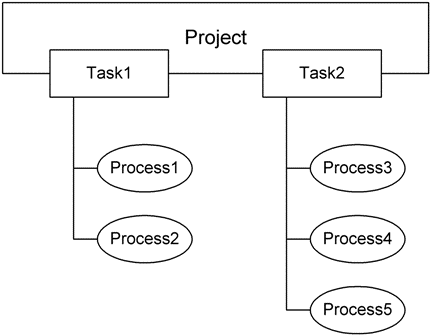
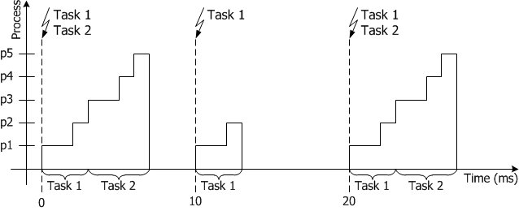

# Scheduling

The operating system schedules the execution of processes defined in the modules. The definition of the schedule consists of grouping processes into sequences where each sequence defines a task in the operating system task schedule. The tasks are activated by the operating system in different modes, for instance periodically by timers, or by software or external events.

The figure above shows two tasks with processes assigned to them. Task1 is activated every 10ms, and has a higher priority than Task2, which is activated every 20ms. The running times of the processes are as follows: p1= 2ms, p2 = 1ms, p3= 2ms, p4 = 1ms, p5 = 1ms. The scheduling would then look like this:

The ERCOSEK operating system (used with the PC target and with the ES113x ASCET-RP targets) knows the following kinds of scheduling:

- cooperative scheduling
- preemptive scheduling

See also

[Cooperative Scheduling](cooperative_scheduling.md)

[Preemptive Scheduling](preemptive_scheduling.md)
