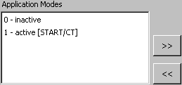

# Assigning/Deassigning Application Modes to a Task

To assign application modes to a task, proceed as follows:

1. Select one or more operating modes in the Application Modes pane.

You can select several application modes by clicking on them while pressing the Ctrl key.

1. Select the task you want to assign to the application mode(s) in the Tasks pane.
1. Do one of the following:
1. In the Task menu, select Deassign Application Modes to deassign the application mode.

Instead of the menu functions, you can use the context menus in the respective panes or the buttons shown here.

