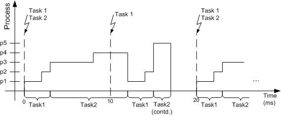

# Cooperative Scheduling

In cooperative scheduling, the current process is not interrupted if a task with a higher priority is activated. A new task starts after the current process is finished. If the current task (the one that gets interrupted) has more processes to execute, it pauses until the interrupting task is completed. After the interrupting task is completed, the interrupted task is continued. This type of scheduling is illustrated in the figure below, where the running times of processes are p1 = 2ms, p2 = 1ms, p3 = 5ms, p4 = 4ms, and p5 = 2ms.

See also

[Preemptive Scheduling](preemptive_scheduling.md)

[Tasks](PE_tasks.md)

[Processes](PE_processes.md)
