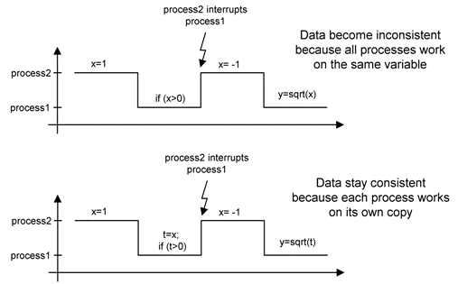

# Interprocess Communication

The communication between processes is achieved via messages, which are protected global variables in ERCOSEK. Data consistency is achieved by working on copies of the actual variable whenever a copy is required.

The figure below shows how data inconsistency may occur in a preemptive system. To avoid this conflict, the interprocess communication is modelled with messages. At the beginning of a process, all input messages (those messages that are only read) are received by the process. Upon receiving a message, an automatic temporary copy of the message is produced, on which the process works. At the end of the process, all messages that are written to are copied back to the actual message. This mechanism guarantees that the values of the variables are left unchanged within a process, unless the process itself changes its value.

The use of protected global variables for interprocess communication, i.e. the use of state messages, is appropriate for embedded control systems. There is no dependence between the sender and the receiver of a message, so that no complicated and run time consuming synchronization scheme is required. Secondly, when using state messages there is no one-to-one relation between a sender and the receiver. Therefore a message can be received by more than one process.

The messages mechanism is based on the ERCOSEK message principle. The ERCOSEK development environment contains an offline system optimization feature,where message implementation can be optimized. Here copies are only introduced,if data consistency is endangered, and copies are only produced at the beginning and the end of a task.

The interprocess communication is resolved by the project. Messages with the same name are bound to each other and represent the same message. If, for example, two processes use the message velocity, they communicate by writing to and reading from this variable. The same name-based resolution mechanism is performed on other global objects as well, e.g. global variables or global parameters.

ASCET supports several message copy semantics for experiment code (see [Message Copy Semantics for Experiment Code](PE_MessageCopySemanticsExperiment.md)) and production code (see the ASCET-SE user's guide).

See also

[Messages](IntroductionEnglishUS.chm::/INT_messages.htm)
