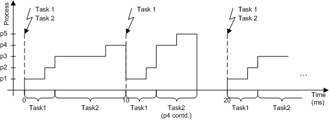

# Preemptive Scheduling

In preemptive scheduling, the current process is directly interrupted, whenever a task with a higher priority is activated. Since all cooperative tasks have lower priorities than preemptive or non-preemptable tasks, preemptive tasks cannot be interrupted by cooperative tasks. After the interrupting task is completed, the process is resumed. The figure below shows the same scenario as for cooperative tasks (i.e. the process running times p1 = 2ms, p2 = 1ms, p3 = 5ms, p4 = 4ms, and p5 = 2ms) with preemptive scheduling.

See also

[Cooperative Scheduling](cooperative_scheduling.md)

[Tasks](PE_tasks.md)

[Processes](PE_processes.md)
