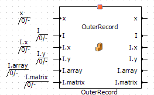
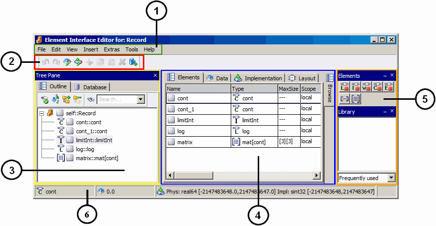

# Merged CHM Content

## Records - Overview

_Source: `markdown/RC_overview.md`_

# Records - Overview

ASCET provides the possibility to specify records as user-defined composite data types.

All elements in a record are placed in the same memory class (i.e. the record is generated as C struct), in consecutive bytes in a coherent memory area. The record elements inherit the memory class from the instance of the record. By sorting the record elements in the record implementation editor, the record layout in the memory can be determined on the byte level.

By default, ASCET generates a struct declaration for each record. In addition, you can mark a record as "declared externally" and use an externally declared record in your ASCET model.

In the AUTOSAR context, records can be used to model AUTOSAR data element prototypes of SenderReceiver and NVData interfaces or operation arguments of client-server interfaces.

In a non-AUTOSAR context, records are used to group related data.

Unlike classes, records have neither diagrams nor methods.

See also

[Allowed Content](markdown/RC_Allowed_Content.md)

[Records in Block Diagrams](markdown/RC_Records_in_Block_Diagrams.md)

[Records in ESDL](markdown/RC_Records_in_ESDL_CCode.md)

[Externally Declared Records](markdown/RC_ExternallyDeclaredRecords.md)

You can

[Create a Record](markdown/RC_Creating_a_Record.md)

[Specify a Record](markdown/RC_Specifying_a_Record.md)

[Edit a Record Implementation](markdown/RC_Edit_RecordImplementation.md)

---

## Allowed Record Content

_Source: `markdown/RC_Allowed_Content.md`_

# Allowed Record Content

A record can contain the following elements:

- scalar variables (cont, limitInt, wrapInt, sdisc, udisc, log)
- enumerations

- other records

Nested records (i.e. record A contains record B, which contains record C, etc.) are allowed. Loops (record A contains record B, which contains record A) are forbidden; using them leads to a code generation error (EMake10).

- arrays
- matrices

If a record containing a matrix is included in a SenderReceiver or NVData interface, or used as an interrunnable variable, the code generation produces an error (MMdl651).

The following restrictions apply to the content of a record:

- Records cannot contain characteristic lines/maps or components.
- Records cannot contain references.
- Set ports for scalar record elements (cont, imitInt, wrapInt, sdisc, udisc, log, enumeration) are always enabled.
- Set ports for non-scalar record elements (record, array, matrix) are always disabled.
- Get ports are enabled for all record elements.

You can edit the properties, data, and implementations of elements in a record, however, the available options are limited.

See also

[Specifying a Record](markdown/RC_Specifying_a_Record.md)

[Including a Component via the Block Library](markdown/rceIncludeComponent_via_BlockLibrary.md)

---

## Records in Block Diagrams

_Source: `markdown/RC_Records_in_Block_Diagrams.md`_

# Records in Block Diagrams

When a record is inserted into a block diagram, it is displayed like other included components. By default, Get and Set ports <!-- kadovTextPopupInit('a2'); //--><!-- kadovTextPopupInit('a1'); //-->for the elements in the record are shown. If the record contains another record, Get and Set ports are shown for all elements in the nested record, as well as for the nested record itself.

You can edit the record layout in the [layout editor](LayoutEditorEnglishUS.chm::/LEd_Overview.htm). There, you can show or hide individual record ports.

Write access via a Set port requires a [sequence call](BlockDiagramEditorEnglishUS.chm::/BDE_SequenceCalls.htm).

An example:

The record InnerRecord is defined as follows:

record type InnerRecord {

cont x;

cont y;

cont array[4];

cont matrix[4][4];

}

The record OuterRecord contains a continuous variable x and the record InnerRecord. It is defined as follows:

record type OuterRecord {

cont x;

record InnerRecord I;

}

Included in a block diagram, OuterRecord looks as follows:

See also

[Allowed Content](markdown/RC_Allowed_Content.md)

[Records in ESDL](markdown/RC_Records_in_ESDL_CCode.md)

[Layout Editor - Overview](LayoutEditorEnglishUS.chm::/LEd_Overview.htm)

[Sequence Calls](BlockDiagramEditorEnglishUS.chm::/BDE_SequenceCalls.htm)

---

## Records in ESDL and C Code

_Source: `markdown/RC_Records_in_ESDL_CCode.md`_

# Records in ESDL

In ESDL, record elements can be accessed directly, e.g.,

myRecord.y = myRecord.x

Individual elements of included records can be accessed the same way, provided the ports are enabled (for restrictions, see [Allowed Content](markdown/RC_Allowed_Content.md)). It is not allowed, however, to use the Set port of the included record itself.

An example:

The record InnerRecord is defined as follows:

record type InnerRecord {

cont x;

cont y;

}

The record OuterRecord contains a continuous variable x and the record InnerRecord. It is defined as follows:

record type OuterRecord {

cont x;

record InnerRecord I;

}

Statements of the following kind are allowed:

OuterRecord.x = OuterRecord.I.x;

OuterRecord.I.y = myValue;

See also

[Allowed Content](markdown/RC_Allowed_Content.md)

[Records in Block Diagrams](markdown/RC_Records_in_Block_Diagrams.md)

---

## Externally Declared Records

_Source: `markdown/RC_ExternallyDeclaredRecords.md`_

# Externally Declared Records

You can mark a record as "declared externally" (see [Editing a Record Implementation](markdown/RC_Edit_RecordImplementation.md)). The following rules apply to externally declared records in an ASCET model:

- If the record implementation is set to Generate struct, and the record does not contain any elements, an error (MMdl50) is issued during code generation.
- If the record implementation is set to Use external struct or Use external typedef, and the record does not contain any elements, an error (MMdl501) is issued during code generation for each instance of the record (but not for a reference, method argument or return).
- If a record with activated Use external struct or Use external typedef includes a record with Generate struct (i.e. a record that is declared by ASCET), an error (MMdl502) is issued during code generation.
- If the record implementation is set to Use external struct or Use external typedef, and the order of record elements is not user-defined, an error (MMdl510) is issued during code generation.
- If the record implementation is NOT set to Generate struct and

- the record is used in an AUTOSAR context,

or

- the record is used in an EHOOKS context,

an error (MMdl503) is issued during code generation.

##### ASCET-SE features:

- If Generate struct is activated, a header file that contains the structure definition for the record is generated.
- If Use external struct or Use external typedef is activated, no header file is generated for the record.
- The name of the struct is set to the name specified in the [External Struct tab](ImplementationEditorEnglishUS.chm::/IEd_ExternalStruct_Tab.htm) of the record implementation editor.

If no name is specified, the name template in the [target settings](ComponentManagerEnglishUS.chm::/CM_TargetsNode.htm) of the respective target is used.

##### Experiments:

- A record with activated Use external struct or Use external typedef can only be used in an experiment if it contains only scalar elements. For records that include arrays, matrices or other records, an error (MMdl6421) is issued.

See also

[Editing a Record Implementation](markdown/RC_Edit_RecordImplementation.md)

[External Struct Tab](ImplementationEditorEnglishUS.chm::/IEd_ExternalStruct_Tab.htm)

[ASCET Options Window - Targets Node](ComponentManagerEnglishUS.chm::/CM_TargetsNode.htm)

---

## Creating a Record

_Source: `markdown/RC_Creating_a_Record.md`_

# Creating a Record

To create and open a record, proceed as follows:

1. In the Component Manager, select the folder for the new record.
1. Do one of the following:
1. If you are working with a database larger than 3 GB, [another step is inserted](javascript:BSSCPopup('codegen_dbtoolarge.htm');)<!-- kadovFilePopupInit('a1'); //-->.
1. Edit the name and press Enter.

See also

[Creating a Record from an Existing Class](markdown/RC_Create_Record_from_Class.md)

[Opening a Record](markdown/RC_Opening_a_Record.md)

[Specifying a Record](markdown/RC_Specifying_a_Record.md)

/* Heikki Komulainen, Comet Computer GmbH 2004 */ cc_plus_pic = '&nbsp;'; cc_minus_pic = '&nbsp;'; cc_stat_pic = '&nbsp;'; gpstyle = ''; var iframes_created = 0; if (document.body && document.body.insertAdjacentHTML && document.getElementsByTagName && document.getElementById) { collect_popups(); set_poplinks_pictures(); if (iframes_created) { document.write(gpstyle); document.write('
<nobr><a id="einauslink" style="position:absolute;top:expression(document.body.scrollTop + this.offsetHeight - this.offsetHeight);left:expression(document.body.offsetWidth - (this.offsetWidth + 28));background:#ffffe0;padding:5px" href="javascript:show_all_poptext()">Show all hidden text</a></nobr>
'); } } function collect_popups() { bsscpopups = new Array(); for (x = 0; x < document.links.length; x++) { if (document.links[x].href.indexOf("BSSCPopup")>-1) { seekmatch = /BSSCPopup.'[^'](markdown/+)'/; poplink = seekmatch.exec(document.links[x].href); poplink = "" + poplink; poplink = poplink.substring(poplink.indexOf("'")+1, poplink.lastIndexOf("'")); ifid = "CCGENIFRAMEID" + x; new_iframe = '<iframe id="' + ifid + '"src="' + poplink + '" onload="get_text(\'' + ifid + '\')" width="0" height="0" frameborder=0></iframe>'; document.links[x].parentNode.insertAdjacentHTML("afterEnd", new_iframe); gpid = "CCID_" + ifid; document.links[x].href = "javascript:expand_poptext('" + gpid + "')"; cc_plus = '' + cc_plus_pic + ''; document.links[x].insertAdjacentHTML("afterBegin", cc_plus); iframes_created = 1; } } }// end function function get_text(ifr_id) { frpars = document.frames[ifr_id].document.getElementsByTagName("body"); popbody = frpars[0].innerHTML; gpid = "CCID_" + ifr_id; if (!document.getElementById(gpid)) { //avoiding doubles document.getElementById(ifr_id).insertAdjacentHTML("afterEnd", '
'+popbody+'
'); } }//end function function expand_poptext(x_frame_id) { if (!document.getElementById(x_frame_id)) return; if (document.getElementById(x_frame_id).className == "CCGENPOPTEXTH") { document.getElementById(x_frame_id).className = "CCGENPOPTEXTV"; document.getElementById(x_frame_id).style.visibility = "visible"; if (document.getElementById("CCPMB_" + x_frame_id )) { document.getElementById("CCPMB_" + x_frame_id ).innerHTML = cc_minus_pic; } } else { document.getElementById(x_frame_id).className = "CCGENPOPTEXTH"; document.getElementById(x_frame_id).style.visibility = "hidden"; if (document.getElementById("CCPMB_" + x_frame_id )) { document.getElementById("CCPMB_" + x_frame_id ).innerHTML = cc_plus_pic; } } }// end function function show_all_poptext() { var pulldowntxt = document.getElementsByTagName("div"); for (b = 0; b < pulldowntxt.length; b++) { if (pulldowntxt[b].className == "droptext") { pulldowntxt[b].style.display=""; } } var gptxt = document.getElementsByTagName("div"); for (z = 0; z < gptxt.length; z++) { if (gptxt[z].className == "CCGENPOPTEXTH") { gptxt[z].className = "CCGENPOPTEXTV"; gptxt[z].style.visibility = "visible"; if (document.getElementById("CCPMB_" + gptxt[z].id )) { document.getElementById("CCPMB_" + gptxt[z].id ).innerHTML = cc_minus_pic; } } } var dxpoplinks = document.getElementsByTagName("a"); if (dxpoplinks) { for (pxl = 0; pxl < dxpoplinks.length; pxl++) { if (dxpoplinks[pxl].href.indexOf("kadovTextPopup")>-1) { if (document.getElementById("CCPMB_" + dxpoplinks[pxl].id)) { document.getElementById("CCPMB_" + dxpoplinks[pxl].id).innerHTML = cc_stat_pic; dxpoplinks[pxl].symbol = "minus"; } } } } document.getElementById('einauslink').innerText = 'Hide all hideable text'; document.getElementById('einauslink').href = "javascript:self.location.reload()"; self.focus(); }// end function function eat_click() { return false; }// end function function set_poplinks_pictures() { var dpoplinks = document.getElementsByTagName("a"); if (dpoplinks) { for (pl = 0; pl < dpoplinks.length; pl++) { if (dpoplinks[pl].href.indexOf("kadovTextPopup")>-1) { cc_plus = '' + cc_stat_pic + ''; //dpoplinks[pl].onmouseup = plusminuspoplink; dpoplinks[pl].insertAdjacentHTML("afterBegin", cc_plus); dpoplinks[pl].symbol = "plus"; } } } }// end function function plusminuspoplink() { if (document.getElementById("CCPMB_" + this.id)) { if (this.symbol == "plus") { document.getElementById("CCPMB_" + this.id).innerHTML = cc_minus_pic; this.symbol = "minus"; } else { document.getElementById("CCPMB_" + this.id).innerHTML = cc_plus_pic; this.symbol = "plus"; } } return true; }

---

## Creating a Record from an Existing Class

_Source: `markdown/RC_Create_Record_from_Class.md`_

# Creating a Record from an Existing Class

A record can be created from an existing ASCET class. To do so, proceed as follows.

1. In the Component Manager, select the class you want to reproduce as record.

You can convert classes specified as block diagrams, in ESDL or C code, Boolean tables and conditional tables. State machines and CT blocks cannot be converted into records.

1. In the Edit menu, point to Reproduce As and select Record.

The new record is created in the same folder as the original one. It is named Record_<class name>. The new record contains all local variables from the class that are allowed in a record.

Class elements of other [kind](IntroductionEnglishUS.chm::/INT_summaryke.htm) than variables (e.g., parameter, system constant, constant), or of other [scopes](IntroductionEnglishUS.chm::/INT_the_scope_of_elements.htm) than local, are not included in the record. Even classes in the converted class are neither included in the record nor converted into records themselves.

1. Double-click on the new item to open the record editor.

See also

[Component Manager - Copying Database/Workspace Items and Structures](ComponentManagerEnglishUS.chm::/copying_databaseitems.htm)

[Opening a Record](markdown/RC_Opening_a_Record.md)

[Allowed Content](markdown/RC_Allowed_Content.md)

[The Kind of Elements - Summary](IntroductionEnglishUS.chm::/INT_summaryke.htm)

[The Scope of Elements](IntroductionEnglishUS.chm::/INT_the_scope_of_elements.htm)

---

## Opening a Record

_Source: `markdown/RC_Opening_a_Record.md`_

# Opening a Record

To open a record in the record editor, proceed as follows:

1. In the Component Manager, select the desired record.
1. Do one of the following:
1. Double-click on the record

- In the Edit menu, select Open Component

- Select Open Component from the record's context menu

- Press Return.

The selected item opens in the record editor.

See also

[Specifying a Record](markdown/RC_Specifying_a_Record.md)

[Creating a Record](markdown/RC_Creating_a_Record.md)

---

## Specifying a Record

_Source: `markdown/RC_Specifying_a_Record.md`_

# Specifying a Record

To specify a record, proceed as follows:

1. Open the record in the record editor.
1. Click on a button in the Elements palette or toolbar to add a scalar or non-scalar variable.
1. If necessary, adjust the element settings, and close the Properties editor with OK.
1. Click on the  Insert Component button to add another record.
1. In the Select Item window, select the record you want to include.
1. Click OK to close the window.

The variable or record is inserted. You can edit its properties, data, or implementation later.

See also

[Opening a Record](markdown/RC_Opening_a_Record.md)

[Including a Component via the Block Library](markdown/rceIncludeComponent_via_BlockLibrary.md)

[Properties Editor for Implementation Casts, Record Elements and Mode Groups](ElementEditorEnglishUS.chm::/EEd_PropertiesEditor_ModeGroups.htm)

[Editing a Record Implementation](markdown/RC_Edit_RecordImplementation.md)

[Implementing a Record Element](markdown/RC_Implementing_RecordElement.md)

[Implementing a Record Instance](markdown/RC_Implementing_RecordInstance.md)

[Reserved Keywords](IntroductionEnglishUS.chm::/INT_Reserved_Keywords.htm)

---

## Including a Component via the Block Library

_Source: `markdown/rceIncludeComponent_via_BlockLibrary.md`_

# Including a Component via the Block Library

When you stored frequently used components in a block library, you can include them via the Library palette. Proceed as follows.

1. In the Tree pane, go to the Outline tab.
1. In the Library palette, use the combo box to select the category that contains the desired item.
1. In the item list, select the item you want to add to the record.
1. Drag the item to the Outline tab or to the drawing area.

The item is included in the record.

See also

[Block Libraries](ComponentManagerEnglishUS.chm::/CM_BlockLibraries.htm)

[Library Palette](markdown/rceLibraryPalette.md)

---

## Opening the Implementation Editor for Records

_Source: `markdown/RC_Open_ImplementationEditor_Record.md`_

# Opening the Implementation Editor for Records

To open the implementation editor of a record, proceed as follows.

1. Open the record in the record editor.
1. In the Outline pane, select the top-most entry, self::<record name>.
1. Do one of the following:

- From the Edit menu, select Implementation
- right-click the entry and select Implementation from the context menu
- click on the  Edit Component Implementation button.
- press Ctrl + Shift + i.

The implementation editor for records opens.

See also

[Editing a Record Implementation](markdown/RC_Edit_RecordImplementation.md)

[Implementing a Record Element](markdown/RC_Implementing_RecordElement.md)

[Implementing a Record Instance](markdown/RC_Implementing_RecordInstance.md)

---

## Editing a Record Implementation

_Source: `markdown/RC_Edit_RecordImplementation.md`_

1. Activate the User defined order of elements option.
1. In the Elements table, select a record element.
1. In the Element menu or the context menu, select Move up or Move down to move the record element.

With that, you determine the position of the record elements in the memory area covered by the record.

# Editing a Record Implementation

To edit the implementation of a record, proceed as follows.

1. [Open the implementation editor of the record](markdown/RC_Open_ImplementationEditor_Record.md).
1. To adjust the order of elements in the record, [proceed as follows](javascript:kadovTextPopup(this))<!-- kadovTextPopupInit('a1'); //-->.
1. Add implementations as described in [Creating or Copying an Implementation](ImplementationEditorEnglishUS.chm::/ied_create_copy_implementation.htm).
1. Select the implementation you want to edit and do the following:
1. Click OK to close the implementation editor of the record and accept your settings.

See also

[Implementation Editor for Components and Projects](ImplementationEditorEnglishUS.chm::/IEd_ImplementationEditor_for_ComponentsProjects.htm)

[Creating or Copying an Implementation](ImplementationEditorEnglishUS.chm::/ied_create_copy_implementation.htm)

[Opening the Implementation Editor for an Element (C)](ImplementationEditorEnglishUS.chm::/IEd_open_compo_project.htm)

[Implementation Editor for Component References](ImplementationEditorEnglishUS.chm::/IEd_ImplRefEditor.htm)

[External Struct Tab](ImplementationEditorEnglishUS.chm::/IEd_ExternalStruct_Tab.htm)

[Externally Declared Records](markdown/RC_ExternallyDeclaredRecords.md)

/* Heikki Komulainen, Comet Computer GmbH 2004 */ cc_plus_pic = '&nbsp;'; cc_minus_pic = '&nbsp;'; cc_stat_pic = '&nbsp;'; gpstyle = ''; var iframes_created = 0; if (document.body && document.body.insertAdjacentHTML && document.getElementsByTagName && document.getElementById) { collect_popups(); set_poplinks_pictures(); if (iframes_created) { document.write(gpstyle); document.write('
<nobr><a id="einauslink" style="position:absolute;top:expression(document.body.scrollTop + this.offsetHeight - this.offsetHeight);left:expression(document.body.offsetWidth - (this.offsetWidth + 28));background:#ffffe0;padding:5px" href="javascript:show_all_poptext()">Show all hidden text</a></nobr>
'); } } function collect_popups() { bsscpopups = new Array(); for (x = 0; x < document.links.length; x++) { if (document.links[x].href.indexOf("BSSCPopup")>-1) { seekmatch = /BSSCPopup.'[^'](markdown/+)'/; poplink = seekmatch.exec(document.links[x].href); poplink = "" + poplink; poplink = poplink.substring(poplink.indexOf("'")+1, poplink.lastIndexOf("'")); ifid = "CCGENIFRAMEID" + x; new_iframe = '<iframe id="' + ifid + '"src="' + poplink + '" onload="get_text(\'' + ifid + '\')" width="0" height="0" frameborder=0></iframe>'; document.links[x].parentNode.insertAdjacentHTML("afterEnd", new_iframe); gpid = "CCID_" + ifid; document.links[x].href = "javascript:expand_poptext('" + gpid + "')"; cc_plus = '' + cc_plus_pic + ''; document.links[x].insertAdjacentHTML("afterBegin", cc_plus); iframes_created = 1; } } }// end function function get_text(ifr_id) { frpars = document.frames[ifr_id].document.getElementsByTagName("body"); popbody = frpars[0].innerHTML; gpid = "CCID_" + ifr_id; if (!document.getElementById(gpid)) { //avoiding doubles document.getElementById(ifr_id).insertAdjacentHTML("afterEnd", '
'+popbody+'
'); } }//end function function expand_poptext(x_frame_id) { if (!document.getElementById(x_frame_id)) return; if (document.getElementById(x_frame_id).className == "CCGENPOPTEXTH") { document.getElementById(x_frame_id).className = "CCGENPOPTEXTV"; document.getElementById(x_frame_id).style.visibility = "visible"; if (document.getElementById("CCPMB_" + x_frame_id )) { document.getElementById("CCPMB_" + x_frame_id ).innerHTML = cc_minus_pic; } } else { document.getElementById(x_frame_id).className = "CCGENPOPTEXTH"; document.getElementById(x_frame_id).style.visibility = "hidden"; if (document.getElementById("CCPMB_" + x_frame_id )) { document.getElementById("CCPMB_" + x_frame_id ).innerHTML = cc_plus_pic; } } }// end function function show_all_poptext() { var pulldowntxt = document.getElementsByTagName("div"); for (b = 0; b < pulldowntxt.length; b++) { if (pulldowntxt[b].className == "droptext") { pulldowntxt[b].style.display=""; } } var gptxt = document.getElementsByTagName("div"); for (z = 0; z < gptxt.length; z++) { if (gptxt[z].className == "CCGENPOPTEXTH") { gptxt[z].className = "CCGENPOPTEXTV"; gptxt[z].style.visibility = "visible"; if (document.getElementById("CCPMB_" + gptxt[z].id )) { document.getElementById("CCPMB_" + gptxt[z].id ).innerHTML = cc_minus_pic; } } } var dxpoplinks = document.getElementsByTagName("a"); if (dxpoplinks) { for (pxl = 0; pxl < dxpoplinks.length; pxl++) { if (dxpoplinks[pxl].href.indexOf("kadovTextPopup")>-1) { if (document.getElementById("CCPMB_" + dxpoplinks[pxl].id)) { document.getElementById("CCPMB_" + dxpoplinks[pxl].id).innerHTML = cc_stat_pic; dxpoplinks[pxl].symbol = "minus"; } } } } document.getElementById('einauslink').innerText = 'Hide all hideable text'; document.getElementById('einauslink').href = "javascript:self.location.reload()"; self.focus(); }// end function function eat_click() { return false; }// end function function set_poplinks_pictures() { var dpoplinks = document.getElementsByTagName("a"); if (dpoplinks) { for (pl = 0; pl < dpoplinks.length; pl++) { if (dpoplinks[pl].href.indexOf("kadovTextPopup")>-1) { cc_plus = '' + cc_stat_pic + ''; //dpoplinks[pl].onmouseup = plusminuspoplink; dpoplinks[pl].insertAdjacentHTML("afterBegin", cc_plus); dpoplinks[pl].symbol = "plus"; } } } }// end function function plusminuspoplink() { if (document.getElementById("CCPMB_" + this.id)) { if (this.symbol == "plus") { document.getElementById("CCPMB_" + this.id).innerHTML = cc_minus_pic; this.symbol = "minus"; } else { document.getElementById("CCPMB_" + this.id).innerHTML = cc_plus_pic; this.symbol = "plus"; } } return true; }

---

## Implementing a Record Element

_Source: `markdown/RC_Implementing_RecordElement.md`_

# Implementing a Record Element

To edit the implementation of a scalar element, array or matrix in a record, proceed as follows.

1. In the Outline tab of the record editor, select the element.
1. Do one of the following:
1. Specify the implementation, e.g. as described in [Specifying Individual Implementations](ImplementationEditorEnglishUS.chm::/specifying_individual_impl.htm).
1. Close the implementation editor with OK.

The implementation of a record instance is described in [Implementing a Record Instance](markdown/RC_Implementing_RecordInstance.md).

See also

[Editing Implementations - Specifying Individual Implementations](implementationeditorenglishus.chm::/specifying_individual_impl.htm)

[Implementing a Record Instance](markdown/RC_Implementing_RecordInstance.md)

---

## Implementing a Record Instance

_Source: `markdown/RC_Implementing_RecordInstance.md`_

# Implementing a Record Instance

To edit the implementation of a record instance in a record, proceed as follows.

1. In the Outline tab of the record editor, select the record instance.
1. Do one of the following:
1. In the Implementation of Instance combo box, select the record implementation you want to use for the current record instance.
1. In the Memory Location of Instance combo box, select the memory class for the current record instance.
1. Close the Impl Ref. Editor window with OK.

See also

[Editing Implementations - Implementation Editor for Referenced Components](ImplementationEditorEnglishUS.chm::/IEd_ImplRefEditor.htm)

[Implementing a Record Element](markdown/RC_Implementing_RecordElement.md)

---

## Filtering the Outline Tab

_Source: `markdown/rc_filter_component_pane.md`_

# Filtering the Outline Tab

The Outline tab can be filtered. To do so, proceed as follows.

1. In the Outline tab, click on the  button.

The Options window opens in the Outline Tree node.

1. In the Elements subnode, activate the options of the items you want to display in the tab.
1. Click OK to close the Options window.

Only items with activated options are shown in the tab. The button is marked with a green symbol to indicate an active filter: 

The filter settings made here affect all component editors.

See also

[Searching the Tree Pane](IntroductionEnglishUS.chm::/INT_SearchTreePane.htm)

---

## Description of the Window Elements

_Source: `markdown/rcewindowsdescription.md`_

# Description of the Window Elements

The Element Interface Editor for Records contains the following window elements:

1. [Menu Bar](markdown/rcemenubar.md)
1. Toolbar with the following function blocks:
1. [Tree pane](markdown/rcecomponentpane.md) contains the following tab:
1. View Area contains the following view:
1. status bar

The status bar contains information on the element currently selected in the Outline tab (if the Mouse Over option on the [Editors](ComponentManagerEnglishUS.chm::/cm_options_for_editors.htm) node of the ASCET options is deactivated) or on the element in the Outline tab the mouse is currently placed on (if the Mouse Over option is activated).

---

## Menus

_Source: `markdown/rcemenubar.md`_

# Menu Bar

The menu bar contains the following menus:

- [File](markdown/RCEfileMenu.md)
- [Edit](markdown/rceeditmenu.md)
- [View](markdown/RCEviewMenu.md)
- [Insert](markdown/RCEinsertMenu.md)
- [Extras](markdown/RCEextrasMenu.md)
- [Tools](markdown/RCEtoolsMenu.md)
- [Help](markdown/RCEhelpMenu.md)

---

## File Menu

_Source: `markdown/RCEfileMenu.md`_

# File Menu

The menu File contains the following functions:

Save (Ctrl + s)

Saves the current record.

Import

Data

| Column 1 | Column 2 |
| --- | --- |
| For Selected Element | Imports data for a selected element. |

Export

Component

Exports the current record into an export-file.

Data

Exports data, according to the selected submenu.

| Column 1 | Column 2 |
| --- | --- |
| For Component | Exports a component dataset. |
| For selected Element | Exports data for the selected elements. |

Close

Closes the Element Interface Editor.

---

## Edit Menu

_Source: `markdown/rceeditmenu.md`_

# Edit Menu

The menu Edit contains the following functions:

Copy (Ctrl + c)

Copies a selected element (in the Element tab), the Data (in the Data tab) or the implementation (in the Implementation tab) of a selected element to the ASCET clipboard.

Paste (Ctrl + v)

Pastes an element (in the Element tab) from the ASCET clipboard to the record. Or pastes the Data (in the Data tab) or the implementation (in the Implementation tab) from the ASCET clipboard to the selected element.

Works for data only if the receiving has the same type as the giving one.

Delete (Del)

Deletes a selected element from the record.

Rename (F2)

Renames a selected element from the record.

Search (Ctrl + Shift + s)

Searches the component as described in [Browsing the Database or Workspace](ComponentManagerEnglishUS.chm::/Browsing.htm). The range is limited to the edited component and its included components.

Replace Component

Replaces an included record with another record. The name of the old record remains.

Open Component

Opens the specification editor for a selected included record.

Notes

Opens the notes editor for an included record - you can make notes about the included record here.

Properties (Ctrl + Shift + p)

Edits the properties of the selected element.

Data (Ctrl + Shift + d)

Opens the data editor for the selected element.

Properties (Ctrl + Shift + p)

Edits the properties of the selected element.

Data (Ctrl + Shift + d)

Opens the data editor for the selected element.

Implementation (Ctrl + Shift + i)

The implementation editor for the selected element opens. Search of component implementations is possible.

Set Cache Locking

These menu options are used in connection with ASCET-RP. See [ES1135: Cache Locking](INTECRIOConnectivityRPEnglishUS.chm::/IIO_ES1135CacheLocking.htm) for a description.

Component

| Column 1 | Column 2 |
| --- | --- |
| Data | Opens the data editor for the component. Search of component data is possible. |
| Implementation | Opens the implementation editor for the component. Search of component implementations is possible. |
| Layout | Opens the layout editor for the component. |
| Notes | Opens the notes editor - you can make notes about the component here. |

---

## View Menu

_Source: `markdown/RCEviewMenu.md`_

# View Menu

The menu View contains the following functions:

Show/Hide

Shows/hides several parts of the editor or the component.

| Column 1 | Column 2 |
| --- | --- |
| Tree Pane | Shows/hides the Tree Pane. |
| Toolbars | Shows/hides the General and Elements toolbar. |
| Palettes | Shows/hides the Elements palette. |

Configure

| Column 1 | Column 2 |
| --- | --- |
| Toolbar General | Opens a dialog window to select the buttons to be visible in the General toolbar. |
| Toolbar Elements | Opens a dialog window to select the buttons to be visible in the Elements toolbar. |
| Reset Toolbar Configuration | Resets the toolbar to default configuration. |

---

## Insert Menu

_Source: `markdown/RCEinsertMenu.md`_

# Insert Menu

The menu Insert contains the following functions:

Component

Opens the dialog window Select Item where the record to be added is selected.

---

## Extras Menu

_Source: `markdown/RCEextrasMenu.md`_

# Extras Menu

The menu Extras contains the following functions:

Browse to Parent Component

Opens an editor for the including component. (The option is only available if an included component is being edited.)

Show Path

Shows the path of an element or included component.

Copy Path to Clipboard

Copies the path of an included component to the clipboard.

| Column 1 | Column 2 |
| --- | --- |
| Model Path | Model Path. |
| Model asd:// Link | Path in ASCET protocol format that allows operating/referencing an ASCET component in a model as hyperlink. |
| Database Path | Database/Workspace Path. |
| Database asd:// Link | Path in ASCET protocol format that allows operating/referencing an ASCET component in the database/workspace as hyperlink. |

Create ASCET Link

Creates an [ASCET link](IntroductionEnglishUS.chm::/INT_ASCETLinks.htm) for an element selected in the Outline tab. The link opens the record in the record editor and (except for the self element, i.e. the root of the element tree) highlights the element in the Outline tab.

---

## Tools Menu

_Source: `markdown/RCEtoolsMenu.md`_

# Tools Menu

The menu Tools contains the following functions:

Options

Opens the ASCET options dialog window.

See also

[Setting ASCET Options](ComponentManagerEnglishUS.chm::/SettingASCET.htm)

---

## Help Menu

_Source: `markdown/RCEhelpMenu.md`_

# Help Menu

The menu Help contains the following functions:

Contents (F1)

Shows the help contents.

Index

Shows the help index.

---

## Toolbars

_Source: `markdown/RE_Toolbars.md`_

# Toolbars

The Element Interface Editor for Records contains the following menus:

- [Toolbar General](markdown/rcetoolbargeneral.md)
- [Toolbar Elements](markdown/rcetoolbarelements.md)

---

## Toolbar General

_Source: `markdown/rcetoolbargeneral.md`_

# Toolbar General

The toolbar General contains following icons:

| Column 1 | Column 2 |
| --- | --- |
|  | Edit Component Data |
|  | Edit Component Implementation |
|  | Copy |
|  | Paste |
|  | Delete |
|  | Insert Component |

---

## Toolbar Elements

_Source: `markdown/rcetoolbarelements.md`_

# Toolbar Elements

The toolbar Elements contains the following icons:

<table style="x-cell-content-align: Top;
				margin-top: 3px;
				border-left-style: Outset;
				border-top-style: Outset;
				border-right-style: Outset;
				border-bottom-style: Outset;
				border-left-width: 1px;
				border-right-width: 1px;
				border-top-width: 1px;
				border-bottom-width: 1px;" x-use-null-cells="">
<col/>
<col/>
<col/>
<tr class="hcp1" valign="top">
<td class="hcp2">

</td>
<td class="hcp2">

Variable
</td>
<td class="hcp2" colspan="1" rowspan="1">

The  button opens the element type 
 selection menu. The Variable button can be used 
 to create elements of type logic, limitInt, wrapInt, udisc, sdisc, or 
 cont.

By default, the limitInt and wrapInt types are displayed. To display the sdisc 
 and udisc types instead, the <a href="ComponentManagerEnglishUS.chm::/cm_options_for_editors.htm">editor 
 option</a> Use signed/unsigned discrete types must 
 be activated.
</td></tr>
<tr class="hcp1" valign="top">
<td class="hcp2">

</td>
<td class="hcp2">

Array
</td>
<td class="hcp2" colspan="1" rowspan="2">

 
</td></tr>
<tr class="hcp1" valign="top">
<td class="hcp2">

</td>
<td class="hcp2">

Matrix
</td>
</tr>
</table>

---

## Tree Pane

_Source: `markdown/rcecomponentpane.md`_

# Tree Pane

The tree pane contains the following tab:

##### Outline

The Outline tab contains the following options:

| Column 1 | Column 2 |
| --- | --- |
|  | Opens the Options dialog window, reduced to the settings of the Filter. |
|  | Changes the criteria of sort. |
|  | Expands the Outline tab. |
|  | Collapses the Outline tab. |
|  | Runs a search in the Outline tab for the admitted letters. |

##### Database/Workspace

The folders and items contained in the current database or workspace are displayed here. The database/workspace name is the root of the tree structure. Each database/workspace contains one or more folders, which in turn contain other folders and database/workspace items.

| Column 1 | Column 2 |
| --- | --- |
|  | Expands the Database/Workspace tree. |
|  | Collapses the Database/Workspace tree. |
|  | Runs a search in the Database/Workspace tab for the admitted letters. |

See also

[Context Menu Tree Pane](markdown/rcecontextmenucpcomponentsandelements.md)

[Filtering the Outline Tab](markdown/rc_filter_component_pane.md)

[Searching the Tree Pane](IntroductionEnglishUS.chm::/INT_SearchTreePane.htm)

---

## Context Menu Tree Pane

_Source: `markdown/rcecontextmenucpcomponentsandelements.md`_

# Context Menu Tree Pane

The context menu of a component or element contains the following functions:

Copy (Ctrl + c)

Copies a selected included component or element to the ASCET clipboard.

Paste (Ctrl + v)

Pastes a component or element of the ASCET clipboard.

Delete (Del)

Deletes a selected included component or element.

Rename (F2)

Renames a selected included component or element.

Replace Component

Replaces a component with another included component. The name of the old component remains.

Open Component

Opens the specification editor for a selected included component.

Notes

Opens the notes editor for a selected included component - you can make notes about the included component here.

Properties (Ctrl + Shift + p)

Opens the Properties editor for a selected included component or element.

Data (Ctrl + Shift + d)

Opens the data editor for a selected included component or element.

Implementation (Ctrl + Shift + i)

Opens the implementation editor for a selected included component or element. Search of component implementations is possible.

Set Cache Locking

These menu options are used in connection with ASCET-RP. See [ES1135: Cache Locking](INTECRIOConnectivityRPEnglishUS.chm::/IIO_ES1135CacheLocking.htm) for a description.

Show Path

Shows the path of an element or included component.

Copy Path to Clipboard

Copies the path of a selected element to the clipboard.

| Column 1 | Column 2 |
| --- | --- |
| Model Path | Model Path. |
| Model asd:// Link | Path in ASCET protocol format that allows operating/referencing an ASCET component in a model as hyperlink. |
| Database Path | Database/Workspace Path. |
| Database asd:// Link | Path in ASCET protocol format that allows operating/referencing an ASCET component in the database/workspace as hyperlink. |

Create ASCET Link

Creates an ASCET link (see [ASCET Links](IntroductionEnglishUS.chm::/INT_ASCETLinks.htm)) that opens the record in the record editor and (except for the self element, i.e. the root of the element tree) highlights the selected element.

Import

Data

| Column 1 | Column 2 |
| --- | --- |
| For Selected Element | Imports data for a selected element. |

Export

Component (Ctrl + e)

Exports the current component or element.

Data

Exports data, according to the selected submenu.

| Column 1 | Column 2 |
| --- | --- |
| For Component | Exports a component dataset. |
| For Selected Element | Exports data for the selected elements. |

Insert Component

Inserts a component in the editor.

---

## Browse View

_Source: `markdown/rceviewbrowse.md`_

# Browse View

The view Browse contains the following elements:

- Elements tab

This tab corresponds to the [element view](ComponentManagerEnglishUS.chm::/The_Element_View.htm) of the Component Manager.

- Data tab

This tab corresponds to the [data view](ComponentManagerEnglishUS.chm::/Data_View.htm) of the Component Manager.

- Implementation tab

This tab corresponds to the [implementation view](componentmanagerenglishus.chm::/ImplementationView.htm) of the Component Manager.

This tab corresponds to the [layout view](ComponentManagerEnglishUS.chm::/Layout_View.htm) of the Component Manager.

See also

[Element View](ComponentManagerEnglishUS.chm::/The_Element_View.htm)

[Data View](ComponentManagerEnglishUS.chm::/Data_View.htm)

[Implementation View](componentmanagerenglishus.chm::/ImplementationView.htm)

[Layout View](ComponentManagerEnglishUS.chm::/Layout_View.htm)

---

## Context Menu Browse View

_Source: `markdown/rcecontextmenubrowseview.md`_

# Context Menu Browse View

The context menu of the Browse view contains the following functions:

In the Layout tab, the context menu contains only the function Edit (Return).

Edit (Return)

Opens the Properties Editor of the selected element, data or implementation.

Copy (Ctrl + c)

Copies a selected element (in the Elements tab), the data (in the Data tab) or the implementation (in the Implementation tab) of a selected element to the ASCET clipboard.

Paste (Ctrl + v)

Elements tab: Pastes an element from the ASCET clipboard to the record.

Data tab: Pastes the data from the ASCET clipboard to the selected element.

Implementation tab: Pastes the implementation from the ASCET clipboard to the selected element.

Data and Implementation : Works only if the receiving element has the same type as the giving one.

Delete (Del)

Deletes a selected element from the record.

Rename (F2)

Renames a selected element from the record.

Create ASCET Link

Creates an ASCET link (see [ASCET Links](IntroductionEnglishUS.chm::/INT_ASCETLinks.htm)) for the selected element. The link opens the record and selects the element in the Elements, Data or Implementation tab of the record editor's Browse view.

In the Data or Implementation tab, the link also selects the data set or implementation set that was that was active when the link was created.

Select all (Ctrl + a)

Selects all elements in the Browse view.

See also:

[Introduction - ASCET Links](IntroductionEnglishUS.chm::/INT_ASCETLinks.htm)

[Properties Editor - Overview](ElementEditorEnglishUS.chm::/EEd_Overview.htm)

[Data Editor - Overview](DataEditorEnglishUS.chm::/DEd_Overview.htm)

[Implementation Editor - Overview](ImplementationEditorEnglishUS.chm::/IEd_Overview.htm)

[Layout Editor - Overview](LayoutEditorEnglishUS.chm::/LEd_Overview.htm)

---

## Elements Palette

_Source: `markdown/rcepalettespane.md`_

# Elements Palette

The palette Elements contains the following functions:

<table style="x-cell-content-align: Top;
				margin-top: 3px;
				border-left-style: Outset;
				border-top-style: Outset;
				border-right-style: Outset;
				border-bottom-style: Outset;
				border-left-width: 1px;
				border-right-width: 1px;
				border-top-width: 1px;
				border-bottom-width: 1px;" x-use-null-cells="">
<col style="width: 70px;"/>
<col style="width: 150px;"/>
<col/>
<tr class="hcp1" valign="top">
<td class="hcp2" colspan="1" rowspan="1" style="width:70px;" width="70px">

</td>
<td class="hcp2" style="width:150px;" width="150px">

Logic Variable
</td>
<td class="hcp2" colspan="1" rowspan="5">

The Variable buttons can 
 be used to create elements of type logic, limitInt, wrapInt, udisc, sdisc, 
 cont, or enumeration.

By default, the Limited Integer * 
 and Wrap-Around Integer * buttons are displayed. 
 To display the Signed Discrete * and Unsigned 
 Discrete * buttons instead, the <a href="ComponentManagerEnglishUS.chm::/cm_options_for_editors.htm">editor 
 option</a> Use signed/unsigned discrete types must 
 be activated.
</td></tr>
<tr class="hcp1" valign="top">
<td class="hcp2" colspan="1" rowspan="1" style="width:70px;" width="70px">

 ()
</td>
<td class="hcp2" colspan="1" rowspan="1" style="width:150px;" width="150px">

Limited Integer Variable  
(Signed Discrete Variable)
</td>
</tr>
<tr class="hcp1" valign="top">
<td class="hcp2" colspan="1" rowspan="1" style="width:70px;" width="70px">

 ()
</td>
<td class="hcp2" colspan="1" rowspan="1" style="width:150px;" width="150px">

Wrap-Around Integer Variable 
(Unsigned Discrete Variable)
</td>
</tr>
<tr class="hcp1" valign="top">
<td class="hcp2" style="width:70px;" width="70px">

</td>
<td class="hcp2" style="width:150px;" width="150px">

Continuous Variable
</td>
</tr>
<tr class="hcp1" valign="top">
<td class="hcp2" style="width:70px;" width="70px">

</td>
<td class="hcp2" style="width:150px;" width="150px">

Enumeration Variable
</td>
</tr>
<tr class="hcp1" valign="top">
<td class="hcp2" style="width:70px;" width="70px">

</td>
<td class="hcp2" style="width:150px;" width="150px">

Array
</td>
<td class="hcp2" colspan="1" rowspan="2">

 
</td></tr>
<tr class="hcp1" valign="top">
<td class="hcp2" style="width:70px;" width="70px">

</td>
<td class="hcp2" style="width:150px;" width="150px">

Matrix
</td>
</tr>
</table>

---

## Library Palette

_Source: `markdown/rceLibraryPalette.md`_

# Library Palette

The Library palette is read-only, you cannot add or remove block library items via the palette. It contains following elements.

- display field

Shows the layout of the selected library item.

- category selection combo box

Contains all available library categories.

- library item list

Lists the block library items of the selected category.

See also

[Block Libraries](ComponentManagerEnglishUS.chm::/CM_BlockLibraries.htm)

[Including a Component via the Block Library](markdown/rceIncludeComponent_via_BlockLibrary.md)

---

