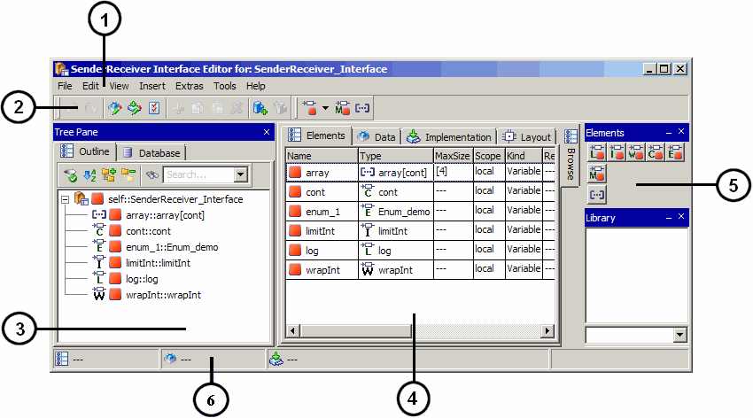

# Merged CHM Content

## Overview - AUTOSAR Interfaces

_Source: `markdown/SREOverviewAUTOSARInterfaces.md`_

# Overview - AUTOSAR Interfaces

The current ASCET version supports the following interface types:

- Sender-receiver (signal passing)
- NV data (sinal passing with non-volatile elements)
- Client-server (function invocation)
- Calibration

See the ASCET AUTOSAR User's Guide or the publications on the [AUTOSAR web site](http://www.autosar.org/) for more details on AUTOSAR interfaces.

See also

[Basics - SenderReceiver and NVData Interfaces](markdown/SREeditorOverview.md)

[Basics - ClientServer Interfaces](markdown/SREBasicsClientServerInterfaces.md)

[Basics - Calibration Interfaces](markdown/SREBasicsCalibrationInterfaces.md)

[http://www.autosar.org/](http://www.autosar.org/)

---

## Basics - SenderReceiver and NVData Interfaces

_Source: `markdown/SREeditorOverview.md`_

# Basics - SenderReceiver and NVData Interfaces

Sender-receiver communication involves the transmission and reception of signals consisting of atomic data elements sent by one AUTOSAR software component (SWC) and received by one or more SWC.

An SWC type can have multiple sender-receiver ports. Each sender-receiver port can contain multiple data elements each of which can be sent and received independently. Data elements within the interface can be simple (integer, float, ...) or complex (array, record) types.

In ASCET, the SenderReceiver Interface component is used to specify sender-receiver communication. Such a component can contain scalar variables, enumerations, arrays, matrices, and records. In addition, SenderReceiver interface components can be used to specify mode-switch interfaces; see also [Modes and Mode Groups](markdown/SREmodesModeGroups.md).

In AUTOSAR R3.1.5 or lower, a SenderReceiver interface component can contain both data elements and mode groups (although this practice is not recommended); in AUTOSAR R4.0, a SenderReceiver interface must contain either data elements or one mode group.

The SenderReceiver interface editor is used to specify the content of SenderReceiver interfaces.

NVData Interface components work the same way as SenderReceiver interfaces, with two exceptions: the elements of an NVData interface are always placed in the non-volatile memory of the ECU, and NVData interfaces cannot contain mode groups.

The NVData interface editor is used to specify the content of NVData interfaces.

You can

[Create an AUTOSAR Interface](markdown/SREcreateSenderReceiverInterface.md)

[Set up a SenderReceiver or NVData Interface](markdown/SREsetupSenderReceiverInterface.md)

[Implement SenderReceiver or NVData Interface Elements](markdown/SRE_ImplementSRInterfaceElements.md)

See also

[Specifying a SenderReceiver or NVData Interface Prototype](AtomicSoftwareComponentEditorEnglishUS.chm::/ASCspecifySRIprototype.htm)

[Sending to a Port](AtomicSoftwareComponentEditorEnglishUS.chm::/ASCsendToPort.htm)

[Receiving from a Port](AtomicSoftwareComponentEditorEnglishUS.chm::/ASCreceiveFromPort.htm)

[Sender-Receiver Communication](AtomicSoftwareComponentEditorEnglishUS.chm::/ASCsenderReceiverCommunication.htm)

[Modes and Mode Groups](markdown/SREmodesModeGroups.md)

[Ports and Interfaces](AtomicSoftwareComponentEditorEnglishUS.chm::/ASCportsInterfaces.htm)

[Records - Overview](RecordsEnglishUS.chm::/RC_overview.htm)

---

## Modes and Mode Groups

_Source: `markdown/SREmodesModeGroups.md`_

# Modes and Mode Groups

AUTOSAR modes can be used to execute code when the RTE is started, e.g. to initialise internal data structures etc. Similarly, when a system is shut down your software component may need to store data, log operational details etc. A runnable entity can be activated on either entry or exit from a mode using a Mode Switch Event.

Modes are declared within a mode declaration group. In ASCET, the Mode Group component represents mode declaration groups. Each mode group component defines one or more modes. The first mode of a mode group component is marked as the group's initial mode.

In ASCET, modes are communicated over a SenderReceiver interface. In combination with AUTOSAR R3.1.5 or lower, each SenderReceiver interface can specify zero or more mode declaration group prototypes, i.e. instances of different mode group components, that define the AUTOSAR modes communicated via the interface. In combination with AUTOSAR R4.0, each SenderReceiver interface can specify zero or one mode declaration prototype.

A mode group component can be used (referenced) by multiple SenderReceiver interfaces and therefore inherently used by multiple software components.

See also

[Creating a Mode Group](markdown/SREcreateModeGroup.md)

[Editing a Mode Group](markdown/SREeditModeGroup.md)

[Sender-Receiver Communication](AtomicSoftwareComponentEditorEnglishUS.chm::/ASCsenderReceiverCommunication.htm)

[Runnable Entities and Events](AtomicSoftwareComponentEditorEnglishUS.chm::/ASCRunnableEntity.htm)

---

## Basics - ClientServer Interfaces

_Source: `markdown/SREBasicsClientServerInterfaces.md`_

# Basics - ClientServer Interfaces

Client-server communication involves a component invoking a defined “server” function in another component which may or may not return a reply.

In ASCET, the ClientServer Interface component is used to specify client-server communication. These components are inserted into software components as ClientServer interface prototypes that can be used either as Pport or as Rport.

Each ClientServer interface component can contain one or more operations, each of which can be invoked separately. Several implementations can be specified for a ClientServer interface component; each implementation corresponds to one ClientServer interface in AUTOSAR.

The interface editor for ClientServer interfaces, or ClientServer interface editor is used to specify the content of ClientServer interfaces.

You can

[Create an AUTOSAR Interface](markdown/SREcreateSenderReceiverInterface.md)

[Set up a ClientServer Interface](markdown/SRE_SetUp_ClientServerInterface.md)

[Edit Operations](markdown/SRE_EditOperation.md)

[Implement Operation Arguments](markdown/SRE_ImplementOperationArguments.md)

See also

[Client-Server Communication](AtomicSoftwareComponentEditorEnglishUS.chm::/ASCClientServerCommunication.htm)

[Specifying a ClientServer Interface Prototype](AtomicSoftwareComponentEditorEnglishUS.chm::/ASCspecifyClientServerInterfacePrototype.htm)

[Enabling Concurrent Invocation of a Server Runnable](AtomicSoftwareComponentEditorEnglishUS.chm::/ASCenableConcurrentInvocation_ServerRunnable.htm)

[Making a Client Request on a Port](AtomicSoftwareComponentEditorEnglishUS.chm::/ASCmakeClientRequest_on_Port.htm)

[Implementations of Components / Projects](ImplementationEditorEnglishUS.chm::/IEd_impl_comp_proj_s.htm)

---

## Basics - Calibration Interfaces

_Source: `markdown/SREBasicsCalibrationInterfaces.md`_

# Basics - Calibration Interfaces

Calibration interfaces are used for communication with Calibration components.

In ASCET, the Calibration Interface component is used to specify communication with Calibration components. The Calibration interface components are inserted into SWC as Calibration interface prototypes.

Each Calibration interface component can contain one or more scalar calibration parameters and enumeration parameters. In addition, records can be added as complex parameters. Several implementations can be specified for a Calibration interface component; each implementation corresponds to one calibration interface in AUTOSAR.

The Calibration interface editor is used to specify the content of Calibration interfaces.

You can

[Create an AUTOSAR Interface](markdown/SREcreateSenderReceiverInterface.md)

[Implement Calibration Parameters](markdown/SREimplementCalibrationParameters.md)

See also

[Calibration](AtomicSoftwareComponentEditorEnglishUS.chm::/ASCcalibration.htm)

[Specifying a Calibration Interface Prototype](AtomicSoftwareComponentEditorEnglishUS.chm::/ASCspecifyCalibrationInterfacePrototype.htm)

[Accessing Calibration Parameters](AtomicSoftwareComponentEditorEnglishUS.chm::/ASCaccessCalibrationParameters.htm)

[Records - Overview](RecordsEnglishUS.chm::/RC_Allowed_Content.htm)

[Implementations of Components / Projects](ImplementationEditorEnglishUS.chm::/IEd_impl_comp_proj_s.htm)

---

## Creating an AUTOSAR Interface

_Source: `markdown/SREcreateSenderReceiverInterface.md`_

# Creating an AUTOSAR Interface

An AUTOSAR interface is created in the component manager. Proceed as follows.

1. In the ASCET options window, [Modeling](ComponentManagerEnglishUS.chm::/CM_Modeling_Node.htm) node, activate the Enable Creation of AUTOSAR Components option
1. In the component manager, open the Insert menu, point to AUTOSAR and select SenderReceiver Interface or NVData Interface or Calibration Interface or ClientServer Interface.
1. If you are working with a database larger than 3 GB, [another step is inserted](javascript:BSSCPopup('codegen_dbtoolarge.htm');)<!-- kadovFilePopupInit('a1'); //-->.
1. Edit the name and press Enter.

AUTOSAR interface names must not contain underscores (_). The maximal length for an interface name is 32 characters.

See also

[Setting Up a SenderReceiver or NVData Interface](markdown/SREsetupSenderReceiverInterface.md)

[Setting Up a ClientServer Interface](markdown/SRE_SetUp_ClientServerInterface.md)

[Setting Up a Calibration Interface](markdown/SREsetupCalibrationInterface.md)

[ASCET Options - Modeling Options](ComponentManagerEnglishUS.chm::/CM_Modeling_Node.htm)

/* Heikki Komulainen, Comet Computer GmbH 2004 */ cc_plus_pic = '&nbsp;'; cc_minus_pic = '&nbsp;'; cc_stat_pic = '&nbsp;'; gpstyle = ''; var iframes_created = 0; if (document.body && document.body.insertAdjacentHTML && document.getElementsByTagName && document.getElementById) { collect_popups(); set_poplinks_pictures(); if (iframes_created) { document.write(gpstyle); document.write('
<nobr><a id="einauslink" style="position:absolute;top:expression(document.body.scrollTop + this.offsetHeight - this.offsetHeight);left:expression(document.body.offsetWidth - (this.offsetWidth + 28));background:#ffffe0;padding:5px" href="javascript:show_all_poptext()">Show all hidden text</a></nobr>
'); } } function collect_popups() { bsscpopups = new Array(); for (x = 0; x < document.links.length; x++) { if (document.links[x].href.indexOf("BSSCPopup")>-1) { seekmatch = /BSSCPopup.'[^'](markdown/+)'/; poplink = seekmatch.exec(document.links[x].href); poplink = "" + poplink; poplink = poplink.substring(poplink.indexOf("'")+1, poplink.lastIndexOf("'")); ifid = "CCGENIFRAMEID" + x; new_iframe = '<iframe id="' + ifid + '"src="' + poplink + '" onload="get_text(\'' + ifid + '\')" width="0" height="0" frameborder=0></iframe>'; document.links[x].parentNode.insertAdjacentHTML("afterEnd", new_iframe); gpid = "CCID_" + ifid; document.links[x].href = "javascript:expand_poptext('" + gpid + "')"; cc_plus = '' + cc_plus_pic + ''; document.links[x].insertAdjacentHTML("afterBegin", cc_plus); iframes_created = 1; } } }// end function function get_text(ifr_id) { frpars = document.frames[ifr_id].document.getElementsByTagName("body"); popbody = frpars[0].innerHTML; gpid = "CCID_" + ifr_id; if (!document.getElementById(gpid)) { //avoiding doubles document.getElementById(ifr_id).insertAdjacentHTML("afterEnd", '
'+popbody+'
'); } }//end function function expand_poptext(x_frame_id) { if (!document.getElementById(x_frame_id)) return; if (document.getElementById(x_frame_id).className == "CCGENPOPTEXTH") { document.getElementById(x_frame_id).className = "CCGENPOPTEXTV"; document.getElementById(x_frame_id).style.visibility = "visible"; if (document.getElementById("CCPMB_" + x_frame_id )) { document.getElementById("CCPMB_" + x_frame_id ).innerHTML = cc_minus_pic; } } else { document.getElementById(x_frame_id).className = "CCGENPOPTEXTH"; document.getElementById(x_frame_id).style.visibility = "hidden"; if (document.getElementById("CCPMB_" + x_frame_id )) { document.getElementById("CCPMB_" + x_frame_id ).innerHTML = cc_plus_pic; } } }// end function function show_all_poptext() { var pulldowntxt = document.getElementsByTagName("div"); for (b = 0; b < pulldowntxt.length; b++) { if (pulldowntxt[b].className == "droptext") { pulldowntxt[b].style.display=""; } } var gptxt = document.getElementsByTagName("div"); for (z = 0; z < gptxt.length; z++) { if (gptxt[z].className == "CCGENPOPTEXTH") { gptxt[z].className = "CCGENPOPTEXTV"; gptxt[z].style.visibility = "visible"; if (document.getElementById("CCPMB_" + gptxt[z].id )) { document.getElementById("CCPMB_" + gptxt[z].id ).innerHTML = cc_minus_pic; } } } var dxpoplinks = document.getElementsByTagName("a"); if (dxpoplinks) { for (pxl = 0; pxl < dxpoplinks.length; pxl++) { if (dxpoplinks[pxl].href.indexOf("kadovTextPopup")>-1) { if (document.getElementById("CCPMB_" + dxpoplinks[pxl].id)) { document.getElementById("CCPMB_" + dxpoplinks[pxl].id).innerHTML = cc_stat_pic; dxpoplinks[pxl].symbol = "minus"; } } } } document.getElementById('einauslink').innerText = 'Hide all hideable text'; document.getElementById('einauslink').href = "javascript:self.location.reload()"; self.focus(); }// end function function eat_click() { return false; }// end function function set_poplinks_pictures() { var dpoplinks = document.getElementsByTagName("a"); if (dpoplinks) { for (pl = 0; pl < dpoplinks.length; pl++) { if (dpoplinks[pl].href.indexOf("kadovTextPopup")>-1) { cc_plus = '' + cc_stat_pic + ''; //dpoplinks[pl].onmouseup = plusminuspoplink; dpoplinks[pl].insertAdjacentHTML("afterBegin", cc_plus); dpoplinks[pl].symbol = "plus"; } } } }// end function function plusminuspoplink() { if (document.getElementById("CCPMB_" + this.id)) { if (this.symbol == "plus") { document.getElementById("CCPMB_" + this.id).innerHTML = cc_minus_pic; this.symbol = "minus"; } else { document.getElementById("CCPMB_" + this.id).innerHTML = cc_plus_pic; this.symbol = "plus"; } } return true; }

---

## Opening an AUTOSAR Interface Editor

_Source: `markdown/SREopenSRIEditor.md`_

# Opening an AUTOSAR Interface Editor

To open an AUTOSAR interface editor, proceed as follows:

1. In the Component Manager, select the desired AUTOSAR interface.
1. Do one of the following:

- Double-click on the item.
- In the Edit menu, select Open Component.
- Select Open Component from the context menu.
- Press Enter.

The selected item opens in the respective AUTOSAR interface editor.

See also

[Setting Up a SenderReceiver or NVData Interface](markdown/SREsetupSenderReceiverInterface.md)

[Setting Up a ClientServer Interface](markdown/SRE_SetUp_ClientServerInterface.md)

[Setting Up a Calibration Interface](markdown/SREsetupCalibrationInterface.md)

---

## Including a Component via the Block Library

_Source: `markdown/sreincludecomponent_blocklibrary.md`_

# Including a Component via the Block Library

When you stored frequently used components in a block library, you can include them via the Library palette. Proceed as follows.

1. In the Tree pane, go to the Outline tab.
1. In the Library palette, use the combo box to select the category that contains the desired item.
1. In the item list, select the item you want to add to the interface.
1. Drag the item to the Outline tab or to the drawing area.

The item is included in the edited AUTOSAR interface.

See also

[Block Libraries](ComponentManagerEnglishUS.chm::/CM_BlockLibraries.htm)

[Library Palette](markdown/srelibrarypalette.md)

---

## SenderReceiver and NVData Interfaces

_Source: `markdown/sre_EditSenderReceiverInterfaces.md`_

# Editing SenderReceiver or NVData Interfaces

Editing a SenderReceiver or NVData interface interface contains the following steps:

- [C](markdown/SREcreateSenderReceiverInterface.md)reating a SenderReceiver or NVData Interface
- [Setting Up a SenderReceiver or NVData Interface](markdown/SREsetupSenderReceiverInterface.md)
- [Implementing SenderReceiver or NVData Interface Elements](markdown/SRE_ImplementSRInterfaceElements.md)
- [Creating a SenderReceiver or NVData Interface from an Existing Item](markdown/SRI_CreateSRIfromExistingItem.md) (optional)

and - for SenderReceiver interfaces only -

- [Creating a Mode Group](markdown/SREcreateModeGroup.md) (optional)
- [Editing a Mode Group](markdown/SREeditModeGroup.md) (optional)

---

## Setting Up a SenderReceiver/NVData Interface

_Source: `markdown/SREsetupSenderReceiverInterface.md`_

1. In the Elements palette or toolbar, click on the button (      / ) for the variable you want to create.

The properties editor opens.

1. Edit the element properties and click OK.

1. In the Elements palette, click on the  Enumeration Variable button.

The Enumeration Selection window opens. All enumerations defined in the database/workspace are displayed in the Enumeration Type combo box.

1. Select the enumeration you want from the combo box.
1. Click OK to close the selection window.

The properties editor opens.

1. Edit the enumeration properties and click OK.

Alternatively, you can add an enumeration as described in [Including a Component as Complex Element](AtomicSoftwareComponentEditorEnglishUS.chm::/ascincludecomponent.htm).

1. In the Elements palette or toolbar, click on the  Array button.

The properties editor opens.

1. In the X field, enter the maximum size of the array.

Arrays with variant or variable size are not available in SenderReceiver or NVData interfaces.

1. Adjust the other element properties according to your needs and click OK.

1. In the Insert menu, select Component.

Or

1. Click on the  Insert Component button.

The Select Item window opens. It shows the content of the current database or workspace.

1. From the 1 Database or 1 Workspace list, select the component you want to add.
1. Click OK to add the component.

As an alternative to adding database/workspace items using the menu options described here, you can drag items from the Component Manager onto the SenderReceiver or NVData interface editor.

1. In the Elements palette or toolbar, click on the  Mode Group Parameter button.

The Mode Group Selection window opens. All mode groups defined in the database/workspace are displayed in the Mode Group Type combo box.

1. Select the mode group you want from the combo box.
1. Alternatively, open the Insert menu, select the Component option and add a mode group as described in [Including a Component as Complex Element](AtomicSoftwareComponentEditorEnglishUS.chm::/ascincludecomponent.htm).
1. Click OK to close the selection window.

The properties editor opens.

1. Edit the mode group properties and click OK.

# Setting Up a SenderReceiver or NVData Interface

A SenderReceiver or NVData interface can contain the following data elements: scalar variables, enumerations, arrays, and records.

1. [Open the interface editor](markdown/SREopenSRIEditor.md).
1. [Add a variable.](javascript:kadovTextPopup(this))<!-- kadovTextPopupInit('a1'); //-->
1. [Add an enumeration.](javascript:kadovTextPopup(this))<!-- kadovTextPopupInit('a2'); //-->
1. [Add an array.](javascript:kadovTextPopup(this))<!-- kadovTextPopupInit('a7'); //-->
1. [Include a record.](javascript:kadovTextPopup(this))<!-- kadovTextPopupInit('a5'); //-->
1. [Add a mode group.](javascript:kadovTextPopup(this))<!-- kadovTextPopupInit('a3'); //-->

In AUTOSAR R3.1.5 or lower, a SenderReceiver interface can contain data elements and one or more mode groups. However, it is good practice to separate interfaces used for data transfer and interfaces used for mode management, i. e. to include either data elements or a mode group.

In AUTOSAR R4.0, a SenderReceiver interface can contain either data elements or one mode group

You can change the properties of an element later in the properties editor; see [Editing Element Properties](ElementEditorEnglishUS.chm::/EEd_Overview.htm).

See also

[Opening an AUTOSAR Interface Editor](markdown/SREopenSRIEditor.md)

[Including a Component as Complex Element](AtomicSoftwareComponentEditorEnglishUS.chm::/ascincludecomponent.htm)

[Variant Size of Arrays and Matrices](IntroductionEnglishUS.chm::/INT_VariantSize_ArraysMatrices.htm)

[Editing Element Properties](ElementEditorEnglishUS.chm::/EEd_Overview.htm)

[Showing and Hiding Confirmation Dialog Windows](componentmanagerenglishus.chm::/CM_Showing_and_Hiding_Confirmation_Dialog_Windows.htm)

/* Heikki Komulainen, Comet Computer GmbH 2004 */ cc_plus_pic = '&nbsp;'; cc_minus_pic = '&nbsp;'; cc_stat_pic = '&nbsp;'; gpstyle = ''; var iframes_created = 0; if (document.body && document.body.insertAdjacentHTML && document.getElementsByTagName && document.getElementById) { collect_popups(); set_poplinks_pictures(); if (iframes_created) { document.write(gpstyle); document.write('
<nobr><a id="einauslink" style="position:absolute;top:expression(document.body.scrollTop + this.offsetHeight - this.offsetHeight);left:expression(document.body.offsetWidth - (this.offsetWidth + 28));background:white;padding:5px" href="javascript:show_all_poptext()">Alle texte einblenden</a></nobr>
'); } } function collect_popups() { bsscpopups = new Array(); for (x = 0; x < document.links.length; x++) { if (document.links[x].href.indexOf("BSSCPopup")>-1) { seekmatch = /BSSCPopup.'[^'](markdown/+)'/; poplink = seekmatch.exec(document.links[x].href); poplink = "" + poplink; poplink = poplink.substring(poplink.indexOf("'")+1, poplink.lastIndexOf("'")); ifid = "CCGENIFRAMEID" + x; new_iframe = '<iframe id="' + ifid + '"src="' + poplink + '" onload="get_text(\'' + ifid + '\')" width="0" height="0" frameborder=0></iframe>'; document.links[x].parentNode.insertAdjacentHTML("afterEnd", new_iframe); gpid = "CCID_" + ifid; document.links[x].href = "javascript:expand_poptext('" + gpid + "')"; cc_plus = '' + cc_plus_pic + ''; document.links[x].insertAdjacentHTML("afterBegin", cc_plus); iframes_created = 1; } } }// end function function get_text(ifr_id) { frpars = document.frames[ifr_id].document.getElementsByTagName("body"); popbody = frpars[0].innerHTML; gpid = "CCID_" + ifr_id; if (!document.getElementById(gpid)) { //avoiding doubles document.getElementById(ifr_id).insertAdjacentHTML("afterEnd", '
'+popbody+'
'); } }//end function function expand_poptext(x_frame_id) { if (!document.getElementById(x_frame_id)) return; if (document.getElementById(x_frame_id).className == "CCGENPOPTEXTH") { document.getElementById(x_frame_id).className = "CCGENPOPTEXTV"; document.getElementById(x_frame_id).style.visibility = "visible"; if (document.getElementById("CCPMB_" + x_frame_id )) { document.getElementById("CCPMB_" + x_frame_id ).innerHTML = cc_minus_pic; } } else { document.getElementById(x_frame_id).className = "CCGENPOPTEXTH"; document.getElementById(x_frame_id).style.visibility = "hidden"; if (document.getElementById("CCPMB_" + x_frame_id )) { document.getElementById("CCPMB_" + x_frame_id ).innerHTML = cc_plus_pic; } } }// end function function show_all_poptext() { var pulldowntxt = document.getElementsByTagName("div"); for (b = 0; b < pulldowntxt.length; b++) { if (pulldowntxt[b].className == "droptext") { pulldowntxt[b].style.display=""; } } var gptxt = document.getElementsByTagName("div"); for (z = 0; z < gptxt.length; z++) { if (gptxt[z].className == "CCGENPOPTEXTH") { gptxt[z].className = "CCGENPOPTEXTV"; gptxt[z].style.visibility = "visible"; if (document.getElementById("CCPMB_" + gptxt[z].id )) { document.getElementById("CCPMB_" + gptxt[z].id ).innerHTML = cc_minus_pic; } } } var dxpoplinks = document.getElementsByTagName("a"); if (dxpoplinks) { for (pxl = 0; pxl < dxpoplinks.length; pxl++) { if (dxpoplinks[pxl].href.indexOf("kadovTextPopup")>-1) { if (document.getElementById("CCPMB_" + dxpoplinks[pxl].id)) { document.getElementById("CCPMB_" + dxpoplinks[pxl].id).innerHTML = cc_stat_pic; dxpoplinks[pxl].symbol = "minus"; } } } } document.getElementById('einauslink').innerText = 'Alle texte ausblenden'; document.getElementById('einauslink').href = "javascript:self.location.reload()"; self.focus(); }// end function function eat_click() { return false; }// end function function set_poplinks_pictures() { var dpoplinks = document.getElementsByTagName("a"); if (dpoplinks) { for (pl = 0; pl < dpoplinks.length; pl++) { if (dpoplinks[pl].href.indexOf("kadovTextPopup")>-1) { cc_plus = '' + cc_stat_pic + ''; //dpoplinks[pl].onmouseup = plusminuspoplink; dpoplinks[pl].insertAdjacentHTML("afterBegin", cc_plus); dpoplinks[pl].symbol = "plus"; } } } }// end function function plusminuspoplink() { if (document.getElementById("CCPMB_" + this.id)) { if (this.symbol == "plus") { document.getElementById("CCPMB_" + this.id).innerHTML = cc_minus_pic; this.symbol = "minus"; } else { document.getElementById("CCPMB_" + this.id).innerHTML = cc_plus_pic; this.symbol = "plus"; } } return true; }

---

## Implementing SenderReceiver/NVData Interface Elements

_Source: `markdown/SRE_ImplementSRInterfaceElements.md`_

# Implementing SenderReceiver or NVData Interface Elements

To specify the implementation of an element in a SenderReceiver or NVData interface, proceed as follows:

1. In the SenderReceiver or NVData interface editor, select the Implementation tab.
1. In the combo box at the top right side of the Implementation tab, select the component implementation you want to use.
1. In the Implementation tab, double-click an element of the SenderReceiver interface.
1. Implement the argument as described in [Specifying Individual Implementations](implementationeditorenglishus.chm::/specifying_individual_impl.htm), [Specifying an Enumeration Implementation](ImplementationEditorEnglishUS.chm::/specify_enum_impl.htm), or [Implementing References](ImplementationEditorEnglishUS.chm::/IED_ImplementingReferences.htm).

See also

[Implementation of Components](ImplementationEditorEnglishUS.chm::/IED_ImplementationComponents.htm)

[Specifying Individual Implementations](implementationeditorenglishus.chm::/specifying_individual_impl.htm)

[Specifying an Enumeration Implementation](ImplementationEditorEnglishUS.chm::/specify_enum_impl.htm)

[Implementing References](ImplementationEditorEnglishUS.chm::/IED_ImplementingReferences.htm)

---

## Creating a Mode Group

_Source: `markdown/SREcreateModeGroup.md`_

# Creating a Mode Group

A mode group is created in the component manager. Proceed as follows.

1. In the ASCET options window, [Modeling](ComponentManagerEnglishUS.chm::/CM_General_Options.htm) node, activate the Enable Creation of AUTOSAR Components option
1. In the component manager, open the Insert menu, point to AUTOSAR and select Mode Group.
1. If you are working with a database larger than 3 GB, [another step is inserted](javascript:BSSCPopup('codegen_dbtoolarge.htm');)<!-- kadovFilePopupInit('a1'); //-->.
1. Edit the name and press Enter.
1. [Edit the mode group](markdown/SREeditModeGroup.md).

See also

[Editing a Mode Group](markdown/SREeditModeGroup.md)

[Modes and Mode Groups](markdown/SREmodesModeGroups.md)

[ASCET Options - Modeling Options](ComponentManagerEnglishUS.chm::/CM_Modeling_Node.htm)

/* Heikki Komulainen, Comet Computer GmbH 2004 */ cc_plus_pic = '&nbsp;'; cc_minus_pic = '&nbsp;'; cc_stat_pic = '&nbsp;'; gpstyle = ''; var iframes_created = 0; if (document.body && document.body.insertAdjacentHTML && document.getElementsByTagName && document.getElementById) { collect_popups(); set_poplinks_pictures(); if (iframes_created) { document.write(gpstyle); document.write('
<nobr><a id="einauslink" style="position:absolute;top:expression(document.body.scrollTop + this.offsetHeight - this.offsetHeight);left:expression(document.body.offsetWidth - (this.offsetWidth + 28));background:#ffffe0;padding:5px" href="javascript:show_all_poptext()">Show all hidden text</a></nobr>
'); } } function collect_popups() { bsscpopups = new Array(); for (x = 0; x < document.links.length; x++) { if (document.links[x].href.indexOf("BSSCPopup")>-1) { seekmatch = /BSSCPopup.'[^'](markdown/+)'/; poplink = seekmatch.exec(document.links[x].href); poplink = "" + poplink; poplink = poplink.substring(poplink.indexOf("'")+1, poplink.lastIndexOf("'")); ifid = "CCGENIFRAMEID" + x; new_iframe = '<iframe id="' + ifid + '"src="' + poplink + '" onload="get_text(\'' + ifid + '\')" width="0" height="0" frameborder=0></iframe>'; document.links[x].parentNode.insertAdjacentHTML("afterEnd", new_iframe); gpid = "CCID_" + ifid; document.links[x].href = "javascript:expand_poptext('" + gpid + "')"; cc_plus = '' + cc_plus_pic + ''; document.links[x].insertAdjacentHTML("afterBegin", cc_plus); iframes_created = 1; } } }// end function function get_text(ifr_id) { frpars = document.frames[ifr_id].document.getElementsByTagName("body"); popbody = frpars[0].innerHTML; gpid = "CCID_" + ifr_id; if (!document.getElementById(gpid)) { //avoiding doubles document.getElementById(ifr_id).insertAdjacentHTML("afterEnd", '
'+popbody+'
'); } }//end function function expand_poptext(x_frame_id) { if (!document.getElementById(x_frame_id)) return; if (document.getElementById(x_frame_id).className == "CCGENPOPTEXTH") { document.getElementById(x_frame_id).className = "CCGENPOPTEXTV"; document.getElementById(x_frame_id).style.visibility = "visible"; if (document.getElementById("CCPMB_" + x_frame_id )) { document.getElementById("CCPMB_" + x_frame_id ).innerHTML = cc_minus_pic; } } else { document.getElementById(x_frame_id).className = "CCGENPOPTEXTH"; document.getElementById(x_frame_id).style.visibility = "hidden"; if (document.getElementById("CCPMB_" + x_frame_id )) { document.getElementById("CCPMB_" + x_frame_id ).innerHTML = cc_plus_pic; } } }// end function function show_all_poptext() { var pulldowntxt = document.getElementsByTagName("div"); for (b = 0; b < pulldowntxt.length; b++) { if (pulldowntxt[b].className == "droptext") { pulldowntxt[b].style.display=""; } } var gptxt = document.getElementsByTagName("div"); for (z = 0; z < gptxt.length; z++) { if (gptxt[z].className == "CCGENPOPTEXTH") { gptxt[z].className = "CCGENPOPTEXTV"; gptxt[z].style.visibility = "visible"; if (document.getElementById("CCPMB_" + gptxt[z].id )) { document.getElementById("CCPMB_" + gptxt[z].id ).innerHTML = cc_minus_pic; } } } var dxpoplinks = document.getElementsByTagName("a"); if (dxpoplinks) { for (pxl = 0; pxl < dxpoplinks.length; pxl++) { if (dxpoplinks[pxl].href.indexOf("kadovTextPopup")>-1) { if (document.getElementById("CCPMB_" + dxpoplinks[pxl].id)) { document.getElementById("CCPMB_" + dxpoplinks[pxl].id).innerHTML = cc_stat_pic; dxpoplinks[pxl].symbol = "minus"; } } } } document.getElementById('einauslink').innerText = 'Hide all hideable text'; document.getElementById('einauslink').href = "javascript:self.location.reload()"; self.focus(); }// end function function eat_click() { return false; }// end function function set_poplinks_pictures() { var dpoplinks = document.getElementsByTagName("a"); if (dpoplinks) { for (pl = 0; pl < dpoplinks.length; pl++) { if (dpoplinks[pl].href.indexOf("kadovTextPopup")>-1) { cc_plus = '' + cc_stat_pic + ''; //dpoplinks[pl].onmouseup = plusminuspoplink; dpoplinks[pl].insertAdjacentHTML("afterBegin", cc_plus); dpoplinks[pl].symbol = "plus"; } } } }// end function function plusminuspoplink() { if (document.getElementById("CCPMB_" + this.id)) { if (this.symbol == "plus") { document.getElementById("CCPMB_" + this.id).innerHTML = cc_minus_pic; this.symbol = "minus"; } else { document.getElementById("CCPMB_" + this.id).innerHTML = cc_plus_pic; this.symbol = "plus"; } } return true; }

---

## Editing a Mode Group

_Source: `markdown/SREeditModeGroup.md`_

# Editing a Mode Group

A mode group is created in the Component Manager. Proceed as follows.

1. In the 1 Database or 1 Workspace list of the component manager, select the mode group you want to edit.
1. Click on a mode in the 3 Contents field.
1. In the Mode menu, point to Add Mode and select <placement>.
1. In the Mode menu, select Rename to rename a mode.
1. In the Mode menu, select Delete to rename a mode.
1. In the Mode menu, select Shift Up or Shift Down to move a mode in the list.

See also

[Setting Up a SenderReceiver or NVData Interface - AddModeGroup](markdown/SREsetupSenderReceiverInterface.md#AddModeGroup)

[Modes and Mode Groups](markdown/SREmodesModeGroups.md)

[Creating a Mode Group](markdown/SREcreateModeGroup.md)

[Software Component Editor - Using Mode Groups](AtomicSoftwareComponentEditorEnglishUS.chm::/ASCusingModeGroups.htm)

[Software Component Editor - Enabling/Disabling Modes](AtomicSoftwareComponentEditorEnglishUS.chm::/ASCenableDisableModes.htm)

---

## Creating a SenderReceiver/NVData Interface from an Existing Item

_Source: `markdown/SRI_CreateSRIfromExistingItem.md`_

# Creating a SenderReceiver or NVData Interface from an Existing Item

A SenderReceiver or NVData interface can be created from an existing ASCET class, module or record. To do so, proceed as follows.

1. In the Component Manager, select the class, module or record you want to reproduce as SenderReceiver interface.
1. In the Edit menu, point to Reproduce As and select SenderReceiver Interface or NVData Interface.
1. Double-click on the new item to open the interface editor.

See also

[Component Manager - Copying Database/Workspace Items and Structures](ComponentManagerEnglishUS.chm::/copying_databaseitems.htm)

[Opening an AUTOSAR Interface Editor](markdown/SREopenSRIEditor.md)

---

## ClientServer Interfaces

_Source: `markdown/SRE_EditClientServerInterfaces.md`_

# Editing ClientServer Interfaces

Editing a ClientServer interface contains the following steps:

1. [Creating a ClientServer interface](markdown/SREcreateSenderReceiverInterface.md)
1. [Setting Up a ClientServer Interface](markdown/SRE_SetUp_ClientServerInterface.md)
1. [Editing an Operation](markdown/SRE_EditOperation.md)
1. [Editing an Operation Return Value](markdown/SRE_editOperationReturnValue.md)
1. [Implementing Operation Arguments](markdown/SRE_ImplementOperationArguments.md)

---

## Setting Up a ClientServer Interface

_Source: `markdown/SRE_SetUp_ClientServerInterface.md`_

# Setting Up a ClientServer Interface

A ClientServer interface can contain several operations, each of which can be invoked separately.

1. [Open the ClientServer interface editor](markdown/SREopenSRIEditor.md).
1. Create an operation by doing one of the following:
1. Type in a name for the operation and press Enter.
1. [Edit the operation](markdown/SRE_EditOperation.md).
1. [Edit the operation return value](markdown/SRE_editOperationReturnValue.md).
1. [Implement the operation arguments](markdown/SRE_ImplementOperationArguments.md).

See also

[Creating an AUTOSAR Interface](markdown/SREcreateSenderReceiverInterface.md)

[Opening an AUTOSAR Interface Editor](markdown/SREopenSRIEditor.md)

[Editing an Operation](markdown/SRE_EditOperation.md)

[Editing an Operation Return Value](markdown/SRE_editOperationReturnValue.md)

[Implementing Operation Arguments](markdown/SRE_ImplementOperationArguments.md)

---

## Editing an Operation

_Source: `markdown/SRE_EditOperation.md`_

# Editing an Operation

To edit an operation in a ClientServer interface, proceed as follows.

1. [Open the ClientServer interface](markdown/SREopenSRIEditor.md) that contains the operation you want to modify.
1. In the Outline tab, select the operation you want to modify.
1. Do one of the following:
1. For each input value, add an argument with direction In, and for each output value, add an argument with direction Out:

See also

[Directions of Method Arguments](BlockDiagramEditorEnglishUS.chm::/BDE_DirectionsMethodArguments.htm)

[Opening an AUTOSAR Interface Editor](markdown/SREopenSRIEditor.md)

[Editing an Operation Return Value](markdown/SRE_editOperationReturnValue.md)

[Implementing Operation Arguments](markdown/SRE_ImplementOperationArguments.md)

---

## Editing an Operation Return Value

_Source: `markdown/SRE_editOperationReturnValue.md`_

# Editing an Operation Return Value

By default, each operation in a ClientServer interface is assigned a return value of type Std_ReturnType. It is possible, however, to return an application error. To do so, proceed as follows.

1. In the Component Manager, [create an enumeration](ComponentManagerEnglishUS.chm::/CreateEnumeration.htm) named, e.g., ApplicationError.
1. [Edit the first enumerator](ComponentManagerEnglishUS.chm::/rename_enumerator.htm), e.g., to a value of 2 and a label of E_NOT_OK.
1. Create and edit the other enumerators you need.
1. [Open the ClientServer interface](markdown/SREopenSRIEditor.md) that contains the operation you want to modify.
1. [Open the signature editor for the operation](markdown/SRE_EditOperation.md).
1. In the [signature editor](BlockDiagramEditorEnglishUS.chm::/bde_interface_editor.htm), go to the Return tab.
1. In the Return Type combo box, select <enumeration>.
1. In the 1 Database or 1 Workspace field, select the enumeration you created in step 1.
1. Click OK to close the Choose an enumeration type dialog window.
1. Click OK to close the signature editor.

See also

[Opening an AUTOSAR Interface Editor](markdown/SREopenSRIEditor.md)

[Editing an Operation](markdown/SRE_EditOperation.md)

[Component Manager - Creating an Enumeration](ComponentManagerEnglishUS.chm::/CreateEnumeration.htm)

[Component Manager - Editing an Enumerator](ComponentManagerEnglishUS.chm::/rename_enumerator.htm)

[Block Diagram Editor - Signature Editor](BlockDiagramEditorEnglishUS.chm::/bde_interface_editor.htm)

---

## Implementing Operation Arguments

_Source: `markdown/SRE_ImplementOperationArguments.md`_

# Implementing Operation Arguments

To specify the implementation of an operation argument, proceed as follows:

1. In the ClientServer interface editor, select the Implementation tab.
1. In the combo box at the top right side of the Implementation tab, select the component implementation you want to use.
1. In the Implementation tab, double-click an argument.
1. Implement the argument as described in [Specifying Individual Implementations](ImplementationEditorEnglishUS.chm::/specifying_individual_impl.htm), [Specifying an Enumeration Implementation](ImplementationEditorEnglishUS.chm::/specify_enum_impl.htm), or [Implementing References](ImplementationEditorEnglishUS.chm::/IED_ImplementingReferences.htm).

See also

[Implementation of Components](ImplementationEditorEnglishUS.chm::/IED_ImplementationComponents.htm)

[Specifying Individual Implementations](implementationeditorenglishus.chm::/specifying_individual_impl.htm)

[Specifying an Enumeration Implementation](ImplementationEditorEnglishUS.chm::/specify_enum_impl.htm)

[Implementing References](ImplementationEditorEnglishUS.chm::/IED_ImplementingReferences.htm)

---

## Calibration Interfaces

_Source: `markdown/SRE_Editing_Calibration_Interfaces.md`_

# Editing Calibration Interfaces

Editing a Calibration interface contains the following steps:

1. [Creating a Calibration interface](markdown/SREcreateSenderReceiverInterface.md)
1. [Setting Up a Calibration Interface](markdown/SREsetupCalibrationInterface.md)
1. [Implementing Calibration Parameters](markdown/SREimplementCalibrationParameters.md)

---

## Setting Up a Calibration Interface

_Source: `markdown/SREsetupCalibrationInterface.md`_

1. In the Elements palette or toolbar, click on the button (      / ) for the parameter you want to create.

The properties editor opens.

1. Edit the element properties and click OK.

1. In the Elements palette, click on the  Enumeration Parameter button.
1. Select the enumeration you want from the combo box.
1. Click OK to close the selection window.
1. Edit the enumeration properties and click OK.

Alternatively, you can add an enumeration the same way as described in [Including a Component as Complex Element](AtomicSoftwareComponentEditorEnglishUS.chm::/ascincludecomponent.htm).

1. In the Elements palette or toolbar, click on the  Array button.

The properties editor opens.

1. In the X field, enter the maximum size of the array.

Arrays with variant or variable size are not available in calibration interfaces.

1. Adjust the other element properties according to your needs and click OK.

1. In the Insert menu, select Component.
1. Click on the  Insert Component button.
1. From the 1 Database or 1 Workspace list, select the record you want to add.
1. Click OK to add the record.

As an alternative to adding records and enumerations the way described here, you can drag them from the Component Manager onto the Outline tab of the Calibration interface editor.

# Setting Up a Calibration Interface

A Calibration interface can contain scalar parameters, enumeration parameters, and record parameters.

1. [Open the Calibration interface editor](markdown/SREopenSRIEditor.md).
1. [Add a scalar parameter.](javascript:kadovTextPopup(this))<!-- kadovTextPopupInit('a1'); //-->
1. [Add an enumeration.](javascript:kadovTextPopup(this))<!-- kadovTextPopupInit('a2'); //-->
1. [Add an array.](javascript:kadovTextPopup(this))<!-- kadovTextPopupInit('a7'); //-->
1. [Include a record.](javascript:kadovTextPopup(this))<!-- kadovTextPopupInit('a3'); //-->
1. [Implement the calibration parameters](markdown/SREimplementCalibrationParameters.md).
1. Edit the data for the calibration parameters.

You can change the properties of an element later in the properties editor; see [Editing Element Properties](ElementEditorEnglishUS.chm::/EEd_Overview.htm).

See also

[Opening an AUTOSAR Interface Editor](markdown/SREopenSRIEditor.md)

[Implementing Calibration Parameters](markdown/SREimplementCalibrationParameters.md)

[Editing Element Properties](ElementEditorEnglishUS.chm::/EEd_Overview.htm)

[Data Editor - Editing Scalar Types](DataEditorEnglishUS.chm::/DEd_EditingScalarTypes.htm)

[Data Editor - Editing Combined Types](DataEditorEnglishUS.chm::/DEd_EditingCombinedTypes.htm)

[Showing and Hiding Confirmation Dialog Windows](componentmanagerenglishus.chm::/CM_Showing_and_Hiding_Confirmation_Dialog_Windows.htm)

/* Heikki Komulainen, Comet Computer GmbH 2004 */ cc_plus_pic = '&nbsp;'; cc_minus_pic = '&nbsp;'; cc_stat_pic = '&nbsp;'; gpstyle = ''; var iframes_created = 0; if (document.body && document.body.insertAdjacentHTML && document.getElementsByTagName && document.getElementById) { collect_popups(); set_poplinks_pictures(); if (iframes_created) { document.write(gpstyle); document.write('
<nobr><a id="einauslink" style="position:absolute;top:expression(document.body.scrollTop + this.offsetHeight - this.offsetHeight);left:expression(document.body.offsetWidth - (this.offsetWidth + 28));background:white;padding:5px" href="javascript:show_all_poptext()">Alle texte einblenden</a></nobr>
'); } } function collect_popups() { bsscpopups = new Array(); for (x = 0; x < document.links.length; x++) { if (document.links[x].href.indexOf("BSSCPopup")>-1) { seekmatch = /BSSCPopup.'[^'](markdown/+)'/; poplink = seekmatch.exec(document.links[x].href); poplink = "" + poplink; poplink = poplink.substring(poplink.indexOf("'")+1, poplink.lastIndexOf("'")); ifid = "CCGENIFRAMEID" + x; new_iframe = '<iframe id="' + ifid + '"src="' + poplink + '" onload="get_text(\'' + ifid + '\')" width="0" height="0" frameborder=0></iframe>'; document.links[x].parentNode.insertAdjacentHTML("afterEnd", new_iframe); gpid = "CCID_" + ifid; document.links[x].href = "javascript:expand_poptext('" + gpid + "')"; cc_plus = '' + cc_plus_pic + ''; document.links[x].insertAdjacentHTML("afterBegin", cc_plus); iframes_created = 1; } } }// end function function get_text(ifr_id) { frpars = document.frames[ifr_id].document.getElementsByTagName("body"); popbody = frpars[0].innerHTML; gpid = "CCID_" + ifr_id; if (!document.getElementById(gpid)) { //avoiding doubles document.getElementById(ifr_id).insertAdjacentHTML("afterEnd", '
'+popbody+'
'); } }//end function function expand_poptext(x_frame_id) { if (!document.getElementById(x_frame_id)) return; if (document.getElementById(x_frame_id).className == "CCGENPOPTEXTH") { document.getElementById(x_frame_id).className = "CCGENPOPTEXTV"; document.getElementById(x_frame_id).style.visibility = "visible"; if (document.getElementById("CCPMB_" + x_frame_id )) { document.getElementById("CCPMB_" + x_frame_id ).innerHTML = cc_minus_pic; } } else { document.getElementById(x_frame_id).className = "CCGENPOPTEXTH"; document.getElementById(x_frame_id).style.visibility = "hidden"; if (document.getElementById("CCPMB_" + x_frame_id )) { document.getElementById("CCPMB_" + x_frame_id ).innerHTML = cc_plus_pic; } } }// end function function show_all_poptext() { var pulldowntxt = document.getElementsByTagName("div"); for (b = 0; b < pulldowntxt.length; b++) { if (pulldowntxt[b].className == "droptext") { pulldowntxt[b].style.display=""; } } var gptxt = document.getElementsByTagName("div"); for (z = 0; z < gptxt.length; z++) { if (gptxt[z].className == "CCGENPOPTEXTH") { gptxt[z].className = "CCGENPOPTEXTV"; gptxt[z].style.visibility = "visible"; if (document.getElementById("CCPMB_" + gptxt[z].id )) { document.getElementById("CCPMB_" + gptxt[z].id ).innerHTML = cc_minus_pic; } } } var dxpoplinks = document.getElementsByTagName("a"); if (dxpoplinks) { for (pxl = 0; pxl < dxpoplinks.length; pxl++) { if (dxpoplinks[pxl].href.indexOf("kadovTextPopup")>-1) { if (document.getElementById("CCPMB_" + dxpoplinks[pxl].id)) { document.getElementById("CCPMB_" + dxpoplinks[pxl].id).innerHTML = cc_stat_pic; dxpoplinks[pxl].symbol = "minus"; } } } } document.getElementById('einauslink').innerText = 'Alle texte ausblenden'; document.getElementById('einauslink').href = "javascript:self.location.reload()"; self.focus(); }// end function function eat_click() { return false; }// end function function set_poplinks_pictures() { var dpoplinks = document.getElementsByTagName("a"); if (dpoplinks) { for (pl = 0; pl < dpoplinks.length; pl++) { if (dpoplinks[pl].href.indexOf("kadovTextPopup")>-1) { cc_plus = '' + cc_stat_pic + ''; //dpoplinks[pl].onmouseup = plusminuspoplink; dpoplinks[pl].insertAdjacentHTML("afterBegin", cc_plus); dpoplinks[pl].symbol = "plus"; } } } }// end function function plusminuspoplink() { if (document.getElementById("CCPMB_" + this.id)) { if (this.symbol == "plus") { document.getElementById("CCPMB_" + this.id).innerHTML = cc_minus_pic; this.symbol = "minus"; } else { document.getElementById("CCPMB_" + this.id).innerHTML = cc_plus_pic; this.symbol = "plus"; } } return true; }

---

## Implementing Calibration Parameters

_Source: `markdown/SREimplementCalibrationParameters.md`_

# Implementing Calibration Parameters

To specify the implementation of a calibration parameter, proceed as follows:

1. In the Calibration interface editor, select the Implementation tab.
1. In the combo box at the top right side of the Implementation tab, select the component implementation you want to use.
1. In the Implementation tab, double-click a parameter.
1. Implement the argument as described in [Specifying Individual Implementations](implementationeditorenglishus.chm::/specifying_individual_impl.htm), [Specifying an Enumeration Implementation](ImplementationEditorEnglishUS.chm::/specify_enum_impl.htm), or [Implementing References](ImplementationEditorEnglishUS.chm::/IED_ImplementingReferences.htm).

See also

[Implementation of Components](ImplementationEditorEnglishUS.chm::/IED_ImplementationComponents.htm)

[Specifying Individual Implementations](implementationeditorenglishus.chm::/specifying_individual_impl.htm)

[Specifying an Enumeration Implementation](ImplementationEditorEnglishUS.chm::/specify_enum_impl.htm)

[Implementing References](ImplementationEditorEnglishUS.chm::/IED_ImplementingReferences.htm)

---

## Filtering the Tree Pane

_Source: `markdown/SREfilterComponentPane.md`_

# Filtering the Tree Pane

The Outline tab can be filtered. To do so, proceed as follows.

1. In the Outline tab, click on the  button.
1. In the Elements subnode, activate the options of the items you want to display in the tab.
1. In the Methods subnode, set filter options for runnables, processes and methods.
1. Click OK to close the Options window.

Only items with activated options are shown in the tab. The button is marked with a green symbol to indicate an active filter: 

The filter settings made here affect all component editors.

See also

[Searching the Tree Pane](IntroductionEnglishUS.chm::/INT_SearchTreePane.htm)

---

## AUTOSAR Interface Editors - Window Elements

_Source: `markdown/SREwindowsDescription.md`_

# AUTOSAR Interface Editors - Window Elements

The editors for AUTOSAR interfaces contain the following window elements.

1. [Menu Bar](markdown/SREmenuBar.md)
1. [Toolbar](markdown/SREtoolbars.md) with the following function blocks:
1. [Tree Pane](markdown/SREcomponentPane.md) contains the following tabs:
1. View area contains the following view:
1. Palette pane (not available in the ClientServer interface editor) contains the following palettes:
1. status bar

The status bar contains information on the element currently selected in the Outline tab (if the Mouse Over option on the [Editors](ComponentManagerEnglishUS.chm::/cm_options_for_editors.htm) node of the ASCET options is deactivated) or on the element in the Outline tab or the drawing area the mouse is currently placed on (if the Mouse Over option is activated).

---

## Toolbars

_Source: `markdown/SREtoolbars.md`_

# Toolbars

The toolbar is grouped by following functional blocks:

- [General](markdown/SREtoolbarGeneral.md)
- [Elements](markdown/SREtoolbarElements.md)

You can

[Configure a Toolbar](IntroductionEnglishUS.chm::/INT_Configuring_Toolbar.htm)

---

## Toolbar General

_Source: `markdown/SREtoolbarGeneral.md`_

# Toolbar General

The General toolbar contains the following buttons. Some buttons are unavailable in one or two of the AUTOSAR interface editors, and the button sequence may differ.

| Column 1 | Column 2 |
| --- | --- |
|  | Edit Component Data Not available in the ClientServer interface editor. |
|  | Edit Component Implementation |
|  | Tool Options |
|  | Copy |
|  | Paste |
|  | Delete |
|  | Insert Component Not available in the ClientServer interface editor. |
|  | Insert Method Signature Only available in the ClientServer interface editor. |
|  | Browse to Parent Component |

---

## Toolbar Elements

_Source: `markdown/SREtoolbarElements.md`_

# Toolbar Elements

A toolbar Elements is available in the SenderReceiver, NVData and Calibration interface editors. It contains the following buttons:

##### SenderReceiver interface and NVData interface editors

| Column 1 | Column 2 | Column 3 |
| --- | --- | --- |
|  | Variable | The button opens the element type selection menu. The Variable button can be used to create elements of type logic, limitInt, wrapInt, udisc, sdisc, or cont. By default, the limitInt and wrapInt types are displayed. To display the sdisc and udisc types instead, the editor option Use signed/unsigned discrete types must be activated. See also Setting Up a SenderReceiver/NVData Interface . |
|  | Mode Group Parameter | See also Setting Up a SenderReceiver/NVData Interface - Add a Mode Group . Only available in the SenderReceiver interface editor. |
|  | Array | See also Setting Up a SenderReceiver/NVData Interface - Add an Array . |

##### Calibration interface editor

| Column 1 | Column 2 | Column 3 |
| --- | --- | --- |
|  | Variable | The button opens the element type selection menu. The Parameter button can be used to create elements of type logic, limitInt, wrapInt, udisc, sdisc, or cont. By default, the limitInt and wrapInt types are displayed. To display the sdisc and udisc types instead, the editor option Use signed/unsigned discrete types must be activated. See also Setting Up a Calibration Interface . |
|  | Array | See also Setting Up a Calibration Interface - Add an Array . |

---

## Menus

_Source: `markdown/SREmenuBar.md`_

# Menu Bar

The menu bar contains the following menus:

- [File](markdown/SREfileMenu.md)
- [Edit](markdown/SREeditMenu.md)
- [View](markdown/SREviewMenu.md)
- [Insert](markdown/SREinsertMenu.md)
- [Extras](markdown/SREextrasMenu.md)
- [Tools](markdown/SREtoolsMenu.md)
- [Help](markdown/SREhelpMenu.md)

---

## File Menu

_Source: `markdown/SREfileMenu.md`_

# File Menu

The File menu contains the following functions:

Save (Ctrl + s)

Saves the current AUTOSAR interface.

Import (not available in the ClientServer interface editor)

- Data

| Column 1 | Column 2 |
| --- | --- |
| For Selected Element | Imports data for a selected element. |

Export

- Component

Exports the current AUTOSAR interface into an export file.

- Data (not available in the ClientServer interface editor)

Exports a component data set.

| Column 1 | Column 2 |
| --- | --- |
| For Component | Exports a component dataset. |
| For selected Element | Exports data for the selected elements. |

Close (Alt + F4)

Closes the AUTOSAR interface editor.

See also

[Edit Menu](markdown/SREeditMenu.md)

[View Menu](markdown/SREviewMenu.md)

[Insert Menu](markdown/SREinsertMenu.md)

[Extras Menu](markdown/SREextrasMenu.md)

[Tools Menu](markdown/SREtoolsMenu.md)

[Help Menu](markdown/SREhelpMenu.md)

---

## Edit Menu

_Source: `markdown/SREeditMenu.md`_

# Edit Menu

The Edit menu contains the following functions:

Copy (Ctrl + c)

Copies a selected element (in the Elements tab), the data (in the Data tab) or the implementation (in the Implementation tab) of a selected element to the ASCET clipboard.

Paste (Ctrl + v)

Elements tab: Pastes an element from the ASCET clipboard to the AUTOSAR interface.

Data tab: Pastes the data from the ASCET clipboard to the selected element.

Implementation tab: Pastes the implementation from the ASCET clipboard to the selected element.

Data and Implementation: Works only if the receiving element has the same type as the giving one.

Delete (Del)

Deletes a selected element from the AUTOSAR interface.

Rename (F2)

Renames a selected element from the AUTOSAR interface.

Search (Ctrl + Shift + s)

Searches the AUTOSAR interface as described in [Browsing the Database or Workspace](ComponentManagerEnglishUS.chm::/CM_BrowseDatabaseWorkspace.htm). The range is limited to the edited AUTOSAR interface and its included records.

Replace Component

Replaces an included record with another record. The name of the old component remains.

Open Component

Opens the specification editor for a selected included record.

Notes

Opens the notes editor for an included record - you can make notes about the included component here.

Properties (Ctrl + Shift + p)

Edits the properties of the selected element.

Data (Ctrl + Shift + d)

Opens the data editor for the selected element.

Implementation (Ctrl + Shift + i)

The implementation editor for the selected element opens.

Set Cache Locking

These menu options are used in connection with ASCET-RP. See [ES1135: Cache Locking](INTECRIOConnectivityRPEnglishUS.chm::/IIO_ES1135CacheLocking.htm) for a description.

##### Component

| Column 1 | Column 2 |
| --- | --- |
| Data | Opens the data editor for the AUTOSAR interface. Not available in the ClientServer interface editor. |
| Implementation | Opens the implementation editor for the AUTOSAR interface. |
| Layout | Opens the layout editor for the AUTOSAR interface. |
| Notes | Opens the notes editor - you can make notes about the AUTOSAR interface here. |

See also

[File Menu](markdown/SREfileMenu.md)

[View Menu](markdown/SREviewMenu.md)

[Insert Menu](markdown/SREinsertMenu.md)

[Extras Menu](markdown/SREextrasMenu.md)

[Tools Menu](markdown/SREtoolsMenu.md)

[Help Menu](markdown/SREhelpMenu.md)

---

## View Menu

_Source: `markdown/SREviewMenu.md`_

# View Menu

The View menu contains the following functions:

The ClientServer interface editor contains no Elements toolbar and no palettes.

Show/Hide

Shows/hides several parts of the editor.

| Column 1 | Column 2 |
| --- | --- |
| Tree Pane | Shows/hides Tree Pane. |
| Toolbars | Shows/hides the General and Elements toolbars. |
| Palettes | Shows/hides the Elements and Library palettes. |

Configure

| Column 1 | Column 2 |
| --- | --- |
| Toolbar General | Opens a dialog window to select the buttons to be visible in the General toolbar. |
| Toolbar Elements | Opens a dialog window to select the buttons to be visible in the Elements toolbar. |
| Reset Toolbar Configuration | Resets the toolbars to default configuration. |

See also

[File Menu](markdown/SREfileMenu.md)

[Edit Menu](markdown/SREeditMenu.md)

[Insert Menu](markdown/SREinsertMenu.md)

[Extras Menu](markdown/SREextrasMenu.md)

[Tools Menu](markdown/SREtoolsMenu.md)

[Help Menu](markdown/SREhelpMenu.md)

---

## Insert Menu

_Source: `markdown/SREinsertMenu.md`_

# Insert Menu

The Insert menu contains the following function:

##### SenderReceiver / NVData / Calibration interface editor

Component

Opens the dialog window Select Item where the mode group (SenderReceiver interface only), record or enumeration to be added is selected.

##### ClientServer interface editor

Method signature

Adds a method signature to the ClientServer interface.

See also

[File Menu](markdown/SREfileMenu.md)

[Edit Menu](markdown/SREeditMenu.md)

[View Menu](markdown/SREviewMenu.md)

[Extras Menu](markdown/SREextrasMenu.md)

[Tools Menu](markdown/SREtoolsMenu.md)

[Help Menu](markdown/SREhelpMenu.md)

---

## Extras Menu

_Source: `markdown/SREextrasMenu.md`_

# Extras Menu

The Extras menu contains the following functions:

Browse to Parent Component

Opens an editor for the including component. (The option is only available if an included AUTOSAR interface is being edited.)

Show Path

Shows the path of an element or included component.

Copy Path to Clipboard

Copies the path of an included component to the clipboard.

| Column 1 | Column 2 |
| --- | --- |
| Model Path | Model Path. |
| Model asd:// Link | Path in ASCET protocol format that allows operating/referencing an ASCET component in a model as hyperlink. |
| Database Path | Database/Workspace Path. |
| Database asd:// Link | Path in ASCET protocol format that allows operating/referencing an ASCET component in the database/workspace as hyperlink. |

Create ASCET Link

Creates an [ASCET link](IntroductionEnglishUS.chm::/INT_ASCETLinks.htm) for an element selected in the Outline tab. The link opens the AUTOSAR interface in the respective editor and (except for the self element, i.e. the root of the element tree) highlights the element in the Outline tab.

See also

[File Menu](markdown/SREfileMenu.md)

[Edit Menu](markdown/SREeditMenu.md)

[View Menu](markdown/SREviewMenu.md)

[Insert Menu](markdown/SREinsertMenu.md)

[Tools Menu](markdown/SREtoolsMenu.md)

[Help Menu](markdown/SREhelpMenu.md)

---

## Tools Menu

_Source: `markdown/SREtoolsMenu.md`_

# Tools Menu

The Tools menu contains the following options:

Options

Opens the ASCET options dialog window.

See also

[Component Manager - User Interface of the ASCET Options Window](ComponentManagerEnglishUS.chm::/cm_user_interface_of_the_ascet_options_window.htm)

[Component Manager - Setting ASCET Options](ComponentManagerEnglishUS.chm::/SettingASCET.htm)

[File Menu](markdown/SREfileMenu.md)

[Edit Menu](markdown/SREeditMenu.md)

[View Menu](markdown/SREviewMenu.md)

[Insert Menu](markdown/SREinsertMenu.md)

[Extras Menu](markdown/SREextrasMenu.md)

[Help Menu](markdown/SREhelpMenu.md)

---

## Help Menu

_Source: `markdown/SREhelpMenu.md`_

# Help Menu

The Help menu contains the following functions:

Contents (F1)

Shows the help contents.

Index

Shows the help index.

See also

[File Menu](markdown/SREfileMenu.md)

[Edit Menu](markdown/SREeditMenu.md)

[View Menu](markdown/SREviewMenu.md)

[Insert Menu](markdown/SREinsertMenu.md)

[Extras Menu](markdown/SREextrasMenu.md)

[Tools Menu](markdown/SREtoolsMenu.md)

---

## Tree Pane

_Source: `markdown/SREcomponentPane.md`_

# Tree Pane

The Tree Pane contains the following tabs:

##### Outline

In this tab all elements of the component self:<component name> are listed, as well as - for ClientServer interfaces - the diagram and its methods.

For a better handling of these elements you can use several filters and a search function:

| Column 1 | Column 2 |
| --- | --- |
|  | Opens the ASCET Options dialog window, reduced to the settings of the filter. |
|  | Changes the criteria of sort. |
|  | Expands the Outline tab. |
|  | Collapses the Outline tab. |
|  | Runs a search in the Outline tab for the admitted letters. |

##### Database / Workspace

The folders and items contained in the current database or workspace are displayed here. The database/workspace name is the root of the tree structure. Each database/workspace contains one or more folders, which in turn contain other folders and database/workspace items.

| Column 1 | Column 2 |
| --- | --- |
|  | Expands the Database/Workspace tab. |
|  | Collapses the Database/Workspace tab. |
|  | Runs a search in the Database/Workspace tab for the admitted letters. |

See also

[Filtering the Tree Pane](markdown/SREfilterComponentPane.md)

[Searching the Tree Pane](IntroductionEnglishUS.chm::/INT_SearchTreePane.htm)

---

## Context Menu Outline Tab

_Source: `markdown/SREcontextMenuCPcomponentsAndElements.md`_

# Context Menu Outline Tab

In the Outline tab, the context menu of a component or element - including operation elements - contains the following functions.

Some of the functions are unavailable for certain elements or in certain AUTOSAR interface editors.

Copy (Ctrl + c)

Copies a selected included component or element to the ASCET clipboard.

Paste (Ctrl + v)

Pastes a component or element of the ASCET clipboard.

Delete (Del)

Deletes a selected included component or element.

Rename (F2)

Renames a selected included component or element.

ClientServer interface editor: Renames the diagram or the selected operation.

Replace Component

Replaces a component with another included component. The name of the old component remains.

Open Component

Opens the specification editor for a selected included component.

Notes

Opens the notes editor for a selected included component - you can make notes about the included component here.

Properties (Ctrl + Shift + p)

Opens the Properties editor for a selected included component or element.

ClientServer interface editor: Opens the signature editor for the selected operation.

Data (Ctrl + Shift + d)

Opens the data editor for a selected included component or element.

Implementation (Ctrl + Shift + i)

Opens the implementation editor for a selected included component or element. Search of component implementations is possible.

Set Cache Locking

These menu options are used in connection with ASCET-RP. See [ES1135: Cache Locking](INTECRIOConnectivityRPEnglishUS.chm::/IIO_ES1135CacheLocking.htm) for a description.

Show Path

Shows the path of an element or included component.

Copy Path to Clipboard

Copies the path of an selected included component to the clipboard.

| Column 1 | Column 2 |
| --- | --- |
| Model Path | Model Path. |
| Model asd:// Link | Path in ASCET protocol format that allows operating/referencing an ASCET component in a model as hyperlink. |
| Database Path | Database/Workspace Path. |
| Database asd:// Link | Path in ASCET protocol format that allows operating/referencing an ASCET component in the database/workspace as hyperlink. |

Create ASCET Link

Creates an ASCET link (see [ASCET Links](IntroductionEnglishUS.chm::/INT_ASCETLinks.htm)) that opens the component in the respective component editor and (except for the self element, i.e. the root of the element tree) highlights the element.

Import

Data

| Column 1 | Column 2 |
| --- | --- |
| For Selected Element | Imports data for a selected element. |

Export

Component (Ctrl + e)

Exports the current component or element into an export file.

Data

Exports a component data set.

| Column 1 | Column 2 |
| --- | --- |
| For Component | Exports a component dataset. |
| For Selected Element | Exports data for the selected element. |

Insert Component

Inserts a component in the editor.

---

## Context Menu Diagram or Method

_Source: `markdown/asi_contextmenu_diagrammethod.md`_

# Context Menu Diagram or Method

This context menu is only available for ClientServer interfaces.

In the Outline tab, the context menu of a diagram, operation or operation element contains a sub-set of the following functions:

Copy (Ctrl + c)

Creates a copy of the selected operation.

Paste (Ctrl + v)

Pastes the operation element from the ASCET clipboard to another operation.

Delete (Del)

Deletes the selected operation.

Rename (F2)

Renames the selected diagram or operation.

Properties (Ctrl + Shift + p)

Opens the signature editor for the selected operation.

Create ASCET Link

Creates an ASCET link (see [ASCET Links](IntroductionEnglishUS.chm::/INT_ASCETLinks.htm)) that opens the ClientServer interface and selects the selected diagram, operation, or operation element.

Default Method Signature

Marks the selected method signature as default method signature.

Add Method Signature

Adds an operation to the ClientServer interface.

---

## Browse View

_Source: `markdown/SREviewBrowse.md`_

# Browse View

The Browse view contains the following elements:

- Elements tab

This tab corresponds to the [element view](ComponentManagerEnglishUS.chm::/The_Element_View.htm) of the Component Manager.

- Data tab (not present in the ClientServer interface editor)

Not available in the ClientServer interface editor.

This tab corresponds to the [data view](ComponentManagerEnglishUS.chm::/Data_View.htm) of the Component Manager.

- Implementation tab

This tab corresponds to the [implementation view](componentmanagerenglishus.chm::/ImplementationView.htm) of the Component Manager.

This tab corresponds to the [layout view](ComponentManagerEnglishUS.chm::/Layout_View.htm) of the Component Manager.

See also

[Element View](ComponentManagerEnglishUS.chm::/The_Element_View.htm)

[Data View](ComponentManagerEnglishUS.chm::/Data_View.htm)

[Implementation View](componentmanagerenglishus.chm::/ImplementationView.htm)

[Layout View](ComponentManagerEnglishUS.chm::/Layout_View.htm)

---

## Context Menu Browse View

_Source: `markdown/SREcontextMenuBrowseView.md`_

# Context Menu Browse View

The context menu of the Browse view contains a selection of the following functions, depending on the tab and the AUTOSAR interface type.

Edit (Return)

Opens the Properties Editor (Elements tab), data editor (Data tab), implementation editor (Implementation tab) or layout editor (Layout tab) of the selected component or element.

Copy (Ctrl + c)

Copies a selected element (in the Elements tab), the data (in the Data tab) or the implementation (in the Implementation tab) of a selected element to the ASCET clipboard.

Paste (Ctrl + v)

Elements tab: Pastes an element from the ASCET clipboard to the AUTOSAR interface.

Data tab: Pastes the data from the ASCET clipboard to the selected element.

Implementation tab: Pastes the implementation from the ASCET clipboard to the selected element.

Data and Implementation: Works only if the receiving element has the same type as the giving one.

Delete (Del)

Deletes a selected element from the AUTOSAR interface.

Rename (F2)

Renames a selected element from the AUTOSAR interface.

Create ASCET link

Creates an [ASCET link](IntroductionEnglishUS.chm::/INT_ASCETLinks.htm) for the selected element, method, or process. The link opens the AUTOSAR interface and selects the element in the Elements, Data or Implementation tab.

In the Data or Implementation tab, the link also selects the data set or implementation set that was that was active when the link was created.

Select all (Ctrl + a)

Selects all elements in the Browse View.

See also

[Introduction - ASCET Links](IntroductionEnglishUS.chm::/INT_ASCETLinks.htm)

[Properties Editor - Overview](ElementEditorEnglishUS.chm::/EEd_Overview.htm)

[Data Editor - Overview](DataEditorEnglishUS.chm::/DEd_Overview.htm)

[Implementation Editor - Overview](ImplementationEditorEnglishUS.chm::/IEd_Overview.htm)

[Layout Editor - Overview](LayoutEditorEnglishUS.chm::/LEd_Overview.htm)

---

## Elements Palette

_Source: `markdown/SREpalettesPane.md`_

# Elements Palette

An Elements palette is available in the SenderReceiver, NVData and Calibration interface editors. It contains the following buttons:

##### SenderReceiver and NVData interface editor

<table class="hcp1" x-use-null-cells="">
<col style="width: 70px;"/>
<col style="width: 150px;"/>
<col/>
<tr class="hcp2" valign="top">
<td class="hcp3" colspan="1" rowspan="1" style="width:70px;" width="70px">

</td>
<td class="hcp3" style="width:150px;" width="150px">

Logic Variable
</td>
<td class="hcp3" colspan="1" rowspan="5">

The Variable buttons can 
 be used to create elements of type logic, limitInt, wrapInt, udisc, sdisc, 
 cont, or enumeration.

By default, the Limited Integer * 
 and Wrap-Around Integer * buttons are displayed. 
 To display the Signed Discrete * and Unsigned 
 Discrete * buttons instead, the <a href="ComponentManagerEnglishUS.chm::/cm_options_for_editors.htm">editor 
 option</a> Use signed/unsigned discrete types must 
 be activated.

See also <a href="markdown/SREsetupSenderReceiverInterface.md">Setting 
 Up a SenderReceiver/NVData Interface</a>.
</td></tr>
<tr class="hcp2" valign="top">
<td class="hcp3" colspan="1" rowspan="1" style="width:70px;" width="70px">

 ()
</td>
<td class="hcp3" colspan="1" rowspan="1" style="width:150px;" width="150px">

Limited Integer Variable  
(Signed Discrete Variable)
</td>
</tr>
<tr class="hcp2" valign="top">
<td class="hcp3" colspan="1" rowspan="1" style="width:70px;" width="70px">

 ()
</td>
<td class="hcp3" colspan="1" rowspan="1" style="width:150px;" width="150px">

Wrap-Around Integer Variable 
(Unsigned Discrete Variable)
</td>
</tr>
<tr class="hcp2" valign="top">
<td class="hcp3" style="width:70px;" width="70px">

</td>
<td class="hcp3" style="width:150px;" width="150px">

Continuous Variable
</td>
</tr>
<tr class="hcp2" valign="top">
<td class="hcp3" style="width:70px;" width="70px">

</td>
<td class="hcp3" style="width:150px;" width="150px">

Enumeration Variable
</td>
</tr>
<tr class="hcp2" valign="top">
<td class="hcp3" style="width:70px;" width="70px">

</td>
<td class="hcp3" style="width:150px;" width="150px">

Mode Group Parameter
</td>
<td class="hcp3">

See also <a href="markdown/SREsetupSenderReceiverInterface.md#AddModeGroup">Setting 
 Up a SenderReceiver/NVData Interface - Add a Mode Group</a>.

Only available in the SenderReceiver interface editor.
</td></tr>
<tr class="hcp2" valign="top">
<td class="hcp3" style="width:70px;" width="70px">

</td>
<td class="hcp3" style="width:150px;" width="150px">

Array
</td>
<td class="hcp3" colspan="1" rowspan="1">

See also <a href="markdown/SREsetupSenderReceiverInterface.md#AddArray">Setting 
 Up a SenderReceiver/NVData Interface - Add an Array</a>.
</td></tr>
</table>

##### Calibration interface editor

<table class="hcp1" x-use-null-cells="">
<col style="width: 70px;"/>
<col style="width: 150px;"/>
<col/>
<tr class="hcp2" valign="top">
<td class="hcp3" colspan="1" rowspan="1" style="width:70px;" width="70px">

</td>
<td class="hcp3" style="width:150px;" width="150px">

Logic Parameter
</td>
<td class="hcp3" colspan="1" rowspan="5">

The Parameter buttons can 
 be used to create elements of type logic, limitInt, wrapInt, udisc, sdisc, 
 cont, or enumeration.

By default, the Limited Integer * 
 and Wrap-Around Integer * buttons are displayed. 
 To display the Signed Discrete * and Unsigned 
 Discrete * buttons instead, the <a href="ComponentManagerEnglishUS.chm::/cm_options_for_editors.htm">editor 
 option</a> Use signed/unsigned discrete types must 
 be activated.

See also <a href="markdown/SREsetupCalibrationInterface.md">Setting 
 Up a Calibration Interface</a>.
</td></tr>
<tr class="hcp2" valign="top">
<td class="hcp3" colspan="1" rowspan="1" style="width:70px;" width="70px">

 ()
</td>
<td class="hcp3" colspan="1" rowspan="1" style="width:150px;" width="150px">

Limited Integer Parameter 
(Signed Discrete Parameter)
</td>
</tr>
<tr class="hcp2" valign="top">
<td class="hcp3" colspan="1" rowspan="1" style="width:70px;" width="70px">

 ()
</td>
<td class="hcp3" colspan="1" rowspan="1" style="width:150px;" width="150px">

Wrap-Around Integer Parameter 
(Unsigned Discrete Parameter)
</td>
</tr>
<tr class="hcp2" valign="top">
<td class="hcp3" style="width:70px;" width="70px">

</td>
<td class="hcp3" style="width:150px;" width="150px">

Continuous Parameter
</td>
</tr>
<tr class="hcp2" valign="top">
<td class="hcp3" style="width:70px;" width="70px">

</td>
<td class="hcp3" style="width:150px;" width="150px">

Enumeration Parameter
</td>
</tr>
<tr class="hcp2" valign="top">
<td class="hcp3" style="width:70px;" width="70px">

</td>
<td class="hcp3" style="width:150px;" width="150px">

Array
</td>
<td class="hcp3" colspan="1" rowspan="1">

See also <a href="markdown/SREsetupCalibrationInterface.md#AddArray">Setting 
 Up a Calibration Interface - Add an Array</a>.
</td></tr>
</table>

---

## Library Palette

_Source: `markdown/srelibrarypalette.md`_

# Library Palette

The Library palette is available in the SenderReceiver, NVData, and Calibration interface editors. It is read-only, you cannot add or remove block library items via the palette. It contains following elements.

- display field

Shows the layout of the selected library item.

- category selection combo box

Contains all available library categories.

- library item list

Lists the block library items of the selected category.

See also

[Block Libraries](ComponentManagerEnglishUS.chm::/CM_BlockLibraries.htm)

[Including a Component via the Block Library](markdown/sreincludecomponent_blocklibrary.md)

---

