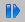
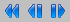

# Viewing Measurement Data

To view measurement data, proceed as follows:

1. In the Navigation menu, select Next Sample to move to the next data column.
1. Click the  button.
1. In the Navigation menu, select Next Sample Set to move to the next screenful of data.
1. Click the  button.
1. In the Navigation menu, select Last Sample to move to the last data column.
1. Click the  button.

For each of these three commands there is an equivalent command or button for moving in the opposite direction.

