# Merged CHM Content

## Overview

_Source: `markdown/CTB_Overview.md`_

# Overview

Continuous time blocks (CT blocks) are used to describe models of the technical processes controlled by ASCET embedded software specifications. Entire control loops can be modelled and tested within ASCET in this way.

CT blocks are specified in the same way as other components, i.e. they can be specified either as block diagrams, C code or ESDL code. There is, however, a difference in functionality between CT blocks specified as block diagrams and those specified in code.

Basic continuous time blocks specified in code are used to model basic physical components, such as wheels, brakes, or hydraulic conduits. These components are typically described in terms of differential equations, which are more easily specified in code than as block diagrams. They are then combined into larger assemblies with continuous time structure blocks specified as block diagrams.

It is possible to reference standard ASCET classes, but this only makes sense if those classes are used as records, i.e. complex variables. It is not possible to use algorithms specified as standard classes in continuous time blocks.

Specifying CT Blocks shows how to specify continuous time blocks both as block diagrams and in code. The editors used are the same ones as for standard -ASCET classes, with slight variations. Only the differences from standard class specification are discussed here, so you should be familiar with the Block Diagram Editor (see [Block Diagram Editor](BlockDiagramEditorEnglishUS.chm::/BDE_Overview.htm)), the C Code Editor (see [C Code Editor](CCodeEditorEnglishUS.chm::/CC_Overview.htm)) and the ESDL Editor (see [ESDL Editor](ESDLEditorEnglishUS.chm::/ESDL_Overview.htm)).

The methods (type and number) available in CT basic blocks are pre-defined and cannot be modified by the user. Each method has a specific purpose, e.g. the calculation of derivations or outputs. The execution sequence of the methods is fixed, the methods are executed automatically. It is not necessary to use each method in a CT basic block.

The following methods are available in CT basic blocks:

- init()
- terminate()
- derivatives()
- update()
- directOutputs()
- nondirectOutputs()
- dependentParameters()
- stateEvents()
- events()

See also

[CT Blocks](markdown/ctb_ct_blocks.md)

[Block Diagram Editor - Overview](BlockDiagramEditorEnglishUS.chm::/BDE_Overview.htm)

[C Code Editor - Overview](CCodeEditorEnglishUS.chm::/CC_Overview.htm)

[ESDL Editor - Overview](ESDLEditorEnglishUS.chm::/ESDL_Overview.htm)

[init() Method](markdown/CTB_init_Method_.md)

[terminate() Method](markdown/CTB_terminate_Method_.md)

[derivatives() Method](markdown/CTB_derivatives_Method.md)

[update() Method](markdown/CTB_update_Method.md)

[directOutputs() Method](markdown/CTB_directOutputs_Method.md)

[nondirectOutputs() Method](markdown/CTB_nondirectOutputs_Method.md)

[dependentParameters() Method](markdown/CTB_dependentParameters_Method.md)

[stateEvents() Method](markdown/CTB_stateEvents_Method.md)

[events() Method](markdown/CTB_events_Method.md)

---

## CT Blocks

_Source: `markdown/ctb_ct_blocks.md`_

# CT Blocks

The comprehensive capabilities of ASCET are utilized to model discrete systems for the functional development of controller software and for the simulation of control units. In contrast, the control system associated with the control unit represents a continuous time physical system that is described by differential equations.

Examples for continuous time systems are the drive train or the wheel suspension of vehicles (mechanical system), the combustion process in the cylinder chamber (thermodynamic system), the brake circuit of a vehicle (hydraulic or pneumatic system), and the vehicle battery (electric or electrochemical system). In addition, there are increasingly also mechatronic systems in which, e.g., the mechanics of an actuator is connected with a local electronic control, or an intelligent sensor processes the physical signal electronically.

ASCET supports the model design and simulation of such continuous time systems by means of so-called CT blocks. CT stands for Continuous Time and refers to elements that are modeled or calculated in quasi-continuous time increments. The continuous time modeling in ASCET is based on state space representation, the standard description form in the design of continuous time systems. This representation \ allows the description of CT basic blocks by nonlinear ordinary first-order differential equations and nonlinear output equations. ASCET provides several real-time integration methods to solve these differential equations efficiently.

The continuous time model can be structured in modular and hierarchical blocks. Continuous time models can be combined by ASCET controller specifications to create combined models, so-called hybrid projects. These hybrid projects can be used to test a controller specification against a model of the actual technical processes that need to be controlled.

The model and the simulation experiment are strictly separate; a model contains the modular and hierarchical system description while an experiment contains the selected data set, the integration algorithm, and the selected visualization configuration including an input method for parameters. The results are accurate, reusable models and high flexibility. At the experiment level, each model variable can be flexibly altered and measured. The chosen integration step size and the integration algorithm can be changed during the simulation, without any time-consuming recompilation of the model or the current experiment.

See also

[Continuous Time Basic Blocks](markdown/CTB_Overview_CT_Basic_Blocks.md)

[Summary - Basic Block Interfaces](markdown/CTB_summary.md)

[Continuous Time Structure Blocks and Graphical Hierarchies](markdown/CTB_Continuous_Time_Structure_Blocks.md)

[Block Interfaces (Structure Blocks)](markdown/CTB_Summary_Structure_Block_Interfaces.md)

[Solving Differential Equations - Integration Algorithms](markdown/ctb_overview_differential_equations_and_integration_algorithms.md)

---

## Continuous Time Basic Blocks

_Source: `markdown/CTB_Overview_CT_Basic_Blocks.md`_

# Overview - CT Basic Blocks

Continuous time basic blocks (CT basic blocks) are generally used to describe small, independent physical components that can be used in various model scenarios. Basic blocks can be specified using the CT block editor. The block interface is specified interactively and the dynamics of the physical component are described by differential and algebraic equations.

Continuous time basic blocks are specified either in the C code editor or in the ESDL editor. The target-independent ESDL modeling language provides advanced semantic verification ensuring a correct model. Modeling directly in C, therefore, should be confined to target-dependent real-time blocks only. In general, the use of ESDL is recommended.

The two editors are slightly different for the specification of CT blocks. The internals of the blocks, i.e., the differential and algebraic equations as well as the control structures, are described within pre-defined methods. The pre-defined method structure cannot be modified by the user. Each method has a specific purpose, e.g., the calculation of derivations or outputs.

The proper computing sequence required for correct, continuous time modeling is derived automatically (sequencing). In contrast to standard ASCET models, the execution sequence is fixed (see [Overview - Computing Sequence](markdown/ctb_overview_computing_sequence.md)), and the methods are scheduled automatically.

Basic blocks are used to describe models by means of nonlinear ordinary first-order differential equations (ODE) and nonlinear output equations. To describe a system of higher order, it has to be converted into several differential equations of first order. The table below illustrates the transformation of a second-order system into its representation in the state space.

| Column 1 | Column 2 |
| --- | --- |
| One 2nd-order differential equation | Two 1st-order differential equations |
| T2*x’’ + 2.0*d*T*x’ + x = K*in; | x’ = xp; xp’ = (K*in - (2.0*d*T*xp) - x) / T2; |

The equations can be written in ESDL or C. The use of ESDL ensures a target-independent specification and advanced semantic checks. When using C, the entire functionality of the C programming language is available. The drawback of C is that it is not possible to perform a semantic analysis. The use of ANSI C enables largely target-independent modeling, however, this is not the case if special language dialects such as for special hardware optimization is used. Furthermore in C, the block's behavior has to be specified as direct or nondirect.

See also

[Modeling With Continuous Time Basic Blocks](markdown/CTB_Modeling_With_CT_Basic_Blocks.md)

[Summary - Block Interfaces](markdown/CTB_summary.md)

[Summary-Block Methods](markdown/CTB_SummaryBlock_Methods.md)

[Overview - ESDL Editor](ESDLEditorEnglishUS.chm::/ESDL_Overview.htm)

[Overview - C Code Editor](CCodeEditorEnglishUS.chm::/CC_Overview.htm)

[Overview - Computing Sequence](markdown/ctb_overview_computing_sequence.md)

---

## Block Interfaces (Basic Blocks)

_Source: `markdown/CTB_summary.md`_

# Summary - Basic Block Interfaces

The elements (interfaces, storage elements) for modeling continuous time basic blocks are slightly different from those used for discrete modules or classes. The following element types are available:

- [Inputs](markdown/CTB_Inputs.md)
- [Continuous states](markdown/CTB_Continuous_State.md)
- [Discrete states](markdown/CTB_Discrete_State.md)
- [Steplocal variables](markdown/CTB_Steplocal_Variables.md)
- [Parameters](markdown/CTB_Parameters.md)
- [Dependent parameters](markdown/CTB_Dependent_Parameters.md)
- [Constants](markdown/CTB_Constants.md)

Each element type can have different dimensions, scopes, and data types. The figure shows the various data types (and their associated icon) and the available methods for working with these data.

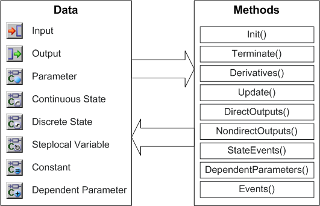

See also

[Dimensions, Scopes, and Data Types](markdown/CTB_Dimensions_Scopes_DataTypes.md)

[Inputs](markdown/CTB_Inputs.md)

[Outputs](markdown/CTB_Outputs.md)

[Continuous State](markdown/CTB_Continuous_State.md)

[Discrete State](markdown/CTB_Discrete_State.md)

[Steplocal Variables](markdown/CTB_Steplocal_Variables.md)

[Parameters](markdown/CTB_Parameters.md)

[Dependent Parameters](markdown/CTB_Dependent_Parameters.md)

[Constants](markdown/CTB_Constants.md)

---

## Dimensions, Scopes, and Data Types (Basic Blocks)

_Source: `markdown/CTB_Dimensions_Scopes_DataTypes.md`_

# Dimensions, Scopes, and Data Types (Basic Blocks)

For each element type available, there are various dimensions, scopes, and data types. The possible combinations are listed below.

<table style="x-cell-content-align: Top;
				margin-top: 3px;
				border-left-style: Outset;
				border-top-style: Outset;
				border-right-style: Outset;
				border-bottom-style: Outset;
				border-left-width: 1px;
				border-right-width: 1px;
				border-top-width: 1px;
				border-bottom-width: 1px;" x-use-null-cells="">
<col/>
<col style="width: 40px;"/>
<col style="width: 40px;"/>
<col style="width: 40px;"/>
<col style="width: 40px;"/>
<col style="width: 40px;"/>
<col style="width: 40px;"/>
<col style="width: 40px;"/>
<col style="width: 40px;"/>
<col style="width: 40px;"/>
<col style="width: 40px;"/>
<col style="width: 40px;"/>
<col style="width: 40px;"/>
<tr class="hcp1" valign="top">
<td class="hcp2" colspan="1" rowspan="1">

Combinations
</td>
<td class="hcp2" colspan="3" rowspan="1" style="width:120px;" width="120px">

dimension
</td>
<td class="hcp2" colspan="2" rowspan="1" style="width:80px;" width="80px">

scope
</td>
<td class="hcp2" colspan="7" rowspan="1" style="width:160px;" width="160px">

data type
</td>
</tr>
<tr class="hcp1" valign="top">
<td class="hcp2">

Elements
</td>
<td class="hcp2" style="width:40px;" width="40px">

scalar
</td>
<td class="hcp2" style="width:40px;" width="40px">

array
</td>
<td class="hcp2" style="width:40px;" width="40px">

record
</td>
<td class="hcp2" style="width:40px;" width="40px">

local
</td>
<td class="hcp2" style="width:40px;" width="40px">

global
</td>
<td class="hcp2" style="width:40px;" width="40px">

logic
</td>
<td class="hcp2" colspan="1" rowspan="1" style="width:40px;" width="40px">

sdisc
</td>
<td class="hcp2" colspan="1" rowspan="1" style="width:40px;" width="40px">

udisc
</td>
<td class="hcp2" style="width:40px;" width="40px">

limitInt
</td>
<td class="hcp2" style="width:40px;" width="40px">

wrapInt
</td>
<td class="hcp2" colspan="1" rowspan="1" style="width:40px;" width="40px">

cont
</td>
<td class="hcp2" style="width:40px;" width="40px">

enum
</td></tr>
<tr class="hcp1" valign="top">
<td class="hcp2">

input
</td>
<td class="hcp3" style="width:40px;" width="40px">

x
</td>
<td class="hcp4" style="width:40px;" width="40px">

x
</td>
<td class="hcp5" style="width:40px;" width="40px">

x
</td>
<td class="hcp3" style="width:40px;" width="40px">

x
</td>
<td class="hcp5" style="width:40px;" width="40px">

 
</td>
<td class="hcp3" style="width:40px;" width="40px">

x
</td>
<td class="hcp4" colspan="1" rowspan="1" style="width:40px;" width="40px">

x
</td>
<td class="hcp4" colspan="1" rowspan="1" style="width:40px;" width="40px">

x
</td>
<td class="hcp4" style="width:40px;" width="40px">

x
</td>
<td class="hcp4" style="width:40px;" width="40px">

x
</td>
<td class="hcp6" colspan="1" rowspan="1" style="width:40px;" width="40px">

x
</td>
<td class="hcp5" style="width:40px;" width="40px">

x
</td></tr>
<tr class="hcp1" valign="top">
<td class="hcp2">

output
</td>
<td class="hcp3" style="width:40px;" width="40px">

x
</td>
<td class="hcp4" style="width:40px;" width="40px">

x
</td>
<td class="hcp5" style="width:40px;" width="40px">

x
</td>
<td class="hcp3" style="width:40px;" width="40px">

x
</td>
<td class="hcp5" style="width:40px;" width="40px">

 
</td>
<td class="hcp3" style="width:40px;" width="40px">

x
</td>
<td class="hcp4" colspan="1" rowspan="1" style="width:40px;" width="40px">

x
</td>
<td class="hcp4" colspan="1" rowspan="1" style="width:40px;" width="40px">

x
</td>
<td class="hcp4" style="width:40px;" width="40px">

x
</td>
<td class="hcp4" style="width:40px;" width="40px">

x
</td>
<td class="hcp6" colspan="1" rowspan="1" style="width:40px;" width="40px">

x
</td>
<td class="hcp5" style="width:40px;" width="40px">

x
</td></tr>
<tr class="hcp1" valign="top">
<td class="hcp2">

discrete state
</td>
<td class="hcp3" style="width:40px;" width="40px">

x
</td>
<td class="hcp4" style="width:40px;" width="40px">

x
</td>
<td class="hcp5" style="width:40px;" width="40px">

 
</td>
<td class="hcp3" style="width:40px;" width="40px">

x
</td>
<td class="hcp5" style="width:40px;" width="40px">

 
</td>
<td class="hcp3" style="width:40px;" width="40px">

x
</td>
<td class="hcp4" colspan="1" rowspan="1" style="width:40px;" width="40px">

x
</td>
<td class="hcp4" colspan="1" rowspan="1" style="width:40px;" width="40px">

x
</td>
<td class="hcp4" style="width:40px;" width="40px">

x
</td>
<td class="hcp4" style="width:40px;" width="40px">

x
</td>
<td class="hcp6" colspan="1" rowspan="1" style="width:40px;" width="40px">

x
</td>
<td class="hcp5" style="width:40px;" width="40px">

x
</td></tr>
<tr class="hcp1" valign="top">
<td class="hcp2">

continuous state
</td>
<td class="hcp3" style="width:40px;" width="40px">

x
</td>
<td class="hcp4" style="width:40px;" width="40px">

x
</td>
<td class="hcp5" style="width:40px;" width="40px">

 
</td>
<td class="hcp3" style="width:40px;" width="40px">

x
</td>
<td class="hcp5" style="width:40px;" width="40px">

 
</td>
<td class="hcp3" style="width:40px;" width="40px">

 
</td>
<td class="hcp4" colspan="1" rowspan="1" style="width:40px;" width="40px">

x
</td>
<td class="hcp4" colspan="1" rowspan="1" style="width:40px;" width="40px">

x
</td>
<td class="hcp4" style="width:40px;" width="40px">

x
</td>
<td class="hcp4" style="width:40px;" width="40px">

x
</td>
<td class="hcp6" colspan="1" rowspan="1" style="width:40px;" width="40px">

x
</td>
<td class="hcp5" style="width:40px;" width="40px">

x
</td></tr>
<tr class="hcp1" valign="top">
<td class="hcp2">

steplocal variable
</td>
<td class="hcp3" style="width:40px;" width="40px">

x
</td>
<td class="hcp4" style="width:40px;" width="40px">

x
</td>
<td class="hcp5" style="width:40px;" width="40px">

 
</td>
<td class="hcp3" style="width:40px;" width="40px">

x
</td>
<td class="hcp5" style="width:40px;" width="40px">

 
</td>
<td class="hcp3" style="width:40px;" width="40px">

x
</td>
<td class="hcp4" colspan="1" rowspan="1" style="width:40px;" width="40px">

x
</td>
<td class="hcp4" colspan="1" rowspan="1" style="width:40px;" width="40px">

x
</td>
<td class="hcp4" style="width:40px;" width="40px">

x
</td>
<td class="hcp4" style="width:40px;" width="40px">

x
</td>
<td class="hcp6" colspan="1" rowspan="1" style="width:40px;" width="40px">

x
</td>
<td class="hcp5" style="width:40px;" width="40px">

x
</td></tr>
<tr class="hcp1" valign="top">
<td class="hcp2">

parameter
</td>
<td class="hcp3" style="width:40px;" width="40px">

x
</td>
<td class="hcp4" style="width:40px;" width="40px">

x
</td>
<td class="hcp5" style="width:40px;" width="40px">

 
</td>
<td class="hcp3" style="width:40px;" width="40px">

x
</td>
<td class="hcp5" style="width:40px;" width="40px">

x
</td>
<td class="hcp3" style="width:40px;" width="40px">

x
</td>
<td class="hcp4" colspan="1" rowspan="1" style="width:40px;" width="40px">

x
</td>
<td class="hcp4" colspan="1" rowspan="1" style="width:40px;" width="40px">

x
</td>
<td class="hcp4" style="width:40px;" width="40px">

x
</td>
<td class="hcp4" style="width:40px;" width="40px">

x
</td>
<td class="hcp6" colspan="1" rowspan="1" style="width:40px;" width="40px">

x
</td>
<td class="hcp5" style="width:40px;" width="40px">

x
</td></tr>
<tr class="hcp1" valign="top">
<td class="hcp2">

dependent parameter
</td>
<td class="hcp3" style="width:40px;" width="40px">

x
</td>
<td class="hcp4" style="width:40px;" width="40px">

x
</td>
<td class="hcp5" style="width:40px;" width="40px">

 
</td>
<td class="hcp3" style="width:40px;" width="40px">

x
</td>
<td class="hcp5" style="width:40px;" width="40px">

 
</td>
<td class="hcp3" style="width:40px;" width="40px">

x
</td>
<td class="hcp4" colspan="1" rowspan="1" style="width:40px;" width="40px">

x
</td>
<td class="hcp4" colspan="1" rowspan="1" style="width:40px;" width="40px">

x
</td>
<td class="hcp4" style="width:40px;" width="40px">

x
</td>
<td class="hcp4" style="width:40px;" width="40px">

x
</td>
<td class="hcp6" colspan="1" rowspan="1" style="width:40px;" width="40px">

x
</td>
<td class="hcp5" style="width:40px;" width="40px">

x
</td></tr>
<tr class="hcp1" valign="top">
<td class="hcp2" colspan="1" rowspan="1">

constant
</td>
<td class="hcp3" colspan="1" rowspan="1" style="width:40px;" width="40px">

x
</td>
<td class="hcp4" colspan="1" rowspan="1" style="width:40px;" width="40px">

x
</td>
<td class="hcp5" colspan="1" rowspan="1" style="width:40px;" width="40px">

 
</td>
<td class="hcp3" colspan="1" rowspan="1" style="width:40px;" width="40px">

x
</td>
<td class="hcp5" colspan="1" rowspan="1" style="width:40px;" width="40px">

x
</td>
<td class="hcp3" colspan="1" rowspan="1" style="width:40px;" width="40px">

x
</td>
<td class="hcp4" colspan="1" rowspan="1" style="width:40px;" width="40px">

x
</td>
<td class="hcp4" colspan="1" rowspan="1" style="width:40px;" width="40px">

x
</td>
<td class="hcp4" colspan="1" rowspan="1" style="width:40px;" width="40px">

x
</td>
<td class="hcp4" colspan="1" rowspan="1" style="width:40px;" width="40px">

x
</td>
<td class="hcp6" colspan="1" rowspan="1" style="width:40px;" width="40px">

x
</td>
<td class="hcp5" colspan="1" rowspan="1" style="width:40px;" width="40px">

x
</td></tr>
<tr class="hcp1" valign="top">
<td class="hcp2" colspan="1" rowspan="1">

continuous variable
</td>
<td class="hcp3" colspan="1" rowspan="1" style="width:40px;" width="40px">

x
</td>
<td class="hcp4" colspan="1" rowspan="1" style="width:40px;" width="40px">

x
</td>
<td class="hcp5" colspan="1" rowspan="1" style="width:40px;" width="40px">

x
</td>
<td class="hcp3" colspan="1" rowspan="1" style="width:40px;" width="40px">

x
</td>
<td class="hcp5" colspan="1" rowspan="1" style="width:40px;" width="40px">

x
</td>
<td class="hcp3" colspan="1" rowspan="1" style="width:40px;" width="40px">

x
</td>
<td class="hcp4" colspan="1" rowspan="1" style="width:40px;" width="40px">

x
</td>
<td class="hcp4" colspan="1" rowspan="1" style="width:40px;" width="40px">

x
</td>
<td class="hcp4" colspan="1" rowspan="1" style="width:40px;" width="40px">

x
</td>
<td class="hcp4" colspan="1" rowspan="1" style="width:40px;" width="40px">

x
</td>
<td class="hcp6" colspan="1" rowspan="1" style="width:40px;" width="40px">

x
</td>
<td class="hcp5" colspan="1" rowspan="1" style="width:40px;" width="40px">

x
</td></tr>
<tr class="hcp1" valign="top">
<td class="hcp2">

characteristic line/map
</td>
<td class="hcp3" colspan="3" rowspan="1" style="width:120px;" width="120px">

n/a
</td>
<td class="hcp3" style="width:40px;" width="40px">

x
</td>
<td class="hcp5" style="width:40px;" width="40px">

x
</td>
<td class="hcp3" style="width:40px;" width="40px">

 
</td>
<td class="hcp4" colspan="1" rowspan="1" style="width:40px;" width="40px">

x
</td>
<td class="hcp4" colspan="1" rowspan="1" style="width:40px;" width="40px">

x
</td>
<td class="hcp4" style="width:40px;" width="40px">

 
</td>
<td class="hcp4" style="width:40px;" width="40px">

 
</td>
<td class="hcp6" colspan="1" rowspan="1" style="width:40px;" width="40px">

x
</td>
<td class="hcp5" style="width:40px;" width="40px">

 
</td></tr>
</table>

See also

[Inputs](markdown/CTB_Inputs.md)

[Outputs](markdown/CTB_Outputs.md)

[Continuous State](markdown/CTB_Continuous_State.md)

[Discrete State](markdown/CTB_Discrete_State.md)

[Steplocal Variables](markdown/CTB_Steplocal_Variables.md)

[Parameters](markdown/CTB_Parameters.md)

[Dependent Parameters](markdown/CTB_Dependent_Parameters.md)

[Constants](markdown/CTB_Constants.md)

[Scalar Types - Summary](IntroductionEnglishUS.chm::/INT_scalar_summary.htm)

---

## Inputs

_Source: `markdown/CTB_Inputs.md`_

# Inputs

Block entries are described by inputs. During each evaluation step, all input variables are read.

See also

[Summary - Basic Block Interface](markdown/CTB_summary.md)

[Summary - Structure Block Interfaces](markdown/CTB_Summary_Structure_Block_Interfaces.md)

---

## Outputs

_Source: `markdown/CTB_Outputs.md`_

# Outputs

Block exits are described by outputs. During each evaluation step, all output variables are updated.

See also

[Summary - Basic Block Interface](markdown/CTB_summary.md)

[Summary - Structure Block Interfaces](markdown/CTB_Summary_Structure_Block_Interfaces.md)

---

## Continuous State

_Source: `markdown/CTB_Continuous_State.md`_

# Continuous State

The description of ordinary differential equations requires state variables. Each state variable functions as a storage element, an example is the distance and velocity of a moving mass point. Continuous state variables are only used by the differential operator ddt.

---

## Discrete State

_Source: `markdown/CTB_Discrete_State.md`_

# Discrete State

A discrete state variable is a storage element. It can be used to keep a variable value from one calculation step to the next, e.g. the value of a counter. Discrete state variables are equivalent to the variables in discrete classes or modules. Discrete state variables cannot be used by the differential operator ddt.

---

## Steplocal Variables

_Source: `markdown/CTB_Steplocal_Variables.md`_

# Steplocal Variables

Steplocal variables are used to store intermediate values during the calculation of an evaluation step. These variables are visible in all block methods. The value of a steplocal variable is valid only in one evaluation cycle, the variable is reinitialized at the beginning of each iteration step. If the value must be evaluated in a different method, the execution sequence of the methods has to be considered (ensure writing before reading).

---

## Parameters

_Source: `markdown/CTB_Parameters.md`_

# Parameters

Parameters are used to create a physical model. Normally, a parameter corresponds to a characteristic property of a real system, such as mass, length, or attenuation constant. A generic model library can be systematically built by means of efficient parameterization. Parameters can be varied during the simulation in the experiment environment (using the Calibration Editor).

---

## Dependent Parameters

_Source: `markdown/CTB_Dependent_Parameters.md`_

# Dependent Parameters

If one parameter depends on another parameter, e.g. parameters described in different coordinate systems, it should be recalculated only if the other, affecting, parameter has changed. This type of parameter behavior can be described by dependent parameters. They are calculated only in case of changes asynchronously in the dependentParameters method.

For example: m_vehicle = m_empty + m_payload.

If the payload changes in the experiment, the vehicle mass is recalculated in the dependentParameters method.

---

## Constants

_Source: `markdown/CTB_Constants.md`_

# Constants

Constants are used for values that do not change during an experiment, such as the gravitation constant.

See also

[Summary - Basic Block Interface](markdown/CTB_summary.md)

[Summary - Structure Block Interfaces](markdown/CTB_Summary_Structure_Block_Interfaces.md)

---

## Block Methods

_Source: `markdown/CTB_SummaryBlock_Methods.md`_

# Summary - Block Methods

The following Block methods are available for CT basic blocks:

- [init() Method](markdown/CTB_init_Method_.md)
- [terminate() Method](markdown/CTB_terminate_Method_.md)
- [derivatives() Method](markdown/CTB_derivatives_Method.md)
- [update() Method](markdown/CTB_update_Method.md)
- [directOutputs() Method](markdown/CTB_directOutputs_Method.md)
- [nondirectOutputs() Method](markdown/CTB_nondirectOutputs_Method.md)
- [dependentParameters() Method](markdown/CTB_dependentParameters_Method.md)
- [stateEvents() Method](markdown/CTB_stateEvents_Method.md)
- [events() Method](markdown/CTB_events_Method.md)

---

## init() Method

_Source: `markdown/CTB_init_Method_.md`_

# init()Method

The init() method is called only at the beginning or restart of an experiment. The init() method can be used to specify code for initializing the block, e.g. to model the start-up behavior of a model or to initialize state variables (e.g. resetContinuousState(x,5.3)). Initialization values derived from calculation statements have to be explicitly assigned using the init() method.

---

## terminate() Method

_Source: `markdown/CTB_terminate_Method_.md`_

# terminate()Method

The terminate() method is executed at the end of the experiment. The terminate() method can be used to specify code for finishing a block, e.g. to model the shutdown behavior of the system.

---

## derivatives() Method

_Source: `markdown/CTB_derivatives_Method.md`_

# derivatives()Method

Ordinary differential equations (ODE) have to be specified in the derivatives() method. If the model structure changes during the simulation (e.g. in a model with moving masses that simulates static and dynamic friction), the structure change can be controlled with the usual control structures (if(...) then... else...).

---

## update() Method

_Source: `markdown/CTB_update_Method.md`_

# update()Method

update() is executed in the granularity of the external communication interval dT. Values required only at this granularity (also communication with the experiment environment) can be calculated using this method.

---

## directOutputs() Method

_Source: `markdown/CTB_directOutputs_Method.md`_

# directOutputs()Method

The directOutputs() method includes all output equations with direct pass-through that directly depend on inputs. As they directly depend on inputs that in turn may depend on nondirectOutputs(), this method is executed after nondirectOutputs().

---

## nondirectOutputs() Method

_Source: `markdown/CTB_nondirectOutputs_Method.md`_

# nondirectOutputs()Method

The nondirectOutputs() method includes all output equations with nondirect pass-through (i.e. those not directly depending on inputs).

---

## dependentParameters() Method

_Source: `markdown/CTB_dependentParameters_Method.md`_

# dependentParameters()Method

Within the dependentParameters method, equations are specified for parameters that depend on other parameters. This method is only executed if a parameter has been changed during the simulation experiment (asynchronous execution when changed). This reduces the calculation time.

For example: m_vehicle = m_empty + m_payload.

The vehicle mass is recalculated in the dependentParameters method only if the payload changes in the experiment.

---

## stateEvents() Method

_Source: `markdown/CTB_stateEvents_Method.md`_

# stateEvents()Method

Within the stateEvents() method, it is possible to model state- and time-dependent discontinuities. This method is evaluated at the end of each consistent integration step. Discrete state equations must be specified in the stateEvents() method.

---

## events() Method

_Source: `markdown/CTB_events_Method.md`_

# events()Method

The events() method can be used to process asynchronous software and hardware interrupts. This method is not executed time-synchronously but asynchronously when the corresponding event occurs.

---

## Modeling with CT Blocks

_Source: `markdown/CTB_Modeling_with_CT_Blocks.md`_

# Modeling with CT Blocks

Models of continuous time systems can be structured in modules and hierarchies. The fundamental element is the continuous time basic block, or CT basic block, in which the partial model is described in the form of differential equations, algebraic equations, formulas and assignments using the high-level languages ESDL or C.

C should be used in imperative, exceptional cases only because ASCET provides automatic verification functions (semantic checks, computing sequence) only for ESDL.

Continuous time blocks (CT blocks) consist of inputs, outputs, parameters, and discrete and continuous states with several dimensions, scopes and data types. In addition, continuous time and discrete equations and output equations as well as an initialization and termination sequence are also supported. State events, software and hardware events (interrupts) can also be handled.

See also

[Structure Blocks](markdown/CTB_Structure_Blocks.md)

[Usage of CT Blocks](markdown/CTB_Usage_of_CT_Blocks.md)

[Modeling with Graphical Hierarchies](markdown/CTB_Modeling_with_Graphical_Hierarchies.md)

[Experiments](markdown/CTB_Experiments.md)

[Projects and Hybrid Projects](markdown/CTB_Projects_and_Hybrid_Projects.md)

[Overview - CT Basic Blocks](markdown/CTB_Overview_CT_Basic_Blocks.md)

---

## Structure Blocks

_Source: `markdown/CTB_Structure_Blocks.md`_

# Structure Blocks

More complex continuous time models can be assembled to CT structure blocks using the Block Diagram Editor (BDE). Using the Block Diagram Editor, several CT basic blocks and/or CT structure blocks can be assembled and combined. The first figure shows a simple CT structure block composed of two CT basic blocks.

Several CT structure blocks and CT basic blocks can in turn be combined to one new CT structure block. The second figure shows the possible structuring options with CT structures.

The correct computing sequence of the CT blocks is determined automatically.

See also

[Continuous Time Structure Blocks](markdown/CTB_Continuous_Time_Structure_Blocks.md)

[Modeling with CT Blocks](markdown/CTB_Modeling_with_CT_Blocks.md)

[Usage of CT Blocks](markdown/CTB_Usage_of_CT_Blocks.md)

[Modeling with Graphical Hierarchies](markdown/CTB_Modeling_with_Graphical_Hierarchies.md)

[Experiments](markdown/CTB_Experiments.md)

[Projects and Hybrid Projects](markdown/CTB_Projects_and_Hybrid_Projects.md)

---

## Usage of CT Blocks

_Source: `markdown/CTB_Usage_of_CT_Blocks.md`_

# Usage of CT Blocks

CT basic blocks are used to describe small physical components such as brakes, wheels, etc.

CT structure blocks serve to describe more complex entities such as a power train facility or a complete vehicle model.

CT basic blocks and CT structure blocks are each stored in the database/workspace and are available for other models. In this way, it is possible to easily build a model library. Modifications to blocks or structures are automatically distributed to all models within one database/workspace. This has the advantage that basic elements have to be maintained at one place only while corrections are automatically adopted by all models included in the same database/workspace. On the other hand, it must of course be ensured that the basic elements remain compatible.

See also

[Modeling with CT Blocks](markdown/CTB_Modeling_with_CT_Blocks.md)

[Structure Blocks](markdown/CTB_Structure_Blocks.md)

[Modeling with Graphical Hierarchies](markdown/CTB_Modeling_with_Graphical_Hierarchies.md)

[Experiments](markdown/CTB_Experiments.md)

[Projects and Hybrid Projects](markdown/CTB_Projects_and_Hybrid_Projects.md)

---

## Modeling with Graphical Hierarchies

_Source: `markdown/CTB_Modeling_with_Graphical_Hierarchies.md`_

# Modeling with Graphical Hierarchies

A CT structure block composed of many CT basic blocks and/or CT structure blocks can be designed more clearly by combining several related CT blocks in a graphical hierarchy. Graphical hierarchies and CT structures can be combined into new hierarchies-the processing sequence is not affected by these graphical hierarchies. In the Block Diagram Editor, graphical hierarchies are indicated by a double-line frame.

Graphical hierarchies are especially used when the individual CT blocks have strong cohesion and require a fixed computing sequence within an integration step. By using graphical hierarchies, algebraic loops refer to [Algebraic Loops](markdown/CTB_Algebraic_Loops.md) and [Difference Between Graphical Hierarchies and CT Structure Blocks](markdown/CTB_Difference_GraphicalHierarchies_CTStructureBlocks.md) that may be caused by CT structure blocks can be avoided. The correct computing sequence is ensured by automatic sequencing. Graphical hierarchies cannot be stored individually but only together with the corresponding structure block.

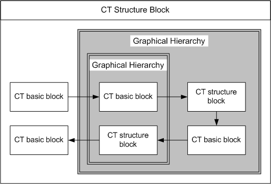

See also

[Modeling with CT Blocks](markdown/CTB_Modeling_with_CT_Blocks.md)

[Structure Blocks](markdown/CTB_Structure_Blocks.md)

[Usage of CT Blocks](markdown/CTB_Usage_of_CT_Blocks.md)

[Experiments](markdown/CTB_Experiments.md)

[Projects and Hybrid Projects](markdown/CTB_Projects_and_Hybrid_Projects.md)

[Algebraic Loops](markdown/CTB_Algebraic_Loops.md)

[Difference Between Graphical Hierarchies and CT Structure Blocks](markdown/CTB_Difference_GraphicalHierarchies_CTStructureBlocks.md)

---

## Experiments

_Source: `markdown/CTB_Experiments.md`_

# Experiments

Basic and structure blocks can be evaluated in a simulation experiment. In the experiment, the integration method, the model stimulation, and the visualization of results are selected and specified. Several experiment settings can be stored for a (partial) model.

See also

[Modeling with CT Blocks](markdown/CTB_Modeling_with_CT_Blocks.md)

[Structure Blocks](markdown/CTB_Structure_Blocks.md)

[Usage of CT Blocks](markdown/CTB_Usage_of_CT_Blocks.md)

[Modeling with Graphical Hierarchies](markdown/CTB_Modeling_with_Graphical_Hierarchies.md)

[Projects and Hybrid Projects](markdown/CTB_Projects_and_Hybrid_Projects.md)

---

## Projects and Hybrid Projects

_Source: `markdown/CTB_Projects_and_Hybrid_Projects.md`_

# Projects and Hybrid Projects

The real-time experiment is defined in a project. Both basic blocks and structure blocks can be used in a project. Furthermore, it is only in the project where individual integration methods and their step size can be assigned to each integrated basic block or structure block. This allows allocating more CPU time to the model part with high dynamics than to other, less dynamic model parts, if the processor capacity is limited.

For a model in which the controller and control system models are to be combined, a hybrid project can be defined, i.e., a project that contains both CT blocks and standard ASCET components. A hybrid project thus allows the simulation of the control system and the control unit in one model (hybrid simulation).

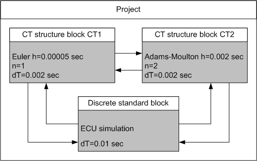

The communication between individual CT blocks and individual controller modules is performed by explicitly connecting inputs and outputs in the Block Diagram Editor for details on projects, refer to [Overview-Project Editor](ProjectEditorEnglishUS.chm::/PE_Overview.htm).

The experiment can be conducted on-line on the real-time simulation hardware or off-line on the PC (unless special hardware has to be available or integrated for the experiment).

See also

[Modeling with CT Blocks](markdown/CTB_Modeling_with_CT_Blocks.md)

[Structure Blocks](markdown/CTB_Structure_Blocks.md)

[Usage of CT Blocks](markdown/CTB_Usage_of_CT_Blocks.md)

[Modeling with Graphical Hierarchies](markdown/CTB_Modeling_with_Graphical_Hierarchies.md)

[Experiments](markdown/CTB_Experiments.md)

[Overview-Project Editor](ProjectEditorEnglishUS.chm::/PE_Overview.htm)

---

## Solving Differential Equations - Integration Algorithms

_Source: `markdown/ctb_overview_differential_equations_and_integration_algorithms.md`_

- Euler
- Mulstep 2
- Heun
- Adams-Moulton 2
- Runge-Kutta 4

- Dormand/Prince RK5
- Calvo 6(5)
- Dormand/Prince RK8
- Implicit RK2
- Implicit RK4
- Implicit Gear 1
- Implicit Gear 2

# Overview - Differential Equations and Integration Algorithms

Due to the complexity of the equations in continuous time models and frequent non-linearities, it is generally not possible to solve them by analytic methods. It is therefore necessary to solve the differential equation system using a numeric integration algorithm.

If only CT blocks are simulated in a CT structure, ASCET uses a global integration algorithm. The combination with discrete controller models is possible at the project level only (combined modeling in a hybrid project). Projects also support modeling with several CT structures using different integration methods.

To ensure high flexibility and short iteration cycles for modeling and simulations, the configuration of the integration method, i.e., the actual integration method and its integration step size, can be selected and modified interactively during the experiment.

There is no ideal integration method that fits all types of models. The speed and accuracy of the individual algorithms varies for different model characteristics such as non-linearities, discontinuities, and dynamic behavior. A general statement regarding the speed of each method cannot be given, as the step size is adapted to suit the model and integration method best. However, some guidelines for selecting a suitable integration method are given below. Detailed information can be found in the literature, e.g.,

Addison, C. A.; Enright, W. H.; et al., A Decision Tree for the Numerical Solution of Initial Value Ordinary Differential Equations. ACM Transitions on Mathematical Software 17, 1, March 1991, Chapter "Continuous Time Integration Algorithms".

ASCET provides several [fixed-step integration methods](javascript:kadovTextPopup(this))<!-- kadovTextPopupInit('a1'); //-->.

To solve more complex or stiff differential equations that need more precise calculation, ASCET provides several [variable-step iterative integration methods](javascript:kadovTextPopup(this))<!-- kadovTextPopupInit('a2'); //-->.

During calculation, these integration methods adapt the step width used interactively in order to achieve a certain given precision. Therefore, they cannot be used for real-time calculations.

The integration method is always specified for the entire model (global integration). When experimenting in a project context, a separate integration method can be specified for each block separately (multirate). It is possible to change the integration method during the experiment.

Due to technical reasons, the implicit integration methods can only be used with newer Borland and Microsoft compilers, among them MinGW GNU 4.7.2 (shipped with ASCET). They cannot be used with the Borland-C V4.5 compiler shipped with previous ASCET versions. The integration methods are taken from the GNU Scientific Library. The integration method Gear 4 has been unavailable since ASCET V5.2.

See also

[Overview – Integration Methods](markdown/CTB_OverviewIntegrationMethods.md)

[Euler](markdown/ctb_euler.md)

[Mulstep](markdown/ctb_mulstep.md)

[Heun](markdown/ctb_heun.md)

[Adams-Moulton](markdown/ctb_adams-moulton.md)

[Runge-Kutta 4](markdown/ctb_runge-kutta_4.md)

[Integration Methods With Variable Step Width](markdown/ctb_integration_methods_with_variable_step_width.md)

/* Heikki Komulainen, Comet Computer GmbH 2004 */ cc_plus_pic = '&nbsp;'; cc_minus_pic = '&nbsp;'; cc_stat_pic = '&nbsp;'; gpstyle = ''; var iframes_created = 0; if (document.body && document.body.insertAdjacentHTML && document.getElementsByTagName && document.getElementById) { collect_popups(); set_poplinks_pictures(); if (iframes_created) { document.write(gpstyle); document.write('
<nobr><a id="einauslink" style="position:absolute;top:expression(document.body.scrollTop + this.offsetHeight - this.offsetHeight);left:expression(document.body.offsetWidth - (this.offsetWidth + 28));background:white;padding:5px" href="javascript:show_all_poptext()">Alle texte einblenden</a></nobr>
'); } } function collect_popups() { bsscpopups = new Array(); for (x = 0; x < document.links.length; x++) { if (document.links[x].href.indexOf("BSSCPopup")>-1) { seekmatch = /BSSCPopup.'[^'](markdown/+)'/; poplink = seekmatch.exec(document.links[x].href); poplink = "" + poplink; poplink = poplink.substring(poplink.indexOf("'")+1, poplink.lastIndexOf("'")); ifid = "CCGENIFRAMEID" + x; new_iframe = '<iframe id="' + ifid + '"src="' + poplink + '" onload="get_text(\'' + ifid + '\')" width="0" height="0" frameborder=0></iframe>'; document.links[x].parentNode.insertAdjacentHTML("afterEnd", new_iframe); gpid = "CCID_" + ifid; document.links[x].href = "javascript:expand_poptext('" + gpid + "')"; cc_plus = '' + cc_plus_pic + ''; document.links[x].insertAdjacentHTML("afterBegin", cc_plus); iframes_created = 1; } } }// end function function get_text(ifr_id) { frpars = document.frames[ifr_id].document.getElementsByTagName("body"); popbody = frpars[0].innerHTML; gpid = "CCID_" + ifr_id; if (!document.getElementById(gpid)) { //avoiding doubles document.getElementById(ifr_id).insertAdjacentHTML("afterEnd", '
'+popbody+'
'); } }//end function function expand_poptext(x_frame_id) { if (!document.getElementById(x_frame_id)) return; if (document.getElementById(x_frame_id).className == "CCGENPOPTEXTH") { document.getElementById(x_frame_id).className = "CCGENPOPTEXTV"; document.getElementById(x_frame_id).style.visibility = "visible"; if (document.getElementById("CCPMB_" + x_frame_id )) { document.getElementById("CCPMB_" + x_frame_id ).innerHTML = cc_minus_pic; } } else { document.getElementById(x_frame_id).className = "CCGENPOPTEXTH"; document.getElementById(x_frame_id).style.visibility = "hidden"; if (document.getElementById("CCPMB_" + x_frame_id )) { document.getElementById("CCPMB_" + x_frame_id ).innerHTML = cc_plus_pic; } } }// end function function show_all_poptext() { var pulldowntxt = document.getElementsByTagName("div"); for (b = 0; b < pulldowntxt.length; b++) { if (pulldowntxt[b].className == "droptext") { pulldowntxt[b].style.display=""; } } var gptxt = document.getElementsByTagName("div"); for (z = 0; z < gptxt.length; z++) { if (gptxt[z].className == "CCGENPOPTEXTH") { gptxt[z].className = "CCGENPOPTEXTV"; gptxt[z].style.visibility = "visible"; if (document.getElementById("CCPMB_" + gptxt[z].id )) { document.getElementById("CCPMB_" + gptxt[z].id ).innerHTML = cc_minus_pic; } } } var dxpoplinks = document.getElementsByTagName("a"); if (dxpoplinks) { for (pxl = 0; pxl < dxpoplinks.length; pxl++) { if (dxpoplinks[pxl].href.indexOf("kadovTextPopup")>-1) { if (document.getElementById("CCPMB_" + dxpoplinks[pxl].id)) { document.getElementById("CCPMB_" + dxpoplinks[pxl].id).innerHTML = cc_stat_pic; dxpoplinks[pxl].symbol = "minus"; } } } } document.getElementById('einauslink').innerText = 'Alle texte ausblenden'; document.getElementById('einauslink').href = "javascript:self.location.reload()"; self.focus(); }// end function function eat_click() { return false; }// end function function set_poplinks_pictures() { var dpoplinks = document.getElementsByTagName("a"); if (dpoplinks) { for (pl = 0; pl < dpoplinks.length; pl++) { if (dpoplinks[pl].href.indexOf("kadovTextPopup")>-1) { cc_plus = '' + cc_stat_pic + ''; //dpoplinks[pl].onmouseup = plusminuspoplink; dpoplinks[pl].insertAdjacentHTML("afterBegin", cc_plus); dpoplinks[pl].symbol = "plus"; } } } }// end function function plusminuspoplink() { if (document.getElementById("CCPMB_" + this.id)) { if (this.symbol == "plus") { document.getElementById("CCPMB_" + this.id).innerHTML = cc_minus_pic; this.symbol = "minus"; } else { document.getElementById("CCPMB_" + this.id).innerHTML = cc_plus_pic; this.symbol = "plus"; } } return true; }

---

## Overview – Integration Methods

_Source: `markdown/CTB_OverviewIntegrationMethods.md`_

# Overview – Integration Methods

It is assumed that the differential equation exists in its state form:

x’(t) = f(x,t); with x(t=0) = x0

The table below lists some characteristics of the implemented integration methods:

- The global error order p of the discretion error that is proportional with hp, where h is the integration step size.
- The number of function evaluations per integration step. Each time, the local variables are reset and the nondirectOutputs, directOutputs, derivatives methods are executed. This, combined with the integration step size, can be used to estimate the speed of the method.
- Single-step/multi-step methods (SSM/MSM): Single-step methods only use the last estimated value for the next step, whereas multi-step methods take the last n estimates into account.
- A predictor-corrector method (P-C) first uses an integration method to calculate an estimate which is then corrected using a second method.
- Fixed or variable step size.

The table below contains a summary of these characteristics for integration methods with fixed step size (for MSM, the time when the function is computed or when the break points are taken into account is indicated in parentheses).

| Column 1 | Column 2 | Column 3 | Column 4 | Column 5 | Column 6 |
| --- | --- | --- | --- | --- | --- |
| Integration Method | Error Order | Function Evaluations/ Step | SSM/MSM | P-K | Step Size |
| Euler | 1 | 1(t) | SSM | no | fixed |
| Mulstep 2 | 2 | 1(t) | MSM (t-h, t) | no | fixed |
| Heun | 2 | 2 (t, t+h) | SSM | yes | fixed |
| Adams-Moulton | 2 | 2 (t, t+h) | MSM(t-h, t) | yes | fixed |
| Runge-Kutta 4 | 4 | 4 (t, t+h/2, t+h/2, t+h) | SSM | no | fixed |

To ensure that the integration methods can be applied in real-time, each method is implemented using relatively few function evaluations per integration step and a correspondingly low error order.

See also

[Euler](markdown/ctb_euler.md)

[Mulstep](markdown/ctb_mulstep.md)

[Heun](markdown/ctb_heun.md)

[Adams-Moulton](markdown/ctb_adams-moulton.md)

[Runge-Kutta 4](markdown/ctb_runge-kutta_4.md)

[Integration Methods With Variable Step Width](markdown/ctb_integration_methods_with_variable_step_width.md)

---

## Euler

_Source: `markdown/ctb_euler.md`_

# Euler

The Euler integration method is the simplest integration method available. A single-step method with only one function evaluation per integration step, its cycle time is the smallest, making it relatively fast and especially suitable for real-time simulations.

| Column 1 |
| --- |
| Mathematical Formula |
| x(t+h)=x(t)+h*f(x,t) |

Its stability range is high, however, at the trade-off of a higher discretion error that, at the same step size, is typically higher than with the other methods (lowest order).

---

## Mulstep

_Source: `markdown/ctb_mulstep.md`_

# Mulstep

The Mulstep integration method is a multi-step method which is used for models without heavily varying eigenvalues. The cycle time of one integration step is only slightly higher than for the Euler method since only one function evaluation is performed per integration step. However, the error order is 2.

| Column 1 |
| --- |
| Mathematical Formula |
| x(t+h)=x(t)+h(3/2*f(x,t)-1/2f(x,t-h)) |

---

## Heun

_Source: `markdown/ctb_heun.md`_

# Heun

The Heun integration method is used for models without heavily varying eigenvalues. The cycle time is twice as long as with the Euler method.

| Column 1 |
| --- |
| Mathematical Formula |
| Predictor: x(t+h)=x(t)+h*f(x,t) (Euler) |
| Corrector: x(t+h)=x(t)+h/2*(f(x,t)+f(x,t+h)) |

---

## Adams-Moulton

_Source: `markdown/ctb_adams-moulton.md`_

# Adams-Moulton

The Adams-Moulton integration method is also suitable for models without heavily varying eigenvalues. In contrast to the previous algorithms, the model should exhibit a smooth behavior. The cycle times for the Adams-Moulton and Heun algorithms are almost the same.

| Column 1 |
| --- |
| Mathematical Formula |
| Predictor: x(t+h)=x(t)+h/2(3f(x,t)-f(x,t-h)) (Adams-Bashforth) |
| Corrector: x(t+h)=x(t)+h/2(f(x,t)+f(x,t+h)) |

---

## Runge-Kutta 4

_Source: `markdown/ctb_runge-kutta_4.md`_

# Runge-Kutta 4

The Runge-Kutta integration method is best suited for models without heavily varying eigenvalues. This integration method is very robust for this type of model. It is the slowest, but also the most accurate method at comparable step sizes. It is therefore possible to increase the step size considerably.

| Column 1 |
| --- |
| Mathematical Formula |
| x(t+h)=x(t)+h/6(K1+2K2+2K3+K4) |
| where |
| K1 = f(x,t) |
| K2 = f(x + K1*h/2, t + h/2) |
| K3 = f(x + K2*h/2, t + h/2) |
| K4 = f(x + K3*h, t + h) |

---

## Integration Methods With Variable Step Width

_Source: `markdown/ctb_integration_methods_with_variable_step_width.md`_

# Integration Methods With Variable Step Width

For experiments that need very precise calculation, the step width usually has to be reduced. This can increase the time used for calculation significantly. Models employing stiff differential equations often render the calculation using fixed-step integration methods infeasible. Adaptive integration methods are controlled by a target error margin. The step width is only reduced for those parts of the model where it is needed. Because the step width (and therefore the time needed for calculation) varies, these integration methods are not real-time capable.

If the desired precision cannot be reached due to the parameter settings, the experiment issues a warning in the ASCET monitor window. This happens when the maximum iteration depth is set too low or the minimal step width is set too high.

---

## Modeling With Continuous Time Basic Blocks

_Source: `markdown/CTB_Modeling_With_CT_Basic_Blocks.md`_

# Modeling With Continuous Time Basic Blocks

Within a continuous time basic block, the internals of the system to be modeled can be described using the ESDL model description language or directly in C. The target-independent ESDL modeling language provides advanced semantic verification ensuring a correct model. Modeling directly in C, therefore, should be confined to target-dependent real-time blocks only. In general, the use of ESDL is recommended.

The behavior of the block is described within a fixed framework, i.e., with a fixed number of methods. Each method has a specific purpose, e.g., the calculation of derivations or outputs. In contrast to standard ASCET models, the execution sequence is fixed, and the methods are scheduled automatically.

See also

[Continuous Time Blocks as C Code](markdown/CTB_ct_ccode.md)

[Continuous Time Blocks in ESDL](markdown/CTB_ct_esdl.md)

---

## Continuous Time Blocks as C Code

_Source: `markdown/CTB_ct_ccode.md`_

# Continuous Time Blocks as C Code

The considerations applying CT blocks as block diagrams are valid for CT blocks as C code too, i.e. everything works in the same way as for classes, except for the points listed above. One difference between continuous time blocks specified as block diagrams and as C code is that the basic elements that can be defined are different. CT blocks in C code are discussed in [Overview - Modeling in C](markdown/CTB_Overview_Modeling_in_C.md).

CT blocks specified as C code are used mainly to specify basic components for a process model. The differential equations used to model these components can be specified more quickly and concisely in code than in a block diagram.

See also

[Overview - Modeling in C](markdown/CTB_Overview_Modeling_in_C.md)

[Creating a Continuous Time Block in C Code](markdown/CTB_create_ct_block_in_c.md)

---

## Continuous Time Blocks in ESDL

_Source: `markdown/CTB_ct_esdl.md`_

# Continuous Time Blocks in ESDL

Specifying CT blocks in ESDL is similar to specifying classes with the exception of the following differences:

1. The basic elements that can be defined in a CT block are different, with the exception of characteristic lines and fields. These work in the same way as in classes. The basic elements that can be defined in CT blocks are discussed in [Summary - Basic Block Interface](markdown/CTB_summary.md).
1. There is only one diagram in a CT block, additional diagrams cannot be defined.
1. Interfaces need not be defined. A set of methods is predefined when the CT block is created. These cannot be changed and additional methods cannot be defined.
1. Only classes and other CT blocks can be referenced. Classes can only be used to define records, not to specify functionality. When a class is referenced, you are asked whether it is to be used as an input or an output.

The same basic elements are available in ESDL as for CT blocks specified in C code. The two types of blocks serve the same purpose.

See also

[Creating a Continuous Time Block in ESDL](markdown/CTB_create_ctb_in_esdl.md)

[Summary - Basic Block Interface](markdown/CTB_summary.md)

---

## Computing Sequence

_Source: `markdown/ctb_overview_computing_sequence.md`_

# Overview - Computing Sequence

During the execution of a simulation, the methods contained in a CT block are triggered in different cycles. There are three general cycle intervals:

- the external communication interval dT
- the integration step size h
- The step size h/n depending on the internal integration method

See also

[External Communication Interval dT](markdown/CTB_External_Communication_Interval_dT.md)

[Integration Step Size h](markdown/CTB_Integration_Step_Size_h.md)

[Step Size Depending on the Internal Integration Method: h/n](markdown/CTB_StepSize_Depending_on_Internal_IntegrationMethod_h_n.md)

[Execution Sequence of All Methods](markdown/CTB_Execution_Sequence_of_All_Methods.md)

---

## External Communication Interval dT

_Source: `markdown/CTB_External_Communication_Interval_dT.md`_

# External Communication Interval dT

The communication interval is not part of the model but is chosen only at run-time of the simulation. The following communication occurs during the dT cycle:

- communication between CT blocks and the experiment environment, e.g., stimulation and visualization
- communication between CT blocks and controller modules within a hybrid project
- communication between several CT (structure) blocks within a hybrid project if several integration methods are used
- calling the update() method

see also

[Overview - Computing Sequence](markdown/ctb_overview_computing_sequence.md)

[Integration Step Size h](markdown/CTB_Integration_Step_Size_h.md)

[Step Size Depending on the Internal Integration Method: h/n](markdown/CTB_StepSize_Depending_on_Internal_IntegrationMethod_h_n.md)

[Execution Sequence of All Methods](markdown/CTB_Execution_Sequence_of_All_Methods.md)

---

## Integration Step Size h

_Source: `markdown/CTB_Integration_Step_Size_h.md`_

# Integration Step Size h

The integration step size is not part of the model but chosen only at run-time of the simulation. During the h cycle, communication takes place between several continuous time blocks within a continuous time structural block. After the integration step has been executed across all blocks, the stateEvents() method is executed.

Each value transferred is numerically acknowledged and depends on the selected integration method. When simulating a highly dynamic model for which h has to be very small, the speed can be considerably increased by selecting a much higher value for dT than for h.

See also

[Overview - Computing Sequence](markdown/ctb_overview_computing_sequence.md)

[External Communication Interval dT](markdown/CTB_External_Communication_Interval_dT.md)

[Step Size Depending on the Internal Integration Method: h/n](markdown/CTB_StepSize_Depending_on_Internal_IntegrationMethod_h_n.md)

[Execution Sequence of All Methods](markdown/CTB_Execution_Sequence_of_All_Methods.md)

---

## Step Size Depending on the Internal Integration Method: h/n

_Source: `markdown/CTB_StepSize_Depending_on_Internal_IntegrationMethod_h_n.md`_

# Step Size Depending on the Internal Integration Method: h/n

Other than the h cycle, the h/n cycle depends on the selected integration method; e.g., the Euler integration method uses the cycle time h/l while the Heun integration method uses h/2

During the h/n cycle, the intermediate steps of the integration are calculated. As for the h cycle, communication takes place between the continuous time blocks of a continuous time structure block. The intermediate steps of the integration cannot be communicated to the outside.

Numerically, no discontinuities can be handled during this cycle since the stateEvents() method is not called during this cycle.

There is the following relationship between the different step sizes:

dT >= h >= h/n

The entire cycle of the various method calls is depicted in the figure below:

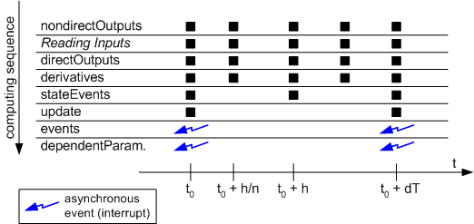

The events() and dependentParameters() methods are only called when an explicit, asynchronous event occurs, and especially not during a dT cycle.

See also

[Overview - Computing Sequence](markdown/ctb_overview_computing_sequence.md)

[External Communication Interval dT](markdown/CTB_External_Communication_Interval_dT.md)

[Integration Step Size h](markdown/CTB_Integration_Step_Size_h.md)

[Execution Sequence of All Methods](markdown/CTB_Execution_Sequence_of_All_Methods.md)

---

## Execution Sequence of All Methods

_Source: `markdown/CTB_Execution_Sequence_of_All_Methods.md`_

# Execution Sequence of All Methods

The figure below shows the execution sequence of all methods from the start to the end of the simulation.

The sequence in which the methods of a basic block are executed is illustrated by means of the following examples.

The evaluation sequence for synchronous calls, e.g., if n = 1 (Euler) and h = dT, is:

- at time t = dT: stateEvents
- at time t = dT: update

For a more complex integration method, e.g., if n = 2 (Adams-Moulton) and h = dT, the sequence is:

- at time t = dT/2: nondirectOutputs - (reading inputs) - directOutputs - derivatives
- at time t = dT: nondirectOutputs - (reading inputs) - directOutputs- derivatives
- at time t = dT: stateEvents
- at time t = dT: update

The evaluation sequence for n = 1 and h = dT/2 is:

- at time t = dT/2: nondirectOutputs - (reading inputs) - directOutputs - derivatives
- at time t = dT/2: stateEvents
- at time t = dT: nondirectOutputs - (reading inputs) - directOutputs - derivatives
- at time t = dT: stateEvents
- at time t = dT: update

Understanding the computing sequence and thus the behavior of continuous time basic blocks is absolutely mandatory for a correct use of these blocks. Using ESDL as the modeling language gives the additional advantage of providing an automatic analysis phase that ensures consistent modeling when connecting several CT blocks. The computing sequence is especially important for blocks with direct outputs (directOutputs), because current values from the same iteration cycle have to be applied to the corresponding inputs.

See also

[Overview - Computing Sequence](markdown/ctb_overview_computing_sequence.md)

[External Communication Interval dT](markdown/CTB_External_Communication_Interval_dT.md)

[Integration Step Size h](markdown/CTB_Integration_Step_Size_h.md)

[Step Size Depending on the Internal Integration Method: h/n](markdown/CTB_StepSize_Depending_on_Internal_IntegrationMethod_h_n.md)

---

## Modeling with ESDL

_Source: `markdown/CTB_Overview_Modeling_with_ESDL.md`_

# Overview - Modeling with ESDL

The entire language scope of ESDL is available for the specification of continuous time basic blocks. In addition, a semantic check and a number of additional library functions for describing differential equations are provided. These are described in the following sections.

See also

[Differential Equations in ESDL](markdown/CTB_Differential_Equations_in_ESDL.md)

[Semantic Checks in ESDL](markdown/CTB_Semantic_Checks_in_ESDL.md)

[Overview - Additional Library Functions](markdown/CTB_Overview_Additional_Library_Functions.md)

[Overview - ESDL Editor](ESDLEditorEnglishUS.chm::/ESDL_Overview.htm)

---

## Differential Equations in ESDL

_Source: `markdown/CTB_Differential_Equations_in_ESDL.md`_

# Differential Equations in ESDL

In ESDL, each continuous state variable supports the derivation operator ddt. Differential equations can be described with the ddt operator.

An example may be a PT2 system with the continuous state variables x and xp, the input in, and the parameters d, T, K. The mathematical description of the system is:

x’ = xp;

xp’ = (K*in - (2.0*d*T*xp) - x) / (T*T);

When modeling this PT2 system with ESDL, the derivations are specified by means of the ddt method:

x.ddt(xp);

xp.ddt( (K*in - (2.0*d*T*x.ddt()) - x) / (T*T) );

The derivatives on the left side of a differential equation (i.e., in the argument of a derivation method) cannot be accessed. If such an access is required, the system needs to be reformulated.

The ddt operator can only be used in the derivatives () method

See also

[Overview - Modeling with ESDL](markdown/CTB_Overview_Modeling_with_ESDL.md)

[Semantic Checks in ESDL](markdown/CTB_Semantic_Checks_in_ESDL.md)

[Overview - Additional Library Functions](markdown/CTB_Overview_Additional_Library_Functions.md)

---

## Semantic Checks in ESDL

_Source: `markdown/CTB_Semantic_Checks_in_ESDL.md`_

# Semantic Checks in ESDL

Semantic checks can be performed when using ESDL within a continuous time method. The verification items ensure that the model matches the fundamental continuous time simulation framework. For example, it is not permitted to change the value of a state variable directly (instead, the resetContinuousState() function has to be used to internally reset the integration algorithm). The figure provides an overview of the access rights to those elements. The semantic check traps any violation of these rights.

The derivation operator ddt supports only the first derivative. The output equations of the nondirectOutputs() method are analyzed to detect a direct dependency on an input. If such a case is found, a warning is issued.

See also

[Overview - Modeling with ESDL](markdown/CTB_Overview_Modeling_with_ESDL.md)

[Differential Equations in ESDL](markdown/CTB_Differential_Equations_in_ESDL.md)

[Overview - Additional Library Functions](markdown/CTB_Overview_Additional_Library_Functions.md)

---

## Additional Library Functions

_Source: `markdown/CTB_Overview_Additional_Library_Functions.md`_

# Overview - Additional Library Functions

For advanced continuous time modeling with ESDL, the system library provides a number of additional library functions. The use of each library function is described in detail in the respective topic.

- [getTime()](markdown/CTB_getTime.md)
- [getdT()](markdown/CTB_getdT.md)
- [getIntegrationStepsize()](markdown/CTB_getIntegrationStepsize.md)
- [resetContinuousState()](markdown/CTB_resetContinuousState_state_newValue.md)
- [resetCTSolver()](markdown/CTB_resetCTSolver.md)

Access to these functions in each method is shown in the figure below.

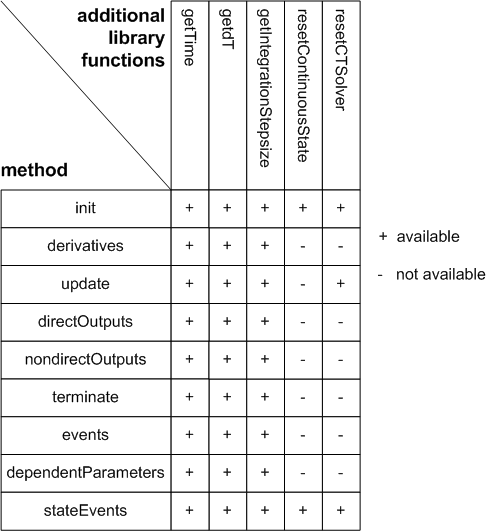

See also

[getTime( )](markdown/CTB_getTime.md)

[getdT( )](markdown/CTB_getdT.md)

[getIntegrationStepsize( )](markdown/CTB_getIntegrationStepsize.md)

[resetContinuousState( state, new value)](markdown/CTB_resetContinuousState_state_newValue.md)

[resetCTSolver( )](markdown/CTB_resetCTSolver.md)

---

## getTime( )

_Source: `markdown/CTB_getTime.md`_

# getTime( )

In some cases, the current simulation time is of importance. For on-line experiments, this is the actually elapsed time. This value can be obtained using the getTime library function:

t = getTime ( );

The getTime function can be used in any method.

See also

[Overview - Additional Library Functions](markdown/CTB_Overview_Additional_Library_Functions.md)

[getdT( )](markdown/CTB_getdT.md)

[getIntegrationStepsize( )](markdown/CTB_getIntegrationStepsize.md)

[resetContinuousState( state, new value)](markdown/CTB_resetContinuousState_state_newValue.md)

[resetCTSolver( )](markdown/CTB_resetCTSolver.md)

---

## getdT( )

_Source: `markdown/CTB_getdT.md`_

# getdT( )

The getdT library function provides the current step size for external communication:

step = getdT ( );

See also

[Overview - Additional Library Functions](markdown/CTB_Overview_Additional_Library_Functions.md)

[getTime( )](markdown/CTB_getTime.md)

[getIntegrationStepsize( )](markdown/CTB_getIntegrationStepsize.md)

[resetContinuousState( state, new value)](markdown/CTB_resetContinuousState_state_newValue.md)

[resetCTSolver( )](markdown/CTB_resetCTSolver.md)

---

## getIntegrationStepsize( )

_Source: `markdown/CTB_getIntegrationStepsize.md`_

# getIntegrationStepsize( )

The getIntegrationStepsize() library function returns the current integration step size:

h = getIntegrationStepsize ( );

See also

[Overview - Additional Library Functions](markdown/CTB_Overview_Additional_Library_Functions.md)

[getTime( )](markdown/CTB_getTime.md)

[getdT( )](markdown/CTB_getdT.md)

[resetContinuousState( state, new value)](markdown/CTB_resetContinuousState_state_newValue.md)

[resetCTSolver( )](markdown/CTB_resetCTSolver.md)

---

## resetContinuousState( state, new value)

_Source: `markdown/CTB_resetContinuousState_state_newValue.md`_

# resetContinuousState( state, new value)

Modeling time- or state-dependent discontinuities often requires resetting the continuous state variable. To ensure a correct numeric evaluation, the integration method needs to be reinitialized internally. This is done using the resetContinuousState function:

resetContinuousState (x, 0.0 );

In this case, the state x is set to 0.0 and, if necessary, the integration method is reinitialized. Use of the resetContinuousState library function is permitted only in the init, and stateEvents methods. resetContinuousState(x,y) is followed automatically by resetCTSolver().

See also

[Overview - Additional Library Functions](markdown/CTB_Overview_Additional_Library_Functions.md)

[getTime( )](markdown/CTB_getTime.md)

[getdT( )](markdown/CTB_getdT.md)

[getIntegrationStepsize( )](markdown/CTB_getIntegrationStepsize.md)

[resetCTSolver( )](markdown/CTB_resetCTSolver.md)

---

## resetCTSolver( )

_Source: `markdown/CTB_resetCTSolver.md`_

# resetCTSolver( )

With resetCTSolver, the integration method can be reset explicitly:

resetCTSolver ( );

Use of the resetCTSolver library function is permitted only in the init, update, and stateEvents methods. resetContinuousState(x,y) is followed automatically by resetCTSolver().

See also

[Overview - Additional Library Functions](markdown/CTB_Overview_Additional_Library_Functions.md)

[getTime( )](markdown/CTB_getTime.md)

[getdT( )](markdown/CTB_getdT.md)

[getIntegrationStepsize( )](markdown/CTB_getIntegrationStepsize.md)

[resetContinuousState( state, new value)](markdown/CTB_resetContinuousState_state_newValue.md)

---

## Modeling in C

_Source: `markdown/CTB_Overview_Modeling_in_C.md`_

# Overview - Modeling in C

Modeling in C offers the capabilities of the C language but no semantic checks. Continuous time basic blocks specified in C may be hardware-dependent. If programming is done in ANSI-C, it is possible to create hardware-independent models even in C. This is necessary if pointers or C subroutines are to be used. C basic blocks can be used to model hardware-dependent blocks and in the same way as ESDL basic blocks. C basic blocks require an explicit specification whether they have a direct pass-through (output depends directly from the input) or an indirect pass-through by selecting direct or nondirect in the "Block Behavior" combo box. This affects the automatic determination of the execution sequence.

When modeling in C, there are no semantic checks ensuring consistent modeling (as in ESDL). Consistency has to be ensured by the user. It is recommended to use C for modeling continuous time systems only if absolutely necessary, e.g., for modeling controller-dependent system portions or if C pointers or C subroutines have to be used.

See also

[Differential Equations in C](markdown/CTB_Differential_Equations_in_C.md)

[Overview - Additional C Routines](markdown/CTB_Overview_Additional_C_Routines.md)

[Overview - C Code Editor](CCodeEditorEnglishUS.chm::/CC_Overview.htm)

---

## Differential Equations in C

_Source: `markdown/CTB_Differential_Equations_in_C.md`_

# Differential Equations in C

In C, an internal derivation variable is created for each continuous state variable. The name of this variable is composed of the name of the state variable and the prefix ddt.

Examples are the continuous state variables x and xp; the automatically created derivation variables are ddtx and ddtxp. They are visible in all methods.

A complete example is a PT2 system with the continuous state variables x and xp, the input in, and the parameters d, T, K.

x’ = xp;

xp’ = (K*in - (2.0*d*T*xp) - x) / (T*T);

The PT2 system above can be expressed as C code in the CT block as follows:

ddtx = xp;

ddtxp = (K*in - (2.0*d*T*ddtx) - x) / (T*T);

See also

[Overview - Modeling in C](markdown/CTB_Overview_Modeling_in_C.md)

[Overview - Additional C Routines](markdown/CTB_Overview_Additional_C_Routines.md)

[Overview - Differential Equations and Integration Algorithms](markdown/ctb_overview_differential_equations_and_integration_algorithms.md)

---

## Additional C Routines

_Source: `markdown/CTB_Overview_Additional_C_Routines.md`_

# Overview - Additional C Routines

Additional C routines are available for modeling in C. For generic use of these routines, the internal data structure of the current block must be specified in the routine's interface. The CTBlock and self methods are visible in each method.

The following routines are provided:

- getTime
- getdT
- getIntegrationStepsize
- resetCTSolver
- sizeU
- sizeY
- sizeV
- sizeX
- sizeXK

The get and reset routines provide additional ESDL library routines; the size routine allows a generic model design if the number or array size of instance variables has to be changed.

The following describes the use of the additional C routines in more detail. There are no semantic checks and usage restrictions provided with these routines. It is the user's responsibility to ensure they are used correctly.

See also

[Overview - Modeling in C](markdown/CTB_Overview_Modeling_in_C.md)

[real64 getTime(CTSimExperiment *)](markdown/CTB_real64_getTime_CTSimExperiment.md)

[real64 getdT ()](markdown/CTB_real64_getdT.md)

[real64 getIntegrationStepsize(CTSimExperiment *)](markdown/CTB_real64_getIntegrationStepsize_CTSimExperiment.md)

[void resetCTSolver(CTSimExperiment *)](markdown/CTB_void_resetCTSolver_CTSimExperiment.md)

[int_32 sizeU (CTSimExperiment *)](markdown/CTB_int_32_sizeU_CTSimExperiment.md)

[int_32 sizeY (CTSimExperiment *)](markdown/CTB_int_32_sizeY_CTSimExperiment.md)

[int_32 sizeV (CTSimExperiment *)](markdown/CTB_int_32_sizeV_CTSimExperiment.md)

[int_32 sizeX (CTSimExperiment *)](markdown/CTB_int_32_sizeX_CTSimExperiment.md)

[int_32 sizeXK (CTSimExperiment *)](markdown/CTB_int_32_sizeXK_CTSimExperiment.md)

---

## real64 getTime(CTSimExperiment *)

_Source: `markdown/CTB_real64_getTime_CTSimExperiment.md`_

# real64 getTime (CTSimExperiment *)

The getTime function returns the current simulation time:

t = getTime (CTBlock);

See also

[Overview - Additional C Routines](markdown/CTB_Overview_Additional_C_Routines.md)

[real64 getdT ()](markdown/CTB_real64_getdT.md)

[real64 getIntegrationStepsize(CTSimExperiment *)](markdown/CTB_real64_getIntegrationStepsize_CTSimExperiment.md)

[void resetCTSolver(CTSimExperiment *)](markdown/CTB_void_resetCTSolver_CTSimExperiment.md)

[int_32 sizeU (CTSimExperiment *)](markdown/CTB_int_32_sizeU_CTSimExperiment.md)

[int_32 sizeY (CTSimExperiment *)](markdown/CTB_int_32_sizeY_CTSimExperiment.md)

[int_32 sizeV (CTSimExperiment *)](markdown/CTB_int_32_sizeV_CTSimExperiment.md)

[int_32 sizeX (CTSimExperiment *)](markdown/CTB_int_32_sizeX_CTSimExperiment.md)

[int_32 sizeXK (CTSimExperiment *)](markdown/CTB_int_32_sizeXK_CTSimExperiment.md)

---

## real64 getdT ()

_Source: `markdown/CTB_real64_getdT.md`_

# real64 getdT ()

The getdT function returns the current interval for external communication:

step = getdT ();

See also

[Overview - Additional C Routines](markdown/CTB_Overview_Additional_C_Routines.md)

[real64 getTime(CTSimExperiment *)](markdown/CTB_real64_getTime_CTSimExperiment.md)

[real64 getIntegrationStepsize(CTSimExperiment *)](markdown/CTB_real64_getIntegrationStepsize_CTSimExperiment.md)

[void resetCTSolver(CTSimExperiment *)](markdown/CTB_void_resetCTSolver_CTSimExperiment.md)

[int_32 sizeU (CTSimExperiment *)](markdown/CTB_int_32_sizeU_CTSimExperiment.md)

[int_32 sizeY (CTSimExperiment *)](markdown/CTB_int_32_sizeY_CTSimExperiment.md)

[int_32 sizeV (CTSimExperiment *)](markdown/CTB_int_32_sizeV_CTSimExperiment.md)

[int_32 sizeX (CTSimExperiment *)](markdown/CTB_int_32_sizeX_CTSimExperiment.md)

[int_32 sizeXK (CTSimExperiment *)](markdown/CTB_int_32_sizeXK_CTSimExperiment.md)

---

## real64 getIntegrationStepsize(CTSimExperiment *)

_Source: `markdown/CTB_real64_getIntegrationStepsize_CTSimExperiment.md`_

# real64 getIntegrationStepsize(CTSimExperiment *)

The getIntegrationStepsize function returns the current integration step size:

h = getIntegrationStepsize (CTBlock);

See also

[Overview - Additional C Routines](markdown/CTB_Overview_Additional_C_Routines.md)

[real64 getTime(CTSimExperiment *)](markdown/CTB_real64_getTime_CTSimExperiment.md)

[real64 getdT ()](markdown/CTB_real64_getdT.md)

[void resetCTSolver(CTSimExperiment *)](markdown/CTB_void_resetCTSolver_CTSimExperiment.md)

[int_32 sizeU (CTSimExperiment *)](markdown/CTB_int_32_sizeU_CTSimExperiment.md)

[int_32 sizeY (CTSimExperiment *)](markdown/CTB_int_32_sizeY_CTSimExperiment.md)

[int_32 sizeV (CTSimExperiment *)](markdown/CTB_int_32_sizeV_CTSimExperiment.md)

[int_32 sizeX (CTSimExperiment *)](markdown/CTB_int_32_sizeX_CTSimExperiment.md)

[int_32 sizeXK (CTSimExperiment *)](markdown/CTB_int_32_sizeXK_CTSimExperiment.md)

---

## void resetCTSolver(CTSimExperiment *)

_Source: `markdown/CTB_void_resetCTSolver_CTSimExperiment.md`_

# void resetCTSolver(CTSimExperiment *)

The integration algorithm can be reset explicitly with the resetCTSolver routine. An example for its use is resetting a continuous time state:

x = 0.0;

resetCTSolver (CTBlock);

Whenever one or more continuous time states have been set explicitly, the internal structures need to be reset when finished. Note that the resetCTSolver command should always be issued after a value has been assigned to a continuous time state.

See also

[Overview - Additional C Routines](markdown/CTB_Overview_Additional_C_Routines.md)

[real64 getTime(CTSimExperiment *)](markdown/CTB_real64_getTime_CTSimExperiment.md)

[real64 getdT ()](markdown/CTB_real64_getdT.md)

[real64 getIntegrationStepsize(CTSimExperiment *)](markdown/CTB_real64_getIntegrationStepsize_CTSimExperiment.md)

[int_32 sizeU (CTSimExperiment *)](markdown/CTB_int_32_sizeU_CTSimExperiment.md)

[int_32 sizeY (CTSimExperiment *)](markdown/CTB_int_32_sizeY_CTSimExperiment.md)

[int_32 sizeV (CTSimExperiment *)](markdown/CTB_int_32_sizeV_CTSimExperiment.md)

[int_32 sizeX (CTSimExperiment *)](markdown/CTB_int_32_sizeX_CTSimExperiment.md)

[int_32 sizeXK (CTSimExperiment *)](markdown/CTB_int_32_sizeXK_CTSimExperiment.md)

---

## int_32 sizeU (CTSimExperiment *)

_Source: `markdown/CTB_int_32_sizeU_CTSimExperiment.md`_

# int_32 sizeU (CTSimExperiment *)

The sizeU function returns the number of block inputs:

sizeU = sizeU (CTBlock);

If some of the inputs are arrays, the total number of the scalar elements is returned. More complex inputs, such as records, structures or classes, are counted as one element.

See also

[Overview - Additional C Routines](markdown/CTB_Overview_Additional_C_Routines.md)

[real64 getTime(CTSimExperiment *)](markdown/CTB_real64_getTime_CTSimExperiment.md)

[real64 getdT ()](markdown/CTB_real64_getdT.md)

[real64 getIntegrationStepsize(CTSimExperiment *)](markdown/CTB_real64_getIntegrationStepsize_CTSimExperiment.md)

[void resetCTSolver(CTSimExperiment *)](markdown/CTB_void_resetCTSolver_CTSimExperiment.md)

[int_32 sizeY (CTSimExperiment *)](markdown/CTB_int_32_sizeY_CTSimExperiment.md)

[int_32 sizeV (CTSimExperiment *)](markdown/CTB_int_32_sizeV_CTSimExperiment.md)

[int_32 sizeX (CTSimExperiment *)](markdown/CTB_int_32_sizeX_CTSimExperiment.md)

[int_32 sizeXK (CTSimExperiment *)](markdown/CTB_int_32_sizeXK_CTSimExperiment.md)

---

## int_32 sizeY (CTSimExperiment *)

_Source: `markdown/CTB_int_32_sizeY_CTSimExperiment.md`_

# int_32 sizeY (CTSimExperiment *)

The sizeY function returns the number of block outputs:

sizeY = sizeY (CTBlock);

If some of the outputs are arrays, the total number of the scalar elements is returned. More complex outputs, such as records, structures or classes, are counted as one element.

See also

[Overview - Additional C Routines](markdown/CTB_Overview_Additional_C_Routines.md)

[real64 getTime(CTSimExperiment *)](markdown/CTB_real64_getTime_CTSimExperiment.md)

[real64 getdT ()](markdown/CTB_real64_getdT.md)

[real64 getIntegrationStepsize(CTSimExperiment *)](markdown/CTB_real64_getIntegrationStepsize_CTSimExperiment.md)

[void resetCTSolver(CTSimExperiment *)](markdown/CTB_void_resetCTSolver_CTSimExperiment.md)

[int_32 sizeU (CTSimExperiment *)](markdown/CTB_int_32_sizeU_CTSimExperiment.md)

[int_32 sizeV (CTSimExperiment *)](markdown/CTB_int_32_sizeV_CTSimExperiment.md)

[int_32 sizeX (CTSimExperiment *)](markdown/CTB_int_32_sizeX_CTSimExperiment.md)

[int_32 sizeXK (CTSimExperiment *)](markdown/CTB_int_32_sizeXK_CTSimExperiment.md)

---

## int_32 sizeV (CTSimExperiment *)

_Source: `markdown/CTB_int_32_sizeV_CTSimExperiment.md`_

# int_32 sizeV (CTSimExperiment *)

The sizeV function returns the number of block parameters (parameters and dependent parameters):

sizeV = sizeV (CTBlock);

If some of the parameter states are arrays, the total number of the scalar elements is returned.

See also

[Overview - Additional C Routines](markdown/CTB_Overview_Additional_C_Routines.md)

[real64 getTime(CTSimExperiment *)](markdown/CTB_real64_getTime_CTSimExperiment.md)

[real64 getdT ()](markdown/CTB_real64_getdT.md)

[real64 getIntegrationStepsize(CTSimExperiment *)](markdown/CTB_real64_getIntegrationStepsize_CTSimExperiment.md)

[void resetCTSolver(CTSimExperiment *)](markdown/CTB_void_resetCTSolver_CTSimExperiment.md)

[int_32 sizeU (CTSimExperiment *)](markdown/CTB_int_32_sizeU_CTSimExperiment.md)

[int_32 sizeY (CTSimExperiment *)](markdown/CTB_int_32_sizeY_CTSimExperiment.md)

[int_32 sizeX (CTSimExperiment *)](markdown/CTB_int_32_sizeX_CTSimExperiment.md)

[int_32 sizeXK (CTSimExperiment *)](markdown/CTB_int_32_sizeXK_CTSimExperiment.md)

---

## int_32 sizeX (CTSimExperiment *)

_Source: `markdown/CTB_int_32_sizeX_CTSimExperiment.md`_

# int_32 sizeX (CTSimExperiment *)

The sizeX function returns the number of continuous states:

sizeX = sizeX (CTBlock);

If some of the continuous states are arrays, the total number of the scalar elements is returned.

See also

[Overview - Additional C Routines](markdown/CTB_Overview_Additional_C_Routines.md)

[real64 getTime(CTSimExperiment *)](markdown/CTB_real64_getTime_CTSimExperiment.md)

[real64 getdT ()](markdown/CTB_real64_getdT.md)

[real64 getIntegrationStepsize(CTSimExperiment *)](markdown/CTB_real64_getIntegrationStepsize_CTSimExperiment.md)

[void resetCTSolver(CTSimExperiment *)](markdown/CTB_void_resetCTSolver_CTSimExperiment.md)

[int_32 sizeU (CTSimExperiment *)](markdown/CTB_int_32_sizeU_CTSimExperiment.md)

[int_32 sizeY (CTSimExperiment *)](markdown/CTB_int_32_sizeY_CTSimExperiment.md)

[int_32 sizeV (CTSimExperiment *)](markdown/CTB_int_32_sizeV_CTSimExperiment.md)

[int_32 sizeXK (CTSimExperiment *)](markdown/CTB_int_32_sizeXK_CTSimExperiment.md)

---

## int_32 sizeXK (CTSimExperiment *)

_Source: `markdown/CTB_int_32_sizeXK_CTSimExperiment.md`_

# int_32 sizeXK (CTSimExperiment *)

The sizeXK function returns the number of discrete states:

nofX = sizeXK (CTBlock);

If some of the discrete states are arrays, the total number of the scalar elements is returned.

See also

[Overview - Additional C Routines](markdown/CTB_Overview_Additional_C_Routines.md)

[real64 getTime(CTSimExperiment *)](markdown/CTB_real64_getTime_CTSimExperiment.md)

[real64 getdT ()](markdown/CTB_real64_getdT.md)

[real64 getIntegrationStepsize(CTSimExperiment *)](markdown/CTB_real64_getIntegrationStepsize_CTSimExperiment.md)

[void resetCTSolver(CTSimExperiment *)](markdown/CTB_void_resetCTSolver_CTSimExperiment.md)

[int_32 sizeU (CTSimExperiment *)](markdown/CTB_int_32_sizeU_CTSimExperiment.md)

[int_32 sizeY (CTSimExperiment *)](markdown/CTB_int_32_sizeY_CTSimExperiment.md)

[int_32 sizeV (CTSimExperiment *)](markdown/CTB_int_32_sizeV_CTSimExperiment.md)

[int_32 sizeX (CTSimExperiment *)](markdown/CTB_int_32_sizeX_CTSimExperiment.md)

---

## Continuous Time Structure Blocks and Graphical Hierarchies

_Source: `markdown/CTB_Continuous_Time_Structure_Blocks.md`_

# Continuous Time Structure Blocks

Continuous time structure blocks (CT structure blocks) can be used to build complex models by combining and linking other CT structure and CT basic blocks in a graphical block diagram. A slightly modified Block Diagram Editor (BDE) is provided for the specification of continuous time structure blocks refer also to [Structure Blocks](markdown/CTB_Structure_Blocks.md). The corresponding inputs and outputs are graphically connected with each other in the BDE.

A continuous time structure block is modeled as a block diagram with a fixed number of methods. In principle, the methods of the CT basic blocks are automatically applied and cannot be modified in the BDE. The functional description is tied to a single diagram. The correct computing sequence is also determined automatically and cannot be influenced directly.

For a simple example illustrating the use of CT basic blocks, their methods, and CT structure blocks up to the simulation in the experiment environment, refer to the tutorial (volume "Getting Started", chapter "Modeling a Continuous Time System").

See also

[Specifying a Continuous Time Block as Block Diagram](markdown/CTB_specify_ct.md)

[Overview-Block Diagram Editor](BlockDiagramEditorEnglishUS.chm::/BDE_Overview.htm)

[Reuse of Structure Blocks](markdown/ctb_reuse_of_structure_blocks.md)

[Elements of a Continuous Time Structure Block](markdown/CTB_Elements_of_a_Continuous_Time_Structure_Block.md)

[Summary - Structure Block Interfaces](markdown/CTB_Summary_Structure_Block_Interfaces.md)

[Operators](markdown/CTB_Operators.md)

[Algebraic Loops](markdown/CTB_Algebraic_Loops.md)

[Summary - Direct and Nondirect Output](markdown/CTB_Summary_Direct_and_Nondirect_Output.md)

[Behavior of Direct and Nondirect Output](markdown/CTB_Behavior_of_Direct_and_Nondirect_Output.md)

[Difference Between Graphical Hierarchies and CT Structure Blocks](markdown/CTB_Difference_GraphicalHierarchies_CTStructureBlocks.md)

[Computing Sequence of Methods Within a Structure](markdown/CTB_Computing_Sequence_of_Methods_Within_a_Structure.md)

[Structure Blocks](markdown/CTB_Structure_Blocks.md)

---

## Reuse of Structure Blocks

_Source: `markdown/ctb_reuse_of_structure_blocks.md`_

# Reuse of Structure Blocks

CT structure blocks are stored in the database/workspace, the same as CT basic blocks, and are available for other CT structure blocks. This allows building a model library for a modular and hierarchical model structure. If a CT basic block or CT structure block is changed in the database/workspace, the change is automatically applied to all models in the database/workspace. Maintenance of the CT blocks is thus required at one place only.

Finished models whose CT blocks may not be replaced with newer versions, must therefore be stored in a different database/workspace.

See also

[Continuous Time Structure Blocks](markdown/CTB_Continuous_Time_Structure_Blocks.md)

[Elements of a Continuous Time Structure Block](markdown/CTB_Elements_of_a_Continuous_Time_Structure_Block.md)

[Operators](markdown/CTB_Operators.md)

[Algebraic Loops](markdown/CTB_Algebraic_Loops.md)

[Summary - Direct and Nondirect Output](markdown/CTB_Summary_Direct_and_Nondirect_Output.md)

[Behavior of Direct and Nondirect Output](markdown/CTB_Behavior_of_Direct_and_Nondirect_Output.md)

[Difference Between Graphical Hierarchies and CT Structure Blocks](markdown/CTB_Difference_GraphicalHierarchies_CTStructureBlocks.md)

[Computing Sequence of Methods Within a Structure](markdown/CTB_Computing_Sequence_of_Methods_Within_a_Structure.md)

---

## Elements of a Continuous Time Structure Block

_Source: `markdown/CTB_Elements_of_a_Continuous_Time_Structure_Block.md`_

# Elements of a Continuous Time Structure Block

Not all variables that are used in basic blocks are required in continuous time structure blocks. The following elements are available:

- Inputs
- Outputs
- Global parameters
- Constants
- OneD and TwoD table parameters

For each element type, there are different dimensions, scopes, and data types.

Addition and subtraction operators are provided for which the number of inputs can be selected individually.

See also

[Summary - Structure Block Interfaces](markdown/CTB_Summary_Structure_Block_Interfaces.md)

[Continuous Time Structure Blocks](markdown/CTB_Continuous_Time_Structure_Blocks.md)

[Reuse of Structure Blocks](markdown/ctb_reuse_of_structure_blocks.md)

[Operators](markdown/CTB_Operators.md)

[Algebraic Loops](markdown/CTB_Algebraic_Loops.md)

[Summary - Direct and Nondirect Output](markdown/CTB_Summary_Direct_and_Nondirect_Output.md)

[Behavior of Direct and Nondirect Output](markdown/CTB_Behavior_of_Direct_and_Nondirect_Output.md)

[Difference Between Graphical Hierarchies and CT Structure Blocks](markdown/CTB_Difference_GraphicalHierarchies_CTStructureBlocks.md)

[Computing Sequence of Methods Within a Structure](markdown/CTB_Computing_Sequence_of_Methods_Within_a_Structure.md)

---

## Block Interfaces (Structure Blocks)

_Source: `markdown/CTB_Summary_Structure_Block_Interfaces.md`_

# Summary - Structure Block Interfaces

The following elements are available in continuous time structure blocks:

- [Inputs](markdown/CTB_Inputs.md)
- [Outputs](markdown/CTB_Outputs.md)
- [Global Parameters](markdown/CTB_Global_Parameters.md)
- [Constants](markdown/CTB_Constants.md)
- [Dimensions, Scopes, and Data Types (Structure Blocks)](markdown/ctb_dimensions_scopes_data_types_structureblocks.md)

---

## Inputs

_Source: `markdown/CTB_Inputs.md`_

# Inputs

Block entries are described by inputs. During each evaluation step, all input variables are read.

See also

[Summary - Basic Block Interface](markdown/CTB_summary.md)

[Summary - Structure Block Interfaces](markdown/CTB_Summary_Structure_Block_Interfaces.md)

---

## Outputs

_Source: `markdown/CTB_Outputs.md`_

# Outputs

Block exits are described by outputs. During each evaluation step, all output variables are updated.

See also

[Summary - Basic Block Interface](markdown/CTB_summary.md)

[Summary - Structure Block Interfaces](markdown/CTB_Summary_Structure_Block_Interfaces.md)

---

## Global Parameters

_Source: `markdown/CTB_Global_Parameters.md`_

# Global Parameters

Global parameters are used to describe parameters that are visible in the entire model. A global parameter usually corresponds to a global characteristic property of the real system. An efficient use of global parameters can reduce the complexity and facilitate the maintenance of the model.

See also

[Summary - Structure Block Interfaces](markdown/CTB_Summary_Structure_Block_Interfaces.md)

[Inputs](markdown/CTB_Inputs.md)

[Outputs](markdown/CTB_Outputs.md)

[Constants](markdown/CTB_Constants.md)

[Dimensions, Scopes, and Data Types (Structure Blocks)](markdown/ctb_dimensions_scopes_data_types_structureblocks.md)

---

## Constants

_Source: `markdown/CTB_Constants.md`_

# Constants

Constants are used for values that do not change during an experiment, such as the gravitation constant.

See also

[Summary - Basic Block Interface](markdown/CTB_summary.md)

[Summary - Structure Block Interfaces](markdown/CTB_Summary_Structure_Block_Interfaces.md)

---

## Dimensions, Scopes, and Data Types (Structure Blocks)

_Source: `markdown/ctb_dimensions_scopes_data_types_structureblocks.md`_

# Dimensions, Scopes, and Data Types (Structure Blocks)

Each type of element has a certain dimension, a scope of validity, and a type. The possible combinations are illustrated in the table below.

<table style="x-cell-content-align: Top;
				border-left-style: Outset;
				border-top-style: Outset;
				border-right-style: Outset;
				border-bottom-style: Outset;
				border-left-width: 1px;
				border-right-width: 1px;
				border-top-width: 1px;
				border-bottom-width: 1px;
				margin-top: 6px;" x-use-null-cells="">
<col/>
<col/>
<col/>
<col/>
<col/>
<col/>
<col/>
<col/>
<col/>
<col/>
<col/>
<col/>
<col/>
<tr class="hcp1" valign="top">
<td class="hcp2">

combinations
</td>
<td class="hcp2" colspan="3" rowspan="1">

dimension
</td>
<td class="hcp2" colspan="2" rowspan="1">

scope
</td>
<td class="hcp2" colspan="7" rowspan="1">

data type
</td>
</tr>
<tr class="hcp1" valign="top">
<td class="hcp2" colspan="1" rowspan="1">

elements
</td>
<td class="hcp2" colspan="1" rowspan="1">

scalar
</td>
<td class="hcp2" colspan="1" rowspan="1">

array
</td>
<td class="hcp2" colspan="1" rowspan="1">

record
</td>
<td class="hcp2" colspan="1" rowspan="1">

local
</td>
<td class="hcp2" colspan="1" rowspan="1">

global
</td>
<td class="hcp2" colspan="1" rowspan="1">

logic
</td>
<td class="hcp2" colspan="1" rowspan="1">

sdisc
</td>
<td class="hcp2" colspan="1" rowspan="1">

udisc
</td>
<td class="hcp2" colspan="1" rowspan="1">

limitInt
</td>
<td class="hcp2" colspan="1" rowspan="1">

wrapInt
</td>
<td class="hcp2" colspan="1" rowspan="1">

cont
</td>
<td class="hcp2" colspan="1" rowspan="1">

enum
</td></tr>
<tr class="hcp1" valign="top">
<td class="hcp2" colspan="1" rowspan="1">

input
</td>
<td class="hcp2" colspan="1" rowspan="1">

x
</td>
<td class="hcp2" colspan="1" rowspan="1">

x
</td>
<td class="hcp2" colspan="1" rowspan="1">

x
</td>
<td class="hcp2" colspan="1" rowspan="1">

x
</td>
<td class="hcp2" colspan="1" rowspan="1">

 
</td>
<td class="hcp2" colspan="1" rowspan="1">

x
</td>
<td class="hcp2" colspan="1" rowspan="1">

x
</td>
<td class="hcp2" colspan="1" rowspan="1">

x
</td>
<td class="hcp2" colspan="1" rowspan="1">

x
</td>
<td class="hcp2" colspan="1" rowspan="1">

x
</td>
<td class="hcp2" colspan="1" rowspan="1">

x
</td>
<td class="hcp2" colspan="1" rowspan="1">

x
</td></tr>
<tr class="hcp1" valign="top">
<td class="hcp2" colspan="1" rowspan="1">

output
</td>
<td class="hcp2" colspan="1" rowspan="1">

x
</td>
<td class="hcp2" colspan="1" rowspan="1">

x
</td>
<td class="hcp2" colspan="1" rowspan="1">

x
</td>
<td class="hcp2" colspan="1" rowspan="1">

x
</td>
<td class="hcp2" colspan="1" rowspan="1">

 
</td>
<td class="hcp2" colspan="1" rowspan="1">

x
</td>
<td class="hcp2" colspan="1" rowspan="1">

x
</td>
<td class="hcp2" colspan="1" rowspan="1">

x
</td>
<td class="hcp2" colspan="1" rowspan="1">

x
</td>
<td class="hcp2" colspan="1" rowspan="1">

x
</td>
<td class="hcp2" colspan="1" rowspan="1">

x
</td>
<td class="hcp2" colspan="1" rowspan="1">

x
</td></tr>
<tr class="hcp1" valign="top">
<td class="hcp2" colspan="1" rowspan="1">

global parameter
</td>
<td class="hcp2" colspan="1" rowspan="1">

x
</td>
<td class="hcp2" colspan="1" rowspan="1">

x
</td>
<td class="hcp2" colspan="1" rowspan="1">

 
</td>
<td class="hcp2" colspan="1" rowspan="1">

 
</td>
<td class="hcp2" colspan="1" rowspan="1">

x
</td>
<td class="hcp2" colspan="1" rowspan="1">

x
</td>
<td class="hcp2" colspan="1" rowspan="1">

x
</td>
<td class="hcp2" colspan="1" rowspan="1">

x
</td>
<td class="hcp2" colspan="1" rowspan="1">

x
</td>
<td class="hcp2" colspan="1" rowspan="1">

x
</td>
<td class="hcp2" colspan="1" rowspan="1">

x
</td>
<td class="hcp2" colspan="1" rowspan="1">

 
</td></tr>
<tr class="hcp1" valign="top">
<td class="hcp2" colspan="1" rowspan="1">

constant
</td>
<td class="hcp2" colspan="1" rowspan="1">

x
</td>
<td class="hcp2" colspan="1" rowspan="1">

x
</td>
<td class="hcp2" colspan="1" rowspan="1">

 
</td>
<td class="hcp2" colspan="1" rowspan="1">

x
</td>
<td class="hcp2" colspan="1" rowspan="1">

x
</td>
<td class="hcp2" colspan="1" rowspan="1">

x
</td>
<td class="hcp2" colspan="1" rowspan="1">

x
</td>
<td class="hcp2" colspan="1" rowspan="1">

x
</td>
<td class="hcp2" colspan="1" rowspan="1">

x
</td>
<td class="hcp2" colspan="1" rowspan="1">

x
</td>
<td class="hcp2" colspan="1" rowspan="1">

x
</td>
<td class="hcp2" colspan="1" rowspan="1">

 
</td></tr>
<tr class="hcp1" valign="top">
<td class="hcp2" colspan="1" rowspan="1">

char. line/map
</td>
<td class="hcp2" colspan="3" rowspan="1">

n/a
</td>
<td class="hcp2" colspan="1" rowspan="1">

x
</td>
<td class="hcp2" colspan="1" rowspan="1">

x
</td>
<td class="hcp2" colspan="1" rowspan="1">

 
</td>
<td class="hcp2" colspan="1" rowspan="1">

x
</td>
<td class="hcp2" colspan="1" rowspan="1">

x
</td>
<td class="hcp2" colspan="1" rowspan="1">

 
</td>
<td class="hcp2" colspan="1" rowspan="1">

 
</td>
<td class="hcp2" colspan="1" rowspan="1">

x
</td>
<td class="hcp2" colspan="1" rowspan="1">

 
</td></tr>
</table>

see also

[Summary - Structure Block Interfaces](markdown/CTB_Summary_Structure_Block_Interfaces.md)

[Inputs](markdown/CTB_Inputs.md)

[Outputs](markdown/CTB_Outputs.md)

[Global Parameters](markdown/CTB_Global_Parameters.md)

[Constants](markdown/CTB_Constants.md)

[Scalar Types - Summary](IntroductionEnglishUS.chm::/INT_scalar_summary.htm)

---

## Operators

_Source: `markdown/CTB_Operators.md`_

# Operators

According to the systems theory, only linear operators are required for the description of structure blocks. Nonlinear elements are encapsulated in basic blocks. Only addition, subtraction, multiplication and division operators are provided.

See also

[Continuous Time Structure Blocks](markdown/CTB_Continuous_Time_Structure_Blocks.md)

[Reuse of Structure Blocks](markdown/ctb_reuse_of_structure_blocks.md)

[Elements of a Continuous Time Structure Block](markdown/CTB_Elements_of_a_Continuous_Time_Structure_Block.md)

[Algebraic Loops](markdown/CTB_Algebraic_Loops.md)

[Summary - Direct and Nondirect Output](markdown/CTB_Summary_Direct_and_Nondirect_Output.md)

[Behavior of Direct and Nondirect Output](markdown/CTB_Behavior_of_Direct_and_Nondirect_Output.md)

[Difference Between Graphical Hierarchies and CT Structure Blocks](markdown/CTB_Difference_GraphicalHierarchies_CTStructureBlocks.md)

[Computing Sequence of Methods Within a Structure](markdown/CTB_Computing_Sequence_of_Methods_Within_a_Structure.md)

---

## Algebraic Loops

_Source: `markdown/CTB_Algebraic_Loops.md`_

# Algebraic Loops

In the following equation system

x = f1(z)

y = f2(x)

z = f3(input a) (input a assumed valid)

each equation, with the exception of f3, depends on another equation. In order to allow the system to be computed from top to bottom correctly, the equations have to be rearranged as follows:

z = f3(input a)

x = f1(z)

y = f2(x)

In this sequence, the system can be easily computed, even by conventional PC programs.

An algebraic loop exists if:

y=f1(x);

x=f2(y);

i.e., if two functions directly depend on each other. y is needed to calculate x, and x is needed to calculate y.

See also

[Continuous Time Structure Blocks](markdown/CTB_Combining_Continuous_Time_Blocks_With_Modules.md)

[Reuse of Structure Blocks](markdown/ctb_reuse_of_structure_blocks.md)

[Elements of a Continuous Time Structure Block](markdown/CTB_Elements_of_a_Continuous_Time_Structure_Block.md)

[Operators](markdown/CTB_Operators.md)

[Summary - Direct and Nondirect Output](markdown/CTB_Summary_Direct_and_Nondirect_Output.md)

[Behavior of Direct and Nondirect Output](markdown/CTB_Behavior_of_Direct_and_Nondirect_Output.md)

[Difference Between Graphical Hierarchies and CT Structure Blocks](markdown/CTB_Difference_GraphicalHierarchies_CTStructureBlocks.md)

[Computing Sequence of Methods Within a Structure](markdown/CTB_Computing_Sequence_of_Methods_Within_a_Structure.md)

---

## Summary - Direct and Nondirect Output

_Source: `markdown/CTB_Summary_Direct_and_Nondirect_Output.md`_

# Summary - Direct and Nondirect Output

ASCET sorts CT blocks or methods in connected CT blocks directly depending on each other automatically in the correct order (automatic sequencing). If an algebraic loop exists in the model, ASCET terminates with an appropriate error message when determining the computing sequence. This occurs, for example, if two or more CT blocks with direct outputs form a feedback loop

To enable the automatic determination and control of the computing sequence, the output property has to be specified. Outputs that directly depend on inputs have to be specified or described in the directOutputs method. Such a CT basic block is said to have a direct output or a direct pass-through. Outputs that do not directly depend on inputs are specified in the nondirectOutputs method. Such a CT basic block is said to have a nondirect output or a nondirect pass-through.

Wrongly declared outputs (e.g., direct output in the nondirectOutputsmethod) are detected if the ESDL modeling language is used. In CT blocks written in the C programming language, the nondirect or direct property is determined by the model designer.

See also

[Continuous Time Structure Blocks](markdown/CTB_Continuous_Time_Structure_Blocks.md)

[Reuse of Structure Blocks](markdown/ctb_reuse_of_structure_blocks.md)

[Elements of a Continuous Time Structure Block](markdown/CTB_Elements_of_a_Continuous_Time_Structure_Block.md)

[Operators](markdown/CTB_Operators.md)

[Algebraic Loops](markdown/CTB_Algebraic_Loops.md)

[Behavior of Direct and Nondirect Output](markdown/CTB_Behavior_of_Direct_and_Nondirect_Output.md)

[Difference Between Graphical Hierarchies and CT Structure Blocks](markdown/CTB_Difference_GraphicalHierarchies_CTStructureBlocks.md)

[Computing Sequence of Methods Within a Structure](markdown/CTB_Computing_Sequence_of_Methods_Within_a_Structure.md)

---

## Behavior of Direct and Nondirect Output

_Source: `markdown/CTB_Behavior_of_Direct_and_Nondirect_Output.md`_

# Behavior of Direct and Nondirect Output

The nondirectOutputs and directOutputs methods essentially determine the behavior of the CT basic blocks and the computing sequence in a CT structure block. This is illustrated again in the following example.

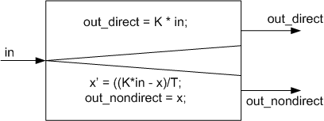

In general, an output has a direct pass-through behavior if it directly depends on one of the inputs. For example, an amplifier block (p behavior) is described by the function:

out = K * in

The output directly depends on the input. Consequently, the inputs have to be read first before the output can be calculated. The function must be written using the directOutputs method.

If the output does not depend on one of the inputs, for example, if the output depends on a continuous state or a parameter condition, it does not have direct pass-through behavior. Nondirect outputs are calculated from the values of the previous step. A CT block having a direct output terminates an existing loop. An example is the so-called PT1 behavior:

x’ = ((K*in - x)/T);

out = x;

The differential equation is solved using an integration method that requires the last output value and the input value in to calculate the current output value x. The assignment out=x has to be written using the nondirectOutputs method (the differential equation is discussed in the derivatives method).

Two simple examples illustrate a correct and an incorrect coupling of two CT basic blocks with direct and nondirect output within a CT structure block. It is essential to understand that a direct output requires the input data of the current time step. A nondirect output can be calculated and sent without the input information of the current time step. Therefore, the direct outputs are calculated after the nondirect outputs.

The figure below shows a combination of two CT blocks with direct and nondirect pass-through behavior that does not cause an algebraic loop.

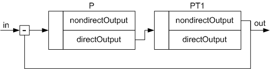

The P block requires a valid input value for its calculation. Consequently, the nondirectOutputs method in the PT1 block has to be calculated first and then the directOutputs method in the P block.

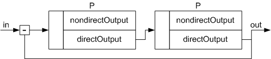

In the above figure, two CT blocks with direct outputs are connected in series. This results in an algebraic loop. Each block requires the current output value of the other block. ASCET reports this error.

Direct pass-through circuits must be avoided. However, it is not possible to resolve algebraic loops automatically and implicitly because an implicit resolution of algebraic loops requires an iterative method, which is not acceptable under real-time conditions.

An advantage over the automatic resolution of an algebraic loop is that the user, knowing his model, can insert a block without a direct output at the most appropriate position so the subsequent blocks can be computed in the next iteration step.

In principle, there are two alternatives to avoid algebraic loops:

1. Inserting a block without a direct output. As this corresponds to a storage element, the integration step size may have to be decreased to avoid that the dynamics of the model is impaired.
1. Modifying the model structure to eliminate the algebraic loop. Reformulating the equations in the CT basic blocks, modifying the structure.

See also

[Continuous Time Structure Blocks](markdown/CTB_Continuous_Time_Structure_Blocks.md)

[Reuse of Structure Blocks](markdown/ctb_reuse_of_structure_blocks.md)

[Elements of a Continuous Time Structure Block](markdown/CTB_Elements_of_a_Continuous_Time_Structure_Block.md)

[Operators](markdown/CTB_Operators.md)

[Algebraic Loops](markdown/CTB_Algebraic_Loops.md)

[Summary - Direct and Nondirect Output](markdown/CTB_Summary_Direct_and_Nondirect_Output.md)

[Difference Between Graphical Hierarchies and CT Structure Blocks](markdown/CTB_Difference_GraphicalHierarchies_CTStructureBlocks.md)

[Computing Sequence of Methods Within a Structure](markdown/CTB_Computing_Sequence_of_Methods_Within_a_Structure.md)

---

## Difference Between Graphical Hierarchies and CT Structure Blocks

_Source: `markdown/CTB_Difference_GraphicalHierarchies_CTStructureBlocks.md`_

# Difference Between Graphical Hierarchies and CT Structure Blocks

Externally, CT structure blocks behave like CT basic blocks regarding their computing sequence. The computing sequence is determined in the CT structure block. The structure behaves like a block with direct or nondirect output depending on whether the outputs of the structure block depend on the inputs directly or nondirectly

Hierarchies, however, have a purely symbolic nature used to layout a CT structure block more clearly. They do not affect the simulation. The left part of the figure shows an example in which a CT structure block has a direct output to a CT basic block which in turn has a direct output to the same CT structure block. This causes an algebraic loop as the two blocks within the structure block are computed directly succeeding each other (virtually simultaneously). However, the second CT block within the structure block requires a current output of the external CT block.

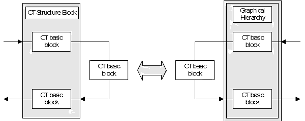

The algebraic loop can be avoided by resolving the structure block and replacing it with a graphical hierarchy right-hand side of the figure that combines model parts obviously related with each other. A drawback of hierarchies is that they cannot be stored separately but only together with the structure block in which they are contained.

See also

[Continuous Time Structure Blocks](markdown/CTB_Continuous_Time_Structure_Blocks.md)

[Reuse of Structure Blocks](markdown/ctb_reuse_of_structure_blocks.md)

[Elements of a Continuous Time Structure Block](markdown/CTB_Elements_of_a_Continuous_Time_Structure_Block.md)

[Operators](markdown/CTB_Operators.md)

[Algebraic Loops](markdown/CTB_Algebraic_Loops.md)

[Summary - Direct and Nondirect Output](markdown/CTB_Summary_Direct_and_Nondirect_Output.md)

[Behavior of Direct and Nondirect Output](markdown/CTB_Behavior_of_Direct_and_Nondirect_Output.md)

[Computing Sequence of Methods Within a Structure](markdown/CTB_Computing_Sequence_of_Methods_Within_a_Structure.md)

---

## Computing Sequence of Methods Within a Structure

_Source: `markdown/CTB_Computing_Sequence_of_Methods_Within_a_Structure.md`_

# Computing Sequence of Methods Within a Structure

The computing sequence in a CT structure block is essentially determined by the computing sequence of the methods within a CT basic block (see [Overview - Computing Sequence](markdown/ctb_overview_computing_sequence.md)). It depends mainly on the integration method and the selected time or communication intervals.

In principle, the methods in the structure block are computed in the same sequence as in the basic block (init, nondirectOutputs, directOutputs,...), with the same method being executed first in all basic blocks of the structure block before switching to the next method. This means that the init method is first executed in all blocks before starting the nondirectOutputs method in any basic block.

As long as the directOutputs method is not used in any CT basic block, the sequence is exclusively determined by the CT basic blocks. The order in which the same method is executed in the individual CT basic blocks is not important. This means that first all init methods are computed, then all nondirectOutputsmethods, etc., each method in any arbitrary order of blocks.

If the directOutputs method is used in more than one block, the computing sequence becomes important, because some of the inputs of the directOutputsmethods require current values from other outputs. If the input is connected to an output of the nondirectOutputs method, there is always a current value, because this method is first computed in all CT blocks before starting the directOutputs method. However, if the input depends on the output of another directOutputs method, this method must be computed first.

See also

[Example: Computing Sequence](markdown/CTB_Example__Computing_Sequence.md)

[Example: Execution Not Possible](markdown/CTB_Example__Execution_Not_Possible.md)

[Continuous Time Structure Blocks](markdown/CTB_Continuous_Time_Structure_Blocks.md)

[Reuse of Structure Blocks](markdown/ctb_reuse_of_structure_blocks.md)

[Elements of a Continuous Time Structure Block](markdown/CTB_Elements_of_a_Continuous_Time_Structure_Block.md)

[Operators](markdown/CTB_Operators.md)

[Algebraic Loops](markdown/CTB_Algebraic_Loops.md)

[Summary - Direct and Nondirect Output](markdown/CTB_Summary_Direct_and_Nondirect_Output.md)

[Behavior of Direct and Nondirect Output](markdown/CTB_Behavior_of_Direct_and_Nondirect_Output.md)

[Difference Between Graphical Hierarchies and CT Structure Blocks](markdown/CTB_Difference_GraphicalHierarchies_CTStructureBlocks.md)

[Overview - Computing Sequence](markdown/ctb_overview_computing_sequence.md)

---

## Example: Computing Sequence

_Source: `markdown/CTB_Example__Computing_Sequence.md`_

# Example: Computing Sequence

The figure below shows the computing sequence in a small CT structure block with coupled CT basic blocks. readInputs is not a method in its own right but belongs to directOutputs; it is shown to emphasize that current values have to be read first in order to compute the directOutputs method. The computing sequence is determined by the automatic sequencing algorithm. The numbers indicate the order of processing. Identical numbers mean that the execution sequence is arbitrary.

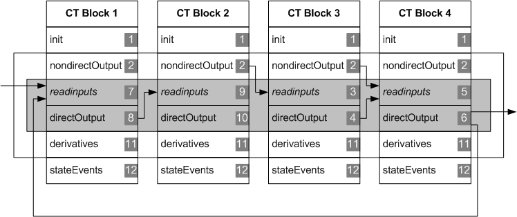

The computing sequence is especially important for CT blocks with direct outputs (directOutputs method), because current values from the same iteration cycle have to be applied to the corresponding inputs (shaded sections in the above figure).

The CT blocks are processed from top to bottom. Furthermore, each method is executed sequentially one after the other. init is executed only once at the start of the simulation.

Within the integration loop (nondirectOutputs up to derivatives methods), all nondirectOutputs are always computed. Their sequence is not fixed. As the directOutputs method directly depends on the corresponding input, ASCET searches all directOutputs methods until the corresponding readInputs no longer depends on another directOutputs method (shaded section in the above figure). In the above figure, this is the case in CT basic block 3. This results in the following sequence for reading the inputs and executing the directOutputs method:

1. readInputs (CT block 3), directOutputs (CT block 3)
1. readInputs (CT block 4), directOutputs (CT block 4)
1. readInputs (CT block 1), directOutputs (CT block 1)
1. readInputs (CT block 2), directOutputs (CT block 2)

Only then the derivatives methods 1-4 are executed in arbitrary order. In case of a single-stage integration method, now follow the stateEvents methods for the CT blocks 1-4 in arbitrary order. Then again back to nondirectOutputs.

In case of n-stage integration methods, nondirectOutputs - directOutputs (as described above, in the correct order) and derivatives of CT blocks 1-4 are executed n times, before stateEvents is executed (see also [Execution Sequence of All Methods](markdown/CTB_Execution_Sequence_of_All_Methods.md)).

This means that the communication for combined CT basic blocks and/or CT structure blocks within one structure also occurs during the intermediate steps of the integration method. Each time, the nondirectOutputs up to derivatives methods are executed (single line frame).

The update method is executed after stateEvents only at the granularity of the communication interval dT and terminate only at the end of the simulation. For each, the computing sequence within the structure block is arbitrary.

There are therefore typically several equivalent computing sequences to solve a structure block. The sequencing algorithm of ASCET automatically selects one of the possible sequences.

---

## Example: Execution Not Possible

_Source: `markdown/CTB_Example__Execution_Not_Possible.md`_

# Example: Execution Not Possible

If there is an algebraic loop, the computing sequence cannot be determined automatically. This situation is shown in the figure below. Each input of a directOutputs method depends on another directOutputs, closing the loop from CT block 4 to CT block 1. This results in an appropriate error message.

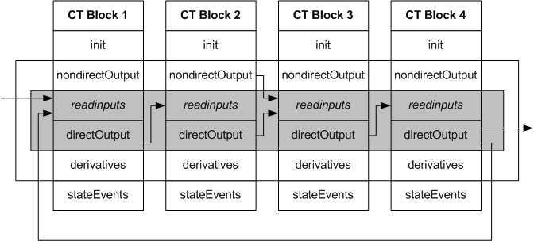

---

## Overview - Projects and Hybrid Projects

_Source: `markdown/ctb_overview_projects_and_hybrid_projects.md`_

# Overview - Projects and Hybrid Projects

Projects are used for:

- Online simulation (hardware-in-the-loop) of CT blocks and Standard ASCET blocks
- Continuous time modeling of several CT structures with different integration algorithms and step sizes in a project
- Simulation of CT blocks in real-time

A project can consist of standard or/and continuous time modules or structures. A hybrid project is a project that contains both standard ASCET blocks and continuous time components. For example, in the hardware-in-the-loop simulation, the sending, receiving, and processing of signals from the real process (that is simulated by continuous time structures) are usually processed by standard modules.

When modeling and simulating systems with very fast and very slow components, e.g., hydraulic and mechanical components, the computing time can be reduced by using different integration methods or different integration steps. For this purpose, the respective model parts have to be located in a CT basic block or CT structure block, as appropriate.

The various CT model parts are loaded into a project and connected with each other in the Block Diagram Editor. In a project, each CT model part (CT basic block or CT structure block) can be computed as an independent process using a separate integration method and integration step size. It should be noted, however, that the individual blocks are linked to different tasks that communicate with each other only in fixed, selectable time intervals dT.

There is no exchange of values for intermediate steps of the integration method as is the case for coupling CT blocks with CT structures. There is also no automatic semantic verification as for CT structures that determines the computing sequence for the integration. The above applies only to CT blocks/structure at the project level. CT blocks and CT structures within the CT structures communicate at the granularity of the integration step size, of course, also within projects.

To ensure numeric stability, strongly cohesive systems should, therefore, not be coupled at the project level but within CT structures. Systems with weak cohesion can, however, be structured in projects. The advantage for weakly cohesive systems with highly disparate dynamic properties is that the integration method and integration step size can be selected individually to achieve an optimal computing time.

The figure below schematically shows a project composed of one discrete standard block and two different CT structure blocks.

A hybrid project (e.g., for the ECU test automation) combines a controller model (Standard ASCET block) with a control system model (continuous CT structure blocks). The continuous time model part is itself composed of two CT structure blocks with different integration methods and different step sizes. The communication between the CT blocks takes place at 2 msec intervals while the CT blocks communicate with the discrete standard block every 10 msec.

See also

[Combining Continuous Time Blocks With Modules](markdown/CTB_Combining_Continuous_Time_Blocks_With_Modules.md)

---

## Combining Continuous Time Blocks With Modules

_Source: `markdown/CTB_Combining_Continuous_Time_Blocks_With_Modules.md`_

# Combining Continuous Time Blocks With Modules

Discrete modules in a project communicate via messages (global variables in ASCET blocks). There are no explicit connections (connecting lines) between Send and Receive messages; they are assigned to each other by their names.

Continuous time blocks, on the other hand, communicate among themselves and with modules via connections that have been specified graphically. The connections are built using the same method as in block diagrams.

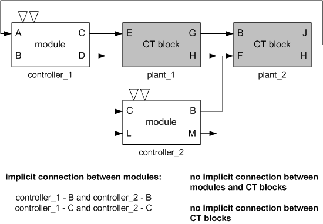

For discrete modules, the user has to explicitly define the tasks and to assign the processes defined in the module editor to the appropriate tasks.

CT blocks do not require an explicit definition of tasks, because these are defined automatically when needed. A simulate task and an event task are generated for each CT block. In addition, a common init task and a common terminate task are generated for all CT blocks in a project. For the example above, the following tasks are generated automatically:

- simulate_CT1 (plant_1)
- simulate_CT2 (plant_2)
- event_CT1 (plant_1)
- event_CT2 (plant_2)
- initialize_CT (plant_1 ... plant_n)
- terminate_CT (plant_1 ... plant_n)

These predefined tasks are static. They are all defined as cooperative tasks. The following sections describe the meaning of these tasks in more detail.

See also

[simulate_CTn Tasks](markdown/CTB_simulate_CTn_Tasks.md)

[event_CTn Tasks](markdown/CTB_event_CTn_Tasks.md)

[initialize_CT Task](markdown/CTB_initialize_CT_Task.md)

[terminate_CT Task](markdown/CTB_terminate_CT_Task.md)

---

## simulate_CTn Tasks

_Source: `markdown/CTB_simulate_CTn_Tasks.md`_

# simulate_CTn Tasks

For the simulate_CTn tasks, one simulation step is computed; the step size is dT. The step size can be specified for each simulate_CTn task individually; this allows for having several integration methods for different CT structure blocks within a project. The integration step size can be set during an experiment interactively. A simulation task normally uses the Timer trigger mode.

See also

[Combining Continuous Time Blocks With Modules](markdown/CTB_Combining_Continuous_Time_Blocks_With_Modules.md)

[event_CTn Tasks](markdown/CTB_event_CTn_Tasks.md)

[initialize_CT Task](markdown/CTB_initialize_CT_Task.md)

[terminate_CT Task](markdown/CTB_terminate_CT_Task.md)

---

## event_CTn Tasks

_Source: `markdown/CTB_event_CTn_Tasks.md`_

# event_CTn Tasks

When calling the event_CTn task, the event methods of the underlying CT blocks are executed. Because event methods are usually called asynchronously, the trigger mode of the event_CTn task should either be Software or Event.

See also

[Combining Continuous Time Blocks With Modules](markdown/CTB_Combining_Continuous_Time_Blocks_With_Modules.md)

[simulate_CTn Tasks](markdown/CTB_simulate_CTn_Tasks.md)

[initialize_CT Task](markdown/CTB_initialize_CT_Task.md)

[terminate_CT Task](markdown/CTB_terminate_CT_Task.md)

---

## initialize_CT Task

_Source: `markdown/CTB_initialize_CT_Task.md`_

# initialize_CT Task

When calling the initialize_CT task, the init methods of the underlying CT blocks are executed. As init methods are usually computed at the beginning of a simulation, the trigger mode of the initialize_CTn task should be Init.

See also

[Combining Continuous Time Blocks With Modules](markdown/CTB_Combining_Continuous_Time_Blocks_With_Modules.md)

[simulate_CTn Tasks](markdown/CTB_simulate_CTn_Tasks.md)

[event_CTn Tasks](markdown/CTB_event_CTn_Tasks.md)

[terminate_CT Task](markdown/CTB_terminate_CT_Task.md)

---

## terminate_CT Task

_Source: `markdown/CTB_terminate_CT_Task.md`_

# terminate_CT Task

When calling the terminate_CT task, the terminate methods of the underlying CT blocks are executed. The terminate task is automatically executed when the experiment finishes.

See also

[Combining Continuous Time Blocks With Modules](markdown/CTB_Combining_Continuous_Time_Blocks_With_Modules.md)

[simulate_CTn Tasks](markdown/CTB_simulate_CTn_Tasks.md)

[event_CTn Tasks](markdown/CTB_event_CTn_Tasks.md)

[initialize_CT Task](markdown/CTB_initialize_CT_Task.md)

---

## Continuous Time Blocks as Block Diagrams

_Source: `markdown/CTB_CT_Blocks_as_Block_Diagrams.md`_

# Continuous Time Blocks as Block Diagrams

A CT block specified as a block diagram consists mainly of basic blocks which are then connected graphically to form a larger assembly. Specifying the diagram is very similar to specifying classes, the most important differences are listed below:

1. There are only four operators available: addition, subtraction, multiplication and division. If more complex non-linear operators are required, they can be specified as separate blocks.
1. The basic elements that can be defined in a CT block are different, with the exception of characteristic lines and fields. These work in the same way as in classes. The basic elements that can be defined in CT blocks are discussed in [Block Interfaces (Structure Blocks)](markdown/CTB_Summary_Structure_Block_Interfaces.md).
1. There is only one diagram in a CT block, additional diagrams cannot be defined. The diagram can be hierarchical, however.
1. Interfaces need not be defined. A set of methods is predefined when the CT block is created. These cannot be changed and additional methods cannot be defined.
1. Only classes and other CT blocks can be referenced. Classes can only be used to define records, not to specify functionality. When a class is referenced, you are asked whether it is to be used as an input or an output.
1. There are no sequence calls in a CT block. The order for evaluation is determined automatically.

Apart from these considerations, all the block diagram editor features work in the same way as for classes, and all the commands available here have the same effect.

---

## Experimenting with Continuous Time Blocks

_Source: `markdown/CTB_Experimenting_with_CT_Blocks.md`_

# Experimenting with Continuous Time Blocks

It is possible to run offline experiments with individual CT blocks. The blocks can be complex, i.e. they can reference other blocks. It is not possible, however, to conduct hybrid experiments in this way. Hybrid experiments consist of both classes and CT blocks and are used to simulate control loops consisting of a controller and a process model. These loops can be experimented within projects.

Experimenting offline with individual CT blocks works in the same way as experimenting with classes (see [Analyzing Components](BlockDiagramEditorEnglishUS.chm::/AnalyzingComponents.htm)), except that there is no event generator. A solver has to be specified instead.

See also

[Analyzing Components](BlockDiagramEditorEnglishUS.chm::/AnalyzingComponents.htm)

[Experimenting with a CT Block](markdown/CTB_Experiment_with_a_CT_Bock.md)

[Configuring the Integration Method](markdown/CTB_Configuring_the_Solver.md)

---

## Monitoring the Cycle Time

_Source: `markdown/CTB_Monitoring_the_Cycle_Time.md`_

# Monitoring the Cycle Time

In the OS tab of the project editor, ASCET offers the possibility to measure the cycle time of a timer task (see [The Monitoring Option](ProjectEditorEnglishUS.chm::/monitoringoption.htm)).

For CT blocks, you have to keep the following in mind.

- The simulation of projects containing CT blocks allows the setting of two parameters for a selected solver:
- The external communication interval dT ([External Communication Interval dT](markdown/CTB_External_Communication_Interval_dT.md))
- The integration step size h ([Integration Step Size h](markdown/CTB_Integration_Step_Size_h.md)).

The cycle time for the simulation task simulate_CTn sums up all integration steps performed during one dT step. Thus, the higher the ratio dT/h is, the higher is the cycle time. A correction factor cannot be specified, however, because other factors as the size and type of the model contribute as well.

A CT block specified with Simulink, on the other hand, does not distinguish between dT and h, both have the same value. If such a CT block is imported into ASCET, you have no possibility to change the solver or h within the experiment. To obtain comparable cycle times for CT blocks specified with ASCET or Simulink, the integration step size of the Simulink model has to be chosen for both dT and h in the ASCET block.

See also

[The Monitoring Option](ProjectEditorEnglishUS.chm::/monitoringoption.htm)

[External Communication Interval dT](markdown/CTB_External_Communication_Interval_dT.md)

[Integration Step Size h](markdown/CTB_Integration_Step_Size_h.md)

---

## Creating a Continuous Time Block in C Code

_Source: `markdown/CTB_create_ct_block_in_c.md`_

# Creating a Continuous Time Block in C Code

To create a continuous time block in C code, proceed as follows:

1. In the Component Manager, select the folder for the new block.
1. In the Insert menu, point to Continuous Time Block and select C Code.
1. Type in a name for the component and press Enter.
1. Do one of the following:
1. Select direct or nondirect from the right combo box in the button bar.
1. Type in the code or import external modules as required.

Using the C code editor is described in detail in [C Code Editor](CCodeEditorEnglishUS.chm::/CC_Overview.htm).

CT blocks specified in C code support either direct or nondirect outputs, but not both. You can set this in the Block Behavior combo box. If you selected direct, only the directOutputs[] method is available, with nondirect only the nondirectOutputs[] method is available. See [Algebraic Loops](markdown/CTB_Algebraic_Loops.md) for details on direct and nondirect outputs.

See also

[C Code Editor - Overview](CCodeEditorEnglishUS.chm::/CC_Overview.htm)

[Algebraic Loops](markdown/CTB_Algebraic_Loops.md)

---

## Creating a Continuous Time Block in ESDL

_Source: `markdown/CTB_create_ctb_in_esdl.md`_

# Creating a Continuous Time Block in ESDL

To create a continuous time block in ESDL, proceed as follows:

1. In the Component Manager, select the folder for the new block.
1. In the Insert menu, point to Continuous Time Block and select ESDL.
1. Type in a name for the component and press Enter.
1. Do one of the following:
1. Type in the code for the block.

Using the ESDL editor is described in detail in [ESDL Editor - Overview](ESDLEditorEnglishUS.chm::/ESDL_Overview.htm).

See also

[ESDL Editor - Overview](ESDLEditorEnglishUS.chm::/ESDL_Overview.htm)

---

## Specifying a Continuous Time Block as Block Diagram

_Source: `markdown/CTB_specify_ct.md`_

# Specifying a Continuous Time Block as Block Diagram

To specify a continuous time block, proceed as follows:

1. In the Component Manager, select a folder for the new block.
1. In the Insert menu, point to Continuous Time Block and select Blockdiagram.
1. Type in a name for the component and press Enter.
1. Do one of the following:

- In the Edit menu, select Open Component.
- Press Enter.
- In the 1 Database / 1 Workspace list, double-click on the component name.

The block diagram editor for CT blocks window opens.

Using the block diagram editor is described in detail in [Overview - Block Diagram Editor](BlockDiagramEditorEnglishUS.chm::/BDE_Overview.htm).

See also

[Overview - Block Diagram Editor](BlockDiagramEditorEnglishUS.chm::/BDE_Overview.htm)

---

## Including a Component via the Block Library

_Source: `markdown/ctb_IncludeComponent_BlockLibrary.md`_

# Including a Component via the Block Library

When you stored frequently used components in a block library, you can include them via the Library palette. Proceed as follows.

1. In the Tree pane, go to the Outline tab.
1. In the Library palette, use the combo box to select the category that contains the desired item.
1. In the item list, select the item you want to add to the component.
1. Drag the item to the Outline tab or to the drawing area.

The item is included in the edited component and, if you dragged it there, in the drawing area.

See also

[Block Libraries](ComponentManagerEnglishUS.chm::/CM_BlockLibraries.htm)

[Library Palette](markdown/ctb_librarypalette.md)

---

## Finding/Replacing C and ESDL Code

_Source: `markdown/CTB_findreplace.md`_

# Finding/Replacing C and ESDL Code

To find and replace code in a CT block specified in C or ESDL, proceed as follows:

1. Select the Specification view.
1. Open the Edit menu and select Find/Replace.
1. In the Find field, enter a search string.
1. In the Replace With field, enter a replace string.
1. Use the options below the Replace With field to customize the search.
1. Click the Find Next button to find the next occurrence of the search string.
1. To replace a single occurrence of the search string, do one of the following.
1. Click Replace All to replace all occurrences.
1. To extend the search to all methods/processes of the component, proceed as follows.
1. Click Close to close the Find/Replace window.

See also

[Find/Replace Dialog Window](IntroductionEnglishUS.chm::/INT_FindReplace_Window.htm)

---

## Searching/Deleting Unused Elements

_Source: `markdown/CTB_SearchDeleteUnusedElements.md`_

# Searching/Deleting Unused Elements

To delete elements (scalar, composite, complex) not used in the CT block, proceed as follows:

1. In the Extras menu, select Show Unused Elements.
1. In the Elements tab of the Search Results view, select one, several, or all (Ctrl + a) elements.
1. Do one of the following:

- Open the context menu and select Delete.
- Press Delete.

The selected unused elements are deleted.

See also

[Search Results View](markdown/CTB_SearchResultsView.md)

/* Heikki Komulainen, Comet Computer GmbH 2004 */ cc_plus_pic = '&nbsp;'; cc_minus_pic = '&nbsp;'; cc_stat_pic = '&nbsp;'; gpstyle = ''; var iframes_created = 0; if (document.body && document.body.insertAdjacentHTML && document.getElementsByTagName && document.getElementById) { collect_popups(); set_poplinks_pictures(); if (iframes_created) { document.write(gpstyle); document.write('
<nobr><a id="einauslink" style="position:absolute;top:expression(document.body.scrollTop + this.offsetHeight - this.offsetHeight);left:expression(document.body.offsetWidth - (this.offsetWidth + 28));background:#ffffe0;padding:5px" href="javascript:show_all_poptext()">Show all hidden text</a></nobr>
'); } } function collect_popups() { bsscpopups = new Array(); for (x = 0; x < document.links.length; x++) { if (document.links[x].href.indexOf("BSSCPopup")>-1) { seekmatch = /BSSCPopup.'[^'](markdown/+)'/; poplink = seekmatch.exec(document.links[x].href); poplink = "" + poplink; poplink = poplink.substring(poplink.indexOf("'")+1, poplink.lastIndexOf("'")); ifid = "CCGENIFRAMEID" + x; new_iframe = '<iframe id="' + ifid + '"src="' + poplink + '" onload="get_text(\'' + ifid + '\')" width="0" height="0" frameborder=0></iframe>'; document.links[x].parentNode.insertAdjacentHTML("afterEnd", new_iframe); gpid = "CCID_" + ifid; document.links[x].href = "javascript:expand_poptext('" + gpid + "')"; cc_plus = '' + cc_plus_pic + ''; document.links[x].insertAdjacentHTML("afterBegin", cc_plus); iframes_created = 1; } } }// end function function get_text(ifr_id) { frpars = document.frames[ifr_id].document.getElementsByTagName("body"); popbody = frpars[0].innerHTML; gpid = "CCID_" + ifr_id; if (!document.getElementById(gpid)) { //avoiding doubles document.getElementById(ifr_id).insertAdjacentHTML("afterEnd", '
'+popbody+'
'); } }//end function function expand_poptext(x_frame_id) { if (!document.getElementById(x_frame_id)) return; if (document.getElementById(x_frame_id).className == "CCGENPOPTEXTH") { document.getElementById(x_frame_id).className = "CCGENPOPTEXTV"; document.getElementById(x_frame_id).style.visibility = "visible"; if (document.getElementById("CCPMB_" + x_frame_id )) { document.getElementById("CCPMB_" + x_frame_id ).innerHTML = cc_minus_pic; } } else { document.getElementById(x_frame_id).className = "CCGENPOPTEXTH"; document.getElementById(x_frame_id).style.visibility = "hidden"; if (document.getElementById("CCPMB_" + x_frame_id )) { document.getElementById("CCPMB_" + x_frame_id ).innerHTML = cc_plus_pic; } } }// end function function show_all_poptext() { var pulldowntxt = document.getElementsByTagName("div"); for (b = 0; b < pulldowntxt.length; b++) { if (pulldowntxt[b].className == "droptext") { pulldowntxt[b].style.display=""; } } var gptxt = document.getElementsByTagName("div"); for (z = 0; z < gptxt.length; z++) { if (gptxt[z].className == "CCGENPOPTEXTH") { gptxt[z].className = "CCGENPOPTEXTV"; gptxt[z].style.visibility = "visible"; if (document.getElementById("CCPMB_" + gptxt[z].id )) { document.getElementById("CCPMB_" + gptxt[z].id ).innerHTML = cc_minus_pic; } } } var dxpoplinks = document.getElementsByTagName("a"); if (dxpoplinks) { for (pxl = 0; pxl < dxpoplinks.length; pxl++) { if (dxpoplinks[pxl].href.indexOf("kadovTextPopup")>-1) { if (document.getElementById("CCPMB_" + dxpoplinks[pxl].id)) { document.getElementById("CCPMB_" + dxpoplinks[pxl].id).innerHTML = cc_stat_pic; dxpoplinks[pxl].symbol = "minus"; } } } } document.getElementById('einauslink').innerText = 'Hide all hideable text'; document.getElementById('einauslink').href = "javascript:self.location.reload()"; self.focus(); }// end function function eat_click() { return false; }// end function function set_poplinks_pictures() { var dpoplinks = document.getElementsByTagName("a"); if (dpoplinks) { for (pl = 0; pl < dpoplinks.length; pl++) { if (dpoplinks[pl].href.indexOf("kadovTextPopup")>-1) { cc_plus = '' + cc_stat_pic + ''; //dpoplinks[pl].onmouseup = plusminuspoplink; dpoplinks[pl].insertAdjacentHTML("afterBegin", cc_plus); dpoplinks[pl].symbol = "plus"; } } } }// end function function plusminuspoplink() { if (document.getElementById("CCPMB_" + this.id)) { if (this.symbol == "plus") { document.getElementById("CCPMB_" + this.id).innerHTML = cc_minus_pic; this.symbol = "minus"; } else { document.getElementById("CCPMB_" + this.id).innerHTML = cc_plus_pic; this.symbol = "plus"; } } return true; }

---

## Filtering the Tree Pane

_Source: `markdown/ctb_filtering_the_component_pane.md`_

# Filtering the Tree Pane

The Outline tab and - in the block diagram editor for CT blocks - the Navigation tab can be filtered. To do so, proceed as follows.

1. In the tab you want to filter, click on the  button.
1. In the Elements subnode or the Navigation Tree node, activate the options of the items you want to display in the tab.
1. If you are filtering the Outline tab, go to the Methods subnode to set filter options for processes and methods.
1. Click OK to close the Options window.

Only items with activated options are shown in the tab. The button is marked with a green symbol to indicate an active filter: 

The filter settings made here affect all component editors.

See also

[Searching the Tree Pane](IntroductionEnglishUS.chm::/INT_SearchTreePane.htm)

---

## Experimenting with CT Blocks

_Source: `markdown/CTB_Experiment_with_a_CT_Bock.md`_

# Experimenting with a CT Block

To experiment with a continuous time block, proceed as follows:

1. Open the CT block you want to experiment with.
1. In the CT block editor, perform one of the following actions to open the experiment environment for the CT block.
1. If you are working with a database larger than 3 GB, [another step is inserted](javascript:BSSCPopup('codegen_dbtoolarge.htm');)<!-- kadovFilePopupInit('a1'); //-->.
1. [Configure the integration method.](markdown/CTB_Configuring_the_Solver.md)
1. Set up the data generator, measurement and calibration windows and run the experiment.

Using the experiment environment is described in detail in [Overview - Experimentation](ExperimentationEnglishUS.chm::/EE_Overview.htm).

See also

[Overview - Experimentation](ExperimentationEnglishUS.chm::/EE_Overview.htm)

[Configuring the Integration Method](markdown/CTB_Configuring_the_Solver.md)

[Solver configuration Window](markdown/CTB_Solvers.md)

[Project Editor - Banners in the Generated Code](ProjectEditorEnglishUS.chm::/PE_Banners_in_GeneratedCode.htm)

/* Heikki Komulainen, Comet Computer GmbH 2004 */ cc_plus_pic = '&nbsp;'; cc_minus_pic = '&nbsp;'; cc_stat_pic = '&nbsp;'; gpstyle = ''; var iframes_created = 0; if (document.body && document.body.insertAdjacentHTML && document.getElementsByTagName && document.getElementById) { collect_popups(); set_poplinks_pictures(); if (iframes_created) { document.write(gpstyle); document.write('
<nobr><a id="einauslink" style="position:absolute;top:expression(document.body.scrollTop + this.offsetHeight - this.offsetHeight);left:expression(document.body.offsetWidth - (this.offsetWidth + 28));background:#ffffe0;padding:5px" href="javascript:show_all_poptext()">Show all hidden text</a></nobr>
'); } } function collect_popups() { bsscpopups = new Array(); for (x = 0; x < document.links.length; x++) { if (document.links[x].href.indexOf("BSSCPopup")>-1) { seekmatch = /BSSCPopup.'[^'](markdown/+)'/; poplink = seekmatch.exec(document.links[x].href); poplink = "" + poplink; poplink = poplink.substring(poplink.indexOf("'")+1, poplink.lastIndexOf("'")); ifid = "CCGENIFRAMEID" + x; new_iframe = '<iframe id="' + ifid + '"src="' + poplink + '" onload="get_text(\'' + ifid + '\')" width="0" height="0" frameborder=0></iframe>'; document.links[x].parentNode.insertAdjacentHTML("afterEnd", new_iframe); gpid = "CCID_" + ifid; document.links[x].href = "javascript:expand_poptext('" + gpid + "')"; cc_plus = '' + cc_plus_pic + ''; document.links[x].insertAdjacentHTML("afterBegin", cc_plus); iframes_created = 1; } } }// end function function get_text(ifr_id) { frpars = document.frames[ifr_id].document.getElementsByTagName("body"); popbody = frpars[0].innerHTML; gpid = "CCID_" + ifr_id; if (!document.getElementById(gpid)) { //avoiding doubles document.getElementById(ifr_id).insertAdjacentHTML("afterEnd", '
'+popbody+'
'); } }//end function function expand_poptext(x_frame_id) { if (!document.getElementById(x_frame_id)) return; if (document.getElementById(x_frame_id).className == "CCGENPOPTEXTH") { document.getElementById(x_frame_id).className = "CCGENPOPTEXTV"; document.getElementById(x_frame_id).style.visibility = "visible"; if (document.getElementById("CCPMB_" + x_frame_id )) { document.getElementById("CCPMB_" + x_frame_id ).innerHTML = cc_minus_pic; } } else { document.getElementById(x_frame_id).className = "CCGENPOPTEXTH"; document.getElementById(x_frame_id).style.visibility = "hidden"; if (document.getElementById("CCPMB_" + x_frame_id )) { document.getElementById("CCPMB_" + x_frame_id ).innerHTML = cc_plus_pic; } } }// end function function show_all_poptext() { var pulldowntxt = document.getElementsByTagName("div"); for (b = 0; b < pulldowntxt.length; b++) { if (pulldowntxt[b].className == "droptext") { pulldowntxt[b].style.display=""; } } var gptxt = document.getElementsByTagName("div"); for (z = 0; z < gptxt.length; z++) { if (gptxt[z].className == "CCGENPOPTEXTH") { gptxt[z].className = "CCGENPOPTEXTV"; gptxt[z].style.visibility = "visible"; if (document.getElementById("CCPMB_" + gptxt[z].id )) { document.getElementById("CCPMB_" + gptxt[z].id ).innerHTML = cc_minus_pic; } } } var dxpoplinks = document.getElementsByTagName("a"); if (dxpoplinks) { for (pxl = 0; pxl < dxpoplinks.length; pxl++) { if (dxpoplinks[pxl].href.indexOf("kadovTextPopup")>-1) { if (document.getElementById("CCPMB_" + dxpoplinks[pxl].id)) { document.getElementById("CCPMB_" + dxpoplinks[pxl].id).innerHTML = cc_stat_pic; dxpoplinks[pxl].symbol = "minus"; } } } } document.getElementById('einauslink').innerText = 'Hide all hideable text'; document.getElementById('einauslink').href = "javascript:self.location.reload()"; self.focus(); }// end function function eat_click() { return false; }// end function function set_poplinks_pictures() { var dpoplinks = document.getElementsByTagName("a"); if (dpoplinks) { for (pl = 0; pl < dpoplinks.length; pl++) { if (dpoplinks[pl].href.indexOf("kadovTextPopup")>-1) { cc_plus = '' + cc_stat_pic + ''; //dpoplinks[pl].onmouseup = plusminuspoplink; dpoplinks[pl].insertAdjacentHTML("afterBegin", cc_plus); dpoplinks[pl].symbol = "plus"; } } } }// end function function plusminuspoplink() { if (document.getElementById("CCPMB_" + this.id)) { if (this.symbol == "plus") { document.getElementById("CCPMB_" + this.id).innerHTML = cc_minus_pic; this.symbol = "minus"; } else { document.getElementById("CCPMB_" + this.id).innerHTML = cc_plus_pic; this.symbol = "plus"; } } return true; }

---

## Configuring the Integration Method

_Source: `markdown/CTB_Configuring_the_Solver.md`_

# Configuring the Integration Method

This instruction is only applicable for experiments with CT blocks.

Except for the solver configuration, the offline experimentation environment works as normal. Using the experimentation environment is described in [Overview - Experimentation](ExperimentationEnglishUS.chm::/EE_Overview.htm).

To configure the integration method, proceed as follows:

1. In the experimentation environment window, do one of the following.
1. Select the integration method from the Integrator combo box.
1. Set the dT parameter and the other parameters.
1. Click OK.

These settings override the default solver settings specified in the [CT-Solver](ComponentManagerEnglishUS.chm::/CM_CTSolverOptions.htm) node of the ASCET options dialog window. They are stored with the experiment.

See also

[Overview - Experimentation](ExperimentationEnglishUS.chm::/EE_Overview.htm)

[Online and Offline Experimentation](ProjectEditorEnglishUS.chm::/PE_online_offline.htm)

[Solver configuration Window](markdown/CTB_Solvers.md)

[CT-Solver Options](ComponentManagerEnglishUS.chm::/CM_CTSolverOptions.htm)

---

## Activating the Cycle Time Monitoring

_Source: `markdown/CTB_Activating_Cycle_Time_Monitoring.md`_

# Activating the Cycle Time Monitoring

To activate the cycle time monitoring, proceed as follows:

1. Open a CT block.
1. In the Extras menu, point to Default Project and select Open to open the default project for the CT block

or

1. Open a hybrid project (see [Overview - Projects and Hybrid Projects](markdown/ctb_overview_projects_and_hybrid_projects.md)).
1. Activate the OS tab of the project editor.

In the Tasks list, you find the tasks automatically defined for the CT block (see [Combining Continuous Time Blocks With Modules](markdown/CTB_Combining_Continuous_Time_Blocks_With_Modules.md)).

1. Select the simulate_CT1 or event_CT1 task.
1. From the Pre-/post hooks combo box, select Monitoring.

The monitoring variables for each task are generated during the next code generation for an experiment. You can show them in the measure windows or write them to the data logger (offline experiment only).

See also

[Overview - Projects and Hybrid Projects](markdown/ctb_overview_projects_and_hybrid_projects.md)

[Combining Continuous Time Blocks With Modules](markdown/CTB_Combining_Continuous_Time_Blocks_With_Modules.md)

---

## CT Block Editors - Window Elements

_Source: `markdown/CTB_Description_of_Window_Elements.md`_

# CT Block Editors - Window Elements

The editors for CT blocks contain the following window elements:

- [Menu Bar](markdown/CTB_Menu_Bars.md)
- Toolbars

This toolbar is available only in the block diagram editor for CT blocks.

- [Tree](markdown/ctb_component_pane.md) pane
- [Elements](markdown/ctb_elementspalette.md) palette
- [Basic Blocks](markdown/ctb_basicblockspalette.md) palette
- [Library](markdown/ctb_librarypalette.md) palette
- Specification view
- [Browse](markdown/CTB_browse_view.md) View
- external editor view
- [Search Results](markdown/CTB_SearchResultsView.md) view
- status bar

---

## Menu Bar

_Source: `markdown/CTB_Menu_Bars.md`_

# Menu Bar

This menu bar contains the following menus:

- [File Menu](markdown/CTB_filemenu.md)
- [Edit Menu](markdown/ctb_editmenu.md)
- [View Menu](markdown/ctb_viewmenu.md)
- [Insert Menu](markdown/ctb_insertmenu.md)
- [Build Menu](markdown/ctb_buildmenu.md)
- [Extras Menu](markdown/ctb_extrasmenu.md)
- [Tools Menu](markdown/ctb_toolsmenu.md)
- [Window Menu](markdown/CTB_windowmenu.md)

This menu is available only in the block diagram editor for CT blocks.

- [Help Menu](markdown/ctb_helpmenu.md)

---

## File Menu

_Source: `markdown/CTB_filemenu.md`_

# File Menu

This menu contains the following functions:

Save (Ctrl + s)

Save current block diagram.

Import

Data

| Column 1 | Column 2 |
| --- | --- |
| For Selected Element | Import data for selected element. |

Export

Component

Exports the edited CT block.

Generated Code

Saves the code generated in the file system.

| Column 1 | Column 2 |
| --- | --- |
| Flat | The edited component. |
| Recursive | The referenced components. |
| Generic | Files out generic code for external make. |

Data

Exports a component data set.

| Column 1 | Column 2 |
| --- | --- |
| For Component | Exports a component dataset. |
| For selected Element | Exports data for the selected elements. |

Graphic

Only available in the block diagram editor for CT blocks.

| Column 1 | Column 2 |
| --- | --- |
| Postscript | Saves the diagram as Postscript file. |
| BMP | Saves the diagram as Bitmap graphic file. |
| GIF | Saves the diagram as .gif (Graphics Interchange Format) file. |
| RTF | Saves the diagram as .rtf (Rich Text Format) file. |

Print

Only available in the block diagram editor for CT blocks.

Prints the content of the Specification view.

Print Setup

Opens a printer setup window.

Close

Exits the CT block editor.

---

## Edit Menu

_Source: `markdown/ctb_editmenu.md`_

# Edit Menu

This menu contains the following functions:

Undo (Ctrl + z)

Reverses the most recent action.

Redo (Ctrl + y)

Reverses an undo command.

Cut (Ctrl + x)

Cuts (deletes) a selected diagram element or code fragment.

Copy (Ctrl + c)

Copies a selected diagram element or code fragment to the ASCET clipboard.

Paste (Ctrl + v)

Pastes a diagram element or code fragment.

Delete (Del)

Deletes a selected element or code fragment.

Rename (F2)

Renames a selected element.

Find/Replace

Only available in the C code and ESDL editors for CT blocks.

Finds and replaces code parts, see [Finding/Replacing ESDL Code](ESDLEditorEnglishUS.chm::/ESDL_FindReplace_code.htm).

Search (Ctrl + Shift + s)

Searches the component as described in [Browsing the Database or Workspace](ComponentManagerEnglishUS.chm::/Browsing.htm). The range is limited to the edited component and its included components.

Select All (Ctrl + a)

Selects all elements in the Specification view.

Replace Component

Replaces a component with another component. The name of the old component remains.

Open Component

Opens the specification editor for a selected included component.

Notes

Opens the notes editor for an included component - you can make notes about the included component here.

Properties (Ctrl + Shift + p)

Edits the properties of the selected element.

Data (Ctrl + Shift + d)

Opens the data editor for the selected element.

Component

| Column 1 | Column 2 |
| --- | --- |
| Data | Opens the data editor for the component. Search of component data is possible. |
| Layout | Opens the layout editor for the component. |
| Notes | Opens the notes editor - you can make notes about the component here. |

---

## View Menu

_Source: `markdown/ctb_viewmenu.md`_

# View Menu

This menu contains the following functions:

Show/Hide

Shows/hides several parts of the editor or the component.

| Column 1 | Column 2 |
| --- | --- |
| Tree Pane | Shows/hides Tree pane. |
| Connected Elements | Browses area for elements connected to a selected diagram element (see Viewing All Elements Connected to an Item ). Only available in the block diagram editor for CT blocks. |
| Toolbars | The General , Elements and - for block diagrams - Basic Blocks submenus show/hide the respective toolbars. |
| Palettes | The Elements , Block Library and - for block diagrams - Basic Blocks submenus show/hide the respective palettes. |

Configure

| Column 1 | Column 2 |
| --- | --- |
| Toolbar General | Select the buttons to be visible in the General toolbar (see Configuring a Toolbar ). |
| Toolbar Elements | Select the buttons to be visible in the Elements toolbar. |
| Toolbar Basic Blocks | Select the buttons to be visible in the Basic Blocks toolbar. Only available in the block diagram editor for CT blocks. |
| Reset Toolbar Configuration | Reset toolbar to default configuration. |

Page Layout

Only available in the block diagram editor for CT blocks.

Page frame Portrait

Displays the diagram in portrait format.

Page frame Landscape

Displays the diagram in landscape format.

Grid

Only available in the block diagram editor for CT blocks.

Modifies the grid in the drawing area.

See also

[Configuring a Toolbar](IntroductionEnglishUS.chm::/INT_Configuring_Toolbar.htm)

[Viewing All Elements Connected to an Item](BlockDiagramEditorEnglishUS.chm::/ViewItem.htm)

---

## Insert Menu

_Source: `markdown/ctb_insertmenu.md`_

# Insert Menu

This menu contains the following functions:

Component

Inserts a component as a complex element.

Load from File

Only available in the C code and ESDL editors for CT blocks.

Loads code from a file into the currently edited method.

Save to File

Only available in the C code and ESDL editors for CT blocks.

Saves the code of the currently edited method to a file.

---

## Build Menu

_Source: `markdown/ctb_buildmenu.md`_

# Build Menu

This menu contains the following functions:

Touch

Forced regeneration during the next code generation.

| Column 1 | Column 2 |
| --- | --- |
| Flat | The edited component. |
| Recursive | The referenced components. |

Clean Code Generation Directory

Deletes all files in the code generation directory.

Analyze Diagram

Analyzes the current diagram.

View Generated Code (F8)

Generates the code for the component and displays it in a text editor. The text editor can be selected in the ASCET option window, ASCII Editor node (see [Setting ASCET Options](ComponentManagerEnglishUS.chm::/SettingASCET.htm)).

Generate Code (Ctrl + F7)

Generates the code for a component.

Compile

Compiles the generated code. Not available in the context of a project with the EHOOKS target.

Experiment

Starts an experiment. Not available in the context of a project with the EHOOKS target.

See also

[Setting ASCET Options](ComponentManagerEnglishUS.chm::/SettingASCET.htm)

[ASCII Editor Options](ComponentManagerEnglishUS.chm::/CM_ASCII_Editor_Options.htm)

---

## Extras Menu

_Source: `markdown/ctb_extrasmenu.md`_

# Extras Menu

This menu contains the following functions:

Browse to Parent Component

Opens an editor for the including component. (The option is only available if an included component is being edited.)

Browse to Parent Hierarchy

Only available in the block diagram editor for CT blocks.

Displays the including graphical hierarchy (see [Graphical Hierarchies](BlockDiagramEditorEnglishUS.chm::/GraphicalHierarchies.htm)).

Show Path

Shows the path of an element or included component.

Show Occurrences

Only available in the block diagram editor for CT blocks.

Shows all occurrences of the item.

Copy Path to Clipboard

Copies the path of an element or included component to the clipboard.

| Column 1 | Column 2 |
| --- | --- |
| Model Path | Model Path. |
| Model asd:// Link | Path in ASCET protocol format that allows operating/referencing an ASCET component in a model as hyperlink. |
| Database Path | Database/workspace path. |
| Database asd:// Link | Path in ASCET protocol format that allows operating/referencing an ASCET component in the database/workspace as hyperlink. |

Create ASCET Link

Creates an [ASCET link](IntroductionEnglishUS.chm::/INT_ASCETLinks.htm) for

- an element, diagram or method selected in the Outline tab,
- a code fragment or item selected in the Specification view.
- a graphical hierarchy selected in the Navigation tab of the block diagram editor for CT blocks.

The link opens the component in the respective CT block editor and (except for the self element, i.e. the root of the element tree) highlights the element in the Outline or Navigation tab or in the Specification view.

Default Project

Allows editing the default project used for experimenting with components.

| Column 1 | Column 2 |
| --- | --- |
| Open | Opens an editor for the default project. |
| Resolve Globals | Automatically creates a global element for each imported element in the component for which there is no exported element. |
| Delete Unused Globals | Deletes unused global elements. |

Check Dependency

Checks whether the allocation of formal parameters to the model parameters is correct.

Show Unused Elements

Opens the Search Results view and lists all elements from the Tree pane that do not appear in the code or in the diagram.

See also

[Graphical Hierarchies](BlockDiagramEditorEnglishUS.chm::/GraphicalHierarchies.htm)

[ESDL Editor - Searching/Deleting Unused Elements](ESDLEditorEnglishUS.chm::/ESDL_SearchDeleteUnusedElements.htm)

[C Code Editor - Searching/Deleting Unused Elements](CCodeEditorEnglishUS.chm::/CC_SearchDeleteUnusedElements.htm)

[Block Diagram Editor - Renaming or Deleting an Element](BlockDiagramEditorEnglishUS.chm::/BDE_rename_delete.htm)

---

## Tools Menu

_Source: `markdown/ctb_toolsmenu.md`_

# Tools Menu

This menu contains the following functions:

Code Variants

Only available in the C code editor for CT blocks.

| Column 1 | Column 2 |
| --- | --- |
| Copy C-Code to | The code is copied (without any changes) to the selected Target/Arithmetic/Implementation combination. |
| Copy C-Code from | Copies a Target/Arithmetic/Implementation combination. |
| Delete | Copies a Target/Arithmetic/Implementation combination. |

Options

Opens the ASCET options dialog window.

See also

[User Interface of the ASCET Options Window](ComponentManagerEnglishUS.chm::/cm_user_interface_of_the_ascet_options_window.htm)

[Setting ASCET Options](ComponentManagerEnglishUS.chm::/SettingASCET.htm)

---

## Window Menu

_Source: `markdown/CTB_windowmenu.md`_

# Window Menu

This menu is only available in the block diagram editor for CT blocks.

This menu contains the following functions:

Load Diagram

Loads a diagram.

Views

Opens the Views dialog window. The views in which the selected diagram item(s) can currently be seen are selected and can be edited.

Update (F5)

Redraws the diagram.

---

## Help Menu

_Source: `markdown/ctb_helpmenu.md`_

# Help Menu

This menu contains the following functions:

Contents (F1)

Shows the help contents.

Index

Shows the help index.

---

## Toolbars

_Source: `markdown/ctb_toolbars.md`_

# Toolbars in the CT Block Editors

The toolbar is grouped by following functional blocks:

- [General](markdown/ctb_toolbargeneral.md)
- [Elements](markdown/ctb_toolbarelements.md)
- [Basic Blocks](markdown/ctb_toolbarbasicblocks.md)

Only available in the block diagram editor for CT blocks.

---

## Toolbar General - CT Block Editors

_Source: `markdown/ctb_toolbargeneral.md`_

# Toolbar General - CT Block Editors

The content of the toolbar General differs for the different CT block editors.

The following buttons are available for all CT block editors:

| Column 1 | Column 2 |
| --- | --- |
|  | Save |
|  | Print |
|  | Cut |
|  | Copy |
|  | Paste |
|  | Delete |
|  | Undo |
|  | Redo |
|  | Edit Component Data |
|  | Edit Default Project |
|  | Tool Options |
|  | Insert Component |
|  | Browse to Parent Component |
|  | Generate Code |
|  | Compile generated Code |
|  | Open Experiment for selected Experiment Target |
|  | Select Experiment Target combo box |

The following buttons are only available in the C code and and ESDL editors for CT blocks:

| Column 1 | Column 2 |
| --- | --- |
|  | Activate External Editor |

The following buttons are only available in the C code editor for CT blocks:

| Column 1 | Column 2 |
| --- | --- |
|  | Combo box to select direct or non-direct block behavior |
|  | Switch to External Source Editor |

The following buttons are only available in the block diagram editor for CT blocks:

| Column 1 | Column 2 |
| --- | --- |
|  | Connect |
|  | Redraw |
|  | Select View combo box |
|  | Select Zoom Factor combo box |
|  | Set Zoom to 100% |
|  | Set Zoom to Page |
|  | Set Zoom to Fit |

Buttons from these lists that are not visible in the respective CT block editor can be added; see [Configuring a Toolbar](IntroductionEnglishUS.chm::/INT_Configuring_Toolbar.htm).

---

## Toolbar Elements - CT Block Editors

_Source: `markdown/ctb_toolbarelements.md`_

# Toolbar Elements - CT Block Editors

The toolbar Elements contains buttons to create CT block elements.

The following buttons are available for all CT block editors:

| Column 1 | Column 2 |
| --- | --- |
|  | combo box to select the dimension - Scalar or Array - for inputs, outputs, step-local variables, and scalar parameters |
|  | Input |
|  | Output |
|  | Constant |
|  | OneD Table (characteristic line) |
|  | TwoD Table (characteristic map) |

The following buttons are only available in the ESDL or C code editor for CT blocks:

| Column 1 | Column 2 |
| --- | --- |
|  | Step Local Variable |
|  | Parameter (dimension is selected in the combo box) |
|  | Dependent Parameter (dimension is selected in the combo box) |
|  | Discrete State |
|  | Continuous State |
|  | Continuous Variable |

The following buttons are only available in the block diagram editor for CT blocks:

| Column 1 | Column 2 |
| --- | --- |
|  | Global Parameter (dimension is selected in the combo box) |

See also

[Elements Palette](markdown/ctb_elementspalette.md)

---

## Toolbar Basic Blocks - CT Block Editors

_Source: `markdown/ctb_toolbarbasicblocks.md`_

# Toolbar Basic Blocks - CT Block Editors

This toolbar is only available in the block diagram editor for CT blocks.

The toolbar Basic Blocks contains following operator groups:

| Column 1 | Column 2 |
| --- | --- |
|  | Addition |
|  | Subtraction |
|  | Multiplication |
|  | Division |
|  | Combo box to select the number of operator inputs |
|  | Hierarchy |
|  | Comment |

See also

[Basic Blocks Palette](markdown/ctb_basicblockspalette.md)

---

## Tree Pane

_Source: `markdown/ctb_component_pane.md`_

# Tree Pane

The Tree pane contains following three tabs and filter functions:

##### Outline

In this tab all elements of the component self:<component name> are listed, provided they are selected in the ASCET options window, Outline Tree node and subnodes. In addition, all block methods are listed in this tab.

For a better handling of these elements you can use several filters and a search function:

| Column 1 | Column 2 |
| --- | --- |
|  | Opens the Options dialog window, reduced to the settings of the filter. |
|  | Changes the criteria of sort. |
|  | Expands the trees in the Outline tab. |
|  | Collapses the trees in the Outline tab. |
|  | Runs a search in the Outline tab for the admitted letters. |

##### Navigation

In the ESDL or C code CT block editor, this tab shows all elements used in one of the methods in a tree view.

In the block diagram editor for CT blocks, this tab shows all graphical elements selected in the Navigation Tree node of the [ASCET options dialog](ComponentManagerEnglishUS.chm::/cm_user_interface_of_the_ascet_options_window.htm) in a tree view.

Elements used in a method or process are displayed as subnodes of the method or process. A double-click on an element opens its method in the Specification view.

If you delete graphic blocks from the Specification view of the block diagram editor for CT blocks, they still occur in the Navigation tree.

| Column 1 | Column 2 |
| --- | --- |
|  | Opens the Options dialog window, reduced to the settings of the Filter. Only available in the block diagram editor for CT blocks. |
|  | Expands the trees in the Navigation tab. |
|  | Collapses the trees in the Navigation tab. |
|  | Runs a search in the Navigation tab for the admitted letters. |

##### Database / Workspace

The folders and items contained in the current database/workspace are displayed here. The database/workspace name is the root of the tree structure. Each database/workspace contains one or more folders, which in turn contain other folders and items.

| Column 1 | Column 2 |
| --- | --- |
|  | Expands the Database/Workspace tree. |
|  | Collapses the Database/Workspace tree. |
|  | Runs a search in the Database/Workspace tab for the admitted letters. |

See also

[Filtering the Tree Pane](markdown/ctb_filtering_the_component_pane.md)

[Searching the Tree Pane](IntroductionEnglishUS.chm::/INT_SearchTreePane.htm)

---

## Context Menu for Components and Elements

_Source: `markdown/ctb_contextmenu_componentelement.md`_

# Context Menu for Components and Elements

In the Outline tab, the context menu of a component or element contains a subset of the following functions:

Copy (Ctrl + c)

Copies a selected included component or element to the ASCET clipboard.

Paste (Ctrl + v)

Pastes a component or element of the ASCET clipboard.

Delete (Del)

Deletes a selected included component or element.

Rename (F2)

Renames a selected included component or element.

Replace Component

Replaces a component with another included component. The name of the old component remains.

Open Component

Opens the specification editor for a selected included component.

Notes

Opens the notes editor for a selected included component - you can make notes about the included component here.

Properties (Ctrl + Shift + p)

Opens the Properties editor for a selected included component or element.

Data (Ctrl + Shift + d)

Opens the data editor for a selected included component or element.

Set Cache Locking

These menu options are used in connection with ASCET-RP. See [ES1135: Cache Locking](INTECRIOConnectivityRPEnglishUS.chm::/IIO_ES1135CacheLocking.htm) for a description.

Show Path

Shows the path of an element or included component.

Show Occurrences

Shows the graphical occurrences of an element or component in a CT block diagram.

Copy Path to Clipboard

Copies the path of an selected included component to the clipboard.

| Column 1 | Column 2 |
| --- | --- |
| Model Path | Model Path. |
| Model asd:// Link | Path in ASCET protocol format that allows operating/referencing an ASCET component in a model as hyperlink. |
| Database Path | Database/workspace path. |
| Database asd:// Link | Path in ASCET protocol format that allows operating/referencing an ASCET component in the database/workspace as hyperlink. |

Create ASCET Link

Creates an ASCET link (see [ASCET Links](IntroductionEnglishUS.chm::/INT_ASCETLinks.htm)) that opens the CT block and (except for the self element, i.e. the root of the element tree) highlights the selected element in the Outline tab.

When you used Create ASCET Link on the element of an included component, the link opens the component (instead of the parent CT block) and highlights the element in the component editor's Outline tab.

Import

Data

| Column 1 | Column 2 |
| --- | --- |
| For Selected Element | Imports data for a selected element. |

Export

Component (Ctrl + e)

Exports the current component or element.

Generated Code

Exports the generated code.

| Column 1 | Column 2 |
| --- | --- |
| Flat | Exports the generated code of the edited components. |
| Recursive | Exports the generated code of the referenced components also. |
| Generic | Exports the generated code for processing at a later point using external tools, e.g. an external Make/Build process. |

Data

Exports a component data set.

| Column 1 | Column 2 |
| --- | --- |
| For Component | Exports a component dataset. |
| For Selected Element | Exports data for the selected elements. |

Graphic

| Column 1 | Column 2 |
| --- | --- |
| Postscript | Saves the diagram as Postscript file. |
| BMP | Saves the diagram as Bitmap graphic file. |
| GIF | Saves the diagram as .gif (Graphics Interchange Format) file. |
| RTF | Saves the diagram as .rtf (Rich Text Format) file. |

Insert Component

Inserts a component in the editor.

---

## Context Menu for Diagrams and Methods

_Source: `markdown/ctb_contextmenu_diagrammethod.md`_

# Context Menu for Diagrams and Methods

In the Outline tab, the context menu of a diagram or method contains the following functions:

Rename (F2) (diagram only)

Renames the diagram.

Create ASCET Link

Creates an ASCET link (see [ASCET Links](IntroductionEnglishUS.chm::/INT_ASCETLinks.htm)) that opens the component and highlights the selected diagram or method.

Default Method (methods only)

Marks the selected method as default method.

---

## Elements Palette

_Source: `markdown/ctb_elementspalette.md`_

| Column 1 | Column 2 |
| --- | --- |
|  | combo box to select the element dimension ( Scalar or Array ) |
|  | Input (dimension is selected in the combo box) |
|  | Output (dimension is selected in the combo box) |
|  | Step Local Variable (dimension is selected in the combo box) |
|  | Parameter (dimension is selected in the combo box) |
|  | Global Parameter (dimension is selected in the combo box) |
|  | Dependent Parameter (dimension is selected in the combo box) |
|  | Discrete State (dimension is selected in the combo box) |
|  | Continuous State (dimension is selected in the combo box) |
|  | Constant (dimension is selected in the combo box) |
|  | Continuous Variable |
|  | One D Table Parameter (characteristic line) |
|  | Two D Table Parameter (characteristic map) |

| Column 1 | Column 2 |
| --- | --- |
|  | combo box to select the element dimension ( Scalar or Array ) |
|  | Input (dimension is selected in the combo box) |
|  | Output (dimension is selected in the combo box) |
|  | Global Parameter (dimension is selected in the combo box) |
|  | Constant (dimension is selected in the combo box) |
|  | One D Table Parameter (characteristic line) |
|  | Two D Table Parameter (characteristic map) |

# Elements Palette (CT Block Editors)

The Elements palette contains buttons to create CT block elements.

- [Elements palette for the C code and ESDL editors for CT blocks](javascript:kadovTextPopup(this))<!-- kadovTextPopupInit('a1'); //-->
- [Elements palette for the block diagram editor for CT blocks](javascript:kadovTextPopup(this))<!-- kadovTextPopupInit('a2'); //-->

See also

[Toolbar Elements](markdown/ctb_toolbarelements.md)

/* Heikki Komulainen, Comet Computer GmbH 2004 */ cc_plus_pic = '&nbsp;'; cc_minus_pic = '&nbsp;'; cc_stat_pic = '&nbsp;'; gpstyle = ''; var iframes_created = 0; if (document.body && document.body.insertAdjacentHTML && document.getElementsByTagName && document.getElementById) { collect_popups(); set_poplinks_pictures(); if (iframes_created) { document.write(gpstyle); document.write('
<nobr><a id="einauslink" style="position:absolute;top:expression(document.body.scrollTop + this.offsetHeight - this.offsetHeight);left:expression(document.body.offsetWidth - (this.offsetWidth + 28));background:white;padding:5px" href="javascript:show_all_poptext()">Alle texte einblenden</a></nobr>
'); } } function collect_popups() { bsscpopups = new Array(); for (x = 0; x < document.links.length; x++) { if (document.links[x].href.indexOf("BSSCPopup")>-1) { seekmatch = /BSSCPopup.'[^'](markdown/+)'/; poplink = seekmatch.exec(document.links[x].href); poplink = "" + poplink; poplink = poplink.substring(poplink.indexOf("'")+1, poplink.lastIndexOf("'")); ifid = "CCGENIFRAMEID" + x; new_iframe = '<iframe id="' + ifid + '"src="' + poplink + '" onload="get_text(\'' + ifid + '\')" width="0" height="0" frameborder=0></iframe>'; document.links[x].parentNode.insertAdjacentHTML("afterEnd", new_iframe); gpid = "CCID_" + ifid; document.links[x].href = "javascript:expand_poptext('" + gpid + "')"; cc_plus = '' + cc_plus_pic + ''; document.links[x].insertAdjacentHTML("afterBegin", cc_plus); iframes_created = 1; } } }// end function function get_text(ifr_id) { frpars = document.frames[ifr_id].document.getElementsByTagName("body"); popbody = frpars[0].innerHTML; gpid = "CCID_" + ifr_id; if (!document.getElementById(gpid)) { //avoiding doubles document.getElementById(ifr_id).insertAdjacentHTML("afterEnd", '
'+popbody+'
'); } }//end function function expand_poptext(x_frame_id) { if (!document.getElementById(x_frame_id)) return; if (document.getElementById(x_frame_id).className == "CCGENPOPTEXTH") { document.getElementById(x_frame_id).className = "CCGENPOPTEXTV"; document.getElementById(x_frame_id).style.visibility = "visible"; if (document.getElementById("CCPMB_" + x_frame_id )) { document.getElementById("CCPMB_" + x_frame_id ).innerHTML = cc_minus_pic; } } else { document.getElementById(x_frame_id).className = "CCGENPOPTEXTH"; document.getElementById(x_frame_id).style.visibility = "hidden"; if (document.getElementById("CCPMB_" + x_frame_id )) { document.getElementById("CCPMB_" + x_frame_id ).innerHTML = cc_plus_pic; } } }// end function function show_all_poptext() { var pulldowntxt = document.getElementsByTagName("div"); for (b = 0; b < pulldowntxt.length; b++) { if (pulldowntxt[b].className == "droptext") { pulldowntxt[b].style.display=""; } } var gptxt = document.getElementsByTagName("div"); for (z = 0; z < gptxt.length; z++) { if (gptxt[z].className == "CCGENPOPTEXTH") { gptxt[z].className = "CCGENPOPTEXTV"; gptxt[z].style.visibility = "visible"; if (document.getElementById("CCPMB_" + gptxt[z].id )) { document.getElementById("CCPMB_" + gptxt[z].id ).innerHTML = cc_minus_pic; } } } var dxpoplinks = document.getElementsByTagName("a"); if (dxpoplinks) { for (pxl = 0; pxl < dxpoplinks.length; pxl++) { if (dxpoplinks[pxl].href.indexOf("kadovTextPopup")>-1) { if (document.getElementById("CCPMB_" + dxpoplinks[pxl].id)) { document.getElementById("CCPMB_" + dxpoplinks[pxl].id).innerHTML = cc_stat_pic; dxpoplinks[pxl].symbol = "minus"; } } } } document.getElementById('einauslink').innerText = 'Alle texte ausblenden'; document.getElementById('einauslink').href = "javascript:self.location.reload()"; self.focus(); }// end function function eat_click() { return false; }// end function function set_poplinks_pictures() { var dpoplinks = document.getElementsByTagName("a"); if (dpoplinks) { for (pl = 0; pl < dpoplinks.length; pl++) { if (dpoplinks[pl].href.indexOf("kadovTextPopup")>-1) { cc_plus = '' + cc_stat_pic + ''; //dpoplinks[pl].onmouseup = plusminuspoplink; dpoplinks[pl].insertAdjacentHTML("afterBegin", cc_plus); dpoplinks[pl].symbol = "plus"; } } } }// end function function plusminuspoplink() { if (document.getElementById("CCPMB_" + this.id)) { if (this.symbol == "plus") { document.getElementById("CCPMB_" + this.id).innerHTML = cc_minus_pic; this.symbol = "minus"; } else { document.getElementById("CCPMB_" + this.id).innerHTML = cc_plus_pic; this.symbol = "plus"; } } return true; }

---

## Basic Blocks Palette

_Source: `markdown/ctb_basicblockspalette.md`_

# Basic Blocks Palette

This palette is available only in the block diagram editor for CT blocks.

The palette contains following functions:

| Column 1 | Column 2 |
| --- | --- |
|  | Combo box to select the number of operator inputs |
|  | Addition |
|  | Subtraction |
|  | Multiplication |
|  | Division |
|  | Hierarchy |
|  | Comment |

---

## Library Palette

_Source: `markdown/ctb_librarypalette.md`_

# Library Palette

The Library palette is read-only, you cannot add or remove block library items via the palette. It contains following elements.

- display field

Shows the layout of the selected library item.

- category selection combo box

Contains all available library categories.

- library item list

Lists the block library items of the selected category.

See also

[Block Libraries](ComponentManagerEnglishUS.chm::/CM_BlockLibraries.htm)

[Including a Component via the Block Library](markdown/ctb_IncludeComponent_BlockLibrary.md)

---

## Specification View (ESDL for CT Blocks)

_Source: `markdown/CTB_Specification_View_ESDL_for_CT_Blocks.md`_

# Specification View (ESDL for CT Blocks)

The Specification view contains the following elements:

- <method name> tab

In this tab, you enter the code for the method body.

- [context menu](markdown/ctb_contextmenu_specificationview.md)

---

## Specification View (C Code for CT Blocks)

_Source: `markdown/CTB_Specification_View_CCode_for_CTB.md`_

# Specification View (C Code for CT Blocks)

The Specification view contains the following elements:

- <method name> tab

In this tab, you enter the code for the method or process body.

- Header tab

In this tab, you enter the code for the method or process body.

- Target combo box

This combo box is used to show the currently selected target that belongs to the code in the tabs, and to select a different target. The target PC is always available; more targets appear when you install ASCET-RP or ASCET-SE.

- Arithmetic combo box

This combo box is used to display the currently selected experimentation arithmetic for the component, and to select a different arithmetic. Possible values are:

| Column 1 | Column 2 |
| --- | --- |
| Physical Experiment | Floating-point arithmetic |
| Quantized Physical Experiment | Quantized floating-point arithmetic |
| Implementation Experiment | Fixed-point arithmetic |
| Object Based Controller Implementation | Fixed-point arithmetic with additional optimizations for the electronic control unit. Only for use with microcontroller targets. |

- Implementation combo box

This combo box is only available when you selected the Implementation Experiment or Object Based Controller Implementation arithmetic. It is used to display the currently selected implementation for the component, and to select a different implementation. The Impl. implementation is always available; more entries appear when you add further implementation to the component's project or default project.

- [context menu](markdown/ctb_contextmenu_specificationview.md)

---

## Context Menu Specification View (ESDL and C)

_Source: `markdown/ctb_contextmenu_specificationview.md`_

# Context Menu Specification View (ESDL and C)

The context menu of the Specification view contains the following functions:

- Cut

Cuts (deletes and copies to the ASCET clipboard) selected code.

- Copy

Copies selected code to the ASCET clipboard.

- Paste

Pastes code from the ASCET clipboard.

- Find/Replace

Opens the [Find/Replace dialog window](IntroductionEnglishUS.chm::/INT_FindReplace_Window.htm) for finding and replacing ESDL or C code.

- Create ASCET Link

Creates an [ASCET link](IntroductionEnglishUS.chm::/INT_ASCETLinks.htm) for a selected piece of code. If no code is selected, the ASCET link is generated for the cursor position.

The link opens the component in the ESDL or C code editor and highlights the code, or sets the cursor to the specified position, in the Specification view.

- Select All

Selects the entire content of the current method/process.

The context menu options Properties, Data and Implementation are only available when the cursor is placed in an element (including included components) name, or when exactly one element name is selected. These context menu options are not available for signature elements.

- Properties

Edits the properties of the element marked via the cursor or via selection.

- Data

Edits the data of the element marked via the cursor or via selection.

- Implementation

Only available in the ESDL editor for CT blocks.

Edits the implementation of the element marked via the cursor or via selection.

- Show Path

This context menu option is only useful when the cursor is placed in an element (including interface elements and included components) name, or when exactly one element name is selected. Otherwise, the path of the element selected in the Outline tab is shown.

Shows the path of the element or included component marked via the cursor or via selection.

---

## Specification View (Block Diagrams for CT Blocks)

_Source: `markdown/CTB_Specification_View_BlockDiagrams_CT_Blocks.md`_

# Specification View (Block Diagrams for CT Blocks)

The Specification view contains the following elements:

- Drawing area

Here, the actual block diagram is created.

---

## Context Menu - Elements and Included Components

_Source: `markdown/ctb_contextmenu_elementinclcomp.md`_

# Context Menu - Elements and Included Components

Right-clicking the graphical occurrence of an element or an included component in the block diagram opens a context menu with a selection of the entries listed below.

This description does not apply to operators, hierarchies, and connections.

Views

Opens the [Views](AutomaticDocumentationEnglishUS.chm::/AD_ViewsWindow_GraphicalEditors.htm) dialog window. All available views are listed, and the visibility of the diagram element in each view can be [edited](AutomaticDocumentationEnglishUS.chm::/AD_EditView_of_DiagramItem.htm).

Create ASCET Link

Creates an ASCET link (see [ASCET Links](IntroductionEnglishUS.chm::/INT_ASCETLinks.htm)) that opens the component and highlights the selected element in the drawing area.

Ports

Only available for included components.

Opens a submenu to change the way the component ports are displayed in the selected graphical occurrence.

| Column 1 | Column 2 |
| --- | --- |
| Methods | Opens a window to show/hide ports (see Show/Hide Ports of an Included Component ). |
| Unconnected Ports | Always activated; read-only. |
| Get/Set | Adds/removes Get and Set ports to/from the selected graphical occurrence. |

Layout

Only available for included components.

Opens a submenu to change the appearance of the selected diagram element.

| Column 1 | Column 2 |
| --- | --- |
| Attributes | Edits the layout settings. |
| Enable flexible layout | Shows if flexible layout has been activated in the component manager or not. Can be used to determine whether the layout of this component can be altered whenever the component is included in a block diagram or project. |
| Select Icon | Adds an icon from the database/workspace to the layout. |
| Remove Icon | Not available. |
| Use Default Attributes | Restores the default layout defined in the layout editor of the component. |
| Set Attributes as Default | Uses the current layout of the selected graphical occurrence as new default layout for the component. |

Fill Color

Not available for included components.

Sets the fill color of the element.

Get/Set Ports

Only available for composite elements.

Adds Get and Set ports to the diagram element.

Extended Interface

Only available for characteristic lines/maps.

Extends the interface of the characteristic line/map.

Show Sequence Calls

Irrelevant in the block diagram editor for CT locks.

Temporary Variable

Temporary variables are deprecated; they will be removed in a future ASCET version. Only available for arrays, characteristic lines/maps and complex elements.

Adds a [temporary variable](IntroductionEnglishUS.chm::/INT_temporary_variables.htm) to each element or component output.

Remove Occurrence (Del)

Removes the selected diagram elements from the diagram (but not from the edited component).

Browse Connected Elements

Browses the elements connected to the diagram item. The results are shown in the [Search Results view](markdown/CTB_SearchResultsView.md).

Open Component

Only available for included components.

Opens the specification editor for a selected included component.

Properties (Ctrl + Shift + p)

Edits the properties of the selected element.

Data (Ctrl + Shift + d)

Opens the data editor for the selected element.

Show Path

Shows the path of an element or included component.

Show Occurrences (Ctrl + Shift + o)

Shows all graphical occurrences of the item.

---

## Context Menu - Miscellaneous Elements

_Source: `markdown/ctb_contextmenu_misc.md`_

# Context Menu - Miscellaneous Elements

Right-clicking a diagram element opens a context menu.

- [elements and included components](markdown/ctb_contextmenu_componentelement.md)
- [operators](#Operators)
- [graphical hierarchies](#graphicalHierarchy)
- [connections](#connections)

## Operators

Views

Opens the [Views](AutomaticDocumentationEnglishUS.chm::/AD_ViewsWindow_GraphicalEditors.htm) dialog window. All available views are listed, and the visibility of the operator in each view can be [edited](AutomaticDocumentationEnglishUS.chm::/AD_EditView_of_DiagramItem.htm).

Create ASCET Link

Creates an ASCET link (see [ASCET Links](IntroductionEnglishUS.chm::/INT_ASCETLinks.htm)) that opens the component and highlights the selected operator in the drawing area.

Fill Color

Sets the fill color of the operator.

Temporary Variable

Temporary variables are deprecated; they will be removed in a future ASCET version.

Adds a [temporary variable](IntroductionEnglishUS.chm::/INT_temporary_variables.htm) to the operator output.

Add Input

Adds another input pin (and control pin, if necessary) to the operator or control flow element.

Remove Input

Removes an input pin (and control pin, if necessary) from the operator or control flow element.

Browse Connected Elements

Browses the elements connected to the operator. The results are shown in the [Search Results View](markdown/CTB_SearchResultsView.md).

## Graphical Hierarchies

Views

Opens the [Views](AutomaticDocumentationEnglishUS.chm::/AD_ViewsWindow_GraphicalEditors.htm) dialog window. All available views are listed, and the visibility of the graphical hierarchyin each view can be [edited](AutomaticDocumentationEnglishUS.chm::/AD_EditView_of_DiagramItem.htm).

Create ASCET Link

Creates an ASCET link (see [ASCET Links](IntroductionEnglishUS.chm::/INT_ASCETLinks.htm)) that opens the component and highlights the selected hierarchy in the drawing area.

Rename Hierarchy

Renames the graphical hierarchy.

Change Icon

Adds an icon to the graphical hierarchy.

Remove Icon

Removes the icon from the graphical hierarchy.

Fill Color

Sets the fill color of the graphical hierarchy..

Show/Hide Name

Shows/hides the name of the graphical hierarchy.

Show Pin Names and Hide Pin Names

Shows or hides the names of input and output pins.

Set to Default Size

Resets the size of the graphical hierarchy to the default value.

Add Outpin and Add Inpin

Adds an output pin or input pin to the graphical hierarchy.

Resolve Hierarchy

Removes the graphical hierarchy and adds the elements in the block to the current diagram level.

Next Level

Displays the inside of the graphical hierarchy.

## Connections

View

Opens the [Views](AutomaticDocumentationEnglishUS.chm::/AD_ViewsWindow_GraphicalEditors.htm) dialog window. All available views are listed, and the visibility of the diagram element in each view can be [edited](AutomaticDocumentationEnglishUS.chm::/AD_EditView_of_DiagramItem.htm).

Browse Connected Elements

Browses the elements connected to the operator. The results are shown in the [Search Results View](markdown/CTB_SearchResultsView.md).

---

## Search Results View

_Source: `markdown/CTB_SearchResultsView.md`_

A CT block modeled in C code contains a parameter param, which is used in the code for target ANSI-C and arithmetic Implementation Experiment. The active selection is target PC and arithmetic Physical Experiment.

If the Search Results view is opened with the Show Unused Elements option, param appears in the list with the following entry in column Potentially Used:

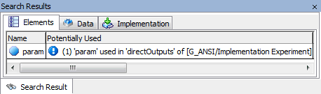

# Search Results View

The Search Results view is opened either with the Browse Connected Elements context menu option of a selected block diagram element (block diagram editor for CT blocks only) or with the Show Unused Elements option in the Extras menu. It contains the following elements:

- Elements tab

This tab corresponds largely to the element view of the Component Manager. It has an additional column, Potentially Used, which informs you in case an element is used in other variants.

[Example](javascript:kadovTextPopup(this))<!-- kadovTextPopupInit('a1'); //-->

- Data tab

This tab corresponds to the data view of the Component Manager.

- Implementation tab

This tab corresponds to the implementation view of the Component Manager.

- context menus

The context menus of the Search Results view contains the same [context menu options](componentmanagerenglishus.chm::/cm_contextmenus.htm) as the context menus in the respective views of the component manager. There is one exception, though; the context menu in the Elements tab contains an additional option:

- Potentially Used

Opens the Ignored Elements window that lists all variants that use the element.

See also

[Viewing All Elements Connected to an Item](BlockDiagramEditorEnglishUS.chm::/ViewItem.htm)

[Element View](ComponentManagerEnglishUS.chm::/The_Element_View.htm)

[Data View](ComponentManagerEnglishUS.chm::/Data_View.htm)

[Implementation View](ComponentManagerEnglishUS.chm::/Implementation_View.htm)

[Component Manager - Context Menus](ComponentManagerEnglishUS.chm::/cm_contextmenus.htm)

/* Heikki Komulainen, Comet Computer GmbH 2004 */ cc_plus_pic = '&nbsp;'; cc_minus_pic = '&nbsp;'; cc_stat_pic = '&nbsp;'; gpstyle = ''; var iframes_created = 0; if (document.body && document.body.insertAdjacentHTML && document.getElementsByTagName && document.getElementById) { collect_popups(); set_poplinks_pictures(); if (iframes_created) { document.write(gpstyle); document.write('
<nobr><a id="einauslink" style="position:absolute;top:expression(document.body.scrollTop + this.offsetHeight - this.offsetHeight);left:expression(document.body.offsetWidth - (this.offsetWidth + 28));background:#ffffe0;padding:5px" href="javascript:show_all_poptext()">Show all hidden text</a></nobr>
'); } } function collect_popups() { bsscpopups = new Array(); for (x = 0; x < document.links.length; x++) { if (document.links[x].href.indexOf("BSSCPopup")>-1) { seekmatch = /BSSCPopup.'[^'](markdown/+)'/; poplink = seekmatch.exec(document.links[x].href); poplink = "" + poplink; poplink = poplink.substring(poplink.indexOf("'")+1, poplink.lastIndexOf("'")); ifid = "CCGENIFRAMEID" + x; new_iframe = '<iframe id="' + ifid + '"src="' + poplink + '" onload="get_text(\'' + ifid + '\')" width="0" height="0" frameborder=0></iframe>'; document.links[x].parentNode.insertAdjacentHTML("afterEnd", new_iframe); gpid = "CCID_" + ifid; document.links[x].href = "javascript:expand_poptext('" + gpid + "')"; cc_plus = '' + cc_plus_pic + ''; document.links[x].insertAdjacentHTML("afterBegin", cc_plus); iframes_created = 1; } } }// end function function get_text(ifr_id) { frpars = document.frames[ifr_id].document.getElementsByTagName("body"); popbody = frpars[0].innerHTML; gpid = "CCID_" + ifr_id; if (!document.getElementById(gpid)) { //avoiding doubles document.getElementById(ifr_id).insertAdjacentHTML("afterEnd", '
'+popbody+'
'); } }//end function function expand_poptext(x_frame_id) { if (!document.getElementById(x_frame_id)) return; if (document.getElementById(x_frame_id).className == "CCGENPOPTEXTH") { document.getElementById(x_frame_id).className = "CCGENPOPTEXTV"; document.getElementById(x_frame_id).style.visibility = "visible"; if (document.getElementById("CCPMB_" + x_frame_id )) { document.getElementById("CCPMB_" + x_frame_id ).innerHTML = cc_minus_pic; } } else { document.getElementById(x_frame_id).className = "CCGENPOPTEXTH"; document.getElementById(x_frame_id).style.visibility = "hidden"; if (document.getElementById("CCPMB_" + x_frame_id )) { document.getElementById("CCPMB_" + x_frame_id ).innerHTML = cc_plus_pic; } } }// end function function show_all_poptext() { var pulldowntxt = document.getElementsByTagName("div"); for (b = 0; b < pulldowntxt.length; b++) { if (pulldowntxt[b].className == "droptext") { pulldowntxt[b].style.display=""; } } var gptxt = document.getElementsByTagName("div"); for (z = 0; z < gptxt.length; z++) { if (gptxt[z].className == "CCGENPOPTEXTH") { gptxt[z].className = "CCGENPOPTEXTV"; gptxt[z].style.visibility = "visible"; if (document.getElementById("CCPMB_" + gptxt[z].id )) { document.getElementById("CCPMB_" + gptxt[z].id ).innerHTML = cc_minus_pic; } } } var dxpoplinks = document.getElementsByTagName("a"); if (dxpoplinks) { for (pxl = 0; pxl < dxpoplinks.length; pxl++) { if (dxpoplinks[pxl].href.indexOf("kadovTextPopup")>-1) { if (document.getElementById("CCPMB_" + dxpoplinks[pxl].id)) { document.getElementById("CCPMB_" + dxpoplinks[pxl].id).innerHTML = cc_stat_pic; dxpoplinks[pxl].symbol = "minus"; } } } } document.getElementById('einauslink').innerText = 'Hide all hideable text'; document.getElementById('einauslink').href = "javascript:self.location.reload()"; self.focus(); }// end function function eat_click() { return false; }// end function function set_poplinks_pictures() { var dpoplinks = document.getElementsByTagName("a"); if (dpoplinks) { for (pl = 0; pl < dpoplinks.length; pl++) { if (dpoplinks[pl].href.indexOf("kadovTextPopup")>-1) { cc_plus = '' + cc_stat_pic + ''; //dpoplinks[pl].onmouseup = plusminuspoplink; dpoplinks[pl].insertAdjacentHTML("afterBegin", cc_plus); dpoplinks[pl].symbol = "plus"; } } } }// end function function plusminuspoplink() { if (document.getElementById("CCPMB_" + this.id)) { if (this.symbol == "plus") { document.getElementById("CCPMB_" + this.id).innerHTML = cc_minus_pic; this.symbol = "minus"; } else { document.getElementById("CCPMB_" + this.id).innerHTML = cc_plus_pic; this.symbol = "plus"; } } return true; }

---

## Browse View

_Source: `markdown/CTB_browse_view.md`_

# Browse View

The Browse view contains the following elements:

- Elements tab

This tab corresponds to the element view of the Component Manager.

- Data tab

This tab corresponds to the data view of the Component Manager.

- Implementation tab

This tab corresponds to the implementation view of the Component Manager.

- Methods tab

This tab corresponds to the methods view of the Component Manager.

You cannot edit the methods of a CT block.

This tab corresponds to the layout view of the Component Manager.

See also

[Element View](ComponentManagerEnglishUS.chm::/The_Element_View.htm)

[Data View](ComponentManagerEnglishUS.chm::/Data_View.htm)

[Implementation View](ComponentManagerEnglishUS.chm::/Implementation_View.htm)

[Methods View](ComponentManagerEnglishUS.chm::/CM_Methods_View.htm)

[Layout View](ComponentManagerEnglishUS.chm::/Layout_View.htm)

---

## Context Menu Browse and Search Results View

_Source: `markdown/ctb_contextmenubrowseview.md`_

# Context Menu Browse and Search Results View

The context menu of the Browse view and the Search Results view contains a subset of the following functions:

- Edit (Return) Elements tab Opens the properties editor for the selected element. Data tab Opens the data editor for the selected element. Implementation tab Opens the implementation editor for the selected element. Methods tab not available Layout tab Opens the layout editor for the component. This is the only entry in the context menu of the Layout tab.

- Edit Implementation

Not available for CT blocks.

- Copy (Ctrl + c) Elements tab Copies the selected element to the ASCET clipboard. Data tab Copies the data of the selected element to the ASCET clipboard. Implementation tab Copies the implementation of the selected element to the ASCET clipboard. Methods tab not available

- Paste (Ctrl + v) Elements tab Pastes an element from the ASCET clipboard to the record. Data tab Pastes the data from the ASCET clipboard to the selected element. Implementation tab Pastes the implementation from the ASCET clipboard to the selected element. Data and Implementation tabs : Works only if the receiving element has the same type as the giving one.

- Delete (Del)

Deletes a selected element (Elements tab) from the CT block. Not available in the Methods tab.

- Rename (F2)

Renames a selected element (Elements tab).

- Create ASCET Link

Creates an ASCET link (see [ASCET Links](IntroductionEnglishUS.chm::/INT_ASCETLinks.htm)) for the selected element. The link opens the CT block and selects the element in the Elements, Data or Implementation tab - or the method in the Methods tab - of the CT block editor's Browse or Search Results view.

In the Data or Implementation tab, the link also selects the data set or implementation set that was that was active when the link was created.

- Select all (Ctrl + a)

Selects all elements in the list.

See also:

[Introduction - ASCET Links](IntroductionEnglishUS.chm::/INT_ASCETLinks.htm)

[Properties Editor - Overview](ElementEditorEnglishUS.chm::/EEd_Overview.htm)

[Data Editor - Overview](DataEditorEnglishUS.chm::/DEd_Overview.htm)

[Implementation Editor - Overview](ImplementationEditorEnglishUS.chm::/IEd_Overview.htm)

[Layout Editor - Overview](LayoutEditorEnglishUS.chm::/LEd_Overview.htm)

[Signature Editor](BlockDiagramEditorEnglishUS.chm::/bde_interface_editor.htm)

---

## External Editor View

_Source: `markdown/CTB_External_Editor_View.md`_

# External Editor View

This view is available only in the ESDL and C code editors for CT blocks.

The external editor view contains the following elements:

- selection field

This field lists all methods in the CT block. You select the one you want to edit.

- text field

This field shows the body code of the method selected in the selection field.

 Start Edit

Opens the external editor.

 End Edit

Closes the external editor.

 Update

Copies a saved version of the code in the external editor into the ASCET C code editor.

---

## Solver configuration Window

_Source: `markdown/CTB_Solvers.md`_

# Solver configuration Window

This window is used to configure the integration method during an experiment. It contains the following elements:

Block field

Contains the name of the CT block used in the experiment.

Integrator combo box

Used to select the integration method. For new CT blocks, the integration method selected in the [CT-Solver](ComponentManagerEnglishUS.chm::/CM_CTSolverOptions.htm) node of the ASCET options dialog window is shown. For existing CT blocks, the integration method selected in this window during the last experiment is shown. Available selections are:

<table style="x-cell-content-align: Top;
				margin-top: 3px;
				border-left-style: Outset;
				border-top-style: Outset;
				border-right-style: Outset;
				border-bottom-style: Outset;
				border-left-width: 1px;
				border-right-width: 1px;
				border-top-width: 1px;
				border-bottom-width: 1px;
				margin-left: 0.636cm;" x-use-null-cells="">
<col/>
<col/>
<tr class="hcp1" valign="top">
<td class="hcp2">

Euler
</td>
<td class="hcp2" colspan="1" rowspan="5">

fixed step size
</td></tr>
<tr class="hcp1" valign="top">
<td class="hcp2">

Mulstep 
 2
</td>
</tr>
<tr class="hcp1" valign="top">
<td class="hcp2">

Heun
</td>
</tr>
<tr class="hcp1" valign="top">
<td class="hcp2" colspan="1" rowspan="1">

Adams-Moulton 
 2
</td>
</tr>
<tr class="hcp1" valign="top">
<td class="hcp2">

Runge-Kutta 
 4
</td>
</tr>
<tr class="hcp1" valign="top">
<td class="hcp2">

Dormand/Prince RK5
</td>
<td class="hcp2" colspan="1" rowspan="7">

variable step size
</td></tr>
<tr class="hcp1" valign="top">
<td class="hcp2">

Calvo 6(5)
</td>
</tr>
<tr class="hcp1" valign="top">
<td class="hcp2">

Dormand/Prince RK8
</td>
</tr>
<tr class="hcp1" valign="top">
<td class="hcp2">

Implicit RK2
</td>
</tr>
<tr class="hcp1" valign="top">
<td class="hcp2">

Implicit RK4
</td>
</tr>
<tr class="hcp1" valign="top">
<td class="hcp2">

Implicit Gear 1
</td>
</tr>
<tr class="hcp1" valign="top">
<td class="hcp2">

Implicit Gear 2
</td>
</tr>
</table>

text field

Contains a short description of the selected integration method.

Depending on the selected integration method, a selection of the following setup fields is available.

dT

Communication time frame, i.e. the interval in which the block communicates with the outside.

h

Integration step size, i.e. the interval for internal calculations.

Initial h

Integration step size for solvers with variable step size.

Minimum h and Maximum h

Upper and lower limits for the h parameter which is calculated according to the model dynamics when the variable step size solvers are used. Maximum h must be less than or equal to dT.

Relative error and Absolute error

Relative error and absolute error allowed for the calculation of h, available for solvers with variable step size.

Max. iterations

Maximum number of iterations used to calculate the h parameter. Once the specified number of steps has been carried out, the h value at that point will be used.

 Default

Restores the default settings for the selected Integrator.

 Set as Default

Uses the current settings as default values for the selected Integrator.

 OK

Closes the window and accepts the settings.

 Cancel

Closes the window without accepting the settings.

You can

[Configure the Integration Method](markdown/CTB_Configuring_the_Solver.md)

---

