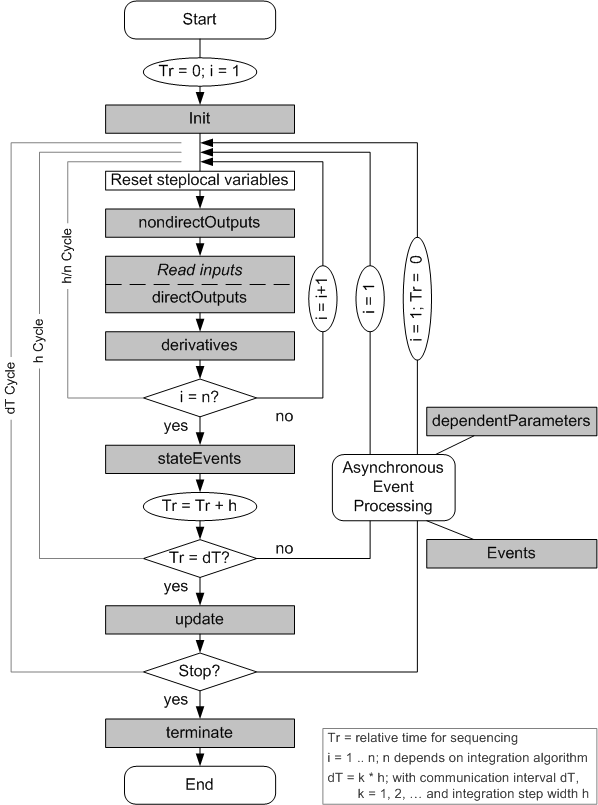

# Execution Sequence of All Methods

The figure below shows the execution sequence of all methods from the start to the end of the simulation.

The sequence in which the methods of a basic block are executed is illustrated by means of the following examples.

The evaluation sequence for synchronous calls, e.g., if n = 1 (Euler) and h = dT, is:

- at time t = dT: stateEvents
- at time t = dT: update

For a more complex integration method, e.g., if n = 2 (Adams-Moulton) and h = dT, the sequence is:

- at time t = dT/2: nondirectOutputs - (reading inputs) - directOutputs - derivatives
- at time t = dT: nondirectOutputs - (reading inputs) - directOutputs- derivatives
- at time t = dT: stateEvents
- at time t = dT: update

The evaluation sequence for n = 1 and h = dT/2 is:

- at time t = dT/2: nondirectOutputs - (reading inputs) - directOutputs - derivatives
- at time t = dT/2: stateEvents
- at time t = dT: nondirectOutputs - (reading inputs) - directOutputs - derivatives
- at time t = dT: stateEvents
- at time t = dT: update

Understanding the computing sequence and thus the behavior of continuous time basic blocks is absolutely mandatory for a correct use of these blocks. Using ESDL as the modeling language gives the additional advantage of providing an automatic analysis phase that ensures consistent modeling when connecting several CT blocks. The computing sequence is especially important for blocks with direct outputs (directOutputs), because current values from the same iteration cycle have to be applied to the corresponding inputs.

See also

[Overview - Computing Sequence](ctb_overview_computing_sequence.md)

[External Communication Interval dT](CTB_External_Communication_Interval_dT.md)

[Integration Step Size h](CTB_Integration_Step_Size_h.md)

[Step Size Depending on the Internal Integration Method: h/n](CTB_StepSize_Depending_on_Internal_IntegrationMethod_h_n.md)
