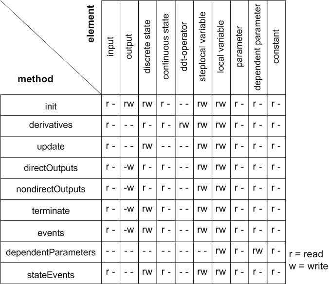

# Semantic Checks in ESDL

Semantic checks can be performed when using ESDL within a continuous time method. The verification items ensure that the model matches the fundamental continuous time simulation framework. For example, it is not permitted to change the value of a state variable directly (instead, the resetContinuousState() function has to be used to internally reset the integration algorithm). The figure provides an overview of the access rights to those elements. The semantic check traps any violation of these rights.

The derivation operator ddt supports only the first derivative. The output equations of the nondirectOutputs() method are analyzed to detect a direct dependency on an input. If such a case is found, a warning is issued.

See also

[Overview - Modeling with ESDL](CTB_Overview_Modeling_with_ESDL.md)

[Differential Equations in ESDL](CTB_Differential_Equations_in_ESDL.md)

[Overview - Additional Library Functions](CTB_Overview_Additional_Library_Functions.md)
