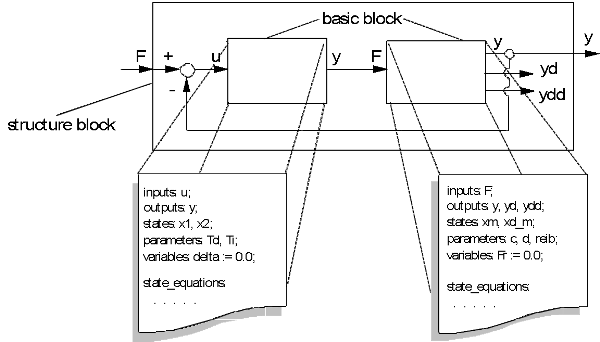
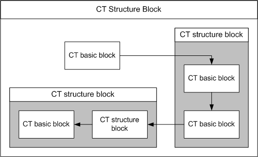

# Structure Blocks

More complex continuous time models can be assembled to CT structure blocks using the Block Diagram Editor (BDE). Using the Block Diagram Editor, several CT basic blocks and/or CT structure blocks can be assembled and combined. The first figure shows a simple CT structure block composed of two CT basic blocks.

Several CT structure blocks and CT basic blocks can in turn be combined to one new CT structure block. The second figure shows the possible structuring options with CT structures.

The correct computing sequence of the CT blocks is determined automatically.

See also

[Continuous Time Structure Blocks](CTB_Continuous_Time_Structure_Blocks.md)

[Modeling with CT Blocks](CTB_Modeling_with_CT_Blocks.md)

[Usage of CT Blocks](CTB_Usage_of_CT_Blocks.md)

[Modeling with Graphical Hierarchies](CTB_Modeling_with_Graphical_Hierarchies.md)

[Experiments](CTB_Experiments.md)

[Projects and Hybrid Projects](CTB_Projects_and_Hybrid_Projects.md)
