# Merged CHM Content

## State Machines - Overview

_Source: `markdown/SM_overview.md`_

# State Machines - Overview

A state machine is a special type of classes, an event-driven system where the focus is not on computations but on control flow. Therefore the main level of description of a state machine, the state diagram, does not describe how data, but how control is passed. To model control flow, a state machine consists of a finite number of states, and transitions between these. Besides, at least one trigger must be included to control the state machine. At each trigger call, one step of the state machine is executed.

For more information on the theory of finite state machines, see

- Harel, David: "Statecharts: A Visual Formalism for Complex Systems", Science of Computer Programming 8, 1987, pp. 231-274
- Hatley, Derek J. & Imtiaz A. Pirbhai, Strategies for Real-Time System Specification, Dorset House Publishing Co., Inc., NY, 1988.

A state machine consists of a state diagram and additional normal block diagrams or ESDL diagrams. The following diagram shows the components of a state machine.

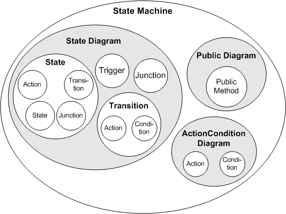

The state diagram is a special block diagram, where the states are represented as rectangles with rounded corners, and the transitions by directed arcs. Every state can be a hierarchy state i.e. a state containing another state diagram. One of the states always has to be marked as the start state, this is the state the machine is in at the beginning. The actions and conditions of a state machine are specified in additional block diagrams or in ESDL. Additional public methods can be specified in separate diagrams.

The transitions are targeted curves between the states. Each arc represents one transition in a direction marked by an arrowhead at one end. Each end of a transition is connected to a state or junction. The state where the transition starts is the source state, the one where it ends is the destination state. Two arcs are necessary to model a bidirectional transition.

Specifying a state machine consists of determining the states a system can be in, defining the conditions that have to be fulfilled for changing from one state to another, and determining the actions that are to be performed during these transitions. Specifying state machines is similar to specifying block diagrams, and you can also use block diagrams as parts of a state machine. Many parts of the description of block diagram editor functionality are the same for the state machine editor. These parts are not described separately here, so before reading this chapter, you should be familiar with specifying block diagrams in the block diagram editor.

Specifying a state machine consists of the following steps, which are described in this part of the ASCET online help:

1. Drawing a state diagram (i.e. arranging the states and transitions).
1. Specifying the conditions and actions.
1. Assigning the conditions and actions to the states and transitions in the state diagram.
1. Specifying public methods in a separate diagram.

See also

[Specifying Conditions and Actions](markdown/specifying_conditions.md)

[Hierarchy States](markdown/SM_hierarchystates.md)

[Public Methods](markdown/SM_public_methods.md)

[Experimenting with State Machines](markdown/SM_experiment_with_state_machines.md)

[Block Diagram Editor - Overview](BlockDiagramEditorEnglishUS.chm::/BDE_Overview.htm)

---

## States

_Source: `markdown/SM_states.md`_

# States

A state describes one mode of an event-driven system. The activity or inactivity of the states change dynamically, based on trigger events and conditions.

Each state has a parent state. For states on the highest level, the state diagram itself is the parent. You can place states within other higher-level states [(Hierarchy)](markdown/SM_hierarchy.md). States containing no other states are called base states. A hierarchy state can have a history. History provides an efficient means of basing future activity on past activity.

The states are mutually exclusive, i.e. only one base state can be active at any one time. If the active base state is the substate of a hierarchy, all hierarchy states that contain the active state are active, too.

Each state has a unique name. The name can be freely selected, with two exceptions: reserved keywords are forbidden, and identical names are forbidden within different hierarchies. If you use an existing name a second time, _n is added to it. n is the smallest unissued number for this name.

The following names are forbidden, too:

- names of methods, processes, elements etc. in the entire project
- names from the C language (e.g., static, define, etc.)

Such state names do not always result in an error message, but the generated code is always wrong.

Besides the names, the states contain various actions (see [Actions](markdown/SM_actions.md)). These are processed successively according to their type. The following types exist: entry action, static action and exit action. All actions are optional.

See also

[Hierarchy](markdown/SM_hierarchy.md)

[Actions](markdown/SM_actions.md)

[History](markdown/SM_History.md)

[Reserved Keywords](introductionenglishus.chm::/INT_Reserved_Keywords.htm)

---

## Transitions

_Source: `markdown/SM_transitions.md`_

# Transitions

A transition is a graphic object connecting two states. One end of the transition is attached to the source state where the transition begins. The other is connected to the destination state where the transition ends.

A transition may be interrupted by one or more junctions (see [Junctions](markdown/sm_junctions.md)) and split into several segments. In this case, one segment connects the output state with the junction, the others connect the junction with other junctions (if present) and with the destination state.

A priority is assigned to each transition. The higher the number, the higher the priority. If more than one transition originate from the same state or junction, they are evaluated in the order of their priorities. Two transitions from the same state may not have the same priority.

A trigger event is necessary for a transition to occur. Optionally, the transitions can also contain a condition and an action, the transition action.

A transition label describes the circumstances under which the system moves from one state to another. The name of the trigger is the first part of the transition label, condition and action are named in the second and third part of the label.

A transition is valid when its source state is active and its condition - if specified - is true. There are several kinds of transitions; see the links below.

See also

[Junctions](markdown/sm_junctions.md)

[Triggers](markdown/SM_triggers.md)

[Transitions Between Base States](markdown/SM_Transitions_between_base_states.md)

[Transitions from and to Hierarchy States](markdown/SM_Transitions_from_and_to_hierarchy_states.md)

[Transitions between Substates of different Hierarchies](markdown/SM_Transitions_between_substates_of_different_hierarchies.md)

[Loops](markdown/SM_Loops.md)

[Transitions with Junctions](markdown/SM_Transitions_with_junction.md)

---

## Transitions Between Base States

_Source: `markdown/SM_Transitions_between_base_states.md`_

# Transitions Between Base States

The transition from state A to B is valid if A is active, the trigger event trigger occurs, and the condition [switch_on] is true.

---

## Transitions from and to Hierarchy States

_Source: `markdown/SM_Transitions_from_and_to_hierarchy_states.md`_

# Transitions from and to Hierarchy States

The transition from C to the hierarchy state (see [Hierarchy](markdown/SM_hierarchy.md)) D_hierarchy is valid if C is active, the trigger event trigger occurs, and the condition [switch_on] is true. It is an explicit transition to the hierarchy state.

For a valid transition to a hierarchy state, you must implicitly define one substate as the destination. Here, you do this by marking the substate D1 as start state (see [Start State](markdown/SM_start_state.md)). What is executed in fact is the transition from C to D1.

The transition from D_hierarchy to C is valid if D_hierarchy is active, the trigger event trigger occurred, and the condition [switch_off] is true, regardless of which substate is active.

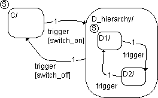

See also

[Hierarchy](markdown/SM_hierarchy.md)

[Start State](markdown/SM_start_state.md)

---

## Transitions between Substates of different Hierarchies

_Source: `markdown/SM_Transitions_between_substates_of_different_hierarchies.md`_

# Transitions between Substates of different Hierarchies

The transition from the substate E2 in the hierarchy state E_hierarchy in the substate F1 in the hierarchy state F_hierarchy is valid if E2 is active and the trigger event trigger occurs. The transition defines an explicit exit from substate E2 and an implicit exit from the hierarchy state E_hierarchy. It also implicitly defines an entry into F_hierarchy and an entry into F1.

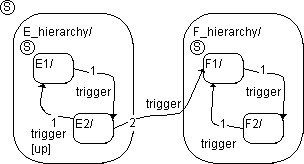

See also

[Hierarchy](markdown/SM_hierarchy.md)

---

## Loops

_Source: `markdown/SM_Loops.md`_

# Loops

A loop is a transition from a state to itself. The transition in the above figure is valid if either of the substates of G_hierarchy is active, the trigger event trigger occurs and the condition [reset_state] is true. The system leaves the active substate, it leaves the G_hierarchy state, executes the transition action, re-enters G_hierarchy, and finally enters the substate G1.

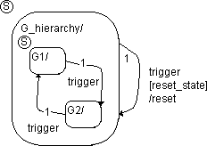

---

## Transitions with Junctions

_Source: `markdown/SM_Transitions_with_junction.md`_

# Transitions with Junctions

All types of transitions can contain junctions (see [Junctions](markdown/sm_junctions.md)). Here, just one of the many possible examples is shown.

If state H is active and the trigger event trigger occurs, the system leaves state H. In the junction, the conditions to the leading transition segments ([condition_1], [condition_2], [condition_3]) are tested in sequence for their priority. If, for example, the condition [condition_2] is fulfilled, transition to state J occurs. If none of the conditions are fulfilled, the system remains in the start state H.

See also

[Junctions](markdown/sm_junctions.md)

---

## Junctions

_Source: `markdown/sm_junctions.md`_

# Junctions

A junction is a graphic object which considerably improves the legibility of state diagram and aids the generation of efficient code. Junctions form additional possibilities for representing the required system behavior.

Junctions are not states, they represent branching points in the state diagram. Nodes interrupt a transition (see [Transitions](markdown/SM_transitions.md)) and split it into segments. One segment connects the source state with the junction, one or more segments connect the interrupting junctions (if required), and the last segment connects the last junction with the destination state. Thus, junctions aid the representation of different transitions by splitting these into individual segments. At the same time, they allow reuse of transition segments.

Note the following when using junctions:

- Transitions from a starting state to several destination states are clearly represented.

| Column 1 | Column 2 |
| --- | --- |
| (A) | (B) |

You can achieve the same functionality modelled with a junction in Part A of the diagram by direct transitions from the start state source_state to the destination states (Part B of the diagram). However, using the junction brings a runtime benefit, as the transition segment between the start state and the junction is evaluated first. If this is already invalid, no transition can take place and you need not consider the segments leading away from the junction.

- Also, transitions from several starting states to a destination state are clearly represented.

| Column 1 | Column 2 |
| --- | --- |
| (A) | (B) |

Again, both ways of writing have the same meaning. You can (and should) assign an action shared by all three transitions to the segment leading away from the junction.

- If none of the transition segments leading away from the junction are valid, then no transition occurs and the system remains in the starting state.

- Transition segments from a junction into a state can contain actions.

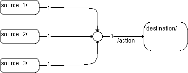

It is not possible to assign an action to a transition segment ending in a junction. The complex semantics of such transition actions results in inefficient coding.

- Each segment of a transition can have a condition.

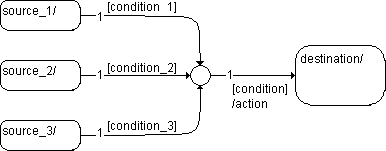

- Transitions from one junction to another (cascading junctions) are allowed, all kinds of loops are forbidden.

| Column 1 |
| --- |
|  |
|  |

- Only one segment of a transition has a trigger. Usually, a trigger is assigned either to the segments leading towards the first junction of a transition, or to the segments leading away from the last junction, but not to all segments.

| Column 1 | Column 2 | Column 3 |
| --- | --- | --- |
|  | or |  |

The assignment of triggers to more than one segment of the same transition is not deactivated. However, in such a case, ASCET outputs an error message if different triggers are assigned to the segments. You are therefore responsible for the assignment of triggers.

- If none of the segments leading to a possible destination state is valid, no transition occurs. The state remains in the source state.

See also

[Transitions](markdown/SM_transitions.md)

[Creating Junctions](markdown/creating_junctions.md)

[Creating a Transition](markdown/create_transition.md)

---

## Triggers

_Source: `markdown/SM_triggers.md`_

# Triggers

Triggers activate the execution of the state machines. Each trigger call causes the execution of one state machine step. They are public methods of the state machine; you must define each trigger that affects the state diagram. A trigger can have arguments for communication with other ASCET components.

A state machine can have one or more triggers. Each transition is assigned to one of the triggers of the state machine. Each trigger can be started independently. The state machine is activated whenever a trigger is started: all transitions from the current state are checked in the order of their priority, and a transition is executed if necessary.

See also

[Inserting a Trigger](markdown/SM_insert_trigger.md)

[Assigning Triggers, Priorities, Conditions and Actions to a Transition](markdown/SM_AssignTriggers.md)

---

## Hierarchy

_Source: `markdown/SM_hierarchy.md`_

# Hierarchy

State machines often have a large number of states. The hierarchy allows the organization of complex systems by defining higher or lower-level object structures. A hierarchical design usually reduces the number of transitions and produces structured and readable diagrams.

ASCET supports the hierarchical organization of states in the form of open and closed hierarchies. The only difference between them is the graphical representation: the subdiagram of a closed hierarchy state is created on a new drawing level, the subdiagram of an open hierarchy state is created on the same drawing level.

A state containing other states is called hierarchy state; states containing no other states are called base states. A state contained in a hierarchy state is called a substate of the hierarchy state. The system is always in a base state, and together with that base state also in its associated hierarchy states. One of the states in a hierarchy is marked as the [start state](markdown/SM_start_state.md).

When the state machine enters a hierarchy state, it starts with the start state of the subdiagram contained in the hierarchy state. If this state is hierarchical, too, it is in the start state of the hierarchical state and so on. If, however, the hierarchy has a [history](markdown/SM_History.md), the substate activated upon a transition to the hierarchy state is the one the subdiagram was in when the hierarchy state was last left.

It is possible to connect states that are not in the same hierarchy with pins on hierarchical state symbols. A connection between states via a pin is the same as if the states were connected directly.

A transition from a hierarchy state automatically includes the exit from the active substate. A transition from a substate can lead beyond the borders of hierarchy states to another substate. If a substate is active, its parent hierarchy state is active, too.

The [example](markdown/SM_Example__Hierarchy_State.md) shows a simple hierarchy state.

See also

[Example: Hierarchy State](markdown/SM_Example__Hierarchy_State.md)

[Start State](markdown/SM_start_state.md)

[History](markdown/SM_History.md)

---

## Start State

_Source: `markdown/SM_start_state.md`_

# Start State

The start state specifies which state is to be activated when there are several possibilities on the same hierarchy level. Thus, the start state of the entire state machine, or that of a hierarchy level is determined.

A common error in the specification of state machines is the generation of several states without marking one of them as start state. In that case, there is no indication of which state becomes active by default. Therefore, on code generation, ASCET outputs an appropriate error message.

See also

[Example: Start State](markdown/SM_Example__Start_State.md)

[Defining the Starting State](markdown/SM_Define_StartState.md)

---

## History

_Source: `markdown/SM_History.md`_

# History

The history option provides the means to determine the destination substate of a transition to a hierarchy state based on past activities. If a hierarchy state has a history, the transition ends in the substate that was most recently active.

The history belongs to the hierarchy state in which the option was set. It takes priority over the start state within the hierarchy.

The generated code contains a special variable for the history, the history variable

See also

[Example: History](markdown/SM_Example__History.md)

[Hierarchy](markdown/SM_hierarchy.md)

---

## Conditions

_Source: `markdown/SM_conditions.md`_

# Conditions

A condition is a Boolean expression specifying that a transition occurs, given that the expression is true. Each transition and segment of a transition can have a condition.

You can specify conditions as block diagrams (in separate diagrams) or in ESDL (in separate diagrams or directly at the transition).

Conditions can also have arguments for communication with other ASCET components. You can find more on this in [State Machines as Classes](markdown/SM_State_Machines_as_Classes.md) and in [Communication with Other Components](markdown/communications_components.md).

See also

[Example: Condition](markdown/SM_Example__Condition.md)

[Specifying Conditions and Actions](markdown/specifying_conditions.md)

[State Machines as Classes](markdown/SM_State_Machines_as_Classes.md)

[Communication with Other Components](markdown/communications_components.md)

---

## Actions

_Source: `markdown/SM_actions.md`_

# Actions

Actions take place as part of the state machine execution. An action can be executed either as part of a transition from one state to another, or based on the activity status of a state.

Transitions and transition segments leading away from a junction can have transition actions. States can have entry, static and exit actions. All actions are optional.

[Semantics of State Machines](markdown/SM_Semantics_of_State_Machines.md) and the links given there describe in detail which actions are executed when. You can specify actions as block diagrams or in ESDL. For more information, see [Specifying Conditions and Actions](markdown/specifying_conditions.md).

Actions can also have arguments for communication with other ASCET components. You can find more on this in [State Machines as Classes](markdown/SM_State_Machines_as_Classes.md) and in [Communication with Other Components](markdown/communications_components.md).

See also

[Example: Actions](markdown/SM_Example__Actions.md)

[Specifying Conditions and Actions](markdown/specifying_conditions.md)

[Semantics of State Machines](markdown/SM_Semantics_of_State_Machines.md)

[State Machines as Classes](markdown/SM_State_Machines_as_Classes.md)

[Communication with Other Components](markdown/communications_components.md)

---

## Data

_Source: `markdown/SM_data.md`_

# Data

Data objects are used to store and process numerical values in the state diagram. The following types are available:

- Variables, parameters, constants
- Enumerations
- Arrays, matrices
- Literals
- Temporary variables
- Characteristic lines and maps
- Inputs for data from other ASCET components
- Outputs to other ASCET components
- other classes (e.g., timers, counters, comparators)

The state variable sm of type enum also belongs to the data. The variable is created in every state machine. This variable contains the currently active state. You cannot edit sm, but you can measure it in an experiment. If an ASAM-MCD-2CM file is generated for a project containing a state machine, the sm variable is also saved to the file.

---

## State Variables

_Source: `markdown/SM_StateVariables.md`_

# State Variables

Code generation for a state machine generates several state variables:

- sm state variable - contains the currently active state

This variable is the only state variable visible in the state machine editor: 

- additional state variables if hierarchical code generation is activated
- a history state variable for a hierarchy state with history

The implementation of these variables is determined automatically, with the exception of memory location and cache locking/memory segment settings. These settings can be made in the implementation editor of the sm variable, see [Specifying the Memory Location of State Variables](ImplementationEditorEnglishUS.chm::/IEd_SpecifyMemLoc_StateVariables.htm).

A special method can be defined that reinitializes the state variables. The following rules apply to the reinitialization method:

- One reinitialization method can be specified per state machine.
- The reinitialization method must not have a return value. If it has, an error is issued during code generation.

Arguments are not forbidden.

- During code generation, any method body is replaced by code that initializes the state variables.

If no method body is specified for the reinitialization method, an information message is generated. If a method body is specified, a warning is generated that the specified body will be discarded.

- The reinitialization method must not be called during a transition because changing the state variables during the execution of a transition may result in unexpected behavior of the state machine.

This means that a private reinitialization method can only be called from the static action of a state.

The reinitialization method is the only way to reset the history variable.

See also

[Implementation Editor - Specifying the Memory Location of State Variables](ImplementationEditorEnglishUS.chm::/IEd_SpecifyMemLoc_StateVariables.htm)

[Specifying a Reinitialization Method for State Variables](markdown/sm_specifyresetmethod_statevariables.md)

[Hierarchical Code Generation](markdown/SM_Hierarchical_Code_Generation.md)

[Hierarchy](markdown/SM_hierarchy.md)

[History](markdown/SM_History.md)

---

## Example: Actions

_Source: `markdown/SM_Example__Actions.md`_

# Example: Actions

When, in this example, the first state is active, and no transition occurs, the static action accelerate is executed. At the transition from first to second, the transition action switch_gear is executed.

---

## Example: Condition

_Source: `markdown/SM_Example__Condition.md`_

# Example: Condition

In the system shown here, the transition from first to second takes place if the Boolean condition [speed > threshold] is true.

---

## Example: Hierarchy State

_Source: `markdown/SM_Example__Hierarchy_State.md`_

# Example: Hierarchy State

The state diagram shown here has a hierarchy state that contains two substates. (Some transitions are left out for clarity.)

The hierarchy state engaged contains the two substates first and second. This makes engaged the parent state of first and second. When the trigger event clutch_engaged occurs, the system transitions from the neutral state to the hierarchy state engaged.

Far more complicated structures are possible, including nested hierarchies.

---

## Example: History

_Source: `markdown/SM_Example__History.md`_

# Example: History

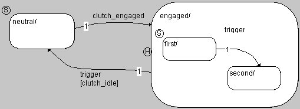

The H in the diagram indicates that the hierarchy state engaged has a history. Whether the first or second substate is activated upon a transition from neutral to engaged is based on which of them was most recently active.

---

## Example: Start State

_Source: `markdown/SM_Example__Start_State.md`_

# Example: Start State

The state neutral is the start state of the entire state diagram shown below, first is the start state of the hierarchy state engaged.

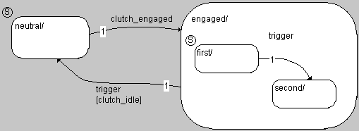

With that, the state neutral becomes active when the state machine is first activated. If you had not defined a start state, it would be unclear whether neutral or engaged should be activated. When a transition from neutral to engaged occurs, the substate first is activated inside the hierarchy state.

---

## Conditions and Actions

_Source: `markdown/specifying_conditions.md`_

# Specifying Conditions and Actions

Every state can have an entry, a static and an exit action, every transition can have a trigger, a condition and a transition action attached to it. [Conditions](markdown/SM_conditions.md) and [actions](markdown/SM_actions.md) are similar to methods, and they are specified the same way as the methods of classes.

A condition is tested each time the state machine is in a state that has a transition with this condition attached to it. If the condition is true, a transition takes place. Therefore a condition always has true or false as its return value. Entry, exit and transition actions - if present - are carried out each time a transition takes place, static actions are carried out when no transition takes place.

You can specify conditions and actions either in separate diagrams (ActionCondition diagrams) in the form of block diagrams or ESDL code. In that case, the state machine then contains at least two diagrams or as ESDL code. Alternatively, you can specify actions or conditions in ESDL directly in the state or transition editor; in this case no separate diagram is required.

Static actions of hierarchy states can be optimized regarding code size (see [Static Actions of Hierarchy States](markdown/Static_actions_of_hierarchy_states_1.md)).

See also

[Actions/Conditions in Separate Diagrams](markdown/SM_conditions_actions.md)

[Using Conditions and Actions](markdown/using_conditions_actions.md)

[Conditions and Actions in the State Diagram](markdown/conditions_actions_state.md)

[Communication with Other Components](markdown/communications_components.md)

[Static Actions of Hierarchy States](markdown/Static_actions_of_hierarchy_states_1.md)

---

## Actions/Conditions in Separate Diagrams

_Source: `markdown/SM_conditions_actions.md`_

# Actions/Conditions in Separate Diagrams

You can specify actions and conditions as block diagrams or ESDL code in separate ActionCondition diagrams. A state machine can contain any number of these ActionCondition diagrams, an individual diagram contains either block diagrams or ESDL code.

First, you create the required diagrams. After that, actions and conditions can be specified like normal block diagrams or ESDL code. Specifying block diagrams is explained in [Creating Block Diagrams](BlockDiagramEditorEnglishUS.chm::/Creatingblockdiagram.htm), specifying ESDL code is explained in [ESDL Editor](ESDLEditorEnglishUS.chm::/ESDL_Overview.htm).

See also

[Editing Actions/Conditions in Separate Diagrams](markdown/SM_ActionsConditions_SeparateDiagrams.md)

[Creating Block Diagrams](BlockDiagramEditorEnglishUS.chm::/Creatingblockdiagram.htm)

[ESDL Editor - Overview](ESDLEditorEnglishUS.chm::/ESDL_Overview.htm)

[Adding a Condition](markdown/SM_add_condition.md)

[Opening a Diagram for Actions/Conditions](markdown/SM_opening_diagram.md)

---

## Using Conditions and Actions

_Source: `markdown/using_conditions_actions.md`_

# Using Conditions and Actions

You must explicitly assign actions and conditions from an ActionCondition diagram to the transitions or states in which they are used.

See also

[Assigning Triggers, Priorities, Conditions and Actions to a Transition](markdown/SM_AssignTriggers.md)

[Assigning Actions to a State](markdown/SM_AssignActions.md)

[Editing Actions/Conditions](markdown/SM_edit_actions_conditions.md)

---

## Conditions and Actions in the State Diagram

_Source: `markdown/conditions_actions_state.md`_

# Conditions and Actions in the State Diagram

It is possible to type the ESDL code for a condition or action in the state diagram, directly into the state editor or transition editor. In this case it is not necessary to create a specification in a separate diagram, the Edit button is inactive.

You can declare variables and parameters by clicking on an element button in the state machine editor and typing a name into the Outline pane. You can then use those variables in the ESDL code by typing in their names. Likewise, you can refer to any trigger arguments, imported components, their methods or the elements defined within them by typing the name. This makes it possible to specify complex state machine behavior with just a few lines of code, and without any additional diagrams. The ESDL language is described in [ESDL Editor - Overview](ESDLEditorEnglishUS.chm::/ESDL_Overview.htm).

See also

[Specifying Actions in the State Editor](markdown/specifying_actions.md)

[Cutting, Copying and Pasting ESDL code](markdown/cut_copyand%20paste.md)

[Specifying Conditions and Transition Actions in the Transition Editor](markdown/specifying_conditions_transition.md)

[Automatic Insertion of Comment Lines](markdown/automatic_insertion.md)

[Activating/Deactivating Outlining of Actions/Conditions](markdown/SM_activate_deactivate_outlining_of_actions_conditions_.md)

[ESDL Editor - Overview](ESDLEditorEnglishUS.chm::/ESDL_Overview.htm)

---

## Communication with Other Components

_Source: `markdown/communications_components.md`_

# Communication with Other Components

A state machine can communicate with other ASCET components. For this, there are several options: inputs and outputs, trigger arguments and public methods (see also [State Machines as Classes](markdown/SM_State_Machines_as_Classes.md)).

If you want to carry out external communication using trigger arguments, a series of steps are necessary.

Firstly, you need one or more trigger arguments. The rules for the creation of trigger arguments for the various use cases are shown in [Rules for Trigger Arguments](markdown/SM_Rules_for_Trigger_Arguments.md).

The trigger argument belongs to a public method in the same diagram as the state diagram. Therefore, you can use it exactly as you would use variables or parameters, if you specify conditions or actions in the transition or state.

If you want to use the trigger argument in an action or condition specified in an ActionCondition diagram, you must generate an argument of the same name and the same type in the action or condition. The arguments in triggers and actions/conditions are mapped according to their name and their type.

See also

[State Machines as Classes](markdown/SM_State_Machines_as_Classes.md)

[Trigger Arguments for External Communication](markdown/SM_Trigger_Arguments_for_Communication.md)

[Conditions and Actions in the State Diagram](markdown/conditions_actions_state.md)

[Adding Inputs and Outputs to the State Machine](markdown/adding_inputs.md)

[Adding a Trigger Argument](markdown/adding_triggerargument.md)

[Adding Arguments to Conditions/Actions](markdown/adding_arguments.md)

---

## Hierarchy States

_Source: `markdown/SM_hierarchystates.md`_

# Hierarchy States

State diagrams can be hierarchical (see [Hierarchy](markdown/SM_hierarchy.md)), i.e. a state can contain a different state diagram. When the state machine enters a hierarchy state, it starts with the start state of the subdiagram contained in the hierarchy state. If, however, the hierarchy has a history (see [History](markdown/SM_History.md)), the substate activated upon a transition to the hierarchy state is the one the subdiagram was in when the hierarchy state was last left.

A distinction is made between closed and open hierarchy states. Unlike a closed hierarchy state, where the subdiagram is created on a new drawing level, the subdiagram in an open hierarchy state is on the same drawing level. However, both hierarchy types have the same functionality. This means that when you are using open hierarchy states, there is not need to switch between different drawing levels.

Open and closed hierarchy states can exist within a state diagram simultaneously. However, a single state can only have one hierarchy type. Incorrect construction from overlapping states in the drawing area is displayed by a change of color on the state symbols.

It is possible to connect states that are not in the same hierarchy with pins on hierarchical state symbols. A connection between states via a pin is the same as if the states were connected directly.

Code for a hierarchical state machine can be generated either flat (a single switch statement for all (basis) states) or hierarchical (nested switch statements according to the hierarchy), the latter can considerably reduce the code size (see [Hierarchical Code Generation](markdown/SM_Hierarchical_Code_Generation.md)).

See also

[Hierarchy](markdown/SM_hierarchy.md)

[History](markdown/SM_History.md)

[Hierarchical Code Generation](markdown/SM_Hierarchical_Code_Generation.md)

[Adding a Closed Hierarchy State](markdown/SM_ClosedHierarchy.md)

[Moving Between Hierarchy Levels](markdown/SM_Move_between_hierarchies.md)

[Setting up a Hierarchy State with a History](markdown/SetupHierarchy.md)

[Adding a Pin to a Hierarchy State](markdown/addpin.md)

[Resolving a Hierarchy State](markdown/ResolveHirearchy.md)

[Adding an Open Hierarchy State](markdown/addopenhierarchy.md)

---

## Semantics of State Machines

_Source: `markdown/SM_Semantics_of_State_Machines.md`_

# Semantics of State Machines

A state machine consists of a finite number of states. Each state represents a state a system can be in, for instance whether a door is locked, open, or closed. Under certain circumstances the state of the system changes. These state changes are modelled by transitions between the different states. For each possible transition to take place, a condition has to be fulfilled.

An external event, the trigger event, activates a state machine. A trigger is a public method of the state machine. A state machine always has to be in one of its states. At the beginning, a state machine is in a special state, the start state. If a trigger event occurs, the system reacts with the execution of actions (e.g., creation of a signal, change of a variable, or transition to another state).

The entry action of a state is executed when a transition to that state occurs. The state is activated before the execution of the entry action is started.

When a state machine is called for the first time, the entry action of the start state is not executed.

The static action of a state is executed if the state is active and a trigger event occurs which does not result in a transition from the state. When a transition between two substates of the same hierarchy state occurs, the hierarchy state (which is not left) executes and completes its static action after the source state was left, but before the transition action is executed.

The exit action of a state is executed when a transition from that state occurs. The state becomes inactive after the execution of the exit action is completed.

The transition action of a transition is executed after the source state has been left and before the destination state is activated.

The semantics describe how a state diagram is interpreted and executed and in which order the actions will be executed. Knowledge of the semantics of state diagram is essential for the creation of suitable state machines and the generation of efficient code. Different implementation options result in different simulation behavior and in the executable code.

The semantics of state machines contain rules for the

- Processing of states,
- Selection of transitions,
- Processing of transitions.

The following sections describe the semantics of state machines using examples. These cover a wide range of possible implementations and combinations of the different actions.

See also

[Example 1: Transition Between States](markdown/SM_Example_1__Transition_Between_States.md)

[Example 2: Transitions from One State](markdown/SM_Example_2__Transitions_from_One_State.md)

[Example 3: Loop](markdown/SM_Example_3__Loop.md)

[Junctions in State Machines](markdown/SM_Junctions_in_State_Machines.md)

[Hierarchical State Machines](markdown/SM_Hierarchical_State.md)

---

## Semantics: Simple State Machines

_Source: `markdown/sm_semanticssimplestatemachines.md`_

# Simple State Machines

The semantics of simple state machines is explained with the following examples.

- [Example 1: Transition Between States](markdown/SM_Example_1__Transition_Between_States.md)
- [Example 2: Transitions from One State](markdown/SM_Example_2__Transitions_from_One_State.md)
- [Example 3: Loop](markdown/SM_Example_3__Loop.md)

---

## Example 1: Transition Between States

_Source: `markdown/SM_Example_1__Transition_Between_States.md`_

# Example 1: Transition Between States

This simple state machine models a light switch. At the beginning, the lamp is off, the state dark is active. The trigger event trigger occurs and initiates the evaluation of the state machine. The light switch is pressed, so that the condition switch_on is true.

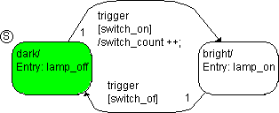

The following steps are executed:

1. The state diagram checks to see if there is a valid transition.
1. The dark state is active so that only the transition from dark to bright has to be evaluated. The condition [switch_on] is fulfilled, the transition is valid.
1. The dark state has no exit action that could be executed. It is deactivated.
1. The transition action is executed, the counter switch_count is increased by 1.
1. The bright state is activated.
1. The lamp_on entry action is executed and completed. The lamp is switched on.

With that, the evaluation of the state machine initiated by this trigger event is finished.

Every state can have transitions to more than one other state. To make the behavior of the state machine deterministic, each transition has to be assigned a priority. The priority determines the order in which the conditions belonging to the transitions are checked. Once a condition evaluates to true, the associated transition takes place, and all other conditions belonging to transitions with lower priorities are not tested. If no condition evaluates to true, the state remains unchanged and the static action is executed.

---

## Example 2: Transitions from One State

_Source: `markdown/SM_Example_2__Transitions_from_One_State.md`_

# Example 2: Transitions from One State

This state machine models a display. Outside temperature, speed, average speed and distance covered can be displayed as required. There is also a key to toggle the display. If the outside temperature falls below 1°C, a change to the temperature display occurs, and a frost warning is shown.

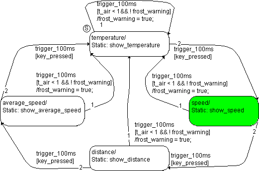

The state machine is in the speed state. A trigger event trigger_100ms occurs, the temperature drops from 1.5 °C to 0.5 °C. The switch is not pressed. The following steps are executed:

1. The system checks to see if there is a valid transition from speed.
1. The transition from speed to distance has the highest priority, and is evaluated first. However, the [key_pressed] condition is not fulfilled, the transition is invalid.
1. The transition from speed to temperature has the condition [t_air < 1 && !frost_warning]. At first, the temperature was above the threshold of 1 °C and no frost warning was required. Now, it has dropped to 0.5 °C. Both parts of the condition are true, the transition is valid.
1. The speed state has no exit action. It is deactivated.
1. The /frost_warning = true transition action is executed, and the frost warning appears.
1. The temperature state is activated.

Since that state has no entry action, the evaluation of the state machine initiated by this trigger event is finished.

---

## Example 3: Loop

_Source: `markdown/SM_Example_3__Loop.md`_

# Example 3: Loop

The state machine is the same as in Example 2. However, the entry action clear_display was added to the states. The state machine is in the temperature state. Otherwise, the starting state is the same as in the [previous example](markdown/SM_Example_2__Transitions_from_One_State.md). A trigger event trigger_100ms occurs and the switch is not pressed.

The following steps are executed:

1. The system checks to see if there is a valid transition from temperature.
1. The transition from temperature to speed has a higher priority, but the condition is not fulfilled. The transition is invalid.
1. The transition from temperature to itself has the condition [t_air < 1 && !frost_warning]. This is fulfilled, the transition is valid.
1. The temperature state has no exit action. It is deactivated.
1. The /frost_warning = true transition action is executed, and the frost warning appears.
1. The temperature state is activated.
1. The entry action clear_display of the temperature substate is executed and completed.

With that, the evaluation of the state machine initiated by the trigger_100ms trigger event is finished.

---

## Semantics: Junctions in State Machines

_Source: `markdown/SM_Junctions_in_State_Machines.md`_

# Junctions in State Machines

Junctions (see [Junctions](markdown/sm_junctions.md)) aid the legibility of state diagrams. The functionality of all the examples can also be described using direct transitions between the states.

See also

[Junctions](markdown/sm_junctions.md)

[Example 4: If…Then…Else Construction](markdown/SM_Example_4_If_Then_Else_Construction.md)

[Example 5: No transition](markdown/SM_Example_5__No_transition.md)

[Example 6: Loop construction](markdown/SM_Example_6__Loop_construction.md)

[Example 7: Transitions from Multiple Start States to a Destination State (One Trigger)](markdown/SM_Example_7__Transitions_from_Multiple_Start_States_to_a_Destination_State_(One_Trigger).md)

[Example 8: Transitions from a Start State to Different Destination States (Multiple Triggers)](markdown/SM_Example_8__Transitions_from_a_Start_State_to_Different_Destination_States_(Multiple_Triggers).md)

[Example 9: Transitions from Different Start States to the Same Destination State (Multiple Triggers)](markdown/SM_Example_9__Transitions_from_Different_Start_States_to_the_Same_Destination_State_(Multiple_Triggers).md)

---

## Example 4: If…Then…Else Construction

_Source: `markdown/SM_Example_4_If_Then_Else_Construction.md`_

# Example 4: If…Then…Else Construction

This state machine models a simple drinks machine which offers four different drinks. The state machine is in the waiting state. A trigger event trigger_10ms occurs: someone wants Cola.

This sets the select selection to 2. The following steps are executed:

1. The system checks to see if there is a valid transition or a valid segment from waiting.

The transition segment from waiting to the left-hand junction is valid.

1. The transition segments leading away from the junction are examined in order of their priority, starting with the segment of the junction to state Orange.

The condition [select==1] is not fulfilled, the segment is invalid.

1. Next, the segment from the junction to state Cola is tested.

The condition [select==2] is fulfilled, the segment is valid. This means that there is a fully-valid transition available from the state waiting.

1. Only now does the transition occur. The state waiting has no exit action and is deactivated.
1. The Cola state is activated.
1. The pour_Cola entry action is executed and completed.

With that, the evaluation of the state machine initiated by this trigger event is finished.

---

## Example 5: No transition

_Source: `markdown/SM_Example_5__No_transition.md`_

# Example 5: No transition

The state machine is the same as in [Example 4](markdown/SM_Example_4_If_Then_Else_Construction.md). The state machine is in the waiting state. A trigger event trigger_10ms occurs, the selection select is set to 5 by mistake. The following steps are executed:

1. The system checks to see if there is a valid transition or a valid segment from waiting.

The transition segment from waiting to the left-hand junction is valid.

1. The transition segments leading away from the junction are examined in the order of their priority.

As select was set to 5, none of the conditions are fulfilled, all the segments are invalid.

1. There is no valid transition from waiting. The system remains in the state waiting. As the state has no static action, nothing happens.

With that, the evaluation of the state machine initiated by this trigger event is finished.

See also

[Example 4: If…Then…Else Construction](markdown/SM_Example_4_If_Then_Else_Construction.md)

---

## Example 6: Loop construction

_Source: `markdown/SM_Example_6__Loop_construction.md`_

# Example 6: Loop construction

The state machine is the same as in [Example 4: If…Then…Else Construction](markdown/SM_Example_4_If_Then_Else_Construction.md). The addition is a transition segment away from the junction back to the state waiting and the entry action in waiting.

The state machine is in the state waiting; a trigger event trigger_10ms occurs. By mistake, the selection select is set to 5. The following steps are executed:

1. The system checks to see if there is a valid transition or a valid segment from waiting.

The transition segment from waiting to the left-hand junction is valid.

1. The transition segments leading away from the junction are examined in the order of their priorities, starting with the segment of the junction back to the state waiting.

The condition [select<1 || select > 4] is fulfilled, the segment is valid. This means that there is a complete, valid transition available from the state waiting.

1. The waiting state has no exit action. It is deactivated.
1. The transition from waiting to waiting has no transition action, and therefore the state waiting is reactivated.
1. The entry action select=0; from waiting is executed and completed.

With that, the evaluation of the state machine initiated by this trigger event is finished.

This loop construction corresponds to a direct transition from a state to itself from [Example 3: Loop](markdown/SM_Example_3__Loop.md).

See also

[Example 4: If…Then…Else Construction](markdown/SM_Example_4_If_Then_Else_Construction.md)

[Example 3: Loop](markdown/SM_Example_3__Loop.md)

---

## Example 7: Transitions from Multiple Start States to a Destination State (One Trigger)

_Source: `markdown/SM_Example_7__Transitions_from_Multiple_Start_States_to_a_Destination_State_(One_Trigger).md`_

# Example 7: Transitions from Multiple Start States to a Destination State (One Trigger)

The state machine is the same as in [Example 6: Loop construction](markdown/SM_Example_6__Loop_construction.md). The state Cola is active, the glass has been filled and the logical variable glass_full set to true.

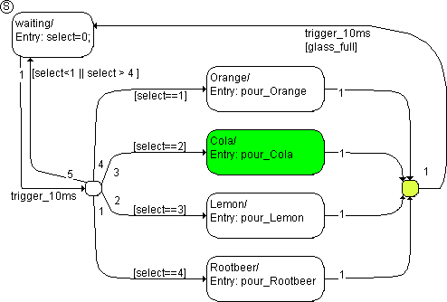

A trigger event trigger_10ms occurs, and the following steps are performed:

1. The system checks to see if there is a valid transition or a valid segment from Cola available.

The transition segment from Cola to the right-hand junction is valid.

1. The transition segment from the junction to the state waiting has the condition [glass_full]. As glass_full was set to true, this segment is also valid and the transition can take place.
1. The Cola state has no exit action. It is deactivated.
1. The transition has no transition action and therefore the state waiting is activated next.
1. The entry action select=0; from waiting is executed and completed.

With that, the evaluation of the state machine initiated by this trigger event is finished.

See also

[Example 6: Loop construction](markdown/SM_Example_6__Loop_construction.md)

---

## Example 8: Transitions from a Start State to Different Destination States (Multiple Triggers)

_Source: `markdown/SM_Example_8__Transitions_from_a_Start_State_to_Different_Destination_States_(Multiple_Triggers).md`_

# Example 8: Transitions from a Start State to Different Destination States (Multiple Triggers)

This state machine describes a drinks machine which offers different types of sodas or beers. The actual choice takes place in the hierarchy states soda_on and beer_on, it is irrelevant for the example. [Hierarchical State Machines](markdown/SM_Hierarchical_State.md) describes the semantics of hierarchical state machines.

The state machine is in the starting state beverage_off. A trigger event trigger_soda occurs and the machine is switched on (switch_on is true). The following steps are executed:

1. The system checks to see if there is a valid transition or a segment from beverage_off.
1. The transition segment from beverage_off to the junctions is valid, as the condition [switch_on] is fulfilled. As the trigger event trigger_soda has occurred, the segment from the junction in the state soda_on is also valid, the transition can occur.
1. The beverage_off state has no exit action. It is deactivated.
1. The transition from beverage_off to soda_on has no transition action. Therefore, the state soda_on is activated next.
1. The entry action start_soda of soda_on is executed and completed.
1. The necessary steps in the hierarchy state are executed.

With that, the evaluation of the state machine initiated by this trigger event is finished.

See also

[Hierarchical State Machines](markdown/SM_Hierarchical_State.md)

---

## Example 9: Transitions from Different Start States to the Same Destination State (Multiple Triggers)

_Source: `markdown/SM_Example_9__Transitions_from_Different_Start_States_to_the_Same_Destination_State_(Multiple_Triggers).md`_

# Example 9: Transitions from Different Start States to the Same Destination State (Multiple Triggers)

The state machine is the same as in [Example 8: Transitions from a Start State to Different Destination States (Multiple Triggers)](markdown/SM_Example_8__Transitions_from_a_Start_State_to_Different_Destination_States_(Multiple_Triggers).md). The system is in the state soda_on (or in one of the substates of the hierarchy).

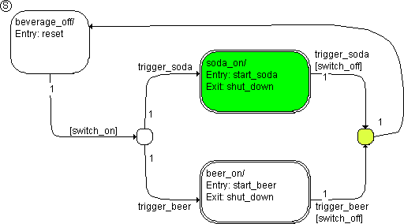

A trigger event trigger_soda occurs, the machine is switched off (switch_off is true). The following steps are executed:

1. The system checks to see if there is a valid transition or a segment from soda_on available.
1. The transition segment from soda_on to the junctions is valid, as the condition [switch_off] is fulfilled. As the trigger event trigger_soda has occurred, the segment from the junction in the state beverage_off is also valid, the transition can occur.
1. The necessary steps in the hierarchy state are executed.
1. The exit action shut_down of the state soda_on is executed.
1. The transition from soda_on to beverage_off has no transition action. Therefore, the state beverage_off is activated next.
1. The entry action reset of beverage_off is executed and completed.

With that, the evaluation of the state machine initiated by this trigger event is finished.

See also

[Example 8: Transitions from a Start State to Different Destination States (Multiple Triggers)](markdown/SM_Example_8__Transitions_from_a_Start_State_to_Different_Destination_States_(Multiple_Triggers).md)

---

## Semantics: Hierarchical State Machines

_Source: `markdown/SM_Hierarchical_State.md`_

# Hierarchical State Machines

Upon activation of the state machine, the conditions of the transitions are checked. The hierarchical order determines the priority. The highest hierarchical level has the highest priority, i.e. the conditions on transitions on upper hierarchy levels are checked first. When a hierarchy state is left, the current substates are left as well. The innermost substate is left first, the outermost hierarchy state is left last. When entering a hierarchy state, the order in which the entry actions are executed is from the outermost hierarchy state to the innermost (base) state, i.e. the outermost state is entered first, and the innermost is entered last. If no transition takes place, the static actions are executed in an outward sequence, i.e. the static action of the innermost substate is executed first, and the static action of the outermost hierarchy state is executed last.

The examples in this chapter assume no optimization of static actions in hierarchy states. If this optimization is activated, the semantics change, (see [Optimized for Code Size](file:/Koretd104854/Projects/BST2/QMS/TW_SS/Cresilla/ETAS/ASCET_V_5_2_Final _Data/State Machine Editor/SM_Actions_or_Conditions1.htm))

See also

[Optimized for Code Size](markdown/SM_Optimized_for_Code_Size.md)

[Example 10: Transition to a Hierarchy State Without History](markdown/SM_Example_10__Transition_to_a_Hierarchy_State_Without_History.md)

[Example 11: Transition to a Hierarchy State With History](markdown/SM_Example_11__Transition_to_a_Hierarchy_State_With_History.md)

[Example 12: Transition Within a Hierarchy State](markdown/SM_Example_12__Transition_Within_a_Hierarchy_State.md)

[Example 13: Transition Between Hierarchy States](markdown/SM_Example_13__Transition_Between_Hierarchy_States.md)

[Example 14: Loop](markdown/SM_Example_14__Loop.md)

[Example 15: Transition Between Substates of Different Hierarchies](markdown/SM_Example_15__Transition_Between_Substates_of_Different_Hierarchies.md)

[Example 16: Transition From a Substate to a Hierarchy State](markdown/SM_Example_16__Transition_From_a_Substate_to_a_Hierarchy_State.md)

[Example 17: No Transition](markdown/SM_Example_17__No_Transition.md)

---

## Example 10: Transition to a Hierarchy State Without History

_Source: `markdown/SM_Example_10__Transition_to_a_Hierarchy_State_Without_History.md`_

# Example 10: Transition to a Hierarchy State Without History

On entry into a hierarchical level, there are two possibilities: either entry into the start state of the hierarchy state (this example). In this case, the hierarchy state has forgotten the substate it has been in when it was left. Alternatively, the last active substate is entered. In this case, the hierarchy state has a history ([Example 11: Transition to a Hierarchy State With History](markdown/SM_Example_11__Transition_to_a_Hierarchy_State_With_History.md)).

For each hierarchy state it is possible to determine whether it has a history or not. When entering a hierarchy state with history for the first time, the start state of that hierarchy state is entered.

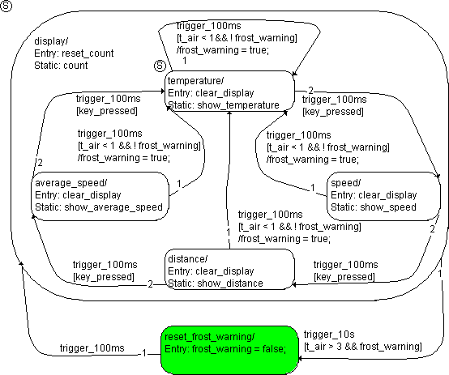

In the state display, this hierarchical state machine contains the display function from [Example 3: Loop](markdown/SM_Example_3__Loop.md). display is a hierarchy state. As soon as a temperature of 3 °C is exceeded, the frost warning is to be reset. The second state on the highest hierarchy level, reset_frost_warning, is used for that purpose. Every 10 seconds, a change from display to the reset_frost_warning state can occur, where the frost warning is switched off.

After the frost warning was displayed (frost_warning = true), the distance display was selected so that the system was in the distance state. The temperature rose to 5 °C, and the transition from display to reset_frost_warning took place when the trigger event trigger_10s occurred. The system is now in the reset_frost_warning state. A trigger event trigger_100ms occurs, and the following steps are performed:

1. The system checks to see if there is a valid transition from reset_frost_warning.
1. The transition from reset_frost_warning to display has no condition, it is therefore valid at every trigger_100ms trigger event.
1. The reset_frost_warning state has no exit action. It is deactivated.
1. The transition from reset_frost_warning to display has no transition action, and the display hierarchy state is activated next.
1. The reset_count entry action of the display hierarchy state is executed and completed.
1. The temperature substate is the start state in the hierarchy. It is activated.
1. The entry action clear_display of the temperature substate is executed and completed.

With that, the evaluation of the state machine initiated by the trigger_100ms trigger event is finished.

See also

[Example 11: Transition to a Hierarchy State With History](markdown/SM_Example_11__Transition_to_a_Hierarchy_State_With_History.md)

[Example 3: Loop](markdown/SM_Example_3__Loop.md)

---

## Example 11: Transition to a Hierarchy State With History

_Source: `markdown/SM_Example_11__Transition_to_a_Hierarchy_State_With_History.md`_

# Example 11: Transition to a Hierarchy State With History

The state machine is the same as in [Example 10: Transition to a Hierarchy State Without History](markdown/SM_Example_10__Transition_to_a_Hierarchy_State_Without_History.md). Now it has a history. The starting state is the same as in the previous example.

After the frost warning was displayed (frost_warning = true), the velocity display was selected so that the system was in the speed state. The temperature rose to 5 °C, and the transition from display to reset_frost_warning took place when the trigger event trigger_10s occurred.

The system is now in the reset_frost_warning state. A trigger event trigger_100ms occurs, and the following steps are performed:

1. The system checks to see if there is a valid transition from reset_frost_warning.
1. The transition from reset_frost_warning to display has no condition, it is therefore valid at every trigger_100ms trigger event.
1. The reset_frost_warning state has no exit action. It is deactivated.
1. The transition from reset_frost_warning to display has no transition action, and the display hierarchy state is activated next.
1. The reset_count entry action of the display hierarchy state is executed and completed.
1. Since display has a history ('H' in the above figure), the speed substate is activated. That state was active when the hierarchy state was left.
1. The entry action clear_display of the speed substate is executed and completed.

With that, the evaluation of the state machine initiated by the trigger_100ms trigger event is finished.

See also

[Example 10: Transition to a Hierarchy State Without History](markdown/SM_Example_10__Transition_to_a_Hierarchy_State_Without_History.md)

---

## Example 12: Transition Within a Hierarchy State

_Source: `markdown/SM_Example_12__Transition_Within_a_Hierarchy_State.md`_

# Example 12: Transition Within a Hierarchy State

If a transition takes place inside a hierarchy state, the state machine remains in that hierarchy state. Therefore, the static action of the hierarchy state is executed, as well as the static actions of all hierarchy states that contain the state in question. They are executed after all exit actions, and before the transition action, from the innermost hierarchy state to the outermost one.

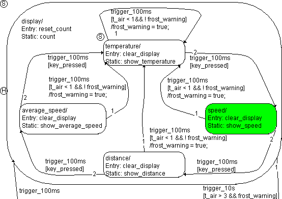

The state machine is the same as in [Example 11: Transition to a Hierarchy State With History](markdown/SM_Example_11__Transition_to_a_Hierarchy_State_With_History.md). The state machine is in the speed state. The temperature is still 5 °C, the frost warning is switched off (frost_warning is false). A trigger event trigger_100ms occurs, the switch is pressed (key_pressed is true). The following steps are executed:

1. The system checks to see if there is a valid transition.
1. The transition from the display hierarchy state to reset_frost_warning is initiated by another trigger (trigger_10s); it is of no importance here.
1. The transition from speed to the distance substate is evaluated. The condition [key_pressed] is fulfilled, the transition is valid.
1. The speed state has no exit action. It is deactivated.
1. The display hierarchy state is not left. Therefore, its static action count is executed and completed.
1. The transition from speed to distance has no transition action, and the distance substate is activated.
1. The entry action clear_display of the distance substate is executed and completed.

With that, the evaluation of the state machine initiated by the trigger_100ms trigger event is finished.

See also

[Example 11: Transition to a Hierarchy State With History](markdown/SM_Example_11__Transition_to_a_Hierarchy_State_With_History.md)

---

## Example 13: Transition Between Hierarchy States

_Source: `markdown/SM_Example_13__Transition_Between_Hierarchy_States.md`_

# Example 13: Transition Between Hierarchy States

This state machine acts as a data generator. When enable is set to true, a signal is produced, either a ramp (state ramp, mode = 1) or a sine (state sinus, mode = 2).

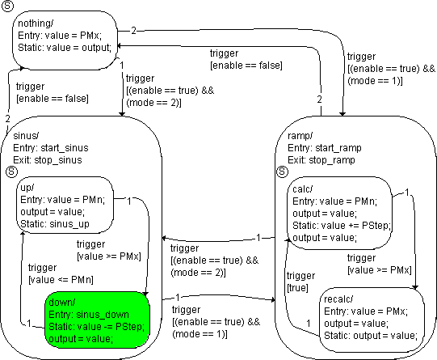

The down substate in the sinus hierarchy state is active. The signal mode is set to 1, enable remains true. A trigger event occurs, and the following steps are performed:

1. The system checks to see if there is a valid transition. Since the transitions from the sinus hierarchy state have higher priorities than those from down, they are evaluated first.
1. The transition from sinus to nothing has the highest priority. It is invalid, though, because the condition [enable == false] is not fulfilled.
1. The transition from sinus to ramp is evaluated next. The condition [(enable ==true) && (mode == 1)] is true, the transition takes place.

The transition from the down substate to the up substate has the lowest priority and is not evaluated.

1. The down substate has no exit action, it is deactivated immediately.
1. The exit action stop_sinus of the sinus hierarchy state is executed and completed.
1. The sinus hierarchy state is deactivated.
1. The transition from sinus to ramp has no transition action, therefore the ramp hierarchy state is activated next.
1. The entry action start_ramp of ramp is executed and completed.
1. The calc substate is the start state within the hierarchy. It is activated.
1. The entry action value = PMn, output = value, of calc is executed and completed.

With that, the evaluation of the state machine initiated by this trigger event is finished.

---

## Example 14: Loop

_Source: `markdown/SM_Example_14__Loop.md`_

# Example 14: Loop

The source and destination states of a transition can be identical. Such loops are frequently used to specify the reset function of a hierarchy state.

The ramp hierarchy state from the state machine in [Example 13: Transition Between Hierarchy States](markdown/SM_Example_13__Transition_Between_Hierarchy_States.md) has now a reset function in the form of a loop, i.e. a transition from ramp to itself. The rest of the state diagram is left out for clarity.

The recalc substate in the ramp hierarchy state is active. A trigger event occurs, the reset button is pressed (reset_ramp = true). enable and mode remain unchanged. The following steps are executed:

1. The system checks to see if there is a valid transition.
1. The loop has the highest priority. The condition [reset_ramp] is fulfilled, the transition is valid.

Other transitions are not evaluated.

1. The recalc substate has no exit action, it is deactivated immediately.
1. The exit action stop_ramp of the ramp hierarchy state is executed and completed.
1. The ramp hierarchy state is deactivated.
1. The loop's transition action /reset is executed and completed.
1. The ramp hierarchy state is re-activated.
1. The entry action start_ramp of ramp is executed and completed.
1. The calc substate is the start state within the hierarchy. It is activated.
1. The entry action of calc is executed and completed.

With that, the evaluation of the state machine initiated by this trigger event is finished.

See also

[Example 13: Transition Between Hierarchy States](markdown/SM_Example_13__Transition_Between_Hierarchy_States.md)

---

## Example 15: Transition Between Substates of Different Hierarchies

_Source: `markdown/SM_Example_15__Transition_Between_Substates_of_Different_Hierarchies.md`_

# Example 15: Transition Between Substates of Different Hierarchies

Transitions can lead directly from the substate of one hierarchy state to the substate of another hierarchy state.

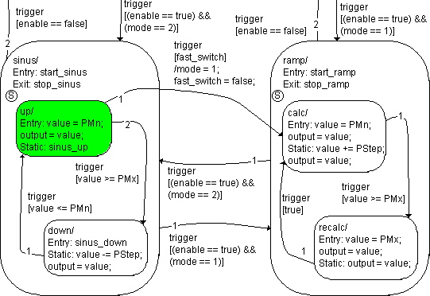

This state machine is the same as the one in [Example 13: Transition Between Hierarchy States](markdown/SM_Example_13__Transition_Between_Hierarchy_States.md), only the transition from the up substate in sinus to the substate calc in ramp was added.

The up substate in the sinus hierarchy state is active. The value value is lower than the maximum PMx. A trigger event occurs. mode remains 2, and enable remains true, but the fast-switch is pressed (fast_switch = true). The following steps are executed:

1. The system checks to see if there is a valid transition.
1. The transitions from sinus to nothing and from sinus to ramp are evaluated first. They are both invalid because the associated conditions are not fulfilled.
1. The transition from substate up to substate down is evaluated next. It is invalid, too, because the condition [value >= PMx] is not fulfilled.
1. The transition from up to the calc substate has the lowest priority and is evaluated last. The condition [fast_switch] is true, the transition takes place.
1. The up substate has no exit action, it is deactivated immediately.
1. The exit action stop_sinus of the sinus hierarchy state is executed and completed.
1. The sinus hierarchy state is deactivated.
1. The transition action (/mode = 1, fast_switch = false) is executed and completed.
1. The ramp hierarchy state is activated.
1. The entry action of ramp is executed and completed.
1. The calc substate is activated.
1. The entry action of calc is executed and completed.

With that, the evaluation of the state machine initiated by this trigger event is finished.

See also

[Example 13: Transition Between Hierarchy States](markdown/SM_Example_13__Transition_Between_Hierarchy_States.md)

---

## Example 16: Transition From a Substate to a Hierarchy State

_Source: `markdown/SM_Example_16__Transition_From_a_Substate_to_a_Hierarchy_State.md`_

# Example 16: Transition From a Substate to a Hierarchy State

If the transition from a substate does not lead to another substate, but to the hierarchy state, the procedure is almost the same. The substate is left, the hierarchy state is left, too, and immediately re-entered. Depending on whether the hierarchy state has a history, either the most recently activated substate or the start state of the hierarchy is entered. This is another way to realize, for example, the frost warning.

The state machine is very similar to the [Example 10: Transition to a Hierarchy State Without History](markdown/SM_Example_10__Transition_to_a_Hierarchy_State_Without_History.md), except that here, the frost warning is implemented using transitions to the parent hierarchy state. It is in the distance state. frost_warning is false. A trigger event trigger_100ms occurs, the temperature drops to 0.5 °C. The switch is not pressed. The following steps are executed:

1. The system checks to see if there is a valid transition from distance.
1. Another trigger initiates the transition from display to reset_frost_warning, it is of no importance here.
1. The transition from distance to average_speed is evaluated. The condition [key_pressed] is not fulfilled, the transition is invalid.
1. The transition from distance to display has the condition [t_air < 1 && !frost_warning]. Both parts of the condition are true, the transition is valid.
1. The distance state has no exit action. It is deactivated.
1. The display hierarchy state has no exit action. It is deactivated.
1. The display hierarchy state is activated again.
1. The reset_count entry action of display is executed and completed.
1. The /frost_warning = true transition action is executed, and the frost warning appears.
1. The temperature substate is the start state in the hierarchy. It is activated as display does not have a history.
1. The entry action clear_display of temperature is executed and completed.

With that, the evaluation of the state machine initiated by the trigger_100ms trigger event is finished.

See also

[Example 10: Transition to a Hierarchy State Without History](markdown/SM_Example_10__Transition_to_a_Hierarchy_State_Without_History.md)

---

## Example 17: No Transition

_Source: `markdown/SM_Example_17__No_Transition.md`_

# Example 17: No Transition

The state machine is the same as in [Example 16: Transition From a Substate to a Hierarchy State](markdown/SM_Example_16__Transition_From_a_Substate_to_a_Hierarchy_State.md). The state machine is in the temperature state. The temperature is unchanged. A trigger event trigger_100ms occurs, the switch is not pressed (key_pressed is false). The following steps are executed:

1. The system checks to see if there is a valid transition.
1. Another trigger initiates the transition from display to reset_frost_warning, it is of no importance here.
1. The transition from temperature to speed is invalid because the switch was not pressed.
1. The transition from temperature to display is invalid because frost_warning = true and thus the condition is false.

There are no other possible transitions available.

1. The static action show_temperature in the temperature substate is executed and completed.
1. The static action count in the hierarchy state display is executed and completed.

With that, the evaluation of the state machine initiated by the trigger_100ms trigger event is finished.

See also

[Example 16: Transition From a Substate to a Hierarchy State](markdown/SM_Example_16__Transition_From_a_Substate_to_a_Hierarchy_State.md)

---

## Initialization of the State Diagram

_Source: `markdown/SM_Initialization_of_the_State_Diagram.md`_

# Initialization of the State Diagram

The start state of the system is activated. If the start state is a hierarchy state, the start state within the hierarchy is also activated. No entry action is executed.

---

## Entering a State

_Source: `markdown/SM_Entering_a_State.md`_

# Entering a State

1. If the state has an inactive higher-level state, steps 1–4 are executed for that state.
1. The state is activated.
1. The entry action is executed.
1. Carry out implicit entry actions as necessary:

1. If the state contains a subordinate diagram with a history, and if one of the substate was active after initialization, this substate is activated and its entry action executed.
1. If the state contains a subordinate diagram with a history, and if one of the substate was active after initialization, this substate is activated and its entry action executed. Otherwise, proceed as described in 4.a.

---

## Executing a (Basis) State

_Source: `markdown/SM_ExecuteBasisState.md`_

# Executing a (Basis) State

1. The transitions leading away from the state and transitions leading out of higher-level states are evaluated in order of their priority.
1. If a valid transition is found, it is executed. This ends the execution of the state.
1. If no valid transition from the state is available, the static action is executed.
1. If the state has higher-level states, their static actions are executed.

---

## Leaving a State

_Source: `markdown/SM_Leaving_a_State.md`_

# Leaving a State

1. If the state contains active substates, their exit actions are executed. The exit action of the innermost basis state is executed first.
1. The exit action of the state is executed.
1. The state is deactivated.

---

## Executing a Transition

_Source: `markdown/SM_Executing_a_Transition.md`_

# Executing a Transition

The transitions are evaluated in the order of their priority. Transitions from a hierarchy state always have a higher priority than transitions from the substates of this hierarchy state.

1. A transition or transition segment is tested.
1. If the transition/segment is invalid, the transition/segment with the next-lowest priority is tested.
1. If the transition/segment is valid, the next step depends on where the transition/segment ends.

In a state:

1. No additional transitions or transition segments are tested. In the case of a transition segment from a junction, the segment is pulled in to the junction in question to obtain a complete transition.
1. The substates of the start state are left (see [Leaving a State](markdown/SM_Leaving_a_State.md)).
1. The start state is left.
1. The transition action is executed.
1. The system enters the destination state (see [Entering a State](markdown/SM_Entering_a_State.md))

In a junction:

The transition segments leading away from the junction are evaluated as described in steps 1 – 3.

1. If all the transition segments leading away from a junction are invalid, the system returns to the start state from which the junction was reached. As the segment in the junctions does not belong to any valid transition, steps 1 – 4 are executed for the transition/segment with the next-lowest priority.
1. If all of the transitions/segments leading away from a state are valid, then no transition occurs and the system remains in the state.

See also

[Leaving a State](markdown/SM_Leaving_a_State.md)

[Entering a State](markdown/SM_Entering_a_State.md)

---

## Experimenting with State Machines

_Source: `markdown/SM_experiment_with_state_machines.md`_

# Experimenting with State Machines

You can experiment with a state machine in the same way as with any other component. To start the offline experimentation environment for a state machine, perform the same steps as outlined in [Analyzing Components](BlockDiagramEditorEnglishUS.chm::/AnalyzingComponents.htm).

Setting up the experimentation environment also works in the same way for all kinds of components and is described in [Experimentation Environment](ExperimentationEnglishUS.chm::/EE_Overview.htm). The state machine editor offers state machine animation as an additional feature.

You can look at individual states or transitions while the experiment is running.

You can reset the state machine to its original state while the experiment is running.

See also

[Analyzing Components](BlockDiagramEditorEnglishUS.chm::/AnalyzingComponents.htm)

[Experimentation Environment - Overview](ExperimentationEnglishUS.chm::/EE_Overview.htm)

[Analyzing a Diagram](markdown/analyze_diagram.md)

[Using the State Machine Animation Feature](markdown/using-statemachine.md)

[Changing the Animation Color](markdown/animation_color.md)

[Displaying Information about States or Transitions](markdown/SM_display_info.md)

[Resetting the State Machine](markdown/SM_resetting.md)

---

## State Machines as Classes

_Source: `markdown/SM_State_Machines_as_Classes.md`_

# State Machines as Classes

A state machine is a class with special description means. The trigger, condition and actions are modelled as special methods:

- A trigger is a public method without a return value. The state machine is executed whenever a trigger is started.
- A condition is a private method with a return value of type logical.
- An action is a private method. An action has, as standard, no arguments and no return value.

If necessary, you can add arguments to any of these methods, for communication with other ASCET components. You can also add a return value to an action. However, such an action can no longer be assigned in an <action> tab of the state or transition editor. If the action was already assigned before you added the return value, it remains assigned, but a warning is issued during code generation.

Inputs and outputs serve for the integration of the state machine with other components. The input values are buffered to internal variables and can therefore be used in all computations of the state machine (in contrast to arguments of a method, those can only be used in the method itself). The outputs are also buffered, so they can be read without invoking the computation of the state machine. Each input and output needs its own sequence call (see [Sequence Calls](BlockDiagramEditorEnglishUS.chm::/BDE_SequenceCalls.htm)).

This type of external communication is, however, memory intensive as a variable must be reserved in the RAM for each input and output. To reduce the static RAM requirement, you can add arguments to the triggers (and to arguments and conditions, if these are specified in a separate diagram), see [Trigger Arguments for External Communication](markdown/SM_Trigger_Arguments_for_Communication.md).

See also

[Trigger Arguments for External Communication](markdown/SM_Trigger_Arguments_for_Communication.md)

[Rules for Trigger Arguments](markdown/SM_Rules_for_Trigger_Arguments.md)

[Block Diagram Editor - Sequence Calls](BlockDiagramEditorEnglishUS.chm::/BDE_SequenceCalls.htm)

---

## Trigger Arguments for External Communication

_Source: `markdown/SM_Trigger_Arguments_for_Communication.md`_

# Trigger Arguments for External Communication

You can use trigger arguments for external communication. Stack variables which do not burden the static RAM are created for the arguments of a C function. The dynamic RAM area is burdened temporarily.

You should always keep the following points in mind:

- Triggers are public methods. Their arguments can be described outside of the state machines. In the Layout Editor, the trigger arguments are represented by black argument connections.
- You can use classes (except CT blocks) as complex trigger arguments. However, a state machine with complex trigger argument cannot be stimulated in an experiment.

If a trigger argument is to be used in an action or condition specified as a block diagram, an argument of the same type and the same name as the trigger argument must be added to each corresponding method.

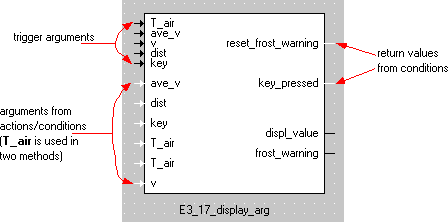

The arguments are depicted according to their name and their type. If, in the trigger and the action/condition, there are arguments with the same names but with different types, a warning is issued. If the argument is only defined in an action or a condition but not in the opening trigger, an error message is output.

The rules for using trigger arguments are described here: [Rules for Trigger Arguments](markdown/SM_Rules_for_Trigger_Arguments.md)

---

## Rules for Trigger Arguments

_Source: `markdown/SM_Rules_for_Trigger_Arguments.md`_

# Rules for Trigger Arguments

The following rules for the use of trigger arguments in actions and conditions.

- All trigger arguments which are to be used in the entry action of a state must be defined in the action and in every trigger belonging to the transition leading into the state, as it will be started by these triggers.
- All trigger arguments which are to be used in the exit action of a state must be defined in the action and in every trigger belonging to the transition leading out of the state, as it will be started by these triggers.
- All trigger arguments which are to be used in the static action of a state must be defined in the action and in each trigger of the state machine. Each trigger event which does not cause a transition from the active state, starts the execution of its static action.
- You must define all trigger arguments which are to be used in the condition or transition action of a transition, in the action/condition and in the triggers belonging to the transition, as it will be started by this trigger.

If one of these rules is violated, an error message is issued.

See also

[Communication with Other Components](markdown/communications_components.md)

[Adding a Trigger Argument](markdown/adding_triggerargument.md)

[Adding Arguments to Conditions/Actions](markdown/adding_arguments.md)

---

## Public Methods

_Source: `markdown/SM_public_methods.md`_

# Public Methods

You have the option of specifying public methods in a separate diagram. You can open these methods from within the state machine as well as from other components.

See also

[Creating a Public Diagram](markdown/SM_create_public_diagram.md)

[Adding a Public Method](markdown/add_public_method.md)

[Using a Public Method for External Communication](markdown/using_pm_external.md)

[Using Public Methods in Actions and Conditions](markdown/use_pm_actions.md)

---

## Optimizing the State Machine

_Source: `markdown/SM_Optimizing_the_State_Machine.md`_

# Optimizing the State Machine

Usually, there are several ways to specify the same functionality or to adjust the code generation/build process settings.

When code is generated for a state machine, parts of actions and conditions specified at the state or transition are either inserted on the spot (inlining) or—on certain conditions—generated as separate methods (outlining). The prerequisites for outlining are:

1. The state machine optimization option Outline Generated Methods (may be changed locally) is activated in the Project Properties window, Statemachine node, of the project that contains the state machine.

This options applies to all state machines contained in the project, and to all experiments (physical, quantized, implemented).

1. The option Outline automatically generated methods for State Machines is activated in the implementation editor of the state machine.

When the first prerequisite is not met, outlining is not done for any state machine in the project.

When the first prerequisite is met, but not the second, outlining is not done for this particular state machine.

If both prerequisites are met, code size with and without outlining is checked during code generation. If code with outlining is smaller, outlining is done.

If actions and conditions (or parts thereof) are specified in separate diagrams, the corresponding code is either generated in separate private methods (outlining), or it is inserted on the spot automatically during code generation (auto-inlining).

The following prerequisites must be met so that auto-inlining can take place:

1. The state machine optimization option Auto-inline private methods (Smaller code-size - may be changed locally) is activated in the Project Properties window, [Statemachine](ProjectEditorEnglishUS.chm::/PE_Statemachine_Options_Window.htm) node, of the project that contains the state machine.

This options applies to all state machines contained in the project, and to all experiments (physical, quantized, implemented).

1. The option Auto-inline private methods (Smaller code-size) is activated in the implementation editor of the state machine.

When the first prerequisite is not met, auto-inlining is not done for any state machine in the project.

When the first prerequisite is met, but not the second, auto-inlining is not done for this particular state machine.

If both prerequisites are met, code size with and without auto-inlining is checked during code generation. If code with auto-inlining is smaller, auto-inlining is selected. This is usually the case for small private functions, or for functions with only a few calls. Each function is checked separately, so that only those functions are inlined whose inlining saves code size.

Depending on the possibilities you choose, you can optimize a state machine under three aspects:

- Response time
- Runtime
- Code size

See also

[Optimized for Response Time](markdown/SM_Optimized_for_Response_Time.md)

[Optimized for Run Time](markdown/SM_Optimized_for_Run_Time.md)

[Optimized for Code Size](markdown/SM_Optimized_for_Code_Size.md)

[Project Editor - Statemachine Node](ProjectEditorEnglishUS.chm::/PE_Statemachine_Options_Window.htm)

---

## Optimized for Response Time

_Source: `markdown/SM_Optimized_for_Response_Time.md`_

# Optimized for Response Time

If response time is the most important criterion, take advantage of the hierarchical structure and the transition priorities. Speed-critical actions are best built into the highest possible hierarchical level to produce efficient code and the quickest possible reaction.

This is illustrated by an example:

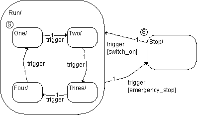

If the emergency stop button is pressed (emergency_stop = true), the system should stop as fast as possible, i.e. reach the Stop state. By drawing the associated transition from the Run hierarchy state to the Stop state, the transition has the highest priority in the hierarchy and is evaluated first.

If any of the substates is active and the emergency button is pressed, the transition from Run to Stop is always evaluated and the transition occurs.

Direct transitions from each of the substates to Stop are as efficient regarding time, but they require higher maintenance effort because four transitions are specified instead of one.

A separate trigger for time-critical events (emergency_stop = true in the example) also optimizes response time. The drawback is additional program code for the separate trigger.

See also

[Optimizing the State Machine](markdown/SM_Optimizing_the_State_Machine.md)

---

## Optimized for Run Time

_Source: `markdown/SM_Optimized_for_Run_Time.md`_

# Optimized for Run Time

If the total runtime is the most important criterion, you can use several optimization possibilities, individually or in combination, to generate efficient code.

See also

[Runtime Optimization - Actions or Conditions](markdown/SM_Actions_or_Conditions.md)

[Runtime Optimization - Junctions](markdown/SM_Junctions_1.md)

---

## Actions or Conditions

_Source: `markdown/SM_Actions_or_Conditions.md`_

# Runtime Optimization - Actions or Conditions

If actions or conditions are specified with partly or totally the same functionality, this can be done either runtime-optimized or size-optimized. Runtime-optimized means that the code for each action and condition is inserted on the spot during code generation. No additional function call is required. The disadvantage is the repeatedly generated code and thus increased memory requirement.

This can be achieved by specifying the code explicitly at the state or condition and deactivating the options Outline Generated Methods (may be changed locally) and Outline automatically generated methods for State Machines (see prerequisites for outlining in [Optimizing the State Machine](markdown/SM_Optimizing_the_State_Machine.md)).

The optimization becomes even more effective if auto-inlining (see [Optimizing the State Machine](markdown/SM_Optimizing_the_State_Machine.md)) is activated. In that case, even actions/conditions specified in separate diagrams are inserted on the spot, if applicable.

With the Inline option in the implementation editor of an action/condition specified in a separate diagram, you can enforce inlining.

See also

[Optimizing the State Machine](markdown/SM_Optimizing_the_State_Machine.md)

---

## Junctions

_Source: `markdown/SM_Junctions_1.md`_

# Runtime Optimization - Junctions

If several transitions with partially identical conditions lead away from a state, the use of junctions can bring runtime savings. Identical sections of the conditions are assigned to the transition segment from the start state in the first junction. If these are not fulfilled, the other segments are not evaluated.

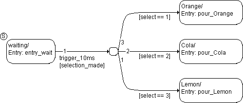

---

## Optimized for Code Size

_Source: `markdown/SM_Optimized_for_Code_Size.md`_

# Optimized for Code Size

Optimizing the code size contains the following options:

- [Actions or Conditions](markdown/SM_Actions_or_Conditions1.md)
- [Static Actions of Hierarchy States](markdown/Static_actions_of_hierarchy_states_1.md)
- [Example 1: Code Generation](markdown/SM_Example_1_CodeGeneration.md)
- [Example 2: Error Generation](markdown/SM_Example_2_Static_action_of_Hierarchy_States.md)
- [Hierarchical Code Generation](markdown/SM_Hierarchical_Code_Generation.md)
- [Example 1:Hierarchical Code Generation](markdown/SM_Hierarchical_Code_Generation_Exapmle_1.md)
- [Triggers and Trigger Arguments](markdown/SM_Triggers_and_trigger_arguments.md)

---

## Actions or Conditions

_Source: `markdown/SM_Actions_or_Conditions1.md`_

# Actions or Conditions

Actions/Conditions

Optimizing actions or conditions for code size means that identical parts of actions/conditions are generated as separate private functions that are called at need.

This can be achieved by specifying the repeatedly used parts as methods in a separate diagram, which are then called from the actions (see figure).

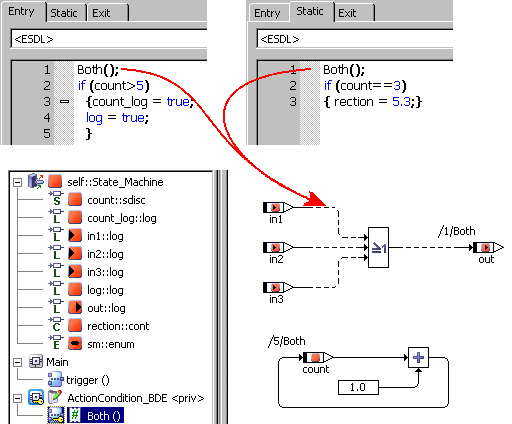

As an alternative, you can enter the code directly at the state or transition and use the outlining functionality.

For both alternatives, the code is generated only once. The price to be paid are additional function calls.

In some cases (small private functions, few calls), it may be advantageous, regarding code size, to insert the code on the spot. You can activate auto-inlining (see [Optimizing the State Machine](markdown/SM_Optimizing_the_State_Machine.md)) with the Auto-inline private methods (Smaller code-size - may be changed locally) and Auto-inline private methods (Smaller code-size) options, with that, you have selected the most effective optimization of actions and conditions for code size.

See also

[Optimizing the State Machine](markdown/SM_Optimizing_the_State_Machine.md)

---

## Static Actions of Hierarchy States

_Source: `markdown/Static_actions_of_hierarchy_states_1.md`_

# Static Actions of Hierarchy States

For static actions in hierarchy states, an additional optimization option exists.

By default, code for the static action of a hierarchy state is generated for each transition that does not lead out of the hierarchy, as well as once for each substate of the hierarchy. In large hierarchies, this can result in a noticeable part of the entire code.

If you activate the Optimize Static Actions (Restricted Modeling) code optimization option in the project that contains the state machine, code for the static action of a hierarchy state is generated only once for each substate. Thus, code size can be reduced.

A disadvantage of this optimization is that it does not work for some models. If a state machine contains a substate with a direct transition out of its hierarchy state, this transition must have the highest priority of all transitions from that substate. Otherwise, code generation aborts with the following error message:

ERROR(YSm72): higher priority transitions do not exit hierarchy state <state name>, but this transition does.

The changes in code generation change the state machine semantics as follows:

- The static action of the hierarchy state is executed before the conditions of the transitions from the substate are evaluated.
- If no transition occurs, the static action of the hierarchy state is executed before the static action of the substate.
- If a transition occurs, the static action of the hierarchy state is executed before the exit action of the substate.

The changes can alter the behavior of the state machine. If you activate the option for an existing state machine, check its behavior carefully.

Two examples illustrate the effect of this optimization. In both examples, the state machine consists of the base state OuterEnd and the hierarchy state HState with the substates Start and InnerState1. Two transitions leave Start, one of them (Start to OuterEnd) also leaves the hierarchy state HState.

[Example 1: Code Generation](markdown/SM_Example_1_CodeGeneration.md)

[Example 2: Error Generation](markdown/SM_Example_2_Static_action_of_Hierarchy_States.md)

---

## Example 1: Code Generation

_Source: `markdown/SM_Example_1_CodeGeneration.md`_

# Example 1: Code Generation

In the first example, the transition from the inner state Start to OuterEnd has a higher priority than the transition from Start to InnerState1. This means that code can be generated both with activated and deactivated Optimize Static Actions (Restricted Modeling) option.

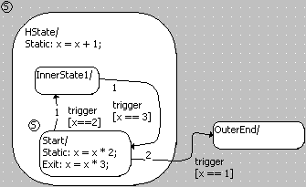

The following table shows an extract of the generated C code (ANSI-C target, Object Based Controller Physical) for both cases. Code for the static action of HState is set in boldface.

| Column 1 | Column 2 |
| --- | --- |
| Option deactivated | Option activated |
| switch (_sm) { case InnerState1: if (_x == 3.0F) { _x = _x + 1.0F; _sm = Start; break; } _x = _x + 1.0F; break; case OuterEnd: break; case Start: default: if (_x == 1.0F) { _x = _x * 3.0F; _sm = OuterEnd; break; } if (_x == 2.0F) { _x = _x * 3.0F; _x = _x + 1.0F; _sm = InnerState1; break; } _x = _x * 2.0F; _x = _x + 1.0F; break; } | switch (_sm) { case InnerState1: _x = _x + 1.0F; if (_x == 3.0F) { _sm = Start; break; } break; case OuterEnd: break; case Start: default: if (_x == 1.0F) { _x = _x * 3.0F; _sm = OuterEnd; break; } _x = _x + 1.0F; if (_x == 2.0F) { _x = _x * 3.0F; _sm = InnerState1; break; } _x = _x * 2.0F; break; } |

---

## Example 2: Error Generation

_Source: `markdown/SM_Example_2_Static_action_of_Hierarchy_States.md`_

# Example 2: Error Generation

In the second example, the transition from State to OuterEnd has a lower priority. With activated Optimize Static Actions (Restricted Modeling) option, code cannot be generated.

| Column 1 | Column 2 |
| --- | --- |
| Option deactivated | Option activated |
| switch (_sm) { case InnerState1: if (_x == 3.0F) { _x = _x + 1.0F; _sm = Start; break; } _x = _x + 1.0F; break; case OuterEnd: break; case Start: default: if (_x == 2.0F) { _x = _x * 3.0F; _x = _x + 1.0F; _sm = InnerState1; } if (_x == 1.0F) { _x = _x * 3.0F; _sm = OuterEnd; break; } _x = _x * 2.0F; _x = _x + 1.0F; break; } | ERROR(YSm72): higher priority transitions do not exit hierarchy state "HState", but this transition does. |

---

## Hierarchical Code Generation

_Source: `markdown/SM_Hierarchical_Code_Generation.md`_

# Hierarchical Code Generation

Two possibilities exist to generate code for a hierarchical state machine:

With flat code generation, the hierarchy is flattened, i.e. a single switch statement is generated for all (basis) states and transitions.

With hierarchical code generation, several switch statements are generated, nested according to the hierarchy. To activate this kind of code generation, the following options must be activated:

1. Project settings, Statemachine node: Hierarchical Code Generation (may be changed locally)
1. Implementation editor of the state machine, Settings tab:Hierarchical code generation for State Machines

When the first option is not activated, no hierarchical code generation is done. When the first option is activated , the second option activates/deactivates hierarchical code generation for a particular state machine.

With hierarchical code generation, code for transitions from hierarchy states is generated only once, instead of once for each affected basis state with flat code generation. Thus, code size is reduced. The reduction can be considerable (up to 30%). In the experiment, hierarchical and flat code generation behave identical for identical state machines.

For hierarchy states without transitions and/or static actions, code size is not reduced, but slightly (1–2%) increased.

See also

[Hierarchical Code Generation - Example](markdown/SM_Hierarchical_Code_Generation_Exapmle_1.md)

---

## Hierarchical Code Generation - Example

_Source: `markdown/SM_Hierarchical_Code_Generation_Exapmle_1.md`_

# Hierarchical Code Generation - Example

An example illustrates the difference in the generated code.

The reduced code size does not show in the generated C file, but in the generated executable file.

Code was generated with the PC target, for Physical experiment. The transition from top_1 to top_2 is set in boldface.

| Column 1 | Column 2 |
| --- | --- |
| Hierarchical Code Generation | Flat Code Generation |
| switch (self-> _ASCET_smLevel_0->val) { case top_2 : { if (self->log_t->val) { self->x->val = 0.0; self-> _ASCET_smLevel_0->val = top_1; self->sm->val = middle_1; break; } break; } case top_1 : default: { if (!self->log_t->val) { self->x->val = -1.0; self-> _ASCET_smLevel_0->val = top_2; self->sm->val = top_2; break; } switch (self->sm->val) { case middle_2 : { if (!self->log_m->val) { self->x->val = self->x->val + 1.0; self->sm->val =middle_1; break; } self->x->val = self->x->val + 1.0; break; } case middle_1 : default: { if (self->log_m->val) { self->x->val = self->x->val + 1.0; self->sm->val = middle_2; break; } self->y->val = self->y->val + 1.0; self->x->val = self->x->val + 1.0; break; } } break; } } | switch (self->sm->val) { case middle_2 : { if (!self->log_t->val) { self->x->val = -1.0; self->sm->val = top_2; break; } if (!self->log_m->val) { self->x->val = self->x->val + 1.0; self->sm->val = middle_1; break; } self->x->val = self->x->val + 1.0; break; } case top_2 : { if (self->log_t->val) { self->x->val = 0.0; self->sm->val = middle_1; break; } break; } case middle_1 : default: { if (!self->log_t->val) { self->x->val = -1.0; self->sm->val = top_2; break; } if (self->log_m->val) { self->x->val = self-> x->val + 1.0; self->sm->val = middle_2; break; } self->y->val = self->y-> val + 1.0; self->x->val = self->x->val + 1.0; break; } } |

---

## Triggers and Trigger Arguments

_Source: `markdown/SM_Triggers_and_trigger_arguments.md`_

# Triggers and Trigger Arguments

If trigger arguments are used for communication with other ASCET components, instead of inputs and outputs, the static RAM requirements are reduced. You can find more information on this in [State Machines as Classes](markdown/SM_State_Machines_as_Classes.md).

See also

[State Machines as Classes](markdown/SM_State_Machines_as_Classes.md)

---

## Creating a State Machine

_Source: `markdown/SM_creating_new.md`_

# Creating a State Machine

To create a new state machine, proceed as follows:

1. In the Component Manager, select a folder for the new state machine.
1. Do one of the following:
1. Enter a name for the state machine.
1. Do one of the following:

- In the menu bar, point to Edit menu and select Open Component.
- Press Return.
- In the 1 Database list, double-click on the state machine name.

The state machine editor opens.

By default, the state diagram is open and the operator buttons on the toolbar are disabled. A state diagram does not contain operators.

See also

[Laying Out the States for the Diagram](markdown/layout_states.md)

[Defining the Starting State](markdown/SM_Define_StartState.md)

[Editing a State](markdown/editing_state.md)

[Renaming States](markdown/renaming_state.md)

[Representing States in Color](markdown/SM_representing_colors.md)

[Copying a State Layout](markdown/copy_statelayout.md)

[Creating Junctions](markdown/creating_junctions.md)

[Reserved Keywords](introductionenglishus.chm::/INT_Reserved_Keywords.htm)

---

## Specifying a Reinitialization Method for State Variables

_Source: `markdown/sm_specifyresetmethod_statevariables.md`_

| Column 1 |
| --- |
| Example for state variables initialization code: void STATE_MACHINE_reInit(struct STATE_MACHINE_Obj *self) { self->sm->val = state; /* state variable */ self->_ASCET_history_state_1->val = state; /* history variable /* self->_ASCET_smLevel_0->val = state; /* state var. f. hierarchical codegen */ } |

# Specifying a Reinitialization Method for State Variables

To specify a reinitialization method for the state variables, proceed as follows.

1. [Open the signature editor](BlockDiagramEditorEnglishUS.chm::/EditMethod.htm) for the trigger, action, condition or method you want to use as reinitialization method.
1. In the Settings tab, activate the Reinitialize option.
1. Confirm with Set the flag to activate Reinitialize for the current method and deactivate the option for the method <name>.
1. Make sure that the reinitialization method contains no return value.
1. Close the signature editor with OK.

When the reinitialization method is called, the [initialization code](javascript:kadovTextPopup(this))<!-- kadovTextPopupInit('a1'); //--> is executed. This is the only way to reset the history variable.

See also

[State Variables](markdown/SM_StateVariables.md)

[Editing the Signature of a Method or Process](BlockDiagramEditorEnglishUS.chm::/EditMethod.htm)

[Settings Tab](BlockDiagramEditorEnglishUS.chm::/BDE_SettingsTab.htm)

/* Heikki Komulainen, Comet Computer GmbH 2004 */ cc_plus_pic = '&nbsp;'; cc_minus_pic = '&nbsp;'; cc_stat_pic = '&nbsp;'; gpstyle = ''; var iframes_created = 0; if (document.body && document.body.insertAdjacentHTML && document.getElementsByTagName && document.getElementById) { collect_popups(); set_poplinks_pictures(); if (iframes_created) { document.write(gpstyle); document.write('
<nobr><a id="einauslink" style="position:absolute;top:expression(document.body.scrollTop + this.offsetHeight - this.offsetHeight);left:expression(document.body.offsetWidth - (this.offsetWidth + 28));background:white;padding:5px" href="javascript:show_all_poptext()">Show all hidden text</a></nobr>
'); } } function collect_popups() { bsscpopups = new Array(); for (x = 0; x < document.links.length; x++) { if (document.links[x].href.indexOf("BSSCPopup")>-1) { seekmatch = /BSSCPopup.'[^'](markdown/+)'/; poplink = seekmatch.exec(document.links[x].href); poplink = "" + poplink; poplink = poplink.substring(poplink.indexOf("'")+1, poplink.lastIndexOf("'")); ifid = "CCGENIFRAMEID" + x; new_iframe = '<iframe id="' + ifid + '"src="' + poplink + '" onload="get_text(\'' + ifid + '\')" width="0" height="0" frameborder=0></iframe>'; document.links[x].parentNode.insertAdjacentHTML("afterEnd", new_iframe); gpid = "CCID_" + ifid; document.links[x].href = "javascript:expand_poptext('" + gpid + "')"; cc_plus = '' + cc_plus_pic + ''; document.links[x].insertAdjacentHTML("afterBegin", cc_plus); iframes_created = 1; } } }// end function function get_text(ifr_id) { frpars = document.frames[ifr_id].document.getElementsByTagName("body"); popbody = frpars[0].innerHTML; gpid = "CCID_" + ifr_id; if (!document.getElementById(gpid)) { //avoiding doubles document.getElementById(ifr_id).insertAdjacentHTML("afterEnd", '
'+popbody+'
'); } }//end function function expand_poptext(x_frame_id) { if (!document.getElementById(x_frame_id)) return; if (document.getElementById(x_frame_id).className == "CCGENPOPTEXTH") { document.getElementById(x_frame_id).className = "CCGENPOPTEXTV"; document.getElementById(x_frame_id).style.visibility = "visible"; if (document.getElementById("CCPMB_" + x_frame_id )) { document.getElementById("CCPMB_" + x_frame_id ).innerHTML = cc_minus_pic; } } else { document.getElementById(x_frame_id).className = "CCGENPOPTEXTH"; document.getElementById(x_frame_id).style.visibility = "hidden"; if (document.getElementById("CCPMB_" + x_frame_id )) { document.getElementById("CCPMB_" + x_frame_id ).innerHTML = cc_plus_pic; } } }// end function function show_all_poptext() { var pulldowntxt = document.getElementsByTagName("div"); for (b = 0; b < pulldowntxt.length; b++) { if (pulldowntxt[b].className == "droptext") { pulldowntxt[b].style.display=""; } } var gptxt = document.getElementsByTagName("div"); for (z = 0; z < gptxt.length; z++) { if (gptxt[z].className == "CCGENPOPTEXTH") { gptxt[z].className = "CCGENPOPTEXTV"; gptxt[z].style.visibility = "visible"; if (document.getElementById("CCPMB_" + gptxt[z].id )) { document.getElementById("CCPMB_" + gptxt[z].id ).innerHTML = cc_minus_pic; } } } var dxpoplinks = document.getElementsByTagName("a"); if (dxpoplinks) { for (pxl = 0; pxl < dxpoplinks.length; pxl++) { if (dxpoplinks[pxl].href.indexOf("kadovTextPopup")>-1) { if (document.getElementById("CCPMB_" + dxpoplinks[pxl].id)) { document.getElementById("CCPMB_" + dxpoplinks[pxl].id).innerHTML = cc_stat_pic; dxpoplinks[pxl].symbol = "minus"; } } } } document.getElementById('einauslink').innerText = 'Hide all hideable text'; document.getElementById('einauslink').href = "javascript:self.location.reload()"; self.focus(); }// end function function eat_click() { return false; }// end function function set_poplinks_pictures() { var dpoplinks = document.getElementsByTagName("a"); if (dpoplinks) { for (pl = 0; pl < dpoplinks.length; pl++) { if (dpoplinks[pl].href.indexOf("kadovTextPopup")>-1) { cc_plus = '' + cc_stat_pic + ''; //dpoplinks[pl].onmouseup = plusminuspoplink; dpoplinks[pl].insertAdjacentHTML("afterBegin", cc_plus); dpoplinks[pl].symbol = "plus"; } } } }// end function function plusminuspoplink() { if (document.getElementById("CCPMB_" + this.id)) { if (this.symbol == "plus") { document.getElementById("CCPMB_" + this.id).innerHTML = cc_minus_pic; this.symbol = "minus"; } else { document.getElementById("CCPMB_" + this.id).innerHTML = cc_plus_pic; this.symbol = "plus"; } } return true; }

---

## Filtering the Tree Pane

_Source: `markdown/sm_filtering_the_component_pane.md`_

# Filtering the Tree Pane

The Outline and Navigation tabs can be filtered. To do so, proceed as follows.

1. In the tab you want to filter, click on the  button.

The Options window opens in the Outline Tree or Navigation Tree node.

1. In the Elements subnode or Navigation Tree node, activate the options of the items you want to display in the tab.
1. If you are filtering the Outline tab, go to the Methods subnode to set filter options for processes and methods.
1. Click OK to close the Options window.

Only items with activated options are shown in the tab. The button is marked with a green symbol to indicate an active filter: 

The filter settings made here affect all component editors.

See also

[Searching the Tree Pane](IntroductionEnglishUS.chm::/INT_SearchTreePane.htm)

---

## Searching/Deleting Unused Elements

_Source: `markdown/sm_unusedelements.md`_

# Searching/Deleting Unused Elements

To search or delete unused elements (scalar, composite, complex) in the state machine, proceed as follows:

1. In the Extras menu, select Show Unused Elements.
1. In the Elements tab of the Search Results view, select one, several, or all (Ctrl + a) elements.
1. Do one of the following:

- Open the context menu and select Delete.
- Press Delete.

The selected unused elements are deleted.

See also

[Search Results View](markdown/SM_SearchResultsView.md)

[Actions/Conditions in Separate Diagrams](markdown/SM_ActionsConditions_SeparateDiagrams.md)

[Editing Actions/Conditions in Separate Diagrams](markdown/SM_ActionsConditions_SeparateDiagrams.md)

[Actions/Conditions in the State Diagram](markdown/SM_ActionsConditions_StateDiagram.md)

/* Heikki Komulainen, Comet Computer GmbH 2004 */ cc_plus_pic = '&nbsp;'; cc_minus_pic = '&nbsp;'; cc_stat_pic = '&nbsp;'; gpstyle = ''; var iframes_created = 0; if (document.body && document.body.insertAdjacentHTML && document.getElementsByTagName && document.getElementById) { collect_popups(); set_poplinks_pictures(); if (iframes_created) { document.write(gpstyle); document.write('
<nobr><a id="einauslink" style="position:absolute;top:expression(document.body.scrollTop + this.offsetHeight - this.offsetHeight);left:expression(document.body.offsetWidth - (this.offsetWidth + 28));background:#ffffe0;padding:5px" href="javascript:show_all_poptext()">Show all hidden text</a></nobr>
'); } } function collect_popups() { bsscpopups = new Array(); for (x = 0; x < document.links.length; x++) { if (document.links[x].href.indexOf("BSSCPopup")>-1) { seekmatch = /BSSCPopup.'[^'](markdown/+)'/; poplink = seekmatch.exec(document.links[x].href); poplink = "" + poplink; poplink = poplink.substring(poplink.indexOf("'")+1, poplink.lastIndexOf("'")); ifid = "CCGENIFRAMEID" + x; new_iframe = '<iframe id="' + ifid + '"src="' + poplink + '" onload="get_text(\'' + ifid + '\')" width="0" height="0" frameborder=0></iframe>'; document.links[x].parentNode.insertAdjacentHTML("afterEnd", new_iframe); gpid = "CCID_" + ifid; document.links[x].href = "javascript:expand_poptext('" + gpid + "')"; cc_plus = '' + cc_plus_pic + ''; document.links[x].insertAdjacentHTML("afterBegin", cc_plus); iframes_created = 1; } } }// end function function get_text(ifr_id) { frpars = document.frames[ifr_id].document.getElementsByTagName("body"); popbody = frpars[0].innerHTML; gpid = "CCID_" + ifr_id; if (!document.getElementById(gpid)) { //avoiding doubles document.getElementById(ifr_id).insertAdjacentHTML("afterEnd", '
'+popbody+'
'); } }//end function function expand_poptext(x_frame_id) { if (!document.getElementById(x_frame_id)) return; if (document.getElementById(x_frame_id).className == "CCGENPOPTEXTH") { document.getElementById(x_frame_id).className = "CCGENPOPTEXTV"; document.getElementById(x_frame_id).style.visibility = "visible"; if (document.getElementById("CCPMB_" + x_frame_id )) { document.getElementById("CCPMB_" + x_frame_id ).innerHTML = cc_minus_pic; } } else { document.getElementById(x_frame_id).className = "CCGENPOPTEXTH"; document.getElementById(x_frame_id).style.visibility = "hidden"; if (document.getElementById("CCPMB_" + x_frame_id )) { document.getElementById("CCPMB_" + x_frame_id ).innerHTML = cc_plus_pic; } } }// end function function show_all_poptext() { var pulldowntxt = document.getElementsByTagName("div"); for (b = 0; b < pulldowntxt.length; b++) { if (pulldowntxt[b].className == "droptext") { pulldowntxt[b].style.display=""; } } var gptxt = document.getElementsByTagName("div"); for (z = 0; z < gptxt.length; z++) { if (gptxt[z].className == "CCGENPOPTEXTH") { gptxt[z].className = "CCGENPOPTEXTV"; gptxt[z].style.visibility = "visible"; if (document.getElementById("CCPMB_" + gptxt[z].id )) { document.getElementById("CCPMB_" + gptxt[z].id ).innerHTML = cc_minus_pic; } } } var dxpoplinks = document.getElementsByTagName("a"); if (dxpoplinks) { for (pxl = 0; pxl < dxpoplinks.length; pxl++) { if (dxpoplinks[pxl].href.indexOf("kadovTextPopup")>-1) { if (document.getElementById("CCPMB_" + dxpoplinks[pxl].id)) { document.getElementById("CCPMB_" + dxpoplinks[pxl].id).innerHTML = cc_stat_pic; dxpoplinks[pxl].symbol = "minus"; } } } } document.getElementById('einauslink').innerText = 'Hide all hideable text'; document.getElementById('einauslink').href = "javascript:self.location.reload()"; self.focus(); }// end function function eat_click() { return false; }// end function function set_poplinks_pictures() { var dpoplinks = document.getElementsByTagName("a"); if (dpoplinks) { for (pl = 0; pl < dpoplinks.length; pl++) { if (dpoplinks[pl].href.indexOf("kadovTextPopup")>-1) { cc_plus = '' + cc_stat_pic + ''; //dpoplinks[pl].onmouseup = plusminuspoplink; dpoplinks[pl].insertAdjacentHTML("afterBegin", cc_plus); dpoplinks[pl].symbol = "plus"; } } } }// end function function plusminuspoplink() { if (document.getElementById("CCPMB_" + this.id)) { if (this.symbol == "plus") { document.getElementById("CCPMB_" + this.id).innerHTML = cc_minus_pic; this.symbol = "minus"; } else { document.getElementById("CCPMB_" + this.id).innerHTML = cc_plus_pic; this.symbol = "plus"; } } return true; }

---

## Searching/Deleting Unused Methods/Triggers

_Source: `markdown/za_searchdel_unused_methodstriggers.md`_

= Block Diagram or ESDL

# Searching/Deleting Unused Methods/Triggers

You cannot search for unused methods (including actions in separate diagrams) and triggers in the state machine and its sub-components in the same way as for [unused elements](markdown/sm_unusedelements.md). Instead, proceed as follows:

1. Do one of the following:
1. To delete an unused method, proceed as follows:
1. To delete an unused trigger, proceed as follows:

See also

[Searching/Deleting Unused Elements](markdown/sm_unusedelements.md)

/* Heikki Komulainen, Comet Computer GmbH 2004 */ cc_plus_pic = '&nbsp;'; cc_minus_pic = '&nbsp;'; cc_stat_pic = '&nbsp;'; gpstyle = ''; var iframes_created = 0; if (document.body && document.body.insertAdjacentHTML && document.getElementsByTagName && document.getElementById) { collect_popups(); set_poplinks_pictures(); if (iframes_created) { document.write(gpstyle); document.write('
<nobr><a id="einauslink" style="position:absolute;top:expression(document.body.scrollTop + this.offsetHeight - this.offsetHeight);left:expression(document.body.offsetWidth - (this.offsetWidth + 28));background:white;padding:5px" href="javascript:show_all_poptext()">Show all hidden text</a></nobr>
'); } } function collect_popups() { bsscpopups = new Array(); for (x = 0; x < document.links.length; x++) { if (document.links[x].href.indexOf("BSSCPopup")>-1) { seekmatch = /BSSCPopup.'[^'](markdown/+)'/; poplink = seekmatch.exec(document.links[x].href); poplink = "" + poplink; poplink = poplink.substring(poplink.indexOf("'")+1, poplink.lastIndexOf("'")); ifid = "CCGENIFRAMEID" + x; new_iframe = '<iframe id="' + ifid + '"src="' + poplink + '" onload="get_text(\'' + ifid + '\')" width="0" height="0" frameborder=0></iframe>'; document.links[x].parentNode.insertAdjacentHTML("afterEnd", new_iframe); gpid = "CCID_" + ifid; document.links[x].href = "javascript:expand_poptext('" + gpid + "')"; cc_plus = '' + cc_plus_pic + ''; document.links[x].insertAdjacentHTML("afterBegin", cc_plus); iframes_created = 1; } } }// end function function get_text(ifr_id) { frpars = document.frames[ifr_id].document.getElementsByTagName("body"); popbody = frpars[0].innerHTML; gpid = "CCID_" + ifr_id; if (!document.getElementById(gpid)) { //avoiding doubles document.getElementById(ifr_id).insertAdjacentHTML("afterEnd", '
'+popbody+'
'); } }//end function function expand_poptext(x_frame_id) { if (!document.getElementById(x_frame_id)) return; if (document.getElementById(x_frame_id).className == "CCGENPOPTEXTH") { document.getElementById(x_frame_id).className = "CCGENPOPTEXTV"; document.getElementById(x_frame_id).style.visibility = "visible"; if (document.getElementById("CCPMB_" + x_frame_id )) { document.getElementById("CCPMB_" + x_frame_id ).innerHTML = cc_minus_pic; } } else { document.getElementById(x_frame_id).className = "CCGENPOPTEXTH"; document.getElementById(x_frame_id).style.visibility = "hidden"; if (document.getElementById("CCPMB_" + x_frame_id )) { document.getElementById("CCPMB_" + x_frame_id ).innerHTML = cc_plus_pic; } } }// end function function show_all_poptext() { var pulldowntxt = document.getElementsByTagName("div"); for (b = 0; b < pulldowntxt.length; b++) { if (pulldowntxt[b].className == "droptext") { pulldowntxt[b].style.display=""; } } var gptxt = document.getElementsByTagName("div"); for (z = 0; z < gptxt.length; z++) { if (gptxt[z].className == "CCGENPOPTEXTH") { gptxt[z].className = "CCGENPOPTEXTV"; gptxt[z].style.visibility = "visible"; if (document.getElementById("CCPMB_" + gptxt[z].id )) { document.getElementById("CCPMB_" + gptxt[z].id ).innerHTML = cc_minus_pic; } } } var dxpoplinks = document.getElementsByTagName("a"); if (dxpoplinks) { for (pxl = 0; pxl < dxpoplinks.length; pxl++) { if (dxpoplinks[pxl].href.indexOf("kadovTextPopup")>-1) { if (document.getElementById("CCPMB_" + dxpoplinks[pxl].id)) { document.getElementById("CCPMB_" + dxpoplinks[pxl].id).innerHTML = cc_stat_pic; dxpoplinks[pxl].symbol = "minus"; } } } } document.getElementById('einauslink').innerText = 'Hide all hideable text'; document.getElementById('einauslink').href = "javascript:self.location.reload()"; self.focus(); }// end function function eat_click() { return false; }// end function function set_poplinks_pictures() { var dpoplinks = document.getElementsByTagName("a"); if (dpoplinks) { for (pl = 0; pl < dpoplinks.length; pl++) { if (dpoplinks[pl].href.indexOf("kadovTextPopup")>-1) { cc_plus = '' + cc_stat_pic + ''; //dpoplinks[pl].onmouseup = plusminuspoplink; dpoplinks[pl].insertAdjacentHTML("afterBegin", cc_plus); dpoplinks[pl].symbol = "plus"; } } } }// end function function plusminuspoplink() { if (document.getElementById("CCPMB_" + this.id)) { if (this.symbol == "plus") { document.getElementById("CCPMB_" + this.id).innerHTML = cc_minus_pic; this.symbol = "minus"; } else { document.getElementById("CCPMB_" + this.id).innerHTML = cc_plus_pic; this.symbol = "plus"; } } return true; }

---

## Viewing all Occurrences of an Element

_Source: `markdown/sm_showoccurrences.md`_

# Viewing All Occurrences of an Element

To view all occurrences of an element or included component, proceed as follows:

1. In the Outline tab, select the element or included component.
1. Do one of the following:

- Open the Extras menu and select Show Occurrences.
- Right-click the element/included component and select Show Occurrences from the context menu.

In the state diagram, all states and transitions that use the selected element/included component in a state or transition editor (except in comments) are highlighted (see the [example](javascript:BSSCPopup('ZA_Example_ShowOccurrence.htm');)<!-- kadovFilePopupInit('a1'); //-->).

In a BDE diagram for actions/conditions, all graphical occurrences of the selected element/included component are highlighted.

The Occurrences for window opens. It lists all other diagrams (state diagram, BDE diagram for actions/conditions) that contain the element/included component.

Occurrences in ESDL diagrams for actions/conditions are not detected by Show Occurrences.

See also

[Example: Show Occurrences](markdown/ZA_Example_ShowOccurrence.md)

[Occurrences for Dialog Window](BlockDiagramEditorEnglishUS.chm::/BDE_OccurrencesDialogWindow.htm)

[Editing Actions/Conditions in Separate Diagrams](markdown/SM_ActionsConditions_SeparateDiagrams.md)

/* Heikki Komulainen, Comet Computer GmbH 2004 */ cc_plus_pic = '&nbsp;'; cc_minus_pic = '&nbsp;'; cc_stat_pic = '&nbsp;'; gpstyle = ''; var iframes_created = 0; if (document.body && document.body.insertAdjacentHTML && document.getElementsByTagName && document.getElementById) { collect_popups(); set_poplinks_pictures(); if (iframes_created) { document.write(gpstyle); document.write('
<nobr><a id="einauslink" style="position:absolute;top:expression(document.body.scrollTop + this.offsetHeight - this.offsetHeight);left:expression(document.body.offsetWidth - (this.offsetWidth + 28));background:#ffffe0;padding:5px" href="javascript:show_all_poptext()">Show all hidden text</a></nobr>
'); } } function collect_popups() { bsscpopups = new Array(); for (x = 0; x < document.links.length; x++) { if (document.links[x].href.indexOf("BSSCPopup")>-1) { seekmatch = /BSSCPopup.'[^'](markdown/+)'/; poplink = seekmatch.exec(document.links[x].href); poplink = "" + poplink; poplink = poplink.substring(poplink.indexOf("'")+1, poplink.lastIndexOf("'")); ifid = "CCGENIFRAMEID" + x; new_iframe = '<iframe id="' + ifid + '"src="' + poplink + '" onload="get_text(\'' + ifid + '\')" width="0" height="0" frameborder=0></iframe>'; document.links[x].parentNode.insertAdjacentHTML("afterEnd", new_iframe); gpid = "CCID_" + ifid; document.links[x].href = "javascript:expand_poptext('" + gpid + "')"; cc_plus = '' + cc_plus_pic + ''; document.links[x].insertAdjacentHTML("afterBegin", cc_plus); iframes_created = 1; } } }// end function function get_text(ifr_id) { frpars = document.frames[ifr_id].document.getElementsByTagName("body"); popbody = frpars[0].innerHTML; gpid = "CCID_" + ifr_id; if (!document.getElementById(gpid)) { //avoiding doubles document.getElementById(ifr_id).insertAdjacentHTML("afterEnd", '
'+popbody+'
'); } }//end function function expand_poptext(x_frame_id) { if (!document.getElementById(x_frame_id)) return; if (document.getElementById(x_frame_id).className == "CCGENPOPTEXTH") { document.getElementById(x_frame_id).className = "CCGENPOPTEXTV"; document.getElementById(x_frame_id).style.visibility = "visible"; if (document.getElementById("CCPMB_" + x_frame_id )) { document.getElementById("CCPMB_" + x_frame_id ).innerHTML = cc_minus_pic; } } else { document.getElementById(x_frame_id).className = "CCGENPOPTEXTH"; document.getElementById(x_frame_id).style.visibility = "hidden"; if (document.getElementById("CCPMB_" + x_frame_id )) { document.getElementById("CCPMB_" + x_frame_id ).innerHTML = cc_plus_pic; } } }// end function function show_all_poptext() { var pulldowntxt = document.getElementsByTagName("div"); for (b = 0; b < pulldowntxt.length; b++) { if (pulldowntxt[b].className == "droptext") { pulldowntxt[b].style.display=""; } } var gptxt = document.getElementsByTagName("div"); for (z = 0; z < gptxt.length; z++) { if (gptxt[z].className == "CCGENPOPTEXTH") { gptxt[z].className = "CCGENPOPTEXTV"; gptxt[z].style.visibility = "visible"; if (document.getElementById("CCPMB_" + gptxt[z].id )) { document.getElementById("CCPMB_" + gptxt[z].id ).innerHTML = cc_minus_pic; } } } var dxpoplinks = document.getElementsByTagName("a"); if (dxpoplinks) { for (pxl = 0; pxl < dxpoplinks.length; pxl++) { if (dxpoplinks[pxl].href.indexOf("kadovTextPopup")>-1) { if (document.getElementById("CCPMB_" + dxpoplinks[pxl].id)) { document.getElementById("CCPMB_" + dxpoplinks[pxl].id).innerHTML = cc_stat_pic; dxpoplinks[pxl].symbol = "minus"; } } } } document.getElementById('einauslink').innerText = 'Hide all hideable text'; document.getElementById('einauslink').href = "javascript:self.location.reload()"; self.focus(); }// end function function eat_click() { return false; }// end function function set_poplinks_pictures() { var dpoplinks = document.getElementsByTagName("a"); if (dpoplinks) { for (pl = 0; pl < dpoplinks.length; pl++) { if (dpoplinks[pl].href.indexOf("kadovTextPopup")>-1) { cc_plus = '' + cc_stat_pic + ''; //dpoplinks[pl].onmouseup = plusminuspoplink; dpoplinks[pl].insertAdjacentHTML("afterBegin", cc_plus); dpoplinks[pl].symbol = "plus"; } } } }// end function function plusminuspoplink() { if (document.getElementById("CCPMB_" + this.id)) { if (this.symbol == "plus") { document.getElementById("CCPMB_" + this.id).innerHTML = cc_minus_pic; this.symbol = "minus"; } else { document.getElementById("CCPMB_" + this.id).innerHTML = cc_plus_pic; this.symbol = "plus"; } } return true; }

---

## Example: Show Occurrences

_Source: `markdown/ZA_Example_ShowOccurrence.md`_

# Example: Show Occurrences

The output yellow is selected in the Outline tab; Show Occurrences is selected from the context menu.

The state AllOff and all transitions in the hierarchy state use the output yellow. They are highlighted:

---

## Laying Out the States for the Diagram

_Source: `markdown/layout_states.md`_

# Laying Out the States for the Diagram

To lay out the states for the diagram, proceed as follows:

1. Click on the  State button to load the mouse cursor with a new state.
1. Click in the drawing area where you want to position the state.
1. Repeat these two steps for all other states you want to lay out.
1. Make sure that no states overlap.

See also

[ASCET Options - Colors Options](ComponentManagerEnglishUS.chm::/cm_color_settings.htm)

---

## Defining the Starting State

_Source: `markdown/SM_Define_StartState.md`_

# Defining the Start State

Each state machine must have a start state. The state machine is in start state when the class is initially activated.

To define the starting state, proceed as follows:

1. Do one of the following:
1. Tick the Start State option.
1. Click OK.

The selected state displays a circled S in the upper left corner to indicate that it is the start state.

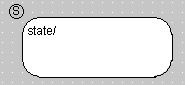

---

## Editing a State

_Source: `markdown/editing_state.md`_

# Editing a State

To edit a state, proceed as follows:

1. To move state symbols, simply drag them to the position you want in the drawing area.

When you move a symbol, the connection lines attached to it automatically follow and reroute as necessary.

1. To change the size of a state symbol, click on it.

1. Drag the handles until the symbol has the desired size.
1. You can cut, copy and paste state symbols just like other diagram elements using the clipboard.

See also

[Copying/Moving Diagram Items in the Same Diagram](BlockDiagramEditorEnglishUS.chm::/BDE_Cutcopypaste.htm)

---

## Renaming States

_Source: `markdown/renaming_state.md`_

# Renaming States

By default, the first state is named state, the next is state_1, etc. You can change the names if you like, only keep in mind that each name has to be unique and ANSI C compliant.

To rename states, proceed as follows:

1. In the drawing area, select the state you want to rename.
1. Double-click the state to open the State Editor.
1. Enter a name in the State combo box.
1. Click OK.

If the name you entered is a reserved keyword, or not ANSI C compliant, a valid alternative is suggested.

1. Confirm the error message and enter a valid name.

If you have entered an existing name, the symbol _n is attached. n is the smallest unissued number for this name.

The new name is shown in the state symbol.

See also

[Defining the Starting State](markdown/SM_Define_StartState.md)

[Reserved Keywords](introductionenglishus.chm::/INT_Reserved_Keywords.htm)

---

## Representing States in Color

_Source: `markdown/SM_representing_colors.md`_

# Representing States in Color

As standard, each newly added state appears in white. You can change the color as follows:

1. Double-click the state you want to edit.
1. Select a color from the Color combo box.

The state symbol is shown in the selected color.

---

## Copying a State Layout

_Source: `markdown/copy_statelayout.md`_

# Copying a State Layout

To copy the layout of a state, i.e. its size and color, to another state, proceed as follows:

1. Right-click on the state whose layout you want to copy.
1. In the context menu, point to State Layout and select Copy Layout.

Size and color of the state are copied to the clipboard.

1. Right-click on the state to which you want to copy the layout.
1. In the context menu, point to State Layout and select Paste Layout.

The layout in the clipboard is assigned to this state. It has the same size and layout as the first.

---

## Creating Junctions

_Source: `markdown/creating_junctions.md`_

# Creating Junctions

Besides the states, you can use the Junction diagram (see [Junctions](markdown/sm_junctions.md)).

To create junctions, proceed as follows:

1. Click on the  button to load the mouse cursor with a new junction.
1. Click in the drawing area where you want to position the junction.

A circle without any name appears at the point you clicked as the symbol for the junction.

1. Repeat these steps, if you need more junctions.

See also

[Junctions](markdown/sm_junctions.md)

[Editing Junctions](markdown/editing_junctions.md)

[Creating a Transition](markdown/create_transition.md)

[Changing the Path of a Transition](markdown/change_path_transition.md)

[Changing the Appearance of a Transition](markdown/change_appearance_transition.md)

[Inserting a Trigger](markdown/SM_insert_trigger.md)

---

## Editing Junctions

_Source: `markdown/editing_junctions.md`_

# Editing Junctions

In contrast to states, you cannot assign actions to a junction. You can only move it and change the size and color.

1. To move junctions, simply drag them to the position you want in the drawing area.
1. Pull one of the objects so that they are placed side by side.
1. To change the size of a junction, click on it.
1. Drag the handles until the symbol has the desired size.
1. You can cut, copy and paste junctions just like other diagram elements using the clipboard.
1. To change the color of the junction, click on the junction with the right mouse button and select Edit Color from the context menu.
1. Select a color.

The junction is shown in the selected color.

See also

[Copying/Moving Diagram Items in the Same Diagram](BlockDiagramEditorEnglishUS.chm::/BDE_Cutcopypaste.htm)

---

## Creating a Transition

_Source: `markdown/create_transition.md`_

# Creating a Transition

To create a transition, proceed as follows:

1. Do one of the following:
1. Click inside the state symbol or the junction where the connection is to start and drag the mouse cursor to the next state or junction.
1. Click inside the symbol you want to connect to.

A transition is drawn between the two symbols. It has an arrowhead pointing from the first state/junction to the second state/junction symbol.

| Column 1 | Column 2 |
| --- | --- |
|  |  |

---

## Changing the Path of a Transition

_Source: `markdown/change_path_transition.md`_

# Changing the Path of a Transition

To change the path of a transition, proceed as follows:

1. Click on the transition to display the path and connection handles in the diagram.

1. Drag the path handles to change the path of the transition.
1. Drag the connection handles to change the position of the connection on the state symbol.

You can assign an existing connection to another source or target state simply by dragging the connection handles.

---

## Changing the Appearance of a Transition

_Source: `markdown/change_appearance_transition.md`_

# Changing the Appearance of a Transition

To change the appearance of a transition, proceed as follows:

1. Do one of the following:
1. Select a color from the Color combo box.
1. Select the line width from the Width combo box.
1. Click OK to confirm your changes.

The transition is shown with the selected color and line thickness.

---

## Inserting a Trigger

_Source: `markdown/SM_insert_trigger.md`_

# Inserting a Trigger

One trigger is created with a new state machine by default. You can add more triggers, but keep in mind that the use of several triggers in one state machine leads to extended program code (see [Optimized for Code Size](markdown/SM_Optimized_for_Code_Size.md)).

To insert a trigger, proceed as follows:

1. In the Insert menu, select Trigger to generate a new trigger.

The trigger is added in the Outline pane. Its name is highlighted to allow editing of the location and position.

1. Enter a name for the trigger and press Enter.

See also

[Reserved Keywords](introductionenglishus.chm::/INT_Reserved_Keywords.htm)

---

## Adding a Closed Hierarchy State

_Source: `markdown/SM_ClosedHierarchy.md`_

# Adding a Closed Hierarchy State

To add a closed hierarchy state, proceed as follows:

1. Add the state that is to become a hierarchy state to the parent diagram.
1. Right-click on the state and select Edit State from the context menu.
1. In the state editor, activate the Hierarchy State option.
1. Click OK.

The state becomes a hierarchy state which is shown by the double-lines on the state symbol.

---

## Moving Between Hierarchy Levels

_Source: `markdown/SM_Move_between_hierarchies.md`_

# Moving Between Hierarchy Levels

To move between hierarchy levels, proceed as follows:

1. Do one of the following:
1. While inside a hierarchy state, double-click in the drawing area (not on a diagram item).

You are moved back up one level.

---

## Setting up a Hierarchy State with a History

_Source: `markdown/SetupHierarchy.md`_

# Setting up a Hierarchy State with a History

To set up a hierarchy state with a history, proceed as follows:

- Right-click on the hierarchy state and select History from the context menu.

The hierarchy state now has a history. When it is entered, the transition ends in that substate the hierarchy was in when it was left, even if that is not the start state of the hierarchy.

---

## Adding a Pin to a Hierarchy State

_Source: `markdown/addpin.md`_

# Adding a Pin to a Hierarchy State

To add a pin to a hierarchy state, proceed as follows:

1. Right-click on a hierarchy state.
1. Select Add Pin from the context menu.

A pin with a default name is created on the state symbol. A corresponding pin is drawn inside the hierarchy.

You can now connect a transition to the pin on the state symbol, and then connect the pin inside the hierarchy to a state.

---

## Resolving a Hierarchy State

_Source: `markdown/ResolveHirearchy.md`_

# Resolving a Hierarchy State

To resolve a hierarchy state, proceed as follows:

1. Right-click on a hierarchy state.
1. Select Resolve Hierarchy from the context menu.

All elements and their connections are copied from the hierarchy state to the higher-level drawing area in the same position. This creates a second independent state diagram with a start state. The double lines which highlighted the closed hierarchy state are deleted. If the selected state had a history, this is also deleted.

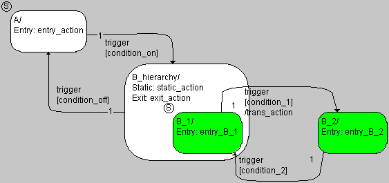

After resolving the hierarchy, the state machine is often unclear, and it (usually) does not have the same functionality as before. In the example, the states B_1 and B_2 were, at the beginning, contained in the close hierarchy state B_hierarchy. Now only B_1 is contained in B_hierarchy. If, therefore, the transition from B_1 to B_2 (or vice-versa) occurs, other actions are also executed (see also [Semantics: Hierarchical State Machines](markdown/SM_Hierarchical_State.md)).

To create the required functionality and also to make the diagram clearer, post-editing is required.

---

## Adding an Open Hierarchy State

_Source: `markdown/addopenhierarchy.md`_

# Adding an Open Hierarchy State

To add an open hierarchy state, proceed as follows:

1. Increase the area of the state that is to contain the hierarchy by dragging the handles.
1. Add all the necessary states and transitions for the subdiagram to the state symbol in the selected hierarchy state.
1. Select a state intended as the start state for the subdiagram.

The method used to create a state diagram within a state symbol is identical to creating a state diagram in the drawing area.

Transitions from a substate to a state outside the hierarchy are possible. Keep in mind, however, that different actions are performed upon a transition between different hierarchy levels than upon a transition within the same hierarchy level (see [Example 12](markdown/SM_Example_12__Transition_Within_a_Hierarchy_State.md) and [Example 15](markdown/SM_Example_15__Transition_Between_Substates_of_Different_Hierarchies.md)). A state is considered outside a hierarchy when it is placed fully or partly outside the hierarchy state (state Level2_State2 in the figure).

As with closed hierarchy states, the user can set up a hierarchy state with a history.

---

## Activating/Deactivating Hierarchical Code Generation

_Source: `markdown/SM_To_Activate_Deactivate_Hierarchical_Code_Generation.md`_

- In the State Machine node, deactivate the Hierarchical Code-Generation (may be changed locally) option to deactivate hierarchical code generation for all state machines in the project.

In that case, the settings of individual state machines are irrelevant.

1. Activate the Hierarchical Code-Generation (may be changed locally) option to activate hierarchical code generation for all state machines in the project.
1. Close the Project Properties window.

The global setting in the project properties alone is not sufficient to generate hierarchical code.

1. In Edit menu of the project editor, select Implementation to open the implementation editor of each state machine in the project for which you want to generate hierarchical code.
1. In the Settings tab, activate the Hierarchical code generation for State Machines option.
1. Close the implementation editor.

Hierarchical code generation takes place only if both options are activated.

# Activating/Deactivating Hierarchical Code Generation

To activate/deactivate hierarchical code generation, proceed as follows.

1. Open the project that contains your state machine.
1. In the project editor, open the [Project Properties](ProjectEditorEnglishUS.chm::/PE_Settings_for_Window.htm) Window and go to the [State Machine](ProjectEditorEnglishUS.chm::/PE_Statemachine_Options_Window.htm) node.
1. To deactivate hierarchical code generation, [proceed as follows](javascript:kadovTextPopup(this))<!-- kadovTextPopupInit('a1'); //-->.
1. To activate hierarchical code generation, [proceed as follows](javascript:kadovTextPopup(this))<!-- kadovTextPopupInit('a2'); //-->.

See also

[Project Properties Window](ProjectEditorEnglishUS.chm::/PE_Settings_for_Window.htm)

[State Machine Node](ProjectEditorEnglishUS.chm::/PE_Statemachine_Options_Window.htm)

/* Heikki Komulainen, Comet Computer GmbH 2004 */ cc_plus_pic = '&nbsp;'; cc_minus_pic = '&nbsp;'; cc_stat_pic = '&nbsp;'; gpstyle = ''; var iframes_created = 0; if (document.body && document.body.insertAdjacentHTML && document.getElementsByTagName && document.getElementById) { collect_popups(); set_poplinks_pictures(); if (iframes_created) { document.write(gpstyle); document.write('
<nobr><a id="einauslink" style="position:absolute;top:expression(document.body.scrollTop + this.offsetHeight - this.offsetHeight);left:expression(document.body.offsetWidth - (this.offsetWidth + 28));background:white;padding:5px" href="javascript:show_all_poptext()">Alle texte einblenden</a></nobr>
'); } } function collect_popups() { bsscpopups = new Array(); for (x = 0; x < document.links.length; x++) { if (document.links[x].href.indexOf("BSSCPopup")>-1) { seekmatch = /BSSCPopup.'[^'](markdown/+)'/; poplink = seekmatch.exec(document.links[x].href); poplink = "" + poplink; poplink = poplink.substring(poplink.indexOf("'")+1, poplink.lastIndexOf("'")); ifid = "CCGENIFRAMEID" + x; new_iframe = '<iframe id="' + ifid + '"src="' + poplink + '" onload="get_text(\'' + ifid + '\')" width="0" height="0" frameborder=0></iframe>'; document.links[x].parentNode.insertAdjacentHTML("afterEnd", new_iframe); gpid = "CCID_" + ifid; document.links[x].href = "javascript:expand_poptext('" + gpid + "')"; cc_plus = '' + cc_plus_pic + ''; document.links[x].insertAdjacentHTML("afterBegin", cc_plus); iframes_created = 1; } } }// end function function get_text(ifr_id) { frpars = document.frames[ifr_id].document.getElementsByTagName("body"); popbody = frpars[0].innerHTML; gpid = "CCID_" + ifr_id; if (!document.getElementById(gpid)) { //avoiding doubles document.getElementById(ifr_id).insertAdjacentHTML("afterEnd", '
'+popbody+'
'); } }//end function function expand_poptext(x_frame_id) { if (!document.getElementById(x_frame_id)) return; if (document.getElementById(x_frame_id).className == "CCGENPOPTEXTH") { document.getElementById(x_frame_id).className = "CCGENPOPTEXTV"; document.getElementById(x_frame_id).style.visibility = "visible"; if (document.getElementById("CCPMB_" + x_frame_id )) { document.getElementById("CCPMB_" + x_frame_id ).innerHTML = cc_minus_pic; } } else { document.getElementById(x_frame_id).className = "CCGENPOPTEXTH"; document.getElementById(x_frame_id).style.visibility = "hidden"; if (document.getElementById("CCPMB_" + x_frame_id )) { document.getElementById("CCPMB_" + x_frame_id ).innerHTML = cc_plus_pic; } } }// end function function show_all_poptext() { var pulldowntxt = document.getElementsByTagName("div"); for (b = 0; b < pulldowntxt.length; b++) { if (pulldowntxt[b].className == "droptext") { pulldowntxt[b].style.display=""; } } var gptxt = document.getElementsByTagName("div"); for (z = 0; z < gptxt.length; z++) { if (gptxt[z].className == "CCGENPOPTEXTH") { gptxt[z].className = "CCGENPOPTEXTV"; gptxt[z].style.visibility = "visible"; if (document.getElementById("CCPMB_" + gptxt[z].id )) { document.getElementById("CCPMB_" + gptxt[z].id ).innerHTML = cc_minus_pic; } } } var dxpoplinks = document.getElementsByTagName("a"); if (dxpoplinks) { for (pxl = 0; pxl < dxpoplinks.length; pxl++) { if (dxpoplinks[pxl].href.indexOf("kadovTextPopup")>-1) { if (document.getElementById("CCPMB_" + dxpoplinks[pxl].id)) { document.getElementById("CCPMB_" + dxpoplinks[pxl].id).innerHTML = cc_stat_pic; dxpoplinks[pxl].symbol = "minus"; } } } } document.getElementById('einauslink').innerText = 'Alle texte ausblenden'; document.getElementById('einauslink').href = "javascript:self.location.reload()"; self.focus(); }// end function function eat_click() { return false; }// end function function set_poplinks_pictures() { var dpoplinks = document.getElementsByTagName("a"); if (dpoplinks) { for (pl = 0; pl < dpoplinks.length; pl++) { if (dpoplinks[pl].href.indexOf("kadovTextPopup")>-1) { cc_plus = '' + cc_stat_pic + ''; //dpoplinks[pl].onmouseup = plusminuspoplink; dpoplinks[pl].insertAdjacentHTML("afterBegin", cc_plus); dpoplinks[pl].symbol = "plus"; } } } }// end function function plusminuspoplink() { if (document.getElementById("CCPMB_" + this.id)) { if (this.symbol == "plus") { document.getElementById("CCPMB_" + this.id).innerHTML = cc_minus_pic; this.symbol = "minus"; } else { document.getElementById("CCPMB_" + this.id).innerHTML = cc_plus_pic; this.symbol = "plus"; } } return true; }

---

## Editing Actions/Conditions in Separate Diagrams

_Source: `markdown/SM_ActionsConditions_SeparateDiagrams.md`_

# Editing Actions/Conditions in Separate Diagrams

You have to perform the following steps to specify an action or condition in a separate diagram.

1. Create a [BDE diagram](markdown/SM_blockDiagram.md) or an [ESDL diagram](markdown/SM_Create_ESDL_Diagram_for_ActionsConditions.md) for actions/conditions.
1. [Add actions or conditions.](markdown/SM_add_condition.md)
1. [Open a diagram for actions/conditions](markdown/SM_opening_diagram.md) and specify actions or conditions.
1. [Activate/deactivate optimization of static actions.](markdown/To_Activate_Deactivate_Optimization_of_Static_Actions.md)
1. [Activate/Deactivate auto-inlining.](markdown/SM_To_Activate_Deactivate_Auto-Inlining.md)

---

## Creating a BDE Diagram for Actions/Conditions

_Source: `markdown/SM_blockDiagram.md`_

# Creating a BDE Diagram for Actions/Conditions

To generate a block diagram for actions/conditions, proceed as follows:

1. Do one of the following:
1. Enter a name for the diagram in the Outline tab.
1. [Add actions or conditions](markdown/SM_add_condition.md).
1. [Open the diagram](markdown/SM_opening_diagram.md) and specify the actions/conditions.

See also

[Adding an Action or Condition](markdown/SM_add_condition.md)

[Opening a Diagram for Actions/Conditions](markdown/SM_opening_diagram.md)

[Creating an ESDL Diagram for Actions/Conditions](markdown/SM_Create_ESDL_Diagram_for_ActionsConditions.md)

[Actions/Conditions in Separate Diagrams](markdown/SM_conditions_actions.md)

[Reserved Keywords](introductionenglishus.chm::/INT_Reserved_Keywords.htm)

---

## Creating an ESDL Diagram for Actions/Conditions

_Source: `markdown/SM_Create_ESDL_Diagram_for_ActionsConditions.md`_

# Creating an ESDL Diagram for Actions/Conditions

To generate an ESDL diagram for actions/conditions, proceed as follows:

1. Do one of the following:
1. Enter a name for the diagram in the Outline tab.
1. [Add actions or conditions](markdown/SM_add_condition.md).
1. [Open the diagram](markdown/SM_opening_diagram.md) and specify the actions/conditions.

See also

[Adding an Action or Condition](markdown/SM_add_condition.md)

[Opening a Diagram for Actions/Conditions](markdown/SM_opening_diagram.md)

[Creating a BDE Diagram for Actions/Conditions](markdown/SM_blockDiagram.md)

[Actions/Conditions in Separate Diagrams](markdown/SM_conditions_actions.md)

[Reserved Keywords](introductionenglishus.chm::/INT_Reserved_Keywords.htm)

---

## Adding an Action or Condition

_Source: `markdown/SM_add_condition.md`_

# Adding an Action or Condition

To add a condition, proceed as follows:

1. In the Outline tab, select the name of the diagram to which you want to add the condition.
1. Do one of the following:
1. Enter a name for the condition and press Enter.

An action has, as standard, no arguments and no return value. Therefore, no interface elements are created for an action, but other than that, adding actions works analogous to adding conditions, using the menu Insert and selecting Action or the context menu, pointing to Add Action.

See also

[Reserved Keywords](introductionenglishus.chm::/INT_Reserved_Keywords.htm)

---

## Opening a Diagram for Actions/Conditions

_Source: `markdown/SM_opening_diagram.md`_

# Opening a Diagram for Actions/Conditions

To open a diagram for actions/conditions, proceed as follows:

1. In the Outline tab, select the Action/Condition diagram you want to open.
1. Do one of the following:
1. Do one of the following:

- Click Yes to save the changes
- Click No to reject the changes.

The ActionCondition diagram opens in a new editor window.

Specify the conditions and actions as other block diagrams or ESDL components; see [Overview - Block Diagram Editor](BlockDiagramEditorEnglishUS.chm::/BDE_Overview.htm) and [Overview - ESDL Editor](ESDLEditorEnglishUS.chm::/ESDL_Overview.htm) and references therein. Only the menu options and buttons for code generation are disabled; these are available only in the state machine editor.

Code for actions/conditions thus specified is generated either as separate functions or inserted on the spot during code generation (auto-inlining, see [Optimizing the State Machine](markdown/SM_Optimizing_the_State_Machine.md)).

See also

[Overview - Block Diagram Editor](BlockDiagramEditorEnglishUS.chm::/BDE_Overview.htm)

[Overview - ESDL Editor](ESDLEditorEnglishUS.chm::/ESDL_Overview.htm)

[Optimizing the State Machine](markdown/SM_Optimizing_the_State_Machine.md)

---

## Activating/Deactivating Optimization of Static Actions

_Source: `markdown/To_Activate_Deactivate_Optimization_of_Static_Actions.md`_

- In the State Machine node, deactivate the Hierarchical Code-Generation (may be changed locally) option to deactivate hierarchical code generation for all state machines in the project.

If you activate the optimization, modeling is restricted as follows: If a substate of the state machine contains a direct transition out of its parent state, this transition must have the highest priority of all transitions from that substate.

- Activate the Optimize Static Action (Restricted Modeling) option to activate the optimization for all state machines in the project.

The optimization of static actions takes place. The changes in code generation thus introduced can alter the behavior of the state machine. If you activate the option for an existing state machine, check its behavior carefully.

# Activating/Deactivating Optimization of Static Actions

To activate/deactivate optimization of static actions in hierarchy states, proceed as follows:

1. Open the project that contains your state machine.
1. In the project editor, open the [Project Properties](ProjectEditorEnglishUS.chm::/PE_Settings_for_Window.htm) Window and go to the [State Machine](ProjectEditorEnglishUS.chm::/PE_Statemachine_Options_Window.htm) node.
1. To deactivate optimization of static actions, [proceed as follows](javascript:kadovTextPopup(this))<!-- kadovTextPopupInit('a1'); //-->.
1. To activate optimization of static actions, [proceed as follows](javascript:kadovTextPopup(this))<!-- kadovTextPopupInit('a2'); //-->.

Activating optimization of static actions can alter the behavior of the state machine. If you activate the option for an existing state machine, check its behavior carefully.

See also

[Project Properties Window](ProjectEditorEnglishUS.chm::/PE_Settings_for_Window.htm)

[State Machine Node](ProjectEditorEnglishUS.chm::/PE_Statemachine_Options_Window.htm)

/* Heikki Komulainen, Comet Computer GmbH 2004 */ cc_plus_pic = '&nbsp;'; cc_minus_pic = '&nbsp;'; cc_stat_pic = '&nbsp;'; gpstyle = ''; var iframes_created = 0; if (document.body && document.body.insertAdjacentHTML && document.getElementsByTagName && document.getElementById) { collect_popups(); set_poplinks_pictures(); if (iframes_created) { document.write(gpstyle); document.write('
<nobr><a id="einauslink" style="position:absolute;top:expression(document.body.scrollTop + this.offsetHeight - this.offsetHeight);left:expression(document.body.offsetWidth - (this.offsetWidth + 28));background:white;padding:5px" href="javascript:show_all_poptext()">Alle texte einblenden</a></nobr>
'); } } function collect_popups() { bsscpopups = new Array(); for (x = 0; x < document.links.length; x++) { if (document.links[x].href.indexOf("BSSCPopup")>-1) { seekmatch = /BSSCPopup.'[^'](markdown/+)'/; poplink = seekmatch.exec(document.links[x].href); poplink = "" + poplink; poplink = poplink.substring(poplink.indexOf("'")+1, poplink.lastIndexOf("'")); ifid = "CCGENIFRAMEID" + x; new_iframe = '<iframe id="' + ifid + '"src="' + poplink + '" onload="get_text(\'' + ifid + '\')" width="0" height="0" frameborder=0></iframe>'; document.links[x].parentNode.insertAdjacentHTML("afterEnd", new_iframe); gpid = "CCID_" + ifid; document.links[x].href = "javascript:expand_poptext('" + gpid + "')"; cc_plus = '' + cc_plus_pic + ''; document.links[x].insertAdjacentHTML("afterBegin", cc_plus); iframes_created = 1; } } }// end function function get_text(ifr_id) { frpars = document.frames[ifr_id].document.getElementsByTagName("body"); popbody = frpars[0].innerHTML; gpid = "CCID_" + ifr_id; if (!document.getElementById(gpid)) { //avoiding doubles document.getElementById(ifr_id).insertAdjacentHTML("afterEnd", '
'+popbody+'
'); } }//end function function expand_poptext(x_frame_id) { if (!document.getElementById(x_frame_id)) return; if (document.getElementById(x_frame_id).className == "CCGENPOPTEXTH") { document.getElementById(x_frame_id).className = "CCGENPOPTEXTV"; document.getElementById(x_frame_id).style.visibility = "visible"; if (document.getElementById("CCPMB_" + x_frame_id )) { document.getElementById("CCPMB_" + x_frame_id ).innerHTML = cc_minus_pic; } } else { document.getElementById(x_frame_id).className = "CCGENPOPTEXTH"; document.getElementById(x_frame_id).style.visibility = "hidden"; if (document.getElementById("CCPMB_" + x_frame_id )) { document.getElementById("CCPMB_" + x_frame_id ).innerHTML = cc_plus_pic; } } }// end function function show_all_poptext() { var pulldowntxt = document.getElementsByTagName("div"); for (b = 0; b < pulldowntxt.length; b++) { if (pulldowntxt[b].className == "droptext") { pulldowntxt[b].style.display=""; } } var gptxt = document.getElementsByTagName("div"); for (z = 0; z < gptxt.length; z++) { if (gptxt[z].className == "CCGENPOPTEXTH") { gptxt[z].className = "CCGENPOPTEXTV"; gptxt[z].style.visibility = "visible"; if (document.getElementById("CCPMB_" + gptxt[z].id )) { document.getElementById("CCPMB_" + gptxt[z].id ).innerHTML = cc_minus_pic; } } } var dxpoplinks = document.getElementsByTagName("a"); if (dxpoplinks) { for (pxl = 0; pxl < dxpoplinks.length; pxl++) { if (dxpoplinks[pxl].href.indexOf("kadovTextPopup")>-1) { if (document.getElementById("CCPMB_" + dxpoplinks[pxl].id)) { document.getElementById("CCPMB_" + dxpoplinks[pxl].id).innerHTML = cc_stat_pic; dxpoplinks[pxl].symbol = "minus"; } } } } document.getElementById('einauslink').innerText = 'Alle texte ausblenden'; document.getElementById('einauslink').href = "javascript:self.location.reload()"; self.focus(); }// end function function eat_click() { return false; }// end function function set_poplinks_pictures() { var dpoplinks = document.getElementsByTagName("a"); if (dpoplinks) { for (pl = 0; pl < dpoplinks.length; pl++) { if (dpoplinks[pl].href.indexOf("kadovTextPopup")>-1) { cc_plus = '' + cc_stat_pic + ''; //dpoplinks[pl].onmouseup = plusminuspoplink; dpoplinks[pl].insertAdjacentHTML("afterBegin", cc_plus); dpoplinks[pl].symbol = "plus"; } } } }// end function function plusminuspoplink() { if (document.getElementById("CCPMB_" + this.id)) { if (this.symbol == "plus") { document.getElementById("CCPMB_" + this.id).innerHTML = cc_minus_pic; this.symbol = "minus"; } else { document.getElementById("CCPMB_" + this.id).innerHTML = cc_plus_pic; this.symbol = "plus"; } } return true; }

---

## Activating/Deactivating Auto-Inlining

_Source: `markdown/SM_To_Activate_Deactivate_Auto-Inlining.md`_

- In the State Machine node, deactivate the Auto-inline private methods (Smaller code size - may be changed locally) option to deactivate auto-inlining for all state machines in the project.

In that case, the settings of individual state machines are irrelevant.

1. Activate the Auto-inline private methods (Smaller code size - may be changed locally) option to activate auto-inlining for all state machines in the project.
1. Close the Project Properties window.

The global setting in the project properties alone is not sufficient to activate auto-inlining.

1. In the Edit menu, select Implementation to open the implementation editor of each state machine in the project for which you want to activate auto-inlining.
1. In the Settings tab, activate the Auto-inline private methods (Smaller code size) option.
1. Close the implementation editor.

Auto-Inlining takes place only if both options are activated.

You can use this option to exclude individual state machines from auto-inlining.

# Activating/Deactivating Auto-Inlining

To activate/deactivate auto-inlining, proceed as follows:

1. Open the project that contains your state machine.
1. In the project editor, open the [Project Properties](ProjectEditorEnglishUS.chm::/PE_Settings_for_Window.htm) Window and go to the [State Machine](ProjectEditorEnglishUS.chm::/PE_Statemachine_Options_Window.htm) Node.
1. To deactivate auto-inlining, [proceed as follows](javascript:kadovTextPopup(this))<!-- kadovTextPopupInit('a1'); //-->.
1. To activate auto-inlining, [proceed as follows](javascript:kadovTextPopup(this))<!-- kadovTextPopupInit('a2'); //-->.

See also

[Project Properties Window](ProjectEditorEnglishUS.chm::/PE_Settings_for_Window.htm)

[State Machine Node](ProjectEditorEnglishUS.chm::/PE_Statemachine_Options_Window.htm)

/* Heikki Komulainen, Comet Computer GmbH 2004 */ cc_plus_pic = '&nbsp;'; cc_minus_pic = '&nbsp;'; cc_stat_pic = '&nbsp;'; gpstyle = ''; var iframes_created = 0; if (document.body && document.body.insertAdjacentHTML && document.getElementsByTagName && document.getElementById) { collect_popups(); set_poplinks_pictures(); if (iframes_created) { document.write(gpstyle); document.write('
<nobr><a id="einauslink" style="position:absolute;top:expression(document.body.scrollTop + this.offsetHeight - this.offsetHeight);left:expression(document.body.offsetWidth - (this.offsetWidth + 28));background:white;padding:5px" href="javascript:show_all_poptext()">Alle texte einblenden</a></nobr>
'); } } function collect_popups() { bsscpopups = new Array(); for (x = 0; x < document.links.length; x++) { if (document.links[x].href.indexOf("BSSCPopup")>-1) { seekmatch = /BSSCPopup.'[^'](markdown/+)'/; poplink = seekmatch.exec(document.links[x].href); poplink = "" + poplink; poplink = poplink.substring(poplink.indexOf("'")+1, poplink.lastIndexOf("'")); ifid = "CCGENIFRAMEID" + x; new_iframe = '<iframe id="' + ifid + '"src="' + poplink + '" onload="get_text(\'' + ifid + '\')" width="0" height="0" frameborder=0></iframe>'; document.links[x].parentNode.insertAdjacentHTML("afterEnd", new_iframe); gpid = "CCID_" + ifid; document.links[x].href = "javascript:expand_poptext('" + gpid + "')"; cc_plus = '' + cc_plus_pic + ''; document.links[x].insertAdjacentHTML("afterBegin", cc_plus); iframes_created = 1; } } }// end function function get_text(ifr_id) { frpars = document.frames[ifr_id].document.getElementsByTagName("body"); popbody = frpars[0].innerHTML; gpid = "CCID_" + ifr_id; if (!document.getElementById(gpid)) { //avoiding doubles document.getElementById(ifr_id).insertAdjacentHTML("afterEnd", '
'+popbody+'
'); } }//end function function expand_poptext(x_frame_id) { if (!document.getElementById(x_frame_id)) return; if (document.getElementById(x_frame_id).className == "CCGENPOPTEXTH") { document.getElementById(x_frame_id).className = "CCGENPOPTEXTV"; document.getElementById(x_frame_id).style.visibility = "visible"; if (document.getElementById("CCPMB_" + x_frame_id )) { document.getElementById("CCPMB_" + x_frame_id ).innerHTML = cc_minus_pic; } } else { document.getElementById(x_frame_id).className = "CCGENPOPTEXTH"; document.getElementById(x_frame_id).style.visibility = "hidden"; if (document.getElementById("CCPMB_" + x_frame_id )) { document.getElementById("CCPMB_" + x_frame_id ).innerHTML = cc_plus_pic; } } }// end function function show_all_poptext() { var pulldowntxt = document.getElementsByTagName("div"); for (b = 0; b < pulldowntxt.length; b++) { if (pulldowntxt[b].className == "droptext") { pulldowntxt[b].style.display=""; } } var gptxt = document.getElementsByTagName("div"); for (z = 0; z < gptxt.length; z++) { if (gptxt[z].className == "CCGENPOPTEXTH") { gptxt[z].className = "CCGENPOPTEXTV"; gptxt[z].style.visibility = "visible"; if (document.getElementById("CCPMB_" + gptxt[z].id )) { document.getElementById("CCPMB_" + gptxt[z].id ).innerHTML = cc_minus_pic; } } } var dxpoplinks = document.getElementsByTagName("a"); if (dxpoplinks) { for (pxl = 0; pxl < dxpoplinks.length; pxl++) { if (dxpoplinks[pxl].href.indexOf("kadovTextPopup")>-1) { if (document.getElementById("CCPMB_" + dxpoplinks[pxl].id)) { document.getElementById("CCPMB_" + dxpoplinks[pxl].id).innerHTML = cc_stat_pic; dxpoplinks[pxl].symbol = "minus"; } } } } document.getElementById('einauslink').innerText = 'Alle texte ausblenden'; document.getElementById('einauslink').href = "javascript:self.location.reload()"; self.focus(); }// end function function eat_click() { return false; }// end function function set_poplinks_pictures() { var dpoplinks = document.getElementsByTagName("a"); if (dpoplinks) { for (pl = 0; pl < dpoplinks.length; pl++) { if (dpoplinks[pl].href.indexOf("kadovTextPopup")>-1) { cc_plus = '' + cc_stat_pic + ''; //dpoplinks[pl].onmouseup = plusminuspoplink; dpoplinks[pl].insertAdjacentHTML("afterBegin", cc_plus); dpoplinks[pl].symbol = "plus"; } } } }// end function function plusminuspoplink() { if (document.getElementById("CCPMB_" + this.id)) { if (this.symbol == "plus") { document.getElementById("CCPMB_" + this.id).innerHTML = cc_minus_pic; this.symbol = "minus"; } else { document.getElementById("CCPMB_" + this.id).innerHTML = cc_plus_pic; this.symbol = "plus"; } } return true; }

---

## Assigning Triggers, Priorities, Conditions and Actions to a Transition

_Source: `markdown/SM_AssignTriggers.md`_

# Assigning Triggers, Priorities, Conditions and Actions to a Transition

Every transition has to have a trigger and a priority, but the condition and the transition action are optional.

1. Do one of the following:
1. Enter a number in the Priority field to assign a priority to the transition.
1. Select a trigger from the Trigger combo box.
1. Select a transition action from the combo box on the Action tab.
1. Select a condition from the combo box on the Condition tab.
1. Click OK.

The trigger event name, the priority and the names of the condition and action of the transition/segments are shown in the diagram.

---

## Assigning Actions to a State

_Source: `markdown/SM_AssignActions.md`_

# Assigning Actions to a State

Each state can have an entry action, a static action and an exit action. All these are optional.

To assign actions to a state, proceed as follows:

1. Do one of the following:
1. On the Entry tab of the State Editor window, select an entry action from the combo box.
1. On the Static and Exit tabs, select the static and exit actions.
1. Click OK.

The names of the actions are displayed in the state symbol.

If you have assigned actions or conditions with arguments, a test is carried out when you leave the state or transition editor to see if all the relevant triggers have the corresponding arguments with identical names and types. If this is not the case, an error message appears in the ASCET monitor window.

- Generate the trigger elements specified in the error message as described in [Adding a Trigger Argument](markdown/adding_triggerargument.md).

If you have generated a trigger argument, and it is not used in any action or condition, this has no effect on the function of the state machine. On code generation, a warning is only displayed in the ASCET Errors/Warnings window.

Once you have assigned actions or conditions from an ActionCondition diagram, the Edit button on the various tabs becomes active. You can use it to edit the action/condition assigned on the respective tab.

See also

[Adding a Trigger Argument](markdown/adding_triggerargument.md)

---

## Editing Actions/Conditions

_Source: `markdown/SM_edit_actions_conditions.md`_

# Editing Actions/Conditions

To edit actions/conditions, proceed as follows:

1. Open the State Editor or Transition Editor.
1. In one of the tabs, assign an action or condition.
1. To edit the action or condition, click Edit.
1. In the Confirm window, confirm the saving of your input to the state or transition editor.

The state/transition editor is closed, the settings are adopted.

Another Confirm window appears.

1. In the new window, confirm the save of your inputs to the state diagram.

The state diagram is saved.

The diagram containing the assigned action or condition open in a separate editor window.

---

## Actions/Conditions in the State Diagram

_Source: `markdown/SM_ActionsConditions_StateDiagram.md`_

# Editing Actions/Conditions in the State Diagram

You have to perform the following steps to specify an action or condition in the state diagram.

1. [Specify entry/static/exit actions in the state editor.](markdown/specifying_actions.md)
1. [Specify conditions and transition actions in the transition editor.](markdown/specifying_conditions_transition.md)
1. You can [cut, copy and paste ESDL code](markdown/cut_copyand%20paste.md).
1. You can [insert comment lines](markdown/automatic_insertion.md)
1. [Activate/deactivating outlining of actions/conditions](markdown/SM_activate_deactivate_outlining_of_actions_conditions_.md) according to your needs.

---

## Specifying Actions in the State Editor

_Source: `markdown/specifying_actions.md`_

# Specifying Actions in the State Editor

To specify actions in the state editor, proceed as follows:

1. Right-click on the state whose actions you want to specify.
1. In the context menu, point to Edit Action and select Entry to edit the entry action.
1. In the context menu, point to Edit Action and select Static to edit the static action.
1. In the context menu, point to Edit Action and select Exit to edit the exit action.

The state editor opens in the requested tab.

1. Select ESDL from the combo box.

The input field below the combo box is activated.

1. Type the ESDL code into the input field.

You can undo the last input with Ctrl + z.

1. Click OK to accept your input.

---

## Specifying Conditions and Transition Actions in the Transition Editor

_Source: `markdown/specifying_conditions_transition.md`_

# Specifying Conditions and Transition Actions in the Transition Editor

The transition editor, which is used to specify conditions and transition actions, has the same functionalities as the state editor.

To specify conditions and transition actions in the transition editor, proceed as follows:

1. Right-click on the transition.
1. Select Edit Transition from the context menu

or

1. Double-click on the transition.

The transition editor opens.

1. On the Condition or Action tab, select <ESDL> from the combo box.

The input field below the combo box is activated.

1. Type the ESDL code into the input field.
1. Click OK.

The ESDL code of all conditions and actions specified at a state or transition is displayed in the state diagram. For complicated state machines, it can thus quickly become rather crowded.

You can avoid that by entering a comment in the first line when you add conditions or actions. One-line comments are marked by two leading slashes //, comments of any length are included in /* <Comment> */. In this case, only the comments are displayed.

You can also add the comment lines automatically at a later time.

See also

[Automatic Insertion of Comment Lines](markdown/automatic_insertion.md)

---

## Automatic Insertion of Comment Lines

_Source: `markdown/automatic_insertion.md`_

# Automatic Insertion of Comment Lines

You can also add the comment lines automatically at a later time.

1. Open the state machine in the state machine editor.
1. In the Tools menu, select Create State Code Comments.

In each condition and action specified in the state diagram, a comment with the text of the first code line is added as first line.

---

## Activating/Deactivating Outlining of Actions/Conditions

_Source: `markdown/SM_activate_deactivate_outlining_of_actions_conditions_.md`_

- In the State Machine node, deactivate the Outline Generated Methods (may be changed locally) option to deactivate outlining for all state machines in the project.

In that case, the settings of individual state machines are irrelevant.

1. Activate the Outline Generated Methods (may be changed locally) option to activate outlining for all state machines in the project.
1. Close the Project Properties window.

The global setting in the project properties alone is not sufficient to activate outlining.

1. In the Edit menu, select Implementation to open the implementation editor of each state machine in the project for which you want to activate outlining.
1. In the Settings tab, activate the Outline automatically generated methods for State Machines option.
1. Close the implementation editor.

Outlining takes place only if both options are activated.

If required, code for the actions/conditions is generated as separate methods during code generation.

# Activating/Deactivating Outlining of Actions/Conditions

When code is generated for a state machine, parts of actions and conditions specified at the state or transition are generated as separate methods (outlining). The prerequisites for outlining are described in [Optimizing the State Machine](markdown/SM_Optimizing_the_State_Machine.md). You can disable outlining.

To activate/deactivate outlining, proceed as follows:

1. Open the project that contains your state machine.
1. In the project editor, open the [Project Properties](ProjectEditorEnglishUS.chm::/PE_Settings_for_Window.htm) Window and go to the [State Machine](ProjectEditorEnglishUS.chm::/PE_Statemachine_Options_Window.htm) node.
1. To deactivate outlining, [proceed as follows](javascript:kadovTextPopup(this))<!-- kadovTextPopupInit('a1'); //-->.
1. To activate outlining, [proceed as follows](javascript:kadovTextPopup(this))<!-- kadovTextPopupInit('a2'); //-->.

See also

[Project Properties Window](ProjectEditorEnglishUS.chm::/PE_Settings_for_Window.htm)

[Statemachine Node](ProjectEditorEnglishUS.chm::/PE_Statemachine_Options_Window.htm)

[Optimizing the State Machine](markdown/SM_Optimizing_the_State_Machine.md)

/* Heikki Komulainen, Comet Computer GmbH 2004 */ cc_plus_pic = '&nbsp;'; cc_minus_pic = '&nbsp;'; cc_stat_pic = '&nbsp;'; gpstyle = ''; var iframes_created = 0; if (document.body && document.body.insertAdjacentHTML && document.getElementsByTagName && document.getElementById) { collect_popups(); set_poplinks_pictures(); if (iframes_created) { document.write(gpstyle); document.write('
<nobr><a id="einauslink" style="position:absolute;top:expression(document.body.scrollTop + this.offsetHeight - this.offsetHeight);left:expression(document.body.offsetWidth - (this.offsetWidth + 28));background:white;padding:5px" href="javascript:show_all_poptext()">Alle texte einblenden</a></nobr>
'); } } function collect_popups() { bsscpopups = new Array(); for (x = 0; x < document.links.length; x++) { if (document.links[x].href.indexOf("BSSCPopup")>-1) { seekmatch = /BSSCPopup.'[^'](markdown/+)'/; poplink = seekmatch.exec(document.links[x].href); poplink = "" + poplink; poplink = poplink.substring(poplink.indexOf("'")+1, poplink.lastIndexOf("'")); ifid = "CCGENIFRAMEID" + x; new_iframe = '<iframe id="' + ifid + '"src="' + poplink + '" onload="get_text(\'' + ifid + '\')" width="0" height="0" frameborder=0></iframe>'; document.links[x].parentNode.insertAdjacentHTML("afterEnd", new_iframe); gpid = "CCID_" + ifid; document.links[x].href = "javascript:expand_poptext('" + gpid + "')"; cc_plus = '' + cc_plus_pic + ''; document.links[x].insertAdjacentHTML("afterBegin", cc_plus); iframes_created = 1; } } }// end function function get_text(ifr_id) { frpars = document.frames[ifr_id].document.getElementsByTagName("body"); popbody = frpars[0].innerHTML; gpid = "CCID_" + ifr_id; if (!document.getElementById(gpid)) { //avoiding doubles document.getElementById(ifr_id).insertAdjacentHTML("afterEnd", '
'+popbody+'
'); } }//end function function expand_poptext(x_frame_id) { if (!document.getElementById(x_frame_id)) return; if (document.getElementById(x_frame_id).className == "CCGENPOPTEXTH") { document.getElementById(x_frame_id).className = "CCGENPOPTEXTV"; document.getElementById(x_frame_id).style.visibility = "visible"; if (document.getElementById("CCPMB_" + x_frame_id )) { document.getElementById("CCPMB_" + x_frame_id ).innerHTML = cc_minus_pic; } } else { document.getElementById(x_frame_id).className = "CCGENPOPTEXTH"; document.getElementById(x_frame_id).style.visibility = "hidden"; if (document.getElementById("CCPMB_" + x_frame_id )) { document.getElementById("CCPMB_" + x_frame_id ).innerHTML = cc_plus_pic; } } }// end function function show_all_poptext() { var pulldowntxt = document.getElementsByTagName("div"); for (b = 0; b < pulldowntxt.length; b++) { if (pulldowntxt[b].className == "droptext") { pulldowntxt[b].style.display=""; } } var gptxt = document.getElementsByTagName("div"); for (z = 0; z < gptxt.length; z++) { if (gptxt[z].className == "CCGENPOPTEXTH") { gptxt[z].className = "CCGENPOPTEXTV"; gptxt[z].style.visibility = "visible"; if (document.getElementById("CCPMB_" + gptxt[z].id )) { document.getElementById("CCPMB_" + gptxt[z].id ).innerHTML = cc_minus_pic; } } } var dxpoplinks = document.getElementsByTagName("a"); if (dxpoplinks) { for (pxl = 0; pxl < dxpoplinks.length; pxl++) { if (dxpoplinks[pxl].href.indexOf("kadovTextPopup")>-1) { if (document.getElementById("CCPMB_" + dxpoplinks[pxl].id)) { document.getElementById("CCPMB_" + dxpoplinks[pxl].id).innerHTML = cc_stat_pic; dxpoplinks[pxl].symbol = "minus"; } } } } document.getElementById('einauslink').innerText = 'Alle texte ausblenden'; document.getElementById('einauslink').href = "javascript:self.location.reload()"; self.focus(); }// end function function eat_click() { return false; }// end function function set_poplinks_pictures() { var dpoplinks = document.getElementsByTagName("a"); if (dpoplinks) { for (pl = 0; pl < dpoplinks.length; pl++) { if (dpoplinks[pl].href.indexOf("kadovTextPopup")>-1) { cc_plus = '' + cc_stat_pic + ''; //dpoplinks[pl].onmouseup = plusminuspoplink; dpoplinks[pl].insertAdjacentHTML("afterBegin", cc_plus); dpoplinks[pl].symbol = "plus"; } } } }// end function function plusminuspoplink() { if (document.getElementById("CCPMB_" + this.id)) { if (this.symbol == "plus") { document.getElementById("CCPMB_" + this.id).innerHTML = cc_minus_pic; this.symbol = "minus"; } else { document.getElementById("CCPMB_" + this.id).innerHTML = cc_plus_pic; this.symbol = "plus"; } } return true; }

---

## Adding Inputs and Outputs to the State Machine

_Source: `markdown/adding_inputs.md`_

# Adding Inputs and Outputs to the State Machine

To add inputs and outputs to the state machine, proceed as follows:

1. Click on the  Input or  Output button.
1. If you do not want to open the properties editor upon an element’s creation, deactivate the Always show Editor for new Elements option at the bottom of the editor.
1. Close the properties editor with OK.
1. In a block diagram editor for ActionCondition diagrams, click inside the drawing area where you want to position the input or output.

The input or output is created. You can use the element the same way as an argument or a variable.

See also

[Editing the Configuration of a Scalar Element](ElementEditorEnglishUS.chm::/EEd_edit_element_configuration.htm)

[Confirmation Dialog Options](ComponentManagerEnglishUS.chm::/CM_Options_for_Confirmation_Dialogs.htm)

---

## Adding a Trigger Argument

_Source: `markdown/adding_triggerargument.md`_

# Adding a Trigger Argument

To add a trigger argument, proceed as follows:

1. Open the signature editor for the required trigger (cf. [Editing the Signature of a Method or Process](BlockDiagramEditorEnglishUS.chm::/EditMethod.htm)).
1. Add the necessary arguments in the Inputs tab (cf. [Adding an Argument to the Method](BlockDiagramEditorEnglishUS.chm::/Addargument.htm)).

See also

[Communication with Other Components](markdown/communications_components.md)

[State Machines as Classes](markdown/SM_State_Machines_as_Classes.md)

[Editing the Signature of a Method or Process](BlockDiagramEditorEnglishUS.chm::/EditMethod.htm)

[Adding an Argument to the Method](BlockDiagramEditorEnglishUS.chm::/Addargument.htm)

---

## Adding Arguments to Conditions/Actions

_Source: `markdown/adding_arguments.md`_

# Adding Arguments to Conditions/Actions

If you want to use a trigger argument in an action or condition specified in an ActionCondition diagram, you must generate an argument of the same name and the same type in the action or condition.

To add arguments to conditions/actions, proceed as follows:

1. In the Outline pane, select the required action or condition.
1. Open the signature editor (see [Editing the Signature of a Method or Process](BlockDiagramEditorEnglishUS.chm::/EditMethod.htm)).
1. In the Arguments tab, add the necessary arguments (see [Adding an Argument to the Method](BlockDiagramEditorEnglishUS.chm::/Addargument.htm)). Make sure that the names and the types are the same.
1. If necessary, you can enter a comment for the return value of a condition in the Return tab.

See also

[Communication with Other Components](markdown/communications_components.md)

[State Machines as Classes](markdown/SM_State_Machines_as_Classes.md)

[Editing the Signature of a Method or Process](BlockDiagramEditorEnglishUS.chm::/EditMethod.htm)

[Adding an Argument to the Method](BlockDiagramEditorEnglishUS.chm::/Addargument.htm)

---

## Creating a Public Diagram

_Source: `markdown/SM_create_public_diagram.md`_

# Creating a Public Diagram

To create a public diagram, proceed as follows:

1. Do one of the following.
1. Select a diagram type (Block Diagram or ESDL).
1. Enter a name for the diagram in the Outline tab.
1. In the Outline tab, double-click on the name of the diagram.

The diagram opens in a separate editor window.

See also

[Reserved Keywords](introductionenglishus.chm::/INT_Reserved_Keywords.htm)

[Block Diagram Editor - Overview](BlockDiagramEditorEnglishUS.chm::/BDE_Overview.htm)

[ESDL Editor - Overview](ESDLEditorEnglishUS.chm::/ESDL_Overview.htm)

---

## Adding a Public Method

_Source: `markdown/add_public_method.md`_

# Adding a Public Method

To add a public method, proceed as follows:

1. In the Outline pane, select a public diagram.
1. Do one of the following:
1. Enter a name for the method and press Enter.

See also

[Reserved Keywords](introductionenglishus.chm::/INT_Reserved_Keywords.htm)

---

## Using a Public Method for External Communication

_Source: `markdown/using_pm_external.md`_

# Using a Public Method for External Communication

The methods are specified as described in [The Block Diagram Editor](BlockDiagramEditorEnglishUS.chm::/BDE_Overview.htm). Some examples are listed in the following, but the list is by no means complete.

To use a public method for external communication, proceed as follows:

1. [Create a public method](markdown/add_public_method.md) in a public diagram.
1. Add the required arguments as described in [Adding an Argument to the Method](blockdiagrameditorenglishus.chm::/Addargument.htm).

The arguments can be read only within the method. To be available in the state machine, their values have to be assigned to variables.

1. Add the respective number of variables.
1. Connect each argument with a variable.

The variables can be used in the entire state machine. The figure lists examples to process or check the input values in the method.

See also

[Creating a Public Diagram](markdown/SM_create_public_diagram.md)

[Adding a Public Method](markdown/add_public_method.md)

[Adding an Argument to the Method](blockdiagrameditorenglishus.chm::/Addargument.htm)

[Block Diagram Editor - Overview](BlockDiagramEditorEnglishUS.chm::/BDE_Overview.htm)

[ESDL Editor - Overview](ESDLEditorEnglishUS.chm::/ESDL_Overview.htm)

---

## Using Public Methods in Actions and Conditions

_Source: `markdown/use_pm_actions.md`_

# Using Public Methods in Actions and Conditions

In the combo box on the action tabs in the state editor, public methods are available. In the combo box on the action tabs in the transition editor, public methods without return value are available. A public method with a return value is available in the combo box on the Condition tab in the transition editor.

To use public methods in actions and conditions, proceed as follows:

1. Assign the public method to an action.
1. Assign the public method to a condition.

If you specify actions or conditions in ESDL, you can call the public methods of the state machine exactly like the methods of imported classes. The class name is either replaced by this or self, or left out completely.

Both ways to specify the calling of the public method count obtain the same results.

See also

[Assigning Actions to a State](markdown/SM_AssignActions.md)

[Assigning Triggers, Priorities, Conditions and Actions to a Transition](markdown/SM_AssignTriggers.md)

---

## Analyzing a Diagram

_Source: `markdown/analyze_diagram.md`_

# Analyzing a Diagram

You can analyze the state diagram or one of the other diagrams of the state machine.

1. Load the diagram you want to analyze into the drawing area.
1. In the Build menu, select Analyze Diagram to analyze the current diagram.
1. If you are working with a database larger than 3 GB, [another step is inserted](javascript:BSSCPopup('codegen_dbtoolarge.htm');)<!-- kadovFilePopupInit('a1'); //-->.
1. Click on an error message in the monitor window, Build tab, to have the error highlighted automatically in the state machine editor.

See also

[Description of Monitor Window](ComponentManagerEnglishUS.chm::/UserInterfacemonitor.htm)

/* Heikki Komulainen, Comet Computer GmbH 2004 */ cc_plus_pic = '&nbsp;'; cc_minus_pic = '&nbsp;'; cc_stat_pic = '&nbsp;'; gpstyle = ''; var iframes_created = 0; if (document.body && document.body.insertAdjacentHTML && document.getElementsByTagName && document.getElementById) { collect_popups(); set_poplinks_pictures(); if (iframes_created) { document.write(gpstyle); document.write('
<nobr><a id="einauslink" style="position:absolute;top:expression(document.body.scrollTop + this.offsetHeight - this.offsetHeight);left:expression(document.body.offsetWidth - (this.offsetWidth + 28));background:#ffffe0;padding:5px" href="javascript:show_all_poptext()">Show all hidden text</a></nobr>
'); } } function collect_popups() { bsscpopups = new Array(); for (x = 0; x < document.links.length; x++) { if (document.links[x].href.indexOf("BSSCPopup")>-1) { seekmatch = /BSSCPopup.'[^'](markdown/+)'/; poplink = seekmatch.exec(document.links[x].href); poplink = "" + poplink; poplink = poplink.substring(poplink.indexOf("'")+1, poplink.lastIndexOf("'")); ifid = "CCGENIFRAMEID" + x; new_iframe = '<iframe id="' + ifid + '"src="' + poplink + '" onload="get_text(\'' + ifid + '\')" width="0" height="0" frameborder=0></iframe>'; document.links[x].parentNode.insertAdjacentHTML("afterEnd", new_iframe); gpid = "CCID_" + ifid; document.links[x].href = "javascript:expand_poptext('" + gpid + "')"; cc_plus = '' + cc_plus_pic + ''; document.links[x].insertAdjacentHTML("afterBegin", cc_plus); iframes_created = 1; } } }// end function function get_text(ifr_id) { frpars = document.frames[ifr_id].document.getElementsByTagName("body"); popbody = frpars[0].innerHTML; gpid = "CCID_" + ifr_id; if (!document.getElementById(gpid)) { //avoiding doubles document.getElementById(ifr_id).insertAdjacentHTML("afterEnd", '
'+popbody+'
'); } }//end function function expand_poptext(x_frame_id) { if (!document.getElementById(x_frame_id)) return; if (document.getElementById(x_frame_id).className == "CCGENPOPTEXTH") { document.getElementById(x_frame_id).className = "CCGENPOPTEXTV"; document.getElementById(x_frame_id).style.visibility = "visible"; if (document.getElementById("CCPMB_" + x_frame_id )) { document.getElementById("CCPMB_" + x_frame_id ).innerHTML = cc_minus_pic; } } else { document.getElementById(x_frame_id).className = "CCGENPOPTEXTH"; document.getElementById(x_frame_id).style.visibility = "hidden"; if (document.getElementById("CCPMB_" + x_frame_id )) { document.getElementById("CCPMB_" + x_frame_id ).innerHTML = cc_plus_pic; } } }// end function function show_all_poptext() { var pulldowntxt = document.getElementsByTagName("div"); for (b = 0; b < pulldowntxt.length; b++) { if (pulldowntxt[b].className == "droptext") { pulldowntxt[b].style.display=""; } } var gptxt = document.getElementsByTagName("div"); for (z = 0; z < gptxt.length; z++) { if (gptxt[z].className == "CCGENPOPTEXTH") { gptxt[z].className = "CCGENPOPTEXTV"; gptxt[z].style.visibility = "visible"; if (document.getElementById("CCPMB_" + gptxt[z].id )) { document.getElementById("CCPMB_" + gptxt[z].id ).innerHTML = cc_minus_pic; } } } var dxpoplinks = document.getElementsByTagName("a"); if (dxpoplinks) { for (pxl = 0; pxl < dxpoplinks.length; pxl++) { if (dxpoplinks[pxl].href.indexOf("kadovTextPopup")>-1) { if (document.getElementById("CCPMB_" + dxpoplinks[pxl].id)) { document.getElementById("CCPMB_" + dxpoplinks[pxl].id).innerHTML = cc_stat_pic; dxpoplinks[pxl].symbol = "minus"; } } } } document.getElementById('einauslink').innerText = 'Hide all hideable text'; document.getElementById('einauslink').href = "javascript:self.location.reload()"; self.focus(); }// end function function eat_click() { return false; }// end function function set_poplinks_pictures() { var dpoplinks = document.getElementsByTagName("a"); if (dpoplinks) { for (pl = 0; pl < dpoplinks.length; pl++) { if (dpoplinks[pl].href.indexOf("kadovTextPopup")>-1) { cc_plus = '' + cc_stat_pic + ''; //dpoplinks[pl].onmouseup = plusminuspoplink; dpoplinks[pl].insertAdjacentHTML("afterBegin", cc_plus); dpoplinks[pl].symbol = "plus"; } } } }// end function function plusminuspoplink() { if (document.getElementById("CCPMB_" + this.id)) { if (this.symbol == "plus") { document.getElementById("CCPMB_" + this.id).innerHTML = cc_minus_pic; this.symbol = "minus"; } else { document.getElementById("CCPMB_" + this.id).innerHTML = cc_plus_pic; this.symbol = "plus"; } } return true; }

---

## Using the State Machine Animation Feature

_Source: `markdown/using-statemachine.md`_

# Using the State Machine Animation Feature

To use the state machine animation feature, proceed as follows:

1. [Start the offline experiment](BlockDiagramEditorEnglishUS.chm::/startoffline.htm) for the state machine.
1. Set up the experiment as required.
1. Switch to the state diagram.
1. Right-click on a state.
1. Select Animate States from the context menu.
1. Start the simulation.

The simulation runs as normal, but the current state is highlighted in the state diagram in the animation color.

See also

[Experimentation - Overview](ExperimentationEnglishUS.chm::/EE_Overview.htm)

[Block Diagram Editor - Starting an Offline Experiment](BlockDiagramEditorEnglishUS.chm::/startoffline.htm)

---

## Changing the Animation Color

_Source: `markdown/animation_color.md`_

# Changing the Animation Color

If you want to change the animation color, proceed as follows:

1. In the Component Manager, point to the Tools menu and select Options.
1. In the ASCET Options window, select the State Machine node.
1. From the Animated States Color combo box, select the animation color you want.
1. Click OK.

The animated states are displayed with the selected color. You can change the animation color while the experiment is running.

See also

[State Machine Options](ComponentManagerEnglishUS.chm::/cm_options_for_state_machines.htm)

[User Interface of the ASCET Options Window](ComponentManagerEnglishUS.chm::/cm_user_interface_of_the_ascet_options_window.htm)

[Using the State Machine Animation Feature](markdown/using-statemachine.md)

---

## Displaying Information about States or Transitions

_Source: `markdown/SM_display_info.md`_

# Displaying Information about States or Transitions

You can look at individual states or transitions while the experiment is running.

To display information about states or transitions, proceed as follows:

1. Right-click on a state and select State Info from the context menu

or

1. Right-click on a transition and select Transition Info from the context menu.

The state editor, or transition editor window opens. All editing facilities are disabled.

You can look at the actions/conditions assigned, or specified in ESDL, in the tabs.

1. Click OK or Cancel to close the window.

---

## Resetting the State Machine

_Source: `markdown/SM_resetting.md`_

# Resetting the State Machine

To reset the state machine, proceed as follows:

1. Right-click on one of the states.
1. Select Reset Statemachine from the context menu.

The state machine is reset to the start state.

This does not affect the values of any variables within the state machine. If the experiment has not been stopped, it continues normally from the start state.

---

## State Machine Editor - Window Elements

_Source: `markdown/SM_description_of_window_elements.md`_

# State Machine Editor - Window Elements

The state machine editor window contains the following window elements:

- [Menu Bar](markdown/SM_menubar.md)
- Toolbars
- [General](markdown/SM_Toolbar_General.md) Toolbar
- [Elements](markdown/SM_Toolbar_Elements.md) Toolbar
- [Basic Blocks Toolbar](markdown/SM_Toolbar_Basic_Blocks.md)

- [Tree](markdown/SM_TreePane.md) pane

This pane lists all elements of the component.

- Outline tab
- Navigation tab
- Database or Workspace tab

- [Elements](markdown/SM_Elements_Palette.md) palette

- [Basic Blocks](markdown/SM_Basic_Blocks.md) palette
- [Search Results](markdown/SM_SearchResultsView.md) view

- [Specification](markdown/SM_Specification_View.md) view

- [Browse](markdown/SM_browse_view.md) View

This view is used for component specification. It is opened via the Browse tab at the right-hand side of the editor window.

- status bar

The status bar contains information on the element currently selected in the Outline tab (if the Mouse Over option on the [Editors](ComponentManagerEnglishUS.chm::/cm_options_for_editors.htm) node of the ASCET options is deactivated) or on the element in the Outline tab or the drawing area the mouse is currently placed on (if the Mouse Over option is activated).

---

## Menus

_Source: `markdown/SM_menubar.md`_

# Menu Bar (State Machine Editor)

This menu bar contains the following menus:

- [File](markdown/SM_File_Menu.md)
- [Edit](markdown/SM_Edit_Menu.md)
- [View](markdown/SM_View_Menu.md)
- [Insert](markdown/SM_Insert_Menu.md)
- [Build](markdown/SM_Build_Menu.md)
- [Extras](markdown/SM_Extras_Menu.md)
- [Tools](markdown/SM_Tools_Menu.md)
- [Window](markdown/SM_Window_Menu.md)
- [Help](markdown/SM_Help_Menu.md)

---

## File Menu

_Source: `markdown/SM_File_Menu.md`_

# File Menu

This menu contains the following functions:

Save (Ctrl + s)

Saves current state machine.

Import

Data

| Column 1 | Column 2 |
| --- | --- |
| For selected Element | Import data for selected element. |

Export

Component

Exports the current component into a file.

Generated Code

Saves the code generated in the file system.

| Column 1 | Column 2 |
| --- | --- |
| Flat | The edited component |
| Recursive | The referenced components |
| Generic | Files out Generic code for external make. |

Data

Exports a component dataset.

| Column 1 | Column 2 |
| --- | --- |
| For Component | Exports a component dataset. |
| For selected Element | Exports data for the selected elements. |

Graphic

| Column 1 | Column 2 |
| --- | --- |
| Postscript | Saves the diagram as Postscript file. |
| BMP | Saves the diagram as Bitmap graphic file. |
| GIF | Saves the diagram as .gif (Graphics Interchange Format) file. |
| RTF | Saves the diagram as .rtf (Rich Text Format) file. |

Print

Print the state machine diagram.

Close

Exits the state machine editor.

---

## Edit Menu

_Source: `markdown/SM_Edit_Menu.md`_

# Edit Menu

This menu contains the following functions:

Undo (Ctrl + z)

Reverses the most recent action.

Redo (Ctrl + y)

Reverses an undo command.

Cut (Ctrl + x)

Cuts (deletes and moves to the ASCET clipboard) a selected diagram element or method/process.

Copy (Ctrl + c)

Copies a selected diagram element or method/process to the ASCET clipboard.

Paste (Ctrl + v)

Pastes a diagram item.

Delete (Del)

Deletes a selected element or action/condition/trigger/method.

Rename (F2)

Renames a selected element or action/condition/trigger/method.

Search (Ctrl + Shift + s)

Searches the component as described in [Browsing the Database](ComponentManagerEnglishUS.chm::/Browsing.htm). The range is limited to the edited component and its included components.

Select All (Ctrl + a)

Selects all elements in the diagram.

Replace Component

Replaces a component with another component. The name of the old component remains.

Open Component

Opens the specification editor for a selected included component.

Notes...

Opens the notes editor for an included component - you can make notes about the included component here.

Properties... (Ctrl + Shift + p)

Edits the properties of the selected element.

Data... (Ctrl + Shift + d)

Opens the data editor for the selected element.

Implementation (Ctrl + Shift + i)

The implementation editor for the selected element opens. Search of component implementations is possible.

Set Cache Locking

These menu options are used in connection with ASCET-RP. See [ES1135: Cache Locking](INTECRIOConnectivityRPEnglishUS.chm::/IIO_ES1135CacheLocking.htm) for a description.

Component

| Column 1 | Column 2 |
| --- | --- |
| Data | Opens the data editor for the component. Search of component data is possible. |
| Implementation | Opens the implementation editor for the component. Search of component implementations is possible. |
| Layout | Opens the layout editor for the component. |
| Notes | Opens the notes editor - you can make notes about the component here. |

---

## View Menu

_Source: `markdown/SM_View_Menu.md`_

# View Menu

This menu contains the following functions:

Show/Hide

Shows/hides several parts of the editor or the component.

| Column 1 | Column 2 |
| --- | --- |
| Tree Pane | Shows/hides the Tree pane. |
| Search Results | Browse area for unused elements (see Searching/Deleting Unused Elements ). |
| Toolbars | The General and Elements submenus show/hide the respective toolbars. |
| Palettes | The Elements and Basic Blocks submenus show/hide the respective palettes. |

Configure

| Column 1 | Column 2 |
| --- | --- |
| Toolbar General | Select the buttons to be visible in the General toolbar (see Configuring a Toolbar ). |
| Toolbar Elements | Select the buttons to be visible in the Elements toolbar. |
| Reset Toolbar Configuration | Reset toolbar to default configuration. |

Page Layout

Portrait

Displays the diagram in portrait format.

Landscape

Displays the diagram in landscape format.

Grid

Modifies the grid in the drawing area.

See also

[Configuring a Toolbar](IntroductionEnglishUS.chm::/INT_Configuring_Toolbar.htm)

---

## Insert Menu

_Source: `markdown/SM_Insert_Menu.md`_

# Insert Menu

This menu contains the following functions:

Component

Inserts a component as a complex element.

Method

Creates a method.

Trigger

Creates a new trigger.

Action

Creates a new action.

Condition

Creates a new condition.

Diagram

Creates a new diagram.

| Column 1 | Column 2 |
| --- | --- |
| Public | Contains only public methods. |
| Actions/Conditions BDE | Contains only private methods and is specified by a block diagram. |
| Actions/Conditions ESDL | Contains only private methods and is specified by ESDL code. |

---

## Build Menu

_Source: `markdown/SM_Build_Menu.md`_

# Build Menu

This menu contains the following functions:

Touch

Forced regeneration during the next code generation.

| Column 1 | Column 2 |
| --- | --- |
| Flat | The edited component. |
| Recursive | The referenced components. |

Clean Code Generation Directory

Deletes all files in the code generation directory.

Analyze Diagram

Analyzes the current diagram.

View Generated Code (F8)

Generates the code for the state machine and displays it in a text editor. The text editor can be selected in the ASCET option window, ASCII Editor node (see [Setting ASCET Options](ComponentManagerEnglishUS.chm::/SettingASCET.htm)).

Generate Code (Ctrl + F7)

Generates the code for a state machine.

Compile

Compiles the generated code. Not available in the context of a project with the EHOOKS target.

Experiment

Starts an experiment. Not available in the context of a project with the EHOOKS target.

See also

[Setting ASCET Options](ComponentManagerEnglishUS.chm::/SettingASCET.htm)

---

## Extras Menu

_Source: `markdown/SM_Extras_Menu.md`_

# Extras Menu

This menu bar contains the following menus:

##### Browse to Parent Component

Opens an editor for the including component. (The option is only available if an included component is being edited.)

##### Browse to Parent Hierarchy

Displays the including graphical hierarchy.

##### Show Path

Shows the path of an element or included component.

##### Show Occurrences

Shows all occurrences of the element or included component.

##### Copy Path to Clipboard

Copies the path of an included component to the clipboard.

| Column 1 | Column 2 |
| --- | --- |
| Model Path | Model Path. |
| Model asd:// Link | Path in ASCET protocol format that allows operating/referencing an ASCET component in a model as hyperlink. |
| Database Path | Database/Workspace Path. |
| Database asd:// Link | Path in ASCET protocol format that allows operating/referencing an ASCET component in the database/workspace as hyperlink. |

##### Create ASCET Link

Creates an [ASCET link](IntroductionEnglishUS.chm::/INT_ASCETLinks.htm) for an element or included component selected in the Outline tab or the drawing area. The link opens the component in the state machine editor and (except for the self element, i.e. the root of the element tree) highlights the element in the Outline tab or drawing area.

##### Default Project

Allows editing the default project used for experimenting with components.

| Column 1 | Column 2 |
| --- | --- |
| Open | Opens an editor for the default project. |
| Resolve Globals | Automatically creates a global element for each imported element in the component for which there is no exported element. For each explicit reference among the imported elements, Resolve Globals creates an exported reference in the default project. These exported references are not initialized; you have to initialize the exported references manually. |
| Delete Unused Globals | Deletes unused global elements. |

Check Dependency

Checks whether the allocation of formal parameters to the model parameters is correct.

Show Unused Elements

Opens the Search Results view and lists all elements from the Outline tab that do not appear in a diagram of the state machine. See also [Searching/Deleting Unused Elements](markdown/sm_unusedelements.md).

See also

[ASCET Links](IntroductionEnglishUS.chm::/INT_ASCETLinks.htm)

[Default Projects](ProjectEditorEnglishUS.chm::/PE_defaultproject.htm)

[Initialization of Explicit References](IntroductionEnglishUS.chm::/INT_InitExplicitReferences.htm)

[Searching/Deleting Unused Elements](markdown/sm_unusedelements.md)

---

## Tools Menu

_Source: `markdown/SM_Tools_Menu.md`_

# Tools Menu

This menu contains the following functions:

Options

Opens the ASCET options dialog window.

Create State Code Comments

Creates a comment in the first line of ESDL code in states and transitions (see [Automatic Insertion of Comment Lines](markdown/automatic_insertion.md)).

See also

[User Interface of the ASCET Options Window](ComponentManagerEnglishUS.chm::/cm_user_interface_of_the_ascet_options_window.htm)

[Setting ASCET Options](ComponentManagerEnglishUS.chm::/SettingASCET.htm)

[Automatic Insertion of Comment Lines](markdown/automatic_insertion.md)

---

## Window Menu

_Source: `markdown/SM_Window_Menu.md`_

# Window Menu

This menu contains the following functions:

Load Diagram

Loads a diagram.

Move Up Diagram

Moves a diagram (upwards).

Move Down Diagram

Moves a diagram (downwards).

Move Method to...

Moves methods, actions, and conditions between diagrams of the same kind.

You cannot move a method between different kinds of diagrams, e.g., from a public diagram to an ActionCondition diagram, or from an ESDL diagram to a block diagram.

Views

Opens the Views dialog window. The views in which the selected diagram item(s) can currently be seen are selected and can be edited.

Redraw (F5)

Redraws the diagram.

---

## Help Menu

_Source: `markdown/SM_Help_Menu.md`_

# Help Menu

This menu contains the following functions:

Contents (F1)

Shows the help contents.

Index

Shows the help index.

---

## Toolbars

_Source: `markdown/SM_Toolbar.md`_

# Toolbars

The following toolbars are available in the State Machine Editor:

- [General](markdown/SM_Toolbar_General.md)
- [Elements](markdown/SM_Toolbar_Elements.md)

- [Toolbar Basic Blocks](markdown/SM_Toolbar_Basic_Blocks.md)

---

## Toolbar General

_Source: `markdown/SM_Toolbar_General.md`_

# Toolbar General - State Machine Editor

The toolbar General contains following icons:

| Column 1 | Column 2 |
| --- | --- |
|  | Connect |
|  | Save |
|  | Print |
|  | Cut |
|  | Copy |
|  | Paste |
|  | Delete |
|  | Undo |
|  | Redo |
|  | Redraw |
|  | Edit Component Data |
|  | Edit Component Implementation |
|  | Edit Default Project |
|  | Tool Options |
|  | Insert Component |
|  | Insert Method |
|  | Browse to Parent Component |
|  | Generate Code |
|  | Compile |
|  | Open Experiment for selected Experiment Target |
|  | Select Experiment Target combo box |
|  | Select View combo box |
|  | Select Zoom Factor combo box |
|  | Set Zoom to 100% |
|  | Set Zoom to Page |
|  | Set Zoom to Fit |

Icons from this list that are not visible in the state machine editor can be added; see [Configuring a Toolbar](IntroductionEnglishUS.chm::/INT_Configuring_Toolbar.htm).

---

## Toolbar Elements

_Source: `markdown/SM_Toolbar_Elements.md`_

# Toolbar Elements - State Machine Editor

The toolbar Elements contains following icons:

<table style="x-cell-content-align: Top;
				margin-top: 3px;
				border-left-style: Outset;
				border-top-style: Outset;
				border-right-style: Outset;
				border-bottom-style: Outset;
				border-left-width: 1px;
				border-right-width: 1px;
				border-top-width: 1px;
				border-bottom-width: 1px;" x-use-null-cells="">
<col/>
<col/>
<col/>
<tr class="hcp1" valign="top">
<td class="hcp2">

</td>
<td class="hcp2">

Variable
</td>
<td class="hcp2" colspan="1" rowspan="2">

The  arrow button opens the type 
 selection menu. The Variable and Parameter 
 buttons can be used to create elements of type logic, limitInt, wrapInt, 
 udisc, sdisc, or cont.

By default, the limitInt and wrapInt types are displayed. To display the sdisc 
 and udisc types instead, the <a href="ComponentManagerEnglishUS.chm::/cm_options_for_editors.htm">editor 
 option</a> Use signed/unsigned discrete types must 
 be activated.
</td></tr>
<tr class="hcp1" valign="top">
<td class="hcp2">

</td>
<td class="hcp2">

Parameter
</td>
</tr>
<tr class="hcp1" valign="top">
<td class="hcp2">

</td>
<td class="hcp2">

Implementation Cast
</td>
<td class="hcp2">

See also <a href="BlockDiagramEditorEnglishUS.chm::/BDE_ImplementationCasts.htm">Implementation 
 Casts in Block Diagrams</a> and <a href="ESDLEditorEnglishUS.chm::/ESDL_Implementation_Casts_in_ESDL.htm">Implementation 
 Casts in ESDL</a>.
</td></tr>
<tr class="hcp1" valign="top">
<td class="hcp2">

</td>
<td class="hcp2">

Delta t
</td>
<td class="hcp2">

dt system parameter

The name dT 
 is reserved for the system parameter. You cannot create any other element 
 with the name dT. 
 Since upper and lower case letters are not distinguished, the names DT, 
 dt, and Dt are reserved, too.
</td></tr>
<tr class="hcp1" valign="top">
<td class="hcp2">

</td>
<td class="hcp2">

Array
</td>
<td class="hcp2" colspan="1" rowspan="2">

See also <a href="IntroductionEnglishUS.chm::/INT_Array.htm">Array</a> 
 and <a href="IntroductionEnglishUS.chm::/INT_matrix.htm">Matrix</a>.
</td></tr>
<tr class="hcp1" valign="top">
<td class="hcp2">

</td>
<td class="hcp2">

Matrix
</td>
</tr>
<tr class="hcp1" valign="top">
<td class="hcp2">

</td>
<td class="hcp2">

Distribution
</td>
<td class="hcp2">

See also <a href="IntroductionEnglishUS.chm::/INT_group_table_and_distribution.htm">Group 
 Table and Distribution</a>.
</td></tr>
<tr class="hcp1" valign="top">
<td class="hcp2">

</td>
<td class="hcp2">

OneD Table
</td>
<td class="hcp2" colspan="1" rowspan="2">

The  button opens the table type 
 selection menu. The table buttons can be used to create normal, group, 
 or fixed tables. 

See also <a href="IntroductionEnglishUS.chm::/INT_characteristic_lines_and_maps.htm">Characteristic 
 Lines and Maps</a>.
</td></tr>
<tr class="hcp1" valign="top">
<td class="hcp2">

</td>
<td class="hcp2">

TwoD Table
</td>
</tr>
<tr class="hcp1" valign="top">
<td class="hcp2">

</td>
<td class="hcp2">

Input
</td>
<td class="hcp2" colspan="1" rowspan="2">

Inputs and outputs are used for communication 
 between the state machine and other components.

See also <a href="markdown/adding_inputs.md">Adding Inputs 
 and Outputs to the State Machine</a>.
</td></tr>
<tr class="hcp1" valign="top">
<td class="hcp2">

</td>
<td class="hcp2">

Output
</td>
</tr>
</table>

---

## Toolbar Basic Blocks

_Source: `markdown/SM_Toolbar_Basic_Blocks.md`_

# Toolbar Basic Blocks - State Machine Editor

The toolbar Basic Blocks contains following icons:

| Column 1 | Column 2 |
| --- | --- |
|  | Comment |
|  | State |
|  | Junction |

---

## Tree Pane

_Source: `markdown/SM_TreePane.md`_

# Tree Pane

The Tree pane contains following three tabs and filter functions:

##### Outline

In this tab all elements of the component self:<component name> are listed. Also you find all methods in this tab.

For a better handling of these elements you can use several filters and a search functions:

| Column 1 | Column 2 |
| --- | --- |
|  | Opens the Options dialog window, reduced to the settings of the Filter. |
|  | Changes the criteria of sort. |
|  | Expands the trees in the Outline tab. |
|  | Collapses the trees in the Outline tab. |
|  | Runs a search in the Outline tab for the admitted letters. |

##### Navigation

In this tab, all graphical elements selected in the Navigation Tree node of the [ASCET options dialog](ComponentManagerEnglishUS.chm::/cm_user_interface_of_the_ascet_options_window.htm) are listed in a tree view named Graphic Blocks. Elements with multiple occurrences in the diagram are listed several times. A click on a node in the Graphic Blocks tree highlights the occurrence of the element.

The state diagram and its triggers, as well as ActionCondition diagrams and public diagrams with their actions, conditions and methods, are displayed below the Sequence Calls tree. However, you have to open an Action Condition diagram or public diagram to see the full extent of that branch of the Sequence Calls tree.

If you delete graphic blocks from the Specification view they still occur in this navigation tree.

| Column 1 | Column 2 |
| --- | --- |
|  | Opens the Options dialog window, reduced to the settings of the Filter. |
|  | Expands the trees in the Navigation tab. |
|  | Collapses the trees in the Navigation tab. |
|  | Runs a search in the Navigation tab for the admitted letters. |

##### Database / Workspace

The folders and items contained in the current database/workspace are displayed here. The database/workspace name is the root of the tree structure. Each database/workspace contains one or more folders, which in turn contain other folders and items.

| Column 1 | Column 2 |
| --- | --- |
|  | Expands the Database/Workspace tree. |
|  | Collapses the Database/Workspace tree. |
|  | Runs a search in the Database/Workspace tab. |

See also

[Filtering the Tree Pane](markdown/sm_filtering_the_component_pane.md)

[Searching the Tree Pane](IntroductionEnglishUS.chm::/INT_SearchTreePane.htm)

[ASCET Options Dialog](ComponentManagerEnglishUS.chm::/cm_user_interface_of_the_ascet_options_window.htm)

---

## Context Menu for Components and Elements

_Source: `markdown/sm_contextmenu_componentelement.md`_

# Context Menu for Components and Elements

In the Outline tab, the context menu of an included component or element contains a subset of the following functions:

Copy (Ctrl + c)

Copies a selected included component or element to the ASCET clipboard.

Paste (Ctrl + v)

Pastes a component or element of the ASCET clipboard.

Delete (Del)

Deletes a selected included component or element.

Rename (F2)

Renames a selected included component or element.

Replace Component

Replaces a component with another included component. The name of the old component remains.

Open Component

Opens the specification editor for a selected included component.

Notes

Opens the notes editor for a selected included component - you can make notes about the included component here.

Properties (Ctrl + Shift + p)

Opens the Properties editor for a selected included component or element.

Data (Ctrl + Shift + d)

Opens the data editor for a selected included component or element.

Implementation (Ctrl + Shift + i)

Opens the implementation editor for a selected included component or element.

Set Cache Locking

These menu options are used in connection with ASCET-RP. See [ES1135: Cache Locking](INTECRIOConnectivityRPEnglishUS.chm::/IIO_ES1135CacheLocking.htm) for a description.

Show Path

Shows the path of an element or included component.

Show Occurrences (Ctrl + Shift + o)

Shows the occurrences of an element or component in the state machine.

Copy Path to Clipboard

Copies the path of an selected included component to the clipboard.

| Column 1 | Column 2 |
| --- | --- |
| Model Path | Model Path. |
| Model asd:// Link | Path in ASCET protocol format that allows operating/referencing an ASCET component in a model as hyperlink. |
| Database Path | Database/workspace path. |
| Database asd:// Link | Path in ASCET protocol format that allows operating/referencing an ASCET component in the database/workspace as hyperlink. |

Create ASCET Link

Creates an ASCET link (see [ASCET Links](IntroductionEnglishUS.chm::/INT_ASCETLinks.htm)) that opens the state machine and (except for the self element, i.e. the root of the element tree) highlights the selected element in the Outline tab.

When you used Create ASCET Link on the element of an included component, the link opens the included component (instead of the parent state machine) and highlights the element in the component editor's Outline tab.

Import

Data

| Column 1 | Column 2 |
| --- | --- |
| For Selected Element | Imports data for a selected element. |

Export

Component (Ctrl + e)

Exports the current component or element.

Generated Code

Exports the generated code.

| Column 1 | Column 2 |
| --- | --- |
| Flat | Exports the generated code of the edited components. |
| Recursive | Exports the generated code of the referenced components also. |
| Generic | Exports the generated code for processing at a later point using external tools, e.g. an external Make/Build process. |

Data

Exports a component data set.

| Column 1 | Column 2 |
| --- | --- |
| For Component | Exports a component dataset. |
| For Selected Element | Exports data for the selected elements. |

Graphic

| Column 1 | Column 2 |
| --- | --- |
| Postscript | Saves the diagram as Postscript file. |
| BMP | Saves the diagram as Bitmap graphic file. |
| GIF | Saves the diagram as .gif (Graphics Interchange Format) file. |
| RTF | Saves the diagram as .rtf (Rich Text Format) file. |

Insert Component

Inserts a component in the editor.

---

## Context Menu for Diagrams and Methods

_Source: `markdown/sm_contextmenu_diagrammethod.md`_

# Context Menu for Diagrams and Methods

In the Outline tab, the context menu of a diagram or method (i.e. action, condition, trigger, public method) contains a subset of the following functions:

Copy (Ctrl + c)

Copies a selected method to the ASCET clipboard.

Paste (Ctrl + v)

Pastes the method from the ASCET clipboard.

Delete (Del)

Deletes a selected diagram or method.

Rename (F2)

Renames a selected diagram or method.

Properties (Ctrl + Shift + p)

Opens the signature editor for a selected method.

Implementation (Ctrl + Shift + i)

Opens the implementation editor for a selected method.

Diagram

Creates a new diagram.

| Column 1 | Column 2 |
| --- | --- |
| Public | Contains only public methods. |
| Actions/Conditions BDE | Contains only private methods and is specified by a block diagram. |
| Actions/Conditions ESDL | Contains only private methods and is specified by ESDL code. |

Create ASCET Link

Creates an ASCET link (see [ASCET Links](IntroductionEnglishUS.chm::/INT_ASCETLinks.htm)) that opens the state machine and highlights the selected diagram or method.

When you used Create ASCET Link on an action/condition in an ActionCondition diagram, or on an element of such an action/condition, the link opens the state machine and the ActionCondition diagram and highlights the element in the Outline tab of the ActionCondition diagram editor.

Load Diagram

Loads the selected diagram.

Move Up Diagram

Moves a diagram up in the Outline tab.

Move Down Diagram

Moves a diagram down in the Outline tab.

Move Method to

Moves a method/process from one diagram to another diagram of the same kind.

Default Method

Marks the selected method as default method for the diagram (see also [Selecting a Default Method/Process](BlockDiagramEditorEnglishUS.chm::/BDE_SelectDefaultMethodProcess.htm)).

Add Method

Adds a method to a public diagram.

Add Trigger

Adds a trigger to the state diagram.

Add Action or Add Condition

Adds an action or condition to an ActionCondition diagram.

---

## Palettes

_Source: `markdown/SM_Palettes.md`_

# Palettes

The following palettes are available in the state machine editor:

- [Elements Palette](markdown/SM_Elements_Palette.md)
- [Basic Blocks](markdown/SM_Basic_Blocks.md) Palette

---

## Elements Palette

_Source: `markdown/SM_Elements_Palette.md`_

# Elements Palette

The Elements palette contains following functions:

<table style="x-cell-content-align: Top;
				margin-top: 3px;
				border-left-style: Outset;
				border-top-style: Outset;
				border-right-style: Outset;
				border-bottom-style: Outset;
				border-left-width: 1px;
				border-right-width: 1px;
				border-top-width: 1px;
				border-bottom-width: 1px;" x-use-null-cells="">
<col/>
<col style="width: 150px;"/>
<col/>
<tr class="hcp1" valign="top">
<td class="hcp2" colspan="1" rowspan="1">

</td>
<td class="hcp2" style="width:150px;" width="150px">

Logic Variable
</td>
<td class="hcp2" colspan="1" rowspan="10">

The Variable and Parameter buttons can be used to create elements of type 
 logic, limitInt, wrapInt, udisc, sdisc, cont, or enumeration.

By default, the Limited Integer * 
 and Wrap-Around Integer * buttons are displayed. 
 To display the Signed Discrete * and Unsigned 
 Discrete * buttons instead, the <a href="ComponentManagerEnglishUS.chm::/cm_options_for_editors.htm">editor 
 option</a> Use signed/unsigned discrete types must 
 be activated.
</td></tr>
<tr class="hcp1" valign="top">
<td class="hcp2" colspan="1" rowspan="1">

 ()
</td>
<td class="hcp2" colspan="1" rowspan="1" style="width:150px;" width="150px">

Limited Integer Variable  
(Signed Discrete Variable)
</td>
</tr>
<tr class="hcp1" valign="top">
<td class="hcp2" colspan="1" rowspan="1">

 ()
</td>
<td class="hcp2" colspan="1" rowspan="1" style="width:150px;" width="150px">

Wrap-Around Integer Variable 
(Unsigned Discrete Variable)
</td>
</tr>
<tr class="hcp1" valign="top">
<td class="hcp2">

</td>
<td class="hcp2" style="width:150px;" width="150px">

Continuous Variable
</td>
</tr>
<tr class="hcp1" valign="top">
<td class="hcp2">

</td>
<td class="hcp2" style="width:150px;" width="150px">

Enumeration Variable
</td>
</tr>
<tr class="hcp1" valign="top">
<td class="hcp2">

</td>
<td class="hcp2" style="width:150px;" width="150px">

Logic Parameter
</td>
</tr>
<tr class="hcp1" valign="top">
<td class="hcp2" colspan="1" rowspan="1">

 ()
</td>
<td class="hcp2" colspan="1" rowspan="1" style="width:150px;" width="150px">

Limited Integer Parameter 
(Signed Discrete Parameter)
</td>
</tr>
<tr class="hcp1" valign="top">
<td class="hcp2" colspan="1" rowspan="1">

 ()
</td>
<td class="hcp2" colspan="1" rowspan="1" style="width:150px;" width="150px">

Wrap-Around Integer Parameter 
(Unsigned Discrete Parameter)
</td>
</tr>
<tr class="hcp1" valign="top">
<td class="hcp2">

</td>
<td class="hcp2" style="width:150px;" width="150px">

Continuous Parameter
</td>
</tr>
<tr class="hcp1" valign="top">
<td class="hcp2">

</td>
<td class="hcp2" style="width:150px;" width="150px">

Enumeration Parameter
</td>
</tr>
<tr class="hcp1" valign="top">
<td class="hcp2">

</td>
<td class="hcp2" style="width:150px;" width="150px">

Implementation Cast
</td>
<td class="hcp2">

See also <a href="BlockDiagramEditorEnglishUS.chm::/BDE_ImplementationCasts.htm">Implementation 
 Casts in Block Diagrams</a> and <a href="ESDLEditorEnglishUS.chm::/ESDL_Implementation_Casts_in_ESDL.htm">Implementation 
 Casts in ESDL</a>.
</td></tr>
<tr class="hcp1" valign="top">
<td class="hcp2">

</td>
<td class="hcp2" style="width:150px;" width="150px">

Delta t
</td>
<td class="hcp2">

dt system parameter

The name dT 
 is reserved for the system parameter. You cannot create any other element 
 with the name dT. 
 Since upper and lower case letters are not distinguished, the names DT, 
 dt, and Dt are reserved, too.
</td></tr>
<tr class="hcp1" valign="top">
<td class="hcp2">

</td>
<td class="hcp2" style="width:150px;" width="150px">

Array
</td>
<td class="hcp2" colspan="1" rowspan="2">

See also <a href="IntroductionEnglishUS.chm::/INT_Array.htm">Array</a> 
 and <a href="IntroductionEnglishUS.chm::/INT_matrix.htm">Matrix</a>.
</td></tr>
<tr class="hcp1" valign="top">
<td class="hcp2">

</td>
<td class="hcp2" style="width:150px;" width="150px">

Matrix
</td>
</tr>
<tr class="hcp1" valign="top">
<td class="hcp2">

</td>
<td class="hcp2" style="width:150px;" width="150px">

Distribution
</td>
<td class="hcp2">

See also <a href="IntroductionEnglishUS.chm::/INT_group_table_and_distribution.htm">Group 
 Table and Distribution</a>.
</td></tr>
<tr class="hcp1" valign="top">
<td class="hcp2">

</td>
<td class="hcp2" style="width:150px;" width="150px">

OneD Table
</td>
<td class="hcp2" colspan="1" rowspan="2">

The table buttons can be used to create normal, 
 group, or fixed characteristic lines/maps, depending on the selection 
 in the combo box. 

See also <a href="IntroductionEnglishUS.chm::/INT_characteristic_lines_and_maps.htm">Characteristic 
 Lines and Maps</a>.
</td></tr>
<tr class="hcp1" valign="top">
<td class="hcp2">

</td>
<td class="hcp2" style="width:150px;" width="150px">

TwoD Table
</td>
</tr>
<tr class="hcp1" valign="top">
<td class="hcp2" colspan="1" rowspan="1">

</td>
<td class="hcp2" colspan="1" rowspan="1" style="width:150px;" width="150px">

 
</td>
<td class="hcp2" colspan="1" rowspan="1">

Combo box to select the type of the characteristic 
 line/map
</td></tr>
<tr class="hcp1" valign="top">
<td class="hcp2" colspan="1" rowspan="1">

</td>
<td class="hcp2" colspan="1" rowspan="1" style="width:150px;" width="150px">

Input
</td>
<td class="hcp2" colspan="1" rowspan="2">

Inputs and outputs are used for communication 
 between the state machine and other components.

See also <a href="markdown/adding_inputs.md">Adding Inputs 
 and Outputs to the State Machine</a>.
</td></tr>
<tr class="hcp1" valign="top">
<td class="hcp2">

</td>
<td class="hcp2" style="width:150px;" width="150px">

Output
</td>
</tr>
</table>

---

## Basic Blocks Palette

_Source: `markdown/SM_Basic_Blocks.md`_

# Basic Blocks Palette

The Basic Blocks palette contains following functions:

| Column 1 | Column 2 |
| --- | --- |
|  | Comment |
|  | State |
|  | Junction |

---

## Specification View

_Source: `markdown/SM_Specification_View.md`_

# Specification View

The Specification View contains the drawing area. In this area the state machine can be specified. It is selected via the Specification tab at the right-hand side of the editor window.

The size of the drawing area can be adjusted in the ASCET options window, [Paper Size](ComponentManagerEnglishUS.chm::/cm_page_layout_node.htm) node. Keep the following in mind: If you select a size larger than the fixed size (2000 x 2000 px) of previous ASCET versions (V5.2.0 and earlier), and use the larger area for modeling, the component cannot be completely displayed in older versions. Elements outside the drawing area cannot be deleted from the component because you cannot remove their occurrences from the drawing area.

- Instructions to add and edit states:

[Laying Out the States for the Diagram](markdown/layout_states.md)

[Editing a State](markdown/editing_state.md)

- Instructions to add and edit junctions:

[Creating Junctions](markdown/creating_junctions.md)

[Editing Junctions](markdown/editing_junctions.md)

- Instructions on how to create and edit transitions:

[Creating a Transition](markdown/create_transition.md)

[Changing the Path of a Transition](markdown/change_path_transition.md)

---

## Context Menu Specification View

_Source: `markdown/SM_ContextMenu_SpecificationView.md`_

# Context Menu Specification View

The context menu of the Specification view contains the following functions:

- Views

Opens the [Views](AutomaticDocumentationEnglishUS.chm::/AD_ViewsWindow_GraphicalEditors.htm) dialog window. All available views are listed, and the visibility of the diagram element in each view can be [edited](AutomaticDocumentationEnglishUS.chm::/AD_EditView_of_DiagramItem.htm).

- Create ASCET Link

Creates an ASCET link (see [ASCET Links](IntroductionEnglishUS.chm::/INT_ASCETLinks.htm)) that opens the component and highlights the selected object in the drawing area.

- State Layout

Available for states and junctions.

| Column 1 | Column 2 |
| --- | --- |
| Copy Layout | Copies the layout of the selected state/junction to the ASCET clipboard. |
| Paste Layout | Copies the state layout from the ASCET clipboard to the selected state/junction. |

See also: [Copying a State Layout](markdown/copy_statelayout.md)

- Edit State

Only available for states.

Opens the [state editor](markdown/SM_State_Editor_Window.md) for the selected state.

- Edit Transition

Only available for transitions.

Opens the [transition editor](markdown/SM_Transition_Editor_Window.md) for the selected transition.

- Edit Action

Available for states and transitions.

- For states, Edit Action contains a submenu with the following entries:

<table style="x-cell-content-align: Top;
				margin-top: 3px;
				border-left-style: Outset;
				border-top-style: Outset;
				border-right-style: Outset;
				border-bottom-style: Outset;
				border-left-width: 1px;
				border-right-width: 1px;
				border-top-width: 1px;
				border-bottom-width: 1px;
				margin-bottom: 6px;
				margin-left: 1.522cm;" x-use-null-cells="">
<col/>
<col/>
<tr class="hcp1" valign="top">
<td class="hcp2">

Entry
</td>
<td colspan="1" rowspan="3" style="padding-top: 2px;
			padding-bottom: 2px;
			border-left-style: Inset;
			border-top-style: Inset;
			border-right-style: Inset;
			border-bottom-style: Inset;
			padding-left: 2px;
			padding-right: 2px;
			border-left-width: 1px;
			border-top-width: 1px;
			border-right-width: 1px;
			border-bottom-width: 1px;
			x-cell-content-align: center;" valign="middle">

Opens the state editor for the selected state 
 in the respective <a href="markdown/SM_Action_Tab.md">&lt;action&gt;</a> 
 tab.
</td></tr>
<tr class="hcp1" valign="top">
<td class="hcp2" colspan="1" rowspan="1">

Static
</td>
</tr>
<tr class="hcp1" valign="top">
<td class="hcp2">

Exit
</td>
</tr>
</table>

- For transitions, Edit Action opens the transition editor in the [Action](markdown/SM_ActionTrans_Tab.md) tab.
- Edit Condition

Only available for transitions.

Opens the transition editor in the [Condition](markdown/SM_Condition_Tab.md) tab.

- History

Only available for hierarchy states.

Assigns a history to a hierarchy state. See also [Setting up a Hierarchy State with a History](markdown/SetupHierarchy.md).

---

## Search Results View

_Source: `markdown/SM_SearchResultsView.md`_

A component contains a dependent parameter DepPar_sqrt, which is mapped to the parameter Ki in dataset Data, and to the parameter testPar in dataset Data_1. The active dataset is Data.

If the Search Results view is opened with the Show Unused Elements option, testPar appears in the list with the following entry in column Potentially Used:

# Search Results View

The Search Results view is opened with the Show Unused Elements option in the Extras menu.

The view contains the following tabs. Each tab offers a [context menu](markdown/sm_contextmenubrowseview.md).

- Elements tab

This tab corresponds largely to the element view of the Component Manager. It has an additional column, Potentially Used, which informs you in case an element is used in other variants.

[Example](javascript:kadovTextPopup(this))<!-- kadovTextPopupInit('a1'); //-->

- Data tab

This tab corresponds to the data view of the Component Manager.

- Implementation tab

This tab corresponds to the implementation view of the Component Manager.

- context menus

The context menus of the Search Results view contains the same [context menu options](componentmanagerenglishus.chm::/cm_contextmenus.htm) as the context menus in the respective views of the component manager. There is one exception, though; the context menu in the Elements tab contains an additional option:

- Potentially Used

Opens the Ignored Elements window that lists all variants that use the element.

See also

[Searching/Deleting Unused Elements](markdown/sm_unusedelements.md)

[Element View](ComponentManagerEnglishUS.chm::/The_Element_View.htm)

[Data View](ComponentManagerEnglishUS.chm::/Data_View.htm)

[Implementation View](ComponentManagerEnglishUS.chm::/Implementation_View.htm)

[Component Manager - Context Menus](ComponentManagerEnglishUS.chm::/cm_contextmenus.htm)

/* Heikki Komulainen, Comet Computer GmbH 2004 */ cc_plus_pic = '&nbsp;'; cc_minus_pic = '&nbsp;'; cc_stat_pic = '&nbsp;'; gpstyle = ''; var iframes_created = 0; if (document.body && document.body.insertAdjacentHTML && document.getElementsByTagName && document.getElementById) { collect_popups(); set_poplinks_pictures(); if (iframes_created) { document.write(gpstyle); document.write('
<nobr><a id="einauslink" style="position:absolute;top:expression(document.body.scrollTop + this.offsetHeight - this.offsetHeight);left:expression(document.body.offsetWidth - (this.offsetWidth + 28));background:white;padding:5px" href="javascript:show_all_poptext()">Show all hidden text</a></nobr>
'); } } function collect_popups() { bsscpopups = new Array(); for (x = 0; x < document.links.length; x++) { if (document.links[x].href.indexOf("BSSCPopup")>-1) { seekmatch = /BSSCPopup.'[^'](markdown/+)'/; poplink = seekmatch.exec(document.links[x].href); poplink = "" + poplink; poplink = poplink.substring(poplink.indexOf("'")+1, poplink.lastIndexOf("'")); ifid = "CCGENIFRAMEID" + x; new_iframe = '<iframe id="' + ifid + '"src="' + poplink + '" onload="get_text(\'' + ifid + '\')" width="0" height="0" frameborder=0></iframe>'; document.links[x].parentNode.insertAdjacentHTML("afterEnd", new_iframe); gpid = "CCID_" + ifid; document.links[x].href = "javascript:expand_poptext('" + gpid + "')"; cc_plus = '' + cc_plus_pic + ''; document.links[x].insertAdjacentHTML("afterBegin", cc_plus); iframes_created = 1; } } }// end function function get_text(ifr_id) { frpars = document.frames[ifr_id].document.getElementsByTagName("body"); popbody = frpars[0].innerHTML; gpid = "CCID_" + ifr_id; if (!document.getElementById(gpid)) { //avoiding doubles document.getElementById(ifr_id).insertAdjacentHTML("afterEnd", '
'+popbody+'
'); } }//end function function expand_poptext(x_frame_id) { if (!document.getElementById(x_frame_id)) return; if (document.getElementById(x_frame_id).className == "CCGENPOPTEXTH") { document.getElementById(x_frame_id).className = "CCGENPOPTEXTV"; document.getElementById(x_frame_id).style.visibility = "visible"; if (document.getElementById("CCPMB_" + x_frame_id )) { document.getElementById("CCPMB_" + x_frame_id ).innerHTML = cc_minus_pic; } } else { document.getElementById(x_frame_id).className = "CCGENPOPTEXTH"; document.getElementById(x_frame_id).style.visibility = "hidden"; if (document.getElementById("CCPMB_" + x_frame_id )) { document.getElementById("CCPMB_" + x_frame_id ).innerHTML = cc_plus_pic; } } }// end function function show_all_poptext() { var pulldowntxt = document.getElementsByTagName("div"); for (b = 0; b < pulldowntxt.length; b++) { if (pulldowntxt[b].className == "droptext") { pulldowntxt[b].style.display=""; } } var gptxt = document.getElementsByTagName("div"); for (z = 0; z < gptxt.length; z++) { if (gptxt[z].className == "CCGENPOPTEXTH") { gptxt[z].className = "CCGENPOPTEXTV"; gptxt[z].style.visibility = "visible"; if (document.getElementById("CCPMB_" + gptxt[z].id )) { document.getElementById("CCPMB_" + gptxt[z].id ).innerHTML = cc_minus_pic; } } } var dxpoplinks = document.getElementsByTagName("a"); if (dxpoplinks) { for (pxl = 0; pxl < dxpoplinks.length; pxl++) { if (dxpoplinks[pxl].href.indexOf("kadovTextPopup")>-1) { if (document.getElementById("CCPMB_" + dxpoplinks[pxl].id)) { document.getElementById("CCPMB_" + dxpoplinks[pxl].id).innerHTML = cc_stat_pic; dxpoplinks[pxl].symbol = "minus"; } } } } document.getElementById('einauslink').innerText = 'Hide all hideable text'; document.getElementById('einauslink').href = "javascript:self.location.reload()"; self.focus(); }// end function function eat_click() { return false; }// end function function set_poplinks_pictures() { var dpoplinks = document.getElementsByTagName("a"); if (dpoplinks) { for (pl = 0; pl < dpoplinks.length; pl++) { if (dpoplinks[pl].href.indexOf("kadovTextPopup")>-1) { cc_plus = '' + cc_stat_pic + ''; //dpoplinks[pl].onmouseup = plusminuspoplink; dpoplinks[pl].insertAdjacentHTML("afterBegin", cc_plus); dpoplinks[pl].symbol = "plus"; } } } }// end function function plusminuspoplink() { if (document.getElementById("CCPMB_" + this.id)) { if (this.symbol == "plus") { document.getElementById("CCPMB_" + this.id).innerHTML = cc_minus_pic; this.symbol = "minus"; } else { document.getElementById("CCPMB_" + this.id).innerHTML = cc_plus_pic; this.symbol = "plus"; } } return true; }

---

## Browse View

_Source: `markdown/SM_browse_view.md`_

# Browse View

The Browse view contains the following tabs. Each tab offers a [context menu](markdown/sm_contextmenubrowseview.md).

- Elements tab

This tab corresponds to the element view of the Component Manager.

- Data tab

This tab corresponds to the data view of the Component Manager.

- Implementation tab

This tab corresponds to the implementation view of the Component Manager.

This tab corresponds to the methods view of the Component Manager.

- Layout tab

This tab corresponds to the layout view of the Component Manager.

See also

[Element View](ComponentManagerEnglishUS.chm::/The_Element_View.htm)

[Data View](ComponentManagerEnglishUS.chm::/Data_View.htm)

[Implementation View](ComponentManagerEnglishUS.chm::/Implementation_View.htm)

[Methods View](ComponentManagerEnglishUS.chm::/CM_Methods_View.htm)

[Layout View](ComponentManagerEnglishUS.chm::/Layout_View.htm)

---

## Context Menus Browse View and Search Results View

_Source: `markdown/sm_contextmenubrowseview.md`_

# Context Menus Browse View and Search Results View

The context menus of the Browse view and the Search Results view contain a subset of the following functions:

- Edit (Return) Elements tab Opens the properties editor for the selected element. Data tab Opens the data editor for the selected element. Implementation tab Opens the implementation editor for the selected element. Methods tab Opens the signature editor for the selected action, condition, trigger or method. Layout tab Opens the layout editor for the component. This is the only entry in the context menu of the Layout tab.

- Edit Implementation

Opens the implementation editor for the selected trigger, action, condition or method (Methods tab).

- Copy (Ctrl + c)

| Column 1 | Column 2 |
| --- | --- |
| Elements tab | Copies the selected element to the ASCET clipboard. |
| Data tab | Copies the data of the selected element to the ASCET clipboard. |
| Implementation tab | Copies the implementation of the selected element to the ASCET clipboard. |
| Methods tab | Creates a copy of the selected action, condition, trigger or method. |

- Paste (Ctrl + v)

<table class="hcp1" x-use-null-cells="">
<col/>
<col/>
<tr class="hcp2" valign="top">
<td class="hcp3">

Elements tab
</td>
<td class="hcp3">

Pastes an element from the ASCET clipboard to 
 the component. 
</td></tr>
<tr class="hcp2" valign="top">
<td class="hcp3">

Data tab
</td>
<td class="hcp3">

Pastes the data from the ASCET clipboard to the 
 selected element.
</td></tr>
<tr class="hcp2" valign="top">
<td class="hcp3">

Implementation tab
</td>
<td class="hcp3">

Pastes the implementation from the ASCET clipboard 
 to the selected element.
</td></tr>
<tr class="hcp2" valign="top">
<td class="hcp3" colspan="2" rowspan="1">

Data and Implementation 
 tabs : Works only if the receiving element has the same type as the giving 
 one.
</td>
</tr>
</table>

- Delete (Del)

Deletes a selected element (Elements tab), trigger, action, condition or method (Methods tab) from the component.

- Rename (F2)

Renames the selected element, trigger, action, condition or method.

- Create ASCET link

Creates an [ASCET link](IntroductionEnglishUS.chm::/INT_ASCETLinks.htm) for the selected element, trigger, action/condition or method. The link opens the component and selects the element in the Elements, Data or Implementation tab - or the trigger, action, condition or method in the Methods tab - of the Browse view.

In the Data or Implementation tab, the link also selects the data set or implementation set that was that was active when the link was created.

- Select All (Ctrl + a)

Selects all elements in the list.

See also

[Introduction - ASCET Links](IntroductionEnglishUS.chm::/INT_ASCETLinks.htm)

[Properties Editor - Overview](ElementEditorEnglishUS.chm::/EEd_Overview.htm)

[Data Editor - Overview](DataEditorEnglishUS.chm::/DEd_Overview.htm)

[Implementation Editor - Overview](ImplementationEditorEnglishUS.chm::/IEd_Overview.htm)

[Layout Editor - Overview](LayoutEditorEnglishUS.chm::/LEd_Overview.htm)

---

## State Editor

_Source: `markdown/SM_State_Editor_Window.md`_

# State Editor Window

The State Editor window contains the following elements:

- [Edit](markdown/SM_EditMenuStateTransitionEditor.md) menu
- State combo box

Used to enter the state name.

- Color combo box

Used to select the state color.

- Start State

If activated, the edited state is marked as start state.

Each state machine must have one start state.

- Hierarchy State

If activated, the state becomes a closed hierarchy state.

- [Entry](markdown/SM_Action_Tab.md) tab
- [Static](markdown/SM_Action_Tab.md) tab
- [Exit](markdown/SM_Action_Tab.md) tab

 OK

Closes the State Editor window and accepts the settings.

 Cancel

Closes the State Editor window without accepting the settings.

---

## Edit Menu (State + Transition Editor)

_Source: `markdown/SM_EditMenuStateTransitionEditor.md`_

# Edit Menu (State + Transition Editor)

This menu is available if you are entering ESDL code in the condition tab or one of the action tabs. It contains the following options:

Cut

Cuts (deletes) a diagram element.

Copy

Copies a diagram item.

Paste

Pastes a diagram item.

Find/Replace

Opens the window for finding and replacing code

Select All

Selects the entire code of the current action.

Load from file

Import/insert action code from a file.

Store to file

Action code is written to an external file.

Print

Prints out the code of the current action.

Printer Setup

Opens the Printer Selection window for printer selection and setup.

See also

[<Action> Tab](markdown/SM_Action_Tab.md)

[Condition Tab](markdown/SM_Condition_Tab.md)

[Action Tab (Transition Editor)](markdown/SM_ActionTrans_Tab.md)

---

## <Action> Tab

_Source: `markdown/SM_Action_Tab.md`_

# <Action> Tab

The tabs for entry, static and exit actions consist of the same elements.

- combo box

Used to select the action specification.

| Column 1 | Column 2 |
| --- | --- |
| <undef> | No action defined |
| <ESDL> | Action specified in ESDL in the text field below |
| <method name> | Names of methods, specified in separate diagrams, that can be used as action. The number of entries depends on the number of suitable methods available in the diagrams of the state machine. |

- text field

Input field for action code; only available if <ESDL> is selected in the combo box.

 Edit

Opens the selected method <method name> in an appropriate editor. Not available if <undef> or <ESDL> is selected in the combo box.

---

## Transition Editor

_Source: `markdown/SM_Transition_Editor_Window.md`_

# Transition Editor Window

The Transition Editor window contains the following elements:

- [Edit](markdown/SM_EditMenuStateTransitionEditor.md) menu (identical to the Edit menu of the State Editor window)
- Color combo box

Used to select the transition color.

- Width combo box

Used to select the transition width.

- Trigger combo box

Used to select a trigger for the condition.

| Column 1 | Column 2 |
| --- | --- |
| <undef> | No trigger selected |
| <trigger name> | Names of available triggers. The number of entries depends on the number of triggers in the state machine. |

- Priority

Input field for the transition priority.

The higher the number, the higher the priority.

- [Condition](markdown/SM_Action_Tab.md) tab

- [Action](markdown/SM_Action_Tab.md) tab

 OK

Closes the State Editor window and accepts the settings.

 Cancel

Closes the State Editor window without accepting the settings.

---

## Edit Menu (State + Transition Editor)

_Source: `markdown/SM_EditMenuStateTransitionEditor.md`_

# Edit Menu (State + Transition Editor)

This menu is available if you are entering ESDL code in the condition tab or one of the action tabs. It contains the following options:

Cut

Cuts (deletes) a diagram element.

Copy

Copies a diagram item.

Paste

Pastes a diagram item.

Find/Replace

Opens the window for finding and replacing code

Select All

Selects the entire code of the current action.

Load from file

Import/insert action code from a file.

Store to file

Action code is written to an external file.

Print

Prints out the code of the current action.

Printer Setup

Opens the Printer Selection window for printer selection and setup.

See also

[<Action> Tab](markdown/SM_Action_Tab.md)

[Condition Tab](markdown/SM_Condition_Tab.md)

[Action Tab (Transition Editor)](markdown/SM_ActionTrans_Tab.md)

---

## Condition Tab

_Source: `markdown/SM_Condition_Tab.md`_

# Condition Tab

The Condition tab contains the following elements:

- combo box

Used to select the condition specification.

| Column 1 | Column 2 |
| --- | --- |
| <undef> | No condition defined |
| <ESDL> | Condition specified in ESDL in the text field below |
| <method name> | Names of methods, specified in separate diagrams, that can be used as condition. The number of entries depends on the number of suitable methods available in the diagrams of the state machine. |

- text field

Input field for condition code; only available if <ESDL> is selected in the combo box.

 Edit

Opens the selected method <method name> in an appropriate editor. Not available if <undef> or <ESDL> is selected in the combo box.

---

## Action Tab

_Source: `markdown/SM_ActionTrans_Tab.md`_

# Action Tab (Transition Editor)

The Action tab in the Transition Editor window contains the following elements:

- combo box

Used to select the action specification.

| Column 1 | Column 2 |
| --- | --- |
| <undef> | No action defined |
| <ESDL> | Action specified in ESDL in the text field below |
| <method name> | Names of methods, specified in separate diagrams, that can be used as action. The number of entries depends on the number of suitable methods available in the diagrams of the state machine. |

- text field

Input field for action code; only available if <ESDL> is selected in the combo box.

 Edit

Opens the selected method <method name> in an appropriate editor. Not available if <undef> or <ESDL> is selected in the combo box.

---

