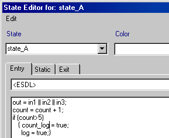

# Runtime Optimization - Actions or Conditions

If actions or conditions are specified with partly or totally the same functionality, this can be done either runtime-optimized or size-optimized. Runtime-optimized means that the code for each action and condition is inserted on the spot during code generation. No additional function call is required. The disadvantage is the repeatedly generated code and thus increased memory requirement.

This can be achieved by specifying the code explicitly at the state or condition and deactivating the options Outline Generated Methods (may be changed locally) and Outline automatically generated methods for State Machines (see prerequisites for outlining in [Optimizing the State Machine](SM_Optimizing_the_State_Machine.md)).

The optimization becomes even more effective if auto-inlining (see [Optimizing the State Machine](SM_Optimizing_the_State_Machine.md)) is activated. In that case, even actions/conditions specified in separate diagrams are inserted on the spot, if applicable.

With the Inline option in the implementation editor of an action/condition specified in a separate diagram, you can enforce inlining.

See also

[Optimizing the State Machine](SM_Optimizing_the_State_Machine.md)
