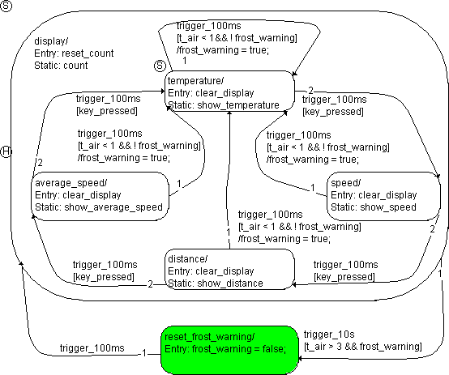

# Example 11: Transition to a Hierarchy State With History

The state machine is the same as in [Example 10: Transition to a Hierarchy State Without History](SM_Example_10__Transition_to_a_Hierarchy_State_Without_History.md). Now it has a history. The starting state is the same as in the previous example.

After the frost warning was displayed (frost_warning = true), the velocity display was selected so that the system was in the speed state. The temperature rose to 5 °C, and the transition from display to reset_frost_warning took place when the trigger event trigger_10s occurred.

The system is now in the reset_frost_warning state. A trigger event trigger_100ms occurs, and the following steps are performed:

1. The system checks to see if there is a valid transition from reset_frost_warning.
1. The transition from reset_frost_warning to display has no condition, it is therefore valid at every trigger_100ms trigger event.
1. The reset_frost_warning state has no exit action. It is deactivated.
1. The transition from reset_frost_warning to display has no transition action, and the display hierarchy state is activated next.
1. The reset_count entry action of the display hierarchy state is executed and completed.
1. Since display has a history ('H' in the above figure), the speed substate is activated. That state was active when the hierarchy state was left.
1. The entry action clear_display of the speed substate is executed and completed.

With that, the evaluation of the state machine initiated by the trigger_100ms trigger event is finished.

See also

[Example 10: Transition to a Hierarchy State Without History](SM_Example_10__Transition_to_a_Hierarchy_State_Without_History.md)
