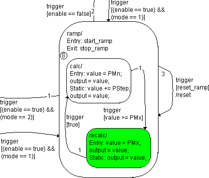

# Example 14: Loop

The source and destination states of a transition can be identical. Such loops are frequently used to specify the reset function of a hierarchy state.

The ramp hierarchy state from the state machine in [Example 13: Transition Between Hierarchy States](SM_Example_13__Transition_Between_Hierarchy_States.md) has now a reset function in the form of a loop, i.e. a transition from ramp to itself. The rest of the state diagram is left out for clarity.

The recalc substate in the ramp hierarchy state is active. A trigger event occurs, the reset button is pressed (reset_ramp = true). enable and mode remain unchanged. The following steps are executed:

1. The system checks to see if there is a valid transition.
1. The loop has the highest priority. The condition [reset_ramp] is fulfilled, the transition is valid.

Other transitions are not evaluated.

1. The recalc substate has no exit action, it is deactivated immediately.
1. The exit action stop_ramp of the ramp hierarchy state is executed and completed.
1. The ramp hierarchy state is deactivated.
1. The loop's transition action /reset is executed and completed.
1. The ramp hierarchy state is re-activated.
1. The entry action start_ramp of ramp is executed and completed.
1. The calc substate is the start state within the hierarchy. It is activated.
1. The entry action of calc is executed and completed.

With that, the evaluation of the state machine initiated by this trigger event is finished.

See also

[Example 13: Transition Between Hierarchy States](SM_Example_13__Transition_Between_Hierarchy_States.md)
