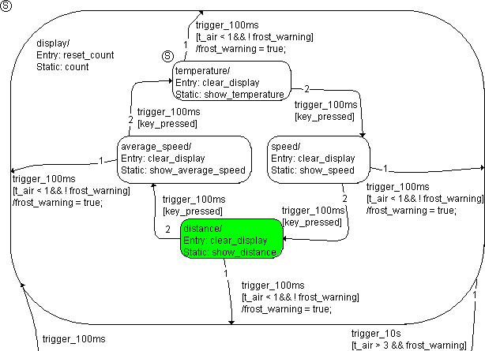

# Example 16: Transition From a Substate to a Hierarchy State

If the transition from a substate does not lead to another substate, but to the hierarchy state, the procedure is almost the same. The substate is left, the hierarchy state is left, too, and immediately re-entered. Depending on whether the hierarchy state has a history, either the most recently activated substate or the start state of the hierarchy is entered. This is another way to realize, for example, the frost warning.

The state machine is very similar to the [Example 10: Transition to a Hierarchy State Without History](SM_Example_10__Transition_to_a_Hierarchy_State_Without_History.md), except that here, the frost warning is implemented using transitions to the parent hierarchy state. It is in the distance state. frost_warning is false. A trigger event trigger_100ms occurs, the temperature drops to 0.5 °C. The switch is not pressed. The following steps are executed:

1. The system checks to see if there is a valid transition from distance.
1. Another trigger initiates the transition from display to reset_frost_warning, it is of no importance here.
1. The transition from distance to average_speed is evaluated. The condition [key_pressed] is not fulfilled, the transition is invalid.
1. The transition from distance to display has the condition [t_air < 1 && !frost_warning]. Both parts of the condition are true, the transition is valid.
1. The distance state has no exit action. It is deactivated.
1. The display hierarchy state has no exit action. It is deactivated.
1. The display hierarchy state is activated again.
1. The reset_count entry action of display is executed and completed.
1. The /frost_warning = true transition action is executed, and the frost warning appears.
1. The temperature substate is the start state in the hierarchy. It is activated as display does not have a history.
1. The entry action clear_display of temperature is executed and completed.

With that, the evaluation of the state machine initiated by the trigger_100ms trigger event is finished.

See also

[Example 10: Transition to a Hierarchy State Without History](SM_Example_10__Transition_to_a_Hierarchy_State_Without_History.md)
