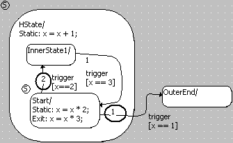

# Example 2: Error Generation

In the second example, the transition from State to OuterEnd has a lower priority. With activated Optimize Static Actions (Restricted Modeling) option, code cannot be generated.

| Column 1 | Column 2 |
| --- | --- |
| Option deactivated | Option activated |
| switch (_sm) { case InnerState1: if (_x == 3.0F) { _x = _x + 1.0F; _sm = Start; break; } _x = _x + 1.0F; break; case OuterEnd: break; case Start: default: if (_x == 2.0F) { _x = _x * 3.0F; _x = _x + 1.0F; _sm = InnerState1; } if (_x == 1.0F) { _x = _x * 3.0F; _sm = OuterEnd; break; } _x = _x * 2.0F; _x = _x + 1.0F; break; } | ERROR(YSm72): higher priority transitions do not exit hierarchy state "HState", but this transition does. |
