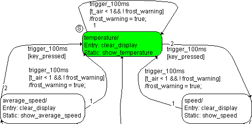

# Example 3: Loop

The state machine is the same as in Example 2. However, the entry action clear_display was added to the states. The state machine is in the temperature state. Otherwise, the starting state is the same as in the [previous example](SM_Example_2__Transitions_from_One_State.md). A trigger event trigger_100ms occurs and the switch is not pressed.

The following steps are executed:

1. The system checks to see if there is a valid transition from temperature.
1. The transition from temperature to speed has a higher priority, but the condition is not fulfilled. The transition is invalid.
1. The transition from temperature to itself has the condition [t_air < 1 && !frost_warning]. This is fulfilled, the transition is valid.
1. The temperature state has no exit action. It is deactivated.
1. The /frost_warning = true transition action is executed, and the frost warning appears.
1. The temperature state is activated.
1. The entry action clear_display of the temperature substate is executed and completed.

With that, the evaluation of the state machine initiated by the trigger_100ms trigger event is finished.
