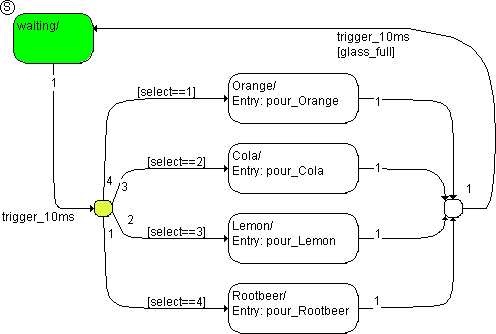

# Example 4: If…Then…Else Construction

This state machine models a simple drinks machine which offers four different drinks. The state machine is in the waiting state. A trigger event trigger_10ms occurs: someone wants Cola.

This sets the select selection to 2. The following steps are executed:

1. The system checks to see if there is a valid transition or a valid segment from waiting.

The transition segment from waiting to the left-hand junction is valid.

1. The transition segments leading away from the junction are examined in order of their priority, starting with the segment of the junction to state Orange.

The condition [select==1] is not fulfilled, the segment is invalid.

1. Next, the segment from the junction to state Cola is tested.

The condition [select==2] is fulfilled, the segment is valid. This means that there is a fully-valid transition available from the state waiting.

1. Only now does the transition occur. The state waiting has no exit action and is deactivated.
1. The Cola state is activated.
1. The pour_Cola entry action is executed and completed.

With that, the evaluation of the state machine initiated by this trigger event is finished.
