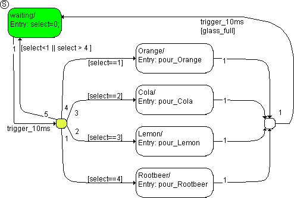

# Example 6: Loop construction

The state machine is the same as in [Example 4: If…Then…Else Construction](SM_Example_4_If_Then_Else_Construction.md). The addition is a transition segment away from the junction back to the state waiting and the entry action in waiting.

The state machine is in the state waiting; a trigger event trigger_10ms occurs. By mistake, the selection select is set to 5. The following steps are executed:

1. The system checks to see if there is a valid transition or a valid segment from waiting.

The transition segment from waiting to the left-hand junction is valid.

1. The transition segments leading away from the junction are examined in the order of their priorities, starting with the segment of the junction back to the state waiting.

The condition [select<1 || select > 4] is fulfilled, the segment is valid. This means that there is a complete, valid transition available from the state waiting.

1. The waiting state has no exit action. It is deactivated.
1. The transition from waiting to waiting has no transition action, and therefore the state waiting is reactivated.
1. The entry action select=0; from waiting is executed and completed.

With that, the evaluation of the state machine initiated by this trigger event is finished.

This loop construction corresponds to a direct transition from a state to itself from [Example 3: Loop](SM_Example_3__Loop.md).

See also

[Example 4: If…Then…Else Construction](SM_Example_4_If_Then_Else_Construction.md)

[Example 3: Loop](SM_Example_3__Loop.md)
