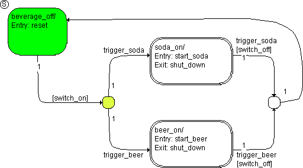

# Example 8: Transitions from a Start State to Different Destination States (Multiple Triggers)

This state machine describes a drinks machine which offers different types of sodas or beers. The actual choice takes place in the hierarchy states soda_on and beer_on, it is irrelevant for the example. [Hierarchical State Machines](SM_Hierarchical_State.md) describes the semantics of hierarchical state machines.

The state machine is in the starting state beverage_off. A trigger event trigger_soda occurs and the machine is switched on (switch_on is true). The following steps are executed:

1. The system checks to see if there is a valid transition or a segment from beverage_off.
1. The transition segment from beverage_off to the junctions is valid, as the condition [switch_on] is fulfilled. As the trigger event trigger_soda has occurred, the segment from the junction in the state soda_on is also valid, the transition can occur.
1. The beverage_off state has no exit action. It is deactivated.
1. The transition from beverage_off to soda_on has no transition action. Therefore, the state soda_on is activated next.
1. The entry action start_soda of soda_on is executed and completed.
1. The necessary steps in the hierarchy state are executed.

With that, the evaluation of the state machine initiated by this trigger event is finished.

See also

[Hierarchical State Machines](SM_Hierarchical_State.md)
