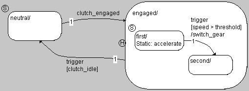

# Example: Actions

When, in this example, the first state is active, and no transition occurs, the static action accelerate is executed. At the transition from first to second, the transition action switch_gear is executed.
