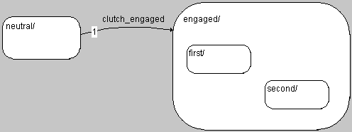

# Example: Hierarchy State

The state diagram shown here has a hierarchy state that contains two substates. (Some transitions are left out for clarity.)

The hierarchy state engaged contains the two substates first and second. This makes engaged the parent state of first and second. When the trigger event clutch_engaged occurs, the system transitions from the neutral state to the hierarchy state engaged.

Far more complicated structures are possible, including nested hierarchies.
