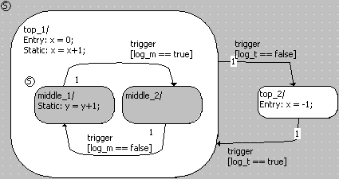

# Hierarchical Code Generation - Example

An example illustrates the difference in the generated code.

The reduced code size does not show in the generated C file, but in the generated executable file.

Code was generated with the PC target, for Physical experiment. The transition from top_1 to top_2 is set in boldface.

| Column 1 | Column 2 |
| --- | --- |
| Hierarchical Code Generation | Flat Code Generation |
| switch (self-> _ASCET_smLevel_0->val) { case top_2 : { if (self->log_t->val) { self->x->val = 0.0; self-> _ASCET_smLevel_0->val = top_1; self->sm->val = middle_1; break; } break; } case top_1 : default: { if (!self->log_t->val) { self->x->val = -1.0; self-> _ASCET_smLevel_0->val = top_2; self->sm->val = top_2; break; } switch (self->sm->val) { case middle_2 : { if (!self->log_m->val) { self->x->val = self->x->val + 1.0; self->sm->val =middle_1; break; } self->x->val = self->x->val + 1.0; break; } case middle_1 : default: { if (self->log_m->val) { self->x->val = self->x->val + 1.0; self->sm->val = middle_2; break; } self->y->val = self->y->val + 1.0; self->x->val = self->x->val + 1.0; break; } } break; } } | switch (self->sm->val) { case middle_2 : { if (!self->log_t->val) { self->x->val = -1.0; self->sm->val = top_2; break; } if (!self->log_m->val) { self->x->val = self->x->val + 1.0; self->sm->val = middle_1; break; } self->x->val = self->x->val + 1.0; break; } case top_2 : { if (self->log_t->val) { self->x->val = 0.0; self->sm->val = middle_1; break; } break; } case middle_1 : default: { if (!self->log_t->val) { self->x->val = -1.0; self->sm->val = top_2; break; } if (self->log_m->val) { self->x->val = self-> x->val + 1.0; self->sm->val = middle_2; break; } self->y->val = self->y-> val + 1.0; self->x->val = self->x->val + 1.0; break; } } |
