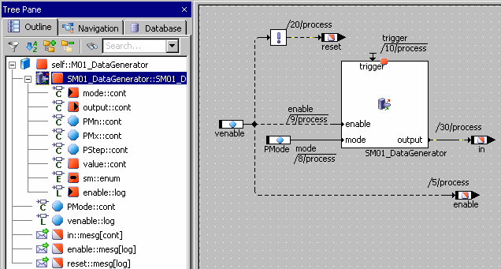

# State Machines as Classes

A state machine is a class with special description means. The trigger, condition and actions are modelled as special methods:

- A trigger is a public method without a return value. The state machine is executed whenever a trigger is started.
- A condition is a private method with a return value of type logical.
- An action is a private method. An action has, as standard, no arguments and no return value.

If necessary, you can add arguments to any of these methods, for communication with other ASCET components. You can also add a return value to an action. However, such an action can no longer be assigned in an <action> tab of the state or transition editor. If the action was already assigned before you added the return value, it remains assigned, but a warning is issued during code generation.

Inputs and outputs serve for the integration of the state machine with other components. The input values are buffered to internal variables and can therefore be used in all computations of the state machine (in contrast to arguments of a method, those can only be used in the method itself). The outputs are also buffered, so they can be read without invoking the computation of the state machine. Each input and output needs its own sequence call (see [Sequence Calls](BlockDiagramEditorEnglishUS.chm::/BDE_SequenceCalls.htm)).

This type of external communication is, however, memory intensive as a variable must be reserved in the RAM for each input and output. To reduce the static RAM requirement, you can add arguments to the triggers (and to arguments and conditions, if these are specified in a separate diagram), see [Trigger Arguments for External Communication](SM_Trigger_Arguments_for_Communication.md).

See also

[Trigger Arguments for External Communication](SM_Trigger_Arguments_for_Communication.md)

[Rules for Trigger Arguments](SM_Rules_for_Trigger_Arguments.md)

[Block Diagram Editor - Sequence Calls](BlockDiagramEditorEnglishUS.chm::/BDE_SequenceCalls.htm)
