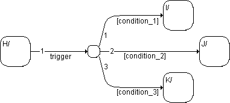

# Transitions with Junctions

All types of transitions can contain junctions (see [Junctions](sm_junctions.md)). Here, just one of the many possible examples is shown.

If state H is active and the trigger event trigger occurs, the system leaves state H. In the junction, the conditions to the leading transition segments ([condition_1], [condition_2], [condition_3]) are tested in sequence for their priority. If, for example, the condition [condition_2] is fulfilled, transition to state J occurs. If none of the conditions are fulfilled, the system remains in the start state H.

See also

[Junctions](sm_junctions.md)
