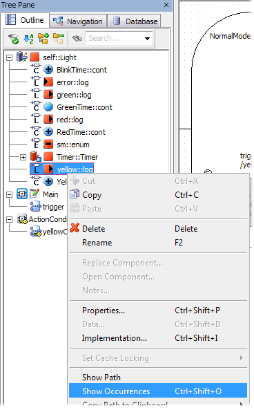
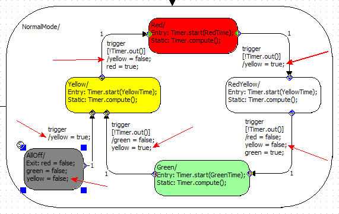

# Example: Show Occurrences

The output yellow is selected in the Outline tab; Show Occurrences is selected from the context menu.

The state AllOff and all transitions in the hierarchy state use the output yellow. They are highlighted:

