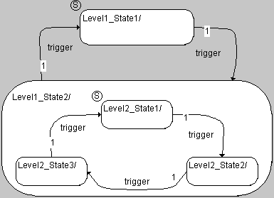
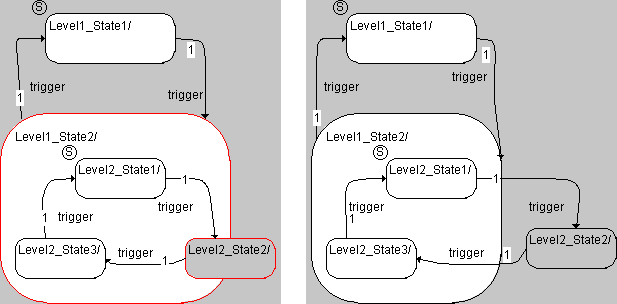

# Adding an Open Hierarchy State

To add an open hierarchy state, proceed as follows:

1. Increase the area of the state that is to contain the hierarchy by dragging the handles.
1. Add all the necessary states and transitions for the subdiagram to the state symbol in the selected hierarchy state.
1. Select a state intended as the start state for the subdiagram.

The method used to create a state diagram within a state symbol is identical to creating a state diagram in the drawing area.

Transitions from a substate to a state outside the hierarchy are possible. Keep in mind, however, that different actions are performed upon a transition between different hierarchy levels than upon a transition within the same hierarchy level (see [Example 12](SM_Example_12__Transition_Within_a_Hierarchy_State.md) and [Example 15](SM_Example_15__Transition_Between_Substates_of_Different_Hierarchies.md)). A state is considered outside a hierarchy when it is placed fully or partly outside the hierarchy state (state Level2_State2 in the figure).

As with closed hierarchy states, the user can set up a hierarchy state with a history.
