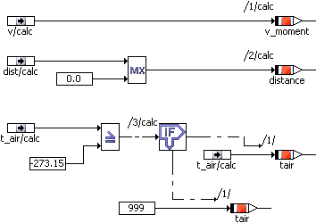

# Using a Public Method for External Communication

The methods are specified as described in [The Block Diagram Editor](BlockDiagramEditorEnglishUS.chm::/BDE_Overview.htm). Some examples are listed in the following, but the list is by no means complete.

To use a public method for external communication, proceed as follows:

1. [Create a public method](add_public_method.md) in a public diagram.
1. Add the required arguments as described in [Adding an Argument to the Method](blockdiagrameditorenglishus.chm::/Addargument.htm).

The arguments can be read only within the method. To be available in the state machine, their values have to be assigned to variables.

1. Add the respective number of variables.
1. Connect each argument with a variable.

The variables can be used in the entire state machine. The figure lists examples to process or check the input values in the method.

See also

[Creating a Public Diagram](SM_create_public_diagram.md)

[Adding a Public Method](add_public_method.md)

[Adding an Argument to the Method](blockdiagrameditorenglishus.chm::/Addargument.htm)

[Block Diagram Editor - Overview](BlockDiagramEditorEnglishUS.chm::/BDE_Overview.htm)

[ESDL Editor - Overview](ESDLEditorEnglishUS.chm::/ESDL_Overview.htm)
