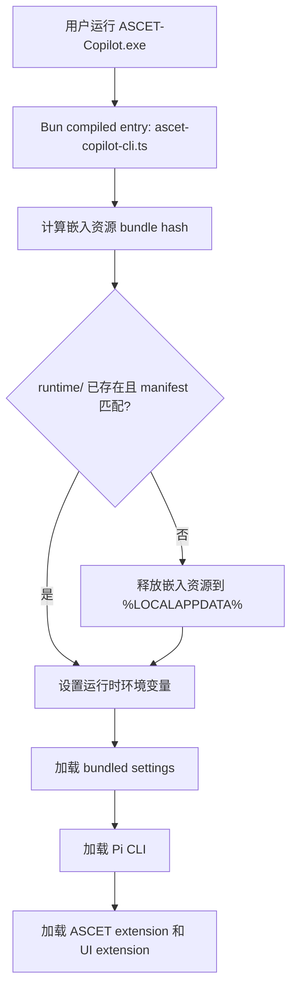

# ASCET Copilot 单 exe 发布执行任务方案

## 1. 目标

实现一个面向 Windows x64 的 ASCET Copilot 单 exe 发布形态：

```text
ASCET-Copilot.exe
```

用户侧目标体验：

```powershell
.\ASCET-Copilot.exe
```

首次运行时，exe 自动释放内置运行资源到本机缓存目录，然后从该缓存目录启动 Pi 和 ASCET 相关扩展。用户不需要执行 `npm install`，也不需要手动复制 `node_modules`。

关键约束：

- `Etas.AscetNET.dll` 必须便于替换。
- 不把 `node_modules` 提交到 Git。
- 不要求真正“零落盘”运行；允许首次运行释放 runtime 资源。
- 用户看到的主入口是一个 exe。

## 2. 最终交付物

第一版发布产物：

```text
dist-release\
  ASCET-Copilot.exe
  replace-ascet-dll.ps1
  README-RUN.md
  ASCET-Copilot.manifest.json
```

可选归档产物：

```text
dist-release\
  ASCET-Copilot-windows-x64-YYYYMMDD-HHMM.zip
```

运行时释放目录：

```text
%LOCALAPPDATA%\AscetCopilotPi\
  runtime\
    <bundle-hash>\
      package.json
      README.md
      CHANGELOG.md
      photon_rs_bg.wasm
      theme\
      assets\
      export-html\
      docs\
      examples\
      native\
      node_modules\
      packages\
        ascet-extension\
        Pi-ascet-ui-extension\
      .pi\
        settings.json

  overrides\
    Ascetapidll\
      Etas.AscetNET.dll
```

便携覆盖目录：

```text
<ASCET-Copilot.exe 所在目录>\
  overrides\
    Ascetapidll\
      Etas.AscetNET.dll
```

## 3. 架构方案

### 3.1 打包模型

采用：

```text
Bun compiled executable + embedded resource files + first-run extraction
```

不是采用：

```text
纯源码 zip + portable Node
```

也不是采用：

```text
所有资源永远留在 Bun 虚拟文件系统里运行
```

原因：

- TUI 的 native `.node` helper 需要真实文件路径。
- ASCET 的 `Etas.AscetNET.dll` 需要真实文件路径，且必须支持替换。
- Pi 的 package、extension、theme、prompt、skill 加载机制依赖目录扫描。
- 用户配置、session、日志必须写入真实文件系统。

### 3.2 启动流程



### 3.3 DLL 替换优先级

`Etas.AscetNET.dll` 生效路径按以下优先级解析：

```text
1. ASCET_NET_DLL_PATH 环境变量
2. exe 同级 overrides\Ascetapidll\Etas.AscetNET.dll
3. %LOCALAPPDATA%\AscetCopilotPi\overrides\Ascetapidll\Etas.AscetNET.dll
4. runtime\<bundle-hash>\packages\ascet-extension\ascet-cli\bin\Ascetapidll\Etas.AscetNET.dll
```

必须保证这一路径解析是集中实现，不允许业务代码分散硬编码：

```text
packages\ascet-extension\ascet-cli\bin\Ascetapidll\Etas.AscetNET.dll
```

## 4. 新增文件规划

### 4.1 构建脚本

```text
scripts\build-ascet-copilot-single-exe.mjs
```

职责：

- 构建 Pi packages。
- 准备 ASCET runtime bundle。
- 生成嵌入资源清单 TypeScript 文件。
- 调用 Bun compile 生成 `ASCET-Copilot.exe`。
- 写入替换 DLL 脚本、运行 README、manifest。
- 执行基础自检。

### 4.2 Bun 入口

```text
packages\coding-agent\src\bun\ascet-copilot-cli.ts
```

职责：

- 设置 `process.title`。
- 禁用不必要 warning。
- 调用 runtime extractor。
- 设置运行时环境变量。
- 启动原 Pi CLI。

### 4.3 Runtime 释放器

```text
packages\coding-agent\src\bun\ascet-runtime-extractor.ts
```

职责：

- 读取嵌入资源清单。
- 计算 bundle hash。
- 判断 runtime 是否已释放。
- 安全写入 runtime 目录。
- 写入 extraction manifest。
- 返回 runtime 路径信息。

### 4.4 嵌入资源清单

```text
packages\coding-agent\src\bun\ascet-embedded-assets.generated.ts
```

职责：

- 由构建脚本生成。
- 使用 Bun `with { type: "file" }` 引入每个资源文件。
- 映射原始相对路径到 Bun embedded file path。

示例：

```ts
import asset0 from "../../../.ascet-copilot-bundle/package.json" with { type: "file" };
import asset1 from "../../../.ascet-copilot-bundle/theme/dark.json" with { type: "file" };

export const ASCET_EMBEDDED_ASSETS = [
  { path: "package.json", embeddedPath: asset0 },
  { path: "theme/dark.json", embeddedPath: asset1 },
] as const;
```

### 4.5 DLL Resolver

```text
packages\ascet-extension\src\ascet-net-dll-resolver.ts
```

职责：

- 集中解析 `Etas.AscetNET.dll`。
- 输出当前使用来源。
- 给诊断命令和运行时调用共用。

接口建议：

```ts
export type AscetNetDllSource =
  | "env"
  | "portable-override"
  | "user-override"
  | "bundled";

export interface AscetNetDllResolution {
  path: string;
  source: AscetNetDllSource;
  exists: boolean;
}

export function resolveAscetNetDllPath(defaultRuntimeDllPath: string): AscetNetDllResolution;
```

### 4.6 替换 DLL 脚本

```text
scripts\templates\replace-ascet-dll.ps1
```

发布时复制到：

```text
dist-release\replace-ascet-dll.ps1
```

脚本行为：

```powershell
.\replace-ascet-dll.ps1 -DllPath "D:\ETAS\Etas.AscetNET.dll"
```

复制到：

```text
<exe 同级>\overrides\Ascetapidll\Etas.AscetNET.dll
```

### 4.7 自检脚本

```text
scripts\test-ascet-copilot-single-exe.ps1
```

职责：

- 运行 `ASCET-Copilot.exe --help`。
- 运行 `ASCET-Copilot.exe --list-models`。
- 设置 `PI_OFFLINE=1` 再运行模型列表。
- 检查 runtime 目录是否生成。
- 检查 DLL resolver 是否能识别 bundled DLL 和 override DLL。

## 5. 构建资源清单

构建脚本应创建临时 bundle 目录：

```text
.ascet-copilot-bundle\
```

该目录是生成中间产物，不提交 Git。

### 5.1 官方 Pi binary release 资源

参考当前 `scripts\build-binaries.sh`，需要包含：

```text
package.json
README.md
CHANGELOG.md
photon_rs_bg.wasm
theme\
assets\
export-html\
docs\
examples\
native\
node_modules\@mariozechner\clipboard\
node_modules\@mariozechner\clipboard-win32-x64-msvc\
```

### 5.2 ASCET Copilot 资源

新增包含：

```text
packages\ascet-extension\
packages\Pi-ascet-ui-extension\
.pi\settings.json
```

如果 `.pi/settings.json` 中仍保留 npm package：

```text
npm:pi-subagents
npm:@juicesharp/rpiv-todo
npm:@juicesharp/rpiv-ask-user-question
```

则第一版还需要包含：

```text
.pi\npm\
```

否则离线启动可能会尝试安装缺失 package。

### 5.3 排除规则

复制 ASCET package 时排除：

```text
.git
node_modules
tmp
dist-release
.worktrees
*.log
*.tsbuildinfo
coverage
```

但不要排除：

```text
packages\ascet-extension\ascet-cli\bin\Ascetapidll\Etas.AscetNET.dll
```

该 DLL 是 bundled fallback，必须进入 runtime bundle。

## 6. 详细任务拆分

### 任务 1：确认当前 runtime 依赖面

目标：

- 列出当前 `pi-windows-x64` 外部资源。
- 列出 ASCET 扩展额外资源。
- 明确哪些资源必须真实落盘。

执行：

```powershell
Get-ChildItem E:\Rep\pi-windows-x64 -Force
Get-ChildItem E:\Rep\AscetAgent\PI\packages\ascet-extension -Force
Get-ChildItem E:\Rep\AscetAgent\PI\packages\Pi-ascet-ui-extension -Force
```

验收：

- 形成 bundle 文件清单。
- 确认 `Etas.AscetNET.dll` 包含在清单内。

### 任务 2：实现 DLL Resolver

目标：

- 替换所有硬编码 ASCET .NET DLL 的调用路径。

执行：

1. 新增 `ascet-net-dll-resolver.ts`。
2. 搜索硬编码：

```powershell
rg "Etas\.AscetNET\.dll|Ascetapidll" packages\ascet-extension
```

3. 改为调用 resolver。
4. 增加单元测试。

验收：

```powershell
.\node_modules\.bin\tsx.cmd --test packages\ascet-extension\src\ascet-net-dll-resolver.test.ts
```

测试覆盖：

- 环境变量优先。
- exe 同级 override 次优先。
- `%LOCALAPPDATA%` override 次优先。
- bundled fallback 最后。
- 路径不存在时能报告 `exists=false`。

### 任务 3：增加 DLL 状态诊断命令

目标：

- 用户能看到当前使用哪个 DLL。

方案：

新增 CLI 参数或扩展命令：

```text
--ascet-dll-status
```

输出示例：

```text
ASCET .NET DLL
source: portable-override
path:   E:\Tools\ASCET-Copilot\overrides\Ascetapidll\Etas.AscetNET.dll
exists: true
```

验收：

```powershell
.\pi-test.ps1 --ascet-dll-status
```

### 任务 4：实现 runtime extractor

目标：

- 启动时从 Bun embedded files 释放资源到 `%LOCALAPPDATA%`。

实现要点：

- 使用 `ASCET_EMBEDDED_ASSETS` 遍历文件。
- 每个资源复制到：

```text
%LOCALAPPDATA%\AscetCopilotPi\runtime\<bundle-hash>\<relative-path>
```

- 写入：

```text
runtime\<bundle-hash>\.ascet-copilot-runtime.json
```

内容：

```json
{
  "bundleHash": "...",
  "createdAt": "...",
  "fileCount": 1234,
  "version": "..."
}
```

验收：

- 重复运行不会重复释放。
- hash 变化后释放到新目录。
- 旧目录暂不自动删除，避免误删用户检查文件。

### 任务 5：实现 ASCET Copilot Bun 入口

目标：

- 生成专用 exe 入口，不影响官方 `pi.exe`。

入口文件：

```text
packages\coding-agent\src\bun\ascet-copilot-cli.ts
```

伪代码：

```ts
import { APP_NAME } from "../config.ts";
import { ensureAscetRuntime } from "./ascet-runtime-extractor.ts";

process.title = "ASCET Copilot";
process.emitWarning = (() => {}) as typeof process.emitWarning;

const runtime = await ensureAscetRuntime();

process.env.PI_PACKAGE_DIR = runtime.packageDir;
process.env.ASCET_COPILOT_RUNTIME_DIR = runtime.runtimeDir;
process.env.ASCET_COPILOT_BUNDLED_SETTINGS = runtime.bundledSettingsPath;

await import("./restore-sandbox-env.ts").then((m) => m.restoreSandboxEnv());
await import("./register-bedrock.ts");
await import("../cli.ts");
```

验收：

```powershell
bun build --compile --target=bun-windows-x64 packages/coding-agent/src/bun/ascet-copilot-cli.ts --outfile dist-release/ASCET-Copilot.exe
.\dist-release\ASCET-Copilot.exe --help
```

### 任务 6：支持 bundled settings

目标：

- exe 解压后的 `.pi/settings.json` 能作为内置默认配置加载。

新增环境变量：

```text
ASCET_COPILOT_BUNDLED_SETTINGS
```

加载优先级：

```text
bundled settings
< user global settings
< project .pi/settings.json
< CLI flags
```

实现位置：

- 优先在 settings manager 初始化或配置合并处处理。
- 不要把 bundled settings 写入用户目录。

验收：

- 在任意 cwd 运行 `ASCET-Copilot.exe`，仍能加载 ASCET extension。
- 用户项目自己的 `.pi/settings.json` 可以覆盖或禁用相关资源。

### 任务 7：实现构建脚本

目标：

新增：

```text
scripts\build-ascet-copilot-single-exe.mjs
```

脚本步骤：

1. 校验 repo root。
2. 校验 Bun 可用。
3. 执行：

```powershell
npm run build
```

4. 清理并重建：

```text
.ascet-copilot-bundle
dist-release
```

5. 复制资源。
6. 生成 embedded assets TS。
7. 执行 Bun compile：

```bash
bun build --compile --target=bun-windows-x64 \
  packages/coding-agent/src/bun/ascet-copilot-cli.ts \
  packages/coding-agent/src/utils/image-resize-worker.ts \
  --outfile dist-release/ASCET-Copilot.exe
```

8. 写入：

```text
dist-release\replace-ascet-dll.ps1
dist-release\README-RUN.md
dist-release\ASCET-Copilot.manifest.json
```

验收：

```powershell
node scripts\build-ascet-copilot-single-exe.mjs
Test-Path .\dist-release\ASCET-Copilot.exe
```

### 任务 8：实现替换 DLL 脚本

目标：

- 让用户无需理解 runtime hash 目录也能替换 DLL。

脚本：

```powershell
param(
  [Parameter(Mandatory = $true)]
  [string]$DllPath
)

$ErrorActionPreference = "Stop"

if (-not (Test-Path -LiteralPath $DllPath)) {
  throw "DLL not found: $DllPath"
}

$target = Join-Path $PSScriptRoot "overrides\Ascetapidll\Etas.AscetNET.dll"
New-Item -ItemType Directory -Path (Split-Path $target) -Force | Out-Null
Copy-Item -LiteralPath $DllPath -Destination $target -Force

Write-Host "ASCET DLL override installed:"
Write-Host $target
```

验收：

```powershell
.\dist-release\replace-ascet-dll.ps1 -DllPath "D:\ETAS\Etas.AscetNET.dll"
.\dist-release\ASCET-Copilot.exe --ascet-dll-status
```

### 任务 9：实现发布包 README

目标：

生成：

```text
dist-release\README-RUN.md
```

必须包含：

- 如何启动。
- 如何配置 API key。
- 如何替换 `Etas.AscetNET.dll`。
- runtime 缓存目录在哪里。
- 如何清理 runtime 缓存。
- 如何报告版本和 manifest。

验收：

- 非开发用户按 README 能完成首次启动和 DLL 替换。

### 任务 10：实现自检脚本

目标：

新增：

```text
scripts\test-ascet-copilot-single-exe.ps1
```

检查项：

```powershell
.\ASCET-Copilot.exe --help
.\ASCET-Copilot.exe --list-models
$env:PI_OFFLINE = "1"
.\ASCET-Copilot.exe --list-models
Remove-Item Env:\PI_OFFLINE
.\ASCET-Copilot.exe --ascet-dll-status
```

验收：

- 任一失败返回非 0。
- 输出明确失败阶段。
- 不依赖源码仓库路径。

## 7. 验收矩阵

### 7.1 构建机验收

```powershell
cd E:\Rep\AscetAgent\PI
npm run build
node scripts\build-ascet-copilot-single-exe.mjs
```

通过条件：

- 生成 `dist-release\ASCET-Copilot.exe`。
- 生成 manifest。
- 生成替换 DLL 脚本。

### 7.2 干净目录验收

```powershell
New-Item -ItemType Directory C:\Temp\ascet-single-exe-test -Force
Copy-Item E:\Rep\AscetAgent\PI\dist-release\ASCET-Copilot.exe C:\Temp\ascet-single-exe-test\
Copy-Item E:\Rep\AscetAgent\PI\dist-release\replace-ascet-dll.ps1 C:\Temp\ascet-single-exe-test\
cd C:\Temp\ascet-single-exe-test
.\ASCET-Copilot.exe --help
.\ASCET-Copilot.exe --list-models
```

通过条件：

- 不依赖 `E:\Rep\AscetAgent\PI`。
- 能自动生成 `%LOCALAPPDATA%\AscetCopilotPi\runtime\<hash>`。

### 7.3 DLL 替换验收

```powershell
cd C:\Temp\ascet-single-exe-test
.\replace-ascet-dll.ps1 -DllPath "D:\ETAS\Etas.AscetNET.dll"
.\ASCET-Copilot.exe --ascet-dll-status
```

通过条件：

- 输出 `source: portable-override`。
- 输出路径为 exe 同级 `overrides`。

### 7.4 环境变量覆盖验收

```powershell
$env:ASCET_NET_DLL_PATH = "D:\ETAS\Other\Etas.AscetNET.dll"
.\ASCET-Copilot.exe --ascet-dll-status
Remove-Item Env:\ASCET_NET_DLL_PATH
```

通过条件：

- 输出 `source: env`。

### 7.5 离线验收

```powershell
$env:PI_OFFLINE = "1"
.\ASCET-Copilot.exe --list-models
Remove-Item Env:\PI_OFFLINE
```

通过条件：

- 不尝试安装 npm package。
- 不报缺失 extension/package。

## 8. 提交拆分建议

不要一次提交所有内容。建议拆成 5 个提交：

### Commit 1：DLL resolver

```text
Add ASCET .NET DLL resolver
```

包含：

- `ascet-net-dll-resolver.ts`
- resolver 测试
- 替换硬编码路径

### Commit 2：runtime extractor

```text
Add ASCET Copilot runtime extractor
```

包含：

- `ascet-runtime-extractor.ts`
- 小规模嵌入资源测试

### Commit 3：single exe entry

```text
Add ASCET Copilot Bun executable entry
```

包含：

- `ascet-copilot-cli.ts`
- bundled settings 支持

### Commit 4：build script

```text
Add ASCET Copilot single-exe build script
```

包含：

- `build-ascet-copilot-single-exe.mjs`
- generated assets 生成逻辑
- manifest 生成逻辑

### Commit 5：release scripts and docs

```text
Add ASCET Copilot release helpers
```

包含：

- `replace-ascet-dll.ps1`
- `test-ascet-copilot-single-exe.ps1`
- `README-RUN.md` 模板

## 9. 风险控制

### 9.1 Bun embedded file 数量过多

风险：

- 资源文件很多，生成 TS import 文件可能很大。

处理：

- 第一版可以把资源先打成一个 `.tar` 或 `.zip`，只嵌入一个 bundle 文件。
- 启动时解压该 bundle。

建议优先采用单 bundle 文件，而不是每个资源一个 import。

推荐形态：

```text
.ascet-copilot-bundle.tar
```

嵌入：

```ts
import bundlePath from "../../../.ascet-copilot-bundle.tar" with { type: "file" };
```

### 9.2 解压工具依赖

风险：

- Windows 上 Node 标准库没有内置 tar 解压高级能力。

处理：

- 方案 A：不用 tar，构建脚本生成每文件 import 清单。
- 方案 B：使用 zip，但要引入解压依赖。
- 方案 C：使用自定义简单 bundle 格式。

第一版建议：

- 使用每文件 import 清单，避免引入解压库。

### 9.3 native addon 不能从虚拟路径加载

处理：

- 强制释放 `native` 和 `.node` 到真实 runtime 目录。
- TUI 当前已经会查找 `path.dirname(process.execPath)`；需要增加 `ASCET_COPILOT_RUNTIME_DIR` 或 `PI_PACKAGE_DIR` 查找路径。

### 9.4 用户覆盖 DLL 被 runtime 更新覆盖

处理：

- override 目录永远不放在 `runtime\<hash>` 里面。
- runtime 更新只写 `runtime\<hash>`。
- override 目录独立存在。

### 9.5 用户不清楚实际使用哪个 DLL

处理：

- 必须实现 `--ascet-dll-status`。
- ASCET 初始化失败时错误信息带上 DLL resolution detail。

## 10. 第一版最小可交付范围

第一版不追求所有功能完整，只要求：

- `ASCET-Copilot.exe` 能启动。
- 能释放 runtime。
- 能加载 ASCET UI extension。
- 能加载 ASCET tools extension。
- `Etas.AscetNET.dll` 能通过 exe 同级 override 替换。
- 有 `--ascet-dll-status`。

暂不要求：

- 自动清理旧 runtime。
- 多平台。
- 安装器。
- 真正零落盘。
- GUI 桌面快捷方式。

## 11. 推荐执行顺序

实际开发按这个顺序推进：

```text
1. 做 DLL resolver
2. 做 --ascet-dll-status
3. 做 ascet-runtime-extractor 最小原型
4. 做 ascet-copilot-cli
5. 做 bundled settings 合并
6. 做 build script
7. 嵌入官方 Pi 资源
8. 嵌入 ASCET 资源
9. 做 replace-ascet-dll.ps1
10. 做 release 自检
11. 打包并在干净目录验证
```

每一步都要保持可运行，不要等最后才集成。

## 12. 完成定义

本方案完成时，必须满足：

```powershell
cd E:\Rep\AscetAgent\PI
node scripts\build-ascet-copilot-single-exe.mjs

cd C:\Temp
New-Item -ItemType Directory .\ascet-single-exe-final -Force
Copy-Item E:\Rep\AscetAgent\PI\dist-release\ASCET-Copilot.exe .\ascet-single-exe-final\
Copy-Item E:\Rep\AscetAgent\PI\dist-release\replace-ascet-dll.ps1 .\ascet-single-exe-final\
cd .\ascet-single-exe-final

.\ASCET-Copilot.exe --help
.\ASCET-Copilot.exe --list-models
.\ASCET-Copilot.exe --ascet-dll-status
.\replace-ascet-dll.ps1 -DllPath "D:\ETAS\Etas.AscetNET.dll"
.\ASCET-Copilot.exe --ascet-dll-status
```

并且：

- 不依赖源码目录。
- 不需要 `npm install`。
- 不需要提交 `node_modules`。
- DLL 替换路径清晰。
- 出错时能定位是 runtime extraction、package loading 还是 DLL resolution。
