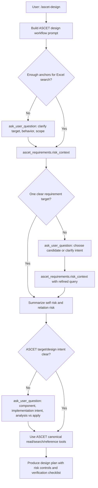

# ASCET Design Requirements Risk Retrieval Implementation Plan

> **For Claude:** REQUIRED SUB-SKILL: Use superpowers:executing-plans to implement this plan task-by-task.

**Goal:** Add `/ascet-design` as a guided ASCET design workflow whose first phase actively clarifies the user's requirement, retrieves related Excel risk history through `ascet_requirements`, and only then continues into ASCET design analysis.

**Architecture:** Implement one new read-only model tool, `ascet_requirements`, backed by ExcelJS and isolated requirement-risk modules. Register one human slash command, `/ascet-design`, that injects a workflow prompt requiring `ask_user_question` whenever the requirement is too vague for reliable Excel retrieval or ASCET design. Keep Excel retrieval, clarification, ASCET live discovery, and write planning as separate phases.

**Tech Stack:** TypeScript, PI extension command API, TypeBox schemas, ExcelJS for `.xlsx` parsing, Vitest tests under `packages/coding-agent/test`, existing ASCET canonical tools (`ascet_status`, `ascet_explore`, `ascet_search`, `ascet_read`, `ascet_reference`, `ascet_diff`, `ascet_verify`, guarded `ascet_write` later only when explicitly requested).

---

## Business Intent

The user enters a requirement, signal name, function description, design intention, or partial idea through:

```text
/ascet-design <requirement or design request>
```

The workflow must not jump directly into ASCET design. It must first understand what the user means well enough to search the requirements Excel, then retrieve historical risk evidence:

- Single item risk: risks attached to the matched requirement itself.
- Multi item risk: risks from related requirements, signals, reused signals, features, CCPs, defects, SWIM records, lessons learned, and Supplier Comments.
- Skill/workflow risk: known design and verification concerns that should shape the ASCET implementation plan.

The Excel file is treated as a historical risk knowledge base, not just a table. `Supplier Comments`, `Bosch Defect`, `COEM SWIM`, and `LL` are first-class evidence fields.

## Key Product Decision

`/ascet-design` and `ascet_requirements` are different surfaces:

- `/ascet-design`: human-facing slash command and workflow entry.
- `ascet_requirements`: model-facing read-only tool for Excel indexing, search, and risk context retrieval.

Do not make `ascet_requirements` a generic Excel tool. It is a domain tool for requirement-risk retrieval before ASCET design.

## Clarification Policy For `/ascet-design`

The command must actively encourage `ask_user_question`, but it should not ask unnecessary questions when the input is already searchable.

### When To Ask Before Searching

The workflow prompt must require `ask_user_question` before `ascet_requirements.risk_context` when any of these are true:

- The input is only a broad theme, for example "wheel speed logic" without signal, behavior, feature, or expected change.
- The input contains multiple unrelated requirements and the intended primary target is unclear.
- The user asks for design implementation but omits the functional change or expected behavior.
- The Excel source is missing or multiple candidate Excel files exist.
- The target vehicle/platform/variant/feature scope matters but is absent.

Recommended pre-search question fields:

```text
1. What is the primary requirement, signal, or function name?
2. What behavior should be added, changed, or verified?
3. Which feature/component/scope should the search prioritize?
```

Ask at most 3 concise questions in one `ask_user_question` call. If `ask_user_question` is unavailable, ask one concise blocking question in chat.

### When To Search First

The workflow should search immediately when the input includes at least one strong anchor:

- Requirement ID, for example `907829`.
- Exact or likely signal name, for example `WhlSlipSt` or `VehSpdLgtQf`.
- Specific function and feature terms that can form a useful query.

After searching, ask a follow-up question only if the result set is ambiguous.

### When To Ask After Search

After `ascet_requirements.risk_context`, call `ask_user_question` when:

- Multiple candidates have similar scores and no single target is safe to select.
- Related-risk expansion returns contradictory signals or features.
- Historical defects suggest alternative interpretations.
- The design intent is still unclear after risk retrieval.

Recommended post-search question:

```text
I found several likely requirement targets. Which one should drive the ASCET design?
```

Include candidate requirement IDs, names, and signals in the options or question body.

### When To Ask Before ASCET Live Design

Before using ASCET live tools for design discovery, ask if:

- The component/module/class target is unknown and the Excel result does not identify it.
- The user has not said whether they want analysis only or actual implementation.
- The design would affect write behavior, generated code, interfaces, calibration, BDE wiring, or reused signals.

The workflow must not call `ascet_write` or `ascet_batch_write` unless the user explicitly asks to apply changes.

## Target User Flow



## Tool Contract

### Tool Name

```text
ascet_requirements
```

### Actions

```ts
type AscetRequirementsAction =
  | "status"
  | "index"
  | "search"
  | "risk_context"
  | "get_record";
```

### Main Action

`risk_context` is the required first tool action for `/ascet-design` after clarification.

It must internally:

1. Locate or validate the requirements Excel file.
2. Profile headers and map known columns.
3. Normalize rows into requirement records.
4. Search requirement ID, title, description, signals, reused signals, feature, CCP, Supplier Comments, defects, SWIM, and lessons.
5. Extract requirement IDs, signals, reused-signal references, defect IDs, SWIM IDs, and risk keywords.
6. Expand one-hop relations by default.
7. Return a compact risk context with evidence.

### Parameters

```ts
type AscetRequirementsParams = {
  action: "status" | "index" | "search" | "risk_context" | "get_record";
  query?: string;
  requirementId?: string;
  signal?: string;
  sourceFile?: string;
  workspaceSearch?: boolean;
  relationDepth?: 0 | 1 | 2;
  limit?: number;
  format?: "concise" | "detailed" | "json";
};
```

Defaults:

```text
workspaceSearch = true
relationDepth = 1
limit = 10
format = "concise"
```

### Relation Depth

`relationDepth = 1` means only direct one-hop associations from the target requirement or signal:

```text
target requirement -> directly related requirements -> stop
```

It should include same signal, reused signal, same feature, same CCP, requirement cross-reference, and direct defect/SWIM/LL evidence. It must not recursively expand every related requirement's own relations in v1.

### Evidence Requirements

Every returned risk must include evidence:

```ts
type RequirementEvidence = {
  sourceFile: string;
  sheetName: string;
  rowNumber: number;
  column: string;
  cellAddress: string;
  value: string;
  reason: string;
  evidenceKind: "direct" | "inferred";
};
```

Use `evidenceKind: "inferred"` only for signal family, wheel-position family, or keyword-family matches. Direct cell matches must be `direct`.

## Excel Scope

Support `.xlsx` only in v1. Reject `.xls` with:

```text
Unsupported Excel format: .xls. Convert the file to .xlsx and retry.
```

Known columns from the sample workbook:

```text
Design requirements name -> title
Design requirement ID -> requirement_id
Description -> description
Supplier Comments -> supplier_comments
RB_Top_FNID -> rb_top_fnid
SWRT_Feature -> feature
CCP -> ccp
Signal Group -> signal_group
Signal -> signal
Reused Signal -> reused_signal
Bosch Defect -> defect
COEM SWIM -> swim
LL -> lesson_learned
```

`Supplier Comments` must be indexed as risk and lesson source because it often contains dates, acceptance notes, deviations, implementation discussion, or historical caveats.

## Target File Structure

Create:

```text
PI/packages/ascet-extension/src/tools/requirements/
  definition.ts
  schema.ts
  prompt.ts
  ui.ts
  index.ts
  excel-reader.ts
  schema-profiler.ts
  normalizer.ts
  index-store.ts
  search.ts
  entities.ts
  relations.ts
  risk-context.ts
  scoring.ts
  discovery.ts
  types.ts
```

Modify:

```text
PI/packages/ascet-extension/src/tools/registry.ts
PI/packages/ascet-extension/src/tools/index.ts
PI/packages/ascet-extension/src/index.ts
PI/packages/ascet-extension/src/core/tool.ts
PI/packages/ascet-extension/package.json
PI/packages/ascet-extension/README.md
```

Test:

```text
PI/packages/coding-agent/test/ascet-extension-requirements.test.ts
PI/packages/coding-agent/test/ascet-extension-design-command.test.ts
PI/packages/coding-agent/test/fixtures/requirements-risk-sample.xlsx
```

## Cache Files

Store generated read-only cache under the user's workspace:

```text
.pi/ascet-design/requirements-meta.json
.pi/ascet-design/requirements-index.jsonl
.pi/ascet-design/requirements-graph.json
```

Refresh the cache when source file size or `mtimeMs` changes.

## Development Tasks

### Task 1: Add ExcelJS Dependency

**Files:**

- Modify: `PI/packages/ascet-extension/package.json`
- Modify: root lockfile used by the PI workspace

**Steps:**

1. Add `exceljs` to `@vaf-agentworks/ascet-copilot-extension` dependencies.
2. Run the workspace install command used by this repository.
3. Confirm `exceljs` is present in the lockfile.

**Expected Result:**

The extension can import `exceljs` from TypeScript modules.

### Task 2: Add Requirement Types And Schema

**Files:**

- Create: `PI/packages/ascet-extension/src/tools/requirements/types.ts`
- Create: `PI/packages/ascet-extension/src/tools/requirements/schema.ts`

**Steps:**

1. Define `AscetRequirementsAction`.
2. Define normalized `RequirementRecord`.
3. Define `RequirementEvidence`.
4. Define `RequirementRiskContext`.
5. Add TypeBox parameters for `status`, `index`, `search`, `risk_context`, and `get_record`.

**Acceptance:**

- `relationDepth` allows `0`, `1`, `2`.
- Default documented depth is `1`.
- Tool schema is OpenAI-compatible object schema.

### Task 3: Implement Excel Reader

**Files:**

- Create: `PI/packages/ascet-extension/src/tools/requirements/excel-reader.ts`
- Create: `PI/packages/ascet-extension/src/tools/requirements/schema-profiler.ts`

**Steps:**

1. Implement read-only `.xlsx` workbook loading through ExcelJS.
2. Reject `.xls`.
3. Read sheet names, headers, row count, and non-empty cell values.
4. Profile headers into canonical fields using known aliases.
5. Return actionable errors for missing file, unsupported format, no sheets, and missing required columns.

**Acceptance:**

- Sample workbook headers map to canonical fields.
- Error messages tell the model how to recover.

### Task 4: Implement Workspace Excel Discovery

**Files:**

- Create: `PI/packages/ascet-extension/src/tools/requirements/discovery.ts`

**Steps:**

1. Search current workspace for `.xlsx` candidates when `sourceFile` is absent and `workspaceSearch=true`.
2. Ignore generated folders such as `.git`, `node_modules`, `.pi`, build output, and package caches.
3. Prefer filenames containing `requirement`, `risk`, `swim`, `defect`, `lesson`, or `ascet`.
4. If exactly one likely candidate exists, use it.
5. If multiple likely candidates exist, return a structured ambiguity error instructing `/ascet-design` to ask the user which file to use.

**Acceptance:**

- Missing Excel does not crash.
- Multiple Excel files produce candidate paths and a clear follow-up question need.

### Task 5: Normalize Records

**Files:**

- Create: `PI/packages/ascet-extension/src/tools/requirements/normalizer.ts`
- Create or update tests: `PI/packages/coding-agent/test/ascet-extension-requirements.test.ts`

**Steps:**

1. Convert each row into `RequirementRecord`.
2. Split `Signal`, `Signal Group`, and `CCP` into arrays.
3. Parse reused-signal references such as `SignalName: 76797`.
4. Extract defect IDs, SWIM IDs, dates, accepted exceptions, deviations, and lesson-learned text.
5. Preserve raw cell values by canonical field and original column.

**Acceptance:**

- `Supplier Comments` remains searchable.
- `Bosch Defect`, `COEM SWIM`, and `LL` are extracted as risk fields.

### Task 6: Implement Search And Scoring

**Files:**

- Create: `PI/packages/ascet-extension/src/tools/requirements/search.ts`
- Create: `PI/packages/ascet-extension/src/tools/requirements/scoring.ts`
- Create: `PI/packages/ascet-extension/src/tools/requirements/entities.ts`

**Steps:**

1. Extract anchors from query: requirement IDs, signal-like tokens, defect IDs, SWIM IDs, and keywords.
2. Exact-match requirement ID first.
3. Match signal and reused signal before general text.
4. Match signal families, for example `WhlSlipSt` to `WhlSlipSt.FrntLe`.
5. Score title, description, Supplier Comments, feature, CCP, signal, reused signal, defect, SWIM, and LL.
6. Return ranked candidates with evidence and score reasons.

**Acceptance:**

- Requirement ID query returns exact target first.
- Signal query can find direct signal and reused signal rows.
- Supplier Comments can cause a relevant risk hit.

### Task 7: Implement Relation Expansion

**Files:**

- Create: `PI/packages/ascet-extension/src/tools/requirements/relations.ts`

**Steps:**

1. Build direct relation edges:
   - `same_signal`
   - `same_reused_signal`
   - `same_feature`
   - `same_ccp`
   - `requirement_cross_reference`
   - `same_defect`
   - `same_swim`
2. Build inferred relation edges:
   - `signal_family`
   - `wheel_position_family`
   - `risk_keyword`
3. Implement `relationDepth=0` as target-only.
4. Implement `relationDepth=1` as one-hop expansion.
5. Leave `relationDepth=2` available but guarded by limit and diagnostics.

**Acceptance:**

- v1 default is `1`.
- Direct and inferred relations are distinguishable.
- Relation evidence includes source row and cell.

### Task 8: Implement Risk Context Builder

**Files:**

- Create: `PI/packages/ascet-extension/src/tools/requirements/risk-context.ts`

**Steps:**

1. Combine target candidates and relation expansion.
2. Group risks into:
   - `selfRisks`
   - `relationRisks`
   - `potentialRisks`
   - `defectSignals`
   - `swimSignals`
   - `lessonsLearned`
   - `designImplications`
3. Add confidence level: `high`, `medium`, `low`.
4. Add `needsClarification` when candidates are ambiguous.
5. Add suggested clarification questions.

**Acceptance:**

- Every risk has evidence.
- Ambiguous results tell `/ascet-design` what to ask next.

### Task 9: Implement Tool Definition And UI Rendering

**Files:**

- Create: `PI/packages/ascet-extension/src/tools/requirements/definition.ts`
- Create: `PI/packages/ascet-extension/src/tools/requirements/prompt.ts`
- Create: `PI/packages/ascet-extension/src/tools/requirements/ui.ts`
- Create: `PI/packages/ascet-extension/src/tools/requirements/index.ts`

**Steps:**

1. Define `ascet_requirements` with `defineSequentialAscetTool`.
2. Add prompt snippet: use this before ASCET design when user provides requirement, signal, function, or design intent.
3. Add prompt guidelines:
   - Use `risk_context` before ASCET design.
   - Ask clarification when `needsClarification=true`.
   - Treat Excel evidence as historical risk, not final truth.
   - Never modify Excel.
   - Never call ASCET write tools from this tool.
4. Add concise renderers for call and result.

**Acceptance:**

- Tool has prompt snippet, prompt guidelines, renderCall, renderResult.
- Tool is sequential and read-only.

### Task 10: Register Tool

**Files:**

- Modify: `PI/packages/ascet-extension/src/tools/registry.ts`
- Modify: `PI/packages/ascet-extension/src/tools/index.ts`
- Modify: `PI/packages/coding-agent/test/ascet-extension-canonical-tools.test.ts`

**Steps:**

1. Import `ascetRequirementsTool`.
2. Add it to canonical ops or a new pre-design group.
3. Update canonical ASCET tool name list to include `ascet_requirements`.
4. Update tests to assert the new tool is registered and old fine-grained tools remain absent.

**Decision:**

Put `ascet_requirements` before domain ASCET live tools in registration order so the model sees it as a pre-design knowledge tool.

### Task 11: Add `/ascet-design` Command Prompt Builder

**Files:**

- Modify: `PI/packages/ascet-extension/src/index.ts`
- Optional Create: `PI/packages/ascet-extension/src/ascet-design.ts`

**Steps:**

1. Add `buildAscetDesignPrompt(args: string): string`.
2. Register command:

```ts
pi.registerCommand("ascet-design", {
  description: "Clarify a requirement, retrieve Excel risk context, and plan ASCET design",
  handler: async (args, ctx) => {
    const prompt = buildAscetDesignPrompt(args);
    if (ctx.isIdle()) {
      pi.sendUserMessage(prompt);
      return;
    }
    pi.sendUserMessage(prompt, { deliverAs: "followUp" });
    ctx.ui.notify("Queued ASCET design as a follow-up.", "info");
  },
});
```

3. The generated prompt must include:

```text
Command-entry constraints:
- First decide whether the request has enough anchors for Excel risk search.
- If not, call ask_user_question before searching. Ask at most 3 concise questions.
- If ask_user_question is unavailable, ask one concise blocking question.
- Use ascet_requirements.risk_context before ASCET live design.
- If risk_context returns needsClarification=true, call ask_user_question with the suggested candidate choices.
- Summarize self risk, relation risk, potential risk, and evidence before ASCET design.
- Use ascet_status before live ASCET tools when runtime state is unknown.
- Use ascet_explore / ascet_search / ascet_read / ascet_reference for read-only design discovery.
- Do not call ascet_write or ascet_batch_write unless the user explicitly asks to apply changes.
- Before any write, present design intent, risk controls, and verification plan for confirmation.
```

**Acceptance:**

- `/ascet-design` appears in registered commands.
- It queues as follow-up when the session is busy.
- Prompt contains explicit `ask_user_question` policy.

### Task 12: Extend Command Context Only If Needed

**Files:**

- Modify: `PI/packages/ascet-extension/src/core/tool.ts`

**Steps:**

1. Do not add a direct command API for `ask_user_question` in v1 unless PI already exposes one.
2. If PI command context later exposes user-question APIs, wrap them in the command handler.
3. For v1, rely on the injected prompt instructing the model to call `ask_user_question`.

**Acceptance:**

- No speculative command API is invented.
- Existing extension command API remains compatible.

### Task 13: Add Tests For Requirement Tool

**Files:**

- Create: `PI/packages/coding-agent/test/ascet-extension-requirements.test.ts`
- Create: `PI/packages/coding-agent/test/fixtures/requirements-risk-sample.xlsx`

**Test Cases:**

1. Profiles sample Excel headers.
2. Rejects `.xls`.
3. Finds exact requirement ID.
4. Finds direct signal.
5. Finds reused signal relation.
6. Includes Supplier Comments as evidence.
7. Extracts defect, SWIM, and LL evidence.
8. Defaults `relationDepth` to `1`.
9. Distinguishes direct and inferred evidence.
10. Returns `needsClarification` for ambiguous candidates.
11. Refreshes index when source file changes.
12. Returns actionable error when Excel is missing.

**Command:**

```powershell
npm --workspace @earendil-works/pi-coding-agent test -- test/ascet-extension-requirements.test.ts
```

### Task 14: Add Tests For `/ascet-design`

**Files:**

- Create: `PI/packages/coding-agent/test/ascet-extension-design-command.test.ts`

**Test Cases:**

1. Registers `/ascet-design`.
2. Sends prompt immediately when idle.
3. Queues prompt as follow-up when not idle.
4. Prompt requires `ascet_requirements.risk_context`.
5. Prompt requires `ask_user_question` when anchors are missing.
6. Prompt forbids `ascet_write` unless user explicitly asks to apply changes.
7. Prompt asks for candidate selection when risk context is ambiguous.

**Command:**

```powershell
npm --workspace @earendil-works/pi-coding-agent test -- test/ascet-extension-design-command.test.ts
```

### Task 15: Update Documentation

**Files:**

- Modify: `PI/packages/ascet-extension/README.md`

**Steps:**

1. Add `/ascet-design` usage.
2. Add `ascet_requirements` tool summary.
3. Document `.xlsx` requirement.
4. Document relation depth default.
5. Document that Excel is read-only.
6. Document clarification behavior and examples.

**Example:**

```text
/ascet-design 907829
/ascet-design WhlSlipSt quality handling
/ascet-design implement wheel speed plausibility fallback for reused vehicle speed signal
```

### Task 16: Full Verification

Run:

```powershell
npm --workspace @earendil-works/pi-coding-agent test -- test/ascet-extension-requirements.test.ts test/ascet-extension-design-command.test.ts test/ascet-extension-canonical-tools.test.ts
```

Run build:

```powershell
npm --workspace @earendil-works/pi-coding-agent run build
```

Optional package check:

```powershell
npm pack --workspace @ascet/pi-extension --dry-run
```

## Final Acceptance Criteria

- `ascet_requirements` is registered as a model-facing read-only tool.
- `/ascet-design` is registered as a slash command.
- `/ascet-design` prompt actively uses `ask_user_question` for missing anchors, ambiguous Excel results, and unclear ASCET design intent.
- Excel `.xlsx` files can be discovered or supplied explicitly.
- `risk_context` is the first mandatory workflow step after clarification.
- `relationDepth` defaults to `1`.
- Supplier Comments, Bosch Defect, COEM SWIM, and LL are treated as evidence.
- Every risk includes sheet, row, column, cell, value, reason, and direct/inferred evidence kind.
- The workflow does not modify Excel.
- The workflow does not call ASCET write tools unless the user explicitly asks to apply changes.
- Tests cover tool registration, command registration, clarification prompt behavior, Excel indexing, search, relation expansion, and risk evidence.

## Out Of Scope For V1

- Editing Excel.
- Supporting `.xls`.
- Embedding/vector database search.
- Recursive relation expansion beyond bounded `relationDepth=2`.
- Automatic ASCET writes from `/ascet-design`.
- UI wizard for questions; v1 relies on model `ask_user_question` or chat fallback.

## Implementation Status - 2026-07-12

Status: implemented in first pass.

Completed:

- Added exact `exceljs` dependency to `@vaf-agentworks/ascet-copilot-extension`.
- Added `ascet_requirements` as a registered sequential read-only model tool.
- Added `.xlsx` reader, schema profiler, workspace discovery, row normalizer, search/scoring, relation expansion, and risk-context builder.
- Added evidence-bearing risk output for Supplier Comments, Bosch Defect, COEM SWIM, LL, direct relations, and inferred relation leads.
- Added default `relationDepth=1`.
- Added `/ascet-design` command registration.
- Added `/ascet-design` prompt constraints requiring `ask_user_question` for missing anchors and ambiguous risk-context candidates.
- Added explicit first-phase write prohibition: do not call `ascet_write` or `ascet_batch_write` during requirements-risk retrieval.
- Added broader write boundary: do not call `ascet_write` or `ascet_batch_write` unless the user explicitly asks to apply changes.
- Added tests for Excel risk retrieval and `/ascet-design` command behavior.
- Updated README with `/ascet-design`, `ascet_requirements`, `.xlsx`, relation-depth, read-only, and write-boundary guidance.

Verified:

```powershell
node node_modules/vitest/dist/cli.js --run test/ascet-extension-requirements.test.ts test/ascet-extension-design-command.test.ts test/ascet-extension-canonical-tools.test.ts
```

Result: 3 test files passed, 16 tests passed.

Full repository check was also attempted:

```powershell
npm run check
```

Result: failed in existing TypeScript checks outside the new requirements/design files, including `packages/ascet-extension/src/cli.ts`, `packages/ascet-extension/src/scheduler/*`, existing ASCET readonly/write/status/scheduler tests, and existing canonical action type mismatches. The new requirements/design files were not listed in the TypeScript error output.
