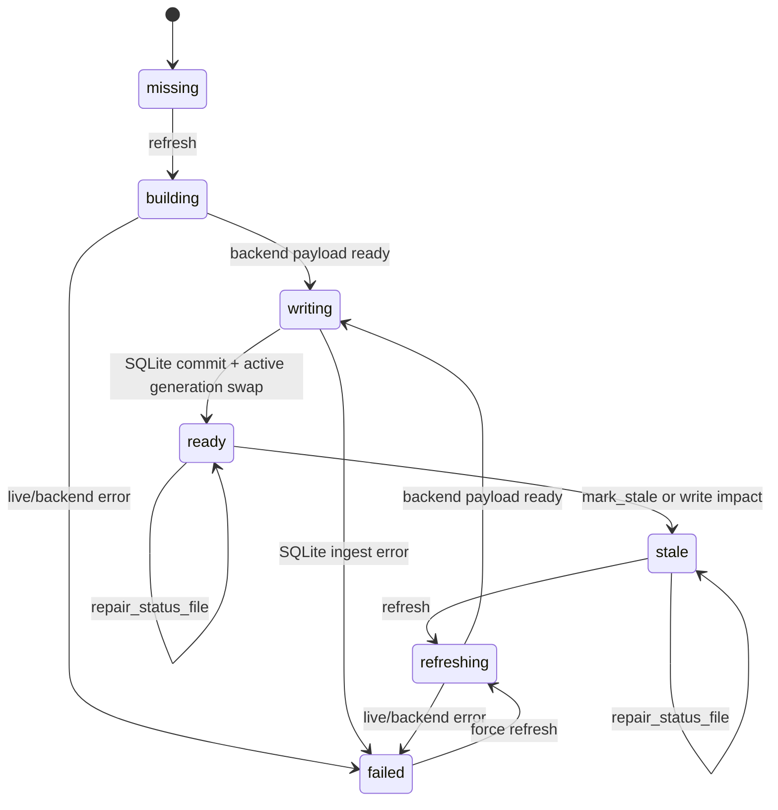

# ASCET Index Tools Implementation Plan

Date: 2026-07-28

Scope: `packages/ascet-extension`

## 1. Objective

Add a canonical `ascet_index` tool for maintaining the ASCET SQLite search index.

This tool is not a replacement for `ascet_search`, `ascet_read`, or `ascet_edit`.
It is the lifecycle and maintenance surface for the index:

- inspect index readiness and per-area state;
- refresh one or more selected index areas;
- mark index areas stale after external or known writes;
- repair the footer status file from SQLite when UI status drifts;
- run local health checks for the SQLite index and search tools.

The important split is:

| Surface | Responsibility |
|---|---|
| `ascet_search` | Query indexed ASCET quick-search data. |
| `ascet_read` | Live exact reads from ASCET. |
| `ascet_edit` | Controlled live writes and readback. |
| `ascet_scheduler_status` | Observe the serial live ToolAPI scheduler. |
| `ascet_index` | Maintain SQLite index lifecycle and status. |

## 2. Current Baseline

The extension already has most low-level primitives:

- `ensureAscetSearchIndex({ partition, forceRefresh, componentPath, includeTextCode, scheduler })`
- `scheduleAscetSearchIndexBackgroundRefresh(...)`
- `getAscetSqliteIndexStatus(cwd)`
- `markAscetSqliteIndexAreasStale(cwd, areas, reason)`
- `.ascet/index/status.json` footer sidecar
- SQLite reader pool for concurrent local search reads
- write impact hooks in `edit/common.ts`

The missing piece is a public, agent-safe tool contract around those primitives.

Do not expose raw `warm_search_index` as the long-term agent contract. It is a backend command. Agents need validation, area mapping, scheduler-safe execution, compact status output, and recovery hints.

## 3. Hard Constraints

- Live ASCET ToolAPI access remains serial-only.
- SQLite reads may be concurrent.
- SQLite writes must use a single writer transaction.
- `ascet_index.refresh` must route live refresh through `ctx.scheduler`.
- `ascet_index.status`, `mark_stale`, `repair_status_file`, and local `evaluate` must not consume the live scheduler.
- Never read quick-search result windows or Win32 controls.
- Do not use polling to detect manual ASCET UI edits.
- Keep `ascet_search` result contracts unchanged except for using improved freshness metadata.
- Keep hidden/internal actions hidden. Do not re-expose `search_occurrences` or raw warmup commands.

## 4. Public Tool Contract

Tool name: `ascet_index`

Use when:

- user asks why the footer says `checking`, `stale`, or wrong document count;
- user asks to rebuild or refresh search index data;
- a write action needs explicit post-write index repair;
- agent needs to know whether a search result is fresh enough;
- testing or diagnostics need per-area counts and elapsed times.

Do not use when:

- user wants to search for a component, element, reference, method, message, or code text. Use `ascet_search`.
- user wants the actual current code or element details. Use `ascet_read`.
- user wants to modify ASCET data. Use `ascet_edit`.

### 4.1 Schema

Use an action-specific discriminated union, not one large optional object.

```ts
type AscetIndexParams =
  | AscetIndexStatusParams
  | AscetIndexRefreshParams
  | AscetIndexMarkStaleParams
  | AscetIndexRepairStatusFileParams
  | AscetIndexEvaluateParams;

type AscetIndexArea =
  | "p0"
  | "components"
  | "tree"
  | "elements"
  | "methods"
  | "refs"
  | "code"
  | "messages"
  | "project";

interface AscetIndexStatusParams {
  action: "status";
  detailLevel?: "summary" | "areas" | "full";
  includeScheduler?: boolean;
}

interface AscetIndexRefreshParams {
  action: "refresh";
  areas: AscetIndexArea[];
  componentPath?: string;
  force?: boolean;
  mode?: "foreground" | "background";
  wait?: boolean;
  reason?: string;
}

interface AscetIndexMarkStaleParams {
  action: "mark_stale";
  areas: AscetIndexArea[];
  reason: string;
}

interface AscetIndexRepairStatusFileParams {
  action: "repair_status_file";
  reason?: string;
}

interface AscetIndexEvaluateParams {
  action: "evaluate";
  checks?: Array<"status" | "counts" | "search_smoke" | "sidecar">;
  live?: boolean;
  query?: string;
  componentPath?: string;
}
```

### 4.2 Area Mapping

Agent-facing area names must map to current internal partitions and SQLite areas.

| Public area | Internal refresh partition | SQLite areas |
|---|---|---|
| `p0` | `p0` | all P0 SQLite areas |
| `components` | `components` | `components` |
| `tree` | `p0` initially | `folders`, `folder_items`, `components` |
| `elements` | `element_decls` | `elements` |
| `methods` | `method_decls` | `methods` |
| `refs` | `component_refs`, `element_refs` | `component_refs`, `element_refs`, `dbitem_dependencies` |
| `code` | `text_code` | `code_blocks`, `code_terms` |
| `messages` | `messages` | `messages` |
| `project` | `p0` initially | `project_items`, `project_formulas` |

Coalescing rules:

- `["p0", ...]` becomes one `p0` refresh.
- `["tree", "project"]` becomes one `p0` refresh until dedicated backend partitions exist.
- `["elements", "code"]` becomes `element_decls` plus `text_code`.
- `["refs"]` becomes `component_refs` plus `element_refs`; `dbitem_dependencies` is refreshed by `p0` until a dedicated partition exists.
- Duplicate public areas and partitions are removed before scheduling.

### 4.3 P0 Index Scope

The optimized default is a complete P0 build. Do not split text/code into a delayed P0B unless live measurements regress badly.

P0 should build these SQLite areas in one serial live refresh:

| Area | Source API / backend route | Primary search use |
|---|---|---|
| `components` | `GetAllComponentsOfType(...)` | `search_components`, `resolve_component` |
| `folders` | `GetAllAscetFolders`, `GetAllAscetSubFolders` | database navigation |
| `folder_items` | `folder.GetAllDataBaseItems()` | folder-to-item mapping |
| `elements` | `component.GetAllModelElements()` + `GetName()` + `GetScope()` + `.NET GetType().Name` | `declarations_of_element`, message sender/receiver classification |
| `methods` | `GetAllDiagrams()` + `GetAllMethods/GetAllProcesses/GetAllTriggers` | `declarations_of_method_process` |
| `project_items` | project/global getters | project overview |
| `project_formulas` | formula/global getters | `search_project_formulas` |
| `component_refs` | `component.GetAllReferencedModelElements()` + `GetRepresentedClass()` | `references_to_component` |
| `element_refs` | represented element reference rows from the same pass | `references_to_element` coarse layer |
| `messages` | element runtime type + message flags | `senders_of_message`, `receivers_of_message` |
| `dbitem_dependencies` | `GetAllReferecedDataBaseItems()` | dependency graph and impact analysis |
| `code_blocks` | method/process/module/state-machine code readers | `text_in_code`, ref approximation |
| `code_terms` | tokenized `code_blocks` | fast text/code candidate lookup |

`method_process_elements` is intentionally excluded from P0. `GetAllModelElements()` already covers global component-level element declarations. Method/process argument/local elements can be added later as a deep-read index if a concrete search action needs them.

### 4.4 SQLite Data Model

The index should be stored as a generation-based SQLite database. Search reads always target the active generation.

Core tables:

| Table | Minimum fields | Notes |
|---|---|---|
| `index_meta` | `schemaVersion`, `databaseId`, `apiVersion`, `activeGeneration`, `createdAt` | one current metadata row |
| `index_generations` | `generation`, `state`, `startedAt`, `completedAt`, `elapsedMs`, `source` | keep previous ready generation until a new one commits |
| `index_areas` | `generation`, `area`, `state`, `itemCount`, `elapsedMs`, `errorCode`, `errorMessage` | drives footer/status lamp |
| `ascet_components` | `generation`, `name`, `path`, `kind`, `languageKind`, `parentPath` | component identity and browse entry |
| `ascet_folders` | `generation`, `path`, `name`, `parentPath` | folder tree |
| `ascet_folder_items` | `generation`, `folderPath`, `itemName`, `itemPath`, `itemKind` | reverse folder lookup |
| `ascet_elements` | `generation`, `name`, `componentPath`, `runtimeType`, `scope` | no redundant `componentPath::elementName` path field |
| `ascet_methods` | `generation`, `name`, `componentPath`, `kind`, `diagramName` | method/process/trigger declarations |
| `ascet_project_items` | `generation`, `name`, `path`, `parentPath`, `kind` | globals/modules/tasks/formulas summary |
| `ascet_element_refs` | `generation`, `sourceComponentPath`, `targetName`, `targetComponentPath`, `targetKind`, `scope` | reference candidate rows |
| `ascet_dbitem_dependencies` | `generation`, `sourcePath`, `targetPath`, `dependencyKind` | database-item graph |
| `ascet_code_blocks` | `generation`, `blockId`, `componentPath`, `ownerName`, `ownerKind`, `section`, `language`, `text` | full text blocks for snippets |
| `ascet_code_terms` | `generation`, `term`, `blockId`, `line`, `column` | fast token lookup |
| `ascet_search_documents` | `generation`, `docType`, `name`, `componentPath`, `payloadJson`, `rankText` | optional unified search surface |

Recommended indexes:

```sql
create index if not exists idx_components_name on ascet_components(generation, name);
create index if not exists idx_elements_name on ascet_elements(generation, name);
create index if not exists idx_methods_name on ascet_methods(generation, name);
create index if not exists idx_refs_target on ascet_element_refs(generation, targetName);
create index if not exists idx_code_terms_term on ascet_code_terms(generation, term);
create index if not exists idx_dbdeps_source on ascet_dbitem_dependencies(generation, sourcePath);
create index if not exists idx_dbdeps_target on ascet_dbitem_dependencies(generation, targetPath);
```

Do not persist display-only pseudo paths such as:

```text
PlatformLibrary/.../AEB_CoreParameter::P_AEB_IB_MaxVelocityDrop_Curve
```

Store `componentPath` and `name` separately, and format display strings at the UI/tool boundary.

## 5. Output Contracts

Successful responses return compact business JSON. Avoid `ok: true`, `error: null`, and repeated input echoes.

### 5.1 Status Summary

```json
{
  "state": "ready",
  "storage": "sqlite",
  "totalDocs": 6258,
  "generatedAt": "2026-07-28T10:12:44.000Z",
  "elapsedMs": 13142,
  "areas": [
    { "name": "components", "state": "ready", "count": 141 },
    { "name": "elements", "state": "ready", "count": 1835 },
    { "name": "methods", "state": "ready", "count": 293 },
    { "name": "code_terms", "state": "ready", "count": 2778 }
  ],
  "footer": {
    "inSync": true,
    "state": "ready",
    "totalDocs": 6258
  }
}
```

`detailLevel="summary"` returns state, storage, totalDocs, stale area count, and footer sync only.

`detailLevel="areas"` includes per-area status and counts.

`detailLevel="full"` additionally includes run id, schema version, database path, errors, scheduler snapshot when requested, and status-file path.

### 5.2 Refresh Foreground

```json
{
  "state": "ready",
  "mode": "foreground",
  "requestedAreas": ["elements", "code"],
  "effectivePartitions": ["element_decls", "text_code"],
  "counts": {
    "elements": 1835,
    "code_blocks": 159,
    "code_terms": 2778
  },
  "elapsedMs": 4210,
  "fromCache": false
}
```

### 5.3 Refresh Background

```json
{
  "state": "refreshing",
  "mode": "background",
  "requestedAreas": ["p0"],
  "effectivePartitions": ["p0"],
  "queued": true,
  "jobs": [
    {
      "toolName": "ascet_index_refresh",
      "commandId": "warm_search_index",
      "kind": "read"
    }
  ]
}
```

### 5.4 Mark Stale

```json
{
  "state": "stale",
  "areas": ["elements", "element_refs", "code_blocks", "code_terms"],
  "reason": "external_edit:user_confirmed"
}
```

### 5.5 Repair Status File

```json
{
  "state": "ready",
  "repaired": true,
  "source": "sqlite",
  "footer": {
    "inSync": true,
    "totalDocs": 6258
  }
}
```

### 5.6 Error Shape

```json
{
  "error": {
    "code": "indexRefreshFailed",
    "message": "ASCET index refresh failed while building text_code.",
    "recover": {
      "nextAction": "ascet_index",
      "params": {
        "action": "status",
        "detailLevel": "full",
        "includeScheduler": true
      }
    }
  }
}
```

## 6. Lifecycle State Machine



Failure policy:

- Keep the previous active SQLite generation if a refresh fails.
- Mark only affected areas failed/stale.
- Do not overwrite a complete SQLite generation with a partial local warmup.
- `repair_status_file` may rewrite `.ascet/index/status.json` from SQLite, but it must not mutate ASCET or rebuild live data.

## 7. Startup and Footer Status

The footer status lamp reads `.ascet/index/status.json`.

Rules:

- Extension startup writes `checking` only while it is actually checking.
- If SQLite active generation is ready, startup should mirror SQLite into the sidecar quickly.
- A non-`p0` or component-scoped warmup must not set global footer totalDocs.
- Partial local warmups must not produce misleading strings such as `ready 3 docs` when SQLite contains thousands of documents.
- `ascet_index.repair_status_file` is the manual recovery path for sidecar drift.

Recommended footer labels:

| State | Footer text |
|---|---|
| `checking` | `ASCET index: checking` |
| `building` | `ASCET index: building <area>` |
| `refreshing` | `ASCET index: refreshing <area>` |
| `ready` | `ASCET index: ready <totalDocs> docs <elapsedMs>ms` |
| `stale` | `ASCET index: stale <n> areas` |
| `failed` | `ASCET index: failed <code>` |
| `disabled` | `ASCET index: disabled` |

## 8. Scheduler Integration

All live refreshes go through the serial scheduler.

`ascet_index.refresh` should call:

```ts
await ensureAscetSearchIndex({
  cwd: ctx.cwd,
  env: ctx.env,
  signal,
  scheduler: ctx.scheduler,
  partition,
  componentPath,
  forceRefresh: force,
  includeTextCode,
  toolName: "ascet_index_refresh",
  timeoutMs,
  scanTimeoutMs
});
```

Scheduler metadata:

```ts
{
  toolName: "ascet_index_refresh",
  commandId: "warm_search_index",
  jobKind: "read",
  resource: "ascet.toolapi.global"
}
```

Foreground mode waits for completion and returns counts.

Background mode schedules the job, writes status file state `refreshing`, and returns queue metadata.

If another refresh is already in flight for the same effective partition set, return the existing job snapshot instead of submitting duplicates.

## 9. SQLite Concurrency Model

Search tools should be optimized for concurrent reads because they are not live ASCET operations.

Rules:

- Use the existing SQLite reader pool for `ascet_search` queries.
- Use WAL mode and read-only connections for search.
- `ascet_index.status` uses a short read-only connection.
- `ascet_index.mark_stale` and SQLite ingest use a writer connection with `begin immediate`.
- Never run two live ToolAPI refreshes concurrently.
- Never run two SQLite ingests concurrently for the same active generation.

Expected behavior:

- Many agents can call `ascet_search` concurrently with millisecond latency.
- A refresh can run in the background while existing active-generation reads continue.
- The new generation becomes visible only after the staging ingest completes and active generation switches.

## 10. Write Impact Integration

`ascet_edit` remains the write surface. `ascet_index` provides the maintenance primitives that write impact can reuse.

Current write impact should be normalized to these index actions:

| Write action | Required index handling |
|---|---|
| `set_method_code` | Refresh or stale `elements`, `refs`, `code`, `messages`. |
| `set_module_code` | Refresh or stale `elements`, `refs`, `code`, `messages`. |
| `set_state_machine_code` | Refresh or stale `elements`, `refs`, `code`, `messages`. |
| `apply_element_spec` | Refresh or stale `elements`, `refs`, `code`. |
| `set_element_dependency` | Refresh complete affected `elements`, `refs`, `code` data and memory cache, not just stale flags. |
| `set_enumerators` | Refresh or stale `elements`, `refs`. |
| `create_method` | Refresh or stale `methods`, `elements`, `code`. |
| `delete_method` | Refresh or stale `methods`, `elements`, `refs`, `code`. |
| `create_component` | Refresh or stale `p0`. |
| `delete_component` | Refresh or stale `p0`. |
| `apply_project_formula` | Refresh or stale `project`; use `p0` until project has a dedicated partition. |

### 10.1 `set_element_dependency`

This action is special because a stale marker is not enough.

After a successful executed `set_element_dependency`:

1. Run targeted live readback to confirm the dependency flag/formula.
2. Refresh the affected element catalog and in-memory declaration/full-element cache.
3. Refresh or rebuild SQLite areas that can be affected:
   - `elements`
   - `component_refs`
   - `element_refs`
   - `dbitem_dependencies`
   - `code_blocks`
   - `code_terms` if formulas or generated code text can change search terms
4. Return index impact in the edit result.
5. If refresh fails, keep the write result successful but include `index.issues`.

Example edit result fragment:

```json
{
  "changed": true,
  "readback": { "status": "verified" },
  "index": {
    "state": "refreshed",
    "areas": ["elements", "component_refs", "element_refs", "dbitem_dependencies"],
    "issues": []
  }
}
```

## 11. Implementation Files

Create a new tool folder. Do not use `src/tools/index/` because `src/tools/index.ts` already exists and Windows path resolution can make that confusing.

```text
packages/ascet-extension/src/tools/ascet-index/
  definition.ts
  schema.ts
  prompt.ts
  ui.ts
  manifest.ts
  index.ts
  schema.test.ts
  definition.test.ts
```

Create an internal maintainer module:

```text
packages/ascet-extension/src/index-maintainer/
  area-mapping.ts
  status.ts
  refresh.ts
  stale.ts
  repair-status-file.ts
  evaluate.ts
  types.ts
  index.ts
  area-mapping.test.ts
  status.test.ts
  refresh.test.ts
```

Modify existing integration points:

```text
packages/ascet-extension/src/tools/registry.ts
packages/ascet-extension/src/tools/index.ts
packages/ascet-extension/src/tools/exposure/profiles.ts
packages/ascet-extension/src/tools/exposure/profiled-tools.ts
packages/ascet-extension/src/tools/actions/descriptors.ts
packages/ascet-extension/src/tools/actions/gates.ts
packages/ascet-extension/src/routing/route-manifests.ts
packages/ascet-extension/src/search-index.ts
packages/ascet-extension/src/search-index-sqlite/status.ts
packages/ascet-extension/src/search-index-sqlite/status-file.ts
packages/ascet-extension/src/edit/common.ts
```

## 12. Implementation Steps

### Phase 1: Index Maintainer Core

Tasks:

- Add `AscetIndexArea`, `AscetIndexAction`, and result types.
- Implement `normalizeIndexAreas()`.
- Implement public-area to partition/SQLite-area mapping.
- Implement coalescing rules.
- Implement `readIndexStatus({ detailLevel, includeScheduler })`.
- Implement `repairStatusFileFromSqlite(cwd)`.
- Add unit tests for all mapping and status cases.

Acceptance:

- `elements` maps to `element_decls` and SQLite `elements`.
- `code` maps to `text_code` and SQLite `code_blocks`, `code_terms`.
- `p0` suppresses all other requested areas.
- Status can detect sidecar mismatch without live ASCET.

### Phase 2: Public `ascet_index` Tool

Tasks:

- Add schema discriminated union.
- Add prompt guidelines explaining when to use this tool versus search/read/edit.
- Add UI formatter consistent with other ASCET tools.
- Register in canonical tool registry.
- Add action descriptors and profile exposure.
- Keep it visible in ops/default profiles if token budget allows; otherwise expose through capabilities.

Acceptance:

- Tool appears as `ascet_index`.
- Hidden backend commands remain hidden.
- Schema rejects unrelated fields per action.
- Tool response is compact and agent-friendly.

### Phase 3: Refresh Execution

Tasks:

- Implement foreground refresh via `ensureAscetSearchIndex`.
- Implement background refresh via `scheduleAscetSearchIndexBackgroundRefresh` for `p0`.
- Add multi-area refresh planner.
- For multiple effective partitions, submit sequential scheduler jobs.
- Collapse duplicate/in-flight refreshes.
- Return scheduler metadata for queued jobs.

Acceptance:

- `ascet_index.refresh(["elements"])` calls `warm_search_index --partition element_decls --force --json`.
- `ascet_index.refresh(["code"])` calls `warm_search_index --partition text_code --force --include-text-code --json`.
- `ascet_index.refresh(["p0"])` calls one P0 refresh with text code included.
- Refreshes use `ctx.scheduler`.
- No live ToolAPI calls are concurrent.

### Phase 4: Stale Marking and Status Repair

Tasks:

- Implement `mark_stale` using SQLite stale-area mapping.
- Ensure `.ascet/index/status.json` is updated with stale areas.
- Implement `repair_status_file` from active SQLite run.
- Add recovery hints for missing SQLite and schema mismatch.

Acceptance:

- `mark_stale(["code"])` marks `code_blocks` and `code_terms`.
- `mark_stale(["refs"])` marks `component_refs`, `element_refs`, and `dbitem_dependencies` where supported.
- `repair_status_file` turns footer `ready 3 docs` into SQLite truth when SQLite is complete.
- No live ASCET command runs for either action.

### Phase 5: Edit Hook Upgrade

Tasks:

- Replace direct write-impact stale logic with maintainer helper where possible.
- Keep current background refresh behavior as the default for normal code writes.
- Add targeted complete-refresh path for `set_element_dependency`.
- Ensure edit result includes compact `index` outcome.

Acceptance:

- Successful `set_method_code` stales/refreshes `elements`, `refs`, and `code`.
- Successful `set_module_code` and `set_state_machine_code` use the same mapping.
- Successful `set_element_dependency` refreshes affected index data and memory cache.
- Dry-run/preflight-only writes do not mark or refresh index.
- Failed writes do not mutate index state.

### Phase 6: Evaluation and Regression Coverage

Tasks:

- Add local evaluate checks:
  - SQLite active run exists;
  - schema version matches;
  - required P0 areas are present;
  - footer status matches SQLite;
  - basic search smoke can query SQLite.
- Optional `live=true` check runs one scheduler-backed small refresh.
- Add benchmark logging with separate wall, scheduler wait, CLI elapsed, SQLite ingest, and query latency.

Acceptance:

- `ascet_index.evaluate({ live:false })` is safe on developer machines without touching ASCET.
- `ascet_index.evaluate({ live:true })` uses scheduler and bounded timeouts.
- Output distinguishes measured production time from backend collection-only time.

## 13. Tests

### Unit Tests

```text
src/index-maintainer/area-mapping.test.ts
src/index-maintainer/status.test.ts
src/index-maintainer/repair-status-file.test.ts
src/tools/ascet-index/schema.test.ts
src/tools/ascet-index/definition.test.ts
```

Required cases:

- area mapping and coalescing;
- invalid area rejection;
- status missing database;
- status ready/stale/failed formatting;
- footer mismatch detection;
- repair status file from SQLite;
- mark stale does not throw when SQLite is missing;
- schema action-specific validation;
- prompt does not encourage raw `warm_search_index`.

### Integration Tests

Add tests near existing search-index and edit-impact tests:

```text
src/search-index.test.ts
src/search-index-sqlite.test.ts
src/edit/service-impact.test.ts
src/tools/registry.test.ts
src/tools/exposure/controller.test.ts
```

Required cases:

- `ascet_index.status` reads SQLite without invoking CLI.
- `ascet_index.refresh(elements)` invokes one scheduler read job.
- `ascet_index.refresh(elements, code)` invokes sequential scheduler jobs or one coalesced job when supported.
- `ascet_index.refresh(p0)` writes global sidecar counts only after P0 ingest.
- `ascet_index.mark_stale(code)` updates SQLite and sidecar.
- `ascet_index.repair_status_file` fixes stale/wrong footer totals.
- registry exposes `ascet_index` but not backend `warm_search_index`.
- write impact calls maintainer mapping.
- `set_element_dependency` refresh path updates affected cache/index and reports issues on refresh failure.

### Live Smoke

Run only in isolated PI launch/session.

Commands/actions:

1. `ascet_index({ action: "status", detailLevel: "areas" })`
2. `ascet_index({ action: "refresh", areas: ["elements"], mode: "foreground", force: true })`
3. `ascet_search({ action: "declarations_of_element", query: "P_AEB_IB_MaxVelocityDrop_Curve", match: "exact" })`
4. `ascet_index({ action: "refresh", areas: ["code"], mode: "foreground", force: true })`
5. `ascet_search({ action: "text_in_code", query: "AEB_v_Init", limit: 5 })`
6. `ascet_index({ action: "mark_stale", areas: ["code"], reason: "live_smoke" })`
7. `ascet_index({ action: "repair_status_file" })`
8. `ascet_scheduler_status` confirms scheduler idle.

Acceptance:

- Search latencies stay in SQLite-read range after warmup.
- Refresh jobs are serial.
- Footer moves through checking/building/refreshing/ready/stale correctly.
- No `ready 3 docs` footer when SQLite has a complete active generation.
- Status reports per-area counts.

## 14. Performance and Measurement

Report separate timings:

| Measurement | Meaning |
|---|---|
| scheduler wait | Time waiting for the serial live scheduler. |
| CLI wall | Total backend command wall time. |
| backend collection | Time inside ASCET ToolAPI collection. |
| SQLite ingest | Staging write and active generation swap. |
| status read | Time to read SQLite status. |
| search query | Time for one indexed search action. |

Do not compare raw `warm_search_index` collection numbers to production startup without labeling the difference.

Target behavior:

- Indexed search actions should stay in milliseconds for normal limits.
- `status` should be local and fast when SQLite exists.
- Live refresh time depends on ASCET database size and selected areas.
- Production default remains serial live refresh for reliability.

## 14.1 Search Tool Consumption Matrix

`ascet_search` should remain the user-facing query tool. It reads SQLite and only falls back to live ASCET when the requested data is missing and the action explicitly allows a live path.

| `ascet_search` action | Primary SQLite tables | Return shape |
|---|---|---|
| `search_components` | `ascet_components` | component name/path/kind/language/parent |
| `resolve_component` | `ascet_components` | exact component match plus ambiguity metadata |
| `declarations_of_element` | `ascet_elements` | element name, componentPath, runtimeType, scope |
| `declarations_of_method_process` | `ascet_methods` | name, componentPath, kind, diagramName |
| `references_to_component` | `ascet_element_refs`, `ascet_dbitem_dependencies` | source component/item, target component, reference kind |
| `references_to_element` | `ascet_element_refs`, `ascet_code_terms`, `ascet_code_blocks` | structured ref candidates plus code snippets |
| `text_in_code` | `ascet_code_terms`, `ascet_code_blocks` | componentPath, ownerName, section, line, snippet |
| `senders_of_message` | `ascet_elements`, `ascet_code_terms` | message element rows and optional code evidence |
| `receivers_of_message` | `ascet_elements`, `ascet_code_terms` | message element rows and optional code evidence |
| `search_project_formulas` | `ascet_project_items`, `ascet_code_blocks` where applicable | formula/global name and owning project path |

All results should include:

```json
{
  "source": "quick_search_index",
  "indexStatus": "ready",
  "items": []
}
```

When an area is stale, return the available indexed result plus a freshness warning. Do not silently run a broad live scan.

## 14.2 Refresh Trigger Policy

Refresh is triggered by explicit index actions and by known write impact. Manual ASCET UI edits cannot be detected reliably by polling ToolAPI, so they require an explicit stale/refresh action.

| Event | Index behavior |
|---|---|
| Extension startup with valid SQLite | mirror SQLite status to footer; no live scan |
| Extension startup with missing/expired SQLite | schedule `ascet.index.p0` through serial scheduler |
| User asks for fresh all-index data | `ascet_index.refresh({ areas:["p0"], force:true, wait:true })` |
| User edited ASCET manually | `ascet_index.mark_stale(...)`, then refresh requested areas |
| Successful `ascet_edit` code write | refresh/stale `elements`, `refs`, `code`, `messages` |
| Successful `set_element_dependency` | readback, then refresh affected `elements`, `refs`, `code`, cache |
| Footer shows wrong count | `ascet_index.status`, then `repair_status_file` if SQLite is ready |
| Refresh failed | keep previous active generation and mark affected areas failed/stale |

Default startup should prefer:

```text
status check -> SQLite ready? -> footer ready
             -> missing/stale? -> serial P0 refresh
```

This replaces a pure ASCET status probe. The visible footer should reflect index lifecycle, not only ToolAPI connectivity.

## 15. Agent Guidance Text

Add concise prompt guidance:

```text
Use ascet_index only to inspect or maintain the SQLite ASCET search index.
Use ascet_search to find components, declarations, references, messages, and text snippets.
Use ascet_read for exact live ASCET reads.
Use ascet_edit for writes; successful writes update or stale affected index areas.
For stale or wrong footer state, call ascet_index action=status, then repair_status_file if SQLite is ready.
For external manual edits in ASCET UI, call ascet_index mark_stale with the affected areas, or refresh when the user asks for current data.
```

## 16. Definition of Done

The implementation is complete when:

- `ascet_index` is a public canonical ASCET tool.
- It supports `status`, `refresh`, `mark_stale`, `repair_status_file`, and `evaluate`.
- It never exposes raw `warm_search_index` to agents.
- Live refreshes are scheduler-backed and serial.
- Local status/stale/repair/evaluate do not use live ASCET.
- SQLite reads remain concurrent for search tools.
- Footer state and SQLite active generation stay in sync.
- Write impact uses the same area mapping as `ascet_index`.
- `set_element_dependency` refreshes complete affected index/cache data after successful writes.
- Unit, integration, and live smoke tests cover lifecycle, scheduler behavior, status lamp behavior, and write-after-refresh behavior.
