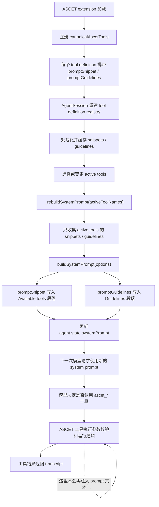

# ASCET Tools Prompt 注入时机分析

## 分析范围

本文分析 PI 运行时中 ASCET 工具提示词进入模型可见 prompt 的准确时机。

这里的 ASCET tool prompt 主要指工具定义中的两个字段：

- `promptSnippet`
- `promptGuidelines`

对应源码主要分布在：

- `packages/ascet-extension/src/tools/*/prompt.ts`
- `packages/ascet-extension/src/tools/_shared/action-examples.ts`

## 简短结论

ASCET tool prompt 不是在工具执行时临时注入的。

它的真实注入链路是：

1. ASCET extension 启动时注册 canonical ASCET tools。
2. PI 收集每个工具定义里的 `promptSnippet` 和 `promptGuidelines`。
3. 当 active tools 被设置或重建时，PI 重建 base system prompt。
4. `promptSnippet` 被放进 system prompt 的 `Available tools` 段落。
5. `promptGuidelines` 被放进 system prompt 的 `Guidelines` 段落。
6. 下一次模型请求会看到更新后的 system prompt。
7. 实际调用 `ascet_*` 工具时，只执行工具逻辑并返回 tool result，不会再额外注入这些 prompt 文本。

所以关键边界是：

```text
工具注册和 prompt 元数据收集
  -> active tools 选择
  -> system prompt 重建
  -> 下一次模型请求可见
```

而不是：

```text
调用 ascet_write / ascet_read 时才注入 prompt
```

## 总流程图



## 代码链路分析

### 1. ASCET 工具定义中携带 prompt 字段

每个 canonical ASCET tool 都会把自己的 prompt 对象展开到 tool definition 中。

例如：

`packages/ascet-extension/src/tools/write/definition.ts`

```ts
export const ascetWriteTool = defineSequentialAscetTool({
  name: "ascet_write",
  label: "ASCET write",
  description: "...",
  ...ascetWritePrompt,
  parameters: ascetWriteParameters,
  ...
});
```

其中 `ascetWritePrompt` 来自：

`packages/ascet-extension/src/tools/write/prompt.ts`

结构大致是：

```ts
export const ascetWritePrompt = {
  promptSnippet: "Prepare or confirm one ASCET write action...",
  promptGuidelines: [
    "By default this tool returns a non-error preflight outcome and does not write.",
    ...
  ],
} as const;
```

这里还只是 tool definition 的静态元数据。模型此时还看不到这些内容。

### 2. ASCET extension 启动时注册工具

`packages/ascet-extension/src/index.ts`

```ts
for (const tool of canonicalAscetTools) {
  pi.registerTool(tool);
}
```

这个阶段完成的是工具注册。

此时 PI 知道有这些工具，也知道这些工具带有哪些 prompt 字段，但 prompt 还没有直接进入 system prompt。

### 3. PI 在工具注册表重建时收集 prompt 元数据

`packages/coding-agent/src/core/agent-session.ts`

AgentSession 内部维护了两个 map：

```ts
private _toolPromptSnippets: Map<string, string> = new Map();
private _toolPromptGuidelines: Map<string, string[]> = new Map();
```

当 tool definition registry 重建时，PI 会从每个 tool definition 中提取并规范化 prompt 字段：

```ts
this._toolPromptSnippets = new Map(
  Array.from(definitionRegistry.values())
    .map(({ definition }) => {
      const snippet = this._normalizePromptSnippet(definition.promptSnippet);
      return snippet ? ([definition.name, snippet] as const) : undefined;
    })
    .filter((entry): entry is readonly [string, string] => entry !== undefined),
);

this._toolPromptGuidelines = new Map(
  Array.from(definitionRegistry.values())
    .map(({ definition }) => {
      const guidelines = this._normalizePromptGuidelines(definition.promptGuidelines);
      return guidelines.length > 0 ? ([definition.name, guidelines] as const) : undefined;
    })
    .filter((entry): entry is readonly [string, string[]] => entry !== undefined),
);
```

这个阶段是“收集和缓存 prompt 元数据”，仍然不是最终注入点。

### 4. active tools 变化时触发 system prompt 重建

真正的注入点在 `setActiveToolsByName()`。

`packages/coding-agent/src/core/agent-session.ts`

```ts
setActiveToolsByName(toolNames: string[]): void {
  const tools: AgentTool[] = [];
  const validToolNames: string[] = [];

  for (const name of toolNames) {
    const tool = this._toolRegistry.get(name);
    if (tool) {
      tools.push(tool);
      validToolNames.push(name);
    }
  }

  this.agent.state.tools = tools;

  this._baseSystemPrompt = this._rebuildSystemPrompt(validToolNames);
  this.agent.state.systemPrompt = this._systemPromptOverride ?? this._baseSystemPrompt;
}
```

这里有两个重要点：

- 只有 active tools 会参与 prompt 注入。
- 更新后的 prompt 从下一次 agent/model turn 开始生效。

### 5. `_rebuildSystemPrompt()` 只收集 active tools 的 prompt

`packages/coding-agent/src/core/agent-session.ts`

```ts
private _rebuildSystemPrompt(toolNames: string[]): string {
  const validToolNames = toolNames.filter((name) => this._toolRegistry.has(name));
  const toolSnippets: Record<string, string> = {};
  const promptGuidelines: string[] = [];

  for (const name of validToolNames) {
    const snippet = this._toolPromptSnippets.get(name);
    if (snippet) {
      toolSnippets[name] = snippet;
    }

    const toolGuidelines = this._toolPromptGuidelines.get(name);
    if (toolGuidelines) {
      promptGuidelines.push(...toolGuidelines);
    }
  }

  return buildSystemPrompt({
    selectedTools: validToolNames,
    toolSnippets,
    promptGuidelines,
    ...
  });
}
```

因此：

- 工具“已注册”不等于 prompt “已注入”。
- 工具必须在 active tools 里，它的 `promptSnippet` / `promptGuidelines` 才会进入 system prompt。

### 6. `buildSystemPrompt()` 把 prompt 写入 system prompt 文本

`packages/coding-agent/src/core/system-prompt.ts`

`promptSnippet` 进入 `Available tools`：

```ts
const visibleTools = tools.filter((name) => !!toolSnippets?.[name]);
const toolsList =
  visibleTools.length > 0
    ? visibleTools.map((name) => `- ${name}: ${toolSnippets![name]}`).join("\n")
    : "(none)";
```

`promptGuidelines` 进入 `Guidelines`：

```ts
for (const guideline of promptGuidelines ?? []) {
  const normalized = guideline.trim();
  if (normalized.length > 0) {
    addGuideline(normalized);
  }
}
```

最终 system prompt 中会出现类似内容：

```text
Available tools:
- ascet_write: Prepare or confirm one ASCET write action such as create, delete, set code, or apply spec.

Guidelines:
- By default this tool returns a non-error preflight outcome and does not write.
- Use `intent="apply"` only when the user explicitly asks to apply the write; PI performs preflight, optional confirmation, mutation, and readback in the same call.
- ...
```

这一步才是 prompt 文本真正进入模型可见 system prompt 的地方。

## 注入时机矩阵

| 时机 | 发生的事情 | 模型是否立刻可见 |
| --- | --- | --- |
| import `prompt.ts` | JS 模块加载 prompt 对象 | 否 |
| `pi.registerTool(tool)` | 扩展注册 tool definition | 否 |
| tool registry rebuild | PI 收集并缓存 `promptSnippet` / `promptGuidelines` | 否 |
| `setActiveToolsByName()` | active tools 被设置，base system prompt 被重建 | 下一 turn 可见 |
| `buildSystemPrompt()` | snippets/guidelines 被渲染进 system prompt | 是 |
| 下一次模型请求 | provider 收到带 ASCET prompt 的 system prompt | 是 |
| `ascet_*` 工具执行 | 工具参数校验、调用 ASCET CLI/ToolAPI、返回结果 | 不新增 prompt |
| active tools 中途变化 | system prompt 再次重建 | 下一 turn 可见 |
| extension reload | 工具注册表和 prompt map 重建 | 取决于 active tools，下一 turn 可见 |

## 对 ASCET prompt 优化的影响

### 1. prompt 预算由 active tools 决定

如果很多 ASCET tools 同时 active，那么这些工具的 `promptGuidelines` 会一起进入 system prompt。

当前最重的是 `ascet_write`，因为它包含：

- 写入安全规则
- `create_method` / `set_method_signature` 规则
- `apply_element_spec` 规则
- imported/exported/local parameter 规则
- dependency chain 规则
- state machine / module code 路由规则
- compact examples

所以优化 prompt 时，应优先压缩 `ascet_write`。

### 2. prompt 指导模型规划，但不能替代运行时安全

`promptGuidelines` 只能影响模型如何选择工具和构造参数。

真正的安全约束必须放在：

- schema
- `prepareArguments`
- runtime validation
- preflight
- interactive confirmation
- readback verification

例如 `ascet_edit` 不能只靠 prompt 告诉模型“不要直接写”，还必须由工具逻辑强制 `intent`、preflight、权限评估、可选确认和 readback 来兜底。

### 3. 工具执行时不会补充 prompt

当模型已经发出：

```text
ascet_write({...})
```

此时进入的是工具执行阶段。工具只接收参数和 runtime context，不会再把 `ascetWritePrompt.promptGuidelines` 追加给模型。

因此 prompt 必须在模型决定调用工具之前就已经注入。

## 建议的优化方向

1. 保持 `promptSnippet` 很短
   因为它出现在 `Available tools`，主要作用是帮助模型快速识别工具用途。

2. 压缩每个 tool 的 `promptGuidelines`
   只保留本工具的边界、路由和最高风险误用点。

3. 把跨工具通用规则抽到共享层
   比如：
   - runtime 不确定先 `ascet_status`
   - 路径不明确先 `ascet_search` / `ascet_explore`
   - 写入默认 preflight
   - 写后必须 readback/verify

4. 保持 examples 短小
   `action-examples.ts` 里的 example 应展示“最短合法调用”，不要展示完整业务案例。

5. 增加测试护栏
   建议测试：
   - 单个 guideline 最大长度
   - 单个 tool prompt 总字符数
   - active tools 变化后 system prompt 是否包含对应 snippets/guidelines
   - inactive tool 的 prompt 不应进入 system prompt

## 总结

ASCET tools prompt 的注入时机是：

```text
active tools 被设置或重建时
  -> AgentSession 调用 _rebuildSystemPrompt()
  -> buildSystemPrompt() 把 snippets/guidelines 写入 system prompt
  -> 下一次模型请求看到这些内容
```

不是：

```text
ASCET 工具执行时才注入
```

这意味着 ASCET prompt 优化应该关注 system prompt 的 active-tool 预算，而运行时安全应该继续由 schema、preflight、确认和 readback 来保证。
